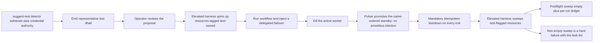

# Phase 31: Test-topology DSL + suggest-test + elevated harness

**Status**: Authoritative source
**Supersedes**: N/A
**Referenced by**: DEVELOPMENT_PLAN/README.md, DEVELOPMENT_PLAN/overview.md, DEVELOPMENT_PLAN/phase_30_provider_clusters.md
**Generated sections**: none

> **Purpose**: Deliver amoebius testing as a self-tearing-down `.dhall` topology — the always-teardown
> test-topology type, the `suggest-test` generator, flagged test credentials, and the elevated harness as the
> sole deleter of test-flagged durable storage — gated live by a generated, reviewed test that runs a
> delegated-failover simulation on one named substrate and tears down leak-free.

---

## Phase Status

📋 Planned. Nothing in this phase is implemented; every sprint below is 📋 Planned and every prescriptive
statement is design intent, never a tested amoebius result. The phase's substrate is **per generated test**:
each emitted test `.dhall` is substrate-locked to exactly one of `apple` | `linux-cuda` | `linux-cpu` |
`windows` and carries no substrate-conditional branching, so the phase picks no single global substrate —
the canonical gate run below is exercised on **linux-cpu** in **Register 3** (live infrastructure), on a
single-node `kind` cluster brought up by the Phase 13 midwife with Pulsar and MinIO already standing HA
(Phase 18) on retained storage (Phase 16). The mechanisms generalize patterns *proven in the sibling prodbox
project* — the Pulumi-orchestrated infrastructure-test rules, the `aws_admin_for_test_simulation`
flagged-credential pattern, and the postflight tag-sweep assertion; read those as **sibling evidence, not an
amoebius result** — amoebius has built none of the test machinery. Status transitions are recorded
reverse-chronologically here once work begins.

## Phase Summary

This phase makes testing a *first-class amoebius deployment* rather than a framework bolted on the side: a
test is a `.dhall` value of a topology type that spins resources up, runs a workflow, and **always** tears
them down. It delivers, on top of the live runtime landed by earlier phases, five composed pieces. The
**test-topology type** is an ordinary deployment-rules layer over a production app or platform spec, adding
exactly two things production omits — a chaos/failover schedule and a mandatory teardown — so the
always-tear-down guarantee is a property of the *type*, not of operator diligence. **`suggest-test`** detects
the current substrate (compute / memory / storage) and inspects what SSH and AWS credentials can actually do,
then writes a representative test `.dhall` sized to the detected capacity and authority; its output is a
*proposal* the operator reviews, never a self-certifying pass. **Flagged test credentials** are a distinct,
marked identity holding the elevated authority a running cluster must never hold, and every resource a
topology allocates is tagged test-owned at creation. **The elevated harness** is the *one* actor permitted to
destroy durable storage, and only storage flagged test-owned, via a flag-then-sweep cycle whose non-empty
postflight sweep is a hard failure. The **per-run ledger artifact** records which correctness layers each run
actually reached and at what strength.

The failover simulation these topologies schedule is deliberately a **delegated** failover, not a bespoke
election: the chaos schedule kills the active worker and observes a name-ordered standby take over the
Pulsar `Exclusive`/`Failover` subscription of Phase 23, while the control-plane singleton it deploys under is
a Deployment `replicas=1` whose single-instance is a k8s/etcd property (a k8s `Lease` if a hard lock is ever
needed). There is no elected singleton, no ranked-failover election, and no standby control-plane pod
anywhere in this phase — the harness only *schedules* the intra-cluster failover the earlier phases already
delegate, and tears the result down. This phase consumes and does not re-implement the live DSL deploy via
the `replicas=1` singleton (Phase 20), the native Pulsar client and Pulsar-`Failover` worker takeover
(Phases 22–23), the retained `no-provisioner` PV model (Phase 16), substrate detection (Phase 13),
Vault secret-by-name injection (Phase 17), and the leak-free provider teardown (Phase 30).

**Substrate:** per generated test — each emitted test `.dhall` is substrate-locked to exactly one substrate
with no silent fallback; the canonical Register-3 gate run is exercised on `linux-cpu`, where an intra-cluster
failover simulation needs no accelerator, while the harness itself is substrate-parametric.

**Register:** 3 — live infrastructure; the substrate is chosen per generated test (§K).

**Gate:** a generated test `.dhall` — produced by `suggest-test` and reviewed by an operator — runs a
**failover simulation** on its single named substrate (the active worker is killed and a name-ordered standby
takes over the Pulsar `Exclusive`/`Failover` subscription — single-writer delegated to Pulsar, never a
bespoke amoebius election), then **tears down leak-free**: the elevated harness's postflight sweep of
test-flagged resources is empty, teardown is idempotent on re-run, and the run emits a proven/tested/assumed
ledger recording the Runtime-layer (Inject) move as *tested on that substrate* and marking any
applicable-but-unperformed move UNVERIFIED. The run happens in Register 3 (live infrastructure).

## Doctrine adopted

- [`testing_doctrine.md §1`](../documents/engineering/testing_doctrine.md#1-a-test-is-an-amoebius-spec)
  — *a test is an amoebius spec*: a test is written in the same Dhall DSL, inherits the same
  illegal-state-unrepresentable contract, and runs the real platform, differing from a production deployment
  only by a chaos schedule and the always-teardown contract.
- [`testing_doctrine.md §3`](../documents/engineering/testing_doctrine.md#3-the-test-topology-contract-spin-up--run--always-tear-down)
  — *the test-topology contract: spin up → run → always tear down*: Sprint 31.1 realizes the four-clause
  contract — explicit visible resource ownership, teardown on every exit, idempotent destroy, and "a cleanup
  failure is a real failure" — as a property of the topology *type*.
- [`app_vs_deployment_doctrine.md §3`](../documents/engineering/app_vs_deployment_doctrine.md#3-the-deployment-rules-surface--how-the-same-app-runs)
  — *the deployment-rules surface*: the chaos/failover schedule lives on the deployment-rules layer so the app
  under test is none the wiser, keeping application logic and deployment rules separate DSL surfaces.
- [`testing_doctrine.md §5`](../documents/engineering/testing_doctrine.md#5-suggest-test-detect-the-world-emit-a-representative-test-dhall)
  — *`suggest-test`: detect the world, emit a representative test `.dhall`*: Sprint 31.2 builds the generator
  that detects substrate + inspects credential authority/quotas and emits a representative, capacity-sized
  test `.dhall`; where the doctrine's prose still says "leadership election", amoebius delegates single-instance
  to k8s/etcd and worker takeover to Pulsar, so the emitted chaos schedule injects a *delegated* failover, not
  a bespoke election.
- [`testing_doctrine.md §6`](../documents/engineering/testing_doctrine.md#6-flagged-test-credentials)
  — *flagged test credentials*: Sprint 31.3 establishes the distinct flagged test-simulation identity (the
  prodbox `aws_admin_for_test_simulation` pattern, generalized) and the test-owned tagging of every allocated
  resource, with the credential's material still a secret-by-name in Vault
  ([`vault_pki_doctrine.md §3`](../documents/engineering/vault_pki_doctrine.md#3-the-secretref-contract-a-name-never-a-value)
  — the `SecretRef` contract, a name never a value).
- [`testing_doctrine.md §7`](../documents/engineering/testing_doctrine.md#7-the-elevated-harness-is-the-sole-deleter-of-durable-storage-leak-free-cycles)
  — *the elevated harness is the sole deleter of durable storage; leak-free cycles*: Sprint 31.4 implements
  one-deleter/one-credential, flag-then-sweep, and the non-empty-postflight-sweep hard failure — the single
  sanctioned exception delegated by
  [`storage_lifecycle_doctrine.md §7.1`](../documents/engineering/storage_lifecycle_doctrine.md#71-the-single-exception-the-elevated-test-harness)
  (the single exception, the elevated test harness) to the no-normal-operation-deletion rule of that doc's §7.
- [`daemon_topology_doctrine.md §3.1`](../documents/engineering/daemon_topology_doctrine.md#31-exactly-one-pod-is-a-k8setcd-property-not-an-amoebius-election)
  and [`§5`](../documents/engineering/daemon_topology_doctrine.md#5-single-instance-and-coordination--delegated-not-elected)
  — *exactly one pod is a k8s/etcd property* / *single-instance and coordination, delegated not elected*: the
  failover the topologies inject is the Pulsar `Exclusive`/`Failover` subscription takeover, and the singleton
  they deploy under is a `replicas=1` Deployment; nothing in this phase runs an election of any kind.
- [`testing_doctrine.md §4`](../documents/engineering/testing_doctrine.md#4-no-skips-fail-fast-and-the-per-run-ledger-artifact)
  — *no skips, fail fast, and the per-run ledger artifact*: Sprint 31.5 emits the per-run
  proven/tested/assumed ledger as a first-class output beside pass/fail, fails fast on missing prerequisites,
  and records an applicable-but-unperformed move as UNVERIFIED. The ledger *grammar* — the Extract → Model →
  Inject moves and the proven/tested/assumed strengths — is owned by
  [`chaos_failover_doctrine.md §12`](../documents/engineering/chaos_failover_doctrine.md#12-the-moral-core--proven-tested-assumed)
  (the moral core) and the live-fault Inject move by
  [`§11`](../documents/engineering/chaos_failover_doctrine.md#11-move-iii--inject-break-the-running-thing-on-purpose)
  (Move III — Inject), not restated here.
- [`testing_doctrine.md §8`](../documents/engineering/testing_doctrine.md#8-one-substrate-per-validation)
  — *one substrate per validation*: every sprint's validation and the phase gate target exactly one
  substrate, named up front, with no silent fallback and no fixture standing in for a missing real input —
  the "per generated test" substrate posture of this phase.

## Sprints

## Sprint 31.1: The test-topology type — a deployment-rules layer that always tears down 📋

**Status**: Planned
**Implementation**: `src/Amoebius/Test/Topology.hs`, `dhall/test/Topology.dhall` (the `TestTopology` Dhall
type + its Haskell decoder), `src/Amoebius/Test/Runner.hs` (the structured-cleanup runner) (target paths from
[system_components.md](system_components.md); not yet built)
**Blocked by**: Phase 20 gate (the live DSL deploy via the Deployment-`replicas=1` singleton — the production
spec a test composes over); Phase 23 gate (the workflow runtime + Pulsar-`Failover` worker takeover the
schedule injects); Phase 16 / Phase 13 gates (the retained storage + cluster-lifecycle teardown the topology
drives)
**Independent Validation**: a topology whose workflow deliberately fails, and a topology aborted with SIGINT
mid-run, both still execute teardown and converge the resource set to empty; re-running a teardown after a
simulated half-run errors on nothing already-gone; a topology that mis-binds a PVC to no PV fails to
type-check before it runs.
**Docs to update**: `documents/engineering/testing_doctrine.md`, `documents/engineering/app_vs_deployment_doctrine.md`, `DEVELOPMENT_PLAN/system_components.md`, this document.

### Objective
Adopt [`testing_doctrine.md §3 — the test-topology contract: spin up → run → always tear down`](../documents/engineering/testing_doctrine.md#3-the-test-topology-contract-spin-up--run--always-tear-down)
and the framing of [`§1 — a test is an amoebius spec`](../documents/engineering/testing_doctrine.md#1-a-test-is-an-amoebius-spec):
define a `TestTopology` Dhall type that is an ordinary deployment-rules layer over a production app/platform
spec, adding exactly two things production omits — a chaos/failover schedule and a mandatory teardown — and a
Haskell runner whose structured `bracket`/`finally` cleanup makes "always tears down" a property of the type,
not of operator diligence, with the chaos injection on the deployment-rules surface so the app under test is
none the wiser ([`app_vs_deployment_doctrine.md §3`](../documents/engineering/app_vs_deployment_doctrine.md#3-the-deployment-rules-surface--how-the-same-app-runs)).

### Deliverables
- A `TestTopology` Dhall type wrapping any app/platform spec with a `chaosSchedule` and a non-optional
  `teardown`, reusing the production DSL so an illegal cluster (bad PVC↔PV, open ingress, mis-substrated
  workload) is unrepresentable in a test exactly as in production.
- A `runTestTopology` interpreter that spins up, runs the workflow + injects the scheduled faults, and tears
  down inside structured cleanup so a crash or Ctrl-C still reclaims what it built.
- Idempotent destroy (re-running converges to "nothing left", never errors on already-gone resources) and a
  cleanup-failure-is-a-real-failure result type: a passed workflow with a leaked teardown reports failure,
  with the workflow failure surfaced first when both fail.

### Validation
1. Forced-failure and SIGINT-abort runs both reach teardown; the allocated-resource set is empty afterward.
2. A second teardown over an already-half-torn-down world is a clean no-op (idempotence).
3. A deliberately-illegal test `.dhall` fails to type-check before any resource is allocated.

### Remaining Work
The whole sprint (📋 Planned).

## Sprint 31.2: `suggest-test` — detect substrate + credential authority, emit a representative test `.dhall` 📋

**Status**: Planned
**Implementation**: `src/Amoebius/Test/SuggestTest.hs`, `app/Amoebius/Command/SuggestTest.hs` (the
`amoebius suggest-test` subcommand) (target paths; not yet built)
**Blocked by**: Sprint 31.1 (the `TestTopology` type it emits values of); Phase 13 gate (substrate
detection — the pure host classification and the full-path substrate probe)
**Independent Validation**: against a fixed fake host classification + a fake credential-probe result,
`suggest-test` emits a deterministic test `.dhall` that (a) type-checks as a `TestTopology`, (b) is sized to
the detected compute/memory/storage and the probed quota, (c) contains a delegated-failover chaos schedule,
and (d) references every credential by name only — an inlined credential is unrepresentable.
**Docs to update**: `documents/engineering/testing_doctrine.md`, `documents/engineering/substrate_doctrine.md`, `DEVELOPMENT_PLAN/system_components.md`.

### Objective
Adopt [`testing_doctrine.md §5 — suggest-test: detect the world, emit a representative test .dhall`](../documents/engineering/testing_doctrine.md#5-suggest-test-detect-the-world-emit-a-representative-test-dhall):
turn amoebius's existing introspection into a starting-point test topology. `suggest-test` reads the substrate
via the same pure classification owned by the substrate doctrine, probes what SSH + AWS credentials may do (can
they create EBS? a hosted zone? how much?), and writes a representative test `.dhall` scaled to that capacity
and authority — a proposal the operator reviews, never a self-certifying run. Where the doctrine's prose still
names "leadership election", amoebius delegates single-instance to k8s/etcd and worker takeover to Pulsar, so
the emitted chaos schedule injects a *delegated* failover.

### Deliverables
- A `suggest-test` generator consuming `(SubstrateClassification, CredentialAuthority)` and producing a
  `TestTopology` value scaled to detected compute/memory/storage and the probed permission/quota envelope.
- A credential-probe step that *reads* SSH/AWS authority but writes only `SecretRef`-by-name into the output —
  the secrets-never-in-Dhall contract owned by
  [`vault_pki_doctrine.md §3`](../documents/engineering/vault_pki_doctrine.md#3-the-secretref-contract-a-name-never-a-value).
- An emitted chaos schedule that simulates an HA failover appropriate to the detected substrate — kill the
  active worker, observe a Pulsar-delegated name-ordered standby take over, with no bespoke election —
  attached on the deployment-rules surface (the app under test is unaware).

### Validation
1. The emitted `.dhall` type-checks as a `TestTopology` and obeys the §3 teardown contract unconditionally.
2. Doubling the probed storage quota in the fake input doubles the representative volume sizing; halving the
   permission set drops the resources the credential cannot create.
3. No emitted output contains credential material; every credential is a name, and the chaos schedule names a
   Pulsar-delegated failover rather than a bespoke election.

### Remaining Work
The whole sprint (📋 Planned).

## Sprint 31.3: Flagged test credentials + test-owned resource tagging 📋

**Status**: Planned
**Implementation**: `src/Amoebius/Test/Credentials.hs`, `dhall/test/TestCredential.dhall` (the flagged
test-simulation identity type + the test-owned tag) (target paths; not yet built)
**Blocked by**: Sprint 31.1 (the topology whose allocations get tagged); Phase 17 gate (root Vault +
secret-by-name injection)
**Independent Validation**: a topology run under the flagged identity tags every allocated resource
test-owned at creation; a topology that attempts to run a workload under the everyday (non-flagged) credential,
or to allocate a resource without the test-owned tag, is rejected; the flagged credential's material is
resolvable only as a Vault `SecretRef`, never inlined.
**Docs to update**: `documents/engineering/testing_doctrine.md`, `documents/engineering/pulumi_iac_doctrine.md`, `DEVELOPMENT_PLAN/system_components.md`.

### Objective
Adopt [`testing_doctrine.md §6 — flagged test credentials`](../documents/engineering/testing_doctrine.md#6-flagged-test-credentials):
generalize the prodbox `aws_admin_for_test_simulation` pattern into a distinct, marked test-simulation identity
that holds the elevated authority a test needs and a running cluster must never hold, and tag every resource a
topology allocates test-owned at creation so the harness can later find *exactly* what it created. The destroy
authority itself is withheld from normal operation and granted only to this flagged identity — the testing-side
requirement of the create-vs-delete model owned by
[`pulumi_iac_doctrine.md §6`](../documents/engineering/pulumi_iac_doctrine.md#6-the-ebs-create-vs-delete-credential-model).

### Deliverables
- A `TestCredential` type marking an identity as test-simulation, distinct in the type system from the
  normal-operation credential; normal operation cannot acquire it and the harness never runs workloads under
  the everyday credential.
- A test-owned tag applied to every allocated resource (cluster, PV, Pulumi stack, workload) at creation,
  forming the basis of the leak-free sweep.
- The flagged credential resolved by name only through Vault (Phase 17) — flagging changes *which* credential
  and *what it may do*, not *where the secret lives*.

### Validation
1. The flagged and normal identities are non-interchangeable at the type level; a workload-under-everyday
   attempt is rejected.
2. Every resource a sample topology allocates carries the test-owned tag; an untagged allocation is rejected.
3. The credential material never appears in any `.dhall`; it is a Vault `SecretRef`.

### Remaining Work
The whole sprint (📋 Planned).

## Sprint 31.4: The elevated harness as sole storage deleter + leak-free sweep 📋

**Status**: Planned
**Implementation**: `src/Amoebius/Test/Harness.hs`, `src/Amoebius/Test/Sweep.hs` (the elevated harness + the
test-flag postflight sweep) (target paths; not yet built)
**Blocked by**: Sprint 31.1 (the teardown the sweep follows); Sprint 31.3 (the test-owned flag the sweep is
scoped by); Phase 16 gate (the retained `no-provisioner` PV model the rule protects); Phase 30 gate (the
leak-free provider teardown this harness extends to test cycles)
**Independent Validation**: only the elevated harness, holding the flagged delete-capable credential, can
destroy durable storage, and only storage flagged test-owned; a no-normal-operation-deletion attempt against a
retained PV is unauthorized; a postflight sweep that finds a leftover test-flagged resource fails the run with
the leak list; a retained-by-design resource is *not* reported as a leak.
**Docs to update**: `documents/engineering/testing_doctrine.md`, `documents/engineering/storage_lifecycle_doctrine.md`, `DEVELOPMENT_PLAN/system_components.md`.

### Objective
Adopt [`testing_doctrine.md §7 — the elevated harness is the sole deleter of durable storage; leak-free cycles`](../documents/engineering/testing_doctrine.md#7-the-elevated-harness-is-the-sole-deleter-of-durable-storage-leak-free-cycles),
the named exception delegated by
[`storage_lifecycle_doctrine.md §7.1 — the single exception: the elevated test harness`](../documents/engineering/storage_lifecycle_doctrine.md#71-the-single-exception-the-elevated-test-harness):
make the elevated harness the *one* actor that may destroy durable storage — and only storage flagged
test-owned — via a flag-then-sweep cycle. The DSL surface exposes no "delete this durable volume" primitive at
all; deletion is an act of the harness, not a value in a `.dhall`. A non-empty postflight sweep is a hard
failure, generalizing the prodbox postflight tag-sweep assertion.

### Deliverables
- A delete path reachable only by the elevated harness under the flagged credential of Sprint 31.3, scoped to
  test-owned resources, with no normal-operation or non-harness test code path able to delete a retained PV or
  its backing bytes.
- A postflight sweep that, after teardown, asserts the test-flagged resource set is empty and surfaces a
  leftover as a leak (with the leak list in the record) — while correctly *not* flagging a retained,
  by-design resource as a leak.
- The elevated reclaim path as the sole gate for any durable-data destruction, including the retire-old leg of
  a verified `create-new → migrate → retire-old` storage shrink
  ([`storage_lifecycle_doctrine.md §8`](../documents/engineering/storage_lifecycle_doctrine.md#8-shrinking-storage-without-representing-data-destruction)),
  so no `.dhall` value can ever denote "discard these bytes."

### Validation
1. A normal-operation attempt to delete a retained PV is denied; the same delete under the elevated harness on
   a test-flagged volume succeeds.
2. A run that intentionally strands a test-flagged resource fails on the non-empty sweep; a clean run's sweep
   is empty.
3. A retained-by-design (unflagged) volume present after a run is not reported as a leak.

### Remaining Work
The whole sprint (📋 Planned).

## Sprint 31.5: The per-run ledger artifact + the delegated-failover gate topology 📋

**Status**: Planned
**Implementation**: `src/Amoebius/Test/Ledger.hs` (the proven/tested/assumed artifact emitter),
`test/dhall/phase_31_failover.dhall` (the gate topology), `test/live/FailoverGateSpec.hs` (target paths; not
yet built)
**Blocked by**: Sprint 31.1 (the topology runner); Sprint 31.2 (`suggest-test` produces the gate topology);
Sprint 31.4 (the leak-free sweep the gate asserts empty); Phase 23 gate (the Pulsar-`Failover` worker takeover
the fault injects)
**Independent Validation**: a generated test `.dhall` runs a single-substrate failover simulation (kill the
active worker; observe a name-ordered standby take over the Pulsar `Exclusive`/`Failover` subscription with no
bespoke election), tears down with an empty postflight sweep, and emits a proven/tested/assumed ledger that
records the Runtime-layer move as *tested on that substrate*; a run that omits an applicable move marks that
layer UNVERIFIED, never green; a missing prerequisite fails fast with a naming error rather than a silent skip.
**Docs to update**: `documents/engineering/testing_doctrine.md`, `documents/engineering/chaos_failover_doctrine.md`, `DEVELOPMENT_PLAN/README.md`, `DEVELOPMENT_PLAN/substrates.md`.

### Objective
Adopt [`testing_doctrine.md §4 — no skips, fail fast, and the per-run ledger artifact`](../documents/engineering/testing_doctrine.md#4-no-skips-fail-fast-and-the-per-run-ledger-artifact)
and [`§8 — one substrate per validation`](../documents/engineering/testing_doctrine.md#8-one-substrate-per-validation):
make every topology run emit a first-class proven/tested/assumed ledger beside its pass/fail, fail fast on
missing prerequisites, and record an applicable-but-unperformed move as UNVERIFIED. The ledger's *grammar* —
the Extract → Model → Inject moves and the proven/tested/assumed strengths — is owned by
[`chaos_failover_doctrine.md §12`](../documents/engineering/chaos_failover_doctrine.md#12-the-moral-core--proven-tested-assumed)
and the live-fault Inject move by
[`§11`](../documents/engineering/chaos_failover_doctrine.md#11-move-iii--inject-break-the-running-thing-on-purpose);
this sprint owns only the *per-run artifact contract* and the gate topology that exercises it. The failover it
injects is delegated to Pulsar (Phase 23), never a bespoke amoebius election.

### Deliverables
- A `Ledger` emitter producing, per run, a record of which correctness layers were reached and at what strength
  (proven / tested / assumed / UNVERIFIED), as a first-class output beside pass/fail.
- A fail-fast prerequisite check: a missing substrate input, credential, or tool fails the run with a message
  naming what is missing — never a pass-with-skip.
- The gate topology `test/dhall/phase_31_failover.dhall` (emitted by `suggest-test`, reviewed) that injects an
  intra-cluster Pulsar-delegated failover on one named substrate, tears down leak-free (Sprint 31.4), and emits
  the ledger marking the Runtime-layer move tested-on-that-substrate.

### Validation
1. The gate topology runs the failover simulation, the name-ordered standby takes over the Pulsar subscription,
   and teardown leaves an empty postflight sweep.
2. The run emits a ledger; an applicable move that the run omits is recorded UNVERIFIED, not green; the cardinal
   rule "never report tested or assumed as proven" holds.
3. A run with a deliberately-absent prerequisite fails fast with a naming error, with no silent skip.

> **Honesty.** This gate exercises the **intra-cluster** Pulsar `Exclusive`/`Failover` takeover only; the
> asynchronous cross-cluster gateway-migration obligation (both Planned and Failover branches) is the one
> formal simulation/proof, owned by
> [`chaos_failover_doctrine.md §16`](../documents/engineering/chaos_failover_doctrine.md#16-the-second-axis--when-one-cluster-becomes-a-forest)
> and delivered in Phase 29, not here. The delegated-failover shape is proven in the sibling `infernix`
> ML-workflow runtime — sibling evidence, not an amoebius result.

### Remaining Work
The whole sprint (📋 Planned).

## Documentation Requirements

**Engineering docs to update (when the gate runs, flip the honest layer, never before):**
- `documents/engineering/testing_doctrine.md` — record that §3 / §4 / §5 / §6 / §7 / §8 gain concrete amoebius
  module paths (the `TestTopology` type, `suggest-test`, the flagged credential, the elevated harness + sweep,
  the ledger emitter); status of those realizations lives here in the plan, never as doctrine status. Reconcile
  the §5 "leadership election" prose with the delegated-failover posture (single-instance a k8s/etcd property;
  worker takeover a Pulsar subscription).
- `documents/engineering/storage_lifecycle_doctrine.md` — §7.1 (and the §8 verified-shrink retire-old leg) gain
  the realized elevated-reclaim owner (`src/Amoebius/Test/Sweep.hs`, `src/Amoebius/Test/Harness.hs`) as the
  concrete holder of the delegated durable-storage destroy exception.
- `documents/engineering/pulumi_iac_doctrine.md` — §6's create-vs-delete credential model gains the testing-side
  realization: the flagged test-simulation identity is the sole holder of the durable-storage destroy authority.
- `documents/engineering/chaos_failover_doctrine.md` — record the §12 per-run proven/tested/assumed ledger for
  the intra-cluster failover injection, and that the §16 cross-cluster (gateway-migration) obligation stays in
  Phase 29.

**Cross-references to add:**
- `DEVELOPMENT_PLAN/README.md` — flip the Phase-31 status when the gate passes; link this document.
- `DEVELOPMENT_PLAN/system_components.md` — add the `Amoebius/Test/*` modules (`Topology`, `Runner`,
  `SuggestTest`, `Credentials`, `Harness`, `Sweep`, `Ledger`) to the component inventory as Phase-31
  design-first rows, mapped to the owning testing and storage-lifecycle doctrines.
- `DEVELOPMENT_PLAN/substrates.md` — record the Phase 31 "per generated test" substrate posture (each generated
  test substrate-locked; the canonical gate run on `linux-cpu`) in the per-phase substrate map.

## Related Documents
- [README.md](README.md) — the live tracker; Phase 31 objective, gate, and substrate
- [development_plan_standards.md](development_plan_standards.md) — the rulebook this document obeys (skeleton,
  sprint format, the doctrine-citation rule, the three-register + honesty + one-substrate disciplines)
- [overview.md](overview.md) — the target architecture and cross-cutting invariants (no bespoke election;
  single-instance delegated to k8s/etcd; the no-normal-operation-deletion storage rule)
- [system_components.md](system_components.md) — the target component inventory for the `Amoebius/Test/*` modules
- [Testing Doctrine](../documents/engineering/testing_doctrine.md) — the test-as-a-topology contract,
  `suggest-test`, flagged credentials, the elevated harness, and the per-run ledger this phase implements
- [Storage Lifecycle Doctrine](../documents/engineering/storage_lifecycle_doctrine.md) — the retained PV model,
  the no-normal-operation-deletion rule, and the elevated-harness exception this phase realizes
- [Chaos / Failover Doctrine](../documents/engineering/chaos_failover_doctrine.md) — the proven/tested/assumed
  ledger this phase records against and the deferred cross-cluster gateway-migration obligation
- [Application Logic vs Deployment Rules](../documents/engineering/app_vs_deployment_doctrine.md) — the
  deployment-rules surface the chaos schedule attaches to
- [Vault / PKI Doctrine](../documents/engineering/vault_pki_doctrine.md) — the `SecretRef`-by-name contract the
  flagged credential obeys
- [Daemon Topology Doctrine](../documents/engineering/daemon_topology_doctrine.md) — single-instance delegated
  to k8s/etcd and worker takeover delegated to Pulsar, never a bespoke election
- [phase_23](phase_23_content_store_workflow.md) — the Pulsar-`Failover` worker takeover this phase's gate injects
- [phase_29](phase_29_multicluster_gateway_migration.md) — the cross-cluster gateway-migration obligation, distinct from this phase's intra-cluster failover
- [phase_30](phase_30_provider_clusters.md) — the leak-free provider teardown this harness extends to test cycles
- [Engineering Doctrine Index](../documents/engineering/README.md) — the doctrine suite these phases adopt
