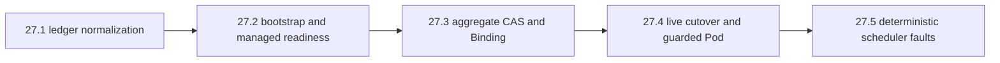
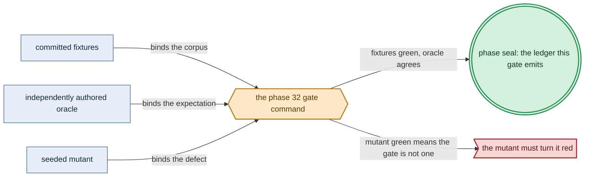

# Phase 32: amoebius-capacity scheduler + bootstrap cutover

> **Purpose**: Build the same-binary `amoebius-capacity` scheduler as a dedicated role layered on the
> Phase-31 reconciler — the state-indexed reservation ledger, the two-stage bootstrap taint/RBAC cutover
> (`BootstrapCapacitySchedulerReady` → controller cutover → `ManagedCapacityReady`), execution-identity
> admission, and the CAS `Reserved` → `BindingInFlight` → submit/confirm Kubernetes Binding → `Bound`
> protocol — proven live by binding a pinned Pending guarded-Pod set with no double-bind and rejecting any
> guarded workload before `ManagedCapacityReady`.
> **Read this if**: a later phase depends on the delivered capacity-scheduler gate or its evidence.

Phase 32 delivers the amoebius-capacity scheduler + bootstrap cutover; its design is owned by [manifest_generation_doctrine.md](../documents/engineering/manifest_generation_doctrine.md), [resource_capacity_doctrine.md](../documents/engineering/resource_capacity_doctrine.md), [readiness_ordering_doctrine.md](../documents/engineering/readiness_ordering_doctrine.md), and the plan for reaching it is owned here.
Register 3, live, on the `linux-cpu` substrate.
Sprints 28.1–28.5 and the phase-level acceptance gate have passed.

> **Historical result (invalidated).** Any pass, seal, validation, ledger, receipt, or implementation observation
> in the orientation text above is diagnostic only. The Phase Status section and [tracker](README.md) own current state; the
> target contract below remains normative.

Link-graph metadata

**Status**: Authoritative source
**Supersedes**: N/A
**Referenced by**: DEVELOPMENT_PLAN/README.md, DEVELOPMENT_PLAN/overview.md, DEVELOPMENT_PLAN/phase_10_execution_accelerator_folds.md, DEVELOPMENT_PLAN/phase_12_provision_seal.md, DEVELOPMENT_PLAN/phase_31_object_reconciler.md, DEVELOPMENT_PLAN/phase_52_provider_dynamic_nodes.md, DEVELOPMENT_PLAN/system_components.md, documents/engineering/deterministic_simulation_doctrine.md
**Generated sections**: none

## Contents
- [Phase Status](#phase-status)
- [Phase Summary](#phase-summary)
- [Gate integrity](#gate-integrity)
- [Resource provision — the `CapacitySchedulerSystemDemand` envelope](#resource-provision--the-capacityschedulersystemdemand-envelope)
- [Doctrine adopted](#doctrine-adopted)
- [Sprints](#sprints)
- [Sprint 32.1: State-indexed reservation ledger + normalization + absent-Pod recovery arms ✅](#sprint-321-state-indexed-reservation-ledger--normalization--absent-pod-recovery-arms-)
- [Sprint 32.2: Scheduler bootstrap authority + two-stage taint/RBAC cutover + readiness witnesses ✅](#sprint-322-scheduler-bootstrap-authority--two-stage-taintrbac-cutover--readiness-witnesses-)
- [Sprint 32.3: Scheduler loop + `Reserved`→`BindingInFlight`→Binding→`Bound` CAS + placement + recovery ✅](#sprint-323-scheduler-loop--reservedbindinginflightbindingbound-cas--placement--recovery-)
- [Sprint 32.4: Live scheduler binding + bootstrap→steady cutover gate ✅](#sprint-324-live-scheduler-binding--bootstrapsteady-cutover-gate-)
- [Sprint 32.5: Register-2.5 scheduler convergence under simulated faults ✅](#sprint-325-register-25-scheduler-convergence-under-simulated-faults-)
- [Documentation Requirements](#documentation-requirements)
- [Related Documents](#related-documents)

---

## Phase Status

⏸️ Blocked pending Phase-31 revalidation — **reopened 2026-08-16 by the natural-architecture amendment.**
[§S](development_plan_gate_integrity.md#s-universal-artifact-hygiene-gate) clause 15 requires a run to record
the natural architecture it proved and to execute no artifact of another. This phase's last gate recorded no
architecture, so its seal is invalidated as a current result and stands only as history; the rerun differs from
it by naming the lane and architecture the run actually used. A sprint marker below records what that sprint achieved before the amendment; under
[§N](development_plan_phase_model.md#n-reopening-and-amending-a-phase) it is a diagnostic, not surviving closure.

**Pre-natural-architecture status record (invalidated where it claims completion):**

Blocked (superseded) — reopened 2026-08-16 behind the amended Phase-30 handoff and Phase-31 revalidation. Its prior capability record remains historical until the exact predecessor chain is resealed.

**Superseded containment seal:** resealed 2026-08-16 under the repository-containment amendment, attestation
`sha256:ca6f2898297e06d97f37feee4d78cea528a9f19cb4089d67d8d880b32155e8e8`.
`python3 tools/capacity_scheduler_gate.py --execute` passed all **11** recorded sides against source snapshot
`sha256:83031cba17bdc3dd1451df2dc6a5d8b6fa4ffae489adeee86823d43b4978c0ab`.
The run verified Phase 31 attestation `sha256:85cf27abdea88522d4b4e5d3941d22d11fe68c6ed53fd6ec43bab1305643f9f1`,
Phase 30 attestation `sha256:e6ff9163d299b66b8ce77c216d5114e13af6fe4beb7e299834ee390e9963816a`,
and image index `sha256:4d8891f619fc26276288b3bc7f3586750f81dbb59b9b40b93e3149f4c4666dcd`.
It created a fresh project-private daemon, kind cluster, registry, and node pull route beneath one marker-owned
`.test_data/**` run, then destroyed the fixture before attestation. All five sprints passed in order; all 14
mutants reddened; all 11 metrics matched; and all 33 surfaces joined to 30 run-time items. Generated output
and the five sprint receipts stayed beneath `.build/**`; the immutable record reports every check `pass` with
`cleanup.left_resources=false`, and the outside-host inventory remained empty.

Current sprint receipt fingerprints are 27.1
`sha256:76b75435746f61684035e80aaca664ca49abb5b6602a0c7926723c77e7fa6857`, 27.2
`sha256:9f7e8603d3fcee5de898a40eeca31cd824bf53ab99628fb0633574cea14cb450`, 27.3
`sha256:8a9556502204beed912605d711ac20fd474ea953db983c6923787b992f03ba79`, 27.4
`sha256:547a772924a6d3e908742b153cd643a4d3d5dd63815b2e190a17e4e2fdebe0a3`, and 27.5
`sha256:5f23bf2f15cf0578f0435c8964b5dc18b72b821d63e0ddfad2fd576eeec73302`.

**Pre-containment status record (invalidated where it claims completion):**

Done (invalidated) — sealed 2026-08-14, attestation `sha256:d576e18d7180eef7a8ee6aaf0b2e53c7d38d90d6ba81050539ea3fa7c68f9c79`. Reopened 2026-08-11 because the prior seal did not
include the universal artifact-hygiene postcondition; `python3 tools/capacity_scheduler_gate.py --execute` now passes on
**all ten sides** against the run's own source snapshot, and left no authored path created, changed, or
removed.

**What the seal added — 2026-08-14: Policy-conformant.** The two-stage cutover ran on the live single-node
`kind` cluster in the authored order — `BootstrapCapacitySchedulerReady`, `BootstrapAddonCutover`,
`BootstrapReplacementBoundReady`, `ManagedCapacityReady`, `GeneralGuardedPodAdmitted`,
`GeneralGuardedPodBoundReady` — and the immediate re-run issued **zero** new Binding requests while staying
byte-stable. Postflight left nothing behind, and the universal-`linux-cpu` contract is recorded as observed
rather than asserted. The Register-2.5 half replayed 1,792 deterministic schedules across seven fault classes
with byte-identical same-seed replay. All **14** committed mutants went red — seven pure ones re-run against
the live cutover and seven attacking the same invariants through `IOSim` — 11 recorded metrics equal their
authored values, and 33 surfaces join to 30 enumerated items. `modeled-apiserver-fidelity`,
`completion-release-ledger`, `rollback-ledger`, and `in-cluster-singleton-ownership` stay **UNVERIFIED**: the
first is the Register-2.5 assumption this run's own live half bounds, the middle two belong to the
content-store phase, and the singleton that will own the scheduler is [Phase 38](phase_38_live_dsl_singleton.md)'s.

*The gate was unrunnable in the same four ways Phase 31's was.* It read five receipts, four mutant batteries,
a simulation record, and the live observation out of `DEVELOPMENT_PLAN/evidence/phase_28` — a directory that
no longer exists — compared a committed golden ledger against a derived one, read its surface list from a
missing enumeration file, and named a **developer-home `cabal`** in six places. It is now a six-side
`PhaseGate` over a run bundle; `test/oracle/capacity_scheduler_surfaces.tsv` authors 33 surfaces for the first time,
and cabal and the compiler resolve per run. `tools/capacity_scheduler_live.py` pinned the Phase-30 base image
by a digest from a build that is gone, so every scheduled Pod would have failed `ImagePull`; the reference is
supplied by the caller. The two external live-evidence readers — the ones §M.5 requires to be independent of
the scheduler — read the retired evidence path as a string constant, and now take this run's bundle path as
their argument.

*The oracle side is the one source property the reservation claim rests on.* A reservation is decided by
refolding the **whole** ledger rather than adding to a running total, which is exactly what the
`numeric-add-instead-of-whole-ledger-refold` mutant attacks; the gate checks that `refoldSchedulerPlacement`
still exists and that `Reservation.hs` still calls it, so an accumulate-in-place rewrite fails the gate before
any live work starts.

**Invalidated historical record:**

Done (invalidated). Validated 2026-08-09 with the retired phase-numbered gate;
ledger `external-run-reference`. This phase opened after the
**Phase 31 gate** (the
object reconciler's `observe → diff → scoped-SSA → staged-enact → delete → wait` convergence, its
`ValidatedLiveTarget` construction, the cold-start mandatory-reconciler-`Lease` authority, and the IOSimPOR
object-fault battery) and runs on the **linux-cpu** substrate in **Register 3**. It is **layered on** that
live reconciler: Phase 31 converges the object corpus with its Pods scheduled by the default scheduler and
holds the mandatory reconciler `Lease`; this phase adds the *scheduling* authority — the reservation ledger,
the two-stage bootstrap cutover, execution-identity admission, and the CAS reservation/Binding protocol — that
turns the corpus's guarded Deployment from a default-scheduled workload into one bound exclusively by
`amoebius-capacity`. Where a sibling already schedules pods with a stock scheduler — prodbox lets kube-scheduler
place its control-plane pods — that is **sibling evidence, not an amoebius result**; the state-indexed
reservation ledger, the aggregate-CAS reservation protocol, the identity admission webhook, and the two-stage
`BootstrapCapacitySchedulerReady`/`ManagedCapacityReady` cutover are amoebius's new code.

- **2026-08-09 — Sprint 32.1 complete.** The pinned nine-action scheduler oracle and the read-only
  state-indexed ledger normalizer passed. All five absent-Pod reservation states retained their exact padded
  debit; Pending remained API-only; confirmed Bound while still `BindingInFlight` joined the observed UID once;
  and the nine orphan/missing/state/node/generation/template/axes/duplicate/double-debit negative classes
  refused before any writer boundary. Receipt:
  `sprint-27.1-receipt.json`, fingerprint
  `dynamically-resolved`.
- **2026-08-09 — Sprint 32.2 complete.** Exact reconciler-Lease-holder admission minted a single-use
  scheduler-system token. Bootstrap readiness required exact generation/config/root with managed authority
  absent and authorized only the finite cutover; managed readiness required complete old-UID release,
  replacement reservation/Bound/Ready joins, and independent taint/admission/RBAC/writer-domain readback.
  Protected execution identity rejected premature workloads and a second default-scheduler exception. Three
  mutants were red and the readiness source scan found no sleep/clock shortcut. Receipt:
  `sprint-27.2-receipt.json`, fingerprint
  `dynamically-resolved`.
- **2026-08-09 — Sprint 32.3 complete.** The scheduler loop authenticated the protected Pod identity,
  re-folded the whole aggregate ledger under CAS, required `BindingInFlight` before Binding, and recovered
  unknown or restarted records without releasing their debit. Same-UID retry was resourceVersion-stable;
  two residual contenders could not overspend; and all four ordering, fold, idempotence, and restart mutants
  turned red before the baseline was restored. Receipt:
  `sprint-27.3-receipt.json`, fingerprint
  `dynamically-resolved`.
- **2026-08-09 — Sprint 32.4 complete.** A live Kubernetes admission guard rejected premature and
  default-scheduler guarded Pods with zero writes. The finite add-on cutover replaced the old UID, the
  reservation CRD reached `BindingInFlight` before the real Binding API assigned the replacement, independent
  readers confirmed both guarded UIDs were debited once, and the immediate rerun was byte-stable and
  Binding-free. A simultaneous one-slot aggregate CAS admitted one of two candidates, all seven scheduler
  mutants were red, and postflight removed the taint, admission, RBAC, CRD, and namespaces. Receipt:
  `sprint-27.4-receipt.json`, fingerprint
  `dynamically-resolved`.
- **2026-08-09 — Sprint 32.5 complete.** Seven scheduler fault classes each replayed 256 byte-identical
  schedules through the real readiness, admission, reservation, Binding preparation, recovery, and modeled
  apiserver seams. Bounded IOSimPOR explored their critical sections; all seven simulation mutants were red;
  and modeled-apiserver fidelity remains explicitly assumed, bounded by Sprint 32.4's separate live run.
  Receipt: `sprint-27.5-receipt.json`, fingerprint
  `dynamically-resolved`.
- **2026-08-09 — Phase 32 gate complete.** The phase command repeated the live/source-mutation and
  deterministic-simulation seals, restored all six scheduler baselines together, validated the exhaustive
  acceptance-surface ledger, and passed documentation lint. Ledger:
  `phase_32_ledger.json`, fingerprint
  `dynamically-resolved`.

## Phase Summary

This phase delivers the `amoebius-capacity` scheduler. It is **the same amoebius Haskell binary holding the `CapacityScheduler` arm of `InClusterRole`** ([daemon_topology_doctrine.md §2](../documents/engineering/daemon_topology_doctrine.md#2-context--role-an-orthogonal-grid)) — a decoded value on the pod's frame config, not a scheduler-framework plugin, not a second implementation, and not a second executable. `CapacitySchedulerSystemDemand`
makes its image, complete Pod envelope, config, RBAC, readiness, identity admission, managed-node taint
policy, reservation CRD/records, API/etcd bytes, and CAS churn explicit, so the scheduler's own cost
participates in the same identity-aware fold it enforces on every other Pod.

The scheduler owns the **state-indexed reservation ledger**. On top of Phase 31's `ObservedLiveResourceSnapshot`
— which, before this phase, carries an empty scheduler-ledger arm because the corpus Pods are default-scheduled
and no reservation CRD exists — this phase adds the join over the full
`Reserved | BindingInFlight | Bound | Terminating | TerminalRetained` records and their resourceVersion/CAS
version. Normalization charges `PendingUnscheduled` as API-only, `Reserved` and `BindingInFlight` Pod+ledger
once, `Bound`/`Terminating` as one exact-joined vector, `Terminal` retained axes only, and each host
reservation once. An absent Pod never makes a ledger debit disappear: the closed `LedgerOnlyAbsentRecovery`
arms retain the exact full or terminal-retained debit for `Reserved`, `BindingInFlight`, `Bound`,
`Terminating`, or `TerminalRetained` until that state's release/cleanup evidence and whole-root CAS succeed. A
`BindingInFlight` row with unknown/unbound outcome remains planned-only, but an exact-node `ConfirmedBound
PodUid` recovery observation immediately instantiates the observed Pod-UID runtime-storage row and joins it
with the reservation as one debit even before the repair CAS reaches `Bound`. Unclassified orphan, missing,
wrong-state, wrong-node, wrong-generation, wrong-template, unequal-axis, or duplicate ledger joins, and any
observed+ledger double debit, fail closed and have no `ValidatedLiveTarget` constructor. The
`PlannedExecutionSlotId` is a pure capacity slot and is never equated with a future Pod UID; the observed
`ObservedExecutionSet` keys on `KubernetesPod PodUid | HostProcess HostProcessInstanceId |
HostReservation HostReservationId`, and the ledger-only third arm cannot masquerade as a running process or be
omitted from residual capacity.

Bootstrap is deliberately **two-stage**. Its single pinned bootstrap Pod uses the **default scheduler**, a
unique-node affinity, the exact `amoebius-capacity-scheduler` namespace `ResourceQuota pods=1`, the Phase-30
side-loaded/preloaded amoebius image (so it does not depend on the registry controller it must cut over), and
a static reservation that participates in the same identity-aware fold. Exact scheduler generation/config/root
readback first mints `BootstrapCapacitySchedulerReady` **while the managed taint is absent**; its restricted
capability can only patch the finite observed distro/Phase-30 bootstrap-controller set to
`schedulerName=amoebius-capacity`. After every old default-scheduled UID is absent/released and every
replacement UID is reservation-joined and Ready, bootstrap installs the managed-node taint, general identity
admission, and exclusive Binding RBAC, revokes the cutover-only authority, and **independently** mints
`ManagedCapacityReady`. Only that full witness admits general guarded controllers under
`AfterManagedCapacityReady`. The scheduler Pod is then the sole cycle-break/default-scheduler exception, and
every other Pod tolerating the managed-capacity taint must name `amoebius-capacity`.

For a Pending guarded Pod, the scheduler authenticates Pod UID, provenance, the kind-indexed owner chain,
prior/desired source generation, child discriminator, and template digest; re-folds the static/foreign/
resident/whole-root/candidate resource algebra (over Phase 8's `place` fold) under one aggregate CAS;
CAS-creates `Reserved`; CASes `Reserved → BindingInFlight`; **only then** submits Kubernetes Binding; and
confirms exact UID/node before CAS to `Bound`. Same-UID identical retry reuses an identical record; only
`Reserved` may retarget; any generation/child/node/axis/model/backing mismatch rejects. Recovery is
state-sensitive: after crash/restart it re-reads Pods and the aggregate root, reuses exact reservations, and
keeps `BindingInFlight` charged; `ConfirmedBound` repairs to `Bound`, `ConfirmedUnboundSameUidAndResourceVersion`
or `PodAbsent` may release, and `Unknown` retries observation and never unreserves on an error/timeout.
Bound/Terminating records are never deleted merely because the scheduler restarted. Identity admission requires
the deployment/generation/source/revision/reservation-template annotations and `amoebius-capacity` at CREATE,
rejects their removal/change at UPDATE, validates the owner chain, and restricts writers to the provisioned
controllers/scheduler; the sole default-scheduler bootstrap exception is structurally separate.

This phase does **not** rebuild the reconciler's generic SSA, staged execution (serial OnDelete, host/
accelerator transitions), Job terminal protocol, authenticated deletion, or the object convergence gate —
those are Phase 31's and are consumed here as the substrate the scheduler runs on. It owns only the scheduling
authority. The scheduler is driven from the **host binary** against the same scratch namespace as Phase 31; the
Deployment-`replicas=1` in-cluster singleton that eventually *owns* both the reconciler and its scheduling role
arrives in Phase 37.

**Substrate:** `linux-cpu` — this gate selects the universal Linux CPU lane, which is always available on
every hardware substrate. A pristine Linux host uses Incus on native Linux or Linux-CUDA, Lima on Apple,
and WSL2 on Windows. This execution uses Phase 29's single-node `kind` cluster and the Phase-31 reconciler.

**Lane:** linux-cpu/amd64 ([§L](development_plan_standards.md#l-one-substrate-discipline))

**Register:** 3 — live infrastructure ([§K](development_plan_standards.md#k-honesty-proven--tested--assumed)).

*Orientation for the ordered scheduler delivery owned by the [Phase 32 plan](phase_32_capacity_scheduler.md).*

**Gate:** `cabal test scheduler-reservation scheduler-bootstrap-cutover` is green on the live `kind` corpus:
the two readiness witnesses and the controller cutover occur in order, then every guarded Pod binds
exclusively through the reservation CAS, under the fixtures, observer, and mutants of
[Gate integrity](#gate-integrity).

## Gate integrity

The apparatus is the **scheduler slice** of the source phase's committed reconcile corpus, partitioned along
this seam; Phase 31 owns the object/convergence slice of the same corpus, and the two do not duplicate each
other. All identifiers are oracle-pinned before `Scheduler/Ledger.hs` exists (§M.1 oracle-pinning), except the
scheduler-role fixtures that depend on the Phase-30 registry/preloaded image and the Phase-29 live cluster,
which are committed at the start of this phase before the implementation that consumes them (§M.1 named
exception).

*Design intent. Phase 32's gate apparatus; [§M](development_plan_standards.md#m-gate-integrity-a-gate-cannot-be-passed-by-a-stub) owns its clauses.*

**Inherited committed fixtures (§M.1/§M.7 concrete corpus).** This phase reuses
[Phase 31's concrete reconcile corpus](phase_31_object_reconciler.md) rather than selecting new service specs. It
inherits exactly these members:
- the **scheduler-role system** — the `CapacitySchedulerSystemDemand` Pod/config/reservation-CRD/RBAC/
  admission set — from which the `amoebius-capacity` scheduler stands up, minting
  `BootstrapCapacitySchedulerReady` with the managed taint still absent, then passing the bootstrap-controller
  UID cutover, then independently minting `ManagedCapacityReady`, in that order, before any guarded Pod;
- the **finite observed distro/Phase-30 bootstrap-controller set** that is patched from the default scheduler
  to `schedulerName=amoebius-capacity` during the cutover;
- corpus item **(i)** — the guarded Deployment whose container image is pulled from the Phase-30 in-cluster
  `distribution` registry and whose readiness probe carries a **non-zero `initialDelaySeconds`** (so
  rollout-complete cannot be true at Bind time and the registry dependency is exercised by a running pod) — the
  Pending guarded Pod the scheduler must reserve and bind exclusively through CAS `Reserved` → CAS
  `BindingInFlight` → submit/confirm Kubernetes Binding → CAS `Bound`;
- `test/live/fixtures/reconcile-corpus/expected-actions.json` — the **scheduler-action slice** only: the
  `CapacitySchedulerSystemDemand` static debit, the `BootstrapSchedulerStage` namespace/quota/CRD/config/root/
  cutover-RBAC actions, the `AfterBootstrapAddonCutover` managed-taint/admission/full-Binding install, and the
  `Reserved`/`BindingInFlight`/`Bound` reservation transitions for the guarded Pod;
- a committed **premature-guarded-workload negative** (§M.8): a Pod naming `amoebius-capacity` / tolerating the
  managed-capacity taint, submitted **before** `ManagedCapacityReady`, asserting its expected admission-reject
  reason and **zero writes**, paired with the positive that is admitted **only after** the full witness. Corpus members (ii) serial
  OnDelete, (iii) the Job, (iv) the Ready/Available object, and (v) the CustomResource are Phase 31's slice and
  are not re-exercised here.

**Committed seeded mutants the gate MUST turn red (§M.2).** Each is drawn from the source's operator set and
committed/re-run, not run once:
- **`bind-before-reservation-CAS`** (effect-swap/ordering) — submits Kubernetes Binding before the `Reserved`
  CAS succeeds; must fail the external reservation-CRD auditing (no Binding may precede a successful CAS);
- **`numeric-add-instead-of-whole-ledger-refold`** (fold-weakening) — placement adds a numeric delta instead
  of re-folding the whole reservation ledger; must fail the two-candidate residual race. Declared compute
  headroom makes this mutant's shape more tempting rather than less — `reserved = required + pad` reads like a
  delta to add to a cached residual — so the pad is folded with everything else or not at all;
- **`same-UID-double-debit`** (union-arm/idempotence) — a same-UID retry mints a second reservation record;
  the external "every UID debited once" assertion goes red;
- **`bound-deleted-on-restart`** (dropped-`UNCHANGED`) — recovery deletes a `Bound`/`Terminating` reservation
  merely because the scheduler restarted; the crash/restart fixture goes red;
- **`default-scheduler-managed-node-bypass`** (guard-negation) — a second default-scheduled Pod tolerating the
  managed-capacity taint is admitted; the managed-taint-bypass fixture goes red;
- **`collapsed-readiness`** (invariant-clause delete) — readiness ignores the config digest or collapses
  `BootstrapCapacitySchedulerReady` and `ManagedCapacityReady` into one witness; the
  scheduler-ready-with-managed-taint-present fixture goes red;
- **`stage-drop-generic-SSA-before-cutover`** (guard-weakening) — the rendered managed-taint/admission objects
  are generic-SSA-applied from the full render list before the bootstrap-controller domain-equality witness;
  must go red.

**Independent reference predicate (§M.3/§M.5).** All "reserved once / bound once / no-op re-run" verdicts are
read by an **external apiserver + reservation-CRD observer** — a distinct `kubectl get -o json` / client-go
reader that is **not the scheduler and shares no fold/CAS/`Step→argv` code with it**. It reads the reservation
records, their CAS version, and the Kubernetes `Binding` subresource directly and asserts, independently of the
code under test: **no `Binding` request precedes a successful `Reserved` CAS**; **every guarded Pod UID has exactly one reservation debit** (no Pod+ledger double debit); at every audit resourceVersion **at most one holder** and no non-authority write without the exact mandatory-`Lease` holder (held by the Phase-31
reconciler); on the immediate re-run the reservation records and CAS version are **byte-identical** and **no new `Binding` is issued**; and **no second default-scheduler exception exists**. The same observer also
asserts that the bootstrap→steady cutover leaves **no double-bind**. The scheduler's self-reported
"reserved once, bound once" is corroborating evidence only, never the passing condition. The reference *action*
domain is the oracle-pinned hand-authored `expected-actions.json` scheduler slice, authored before the
planner — not regenerated from the scheduler's own output.

## Resource provision — the `CapacitySchedulerSystemDemand` envelope

`CapacitySchedulerSystemDemand` is the scheduler's own explicit, pure-first provision, fitted by the Phase-8
`place` fold before any effect, so the scheduler is never silently free overhead:
- **Image** — the Phase-30 side-loaded/preloaded native-architecture amoebius base image (never a public-registry pull),
  so the scheduler does not depend on the registry controller it must cut over.
- **Pod envelope** — the complete pinned bootstrap Pod: non-zero CPU/memory request+limit, explicit logical
  `ephemeral-storage`, no declared compute headroom (the scheduler sizes its own row exactly and has no growth,
  burst, isolation, or defragmentation claim on the node it bootstraps), unique-node affinity, and
  `restartPolicy`/probe fields; its single Pod uses the
  **default scheduler** (the sole structural exception) and a static reservation row merged into the same
  identity-aware fold (equal shared image extents deduplicate, compute/slots add).
- **Namespace/quota** — the `amoebius-capacity-scheduler` namespace and its exact `ResourceQuota pods=1`.
- **Reservation state** — the reservation CRD, config, and aggregate root; the canonical reservation
  serializer derives entry bytes, and `maxEntries` derives from the **maximum normalized Pod-UID population including retained terminal records**, never an authored scalar. The three compute-headroom pad scalars are
  part of the canonically pinned compute-axis field set, so they enlarge the derived entry bytes and therefore
  the `maxEntries` and `EtcdChurnBudget` provisions; they are not an optional tail a serializer may omit for
  rows whose pad is `Zero`.
- **RBAC/admission** — the restricted cutover-only RBAC first, then the full exclusive-Binding RBAC, the
  general identity-admission webhook, and the managed-node taint policy installed only at cutover.
- **API/etcd** — the serialized API objects, etcd logical bytes, and the `EtcdChurnBudget` CAS-churn
  projection reserved per attempt until a post-attempt observation commits or releases the debit.
- **Readiness** — the two distinct witnesses `BootstrapCapacitySchedulerReady` and `ManagedCapacityReady`.

## Doctrine adopted

- [`manifest_generation_doctrine.md §5`](../documents/engineering/manifest_generation_doctrine.md#5-the-applyreconcile-engine-snapshot-bound-typed-actions)
  — **the apply/reconcile engine** (the scheduler slice). This phase realizes the amoebius scheduler-role
  CAS/Binding protocol (`Reserved` → `BindingInFlight` → submit/confirm Binding → `Bound`), the two-stage
  bootstrap taint/RBAC cutover, and execution-identity admission. Generic SSA, staged execution, Job terminal,
  authenticated deletion, and the rollback/release ledger are Phase 31's or stay deferred.
- [`manifest_generation_doctrine.md §6`](../documents/engineering/manifest_generation_doctrine.md#6-the-reconcile-state-model-desired-is-renderallprovisionedspec-observed-is-live-inventory-actions-are-typed)
  — **desired is the validated identity index of `renderAll(provisionedSpec)`, observed is live inventory, and actions are typed** (the scheduler-ledger slice). The state-indexed
  `Reserved | BindingInFlight | Bound | Terminating | TerminalRetained` records, their CAS version, and the
  `LedgerOnlyAbsentRecovery` arms are **observed** to authorize reservation transitions, never treated as
  another desired source; a `PlannedExecutionSlotId` is never a Pod UID.
- [`resource_capacity_doctrine.md §8`](../documents/engineering/resource_capacity_doctrine.md#8-where-the-numbers-come-from-declared-in-pure-input-provisioned-before-render-cross-checked-at-runtime)
  — **declared at decode, cross-checked at runtime.** Before each reservation CAS the scheduler re-folds the
  static/foreign/resident/whole-ledger/candidate resource algebra over the Phase-8 `place` fold and re-observes
  residual capacity; two concurrent candidates cannot reserve the same residual, and a stale or false witness
  is refused with zero writes.
- [`readiness_ordering_doctrine.md §6`](../documents/engineering/readiness_ordering_doctrine.md#6-the-runtime-enactor-the-reconciler-observes-never-sleeps)
  — **the runtime enactor: observe, never sleep.** `BootstrapCapacitySchedulerReady`, the bootstrap-controller
  cutover, `ManagedCapacityReady`, and reservation `Bound`+Ready are read from live sources; no `threadDelay`
  substitutes for a scheduler-readiness witness.
- [`daemon_topology_doctrine.md §3`](../documents/engineering/daemon_topology_doctrine.md#3-the-control-plane-singleton)
  — **the control-plane singleton.** The scheduler is a dedicated role of the same amoebius binary/image, not
  a second implementation; this phase drives it from the **host binary** as a precursor, and the Deployment-
  `replicas=1` singleton that *owns* it (single-writer authority delegated to k8s/etcd through the mandatory
  `Lease`, no bespoke election) is stood up in Phase 37.
- [`testing_doctrine.md §2`](../documents/engineering/testing_doctrine.md#2-the-registers-of-amoebius-testing)
  — **Register 3** (live infrastructure): the register this phase's gate reaches; and
  [`§4`](../documents/engineering/testing_doctrine.md#4-no-skips-fail-fast-and-the-per-run-ledger-artifact),
  the per-run proven/tested/assumed ledger the live cutover/binding emits (no skips, fail fast; the scratch
  namespace is torn down leak-free).

## Sprints

> **Current revalidation rule.** Every sprint below is reopened under the containment amendment; the dates,
> pass claims, and `Remaining Work: None` statements describe the retired 2026-08-14 run. Any historical date, repository-resident
> evidence path, or pre-amendment capability claim retained in the prose describes the retired record only, and
> is superseded by the current generated-artifact and dynamic-resolution doctrine: nothing below licenses
> committing generated output, freezing dependency resolution, retaining a resolved version, path, or integrity
> hash, or consuming repository-resident evidence, ledgers, or enumerations.

## Sprint 32.1: State-indexed reservation ledger + normalization + absent-Pod recovery arms ✅

**Status**: Done — sealed 2026-08-14 inside `python3 tools/capacity_scheduler_gate.py --execute`; the five-state
ledger, its normalization, and the absent-Pod recovery arms passed their pure spec, and
`sprint-27.1-receipt.json` in that run's bundle records it.
**Implementation**: `src/Amoebius/Scheduler/Ledger.hs` — the state-indexed reservation
ledger join and normalization that extends Phase 31's `src/Amoebius/Execution/Normalize.hs` observed
snapshot with the scheduler dimension; built and validated.
**Blocked by**: reopened numeric predecessor gates.
**Independent Validation**: a fresh snapshot over the pinned corpus normalizes each reservation state exactly once and
produces the independently authored expected scheduler-state slice of
`test/live/fixtures/reconcile-corpus/expected-actions.json`, authored before this module. Every ledger
negative (orphan, missing, wrong-state, double debit) fails to construct a `ValidatedLiveTarget` and before
any apiserver, ledger, or Binding write.
**Docs to update**:
`documents/engineering/manifest_generation_doctrine.md`,
`documents/engineering/resource_capacity_doctrine.md`, `DEVELOPMENT_PLAN/system_components.md`.

### Objective

Adopt [`manifest_generation_doctrine.md §6`](../documents/engineering/manifest_generation_doctrine.md#6-the-reconcile-state-model-desired-is-renderallprovisionedspec-observed-is-live-inventory-actions-are-typed)
— the reconcile state model, scheduler-ledger slice. Extend Phase 31's observed inventory with the
state-indexed reservation ledger and its resourceVersion/CAS version, normalize every reservation state
exactly once, and classify the closed absent-Pod recovery arms — so no observed Pod plus ledger row is
double-debited, no absent Pod makes a debit disappear, and no unclassified record reaches a
`ValidatedLiveTarget` constructor.

### Deliverables

- A scheduler-ledger join over full `Reserved | BindingInFlight | Bound | Terminating | TerminalRetained`
  records plus resourceVersion/CAS version, added to Phase 31's `ObservedLiveResourceSnapshot` (empty before
  this phase because the corpus is default-scheduled and no reservation CRD exists). Normalize `PendingUnscheduled`
  API-only, `Reserved`/`BindingInFlight` Pod+ledger once, joined `Bound`/`Terminating` as one exact vector,
  `Terminal` retained axes only, and each host reservation once. Missing, unclassified-orphan, wrong-state,
  wrong-node, wrong-generation, wrong-template, unequal-axis, duplicate, and observed+ledger double-debit joins
  have **no** constructor.
- The closed `LedgerOnlyAbsentRecovery` arms: an absent Pod retains the exact full or terminal-retained debit
  for `Reserved`, `BindingInFlight`, `Bound`, `Terminating`, or `TerminalRetained` until that state's
  release/cleanup evidence and whole-root CAS succeed. The retained debit is the **padded** debit: a row that
  surrendered its declared headroom while retaining its requests would let a second workload pack into space
  the first still holds. Positive recovery fixtures cover an absent-Pod row in
  every closed ledger state and prove each remains charged until its state-specific CAS.
  The unequal-axis rejection above is correspondingly pad-sensitive — a row whose pad axes disagree with its
  template's fails to construct, exactly as a mismatched request or limit debit does.
- The host-aware observed identity union consumed from Phase 31 —
  `KubernetesPod PodUid | HostProcess HostProcessInstanceId | HostReservation HostReservationId` — with its
  ledger-only third arm: host `Reserved`, no-process `LaunchInFlight`, and post-process retained-artifact rows
  remain charged under `HostReservation HostReservationId`; process-observed `LaunchInFlight` enters
  `HostLaunchRecovery`; Running/Draining exact-join the process and reservation once. Missing, duplicate, or
  process-fabricated ledger-only identities reject.
- State-sensitive Binding recovery at normalization time: an unknown/unbound `BindingInFlight` row remains
  planned-only, while an exact-node `ConfirmedBound PodUid` observation immediately derives the observed
  Pod-UID runtime-storage row (from Phase 31's `RuntimeStorage`) and exact-joins it once with the
  still-`BindingInFlight` reservation — the later repair CAS (Sprint 32.3) changes state, not capacity.
- The scheduler-ledger slice of the `ValidatedLiveTarget`: the ledger CAS version, the normalized
  reservation/host-reservation witnesses, and the reservation transition sub-domain of the typed action map,
  handed to Phase 31's target constructor. `PlannedExecutionSlotId` is never equated with a Pod UID; every
  same-slot predecessor/replacement UID is preserved as two distinct commitments.

### Validation

1. The normalized ledger for the authored corpus equals the independently authored expected scheduler-state slice of
   `expected-actions.json`. Seeded mutants — unclassified-orphan record, missing reservation, wrong
   state/node/template/generation/axes, a `Bound` Pod plus ledger double debit, reservation-only omission, and
   an incorrect terminal released/retained partition — each fail to construct a `ValidatedLiveTarget`.
2. Positive recovery fixtures cover absent-Pod rows in **every** closed ledger state and prove each remains
   charged until its state-specific CAS. The host-ledger controls reuse the Phase-31 failure classes: missing
   reservation/artifact identities, fabricated process evidence, and post-join double charging. Exact-fit
   controls debit each identity once.
3. A confirmed-bound-but-still-`BindingInFlight` fixture must use the observed Pod-UID runtime row; the
   planned-only omission and the planned+observed double-debit mutants both turn red. The
   `same-UID-double-debit` mutant is caught at normalization by the external "every UID debited once" oracle.
4. The module imports no writer; the AST/import lint proves `Scheduler/Ledger.hs` is read-only, and a runtime
   observer proves zero apiserver/ledger/Binding writes on every negative.

### Remaining Work

None. The receipt and phase results are written into this run's bundle under `.build/runs/`.

## Sprint 32.2: Scheduler bootstrap authority + two-stage taint/RBAC cutover + readiness witnesses ✅

**Status**: Done — sealed 2026-08-14 inside `python3 tools/capacity_scheduler_gate.py --execute`; the bootstrap
authority, two-stage cutover, and both readiness witnesses held with all three mutants red, and
`sprint-27.2-receipt.json` in that run's bundle records it.
**Implementation**: `src/Amoebius/Scheduler/Readiness.hs`, the scheduler-authority slice
of `src/Amoebius/Manifest/Authority.hs` (`CapacitySchedulerSystemDemand` admission and the
scheduler-system-only token; the cold-start `Lease` authority itself is Phase 31), and
`src/Amoebius/Admission/ExecutionIdentity.hs` (the managed-taint/admission install) — target paths, not yet
built. The scheduler role is an entry point of the existing amoebius binary/image, not a second
implementation or a kube-scheduler plugin; built and validated.
**Blocked by**: reopened numeric predecessor gates.
**Independent Validation**: `BootstrapCapacitySchedulerReady` precedes the finite
bootstrap-controller cutover; every old default-scheduled UID is absent/released and every replacement is
reservation-joined before `ManagedCapacityReady`; only the latter precedes any general guarded controller
action. An independent taint/ admission/RBAC/writer-domain readback mints `ManagedCapacityReady`; no
readiness witness is a `threadDelay`.
**Docs to update**:
`documents/engineering/manifest_generation_doctrine.md`,
`documents/engineering/readiness_ordering_doctrine.md`, `DEVELOPMENT_PLAN/system_components.md`.

### Objective

Adopt [`manifest_generation_doctrine.md §5`](../documents/engineering/manifest_generation_doctrine.md#5-the-applyreconcile-engine-snapshot-bound-typed-actions)
(the apply/reconcile engine) and
[`readiness_ordering_doctrine.md §6`](../documents/engineering/readiness_ordering_doctrine.md#6-the-runtime-enactor-the-reconciler-observes-never-sleeps)
(observe, never sleep). Stand up the scheduler from `CapacitySchedulerSystemDemand` under a scheduler-system-
only token, then drive the deliberately two-stage cutover: mint `BootstrapCapacitySchedulerReady` while the
managed taint is absent, cut the finite bootstrap-controller set over to `amoebius-capacity`, and only after
complete old-UID release and replacement joins install the managed taint/admission/full Binding RBAC and
independently mint `ManagedCapacityReady`.

### Deliverables

- A read-only scheduler preflight (layered on the Phase-31 reconciler already holding
  `ProvisionedMandatoryReconcilerLease`) that admits only the statically debited `CapacitySchedulerSystemDemand`
  and mints a **scheduler-system-only** token. That token creates the `amoebius-capacity-scheduler` namespace,
  the exact `ResourceQuota pods=1`, the reservation CRD/config/root, the complete pinned scheduler Deployment,
  and RBAC **restricted to the enumerated bootstrap add-on cutover**. Its sole Pod is default-scheduled, uses
  the Phase-30 side-loaded/preloaded amoebius image, has unique-node affinity, and merges its static owner row
  with the ledger fold (equal shared image extents deduplicate, compute/slots add). These are the only
  `BootstrapSchedulerStage` actions.
- `BootstrapCapacitySchedulerReady`: exact active generation/config/root readback mints it **while the managed taint, general identity admission, and full Binding authority remain absent**. Its restricted capability can
  only patch the exact observed distro/Phase-30 bootstrap-controller set to `schedulerName=amoebius-capacity`.
- The bootstrap-controller cutover under `AfterBootstrapAddonCutover`: for every controller, re-observe the old
  default-scheduled UID absent and resource-indexed released, then the replacement UID reservation-joined,
  Bound, and Ready. Only the **complete domain-equality witness** authorizes installing the managed-node taint,
  general identity admission, and full exclusive Binding RBAC and revoking the cutover-only authority. An
  **independent** taint/admission/RBAC/writer-domain readback mints `ManagedCapacityReady`; the bootstrap
  snapshot is discarded and a fresh whole-deployment preflight runs before any general guarded action is
  exposed.
- Execution-identity admission install (`Admission/ExecutionIdentity.hs`): at cutover, the general identity
  admission requires the deployment/generation/source/revision/reservation-template annotations and
  `amoebius-capacity` at CREATE, rejects their removal/change at UPDATE, validates the kind-indexed owner chain,
  and restricts writers to the provisioned controllers/scheduler. The sole default-scheduler bootstrap
  exception is structurally separate; any **other** default-scheduled Pod that tolerates the managed-capacity
  taint is rejected.
- Wait-for-state, observed never slept: `BootstrapSchedulerStage` yields `BootstrapCapacitySchedulerReady` and
  precedes only finite bootstrap-controller patch actions; old-UID absence/release plus replacement
  reservation/Ready equality precedes the managed taint/admission/full-Binding RBAC under
  `AfterBootstrapAddonCutover`; and `ManagedCapacityReady` unlocks `AfterManagedCapacityReady` general guarded
  controller actions. No `threadDelay` substitutes for a witness.

### Validation

1. The bootstrap suite covers scheduler-ready-with-managed-taint-present, a general action attempted from only
   `BootstrapCapacitySchedulerReady`, an omitted bootstrap controller, an old UID still present, a missing
   replacement reservation, a premature taint/admission/full-RBAC install, and a second default-scheduler
   exception; **every case refuses** with zero writes.
2. The `collapsed-readiness` mutant (readiness ignoring the config digest or collapsing the two witnesses), the
   `stage-drop-generic-SSA-before-cutover` mutant (rendered taint/admission objects generic-SSA-applied before
   add-on equality), and the `default-scheduler-managed-node-bypass` mutant all turn red.
3. `ceil(renewalWindow/retryPeriod) <= maxRenewalsPerWindow` is not re-proven here (the `Lease` is Phase 31's),
   but the scheduler preflight asserts it runs **only** while the Phase-31 reconciler is the exact `Lease`
   holder; an attempt to stand up the scheduler without that holder refuses.
4. The forbidden-symbol lint over `src/Amoebius/Scheduler/Readiness.hs` and the scheduler slice of
   `Manifest/Authority.hs` and `Admission/ExecutionIdentity.hs` rejects `threadDelay`, aliases, and
   clock-polling busy-waits as readiness gates.

### Remaining Work

None. The receipt and mutation results are written into this run's bundle under `.build/runs/`.

## Sprint 32.3: Scheduler loop + `Reserved`→`BindingInFlight`→Binding→`Bound` CAS + placement + recovery ✅

**Status**: Done — sealed 2026-08-14 inside `python3 tools/capacity_scheduler_gate.py --execute`; the reservation CAS,
placement refold, and recovery arms held with all four mutants red, and `sprint-27.3-receipt.json` in that
run's bundle records it.
**Implementation**:
`src/Amoebius/Scheduler/{Loop,Placement,Reservation,Binding,Recovery}.hs` and the authentication path of
`src/Amoebius/Admission/ExecutionIdentity.hs`, built and validated by
`test/spec/live/CapacitySchedulerReservationSpec.hs` and `tools/capacity_scheduler_reservation_gate.py`.
**Blocked by**: reopened numeric predecessor gates.
**Independent Validation**: two concurrent candidates cannot reserve the same residual; crash-after-reserve,
restart, and Binding failure recover idempotently; the external observer proves no Binding precedes a
successful reservation CAS and every UID is debited once.
**Docs to update**:
`documents/engineering/manifest_generation_doctrine.md`,
`documents/engineering/resource_capacity_doctrine.md`, `DEVELOPMENT_PLAN/system_components.md`.

### Objective

Adopt [`manifest_generation_doctrine.md §5`](../documents/engineering/manifest_generation_doctrine.md#5-the-applyreconcile-engine-snapshot-bound-typed-actions)
(the apply/reconcile engine) and
[`resource_capacity_doctrine.md §8`](../documents/engineering/resource_capacity_doctrine.md#8-where-the-numbers-come-from-declared-in-pure-input-provisioned-before-render-cross-checked-at-runtime)
(cross-checked at runtime). Build the scheduler loop that authenticates a guarded Pod, re-folds the resource
algebra, reserves by aggregate CAS, and only then binds — with idempotent recovery across crash/restart/Binding
failure — so a Pod is never bound before its reservation CAS and never double-debited.

### Deliverables

- The scheduler loop for `schedulerName=amoebius-capacity` (`Scheduler/Loop.hs`): authenticate Pod UID,
  protected annotations, the kind-indexed owner chain, exact prior/desired source generation, child
  discriminator, and template digest (`Admission/ExecutionIdentity.hs` authentication path); re-fold the
  static/foreign/resident + whole-root + candidate resource algebra (`Scheduler/Placement.hs` over the Phase-8
  `place` fold); CAS-create `Reserved` (`Scheduler/Reservation.hs`); CAS `Reserved → BindingInFlight`; submit
  Kubernetes Binding (`Scheduler/Binding.hs`); confirm exact UID/node and CAS to `Bound`. Same-UID identical
  retry is idempotent; only `Reserved` can retarget; any generation/child/node/axis/model/backing mismatch
  rejects.
- Aggregate-CAS placement: two concurrent candidates cannot reserve the same residual because placement
  re-folds the **whole** reservation ledger under one aggregate root CAS rather than a numeric add. The
  `numeric-add-instead-of-whole-ledger-refold` mutant is caught by the two-candidate residual race.
- Recovery (`Scheduler/Recovery.hs`): after crash/restart, re-read Pods and the aggregate root, reuse exact
  reservations, and keep `BindingInFlight` charged. `ConfirmedBound` repairs to `Bound`;
  `ConfirmedUnboundSameUidAndResourceVersion` or `PodAbsent` may release; `Unknown` retries observation and
  **never** unreserves on an error/timeout. `Bound`/`Terminating` records are never deleted merely because the
  scheduler restarted; terminal/GC release retains the exact witnessed axes.
- Each reservation attempt consumes its fresh observation-bound token and reserves its exact `EtcdChurnBudget`
  projection until a post-attempt observation commits or releases that debit; a timeout, lost response, or
  unknown outcome remains charged and re-observes rather than reusing a token.
- The reservation transitions are the scheduler's members of Phase 31's `ValidatedExecutionTransitionAction`
  domain; the scheduler never enters Phase 31's generic scoped-SSA path (`fieldManager=amoebius`), and every
  mutating reservation/Binding constructor carries only its dedicated scoped capability and can never be minted
  for a non-holder.

### Validation

1. Live scheduler tests cover config-not-Ready and digest-mismatch refusal, managed-taint bypass, invalid
   provenance/owner chain, a two-candidate CAS race, same-UID retry, unbound retarget, wrong-RV conflict,
   crash-after-reserve/restart, Binding failure, crash-after-Binding-before-`Bound`-CAS, and state mismatch. The
   external observer proves **no Binding precedes a successful reservation CAS** and every UID is debited once.
2. The seeded mutants `bind-before-reservation-CAS`, `numeric-add-instead-of-whole-ledger-refold`,
   `same-UID-double-debit`, and `bound-deleted-on-restart` all turn red. Readiness that ignores the config
   digest or collapses the two witnesses (from Sprint 32.2) also turns the reservation suite red when it lets a
   guarded Pod through prematurely.
3. Crash/watch-gap injection at each edge (post-reserve, post-Binding-pre-CAS, restart) re-observes and
   converges without a duplicate debit or an unguarded scheduling interval.
4. The scheduler modules import no generic SSA writer; the lint asserts scheduler/ledger/Binding actions never
   enter Phase 31's `Manifest/Apply.hs` scoped-SSA module, and `NoOp` carries no writer capability.

### Remaining Work

None. The receipt and mutation results are written into this run's bundle under `.build/runs/`.

## Sprint 32.4: Live scheduler binding + bootstrap→steady cutover gate ✅

**Status**: Done — sealed 2026-08-14 inside `python3 tools/capacity_scheduler_gate.py --execute`; the six cutover
events were observed in order and the re-run issued zero new Binding requests, and
`sprint-27.4-receipt.json` in that run's bundle records it.
**Implementation**: `test/live/SchedulerReservationSpec.hs` and
`test/live/SchedulerBootstrapCutoverSpec.hs`, driving the Sprint 32.1–28.3 `Scheduler/*` and
`Admission/ExecutionIdentity` modules against the live Phase-29 `kind` cluster and the converged Phase-31
reconciler through `tools/capacity_scheduler_live.py`, sealed by `tools/capacity_scheduler_cutover_gate.py`.
**Blocked by**: reopened numeric predecessor gates.
**Independent Validation**: the
representative corpus observes `BootstrapCapacitySchedulerReady`, complete bootstrap-controller cutover, and
`ManagedCapacityReady` **before** any guarded Pod; the guarded Deployment binds exclusively through the CAS
reservation/Binding protocol with no double-bind; a guarded workload before `ManagedCapacityReady` is
rejected with zero writes; the immediate re-run is a scheduler no-op by the external observer; and every
committed scheduler mutant turns red.
**Docs to update**:
`documents/engineering/manifest_generation_doctrine.md`,
`documents/engineering/readiness_ordering_doctrine.md`,
`documents/engineering/resource_capacity_doctrine.md`, `documents/engineering/daemon_topology_doctrine.md`,
`DEVELOPMENT_PLAN/README.md` (flip the Phase-32 status when the gate passes).

### Objective

Adopt [`manifest_generation_doctrine.md §5`](../documents/engineering/manifest_generation_doctrine.md#5-the-applyreconcile-engine-snapshot-bound-typed-actions)
and [`testing_doctrine.md §4`](../documents/engineering/testing_doctrine.md#4-no-skips-fail-fast-and-the-per-run-ledger-artifact):
prove the whole scheduling authority live on `linux-cpu` — the two-stage bootstrap cutover in order, exclusive
CAS binding of the pinned Pending guarded-Pod set with no double-bind, rejection of a premature guarded
workload, and an idempotent re-run — and emit a Register-3 proven/tested/assumed ledger, tearing the scratch
namespace down leak-free.

### Deliverables

- The live cutover sequence over the pinned corpus: stand up `CapacitySchedulerSystemDemand` → observe
  `BootstrapCapacitySchedulerReady` (managed taint absent) → patch the finite bootstrap-controller set to
  `amoebius-capacity` → observe every old default-scheduled UID absent/released and every replacement
  reservation-joined, Bound, and Ready → install the managed taint/admission/full Binding RBAC → observe the
  independent readback and mint `ManagedCapacityReady` — **in that order**, before the first guarded Pod.
- Live exclusive binding of the guarded Deployment's Pending Pod: authenticate → CAS `Reserved` → CAS
  `BindingInFlight` → submit/confirm Kubernetes Binding → CAS `Bound` → observe Bound+Ready. Independent
  readers assert no Binding precedes a successful reservation CAS, every guarded Pod UID is debited exactly
  once, and no double-bind survives the bootstrap→steady cutover.
- The premature-guarded-workload rejection: a guarded workload submitted before `ManagedCapacityReady` is
  rejected at admission; independent observers show zero writes (no reservation record, no Binding, no owned
  object resourceVersion change), and the paired positive is admitted only after the full witness.
- The idempotent re-run: an immediate re-run of the same spec plans only scheduler no-ops; the external
  apiserver + reservation-CRD observer asserts byte-identical reservation records and CAS version, **no new Binding request**, the same mandatory-`Lease` holder/resourceVersion, and no second default-scheduler
  exception.
- The committed red-path suite: the mutants `bind-before-reservation-CAS`, `numeric-add-instead-of-whole-ledger-refold`,
  `same-UID-double-debit`, `bound-deleted-on-restart`, `default-scheduler-managed-node-bypass`,
  `collapsed-readiness`, and `stage-drop-generic-SSA-before-cutover` MUST turn the suite red; the
  premature-guarded-workload negative fixture MUST be rejected at admission.
- A Register-3 proven/tested/assumed ledger recording the live scheduling authority, marking the
  release-ledger/rollback residue and the in-cluster-singleton ownership (Phase 38) UNVERIFIED (deferred).

### Validation

1. `cabal test scheduler-reservation scheduler-bootstrap-cutover` is green on the linux-cpu `kind` corpus.
   `BootstrapCapacitySchedulerReady`, complete controller cutover, and `ManagedCapacityReady` occur in order
   before the first guarded Pod; every Binding follows a successful reservation CAS; the guarded Deployment
   reaches Bound+Ready; the premature guarded workload is rejected with zero writes; and the immediate re-run is
   byte-stable and Binding-free by the independent observer.
2. Every committed scheduler mutant above turns the suite red, re-run (not run once). The external observer —
   not the scheduler — is the passing condition for "reserved once / bound once / no-op re-run".
3. Two simultaneous scheduler candidates cannot race past the ledger residual; both leave zero over-allocation.
   Crash/watch-gap injection at each cutover and reservation edge re-observes and converges without a duplicate
   debit or an unguarded scheduling interval.
4. After the evidence is captured, the elevated harness destroys the run-scoped scratch namespace and sweeps
   its reservation records leak-free; this postflight is not represented as a successful convergence claim and
   proves no persistence ordering.

### Remaining Work

None. Live evidence, receipt, and repeated mutation results are under
this run's bundle under `.build/runs/`.

## Sprint 32.5: Register-2.5 scheduler convergence under simulated faults ✅

**Status**: Done — sealed 2026-08-14 inside `python3 tools/capacity_scheduler_gate.py --execute`; 1,792 deterministic
schedules ran across seven fault classes with all seven mutants red, and `sprint-27.5-receipt.json` in that
run's bundle records it.
**Implementation**: `test/spec/sim/SchedulerSim.hs`, driving the real `Scheduler/*` and
`Admission/ExecutionIdentity` modules through `test/spec/sim/CapacitySchedulerSimCommon.hs` on the Phase-15
`io-classes` `Env` / modeled apiserver. This is the scheduler slice of the deterministic-simulation battery; Phase 31 owns the
object-reconciler slice of the same environment.
**Blocked by**: reopened numeric predecessor gates.
**Independent Validation**: `IOSimPOR` interleaves reservation-ledger CAS races, bootstrap-`Lease` acquire/renew
ambiguity, crashes/watch gaps across **both** scheduler-readiness stages, crash-after-reserve, Binding
failure, and restarts. Every schedule either converges to a typed scheduler no-op or fails closed without an
overlapping writer, an unguarded Pod, overspend, or a double-bind; counterexamples replay by seed.
**Docs to update**: `documents/engineering/deterministic_simulation_doctrine.md` (Phase-32 status backlink),
`documents/engineering/manifest_generation_doctrine.md`, `DEVELOPMENT_PLAN/system_components.md`.

### Objective

Adopt [`deterministic_simulation_doctrine.md §4`](../documents/engineering/deterministic_simulation_doctrine.md#4-register-25--where-deterministic-simulation-sits):
exercise the *built* scheduler under replayable in-process fault schedules at Register 2.5. This register sits
below, rather than earlier in time than, Sprint 32.4's live Register-3 gate and covers concurrency behavior that
neither pure-value checks nor the live sample exhausts.

### Deliverables

- The real scheduler loop under `IOSimPOR`, with ≥200 schedules per fault class (or an exhaustive stated
  preemption depth) and `cover`/`classify` proving faults land **inside** the bootstrap-scheduler-readiness,
  add-on-cutover/full-authority transition, reservation-CAS, and Binding critical sections rather than only
  between iterations.
- Safety invariants on every trace: no general guarded action from `BootstrapCapacitySchedulerReady`; no full
  authority before complete old-UID release/replacement joins; **one reservation debit per Pod UID**; **no Binding before a successful CAS**; no `Bound` record unreserved on restart; no non-authority write without the
  exact mandatory-`Lease` holder; and unchanged snapshot tokens cannot be reused after any observed-state
  transition.
- Committed mutants for lost-`Lease`/resourceVersion retry (against the reconciler holder the scheduler depends
  on), collapsed scheduler-readiness stages, premature managed taint/full RBAC, bind-before-CAS, same-UID double
  debit, crash recovery dropping `Bound`, and cached observation. Every mutant must turn red.
- A Register-2.5 ledger records convergence and fail-closed outcomes only for the explored scheduler traces.
  Fidelity of the simulated apiserver remains **assumed** and is bounded by Sprint 32.4's separate live
  Register-3 observations.

### Validation

1. `cabal test scheduler-sim` is green at the documented exploration bound. Coverage must place each injected
   fault inside the intended critical section, preserve all safety predicates, kill every committed mutant, and
   deterministically replay any counterexample from its seed.

### Remaining Work

None. The 1,792-schedule summary, receipt, and mutation results are under
this run's bundle under `.build/runs/`.

## Documentation Requirements

**Completed engineering-doc updates:**
- `documents/engineering/manifest_generation_doctrine.md` — §5's amoebius scheduler-role CAS/Binding protocol
  and two-stage bootstrap taint/RBAC cutover flip from design intent to delivered with the Register-3 ledger
  attached; §6's observed state-indexed scheduler ledger (`Reserved | BindingInFlight | Bound | Terminating |
  TerminalRetained` + `LedgerOnlyAbsentRecovery`) gains its first validation. The generic SSA/staged-action/
  delete/wait engine remains Phase 31's; the rollback/release ledger stays deferred.
- `documents/engineering/resource_capacity_doctrine.md` — record the scheduler's pre-reservation whole-ledger
  re-fold and its zero-write refusal on a stale/false witness.
- `documents/engineering/readiness_ordering_doctrine.md` — the §6 runtime-enactor claim (observe, never sleep)
  gains its scheduler-readiness proof (`BootstrapCapacitySchedulerReady`/`ManagedCapacityReady` observed, not
  slept).
- `documents/engineering/daemon_topology_doctrine.md` — record that Phase 32 drives the scheduler role from the
  host binary; the §3 singleton that *owns* both the reconciler and its scheduling role (Deployment
  `replicas=1`, delegated single-instance, no election) is stood up in Phase 37.
- `documents/engineering/deterministic_simulation_doctrine.md` — record the Phase-32 scheduler slice of the
  Register-2.5 io-sim battery (Sprint 32.5), with modeled-apiserver fidelity marked assumed.

**Completed cross-references:**
- `DEVELOPMENT_PLAN/README.md` — flip the Phase-32 status when the gate passes; link this document.
- `DEVELOPMENT_PLAN/substrates.md` — record Phase 32's gate substrate (linux-cpu) in the per-phase substrate
  map.
- `DEVELOPMENT_PLAN/system_components.md` — register the Phase-32
  `Scheduler/{Ledger,Loop,Placement,Reservation,Recovery,Binding,Readiness}` and `Admission/ExecutionIdentity`
  modules (plus the scheduler-authority slice of `Manifest/Authority.hs`) and their live/simulation suites.

## Related Documents

- [README.md](README.md) — the live tracker and phase order this document serves
- [development_plan_standards.md](development_plan_standards.md) — the rulebook this document obeys (the Register-3 acceptance token: *the scheduler binds under an external CAS-ledger/Lease observer with no double-bind*, externally observed live)
- [overview.md](overview.md) — target architecture; the same-binary `amoebius-capacity` scheduler that
  authenticates a sealed prior+desired child template, re-folds the resource algebra under one aggregate CAS,
  then alone binds the Pod
- [phase_31_object_reconciler.md](phase_31_object_reconciler.md) — the object reconciler (observe → diff → scoped-SSA → staged-enact → delete → wait, and the `ValidatedLiveTarget` + mandatory `Lease`) this phase is
  layered on
- [phase_08_capacity_core_folds.md](phase_08_capacity_core_folds.md) — the `place`/`fits`/`carve` resource
  algebra the scheduler placement re-folds under aggregate CAS
- [phase_14_render_manifest_goldens.md](phase_14_render_manifest_goldens.md) — the `renderAll` golden corpus
  the pinned reconcile corpus is a subset of
- [phase_29_bootstrap_coordinator_kind.md](phase_29_bootstrap_coordinator_kind.md) — the live single-node `kind`
  cluster this phase's scheduler binds on
- [phase_30_base_image_registry.md](phase_30_base_image_registry.md) — the in-cluster registry and the
  preloaded/side-loaded amoebius image the bootstrap scheduler Pod uses
- [phase_38_live_dsl_singleton.md](phase_38_live_dsl_singleton.md) — the Deployment-`replicas=1` singleton that
  stands the reconciler and its scheduling role up in-cluster
- [phase_15_chain_kernel_boundary.md](phase_15_chain_kernel_boundary.md) — the `io-classes` seams / modeled
  apiserver the Register-2.5 scheduler sim (Sprint 32.5) drives the real modules on
- [phase_16_deterministic_sim_substrate.md](phase_16_deterministic_sim_substrate.md) — the deterministic-
  simulation substrate the Register-2.5 scheduler battery runs in
- [Manifest Generation Doctrine](../documents/engineering/manifest_generation_doctrine.md) — [§5](../documents/engineering/manifest_generation_doctrine.md#5-the-applyreconcile-engine-snapshot-bound-typed-actions) the apply/
  reconcile engine (scheduler CAS/Binding + bootstrap cutover slice); [§6](../documents/engineering/manifest_generation_doctrine.md#6-the-reconcile-state-model-desired-is-renderallprovisionedspec-observed-is-live-inventory-actions-are-typed) the observed scheduler-ledger state
  model
- [Resource Capacity Doctrine](../documents/engineering/resource_capacity_doctrine.md) — [§8](../documents/engineering/resource_capacity_doctrine.md#8-where-the-numbers-come-from-declared-in-pure-input-provisioned-before-render-cross-checked-at-runtime) declared at decode,
  cross-checked at runtime (the scheduler's pre-reservation re-fold)
- [Readiness Ordering Doctrine](../documents/engineering/readiness_ordering_doctrine.md) — [§6](../documents/engineering/readiness_ordering_doctrine.md#6-the-runtime-enactor-the-reconciler-observes-never-sleeps) the runtime
  enactor (observe, never sleep) the scheduler-readiness witnesses realize
- [Daemon Topology Doctrine](../documents/engineering/daemon_topology_doctrine.md) — [§3](../documents/engineering/daemon_topology_doctrine.md#3-the-control-plane-singleton) the Deployment-
  `replicas=1` singleton that will own this scheduling role in Phase 38
- [Deterministic Simulation Doctrine](../documents/engineering/deterministic_simulation_doctrine.md) — the
  Register-2.5 io-sim environment the scheduler is validated against in Sprint 32.5, before the Register-3 gate
- [Testing Doctrine](../documents/engineering/testing_doctrine.md) — [§2](../documents/engineering/testing_doctrine.md#2-the-registers-of-amoebius-testing) Register 3 (live), [§4](../documents/engineering/testing_doctrine.md#4-no-skips-fail-fast-and-the-per-run-ledger-artifact) the per-run ledger
