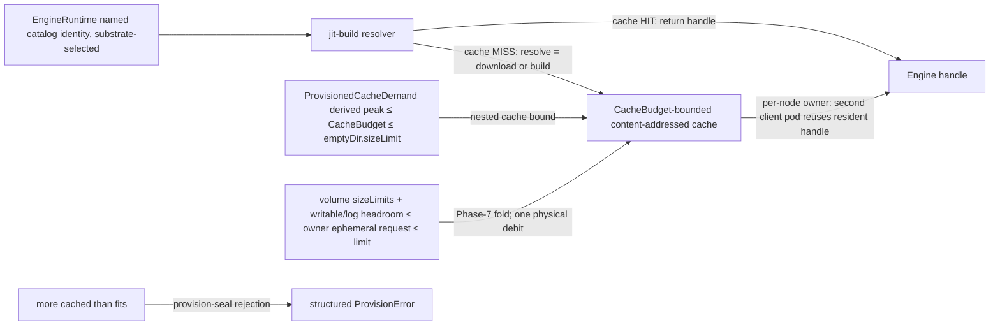

# Phase 32: jit-build engine resolver + CacheBudget cache

**Status**: Authoritative source
**Supersedes**: N/A
**Referenced by**: DEVELOPMENT_PLAN/README.md, DEVELOPMENT_PLAN/legacy_tracking_for_deletion.md, DEVELOPMENT_PLAN/overview.md, DEVELOPMENT_PLAN/phase_08_capability_binder.md, DEVELOPMENT_PLAN/phase_15_base_image_registry.md, DEVELOPMENT_PLAN/phase_31_determinism_kernel.md, DEVELOPMENT_PLAN/phase_33_infernix_lift.md, DEVELOPMENT_PLAN/phase_34_jitml_lift_cuda.md, DEVELOPMENT_PLAN/phase_35_apple_metal_host_daemon.md, DEVELOPMENT_PLAN/system_components.md
**Generated sections**: none

> **Purpose**: Prove on live linux-cpu that the shared jit-build resolver materializes a named `EngineRuntime`
> catalog identity on first miss into the `CacheBudget`-bounded per-node cache owner, that a second client pod
> on the same node reuses the cache-resident handle, and that "more cached than fits" is rejected at the
> post-bind `provision-seal` by the capacity
> fold — engines jit-resolved into a bounded cache, never baked and never fetched by URL.

---

## Phase Status

📋 Planned. Nothing in this phase is implemented; every sprint below is 📋 Planned and every prescriptive
statement is design intent, never a tested amoebius result. This phase opens after the Phase 31 gate (the
determinism kernel — the `ContentAddress` primitive and the content-addressed store the cache is keyed against)
and runs on the **linux-cpu** substrate in **Register 3** (live infrastructure): a single-node `kind` cluster
brought up by the Phase 14 midwife, whose base image (Phase 15) already bakes the shared **jit-build resolver
and its build toolchain** but **no** ML engine payload. Where a shape below is already exercised in a sibling
system — jitML's `Engines/Loader.hs` (the lazy per-kernel JIT: cache HIT → handle, MISS → compile-then-store)
is the shape this round generalizes to all three asset kinds, and infernix's `Runtime/Worker.hs` *selects* the
engine by `adapterType` and never fetches it — that is **sibling evidence, not an amoebius result**; infernix's
`docker/Dockerfile` `curl`-tar-at-image-build and its `model_cache.py` `minioadmin` fallback are the
baked/URL/second-secret-store anti-patterns this phase deliberately **replaces**, not inherits. Status
transitions are recorded reverse-chronologically here once work begins.

## Phase Summary

This phase delivers the first live amoebius realization of the ML-asset lifecycle's Tier 1 — the **engine** — as
one bounded, content-addressed, resolve-on-first-miss cache, and proves it against a minimal linux-cpu engine
identity. It does three things and stops there. First, it builds the **`CacheBudget`-bounded content-addressed
cache**: a bounded typed pool with one per-node owner, content-addressed by the resolved asset's SHA, carrying
an explicit `CacheBudget` nested inside the owner pod's node-ephemeral provision, with pin-aware pruning. The
pure input is a `CachePopulationDemand`, not a caller-authored cache peak: each selected closed-catalog
identity resolves to catalog-owned `AssetMaterializationDemand` metadata containing its content address, final
resident bytes, and peak temporary download/build/unpack bytes, and the population demand carries a finite
first-miss concurrency policy plus its typed budget/backing. Binding derives a private
`ProvisionedCacheDemand` independently for every node or host: it unions observed residents and selected new
assets by content address, rejects conflicting resident-size metadata, keeps observed entries charged until
deletion is observed, and adds the exact largest permitted set of simultaneous temporary materializations.
One owner enforces one in-flight materialization per digest, so repeated clients share that flight while
distinct first misses remain bounded. Separately, the owner's ephemeral request reserves its bounded cache
volume plus writable-layer/log headroom. Both checks reuse the Phase-7 capacity fold so "more cached than fits"
is not a runtime disk-full. On the in-cluster lane the cache-owner pod
renders explicit CPU/memory/`ephemeral-storage` requests+limits and a bounded disk-backed `emptyDir`; no shared
writable `hostPath` bypasses Kubernetes accounting. Second, it builds the **jit-build resolver** —
`resolve = {download | build}` on first miss — that takes a named `EngineRuntime` catalog identity, returns a
handle on a cache HIT, and on a MISS downloads a prebuilt engine or builds it from source (using the Phase-15
baked toolchain) into the content-addressed cache; there is no arm to author a URL, because the identity is
drawn from the closed catalog, never authored. Third, it proves **node-level reuse through the one cache
owner**: a second client pod on the same node that names the same identity receives the cache-resident handle
and pays no re-materialization — the first-miss cost is amortized without mounting one pod's ephemeral volume
into another pod.

The scope deliberately stops at the engine tier (Tier 1) and one live first-miss/reuse/resource-admission proof. The
`ModelArtifact` staging tier (Tier 2) and the JIT kernel tier (Tier 3) are named as the same cache shape but are
not exercised here; the infernix CPU-inference lift that rides this resolver is [Phase 33](phase_33_infernix_lift.md),
and the CUDA/jitML lift is [Phase 34](phase_34_jitml_lift_cuda.md). The cache is **ephemeral and node-scoped** —
re-materializable on first miss, deliberately *not* the durable state of the stateless `replicas=1` control-plane
singleton (whose only durable state is the Vault-enveloped MinIO bucket); evicting the cache costs a
re-resolve, never data loss. The engine lane exercised here is `linux-cpu` only; the Apple-Metal and `Cuda`
lanes are out of contract for this gate.

**Substrate:** linux-cpu — the whole gate runs on a single-node `kind` cluster on a linux-cpu host in Register 3;
no apple, linux-cuda, or windows substrate is touched, while the provision-derived peak `≤ CacheBudget` rejection is
a pure fold that needs no live infrastructure (it is the Phase-7 fold applied to `CacheBudget`).

**Register:** 3 — live infrastructure; the first-miss materialization and the second-pod reuse run against real
pods on the live cluster, and the run emits a proven/tested/assumed ledger naming that register.

**Gate:** on the single-node linux-cpu `kind` cluster, the **one named representative identity**
`EngineRuntime.LlamaCppCpu@<pinned-ver>` (§32.0 concrete corpus) resolves on **first miss** into the
`CacheBudget`-bounded content-addressed cache (`resolve = {download | build}`, using the Phase-15 baked
resolver/toolchain, with **no** public-registry pull authored by URL), and the materialized bytes
**sha256-match the Phase-0-committed catalog pin** (`test/oracle/phase_32_oracle.dhall`: expected
`ContentAddress`, final-resident/temporary byte bounds, and `--version` string) — proving the named arm
actually ran, not that a marker
blob was written: on the `build` arm the baked toolchain compiled the pinned source recipe (attested by an
`strace`/argv-shim record of the absolute-path `g++` invocation, §M.5), on the `download` arm the bytes were
served by the in-cluster `distribution` registry (attested by its access log), and the returned handle is
**live** (the resolved binary executes and reports the pinned `--version`). The cache-owner manifest is
asserted to carry the provisioned CPU/memory/`ephemeral-storage` requests+limits and bounded
`emptyDir.sizeLimit`; its ephemeral request covers that volume bound plus writable/log headroom, and it has no
writable `hostPath`. A **second client pod on the same node** that names the
identity reuses the **cache-resident handle** with **no re-materialization**, proven by an
**OS-boundary observer** — the resident entry's inode/mtime is unchanged across the second lookup and the
registry access log and egress capture record **zero** new pull — never by a resolver-emitted counter. A
`CachePopulationDemand` whose catalog-derived, placement-specific `ProvisionedCacheDemand` — digest-deduped
observed/selected residents plus bounded concurrent temporary materialization — exceeds `CacheBudget`,
or whose bounded volumes plus writable/log headroom exceed the owner's ephemeral request, is
rejected by the Phase-7 fold at the Phase-8 **`provision-seal`** before any resolve runs, and each materialized artifact's
measured final/temp on-disk size is asserted within its catalog-owned `AssetMaterializationDemand` so a real
resolve cannot silently bust the budget. A catalog/observed size conflict, deletion credited before
observation, or resident-plus-temp peak
one byte over the backing is likewise rejected before resolve. The gate turns **red** when the committed
seeded mutant `resolve _ = <fixed-marker-bytes>` (identity
resolver, §M.2) is substituted — the sha256/version/arm-executed assertions fail — and when the `prune = pure
()` mutant is substituted (the pin-eviction assertion fails). The run emits a Register-3
proven/tested/assumed ledger recording first-miss resolution, cross-pod reuse, and pin-aware eviction as
*tested on linux-cpu*, the URL-foreclosure and required bounded-`CacheBudget` field as *proven-in-types*, the
numeric cache/ephemeral inequalities as *checked at the post-bind provision seal*, and the
model/kernel tiers (Phases 33/34) and cross-node/cross-substrate reuse as **UNVERIFIED**.

## Gate integrity

The gate's "representative set" is **exactly one** closed-catalog identity: `EngineRuntime.LlamaCppCpu@<pinned-ver>`
(a linux-cpu `llama.cpp` engine arm), exercised on **both** resolve arms — `build` (from the pinned source
recipe compiled by the baked toolchain) and `download` (the same bytes served by the in-cluster `distribution`
registry). Its oracle is **authored and committed in Phase 0, before `src/Amoebius/Jit/*` exists**, in
`test/oracle/phase_32_oracle.dhall`, a hand-authored table (independent of the SUT — never regenerated from the
resolver's own output, §M.3) carrying, per identity: the expected `ContentAddress` (`sha256` of the
materialized engine bytes), the catalog-owned final-resident and peak-temporary byte `Quantity` operands for
both resolve arms, and the expected `--version` string the live binary reports. Raw deployment input selects
that identity but cannot override those `AssetMaterializationDemand` operands. The
`test/negative/phase_32_cache_over_budget.dhall`,
`test/negative/phase_32_cache_digest_size_conflict.dhall`,
`test/negative/phase_32_cache_deletion_credit.dhall`,
`test/negative/phase_32_cache_concurrency_overflow.dhall`, and
`test/negative/phase_32_ephemeral_under_reserved.dhall` fixtures,
`test/oracle/phase_32_resource_shape.json` (the independent owner+two-client image/resource/slot/transition
witness), the pinned source recipe, and the compile-fail negative
(Sprint 32.1) are committed alongside it in the same Phase-0 pass. The committed seeded mutants the gate must turn red
(§M.2), drawn from the operator set: **(a)** `resolve _ = <fixed 16-byte marker>` (effect swap — the resolver
does no real work); **(b)** `prune = pure ()` (dropped effect — pruning is dead code); **(c)** an
identity-resolver whose stored bytes are one byte short of the pin (guard weakening). Each is committed under
`test/mutants/phase_32/` and re-run every gate, not hand-run once.

The **live** representative set remains exactly the one identity above. The pure capacity subcorpus may select
additional members of the already-closed catalog solely to exercise distinct-digest
`BoundedParallel n` arithmetic; those members are not claimed as live-resolved Phase-32 evidence.

## Resource provision — owner, clients, and resolve transitions

The cache byte proof remains the nested proof above, but it is only one field of a complete workload proof.
Binding derives an identity-keyed envelope for the cache-owner Pod and for both live client Pods. Every
container row includes lifecycle, selected-platform `ImageArtifact`, CPU/memory/ephemeral-storage
requests+limits, runtime working set, writable-rootfs allowance (or read-only root), and log headroom. Each
Pod row also carries Pod overhead, bounded disk/memory volumes, derived mapped ConfigMap/Secret/projected/token
payloads, durable claims and attachment classes (none in the representative fixture), the owner's one
`InClusterCacheDemand` or a client's `cache = None`, and `accelerator = None`. Resolver download/build/unpack,
compiler subprocess CPU/RSS, import workspace, pipe/network buffers, and temporary files execute inside the
owner container and are included in that owner's runtime and cache-temporary operands; the typed client
handle is a library protocol and creates no client-service Pod. The in-cluster `distribution` registry and
standing platform Pods remain charged as live survivors; this phase does not treat the download endpoint as
free supply.

The live race epoch is exact: one owner plus two overlapping clients consume three pod/IP slots on the
selected node, while same-digest requests share one in-flight materialization and distinct digests obey the
finite semaphore. Image content/snapshots/import workspace for all three selected images are folded once by
digest/chain identity on their layout-routed physical backing. A unique CSI PVC would consume one driver slot
even when mounted by several containers; the committed fixture uses only `NodeLocal`/`emptyDir` storage and
therefore has zero CSI attachments. The owner is a kind-correct Deployment with
`DeploymentRolloutPolicy.Recreate`; there is no separate `RecreateAfterObservedGone` constructor. An
`emptyDir`-backed old owner and all clients drain, every old Pod UID remains a live commitment through
termination, and image/snapshot/writable/log/cache extents remain in the resident-resource ledger until their
own observed deletion/GC. The amoebius scheduler's aggregate CAS refuses a replacement unless that exact
old+new+retained-artifact high-water fits; Pod API absence alone never credits physical bytes. Any rolling
policy must provision the full old+new owner/cache high-water explicitly and cannot reuse the steady-state
`CacheBudget` proof.

After controller expansion, the binder serializes exhaustive `desiredObjects` for all rendered and derived
Kubernetes objects, not selected kinds, and joins observed survivors with old/new/apply-before-prune.
`EtcdLogicalDemand { desiredObjects, churn, model }` includes revisions, Leases and Events; only private
`ProvisionedEtcdLogicalDemand.derivedPeak <= backendQuotaBytes` may continue. Physical capacity separately fits
backend-at-quota plus WALs, retained/saving snapshots and defrag old+new workspace. Live object/quota/backend
readback must equal the witness. One-byte logical/physical shortages and `drop_api_object_demand.dhall`,
`drop_etcd_churn.dhall` or `drop_etcd_model.dhall` reject before Pod creation.

The gate harness and filesystem/network observer are a bounded host execution unit with executable digest,
CPU/memory, capture/log/scratch bytes and finite probe concurrency; they are not another Kubernetes Pod.
Only opaque provisioned projections may render the three Pods. The live oracle reads back exact image IDs,
container resources, Pod overhead, volume/mapped-file bounds, writable/log high-water, cache path and
`sizeLimit`, placement, pod/IP and CSI usage, image-store objects, and the owner semaphore/single-flight limit,
in addition to the existing on-disk cache proof. One-unit/one-byte-short fixtures cover owner and client CPU,
memory, logical ephemeral, each physical backing, image pull/import workspace, pod/IP slots, a matched CSI
attachment case, cache temporary/resident space, and host-observer CPU, memory, capture/log/scratch. Committed
mutants that drop a
client or owner envelope (`test/mutants/phase_32/drop_client_envelope.dhall`,
`drop_owner_envelope.dhall`), erase the owner image demand (`drop_owner_image.dhall`), permit an `(n+1)`th
distinct materialization, or start a replacement owner before old-cache absence is observed
(`early_owner_replacement.dhall`), or omit the host observer (`drop_host_observer_envelope.dhall`) must turn
the gate red before materialization.

## Doctrine adopted

- [`content_addressing_doctrine.md §4.5`](../documents/engineering/content_addressing_doctrine.md#45-the-ml-asset-lifecycle-one-bounded-content-addressed-cache-resolved-on-first-miss)
  — *the ML-asset lifecycle: one bounded content-addressed cache, resolved on first miss*: the central adoption —
  Tier 1's `EngineRuntime` is a **named, jit-resolved** identity (never baked, never URL-fetched), the cache is a
  bounded typed pool with an explicit `CacheBudget` and pin-aware pruning, and the trade is stated plainly (baking
  gave no-network-at-boot; the cache pays a first-miss materialization amortized across every later use).
- [`service_capability_doctrine.md` §4.1](../documents/engineering/service_capability_doctrine.md#41-the-inferenceengine-capability--the-engine-is-target-offering-selected-and-jit-resolved-never-authored)
  — *the `InferenceEngine` capability — the engine is substrate-selected and jit-resolved, never authored*: the
  closed `EngineRuntime` union has **no arbitrary-`Url`/`Download` arm**; the `.dhall` *selects* an arm by the
  detected substrate and can never *author* a fetch, and the shared jit-build resolver materializes the named
  identity on first miss — the engine-as-a-capability side this phase realizes at runtime.
- [`resource_capacity_doctrine.md §3`](../documents/engineering/resource_capacity_doctrine.md#3-the-types-quantity-capacity-demand-budget)
  and [`§4`](../documents/engineering/resource_capacity_doctrine.md#4-the-total-fold-fits-carve-place-and-the-nesting)
  — *the `Quantity` types and the total `fits`/`carve` fold*: `CachePopulationDemand` selects only catalog
  identities and carries a finite first-miss concurrency plus typed backing/`CacheBudget`; the catalog, not the
  deployment, supplies each `AssetMaterializationDemand`'s resident and temporary operands. Binding derives
  the placement-specific private `ProvisionedCacheDemand`, deduplicating observed/selected residents by
  digest and adding bounded temporary overlap. `CacheBudget` is nested inside the cache-owner pod's bounded
  `emptyDir` and ephemeral-storage envelope, and this derived peak bound is the **same** checked capacity fold
  Phase 7 built and Phase 8 invokes at `provision-seal` — "more cached than fits" is rejected by that fold,
  not discovered as a runtime
  disk-full.
- [`image_build_doctrine.md §7`](../documents/engineering/image_build_doctrine.md#7-what-amoebius-bakes-vs-builds--the-base-container-is-the-supply-chain)
  — *what amoebius bakes vs builds*: the base image bakes the jit-build **resolver + toolchain** (the
  build-from-source path this phase drives on a MISS) but holds the ML **engine payloads** out as named cache
  identities — the Phase-15 split this phase exercises live for the first time.
- [`illegal_state_catalog.md §3.25`](../documents/illegal_state/illegal_state_ml_asset.md#325-an-ml-asset-named-by-arbitrary-url-or-an-unready--unlanded-model)
  — *an ML asset named by arbitrary URL is unrepresentable*: the foreclosure shifted from the old "no `Download`
  arm (baked)" to **"no arbitrary-URL arm (a closed named catalog) + a `CacheBudget`-bounded cache"** — the engine
  identity has no URL syntax (type-foreclosed, Gate 1); an over-budget cache is constructible input rejected
  at the post-bind `provision-seal`.
- [`content_addressing_doctrine.md §2`](../documents/engineering/content_addressing_doctrine.md#2-the-three-tier-store-blobs--manifests--pointers)
  — *the content-addressed store*: the cache keys resolved engine payloads by `sha256(bytes)` (the Phase-31
  `ContentAddress` primitive), so a MISS-then-store and a HIT are the write-once, self-naming discipline of the
  store, applied to the ephemeral per-node cache owner rather than the durable MinIO bucket.
- [`testing_doctrine.md` §2](../documents/engineering/testing_doctrine.md#2-three-registers-of-amoebius-testing)
  — *three registers of amoebius testing*: this phase's gate reaches **Register 3** (live infrastructure) and
  emits a proven/tested/assumed ledger naming that register, with the model/kernel tiers (33/34) marked deferred.

## Sprints

## Sprint 32.1: The `CacheBudget`-bounded content-addressed cache + peak-occupancy provision fold 📋

**Status**: Planned
**Implementation**: `src/Amoebius/Jit/Cache.hs` (the bounded typed pool — content-addressed by resolved-asset
SHA, pin-aware pruning, HIT/MISS lookup) and `src/Amoebius/Jit/CacheBudget.hs` (the `CacheBudget` as a
`Quantity` nested inside the cache-owner pod's bounded node-ephemeral allocation + the peak-occupancy
provision fold reusing
`Amoebius.Capacity.Fold`) —
target paths, not yet built.
**Blocked by**: Phase 7 gate (the `fits`/`carve` capacity fold this bound reuses); Phase 31 gate (the
`ContentAddress` primitive the cache keys against); Phase 25 gate (the content-addressed store shape).
**Independent Validation**: a property + boundary suite shows the cache admits no key from a free string,
proven by a **committed compile-fail negative fixture** `test/negative/phase_32_freestring_key.hs` (registered
in the Phase-6 negative corpus, authored in Phase 0) whose expected failure is asserted **by locus** — it must
fail to typecheck at the attempt to construct a cache key from a `String`/`Text`/`Url` with the specific
"no instance / no exported constructor" compile error — paired with a positive that differs only in keying from
`sha256(real bytes)` and compiles. A QuickCheck property shows every resident entry is reachable only by hashing
real bytes and a lookup is a total HIT/MISS, with `cover`/`classify` obligations forcing **≥30% MISS** and
**≥30% HIT** cases (§M.4) so the generator does not emit one near-constant shape. The capacity suite starts
from `CachePopulationDemand`: deployment input may select closed-catalog identities and a finite first-miss
concurrency, but cannot author resident or temporary sizes; binding obtains those operands only from each
catalog-owned `AssetMaterializationDemand`. For both node and host placements, the independent oracle unions
the observed resident set and selected new set by content address, rejects conflicting resident sizes, adds
the largest allowed set of distinct missing-asset temporary peaks, and keeps an entry selected for deletion
charged until a later observation reports it absent. The resulting private `ProvisionedCacheDemand` must fit
the typed budget/backing; the pod arm separately includes all disk-backed volume bounds plus owner
writable/log headroom. Exact-fit passes, while digest-size conflict, bounded-parallel-derived overflow,
resident-plus-temp one-byte overflow, early deletion credit, and under-reserved pod shapes return their
specific structured `Left` before any resolve. The independent oracle is the committed fixture's hand-authored
expected verdict, not the fold's own output. No cluster required.
**Docs to update**: `documents/engineering/content_addressing_doctrine.md`,
`documents/engineering/resource_capacity_doctrine.md`, `DEVELOPMENT_PLAN/system_components.md`.

### Objective
Adopt [`content_addressing_doctrine.md §4.5`](../documents/engineering/content_addressing_doctrine.md#45-the-ml-asset-lifecycle-one-bounded-content-addressed-cache-resolved-on-first-miss)'s
bounded-typed-pool and [`resource_capacity_doctrine.md §3/§4`](../documents/engineering/resource_capacity_doctrine.md#3-the-types-quantity-capacity-demand-budget):
build the `CacheBudget`-bounded content-addressed cache so that "more cached than fits" is rejected at the
post-bind **`provision-seal`** — the same checked capacity fold that bounds every other budget rejects an
over-budget derived peak
before the resolver ever materializes an asset.

### Deliverables
- `Amoebius.Jit.Cache` — a bounded typed pool keyed by `sha256(resolved-bytes)` (the Phase-31 `ContentAddress`),
  with a total HIT/MISS lookup and pin-aware pruning (a pinned resident is never evicted; unpinned residents are
  pruned to keep under budget).
- `AssetMaterializationDemand` metadata owned by the closed catalog — content address, final resident bytes,
  and resolve-arm temporary download/build/unpack peak — plus `CachePopulationDemand`, which selects those
  identities, a node/host cache location, typed backing/`CacheBudget`, and a finite positive first-miss
  concurrency. Raw deployment syntax has no fields with which to override catalog byte operands.
- The private `ProvisionedCacheDemand` derived per exact node/host placement. Its peak is the byte sum of the
  digest union of observed residents and selected new residents plus the largest allowed distinct-miss
  temporary overlap; identical digests debit resident bytes once, conflicting resident sizes reject, one
  in-flight resolve per digest makes same-digest clients share temporary work, and observed residents remain
  charged until GC deletion is observed.
- For the pod arm, `CacheBudget` references the cache-owner pod's declared disk-backed `VolumeId`, and the
  private derived peak satisfies `derived peak ≤ CacheBudget ≤ emptyDir.sizeLimit` plus
  `Σ disk-backed volume sizeLimits + writable-layer allowance + log headroom ≤
  ownerPod.ephemeralStorage.request ≤ ownerPod.ephemeralStorage.limit`, delegating to
  `Amoebius.Capacity.Fold`. These proofs describe one physical debit from node ephemeral storage and are never
  summed again as a separate host-cache consumer; an over-budget or under-reserved spec returns the tagged
  `Left`, not a runtime disk-full.
- An in-file honesty note: the cache is **ephemeral and node-scoped**, not the singleton's durable state; the
  cache/volume/request nesting is checked at `provision-seal`, while *actual* on-disk residency under concurrent resolves
  is the runtime residue deferred to the live gate.

### Validation
1. There is no exported path to a cache key from a free string; the only path to a resident entry is content
   addressing — asserted by the committed compile-fail negative `test/negative/phase_32_freestring_key.hs`
   (Phase-6 corpus, Phase-0-authored) failing *at the key-construction locus* with the "no exported
   constructor" error, paired with the sha256-keyed positive that compiles.
2. Prove deployments can select catalog identities but cannot supply or override resident/temporary byte
   operands. For each node/host placement, independently recompute the digest union and the largest finite
   first-miss temporary set; exact fit passes, while an unbounded concurrency policy has no constructor. A
   one-byte resident-plus-temp overflow, a `BoundedParallel n` whose derived temp set overflows, and an owner
   volume/ephemeral under-reservation each return the expected **tagged** `Left` before any resolver process
   or cache write.
3. Give the fold duplicate selections with one content address (one resident debit), conflicting resident
   sizes for one address (specific metadata-conflict rejection), and an observed unpinned entry selected for
   deletion. The entry stays charged and overflow still rejects until a later observed snapshot reports it
   absent; only that snapshot earns capacity credit. Exercise the concurrency boundary with distinct missing
   digests and the single-flight boundary with repeated same-digest clients.
4. **Pin-aware pruning is exercised, not declared:** a cache filled to `CacheBudget` with a mix of pinned and
   unpinned residents, then asked to admit one more resident, **evicts an unpinned resident, never a pinned
   one**, and leaves measured peak/final occupancy within `CacheBudget`; the property asserts a pinned resident is present and a
   named unpinned resident is absent post-prune. The committed seeded mutant `prune = pure ()` (§32.0-b) must
   turn this clause red (the over-budget residency survives). This is the pure-pool property; its live on-disk
   counterpart is the Sprint 32.4 postflight residency measurement. The fold's expected verdicts are the
   Phase-0 fixture's hand-authored table, never the fold's own output.

### Remaining Work
The whole sprint (📋 Planned).

## Sprint 32.2: The jit-build resolver — `resolve = {download | build}` on first miss, no URL arm 📋

**Status**: Planned
**Implementation**: `src/Amoebius/Jit/Resolver.hs` (the shared resolver: a named `EngineRuntime` catalog
identity → cache HIT → handle, or MISS → download-a-prebuilt-engine / build-from-source → store → handle) —
target path, not yet built.
**Blocked by**: Sprint 32.1 (the cache the resolver stores into); Phase 15 gate (the base image baking the
resolver + its build toolchain — `g++` / pinned compilers for the linux-cpu build path); Phase 8 gate (the
`InferenceEngine` binder + the closed, substrate-selected `EngineRuntime` union the resolver keys on).
**Independent Validation**: a boundary suite drives the resolver against a Phase-0-committed backend fixture
whose served/compiled bytes **sha256-match the `test/oracle/phase_32_oracle.dhall` pin** — not an arbitrary
"fake" blob: a backend returning unpinned bytes must fail the suite, foreclosing a resolver that stores fixed
marker bytes. A cold cache triggers exactly one `resolve` (download-or-build) then stores, and the stored
`ContentAddress` **equals the committed pin**. A warm cache returns a handle with **no** resolve, proven by an
argv-recording shim / `strace` observer at the OS boundary (§M.5) capturing **zero** toolchain-or-backend
subprocess on the warm path — never inferred from a resolver-emitted counter. The resolver has no code path
that accepts a free URL, proven by the committed compile-fail negative `test/negative/phase_32_url_arm.hs`
(Phase-6 corpus, Phase-0-authored) failing *at the constructor locus* with "no `Url`/free-string constructor",
paired with a closed-catalog-identity positive that compiles. Every subprocess is absolute-path-resolved,
asserted by the shim capturing the full absolute `argv[0]` (never a bare `PATH`-relative name). The committed
seeded mutant `resolve _ = <fixed 16-byte marker>` (§32.0-a) turns the stored-`ContentAddress` assertion red.
**Docs to update**: `documents/engineering/content_addressing_doctrine.md`,
`documents/engineering/service_capability_doctrine.md`, `documents/engineering/image_build_doctrine.md`,
`DEVELOPMENT_PLAN/system_components.md`.

### Objective
Adopt [`content_addressing_doctrine.md §4.5`](../documents/engineering/content_addressing_doctrine.md#45-the-ml-asset-lifecycle-one-bounded-content-addressed-cache-resolved-on-first-miss)'s
Tier-1 resolve-on-miss and [`service_capability_doctrine.md` §4.1](../documents/engineering/service_capability_doctrine.md#41-the-inferenceengine-capability--the-engine-is-target-offering-selected-and-jit-resolved-never-authored):
implement the shared jit-build resolver so a named engine identity is materialized on first miss into the
bounded cache — downloaded prebuilt or built from source with the Phase-15 baked toolchain — with **no arm to
author a URL**, replacing infernix's `curl`-tar-at-image-build with the one shared resolve-on-miss path.

### Deliverables
- `Amoebius.Jit.Resolver` — `resolve :: EngineRuntime -> IO EngineHandle` that returns a handle on a cache HIT
  and, on a MISS, runs `download | build` (the recipe carried by the closed-catalog identity, never an authored
  URL), stores the result content-addressed into `Amoebius.Jit.Cache`, then returns the handle.
- The build-from-source path invoking the Phase-15 baked toolchain by absolute path (no `PATH`, no env), and the
  download path resolving a named prebuilt identity — neither exposing a free-URL or free-string constructor.
- An in-file honesty note: URL-foreclosure and identity-from-closed-catalog are **proven-in-types** (Gate 1); the
  first-miss materialization *succeeding* on real infrastructure is the live residue proven at the phase gate; the
  model (Tier 2) and kernel (Tier 3) tiers reuse this resolver but land in Phases 33/34.

### Validation
1. A cold cache triggers exactly one `resolve` and stores the result, **and the stored `ContentAddress`
   equals the `test/oracle/phase_32_oracle.dhall` pin**; a warm cache returns a handle with no resolve,
   proven by the argv-shim/`strace` observer recording zero backend subprocess on the warm path; there is no
   path that accepts a URL or free string, asserted by the committed compile-fail negative
   `test/negative/phase_32_url_arm.hs` failing at the constructor locus with its named error, paired with the
   closed-catalog positive that compiles. The committed seeded mutant `resolve _ = <fixed-marker>` (§32.0-a)
   must turn the stored-address assertion red.
2. Every subprocess the resolver spawns is invoked by absolute path, never resolved against `PATH` — asserted
   by an OS-boundary argv-recording shim capturing the full absolute `argv[0]`, not a resolver self-report.

### Remaining Work
The whole sprint (📋 Planned).

## Sprint 32.3: Per-node cache-owner reuse across client pods 📋

**Status**: Planned
**Implementation**: `src/Amoebius/Jit/CacheOwner.hs` (the typed per-node cache owner, bounded ephemeral volume,
client-handle protocol, and concurrency discipline that makes a second client pod's lookup a HIT against the owner's
resolved copy) — target path, not yet built.
**Blocked by**: Sprint 32.1, Sprint 32.2; Phase 16 gate (the typed SSA reconciler that renders the cache owner
and client pods); Phase 19 gate (the platform stack the pods schedule onto).
**Independent Validation**: on the live single-node `kind` cluster, one cache-owner pod and two client pods
scheduled to the same node name the same `EngineRuntime` identity; the **first** client request is a MISS that
the owner materializes into its bounded disk-backed `emptyDir` (stored bytes sha256-matching the
`test/oracle/phase_32_oracle.dhall` pin), the **second** client lookup is a **HIT** that reuses the resident
handle with **no re-materialization** — proven by an **OS-boundary
observer**, not a resolver counter: the resident entry's inode and mtime are unchanged across the second
lookup, and the in-cluster `distribution` registry access log plus an egress capture record **zero** new pull
or build subprocess for the second client. The owner's rendered manifest has exact provision-derived
CPU/memory/`ephemeral-storage` requests+limits, `emptyDir.sizeLimit`, and no writable `hostPath`; the applied
ephemeral request is at least the volume bound plus writable/log headroom. The
concurrent-first-miss race is **operationalized** so the two client requests provably overlap: both block on a
shared barrier and materialization is
deliberately slowed (a payload-size floor or an injected delay in the fixture backend) so **both provably
observe MISS before either store commits** — then the suite asserts exactly one final resident entry, that its
bytes hash to the catalog pin, and that **no partial/temp file remains** in the cache directory. The owner
consumes the placement's `ProvisionedCacheDemand`: its semaphore enforces the finite maximum of distinct
first-miss materializations and its digest-keyed single-flight table makes same-digest requests share one
catalog-derived temporary footprint. A race that never overlaps (serialized by accident) does not satisfy
this clause.
**Docs to update**: `documents/engineering/content_addressing_doctrine.md`,
`documents/engineering/daemon_topology_doctrine.md`, `DEVELOPMENT_PLAN/system_components.md`.

### Objective
Adopt [`content_addressing_doctrine.md §4.5`](../documents/engineering/content_addressing_doctrine.md#45-the-ml-asset-lifecycle-one-bounded-content-addressed-cache-resolved-on-first-miss)'s
"every later pod on that host reuses the cache-resident copy": make the bounded cache **single-owner per
node**, so the first-miss materialization cost is paid once per node per identity and amortized across every
client pod that later names it, without a shared writable host mount.

### Deliverables
- `Amoebius.Jit.CacheOwner` — the per-node cache-owner location, bounded volume, client-handle protocol, and
  read/write discipline that lets a second client HIT the owner's resident copy, with two concurrent
  first-misses converging to one stored,
  content-addressed copy (idempotent write-once, the store's confluence applied to the ephemeral cache), a
  finite distinct-first-miss semaphore, and one single-flight entry per digest. It accepts the opaque
  `ProvisionedCacheDemand`, never a runtime-authored resident/temp allowance.
- The pod wiring (rendered by the Phase-16 reconciler) that gives the owner a bounded disk-backed `emptyDir`
  with exact `ephemeral-storage` requests/limits and gives clients typed handles; clients never mount the
  owner's writable volume and no `hostPath` is used.
- An in-file honesty note: cross-pod reuse and the idempotent concurrent-miss convergence are **tested on
  linux-cpu** at the gate; cross-node reuse is out of contract (the cache is node-scoped by design — a different
  host is a legitimate first miss).

### Validation
1. Client A's first `resolve` is a MISS that the cache owner materializes to bytes hashing to the catalog pin;
   Client B on the same node HITs the resident handle with no re-materialization, proven by the OS-boundary
   observer — unchanged resident inode/mtime and zero new registry pull / build subprocess for Client B —
   never by a resolver-emitted counter. The owner pod's resource/volume projection matches its pure provision.
2. Two concurrent first-misses, **forced to overlap by a shared barrier and slowed materialization so both
   observe MISS before either commits**, converge to exactly one stored copy whose bytes hash to the catalog
   pin; no partial/temp file remains and no torn or duplicate resident entry exists. Repeated same-digest
   requests use one in-flight temporary extent, while an `(n+1)`th distinct missing digest queues and the
   observed simultaneous set never exceeds the provisioned finite concurrency.
3. Mark an observed unpinned resident for pruning and attempt a replacement whose resident-plus-temp peak
   would fit only if deletion were credited early. Admission remains rejected until an OS-boundary rescan
   observes the old inode absent; the unchanged snapshot can never mint capacity credit from intent alone.

### Remaining Work
The whole sprint (📋 Planned).

## Sprint 32.4: The live first-miss / reuse / resource-admission gate + Register-3 ledger 📋

**Status**: Planned
**Implementation**: `test/dhall/phase_32_engine_cache.dhall` (the gate workflow naming a linux-cpu engine
identity) and `test/live/EngineCacheGate.hs` (the Register-3 gate harness) — target paths, not yet built.
**Blocked by**: Sprint 32.1, Sprint 32.2, Sprint 32.3; Phase 14 gate (the live `kind` cluster + substrate
detect); Phase 15 gate (the baked resolver/toolchain and the in-cluster `distribution` registry proving no
public pull).
**Independent Validation**: the gate `.dhall` names the one representative identity
`EngineRuntime.LlamaCppCpu@<pinned-ver>` (§32.0); the harness asserts the first client request is a first-miss
materialization by the per-node cache owner into its `CacheBudget`-bounded `emptyDir`, whose stored bytes
**sha256-match the
`test/oracle/phase_32_oracle.dhall` pin**, the named arm **actually executed** (the argv-shim/`strace`
observer recorded the absolute-path `g++` compile on the `build` arm, or the `distribution` registry access log
recorded the in-cluster serve on the `download` arm), and the returned handle is **live** (the binary runs and
reports the pinned `--version`). "**Zero public-registry pull authored by URL**" is discharged by **live
network observation** (a CNI/egress capture plus the `distribution` audit log showing no request to any public
registry host), **in addition to** the Gate-1 type-level foreclosure — the type check alone does not satisfy
this clause. The owner manifest's CPU/memory/`ephemeral-storage` requests+limits and
`emptyDir.sizeLimit` match its pure provision, the request covers that bound plus writable/log headroom, and
it contains no writable `hostPath`. A second client pod on
the same node reuses the cache-resident handle with the reuse proven by the OS-boundary observer (unchanged
resident inode/mtime, zero new pull for the second client). A **postflight on-disk peak/final measurement**
confirms pin-aware eviction and resource enforcement: with the cache filled to budget, a pinned resident
survives and an unpinned resident is evicted, and measured peak/final bytes stay within `CacheBudget` (measured
on disk, not self-reported). The gate independently reconstructs the observed resident digest map and matches
it to the private `ProvisionedCacheDemand`; selected-for-deletion entries remain charged until absent. A
catalog digest-size conflict, a resident-plus-bounded-temp peak one byte over budget/backing, a
bounded-parallel-derived capacity overflow, or an ephemeral request smaller than the bounded volume plus writable/log
headroom is rejected by the Phase-7 fold at the Phase-8 **`provision-seal`** before any resolve, and each
materialized artifact's
measured final and temporary on-disk sizes are asserted `≤` its catalog-owned
`AssetMaterializationDemand`. The committed seeded mutants `resolve _ = <fixed-marker>` (§32.0-a) and
`prune = pure ()` (§32.0-b) must turn the
gate red. The run emits a Register-3 proven/tested/assumed ledger.
**Docs to update**: `documents/engineering/content_addressing_doctrine.md`, `DEVELOPMENT_PLAN/README.md`
(flip the Phase-32 status when the gate passes), `DEVELOPMENT_PLAN/substrates.md`.

### Objective
Adopt [`content_addressing_doctrine.md §4.5`](../documents/engineering/content_addressing_doctrine.md#45-the-ml-asset-lifecycle-one-bounded-content-addressed-cache-resolved-on-first-miss)
end-to-end under [`testing_doctrine.md` §2 — Register 3](../documents/engineering/testing_doctrine.md#2-three-registers-of-amoebius-testing):
wire the resolver, the bounded per-node cache owner, and client reuse through one live linux-cpu workload and
prove the gate — exact ephemeral-resource projection, first-miss resolution, second-client reuse, and the
provision-rejected over-budget peak — without
overclaiming the model/kernel tiers (Phases 33/34).

### Deliverables
- The gate `.dhall` naming exactly the one representative identity `EngineRuntime.LlamaCppCpu@<pinned-ver>`
  (§32.0 concrete corpus), driving one cache-owner pod, two client pods on the same node, and the Phase-0-committed
  resident-plus-temp over-budget, digest-size-conflict, deletion-credit, bounded-parallel-overflow, and
  ephemeral-under-reserved fixtures.
- The Phase-0-committed oracle `test/oracle/phase_32_oracle.dhall` (expected `ContentAddress`, catalog-owned
  final-resident/temporary byte `Quantity`, `--version`) and the committed seeded mutants under
  `test/mutants/phase_32/` (`resolve _ = <marker>`,
  `prune = pure ()`, one-byte-short store), authored before `src/Amoebius/Jit/*` exists.
- The gate harness asserting: (i) first-miss materialization whose stored bytes sha256-match the committed pin,
  the named arm actually ran (OS-boundary argv-shim/`strace` or registry audit log), the handle is live
  (reports the pinned `--version`), and **zero public-registry pull** by live egress/CNI capture plus the
  `distribution` audit log; (ii) exact provision-derived CPU/memory/`ephemeral-storage` and
  `emptyDir.sizeLimit` on the owner, with the ephemeral request covering that volume bound plus writable/log
  headroom and no writable `hostPath`; (iii) a second-client cache HIT with no
  re-materialization, proven by unchanged resident inode/mtime and zero new pull; (iv) a postflight on-disk
  peak/final measurement showing the pinned resident survived, the unpinned resident was evicted, and measured
  bytes stayed within `CacheBudget`; (v) the resident-plus-temp over-budget, digest-size-conflict,
  deletion-before-observation, bounded-parallel-overflow, and ephemeral-under-reserved specs' **tagged**
  `ProvisionError`/`Left`s at the provision seal, with each artifact's measured final/temp sizes within its catalog-owned
  `AssetMaterializationDemand`. The gate must turn red under the committed mutants.
- A Register-3 ledger recording: URL-foreclosure and the required bounded-`CacheBudget` field as
  **proven-in-types**, the numeric cache/ephemeral inequalities as **provision-seal checked**, first-miss resolution
  and cross-pod reuse as **tested on linux-cpu**, and the Tier-2 model / Tier-3 kernel reuse as **deferred**
  (Phases 33/34), with cross-node and cross-substrate reuse explicitly not asserted.

### Validation
1. On the live linux-cpu `kind` cluster, the first client resolves
   `EngineRuntime.LlamaCppCpu@<pinned-ver>` through the cache owner on
   first miss into the cache, the stored bytes sha256-match the committed `test/oracle/phase_32_oracle.dhall`
   pin, the named arm actually ran (attested by the OS-boundary argv-shim/`strace` on `build` or the
   `distribution` audit log on `download`), and the handle is live (reports the pinned `--version`); "zero
   public-registry pull" is proven by live egress/CNI capture and the registry audit log, not by the type check
   alone. The owner has exact provision-derived ephemeral resources/volume bounds, its request covers those
   bounds plus writable/log headroom, and it has no writable `hostPath`.
   A second client on the node reuses the resident handle with no resolve, proven by unchanged resident
   inode/mtime and zero new pull. The committed seeded mutant `resolve _ = <marker>`
   (§32.0-a) must turn this clause red.
2. A postflight on-disk peak/final measurement confirms pin-aware eviction (pinned resident survives,
   unpinned evicted, measured bytes remain within `CacheBudget`); the committed mutant `prune = pure ()`
   (§32.0-b) must turn this red. A resident-plus-temp one-byte overflow, digest-size conflict, early deletion
   credit, bounded-parallel-derived overflow, and ephemeral-under-reserved owner each return their **tagged** `Left` at the
   Phase-7 fold before any resolve runs, and each materialized artifact's measured final/temp on-disk size is
   within its catalog-owned `AssetMaterializationDemand`.
3. The Register-3 ledger is emitted and marks first-miss resolution, cross-pod reuse, and pin-aware eviction as
   *tested on linux-cpu*, URL-foreclosure and the required bounded-`CacheBudget` field as *proven-in-types*,
   the numeric cache/ephemeral inequalities as *provision-seal checked*, and the
   model/kernel tiers (Phases 33/34) and cross-node/cross-substrate reuse as **UNVERIFIED**.

### Remaining Work
The whole sprint (📋 Planned).

## Documentation Requirements

**Engineering docs to update (when the gate runs, flip the honest layer, never before):**
- `documents/engineering/content_addressing_doctrine.md` — §4.5's Tier-1 engine cache gains its first amoebius
  live datapoint (first-miss resolve + per-node owner reuse on linux-cpu) alongside the existing jitML/infernix
  sibling-evidence rows; annotate that the bounded-cache resolve-on-miss path replaces infernix's
  `curl`-tar-at-image-build, and that the Tier-2/Tier-3 realizations remain Phases 33/34 targets.
- `documents/engineering/service_capability_doctrine.md` — annotate §4.1 that the `EngineRuntime`
  substrate-selected, no-URL provider is first resolved live here; the alternate lanes (Apple-Metal, `Cuda`)
  stay design intent.
- `documents/engineering/resource_capacity_doctrine.md` — record that the §3/§4 `Quantity`/`fits` fold is reused
  as the provision-derived peak `≤ CacheBudget` bound, keeping "more cached than fits" a checked
  `provision-seal` rejection.
- `documents/engineering/image_build_doctrine.md` — the §7 bake-vs-build split (resolver/toolchain baked, engine
  payloads not) gains its first live exercise: the resolver's build-from-source path runs against the baked
  toolchain.
- `documents/illegal_state/illegal_state_catalog.md` — annotate §3.25 that the URL-foreclosure holds live and the
  over-budget-cache rejection reached its `provision-seal` locus on linux-cpu.

**Cross-references to add:**
- `DEVELOPMENT_PLAN/README.md` — flip the Phase-32 status when the gate passes; link this document.
- `DEVELOPMENT_PLAN/substrates.md` — record Phase 32's gate substrate (linux-cpu) in the per-phase substrate map.
- `DEVELOPMENT_PLAN/system_components.md` — register `src/Amoebius/Jit/Cache.hs`,
  `src/Amoebius/Jit/CacheBudget.hs`, `src/Amoebius/Jit/Resolver.hs`, `src/Amoebius/Jit/CacheOwner.hs`, the
  `EngineCacheGate` live suite, and the Phase-0-committed oracle/negative/mutant artifacts
  (`test/oracle/phase_32_oracle.dhall`, `test/negative/phase_32_freestring_key.hs`,
  `test/negative/phase_32_url_arm.hs`, `test/mutants/phase_32/`) as Phase-32 design-first rows.

## Related Documents
- [README.md](README.md) — the live tracker and phase ordering this document sits under
- [development_plan_standards.md](development_plan_standards.md) — the rulebook this document obeys
- [overview.md](overview.md) — the target architecture and the cross-cutting invariant that ML engines are
  jit-resolved into a bounded cache, never baked or URL-fetched
- [system_components.md](system_components.md) — the target component inventory for the `Amoebius.Jit.*` module paths above
- [Content Addressing & Determinism Doctrine](../documents/engineering/content_addressing_doctrine.md) — §4.5 the
  ML-asset lifecycle (Tier-1 engine cache) and §2 the content-addressed store this cache reuses
- [Service Capabilities Doctrine](../documents/engineering/service_capability_doctrine.md) — §4.1 the
  `InferenceEngine` capability whose provider is substrate-selected and jit-resolved, never authored
- [Resource Capacity Doctrine](../documents/engineering/resource_capacity_doctrine.md) — §3/§4 the `Quantity`
  types and the `fits`/`carve` fold reused as the provision-derived peak `≤ CacheBudget` bound
- [Image Build & Registry Doctrine](../documents/engineering/image_build_doctrine.md) — §7 the base image bakes
  the resolver + toolchain but not the engine payloads
- [Illegal-State Catalog](../documents/illegal_state/illegal_state_catalog.md) — §3.25 an ML asset named by
  arbitrary URL is type-foreclosed; a finite derived cache peak above its `CacheBudget` remains constructible
  input but cannot pass the `provision-seal`
- [Testing Doctrine](../documents/engineering/testing_doctrine.md) — §2 the three registers (Register 3 reached here)
- [phase_15](phase_15_base_image_registry.md) — the base image that bakes the jit-build resolver + toolchain this phase drives live
- [phase_31](phase_31_determinism_kernel.md) — the determinism kernel + `ContentAddress` primitive the cache keys against
- [phase_33](phase_33_infernix_lift.md) — the infernix CPU-inference lift that rides this resolver next
- [phase_34](phase_34_jitml_lift_cuda.md) — the jitML/CUDA lift whose kernel tier reuses this resolver
