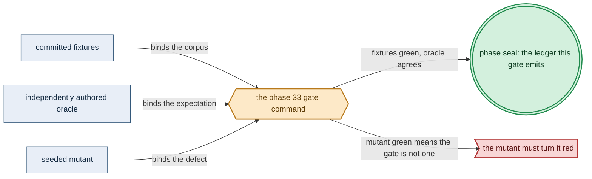

# Phase 33: Pure `renderAll` + rendered-artifact oracles

> **Purpose**: Stand up the pure, total `renderAll :: ProvisionedSpec -> [K8sObject]`, mapping Phase 31's
> unique identity-keyed private render sources to typed objects, and lock its emitted deployment object
> set byte-for-byte with rendered-output goldens — proving the by-construction manifest-safety invariants on
> the emitted objects in-process, before any cluster exists.
> **Read this if**: phase 33 is next in the queue, or a later phase depends on what its gate establishes.

Phase 33 delivers the pure `renderAll` + rendered-output goldens; its design is owned by [namespace_layout_doctrine.md](../documents/engineering/namespace_layout_doctrine.md), [manifest_generation_doctrine.md](../documents/engineering/manifest_generation_doctrine.md), [conformance_harness_doctrine.md](../documents/engineering/conformance_harness_doctrine.md), and the plan for reaching it is owned here.
Register 1: an in-process battery, no cluster.
The Register-1 gate passed on 2026-08-09. Runtime enforcement remains UNVERIFIED.

> **Historical result (invalidated).** Any pass, seal, validation, ledger, receipt, or implementation observation
> in the orientation text above is diagnostic only. The Phase Status section and [tracker](README.md) own current state; the
> target contract below remains normative.

Link-graph metadata

**Status**: Authoritative source
**Supersedes**: N/A
**Referenced by**: DEVELOPMENT_PLAN/README.md, DEVELOPMENT_PLAN/overview.md, DEVELOPMENT_PLAN/phase_11_formal_model_kernel.md, DEVELOPMENT_PLAN/phase_27_illegal_state_covering.md, DEVELOPMENT_PLAN/phase_30_capability_bind.md, DEVELOPMENT_PLAN/phase_31_provision_seal.md, DEVELOPMENT_PLAN/phase_34_chain_kernel_boundary.md, DEVELOPMENT_PLAN/phase_58_object_reconciler.md, DEVELOPMENT_PLAN/phase_59_capacity_scheduler.md, DEVELOPMENT_PLAN/system_components.md
**Generated sections**: none

## Contents
- [Phase Status](#phase-status)
- [Phase Summary](#phase-summary)
- [Gate integrity](#gate-integrity)
- [Doctrine adopted](#doctrine-adopted)
- [Sprints](#sprints)
- [Sprint 33.1: The typed `K8sObject` model + Aeson serialization 📋](#sprint-331-the-typed-k8sobject-model--aeson-serialization-)
- [Sprint 33.2: Pure total `renderAll` + best-practice-by-construction 📋](#sprint-332-pure-total-renderall--best-practice-by-construction-)
- [Sprint 33.3: The rendered-output golden battery (`render-golden`) — the gate 📋](#sprint-333-the-rendered-output-golden-battery-render-golden--the-gate-)
- [Documentation Requirements](#documentation-requirements)
- [Related Documents](#related-documents)

---

## Phase Status

⏸️ Blocked pending Phase-32 revalidation. Reopened 2026-08-19 by the generative re-baseline: the artifact, budget, lift, workflow and evidence calculi change what this phase's gate must cover, so any earlier seal is history and no longer presents completion evidence.

**Opened 2026-08-17** when the preceding phase resealed.
[§S](development_plan_gate_integrity.md#s-universal-artifact-hygiene-gate) clause 15 requires a run to record
the natural architecture it proved and to execute no artifact of another. This phase's last gate recorded no
architecture, so its seal is invalidated as a current result and stands only as history; the rerun differs from
it by naming the lane and architecture the run actually used. A sprint marker below records what that sprint achieved before the amendment; under
[§N](development_plan_phase_model.md#n-reopening-and-amending-a-phase) it is a diagnostic, not surviving closure.

**Pre-natural-architecture status record (invalidated where it claims completion):**

Done (invalidated) — resealed 2026-08-15. `python3 tools/render_manifest_gate.py` passed all ten sides: 30 deployment and
mutant items, all twelve mutants, all ten metrics, and the honesty ledger pass; 31 surfaces join to 46
enumerated items. The project-contained attestation is
`sha256:ea494782b218d35a2dc64587b97224850f903cb44d9af61bd2f0a24f7770b24f`, bound to source snapshot
`sha256:3a9622cca7322c7e…`; Phase 33 owns no remaining migration deferral.

**Pre-containment status record (invalidated where it claims completion):**

Done (invalidated) — sealed 2026-08-12. The migrated gate passed against source snapshot `sha256:34f6b508a276b5b0…`
(1938 non-ignored files) and published a verified pre-containment external attestation
`sha256:105d193d15c907176c594bb81305890191d2f818081bf11c081bb499cd046794`.

**Observed progress — 2026-08-12:** **Policy-conformant.** Every capability check is unchanged and re-run: 18
deployment goldens are byte-locked, nine capability arms render in two shapes each, the nine emitted object
variants are exact, three safety predicates are non-vacuous, the QuickCheck arm/shape coverage floor holds, and
all twelve seeded projection mutants redden at their property loci. Evidence and the ledger move into
`.build/runs/phase_9/<run-id>/`, and 30 run-time items — eighteen corpus deployments and twelve mutant names —
partition one-to-one across the claim surfaces.

**Two surfaces gained the evidence they always had, and seven lost evidence they never had.**
`sole-public-render-facade` and `phase13-compile-totality` are decided by real source checks — the facade
export scan and the `-Werror=incomplete-patterns` assertion — and now join to those checks by name. The other
seven — `aeson-round-trip`, `sealed-render-source-domain`, `deterministic-identity-order`,
`exact-source-identity-projection`, `closed-reconcile-mode`, `default-deny-network-policy`, and
`phase13-validation-locus-ledger` — have no corpus row, mutant, or metric at all, so the ledger carries them
UNVERIFIED. The gap is recorded against Phase 33 in
[`legacy_tracking_for_deletion.md`](legacy_tracking_for_deletion.md).

**Invalidated historical record:**

Done (invalidated). Validated on 2026-08-09 with `python3 tools/render_manifest_gate.py` on
substrate `none` in Register 1. The gate covers eighteen byte-locked deployment goldens, nine emitted object
variants, three non-vacuous rendered-output safety predicates, one QuickCheck property over all capability
arms and both shapes, and twelve property-locus mutants. The sealed ledger is
`dynamically-resolved`.
This phase implements only the pure `renderAll` half; Phase 58 still owns live reconciliation and runtime
enforcement remains UNVERIFIED.

## Phase Summary

This phase delivers the pure manifest renderer: the typed `K8sObject` model, the total function
`renderAll :: ProvisionedSpec -> [K8sObject]` that emits the complete whole-deployment Kubernetes object set from Haskell ADTs serialized via Aeson — no Helm, no text template, no `values.yaml` — and the rendered-output golden battery that locks that output and proves its by-construction safety. `renderAll` performs no I/O, reaches no apiserver, and is total over the opaque, capacity/capability-checked `ProvisionedSpec` the Phase-31 bind/provision boundary produces. Phase 31 has already sealed a `Map K8sObjectIdentity (ProvisionedRenderSource K8sObjectIdentity)`; `KubernetesObjectId` is only a
compatibility alias for `K8sObjectIdentity`, not a second identity type. Duplicate
`(apiGroup,apiVersion,kind,namespace,name)` sources cannot inhabit it, and Namespace, ResourceQuota, scheduler,
admission, RBAC, Lease, and CRD identities have one deployment-global source owner. This phase total-maps
each source through private `renderSourcePrivate` and serializes deterministic identity order; it does not
re-open list concatenation or decide ownership from rendered bytes.
Each source also carries a closed reconcile mode. Ordinary declarative fields may enter scoped SSA, but the
scheduler root-ledger's entries/CAS version and the mandatory Lease's holder/renewal fields are absent from
the generic apply projection and remain exclusively mutable through their typed actions; `renderAll` cannot
reset either live state machine.
Each source also retains its closed `RenderActivation` (`Immediate | BootstrapSchedulerStage |
AfterBootstrapAddonCutover | AfterManagedCapacityReady`). `renderAll` lists the complete desired object set
and never hides later-stage objects; Phase 58's typed diff/enactor filters actions by that sealed activation,
so managed-node taint/admission cannot be generically applied during the initial scheduler bootstrap.
The same serializer module is available only inside the amoebius package for Phase 56's
`BootstrapRegistryAction`: it can serialize the already provisioned registry/proxy source subset, but that
typed cycle-break exposes neither `renderSourcePrivate` nor a per-service render function to callers. The
public manifest facade exports `renderAll` only.
Raw execution cardinality/rollout, `PodRuntimeMetadataSource`, and
accelerator source/workload/coexistence maps are not renderer inputs. Ordinary objects project only the
`MaterializedExecutionInstance`s selected from private `ProvisionedExecutionEpochs`; the associated
Deployment rolling projection carries the exact checked pair with `maxSurge + maxUnavailable > 0`, so no renderer branch
can emit a zero-progress `RollingUpdate`;
the exact desired `ProvisionedExecutionController` arm selects Deployment, StatefulSet, DaemonSet, Job, or
host-process enactment and preserves only that kind's legal cardinality/policy. Prior-only controllers are
transition witnesses/actions and never render as desired objects. Every guarded Pod template copies admission-protected
deployment/generation/source/revision/reservation-template identity, absent `nodeName`, and
`schedulerName=amoebius-capacity`; the standard platform
projection also renders the independently provisioned scheduler/RBAC/config/reservation-CRD objects before
guarded controllers. Its own fully provisioned bootstrap Pod is the sole domain-equal
`schedulerName=default-scheduler` exception.
`ProvisionedKubeletRuntimeMetadataDemand`s remain capacity witnesses and emit no manifest scalar; and only
the renderable whole-device claim/affinity projection derived from `ProvisionedCudaOwnerDemand` reaches a
Kubernetes pod (`ProvisionedMetalOwnerDemand` remains host-tier). Thus the emitted object set
is a *value* the suite inspects end to end. The battery does two things: it pins the emitted `[K8sObject]` **byte-for-byte** against a golden fixture (any change to the renderer's output is a red diff, never a silent drift), and it asserts the **rendered-artifact-oracle illegal states** directly on the emitted objects — an
unsafe manifest is not a value `renderAll` can return, so a golden test over the output proves the property with
no cluster. What is *not* here: snapshot-bound typed actions (including scoped SSA, staged delete/resume,
host actions, scheduler-ledger CAS, and Job completion/cleanup), wait-for-ready, drift-heal, and live
convergence — all deferred to [Phase 58](phase_58_object_reconciler.md); and
the `chain`/`[Step]` `--dry-run` plan render, which is [Phase 34](phase_34_chain_kernel_boundary.md). This phase
locks the **`renderAll`** step of the pre-cluster spine.

**Phase scope:** one cohesive claim — *rendering is pure and total, and every emitted object satisfies a predicate authored from the requirement*. What the renderer produced is never the expectation it is checked against.

**Substrate:** `none` — no host, no cluster; the gate is an in-process `cabal test` render-and-golden battery
analogous to the Phase-26 decode battery and the Phase-25 `dhall type` corpus.

**Lane:** none ([§L](development_plan_standards.md#l-one-substrate-discipline))

**Register:** 1 — pure/golden, in-process, no cluster ([§K](development_plan_standards.md#k-honesty-proven--tested--assumed)).

**Depends on:** [Phase 31](phase_31_provision_seal.md) — the sealed `ProvisionedSpec` whose identity-keyed render sources this phase maps to objects.

**Gate:** `python3 tools/render_manifest_gate.py` passes the oracle-pinned corpus,
property coverage, source-totality scan, twelve mutant runs, and ledger checks. See the
Phase-33 ledger for the exact tested and UNVERIFIED boundary.

*Design intent. Phase 33's gate apparatus; [§M](development_plan_standards.md#m-gate-integrity-a-gate-cannot-be-passed-by-a-stub) owns its clauses.*

## Gate integrity

- **Independent oracle.** Predicates authored from the deployment requirements — hardened pod projection, exact resource projection, the derived allow-edge set, and the absence of bare ingress — each written from what an emitted object must satisfy rather than from what the renderer produced.
- **Committed mutants.** Mutants unharden a pod, widen a resource projection, drop an image digest, open a wild ingress, and add an undeclared allow edge; each must redden its own predicate and no other.
- **Specific-reason negatives.** Every negative names the predicate it fails, paired with a positive differing only in the projected field under test.
- **Fresh challenge.** Not applicable — `renderAll` is pure and total, so the independently authored predicates stand in for a live challenge.
- **Extension conformance (§M.13).** Not applicable: this gate delivers no extension.

## Doctrine adopted

- [`jit_artifact_doctrine.md`](../documents/engineering/jit_artifact_doctrine.md) — every artifact pure `renderAll` + rendered-output goldens emits is a recipe over a content address, never an authored file.
- [`namespace_layout_doctrine.md §2`](../documents/engineering/namespace_layout_doctrine.md#2-one-namespace-per-platform-capability--the-derived-set)
  — **one namespace per platform capability, derived never authored.** The render-golden battery asserts every
  emitted object lands in its doctrine-**derived** namespace and that a free-text or cross-capability namespace
  is not a value `renderAll` can emit — the rendered-output enactment that gates the namespace-layout foreclosure.
- [`manifest_generation_doctrine.md §2`](../documents/engineering/manifest_generation_doctrine.md#2-the-typed-manifest-model-renderall-is-the-sole-public-pure-function-to-objects)
  — **the typed manifest model: `renderAll` is a pure, total function to objects.** Adopt the pure, total,
  cluster-free `renderAll :: ProvisionedSpec -> [K8sObject]` whose output is a value amoebius inspects before any object reaches a cluster; the record *is* the manifest, serialized via Aeson, with no intermediate template and no `values.yaml`. **Only the pure-render half is adopted here**; the apply/reconcile engine of that doctrine's [§5](../documents/engineering/manifest_generation_doctrine.md#5-the-applyreconcile-engine-snapshot-bound-typed-actions) is the live-band [Phase 58](phase_58_object_reconciler.md) residue.
- [`manifest_generation_doctrine.md §3`](../documents/engineering/manifest_generation_doctrine.md#3-best-practice-by-construction-an-unsafe-manifest-is-not-constructible)
  — **best practice by construction: an unsafe manifest is not constructible.** The renderer emits a hardened
  `securityContext` on every pod, least-privilege per-workload RBAC, default-deny-plus-derived-allow
  NetworkPolicies, exact provision-derived CPU/memory/ephemeral-storage, bounded pod-local
  volume/writable/log-headroom, mapped files, durable/native-cache/migration, pod/CSI-placement identities,
  controller/admission/executor, and accelerator fields, and Secret objects that carry a
  Vault coordinate
  and never bytes — a manifest lacking any of these is not a value `renderAll` can return.
- [`conformance_harness_doctrine.md §3`](../documents/engineering/conformance_harness_doctrine.md#3-the-load-bearing-invariant-rendering-never-touches-live-infrastructure)
  — **the load-bearing invariant: rendering never touches live infrastructure**, and its [§4](../documents/engineering/conformance_harness_doctrine.md#4-the-spine-decode--bindexpand--planresolve-infrastructure--provision--renderall--plan--dry-run) decode →
  bind/expand → plan/resolve infrastructure → provision → `renderAll` → plan → dry-run spine (this phase locks the **`renderAll`** step). `renderAll` is a pure function of
  committed source that completes in-process with no apiserver, no credentials, no Vault; the byte-for-byte
  golden is a fixture of the renderer, and the rendered-artifact-oracle validation locus catches a large share
  of the illegal-state catalog here, not at runtime.
- [`illegal_state_catalog.md §3.11`](../documents/illegal_state/illegal_state_security.md#311-an-unsafe-workload-no-resource-limits-no-hardened-securitycontext)
  (the unsafe workload — no resource limits, no hardened `securityContext`),
  [`§3.7`](../documents/illegal_state/illegal_state_security.md#37-accidental-insecure--backdoor-ingress)
  (accidental insecure / backdoor ingress), and
  [`§3.6`](../documents/illegal_state/illegal_state_security.md#36-blocking-networkpolicy-services-cant-reach-each-other)
  (blocking / underived NetworkPolicy) — the three states realized here at the **rendered-artifact-oracle**
  locus. Honors [`§6`](../documents/illegal_state/illegal_state_techniques.md#6-three-layers-of-foreclosure-and-the-honesty-they-force)
  — three layers of foreclosure: these are proven on the *emitted objects* in Register 1; the runtime-checked
  claim that the live cluster enforces them stays deferred to the live band.
- [`resource_capacity_types.md §3.1`](../documents/engineering/resource_capacity_types.md#31-the-systematic-provision-matrix)
  and [`§4`](../documents/engineering/resource_capacity_doctrine.md#4-the-total-fold-fits-carve-place-and-the-nesting)
  — the canonical resource axes and the opaque `ProvisionedSpec` boundary this phase projects into typed
  Kubernetes objects; the renderer neither recomputes demand nor accepts an unchecked service value.
- [`platform_services_doctrine.md §9`](../documents/engineering/platform_services_doctrine.md#9-the-loadbalancer-and-the-single-wild-ingress-path)
  (east-west connectivity derived from the dependency graph; the single wild-ingress path) and
  [`§10`](../documents/engineering/platform_services_doctrine.md#10-every-execution-unit-declares-its-complete-resource-envelope)
  (every execution unit declares a complete resource envelope) — the *owners* of the connectivity and resource rules; this phase adopts
  their **rendering enactment** (the derived NetworkPolicy and exact provisioned resource fields on the emitted
  objects), not the rules themselves.
- [`generated_artifacts_doctrine.md §3`](../documents/engineering/generated_artifacts_doctrine.md#3-the-rule)
  — generated artifacts are emitted from a Haskell source of truth and **never committed**: the rendered
  `[K8sObject]` set is never a checked-in deployment artifact; the byte-for-byte golden is a *test fixture* that pins the renderer, not a committed manifest. - [`testing_doctrine.md §2`](../documents/engineering/testing_doctrine.md#2-the-registers-of-amoebius-testing) — **Register 1** (pure/golden, in-process, no cluster): the register this phase's gate reaches; and [§4](../documents/engineering/testing_doctrine.md#4-no-skips-fail-fast-and-the-per-run-ledger-artifact) — the per-run
  proven/tested/assumed ledger the battery emits, marking runtime-enforcement correspondence UNVERIFIED
  (owned by the live band).

## Sprints

> **Current validation record.** Every sprint is covered by the 2026-08-15 reseal. Historical dates,
> pass/seal claims, repository-resident evidence paths, and `Remaining Work: None` statements below describe
> the pre-amendment capability record only; they do not override current status. Functional and validation
> outcomes remain target requirements. Any instruction to commit generated output, freeze dependency resolution,
> retain a resolved version, path, or integrity hash, or consume repository-resident evidence, ledgers, or
> enumerations is superseded by the current generated-artifact and dynamic-resolution doctrine. Closure was
> established by the current phase gate plus universal artifact hygiene.

## Sprint 33.1: The typed `K8sObject` model + Aeson serialization 📋
**Status**: Planned
**Implementation**: `src/Amoebius/Manifest/{K8sObject,Types}.hs`; the closed object-kind sum, typed specs,
Aeson instances, and canonical encoder are built and validated.
**Blocked by**: None.
**Independent Validation**: the object model compiles under the pinned GHC 9.12.4; a hand-built object round-trips through
Aeson (`toJSON`/`fromJSON`) to an equal value, and its encoding matches a small byte-for-byte golden —
proving the record *is* the manifest with no template layer.
**Docs to update**:
`documents/engineering/manifest_generation_doctrine.md` (Phase-33 backlink for the typed object model),
`DEVELOPMENT_PLAN/system_components.md`.

### Objective
Adopt [`manifest_generation_doctrine.md §2`](../documents/engineering/manifest_generation_doctrine.md#2-the-typed-manifest-model-renderall-is-the-sole-public-pure-function-to-objects):
build the typed Haskell `K8sObject` model — every Kubernetes object amoebius emits as a typed record
serialized to JSON via Aeson, exactly the `object [...]` discipline the prodbox sibling already applies to its supporting objects (*sibling evidence, not an amoebius result*) — so a manifest is a value, not interpolated
text.

### Deliverables
- A typed `K8sObject` sum covering the full deployment object set, each variant a Haskell record with an
  Aeson `ToJSON`/`FromJSON` instance; the record is the manifest — no `values.yaml`, no text template.
- The Secret variant carries a Vault coordinate (a reference), structurally admitting no literal secret
  bytes; the whole `SecretRef` / Vault model stays owned by the vault/PKI doctrine and is not restated.

### Validation
1. The model compiles on the pinned toolchain; a hand-built object round-trips through Aeson to an equal
   value and encodes to a byte-for-byte golden.

### Remaining Work
Done. Live Kubernetes decoding and apiserver correspondence remain UNVERIFIED.

## Sprint 33.2: Pure total `renderAll` + best-practice-by-construction 📋
**Status**: Planned
**Implementation**: `src/Amoebius/Manifest/Render.hs` (`renderSourcePrivate ::
ProvisionedRenderSource identity -> K8sObject`) and `src/Amoebius/Manifest/RenderAll.hs` (`renderAll ::
ProvisionedSpec -> [K8sObject]` over the sealed unique source map and deterministic serialization) — built.
**Blocked by**: None.
**Independent Validation**: exhaustive compiler options, source-boundary checks, and the public export scan
establish the total pure facade. QuickCheck covers every capability arm and both shapes through the real
provision fold; exact-output properties inspect the returned object values.
**Docs to update**: `documents/engineering/manifest_generation_doctrine.md` (backlink §3 to the Phase-33
pure renderer; keep the typed-action reconciler as the live-band residue),
`documents/engineering/platform_services_doctrine.md` (the rendering enactment of the §9/§10 rules),
`DEVELOPMENT_PLAN/system_components.md`.

### Objective
Adopt [`manifest_generation_doctrine.md §3`](../documents/engineering/manifest_generation_doctrine.md#3-best-practice-by-construction-an-unsafe-manifest-is-not-constructible):
implement the pure, total `renderAll` that emits the complete whole-deployment object set — including generated
operator installs (CRDs, controller Deployment, CR instances) as typed objects rather than upstream charts —
with every supported CR's replica/resource/PVC/controller fields exactly projecting its provisioned child
envelope. Deployment alone projects the checked nonzero-progress surge/unavailable pair; StatefulSet projects
partition-zero native serial or amoebius-staged OnDelete without feature-gated `maxUnavailable`; DaemonSet
projects exactly one positive Surge/Unavailable or staged OnDelete; Job projects exact completions,
parallelism, backoff, `restartPolicy=Never`, `podReplacementPolicy=Failed`, and the finite amoebius cleanup
model while omitting `ttlSecondsAfterFinished`. The safe shape is the *only* shape it can return.
Every pod has a hardened `securityContext`; policies are default-deny plus graph-derived allow edges.
Every container has non-zero CPU, memory, and `ephemeral-storage` requests and limits. Disk-backed scratch is
bounded, while memory-backed volumes retain their access, persistence, and one-carrier-per-epoch witnesses.
  private ordinary workload `MaterializedExecutionInstance`s selected from checked
  `ProvisionedExecutionEpochs`; platform-selected digested images whose provisioned content/snapshot/import peak fits the layout-selected node
  backing; exact durable StatefulSet claim-slot/backing/presentation/usable/provisioned sizes; derived
  kind-exact Deployment/StatefulSet/DaemonSet/Job fields, admission-protected execution provenance annotations,
  reservation-template digest, absent `nodeName`, `schedulerName`, exact namespace ResourceQuota, and the
  unique deployment-global scheduler-system/config/admission/taint/RBAC/root-ledger objects; derived
  full-offering accelerator-owner-container extended-
  resource requests/limits and affinity where applicable, expanded one uniform workload per immutable
  homogeneous offering class; and Vault-coordinate Secret references. Every mapped ConfigMap/Secret/
  downward-API/service-account-token source projects exactly once into its API object and pod volume, with no
  authorable byte aggregate. Every operator projection includes the provisioned child-envelope namespace,
  quota, webhook resources and readiness edge. Every private volume/registry/schema migration includes its
  exact replacement controls and provisioned copy/verify or DDL Job; source+target failure retention is not a
  renderer choice. ZooKeeper and Patroni objects project their provisioned member/child envelopes, volumes,
  retention, and failover controls exactly.
  The module surface contains no `BoundDeployment`, raw execution intent, `PodRuntimeMetadataSource`,
  `CudaOwnerDemand`, or `MetalOwnerDemand` input. Source/revision/ordinal equality and complete
  `ExecutionEpoch` derivation, `KubeletRuntimeMetadataDemand` costing, and accelerator source/policy equality
  and coexistence derivation remain sealed behind `ProvisionedExecutionEpochs`,
  `ProvisionedKubeletRuntimeMetadataDemand`, `ProvisionedCudaOwnerDemand`, and
  `ProvisionedMetalOwnerDemand`; `renderAll` consumes only their manifest-relevant private projections.
  For `Observability`, the renderer copies the already-derived Prometheus CPU/memory envelope, evaluation and
  TSDB cost-model versions, and `evaluationInterval` exactly into the workload and Prometheus/rule-group
  configuration. It also projects the provisioned monitoring claim slot/backing/presentation and rounded
  capacity into exact PVC/PV `capacity`, `volumeMode`, and fsType and projects retention time/size plus the
  model-selected WAL/config settings from the
  same `maxScrapeSamplesPerSecond`, `retention`, and structural query operands. It also renders Prometheus
  query concurrency/sample/timeout flags, a sole-routable query-admission proxy with the series/range bounds,
  and NetworkPolicy denying direct query API access. It never recomputes
  cardinality or storage geometry, substitutes a fixed request or PVC, or permits a shorter effective interval.

### Deliverables
- `renderAll :: ProvisionedSpec -> [K8sObject]`, pure and total (no I/O, no apiserver, no partial head),
  producing best-practice-by-construction objects. It maps Phase 31's sealed
  `Map K8sObjectIdentity (ProvisionedRenderSource K8sObjectIdentity)` one-for-one, proves every emitted
  object's identity equals its map key, and treats `KubernetesObjectId` as an alias only; shared identities
  already have one global source owner and output order is deterministic. The `ProvisionedSpec`, its service
  projections, and `renderSourcePrivate` are private; raw decoded, merely bound, or individual service values
  cannot call a renderer. `renderAll` is the sole public manifest function.
- A closed `RenderReconcileMode` projection that includes only immutable schema/initial fields for the
  scheduler root ledger and mandatory Lease. Ledger rows/CAS versions and Lease holder/renewal fields have no
  generic-SSA source path and are owned only by the corresponding typed actions in Phase 58.
- Exact preservation of each source's `RenderActivation`; the golden covers all four arms. The renderer emits
  the complete desired set irrespective of stage, while a companion partition oracle proves the later action
  planner can select only the identities active at a given readiness witness.
- An in-file honesty note: this is the render half only — the SSA/ApplySet apply, prune, wait-for-ready, and
  release ledger are the live-band [Phase 58](phase_58_object_reconciler.md) reconciler, run by the
  Deployment-`replicas=1` control-plane daemon under its mandatory Lease (no bespoke election).

### Validation
1. The `-Werror=incomplete-patterns`/`-Werror=incomplete-uni-patterns` compile passes. The boundary check
   reports no partial call and no `IO`/`unsafePerformIO`/partial-`Prelude` name reachable from `renderAll`.
   A QuickCheck property over legal whole-deployment `ProvisionedSpec` values constructed through
   the real provision fold — with `cover`/`checkCoverage` obligations (hard-failing) that force each
   capability arm, both shapes, and every renderable `K8sObject` variant to fire at its stated minimum —
   confirms every emitted pod is hardened, every NetworkPolicy is default-deny + derived-allow, and every
   resource-bearing object exactly projects its checked CPU, memory, pod-ephemeral, per-container private
   allowance, bounded disk-/access-indexed memory-volume, selected-platform image content/snapshot metadata,
   mapped-source/API-object identity, durable presentation/allocation, pod/CSI attachment identity,
   admission/migration execution, and accelerator provisions, including the single-debit proofs.
   Every supported CR exactly projects its kind-indexed finite child-pod/PVC/controller bound stored in its
   private provisioned controller source.
   - Deployment `RollingUpdate` preserves its checked pair with at least one positive operand;
   - StatefulSet uses native partition zero or staged OnDelete and never renders feature-gated
     `maxUnavailable`;
   - DaemonSet uses exactly one positive Surge/Unavailable or staged OnDelete;
   - Job preserves exact completions, **parallelism**, backoff, `restartPolicy=Never`,
     `podReplacementPolicy=Failed`, finite cleanup projection, and completion-ledger identity while
     rendering no `ttlSecondsAfterFinished`; and host-process rows emit no Kubernetes workload.
   - Every guarded Pod template has exact admission-protected
     deployment/generation/source/revision/reservation-template annotations, absent `nodeName`, exact
     protected resource/volume/runtime fields, and the provisioned scheduler name; the unique fully
     provisioned scheduler bootstrap Pod alone uses `default-scheduler`, exact pods=1 namespace quota, and
     unique-node affinity under its cycle-break witness.
   - Scheduler/RBAC/ config/ledger objects are present before their consumers.
   - No prior-only removed unit renders.
   - Every `Observability` object exactly projects the binder-derived Prometheus envelope, both cost-model
     versions, global/per-rule-group effective evaluation interval, exact StatefulSet
     claim/backing/presentation/PVC/PV rounded capacity, and TSDB time/size retention, Prometheus query
     flags, sole-routable query-admission proxy controls, direct-query NetworkPolicy, and WAL/config from
     its mandatory finite `MonitoringWorkBudget`.
   - An independent test-side storage oracle rederives retained blocks, WAL/head, old+new compaction
     overlap, and query/temp headroom from the structural query operands, then applies the pinned filesystem
     overhead and allocation quantum; the rendered claim must equal the resulting private
     `provisionedBytes`, not merely fit the backing.
   - The same property independently checks that controller webhook, object/registry/query gateway, Pulumi
     executor, ZooKeeper/Patroni child, and copy/schema Job pod fields equal their private envelopes;
     migration targets equal their private rounded volume/object maps; and rendered etcd quota/Event/Lease
     controls equal the logical-capacity operands.
2. A one-byte-short monitoring backing and a one-quantum-short allocation reject before `renderAll`; the
   exact-fit neighbor renders its checked claim.
3. Duplicate global identities reject before `ProvisionedSpec`. Omission/duplication mutations fail domain
   equality, while source-map permutations retain identical identity-sorted bytes.
4. The emitted activations form a complete, disjoint four-arm domain. Stage-changing and stage-filtering
   mutants turn the partition property red.

### Remaining Work
Done. SSA, ApplySet pruning, readiness, and live convergence remain Phase-58 work.

## Sprint 33.3: The rendered-output golden battery (`render-golden`) — the gate 📋
**Status**: Planned
**Implementation**: `test/spec/manifest/{RenderGoldenSpec,RenderGoldenGate,RenderGoldenProps,DepGraphOracle}.hs`
and eighteen `test/golden/manifest/*.json.golden` fixtures cover every capability arm and both shapes.
**Blocked by**: None.
**Independent Validation**: `cabal test render-golden` checks canonical bytes and all three non-vacuous
properties. The independent dependency oracle catches extra edges, and all twelve property mutants turn red.
**Docs to update**: `documents/engineering/conformance_harness_doctrine.md` (record the
rendered-artifact-oracle locus realized in Register 1), `documents/illegal_state/illegal_state_catalog.md`
(annotate §3.6/§3.7/§3.11 with realized foreclosure layer = rendered-artifact-oracle, Register 1),
`documents/engineering/namespace_layout_doctrine.md` (backlink the one-namespace-per-capability rule to the
Phase-33 render-golden battery — the rendered-output enactment that gates its foreclosure),
`documents/engineering/generated_artifacts_doctrine.md`, `DEVELOPMENT_PLAN/README.md` (flip the Phase-33
status when the gate passes).

### Objective
Adopt [`conformance_harness_doctrine.md §3`](../documents/engineering/conformance_harness_doctrine.md#3-the-load-bearing-invariant-rendering-never-touches-live-infrastructure)
and its [§4](../documents/engineering/conformance_harness_doctrine.md#4-the-spine-decode--bindexpand--planresolve-infrastructure--provision--renderall--plan--dry-run) spine's **`renderAll`** step: assemble the in-process battery that pins `renderAll`'s output byte-for-byte
and proves the three rendered-artifact-oracle illegal states — the unsafe-workload
([`§3.11`](../documents/illegal_state/illegal_state_security.md#311-an-unsafe-workload-no-resource-limits-no-hardened-securitycontext)),
backdoor-ingress ([`§3.7`](../documents/illegal_state/illegal_state_security.md#37-accidental-insecure--backdoor-ingress)),
and blocking/underived-NetworkPolicy ([`§3.6`](../documents/illegal_state/illegal_state_security.md#36-blocking-networkpolicy-services-cant-reach-each-other))
states — directly on the emitted objects, all without a cluster.

### Deliverables
- Eighteen canonical goldens cover every capability arm under `SingleNode` and `Distributed`.
- Shape checks preserve the selected workload kind and sealed source-identity domain.
- Workloads project checked resources, hardened security, content-digested images, bounded volumes,
  schedulers, and accelerator claims.
- Corpus-wide pod and NetworkPolicy counts are non-zero.
- Only the declared edge may use load-balancer exposure; no bare Ingress arm is emitted.
- Every NetworkPolicy is default-deny and its edge set equals the independent `DepGraphOracle` result.

#### Twelve committed seeded mutants

Each committed mutant must turn its targeted property red, independently of the byte-diff check:

- **R1/R2:** alter checked resources or the root-filesystem/ephemeral projection.
- **R3/R4:** remove bounded scratch or memory-volume accounting.
- **R5/R6:** change image-platform or durable-source projection.
- **R7:** omit the accelerator owner claim.
- **R8:** change the controller-kind projection.
- **R9:** alter the monitoring resource projection.
- **S1:** emit an unhardened pod.
- **S2:** expose an undeclared load balancer.
- **S3:** add an undeclared allow edge.
- A Register-1 proven/tested/assumed ledger led by a runtime-UNVERIFIED banner: the emitted objects are
  proven safe *as values* in-process; no claim is made that a live cluster enforces them (deferred to the
  live band). The golden fixtures are test artifacts, never committed deployment manifests.

### Validation
1. `cabal test render-golden` is green — output matches the oracle-pinned byte-for-byte goldens (canonical
   encoding) across the concrete corpus, shape-completeness and corpus-wide non-zero counts hold (no vacuous
   universal), and every rendered-output invariant holds — the NetworkPolicy check by allow-edge set equality
   against the independent `DepGraphOracle`. Each of the twelve committed seeded mutants (R1 CPU/memory drift,
   R2 pod-ephemeral/private allowance, R3 unbounded scratch/cache, R4 memory-volume lifecycle/accounting,
   R5 image-platform/store accounting, R6 durable-size drift, R7 accelerator projection, R8 CR-child
   projection, R9 monitoring-work projection, S1 unhardened pod, S2 wild/Keycloak-skipping route, and S3
   undeclared allow edge), with its golden
   regenerated to its own output, must
   turn the corresponding **property assertion** red — so a mutant is caught by a safety property, not merely by
   the byte diff.

### Remaining Work
Migrate the gate's generated output to `.build/runs/`, externally attest it, and rerun after Phase 32 closes.
Live enforcement remains UNVERIFIED.

## Documentation Requirements

**Engineering docs to update (when the gate runs, flip the honest layer, never before):**
- `documents/engineering/manifest_generation_doctrine.md` — backlink §2/§3 to the Phase-33 pure renderer and
  rendered-output goldens; keep §5's snapshot-bound typed action reconciler explicitly as the live-band
  [Phase 58](phase_58_object_reconciler.md) residue, run by the Deployment-`replicas=1` control-plane daemon under its
  mandatory Lease.
- `documents/engineering/conformance_harness_doctrine.md` — record the rendered-artifact-oracle validation
  locus this phase realizes as the **`renderAll`** step of the pre-cluster spine, in Register 1.
- `documents/illegal_state/illegal_state_catalog.md` — annotate §3.6 / §3.7 / §3.11 with their realized
  foreclosure layer (rendered-artifact-oracle → Register 1); keep the runtime-checked (layer-3) enforcement
  claim deferred to the live band.
- `documents/engineering/namespace_layout_doctrine.md` — backlink the one-namespace-per-platform-capability
  rule: the render-golden battery is the rendered-output enactment that gates the namespace-layout
  foreclosure (every emitted object lands in its doctrine-derived namespace, and a free-text or
  cross-capability namespace is not a value `renderAll` can emit).
- `documents/engineering/generated_artifacts_doctrine.md` — note that the rendered `[K8sObject]` set is emitted from Haskell and never committed; the byte-for-byte golden is a test fixture of the renderer.

**Cross-references to add:**
- `DEVELOPMENT_PLAN/README.md` — flip the Phase-33 status when the gate passes; link this document.
- `DEVELOPMENT_PLAN/substrates.md` — the Phase-33 `none` gate row.
- `DEVELOPMENT_PLAN/system_components.md` — register `src/Amoebius/Manifest/{K8sObject,Types,Render}.hs` and
  the `render-golden` test-suite as Phase-33 design-first rows.

## Related Documents
- [README.md](README.md) — the live tracker and phase order this document serves
- [development_plan_standards.md](development_plan_standards.md) — the rulebook this document obeys (the design-proof acceptance token: *rendered-output proven*, never *runtime proven*)
- [overview.md](overview.md) — target architecture and the pure-render / no-Helm posture
- [Manifest Generation Doctrine](../documents/engineering/manifest_generation_doctrine.md) — [§2](../documents/engineering/manifest_generation_doctrine.md#2-the-typed-manifest-model-renderall-is-the-sole-public-pure-function-to-objects) the pure
  renderer adopted here; [§3](../documents/engineering/manifest_generation_doctrine.md#3-best-practice-by-construction-an-unsafe-manifest-is-not-constructible) best-practice-by-construction; [§5](../documents/engineering/manifest_generation_doctrine.md#5-the-applyreconcile-engine-snapshot-bound-typed-actions) the SSA reconciler deferred to the live band
- [Conformance Harness Doctrine](../documents/engineering/conformance_harness_doctrine.md) — the `renderAll` step
  of the pre-cluster spine and the invariant that rendering never touches live infrastructure
- [Illegal State Catalog](../documents/illegal_state/illegal_state_catalog.md) — [§3.6](../documents/illegal_state/illegal_state_security.md#36-blocking-networkpolicy-services-cant-reach-each-other)/[§3.7](../documents/illegal_state/illegal_state_security.md#37-accidental-insecure--backdoor-ingress)/[§3.11](../documents/illegal_state/illegal_state_security.md#311-an-unsafe-workload-no-resource-limits-no-hardened-securitycontext) the three
  rendered-artifact-oracle states; [§6](../documents/illegal_state/illegal_state_techniques.md#6-three-layers-of-foreclosure-and-the-honesty-they-force) the honest foreclosure-layer split
- [Platform Services Doctrine](../documents/engineering/platform_services_doctrine.md) — [§9](../documents/engineering/platform_services_doctrine.md#9-the-loadbalancer-and-the-single-wild-ingress-path) the derived
  NetworkPolicy rule, [§10](../documents/engineering/platform_services_doctrine.md#10-every-execution-unit-declares-its-complete-resource-envelope) the complete resource-envelope rule this phase renders by construction
- [Generated Artifacts Doctrine](../documents/engineering/generated_artifacts_doctrine.md) — why the `renderAll`
  output is generated and never committed
- [Testing Doctrine](../documents/engineering/testing_doctrine.md) — [§2](../documents/engineering/testing_doctrine.md#2-the-registers-of-amoebius-testing) Register 1, [§4](../documents/engineering/testing_doctrine.md#4-no-skips-fail-fast-and-the-per-run-ledger-artifact) the per-run ledger
- [phase_30](phase_30_capability_bind.md) — the capability→provider→shape binder and provision fold producing
  the opaque whole-deployment `ProvisionedSpec` and its sealed identity-keyed render-source set
- [phase_34](phase_34_chain_kernel_boundary.md) — the `chain`/`[Step]` `--dry-run` plan render deferred from here - [phase_58](phase_58_object_reconciler.md) — the live action-driven reconciler that consumes
  `renderAll`'s desired object set
