# Phase 34: jitML lift + checkpoints + coordinator + CUDA

**Status**: Authoritative source
**Supersedes**: N/A
**Referenced by**: DEVELOPMENT_PLAN/README.md, DEVELOPMENT_PLAN/legacy_tracking_for_deletion.md, DEVELOPMENT_PLAN/overview.md, DEVELOPMENT_PLAN/phase_15_base_image_registry.md, DEVELOPMENT_PLAN/phase_32_jitbuild_engine_cache.md, DEVELOPMENT_PLAN/phase_33_infernix_lift.md, DEVELOPMENT_PLAN/phase_35_apple_metal_host_daemon.md
**Generated sections**: none

> **Purpose**: Lift the sibling `jitML` training/JIT library onto the amoebius seams — checkpoints on the
> Phase-25 content store, a `linux-cuda`-bound determinism contract, a Feed-sourced single-writer trainer whose
> failover is **delegated** to a Pulsar Failover subscription plus the content-store CAS (never an
> amoebius election), and a capacity-preflighted, jit-resolved CUDA engine whose sole accelerator-owner pod's
> named owner container receives the derived whole-device Kubernetes extended-resource allocation while its
> pod receives the required affinity — gated live on `linux-cuda` by a
> bit-deterministic run, a delegated trainer failover, and a demo web app that deploys as
> application-logic-only.

---

## Phase Status

📋 Planned. Nothing in this phase is implemented; every sprint below is 📋 Planned and every prescriptive
statement is design intent, never a tested amoebius result. The phase runs on the **linux-cuda** substrate —
the first GPU substrate in the plan, tracked in [substrates.md](substrates.md) — in **Register 3** (live
infrastructure), on a single-node cluster whose linux-cuda node carries NVIDIA GPUs, and it opens only after
the Phase 33 gate (the infernix CPU-inference lift and its application-logic-only demo web app). It consumes
earlier phases rather than re-implementing them: Phase 25's three-tier content-addressed store and the
Pulsar-Failover single-writer workflow runtime, Phase 31's determinism kernel (`deriveExperimentHash` +
SplitMix seed derivation), Phase 32's jit-build engine resolver and `CacheBudget`-bounded content-addressed
cache, and Phase 24's native Pulsar CBOR client. The mechanisms it lifts exist only as **sibling evidence, not
amoebius results**: the checkpoint blob/manifest/pointer format in `jitML/src/JitML/Checkpoint/Format.hs`, the
SplitMix RNG in `jitML/src/JitML/Engines/Rng.hs`, the determinism contract in
`jitML/documents/engineering/determinism_contract.md`, and the Failover-subscription trainer path proven over
WebSockets in the sibling infernix runtime. None has been built or run as amoebius. Per
[development_plan_standards.md](development_plan_standards.md), no sprint is Done — or 🧪 Live-proof-pending —
until its proof actually runs on `linux-cuda`. Status transitions are recorded reverse-chronologically here
once work begins.

## Phase Summary

This phase makes `jitML` — the sibling training + JIT-codegen ML library — an amoebius extension *library*
rather than a standalone product, and stands its training loop up on a GPU substrate for the first time. It
lifts the proven numerical/checkpoint core and re-homes it onto amoebius seams
([`lift_and_compose_doctrine.md` §2](../documents/engineering/lift_and_compose_doctrine.md#2-what-lifts-the-reuse-map)): the `jitML`
checkpoint blob/manifest/pointer format becomes entries in the Phase-25 three-tier content-addressed store; the
`jitML` `.dhall` **nests inside** the `InForceSpec` as a shared library whose surface carries no replica count,
region, substrate selector, or failover field; and the SplitMix determinism kernel is consumed from Phase 31
rather than rebuilt. Its CUDA compute is **not** welded into the library or baked into the base image: which
substrate the training/JIT compute runs on is a **deployment rule**, so the CUDA engine is substrate-selected
and **jit-resolved** — a named catalog identity the Phase-32 resolver materializes on first miss into the
`CacheBudget`-bounded content-addressed cache, never a baked payload and never a URL fetch — and it runs under
the node's wholesale accelerator-owner worker, which multiplexes training, serving, and Tier-3 JIT on the
linux-cuda node. Before an owner pod is rendered or any engine/cache/checkpoint effect occurs, `provision`
exact-joins every served model, training job, Tier-3 JIT compilation, and CUDA-library work source to an
equal-keyed `CudaOwnerDemand.workloads` map. Its finite class-based residency/running policy derives every
allowed coexistence epoch; provision aggregates/assigns all residency components in each epoch per concrete
device and checks family/profile, wholesale device count, shard bytes/interconnect, and each device's **net
allocatable VRAM after its mandatory driver/runtime reserve**.
Immediately before effects it also checks each device against
`min(declared residual after surviving claims, observed currentFreeVram)`, alongside the owner's CPU, memory,
ephemeral-storage, durable-storage, and cache envelope. The renderer then gives the sole owner pod's named
owner container an equal integer request/limit for the configured GPU extended resource (`nvidia.com/gpu` in
the Phase-34 fixture), derived as the selected node offering's wholesale device count, and gives its pod the
required affinity; a CPU-only target, count shortage, or per-device-net-VRAM mismatch is a structured preflight
rejection, never a silent CPU fallback or a pod left `Pending`.

The genuinely distributed piece is recast from the legacy design. A **Feed-sourced continuous trainer** needs a
single authoritative writer per feed so the committed model pointer never regresses, and this phase places that
role with **no new machinery and no election**: the trainer is the **existing ML batch coordinator worker**
([`daemon_topology_doctrine.md` §4.3](../documents/engineering/daemon_topology_doctrine.md#43-the-feed-sourced-continuous-trainer-single-writer-delegated))
parameterized with a `Feed` data source — not a new elected worker kind, and not folded into the control-plane
singleton. Single-writer is **delegated, not elected**: liveness (at most one active trainer per feed) is a
Pulsar **Failover** subscription with automatic ranked failover on death and resume-from-`latest`;
safety (a race-free `latest` pointer) is the content store's ETag-CAS single atomic commit point plus the typed
`AdvancePredicate`, a monotone idempotent join that absorbs a bounded two-writer failover overlap. There is no
bespoke ranked-failover election, no signed-commit-log kernel, no "First Axis" election, and no warm-standby
singleton — the durable state remains the Vault-enveloped MinIO bucket of the stateless Deployment-`replicas=1`
control-plane singleton (single-instance delegated to k8s/etcd). Finally, the **jitML demo web app** deploys as
**application-logic-only** — a PureScript SPA that *uses* the jitML extension, its contract types regenerated
from the amoebius-composed Haskell ADTs and never committed — the phase's app-vs-deployment demonstrator.

The honest ceiling is adopted verbatim: same-substrate (`linux-cuda`) bit-equality is the contract;
cross-substrate bit-equality is **not asserted**, and off-policy RL is downgraded to a tested first-N-step
prefix compared between two fresh runs. The asynchronous **cross-cluster** geo-replication / gateway-migration
boundary and its TLA+/io-sim proof are **not** this phase — that is amoebius's one formal obligation, owned by
[Phase 28](phase_28_multicluster_spawn_georepl.md); a Continuous run here is single-cluster, and other
clusters serve by replication of the immutable checkpoints, never by training a second authority on the feed.

```mermaid
flowchart LR
  dhall[InForceSpec: jitML nested as a shared library] --> up[Bring up on linux-cuda: content store, Pulsar, MinIO already HA]
  up --> engine[CUDA engine jit-resolved into the Phase-32 CacheBudget cache: not baked, no URL]
  engine --> owner[Accelerator-owner worker: wholesale per-node GPU, Tier-3 JIT]
  owner --> train[jitML training run: experimentHash bound to the linux-cuda fingerprint]
  train --> ckpt[Checkpoints written to the Phase-25 three-tier content store]
  ckpt --> det[Assert bit-determinism: two fresh runs, equal manifest SHA per contract]
  det --> feed[Feed-sourced single-writer trainer on a Pulsar Failover subscription]
  feed --> kill[Kill the active trainer]
  kill --> failover[Pulsar promotes the name-ordered standby: CAS plus AdvancePredicate keep latest safe, NO election]
  failover --> spa[Demo web app deploys application-logic-only: contracts regenerated from Haskell]
  spa --> teardown[Idempotent leak-free teardown plus per-run ledger]
```

**Substrate:** linux-cuda — the whole gate runs on a linux-cuda host in Register 3 (live infrastructure); no
apple, linux-cpu, or windows substrate is touched by the gate. The structurally identical **windows-CUDA host
worker** (a host subprocess because CUDA does not run performantly under WSL2) is named only as target shape,
not exercised here.

**Register:** 3 — live infrastructure; the gate spins up a linux-cuda cluster, runs a real training workflow,
injects a trainer kill, and tears down, emitting a per-run proven/tested/assumed ledger. It cannot pass on
"it compiles".

**Gate:** a `jitML` run is **bit-deterministic per its determinism contract** (two fresh runs at the same
`experimentHash` produce equal checkpoint manifest SHAs on the same linux-cuda substrate; off-policy RL asserted
only on the first-N-step prefix; no cross-substrate equality claim), the **single-writer Feed trainer fails
over via a Pulsar Failover subscription plus the content-store ETag-CAS + `AdvancePredicate`** — a
name-ordered standby takes over with no torn or regressed `latest` and **no amoebius election of any kind** —
and the **jitML demo web app deploys as application-logic-only**, all on `linux-cuda` with a leak-free
idempotent teardown and an emitted ledger. Before the positive run, the gate proves that the provisioned CUDA
owner has a matching device family, enough whole devices, sufficient net allocatable VRAM on each selected device and in
every structurally derived coexistence epoch, sufficient observed current-free VRAM, exact source/workload
key equality and policy-class domains, and a rendered equal
`nvidia.com/gpu` request/limit for the full-offering wholesale
owner allocation. Committed CPU-only, insufficient-count, and VRAM-fragmentation negatives fail before any pod,
cache materialization, Pulsar publish, or content-store write; a fourth boundary negative fits raw
`memory.total` but exceeds allocatable VRAM after the reserve, and a fifth fits raw/net allocatable but exceeds
current-free VRAM (including a `Zero` observation). Both fail at the same snapshot-bound zero-effect boundary.

**Gate integrity ([§M](development_plan_standards.md#m-gate-integrity-a-gate-cannot-be-passed-by-a-stub), committed oracles, no stub passes).** The gate's representative set, its Phase-0-pinned
oracles, and its committed mutant are named here so no token workload, memoized second run, or quiescent kill
can pass:
- **Representative set (§M.7).** The determinism gate runs a **named, committed workload corpus** —
  `det-sl` (supervised), `det-onpolicy` (on-policy RL), `det-alphazero` (per-game self-play), and `det-offpolicy`
  (off-policy RL) — each pinned in `test/dhall/phase_34_det_workloads.dhall` (committed Phase 0) with a floor of
  **≥ 200 executed optimizer steps** and a **≥ 10M-parameter multi-layer model** so GPU parallel-reduction order,
  atomics, and kernel/cuDNN selection are actually exercised; a run below either floor, or one whose checkpoint
  manifest records fewer than the pinned executed step count, is a gate failure, not a pass (§M forecloses the
  token-workload stub).
- **Determinism is an independent recompute, not a store hit (§M.6).** The two runs execute in **distinct,
  isolated content-addressed namespaces** (per-run `trialPointerKey` prefix isolation; the retained run-1
  namespace is made unreadable to run 2 until run 2 finishes), and the gate reads **two distinct per-run ledgers**
  each showing its run independently executed every stage and issued its **own blob and manifest PUTs** (a
  cache/store hit that skips the compute path is a gate failure) before the manifest-SHA comparison is made.
- **GPU-execution witness from an OS-boundary observer (§M.5).** Each run's ledger carries a GPU-execution
  witness read from an observer **outside the code under test** — the accelerator-owner's device-hold record plus
  a CUDA kernel-launch trace (e.g. CUPTI/`nsys`/`strace` of the driver ioctl surface) — proving CUDA kernels
  dispatched on both runs; a self-emitted "I ran on GPU" trace does not satisfy this.
- **Failover exercises the safety path under a pinned fault (§M).** The trainer kill is injected **between a blob
  PUT and its pointer CAS** (or under load with uncommitted steps in flight), and the run must record in its
  ledger **≥ 1 exercised CAS-conflict / `AdvancePredicate`-absorption event**; a kill at a quiescent instant that
  absorbs no overlap is a gate failure. "No duplicated or lost step" is defined as a **step-sequence
  reconciliation audit** over checkpoint manifests and Feed offsets, not "the run completed and `latest`
  advanced".
- **Committed seeded mutant that must go red (§M.2).** Phase 0 commits at least one seeded mutant per gate claim,
  each of a named operator, and the gate re-runs them: (a) `encodeManifestCbor` with the tensor-sort dropped
  (effect-drop) — determinism comparison must go red; (b) `AdvancePredicate` with its monotonicity guard negated
  (guard-negation) — the failover reconciliation must go red; (c) the CUDA selector silently falling back to CPU
  (effect-swap) — the `experimentHash`/witness check must go red; and (d) the accelerator-owner renderer dropping
  its `nvidia.com/gpu` request/limit (effect-drop); (e) one source/work item omitted; (f) a hand-selected
  favorable epoch substituted for the derived epoch set; and (g) a co-resident per-device debit dropped so a
  one-byte-short overlap appears to fit — each source/epoch mutant must turn the independent provision oracle
  red. A
  gate run in which any committed mutant stays green is itself a failure.
- **Reference oracles are independent (§M.1/§M.3).** Expected step counts, the
  expected CAS-conflict count, CUDA device inventory, expected wholesale extended-resource allocation, and
  zero-effects negative result, plus the exact owner/cache/coordinator/SPA/build/failover resource witness
  `test/fixtures/phase_34/resource_shape.json`, are hand-authored and committed in Phase 0 in
  `test/fixtures/phase_34/` **before** the implementation exists; none is regenerated from the SUT's own encoder
  or fold. The manifest SHA is not among these pre-implementation oracles: a SHA-256 over the canonical-CBOR
  manifest of GPU-computed floating-point tensors is not knowable a priori, so same-substrate bit-equality
  rests on the two-fresh-runs equality cross-check, the ≥ 200-step / ≥ 10M-param floors, and the OS-boundary
  GPU-execution witness — a manifest SHA committed after the first green run is a downstream regression pin,
  never a §M.1 pre-implementation oracle.

## Resource provision — the CUDA run, failover, and demo app

The accelerator witness does not replace ordinary workload sizing. Binding retains an identity-keyed complete
`PodResourceEnvelope` for (1) the topology-expanded NVIDIA device-plugin DaemonSet instance on every selected
CUDA node, (2) the Phase-32 cache owner surviving on that node, (3) the sole accelerator-owner Pod and its
exactly-once GPU-owning container, (4) every active/standby ML batch-coordinator candidate, and (5) every
demo-SPA replica. Each container selects a platform-specific `ImageArtifact` and declares
lifecycle, CPU/memory/ephemeral-storage requests+limits, runtime working set, bounded writable root (or
read-only root), and log headroom. Each Pod adds overhead, disk/memory volumes, derived mapped
ConfigMap/Secret/projected/token bytes, structural runtime-metadata network/mount sources, durable claims with presentation/attachment class, cache ownership or
typed cache-handle use, and an explicit accelerator arm. Only the named owner container has `Cuda`; cache,
coordinator, and SPA Pods say `None` and cannot consume an untracked device.

The first linux-cuda topology also binds a pure `CudaNodeSystemDemand`. Its host row pins the observed NVIDIA
driver/kernel/runtime versions and executable/module digests, host CPU/memory reservation+ceiling, installed/
temporary/log nodefs bytes, device nodes/plugin socket, mandatory per-device VRAM reserve and enforcement
model. Its device-plugin Pod row has a content-digested image, CPU/memory/ephemeral requests+limits,
writable/log/mapped bytes, `cache = None`, `accelerator = None`, placement and one pod slot plus the fixture's
declared CNI/IP mode. This is either an exact Phase-14 linux-cuda survivor witness or a prerequisite provision;
it is never assumed from the presence of `/dev/nvidia*`. Missing driver/runtime reserve, plugin Pod/socket, or
live `status.allocatable[nvidia.com/gpu]` rejects before the owner/cache/workload exists.

Training, serving, Tier-3 JIT and CUDA-library work are multiplexed inside the accelerator owner. Their finite
source inventory exact-joins an equal-keyed `NonEmptyMap` workload demand. Structural weights/KV-cache/
activation/optimizer/JIT/library residency, wholesale device/profile, and
`AcceleratorCoexistencePolicy { maxResidentByClass, maxRunningByClass, model }` derive its CPU, host RAM,
pod-local scratch, cache temp, and every permitted per-device/shard/link epoch. The policy domains both equal
`classes(sources)`; missing/extra classes reject. Residency bytes are total for `Unsharded`/`Sharded` and per
device for `ReplicatedPerDevice`; sharded bytes sum to the declared residency, shard ids are unique, and shard
count cannot exceed owner devices. Pulsar, MinIO and Vault clients remain
libraries: message/checkpoint/CAS/retry buffers and staging bytes are charged to the coordinator or owner
container that performs the call; no client Pods are invented. The source-equal Phase-24/25 projection retains
every training command/event/Feed topic and Failover subscription with finite client execution concurrency,
message/rate window, backlog/retention, cursor/dedup, hot-ledger and offload object extents; these merge into
the standing broker/bookie/object-store capacity before the first publish. Checkpoints are exact object-store producer
objects plus upload/failed-write extents and retention, not a scalar disk estimate. Every checkpoint mutation
routes through the Phase-25 sole content-mutation gateway and collector/verification Job; their complete Pod
envelopes, admission concurrency, upload/failure workspace and pod/IP/CSI/image/API-object demands remain in
the failover/checkpoint peak. The PureScript contract,
frontend and app image consume a complete finite `BuildExecutionEnvelope` before the resulting image can be
selected for the demo SPA. The resulting OCI index/manifests/config/layers, upload workspace/retained partials
and finite mutation policy form a separate structured registry storage/publication demand; the standing
registry mutation-proxy Pod retains its full envelope and is the sole push path. Build scratch, registry
backing and CUDA-node image content/snapshots are never collapsed into one byte scalar.

The transition epochs are closed. A CUDA Pod is structurally a DaemonSet
`OnDelete AmoebiusSerialOnDelete` owner with pure `CudaRecreateAfterDeviceRelease` policy; no rolling-owner
arm exists because two wholesale claims cannot fit one offering. Live enactment is staged. First the desired
DaemonSet template/config generation is applied and freshly observed. Then
`ValidatedSerialOnDeletePlan` authorizes deletion of exactly one old UID. A post-delete observation must prove
that UID absent, device-plugin allocation and live CUDA-process holds released, required per-device VRAM
freshly free, and all retained image/snapshot/writable/log/cache extents still charged by their own observed
resident state before `ValidatedSerialOnDeleteContinuation` may resume the controller. A further fresh
observation must prove the expected replacement UID is reservation-joined, Bound, and Ready before
`ValidatedSerialOnDeleteAdvance` may delete the next owner. A missing/stale device observation, an old live
controller template, or Pod-gone/NVML-process-still-live state cannot release the scheduler's device row.
Determinism trials run one at a time through the persistent owner, while distinct old/new checkpoint
namespaces coexist until comparison and observed cleanup. Feed failover provisions the active and every
name-ordered standby simultaneously and also enumerates the bounded transition epoch containing the dying
active, promoted standby and any controller-created replacement candidate; the already-declared two-writer
CAS overlap includes both candidates' complete CPU/memory/ephemeral/log/buffer envelopes, not only pointer
state. SPA rollout similarly uses exact old/new/surge/terminating replica sets.
The device-plugin DaemonSet's declared rollout operands independently enumerate old/new/terminating plugin
Pods and keep their image/local bytes and pod/CNI slots charged; no owner enactment may straddle a plugin
epoch whose extended-resource key is absent or changed.

Only the private `ProvisionedCudaOwnerDemand` epoch assignment and aggregate device claim enter the
`ProvisionedSpec` renderer projection. The source/workload maps and unprovisioned ordinary rollout/runtime-
metadata inputs remain sealed behind provision; live validation independently matches work-item/device holds
and old/new/terminating Pod metadata identities before mutation.

Every live or terminating Pod atomically spends a pod and CNI/IP slot; every unique CSI PVC spends one
driver-scoped attachment slot. The representative checkpoint path is network object storage and declares no
trainer/owner PVC unless its fixture names one, so zero CSI is explicit. Image content/snapshots/import
workspace, Pod local bytes, cache residents/temp, checkpoint objects/transients, build scratch/cache, exact
registry publication objects/upload partials and
durable volumes are folded onto their actual physical backings alongside surviving platform workloads. The
host gate/CUDA-trace harness has a pure `JitMLCudaGateHarnessDemand`: content digests and installed bytes for
the test binary and CUPTI/`nsys`/device observer, substrate-matched CPU/memory reservation+ceiling, bounded
trace/capture/profile/writable/log/scratch bytes on named host backings, finite trace/probe concurrency, serial
setup/run/teardown lifecycle, `cache = None`, and no accelerator claim. Its subprocesses remain inside the
derived `HostResourceEnvelope`; CUPTI/`nsys` observation does not secretly acquire a second GPU. Live readback
matches executable digests, process tree/enforcement, trace/log/backing high-water and concurrency exactly.

After controller expansion, the binder serializes exhaustive `desiredObjects` for all rendered and derived
Kubernetes objects, not selected kinds, and joins observed survivors with old/new/apply-before-prune.
`EtcdLogicalDemand { desiredObjects, churn, model }` includes revisions, Leases and Events; only private
`ProvisionedEtcdLogicalDemand.derivedPeak <= backendQuotaBytes` may continue. Physical capacity separately fits
backend-at-quota plus WALs, retained/saving snapshots and defrag old+new workspace. Live object/quota/backend
readback must equal the witness. One-byte logical/physical shortages and `drop_api_object_demand.dhall`,
`drop_etcd_churn.dhall` or `drop_etcd_model.dhall` reject before plugin/owner apply.

The snapshot-bound whole-deployment `provision` completes before frontend/image build/push, owner apply, cache
materialization, Pulsar publish, checkpoint PUT/CAS, or device acquire. Only private projections render Pods,
images, resources, volumes, placements and the existing exact GPU request/limit+affinity. Live readback compares
image IDs, every container/Pod resource, mapped/volume/writable/log bounds, pod/IP/CSI use, exact Pulsar
client/topic/cursor/backlog/hot-ledger/offload state, registry
objects/upload partials/mutation-proxy admission, node image-store objects, cache and object-store extents,
content-gateway/collector execution and admission, rollout/failover epoch, selected device vector, device hold,
VRAM and
link graph to that witness. The same observer reads the driver/runtime versions and host controls, plugin Pod
image/resources/socket and the exact Node allocatable extended-resource key/count. In addition to the existing
CUDA negatives, Phase 0 carries one-unit/one-byte-short
fixtures for every owner/coordinator/SPA CPU, host memory, pod ephemeral and routed backing, image workspace,
pod/IP and matched-CSI slot, cache/checkpoint/build storage, host trace-harness CPU/memory/local bytes, and
Pulsar client/topic/backlog/offload, registry publication/proxy, device-plugin/driver host+Pod resources/rollout
plus content-gateway/collector and failover/replacement overlap.
Dropped-envelope
mutants under `test/mutants/phase_34/resources/` name the cache owner, coordinator standby, SPA, build, and
dying-active/replacement rows; `drop_cuda_node_system.dhall` omits the driver/plugin witness,
`drop_registry_publication_envelope.dhall` omits the image push/storage row,
`drop_pulsar_topic_demand.dhall` omits the Feed/messaging row,
`drop_content_gateway_collector.dhall` omits checkpoint mutation execution,
`drop_host_trace_harness.dhall` omits the observer and
`early_owner_replacement.dhall` starts before device release. All must turn the gate red with zero workload/
store effects.

## Doctrine adopted

- [`lift_and_compose_doctrine.md` §2 / §3 / §5](../documents/engineering/lift_and_compose_doctrine.md#2-what-lifts-the-reuse-map) — *what
  lifts (the reuse map)* / *the friction envelope* / *evidence, not proof*: the jitML numerical core, the
  SplitMix determinism kernel, and the content-addressed CBOR checkpoint store lift largely intact onto amoebius
  seams; the rewritten envelope is the WebSocket/base64-JSON Pulsar bridge → the native CBOR client and the
  Python engine-fork/baked engine → the jit-build bounded cache; that jitML trains reproducibly today is sibling
  evidence, never an amoebius result until this gate runs.
- [`app_vs_deployment_doctrine.md` §7](../documents/engineering/app_vs_deployment_doctrine.md#7-infernix-is-a-shared-library-the-inference-substrate-is-a-deployment-rule)
  and [`§8`](../documents/engineering/app_vs_deployment_doctrine.md#8-shared-library-use-is-application-logic)
  — *the compute substrate is a deployment rule* / *shared-library use is application logic*: *which* substrate
  the jitML compute runs on (CUDA on the cluster vs linux-cpu) is a placement choice, never library logic —
  which is exactly why the CUDA engine is substrate-selected and jit-resolved rather than welded into the
  library — while *that* an app uses jitML travels with the app; the demo web app that uses the extension is
  application logic, so the closed extension set stays {infernix, jitML}
  ([`§6` — the proof case: a demo web app as application-logic-only](../documents/engineering/app_vs_deployment_doctrine.md#6-the-proof-case-a-demo-web-app-as-application-logic-only)).
- [`content_addressing_doctrine.md` §2](../documents/engineering/content_addressing_doctrine.md#2-the-three-tier-store-blobs--manifests--pointers),
  [`§3`](../documents/engineering/content_addressing_doctrine.md#3-experimenthash-identity-is-what-was-requested--where-it-ran) /
  [`§3.1`](../documents/engineering/content_addressing_doctrine.md#31-producing-substrate-vs-serving-substrate-a-distinct-serving-run-fingerprint),
  [`§4`](../documents/engineering/content_addressing_doctrine.md#4-determinism-by-construction-pinned-inputs--pure-stages--derived-seed),
  and [`§6`](../documents/engineering/content_addressing_doctrine.md#6-the-honest-ceiling-types-make-the-bookkeeping-total-not-the-physics-deterministic)
  — *the three-tier store* / *`experimentHash`: what was requested ‖ where it ran* / *determinism by
  construction* / *the honest ceiling*: jitML checkpoints become blobs ← manifests ← pointers keyed under an
  `experimentHash` that folds the resolved `.dhall` with the **linux-cuda** substrate fingerprint (so a GPU run
  never collides with a CPU run), each stage input pinned as a content address and each RNG stream derived from
  `(masterSeed, streamIndex)` alone — bounded by same-substrate bit-equality, off-policy RL as a first-N-step
  prefix, no cross-substrate claim.
- [`content_addressing_doctrine.md` §4.5](../documents/engineering/content_addressing_doctrine.md#45-the-ml-asset-lifecycle-one-bounded-content-addressed-cache-resolved-on-first-miss)
  and [`§4.6`](../documents/engineering/content_addressing_doctrine.md#46-the-training-run-topology-fine-tune-chains-and-continuous-feeds-without-an-unbounded-arm)
  — *the ML-asset lifecycle: one bounded content-addressed cache, resolved on first miss* / *the training-run
  topology*: the CUDA engine is a named catalog identity the Phase-32 resolver materializes on first miss into
  the `CacheBudget`-bounded cache — never baked, never URL-fetched — and the Feed-sourced continuous trainer is
  the training-run topology's continuous arm without an unbounded arm.
- [`daemon_topology_doctrine.md` §4.2](../documents/engineering/daemon_topology_doctrine.md#42-the-accelerator-owner-worker-wholesale-per-node-ownership-a-typed-per-node-singleton)
  and [`§4.1`](../documents/engineering/daemon_topology_doctrine.md#41-the-engine-offering-vs-the-node-hardware-in-cluster-pod-or-host-subprocess)
  — *the accelerator-owner worker: wholesale per-node ownership, a typed per-node singleton*: the linux-cuda
  node's GPUs are owned wholesale by one typed per-node-singleton accelerator-owner worker (a DaemonSet-like
  node-affinity, at most one per node — a **k8s placement property, not an amoebius election**), which
  multiplexes training, serving, and Tier-3 JIT; a `Cuda` offering on linux-cuda hardware is an in-cluster pod.
- [`resource_capacity_doctrine.md §3.1`](../documents/engineering/resource_capacity_doctrine.md#31-the-systematic-provision-matrix)
  and [`§4`](../documents/engineering/resource_capacity_doctrine.md#4-the-total-fold-fits-carve-place-and-the-nesting)
  — *the systematic provision matrix* / *the total provision fold*: the CUDA owner demand names accelerator
  family/profile, wholesale device count, an exact work-source/demand map, structural residency/sharding, and
  finite coexistence policy; `provision` binds it to one eligible node, derives every allowed per-device epoch,
  and spends only each selected device's declared net allocatable VRAM after its mandatory reserve before effects.
  The selected wholesale owner count is rendered as equal integer `nvidia.com/gpu`
  request/limit on the demand's exactly-once named owner container plus affinity on its pod, while every
  container's CPU, memory, and ephemeral-storage envelope and the pod's cache/durable demands remain explicit.
  Aggregate VRAM cannot disguise an unplaceable per-device footprint.
- [`daemon_topology_doctrine.md` §4.3](../documents/engineering/daemon_topology_doctrine.md#43-the-feed-sourced-continuous-trainer-single-writer-delegated),
  [`§4`](../documents/engineering/daemon_topology_doctrine.md#4-worker-daemons--n-unelected),
  [`§5`](../documents/engineering/daemon_topology_doctrine.md#5-single-instance-and-coordination--delegated-not-elected) /
  [`§5.2`](../documents/engineering/daemon_topology_doctrine.md#52-the-coordination-plane-is-for-worker-events-and-audit-not-leadership),
  and [`§3.1`](../documents/engineering/daemon_topology_doctrine.md#31-exactly-one-pod-is-a-k8setcd-property-not-an-amoebius-election)
  — *the Feed-sourced continuous trainer: single-writer delegated* / *workers, N, unelected* / *single-instance
  and coordination — delegated, not elected*: the trainer is the existing ML batch coordinator worker plus a
  `Feed` source; liveness is a Pulsar Failover subscription and safety is the store's ETag-CAS +
  `AdvancePredicate`; single-instance of the control-plane singleton that schedules it is a k8s/etcd property,
  so nothing in this phase runs an election.
- [`chaos_failover_doctrine.md` §12](../documents/engineering/chaos_failover_doctrine.md#12-the-moral-core--proven-tested-assumed)
  (cross-reference) — *proven, tested, assumed*: each gate run emits a proven/tested/assumed ledger; skipping an
  applicable trainer-kill injection marks that layer UNVERIFIED, never green. The asynchronous **cross-cluster**
  failover boundary and its formal gateway-migration model are owned by
  [`§16`](../documents/engineering/chaos_failover_doctrine.md#16-the-second-axis--when-one-cluster-becomes-a-forest)
  and scheduled for Phase 28, not here.
- [`monitoring_doctrine.md` §5](../documents/engineering/monitoring_doctrine.md#5-extensible-surfaces-tensorboard)
  — *extensible surfaces: TensorBoard*: the mandatory `TensorBoard` monitoring surface is carried on the jitML
  `ExtensionSpec`, so an unmonitored jitML run is unrepresentable and `tfevents` land in the per-experiment
  `tb/` prefix on the Phase-25 store.
- [`testing_doctrine.md` §2](../documents/engineering/testing_doctrine.md#2-three-registers-of-amoebius-testing),
  [`§3`](../documents/engineering/testing_doctrine.md#3-the-test-topology-contract-spin-up--run--always-tear-down),
  [`§4`](../documents/engineering/testing_doctrine.md#4-no-skips-fail-fast-and-the-per-run-ledger-artifact)
  — Register 3 (live), the spin-up → run → always-tear-down contract, and the per-run ledger this gate emits.

## Sprints

## Sprint 34.1: jitML lifted as a shared library — checkpoints on the Phase-25 content store 📋

**Status**: Planned
**Implementation**: `src/Amoebius/JitML/Library.hs`, `dhall/jitml/package.dhall`,
`src/Amoebius/JitML/Checkpoint/Store.hs`, `src/Amoebius/JitML/Checkpoint/Manifest.hs` (target paths; not yet
built) — the jitML library surface, its nested `.dhall` package, and the checkpoint key renderers + canonical
manifest encoder mapped onto the Phase-25 store.
**Blocked by**: Phase 25 gate (external prereq — the three-tier content-addressed MinIO store and its
blob/manifest/pointer write protocols); Phase 24 gate (external prereq — the native Pulsar CBOR client the
checkpoint adopt/resume events ride).
**Independent Validation**: a fixture amoebius app `.dhall` type-checks with the jitML `.dhall` nested inside
it, and the jitML surface carries no replica count, region, substrate selector, or failover field (those fields
do not exist on it); two writers with equal logical checkpoint content emit identical blob and manifest SHAs
(canonical CBOR), and the pure CAS decision returns `PointerWritten`/`PointerConflict` correctly — no live
MinIO required for the pure layer.
**Docs to update**: `documents/engineering/lift_and_compose_doctrine.md`,
`documents/engineering/app_vs_deployment_doctrine.md`, `documents/engineering/content_addressing_doctrine.md`,
`documents/engineering/monitoring_doctrine.md`, `DEVELOPMENT_PLAN/system_components.md`, this document.

### Objective
Adopt [`lift_and_compose_doctrine.md` §2](../documents/engineering/lift_and_compose_doctrine.md#2-what-lifts-the-reuse-map) and
[`app_vs_deployment_doctrine.md` §8](../documents/engineering/app_vs_deployment_doctrine.md#8-shared-library-use-is-application-logic):
re-home the sibling jitML checkpoint format onto the Phase-25 store and expose the training/JIT call graph as a
shared library whose `.dhall` nests inside the `InForceSpec`, so *that* an app uses jitML is application logic
while the workload's placement stays a separate deployment-rules dial.

### Deliverables
- A jitML library surface exposing the training/JIT call graph an app composes, with **no** field for replicas,
  region, failover, chaos, or substrate; and a nested `jitml/package.dhall` composed into a parent amoebius app
  `.dhall`, the substrate/replica dials living only in the deployment-rules layer that joins with the app.
- `blobKey`/`manifestKey`/`latestPointerKey`/`bestPointerKey`/`trialPointerKey` renderers producing the fixed
  prefix schema under the app's Phase-23 ObjectStore bucket (`jitml-checkpoints/<experiment-hash>/…`), and a
  **canonical** `encodeManifestCbor` (tensors sorted by name, optimizer blobs by kind, RNG blobs by stream id,
  metrics by name) so equal logical content ⇒ byte-identical CBOR ⇒ the same manifest SHA, written through the
  Phase-25 blob/manifest PUT + pointer CAS protocols.
- The mandatory `TensorBoard` monitoring surface on the jitML `ExtensionSpec` (per
  [`monitoring_doctrine.md` §5](../documents/engineering/monitoring_doctrine.md#5-extensible-surfaces-tensorboard)),
  so an unmonitored jitML run is unrepresentable; `tfevents` land in the per-experiment `tb/` prefix on MinIO.

### Validation
1. The fixture app `.dhall` type-checks with the jitML `.dhall` nested inside it; a negative test attempting to
   write a replica count or substrate selector on the jitML surface fails to type-check (the field is
   unrepresentable).
2. Two encoders given equal logical checkpoints emit identical blob and manifest SHAs; reordering
   tensors/optimizer/RNG inputs does not change the SHA; the pure `applyPointerWrite` decision resolves the CAS
   winner/loser correctly.

### Remaining Work
The whole sprint (📋 Planned).

## Sprint 34.2: CUDA engine — substrate-selected, jit-resolved, run under the accelerator-owner worker 📋

**Status**: Planned
**Implementation**: `src/Amoebius/JitML/Engine/Cuda.hs`, `src/Amoebius/JitML/Engine/Select.hs`,
`src/Amoebius/Accelerator/Owner.hs` (target paths; not yet built) — the CUDA engine binding behind the shared
engine interface, the substrate-driven engine selector, and the typed per-node accelerator-owner worker.
**Blocked by**: Phase 32 gate (external prereq — the jit-build engine resolver + `CacheBudget`-bounded
content-addressed cache the CUDA engine identity resolves into); Phase 31 gate (external prereq — the
determinism kernel the engine dispatch respects); Sprint 34.1 (the jitML library the engine backs).
**Independent Validation**: on a linux-cuda node the named CUDA engine identity resolves on **first miss** into
the `CacheBudget`-bounded cache and a second pod reuses it; the engine is **never** baked into the base image
and **never** fetched by URL; engine selection is a pure function of the resolved substrate (no env var, no
  `PATH`); before that first miss can materialize anything, `provision` exact-joins every declared work source
  to its workload residency demand, derives every class-policy coexistence epoch, and binds the wholesale
  device count and per-device assignments to one `CudaOffering` using its
`rawVram/driverRuntimeReserve/allocatableVram` boundary; the node's GPUs are reached only
through the single per-node accelerator-owner worker, whose exactly-once named owner container receives the
derived equal integer `nvidia.com/gpu` request/limit for the node's wholesale selected device count while its
pod receives the required affinity, and a second owner on the same node has no constructor.
**Docs to update**: `documents/engineering/app_vs_deployment_doctrine.md`,
`documents/engineering/content_addressing_doctrine.md`, `documents/engineering/daemon_topology_doctrine.md`,
`DEVELOPMENT_PLAN/system_components.md`.

### Objective
Adopt [`app_vs_deployment_doctrine.md` §7](../documents/engineering/app_vs_deployment_doctrine.md#7-infernix-is-a-shared-library-the-inference-substrate-is-a-deployment-rule),
[`content_addressing_doctrine.md` §4.5](../documents/engineering/content_addressing_doctrine.md#45-the-ml-asset-lifecycle-one-bounded-content-addressed-cache-resolved-on-first-miss),
and [`daemon_topology_doctrine.md` §4.2](../documents/engineering/daemon_topology_doctrine.md#42-the-accelerator-owner-worker-wholesale-per-node-ownership-a-typed-per-node-singleton):
make the CUDA backend a substrate-selected deployment concern that is jit-resolved into the bounded cache and
run under the node's wholesale accelerator owner, so no CUDA payload is welded into the library or baked into
the image.

### Deliverables
- A CUDA engine implementing the shared jitML `Engine` interface, selected by the **resolved substrate** (a
  `Cuda` offering projected from linux-cuda hardware, [`§4.1`](../documents/engineering/daemon_topology_doctrine.md#41-the-engine-offering-vs-the-node-hardware-in-cluster-pod-or-host-subprocess)),
  with a fail-fast, pre-effect diagnostic when CUDA is selected on a node whose substrate does not project it,
  when the whole-device count is short, or when any derived coexistence epoch's per-device residency/sharding
  assignment does not fit net allocatable VRAM — never a silent CPU fallback that would change `experimentHash`, and never a
  raw-product-size fit.
- The CUDA engine payload delivered as a **named catalog identity** the Phase-32 resolver materializes on first
  miss into the `CacheBudget`-bounded content-addressed cache; no arbitrary `Url` arm and no baked per-engine
  image layer, so a second pod on the node reuses the cached artifact and "more cached than fits" stays
  rejected at the post-bind `provision-seal`.
- The typed **per-node-singleton accelerator-owner worker** that owns the linux-cuda node's GPUs wholesale and
  multiplexes training, serving, and Tier-3 JIT compilation of the CUDA kernel; the "one owner per node"
  invariant is a k8s node-affinity property, and "two owners contending for one node" is type-foreclosed. Its
  complete pod envelope gives every container CPU, memory, and pod-local ephemeral-storage requests/limits plus
  bounded cache/scratch, and its rendered Kubernetes resources include an equal integer request/limit on the
  exactly-once named owner container for the configured GPU extended-resource key (`nvidia.com/gpu` in this
  fixture), plus affinity on its pod, all derived from the provision witness rather than authored independently
  in the manifest.
  Its unprovisioned owner input contains exact equal-keyed served-model/training-job/JIT/library source and
  workload maps plus finite class-based residency/running policy; only the private derived epoch assignment
  and aggregate device claim can render.

### Validation
1. `cabal build` on a host with no CUDA toolchain compiles and links the CPU path; on the linux-cuda host the
   CUDA engine resolves its named identity into the Phase-32 cache on first miss and a second pod reuses it —
   verifying nothing was baked or URL-fetched.
2. Selecting CUDA where the target does not project it, requesting more whole devices than one eligible node
   offers, omitting one source work item, mismatching either coexistence-map domain, accepting a favorable
   authored epoch, or requesting an unsharded 40-GiB residency from only 24-GiB devices fails in `provision`
   with the specific `MissingCapability`/count/VRAM diagnostic. So does a co-resident per-device overlap that
   is one byte short and a near-boundary demand that is no larger than
   raw `memory.total` but is one byte larger than `allocatableVram` after the declared reserve. An OS-boundary
   effects observer records zero created
   pods, zero cache materializations, zero Pulsar publishes, and zero content-store writes for each negative;
   engine selection reads only the resolved substrate, never an env var or `PATH`.
3. Inspect the rendered accelerator-owner pod and assert that the exactly-once named owner container's
   configured GPU extended-resource request equals its limit and both equal the provision witness's wholesale
   selected device count, while the pod has the required node affinity. Dropping that resource entry, using a
   fractional value, or rendering only the workload's smaller logical share fails the Phase-0 allocation
   oracle.
4. A `.dhall` placing two accelerator-owner workers on one node, or a fractional/straddled GPU claim, fails to
   type-check.
5. Mutants that omit one work item, replace derived epochs with a favorable list, drop one co-resident
   per-device debit, disagree on sharded totals/unique ids/count, or spend raw rather than net VRAM each turn
   the provision oracle red before any owner/cache/checkpoint effect.

### Remaining Work
The whole sprint (📋 Planned).

## Sprint 34.3: jitML training bit-determinism on linux-cuda 📋

**Status**: Planned
**Implementation**: `src/Amoebius/JitML/Determinism.hs` (target path; not yet built) — the jitML binding of the
Phase-31 `deriveExperimentHash` and SplitMix seed streams to the linux-cuda substrate fingerprint and the
training stream set.
**Blocked by**: Sprint 34.1 (checkpoints on the store), Sprint 34.2 (the CUDA engine the run dispatches on);
Phase 31 gate (external prereq — the determinism kernel: `experimentHash` + SplitMix seed derivation).
**Independent Validation**: pure tests that `experimentHash` changes when the substrate fingerprint changes
(linux-cpu vs linux-cuda) and when any identity-bearing `.dhall` field changes (e.g. a metric `direction`
flip), and that a stream's seed is a pure function of `(masterSeed, streamIndex)` independent of worker count,
scheduling, and assignment.
**Docs to update**: `documents/engineering/content_addressing_doctrine.md`,
`DEVELOPMENT_PLAN/system_components.md`.

### Objective
Adopt [`content_addressing_doctrine.md` §3](../documents/engineering/content_addressing_doctrine.md#3-experimenthash-identity-is-what-was-requested--where-it-ran),
[`§4`](../documents/engineering/content_addressing_doctrine.md#4-determinism-by-construction-pinned-inputs--pure-stages--derived-seed),
and the honest ceiling of [`§6`](../documents/engineering/content_addressing_doctrine.md#6-the-honest-ceiling-types-make-the-bookkeeping-total-not-the-physics-deterministic):
make a jitML training run deterministic-by-construction on linux-cuda by folding the resolved `.dhall` with the
linux-cuda substrate fingerprint into `experimentHash`, pinning every stage input as a content address, and
deriving every RNG stream from `(masterSeed, streamIndex)` alone.

### Deliverables
- A jitML `experimentHash` binding over `(resolved-dhall, linux-cuda substrate fingerprint)` so a linux-cuda run
  occupies a distinct namespace from any CPU run and a metric `direction` flip defines a different experiment.
- Per-stream SplitMix seeds for the full jitML training stream set (per-experiment, per-game RL self-play,
  per-HPO-trial, MCTS root noise) via the Phase-31 `deriveSplitMixSeed`, with the in-types property that a
  stream's seed is independent of worker count, scheduling, and assignment.
- The honest ceiling encoded as the determinism *contract* this run is checked against: same-substrate
  bit-equality for SL / on-policy RL / per-game AlphaZero; a first-N-step prefix for off-policy RL asserted by
  comparing **two fresh runs against each other**, never a stored fixture; no cross-substrate equality claim.
  **Off-policy RL is a mandatory gate component, not conditional**: the committed `det-offpolicy` workload
  (§M.7 corpus) is always run, with `rl_steps` pinned to a floor of **≥ 200 executed steps** and
  `N = max(20, rl_steps / 10)` so the asserted prefix can never collapse to `N = 1`; both `rl_steps` and the
  resulting `N` are fixed in `test/dhall/phase_34_det_workloads.dhall` (committed Phase 0).

### Validation
1. Pure tests: `experimentHash` differs across linux-cpu vs linux-cuda fingerprints and across a
   `direction`-flipped `.dhall`; identical inputs reproduce the same hash; `deriveSplitMixSeed (masterSeed, k)`
   yields identical seeds at 1 worker and at N workers in any dispatch order.
2. On linux-cuda, run each committed workload (`det-sl`, `det-onpolicy`, `det-alphazero`, `det-offpolicy`;
   ≥ 200 executed optimizer steps, ≥ 10M parameters) to a checkpoint **twice at the same `experimentHash`** and
   assert identical manifest SHAs (for `det-offpolicy`, first-`N`-step prefix equality, `N = max(20, rl_steps/10)`).
   The two runs execute in **distinct, isolated content-addressed namespaces**, with retained run-1 objects
   unreadable to run 2, so run 2 recomputes rather than adopting run 1's store artifact (§M.6): each run's
   ledger must show it independently executed every stage and
   issued its own blob/manifest PUTs, and each run's checkpoint manifest must **embed the executed step count and
   the dispatched engine identity** matching an OS-boundary GPU-execution witness (device-hold + CUDA
   kernel-launch trace) before the SHA comparison is accepted. The comparison is between the two fresh runs,
   never against a run-1 store adoption; any committed manifest-SHA fixture is a post-first-run regression pin,
   not a Phase-0 pre-implementation oracle. This equivalence is
   reported as tested (sibling-evidence contract), not proven. The committed manifest-encoder mutant
   (tensor-sort dropped) and the CUDA-selector CPU-fallback mutant must turn this assertion red when re-run.

### Remaining Work
The whole sprint (📋 Planned).

## Sprint 34.4: Feed-sourced single-writer trainer — delegated failover, never elected 📋

**Status**: Planned
**Implementation**: `src/Amoebius/JitML/FeedTrainer.hs` (target path; not yet built) — the existing ML batch
coordinator worker parameterized with a `Feed` source, riding a Pulsar Failover subscription and the
content-store CAS commit point.
**Blocked by**: Sprint 34.1 (the checkpoint store and its `latest` pointer CAS); Phase 25 gate (external prereq
— the orchestrator/worker workflow runtime and the Failover standby-takeover path); Phase 24 gate
(external prereq — the subscription surface and at-least-once + dedup).
**Independent Validation**: a pure model of the single-writer decision (capture inputs → decide → fence → act)
shows at most one active trainer per feed and that a lost CAS never produces a torn or double-adopted `latest`;
an injected trainer-kill on linux-cuda — placed **between a blob PUT and its pointer CAS** (or under load with
uncommitted steps in flight), recording **≥ 1 exercised CAS-conflict / `AdvancePredicate`-absorption event** —
shows a name-ordered standby adopting the role and resuming from the last adopted `latest` with no torn
checkpoint, verified by a **step-sequence reconciliation audit** (contiguous gap-free non-duplicated step indices
across pre-kill and post-takeover manifests reconciled to Feed offsets), not merely by `latest` advancing; **no
code path performs a leadership election or holds cluster-wide authority**, enforced by a committed
dependency-graph ban on election/lease libraries paired with a positive assertion that coordination is
Pulsar + content-store CAS only.
**Docs to update**: `documents/engineering/daemon_topology_doctrine.md`,
`documents/engineering/content_addressing_doctrine.md`, `documents/engineering/chaos_failover_doctrine.md`,
`DEVELOPMENT_PLAN/system_components.md`.

### Objective
Adopt [`daemon_topology_doctrine.md` §4.3](../documents/engineering/daemon_topology_doctrine.md#43-the-feed-sourced-continuous-trainer-single-writer-delegated),
[`§5`](../documents/engineering/daemon_topology_doctrine.md#5-single-instance-and-coordination--delegated-not-elected),
and [`content_addressing_doctrine.md` §5](../documents/engineering/content_addressing_doctrine.md#5-confluence-content-addressed-data-crosses-cluster-boundaries-safely):
place the single authoritative writer per feed with no new machinery — the existing coordinator worker plus a
`Feed` source — and delegate liveness to a Pulsar Failover subscription and safety to the store's
ETag-CAS + `AdvancePredicate`, so single-writer is a **delegation, never an election**.

### Deliverables
- The Feed trainer as the existing ML batch coordinator worker parameterized with a `Feed` data source — **not**
  a new elected worker kind and **not** folded into the control-plane singleton; its checkpoint-advance branch
  is an extracted pure decision over captured typed inputs, never computed mid-race.
- Liveness — at most one active trainer per feed — from a **Pulsar Failover subscription** on the feed
  topic (automatic name-ordered ranked failover on death, resume-from-`latest`); safety — a race-free `latest` —
  from the content store's ETag-CAS single atomic commit point plus the typed `AdvancePredicate`, a monotone
  idempotent join so a bounded two-writer failover overlap cannot corrupt or regress HEAD.
- An explicit non-goal note in the module and docs: this is single-cluster and **not** an election, **not** the
  legacy "First Axis" elected coordinator, and **not** the cross-cluster gateway-migration boundary (owned by
  Phase 28); candidates share no in-memory state and coordinate only through Pulsar + the content store.

### Validation
1. Model/property test: across interleavings of capture/decide/fence/act, at most one trainer holds the write
   role and a lost CAS never yields a torn or double-adopted `latest`. This is a QuickCheck property carrying
   `cover`/`classify` obligations (§M.4) that force the **two-writer-overlap / CAS-conflict branch to fire in
   ≥ 20% of generated cases** and the **AdvancePredicate-absorption branch in ≥ 20%**; a generator that emits
   only single-writer non-conflicting interleavings fails the coverage floor. The reference decision the property
   checks against is a **hand-authored committed truth table** in `test/fixtures/phase_34/single_writer.tbl`
   (Phase 0), not the SUT's own decision fold (§M.3). The committed monotonicity-guard-negated `AdvancePredicate`
   mutant (§M.2) must turn this property red.
   No leadership election: an audit consisting of (a) a committed **dependency-graph ban** rejecting any import
   of an election/lease/lock library (etcd-election, k8s Lease, consul, zookeeper) in the trainer module set,
   **plus** (b) a positive assertion that the only coordination edges are Pulsar subscription + content-store CAS
   — the ban alone is insufficient because it is vacuous by construction; both must hold.
2. On linux-cuda, start a Feed run, and inject the trainer kill **between a blob PUT and its pointer CAS** (or
   under load with uncommitted steps in flight) — not at a quiescent post-CAS instant. The run must record in its
   ledger **≥ 1 exercised CAS-conflict / `AdvancePredicate`-absorption event** proving the two-writer overlap
   path executed live; a kill that absorbs no overlap is a gate failure. A name-ordered standby must take over
   the subscription and resume from the last adopted `latest`. **"No duplicated or lost step and no torn
   checkpoint" is defined as a step-sequence reconciliation audit** (§M): the union of step indices across the
   pre-kill and post-takeover checkpoint manifests, reconciled against the Feed offsets, must be a contiguous
   gap-free non-duplicated sequence — "the run completed and `latest` advanced monotonically" is **not** accepted
   as equivalent. The reconciliation is checked against the Phase-0 committed expected-step-sequence and
   expected-CAS-conflict-count fixture in `test/fixtures/phase_34/` (§M.1/§M.3).

### Remaining Work
The whole sprint (📋 Planned).

## Sprint 34.5: Demo web app application-logic-only + the linux-cuda gate 📋

**Status**: Planned
**Implementation**: `web/jitml/` (the lifted PureScript SPA shell), `src/Amoebius/JitML/Contracts.hs` (the
purescript-bridge contract source), `test/live/JitMLCudaGate.hs` (the authored gate harness that emits the
never-committed `test/dhall/phase_34_jitml_cuda.dhall` and drives it)
(target paths; not yet built) — the demo app deployment and the end-to-end gate topology.
**Blocked by**: Sprint 34.3 (bit-determinism), Sprint 34.4 (the delegated Feed trainer failover); Phase 33 gate
(external prereq — the infernix demo web app pattern this reuses); Phase 13 (the representational SPA-composition
fixtures).
**Independent Validation**: the jitML PureScript demo SPA deploys as an app-spec that *uses* the jitML extension
(no extension logic in the app), its contract types regenerated from the amoebius-composed Haskell ADTs and
present only as a build artifact (never committed); the gate `.dhall` runs the full bit-deterministic + delegated
failover + demo-deploy workflow end-to-end on a capacity-preflighted linux-cuda placement, verifies the derived
whole-device extended-resource allocation on the accelerator owner, and tears down leak-free, emitting a
proven/tested/assumed ledger.
**Docs to update**: `documents/engineering/lift_and_compose_doctrine.md`,
`documents/engineering/app_vs_deployment_doctrine.md`, `documents/engineering/chaos_failover_doctrine.md`,
`DEVELOPMENT_PLAN/README.md`, `DEVELOPMENT_PLAN/substrates.md`.

### Objective
Adopt [`app_vs_deployment_doctrine.md` §6](../documents/engineering/app_vs_deployment_doctrine.md#6-the-proof-case-a-demo-web-app-as-application-logic-only)
/ [`§8`](../documents/engineering/app_vs_deployment_doctrine.md#8-shared-library-use-is-application-logic),
[`lift_and_compose_doctrine.md` §4](../documents/engineering/lift_and_compose_doctrine.md#4-the-demo-web-apps-purescript-spas-contracts-generated-from-haskell), and
[`testing_doctrine.md` §3](../documents/engineering/testing_doctrine.md#3-the-test-topology-contract-spin-up--run--always-tear-down):
deploy the jitML demo web app as application-logic-only and compose the three gate claims — bit-determinism,
delegated trainer failover, and the application-logic-only demo — into the single linux-cuda acceptance gate.

### Deliverables
- The lifted jitML PureScript SPA deployed as an amoebius app-spec that *uses* the jitML extension, its frontend
  contract types **regenerated** from the amoebius-composed Haskell ADTs via purescript-bridge as a build
  artifact that is never committed ([`generated_artifacts_doctrine.md`](../documents/engineering/generated_artifacts_doctrine.md)),
  with its HA replica count and substrate binding in the orthogonal deployment-rules layer.
- The gate `.dhall` (`test/dhall/phase_34_jitml_cuda.dhall`, emitted from Haskell, never committed): bring up
  the linux-cuda cluster, provision the complete owner/workload resource envelopes against the observed
  `CudaOffering`, prove exact source/workload and policy-class-domain equality, enumerate every permitted
  residency/running epoch, verify the private per-device assignment and the derived equal `nvidia.com/gpu`
  request/limit on the exactly-once named owner
  container plus affinity on its pod, then jit-resolve the CUDA engine and run the committed `det-*` workload
  corpus (§M.7;
  ≥ 200 steps, ≥ 10M params) to a checkpoint at a fixed `experimentHash`, assert bit-determinism as **two fresh
  runs in distinct isolated content-addressed namespaces retained through comparison** (first-`N`-step prefix,
  `N = max(20, rl_steps/10)`, for off-policy RL), inject a Feed-trainer kill **between a blob PUT and its
  pointer CAS**, assert Pulsar Failover
  standby takeover with the CAS + `AdvancePredicate` keeping `latest` intact and ≥ 1 CAS-conflict event
  exercised, deploy the demo app, and tear everything down.
- The identity-keyed cache-owner, accelerator-owner, active/standby/replacement coordinator and SPA envelopes;
  frontend/image `BuildExecutionEnvelope`; exact old/new checkpoint extents; pod/IP/CSI/image/backing ledger;
  and bounded host trace-harness envelope from the phase resource contract. The failover transition must fit
  as a whole and the owner replacement must wait for observed device release before any new owner exists.
- **Phase-0-committed gate oracles and mutants** (authored before any implementation, §M.1/§M.2/§M.3): the
  workload corpus `test/dhall/phase_34_det_workloads.dhall`; the hand-authored
  expected-executed-step-count, expected-step-sequence, and expected-CAS-conflict-count fixtures under
  `test/fixtures/phase_34/` (the manifest-SHA fixture is pinned only after the first green run, as a downstream
  regression pin, not a pre-implementation oracle); the pinned CUDA inventory, expected owner extended-resource allocation, and
  CPU-only/count/VRAM zero-effects negatives, including raw-fits-but-net-allocatable-fails and
  raw/net-fit-but-current-free-fails; omitted-work-item, favorable-epoch, per-device-overlap-one-short,
  policy-domain-mismatch, and malformed-shard negatives; a mismatched link graph; the single-writer decision truth table
  `test/fixtures/phase_34/single_writer.tbl`;
  and the seeded mutant set (manifest-encoder tensor-sort dropped; `AdvancePredicate` monotonicity-guard negated;
  CUDA-selector silent CPU fallback; accelerator-owner GPU-allocation dropped; omitted work item; favorable
  epoch substituted; co-resident device debit dropped) the gate re-runs and requires
  each to turn its claim red.
- A proven/tested/assumed ledger artifact per [`chaos_failover_doctrine.md` §12](../documents/engineering/chaos_failover_doctrine.md#12-the-moral-core--proven-tested-assumed):
  same-substrate bit-equality *tested*; delegated (no-election) failover *tested*; cross-substrate equality and
  the cross-cluster boundary *not asserted* (deferred to Phase 28); GPU-float physics *assumed* (sibling
  evidence, not an amoebius measurement).

### Validation
1. **Gate (determinism).** The committed `det-*` corpus (≥ 200 executed optimizer steps, ≥ 10M parameters) is
   first provisioned against one observed CUDA node: exact work-source/demand keys and coexistence domains;
   family/profile; full-offering whole-device count; every derived epoch's per-device net
   allocatable VRAM after mandatory reserve, structural residency/shard assignment, required link graph, and per-device current-free
   residual, plus CPU, memory, ephemeral storage, cache, and durable demand all fit. The owner manifest's named
   container has an equal `nvidia.com/gpu` request/limit matching the wholesale device-count witness while its
   pod has the required affinity. It is then run **twice in distinct isolated content-addressed namespaces
   retained through comparison** at the same `experimentHash` and produces equal manifest SHAs (or equal
   first-`N`-step prefix, `N = max(20, rl_steps/10)`, for off-policy). Each run's ledger
   must show independent execution of every stage with its own blob/manifest PUTs (no store-hit adoption, §M.6),
   and each manifest must embed the executed step count and dispatched engine identity matching an OS-boundary
   GPU-execution witness (device-hold + CUDA kernel-launch trace, §M.5). SHAs are checked between the two fresh
   runs (a committed manifest-SHA fixture, if present, is only a post-first-run regression pin, not a Phase-0
   pre-implementation oracle); the ceiling's not-asserted rows are recorded. The committed manifest-encoder
   mutant, CUDA-CPU-fallback mutant, dropped-owner-allocation mutant, omitted-work-item mutant,
   favorable-epoch mutant, and dropped-co-resident-debit mutant must turn this red.
2. **Gate (delegated failover).** Killing the active Feed trainer **between a blob PUT and its pointer CAS**
   triggers Pulsar Failover standby takeover — no amoebius election (committed dependency-graph ban plus positive
   coordination-edge assertion) — with **≥ 1 exercised CAS-conflict / `AdvancePredicate`-absorption event** in the
   ledger, and the run resumes from the last adopted `latest` with no torn state, verified by a **step-sequence
   reconciliation audit** (contiguous gap-free non-duplicated step indices across pre-kill and post-takeover
   manifests reconciled to Feed offsets) against the Phase-0 committed expected-step-sequence fixture — not by
   `latest` merely advancing. The committed `AdvancePredicate` monotonicity mutant must turn this red.
3. **Gate (app-logic-only).** The demo web app deploys as an app that uses the extension, its contracts a
   regenerated uncommitted build artifact (asserted absent from the committed tree). The topology **tears down
   leak-free**, defined concretely as a postflight sweep asserting empty across **all four resource surfaces**: (a) the
   test namespace(s) deleted, (b) no residual MinIO objects under the experiment's `jitml-checkpoints/<hash>/`
   and `tb/` prefixes, (c) the `CacheBudget` cache holds no orphaned gate-only entries, and (d) no lingering GPU
   processes hold the linux-cuda device (accelerator-owner device-hold released) — a namespace-only check is
   insufficient. The topology re-runs idempotently, and the ledger is emitted and green for every applicable move
   (skips mark UNVERIFIED, never green).
4. **Gate (impossible CUDA placements have zero effects).** Re-run the CPU-only target, insufficient/full-
   offering device-count mismatch, per-device-VRAM fragmentation, link-topology mismatch,
   omitted-work-item, coexistence-domain mismatch, favorable-epoch, malformed-shard, per-device-overlap-one-short,
   raw-fits-but-net-allocatable-fails, and raw/net-fit-but-current-free-fails fixtures (including
   `currentFreeVram = Zero`). Pure incompatibilities fail in `provision`; live free-memory/topology mismatch
   fails in a read-only preflight that returns a single-use token bound to the device/process/cache snapshot.
   The observer re-reads that fingerprint immediately before the first engine/cache/pod effect; a fixture
   changes free VRAM between validation and enactment and must invalidate the token. Every case fails before
   render or
   reconciliation; the external effects observer must show no owner/workload pod, no cache entry, no Pulsar
   message, and no content-store object. A silent CPU fallback or a Kubernetes `Pending` pod is a gate failure,
   not an acceptable rejection.
5. **Gate (complete non-GPU resources and transitions).** Independently lower by one unit/byte every
   owner/coordinator/SPA/build/harness CPU, memory, pod-local or routed physical-storage operand, selected-image
   workspace, pod/IP or matched-CSI slot, cache/checkpoint extent, and failover/replacement-epoch operand. Each
   returns its pinned specific `Left` before effects. Re-run the dropped-envelope and premature-owner-
   replacement mutants and require the external Pod/device/cache/store observer to turn red; matching exact-fit
   controls must render and live-read back byte-for-byte equal to the opaque provision projection.
6. **Gate (serial CUDA replacement state machine).** Exercise apply desired DaemonSet template → freshly
   observe exact generation/template → delete one old UID → freshly observe Pod absence plus device/process
   release → resume → freshly observe the expected replacement reservation-joined, Bound, and Ready → advance.
   Mutants that delete while the old controller template is live, resume from a stale snapshot, credit the
   device when Pod-gone/NVML-process-live, delete two owners, or advance before replacement readiness must lack
   a `ValidatedSerialOnDelete*` constructor and produce zero next-stage effects.

### Remaining Work
The whole sprint (📋 Planned).

## Documentation Requirements

**Engineering docs to update (when the gate runs, flip the honest layer, never before):**
- `documents/engineering/lift_and_compose_doctrine.md` — record that the jitML numerical/checkpoint core and the
  SplitMix kernel are lifted onto the amoebius seams (Phase-25 store, Phase-31 kernel, native CBOR client), the
  substance intact and only the envelope re-homed; keep the sibling-evidence framing.
- `documents/engineering/app_vs_deployment_doctrine.md` — record that the §7 substrate-as-deployment-rule, §8
  shared-library-is-app-logic, and §6 application-logic-only demo classifications are demonstrated for jitML
  (the jitML `.dhall` nests under the `InForceSpec`; CUDA is substrate-selected and jit-resolved, not welded in).
- `documents/engineering/content_addressing_doctrine.md` — confirm §2/§3/§4 and the §6 ceiling are exercised on
  a GPU substrate, and that the §4.5 CUDA engine stayed jit-resolved into the Phase-32 cache (never baked, never
  URL-fetched) and §4.6's continuous-feed arm was realized.
- `documents/engineering/daemon_topology_doctrine.md` — confirm the §4.3 Feed-sourced trainer is single-writer
  **delegated** (Pulsar Failover + CAS/`AdvancePredicate`), that the §4.2 accelerator-owner worker
  owns the linux-cuda node's GPUs wholesale, and that **no** election was introduced anywhere.
- `documents/engineering/chaos_failover_doctrine.md` — record the §12 per-run ledger for the intra-cluster
  trainer-kill injection, and that the §16 cross-cluster boundary stays deferred to Phase 28.

**Cross-references to add:**
- `DEVELOPMENT_PLAN/README.md` — flip the Phase-34 status when the gate passes; link this document.
- `DEVELOPMENT_PLAN/substrates.md` — record Phase 34's gate substrate (linux-cuda, the first GPU substrate) in
  the per-phase substrate map.
- `DEVELOPMENT_PLAN/system_components.md` — register the `Amoebius.JitML.*`, `Amoebius.Accelerator.Owner`, and
  the CUDA engine + Feed-trainer + gate modules as Phase-34 design-first rows.

## Related Documents
- [README.md](README.md) — the live tracker; the Phase 34 row is the authoritative one-line gate and status
- [development_plan_standards.md](development_plan_standards.md) — the rulebook this document obeys (the
  Register-3 honesty token: a passed gate is a live-substrate result, never a compile claim)
- [overview.md](overview.md) — the target architecture and cross-cutting invariants (jit-resolved engine
  payloads; single-writer delegated, never elected; the stateless `replicas=1` singleton)
- [system_components.md](system_components.md) — the target component inventory for the module paths above
- [Lift and Compose Doctrine](../documents/engineering/lift_and_compose_doctrine.md) — jitML is lifted and
  re-homed onto amoebius seams, not reimplemented; the demo web app is application logic, not an extension
- [App vs Deployment Doctrine](../documents/engineering/app_vs_deployment_doctrine.md) — jitML as a shared
  library; the CUDA compute substrate as a deployment rule; the application-logic-only demo proof case
- [Content Addressing & Determinism Doctrine](../documents/engineering/content_addressing_doctrine.md) — the
  three-tier checkpoint store, the linux-cuda-bound `experimentHash`, the jit-resolved engine, and the honest
  ceiling
- [Daemon Topology Doctrine](../documents/engineering/daemon_topology_doctrine.md) — §4.3 the Feed-sourced
  single-writer trainer delegated to Pulsar + CAS (never elected), §4.2 the wholesale per-node accelerator owner
- [Chaos / Failover Doctrine](../documents/engineering/chaos_failover_doctrine.md) — the proven/tested/assumed
  ledger and the deferred cross-cluster (Second Axis) boundary
- [Testing Doctrine](../documents/engineering/testing_doctrine.md) — Register 3 (live), the spin-up → run →
  always-tear-down contract, and the per-run ledger
- [phase_25](phase_25_content_store_workflow.md) — the content store + Pulsar-Failover workflow runtime this
  phase's checkpoints and Feed trainer build on
- [phase_31](phase_31_determinism_kernel.md) — the `experimentHash` + SplitMix determinism kernel this phase
  binds to the linux-cuda fingerprint
- [phase_32](phase_32_jitbuild_engine_cache.md) — the jit-build engine resolver + `CacheBudget` cache the CUDA
  engine is materialized into
- [phase_33](phase_33_infernix_lift.md) — the adjacent infernix CPU-inference lift and its application-logic-only
  demo web app
- [phase_35](phase_35_apple_metal_host_daemon.md) — the Apple-Metal host worker; the windows-CUDA host worker
  named here is its structurally identical case on a different substrate
- [phase_28](phase_28_multicluster_spawn_georepl.md) — the cross-cluster gateway-migration boundary and its
  formal proof, deferred out of this phase
- [Engineering Doctrine Index](../documents/engineering/README.md) — the doctrine suite these phases adopt
