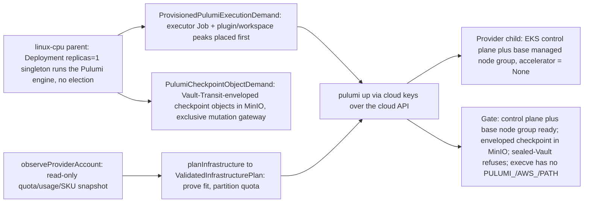

# Phase 34: Provider Pulumi deploy-from-inside + enveloped checkpoint

**Status**: Authoritative source
**Supersedes**: N/A
**Referenced by**: DEVELOPMENT_PLAN/README.md, DEVELOPMENT_PLAN/overview.md, DEVELOPMENT_PLAN/phase_09_execution_accelerator_folds.md, DEVELOPMENT_PLAN/phase_11_provision_seal.md, DEVELOPMENT_PLAN/phase_32_multicluster_spawn_georepl.md, DEVELOPMENT_PLAN/phase_33_gateway_migration_drills.md, DEVELOPMENT_PLAN/phase_35_provider_child_bringup.md, DEVELOPMENT_PLAN/phase_36_provider_ebs_credential.md, DEVELOPMENT_PLAN/phase_37_provider_dynamic_nodes.md, DEVELOPMENT_PLAN/system_components.md
**Generated sections**: none

> **Purpose**: Stand up a provider-managed EKS control plane plus a base managed node group by a `pulumi up`
> issued **only** from inside the linux-cpu parent by the Deployment-`replicas=1` singleton, with the entire
> checkpoint held as a closed set of Vault-Transit-enveloped MinIO objects and the engine subprocess spawned by
> absolute path with no `PULUMI_*`/`AWS_*`/`PATH` side-channel.

---

## Phase Status

📋 Planned. Nothing in this sub-phase is implemented; the sprint below is 📋 Planned and every prescriptive
statement is design intent, never a tested amoebius result. The phase runs on the **linux-cpu** substrate in
**Register 3** (live infrastructure): the parent amoebius cluster is a single-node `kind` cluster on linux-cpu,
brought up by the [Phase 17](phase_17_midwife_bootstrap_kind.md) midwife, from inside which the Pulumi engine — under the Deployment-`replicas=1`
singleton — issues the EKS deploy over the cloud API. `→ provider` names the *deploy target class* (a
cloud-managed EKS cluster reached over the cloud API), not a fifth hardware substrate, so the gate stays
single-substrate (`linux-cpu`) while exercising a provider target. The encrypted-MinIO Pulumi backend and a
working EKS deploy are generalized from the sibling **prodbox** project (its `aws-eks` Pulumi stack,
`Prodbox.Pulumi.EncryptedBackend`, and its Vault-gated apply/destroy) — read as **sibling evidence, not an
amoebius result** (honesty rule, [development_plan_standards.md §K](development_plan_standards.md#k-honesty-proven--tested--assumed)).
Status transitions are recorded reverse-chronologically here once work begins.

## Phase Summary

This is the **first arm** of the provider-managed-cluster split (Phases 34–37): the mechanism by which
"spin up a provider-managed cluster" becomes something the cluster does under its own singleton rather than
something a laptop shell does behind the cluster's back. It owns four deliverables, all driven from a single
linux-cpu parent, plus its gate; it is the substrate on which [phase_35_provider_child_bringup.md](phase_35_provider_child_bringup.md)
(the stateless hostless in-cluster control plane), [phase_36_provider_ebs_credential.md](phase_36_provider_ebs_credential.md)
(per-PV EBS + the create-vs-delete credential model), and [phase_37_provider_dynamic_nodes.md](phase_37_provider_dynamic_nodes.md)
(dynamic node provisioning + the leak-free teardown gate) all layer.

First, a **provider-cluster Pulumi deploy from inside a parent**: a `pulumi up` that runs **only** from inside
an already-running amoebius cluster, issued by the Deployment-`replicas=1` control-plane singleton (Phase 26) —
whose single-instance is a k8s/etcd property, never a bespoke amoebius election — generalizing Phase 32's
SSH-keyed self-managed spawn to a cloud-keyed provider spawn over the same backend and the same
bring-up → init → reconcile lifecycle vocabulary. There is no laptop `pulumi up`, no plaintext state, and no
`PULUMI_*`/`AWS_*`/`PATH` env side-channel: the `pulumi` binary and cloud plugin are discovered lazily by full
path.

Second, the **Vault-Transit-enveloped MinIO checkpoint backend**: the logical checkpoint is a closed set of
Vault-Transit-enveloped objects in the cluster's MinIO. The provider stack's exact resource-state field/revision
objects, retention, and failed-partial/orphan exposure carry a `StorageBudgetId` and an exclusive
`ObjectStoreMutationAdmission` gateway — the engine has no direct S3 mutation route — and its bounded
`PulumiCheckpointObjectDemand` produces a private exact object peak before any unwrap/write/cloud mutation.

Third, the **`PulumiExecutionDemand` executor**: a bounded execution demand that names the deploy unit,
content-digested plugin bytes, disk-backed plugin-cache/workspace volumes, finite concurrency, and cost model.
Provisioning returns a private `ProvisionedPulumiExecutionDemand` whose executor Jobs carry complete image,
CPU/memory, pod-ephemeral, log, writable-root, mapped-input, and retry/rollout/termination envelopes; no
executor witness means no provider/checkpoint continuation.

Fourth, the **`Amoebius.Pulumi.Provider.Eks` program**: it provisions the EKS control plane plus a base managed
node group from a named CPU-only `ProviderNodeClass` (`accelerator = None`) whose complete capacity/capability
shape is derived from — and cross-checked against — an immutable SKU snapshot, with a read-only
`observeProviderAccount` boundary supplying authoritative quota limits, current account allocations, SKU/zone
availability, and per-referenced-object count/byte usage; `planInfrastructure → observeProviderAccount →
validateInfrastructurePlan` seals a `ValidatedInfrastructurePlan` whose `ProvisionedCloudActionBatch` solely
owns the Pulumi execution graph, checkpoint domain, and quota partition before any cloud mutation, and only the
receipt-bound provider readback constructs `ProvisionContext` and lets `provision` seal the initial-create spec.

This sub-phase does **not** own: the hostless in-cluster singleton, scheduler-cutover, bootstrap-Lease handoff,
or standard-service convergence for a provider child ([phase_35_provider_child_bringup.md](phase_35_provider_child_bringup.md));
per-PV durable EBS, the `protect`/`Retain` state class, the create-vs-delete credential split, or the static
`ebs.csi.aws.com` CSI path ([phase_36_provider_ebs_credential.md](phase_36_provider_ebs_credential.md)); or
dynamic node provisioning by signal, the second reconcile no-op, and the independent leak-free teardown sweep
([phase_37_provider_dynamic_nodes.md](phase_37_provider_dynamic_nodes.md)). The base node group here is a fixed
size-1 group provisioned and observed by this sub-phase alone; the `Managed Eks` arm carries **no** `LinuxHost`
witness (a foreclosure already unrepresentable in the pre-cluster band — the Dhall Gate-1 schema in Phase 4,
the GADT decoder in Phase 5, and the capacity/topology folds in Phase 7).

**Substrate:** linux-cpu → provider — the §L Parent-drives-provider escape form. The acceptance gate runs on
exactly one hardware substrate, the linux-cpu parent `kind` cluster from inside which the Pulumi engine issues
the deploy; `→ provider` (EKS) is the deploy target class, not a hardware substrate
([development_plan_standards.md §L](development_plan_standards.md#l-one-substrate-discipline)).

**Register:** 3 (live infrastructure) — the gate spins up real provider resources (an EKS control plane and a
managed node group) and writes real Vault-enveloped checkpoint objects into MinIO; no register-1/2 in-process
check discharges it.

**Gate:** an `InForceSpec` that, from a **linux-cpu** parent, issues a `pulumi up` under the
Deployment-`replicas=1` singleton (no bespoke election) that stands up a provider-managed **EKS control plane +
one base managed node group** from the fixture's named CPU-only base `ProviderNodeClass` (`accelerator = None`),
whose observed joined node's allocatable CPU, memory, logical pod-ephemeral capacity, closed
nodefs/imagefs/containerfs identities/capacities, resident OCI content/snapshot inventory, storage-model
version, enforced pull policy, and accelerator absence meet the declared class. Before any checkpoint write or
cloud effect the parent first places the complete `ProvisionedPulumiExecutionDemand` executor Job plus
plugin/workspace peaks and provisions the exact `PulumiCheckpointObjectDemand` object peak against its
`StorageBudgetId` and exclusive `ObjectStoreMutationAdmission`. The exact checkpoint object set lands in MinIO
as opaque Vault-Transit-enveloped objects **decryptable only via a direct Vault Transit `decrypt` call with the
per-child key** (asserted against the committed ciphertext-shape oracle) and **not** from any key material on
the engine pod's filesystem (OS-boundary filesystem observer records zero plaintext-data-key bytes); a deploy
attempted with a **sealed Vault refuses before any cloud-side create**; the `pulumi` subprocess is spawned by
absolute path with **no** `PULUMI_*`/`AWS_*`/`PULUMI_CONFIG_PASSPHRASE`/`PATH` in its environment (OS-boundary
`execve` observer checked against the committed expected-argv/env table); and the committed seeded mutants
`mut-30.1-static-key` and `mut-30.1-leak-path` go **red**. The per-run stack is torn down for cost hygiene, but
the independent leak-free tag-sweep proof is [phase_37_provider_dynamic_nodes.md](phase_37_provider_dynamic_nodes.md)'s
gate, deferred and never depended on here. The gate delegates its committed-fixture / mutant / oracle apparatus
to [`## Gate integrity`](#gate-integrity) ([development_plan_standards.md §M](development_plan_standards.md#gate-integrity-delegation)).
Each run emits a proven/tested/assumed ledger artifact.

## Gate integrity

> **Shared provider corpus (by design).** Phases 34–37 (the provider split) deliberately share one Phase-0-committed corpus — `test/dhall/phase_30_provider_provision.dhall` and the `mut-30.*` mutant family — each provider sub-phase gating the slice for its own sprint (34 → `mut-30.1`; 35 → `mut-30.2`; 36 → `mut-30.3`; 37 → `mut-30.4`/`mut-30.5`). This is an intentional shared corpus across the four provider sub-phases, not accidental double-ownership.
This sub-phase inherits the **deploy / checkpoint / engine-boundary slice** of Phase 30's committed gate corpus.
The other slices belong to the sibling sub-phases and are **not** duplicated here: the
teardown-sweep and dynamic-node slice (`mut-30.5-skip-sweep`, `mut-30.4-ignore-signal`,
`mut-30.4-apply-over-quota`, the expected-sweep oracle, and the two-instance identity map) is
[phase_37_provider_dynamic_nodes.md](phase_37_provider_dynamic_nodes.md)'s; the per-PV durable EBS +
create-vs-delete slice (the `ec2:DeleteVolume` expected-denied-call tag, the `protect`/`Retain` state, the
static-CSI `volumeHandle` bind, `mut-30.3-*`) is [phase_36_provider_ebs_credential.md](phase_36_provider_ebs_credential.md)'s;
and the scheduler-cutover slice (`mut-30.2-public-pull`, the `LinuxHost`-absence foreclosure tag) is
[phase_35_provider_child_bringup.md](phase_35_provider_child_bringup.md)'s. Partitioned to this seam:

**Representative set (§M.7).** The deploy slice of the committed topology
`test/dhall/phase_30_provider_provision.dhall`: one `Managed Eks` control plane and one base managed node group
(size 1) from the named CPU-only base `ProviderNodeClass`, whose exact allocatable CPU plus finite overcommit
policy, memory, `podSlots`/`cniSlots`/`attachableVolumes`, `EphemeralRootEbs` root backing under a `Unified`
kubelet filesystem layout, `ProviderUsableDiskCarveTemplate` system reserve and layout carves, OCI
content/snapshot model and pull concurrency, zone, price, provider-vCPU cost, base/maximum counts, and explicit
`accelerator = None` offering are committed in the fixture — together with the checkpoint `StorageBudget`, the
bounded Pulumi plugin/workspace volumes, and the executor concurrency bound. The dynamically provisioned extra
node, its `ScalingPolicy`, the fallback class, the per-PV durable EBS volume, and the static `ebs.csi.aws.com`
PV are declared in the same fixture but are exercised by the sibling sub-phases, not here.

**Oracle pins (§M.1/§M.3).** Authored and **committed in Phase 0 before the implementation exists**,
independently of the code under test:

- `test/goldens/checkpoint_envelope.json` — the ciphertext-shape oracle for a stored checkpoint
  revision/update object (envelope structure authored before the backend exists); every stored object must
  match it and decrypt only via a direct Vault Transit `decrypt` with the per-child key.
- `test/goldens/engine_execve.txt` — the expected-argv / expected-env table for the `pulumi` subprocess
  (absolute `pulumi`/plugin paths; no `PULUMI_*`/`AWS_*`/`PULUMI_CONFIG_PASSPHRASE`/`PATH`), authored
  independently of the engine.
- `test/negatives/host_shell_pulumi_up.sh` with the committed expected-error tag `NoSingletonContext` (§M.8),
  paired with the positive in-cluster path that differs **only** in being run under the singleton.

**Committed seeded mutants (§M.2) — the gate re-runs them and requires red:**

- `mut-30.1-static-key` — an envelope keyed by a pod-local static key with the seal-status precheck still
  present. It MUST go red on the cryptographic-dependence assertions (decrypts only via Vault Transit; zero
  plaintext-data-key bytes on disk) **while still passing the behavioral seal-gate**, proving the gate tests
  cryptographic dependence, not merely seal-status.
- `mut-30.1-leak-path` — an engine that exports `PATH` into the child process. It MUST go red on the OS-boundary
  `execve` env assertion.
- `mut-30.1-drop-parallel-executor` — omits one live Job from the executor peak, or admits parallel demand then
  silently serializes it. It MUST go red on the `BoundedParallel 2` executor fixture.

**Independent reference predicates (§M.3/§M.5).** Every "how the binary behaved" assertion reads from an
**observer at the OS boundary**, never from a compliance trace the engine emits about itself (which cannot record
the calls that bypass it): an `execve` argv/env-recording shim (or `strace -f -e execve`) checked against
`test/goldens/engine_execve.txt`; an `inotify`/`fanotify`/`strace` filesystem watch recording zero
plaintext-data-key bytes across a full deploy; the committed ciphertext-shape oracle; and the committed
`NoSingletonContext` expected-error tag. Paired one-short fixtures reduce a single executor / checkpoint-gateway
CPU, memory, pod-ephemeral, plugin-cache, workspace, or checkpoint-`StorageBudget` unit and each must reject
with its specific provision error **before** a Job, checkpoint PUT, or AWS mutation, with an empty mutating
audit.

## Doctrine adopted

- [`pulumi_iac_doctrine.md §1`](../documents/engineering/pulumi_iac_doctrine.md#1-pulumi-runs-only-from-inside-an-existing-amoebius-cluster)
  — *Pulumi runs only from inside an existing amoebius cluster* — with
  [`§2`](../documents/engineering/pulumi_iac_doctrine.md#2-the-backend-every-byte-of-state-is-a-vault-enveloped-object-in-minio)
  (*every byte of state is a Vault-enveloped object in MinIO*),
  [`§3`](../documents/engineering/pulumi_iac_doctrine.md#3-state-lifetime-matches-resource-lifetime-per-class)
  (*state lifetime matches resource lifetime, per class* — the checkpoint's revision retention and GC horizon
  arm),
  [`§4`](../documents/engineering/pulumi_iac_doctrine.md#4-what-pulumi-provisions-the-resource-catalog)
  (*the resource catalog* — the provider-cluster entry), and
  [`§8`](../documents/engineering/pulumi_iac_doctrine.md#8-how-deploys-are-enacted-the-reconciler-referenced-not-restated)
  (*deploys are enacted by the reconciler, not a global state machine*): this phase realizes the catalog's
  provider-cluster entry as a Pulumi deploy that obeys the one rule (engine under the singleton, no env vars, no
  `PATH`, logical checkpoint as a Vault-enveloped MinIO object set), holds the checkpoint as a lifetime-classed
  budgeted object set behind an exclusive mutation gateway, and enacts the deploy through the reconciler rather
  than a bespoke state machine. (The EBS create-vs-delete credential arm of §6 is realized in
  [phase_36_provider_ebs_credential.md](phase_36_provider_ebs_credential.md), not here.)
- [`cluster_lifecycle_doctrine.md §3`](../documents/engineering/cluster_lifecycle_doctrine.md#3-amoebic-spawning--the-recursive-forest)
  — *amoebic spawning — the recursive forest*: provider-cluster spawn is the *cloud-keyed* sibling of Phase 32's
  *SSH-keyed* self-managed spawn over the same encrypted-MinIO backend and per-child Vault envelope, sharing the
  same bring-up → init → reconcile lifecycle vocabulary.
- [`daemon_topology_doctrine.md §3.1`](../documents/engineering/daemon_topology_doctrine.md#31-exactly-one-pod-is-a-k8setcd-property-not-an-amoebius-election)
  and [`§5`](../documents/engineering/daemon_topology_doctrine.md#5-single-instance-and-coordination--delegated-not-elected)
  — *exactly one pod is a k8s/etcd property* / *single-instance and coordination — delegated, not elected*: the
  Pulumi engine runs under the Deployment-`replicas=1` singleton whose single-instance is a k8s/etcd concern, so
  nothing in this phase runs a bespoke leadership election, and there is no host-shell entrypoint that can
  `pulumi up` a provider cluster.
- [`substrate_doctrine.md §3`](../documents/engineering/substrate_doctrine.md#3-the-no-environment--no-path-lazy-tool-ensure-contract)
  — *the no-environment / no-`PATH` lazy tool-ensure contract*: the `pulumi` binary and the cloud-provider
  plugin are discovered lazily by full path through the substrate package manager, with **no** `PULUMI_*`,
  `AWS_*`, `PULUMI_CONFIG_PASSPHRASE`, or `PATH` exported into any child process.
- [`image_build_doctrine.md §2`](../documents/engineering/image_build_doctrine.md#2-the-single-distribution-rule-bake-the-binaries-build-the-amoebius-image-pull-only-in-cluster)
  — *bake the binaries, pull only in-cluster*: the base node's launch template preloads the exact pinned
  amoebius base/scheduler OCI content into its CRI store so bring-up requires neither the not-yet-ready child
  registry nor a public pull.
- [`resource_capacity_doctrine.md §3.1`](../documents/engineering/resource_capacity_doctrine.md#31-the-systematic-provision-matrix)
  — *the systematic provision matrix*: the executor Jobs, plugin/workspace carriers, checkpoint-object budget,
  and the base node class's derived supply are provisioned before any effect; failure of any CPU, memory,
  pod-ephemeral, plugin-cache, workspace, checkpoint-object-budget, or provider-quota obligation rejects before
  cloud mutation.
- [`chaos_failover_doctrine.md §12`](../documents/engineering/chaos_failover_doctrine.md#12-the-moral-core--proven-tested-assumed)
  (cross-reference) — *proven, tested, assumed*: each gate run emits a proven/tested/assumed ledger; skipping an
  applicable observation move marks that layer UNVERIFIED, never green.

## Sprints

## Sprint 34.1: Provider-cluster Pulumi deploy from inside a parent 📋

**Status**: Planned
**Implementation**: `amoebius-pulumi/src/Amoebius/Pulumi/Provider/Eks.hs` (the EKS provider program — the
phase-new module), built on the `amoebius-pulumi` engine seam (`.../Pulumi/Engine.hs`) and the
Vault-Transit-enveloped MinIO backend (`.../Backend/EncryptedMinio.hs`) **first delivered by Phase 32 and reused
here, not rebuilt**; the `observeProviderAccount` boundary and the `PulumiExecutionDemand` /
`PulumiCheckpointObjectDemand` types land alongside (target paths from
[system_components.md](system_components.md); not yet built)
**Blocked by**: Phase 32 gate (amoebic spawning via Pulumi with the encrypted-MinIO backend + per-child
Vault-envelope, the SSH-keyed spawn this generalizes); Phase 26 gate (the Deployment-`replicas=1` singleton
live-deploy path that runs the engine); Phase 23 gate (MinIO reachable as a standard HA platform service);
Phase 22 gate (root Vault + the Transit envelope) — all external earlier-phase prerequisites.
**Independent Validation**: from a linux-cpu parent, a `pulumi up` issued by the in-cluster singleton reaches a
ready EKS control plane + base node group built from the fixture's named base-node-class capacity/capability
shape; the parent first places the complete executor Job plus plugin/workspace peaks and provisions the exact
checkpoint state-field/revision object peak against its `StorageBudgetId` and exclusive mutation admission; the
joined node's observed allocatable CPU, memory, logical pod-ephemeral capacity, closed
nodefs/imagefs/containerfs identities and capacities, resident OCI content/snapshot inventory, storage-model
version, and enforced image-pull policy meet the declared values and its accelerator offering is explicitly
`None`; the exact checkpoint object set lands in MinIO as opaque Vault-enveloped objects unreadable without an
unsealed Vault; a deploy attempted with a sealed Vault **refuses before any cloud mutation**; the deploy
subprocess is spawned with no `PULUMI_*`/`AWS_*`/`PATH` in its environment and the `pulumi`/plugin paths are
absolute.
**Docs to update**: `documents/engineering/pulumi_iac_doctrine.md` (§1, §2, §4),
`documents/engineering/cluster_lifecycle_doctrine.md` (§3), `documents/engineering/substrate_doctrine.md` (the
no-env/no-`PATH` lazy discovery of `pulumi` + the cloud plugin), `documents/engineering/daemon_topology_doctrine.md`
(§3.1 — the engine under the singleton), `DEVELOPMENT_PLAN/system_components.md`.

### Objective

Adopt [`pulumi_iac_doctrine.md §1 — Pulumi runs only from inside an existing amoebius cluster`](../documents/engineering/pulumi_iac_doctrine.md#1-pulumi-runs-only-from-inside-an-existing-amoebius-cluster)
and the provider-cluster catalog entry in [`§4 — What Pulumi provisions`](../documents/engineering/pulumi_iac_doctrine.md#4-what-pulumi-provisions-the-resource-catalog):
make "spin up a provider-managed cluster" something the cluster does under its Deployment-`replicas=1` singleton
— never something a laptop shell does behind the cluster's back — with state held as a Vault-enveloped MinIO
object set, generalizing Phase 32's SSH-keyed self-managed spawn to a cloud-keyed provider spawn. The `pulumi`
binary and cloud plugin are ensured under
[`substrate_doctrine.md §3 — the no-environment / no-`PATH` lazy tool-ensure contract`](../documents/engineering/substrate_doctrine.md#3-the-no-environment--no-path-lazy-tool-ensure-contract):
discovered lazily by full path, with no `PULUMI_*`/`AWS_*`/`PATH` side-channel exported into any child process.

### Deliverables

- An `Amoebius.Pulumi.Engine` seam that runs the Pulumi engine **only** under the in-cluster singleton (Phase
  26), whose single-instance is a k8s/etcd property; there is no host-shell entrypoint that can `pulumi up` a
  provider cluster.
- An `Amoebius.Pulumi.Backend.EncryptedMinio` backend: the logical checkpoint is a model-derived closed set of
  opaque revision/update objects in the cluster's MinIO, sealed with Vault-Transit envelopes; plaintext data
  keys never land on disk, and a sealed/unreachable Vault **fails the deploy closed** (no unencrypted or
  un-checkpointed fallback).
- A provider-stack `PulumiCheckpointObjectDemand`: exact resource-state identities and field paths/max canonical
  bytes/secrecy, finite revision retention, serial current/old/new update overlap, finite failed-partial/orphan
  exposure and GC horizon, pinned model, attached `StorageBudgetId`, and exclusive `ObjectStoreMutationAdmission`.
  It produces a private exact object peak before unwrap/write/cloud mutation; its rate/concurrency model derives
  a complete placed mutation-gateway `PodResourceEnvelope`, and the engine has no direct S3 mutation route.
- A provider `PulumiExecutionDemand` that names the deploy unit, content-digested plugin installed/peak-install
  bytes, disk-backed plugin-cache/workspace volumes, finite concurrency, and cost model. Provisioning returns a
  private `ProvisionedPulumiExecutionDemand` whose executor Jobs have complete image, CPU/memory, pod-ephemeral,
  log, writable-root, mapped-input, retry/rollout/termination envelopes and whose plugin/workspace carriers
  derive presentation/allocation-rounded raw debits from required-usable peaks. Fresh validation proves the
  usable peaks against mounted usable capacity and the raw debits against raw residual supply separately. No
  executor witness means no provider/checkpoint continuation.
- An `Amoebius.Pulumi.Provider.Eks` program that provisions the EKS control plane + a base managed node group
  from a named `ProviderNodeClass` carrying a catalog-pinned
  `ProviderSkuRef { provider = AwsEc2, region, machineType, catalogVersion }`, exact allocatable CPU plus finite
  overcommit policy, memory, declared `podSlots`, CNI/IP `cniSlots`, and driver-indexed `attachableVolumes`, a
  non-empty `localDisks` recipe in which each `PerInstanceDiskTemplate` has
  `InstanceStore { skuDevice, provisionedRawBytes, presentation } | EphemeralRootEbs { policy }` backing plus
  `systemReserve` and non-empty `carves` in `ProviderUsableDiskCarveTemplate.requiredUsableBytes`, a closed
  kubelet filesystem layout, logical pod-ephemeral capacity, OCI content/snapshot model, image-pull policy,
  zones, price, provider-vCPU cost, base/maximum counts, and closed accelerator offering, via cloud keys
  resolved from the cluster's Vault (secrets are *names* in the `.dhall`, bytes injected by the parent), landing
  the cluster ready for its in-cluster control-plane bootstrap ([phase_35_provider_child_bringup.md](phase_35_provider_child_bringup.md)).
  The canonical class declares `accelerator = None`.
- A read-only `observeProviderAccount` boundary using the AWS Service Quotas APIs for the applicable regional
  EC2 vCPU/accelerator/EBS limits, `DescribeInstances`/EKS node-group inventory and `DescribeVolumes` for current
  allocations split by ephemeral node-root versus durable retained owner, and a version-pinned
  `DescribeInstanceTypes`/`DescribeInstanceTypeOfferings` plus pricing snapshot for SKU shape/zone/price. For
  each referenced provider-object quota it additionally reads a complete object/version inventory and object
  count plus current bytes in the quota's exact selected `Logical` or `Billed` accounting arm; the latter retains
  the pinned provider billing/rounding and logical-to-billed conversion models. It normalizes one
  `ObservedProviderAccount`; missing permission, unknown pagination/result, incomplete object/version inventory,
  mismatched byte arm/model, unavailable SKU/zone, or stale catalog version is refusal, never zero usage.
  Checked construction proves the declared net node template is a carve of the SKU's raw
  CPU/memory/instance-store/GPU/link shape when `InstanceStore` is selected; its `provisionedRawBytes` must
  equal the SKU device's raw capacity. For `EphemeralRootEbs`, it derives a private whole-GiB
  `ProvisionedNodeRootVolumeRequest` from the system reserve plus unique layout carves' summed
  `requiredUsableBytes`, the required `FilesystemPresentation` overhead, and the catalog-cross-checked
  `BackingAllocationPolicy` minimum/quantum. The private request retains `requiredUsableBytes`, presentation,
  allocation witness, integral `sizeGiB`, and raw `provisionedBytes`; every base/growth/replacement volume
  debits the distinct node-root EBS ledger. For either backing, a private `ProvisionedPerInstanceDiskTemplate`
  derives presentation-model-pinned `mountedUsableBytes` from that raw instance-store supply or rounded root
  request, then proves the usable system reserve and unique usable carves fit it exactly once. `quotaVcpu` must
  match provider cost.
- Provider pod/attachment observation for the base node: derive the node's usable pod slots from the pinned
  SKU+CNI policy and driver attach slots from the pinned SKU+CSI policy; after join, admit only the lesser of
  those declarations, kubelet `status.allocatable.pods`/remaining CNI IP capacity, and `CSINode`/SKU per-driver
  limits. Unknown limits or a live smaller value reject; regional EBS count is an additional ledger, never a
  substitute.
- The managed-node launch template and bootstrap/user-data realize the provisioned root request and exact
  layout: filesystem/LVM/project-quota identities, kubelet nodefs/log roots, containerd content/snapshot roots,
  pull concurrency, and a provisioned import of the exact pinned amoebius base/scheduler OCI content into the
  first node's CRI store. Resident bytes and import workspace are charged to the selected backing; scheduler
  bootstrap therefore requires neither the not-yet-ready child registry nor a public pull. `SplitRuntime` routes
  both OCI images and writable layers to imagefs; `Unified` aliases all three kubelet identities; the current
  containerd path rejects `SplitImage` before a cloud call.
- `planInfrastructure` derives the provider-cluster demand from the exact `BoundDeployment` and declared
  account/node-class/backing supply. The initial create takes its `InfrastructureRequired` arm;
  `observeProviderAccount → validateInfrastructurePlan` then returns one `ValidatedInfrastructurePlan` whose
  `ProvisionedCloudActionBatch` solely owns the Pulumi execution graph, checkpoint domain,
  dependency/concurrency admission, and quota partition. Each `ValidatedCloudProviderAction` is an exact
  per-deploy projection, bound to account limits/current usage, SKU catalog/price, desired resources, parent
  executor/cache/backing residuals, and provider object versions. The managed-node action owns its exact
  root-volume request map and debit; no independent root-volume action can charge or create it again. Every
  arm-authorized Pulumi/AWS create/modify/destroy CAS-consumes its action token and the plan token and
  immediately re-reads the fingerprint; change restarts the read-only prefix. (The durable-retained-EBS
  `EnsurePresent`/no-destroy arm and the ephemeral-node-root replacement lifecycle are elaborated in
  [phase_36_provider_ebs_credential.md](phase_36_provider_ebs_credential.md).) Only the receipt-bound provider
  readback constructs `ObservedInfrastructureMaterialization` and `ProvisionContext`; `provision` seals the
  Kubernetes `ProvisionedSpec` afterward. A converged rerun may take `NoInfrastructureRequired` only through its
  explicit already-materialized arm and performs no cloud mutation; promised node, endpoint, or volume
  identities cannot enter the spec.
- Lazy, full-path discovery of the `pulumi` binary and the cloud-provider plugin through the substrate package
  manager; **no** `PULUMI_*`, `AWS_*`, `PULUMI_CONFIG_PASSPHRASE`, or `PATH` is exported into any child process.

### Validation

1. The singleton issues a provider deploy that reaches a ready EKS control plane + base node group. The
   "no host-shell entrypoint" claim is discharged by a **runnable attempted-invocation-must-fail** check, not a
   code-review attestation: the committed negative fixture `test/negatives/host_shell_pulumi_up.sh` invokes the
   deploy path from a bare host shell and the check asserts it **fails with the specific reason** "no in-cluster
   singleton context" (a committed expected-error tag `NoSingletonContext`, §M.8), paired with the positive
   in-cluster path that differs only in being run under the singleton (§M.8).
   Before the first cloud call, a declared-fit/observed-account-short fixture and an impossible/SKU-shape-mismatch
   fixture each fail with a specific tag and an empty mutating CloudTrail log. A race fixture changes current
   usage or SKU availability after validation; immediate token recheck emits zero Pulumi/AWS mutation.
   After join, an OS-boundary Kubernetes/API/CRI inventory cross-checks the node's allocatable CPU, memory,
   logical ephemeral storage; nodefs/imagefs/containerfs mount, device, filesystem, and quota identities; raw
   root-volume and per-filesystem allocatable/usable capacity; containerd content objects and committed/active
   snapshots; storage-model version and enforced pull-concurrency policy; zone labels; and accelerator
   resource/label absence against the declared base node class. A hard-cap probe must fail at each declared
   boundary without spilling into another carve. Alias, swapped-root, missing content/snapshot bytes,
   one-byte-short capacity, or unsupported `SplitImage` fails the deploy; any observed supply below the
   declaration fails the deploy rather than letting later scheduling discover the mismatch.
   Before scheduler creation, independently read back the pinned amoebius image digest as resident in the base
   node CRI store and its import workspace as released/retained according to the model. A missing preload,
   public/child-registry scheduler pull, or uncharged import workspace fails.
2. Cryptographic-dependence assertion (forecloses a locally-keyed envelope with a bolted-on seal precheck):
   (a) every stored checkpoint revision/update object in MinIO is opaque ciphertext that **decrypts only via a
   direct Vault Transit `decrypt` call with the per-child key** and is **not** decryptable from any key material
   present on the engine pod's filesystem — asserted against the committed Phase-0 ciphertext-shape oracle
   `test/goldens/checkpoint_envelope.json` (envelope structure authored before the backend exists, §M.1/§M.3);
   (b) an **OS-boundary filesystem observer** (an `inotify`/`fanotify` or `strace` watch on the pod filesystem,
   NOT a self-emitted compliance log, §M.5) records **zero** plaintext-data-key bytes written to disk across a
   full deploy; (c) a deploy with a sealed Vault refuses *before* any cloud-side create, and the committed
   seeded mutant `mut-30.1-static-key` (an envelope keyed by a pod-local static key with the seal-status
   precheck still present) MUST go **red** on assertion (a) and (b) while passing the behavioral seal-gate —
   proving the gate tests cryptographic dependence, not just seal-status (§M.2).
3. Process-environment assertion read from an **OS-boundary observer** (an `execve` argv/env-recording shim or
   `strace -f -e execve`, §M.5, never a trace the engine emits about itself): the `pulumi` subprocess is spawned
   with an empty/whitelisted environment (no `PULUMI_*`/`AWS_*`/`PULUMI_CONFIG_PASSPHRASE`/`PATH`) and the
   `pulumi`/plugin paths are absolute, checked against the committed Phase-0 expected-argv/expected-env table
   `test/goldens/engine_execve.txt` authored independently of the engine (§M.1/§M.3). The committed mutant
   `mut-30.1-leak-path` (an engine that exports `PATH` into the child) MUST go red here.
4. Paired one-short fixtures reduce only parent executor or checkpoint-gateway CPU, memory, pod-ephemeral,
   plugin-cache, workspace, or checkpoint `StorageBudget` by one unit. Each returns its specific provision error
   before a Job, checkpoint PUT, or AWS mutation. In the fitting case, Kubernetes API readback of the executor
   Job exactly matches the private witnessed image, requests/limits, ephemeral/log/writable/mapped allowances
   and volumes; MinIO `LIST`/`HEAD` plus gateway admission records exactly match the stack's
   resource-field-derived current, old/new, retained-revision, and partial/orphan identities/extents. A failed
   checkpoint CAS stays charged until its finite GC horizon, and a direct mutating S3 request outside the gateway
   is denied.
5. A `BoundedParallel 2` fixture with two independent deploy units fits either executor alone but not both and
   must reject before effects. The committed `mut-30.1-drop-parallel-executor` mutant, which omits one live Job
   from the peak or admits parallel demand then silently serializes it, MUST go red. Separately, lower only
   kubelet/CNI pod residual or the `CSINode` `ebs.csi.aws.com` attach limit below the declared SKU policy; the
   lesser live value refuses workload admission even while CPU, memory, and regional EBS count remain ample.

> **Honesty.** The encrypted-MinIO Pulumi backend and a working EKS deploy are **proven in prodbox**
> (`Prodbox.Pulumi.EncryptedBackend`; the `aws-eks` stack), with a Vault gate on every apply/destroy — *sibling
> evidence, not an amoebius result*. This sprint re-realizes the shape under the amoebius
> Deployment-`replicas=1` singleton and the per-child envelope for the first time. The per-run stack is torn
> down for cost hygiene; the *independent, leak-free* teardown proof (the OS-boundary cloud-API tag sweep and
> `mut-30.5-skip-sweep`) is [phase_37_provider_dynamic_nodes.md](phase_37_provider_dynamic_nodes.md)'s gate,
> deferred and never depended on here.

### Remaining Work

The whole sprint (📋 Planned).

## Documentation Requirements

**Engineering docs to update (when the gate runs, flip the honest layer, never before):**
- `documents/engineering/pulumi_iac_doctrine.md` — record that §1 (the one rule), §2 (the Vault-enveloped MinIO
  backend and exact `PulumiCheckpointObjectDemand`), §3 (the checkpoint's per-class state lifetime/retention/GC
  arm), §4 (the provider-cluster catalog entry), and §8 (the reconciler enaction) are realized in
  `amoebius-pulumi`; flip the relevant sibling-evidence honesty notes to live-proof status once the gate runs
  (status itself stays in this plan).
- `documents/engineering/cluster_lifecycle_doctrine.md` — record that §3 (the cloud-keyed amoebic spawn) gains
  an amoebius EKS reference as the cloud-keyed sibling of the Phase 32 SSH-keyed spawn.
- `documents/engineering/daemon_topology_doctrine.md` — record that the Pulumi engine runs under the
  Deployment-`replicas=1` singleton (§3.1/§5), single-instance a k8s/etcd property, with no bespoke election
  anywhere in this phase.
- `documents/engineering/substrate_doctrine.md` — record that `pulumi` + the cloud plugin conform to the
  no-env/no-`PATH` lazy-tool-ensure contract (§3) on the linux-cpu parent.
- `documents/engineering/image_build_doctrine.md` — record that the base node's launch template preloads the
  pinned amoebius base/scheduler OCI content into its CRI store (§2), so bring-up introduces no public-registry
  or Helm path.
- `documents/engineering/resource_capacity_doctrine.md` — record that
  [`§3.1`](../documents/engineering/resource_capacity_doctrine.md#31-the-systematic-provision-matrix)
  (the systematic provision matrix) gains the live Pulumi executor/checkpoint/base-node-class supply
  provisioning; flip the relevant honest layer once the gate runs.
- `documents/engineering/testing_doctrine.md` — record the Phase 34 per-run ledger artifact for the
  deploy/checkpoint bring-up, naming Register 3 and the sibling-evidence provenance.

**Cross-references to add:**
- `DEVELOPMENT_PLAN/system_components.md` — map the reused `amoebius-pulumi` Engine and EncryptedMinio backend
  to their first delivery in Phase 32; register `Amoebius.Pulumi.Provider.Eks`, the `observeProviderAccount`
  boundary, and the `PulumiExecutionDemand` / `PulumiCheckpointObjectDemand` types as Phase-34 design-first rows,
  each mapped to its owning doctrine.
- `DEVELOPMENT_PLAN/substrates.md` — record the Phase 34 → `linux-cpu` (parent) row with the `provider` (EKS)
  deploy target annotated as a target class, not a fifth hardware substrate.
- `DEVELOPMENT_PLAN/README.md` — flip the Phase 34 row's status once the gate passes; link this document.

## Related Documents

- [README.md](README.md) — the live tracker; the Phase 34 objective, gate, and substrate
- [development_plan_standards.md](development_plan_standards.md) — the rulebook this doc obeys (§D skeleton, §F
  sprint format, §H citation rule, §K honesty, §L one-substrate discipline, §M gate integrity)
- [overview.md](overview.md) — the target architecture and cross-cutting invariants (no bespoke election;
  single-instance delegated to k8s/etcd; Pulumi runs only from inside a cluster)
- [system_components.md](system_components.md) — the target component inventory (the Implementation paths above
  are its intended layout, not yet built)
- [substrates.md](substrates.md) — the substrate registry and per-phase map (`linux-cpu` parent → `provider`
  target)
- [Pulumi IaC Doctrine](../documents/engineering/pulumi_iac_doctrine.md) — the one rule, the Vault-enveloped
  MinIO backend and checkpoint object demand, and the provider-cluster catalog entry this phase implements
- [Cluster Lifecycle Doctrine](../documents/engineering/cluster_lifecycle_doctrine.md) — the cloud-keyed amoebic
  spawn this phase realizes
- [Daemon Topology Doctrine](../documents/engineering/daemon_topology_doctrine.md) — the Deployment-`replicas=1`
  singleton (single-instance a k8s/etcd property, no election) that runs the Pulumi engine
- [Substrate Doctrine](../documents/engineering/substrate_doctrine.md) — the no-env/no-`PATH` lazy tool-ensure
  contract for `pulumi` + the cloud plugin
- [Vault / PKI Doctrine](../documents/engineering/vault_pki_doctrine.md) — the Transit envelope + per-child key
  the Pulumi checkpoint rides on
- [Image Build Doctrine](../documents/engineering/image_build_doctrine.md) — the baked OCI content preloaded into
  the base node, no public pull
- [Resource Capacity Doctrine](../documents/engineering/resource_capacity_doctrine.md) — the systematic provision
  matrix the executor/checkpoint/base-node-class supply is provisioned against
- [Testing Doctrine](../documents/engineering/testing_doctrine.md) — Register 3 (live) and the per-run ledger
- [phase_32](phase_32_multicluster_spawn_georepl.md) — the SSH-keyed amoebic spawn, encrypted MinIO backend, and
  per-child envelope this phase generalizes to a cloud-keyed provider spawn
- [phase_35](phase_35_provider_child_bringup.md) — the stateless hostless in-cluster singleton + capacity-scheduler
  bring-up that layers on this deploy
- [phase_36](phase_36_provider_ebs_credential.md) — the per-PV EBS + create-vs-delete credential model + static
  CSI path that layers on this deploy
- [phase_37](phase_37_provider_dynamic_nodes.md) — dynamic node provisioning by signal and the independent
  leak-free teardown gate that layers on this deploy
- [Engineering Doctrine Index](../documents/engineering/README.md) — the doctrine suite this phase adopts
