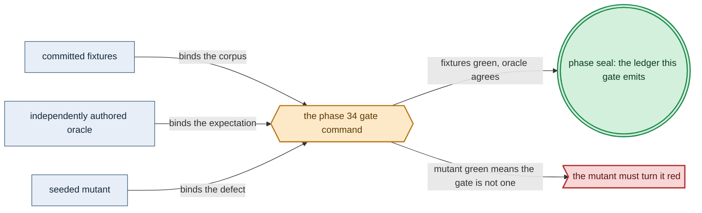

# Phase 34: Root Vault + PKI + built-in Haskell Vault client

> **Purpose**: Stand up the root single-node password-encrypted Vault as the fail-closed secrets root, root its
> self-signed PKI trust anchor, and prove the Vault client compiled *into* the amoebius binary (no agent sidecar)
> reads a `SecretRef` by name — the secrets floor the standard-service stack is built on.
> **Read this if**: phase 34 is next in the queue, or a later phase depends on what its gate establishes.

Phase 34 delivers the root Vault + PKI + built-in Haskell Vault client; its design is owned by [vault_pki_doctrine.md](../documents/engineering/vault_pki_doctrine.md), [platform_services_doctrine.md](../documents/engineering/platform_services_doctrine.md), [resource_capacity_doctrine.md](../documents/engineering/resource_capacity_doctrine.md), and the plan for reaching it is owned here.
Register 3, live, on the `linux-cpu` substrate.
The amended gate passed 2026-08-16.

Link-graph metadata

**Status**: Authoritative source
**Supersedes**: N/A
**Referenced by**: DEVELOPMENT_PLAN/README.md, DEVELOPMENT_PLAN/overview.md, DEVELOPMENT_PLAN/phase_05_dhall_gate1_schema.md, DEVELOPMENT_PLAN/phase_06_gadt_decoder_gate2.md, DEVELOPMENT_PLAN/phase_33_retained_storage.md, DEVELOPMENT_PLAN/phase_35_platform_backbone.md, DEVELOPMENT_PLAN/phase_36_platform_services_2.md, DEVELOPMENT_PLAN/phase_38_live_dsl_singleton.md, DEVELOPMENT_PLAN/phase_46_network_fabric_wireguard.md, DEVELOPMENT_PLAN/system_components.md, documents/engineering/vault_pki_doctrine.md
**Generated sections**: none

## Contents
- [Phase Status](#phase-status)
- [Phase Summary](#phase-summary)
- [Gate integrity](#gate-integrity)
- [Doctrine adopted](#doctrine-adopted)
- [Sprints](#sprints)
- [Sprint 34.1: Root single-node password-encrypted Vault — init-once / unseal-on-rebuild ✅](#sprint-341-root-single-node-password-encrypted-vault--init-once--unseal-on-rebuild-)
- [Sprint 34.2: The self-signed PKI trust anchor issues ✅](#sprint-342-the-self-signed-pki-trust-anchor-issues-)
- [Sprint 34.3: Built-in Haskell Vault client (no agent sidecar) reads a `SecretRef` by name — the gate ✅](#sprint-343-built-in-haskell-vault-client-no-agent-sidecar-reads-a-secretref-by-name--the-gate-)
- [Sprint 34.4: Register-2.5 fail-closed Vault unseal under simulated faults ✅](#sprint-344-register-25-fail-closed-vault-unseal-under-simulated-faults-)
- [Documentation Requirements](#documentation-requirements)
- [Related Documents](#related-documents)

---

## Phase Status

⏸️ Blocked pending Phase-33 revalidation — **reopened 2026-08-16 by the natural-architecture amendment.**
[§S](development_plan_gate_integrity.md#s-universal-artifact-hygiene-gate) clause 15 requires a run to record
the natural architecture it proved and to execute no artifact of another. This phase's last gate recorded no
architecture, so its seal is invalidated as a current result and stands only as history; the rerun differs from
it by naming the lane and architecture the run actually used. A sprint marker below records what that sprint achieved before the amendment; under
[§N](development_plan_phase_model.md#n-reopening-and-amending-a-phase) it is a diagnostic, not surviving closure.

**Pre-natural-architecture status record (invalidated where it claims completion):**

Blocked (superseded) — reopened 2026-08-16 behind the amended Phase-30 handoff and Phase-33 revalidation. Its prior capability record remains historical until the exact predecessor chain is resealed.

**Superseded containment seal:** the amended gate sealed 2026-08-16 as
`sha256:4f029c9f8fe3fa35da3da2cd1a6b94cdc7f2d2a808a821540d290848d6130dcb`.
`python3 tools/vault_pki_gate.py --execute` verified the exact Phase-33 predecessor and Phase-30 image
handoff, initialized Vault once, genuinely deleted and recreated its private cluster, unsealed the retained
Vault, preserved its cluster and PKI identities, and passed the independent Haskell reader. All 12 mutants
were red, all 10 metrics matched, and all 35 authored surfaces joined to 33 run-time items. The private
fixture, retained test state, kubeconfig, daemon, and loop mounts were removed; generated evidence remained
beneath `.build/**`, `test-secrets.dhall` was rejected by production and copied nowhere, and the outside-host
inventory remained empty.

**Pre-containment status record (invalidated where it claims completion):**

Blocked (superseded) by the reopened numeric sequence. Reopened 2026-08-11: the prior seal did not include the universal artifact-hygiene
postcondition. This phase returns to numeric order only after Phase 0 closes, then must rerun its capability
gate against its source snapshot and publish repository-local evidence without changing an authored path.

**Superseded scope amendment — 2026-08-13.** This phase was initially assigned the `SecretRef` type itself. Reviewing the
sibling hostbootstrap secrets policy established that
[`vault_pki_doctrine.md` §3](../documents/engineering/vault_pki_doctrine.md#3-the-secretref-contract-a-name-never-a-value)
names four constructors and a production-mode validator, while `src/Amoebius/Vault/SecretRef.hs` implements
two and no validator, and no `SecretRef` exists under `dhall/amoebius/**`. The type lands here rather than in
the sealed Gate-1/Gate-2 phases because this is where the Vault root that resolves the names lands: Phases 5
and 6 sealed against the surfaces they actually name, and adding a type they never carried does not reopen
them ([§N](development_plan_standards.md#n-reopening-and-amending-a-phase)). The corresponding divergence rows
are recorded in [legacy_tracking_for_deletion.md](legacy_tracking_for_deletion.md).

**Scope amendment — 2026-08-13 (secrets reach a workload only from Vault).** This phase additionally owns:

- the `Prompt` arm and the **prompt-to-Vault write path** — a CLI subcommand that reads elevated material
  with echo disabled and writes it straight into Vault, never to disk, an environment variable, or a process
  argument;
- `writeKvField` and a **presence-only** `kvFieldExists` on `VaultTransport`, which today carries a read and
  a transit decrypt and so cannot express either half of this contract;
- `assertSecretsPresent`, the admission API of
  [vault_pki_doctrine.md §3.4](../documents/engineering/vault_pki_doctrine.md#34-admission-proves-the-named-secret-exists-before-any-effect):
  it ranges over the `SecretRef`s a spec names, reads existence rather than value, and reports **every**
  missing reference at once rather than the first;
- deletion of the `PHASE29_OPERATOR_PASSWORD` / `PHASE29_DEVELOPMENT_PASSWORD` environment path in this
  phase's live runner, which is the exact pattern §3.3 forbids;
- the tracked `test-secrets-types.dhall` shape — field names and types, no values — narrowed to what an
  amoebius phase actually reads.

The `SecretRef` *type* is not here: it is Gate-1/Gate-2 surface and belongs to Phases 5 and 6, which are
reopened for it. This phase consumes that type; it does not define it.

**Invalidated historical record:**

Done (invalidated). All four sprints and the whole-phase gate are implemented and validated. The Register-3 live proof used
a single-node `kind` cluster on the **linux-cpu** lane, exact Phase-30 OCI archive, and Phase-33 retained ext4
backings; the Register-2.5 proof explored 500 deterministic schedules per fault family plus the combined
sequence. The pristine live cycle initialized Vault exactly once, deleted and recreated the real cluster, then
unsealed the retained Vault and recovered the same PKI root and canary bytes. The independent reader and all
nine committed mutants passed their intended green/red obligations. The live command was
`python3 tools/phase29_vault_live.py`, followed immediately by
`python3 tools/phase29_gate.py --seal-existing-live` on 2026-08-10. The sealed
ledger is `external-run-reference`; the phase receipt is
`dynamically-resolved`.

## Phase Summary

This phase installs the **secrets root** every later phase depends on. It brings up the **root Vault** as a
single-node, Shamir-sealed, password-encrypted, human-gated, **fail-closed** service whose first-ever `vault
init` runs exactly once against an empty retained PV and whose every later bring-up only **unseals** the same
durable data — never a re-init, never a key regeneration. The one-and-only ephemeral secret is the operator's
memorized password, which decrypts (via a real Argon2id KDF feeding an AEAD, never raw SHA-256) the
password-sealed unlock material that recovers the Shamir keys; it is supplied at the prompt and persisted
nowhere. The unsealed Vault owns the forest's **one self-signed PKI trust anchor** — a `pki/` root CA that issues
internal leaf certificates that chain back to it. Finally, the phase proves the **built-in Haskell Vault client**:
the client is linked directly into the amoebius binary, so an in-cluster consumer authenticates to Vault with its
Kubernetes service-account JWT and resolves a `SecretRef` by name — **no HashiCorp Vault Agent sidecar**, no
Secret-mounted plaintext, no environment variable, no `PATH` lookup. A sealed, uninitialized, policy-missing, or
secret-missing read returns a typed, fail-closed error that carries no secret material. Its retained state is
not an arbitrary PVC: a canonical `VaultStorageDemand` is derived from finite declared KV/Transit/PKI/auth
populations, value/key/certificate sizes, version histories, revocations, and active/expired leases. A
version-pinned Raft model adds WAL, snapshot, old+new compaction overlap, and restart/recovery headroom; each
Raft target names its claim/backing and `VolumePresentation`. A separate finite rotated file-audit demand
selects either a bounded pod-ephemeral volume or a retained claim/backing/presentation. Only the resulting private
`ProvisionedVaultStorageDemand` can reach rendering, and its exact durable and audit capacities are enforced.
The Vault app and every init/rotation execution unit are likewise rendered only from the enclosing opaque
`ProvisionedServiceSpec`: explicit CPU, memory, and `ephemeral-storage` requests/limits, bounded pod-local
volumes and writable/log allowances, durable/audit backings as above, cache `None`, and accelerator `None` on
linux-cpu.

What this phase deliberately does **not** do: the full standard-service stack that consumes these secrets
(Phases 35–36), the Keycloak-owned edge (Phase 37), and the parent/child unseal modes, parent secret injection, and the
cross-cluster intermediate-CA hierarchy (the amoebic-spawning/federation phases). Only the root cluster's own
single-node Vault, its self-signed anchor, and the in-cluster read path are in scope here.

**Substrate:** `linux-cpu` — this lane is always available on every hardware substrate. The validated run used
the local Linux CPU-only lane. When a pristine Linux host is required, use Incus on Linux or Linux-CUDA, Lima
on Apple, and WSL2 on Windows.

**Lane:** linux-cpu/amd64 ([§L](development_plan_standards.md#l-one-substrate-discipline))

**Register:** 3 — live infrastructure ([§K](development_plan_standards.md#k-honesty-proven--tested--assumed)).

**Gate:** `python3 tools/vault_pki_gate.py --execute` passes the representative live, simulation, secret-boundary,
oracle, and mutant checks of [Gate integrity](#gate-integrity) on one fresh private linux-cpu cluster fixture,
then removes the marker-owned test run without changing the outside-host inventory.

## Gate integrity

The gate also proves the secrets seam at the production boundary. `test-secrets.dhall` is the only cleartext
secret-at-rest and only the elevated test harness may read it to drive the ordinary prompt-to-Vault write.
Production mode, ordinary configuration loading, and every non-harness command reject that file and the test
credential arm before effects. An external scan proves its values never reach `.build/**`, `.test_data/**`,
argv, environment, logs, manifests, container contexts, Vault audit output, or the attestation.

That one command has four legs, and it is green only when all four are. First, the root single-node
password-encrypted Vault **inits exactly once and unseals fail-closed**: an empty correctly provisioned PV
inits and password-seals its unlock material without printing raw keys, a delete+recreate only unseals the
same Vault, and a secret-dependent workload against a sealed Vault fails closed. Second, the bounded source
populations plus versioned Raft/audit models derive exact retained and rotated-audit backing demands, a
one-byte-under provision is rejected before effects, live snapshot/compaction/recovery plus audit rotation
remain inside those caps, and every Vault app/init/rotation execution unit and volume exactly matches its
complete `ProvisionedServiceSpec` projection. Third, the Vault `pki/` engine holds a **self-signed root CA
that issues** an internal leaf chaining back to it. Fourth, the **built-in Haskell Vault client (no agent
sidecar)** authenticates via Vault Kubernetes auth and **reads a `SecretRef` by name**, returning a typed
fail-closed error on any sealed/missing/denied read — a **Register-3** live-infrastructure check.

*Design intent. Phase 34's gate apparatus; [§M](development_plan_standards.md#m-gate-integrity-a-gate-cannot-be-passed-by-a-stub) owns its clauses.*

The gate's oracles are **pinned in this phase's oracle-pinning sprint, ahead of any
`src/Amoebius/Vault/*.hs`**
([§M.1](development_plan_standards.md#m-gate-integrity-a-gate-cannot-be-passed-by-a-stub)):
- (a) a canary KV fixture `test/golden/vault/canary.json` — `SecretRef.Vault { mount="secret",
  path="amoebius/canary", field="token" }` with a fixed 32-byte value
- (b) the pinned unlock-material envelope format spec `test/golden/vault/unlock-envelope.spec` (magic bytes,
  Argon2id parameters `m/t/p`, AEAD algorithm identifier, and field layout), hand-authored independently of
  `Seal.hs` (§M.3)
- (c) the typed-error-tag table `test/golden/vault/error-tags.golden` enumerating the six tags
  (`unavailable`/`uninitialized`/`sealed`/ `policy-missing`/`secret-missing`/`decrypt-denied`) with, per
  tag, the exact redacted log line the client must emit (§M.3, §M.8)
- (d) `test/golden/vault/storage-demand.golden`, a hand-calculated component table for the bounded
  KV/Transit/PKI/auth/version/lease population and pinned Raft model, including resident, WAL, snapshot,
  old+new-compaction, and recovery bytes
- and (e) `test/golden/vault/audit-rotation.golden`, the independent
  per-file/backups/retention/total-backing oracle (§M.3).

The **representative set (§M.7)** is exactly: this one KV `SecretRef.Vault`, one `TransitKey` unwrap, the
self-signed root CA plus one internal leaf, the six typed error tags, and the one bounded storage-population
fixture with its exact-fit/one-byte-under variants — no other shapes are in gate scope. **External-observer traces (§M.5)** are read from a Vault **audit device** (file backend) and an argv/exec observer on the
consumer pod, never from any log the client emits about itself. Each sprint below names **>=1 committed seeded mutant** (§M.2) that MUST turn the gate red, committed and re-run.

## Doctrine adopted

- [`vault_pki_doctrine.md §5`](../documents/engineering/vault_pki_doctrine.md#5-the-root-cluster-single-node-password-encrypted-unseal)
  — *the root cluster: single-node, password-encrypted unseal*: the root's single-node shape lets it bootstrap
  with zero secrets, so the only secret standing up its Vault is the one a human types; the unlock material is
  password-AEAD-sealed (Argon2id → ChaCha20-Poly1305/AES-256-GCM), **never** raw SHA-256, and never plaintext at
  rest. The prodbox password-encrypted root unseal is **sibling evidence, not an amoebius result**.
- [`vault_pki_doctrine.md §4`](../documents/engineering/vault_pki_doctrine.md#4-init-follows-readiness-fail-closed-vault-init)
  — *init follows readiness: fail-closed Vault init*: **init-once / unseal-on-rebuild** — `vault init` runs exactly
  once when the retained PV is empty, and every later bring-up only unseals; a rebuilt cluster is *not* a fresh
  Vault.
- [`vault_pki_doctrine.md §2`](../documents/engineering/vault_pki_doctrine.md#2-vault-is-the-fail-closed-secrets-root)
  — *Vault is the fail-closed secrets root*: a sealed Vault **bricks** the cluster; the sole-backend and
  no-degraded-leak invariants mean no secret reconstructs from any non-Vault source and secret-dependent Pod
  startup fails its readiness gate.
- [`vault_pki_doctrine.md §8`](../documents/engineering/vault_pki_doctrine.md#8-the-root-cluster-owns-the-pki-trust-anchor)
  — *the root cluster owns the PKI trust anchor*: exactly one self-signed root of trust, the Vault `pki/` root CA,
  with internal certs chaining to it; this phase builds **plane 1 (internal PKI) only** — public-edge TLS (Phase
  25) and the cross-cluster intermediate-CA hierarchy (federation) are deferred and **live-proof-pending even in prodbox**.
- [`vault_pki_doctrine.md §9`](../documents/engineering/vault_pki_doctrine.md#9-in-cluster-consumers-authenticate-to-vault-directly)
  and [`§3`](../documents/engineering/vault_pki_doctrine.md#3-the-secretref-contract-a-name-never-a-value) —
  *in-cluster consumers authenticate to Vault directly* and *the SecretRef contract, a name never a value*: the
  built-in client authenticates per consumer via Vault Kubernetes auth (service account → role → least-privilege
  policy → JWT) and resolves a `SecretRef.Vault { mount, path, field }` by name — no Secret-mounted plaintext, no
  env var, no `PATH`, and no agent sidecar (the `Prodbox.Vault.Client` shape as **sibling evidence**).
- [`vault_pki_doctrine.md §11`](../documents/engineering/vault_pki_doctrine.md#11-error-model-and-no-leak-logging)
  — *error model and no-leak logging*: Vault failures are ordinary typed control flow (unavailable / uninitialized
  / sealed / policy-missing / secret-missing / decrypt-denied) that let a caller fail closed with an actionable,
  non-leaking message; a log line never emits a resolved value, a token, or a presence oracle.
- [`platform_services_doctrine.md §11`](../documents/engineering/platform_services_doctrine.md#11-bring-up-and-dependency-ordering)
  — *bring-up and dependency ordering*: the hard edge this phase installs — **Vault reachable, initialized, and unsealed before any secret-dependent startup** — as a witnessed readiness gate, never a timer.
- [`resource_capacity_doctrine.md §5`](../documents/engineering/resource_capacity_doctrine.md#5-storagebudget-bounded-by-construction-single-owner-ceiling-per-arm) — *`StorageBudget`: bounded by construction, single-owner ceiling per arm*: the canonical
  `VaultStorageDemand` and private `ProvisionedVaultStorageDemand` — every persisted source population and
  history is finite, the version-pinned Raft model includes WAL/snapshot/compaction/recovery peaks, and the
  file audit device has a named backing/presentation with finite rotation. A raw demand cannot author its own physical
  bytes, and neither renderer nor reconciler accepts an unprovisioned Vault storage value.

## Sprints

## Sprint 34.1: Root single-node password-encrypted Vault — init-once / unseal-on-rebuild ✅

**Status**: Done
**Implementation**: `src/Amoebius/Vault/Init.hs`, `src/Amoebius/Vault/Unseal.hs`,
`src/Amoebius/Vault/Seal.hs` (the Argon2id-KDF → ChaCha20-Poly1305-IETF password-sealed unlock-material
envelope), `tools/vault_pki_live.py`, and `test/fixture/vault_pki/kind.yaml` — built and validated.
**Blocked by**: Phase 33 gate.
**Independent Validation**: `vault init` runs exactly once on an empty PV, a cluster rebuild brings the same
Vault up by unseal only, a secret-dependent workload against a sealed Vault fails its readiness gate closed,
and the derived Raft and rotated-audit boundaries hold live. The numbered `### Validation` list below carries
the witnesses, byte-scans, and boundary cases.
**Docs to update**: `documents/engineering/vault_pki_doctrine.md`,
`documents/engineering/platform_services_doctrine.md`,
`documents/engineering/storage_lifecycle_doctrine.md`,
`documents/engineering/resource_capacity_doctrine.md`, `DEVELOPMENT_PLAN/system_components.md`.

### Objective
Adopt [`vault_pki_doctrine.md §5`](../documents/engineering/vault_pki_doctrine.md#5-the-root-cluster-single-node-password-encrypted-unseal),
[`§4`](../documents/engineering/vault_pki_doctrine.md#4-init-follows-readiness-fail-closed-vault-init), and
[`§2`](../documents/engineering/vault_pki_doctrine.md#2-vault-is-the-fail-closed-secrets-root): bring up the
single-node, password-encrypted, human-gated, fail-closed secrets root, init-once and unseal-on-rebuild, on the
retained PV — the prodbox root-unseal shape as **sibling evidence, not an amoebius result**.

### Deliverables
- Root Vault in **Shamir seal mode**, rendered and reconciled onto the Phase-33 retained PV; first-ever `vault
  init` runs only when the PV is empty, and every later bring-up redeploys against existing data and only
  unseals. The PVC/PV claim slot, backing, presentation, required usable bytes, and rounded provisioned
  capacity are exact projections of the private
  `ProvisionedVaultStorageDemand`, never a hand-authored storage constant.
- A canonical `VaultStorageDemand` derived from the complete bounded persisted source sets: maximum KV secrets,
  value/path/envelope bytes and retained versions; Transit keys and retained versions; PKI roots/roles,
  certificates, revocations and leases; Kubernetes-auth roles/policies; and active plus retained-expired lease
  records. The version-pinned Raft cost fold accounts for resident records/metadata, WAL, snapshots,
  simultaneous old+new bytes during compaction, and restart/recovery headroom. Binding fits that peak to the
  named retained claim/backing/presentation, applies filesystem overhead and backing allocation quantum, and
  alone constructs `ProvisionedVaultStorageDemand`; no unbounded population,
  ignored history, or raw physical-byte override exists.
- A separate finite file-audit demand within that provision names either its pod-ephemeral volume or retained
  claim/backing/presentation and declares enforceable
  per-file maximum bytes, backup count, and retention. Rendering mounts exactly that backing, enables Vault's
  file audit device at the provisioned path, and installs the derived rotation/sweeper limits; audit files
  cannot spill into an unbounded container writable layer or borrow the Raft claim implicitly.
- The complete Vault pod projection: every app/init/rotation container has the exact checked CPU, memory, and
  `ephemeral-storage` request/limit; each pod-local volume and private writable/log allowance is bounded and
  covered; the durable and audit mounts come only from the storage provision; and cache/accelerator are
  explicitly `None` for the linux-cpu gate.
- **Password-sealed unlock material**: the first init's unseal/recovery keys + initial root token captured once
  and immediately sealed under the operator's password with a real KDF (**Argon2id**) feeding an AEAD
  (ChaCha20-Poly1305 / AES-256-GCM) — **never raw SHA-256**; the password memorized, entered at the prompt on
  init and every unseal, persisted nowhere; raw keys never printed.
- A **pluggable unlock-material backend** behind one interface — the load-bearing property is only that the
  material is password-AEAD-sealed and never plaintext at rest. **At the root Phase-34 bring-up the backend is the host-side `.age` file**: MinIO does not exist until Phase 35, so a MinIO-sealed object (and equally a cloud
  KMS or TPM/YubiKey identity) is a *later* backend option, never a root-unseal prerequisite — the root Vault
  must not depend on a platform service it precedes (no Vault↔MinIO bootstrap cycle).
- **Fail-closed ordering**: no secret-dependent workload runs before Vault reports reachable, initialized, and
  unsealed; a consumer reaching a sealed Vault fails closed.
- **Committed seeded mutant(s) (§M.2)**, committed and re-run, each MUST turn Validation red: (i) a
  *dropped-guard* mutant of `Unseal.hs` that re-runs `vault operator init` on rebuild instead of unsealing existing
  data (must fail the canary-identity and already-initialized checks); (ii) an *effect-swap* mutant of `Seal.hs`
  that seals the unlock material with raw `SHA-256(password)`-keyed obfuscation instead of the Argon2id→AEAD
  envelope (must fail the envelope-format and wrong-password checks); (iii) a *storage-term deletion* mutant
  that omits Raft old+new compaction/recovery headroom or renders a one-byte-smaller PVC (must fail the
  independent peak oracle before apply); and (iv) an *unbounded-audit* mutant that drops the backup/retention
  limits or points the audit path outside its named backing (must fail render identity and the live cap probe).

### Validation
1. **Init-once / unseal-on-rebuild witness (forecloses wipe-and-re-init).** On an empty PV, run init; write the
   committed canary secret `test/golden/vault/canary.json` into Vault and record (i) the canary value read back and
   (ii) the SHA-256 digest of the at-rest unlock-material ciphertext. Then delete + recreate the cluster and assert:
   (a) the canary reads back **byte-identical** to the committed fixture (proves the same durable data, not a fresh
   Vault); (b) the unlock-material ciphertext digest is **unchanged** (no key regeneration); (c) a `vault operator
   init` attempt against the recreated cluster returns **already-initialized**; and (d) the Vault audit device
   records an **unseal** operation and **no** init operation on the rebuild.
2. **Password-crypto witness (forecloses fake/plaintext sealing).** Assert: (a) the at-rest unlock file parses as
   the pinned `test/golden/vault/unlock-envelope.spec` envelope with its Argon2id `m/t/p` parameters and AEAD
   algorithm identifier matching the spec; (b) an unseal attempt with a **wrong password** fails closed and yields
   no key material (paired positive: the correct password unseals — the two runs differ only in the password,
   §M.8); (c) a byte-scan of the unlock file, the PV bytes, stdout/stderr, and every bring-up artifact finds **none**
   of the raw unseal keys and **not** the root token.
3. **Fail-closed ordering (named workload, paired positive).** Deploy the named canary consumer pod
   (`vault-canary-consumer`, a workload whose sole readiness dependency is reading the canary `SecretRef.Vault`)
   against a **sealed** Vault and assert it **never reports Ready**, its container surfaces the typed `sealed`
   error (not an image-pull or unrelated failure — the same image pulls and starts, only the read fails), and no
   plaintext value is present anywhere in its pod filesystem or env. **Paired positive (§M.8):** after unseal, the
   **same** pod reports Ready and reads the canary value — the two runs differ only in Vault's seal state.
4. **Password-persistence scope (disambiguated).** Assert the operator password is the sole human-supplied secret
   and appears in **none** of the following explicitly enumerated stores: the Vault pod filesystem and mounted
   volumes, the host filesystem under the retained-PV mount, the raw PV block bytes, every container's environment
   block (`/proc/<pid>/environ`), the reconciler and Vault logs, and the bring-up shell history — a byte-scan for
   the password string over exactly this set, no broader and no narrower.
5. **Pure storage-boundary and zero-effects witness.** Independently rederive the durable usable peak from the declared
   KV/Transit/PKI/auth populations, histories, leases, and pinned Raft model. Supply a retained backing or
   mounted target exactly one usable byte below the resident + WAL + snapshot + old/new compaction + recovery
   peak and require typed rejection before rendering/apply; separately make the raw backing one allocation
   quantum below the private rounded requirement, and repeat those boundaries for retained audit (or one byte
   below its pod-ephemeral volume arm). In every case,
   apiserver audit, retained-backing, and host filesystem observers record zero object/allocation/file effects.
   The paired exact-fit values produce the private `ProvisionedVaultStorageDemand`; applied PVC/PV claim slot,
   backing, presentation, rounded capacity, mounted usable bytes, audit arm/mount/path, and rotation settings
   read back byte-identical to it. The same readback
   compares every Vault app/init/rotation CPU, memory, and `ephemeral-storage` request/limit, bounded pod-local
   volume, writable/log allowance, cache `None`, and accelerator `None` to the enclosing opaque
   `ProvisionedServiceSpec`; presence-only checks are insufficient.
6. **Live Raft/audit high-water witness.** Populate the bounded test corpus through its declared retained
   versions, certificate/revocation and lease histories; force a Raft snapshot and compaction while observing
   simultaneous old+new files, then restart at that boundary and observe WAL replay/recovery. The mounted
   filesystem high-water must stay within the usable provision and the raw device within
   `provisionedBytes`. Generate audited operations through more
   than one file boundary, wait through the declared retention boundary, and assert active-file size, retained
   backup count/age, and total audit-backing high-water stay within the provision; no audit byte appears outside
   the named mount. The storage-term-deletion and unbounded-audit mutants must turn these live checks red.

### Remaining Work
None.

## Sprint 34.2: The self-signed PKI trust anchor issues ✅

**Status**: Done
**Implementation**: `src/Amoebius/Vault/Pki.hs` (the `pki/` root-CA mount + internal
leaf issuance) plus the OpenSSL-independent evidence reader — built and validated.
**Blocked by**: Sprint 34.1.
**Independent Validation**: the Vault `pki/` engine holds a
self-signed **root CA**; an internal leaf certificate issued from `pki/` **chains to that root CA**; while
Vault is sealed, no certificate issues.
**Docs to update**: `documents/engineering/vault_pki_doctrine.md`,
`documents/engineering/platform_services_doctrine.md`, `DEVELOPMENT_PLAN/system_components.md`.

### Objective
Adopt [`vault_pki_doctrine.md §8`](../documents/engineering/vault_pki_doctrine.md#8-the-root-cluster-owns-the-pki-trust-anchor):
make the root Vault's `pki/` engine the one self-signed trust anchor for the forest, building **plane 1 (internal PKI) only** — public-edge TLS and the cross-cluster intermediate-CA hierarchy are explicitly out of scope here.

### Deliverables
- The Vault `pki/` engine holding a **self-signed root CA** as the single forest trust anchor.
- Internal-leaf issuance from `pki/` for in-cluster service-to-service TLS, every issued cert chaining back to the
  root anchor.
- The **three-planes distinction** recorded and enforced: internal PKI (this phase) is not public-edge TLS
  (ZeroSSL/route53, Phase 37) and is not the distro's own self-signed cluster CA (the chicken-and-egg floor,
  [`vault_pki_doctrine.md §10`](../documents/engineering/vault_pki_doctrine.md#10-the-chicken-and-egg-floor-what-stays-outside-vault));
  the cross-cluster intermediate-CA hierarchy is deferred to federation and flagged **live-proof-pending**.
- **Committed seeded mutant(s) (§M.2)**, committed and re-run, each MUST turn Validation red: (i) a *dropped-guard*
  mutant of `Pki.hs` that issues an internal leaf while Vault is **sealed** instead of failing closed (must fail
  the sealed-issuance check); and (ii) an *effect-swap* mutant of `Pki.hs` that returns a leaf signed by an
  unrelated key so it does **not** chain back to the self-signed root CA (must fail the chain-verify check).

### Validation
1. Assert `pki/` holds a self-signed root CA after bring-up.
2. Issue an internal leaf cert from `pki/` and assert it chains to the self-signed root CA.
3. Seal Vault and assert issuance fails closed with the typed **`sealed`** reason (no certificate is produced) —
   the run differing only in seal state from item 2's successful unsealed issuance (§M.8).

### Remaining Work
None.

## Sprint 34.3: Built-in Haskell Vault client (no agent sidecar) reads a `SecretRef` by name — the gate ✅

**Status**: Done
**Implementation**: `src/Amoebius/Vault/Client.hs`, `src/Amoebius/Vault/SecretRef.hs`,
`src/Amoebius/Vault/Error.hs`, `app/amoebius/Main.hs`, `tools/vault_pki_gate.py`,
`tools/vault_secret_boundary.py`, `test/spec/vault/VaultPkiSpec.hs`, `test/live/VaultPkiSpec.hs`,
`test/oracle/vault_pki_surfaces.tsv`, and `test/mutant/vault_pki/**` — built and validated.
**Blocked by**: Sprint 34.2.
**Independent Validation**: an in-cluster consumer authenticates to Vault with its Kubernetes service-account
JWT and resolves a `SecretRef.Vault` by name, with no agent sidecar, no plaintext Secret mount, and a typed
fail-closed error carrying no secret material on every denied or missing read. The numbered `### Validation`
list below carries the audit-device provenance witness and the six-tag negatives.
**Docs to update**: `documents/engineering/vault_pki_doctrine.md`,
`documents/engineering/testing_doctrine.md`, `DEVELOPMENT_PLAN/README.md` (flip the Phase-34 status when the
gate passes), `DEVELOPMENT_PLAN/system_components.md`.

### Objective
Adopt [`vault_pki_doctrine.md §9`](../documents/engineering/vault_pki_doctrine.md#9-in-cluster-consumers-authenticate-to-vault-directly),
[`§3`](../documents/engineering/vault_pki_doctrine.md#3-the-secretref-contract-a-name-never-a-value), and
[`§11`](../documents/engineering/vault_pki_doctrine.md#11-error-model-and-no-leak-logging): prove the one
in-cluster secret-delivery path — a workload authenticating directly to Vault and reading a `SecretRef` by name
through the **built-in** client, with a typed, no-leak error model. The `Prodbox.Vault.Client` lineage is
**sibling evidence, not an amoebius result**.

### Deliverables
- **`src/Amoebius/Vault/Client.hs`**: the Vault client compiled directly into the amoebius binary — **no HashiCorp Vault Agent sidecar**, no Secret-mounted plaintext, no environment variable, no `PATH` lookup;
  in-cluster reads authenticate via **Vault Kubernetes auth** (service account → Vault role → least-privilege
  policy → service-account JWT), so a leaked grant is contained to one consumer's paths.
- **`SecretRef` resolution by name**: a `SecretRef.Vault { mount, path, field }` resolves to its KV bytes and a
  `TransitKey` to an unwrap; a secret is generated/minted **once** into Vault and fetched by each consumer — no
  chart template generates or stores a value, and there is no seed to derive from.
- **The typed error type** (`unavailable` / `uninitialized` / `sealed` / `policy-missing` / `secret-missing` /
  `decrypt-denied`) as ordinary control flow so a caller fails closed with an actionable, non-leaking message; the
  **no-leak logging** rule (redacted structured logs, no resolved value, no token, no presence oracle).
- A **Register-3** proven/tested/assumed ledger naming the live substrate; the cross-cluster intermediate-CA
  hierarchy, parent/child unseal, and parent secret injection are explicitly left UNVERIFIED (owned by the
  federation phases), never marked green.
- **Committed seeded mutant(s) (§M.2)**, committed and re-run, each MUST turn Validation red: (i) a
  *dropped-effect* mutant of `Client.hs` that reads a token from a mounted file / env var instead of performing
  `auth/kubernetes/login` (must fail the audit-device login-provenance check and the role-deletion negative);
  (ii) a *guard-weakening* mutant of `Error.hs` that folds `secret-missing` and `sealed` into one tag or logs the
  requested path (must fail the error-tag table and the presence-oracle checks).

### Validation
1. **K8s-auth provenance witness (forecloses image-baked token).** A consumer authenticates via Vault Kubernetes
   auth and reads the canary `SecretRef.Vault`-named KV secret, getting **byte-identical** the value in
   `test/golden/vault/canary.json`; the **Vault audit device** records the read ran under a token minted by
   `auth/kubernetes/login` bound to the consumer's exact namespace + service account. Then **delete the Vault role (or the service account)** and assert the same read now fails with the typed `policy-missing`/denied error —
   proving the login actually occurs rather than a pre-minted token. Assert the pod has no agent sidecar and no
   plaintext Secret mount (read from the argv/exec observer and the pod spec, §M.5).
2. **Typed negatives + presence-oracle absence (disambiguated).** A read of a path outside the consumer's policy
   is denied; the representative `TransitKey` unwrap is exercised — its positive unwrap succeeds, and a
   policy-denied unwrap yields the typed **`decrypt-denied`** tag; a read against an unreachable Vault (no
   listener) yields the typed **`unavailable`** tag; and each of the sealed / uninitialized / policy-missing /
   secret-missing / unavailable / decrypt-denied reads returns **its specific tag from `test/golden/vault/error-tags.golden`** (§M.8 — each negative asserts *why* it failed, paired with the
   positive canary read or unwrap that differs only in the foreclosed dimension), so all six error tags and the
   one `TransitKey` unwrap in the representative set (§M.7) are gated here. **Presence-oracle absence is operationally defined:** the emitted log line for `secret-missing`, `policy-missing`, and `sealed` must be **byte-identical except for the typed tag itself** (so log shape reveals nothing about whether a path/secret exists), and a grep
   of the Vault audit device and the consumer's structured logs finds **none** of: the requested mount/path, the
   resolved value, and the auth token.
3. Emit the Register-3 ledger; assert the deferred federation surfaces are recorded UNVERIFIED, not green.

### Remaining Work
None.

## Sprint 34.4: Register-2.5 fail-closed Vault unseal under simulated faults ✅

**Status**: Done
**Implementation**: `test/spec/vault/UnsealFailClosedSpec.hs` (the
`IOSim`/`IOSimPOR` driver that runs the **real** `src/Amoebius/Vault/{Init,Unseal,Seal,Client}.hs` against
the modeled Vault) — built and validated.
**Blocked by**: Sprint 34.3.
**Independent Validation**: the real `io-classes` init/unseal client, unchanged from the live path, holds the
fail-closed invariant under every adversarial `IOSim`/`IOSimPOR` schedule against the Phase-16 modeled Vault,
and every failing schedule replays from its seed. Substrate `none`, Register 2.5; the numbered
`### Validation` list below carries the fault families and coverage floors.
**Docs to update**:
`documents/engineering/deterministic_simulation_doctrine.md`, `documents/engineering/vault_pki_doctrine.md`,
`documents/engineering/testing_doctrine.md`, `DEVELOPMENT_PLAN/system_components.md`.

### Objective
Adopt [`deterministic_simulation_doctrine.md`](../documents/engineering/deterministic_simulation_doctrine.md) and
re-adopt [`vault_pki_doctrine.md §2`](../documents/engineering/vault_pki_doctrine.md#2-vault-is-the-fail-closed-secrets-root):
prove the **fail-closed secrets-root invariant in simulation** — run the real init/unseal client against the
modeled fault-injectable Vault under `IOSim`/`IOSimPOR` and assert that no adversarial fault schedule (sealed,
unreachable, lease-expiry, restart) ever lets the daemon proceed while Vault is sealed or its freshness is
unproven. This is a **Register-2.5** deterministic-simulation check, run in-process **before** the Sprint-29.3
Register-3 live gate — not a substitute for it.

### Deliverables
- An `IOSim`/`IOSimPOR` harness running the **real** `src/Amoebius/Vault/{Init,Unseal,Seal,Client}.hs` code
  (`io-classes`-written, byte-for-byte the live path — no simulation-only fork) against the **Phase 16 Sprint 16.2 modeled Vault** (`src/Amoebius/Sim/Fakes/*`) with its fault knobs — **sealed**, **unreachable**, **lease-expiry**, and
  **restart** — driven by the scheduler.
- The **fail-closed invariant** asserted under **adversarial schedules**: across the explored interleavings the
  daemon **never** issues from `pki/`, **never** accepts a `.dhall`, and **never** resolves a `SecretRef` while
  Vault is sealed or while its unseal freshness is unproven; a sealed→unreachable→lease-expiry→restart sequence
  leaves the consumer failed closed with a typed error, never a plaintext fallback and never a stale read.
- **Exploration budget + coverage (§M.4, disambiguated).** The suite explores **at least 500 distinct seeds** per
  fault family under `IOSimPOR`, and carries `cover`/`classify` obligations that FAIL the run unless each is met:
  the **sealed** knob fires in >=25% of schedules, **unreachable** in >=25%, **lease-expiry** in >=15%, **restart**
  in >=15%, and the specific adversarial sequence sealed→unreachable→lease-expiry→restart is exercised in >=1% —
  so the named sequence is a *covered case*, never the entire explored set. A run whose generator fails to hit
  these fractions is a red gate, not a pass.
- **Committed seeded mutant (§M.2)**, committed and re-run, MUST turn the invariant red: a *dropped-guard* mutant of
  the freshness check that permits a `SecretRef` read while the modeled Vault is sealed (must produce a
  counterexample under the explored schedules).
- **Deterministic replay**: every schedule is seed-addressed, so a counterexample is replayable byte-for-byte from
  its seed for debugging.
- A **Register-2.5** proven/tested/assumed ledger (substrate `none`), stating the **honest limit** — the harness
  proves the *client's* fail-closed logic against a **modeled** Vault whose fidelity is **assumed**; that fidelity
  assumption is discharged only by this phase's **Sprint-29.3 Register-3 live gate**, never by simulation.

### Validation
1. Run the real init/unseal client under `IOSim`/`IOSimPOR` across **>=500 seeds per fault family** and assert the
   fail-closed invariant holds on every explored interleaving — no PKI issuance, no `.dhall` acceptance, no
   `SecretRef` read while sealed or freshness-unproven — **and** assert the §M.4 `cover`/`classify` fractions above
   were met (else the run is red for insufficient coverage, not passed).
2. Force a counterexample (e.g. a modeled-Vault fault that would tempt a stale read) and assert it is
   **deterministically replayable** from its seed.
3. Emit the Register-2.5 ledger (substrate `none`); assert it records modeled-Vault fidelity as **assumed** and
   names the Sprint-29.3 Register-3 live gate as the discharge, never marking the live invariant green from
   simulation.

### Remaining Work
None.

## Documentation Requirements

**Engineering docs to update (when the gate runs, flip the honest layer, never before):**
- `documents/engineering/vault_pki_doctrine.md` — the §5 root-unseal, §4 init-once/unseal-on-rebuild, §8 PKI-anchor,
  and §9/§11 built-in-client + error-model honesty notes flip from "design intent for the root-Vault phase" to a
  delivered single-node root Vault with its proven/tested/assumed ledger attached; the KDF/AEAD primitives and the
  unlock-material backend chosen are recorded as pinned.
- `documents/engineering/platform_services_doctrine.md` — the §11 Vault-unsealed-before-secret-dependent-startup
  ordering edge gains its first amoebius validation.
- `documents/engineering/storage_lifecycle_doctrine.md` — the init-once/unseal-on-rebuild Vault face of the
  retained-PV durability guarantee gains its first amoebius proof on linux-cpu.
- `documents/engineering/resource_capacity_doctrine.md` — record the exact bounded Vault source-population,
  Raft peak, retained claim/backing, and rotated-audit backing as live-checked against the private provision.
- `documents/engineering/testing_doctrine.md` — record the Register-3 ledger variant this gate emits (federation
  surfaces UNVERIFIED).

**Cross-references to add:**
- `DEVELOPMENT_PLAN/README.md` — flip the Phase-34 status when the gate passes; link this document.
- `DEVELOPMENT_PLAN/substrates.md` — record Phase 34's gate substrate (linux-cpu) in the per-phase substrate map.
- `DEVELOPMENT_PLAN/system_components.md` — register `src/Amoebius/Vault/{Init,Unseal,Seal,Pki,Client,SecretRef,Error}.hs`
  as Phase-34 design-first rows against the component inventory.

## Related Documents
- [README.md](README.md) — the live tracker and phase order this document serves
- [development_plan_standards.md](development_plan_standards.md) — the rulebook this document obeys
- [overview.md](overview.md) — the target architecture and cross-cutting invariants
- [substrates.md](substrates.md) — the substrate registry and per-phase substrate map
- [system_components.md](system_components.md) — the target component inventory for the module paths above
- [Vault, PKI & Secret Injection](../documents/engineering/vault_pki_doctrine.md) — the root Vault, SecretRef
  contract, PKI trust anchor, in-cluster-auth, and error model adopted here
- [Platform Services Doctrine](../documents/engineering/platform_services_doctrine.md) — the Vault-ready bring-up
  ordering edge this phase installs
- [Storage Lifecycle Doctrine](../documents/engineering/storage_lifecycle_doctrine.md) — the retained Vault
  backing, deterministic PV rebind, and init-once / unseal-on-rebuild durability
- [Deterministic Simulation Doctrine](../documents/engineering/deterministic_simulation_doctrine.md) — the
  Register-2.5 `IOSim` fail-closed check the real unseal client runs against the modeled Vault before the live gate
- [phase_31](phase_31_object_reconciler.md) — the typed renderer + SSA reconciler that renders and applies Vault
- [phase_33](phase_33_retained_storage.md) — the no-provisioner retained PV Vault's durable KV lives on
- [phase_35](phase_35_platform_backbone.md) — the standard-service stack that consumes these Vault secrets
