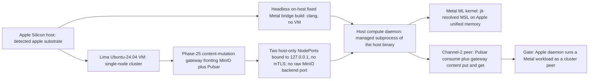

# Phase 35: Apple-Metal host compute daemon

**Status**: Authoritative source
**Supersedes**: N/A
**Referenced by**: DEVELOPMENT_PLAN/README.md, DEVELOPMENT_PLAN/overview.md, DEVELOPMENT_PLAN/phase_34_jitml_lift_cuda.md, DEVELOPMENT_PLAN/system_components.md, documents/engineering/apple_metal_headless_builds.md
**Generated sections**: none

> **Purpose**: Stand up the Apple-Silicon host compute daemon that runs a Metal ML workload as a plain cluster
> Pulsar/content-store peer over host-only loopback NodePorts with no mTLS, where the content endpoint is the
> sole Phase-25 mutation gateway fronting MinIO, with the native worker built **headless
> on-host through the fixed Metal bridge — no VM — only after one pure physical-host → Lima-VM + cluster +
> host-worker + cache resource fold proves CPU, memory/unified memory, and presentation/allocation-derived
> storage fit without double counting.**

---

## Phase Status

📋 Planned. Nothing in this phase is implemented; every sprint below is 📋 Planned and every prescriptive
statement is design intent, never a tested amoebius result. The phase runs on the **apple** substrate in
**Register 3** (live infrastructure): an Apple-Silicon host whose Lima-synthesized Ubuntu-24.04 Linux VM
carries a single-node cluster. The mechanisms it composes exist only as **sibling evidence, not amoebius
results**: the loopback-NodePort peering pattern is precedent in the sibling prodbox project (in-cluster
Harbor reached at `127.0.0.1:30080` over a loopback-bound NodePort); the headless fixed-Metal-bridge build is
proven in the sibling jitML project and adopted after the sibling infernix library *removed* its own legacy
Tart path; and the substrate detection + no-`PATH` lazy tool-ensure kernel is inherited from the hostbootstrap
seed. None has been built or run as amoebius, and there is no amoebius Tart code, now or planned. Status
transitions are recorded reverse-chronologically here once work begins.

## Phase Summary

This phase delivers the one class of amoebius compute that lives **outside a cluster pod**: a long-running
host subprocess that reaches hardware which refuses to be performantly contained — Apple-Metal needs Apple
Silicon unified memory, so it cannot run in a Linux container or a Linux VM. The phase does four things and
stops there. Its prerequisite is one complete physical-host provision: the observed Apple host advertises CPU,
physical unified memory, host cache/storage backing, and an `AppleMetalOffering` with a compatible
`MetalProfile`; the Lima VM carves vCPU, memory, and a materializable disk from that host. A raw VM-disk byte
scalar is not an input: `VmDiskCarve` instead carries
`{ id, presentation : FilesystemPresentation, allocation, guestSystem, kubelet }`; there is no `Block`
guest-root arm. Provisioning sums the guest-system and unique
kubelet-layout **usable** carves, applies the versioned filesystem/sparse-image overhead model and the host
backing's minimum/quantum, and alone constructs private
`ProvisionedVmDiskCarve { id, requiredUsableBytes, provisionedBytes, presentation, allocation, witness }`. The VM's
Kubernetes node advertises net allocatable CPU/memory, logical ephemeral bytes, and a closed
filesystem/content-snapshot layout inside that VM disk; and the host worker declares CPU,
non-Metal runtime memory, and an unprovisioned `MetalOwnerDemand` with exact equal-keyed inference/JIT/library
source and workload maps plus finite class-based coexistence policy. Provision derives every permitted
unified-memory epoch and privately aggregates its peak; only that private claim renders. The worker also declares its
bounded host-cache demand. The fold charges the VM reservation, host/runtime headroom, worker non-Metal runtime, and
the provisioned Metal epoch peak once against physical memory. Inside the VM disk it proves
`guest usable system reserve + Σ(unique layout usable carves) = requiredUsableBytes`; presentation/allocation
then derive the raw sparse-disk high-water `provisionedBytes`. That high-water is charged **once** beside
disjoint durable backing and host-cache pools on the physical disk, never again as the nodefs/imagefs
sub-budgets nested inside it. If any axis does not fit, `provision` rejects before Lima creation, bridge build,
cache materialization, or worker launch.

First, it manages the apple substrate, synthesizing the Linux host the cluster wants via **Lima**
and rooting every host tool in **brew** through the no-environment / no-`PATH` lazy tool-ensure contract —
probe, install-if-absent, resolve the absolute path from the package manager, invoke by full path. Second, it
binds the in-cluster Phase-25 content-mutation gateway and Pulsar service to **host-only loopback NodePorts** reachable only
from the host (`127.0.0.1:<nodeport>`), with no LoadBalancer, no Envoy route, and no path from LAN/WAN — the
sanctioned localhost carve-out from Keycloak-owns-all-wild-ingress. Third, it builds the native Apple-Metal
worker **headless, directly on the host — no VM (no Tart)** — via a fixed Objective-C/C Metal bridge
source-built with `/usr/bin/clang` by absolute path, with generated MSL compiled at runtime through the OS
Metal framework. Fourth, it runs that worker as a managed subprocess of the host binary and wires it as an
**ordinary Pulsar + content-store peer over host-only NodePorts with no mTLS**: commands arrive as Pulsar
messages, mutations pass only through the Phase-25 gateway into the content-addressed MinIO store, and there is
no bespoke binary↔daemon RPC — coordination is Pulsar plus the gateway-backed store, with security from the
network restriction, not from transport crypto. The representative fixture exposes no raw MinIO backend
NodePort. A future raw-GET endpoint must be a separately counted read-only Service with read-only credentials,
no PUT/DELETE/multipart authority and no mutation route; it cannot share the gateway Service identity.

The scope stops at the host-worker shell and its wire. The Metal ML kernel it runs is a **named catalog
identity the shared jit-build resolver materializes on first miss into the `CacheBudget`-bounded
content-addressed cache** (Phase 32), never a baked or URL-fetched payload; on the Apple substrate the cache
artifact is content-addressed source metadata — the rendered MSL plus launch/determinism metadata — not a
compiled dylib. The daemon carries no cluster-control authority: state-changing coordination flows through the
same Pulsar/gateway-backed-content-store nervous system every in-cluster worker uses, and the durable side of
that store lives in the
Vault-enveloped MinIO bucket that is the stateless Deployment-`replicas=1` control-plane singleton's only
durable state (single-instance delegated to k8s/etcd, **no election**). The windows-CUDA host worker is the
structurally identical case on a different substrate and is named throughout as target shape, but it is **not**
part of this phase's single-substrate gate. This phase consumes earlier phases rather than re-implementing
them: Phase 14's substrate detection, `pb` midwife handoff, and no-`PATH` tool-ensure kernel; Phase 19's MinIO
and Pulsar standard services; Phase 24's native Pulsar client; Phase 25's content-addressed store and workflow
runtime; Phase 31's determinism kernel; Phase 32's jit-build engine cache; and Phase 18's Vault secrets-by-name.

**Substrate:** apple — the whole gate runs on an Apple-Silicon host whose Lima-synthesized Linux VM carries a
single-node cluster in Register 3 (live infrastructure); no linux-cpu, linux-cuda, or windows substrate is
touched by the gate, and the windows-CUDA host worker is named only as the structurally identical non-gate case.

**Register:** 3 — live infrastructure (§K).

**Gate:** an Apple-Silicon host daemon runs a Metal ML workload as a cluster Pulsar/content-store peer over
host-only NodePorts — one `InForceSpec` in Register 3 brings up the apple-substrate cluster on Lima, exposes
the sole Phase-25 content-mutation gateway and Pulsar (not raw MinIO) on loopback NodePorts, builds the native worker **headless on-host via the fixed Metal bridge
(no VM)**, starts the daemon as a managed subprocess, dispatches a Metal inference job over Pulsar with **no
mTLS**, lands its output in the content-addressed MinIO store by content address, and tears the worker and
cluster down leak-free. Before any of those effects, the gate must construct the physical-host → VM/node +
host-worker + cache placement/carve witness, including the VM's pinned 4-vCPU/8-GiB carve and the current
oracle's presentation/allocation-derived **40-GiB raw virtual-disk result**, every pod's
CPU/memory/ephemeral-storage envelope, the worker's CPU/non-Metal-runtime-memory and identity-complete
`MetalOwnerDemand`, every structurally derived unified-memory coexistence epoch, and the
bounded cache/durable-storage pools; the live inventory must meet or exceed every declared supply. The run
emits a proven/tested/assumed ledger recording that host-only reachability was
*tested* (reachable from `127.0.0.1`, unreachable from the LAN) and that no mTLS or bespoke RPC was introduced
on channel 2, with Apple-Metal physics marked *assumed* (sibling evidence, not an amoebius measurement).

**Gate-integrity clauses (§M).** The gate passes only when all of the following hold; each is authored under
the [§M gate-integrity standard](development_plan_standards.md#m-gate-integrity-a-gate-cannot-be-passed-by-a-stub)
and its concrete fixtures are pinned per the [Phase-0 oracle-pinning obligation](#gate-integrity).

- **Input-dependent output oracle (§M.1/§M.3).** The artifact retrieved from MinIO by content address must be
  byte-equal to an independently pinned expected output computed **off-implementation** — the committed
  Phase-0 CPU reference `test/golden/phase_35/metal_job_ref.py` (a plain NumPy recompute of the same kernel
  math, authored before the bridge exists, never derived from bridge output). Two committed jobs `job_A` and
  `job_B` (differing only in their input tensor) must land two **different** pinned outputs
  `blobs/<sha256(out_A)>` and `blobs/<sha256(out_B)>`; a constant, input-independent, or `job_A==job_B` worker
  output turns the gate red. The dispatch additionally observes a real `MTLDevice` artifact (the compiled
  `MTLLibrary`/pipeline-reflection handle), not only the returned buffer.
- **Committed seeded mutant (§M.2).** The committed mutant set `test/mutants/phase_35/` includes at minimum
  `const_output.patch` (worker writes a fixed constant regardless of job payload — an effect-swap operator)
  and `lb_nodeport.patch` (the host-comms spec re-typed `LoadBalancer` — a union-arm addition), plus
  `omit_metal_work_item.patch`, `favorable_metal_epoch.patch`, and `drop_metal_overlap_debit.patch`; the gate is
  re-run against each and **must go red** (`const_output.patch` fails the input-dependent oracle,
  `lb_nodeport.patch` fails the wild-exposure type-check, and the owner mutants fail exact source equality or
  the independently derived coexistence-epoch oracle). A green gate against any committed mutant fails the
  phase.
- **Representative set (§M.7).** The gate's representative set is exactly: one apple substrate (Apple-Silicon
  host + Lima Ubuntu-24.04 VM), the exact Phase-0-pinned physical-host/VM/node/worker/cache resource fold (the
  VM carve is 4 vCPU, 8 GiB memory, and a private rounded raw-disk result of 40 GiB derived from the pinned
  guest-usable/presentation/allocation operands; all other numeric demands/supplies live in the pinned resource
  oracle), the two host-only NodePort Services {ContentMutationGateway, Pulsar} (raw MinIO absent), the two dispatch jobs
  {`job_A`, `job_B`}, and the four wild-exposure negatives enumerated in Sprint 35.5. No other shape is claimed.
- **VM-disk geometry is materialized and observed (§M.3/§M.4).** Before create, the independent oracle
  rederives `requiredUsableBytes` from guest-system plus unique layout carves, applies the pinned presentation
  and backing minimum/quantum, and compares the private `ProvisionedVmDiskCarve`, including
  `provisionVmDisk(raw).id == raw.id`. The parent-disk debit and live observation are keyed by that same id.
  After create, an external observer checks Lima's raw virtual size, mounted usable bytes/fs type, and sparse
  host allocation against that witness. A dropped or swapped id, a debit against the wrong parent, a one-byte-
  short raw disk, omitted filesystem/sparse overhead, or one-byte-across-quantum boundary turns the gate red;
  no check may substitute the authorable guest-usable sum for the raw disk or charge the sparse high-water
  twice.
- **Leak-free, defined (§M).** "Tears down leak-free" at Phase 35 means, asserted by the postflight probe:
  after teardown (a) `limactl list` shows the named VM absent; (b) no worker/bridge subprocess of the host
  binary survives (checked by pgrep of the recorded child PIDs); and (c) the host-side residue set — the
  bridge dylib path, the jit MSL cache dir, and any brew-installed `limactl` marked ephemeral by this run — is
  swept to its pre-run state. Phase 36's general postflight sweep is not yet available, so this phase pins its
  own explicit three-part residue check rather than deferring to it.

## Gate integrity

Under [§M.1 oracle-pinning](development_plan_standards.md#m-gate-integrity-a-gate-cannot-be-passed-by-a-stub),
the following fixtures, goldens, and expected-error tags are authored and committed **in Phase 0 — before any
Phase-35 implementation exists** — and are the byte-authority the gate checks against (none is regenerated from
the implementation):

- `test/golden/phase_35/metal_job_ref.py` — the off-implementation CPU (NumPy) reference for the dispatched
  kernel; the source of the expected output bytes.
- `test/golden/phase_35/job_A.input`, `job_B.input` — the two committed job inputs, differing only in their
  tensor payload.
- `test/golden/phase_35/job_A.expected`, `job_B.expected` — the two pinned expected outputs (produced by the
  CPU reference, not the bridge), whose sha256 the gate retrieves from MinIO.
- `test/golden/phase_35/resource_fold.json` — the independently authored physical-host inventory and exact
  Lima-VM, Kubernetes-node, host-worker, Apple-unified-memory, cache, and durable/local-storage demands. For
  the VM it pins guest-system/unique-layout usable carves, `FilesystemPresentation`, backing minimum/quantum, the
  expected private `requiredUsableBytes`/40-GiB `provisionedBytes` result, and the single physical-disk
  high-water debit; it fixes the disjoint pool ownership and expected headroom witness before the provision
  fold exists.
- `test/golden/phase_35/vm_disk_boundaries.csv` — independently computed minimum/quantum boundary pairs,
  including an accepted exact-boundary operand, a one-byte-higher operand that rounds to the next quantum and
  exhausts its parent, and the expected one-byte-short-live-disk/fs-type failure reasons.
- `test/dhall/phase_35_illegal/` — the four wild-exposure negatives (see Sprint 35.5), each a one-field
  mutation of the committed green host-comms spec, each carrying its validation-locus tag and its expected
  `dhall type` error string, registered in the Phase-6 illegal-state corpus.
- `test/mutants/phase_35/const_output.patch`, `lb_nodeport.patch` — the committed seeded mutants the gate must
  turn red.
- `test/mutants/phase_35/resources/` — one-short provider/compiler/worker/harness cases and dropped-envelope/
  premature-replacement mutants, paired with the complete `resource_fold.json` positive.

## Resource provision — the host worker and its transitions

The physical-host fold retains complete envelopes for every new execution unit, not just the Metal working
set. The `pb`/brew probe-install-resolve bootstrap, Lima/provider process, fixed-bridge compiler invocation,
long-lived host supervisor+worker child, and host gate/probe process each name an executable content digest
and installed bytes, CPU/memory reservation and ceiling under the finite Apple supervisor policy, bounded
stdout/stderr/rotated logs, writable/temp/scratch bytes on a named host backing, cache participation, process
concurrency and lifetime. The tool install/download/unpack peak uses the existing
`BootstrapExecutionEnvelope`; the bridge uses `BuildExecutionEnvelope`. The worker envelope separates non-
Metal RSS from `MetalOwnerDemand`: exact source/workload keys cover inference jobs, JIT compilations, and
library work; structural residency is governed by finite class-based resident/running bounds whose domains
both equal `classes(sources)`. Provision derives every allowed coexistence epoch and privately sums its
residency into Apple unified memory. The parent physical-memory ledger charges non-Metal RSS plus the private
epoch peak once; native Pulsar/content-gateway/Vault clients, Metal command buffers and response staging are work
inside that envelope and never become fictional client Pods. Runtime MSL compilation adds its intermediate
and cache-write high-water to the same worker/cache transition rather than pretending compilation is free.
The worker's source-equal Phase-24/25 work/result topic and subscription demand also retains finite message/
rate/concurrency, backlog/retention, cursor/dedup, hot-ledger and offload object extents; those bytes merge into
the inherited Pulsar/BookKeeper/MinIO ledger before dispatch, rather than being hidden by the loopback client.
The host content client terminates at the Phase-25 sole content-mutation gateway NodePort; raw MinIO backend
credentials/routing are absent. The gateway and its
collector/verification Job retain complete Pod/image/CPU/memory/ephemeral/mapped/log/pod-IP-CSI/API-object
envelopes, finite admission concurrency, exact output/upload/failure extents and rollout overlap before the
host may write. Reads still resolve the content-addressed object through that gateway-backed MinIO store.

The content gateway/collector, MinIO backend, Pulsar, Vault and Phase-22 singleton instances are inherited
service definitions, but they are not
free prerequisites: whether newly materialized with the apple cluster or already live in the current snapshot,
their exact Pods remain in the whole-deployment fold with complete images, resources, local/durable storage,
pod/IP and CSI attachment slots. A NodePort `Service`, firewall rule and pure client library do not create
additional Pods. Any incremental singleton reconciliation/API-client work for the two Services is charged to
the singleton's existing container envelope. The host worker is the only new compute *role*; the gate still
spends the exact inherited service-Pod slots and cannot call that count zero.

The host worker is structurally paired only with
`HostProcessReplacementPolicy.MetalDrainThenReplaceAfterObservedExit`. Its supervisor first CAS-reserves the
complete host vector, moves Reserved→LaunchInFlight, and keeps an ambiguous launch charged until PID/process
readback repairs it to Running. During replacement, its PID, executable, CPU/RSS,
unified-memory hold, cache residents/temp, logs and socket/client buffers stay charged until Drain completes,
the process is absent, `MTLDevice.currentAllocatedSize` returns to the admitted residual, and cache cleanup is
observed. CPU/Metal axes may then release, but cache/log/local artifacts remain in the host resident ledger
until their own deletion/GC observation. Only a snapshot-bound
`ValidatedMetalReleaseEvidence` may authorize replacement acquisition. The cache-bypassed determinism recompute runs through
the same surviving worker serially; its old and new MinIO output objects coexist for comparison, and its new
MSL/cache workspace is included in the transition peak. Any future overlapping worker policy must provision
two complete host envelopes and two privately derived Metal-owner epoch peaks; v1 supplies no shortcut for it.

The `MetalOwnerDemand` source/workload maps and policy never render. Only the private
`ProvisionedMetalOwnerDemand` aggregate claim enters `ProvisionedSpec`; live readback exact-matches work-item
dispatches and current allocated unified memory to that witness. Omitting a work item, mismatching either
policy domain, supplying a favorable epoch list, or dropping a co-resident overlap so the host fits by one byte
rejects before bridge/cache/worker effects.

After controller expansion, the binder serializes exhaustive `desiredObjects` for all rendered and derived
Kubernetes objects, not selected kinds, and joins observed survivors with old/new/apply-before-prune.
`EtcdLogicalDemand { desiredObjects, churn, model }` includes revisions, Leases and Events; only private
`ProvisionedEtcdLogicalDemand.derivedPeak <= backendQuotaBytes` may continue. Physical capacity separately fits
backend-at-quota plus WALs, retained/saving snapshots and defrag old+new workspace. Live object/quota/backend
readback must equal the witness. One-byte logical/physical shortages and `drop_api_object_demand.dhall`,
`drop_etcd_churn.dhall` or `drop_etcd_model.dhall` reject before Lima workload/NodePort apply.

Only the snapshot-bound private provision projections authorize `brew`, Lima, clang, bridge/cache writes,
NodePort mutation or worker acquire. Live readback compares the executable digests, supervisor/child process
tree, CPU/RSS samples and breach policy, Metal profile/allocation, log/writable/scratch/cache high-water,
Lima VM/root geometry, Kubernetes survivor images/resources/slots, the exact
`{ContentMutationGateway, Pulsar}` NodePort identities/listeners/firewall and raw-MinIO-backend absence (or the
separately provisioned read-only Service identity/credential/route set in its optional arm), exact Pulsar
topic/cursor/backlog/offload, content-gateway/collector execution/admission, and MinIO resident/transient
objects to that witness. Besides the existing VM/Metal boundaries, Phase 0 supplies
one-unit/one-byte-short fixtures for bootstrap/tool install, provider, compiler, supervisor/worker and harness
CPU/memory,
process slots, logs/writable/scratch/cache, client buffers, Pulsar topic/backlog/offload, output-object overlap,
content-gateway/collector execution, and every surviving pod/IP/
CSI/image/storage commitment. Dropped-envelope mutants that launch clang, the worker, or the host probe with
no row live under `test/mutants/phase_35/resources/`; `early_worker_replacement.dhall` replaces before observed
release and `drop_pulsar_topic_demand.dhall` omits the work-topic row. Each must turn the gate red before any
lasting effect. `drop_content_gateway_collector.dhall` and `direct_minio_backend_put.dhall` must likewise fail
before any output mutation.

## Doctrine adopted

This phase is the first live amoebius realization of three doctrines; individual sprints cite the same sections
where they adopt them.

- [`host_cluster_comms_doctrine.md §2`](../documents/engineering/host_cluster_comms_doctrine.md#2-the-decision-that-was-open-and-is-now-resolved)
  — *the decision that was open, and is now resolved*: this phase builds the resolved channel-2 design — a host
  compute daemon as a plain Pulsar + gateway-backed-MinIO peer over host-only NodePorts with **no mTLS**; the
  gateway is the sole mutation endpoint and the raw MinIO backend is not exposed — taking the two
  localhost-only channels of [`§1`](../documents/engineering/host_cluster_comms_doctrine.md#1-the-whole-surface-two-channels-both-localhost-only),
  the no-bespoke-control-channel rule of [`§3`](../documents/engineering/host_cluster_comms_doctrine.md#3-there-is-no-bespoke-control-channel--coordination-is-pulsar--minio)
  (*coordination is Pulsar + MinIO*, with MinIO mutation mediated by the Phase-25 gateway), the
  network-restriction threat model of [`§5`](../documents/engineering/host_cluster_comms_doctrine.md#5-why-no-mtls-is-safe-here-the-network-restriction-is-the-security-boundary)
  (*why no mTLS is safe here*), the loopback-NodePort realization and prodbox precedent of [`§6`](../documents/engineering/host_cluster_comms_doctrine.md#6-the-host-only-restriction-in-practice-and-its-sibling-precedent),
  and the type-excluded illegal states of [`§7`](../documents/engineering/host_cluster_comms_doctrine.md#7-what-the-dsl-makes-unrepresentable-here)
  (*what the DSL makes unrepresentable here*).
- [`substrate_doctrine.md §5`](../documents/engineering/substrate_doctrine.md#5-host-worker-nodes-substrate-specific-hardware-that-refuses-to-be-contained)
  — *host worker nodes: substrate-specific hardware that refuses to be contained*: this phase implements the
  apple host worker (Apple-Metal on unified memory) as a managed subprocess of the host binary with the
  Load → Prereq → Acquire → Ready → Serve → Drain → Exit role lifecycle, built via the virtualized-substrate
  provider of [`§4`](../documents/engineering/substrate_doctrine.md#4-virtualized-substrates-synthesizing-a-linux-host-where-the-host-is-not-linux)
  ([`§4.1 — Lima on Apple`](../documents/engineering/substrate_doctrine.md#41-lima-on-apple) for the Linux VM),
  all under the [`§3`](../documents/engineering/substrate_doctrine.md#3-the-no-environment--no-path-lazy-tool-ensure-contract)
  *no-environment / no-`PATH` lazy tool-ensure contract* rooted in brew, handed off by the Python `pb` midwife
  of [`§6`](../documents/engineering/substrate_doctrine.md#6-the-midwife-contract-a-python-cli-ensures-a-toolchain-builds-the-binary-hands-off)
  (*the midwife contract*), never a shell script.
- [`resource_capacity_doctrine.md §3.1`](../documents/engineering/resource_capacity_doctrine.md#31-the-systematic-provision-matrix)
  and [`§4`](../documents/engineering/resource_capacity_doctrine.md#4-the-total-fold-fits-carve-place-and-the-nesting)
  — *the systematic provision matrix* / *the total provision fold*: the Apple physical host is the single
  supply owner. The Lima VM carves CPU/memory plus a presentation/allocation-derived private raw disk whose
  guest-usable layout and sparse physical high-water are distinct; the VM node and pods consume net
  CPU/memory/local ephemeral storage; the host worker requires a compatible `AppleMetalOffering` profile and
  consumes CPU/non-Metal runtime memory plus the private worst permitted `MetalOwnerDemand` unified-memory
  epoch; and the jit cache carves one
  bounded host-cache pool. Unified memory and storage are each charged once, with disjoint pool witnesses,
  before any live effect.
- [`apple_metal_headless_builds.md §1`](../documents/engineering/apple_metal_headless_builds.md#1-the-commitment-headless-on-host-no-vm)
  — *the commitment: headless, on-host, no VM* — with [`§3 — Architecture`](../documents/engineering/apple_metal_headless_builds.md#3-architecture)
  (the fixed host Metal bridge), [`§4 — Build and prerequisite model`](../documents/engineering/apple_metal_headless_builds.md#4-build-and-prerequisite-model),
  and [`§6 — Why Tart is not viable`](../documents/engineering/apple_metal_headless_builds.md#6-why-tart-is-not-viable-the-no-vm-rationale):
  this phase builds the Apple-Metal worker **headless on the host — no Tart, no macOS VM** — source-building the
  fixed Objective-C/C Metal bridge with `/usr/bin/clang` by absolute path and compiling generated MSL at
  runtime through the OS Metal framework, so a cache miss never starts a VM, invokes SwiftPM, or depends on a
  login keychain.

## Sprints

## Sprint 35.1: Apple substrate management — Lima Linux VM + brew lazy tool-ensure 📋

**Status**: Planned
**Implementation**: `src/Amoebius/Substrate/Apple.hs`, `src/Amoebius/Substrate/Lima.hs`, `src/Amoebius/Substrate/Brew.hs` (target paths; not yet built)
**Blocked by**: Phase 14 gate (external prereq — substrate detection, the `pb` midwife handoff, and the closed-enum no-`PATH` lazy-tool-ensure kernel that invokes by absolute path, here extended to the brew root and the Lima provider on apple)
**Independent Validation**: on a detected apple substrate, `ensure lima` is `brew install lima` when `limactl`
is absent and a verified no-op otherwise; before installation or VM creation, the physical-host provision fold
checks the pinned **4-vCPU, 8-GiB-memory Lima carve** and derives the current oracle's **40-GiB raw virtual
disk** from guest-usable carves, `FilesystemPresentation`, filesystem/sparse overhead, and backing
minimum/quantum. Only the private `ProvisionedVmDiskCarve.provisionedBytes` is passed to Lima and charged once
as the sparse physical-allocation high-water, together with host/runtime headroom, the
host-worker CPU/non-Metal-runtime-memory plus identity-complete Metal-owner demand and derived private unified-
memory epoch peak, the VM node/pod CPU/memory/ephemeral-storage
envelopes, and the cache/durable/local-storage pool carves. A fitting shape starts and carries a single-node
cluster; any overcommit rejects before mutation. Live observation checks raw virtual size, mounted usable
bytes/fs type, and sparse host allocated high-water. Every host tool used is resolved to an absolute path via
the package manager, and **no bare command name and no environment variable (including `PATH`) is ever read**
on the host surface, asserted from the execution-boundary argv/env trace of Validation 6 (not a source grep).
**Docs to update**: `documents/engineering/substrate_doctrine.md`,
`documents/engineering/resource_capacity_doctrine.md`

### Objective
Adopt [`substrate_doctrine.md §4.1 — Lima on Apple`](../documents/engineering/substrate_doctrine.md#41-lima-on-apple)
and [`substrate_doctrine.md §3`](../documents/engineering/substrate_doctrine.md#3-the-no-environment--no-path-lazy-tool-ensure-contract)
— the no-environment / no-`PATH` lazy tool-ensure contract — handed off by the Python `pb` midwife of
[`substrate_doctrine.md §6`](../documents/engineering/substrate_doctrine.md#6-the-midwife-contract-a-python-cli-ensures-a-toolchain-builds-the-binary-hands-off):
synthesize the Linux host the apple substrate's cluster runs on via Lima, with every host tool ensured and
invoked by absolute path through brew — the substrate foundation every later Phase-35 sprint stands on.

### Deliverables
- An apple-substrate manager that drives Lima (`limactl`) to start a named, budget-sized Ubuntu-24.04 VM and
  re-invokes amoebius subcommands inside it via `limactl shell <vm> -- <amoebius> <subcmd>` (the composition
  lift is owned elsewhere and only consumed here).
- A pure physical-host resource plan that inventories allocatable CPU, unified memory, and disjoint VM-disk /
  durable-backing / host-cache pools; carves the Lima VM; derives the VM node's net allocatable CPU, memory,
  logical local ephemeral storage and closed filesystem/content-snapshot layout capacity. Its raw
  `VmDiskCarve` has
  `{ id, presentation : FilesystemPresentation, allocation, guestSystem, kubelet }` and deliberately has no
  `bytes` field or `Block` presentation. The fold
  sums the guest-system carve and the unique carves prescribed by the kubelet filesystem layout into
  `requiredUsableBytes`, applies the versioned filesystem/sparse-image overhead and
  `BackingAllocationPolicy { minimumBytes, quantumBytes }`, and alone returns the opaque private
  `ProvisionedVmDiskCarve { id, requiredUsableBytes, provisionedBytes, presentation, allocation, witness }`,
  with `id` copied unchanged from the raw carve. It proves the
  guest-usable carves fit the resulting presentation, charges the sparse raw-allocation high-water
  `provisionedBytes` once to the physical partition, and proves the remaining host supply fits the Metal
  worker and cache. It also carries the fixed bridge's single-stage
  `BuildExecutionEnvelope`: clang CPU/RSS, intermediate object/dylib scratch on a named `BuildScratch` pool,
  compiler-cache write delta/backing, and serial architecture/stage concurrency. Transition admission proves
  both `VM + bridge build` and `VM + worker` epochs (not an invalid sum of non-overlapping peaks). The
  constructor returned to the effectful driver is opaque, so `limactl create/start` cannot receive an unchecked
  shape.
- A read-only `observeHost → diff → validatePlan` live boundary that converts that pure plan into a
  single-use `ValidatedAppleHostPlan` bound to the physical CPU/memory/process/disk/cache/Metal fingerprint.
  Every `brew` mutation, Lima create/start, bridge build, cache write, and worker `Acquire` requires the token;
  the fingerprint is re-read immediately before the first mutation and change restarts the read-only prefix.
  The disk fingerprint includes parent-device identity/free bytes, Lima sparse-image raw virtual and host
  allocated byte counts, guest mount/device identities, mounted usable bytes, fs types, and the layout-carve
  quota/partition limits; aliasing, a missing mount, or an unobservable value refuses.
- A brew-rooted lazy-tool-ensure binding: probe → install-if-absent → resolve the absolute path from the
  package manager (`brew --prefix`) → invoke by full path; the install *plan* is a pure value so the substrate
  branching is unit-tested without invoking brew, and only the driver is `IO`. Its
  `BootstrapExecutionEnvelope` includes probe/installer CPU+memory, installed bytes, peak download/unpack and
  logs on named `ToolInstall`/scratch backings, cache delta, and serial tool-install concurrency; it is
  provisioned in the bootstrap epoch before `brew install`, not hidden inside the later VM/worker steady row.
- A substrate-applicability guard so the apple reconcilers fail fast — before any side effect — when run on a
  non-apple substrate, with a one-line diagnostic.

### Validation
1. With `limactl` absent, the reconciler installs it via brew, re-resolves it to an absolute path, and starts
   the VM; with it present, the same call is a verified no-op (idempotent).
2. A unit test exercises the pure install plan for apple without invoking brew.
3. Cross-check the live physical-host and VM/node inventory against
   `test/golden/phase_35/resource_fold.json`; observed supply below any declared CPU, memory/unified-memory, or
   storage value fails. Before creation, rederive the current fixture's
   `requiredUsableBytes` from the guest system plus unique kubelet-layout carves, apply its
   `FilesystemPresentation` overhead and backing minimum/quantum, and assert the private result is the pinned
   40-GiB raw `provisionedBytes`; the raw field cannot be supplied directly. Reserve that sparse-allocation
   high-water exactly once in the parent physical-disk ledger keyed by the unchanged
   `ProvisionedVmDiskCarve.id`. One-field negatives that drop or swap the id, debit the wrong parent, overdraw host unified
   memory, overlap the VM-disk and cache pools, exceed the physical CPU, double-charge or omit the VM sparse
   high-water, or remove/change the compatible `AppleMetalOffering MetalProfile` reject
   before `brew install`, `limactl create`, bridge build, or cache write; the Metal case returns
   `MissingCapability AppleMetal`/profile mismatch and an external effects trace is empty.
   A changed-snapshot fixture allocates host memory, parent-disk/sparse-image high-water, or cache bytes after
   validation but before Lima/worker enactment; the immediate token recheck refuses and the trace contains zero
   brew/Lima/bridge/cache/worker mutation.
4. After Lima creates the accepted disk, independently assert `qemu-img info`/Lima reports raw virtual size
   `== ProvisionedVmDiskCarve.provisionedBytes` for the same `ProvisionedVmDiskCarve.id`; inside the guest,
   assert the root/layout mounts expose the
   declared `fsType`, each quota/partition supplies its promised usable bytes, and their unique-carve sum plus
   guest-system reserve equals `requiredUsableBytes`. At the host boundary, record allocated sparse bytes
   (`st_blocks`/Lima's actual-size observer), drive the fixture through its pinned allocation high-water, and
   assert allocation never exceeds the once-reserved high-water or spills into durable/cache carves. A live
   raw virtual disk one byte below the witness, an incorrect fs type, a missing layout hard cap, or a host
   allocated high-water above the witness refuses start/continuation and turns the external oracle red.
5. Run `vm_disk_boundaries.csv`: the exact-boundary case fits; adding one guest-usable byte crosses the
   allocation quantum and, with the same parent residual, rejects before `brew install`/Lima create. A
   provisioner mutant that omits filesystem/sparse-image overhead or rounds down instead of up is caught by
   the independent expected witness. The paired live one-byte-short image is rejected by Validation 4. Every
   failure has an empty mutation trace up to the deliberate observer-created live mutant.
6. Execution-boundary trace check (not a source grep): the whole sprint run is driven through the tool-ensure
   seam, which records `(argv, env)` for every spawn, and is additionally run under an OS-boundary exec trace
   (`dtruss`/`execsnoop` capturing every `execve` and its environment). The suite asserts, from the trace, that
   **every** recorded `argv[0]` is an absolute path (no bare command name) and every spawn's environment is
   exactly the fixed closed allow-set the contract permits (`PATH` absent from it) — covering transitively
   spawned subprocesses and library-issued execs, which a grep of the author's modules cannot see.

### Remaining Work
The whole sprint (📋 Planned).

## Sprint 35.2: Host-only loopback NodePort exposure of the content-mutation gateway + Pulsar 📋

**Status**: Planned
**Implementation**: `src/Amoebius/HostComms/NodePort.hs`, `src/Amoebius/HostComms/Loopback.hs` (target paths; not yet built)
**Blocked by**: Sprint 35.1 (the Lima VM provides the node network whose NodePorts must be bound to the host's loopback); Phase 19 gate (external prereq — the in-cluster Pulsar and MinIO-backed storage services); Phase 25 gate (external prereq — the sole content-mutation gateway fronting MinIO)
**Independent Validation**: after bring-up, the Phase-25 content-mutation gateway and Pulsar are reachable
from the host at `127.0.0.1:<nodeport>` and **unreachable** from (a) a second physical machine on the same LAN
and (b) the host's own primary non-loopback interface address (`<lan-ip>:<nodeport>`, the WAN-equivalent probe
— dialing the routable interface stands in for an off-LAN client without requiring a real WAN peer). The
representative fixture has exactly those two counted NodePort Services and no raw MinIO backend endpoint.
"Unreachable" is defined as either an immediate `connection refused`/`no route` **or** a connect that does
not complete within a 5s timeout (a silent drop counts as unreachable, an established TCP session does not);
there is no `LoadBalancer`-typed Service, no Envoy route, and no wild listener for either port; the loopback
binding holds even though the Lima VM's node network does not bind NodePorts to loopback by default. If a
future topology selects the closed optional raw-GET arm, it provisions a third, separately counted read-only
Service identity with read-only credentials and proves that identity has no PUT, DELETE, multipart-upload, or
other mutation authority/route; it can never replace or share the mutation-gateway Service.
**Docs to update**: `documents/engineering/host_cluster_comms_doctrine.md`, `documents/engineering/substrate_doctrine.md`

### Objective
Adopt [`host_cluster_comms_doctrine.md §6 — the host-only restriction in practice`](../documents/engineering/host_cluster_comms_doctrine.md#6-the-host-only-restriction-in-practice-and-its-sibling-precedent)
and [`§1 — two channels, both localhost-only`](../documents/engineering/host_cluster_comms_doctrine.md#1-the-whole-surface-two-channels-both-localhost-only):
realize channel 2's transport — a NodePort bound to the host's loopback so the daemon connects to
`127.0.0.1:<nodeport>` with no path from LAN/WAN — generalizing the prodbox `127.0.0.1:30080` Harbor precedent
(sibling evidence, not an amoebius result) onto the Lima-backed apple substrate. The rendered manifests are
emitted from Haskell and never committed.

### Deliverables
- Exactly two rendered host-only NodePort Services in the representative arm —
  `{ContentMutationGateway, Pulsar}` — whose reachability is restricted to host-origin traffic, plus the
  substrate-layer loopback binding / host-only firewalling that makes the
  `127.0.0.1:<nodeport>` shape hold on the Lima VM **without relaxing the restriction** (never by publishing
  the port wider). The MinIO backend has no raw NodePort and has no credential or route reachable by the host
  worker.
- A closed optional raw-content-read arm: `None` for the representative fixture, or a separately counted
  read-only Service with its own identity, read-only credential, complete provisioned Service/API-object and
  backing demand, and no PUT/DELETE/multipart/mutation route. A raw MinIO mutation endpoint is not an arm.
- An assertion seam proving the negative: no `LoadBalancer` Service, no Gateway/HTTPRoute, and no wild listener
  references any selected host-origin port — these are the only channel-2 endpoints and they are
  localhost-only.
- A recorded note that the same loopback shape is what the windows substrate's WSL2 case would target, as
  target shape (not exercised by the apple gate).

### Validation
1. Connect to the content-mutation gateway and Pulsar from the host at `127.0.0.1:<nodeport>` and succeed;
   attempt the same from a second physical host on the LAN and from the host's routable
   `<lan-ip>:<nodeport>` (WAN-equivalent probe) and fail — where fail means `connection refused`/`no route` or
   a connect that does not complete within a 5s timeout (no established session), per the Independent
   Validation definition.
2. Assert the representative render has exactly `{ContentMutationGateway, Pulsar}` host-origin Services, no
   raw MinIO backend listener, no `LoadBalancer`-typed Service and no Envoy route fronting either port. In the
   separately tested optional raw-GET arm, count the third Service and its resource/API-object demand, then
   prove a content-addressed GET succeeds while direct PUT, DELETE and multipart initiation are denied and no
   mutation route or credential is present.
3. Tear the cluster down and back up; the loopback binding is re-established idempotently.

### Remaining Work
The whole sprint (📋 Planned).

## Sprint 35.3: Headless host-native Metal bridge + native worker build (no Tart) 📋

**Status**: Planned
**Implementation**: `src/Amoebius/HostWorker/MetalBridge.hs` (fixed ObjC/C bridge install + probe + runtime MSL dispatch), `src/Amoebius/HostWorker/AppleMetalBuild.hs` (target paths; not yet built)
**Blocked by**: Sprint 35.1 (the apple substrate manager + brew lazy tool-ensure that resolves `/usr/bin/clang` and the OS Metal runtime by absolute path); Phase 32 gate (external prereq — the jit-build resolver + `CacheBudget`-bounded content-addressed cache the MSL source-metadata artifact lands in); Phase 31 gate (external prereq — the determinism kernel: fast-math-off, `experimentHash`)
**Independent Validation**: the fixed Objective-C/C Metal bridge dylib is source-built on the host with `/usr/bin/clang` (absolute path, no env/`PATH`), `dlopen`'d, and verified by its probe symbol; generated MSL compiles at runtime via `MTLDevice.makeLibrary(source:options:)` and dispatches on the host GPU, and the dispatch surfaces a real `MTLDevice` artifact — the compiled `MTLLibrary` handle and its pipeline reflection — not merely a returned buffer; the dispatched kernel's output is byte-equal to the Phase-0-pinned off-implementation CPU reference (`test/golden/phase_35/job_A.expected`) for `job_A`'s input and byte-**different** and equal to `job_B.expected` for `job_B`'s input, so an input-independent or constant worker output is red; **no VM is ever started, no SwiftPM/`swift build` runs on a cache miss, and no login-keychain unlock is required**; the source-metadata cache artifact is content-addressed and yields bit-identical output when recomputed on a cache-bypassed second run in a distinct content-addressed namespace (an independent recompute, not a store hit).
**Docs to update**: `documents/engineering/apple_metal_headless_builds.md`, `documents/engineering/substrate_doctrine.md`

### Objective
Adopt [`apple_metal_headless_builds.md §1 — the commitment: headless, on-host, no VM`](../documents/engineering/apple_metal_headless_builds.md#1-the-commitment-headless-on-host-no-vm),
[`§3 — Architecture`](../documents/engineering/apple_metal_headless_builds.md#3-architecture),
[`§4 — Build and prerequisite model`](../documents/engineering/apple_metal_headless_builds.md#4-build-and-prerequisite-model),
and [`§6 — Why Tart is not viable`](../documents/engineering/apple_metal_headless_builds.md#6-why-tart-is-not-viable-the-no-vm-rationale),
with the host-worker build rule of [`substrate_doctrine.md §5`](../documents/engineering/substrate_doctrine.md#5-host-worker-nodes-substrate-specific-hardware-that-refuses-to-be-contained):
build the Apple-Metal worker **headless, directly on the host — with no macOS VM (no Tart)** — so build
provenance is host-controlled without inheriting VM lifecycle, keychain, or SwiftPM surfaces. The
headless fixed-bridge shape is proven in the sibling jitML project (sibling evidence, not an amoebius result);
this sprint realizes it in amoebius for the first time.

### Deliverables
- A one-stage host `BuildExecutionEnvelope` for the fixed bridge: `/usr/bin/clang` CPU/memory envelope,
  object/dylib intermediate bytes, compiler-cache write delta, named `BuildScratch`/cache backings, and serial
  architecture/stage policies. The bridge-build action consumes the unchanged Apple-host snapshot token and
  runs in the declared process/disk policies; it is not steady worker overhead.
- A fixed Objective-C/C Metal bridge, source-built once on the host by invoking `/usr/bin/clang` **by absolute
  path** (linking macOS `Foundation`/`Metal`), then `dlopen`'d and verified by resolving an exported probe
  symbol before the worker subscribes to work — no env, no `PATH`, no VM.
- Runtime MSL compilation: the host binary renders Metal Shading Language, writes a content-addressed
  source-metadata cache record into the Phase-32 `CacheBudget`-bounded cache, and dispatches through the
  bridge's `MTLDevice.makeLibrary(source:options:)` with fast-math **off** (the Phase-31 determinism
  contract), reusing an in-process pipeline cache across calls. The cache has one explicit host backing and
  bounded peak occupancy (resident artifacts plus temporary materialization and headroom); it cannot reuse the
  Lima VM disk or durable backing as an unaccounted second name for the same bytes.
- The native Apple-Metal worker built on-host (targeting Apple Silicon unified memory) as a host-worker binary,
  **not** a container image, carrying an explicit host `ResourceEnvelope` for CPU, non-Metal runtime memory,
  identity-complete `MetalOwnerDemand` (profile, exact source/workload maps, structural residency, finite
  coexistence policy), and cache demand; only the private aggregate unified-memory epoch peak can render. The optional Homebrew-`swiftc` +
  explicit-`SDKROOT` lane is available for any non-core Swift parts but is never the cache-miss path and never
  a VM.

### Validation
1. Build the fixed bridge with `/usr/bin/clang`, `dlopen` it, and pass its probe; assert (from the
   Sprint-35.3 exec trace, not a self-report) no `tart`/VM process was started and no `security`/keychain
   unlock call was made.
   Independently overdraw clang CPU/RSS, intermediate scratch, and compiler-cache write headroom and make the
   scratch identity unknown. Each case starts zero clang processes and writes zero object/cache bytes. For a
   fitting build, an OS/config observer proves the compiler stays within CPU/RSS and named backing ceilings;
   deliberate overrun is throttled/terminated/`ENOSPC`, never spilled elsewhere.
2. Compile generated MSL at runtime through the bridge and dispatch a kernel for both `job_A` and `job_B`;
   assert the returned buffer is byte-equal to the Phase-0-pinned CPU reference expected output for each job
   (`test/golden/phase_35/job_A.expected`, `job_B.expected`), that the two outputs **differ** (so a constant
   output fails), and that a real `MTLLibrary`/pipeline-reflection handle was obtained. Assert bit-stable output
   under the fast-math-off determinism contract by recomputing `job_A` on a **cache-bypassed** run in a distinct
   content-addressed namespace and asserting the compute path (MSL compile + GPU dispatch) actually executed and
   produced a bit-identical result — a store hit does not satisfy this. The committed mutant
   `test/mutants/phase_35/const_output.patch` must turn this validation red.
   The OS-boundary memory/cache observer also confirms the worker stays within its declared runtime +
   Metal-unified-memory ceiling and the host cache stays inside its one carved backing; crossing either ceiling
   is red even if the numerical output is correct.
3. Execution-boundary trace check (not a source grep): under the OS-boundary exec trace, assert every tool the
   build/dispatch path spawns has an absolute-path `argv[0]`, every spawn env is the fixed closed allow-set with
   `PATH` absent, and the trace contains no `tart`, `swift build`, or offline `metal` compiler `execve` on the
   core path — covering transitively spawned processes a module grep cannot observe.

### Remaining Work
The whole sprint (📋 Planned).

## Sprint 35.4: Host compute daemon lifecycle as a managed subprocess 📋

**Status**: Planned
**Implementation**: `src/Amoebius/HostWorker/Lifecycle.hs`, `src/Amoebius/HostWorker/Supervise.hs` (target paths; not yet built)
**Blocked by**: Sprint 35.3 (the built native worker binary is what the lifecycle manages); Sprint 35.1 (the apple substrate context the subprocess runs in)
**Independent Validation**: the worker runs as a subprocess of the host binary with a defined Load → Prereq → Acquire → Ready → Serve → Drain → Exit lifecycle; a `Drain` runs **even if serving throws**; a missing prerequisite fails fast before `Serve`; killing the host binary tears the worker down with it (no unmanaged orphan process).
**Docs to update**: `documents/engineering/substrate_doctrine.md`

### Objective
Adopt [`substrate_doctrine.md §5 — host worker nodes: substrate-specific hardware that refuses to be contained`](../documents/engineering/substrate_doctrine.md#5-host-worker-nodes-substrate-specific-hardware-that-refuses-to-be-contained):
run the Apple-Metal worker as a **managed subprocess of the host binary** — the one place amoebius compute
lives outside a cluster pod — with the stateless-role lifecycle and a guaranteed drain, so the worker has a
defined startup and a clean shutdown rather than an unmanaged background process.

### Deliverables
- A supervised host-worker lifecycle implementing Load → Prereq → Acquire → Ready → Serve → Drain → Exit, with
  the drain guaranteed via bracket-style resource handling even when `Serve` raises.
- `Acquire` consumes only the opaque host placement/cache witness produced by the physical-host fold and applies
  the declared CPU/non-Metal-runtime-memory/Apple-unified-memory/cache bounds through the private
  `AppleSupervisor` enforcement witness; there is no constructor that launches a worker from raw unchecked
  quantities or debits Metal memory from a second pool.
- Enforcement is externally observable and explicitly reactive: the finite `AppleSupervisor` policy samples
  process CPU/RSS and the Metal bridge's `MTLDevice.currentAllocatedSize`, terminates after the declared
  consecutive-breach bound, and restricts cache writes to the named bounded carve. macOS is not claimed to
  provide a Linux-cgroup/Windows-Job-style instantaneous hard CPU/RSS quota or scheduler reservation.
  A worker that requires such a stronger guarantee returns `UnsupportedEnforcement` before `Acquire`;
  crossings under the supported supervised policy are terminated/refused, not merely logged.
- Prerequisite gating that fails fast — before `Serve` — when the Metal worker binary, the host-only NodePort
  endpoints, or the worker's content-mutation-gateway/Pulsar credential names are not available, with a
  one-line diagnostic; no raw MinIO mutation credential is accepted.
- Subprocess ownership tying the worker's lifetime to the host binary: a host-binary exit (clean or signal)
  drains and reaps the worker; no orphaned process survives.

### Validation
1. Start the worker, force `Serve` to throw, and assert `Drain` still runs and resources are released.
2. Remove a prerequisite and assert a fast, pre-`Serve` failure with an actionable message.
3. Kill the host binary mid-`Serve` and assert the worker subprocess is drained and gone.
4. Mutate the worker demand so the VM carve plus host/runtime headroom plus worker non-Metal runtime and Metal
   unified-memory ceiling exceed physical memory; assert failure before `Acquire` and zero worker/cache effects.
5. Run deliberate CPU, RSS, Metal-allocation, and cache-write overrun fixtures. An OS process observer plus an
   independent supervisor-event reader proves the declared sample interval/consecutive-breach/terminate policy
   is applied, no process survives beyond that finite breach window,
   `MTLDevice.currentAllocatedSize` is covered by the same response, and the cache carve never exceeds its
   cap. A hard-enforcement-required fixture rejects as `UnsupportedEnforcement`; a mutant that launches the
   worker without applying the supervisor must turn every corresponding oracle red.
6. Race two supervisor starts against the same host-ledger root and require one CAS winner. Crash after
   Reserved and after LaunchInFlight, then restart: identical reservation retry is idempotent, an observed PID
   repairs to Running, and an unknown launch outcome remains charged. During replacement, stale drain/process/
   Metal/cache observations, process-absent with retained cache/log extents, or a second start before
   `ValidatedMetalReleaseEvidence` must produce no launch capability. Exact observed cleanup releases retained
   artifacts only by a new CAS.

### Remaining Work
The whole sprint (📋 Planned).

## Sprint 35.5: Channel-2 peer + wild-exposure unrepresentable + the Apple-Metal peer gate 📋

**Status**: Planned
**Implementation**: `src/Amoebius/HostWorker/Peer.hs`, `src/Amoebius/HostWorker/Auth.hs`, `src/Amoebius/HostComms/Illegal.hs`, `test/dhall/phase_35_apple_metal_peer.dhall`, `test/live/AppleMetalPeerSpec.hs` (target paths; not yet built)
**Blocked by**: Sprint 35.2 (the host-only loopback NodePorts the peer dials and the gate asserts is localhost-only); Sprint 35.4 (the daemon lifecycle whose `Serve` step does the peering); Phase 24 gate (external prereq — the native Pulsar CBOR client); Phase 25 gate (external prereq — the content-addressed store + workflow runtime); Phase 18 gate (external prereq — Vault for secrets-by-name auth)
**Independent Validation**: the worker subscribes to its work topic over the native Pulsar TCP binary protocol (no WebSockets), does the work, and writes outputs through the Phase-25 mutation gateway into the content-addressed MinIO store — all over `127.0.0.1:<nodeport>` with **no mTLS and no bespoke binary↔daemon RPC**; client auth resolves through Vault by secret-name, never via a host environment variable or `PATH`; **each of four** wild-exposure negatives — (1) host-origin NodePort typed `LoadBalancer`, (2) an Envoy/HTTPRoute route on it, (3) any wild listener referencing the port, (4) the daemon publishing its own wild ingress — is a committed `.dhall` that is **a one-field mutation of the committed green host-comms spec** (identical except the single wild field, so that field is provably the rejection cause), is registered in the Phase-6 illegal-state corpus with its validation-locus tag, and **fails `dhall type` with the specific structured error naming the violated exclusion** (asserted against the pinned expected error string, not merely "fails"); the gate `.dhall` runs the full Apple-Metal peer workflow end-to-end and tears down leak-free (per the three-part residue check in the Gate), emitting a proven/tested/assumed ledger artifact.
**Docs to update**: `documents/engineering/host_cluster_comms_doctrine.md`, `DEVELOPMENT_PLAN/README.md`, `DEVELOPMENT_PLAN/substrates.md`

### Objective
Adopt [`host_cluster_comms_doctrine.md §3 — coordination is Pulsar + MinIO`](../documents/engineering/host_cluster_comms_doctrine.md#3-there-is-no-bespoke-control-channel--coordination-is-pulsar--minio)
with the resolution of [`§2`](../documents/engineering/host_cluster_comms_doctrine.md#2-the-decision-that-was-open-and-is-now-resolved),
the threat model of [`§5 — why no mTLS is safe here`](../documents/engineering/host_cluster_comms_doctrine.md#5-why-no-mtls-is-safe-here-the-network-restriction-is-the-security-boundary),
and the type-exclusions of [`§7 — what the DSL makes unrepresentable here`](../documents/engineering/host_cluster_comms_doctrine.md#7-what-the-dsl-makes-unrepresentable-here):
make the host worker an ordinary Pulsar/gateway-backed-content-store peer over the host-only NodePorts with no custom RPC and no
transport crypto, close the carve-out so its boundaries cannot be drawn wrong, and prove the phase gate from
[`§1`](../documents/engineering/host_cluster_comms_doctrine.md#1-the-whole-surface-two-channels-both-localhost-only)
— an Apple-Silicon host daemon runs a Metal ML workload as a cluster Pulsar/gateway-backed-content-store peer.

### Deliverables
- A channel-2 peer that consumes its work topic via the shared native-protocol Pulsar client (at-least-once +
  dedup preserved; broker ids/timestamps are never part of any content address) and writes results to
  `blobs/<sha256>` + a content-addressed manifest through the sole mutation gateway into MinIO — the same coordination shape an
  in-cluster worker Pod uses — over a plain socket on `127.0.0.1:<nodeport>` with **no mTLS layer added**, and
  secrets-by-name client auth resolved through Vault (no host env, no `PATH`, no bespoke RPC to the binary).
- Type-level exclusions instantiated from the illegal-state catalog: a host-origin NodePort cannot be expressed
  as `LoadBalancer`-typed, Envoy-routed, or wild-listening, and a host compute daemon cannot publish its own
  wild ingress — its only inbound coordination is Pulsar plus the provisioned content endpoint. Raw MinIO
  mutation authority is unrepresentable; an optional raw-GET Service is a distinct read-only arm.
- The gate `.dhall` (`test/dhall/phase_35_apple_metal_peer.dhall`) is a **generated artifact emitted from
  Haskell at gate-run time and never committed** — its byte-authority is the authored Haskell emitter in
  `src/Amoebius/HostWorker/Peer.hs` / `HostComms/Illegal.hs`, per development_plan_standards §B (Implementation
  names authored source, never a generated artifact); the path in the Implementation field denotes this
  emitted-at-runtime output, not committed source. The committed byte-authority for the type-check negatives is
  instead the green host-comms spec and the four one-field-mutant illegal fixtures under
  `test/dhall/phase_35_illegal/` (authored, committed in Phase 0). The gate `.dhall`, once emitted, drives:
  derive and verify the complete physical-host → Lima-VM/node + host-worker + cache provision witness —
  including the private presentation/allocation-rounded `ProvisionedVmDiskCarve` and its once-charged sparse
  high-water; bring up the apple cluster on Lima; expose the content-mutation gateway and Pulsar on the
  host-only loopback NodePorts while proving the raw MinIO backend remains unexposed; and
  build the worker
  **headless on-host via the fixed Metal bridge (no VM)**, start the daemon as a managed subprocess, dispatch a
  Metal inference job over Pulsar, land its output in the content-addressed store, then tear the worker and
  cluster down — emitting a ledger recording NodePort-is-localhost-only and no-mTLS / no-bespoke-RPC as
  **tested on apple**, and Apple-Metal physics as **assumed** (prodbox loopback precedent, not an amoebius
  proof).
- The complete provider/compiler/supervisor/worker/harness host envelopes, surviving-cluster inventory,
  exact `MetalOwnerDemand` source/workload/coexistence input, private aggregate epoch witness,
  output-object/cache transition, and `MetalDrainThenReplaceAfterObservedExit` policy from the phase resource
  contract. Native clients are charged to the worker and the NodePort introduces no imaginary Pod.

### Validation
1. Each of the four committed wild-exposure negatives in `test/dhall/phase_35_illegal/` (NodePort as
   `LoadBalancer`; Envoy/HTTPRoute route on the port; wild listener on the port; daemon wild ingress) — each a
   one-field mutation of the committed green host-comms spec, differing only in the foreclosed field — fails
   `dhall type` with the pinned structured error naming its specific violated exclusion (asserted against the
   corpus-registered expected error string at its validation-locus tag), while the green spec type-checks; the
   committed mutant `test/mutants/phase_35/lb_nodeport.patch` (which re-types the NodePort `LoadBalancer` in the
   *gate* spec) must turn this validation red.
2. The gate `.dhall` runs the full Apple-Metal peer workflow: the worker consumes the job over native Pulsar
   (no WebSocket frames, no TLS handshake, only `127.0.0.1:<nodeport>`), and the output landed through the
   provisioned mutation gateway in MinIO,
   retrieved by its content address, is byte-equal to the Phase-0-pinned off-implementation expected output for
   the dispatched job (`test/golden/phase_35/job_A.expected`) — with `job_B` yielding the distinct pinned
   `job_B.expected`, so a constant or input-independent artifact fails — and tears down leak-free per the
   three-part residue check.
3. The live host, Lima VM, Kubernetes node, pods, host worker, private Metal epoch peak, cache, and storage inventory
   matches the Phase-0 resource-fold oracle: all CPU, memory/unified-memory, logical pod-ephemeral,
   layout-routed OCI content/snapshot/workspace, durable, and cache demands fit with nested/disjoint pool
   ownership. The VM's raw virtual size equals private
   `provisionedBytes`; its mounted guest/layout usable bytes and fs types match the presentation witness; and
   its sparse host allocation stays within the single parent-ledger high-water debit. The over-memory,
   overlapping-storage, one-byte-short-raw-disk, next-allocation-quantum, double-debit, omitted-work-item,
   coexistence-domain-mismatch, favorable-epoch, co-resident-overlap-one-short, and
   missing/incompatible-Metal-profile negatives fail before any Lima/bridge/cache/worker mutation (except the
   deliberately materialized live-short-disk observer fixture, which refuses start before workload effects).
4. Auth resolves the worker's content-mutation-gateway/Pulsar credentials by name through Vault with no
   env/`PATH` read and supplies no raw MinIO mutation credential; the ledger artifact is emitted and marks
   the Apple-Metal physics row as assumed, not green.
5. Independently lower every provider/compiler/worker/harness CPU, memory, process, writable/log/scratch/cache,
   client-buffer and object-overlap operand by one unit/byte, and lower each surviving pod/IP/CSI/image/storage
   residual by one. Each case returns its pinned `Left` before effects. Dropped-execution-envelope and
   premature-replacement, omitted-work-item, favorable-epoch, and dropped-overlap-debit mutants turn the
   external process/Metal/cache/store observer red; the exact-fit
   control live-readbacks equal the private provision projection.

### Remaining Work
The whole sprint (📋 Planned).

## Documentation Requirements

**Engineering docs to update (when the gate runs, flip the honest layer, never before):**
- `documents/engineering/host_cluster_comms_doctrine.md` — its §9 planning-ownership pointer resolves to
  delivered Phase-35 sprints, and the §2/§5/§6 honesty notes flip from "resolved design decision / sibling
  evidence" to a delivered, apple-tested channel-2 peer (status recorded here in the plan, never as doctrine
  status); add the `Amoebius.HostComms.*` and `Amoebius.HostWorker.*` module paths to its cross-reference set.
- `documents/engineering/apple_metal_headless_builds.md` — its §1/§3/§4/§6 honesty notes flip from "jitML
  sibling evidence / design intent" to a delivered, apple-tested amoebius fixed-Metal-bridge build (status in
  the plan, never as doctrine status).
- `documents/engineering/substrate_doctrine.md` — its §9 planning-ownership pointer resolves to delivered
  Phase-35 sprints; the §4.3 "no macOS build VM" note and the §5 host-worker description gain their first
  amoebius datapoint on apple; record that the Lima provider, the headless on-host Metal-bridge build, and the
  brew lazy-tool-ensure were exercised by full-path subprocess with no env/`PATH`; record the live
  raw-virtual/usable/fs-type/sparse-high-water observations for the materialized VM disk.
- `documents/engineering/resource_capacity_doctrine.md` — record the Phase-35 live check for private
  `ProvisionedVmDiskCarve` derivation, minimum/quantum boundaries, and the once-only sparse physical-disk
  high-water debit without changing the canonical type or arithmetic owned there.

**Cross-references to add:**
- [README.md](README.md) — flip the Phase-35 row status once the gate passes and link this document.
- [substrates.md](substrates.md) — record Phase 35's gate substrate (apple) in the per-phase substrate map, and
  note the windows-CUDA host worker as the structurally identical non-gate case.
- [system_components.md](system_components.md) — register the host-worker and host-comms modules
  (`Substrate/Apple`, `Substrate/Lima`, `Substrate/Brew`, `HostComms/NodePort`, `HostComms/Loopback`,
  `HostWorker/MetalBridge`, `HostWorker/Lifecycle`, `HostWorker/Peer`) and the `AppleMetalPeerSpec` live suite
  as Phase-35 design-first rows.

## Related Documents
- [README.md](README.md) — the live tracker; the Phase 35 row is the authoritative one-line gate and status
- [development_plan_standards.md](development_plan_standards.md) — the rulebook this document obeys (the
  Register-3 honesty token: a passed gate is a live-substrate result, never a compile claim)
- [overview.md](overview.md) — the target architecture and cross-cutting invariants (the host-only NodePort
  carve-out, host worker nodes, the stateless `replicas=1` singleton, and jit-resolved engine payloads)
- [system_components.md](system_components.md) — the target component inventory for the module paths above
- [Host ↔ Cluster Comms Doctrine](../documents/engineering/host_cluster_comms_doctrine.md) — the host-only
  NodePort, no-mTLS channel-2 peer design this phase implements
- [Apple Metal Headless Builds](../documents/engineering/apple_metal_headless_builds.md) — the headless,
  on-host, no-Tart fixed-Metal-bridge build/run shape this phase implements
- [Substrate Doctrine](../documents/engineering/substrate_doctrine.md) — the apple host worker, the Lima
  provider, the no-env/no-`PATH` tool-ensure, and the `pb` midwife contract this phase implements
- [Pulsar Client Doctrine](../documents/engineering/pulsar_client_doctrine.md) — the native-protocol CBOR
  client the peer rides on (cross-reference, not adopted here)
- [Vault / PKI Doctrine](../documents/engineering/vault_pki_doctrine.md) — the secrets-by-name client auth the
  channel-2 peer resolves through (cross-reference, not adopted here)
- [phase_32](phase_32_jitbuild_engine_cache.md) — the jit-build engine resolver + `CacheBudget` cache the Metal
  kernel is materialized into
- [phase_34](phase_34_jitml_lift_cuda.md) — the CUDA jitML lift; its Windows-CUDA case is the structurally
  identical host worker on a different substrate
- [Engineering Doctrine Index](../documents/engineering/README.md) — the doctrine suite these phases adopt
