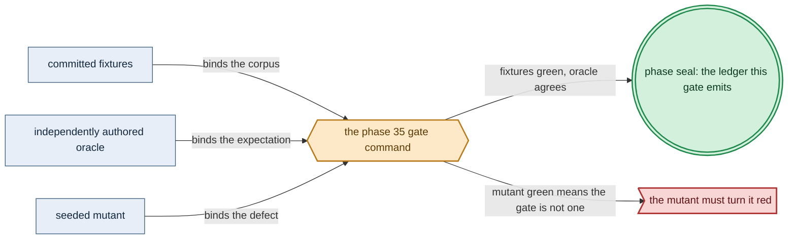
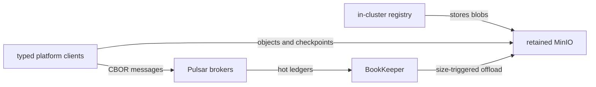

# Phase 35: Platform backbone (MetalLB + MinIO + Pulsar HA)

> **Purpose**: Stand up the platform backbone — MetalLB, MinIO, and Pulsar HA
> (brokers/ZooKeeper/BookKeeper/offload) — on a
> single-node linux-cpu cluster, each as its HA topology from Haskell-generated manifests and baked-binary
> images, rehoming the `distribution` registry's blob store onto the MinIO S3 driver and proving a
> size-triggered Pulsar offload bounds the hot tier.
> **Read this if**: phase 35 is next in the queue, or a later phase depends on what its gate establishes.

Phase 35 delivers the platform backbone (MetalLB + MinIO + Pulsar HA); its design is owned by [platform_services_doctrine.md](../documents/engineering/platform_services_doctrine.md), [pulsar_client_doctrine.md](../documents/engineering/pulsar_client_doctrine.md), [image_build_doctrine.md](../documents/engineering/image_build_doctrine.md), and the plan for reaching it is owned here.
Register 3, live, on the `linux-cpu` substrate.
The complete gate passed on 2026-08-10.

> **Historical result (invalidated).** Any pass, seal, validation, ledger, receipt, or implementation observation
> in the orientation text above is diagnostic only. The Phase Status section and [tracker](README.md) own current state; the
> target contract below remains normative.

Link-graph metadata

**Status**: Authoritative source
**Supersedes**: N/A
**Referenced by**: DEVELOPMENT_PLAN/README.md, DEVELOPMENT_PLAN/legacy_tracking_for_deletion.md, DEVELOPMENT_PLAN/overview.md, DEVELOPMENT_PLAN/phase_09_storage_geometry_folds.md, DEVELOPMENT_PLAN/phase_30_base_image_registry.md, DEVELOPMENT_PLAN/phase_33_retained_storage.md, DEVELOPMENT_PLAN/phase_34_vault_pki.md, DEVELOPMENT_PLAN/phase_36_platform_services_2.md, DEVELOPMENT_PLAN/phase_38_live_dsl_singleton.md, DEVELOPMENT_PLAN/phase_40_pulsar_client.md, DEVELOPMENT_PLAN/phase_53_determinism_jitcache.md, DEVELOPMENT_PLAN/system_components.md, documents/engineering/migration_doctrine.md
**Generated sections**: none

## Contents
- [Phase Status](#phase-status)
- [Phase Summary](#phase-summary)
- [Gate integrity](#gate-integrity)
- [Doctrine adopted](#doctrine-adopted)
- [Sprints](#sprints)
- [Sprint 35.1: MetalLB LoadBalancer + MinIO object substrate + registry S3-driver rehoming 🔄](#sprint-351-metallb-loadbalancer--minio-object-substrate--registry-s3-driver-rehoming-)
- [Sprint 35.2: Pulsar native-protocol backbone + size-triggered S3 offload drill ⏸️](#sprint-352-pulsar-native-protocol-backbone--size-triggered-s3-offload-drill-)
- [Sprint 35.3: The backbone HA bring-up gate ⏸️](#sprint-353-the-backbone-ha-bring-up-gate-)
- [Documentation Requirements](#documentation-requirements)
- [Related Documents](#related-documents)

---

## Phase Status

⏸️ Blocked pending Phase-34 revalidation — **reopened 2026-08-16 by the natural-architecture amendment.**
[§S](development_plan_gate_integrity.md#s-universal-artifact-hygiene-gate) clause 15 requires a run to record
the natural architecture it proved and to execute no artifact of another. This phase's last gate recorded no
architecture, so its seal is invalidated as a current result and stands only as history; the rerun differs from
it by naming the lane and architecture the run actually used. A sprint marker below records what that sprint achieved before the amendment; under
[§N](development_plan_phase_model.md#n-reopening-and-amending-a-phase) it is a diagnostic, not surviving closure.

**Pre-natural-architecture status record (invalidated where it claims completion):**

Blocked (superseded) — Phase 35's 2026-08-16 live validation proved that the Phase-30 image omitted Pulsar's separately published S3 offloader bundle. Phase 30 is reopened; Phases 31–34 must be revalidated in numerical order before this phase resumes. The registry executable correction and private-fixture containment hardening remain implemented.

**Superseded active record:** opened 2026-08-16 after the amended Phase-34 Vault/PKI gate sealed as
`sha256:4f029c9f8fe3fa35da3da2cd1a6b94cdc7f2d2a808a821540d290848d6130dcb`.
The current work audits and migrates the backbone gate in sprint order, dynamically consumes the verified
Phase-30 image handoff and exact Phase-34 predecessor, confines every generated/live byte to `.build/**` or
the marker-owned `.test_data/**` run, and reruns the full Register-3 contract before Phase 36 opens.

**Pre-containment status record (invalidated where it claims completion):**

Blocked (superseded) by the reopened numeric sequence. Reopened 2026-08-11: the prior seal did not include the universal artifact-hygiene
postcondition. This phase returns to numeric order only after Phase 0 closes, then must rerun its capability
gate against its source snapshot and publish repository-local evidence without changing an authored path.

**Observed artifact migration — 2026-08-11:** `test/fixtures/phase30/expected-base-digest.txt` duplicates the
Phase-30 image observation. It must be removed. Image identity remains a live provenance check against the
verified Phase-30 attestation and current in-cluster registry catalog, not a committed digest file.

**Invalidated historical record:**

Done (invalidated). The complete Register-3 gate passed on 2026-08-10 on a fresh single-node `kind` cluster. Live
evidence records an externally reachable stable MetalLB VIP, a four-drive distributed MinIO byte round-trip,
registry migration and cutover to the MinIO S3 driver, three ZooKeeper members, three BookKeeper bookies,
two Pulsar brokers, native-protocol CBOR/dedup exercise, and 19 observed offload objects while the hot tier
remained below its committed cap. All 53 SSA-owned live objects matched their desired fields byte-for-byte,
and the 11 execution-unit projections matched a freshly executed
`Amoebius.Platform.Backbone.renderBackbone` result. Every runtime image ID matched the Phase-30 baked digest,
zero public pull was observed, all six seeded mutants went red, and the honesty ledger is
`dynamically-resolved`.

## Phase Summary

This phase turns the storage-and-secrets-provisioned cluster of Phase 34 into an amoebius cluster carrying the
platform backbone: the L4 LoadBalancer (MetalLB), the MinIO S3 object substrate, and the Pulsar
native-protocol event/workflow backbone (brokers, ZooKeeper metadata members, BookKeeper bookies, and
size-triggered S3 offload). Each is rendered as
the byte-identical **HA topology even at `replicas=1`**, each emitted as typed Kubernetes objects by the
Phase-31 `renderAll` path (no Helm, no third-party charts, and the emitted manifests are generated from Haskell
and never committed), each served from binaries **baked into the native-architecture base image** with no
public-registry pull, and each on the Phase-33 `no-provisioner` retained PVs where it holds durable state.

Two deferred gaps from earlier phases close here. First, the **registry→MinIO S3-driver rehoming**: the
Phase-30 `distribution` registry ran against **interim node-local (filesystem-driver) blob storage** with the
MinIO S3 driver named as this phase's target; Phase 35 moves the registry's blob store onto MinIO via the S3
driver, so the registry holds no PV of its own and its bytes live in the object substrate. Second, the
**Pulsar size-triggered S3 offload**: a topic's hot tier (BookKeeper on retained PVs) is bounded by a size
high-water mark that offloads closed ledgers to MinIO, and this phase drills that the offload actually fires
under sustained ingest and that the hot tier never exceeds its cap.

The rehome is a verified migration, not a driver-only configuration edit, and it does not erase or replace the
registry's capacity proof. Phase 35 preserves the artifact/upload
operands from Phase 30's canonical `RegistryStorageDemand` — every digest-keyed compressed
layer/config/manifest extent, bounded model-derived concurrent-upload workspace, and finite failed-upload residue through
observed GC — while the replacement demand changes only its backend arm from the interim volume to MinIO. The resulting private
`ProvisionedRegistryStorageDemand` must carry the same logical `objectSet`, structured physical-object plus
upload/partial `objectStorePeak`, scalar interim `derivedPeak`, mutation-admission, and upload/orphan witness;
its backend projection is intentionally different. A private `ProvisionedRegistryBackendMigration` derives an
exact source-digest→target-object map, transfer/verification Job `PodResourceEnvelope`, workspace, and
source+target per-backing high-water. Only the structured target peak enters MinIO's per-object
erasure/healing geometry. Every pre-existing Phase-30 artifact is copied and independently digest-verified
before atomic driver cutover, then pulled by its old digest through the registry. Source filesystem residents
stay charged and readable until verification/cutover and remain charged with partial targets on failure; no
cleanup/reclamation is credited before it is observed. The target gets no speculative cross-backing dedup
credit.

The scope deliberately stops at *standing the backbone up HA and proving its data-plane round-trips, the
registry rehoming, and the offload bound*. The Percona-operator-managed per-consumer Patroni Postgres
clusters, pgAdmin, Prometheus/Grafana, and the **full derived readiness-DAG bring-up of the whole standard stack** are [Phase 36](phase_36_platform_services_2.md). The **Keycloak-owned ingress edge** — Envoy/Gateway
API terminating TLS and Keycloak owning all wild ingress so no workload publishes its own path — is
[Phase 37](phase_37_keycloak_ingress.md); this phase brings the backbone up behind no public edge. The
Deployment-`replicas=1` control-plane singleton that will eventually *own* this reconcile loop is
[Phase 38](phase_38_live_dsl_singleton.md); here the reconciler is driven from the operator/host path against a
fixed, hand-assembled service set so the backbone exists before the DSL and the singleton that will describe
it.

**Substrate:** linux-cpu ([§L](development_plan_standards.md#l-one-substrate-discipline)) — the whole gate runs on a single-node `kind` cluster on a linux-cpu host; no
specialized hardware feature is required. Every hardware substrate can always run this `linux-cpu` lane. If
the gate requires a pristine Linux host, use Incus on Linux or Linux-CUDA hardware, Lima on Apple hardware,
or WSL2 on Windows hardware.

**Lane:** linux-cpu/amd64 ([§L](development_plan_standards.md#l-one-substrate-discipline))

**Register:** 3 — live infrastructure ([§K](development_plan_standards.md#k-honesty-proven--tested--assumed)); this is not a pure/golden or fake-tool check but a real bring-up
on a real cluster, emitting a proven/tested/assumed ledger that names Register 3 and marks the runtime layer
*tested*, never *proven*.

**Gate:** on a single-node linux-cpu `kind` cluster the MetalLB/MinIO/Pulsar backbone, with the registry
rehomed onto MinIO, comes up HA from generated manifests and baked binaries, round-trips both data planes,
and holds the hot tier under its offload cap. Its apparatus is [Gate integrity](#gate-integrity).

*Design intent. Phase 35's gate apparatus; [§M](development_plan_standards.md#m-gate-integrity-a-gate-cannot-be-passed-by-a-stub) owns its clauses.*

*Orientation. Phase 35 converges one retained MinIO backing for registry/content/offload while Pulsar keeps its bounded hot path through BookKeeper, as owned by the [platform-services doctrine](../documents/engineering/platform_services_doctrine.md).*

**Gate integrity ([§M](development_plan_standards.md#m-gate-integrity-a-gate-cannot-be-passed-by-a-stub)).**
The gate is closed to a stub by seven cross-checks named in the Sprint 35.1–31.3 deliverables. Existing
same-commit fixtures are regression fixtures until Phase 0 and the owning sprint record independent review or
replacement; none inherits oracle status from the old manifest claim.

## Gate integrity

The apparatus phase 35's gate closes over, in the slot
[§D](development_plan_standards.md#d-the-per-phase-document-skeleton) reserves for it. Every clause it
discharges is owned by
[§M](development_plan_standards.md#m-gate-integrity-a-gate-cannot-be-passed-by-a-stub).

### Image-identity provenance (§M.5 OS-boundary observer)

"No public-registry pull" is not a self-emitted claim: every running container's `imageID` digest (`kubectl
get pods -A -o jsonpath={..imageID}` over the amoebius-rendered namespaces) MUST equal the Phase-30 baked
base-image digest resolved from the in-cluster `distribution` registry catalog; any digest not in that
catalog, or any `docker.io`/`quay.io`/other public-registry image reference, fails the gate. This
discriminates a genuine baked-binary bring-up from upstream images side-loaded onto the node (which `kind
load` and a deny-all egress test cannot tell apart — only image identity can). The pull-observation window
is the containerd/CRI image-pull event log on the kind node read from the OS boundary (not amoebius's own
logging), covering the whole gate window. The accepted digest is read from the verified Phase-30 attestation
and independently confirmed in the current in-cluster catalog; no expected-digest file is committed.

### Render byte-identity (§M.3 independent provenance)

At gate time the pure `renderAll` is re-run in-process and the SSA-applied object bytes under the `amoebius`
field manager (`kubectl get ... -o yaml`, managedFields filtered) MUST be byte-identical to that fresh
`renderAll` output — pinning applied manifests to the Phase-31 renderer, so hand-written or `helm
template`-derived YAML embedded as string constants fails.

### Exact resource-provision identity (§M.3 independent projection)

For every amoebius-owned app, init, and sidecar container, the applied CPU/memory/ephemeral-storage requests
and limits are byte-for-byte the projection of the opaque `ProvisionedServiceSpec`; every disk-backed
`emptyDir` has a `sizeLimit` covered by that ephemeral-storage ceiling (a kubelet measurement/eviction
boundary, not a synchronous quota); every cache owner also enforces its private admission bound, and every
PVC/PV presentation and rounded size equals its uniform durable claim plan and the retained aggregate
witness; and these linux-cpu services carry cache `None` and accelerator `None` with no device
extended-resource claim. The checker independently recomputes the effective pod reservation/ceiling from the
concurrent app/sidecar sum, ordinary sequential-init maxima, restartable init-sidecars accumulated according
to their lifecycle, and pod/runtime overhead, then matches the provisioned placement witness. Merely
declaring a subset of built-in resource fields does not pass.

### Physical-storage geometry and write-peak identity (§M.3 independent projection, §M.2 committed mutants)

An independent checker recomputes BookKeeper's per-bookie steady/re-replication maximum from its
ensemble/write/ack quorums and finite bookie-fault policy, and MinIO's per-drive steady/healing maximum from
logical object extents, stripe padding, data/parity shards, replacement drives, and finite drive-fault
policy. It also reconstructs the closed six-arm app/content/registry/Pulsar-offload/Pulumi-checkpoint/
control-plane-state source type, covers every arm in the capacity corpus, and requires the present source set
to equal the producer set with exactly one resolved `StorageBudgetId`/owner and writer
admission each, unions exact store/tenant/bucket/full-key resident identities, and retains all structural
future/concurrent/deletion-lag/failed-orphan extents. The fault
scenarios are the complete subsets derived from the policies, never caller-selected lists. The checked
usable maps must equal the opaque geometry witnesses; then the checker applies each slot's
`VolumePresentation` and backing allocation policy, groups compatible claim slots by StatefulSet template,
recomputes `provisionedBytes = max rounded ordinal allocation`, and proves every rendered PVC/PV equals that
uniform raw size, exposes at least the maximum required usable bytes, and debits
`provisionedBytes × ordinalCount`. A fitting logical total, pre-presentation/unequal raw-map sum, or
cluster-wide disk average does not pass. The committed mutants
**`mutant/storage-logical-as-physical`**, **`mutant/storage-drop-required-fault-scenario`**,
**`mutant/storage-sum-unequal-ordinals`**, and **`mutant/content-store-immediate-gc`** MUST each turn the
boundary corpus red.

### HA predicate (disambiguation)

"Its HA topology even at `replicas=1`" means the rendered manifest is
**byte-identical modulo the replica-count field(s)** to the same service rendered at `replicas=n` (MinIO in
distributed erasure-set mode, Pulsar multi-broker/multi-ZooKeeper/multi-bookie) — asserted by a render-diff whose only
tolerated difference is the replica count — NOT a standalone/single-drive or single-broker variant that
merely avoids a bare Pod.

### Registry rehoming (§M.3 independent oracle, §M.5 external observer, §M.2 committed mutant)

The registry's storage backend is asserted to be the MinIO S3 driver against the committed independent
oracle `test/fixtures/phase30/registry-storage-driver.golden` (the expected `distribution` storage stanza —
S3 driver, MinIO endpoint, bucket — authored by hand, not read from the running config), and the rehoming is
observed externally: every digest in a Phase-30 preexisting artifact is copied to its exact target object,
independently verified, and remains pullable by the same digest after cutover; a newly pushed blob
materializes only in the MinIO bucket. The source path remains charged/readable through verification and is
reclaimed only after observed successful cleanup. The committed seeded mutant
**`mutant/registry-fs-driver`** — the `distribution` config left on the interim node-local filesystem driver
— MUST turn this assertion red (the pushed blob never appears in MinIO). The checker also requires every
artifact/upload operand in `RegistryStorageDemand` and the private `objectSet`, `derivedPeak`, and
upload/orphan witness to match Phase 30. It also independently derives the private
`ProvisionedRegistryBackendMigration` source→target map, transfer/verify Job, workspace, and old+new
per-backing high-water; only after verification does the active backend arm change from the interim volume
to MinIO. It may not replace the digest map with a tag count or total. Resident/new digest overlap debits
once within the target, a same-digest size conflict rejects, model-derived upload workspace and pre-GC
partial residue overlap the stored union, and a target backing one byte under the resulting physical
witness, a one-unit-short transfer executor, or an injected digest verification failure rejects before
cutover. The failure keeps the source route and all old/partial-new commitments.

### Pulsar offload bound (§M.5 external observer, §M.2 committed mutant, §M.7 concrete drill)

The size-triggered offload is exercised, not merely configured: a named drill topic carries the hot-tier
size cap committed in `test/fixtures/phase30/hot-tier-cap.golden`; sustained ingest past that cap MUST cause
offloaded ledger objects to appear in MinIO (external observer on the object substrate) while
BookKeeper/broker hot-tier occupancy (external observer on broker metrics, not an amoebius self-report)
never exceeds the cap. The committed seeded mutant **`mutant/offload-time-only`** — a time-only offload
policy with the size trigger removed — MUST turn this drill red (hot-tier occupancy exceeds the cap under
the same ingest), since a time-only trigger cannot bound occupancy.

**Representative service set (§M.7).** The gate's "platform backbone" is exactly: MetalLB, MinIO (distributed),
and Pulsar (broker + ZooKeeper metadata member + BookKeeper bookie + size-triggered offload) — no more, no
fewer. The registry (`distribution`, from
Phase 30) is present as a rehoming consumer of MinIO, not re-delivered here.

## Doctrine adopted

- [`platform_services_doctrine.md §1 — the invariant: every cluster is the same cluster`](../documents/engineering/platform_services_doctrine.md#1-the-invariant-every-cluster-is-the-same-cluster)
  with [`§2 — HA always, including replicas=1`](../documents/engineering/platform_services_doctrine.md#2-ha-always--including-replicas1):
  Phase 35 materializes the backbone slice of the fixed standard service set on linux-cpu, each service the
  byte-identical HA topology a production cluster runs with only the replica count changed — no "dev topology,"
  no hand-special-cased single-Pod variant.
- [`platform_services_doctrine.md §4 — MinIO, the object substrate`](../documents/engineering/platform_services_doctrine.md#4-minio--the-object-substrate),
  [`§6 — Pulsar, the event and workflow backbone (new vs prodbox)`](../documents/engineering/platform_services_doctrine.md#6-pulsar--the-event-and-workflow-backbone-new-vs-prodbox),
  and [`§9 — the LoadBalancer and the single wild-ingress path`](../documents/engineering/platform_services_doctrine.md#9-the-loadbalancer-and-the-single-wild-ingress-path)
  (the MetalLB LoadBalancer half — the Keycloak edge is Phase 37): the concrete providers Phase 35 stands up
  behind the platform backbone.
- [`pulsar_client_doctrine.md §6.1 — topic storage lifecycle: bounded, tiered, retained, and the hot tier never overflows`](../documents/engineering/pulsar_client_doctrine.md#61-topic-storage-lifecycle-bounded-tiered-retained--and-the-hot-tier-never-overflows):
  the mandatory *size-triggered* S3 offload high-water mark on the BookKeeper hot tier — the load-bearing
  difference from a time-only trigger — is the invariant the offload drill exercises against the live cluster.
- [`image_build_doctrine.md §2 — the single distribution rule: bake the binaries, build the amoebius image, pull only in-cluster`](../documents/engineering/image_build_doctrine.md#2-the-single-distribution-rule-bake-the-binaries-build-the-amoebius-image-pull-only-in-cluster)
  and [`§9 — bring-up ordering: the registry chicken-and-egg dissolves`](../documents/engineering/image_build_doctrine.md#9-bring-up-ordering--the-registry-chicken-and-egg-dissolves):
  every backbone binary is baked into the Phase-30 native-architecture base image and resolved only in-cluster; the
  registry stores its blobs in MinIO via the S3 driver, so MinIO must be serving before the registry — the
  thin ordering edge [§9](../documents/engineering/image_build_doctrine.md#9-bring-up-ordering--the-registry-chicken-and-egg-dissolves) names, and the rehoming Phase 35 delivers.
- [`manifest_generation_doctrine.md §5 — the apply/reconcile engine: snapshot-bound typed actions`](../documents/engineering/manifest_generation_doctrine.md#5-the-applyreconcile-engine-snapshot-bound-typed-actions)
  and [`§2 — the typed manifest model (`renderAll` is the sole public pure function to objects)`](../documents/engineering/manifest_generation_doctrine.md#2-the-typed-manifest-model-renderall-is-the-sole-public-pure-function-to-objects):
  Phase 35 reuses the Phase-31 pure `renderAll :: ProvisionedSpec -> [K8sObject]` and typed-action reconciler whose **wait-for-ready is observed from the live object, never a `threadDelay`** to apply and sequence the backbone. - [`platform_services_doctrine.md §10 — every execution unit declares its complete resource envelope`](../documents/engineering/platform_services_doctrine.md#10-every-execution-unit-declares-its-complete-resource-envelope)
  and [`resource_capacity_types.md §3.1 — the systematic provision matrix`](../documents/engineering/resource_capacity_types.md#31-the-systematic-provision-matrix) / [`§5.1 — durable demand is logical first, physical only after geometry`](../documents/engineering/resource_capacity_storage.md#51-durable-demand-is-logical-first-physical-only-after-geometry):
  every rendered app/init/sidecar container carries the exact provisioned CPU, memory, and ephemeral-storage
  requests/limits; bounded pod-local volumes and durable presentation/usable/raw sizes are exact; and accelerator `None` is
  explicit alongside cache `None` for this linux-cpu service set. Kubernetes fields are a projection of the
  checked pure value, not a second resource declaration. Durable sizes are the output of complete
  BookKeeper quorum/recovery, ZooKeeper metadata log/snapshot/recovery, and MinIO erasure/healing physical
  folds, while MinIO's logical input includes every exact physical resident map plus structural
  future/concurrent/orphan extents from the six closed producer arms; logical bytes are never copied
  straight into raw PVC capacities. Each slot first applies filesystem overhead and backing quantum; unequal
  ordinal requirements are then projected through the actual StatefulSet constraint: one uniform
  `provisionedBytes` per `volumeClaimTemplate`, debited as max rounded ordinal allocation times ordinal count.
  The rehomed registry contributes a MinIO-bound `ProvisionedRegistryStorageDemand` whose
  logical `objectSet`, structured `objectStorePeak`, scalar interim `derivedPeak`, admission, and upload/orphan
  witness are unchanged from Phase 30 — including compressed objects,
  configs/manifests, model-derived concurrent-upload workspace, and retained failed-upload extents — before that physical
  fold; it is not recounted from tags or a scalar blob allowance. The rehome additionally provisions the
  digest-complete old→new copy/verify transition and its Job/workspace before cutover.
- [`storage_lifecycle_doctrine.md §2 — one storage class, and it provisions nothing`](../documents/engineering/storage_lifecycle_doctrine.md#2-one-storage-class-and-it-provisions-nothing)
  and [`§4 — deterministic PV naming and the explicit bind`](../documents/engineering/storage_lifecycle_doctrine.md#4-deterministic-pv-naming-and-the-explicit-bind):
  each stateful backbone service (MinIO, Pulsar's ZooKeeper members and bookies) lands its durable bytes on the Phase-33
  `no-provisioner` retained PVs, born only from a StatefulSet `volumeClaimTemplate`.
- [`testing_doctrine.md §2 — the registers of amoebius testing`](../documents/engineering/testing_doctrine.md#2-the-registers-of-amoebius-testing):
  this phase's gate is a Register-3 live bring-up on linux-cpu, emitting the honesty ledger that
  names Register 3, marks the runtime layer *tested* (not a proof claim), and marks the not-yet-built
  Keycloak-edge and singleton-owned reconcile layers UNVERIFIED.

## Sprints

> **Current revalidation rule.** Sprint 35.1 is active; later sprints remain blocked by their preceding sprint. Historical dates,
> pass/seal claims, repository-resident evidence paths, and `Remaining Work: None` statements below describe
> the pre-amendment capability record only; they do not override current status. Functional and validation
> outcomes remain target requirements. Any instruction to commit generated output, freeze dependency resolution,
> retain a resolved version, path, or integrity hash, or consume repository-resident evidence, ledgers, or
> enumerations is superseded by the current generated-artifact and dynamic-resolution doctrine. Closure requires
> the current phase gate plus universal artifact hygiene.

## Sprint 35.1: MetalLB LoadBalancer + MinIO object substrate + registry S3-driver rehoming 🔄

**Status**: Active; prior capability footprint retained for migration and current validation
**Implementation**: `src/Amoebius/Platform/LoadBalancer.hs`,
`src/Amoebius/Platform/Minio.hs`, `src/Amoebius/Platform/Registry.hs`,
`tools/phase30_backbone_live.py`
**Blocked by**: Phase 34 gate.
**Independent Validation**: the numbered Validation list below, which needs nothing from Sprints 31.2–31.3:
MetalLB advertising an address, a MinIO put/get through the gateway, the registry serving from the S3 driver
with every Phase-30 digest copied and still pullable, the independent MinIO capacity corpus, and the exact
resource projection of every rendered execution unit.
**Docs to update**: `documents/engineering/platform_services_doctrine.md`,
`documents/engineering/resource_capacity_doctrine.md`,
`documents/engineering/storage_lifecycle_doctrine.md`, `documents/engineering/image_build_doctrine.md`

### Objective
Adopt [`platform_services_doctrine.md §9 — the LoadBalancer`](../documents/engineering/platform_services_doctrine.md#9-the-loadbalancer-and-the-single-wild-ingress-path)
(the MetalLB half), [`§4 — MinIO, the object substrate`](../documents/engineering/platform_services_doctrine.md#4-minio--the-object-substrate),
and [`image_build_doctrine.md §9 — bring-up ordering`](../documents/engineering/image_build_doctrine.md#9-bring-up-ordering--the-registry-chicken-and-egg-dissolves):
render and reconcile MetalLB as the linux-cpu L4 entry point and MinIO as the HA S3 object substrate, then
rehome the Phase-30 `distribution` registry's blob store off the interim node-local filesystem driver onto the
MinIO S3 driver — closing the Phase-30 deferred gap.

### Deliverables
- MetalLB rendered as a standard service that publishes a LoadBalancer address on the kind node, available
  before the (Phase 37) Envoy/Gateway edge needs one — the backbone's LoadBalancer root.
- MinIO (HA / distributed) as the S3 object substrate on Phase-33 retained PVs, holding the content store,
  the Pulumi backend, and app buckets (roles owned by their sibling doctrines; this phase only stands the
  service up); a put/get round-trips.
- A closed MinIO storage provision: logical object extents for every resident tenant; a
  six-arm `ObjectStoreProducerDemand` inventory whose every present producer carries a resolved
  `StorageBudgetId`, exact physical identities, an `ObjectStoreWriteBudget` with bounded concurrent write sets,
  bounded failed writes and a finite positive orphan-GC horizon, plus mutation admission; data/parity/block
  geometry; per-drive metadata and healing workspace; a finite fault
  policy whose complete drive-failure subsets are derived by the solver; claim/backing/`VolumePresentation`
  per drive; and the uniform `volumeClaimTemplate` plan
  (`max rounded provisionedBytes × ordinal count`) that debits the retained backing.
- The `distribution` registry's blob store rehomed onto the MinIO S3 driver — the registry holds no PV of its
  own, its bytes live in MinIO — asserted against the committed `test/fixtures/phase30/registry-storage-driver.golden`
  storage-stanza oracle, with the committed `mutant/registry-fs-driver` seeded mutant (registry left on the
  interim filesystem driver) named as the mutant this rehoming assertion MUST turn red. The logical tenant
  extent supplied to MinIO is a private `ProvisionedRegistryStorageDemand` whose logical
  `objectSet`, structured `objectStorePeak`, scalar interim `derivedPeak`, mutation admission, and upload/orphan
  witness exactly match Phase 30's interim provision and whose
  backend arm is MinIO. It is
  derived from canonical `RegistryStoredArtifact`/`RegistryStorageDemand`; the rehome cannot author a
  replacement byte total, omit configs/manifests or failed-upload residue, or claim deletion before the
  observer sees it.
- A `RegistryBackendMigrationDemand` from the still-live Phase-30 private provision to the MinIO replacement.
  Its private result retains the complete digest→target-object map, source and target provisions, copy/verify
  Job envelope, workspace, and per-backing high-water. Cutover occurs only after every pre-existing artifact
  digest verifies and can be pulled through the target; a failed copy keeps the source route and all partial
  target bytes. The old filesystem receives no new writes after cutover but remains charged until cleanup is
  observed.
- The sole object-write gateway's complete image/CPU/memory/ephemeral/log/writable/replica/rollout envelope,
  derived from the merged writer admission policies and placed before MinIO or any producer can mutate.
- Exact complete provision on every rendered app/init/sidecar container and volume: CPU, memory, and
  ephemeral-storage requests/limits; bounded pod-local `emptyDir` volumes; durable PVC/PV
  presentation/rounded sizes equal to the
  checked **uniform claim plan** (which may conservatively pad a smaller ordinal above its raw drive demand);
  cache `None`; and accelerator `None` with no device claim on linux-cpu. Images resolve only in-cluster.

### Validation
1. Apply through the Phase-31 reconciler; assert MetalLB advertises an address and MinIO reaches its Ready
   condition as a distributed StatefulSet on identity-named retained PVs.
2. Round-trip an admitted object-gateway put/get; assert the bytes are unchanged, and assert the same writer
   cannot issue a direct MinIO PUT.
3. Assert the registry is serving from the MinIO S3 driver: its storage config is byte-equal to the committed
   `registry-storage-driver.golden` oracle (authored by hand, not read from the running config), every object of
   a pre-existing Phase-30 artifact was copied/verified and that artifact still pulls by the same digest, and a
   new blob pushed after cutover materializes in MinIO without changing the old filesystem. The committed
   `mutant/registry-fs-driver` mutant turns this red.
   Compare the Phase-30 and Phase-35 private registry witnesses: `objectSet`, structured `objectStorePeak`,
   scalar interim `derivedPeak`, admission, and the upload/orphan witness must match in the replacement while
   its backend differs; then independently validate the additional migration witness and derive the MinIO
   physical demand from that logical tenant. Independently compare the exact source→target object map and
   source+target+workspace high-water, and assert the live transfer Job equals its complete provisioned
   envelope. Exercise resident/new digest dedup, conflicting stored
   bytes for one digest, maximum upload concurrency/model-derived workspace, partial-upload residue just before GC, and a
   retained target one byte under the physical result, old+new backing one byte short, transfer executor one
   unit short, and an injected verify mismatch. Capacity failures yield zero writes — no reconcile request and
   no publish request is issued; verify failure leaves the source route live and both source/partial-target
   charged; exact fit verifies then cuts over.
4. Run the independent MinIO capacity corpus.
   - Cover all six closed arms and require source↔producer equality for the present deployment; reject a
     dropped arm (including control-plane state), writer admission, storage budget, or mismatched owner.
   - For the same logical byte total, vary full physical object identities/counts and prove per-object
     stripe padding changes demand; the same digest under two namespaces remains two objects, while one
     identical full id deduplicates and conflicting sizes reject.
   - Vary data/parity geometry, stripe boundary, healing fault bound, concurrent-write bound, failed-write
     rate, and orphan-GC horizon; recompute every required unavailable-drive subset, the required cross-set
     Cartesian products, and each per-drive steady/healing peak independently.
   - Include exact-fit and one-byte-over usable cases, a one-quantum-under raw allocation, a
     logical-fit/erasure-physical-overflow case, an existing orphan just before its horizon, Pulsar
     segment-rate×deletion-lag and failed-offload horizon boundaries, Pulumi exact-state-field/encryption
     old+new-revision and failed-checkpoint horizon boundaries, control-plane-state old/new CAS plus
     failed-write horizon boundaries, and a deliberately skewed per-ordinal map where the pre-presentation
     sum fits but `max(provisionedBytes) × ordinalCount` does not.
   - Direct S3 writes are denied while each in-envelope writer capability succeeds through the gateway.
   - Also make producer storage fit while the gateway pod is one CPU, memory, ephemeral byte, or pod slot
     short; it must reject before any S3 write.
   - Require zero storage/API writes for every rejection and require `mutant/storage-logical-as-physical`,
     `mutant/storage-drop-required-fault-scenario`, `mutant/storage-sum-unequal-ordinals`, and
     `mutant/content-store-immediate-gc` each to turn red.
5. Assert every app/init/sidecar container and volume in the `renderAll`-emitted MetalLB/MinIO/registry objects
   (scope = `amoebius` field-manager-owned objects only) is an **exact** projection of its
   `ProvisionedServiceSpec`: CPU/memory/ephemeral-storage requests+limits, each disk-backed
   `emptyDir.sizeLimit`, each PVC/PV's uniform presentation/rounded capacity and usable witness, cache `None`,
   and accelerator `None`/absence of a device claim.
   Recompute the effective pod request/limit using app sums, largest-init semantics, and pod overhead, and
   require equality with the stored placement witness. Then assert
   the containerd/CRI image-pull event log on the kind node (§M.5 OS-boundary observer, not amoebius's own
   logging) records no public-registry pull and every running `imageID` digest resolves to the Phase-30 baked
   base digest in the in-cluster `distribution` catalog. A deny-all egress test to `docker.io`/`quay.io` must
   break no startup, which shows the cluster does not reach outward — the digest check, not the egress test,
   is what discriminates a baked bring-up from a side-loaded upstream image.

### Remaining Work
None.

## Sprint 35.2: Pulsar native-protocol backbone + size-triggered S3 offload drill ⏸️

**Status**: Blocked by Sprint 35.1; prior capability footprint retained for migration
**Implementation**: `src/Amoebius/Platform/Pulsar.hs`, `tools/phase30_backbone_live.py`
**Blocked by**: Sprint 35.1.
**Independent Validation**: the numbered Validation list below, which needs only the Sprint-30.1 MinIO
substrate: an HA native-protocol bring-up that fails closed against a sealed Vault, a dedup round-trip
exercised rather than configured, the size-triggered offload drill, the independent BookKeeper and ZooKeeper
capacity corpora, and the exact resource projection of every rendered execution unit.
**Docs to update**:
`documents/engineering/platform_services_doctrine.md`, `documents/engineering/pulsar_client_doctrine.md`

### Objective
Adopt [`platform_services_doctrine.md §6 — Pulsar, the event and workflow backbone (new vs prodbox)`](../documents/engineering/platform_services_doctrine.md#6-pulsar--the-event-and-workflow-backbone-new-vs-prodbox)
and [`pulsar_client_doctrine.md §6.1 — topic storage lifecycle`](../documents/engineering/pulsar_client_doctrine.md#61-topic-storage-lifecycle-bounded-tiered-retained--and-the-hot-tier-never-overflows):
render and reconcile Pulsar as the cluster's HA native-protocol pub/sub backbone with ZooKeeper metadata and
BookKeeper ledger storage on retained claims, delegating its intra-cluster consensus to those components
rather than re-proving it, and
drill that the mandatory size-triggered MinIO offload actually bounds the BookKeeper hot tier.

### Deliverables
- Pulsar (HA broker + ZooKeeper metadata ensemble + BookKeeper bookie) rendered as typed objects on retained
  PVs, images baked, every app/init/sidecar
  and volume carrying its exact provisioned CPU/memory/ephemeral-storage, bounded pod-local storage, durable
  uniform-claim size, cache-`None`, and accelerator-`None` projection; the native TCP binary protocol only (the
  no-WebSockets invariant), with the client-side
  `amoebius-pulsar` protocol details owned by the Pulsar client doctrine and referenced, not re-specified.
- A closed BookKeeper storage provision: explicit ensemble/write/ack quorum geometry and segment size;
  per-bookie journal/index reserve; a finite bookie fault policy from which the solver derives every required
  failure/re-replication subset; the per-bookie steady/recovery maximum; and the final uniform StatefulSet
  claim-template plan whose max ordinal size times bookie count, not logical hot bytes or the unequal raw sum,
  is debited from retained storage.
- A closed `PulsarMetadataStoreDemand = ZooKeeper` provision: exact persistent/session-ephemeral znode
  identities and maximum payloads, bounded transactions/sessions/watches, complete member pod envelopes,
  retained transaction-log/snapshot volumes, and a finite unavailable-member bound. The pinned model derives
  each member's steady/recovery high-water and uniform rounded claim plan; brokers cannot start until every
  member resource/volume fits and the ensemble is Ready. BookKeeper/offload bytes cannot fund this provision.
- Bounded per-topic retention with a **size-triggered MinIO offload** (no unbounded storage, no time-only
  trigger), wired to the Sprint-30.1 MinIO substrate; the drill topic's hot-tier size cap committed in
  `test/fixtures/phase30/hot-tier-cap.golden`, with the committed `mutant/offload-time-only` seeded mutant
  named as the mutant the offload drill MUST turn red.
- A produce/consume round-trip demonstrating at-least-once delivery with broker-side dedup.

### Validation
1. Apply Pulsar through the reconciler; assert the ZooKeeper metadata ensemble reaches Ready first and the
   broker/bookie set then reaches Ready on retained storage as an HA topology (never a single bare broker).
   Assert a secret-dependent Pulsar component that reaches a sealed Vault fails closed rather than starting
   degraded.
2. Produce then consume a message; assert an at-least-once round-trip. Dedup is **exercised**: inject a
   duplicate (a redelivery of the same producer-sequence id) and assert the consumer observes exactly one
   delivery — not merely that broker-side dedup is enabled on the topic. Assert a CBOR payload round-trips
   byte-for-byte (full native-client proof deferred to Phase 40, marked UNVERIFIED here).
3. Drill the size-triggered offload: produce past the committed `hot-tier-cap.golden` size high-water mark on
   the drill topic and assert (a) offloaded ledger objects appear in the MinIO bucket (external observer on the
   object substrate) and (b) BookKeeper/broker hot-tier occupancy — read from broker metrics at the OS boundary,
   never an amoebius self-report — never exceeds the cap. Assert the committed `mutant/offload-time-only` mutant
   (size trigger removed) breaches the cap under the same ingest, since a time-only trigger cannot bound
   occupancy.
4. Run the independent BookKeeper capacity corpus across unequal quorum choices, segment-boundary rounding,
   journal/index reserve, and each complete failure-subset family derived from the declared fault bound.
   Include exact-fit and one-byte-over per-bookie cases, a logical-hot-total fit whose write-quorum physical
   demand fails, a recovery-only overflow, a filesystem-overhead/one-quantum overflow, and a skewed ordinal
   placement whose unequal pre-presentation sum fits but the uniform
   `max(provisionedBytes) × ordinalCount` plan fails. Every rejection performs zero storage/API writes;
   `mutant/storage-logical-as-physical`, `mutant/storage-drop-required-fault-scenario`, and
   `mutant/storage-sum-unequal-ordinals` each turns red.
   Run the independent ZooKeeper corpus across znode payloads, transaction/session/watch bounds, retained
   logs/snapshots, and every failure-recovery case. A topology where brokers, bookies, and offload all fit but
   one ZooKeeper member CPU/memory/ephemeral/PVC/backing is one unit/byte short must reject before any Pulsar
   object is applied. Mutants dropping the metadata store, a znode class, or recovery overlap go red.
5. Assert every app/init/sidecar container and volume is an exact projection of its
   `ProvisionedServiceSpec` across CPU, memory, ephemeral storage, durable presentation/usable/raw storage,
   cache `None`, and accelerator `None`; every BookKeeper PVC/PV capacity equals the recomputed uniform rounded
   plan and each mounted fsType/usable capacity matches its witness, not an ordinal-specific raw demand.

### Remaining Work
None.

## Sprint 35.3: The backbone HA bring-up gate ⏸️

**Status**: Blocked by Sprint 35.2; prior capability footprint retained for migration
**Implementation**: `src/Amoebius/Platform/Backbone.hs`, `test/platform/BackboneSpec.hs`,
`test/platform/BackboneLive.hs`, `tools/phase30_gate.py`
**Blocked by**: Sprint 35.2.
**Independent Validation**: the numbered Validation list below, run on a fresh single-node linux-cpu `kind`
cluster: the whole set up, HA-shaped, and reachable in-cluster; both data planes round-tripping; the registry
on the S3 driver; the offload holding the hot tier; no image request leaving for a public registry; and a
Register-3 proven/tested/assumed ledger emitted.
**Docs to update**:
`documents/engineering/platform_services_doctrine.md`, `documents/engineering/image_build_doctrine.md`,
`DEVELOPMENT_PLAN/README.md`

### Objective
Adopt [`manifest_generation_doctrine.md §5 — the apply/reconcile engine`](../documents/engineering/manifest_generation_doctrine.md#5-the-applyreconcile-engine-snapshot-bound-typed-actions)
and [`image_build_doctrine.md §9 — bring-up ordering`](../documents/engineering/image_build_doctrine.md#9-bring-up-ordering--the-registry-chicken-and-egg-dissolves):
assemble the Sprint 35.1–27.2 backbone services, bring them up event-driven behind the reconciler's
wait-for-ready with the MinIO-before-registry and Vault-unsealed-before-Pulsar edges as observed conditions,
and close the phase with the backbone HA gate on a fresh cluster.

### Deliverables
- A backbone bring-up that applies MetalLB, MinIO, the rehomed `distribution` registry, and Pulsar through the
  Phase-31 reconciler, each dependent starting on its dependency's observed-ready edge (MinIO serving before
  the registry's S3-driver blob store; Vault initialized-and-unsealed before Pulsar's secret-dependent startup —
  the fail-closed condition of [`vault_pki_doctrine.md §4`](../documents/engineering/vault_pki_doctrine.md#4-init-follows-readiness-fail-closed-vault-init)),
  never a `threadDelay`.
- The phase-gate harness: bring the whole backbone up on a fresh single-node linux-cpu `kind` cluster and
  assert the set is up, HA-shaped, from generated (never-committed) manifests and baked binaries, with a
  proven/tested/assumed Register-3 ledger that marks the runtime layer *tested* and the Keycloak-edge,
  Postgres/observability (Phase 36), and singleton-owned reconcile layers UNVERIFIED; the independent
  resource-projection checker compares every applied execution unit/volume exactly to its
  `ProvisionedServiceSpec`. Only the two thin MinIO→registry and Vault-unsealed→Pulsar edges are enacted here;
  the *full* derived readiness-DAG bring-up of the whole standard stack, with the
  [§11](../documents/engineering/platform_services_doctrine.md#11-bring-up-and-dependency-ordering) hard edges
  and the `mutant/dag-drop-edge` mutant, is [Phase 36](phase_36_platform_services_2.md)'s.
- The reviewed gate oracles reused here: the registry storage-stanza oracle
  `test/fixtures/phase30/registry-storage-driver.golden` and the drill-topic hot-tier cap
  `test/fixtures/phase30/hot-tier-cap.golden`, plus the independently computed
  `test/fixtures/phase30/storage-geometry-boundaries.csv` covering BookKeeper/MinIO exact-fit, one-byte-over,
  recovery/healing, orphan horizon, and uniform-ordinal rounding. The gate also reuses
  `test/fixtures/phase25/registry_storage_demand.dhall` unchanged and pins the expected mapping from its private
  registry logical witness into the MinIO physical geometry. The committed seeded mutants
  `mutant/registry-fs-driver`, `mutant/offload-time-only`, `mutant/storage-logical-as-physical`,
  `mutant/storage-drop-required-fault-scenario`, `mutant/storage-sum-unequal-ordinals`, and
  `mutant/content-store-immediate-gc` are committed and re-run, not run once.

### Validation
1. Bring the backbone up on a fresh cluster; assert MetalLB advertises an address, MinIO and Pulsar reach
   Ready as HA topologies, and the registry serves from the MinIO S3 driver — each dependent observed to start
   only on its dependency's observed-ready condition, with no timer standing in for a condition.
2. Round-trip MinIO put/get and Pulsar produce/consume against the assembled backbone; assert the registry
   rehoming holds (a pushed blob is a MinIO object) and the size-triggered offload holds the hot tier under the
   committed cap; assert the committed mutants `mutant/registry-fs-driver` and `mutant/offload-time-only` each
   turn their assertion red.
3. Recompute `storage-geometry-boundaries.csv` with the independent checker and compare it with the opaque
   storage provision. Assert every BookKeeper recovery and MinIO healing subset required by its finite fault
   policy is present; every logical extent has its replication/erasure/metadata/workspace amplification; the
   content peak includes concurrent and full-horizon failed writes; the registry tenant's private
   replacement `objectSet`, `derivedPeak`, and upload/orphan witness exactly match Phase 30 while its backend
   is MinIO, and the separate source→target migration witness is complete, including
   manifest/config extents, bounded model-derived upload workspace, and pre-GC partial residue; and each
   StatefulSet template's PVC/PV presentation/rounded size and retained-backing debit equal
   `max(provisionedBytes) × ordinalCount`. Re-run all four storage mutants named in the
   deliverable and require each to turn red before any apply path receives a token.
4. Assert the whole backbone is up and HA-shaped from generated manifests + baked-binary images. "HA-shaped"
   is the render-diff predicate: each service's applied manifest is byte-identical **modulo the replica-count field(s)** to the same service rendered at `replicas=n` (MinIO erasure-set, Pulsar
   multi-broker/ZooKeeper/bookie), not
   a standalone/single-broker variant. **Manifest provenance (§M.3):** re-run the pure `renderAll` in-process at
   gate time and assert the SSA-applied object bytes under the `amoebius` field manager are byte-identical to
   that output, foreclosing hand-written or `helm template`-derived YAML embedded as string constants. **Image provenance (§M.5):** "no public-registry pull recorded" is read from the containerd/CRI image-pull event log
   on the kind node (the OS-boundary observer, never amoebius's own logging) over the whole gate window,
   **and** every running container's `imageID` digest (`kubectl get pods -A -o jsonpath={..imageID}`) MUST
   equal the digest in the verified Phase-30 attestation and current in-cluster `distribution` catalog — any
   other digest or public-registry reference (including
   an upstream image pre-side-loaded onto the node with `kind load`) fails. **Resource-provision identity:**
   independently compare every applied app/init/sidecar CPU/memory/ephemeral-storage request+limit, bounded
   `emptyDir`, uniform-template PVC/PV capacity, cache-`None`, and accelerator-`None` projection to the opaque
   `ProvisionedServiceSpec`; recompute each effective pod envelope including ordinary and restartable-init
   sidecar semantics plus overhead; and
   require exact equality, not field presence. Emit the Register-3 ledger, runtime
   layer *tested* not *proven*, with the Keycloak edge, Phase-36 Postgres/observability, and singleton-owned
   reconcile marked UNVERIFIED.

### Remaining Work
Remove `test/fixtures/phase30/expected-base-digest.txt`, pass the verified Phase-30 digest into the run without
copying it into Git, and rerun the gate under universal artifact hygiene.

## Documentation Requirements

**Engineering docs updated with the completed gate:**
- `documents/engineering/platform_services_doctrine.md` — when this phase lands, its §2 HA-always and §4 MinIO
  notes flip from "design intent" to a Register-3-tested amoebius result on linux-cpu, and the §6 Pulsar
  honesty note gains its first live evidence (still *tested*, never *proven*).
- `documents/engineering/image_build_doctrine.md` — the §9 "registry stores its blobs in MinIO via the S3
  driver" edge is delivered; the Phase-30 interim filesystem-driver residue is discharged, recorded as the
  Phase-35 rehoming.
- `documents/engineering/pulsar_client_doctrine.md` — the §6.1 size-triggered offload bound gains its first
  live drill (the platform-side bring-up); the native-client CBOR round-trip proof stays owned by Phase 39.
- `documents/engineering/resource_capacity_doctrine.md` — record the standard-backbone live assertion that
  every Kubernetes resource/volume field is the exact projection of its checked `ProvisionedServiceSpec`,
  including the logical→physical BookKeeper/MinIO folds and uniform StatefulSet claim-plan debit.
- `documents/engineering/storage_lifecycle_doctrine.md` — the §2 no-provisioner storage class and §4
  deterministic PV naming and explicit bind gain their first Register-3-tested evidence as MinIO and Pulsar's
  ZooKeeper/BookKeeper members land their durable bytes on identity-named retained PVs born from StatefulSet
  `volumeClaimTemplate`s.

**Cross-references to add:**
- `DEVELOPMENT_PLAN/README.md` — flip the Phase-35 status when the gate passes and link this document.
- `DEVELOPMENT_PLAN/substrates.md` — record Phase 35's gate substrate (linux-cpu) in the per-phase substrate map.
- `DEVELOPMENT_PLAN/system_components.md` — reconcile the `src/Amoebius/Platform/*` target module paths named
  in each sprint against the component inventory once they become concrete.

## Related Documents
- [README.md](README.md) — the live tracker and phase ordering this document sits under
- [development_plan_standards.md](development_plan_standards.md) — the rulebook this document obeys
- [overview.md](overview.md) — the target architecture and cross-cutting invariants
- [substrates.md](substrates.md) — the substrate registry and per-phase substrate map
- [system_components.md](system_components.md) — the target component inventory for the module paths above
- [Platform Services Doctrine](../documents/engineering/platform_services_doctrine.md) — the standard service set (MetalLB/MinIO/Pulsar backbone) adopted here
- [Pulsar Client Doctrine](../documents/engineering/pulsar_client_doctrine.md) — the [§6.1](../documents/engineering/pulsar_client_doctrine.md#61-topic-storage-lifecycle-bounded-tiered-retained--and-the-hot-tier-never-overflows) size-triggered offload lifecycle the drill exercises
- [Manifest Generation & the Typed Reconciler](../documents/engineering/manifest_generation_doctrine.md) — the Phase-31 renderer + SSA wait-for-ready that applies and sequences the backbone
- [Image Build & Registry](../documents/engineering/image_build_doctrine.md) — the baked-binary base image, pull-only-in-cluster, and the registry→MinIO S3-driver edge
- [Storage Lifecycle](../documents/engineering/storage_lifecycle_doctrine.md) — the no-provisioner retained PVs the stateful backbone services land on
- [phase_30](phase_30_base_image_registry.md) — the base image + `distribution` registry whose interim filesystem-driver blob store this phase rehomes onto MinIO
- [phase_34](phase_34_vault_pki.md) — the root Vault/PKI whose unseal edge gates Pulsar's secret-dependent startup here
- [phase_36](phase_36_platform_services_2.md) — the Percona/Patroni + pgAdmin + observability services and the full derived readiness-DAG gate that build on this backbone
- [phase_37](phase_37_keycloak_ingress.md) — the Keycloak-owned ingress edge that fronts this backbone next
- [phase_40](phase_40_pulsar_client.md) — the native `amoebius-pulsar` client whose full CBOR round-trip proof this phase defers
- [Engineering Doctrine Index](../documents/engineering/README.md) — the doctrine suite these phases adopt
