# Phase 35: Hostless provider child + convergence + Lease handoff

**Status**: Authoritative source
**Supersedes**: N/A
**Referenced by**: DEVELOPMENT_PLAN/README.md, DEVELOPMENT_PLAN/overview.md, DEVELOPMENT_PLAN/phase_34_provider_deploy_checkpoint.md, DEVELOPMENT_PLAN/phase_36_provider_ebs_credential.md, DEVELOPMENT_PLAN/phase_37_provider_dynamic_nodes.md
**Generated sections**: none

> **Purpose**: Bring a provider-managed EKS child — deployed and checkpoint-observed by
> [Phase 34](phase_34_provider_deploy_checkpoint.md) — to the same fungible shape as any self-managed amoebius
> cluster: a stateless **hostless** in-cluster singleton plus the mandatory `amoebius-capacity` scheduler role
> (no host binary, no host worker daemon, no host substrate advertised), staged through
> `BootstrapCapacitySchedulerReady` → add-on cutover → `ManagedCapacityReady`, then the parent bootstrap Lease
> holder released and observed-absent before the child singleton acquires the same Lease, converging the complete
> standard HA platform-service set from typed manifests with no Helm and no public-registry pull.

---

## Phase Status

📋 Planned. Nothing in this phase is implemented; every sprint below is 📋 Planned and every prescriptive
statement is design intent, never a tested amoebius result. This phase opens after the
[Phase 34](phase_34_provider_deploy_checkpoint.md) gate (the provider-cluster Pulumi deploy-from-inside +
Vault-Transit-enveloped MinIO checkpoint + `observeProviderAccount`, which lands a ready `Managed Eks` control
plane and its base managed node group with the pinned amoebius base/scheduler OCI content already imported and
capacity-debited into the first node's CRI store). It runs on the **linux-cpu → provider** substrate in
**Register 3** (live infrastructure): the parent amoebius cluster is a single-node `kind` cluster on linux-cpu
(the Phase 17 midwife), from inside which the Deployment-`replicas=1` singleton (Phase 26) drove the Phase-34
deploy; this phase then reconciles the resulting hostless EKS child to full platform convergence. `→ provider`
names the *deploy target class* — a cloud-managed EKS cluster reached over the cloud API — not a fifth hardware
substrate; the provider child has **no host** and no Apple/CUDA substrate of its own, so the gate stays
single-substrate (`linux-cpu`) while exercising a provider target. This sub-phase owns **the child's stateless
in-cluster control plane, the two-stage capacity bootstrap, the parent→child Lease handoff, and the standard-HA
convergence** — never the Pulumi deploy/checkpoint that produced its input ([Phase 34](phase_34_provider_deploy_checkpoint.md)),
never the per-PV durable EBS + create-vs-delete credential model ([Phase 36](phase_36_provider_ebs_credential.md)),
and never dynamic node provisioning or the leak-free teardown sweep ([Phase 37](phase_37_provider_dynamic_nodes.md)).
Status transitions are recorded reverse-chronologically here once work begins.

## Phase Summary

This phase delivers the **provider-managed column** of the two-cluster-kinds table: a provider child is the
*same machine* as any other cluster from the reconciler's point of view, minus the host. It owns exactly four
things, all driven from the single linux-cpu parent over the cloud/K8s API against a child already deployed by
Phase 34.

First, **the two-stage capacity bootstrap for a hostless child**. Once the EKS API and Phase-34 base node are
reachable, the authenticated parent holds a cold-start capability scoped to the child's derived control-plane
Namespace and the mandatory reconciler `Lease`. As the bootstrap holder it creates the
`amoebius-capacity-scheduler` with exact `pods=1` — whose Deployment references the exact OCI digest **preloaded
and capacity-debited into the base node's CRI store by Phase 34, never the not-yet-ready child registry or a
public registry** — observes the default-scheduled scheduler's exact active generation/config/root as
`BootstrapCapacitySchedulerReady`, patches only the finite provider/kube-system bootstrap controller set,
observes old-UID absence/release plus replacement reservation/Bound/Ready joins, then installs the managed-node
taint, execution-identity admission, and full exclusive Binding RBAC and independently mints
`ManagedCapacityReady`. No default-scheduled or unreserved platform Pod may race that cutover.

Second, **the parent-bootstrap → child-singleton Lease handoff**. From `ManagedCapacityReady`, the parent
bootstrap holder converges the typed pre-handoff platform prerequisites (the sealed Vault + MinIO/registry
substrate the stateless singleton needs), then applies the child singleton **while the parent still holds the
Lease** — the child Pod stays non-Serving and cannot mutate. The parent then drains/releases the bootstrap
holder, **freshly observes holder absence on that same still-present Lease object**, and only then may the
authenticated child singleton Pod UID acquire the same Lease and report `/readyz`. Single-writer authority is a
k8s/etcd property of the Lease, never a bespoke amoebius election; unknown or stale state refuses.

Third, **the hostless daemon topology**. A provider child runs **exactly one** in-cluster singleton role, **one**
`amoebius-capacity` scheduler role, and **zero** host worker-daemon roles. The host-only NodePort comms path and
host worker daemons are structurally absent — there is no host — and the child advertises **no** host substrate,
confirming at runtime the type-level foreclosure that the `Managed Eks` arm carries no `LinuxHost` witness (a
state already unrepresentable in the pre-cluster band's Dhall Gate-1 schema and GADT decoder, observed here).

Fourth, **the standard-HA convergence from typed manifests**. Through the child admin REST after handoff, the
run initializes/unseals Vault, delivers the child's projected `.dhall`, and the singleton converges the
**complete** standard HA platform-service stack — registry, MinIO, Vault, Pulsar, Prometheus/Grafana, Postgres,
Envoy/Gateway API, Keycloak, cloud LoadBalancer — through the Phase-19 reconciler, **not** a thinner or different
service set, reachable and HA, with wild ingress only via Keycloak, with no Helm and no public-registry pull.

Diagram vocabulary: [diagram_conventions.md](../documents/engineering/diagram_conventions.md).

```mermaid
flowchart LR
  p34["Phase 34: ready Managed Eks control plane + base node, scheduler OCI preloaded"]:::intent --> boot[/"Parent bootstrap Lease holder: create amoebius-capacity-scheduler pods=1"/]:::effect
  boot --> bcsr((("BootstrapCapacitySchedulerReady: observe active generation/config/root"))):::seal
  bcsr --> cut[/"Cut every default-scheduled add-on to joined reservations"/]:::effect
  cut --> mcr((("Install managed taint/admission/Binding RBAC -> ManagedCapacityReady"))):::seal
  mcr --> pre[/"Parent holder converges pre-handoff Vault + MinIO/registry"/]:::effect
  pre --> apply[/"Apply child singleton while parent still holds Lease: Pod non-Serving"/]:::effect
  apply --> handoff[/"Parent release -> observe fresh absence -> child singleton acquires Lease, /readyz"/]:::effect
  handoff --> conv[/"Child singleton converges full standard HA set from typed manifests, no Helm, no public pull"/]:::effect
  conv --> noop((("Re-run bring-up: zero mutating cloud/K8s calls, OS-boundary audit"))):::runtime
  classDef intent   fill:#e8eef7,stroke:#33587a,color:#12283f,stroke-width:1px
  classDef effect   fill:#e7ddf5,stroke:#6b3fa0,color:#2f1a52,stroke-width:2px
  classDef seal     fill:#d3f0dd,stroke:#1f8a4c,color:#0c3a1f,stroke-width:2px
  classDef runtime  fill:#e4e4e7,stroke:#71717a,color:#2f2f35,stroke-width:1px
```

*Design intent for a Register-3 live bring-up: the readiness milestones (BootstrapCapacitySchedulerReady, ManagedCapacityReady) are success seals reached through effectful cloud/K8s seams; the no-op re-run witness is runtime-checked at the OS boundary, not proven here.*

**Substrate:** linux-cpu → provider — the §L Parent-drives-provider escape form. The acceptance gate runs on
exactly one hardware substrate, the linux-cpu parent `kind` cluster from inside which the singleton drove the
Phase-34 deploy and now drives this convergence; `→ provider` (EKS) is the deploy target class, not a hardware
substrate ([development_plan_standards.md §L](development_plan_standards.md#l-one-substrate-discipline)).

**Register:** 3 (live infrastructure) — the gate brings a real provider child through bootstrap, handoff, and
standard-service convergence and re-runs it; no register-1/2 in-process check discharges it.

**Gate:** an `InForceSpec` that, from a **linux-cpu** parent against a Phase-34-deployed `Managed Eks` child,
reaches `BootstrapCapacitySchedulerReady`, **cuts every default-scheduled bootstrap add-on over to joined
custom-scheduler reservations**, installs the full managed taint/admission/exclusive-Binding writer authority and
reaches `ManagedCapacityReady`, then converges the **complete** standard HA service set (registry, MinIO, Vault,
Pulsar, Prometheus/Grafana, Postgres, Envoy/Gateway API, Keycloak, cloud LoadBalancer) from typed manifests —
reachable, HA, wild ingress only via Keycloak — where the **parent bootstrap Lease holder is released and
observed absent before the authenticated child singleton acquires the same Lease** and reports `/readyz`. The
child runs **no host worker daemon** and advertises **no host substrate** (the `Managed Eks` arm carries no
`LinuxHost` witness). Re-running the bring-up against the converged child is a **no-op**, defined observably as
**zero mutating cloud-API/K8s-API calls** on run 2 in an OS-boundary audit trail — not exit 0 and not the
reconciler's self-reported empty diff. The committed seeded mutant `mut-30.2-public-pull` (a manifest pinned to a
public-registry image) MUST go **red** on the OS-boundary image-pull observer. The complete apparatus — inherited
representative set, committed oracles, the committed mutant, and the independent reference predicates — is named
in [`## Gate integrity`](#gate-integrity); the gate line above delegates to it by anchor per
[`development_plan_standards.md` §M](development_plan_standards.md#gate-integrity-delegation).

## Gate integrity

> **Shared provider corpus (by design).** The `test/dhall/phase_30_provider_provision.dhall` topology and the `mut-30.*` mutant family are the one committed corpus deliberately shared across the four provider sub-phases (Phases 34–37; see [Phase 34](phase_34_provider_deploy_checkpoint.md)) — this sub-phase gates its own slice, not accidental double-ownership.
This section carries this sub-phase's **slice** of the source Phase-30 provider gate apparatus, partitioned along
the hostless-child / convergence / Lease-handoff seam (per
[`development_plan_standards.md` §M](development_plan_standards.md#m-gate-integrity-a-gate-cannot-be-passed-by-a-stub)).
The deploy/checkpoint apparatus (`test/goldens/checkpoint_envelope.json`, `test/goldens/engine_execve.txt`, the
`test/negatives/host_shell_pulumi_up.sh` no-in-cluster-singleton negative, and the `mut-30.1-static-key` /
`mut-30.1-leak-path` / `mut-30.1-drop-parallel-executor` mutants) stays in
[Phase 34](phase_34_provider_deploy_checkpoint.md); the per-PV EBS / credential apparatus
(`test/goldens/ebs_credential_matrix.txt`, `test/fixtures/phase30/ebs_csi_bake_expected.dhall`, and the
`mut-30.3-allow-delete` / `mut-30.3-enable-dynamic-provisioner` / `mut-30.3-credit-old-before-observed-delete` /
`mut-30.3-drop-copy-executor` mutants) stays in [Phase 36](phase_36_provider_ebs_credential.md); the dynamic-node
/ quota / teardown-sweep apparatus (`test/dhall/phase_30_provider_over_quota.dhall`, the expected two-instance
identity map and tag-sweep oracle, and the `mut-30.4-*` / `mut-30.5-skip-sweep` mutants) stays in
[Phase 37](phase_37_provider_dynamic_nodes.md). This phase inherits only the convergence/handoff slice below.

**Oracle-pinning (§M.1).** Every fixture, expected foreclosure/error tag, and reference table this gate checks
against is authored and **committed in Phase 0**, before `Amoebius.Cluster.ProviderBringUp` and the provider-child
singleton wiring exist — no oracle is regenerated from the implementation's own output:

- **Representative set (§M.7)** — the committed topology `test/dhall/phase_30_provider_provision.dhall`, restricted
  to its **provider-child bring-up + standard-service-convergence slice**: one `Managed Eks` control plane, one
  base managed node group (size 1, deployed by Phase 34), the child `amoebius-capacity-scheduler` (`pods=1`), the
  stateless in-cluster singleton, and the complete standard HA service set. The dynamic-node, per-PV-EBS, and
  teardown-sweep members of that same committed topology belong to the sibling sub-phases named above and are not
  exercised here.
- **The committed standard-service-set oracle** `test/goldens/standard_service_set.txt` (§M.7): the **explicit**
  service list the converged child must present — registry, MinIO, Vault, Pulsar, Prometheus/Grafana, Postgres,
  Envoy/Gateway API, Keycloak, cloud LoadBalancer — authored independently of the reconciler, so "converges the
  full standard set" is a machine-checked exact-match against a hand-authored list, not a happy-path shape.
- **The committed convergence-path argv/image-source oracle** `test/goldens/convergence_argv.txt` (§M.3/§M.5): the
  expected absolute-path tool invocations on the convergence path (zero `helm` invocations) and the expected
  in-cluster registry host every platform image resolves to.
- **The committed Lease-handoff authority-sequence oracle** `test/goldens/lease_handoff_sequence.txt` (§M.3): the
  expected ordered transition parent-bootstrap-holder → drained/released → fresh holder-absence readback →
  authenticated child-singleton-holder, authored independently of the handoff code.
- **The committed foreclosure tag** `NoHostSubstrateOnManagedEks` (§M.8): the specific expected foreclosure the
  runtime substrate-shape assertion must raise — the `Managed Eks` arm carries no `LinuxHost` witness — paired
  with a positive self-managed arm that differs only in carrying a host witness.

**Committed mutation quota (§M.2).** This phase inherits **one** committed seeded mutant from the source corpus —
the one that breaks the bake-only supply chain on the convergence seam — committed and re-run (not run once); the
gate MUST turn it red:

- `mut-30.2-public-pull` — a platform manifest pinned to a public-registry image instead of the in-cluster
  registry / preloaded CRI digest (effect swap on the image source). It MUST go **red** on the OS-boundary
  image-pull observer (the CNI/containerd pull log / egress network trace), which records a pull from a host
  outside the in-cluster registry — a red the reconciler's self-reported "converged" status could never surface,
  which is exactly why the observer sits at the OS boundary.

**Independent reference predicates (§M.3).** Every equivalence check defines its reference side **independently of
the bring-up/convergence code**, never by reusing its own status report:

1. the **standard-service-set** predicate takes the converged child's **live** Kubernetes/Service inventory and
   asserts it exact-matches `test/goldens/standard_service_set.txt` — every named service present, HA, and
   reachable, with every wild route reachable **only** through Keycloak/Envoy — so a thinner or substituted
   service set fails against the committed list rather than against the reconciler's own diff;
2. the **no-Helm / no-public-pull** predicate reads an **OS-boundary observer** (an argv-recording shim on the
   convergence path plus a CNI/containerd image-pull log or egress network trace, §M.5), asserts **zero** `helm`
   invocations and **zero** image pulls from any host outside the in-cluster registry against
   `test/goldens/convergence_argv.txt`, and is the predicate `mut-30.2-public-pull` turns red;
3. the **Lease-handoff authority** predicate reads an **independent** Kubernetes Lease/audit observer (not the
   handoff code's self-report) and asserts the ordered sequence in `test/goldens/lease_handoff_sequence.txt` with
   **zero parent mutations after release** and **zero child mutations before acquire**; the race fixtures
   (simultaneous acquire, lost release/acquire response, stale `resourceVersion`, watch gap, singleton Pod-UID
   replacement) each converge to exactly one holder or refuse without effects;
4. the **hostless-topology** predicate asserts the child runs exactly one singleton role, one capacity-scheduler
   role, and zero host daemons, with no host NodePort peer and no advertised host substrate, and that the
   `Managed Eks` arm's substrate-shape check raises the committed foreclosure tag `NoHostSubstrateOnManagedEks`
   (§M.8), paired with a positive self-managed arm carrying a host witness;
5. the **no-op** predicate reads the OS-boundary mutating-call audit trail (§M.5/§M.6) on run 2 of the bring-up
   against the converged child and asserts **zero mutating** cloud-API/K8s-API create/modify/delete calls — not
   exit 0, not a self-reported empty diff.

**Concrete corpus (§M.7).** The representative set is named explicitly above (the bring-up/convergence slice of
`test/dhall/phase_30_provider_provision.dhall` plus the explicit committed service set). The bootstrap-ordering
negatives are enumerated and each asserts its specific rejected outcome (§M.8): a guarded test Pod before
`ManagedCapacityReady`, an omitted add-on, an old UID still present, a replacement without a reservation join, and
a second default-scheduler exception. **Scope boundary (no forward dependency).** This gate reaches convergence,
handoff, and the no-op re-run against a Phase-34-deployed base node group; it does **not** provision a dynamic
extra node ([Phase 37](phase_37_provider_dynamic_nodes.md)), bind a per-PV durable EBS
([Phase 36](phase_36_provider_ebs_credential.md)), or assert the independent leak-free tag-sweep at teardown
([Phase 37](phase_37_provider_dynamic_nodes.md)) — the run tears the base provider stack down through Phase 34's
own deploy lifecycle, and the leak-free sweep witness is recorded **deferred to Phase 37**, never as proven here.

## Doctrine adopted

- [`cluster_lifecycle_doctrine.md §1`](../documents/engineering/cluster_lifecycle_doctrine.md#1-two-cluster-kinds-one-lifecycle-shape)
  — *two cluster kinds, one lifecycle shape* — with
  [`§2`](../documents/engineering/cluster_lifecycle_doctrine.md#2-bring-up-and-bootstrap)
  (*bring-up and bootstrap*, the init-follows-readiness ordering) and
  [`§3`](../documents/engineering/cluster_lifecycle_doctrine.md#3-amoebic-spawning--the-recursive-forest)
  (*amoebic spawning — the recursive forest*): this phase delivers the **provider-managed column** of the
  two-cluster-kinds table — no child host binary, no host worker daemons, one in-cluster singleton plus the
  mandatory capacity-scheduler role — as the child-side of Phase 34's cloud-keyed amoebic spawn, converging the
  same fungible shape as a self-managed cluster in a readiness-driven order (bootstrap scheduler → add-on cutover
  → managed authority → handoff → platform convergence), never on timers.
- [`daemon_topology_doctrine.md §3.1`](../documents/engineering/daemon_topology_doctrine.md#31-exactly-one-pod-is-a-k8setcd-property-not-an-amoebius-election)
  and [`§5`](../documents/engineering/daemon_topology_doctrine.md#5-single-instance-and-coordination--delegated-not-elected)
  — *exactly one pod is a k8s/etcd property* / *single-instance and coordination — delegated, not elected*: the
  child singleton's single-instance is a k8s/etcd concern held through the mandatory reconciler `Lease`, so the
  parent→child handoff is a Lease release/acquire, never a bespoke leadership election. A provider child runs
  exactly one in-cluster singleton role plus the mandatory `amoebius-capacity` scheduler role from the same
  binary/image and zero host daemons; scheduler reservation/Binding is capacity authority, not singleton election.
- [`image_build_doctrine.md §2`](../documents/engineering/image_build_doctrine.md#2-the-single-distribution-rule-bake-the-binaries-build-the-amoebius-image-pull-only-in-cluster)
  with [`§7`](../documents/engineering/image_build_doctrine.md#7-what-amoebius-bakes-vs-builds--the-base-container-is-the-supply-chain)
  — *the single distribution rule: bake the binaries, pull only in-cluster*: the scheduler bootstrap references
  the exact OCI digest Phase 34 preloaded into the base node's CRI store, and every standard platform service is
  a baked binary under typed manifests, so convergence needs neither the not-yet-ready child registry nor a public
  pull — the exact contract `mut-30.2-public-pull` is committed to violate.
- [`platform_services_doctrine.md §1`](../documents/engineering/platform_services_doctrine.md#1-the-invariant-every-cluster-is-the-same-cluster)
  and [`§12`](../documents/engineering/platform_services_doctrine.md#12-substrate-equivalence-as-a-structural-invariant)
  — *every cluster is the same cluster* / *substrate equivalence as a structural invariant*: a provider child
  converges the **same** complete standard HA service set as any other cluster — not a thinner set — so substrate
  equivalence is a structural invariant validated live on the provider target, with wild ingress only via
  Keycloak/Envoy.
- [`illegal_state_catalog.md §3`](../documents/illegal_state/illegal_state_catalog.md#3-the-catalog--states-a-valid-spec-cannot-represent)
  — *the catalog — states a valid spec cannot represent* (the topology arm): the hostless-provider-child state —
  the `Managed Eks` arm carrying no `LinuxHost` witness and no host-worker index — is already unrepresentable in
  the pre-cluster band (the Dhall Gate-1 schema and the GADT decoder); this phase **observes that foreclosure at
  runtime** via the substrate-shape assertion and the committed foreclosure tag.
- [`chaos_failover_doctrine.md §12`](../documents/engineering/chaos_failover_doctrine.md#12-the-moral-core--proven-tested-assumed)
  (cross-reference) — *proven, tested, assumed*: the gate run emits a proven/tested/assumed ledger; skipping an
  applicable bring-up/handoff observation move (the independent Lease audit, the OS-boundary image-pull observer,
  the no-op audit) marks that layer UNVERIFIED, never green.

## Sprints

## Sprint 35.1: Two-stage capacity bootstrap for a hostless provider child 📋

**Status**: Planned
**Implementation**: `amoebius-runtime/src/Amoebius/Cluster/ProviderBringUp.hs` (the bootstrap-scheduler creation,
add-on cutover, and managed-authority mint for a provider child), reusing the Phase-20 `Amoebius.Scheduler.*` role
and its two-stage bootstrap-cutover / execution-identity-admission machinery (target paths; not yet built)
**Blocked by**: Phase 34 gate (the ready `Managed Eks` control plane + base managed node group, with the pinned
amoebius base/scheduler OCI content preloaded and capacity-debited into the first node's CRI store); Phase 20 gate
(the `amoebius-capacity` scheduler role, the two-stage bootstrap cutover, and execution-identity admission this
sprint applies to a provider child); Phase 19 gate (the observe→diff→scoped-SSA→staged-enact reconciler the
cutover patches run under); Phase 18 gate (the multi-arch baked-binary base image the scheduler image is a digest
of) — all external earlier-phase prerequisites.
**Independent Validation**: against a Phase-34-deployed child, the parent bootstrap holder creates
`amoebius-capacity-scheduler` (`pods=1`) referencing the preloaded CRI digest, observes the default-scheduled
scheduler's exact active generation/config/root as `BootstrapCapacitySchedulerReady`, patches only the finite
provider/kube-system bootstrap controller set, observes every old add-on UID's absence/release plus its
replacement's reservation/Bound/Ready join, installs the managed-node taint + execution-identity admission + full
exclusive Binding RBAC, and independently mints `ManagedCapacityReady` — **in that order**. A guarded test Pod
before `ManagedCapacityReady`, an omitted add-on, an old UID still present, a replacement without a reservation
join, or a second default-scheduler exception is rejected. The scheduler Deployment never references the
not-yet-ready child registry or a public registry.
**Docs to update**: `documents/engineering/cluster_lifecycle_doctrine.md` (§2 bring-up and bootstrap on a provider
child), `documents/engineering/daemon_topology_doctrine.md` (the capacity scheduler as a mandatory in-cluster
role), `documents/engineering/image_build_doctrine.md` (the preloaded scheduler digest, no public pull),
`DEVELOPMENT_PLAN/system_components.md`.

### Objective
Adopt [`cluster_lifecycle_doctrine.md §2 — Bring-up and bootstrap`](../documents/engineering/cluster_lifecycle_doctrine.md#2-bring-up-and-bootstrap)
and the two-stage capacity bootstrap of the [`daemon_topology_doctrine.md §3.1`](../documents/engineering/daemon_topology_doctrine.md#31-exactly-one-pod-is-a-k8setcd-property-not-an-amoebius-election)
capacity-scheduler role: stage a provider child from a raw default-scheduled EKS through
`BootstrapCapacitySchedulerReady` and a complete add-on cutover to `ManagedCapacityReady`, so no platform workload
is admitted before the child's own capacity scheduler alone binds Pods.

### Deliverables
- Provider-child bring-up that, once the EKS API and base node are reachable, uses the authenticated parent's
  cold-start capability — limited to the child's derived control-plane Namespace and mandatory reconciler `Lease`
  — to create/acquire that `Lease` as the **bootstrap holder**, read back the exact holder/`resourceVersion`, and
  only then provision the complete scheduler system.
- Creation of `amoebius-capacity-scheduler` with exact `pods=1`, whose Deployment references the **exact OCI digest
  preloaded and capacity-debited into the base node's CRI store by Phase 34** — never the not-yet-ready child
  registry or a public registry.
- The cutover: observe the default-scheduled scheduler's exact active generation/config/root as
  `BootstrapCapacitySchedulerReady`, patch **only** the finite provider/kube-system bootstrap controller set, and
  observe old-UID absence/release plus replacement reservation/Bound/Ready joins.
- The managed-authority mint: install the managed-node taint, execution-identity admission, and full exclusive
  Binding RBAC, and **independently** mint `ManagedCapacityReady`; no default-scheduled or unreserved Pod may race
  the cutover.
- An in-file honesty note: this stages a *provider child* through the same two-stage cutover Phase 20 proved on a
  self-managed cluster; the provider realization is validated here for the first time.

### Validation
1. The child proves the scheduler's exact bootstrap generation/config/root, complete provider add-on cutover, and
   full managed-node taint/admission/Binding writer domain **in that order**. A guarded test Pod before
   `ManagedCapacityReady`, an omitted add-on, an old UID still present, a replacement without a reservation join,
   or a second default-scheduler exception must be rejected. Independently read back that the scheduler Deployment
   resolves to the preloaded CRI digest and never a public/child-registry pull.

### Remaining Work
The whole sprint (📋 Planned).

## Sprint 35.2: Parent→child Lease handoff + hostless daemon topology 📋

**Status**: Planned
**Implementation**: `amoebius-runtime/src/Amoebius/Daemon/InClusterSingleton.hs` (provider-child singleton wiring
— exactly one singleton role, one capacity-scheduler role, zero host worker-daemon roles),
`amoebius-runtime/src/Amoebius/Cluster/ProviderBringUp.hs` (the bootstrap-authority release + fresh-absence
readback + authenticated child acquire) (target paths; not yet built)
**Blocked by**: Sprint 35.1; Phase 26 gate (the Deployment-`replicas=1` singleton and the mandatory reconciler
`Lease` whose single-instance is a k8s/etcd property) — external earlier-phase prerequisite.
**Independent Validation**: from `ManagedCapacityReady`, the parent bootstrap holder converges the pre-handoff
Vault + MinIO/registry substrate, applies the child singleton **while still holding the Lease** (the Pod stays
non-Serving and cannot mutate), then drains/releases the bootstrap holder, freshly observes holder absence on that
same still-present Lease object, and only then admits the authenticated child singleton Pod UID to acquire the
same Lease and report `/readyz`. An independent Lease/audit observer records
parent-holder → released → fresh-absence → child-holder with **zero parent mutations after release** and **zero
child mutations before acquire**; the race fixtures each converge to one holder or refuse. The child runs exactly
one singleton role, one capacity-scheduler role, and zero host daemons; no host NodePort peer and no host
substrate is advertised, and the `Managed Eks` substrate-shape check raises `NoHostSubstrateOnManagedEks`.
**Docs to update**: `documents/engineering/cluster_lifecycle_doctrine.md` (§1 the provider-managed column, §3
cloud-keyed amoebic spawn), `documents/engineering/daemon_topology_doctrine.md` (§3.1/§5 the singleton + capacity
scheduler as the only in-cluster daemon roles on a hostless child),
`documents/illegal_state/illegal_state_catalog.md` (the hostless-provider-child topology arm observed at runtime),
`DEVELOPMENT_PLAN/system_components.md`.

### Objective
Adopt the provider-managed column of [`cluster_lifecycle_doctrine.md §1 — Two cluster kinds, one lifecycle shape`](../documents/engineering/cluster_lifecycle_doctrine.md#1-two-cluster-kinds-one-lifecycle-shape)
and [`daemon_topology_doctrine.md §5 — single-instance and coordination — delegated, not elected`](../documents/engineering/daemon_topology_doctrine.md#5-single-instance-and-coordination--delegated-not-elected):
hand the mandatory reconciler `Lease` from the parent bootstrap holder to the authenticated child singleton
through release and fresh holder-absence readback, and run the child with exactly one in-cluster singleton role,
one capacity-scheduler role, and zero host daemons — no host binary, no host worker daemon, no host substrate.

### Deliverables
- Pre-handoff convergence under the parent bootstrap holder of the typed platform prerequisites — including the
  sealed Vault and the MinIO/registry substrate the stateless singleton depends on — leaving the child ready to
  host its own singleton.
- The child singleton applied **while the parent still holds the Lease**: the Pod remains non-Serving and cannot
  mutate until acquire.
- The handoff: drain/release the parent bootstrap holder, **freshly observe holder absence on that same
  still-present Lease object**, then admit **only** the authenticated singleton Pod UID to acquire the same Lease
  and report `/readyz`. Unknown/stale state refuses; single-writer authority is the Lease's k8s/etcd property,
  never a bespoke election. Race handling covers simultaneous acquire, lost release/acquire response, stale
  `resourceVersion`, watch gap, and singleton Pod-UID replacement — each converges to one holder or refuses
  without effects.
- Daemon wiring that runs **exactly one** in-cluster singleton role, **one** capacity-scheduler role, and **no**
  host worker-daemon role on a provider child; the host-only NodePort comms path and host worker daemons are
  structurally absent (there is no host).
- Substrate-shape honesty at runtime: a provider child advertises **no** host substrate, confirming the
  `Managed Eks` arm carries no `LinuxHost` / host-worker index — a foreclosure already unrepresentable in the
  pre-cluster band (the Dhall Gate-1 schema and the GADT decoder) and observed here against the committed
  foreclosure tag `NoHostSubstrateOnManagedEks`.

### Validation
1. The authority audit — read from an **independent** Lease/audit observer, never the handoff code's self-report —
   shows parent bootstrap holder → drained/released → fresh absence → authenticated child singleton holder, with
   **zero parent mutations after release** and **zero child mutations before acquire**; each race fixture
   converges to one holder or refuses without effects.
2. The child runs a single in-cluster singleton, one capacity-scheduler role, and zero host daemons; there is no
   host NodePort peer and no host substrate advertised — asserted against the committed negative expectation that
   the `Managed Eks` arm carries no `LinuxHost` witness (the committed foreclosure tag
   `NoHostSubstrateOnManagedEks`, §M.8), paired with a positive self-managed arm differing only in carrying a host
   witness.

### Remaining Work
The whole sprint (📋 Planned).

## Sprint 35.3: Standard-HA platform-service convergence from typed manifests 📋

**Status**: Planned
**Implementation**: `amoebius-runtime/src/Amoebius/Cluster/ProviderBringUp.hs` (post-handoff child admin REST:
Vault init/unseal, projected `.dhall` delivery, and the singleton's standard-service convergence), converging
through the Phase-19 reconciler and consuming the Phase 18/21–25 platform-service manifests (target paths; not yet
built)
**Blocked by**: Sprint 35.2; Phase 19 gate (the object reconciler — observe→diff→scoped-SSA→staged-enact — that
converges the manifests); Phase 18 gate (the base image + in-cluster `distribution` registry the services are
baked into); Phases 21–25 gates (retained storage, root Vault/PKI, the platform backbone MinIO/Pulsar, platform
services-2 Postgres/observability, and Keycloak-owned ingress — the standard service set converged here) — all
external earlier-phase prerequisites.
**Independent Validation**: through the child admin REST after handoff, the run initializes/unseals Vault,
delivers the child's projected `.dhall`, and the singleton converges the **complete** standard HA platform-service
stack (registry, MinIO, Vault, Pulsar, Prometheus/Grafana, Postgres, Envoy/Gateway API, Keycloak, cloud
LoadBalancer) from typed manifests via the Phase-19 reconciler — reachable, HA, wild ingress only via Keycloak —
**not** a thinner or different service set. The converged live inventory exact-matches the committed
`test/goldens/standard_service_set.txt`; an OS-boundary observer records **zero** `helm` invocations and **zero**
image pulls from any host outside the in-cluster registry.
**Docs to update**: `documents/engineering/platform_services_doctrine.md` (fungible standard-service convergence on
a provider substrate), `documents/engineering/cluster_lifecycle_doctrine.md` (§3 the child converges via the
reconciler), `documents/engineering/image_build_doctrine.md` (baked services, no public pull),
`DEVELOPMENT_PLAN/system_components.md`.

### Objective
Adopt [`platform_services_doctrine.md §1 — every cluster is the same cluster`](../documents/engineering/platform_services_doctrine.md#1-the-invariant-every-cluster-is-the-same-cluster)
and [`§12 — substrate equivalence as a structural invariant`](../documents/engineering/platform_services_doctrine.md#12-substrate-equivalence-as-a-structural-invariant):
converge a provider child to the **same** complete standard HA platform-service set as any other cluster from
typed manifests via the Phase-19 reconciler, with no Helm and no public-registry pull, so substrate equivalence is
a structural invariant proven live on the provider target.

### Deliverables
- Post-handoff child admin REST bring-up: initialize/unseal the child Vault, deliver the child's projected
  `.dhall`, and hand the singleton its converge loop.
- Convergence of the **complete** standard HA platform-service stack — registry (`distribution`), MinIO, Vault,
  Pulsar, Prometheus/Grafana, Percona/Patroni Postgres (with pgAdmin), Envoy/Gateway API, Keycloak, and the cloud
  LoadBalancer — through the Phase-19 reconciler from typed manifests, HA even at `replicas=1`, reachable, wild
  ingress only via Keycloak/Envoy; **not** a thinner or different set.
- No Helm and no public-registry pull anywhere on the convergence path: every service image is a baked binary
  resolved through the in-cluster registry / preloaded CRI content.
- An in-file honesty note: the standard set and its HA shape are proven for self-managed clusters in Phases
  18/21–25; convergence of that exact set on a hostless provider child is validated here for the first time.

### Validation
1. The child reaches the standard-service fungible shape — the **explicit** committed service set (registry,
   MinIO, Vault, Pulsar, Prometheus/Grafana, Postgres, Envoy/Gateway API, Keycloak, cloud LoadBalancer, §M.7),
   HA and reachable, wild ingress only via Keycloak — asserted by exact-match of the live inventory against
   `test/goldens/standard_service_set.txt`. "No Helm, no public-registry pulls" is read from an **OS-boundary
   observer** (an argv-recording shim on the convergence path plus a CNI/containerd image-pull log or an egress
   network trace, §M.5), never a compliance trace the daemon emits about itself: the observer records **zero**
   `helm` invocations and **zero** image pulls from any host outside the in-cluster registry, checked against
   `test/goldens/convergence_argv.txt`. The committed mutant `mut-30.2-public-pull` (a manifest pinned to a
   public-registry image) MUST go **red** on the image-pull observer.

### Remaining Work
The whole sprint (📋 Planned).

## Sprint 35.4: The provider-child bring-up gate 📋

**Status**: Planned
**Implementation**: `test/dhall/phase_30_provider_provision.dhall` (the committed gate topology, exercised here on
its provider-child bring-up + standard-service-convergence slice), `test/provider/ProviderChildBringUpGate.hs`
(the end-to-end Register-3 gate harness + per-run proven/tested/assumed ledger, with the independent Lease/audit,
image-pull, and no-op OS-boundary observers) (target paths; not yet built)
**Blocked by**: Sprint 35.1, Sprint 35.2, Sprint 35.3.
**Independent Validation**: from a linux-cpu parent against a Phase-34-deployed `Managed Eks` child, the gate
`InForceSpec` reaches `BootstrapCapacitySchedulerReady`, cuts every add-on to reservations, reaches
`ManagedCapacityReady`, releases the parent bootstrap Lease holder and observes it absent before the authenticated
child singleton acquires the same Lease and reports `/readyz`, converges the complete standard HA service set
exact-matching the committed oracle, runs no host daemon and advertises no host substrate, and re-runs the
bring-up as a no-op (zero mutating cloud/K8s calls in the OS-boundary audit trail). `mut-30.2-public-pull` goes
red on the image-pull observer. The run emits a proven/tested/assumed ledger; the base provider stack is torn down
through Phase 34's deploy lifecycle, and the leak-free tag-sweep witness is recorded **deferred to Phase 37**.
**Docs to update**: `documents/engineering/cluster_lifecycle_doctrine.md` (§1/§2/§3),
`documents/engineering/daemon_topology_doctrine.md` (§3.1/§5),
`documents/engineering/platform_services_doctrine.md`, `documents/engineering/testing_doctrine.md` (the per-run
ledger; the leak-free sweep deferred to Phase 37), `DEVELOPMENT_PLAN/README.md`.

### Objective
Adopt [`cluster_lifecycle_doctrine.md §1 — Two cluster kinds, one lifecycle shape`](../documents/engineering/cluster_lifecycle_doctrine.md#1-two-cluster-kinds-one-lifecycle-shape)
and [`chaos_failover_doctrine.md §12 — proven, tested, assumed`](../documents/engineering/chaos_failover_doctrine.md#12-the-moral-core--proven-tested-assumed):
assemble the sub-phase's single Register-3 gate — a hostless provider child brought to full standard-HA
convergence through the two-stage capacity bootstrap and the parent→child Lease handoff, with a no-op re-run and
a red `mut-30.2-public-pull` — and emit the per-run proven/tested/assumed ledger that marks the deferred
leak-free-sweep layer UNVERIFIED here.

### Deliverables
- The gate over the committed representative set (§M.7): the provider-child bring-up + standard-service-convergence
  slice of `test/dhall/phase_30_provider_provision.dhall`, driven end-to-end — bootstrap scheduler readiness,
  complete add-on cutover, full managed authority, parent→child Lease handoff, complete standard-HA convergence,
  hostless topology, and the no-op re-run.
- The five independent reference predicates wired to OS-boundary observers: the standard-service-set exact-match,
  the no-Helm/no-public-pull image-pull observer, the independent Lease-handoff authority sequence, the
  hostless-topology / `NoHostSubstrateOnManagedEks` foreclosure, and the run-2 no-op mutating-call audit.
- A per-run proven/tested/assumed ledger recording: provider-child bootstrap + handoff + standard-HA convergence
  as **tested on the EKS provider target from a linux-cpu parent**; the re-run no-op as **tested** via the
  OS-boundary audit; and the elevated-harness leak-free durable-resource *sweep* as **explicitly deferred to
  Phase 37, not asserted here** — skipping an applicable observation move marks that layer UNVERIFIED, never
  green.

### Validation
1. Run the gate end-to-end over `test/dhall/phase_30_provider_provision.dhall` (bring-up/convergence slice): the
   child's scheduler reaches `BootstrapCapacitySchedulerReady`, every bootstrap add-on old UID is released and its
   replacement reservation-joined, full managed authority is read back, and the parent bootstrap Lease holder
   releases and is observed absent before the authenticated child singleton acquires. Only then does the
   in-cluster control plane converge the complete standard HA service set, exact-matching
   `test/goldens/standard_service_set.txt`, HA and reachable, wild ingress only via Keycloak. The child runs no
   host daemon and advertises no host substrate (`NoHostSubstrateOnManagedEks`).
2. Re-run the bring-up against the converged child and assert a no-op, defined observably as **zero mutating
   cloud-API/K8s-API calls** on run 2 in the OS-boundary audit trail (§M.5/§M.6) — not exit 0 and not the
   reconciler's self-reported empty diff.
3. Assert `mut-30.2-public-pull` goes **red** on the OS-boundary image-pull observer (a pull from a host outside
   the in-cluster registry), and the bootstrap-ordering negatives (guarded test Pod before `ManagedCapacityReady`,
   omitted add-on, old UID still present, replacement without reservation join, second default-scheduler
   exception) each reject at their specific outcome.
4. Assert the run emits a proven/tested/assumed ledger recording the independent Lease-handoff sequence, the
   no-Helm/no-public-pull observer result, and the no-op audit; the base provider stack teardown runs through
   Phase 34's deploy lifecycle and the leak-free tag-sweep is recorded **deferred to Phase 37**, never asserted
   green here.

### Remaining Work
The whole sprint (📋 Planned).

## Documentation Requirements

**Engineering docs to update (when the gate runs, flip the honest layer, never before):**
- `documents/engineering/cluster_lifecycle_doctrine.md` — record that §1's provider-managed column (no host,
  in-cluster singleton + mandatory capacity-scheduler role only), §2 (the readiness-driven bring-up/bootstrap
  ordering), and §3 (the child side of the cloud-keyed amoebic spawn) gain an amoebius EKS reference; flip the
  sibling-evidence honesty note (prodbox runs EKS but does not drive it as a hostless amoebius child) to
  live-proof status once the gate runs.
- `documents/engineering/daemon_topology_doctrine.md` — record that a provider child runs exactly one in-cluster
  singleton role and one `amoebius-capacity` scheduler role under the Deployment-`replicas=1` singleton (§3.1),
  single-instance a k8s/etcd property, with the parent→child handoff a Lease release/acquire and no bespoke
  election (§5), and zero host daemons.
- `documents/engineering/image_build_doctrine.md` — record that the child's scheduler bootstrap and every standard
  platform service resolve to baked binaries via the preloaded CRI digest / in-cluster registry (§2/§7); no public
  image or Helm path is introduced on the convergence seam.
- `documents/engineering/platform_services_doctrine.md` — record the fungible standard-service convergence on a
  provider substrate (§1 every cluster is the same cluster, §12 substrate equivalence): the same complete HA set,
  reachable, wild ingress only via Keycloak.
- `documents/illegal_state/illegal_state_catalog.md` — record that the hostless-provider-child topology arm (the
  `Managed Eks` arm carrying no `LinuxHost` witness) is observed at runtime here against the committed foreclosure
  tag `NoHostSubstrateOnManagedEks`.
- `documents/engineering/testing_doctrine.md` — record the Phase 35 per-run ledger artifact and the explicit
  deferral of the elevated leak-free durable-resource sweep to Phase 37.

**Cross-references to add:**
- `DEVELOPMENT_PLAN/system_components.md` — register the `amoebius-runtime` provider-child singleton wiring
  (`Amoebius.Daemon.InClusterSingleton`) and `Amoebius.Cluster.ProviderBringUp` as Phase-35 design-first rows,
  each mapped to its owning doctrine; map the reused `Amoebius.Scheduler.*` role to its Phase 20 delivery and the
  reconciler to Phase 19.
- `DEVELOPMENT_PLAN/substrates.md` — record the Phase 35 → `linux-cpu` (parent) row with the `provider` (EKS)
  deploy target annotated as a target class, not a fifth hardware substrate.
- `DEVELOPMENT_PLAN/README.md` — flip the Phase 35 row's status once the gate passes; link this document.

## Related Documents
- [README.md](README.md) — the live tracker; Phase 35 objective, gate, and substrate
- [development_plan_standards.md](development_plan_standards.md) — the rulebook this doc obeys (§D skeleton, §F
  sprint format, §H citation rule, §K honesty, §L one-substrate discipline, §M gate integrity)
- [overview.md](overview.md) — the target architecture and cross-cutting invariants (no bespoke election;
  single-instance delegated to k8s/etcd; standard platform services on every cluster, HA always)
- [system_components.md](system_components.md) — the target component inventory (the Implementation paths above
  are its intended layout, not yet built)
- [substrates.md](substrates.md) — the substrate registry and per-phase map (`linux-cpu` parent → `provider`
  target)
- [Cluster Lifecycle Doctrine](../documents/engineering/cluster_lifecycle_doctrine.md) — the two-cluster-kinds
  shape, the readiness-driven bring-up/bootstrap, and the cloud-keyed amoebic spawn this phase's child side
  realizes
- [Daemon Topology Doctrine](../documents/engineering/daemon_topology_doctrine.md) — the Deployment-`replicas=1`
  singleton (single-instance a k8s/etcd property, no election) and the capacity scheduler as the only in-cluster
  daemon roles on a hostless child
- [Platform Services Doctrine](../documents/engineering/platform_services_doctrine.md) — every cluster is the same
  cluster / substrate equivalence: the complete standard HA service set converged on a provider child
- [Image Build Doctrine](../documents/engineering/image_build_doctrine.md) — bake the binaries, pull only
  in-cluster: the preloaded scheduler digest and baked platform services `mut-30.2-public-pull` is committed to
  violate
- [Illegal State Catalog](../documents/illegal_state/illegal_state_catalog.md) — the hostless-provider-child
  topology arm (no `LinuxHost` witness) observed at runtime
- [Testing Doctrine](../documents/engineering/testing_doctrine.md) — Register 3 (live), the spin-up → run →
  tear-down contract, and the per-run ledger
- [phase_34](phase_34_provider_deploy_checkpoint.md) — the provider-cluster Pulumi deploy-from-inside +
  Vault-Transit-enveloped MinIO checkpoint + `observeProviderAccount` that lands the ready `Managed Eks` control
  plane and preloaded base node this phase converges
- [phase_36](phase_36_provider_ebs_credential.md) — the per-PV durable EBS + create-vs-delete credential + static
  EBS CSI arm, layered on Phase 34, not exercised here
- [phase_37](phase_37_provider_dynamic_nodes.md) — dynamic node provisioning by signal and the leak-free provider
  gate (the independent teardown tag-sweep), layered on Phases 34/35/36
- [Engineering Doctrine Index](../documents/engineering/README.md) — the doctrine suite these phases adopt
