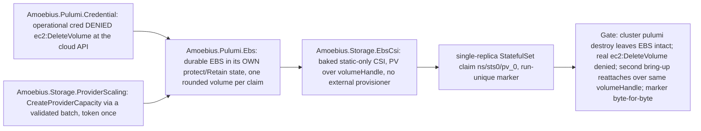

# Phase 36: Per-PV EBS decoupling + create-vs-delete credential

**Status**: Authoritative source
**Supersedes**: N/A
**Referenced by**: DEVELOPMENT_PLAN/README.md, DEVELOPMENT_PLAN/overview.md, DEVELOPMENT_PLAN/phase_34_provider_deploy_checkpoint.md, DEVELOPMENT_PLAN/phase_35_provider_child_bringup.md, DEVELOPMENT_PLAN/phase_37_provider_dynamic_nodes.md, DEVELOPMENT_PLAN/system_components.md
**Generated sections**: none

> **Purpose**: Make durable per-PV EBS **structurally** outside the ephemeral cluster's destroy set — carried in
> its own `protect`/`Retain` durable-class Pulumi state and guarded by an operational credential that is
> *denied `ec2:DeleteVolume` at the cloud API* — then complete the Pulumi-created-volume → mounted-claim path
> through a static-only, baked AWS EBS CSI (no external provisioner, static PV over the volume's `volumeHandle`)
> and realize the `CreateProviderCapacity` storage-scaling arm, gated live on `linux-cpu → provider`.

---

## Phase Status

📋 Planned. Nothing in this phase is implemented; every sprint below is 📋 Planned and every prescriptive
statement is design intent, never a tested amoebius result. This phase opens after the
[Phase 34](phase_34_provider_deploy_checkpoint.md) gate (the provider-cluster Pulumi deploy-from-inside +
Vault-Transit-enveloped MinIO checkpoint + `observeProviderAccount` — the deploy this phase spins a cluster
with and whose durable-class checkpoint/state machinery it reuses), the
[Phase 21](phase_21_retained_storage.md) gate (`no-provisioner` retained PVs + lossless rebind — the storage
substrate the EBS backs), and the [Phase 18](phase_18_base_image_registry.md) gate (the multi-arch baked-binary
supply chain this phase extends with the provider-only CSI binaries). It runs on the **linux-cpu → provider**
substrate in **Register 3** (live infrastructure): the parent amoebius cluster is a single-node `kind` cluster
on `linux-cpu`, from inside which the Pulumi engine issues the provider deploy over the cloud API; `→ provider`
names the deploy target class (a cloud-managed EKS cluster), not a fifth hardware substrate, so the gate stays
single-substrate. This sub-phase owns **the durable per-PV EBS class, its create-vs-delete credential, the
static-only EBS CSI path, and the `CreateProviderCapacity` storage-scaling enactor** — never the provider
deploy itself (that is the [Phase 34](phase_34_provider_deploy_checkpoint.md) gate), never the hostless
in-cluster control plane and Lease handoff ([Phase 35](phase_35_provider_child_bringup.md)), never dynamic node
provisioning or the leak-free ephemeral teardown gate ([Phase 37](phase_37_provider_dynamic_nodes.md)), and
never the elevated-harness *reclamation* of durable test-flagged EBS ([Phase 42](phase_42_test_topology_dsl.md),
which completes the §6 model's full leak-free test *cycle*). Status transitions are recorded
reverse-chronologically here once work begins.

## Phase Summary

This phase delivers the **per-PV EBS arm** of the managed-provider axis: each claim has exactly one PV and
exactly one EBS volume, whose lifetime is decoupled from the node and from the ephemeral cluster stack. It owns
four deliverables, all driven from the single `linux-cpu` parent, plus the phase gate — the durable-EBS slice of
the Phase-30-lineage provider corpus.

First, a **per-PV durable EBS in its own state** (`Amoebius.Pulumi.Ebs`): each PV's EBS volume is placed in its
**own durable-class logical checkpoint namespace** (§3), one rounded volume per claim, flagged `protect`/`Retain`
and **never** in the per-run cluster stack, so a normal `pulumi destroy` of the cluster never includes it. Before
`CreateVolume`, provisioning consumes the private
`ProvisionedVolumeDemand { claim, backing, attachment, requiredUsableBytes, provisionedBytes, presentation,
allocation, witness }`: logical/geometry bytes become `requiredUsableBytes`; the pinned block/filesystem
presentation adds overhead; the EBS volume-type minimum and whole-GiB quantum derive one
`ProviderVolumeRequest { volumeType, zone, requiredUsableBytes, allocation, sizeGiB, provisionedBytes,
presentation, witness }`, whose same rounded `provisionedBytes` is used by PVC, PV, and `CreateVolume`. A
deterministic `ProviderVolumeSlotId { account, cluster, claim, request }` debits that promised slot against the
freshly observed durable residual (separate provider quota ledgers for durable bytes and durable volume count),
records `Promised` in the backing witness, and only the real EBS id returned by create transitions it to
`Materialized`; raw Dhall never fabricates a future `ProviderVolumeId`. A destroyed/replaced EC2 node detaches
its EBS and the volume survives; the next bring-up re-attaches the same volume to the same
`<namespace>/<statefulset>/pv_<integer>` claim, keeping the logical `BackingId` and slot stable.

Second, a **create-vs-delete credential model** (`Amoebius.Pulumi.Credential`): the operational credential is
granted `ec2:CreateVolume` (plus the per-run cluster create/delete it needs) but **denied `ec2:DeleteVolume`** on
durable retained volumes, so accidental durable-data destruction is *unauthorized at the cloud API*, not merely
discouraged. The only automated delete authority is the elevated test credential, limited to test-owned volumes
and exercised in [Phase 42](phase_42_test_topology_dsl.md) — referenced, never invoked here. Production reclaim
uses a separate human-operated external break-glass credential against an exact `ReclaimEligible` target; it is
not a spec or reconciler capability. The distinct CSI runtime identity is attach-only
(`Describe*`/`AttachVolume`/`DetachVolume`) and is denied both `CreateVolume` and `DeleteVolume`.

Third, a **static-only AWS EBS CSI path** (`Amoebius.Storage.EbsCsi`): the upstream AWS EBS CSI controller/node
binaries and required sidecars are **baked into the amoebius base image** and installed from typed manifests
(no Helm, no public image pull), version-pinned by the Phase-0 fixture
`test/fixtures/phase30/ebs_csi_bake_expected.dhall`. No external-provisioner container is installed; each fresh
PV names `spec.csi.driver: ebs.csi.aws.com`, the Pulumi-created EBS ID as `volumeHandle`, and node affinity for
the volume's Availability Zone. Pulumi creates the durable EBS volume; it does **not** delegate provisioning to
Kubernetes, so the cluster's sole StorageClass remains `kubernetes.io/no-provisioner`. Placement consumes one
`ebs.csi.aws.com` attach slot per unique mounted PVC, using the lesser of the declared driver policy and the live
`CSINode`/SKU limit.

Fourth, the **`CreateProviderCapacity` storage-scaling arm** (`Amoebius.Storage.ProviderScaling`): a
policy-driven `Growable` durable-EBS budget grows only through a typed `ScalingPolicy`, realized without adding a
second create path. Provider-volume replacement or shrink is a `StorageMigrationDemand`, not an in-place edit;
old and new raw allocations, provider volume counts, copy/verify workspace, and the complete copy Job envelope
must fit simultaneously, and a failed copy/verification or unobservable cleanup retains and charges both volumes.
This phase is the live owner of the `CreateProviderCapacity` cloud-mutation capability:
[Phase 8](phase_08_storage_geometry_folds.md) owns the policy-only envelope and the observe-then-plan
`Growable`/scaling fold; [Phase 19](phase_19_object_reconciler.md) owns the generic fresh-snapshot validation and
single-use dispatcher; this phase alone supplies the account-scoped cloud mutation — embedding an exact
storage-capacity refinement of the batch-owned Pulumi graph, validating it against current durable byte/count
quota and execution supply, consuming its cloud and scaling tokens once, and accepting only receipt-bound
EBS/checkpoint readback. Retained-carve allocation and host migration remain [Phase 21](phase_21_retained_storage.md)
arms.

What is **not** here: the provider-cluster Pulumi deploy, the Vault-Transit-enveloped MinIO checkpoint backend,
the executor/plugin/workspace `PulumiExecutionDemand`, and `observeProviderAccount`
([Phase 34](phase_34_provider_deploy_checkpoint.md)); the hostless in-cluster singleton, the capacity-scheduler
roles, full platform-service convergence, and the parent→child Lease handoff
([Phase 35](phase_35_provider_child_bringup.md)); dynamic node provisioning by signal, the ephemeral
node-root EBS class, and the leak-free tag-sweep teardown gate ([Phase 37](phase_37_provider_dynamic_nodes.md));
and the elevated-harness reclamation of durable test-flagged EBS that makes a *full* leak-free test *cycle*
possible ([Phase 42](phase_42_test_topology_dsl.md)).

**Substrate:** linux-cpu → provider — the §L Parent-drives-provider escape form. The acceptance gate runs on
exactly one hardware substrate, the `linux-cpu` parent `kind` cluster from inside which the Pulumi engine issues
the deploy; `→ provider` (EKS) is the declared managed-engine deploy target, not a fifth hardware substrate
([`substrates.md` §2](substrates.md#2-substrate-inventory),
[`development_plan_standards.md` §L](development_plan_standards.md#l-one-substrate-discipline)).

**Register:** 3 (live infrastructure) — the gate spins up a real provider cluster with a real durable EBS
volume, writes and reads a marker across a real `pulumi destroy` and re-attach, and issues a real
`ec2:DeleteVolume` against the cloud API; no register-1/2 in-process check discharges it. The emitted ledger's
acceptance token reads *tested on the EKS provider target from a `linux-cpu` parent*, with durable-EBS retention
recorded *correct-by-class* and the elevated-harness durable-EBS *reclamation* marked **deferred to
[Phase 42](phase_42_test_topology_dsl.md), not asserted here**.

**Gate:** an `InForceSpec` that, from a **linux-cpu** parent, spins up a provider cluster (via the
[Phase 34](phase_34_provider_deploy_checkpoint.md) deploy), creates **one per-PV durable EBS volume in separate
`protect`/`Retain` state**, renders a **static `ebs.csi.aws.com` PV** whose `volumeHandle` is that exact
Pulumi-created EBS ID with matching Availability-Zone affinity, observes the **baked EBS CSI
controller/node become Ready without any external provisioner** and with `kubernetes.io/no-provisioner` as the
sole StorageClass, writes a **run-unique marker** through the bound `<ns>/sts0/pv_0` claim, records the EBS
identity and AZ, then `pulumi destroy`s the ephemeral cluster stack and proves — by an **independent cloud-API
`DescribeVolumes` sweep** — that the durable EBS **survives intact**. A **real `ec2:DeleteVolume` call issued
under the operational credential** against a live test-flagged volume returns `AccessDenied`/`UnauthorizedOperation`
from AWS (the volume survives), while the paired positive `ec2:CreateVolume` under the same credential succeeds.
A second full bring-up from the durable-EBS-retained, cluster-absent state, constrained to the recorded AZ,
recreates a static PV over the **same `volumeHandle`**, re-attaches the volume, and reads the marker
**byte-for-byte**. The gate turns **red** on ≥1 committed seeded mutant. The complete apparatus — the committed
representative topology slice, the Phase-0 oracle pins, and the seeded mutants — is named in
[`## Gate integrity`](#gate-integrity); the gate line above delegates to it by anchor per
[`development_plan_standards.md` §M](development_plan_standards.md#gate-integrity-delegation).

## Gate integrity

> **Shared provider corpus (by design).** The `test/dhall/phase_30_provider_provision.dhall` topology and the `mut-30.*` mutant family are the one committed corpus deliberately shared across the four provider sub-phases (Phases 34–37; see [Phase 34](phase_34_provider_deploy_checkpoint.md)) — this sub-phase gates its own slice, not accidental double-ownership.
This section carries this sub-phase's **slice** of the source Phase-30 provider gate apparatus, partitioned
along the **durable-EBS / credential / static-CSI / storage-scaling** seam (per
[`development_plan_standards.md` §M](development_plan_standards.md#m-gate-integrity-a-gate-cannot-be-passed-by-a-stub)).
The provider-deploy/checkpoint/`observeProviderAccount` apparatus (the engine execve golden
`test/goldens/engine_execve.txt`, the checkpoint-envelope golden `test/goldens/checkpoint_envelope.json`, the
`mut-30.1-*` mutants, and the host-shell/sealed-Vault negatives) stays in
[Phase 34](phase_34_provider_deploy_checkpoint.md); the bring-up/scheduler-cutover/Lease-handoff apparatus
(`mut-30.2-public-pull` and the `Managed Eks` no-`LinuxHost` foreclosure) stays in
[Phase 35](phase_35_provider_child_bringup.md); the dynamic-node, over-quota, forest-supply, and leak-free
tag-sweep apparatus (`mut-30.4-ignore-signal`, `mut-30.4-apply-over-quota`, `mut-30.4-unreachable-as-gone`,
`mut-30.5-skip-sweep`, and `test/dhall/phase_30_provider_over_quota.dhall`) stays in
[Phase 37](phase_37_provider_dynamic_nodes.md). This phase inherits only the durable-EBS slice below.

**Oracle-pinning (§M.1).** Every fixture, golden, and expected tag this gate checks against is authored and
**committed in Phase 0**, before `Amoebius.Pulumi.{Ebs,Credential}` / `Amoebius.Storage.{EbsCsi,ProviderScaling}`
exist — no oracle is regenerated from the implementation's own output:

- **Representative topology slice** — the durable-EBS portion of the committed gate topology
  `test/dhall/phase_30_provider_provision.dhall`: one per-PV EBS volume (durable class) in one declared
  Availability Zone, attached to a single-replica StatefulSet claim `<ns>/sts0/pv_0` through a static
  `ebs.csi.aws.com` PV whose `volumeHandle` is that Pulumi-created volume ID, its durable-bytes and durable-count
  provider quota ledgers, its own durable-class checkpoint `PulumiCheckpointObjectDemand`/`StorageBudgetId`, the
  run-unique marker written through the claim, and the operational create-only credential. (The provider control
  plane, base node group, and the observed account this slice attaches to are stood up by
  [Phase 34](phase_34_provider_deploy_checkpoint.md); this phase consumes them, it does not re-author their
  corpus.)
- **The credential matrix oracle** — `test/goldens/ebs_credential_matrix.txt`, the hand-authored
  action → allow/deny reference table (operational credential: `ec2:CreateVolume` allow, `ec2:DeleteVolume` deny
  on durable retained volumes, per-run cluster create/delete allow; CSI runtime identity:
  `Describe*`/`AttachVolume`/`DetachVolume` allow, `CreateVolume`/`DeleteVolume` deny), authored **independently**
  of the generated `Amoebius.Pulumi.Credential` policy JSON (§M.1/§M.3).
- **The baked-binary oracle** — `test/fixtures/phase30/ebs_csi_bake_expected.dhall`, the Phase-0-pinned
  provider-driver binary/version inventory (controller, node, and required sidecars) the `BakeInventory`
  extension is checked against, authored independently of the base-image build.

**Committed mutation quota (§M.2).** This gate names the committed seeded mutants of the durable-EBS seam,
committed and re-run (not run once); the gate MUST turn each red when substituted:

- `mut-30.3-allow-delete` — the operational policy with the `ec2:DeleteVolume` `Deny` statement removed (guard
  deletion). It MUST go **red** on the cloud-API delete-deny check: under it the real `ec2:DeleteVolume` would
  succeed and the durable volume would be destroyed.
- `mut-30.3-enable-dynamic-provisioner` — adds the external-provisioner sidecar plus an `ebs.csi.aws.com`
  provisioning StorageClass (union-arm addition). It MUST go **red** on the object-set assertion (exactly one
  StorageClass, `kubernetes.io/no-provisioner`; no external-provisioner container) and the cloud-audit assertion
  (no `CreateVolume` under the CSI runtime identity).
- `mut-30.3-credit-old-before-observed-delete` — admits a migration transition by subtracting the old volume
  before an independent privileged observation proves its deletion (dropped `UNCHANGED`). It MUST go **red**: the
  old backing must remain charged until deletion is freshly observed.
- `mut-30.3-drop-copy-executor` — omits the copy/verify Job envelope from the migration peak (dropped effect).
  It MUST go **red**: the replacement must charge the full `copyExecution : PodResourceEnvelope` concurrently.
- `mut-30.3-bypass-validated-batch` — calls `CreateVolume` directly from the scaling policy/envelope, bypassing
  the transition's `ValidatedCloudActionBatch` and its one-time token (dropped check). It MUST go **red**: only
  the validated batch may reach the cloud writer.

**Independent reference predicates (§M.3).** Every check defines its reference side **independently of the code
under test**:

1. **Cloud-API delete-deny (§M.5 external observer).** "Denied" is a **real `ec2:DeleteVolume` API call** issued
   under the operational credential against a **live dummy test-flagged EBS volume**, returning an
   `AccessDenied`/`UnauthorizedOperation` response from AWS with the volume surviving — explicitly **NOT** the IAM
   policy simulator and **NOT** an in-process evaluation of the generated policy JSON (which prove nothing at the
   cloud API). It is paired with the positive `ec2:CreateVolume` succeeding under the same credential (§M.8), and
   the expected action → allow/deny reference is the committed hand table `test/goldens/ebs_credential_matrix.txt`.
2. **Distinct checkpoint namespace by external read.** The durable volume's state is a distinct logical
   checkpoint namespace from the ephemeral cluster stack's checkpoint, asserted by **distinct MinIO object keys
   read from the store** (an independent `LIST`/`HEAD` against MinIO), not from the program that wrote them.
3. **Pre-create witness and byte geometry.** The pre-create backing witness is asserted to contain the
   deterministic `Promised` `ProviderVolumeSlotId` and **no real volume id**; the integral-GiB `CreateVolume`
   request exactly matches it; the returned id is the **only** transition to `Materialized`. Independent cloud/OS
   observation of EBS raw bytes, CSI `volumeMode`/fsType, and mounted usable capacity asserts raw ==
   `provisionedBytes` and usable ≥ `requiredUsableBytes`; a slot differing by one required-usable byte,
   allocation minimum/quantum, zone, type, presentation, or account-usage change before create invalidates the
   `ValidatedCloudProviderAction` with **zero** `CreateVolume` calls.
4. **Baked-inventory equivalence.** The provider-driver extension to `BakeInventory` is checked against
   `test/fixtures/phase30/ebs_csi_bake_expected.dhall`, and each pinned controller/node/sidecar binary executes
   **by absolute path** with its expected version on both base-image architectures.
5. **Byte-for-byte reattach identity.** The second bring-up's static PV `volumeHandle` is asserted equal to the
   recorded first-cycle EBS ID, the node group is constrained to the recorded Availability Zone, and the
   run-unique marker read back through the re-attached claim is compared **byte-for-byte** to the value written
   in the first cycle.

**Concrete corpus (§M.7).** The "representative set" is the durable-EBS slice of
`test/dhall/phase_30_provider_provision.dhall` named above, plus the rounding fixture (logical bytes that are not
an integral GiB, proving rounding is performed once), the raw-equals-usable-insufficient fixture (filesystem
metadata that forces upward rounding or rejection), the migration replacement/shrink fixture with its paired
one-short variants (durable EBS bytes, durable volume count, workspace backing, executor
CPU/memory/pod-ephemeral, pod slots, `ebs.csi.aws.com` attach slots), and the `Growable` durable-EBS
threshold-crossing fixture that must select `CreateProviderCapacity`. Every negative asserts **its specific
reason** and is paired with a positive differing only in the foreclosed dimension (§M.8).

## Resource provision — the durable per-PV EBS slice

The gate provisions, before any cloud mutation, exactly this envelope for the durable-EBS slice (the surrounding
provider control plane, node group, and executor peaks are provisioned by
[Phase 34](phase_34_provider_deploy_checkpoint.md)):

- one `ProvisionedVolumeDemand` → one `ProviderVolumeRequest` per claim, retaining usable (`requiredUsableBytes`)
  and raw (`provisionedBytes`, integral `sizeGiB`) geometry distinctly, debited to the **durable-bytes** and
  **durable-volume-count** provider quota ledgers (never the ephemeral node-root EBS ledgers);
- one durable-class checkpoint `PulumiCheckpointObjectDemand` with its own `StorageBudgetId` and exclusive
  `ObjectStoreMutationAdmission`, provisioned **independently** of the ephemeral cluster stack so it does not
  disappear merely because the live volume is retained;
- the baked static-only EBS CSI controller/node components and required sidecars (typed-manifest install, no
  external provisioner), consuming one `ebs.csi.aws.com` attach slot per unique mounted PVC (the lesser of the
  declared driver policy and the live `CSINode`/SKU limit);
- for the scaling/migration arms, a `ProvisionedStorageMigration` retaining both exact provisioned volume
  demands, `workspaceBytes`, the copy/verify `copyExecution : PodResourceEnvelope`, two provider volume-count
  slots, and both required `ebs.csi.aws.com` attachments — all charged **simultaneously** before the replacement
  is created.

## Doctrine adopted

- [`pulumi_iac_doctrine.md §6`](../documents/engineering/pulumi_iac_doctrine.md#6-the-ebs-create-vs-delete-credential-model)
  — *the EBS create-vs-delete credential model* — with
  [`§3`](../documents/engineering/pulumi_iac_doctrine.md#3-state-lifetime-matches-resource-lifetime-per-class)
  (*state lifetime matches resource lifetime, per class*) and the per-PV-EBS entry of
  [`§4`](../documents/engineering/pulumi_iac_doctrine.md#4-what-pulumi-provisions-the-resource-catalog)
  (*the resource catalog*): durable EBS is created by Pulumi in its own durable-class state (never in the per-run
  cluster stack), so a routine `pulumi destroy` cannot include it, and the operational credential that could
  otherwise delete it is denied `ec2:DeleteVolume` at the cloud API. Pulumi creates the volume; it does not
  delegate provisioning to Kubernetes.
- [`storage_lifecycle_doctrine.md §5.1`](../documents/engineering/storage_lifecycle_doctrine.md#51-storage-is-independent-of-the-node-lifecycle)
  and [`§7 / §7.1`](../documents/engineering/storage_lifecycle_doctrine.md#7-deleting-durable-data-is-forbidden-under-normal-operation)
  — *storage is independent of the node lifecycle* / *deleting durable data is forbidden under normal operation*
  and *the single exception: the elevated test harness*: per-PV EBS survives node replacement and reattaches
  through a **statically** rendered EBS CSI PV rather than dynamic provisioning; within amoebius automation only
  the [Phase 42](phase_42_test_topology_dsl.md) elevated harness may destroy a test-owned volume, and production
  reclaim is an external operator break-glass action against an exact `ReclaimEligible` target, never a routine
  teardown. Provider-volume replacement/shrink consumes the generic old+new `StorageMigrationDemand`; old/new raw
  allocation, copy workspace and execution, and provider byte/count overlap stay charged through verification and
  failed cleanup.
- [`image_build_doctrine.md §2`](../documents/engineering/image_build_doctrine.md#2-the-single-distribution-rule-bake-the-binaries-build-the-amoebius-image-pull-only-in-cluster)
  with [`§7`](../documents/engineering/image_build_doctrine.md#7-what-amoebius-bakes-vs-builds--the-base-container-is-the-supply-chain)
  — *third-party binaries are baked; workloads pull only in-cluster*: the upstream AWS EBS CSI controller/node
  implementation and required sidecars are consumed as baked binaries under typed manifests, never as a public
  image or Helm chart.
- [`resource_capacity_doctrine.md §6`](../documents/engineering/resource_capacity_doctrine.md#6-growable--scalingpolicy-the-quota-bounded-dynamic-provisioning-arm)
  and [`§3.1`](../documents/engineering/resource_capacity_doctrine.md#31-the-systematic-provision-matrix)
  — *`Growable` / `ScalingPolicy`: the quota-bounded dynamic-provisioning arm* and *the systematic provision
  matrix*: the `CreateProviderCapacity` storage-scaling transition is the runtime enaction of a typed
  `ScalingPolicy` against the freshly observed durable byte/count residual; the provider quota is the outer
  ceiling, a bounded budget grows only through the policy and never to "unbounded", and any durable-storage,
  migration-transition, executor, or checkpoint-object obligation failure rejects before cloud mutation.
- [`chaos_failover_doctrine.md §12`](../documents/engineering/chaos_failover_doctrine.md#12-the-moral-core--proven-tested-assumed)
  (cross-reference) — *proven, tested, assumed*: the gate emits a proven/tested/assumed ledger recording
  durable-EBS retention as *correct-by-class* and the elevated-harness durable-EBS reclamation as *explicitly
  deferred to [Phase 42](phase_42_test_topology_dsl.md)*; skipping an applicable teardown-observation move marks
  that layer UNVERIFIED, never green.

## Sprints

## Sprint 36.1: Per-PV durable EBS in its own state + node-vs-storage decoupling 📋

**Status**: Planned
**Implementation**: `amoebius-pulumi/src/Amoebius/Pulumi/Ebs.hs` (per-PV durable EBS program, own state,
`protect`/`Retain`, `ProvisionedVolumeDemand` → `ProviderVolumeRequest` geometry, `ProviderVolumeSlotId`
promised/materialized witness) — built on the `amoebius-pulumi` engine seam and the Vault-Transit-enveloped
MinIO backend **first delivered by [Phase 34](phase_34_provider_deploy_checkpoint.md) and reused here, not
rebuilt** (target path; not yet built)
**Blocked by**: [Phase 34](phase_34_provider_deploy_checkpoint.md) gate (the provider deploy + encrypted-MinIO
checkpoint machinery this reuses for the durable-class state); [Phase 21](phase_21_retained_storage.md) gate
(`no-provisioner` retained PVs + lossless rebind — the storage substrate the EBS backs) — external
earlier-phase prerequisites.
**Independent Validation**: one per-PV EBS volume is created in **separate** durable state; its
`ProvisionedVolumeDemand` derives an integral-GiB `ProviderVolumeRequest` retaining usable/raw geometry, and the
same rounded `provisionedBytes` is rendered on PVC/PV from the ephemeral cluster stack; the pre-create witness
contains the deterministic promised `ProviderVolumeSlotId` and no real volume id; the integer-GiB `CreateVolume`
request exactly matches it and the returned id is the only transition to `Materialized`; a destroyed/replaced EC2
node detaches its EBS and the volume survives; the next bring-up re-attaches the same volume to the same
`<namespace>/<statefulset>/pv_<integer>` claim; the volume's state is a distinct logical checkpoint namespace
from the ephemeral cluster stack's checkpoint (asserted by distinct MinIO object keys read from the store).
**Docs to update**: `documents/engineering/pulumi_iac_doctrine.md` (§3),
`documents/engineering/storage_lifecycle_doctrine.md` (one PV/EBS per claim, rounded allocation + node-vs-storage
decoupling), `DEVELOPMENT_PLAN/system_components.md`.

### Objective

Adopt [`pulumi_iac_doctrine.md §3 — State lifetime matches resource lifetime, per class`](../documents/engineering/pulumi_iac_doctrine.md#3-state-lifetime-matches-resource-lifetime-per-class)
and [`storage_lifecycle_doctrine.md §5.1 — storage is independent of the node lifecycle`](../documents/engineering/storage_lifecycle_doctrine.md#51-storage-is-independent-of-the-node-lifecycle):
make durable storage **structurally** outside the ephemeral destroy set by placing each per-PV EBS volume in its
own `protect`/`Retain` durable-class Pulumi state, and derive the one rounded `provisionedBytes` used by PVC, PV,
and `CreateVolume` from the claim's application/geometry-derived usable bytes, so "ephemeral cluster, durable
data" cannot collapse on a routine teardown.

### Deliverables

- An `Amoebius.Pulumi.Ebs` program placing each PV's EBS volume in its **own durable-class state** (separate
  logical checkpoint namespace, §3), with one rounded volume per claim, flagged `protect`/`Retain`, and
  **never** in the per-run cluster stack — so a normal `pulumi destroy` of the cluster never includes it.
- Each durable stack's checkpoint is itself an exact `PulumiCheckpointObjectDemand`, with resource-state field
  identities, finite retained revisions and failed-partial/orphan exposure, an owning `StorageBudgetId`, and the
  exclusive checkpoint mutation admission. The durable backend budget remains provisioned independently of the
  ephemeral cluster stack and cannot disappear merely because the live volume is retained.
- Before `CreateVolume`, provisioning consumes the private `ProvisionedVolumeDemand { claim, backing,
  attachment, requiredUsableBytes, provisionedBytes, presentation, allocation, witness }`: logical/geometry bytes
  become `requiredUsableBytes`; its pinned block/filesystem presentation adds overhead; the EBS volume-type
  minimum and whole-GiB quantum derive `ProviderVolumeRequest { volumeType, zone, requiredUsableBytes,
  allocation, sizeGiB, provisionedBytes, presentation, witness }`. It then derives a deterministic
  `ProviderVolumeSlotId { account, cluster, claim, request }`, debits that promised slot's rounded byte/count
  cost against the freshly observed durable residual (separate provider quota ledgers for durable bytes and
  volume count), and records `Promised` in the private backing witness. The real EBS id returned by create is
  attached and cross-checked into `Materialized`; raw Dhall never fabricates a future `ProviderVolumeId`.
  Retained rebind keeps the logical `BackingId` and slot stable.
- Node-vs-storage decoupling: a destroyed/replaced EC2 node detaches its EBS and the volume survives; the next
  bring-up re-attaches the same volume to the same `<namespace>/<statefulset>/pv_<integer>` claim.
- An in-file honesty note: `Amoebius.Pulumi.Ebs` produces the durable-class state and the `Promised`/`Materialized`
  witness; the operational-credential delete-deny that makes retention *unauthorized* rather than merely *skipped*
  is Sprint 36.2, and the static attach/mount path is Sprint 36.3.

### Validation

1. Create a per-PV EBS in separate durable state and assert the pre-create witness contained the deterministic
   promised slot and no real volume id, the integer-GiB `CreateVolume` request exactly matched it, and the
   returned id was the only transition to `Materialized`. Independently observe EBS raw bytes, CSI
   `volumeMode`/fsType, and mounted usable capacity: raw must equal `provisionedBytes` and usable must be at
   least `requiredUsableBytes`.
2. Assert claim:PVC/PV:EBS identity/cardinality is 1:1:1; PVC and PV capacities equal the provider-rounded
   `provisionedBytes`, EBS reports that same raw size, and the mounted filesystem supplies the witnessed usable
   bytes. A fixture whose logical bytes are not an integral GiB proves rounding is performed once, and one whose
   filesystem metadata makes raw-equals-usable insufficient is rejected or rounded upward.
3. Assert the volume's state is a distinct logical checkpoint namespace from the ephemeral cluster stack's
   checkpoint by **distinct MinIO object keys read from the store**, not from the program that wrote them. A slot
   differing by one required-usable byte, allocation minimum/quantum, zone, type, presentation, or account-usage
   change before create invalidates the `ValidatedCloudProviderAction` and records **zero** `CreateVolume` calls.
4. Destroy/replace the node holding the volume and assert the EBS survives and re-attaches through a freshly
   rendered claim binding on the next bring-up, with the logical `BackingId` and `ProviderVolumeSlotId` stable.

### Remaining Work

The whole sprint (📋 Planned).

## Sprint 36.2: The create-vs-delete credential model (cloud-API delete-deny) 📋

**Status**: Planned
**Implementation**: `amoebius-pulumi/src/Amoebius/Pulumi/Credential.hs` (operational create-only vs elevated
delete IAM policy split; the attach-only CSI runtime identity) (target path; not yet built)
**Blocked by**: [Phase 34](phase_34_provider_deploy_checkpoint.md) gate (the operational-vs-elevated credential
resolution path and the Vault-injected cloud keys — secrets are *names* in the `.dhall`, bytes injected by the
parent); Sprint 36.1 (the durable retained volume the deny statement scopes to) — earlier-or-same-phase
prerequisites.
**Independent Validation**: a real `ec2:DeleteVolume` call issued under the operational credential against a live
dummy test-flagged EBS volume returns an `AccessDenied`/`UnauthorizedOperation` response from AWS (the volume
survives the attempt); the same operational credential *can* `ec2:CreateVolume` (a real create succeeds), so the
deny is specific to the delete dimension; the CSI runtime identity is attach-only and denied both `CreateVolume`
and `DeleteVolume`; the generated policy matches the committed reference matrix `test/goldens/ebs_credential_matrix.txt`
action-for-action.
**Docs to update**: `documents/engineering/pulumi_iac_doctrine.md` (§6),
`documents/engineering/storage_lifecycle_doctrine.md` (§7/§7.1 — deletion forbidden under normal operation; the
single elevated-harness exception), `DEVELOPMENT_PLAN/system_components.md`.

### Objective

Adopt [`pulumi_iac_doctrine.md §6 — The EBS create-vs-delete credential model`](../documents/engineering/pulumi_iac_doctrine.md#6-the-ebs-create-vs-delete-credential-model)
and [`storage_lifecycle_doctrine.md §7 / §7.1`](../documents/engineering/storage_lifecycle_doctrine.md#7-deleting-durable-data-is-forbidden-under-normal-operation):
make the authority to delete durable data **structurally** withheld from normal operation, so accidental
durable-data destruction is *unauthorized at the cloud API*, not merely discouraged, and the only automated
delete authority is the elevated test credential ([Phase 42](phase_42_test_topology_dsl.md), referenced not
invoked here).

### Deliverables

- An `Amoebius.Pulumi.Credential` split: the operational credential is granted `ec2:CreateVolume` (plus the
  per-run cluster create/delete it needs) but **denied `ec2:DeleteVolume`** on durable retained volumes.
- The only automated delete authority is the elevated test credential, limited to test-owned volumes and
  exercised in [Phase 42](phase_42_test_topology_dsl.md) — referenced, not invoked here. Production reclaim uses a
  separate human-operated external break-glass credential against an exact `ReclaimEligible` target; it is not a
  spec or reconciler capability.
- The distinct CSI runtime identity is attach-only (`Describe*`/`AttachVolume`/`DetachVolume`) and is denied
  both `CreateVolume` and `DeleteVolume`.
- An in-file honesty note: the operational-vs-elevated *credential class* is proven in prodbox, but the
  Pulumi-tracked durable-EBS model the deny statement guards is new amoebius design (see the sprint Honesty note).

### Validation

1. Policy test at the cloud API, not in-process: "denied" means a **real `ec2:DeleteVolume` API call** issued
   under the operational credential against a **live dummy test-flagged EBS volume** returns an
   `AccessDenied`/`UnauthorizedOperation` response from AWS (the volume survives the attempt) — explicitly
   **NOT** the IAM policy simulator, **NOT** an in-process evaluation of the generated policy JSON, which prove
   nothing at the cloud API despite the objective's "unauthorized at the cloud API" framing. Paired positive:
   the same operational credential *can* `ec2:CreateVolume` (a real create succeeds), so the deny is specific to
   the delete dimension (§M.8).
2. The reference policy expectation (which action → allow/deny) is the committed Phase-0 hand table
   `test/goldens/ebs_credential_matrix.txt`, authored independently of the generated `Amoebius.Pulumi.Credential`
   policy (§M.1/§M.3); assert the generated operational and CSI-runtime policies match it action-for-action, and
   that the CSI runtime identity is denied both create and delete.
3. The committed seeded mutant `mut-30.3-allow-delete` (the operational policy with the `ec2:DeleteVolume` `Deny`
   statement removed) MUST go **red** here — under it the real delete would succeed.

### Remaining Work

The whole sprint (📋 Planned).

> **Honesty.** The create-vs-delete credential split is a **design resolution of an explicitly open question**;
> the operational-vs-elevated *credential class* is proven in prodbox, but EBS-in-prodbox is CSI-driver-created,
> **not** Pulumi-tracked — so amoebius's Pulumi-tracked durable-EBS model is *new design, not inherited proof*.

## Sprint 36.3: Static-only baked AWS EBS CSI + static PV over volumeHandle 📋

**Status**: Planned
**Implementation**: `src/Amoebius/Storage/EbsCsi.hs` (typed static-only EBS CSI controller/node + PV renderer;
no external provisioner), `docker/base/Dockerfile`, `src/Amoebius/Image/BakeInventory.hs`,
`test/fixtures/phase30/ebs_csi_bake_expected.dhall` (the Phase-0-pinned provider-driver binary/version oracle)
(target paths; not yet built)
**Blocked by**: [Phase 18](phase_18_base_image_registry.md) gate (the multi-arch baked-binary supply chain this
sprint extends with provider-only CSI binaries); [Phase 19](phase_19_object_reconciler.md) gate (the typed SSA
object reconciler that installs the CSI components from typed manifests); Sprint 36.1 (the durable EBS
`volumeHandle` the static PV binds over) — earlier-or-same-phase prerequisites.
**Independent Validation**: the baked/rendered AWS EBS CSI controller and node components become Ready without an
external provisioner; each fresh PV names `spec.csi.driver: ebs.csi.aws.com`, the Pulumi EBS ID as
`volumeHandle`, and node affinity for the volume's Availability Zone; the cluster has exactly one StorageClass,
`kubernetes.io/no-provisioner`; the EBS CSI install contains no external-provisioner; an independent cloud audit
records no `CreateVolume` call under the CSI runtime identity; and the provider-driver extension to
`BakeInventory` matches `test/fixtures/phase30/ebs_csi_bake_expected.dhall`, each pinned controller/node/sidecar
binary executing by absolute path with its expected version on both base-image architectures.
**Docs to update**: `documents/engineering/image_build_doctrine.md` (the provider-only EBS CSI binaries in the
base-image supply chain), `documents/engineering/storage_lifecycle_doctrine.md` (static CSI `volumeHandle` bind,
sole `no-provisioner` StorageClass), `DEVELOPMENT_PLAN/system_components.md`.

### Objective

Adopt [`image_build_doctrine.md §2 — the single distribution rule: bake the binaries`](../documents/engineering/image_build_doctrine.md#2-the-single-distribution-rule-bake-the-binaries-build-the-amoebius-image-pull-only-in-cluster)
(with [`§7`](../documents/engineering/image_build_doctrine.md#7-what-amoebius-bakes-vs-builds--the-base-container-is-the-supply-chain))
and [`storage_lifecycle_doctrine.md §5.1`](../documents/engineering/storage_lifecycle_doctrine.md#51-storage-is-independent-of-the-node-lifecycle):
complete the path from a Pulumi-created volume to a mounted claim explicitly by **consuming** the upstream AWS
EBS CSI implementation from the amoebius base image and rendering **static** PVs over known volume IDs, rather
than building an amoebius attach controller or enabling dynamic provisioning.

### Deliverables

- A static-only `Amoebius.Storage.EbsCsi` path: the upstream AWS EBS CSI controller/node binaries and required
  sidecars are baked into the amoebius base image and installed from typed manifests (no Helm/public image
  pull), version-pinned by the Phase-0 fixture `test/fixtures/phase30/ebs_csi_bake_expected.dhall`; **no**
  external-provisioner container is installed; each fresh PV names `spec.csi.driver: ebs.csi.aws.com`, the
  Pulumi-created EBS ID as `volumeHandle`, and node affinity for the volume's Availability Zone.
- Placement consumes one `ebs.csi.aws.com` attach slot per unique mounted PVC, using the lesser of the declared
  driver policy and the live `CSINode`/SKU limit; the cluster's sole StorageClass remains
  `kubernetes.io/no-provisioner`.
- A `BakeInventory` extension registering the provider-only CSI controller/node/sidecar binaries in the
  base-image supply chain, executable by absolute path on both architectures.
- An in-file honesty note: Pulumi creates the durable EBS volume; amoebius consumes the upstream CSI only for
  static attach/mount and does **not** delegate provisioning to Kubernetes (see the sprint Honesty note).

### Validation

1. Create a per-PV EBS (Sprint 36.1), render a static PV whose CSI `volumeHandle` is that exact EBS ID and whose
   zone affinity matches the volume, and observe the EBS CSI controller/node components Ready **before** the
   bind; assert the bind succeeds without any external provisioner.
2. Assert the cluster still has exactly one StorageClass, `kubernetes.io/no-provisioner`; the EBS CSI install
   contains no external-provisioner; and an independent cloud audit records no `CreateVolume` call under the CSI
   runtime identity.
3. The provider-driver extension to `BakeInventory` is checked against the independently authored
   `test/fixtures/phase30/ebs_csi_bake_expected.dhall`, and each pinned controller/node/sidecar binary executes
   by absolute path with its expected version on both base-image architectures.
4. The committed seeded mutant `mut-30.3-enable-dynamic-provisioner` (adds the external-provisioner plus an
   `ebs.csi.aws.com` provisioning StorageClass) MUST go **red** on the object-set and cloud-audit assertions.

### Remaining Work

The whole sprint (📋 Planned).

> **Honesty.** Amoebius consumes the upstream AWS EBS CSI implementation only for static attach/mount; its
> baked-binary, generated-manifest, no-external-provisioner realization is **new and untested** here. Pulumi
> creates the durable EBS volume; it does not delegate provisioning to Kubernetes.

## Sprint 36.4: Provider-volume migration + the `CreateProviderCapacity` storage-scaling arm 📋

**Status**: Planned
**Implementation**: `src/Amoebius/Storage/ProviderScaling.hs` (`CreateProviderCapacity`
validation/enactment), and the `StorageMigrationDemand`/`ProvisionedStorageMigration` witness in
`amoebius-pulumi/src/Amoebius/Pulumi/Ebs.hs` (target paths; not yet built)
**Blocked by**: Sprint 36.1; [Phase 8](phase_08_storage_geometry_folds.md) gate (the storage-scaling policy-only
envelope and the observe-then-plan `Growable`/scaling fold); [Phase 19](phase_19_object_reconciler.md) gate (the
generic fresh-snapshot validation and single-use dispatcher producing the `ValidatedStorageScalingAction`) —
earlier-or-same-phase prerequisites.
**Independent Validation**: a provider-volume replacement/shrink consumes a `StorageMigrationDemand` instead of
mutating a size in place; its private `ProvisionedStorageMigration` charges old+new raw rounded bytes, two
provider volume-count slots, workspace, both `ebs.csi.aws.com` attachments, and the full copy/verify Job
concurrently before creating the replacement; cutover occurs only after byte-for-byte verification, and a failed
copy/verification or unobservable cleanup keeps both EBS volumes and checkpoints intact and charged. A `Growable`
durable-EBS budget reaches `CreateProviderCapacity` only through [Phase 8](phase_08_storage_geometry_folds.md)'s
`ScalingPolicy` selection and [Phase 19](phase_19_object_reconciler.md)'s fresh `ValidatedStorageScalingAction`,
the transition's exact `ValidatedCloudActionBatch`, one-time token consumption, and receipt-bound EBS/checkpoint
readback; stale quota/allocation/account/execution input records **zero** cloud mutation.
**Docs to update**: `documents/engineering/storage_lifecycle_doctrine.md` (provider old+new migration peak),
`documents/engineering/resource_capacity_doctrine.md` (§6/§3.1 — the live `CreateProviderCapacity` storage-scaling
enaction under the provider-quota ceiling), `DEVELOPMENT_PLAN/system_components.md`.

### Objective

Adopt [`resource_capacity_doctrine.md §6 — Growable / ScalingPolicy`](../documents/engineering/resource_capacity_doctrine.md#6-growable--scalingpolicy-the-quota-bounded-dynamic-provisioning-arm)
(with [`§3.1 — the systematic provision matrix`](../documents/engineering/resource_capacity_doctrine.md#31-the-systematic-provision-matrix))
and [`storage_lifecycle_doctrine.md §7.1`](../documents/engineering/storage_lifecycle_doctrine.md#71-the-single-exception-the-elevated-test-harness):
realize the provider-volume storage-scaling arm without adding a second create path — a policy-driven
`CreateProviderCapacity` transition is an exact refinement of the same batch-owned EBS program, quota debit,
durable checkpoint, and static-attachment machinery — and make replacement/shrink a fully-charged
`StorageMigrationDemand`, never an in-place size edit.

### Deliverables

- Provider replacement/shrink enaction consumes a `StorageMigrationDemand { identity, old, replacement, policy }`
  instead of mutating a size in place. The private `ProvisionedStorageMigration` retains both exact provisioned
  volume demands, derived `workspaceBytes`, a complete copy/verify Job `copyExecution : PodResourceEnvelope`, the
  per-backing peak, and witness. Admission charges old+new raw EBS bytes and two provider volume-count slots,
  workspace backing, executor image/CPU/memory/pod-ephemeral/log/writable/mapped inputs, pod slot, and both
  required `ebs.csi.aws.com` attachments simultaneously. Cutover occurs only after byte-for-byte verification;
  failure keeps both EBS volumes and checkpoints intact and charged, and old capacity remains committed until
  external privileged deletion is freshly observed.
- The sole `CreateProviderCapacity` enactor for `ValidatedStorageScalingAction`. It immediately rechecks the same
  account/allocation/quota/executor/checkpoint snapshot, requires the transition's exact
  `ProvisionedStorageCapacityCloudBatch` refinement and `ValidatedCloudActionBatch`, atomically consumes the
  scaling token plus every batch action token, and accepts only post-attempt provider readback tied to that
  receipt. `NoChange`, retained-carve allocation, and host-only migration cannot reach this cloud writer;
  ambiguous outcomes retain every possible byte/count/checkpoint commitment and force re-observation.
- An in-file honesty note: this sprint builds the create-only guard's scaling/migration arms;
  `CreateProviderCapacity` is the live cloud writer, while the policy-only envelope and single-use dispatcher it
  refines are owned by [Phase 8](phase_08_storage_geometry_folds.md) and
  [Phase 19](phase_19_object_reconciler.md).

### Validation

1. Exercise a provider-volume replacement/shrink whose steady old and target states each fit. Observe that the
   private migration witness and cloud requests charge old+new raw rounded bytes, two volume-count slots,
   workspace, both CSI attachments, and the full copy/verify Job concurrently before creating the replacement.
   Paired one-short fixtures reduce only durable EBS bytes, durable volume count, workspace backing, executor
   CPU/memory/pod-ephemeral, pod slots, or `ebs.csi.aws.com` attach slots; each rejects before `CreateVolume`,
   Job creation, or checkpoint mutation. The attach check uses the lesser of declaration and live `CSINode`/SKU
   limit and deduplicates repeated mounts of one PVC without deduplicating old versus replacement.
2. Inject copy failure, verification mismatch, and unobservable post-cutover cleanup separately. Every case
   leaves both EBS IDs, exact checkpoint evidence, and old+new provider quota debits intact; none emits
   `ReclaimEligible` or spends the old allocation as credit. The committed `mut-30.3-credit-old-before-observed-delete`
   mutant (admits a transition only by subtracting the old volume) and `mut-30.3-drop-copy-executor` (omits the
   copy Job envelope) MUST both go **red**. The success case cuts the static PV over only after byte-for-byte
   verification, while the old backing remains charged until an independent privileged observation proves
   deletion.
3. Drive a `Growable` durable-EBS budget across its threshold without editing its desired demand. The fresh
   observation and [Phase 8](phase_08_storage_geometry_folds.md) planner must select `CreateProviderCapacity`;
   validate that its storage-only action domain, deploy/checkpoint projection, rounded byte/count debit, and
   Pulumi execution demand equal the enclosing cloud batch exactly. Change account usage, allocation inventory,
   checkpoint fingerprint, or parent executor residual after validation and assert zero AWS/checkpoint calls. On
   success, assert each scaling and cloud token is consumed once and only receipt-bound EBS/checkpoint readback
   advances the allocation map; replay and lost-response cases re-observe and retain possible commitments. The
   committed mutant `mut-30.3-bypass-validated-batch` (calls `CreateVolume` directly from the policy/envelope,
   bypassing the validated batch) MUST go **red**.

### Remaining Work

The whole sprint (📋 Planned).

## Sprint 36.5: Phase gate — durable EBS retained across teardown + cloud-API delete-deny + static-CSI reattach 📋

**Status**: Planned
**Implementation**: `test/dhall/phase_30_provider_provision.dhall` (the durable-EBS slice of the gate topology),
a gate driver reusing the [Phase 34](phase_34_provider_deploy_checkpoint.md) provider deploy and the
[Phase 19](phase_19_object_reconciler.md) reconciler (target paths; not yet built)
**Blocked by**: Sprint 36.1, Sprint 36.2, Sprint 36.3, Sprint 36.4;
[Phase 34](phase_34_provider_deploy_checkpoint.md) gate (the provider cluster this stands the EBS up in);
[Phase 21](phase_21_retained_storage.md) gate (retained PVs); [Phase 18](phase_18_base_image_registry.md) gate
(baked binaries).
**Independent Validation**: from a `linux-cpu` parent, spin up a provider cluster; create one per-PV durable EBS
in separate `protect`/`Retain` state; render a static `ebs.csi.aws.com` PV over its `volumeHandle` with matching
AZ affinity; observe the baked EBS CSI Ready without an external provisioner and `kubernetes.io/no-provisioner`
as the sole StorageClass; write a run-unique marker through the `<ns>/sts0/pv_0` claim; record the EBS identity
and AZ; `pulumi destroy` the ephemeral cluster stack and prove — by an independent cloud-API `DescribeVolumes`
sweep — that the durable EBS survives intact; issue a real `ec2:DeleteVolume` under the operational credential
and observe `AccessDenied`/`UnauthorizedOperation` with the volume surviving (paired positive `ec2:CreateVolume`
succeeds); then run a second full bring-up from the retained-EBS, cluster-absent state, constrained to the
recorded AZ, recreating the static PV over the same `volumeHandle`, reattaching the volume, and reading the
marker byte-for-byte; each cycle emits a proven/tested/assumed ledger artifact.
**Docs to update**: `documents/engineering/storage_lifecycle_doctrine.md` (node-vs-storage decoupling + the
`protect`/`Retain` separation realized live; durable-EBS reclamation deferred to
[Phase 42](phase_42_test_topology_dsl.md)), `documents/engineering/testing_doctrine.md` (the per-run ledger),
`DEVELOPMENT_PLAN/README.md`.

### Objective

Adopt [`storage_lifecycle_doctrine.md §5.1 / §7`](../documents/engineering/storage_lifecycle_doctrine.md#51-storage-is-independent-of-the-node-lifecycle)
and [`pulumi_iac_doctrine.md §3 / §6`](../documents/engineering/pulumi_iac_doctrine.md#3-state-lifetime-matches-resource-lifetime-per-class):
assemble the durable-EBS phase gate — a single live cycle that proves a routine cluster teardown leaves the
durable EBS intact, that deleting it is unauthorized at the cloud API, and that the next bring-up reattaches the
same volume through a freshly rendered static CSI PV and reads its data back unchanged.

### Deliverables

- The gate over the durable-EBS slice of `test/dhall/phase_30_provider_provision.dhall`: spin up the provider
  cluster ([Phase 34](phase_34_provider_deploy_checkpoint.md)); create the per-PV durable EBS (Sprint 36.1);
  render and observe Ready the baked static-only CSI (Sprint 36.3); bind the Pulumi-created EBS through the static
  CSI PV and write a run-unique marker through the retained-EBS claim; record EBS identity + AZ; `pulumi destroy`
  the ephemeral cluster stack, leaving the durable EBS retained; then run the repeated full cycle constrained to
  the recorded Availability Zone, re-render a PV over the same `volumeHandle`, and verify the marker after
  reattachment.
- The credential proof (Sprint 36.2): a real `ec2:DeleteVolume` under the operational credential is denied at the
  cloud API while `ec2:CreateVolume` succeeds.
- A per-run proven/tested/assumed ledger recording: durable-EBS creation, static-CSI bind, and marker read as
  **tested on the EKS provider target from a `linux-cpu` parent**; the cloud-API delete-deny as **tested**;
  durable EBS retention across the cluster teardown as **correct-by-class**; and the elevated-harness durable-EBS
  *reclamation* as **explicitly deferred to [Phase 42](phase_42_test_topology_dsl.md), not asserted here**.

### Validation

1. Run the gate end-to-end over the committed durable-EBS slice of `test/dhall/phase_30_provider_provision.dhall`:
   assert the per-PV EBS is created in separate durable state, the static PV uses `driver: ebs.csi.aws.com`,
   `volumeHandle: <that EBS volume ID>`, and matching zone affinity, the EBS CSI components are Ready before the
   bind without an external provisioner, and the sole StorageClass is `kubernetes.io/no-provisioner`. Write a
   fresh run-unique marker through `<ns>/sts0/pv_0` and record the EBS volume ID and Availability Zone.
2. `pulumi destroy` the ephemeral cluster stack. Assert — by an **independent read-only cloud-API `DescribeVolumes`
   sweep** (a cloud-boundary observer, §M.5, explicitly **not** the emptied Pulumi checkpoint) — that the durable
   EBS **survives intact** (it is in separate, `protect`ed durable state); a retained durable volume is the sole
   permitted survivor by class, not a leak.
3. Issue a **real `ec2:DeleteVolume`** under the operational credential against the live retained/test-flagged
   volume and assert an `AccessDenied`/`UnauthorizedOperation` response with the volume surviving; assert the
   paired positive `ec2:CreateVolume` succeeds under the same credential; check both against
   `test/goldens/ebs_credential_matrix.txt`. The committed mutant `mut-30.3-allow-delete` MUST go **red**.
4. From the cluster-absent state left by Validation 2, with the durable EBS retained, run a second full
   bring-up → bind → read → teardown cycle. Constrain the recreated node group to the recorded EBS Availability
   Zone, re-render the static PV with the same EBS volume ID as its CSI `volumeHandle`, reattach it, and read the
   run-unique marker **byte-for-byte** before teardown.
5. Assert the run emits a proven/tested/assumed ledger per
   [`chaos_failover_doctrine.md §12`](../documents/engineering/chaos_failover_doctrine.md#12-the-moral-core--proven-tested-assumed),
   recording the durable-EBS retention as correct-by-class and the elevated-harness durable-EBS reclamation as
   deferred to [Phase 42](phase_42_test_topology_dsl.md); skipping an applicable teardown-observation move
   (including the independent `DescribeVolumes` sweep) marks that layer **UNVERIFIED**, never green. The gate is
   red under each of `mut-30.3-allow-delete`, `mut-30.3-enable-dynamic-provisioner`,
   `mut-30.3-credit-old-before-observed-delete`, `mut-30.3-drop-copy-executor`, and
   `mut-30.3-bypass-validated-batch`.

### Remaining Work

The whole sprint (📋 Planned).

> **Honesty.** This gate proves the **durable per-PV EBS class** retained across a routine cluster teardown, the
> cloud-API delete-deny, and the static-CSI reattach; the full leak-free ephemeral teardown *sweep* is
> [Phase 37](phase_37_provider_dynamic_nodes.md), and the leak-free durable-EBS *reclamation* under the elevated
> credential — the move that makes a *full* leak-free test *cycle* possible — is
> [Phase 42](phase_42_test_topology_dsl.md) and is **not** a dependency of this phase. Live AWS spend (EKS, EC2,
> EBS) is the *expected* outcome of asking the harness to provision a provider cluster, exactly as in the prodbox
> sibling; it is not a separate gate. The EKS reality is proven in prodbox; the amoebius Pulumi-tracked
> durable-EBS lifecycle is validated here for the first time.

## Documentation Requirements

**Engineering docs to update (when the gate runs, flip the honest layer, never before):**
- `documents/engineering/pulumi_iac_doctrine.md` — record that §3 (per-class state lifetime — durable EBS in its
  own `protect`/`Retain` state) and §6 (the EBS create-vs-delete credential model and the old+new migration
  model), plus the per-PV-EBS entry of §4 (the resource catalog), are realized in `amoebius-pulumi`; flip the
  relevant sibling-evidence honesty notes to live-proof status once the gate runs (status itself stays in this
  plan).
- `documents/engineering/storage_lifecycle_doctrine.md` — record the required-usable versus allocation-rounded
  raw per-PV EBS sizing (1:1), static CSI `volumeHandle` bind, provider old+new migration peak, and
  node-vs-storage decoupling realized by `Amoebius.Pulumi.Ebs` + `Amoebius.Storage.EbsCsi`, with durable-EBS
  reclamation deferred to [Phase 42](phase_42_test_topology_dsl.md) (§7.1, the single elevated-harness
  exception).
- `documents/engineering/image_build_doctrine.md` — record the upstream AWS EBS CSI controller/node
  implementation and required sidecars in the baked provider-infrastructure inventory; no public image or Helm
  path is introduced.
- `documents/engineering/resource_capacity_doctrine.md` — record that §6 (`Growable`/`ScalingPolicy`) and §3.1
  (the systematic provision matrix) gain the live `CreateProviderCapacity` storage-scaling enaction: durable-EBS
  scaling is the runtime realization of a typed `ScalingPolicy` against the freshly observed durable byte/count
  residual under the provider-quota ceiling; flip the relevant honest layer once the gate runs.
- `documents/engineering/testing_doctrine.md` — record the Phase 36 per-run ledger artifact and the explicit
  deferral of elevated durable-EBS reclamation to [Phase 42](phase_42_test_topology_dsl.md).

**Cross-references to add:**
- `DEVELOPMENT_PLAN/system_components.md` — register `Amoebius.Pulumi.Ebs`, `Amoebius.Pulumi.Credential`,
  `Amoebius.Storage.EbsCsi`, and `Amoebius.Storage.ProviderScaling` as Phase-36 design-first rows, each mapped to
  its owning doctrine; note the reused `amoebius-pulumi` Engine + EncryptedMinio backend map to their first
  delivery in [Phase 34](phase_34_provider_deploy_checkpoint.md).
- `DEVELOPMENT_PLAN/substrates.md` — record the Phase 36 → `linux-cpu` (parent) row with the `provider` (EKS)
  deploy target annotated as a target class, not a fifth hardware substrate.
- `DEVELOPMENT_PLAN/README.md` — flip the Phase 36 row's status once the gate passes; link this document.

## Related Documents
- [README.md](README.md) — the live tracker; Phase 36 objective, gate, and substrate
- [development_plan_standards.md](development_plan_standards.md) — the rulebook this doc obeys (§D skeleton, §F
  sprint format, §H citation rule, §K honesty, §L one-substrate discipline, §M gate integrity)
- [overview.md](overview.md) — the target architecture and cross-cutting invariants (cluster infrastructure is
  ephemeral; durable backing is retained independently; only `no-provisioner` retained PVs; 1:1:1 PVC/PV/EBS)
- [system_components.md](system_components.md) — the target component inventory (the Implementation paths above
  are its intended layout, not yet built)
- [substrates.md](substrates.md) — the substrate registry and per-phase map (`linux-cpu` parent → `provider`
  target)
- [Pulumi IaC Doctrine](../documents/engineering/pulumi_iac_doctrine.md) — §3 per-class state lifetime, §6 the EBS
  create-vs-delete credential model this phase implements
- [Storage Lifecycle Doctrine](../documents/engineering/storage_lifecycle_doctrine.md) — per-PV EBS sizing,
  node-vs-storage decoupling, and the elevated-harness durable-delete exception
- [Image Build Doctrine](../documents/engineering/image_build_doctrine.md) — §2/§7 the baked provider-only EBS CSI
  binaries in the base-image supply chain
- [Resource Capacity Doctrine](../documents/engineering/resource_capacity_doctrine.md) — §6/§3.1 the
  `Growable`/`ScalingPolicy` `CreateProviderCapacity` storage-scaling arm
- [Testing Doctrine](../documents/engineering/testing_doctrine.md) — Register 3 (live), the spin-up → run →
  teardown contract, and the per-run ledger
- [phase_34](phase_34_provider_deploy_checkpoint.md) — the provider-cluster Pulumi deploy + Vault-Transit MinIO
  checkpoint + `observeProviderAccount` this phase spins a cluster with and reuses for the durable-class state
- [phase_21](phase_21_retained_storage.md) — the `no-provisioner` retained PVs + lossless rebind the EBS backs
- [phase_18](phase_18_base_image_registry.md) — the multi-arch baked-binary supply chain this phase extends with
  provider-only CSI binaries
- [phase_08](phase_08_storage_geometry_folds.md) — the storage-scaling policy-only envelope and observe-then-plan
  `Growable`/scaling fold the `CreateProviderCapacity` enactor refines
- [phase_19](phase_19_object_reconciler.md) — the typed SSA reconciler that installs the static CSI and the
  generic fresh-snapshot validation + single-use dispatcher this scaling arm invokes
- [phase_37](phase_37_provider_dynamic_nodes.md) — the dynamic node provisioning + leak-free ephemeral teardown
  gate that layers on this phase (and Phases 34, 35)
- [phase_42](phase_42_test_topology_dsl.md) — the elevated-harness durable-EBS reclamation that completes the §6
  model's full leak-free test cycle, deferred here
- [Engineering Doctrine Index](../documents/engineering/README.md) — the doctrine suite these phases adopt
