# Phase 36: Test-topology DSL + suggest-test + elevated harness

**Status**: Authoritative source
**Supersedes**: N/A
**Referenced by**: DEVELOPMENT_PLAN/README.md, DEVELOPMENT_PLAN/overview.md, DEVELOPMENT_PLAN/phase_30_provider_clusters.md, DEVELOPMENT_PLAN/system_components.md
**Generated sections**: none

> **Purpose**: Deliver amoebius testing as a self-tearing-down `.dhall` topology — the always-teardown
> test-topology type, the `suggest-test` generator, flagged test credentials, and the elevated harness as the
> sole automated deleter of test-owned durable storage — gated live by a generated, reviewed test that runs a
> delegated-failover simulation on one named substrate and tears down leak-free.

---

## Phase Status

📋 Planned. Nothing in this phase is implemented; every sprint below is 📋 Planned and every prescriptive
statement is design intent, never a tested amoebius result. The phase's substrate is **per generated test**:
each emitted test `.dhall` is substrate-locked to exactly one of `apple` | `linux-cuda` | `linux-cpu` |
`windows` and carries no substrate-conditional branching, so the phase picks no single global substrate —
the canonical gate run below is exercised on **linux-cpu** in **Register 3** (live infrastructure), on a
single-node `kind` cluster brought up by the Phase 14 midwife with Pulsar and MinIO already standing HA
(Phase 19) on retained storage (Phase 17). The mechanisms generalize patterns *proven in the sibling prodbox
project* — the Pulumi-orchestrated infrastructure-test rules, the `aws_admin_for_test_simulation`
flagged-credential pattern, and the postflight tag-sweep assertion; read those as **sibling evidence, not an
amoebius result** — amoebius has built none of the test machinery. Status transitions are recorded
reverse-chronologically here once work begins.

## Phase Summary

This phase makes testing a *first-class amoebius deployment* rather than a framework bolted on the side: a
test is a `.dhall` value of a topology type that spins resources up, runs a workflow, and **always** tears
them down. It delivers, on top of the live runtime landed by earlier phases, five composed pieces. The
**test-topology type** is an ordinary deployment-rules layer over a production app or platform spec, adding
exactly two things production omits — a chaos/failover schedule and a mandatory teardown — so the
always-tear-down guarantee is a property of the *type*, not of operator diligence. **`suggest-test`** detects
the current substrate's complete capacity/capability shape — CPU, memory, logical pod-local ephemeral storage,
node filesystem layout/**all resident OCI content and snapshots**, presented durable
backing, optional native-host-cache backing, accelerator
offerings (family/profile, device topology and raw/reserved/net-allocatable memory) — with
in-cluster cache nested in pod ephemeral rather than exposed as another backing — and inspects what SSH and AWS
credentials can actually do, including provider quotas. It then writes a representative test `.dhall` whose
worst-case resource envelope provisions inside that detected supply and authority; its output is a
*proposal* the operator reviews, never a self-certifying pass. An accelerator-positive proposal uses the
canonical identity-complete `CudaOwnerDemand`/`MetalOwnerDemand` source/workload maps and exact
policy-class domains, derives all policy-permitted coexistence epochs, preserves structural CUDA
residency/shard placement, and aggregates all co-resident debits per device (or in Metal shared memory);
there is no editable per-device/owner-total demand summary. **Flagged test credentials** are a distinct,
marked identity holding the elevated authority a running cluster must never hold, and every resource a
topology allocates is tagged test-owned at creation. **The elevated harness** is the *one* actor permitted to
destroy durable storage **within test automation**, and only storage flagged test-owned, via a flag-then-sweep
cycle. Leak detection is
independent of that deletion flag: pre/post inventories cover Kubernetes objects, retained host-backing
allocations under `${RETAINED_ROOT}`, and any cloud resources, so a non-empty diff is a hard failure even when
the survivor is untagged or its PV object is gone. The **per-run ledger artifact** records which correctness
layers each run actually reached and at what strength.

The failover simulation these topologies schedule is deliberately a **delegated** failover, not a bespoke
election: the chaos schedule kills the active worker and observes a name-ordered standby take over the
Pulsar `Exclusive`/`Failover` subscription of Phase 25, while the control-plane singleton it deploys under is
a Deployment `replicas=1` whose single-writer authority is a k8s/etcd property enforced by the mandatory
reconciler `Lease`. There is no elected singleton, no ranked-failover election, and no standby control-plane pod
anywhere in this phase — the harness only *schedules* the intra-cluster failover the earlier phases already
delegate, and tears the result down. This phase consumes and does not re-implement the live DSL deploy via
the `replicas=1` singleton (Phase 22), the native Pulsar client and Pulsar-`Failover` worker takeover
(Phases 24–25), the retained `no-provisioner` PV model (Phase 17), substrate detection (Phase 14),
Vault secret-by-name injection (Phase 18), and the leak-free provider teardown (Phase 30).

```mermaid
flowchart LR
  detect[suggest-test detects substrate plus credential authority] --> gen[Emit representative test dhall]
  gen --> review[Operator reviews the proposal]
  review --> up[Elevated harness spins up resources tagged test-owned]
  up --> run[Run workflow and inject a delegated failover]
  run --> kill[Kill the active worker]
  kill --> takeover[Pulsar promotes the name-ordered standby: no amoebius election]
  takeover --> down[Mandatory idempotent teardown on every exit]
  down --> sweep[Elevated harness sweeps test-flagged resources]
  sweep --> inventory[Independent API, host-backing, cloud pre/post inventory diff]
  inventory --> empty[Diff empty plus per-run ledger]
  inventory --> leak[Non-empty diff is a hard failure with the leak list]
```

**Substrate:** per generated test — each emitted test `.dhall` is substrate-locked to exactly one substrate
with no silent fallback; the canonical Register-3 gate run is exercised on `linux-cpu`, where an intra-cluster
failover simulation needs no accelerator, while the harness itself is substrate-parametric.

**Register:** 3 — live infrastructure; the substrate is chosen per generated test (§K).

**Gate:** a generated test `.dhall` — produced by executing `amoebius suggest-test` for real on the gate host
(real Phase-14 host classification; the SSH/AWS credential probe run for real, or its layer explicitly
recorded UNVERIFIED in the ledger) and then reviewed by an operator — runs a **failover simulation** on its
single named substrate (the active worker is killed and a name-ordered standby takes over the Pulsar
`Exclusive`/`Failover` subscription — single-writer delegated to Pulsar, never a bespoke amoebius election),
then **tears down leak-free**, and emits a proven/tested/assumed ledger. The gate is satisfied only when every
criterion below holds; the run happens in Register 3 (live infrastructure) on the concrete representative set
of [§N](#n-gate-integrity-the-concrete-representative-set-committed-oracles-and-register-binding). Before the
first allocation, the reviewed topology must construct a `ProvisionedSpec` proving all CPU, memory,
Pod-ephemeral storage (including the catalog-derived nested cache), layout-routed physical node storage,
planned-slot/observed-Pod-UID kubelet/CRI runtime-metadata components and scope-indexed node aggregates,
presentation-rounded durable/native-host-cache storage,
identity-complete accelerator-owner epoch demand, and distinct provider compute/node-root/durable-quota
obligations fit the single named substrate; an impossible generated
proposal is rejected with zero effects rather than launched and left pending.

The gate is checked against these committed, Phase-0-pinned criteria (see
[§N](#n-gate-integrity-the-concrete-representative-set-committed-oracles-and-register-binding)):

1. **Leak-freedom by implementation-independent inventory diff, not tag query.** Leak-freedom is asserted by a
   substrate-scope enumeration performed by an observer outside the typed allocation path: a pre-run
   enumeration of the substrate scope (the `kind` API inventory via `kubectl get all,pv,pvc`; one
   allocation-level record for every retained backing under host `${RETAINED_ROOT}`, read from outside all node
   containers and keyed by relative backing identity/kind plus observed allocation extent where available,
   rather than mutable payload contents; plus the AWS account/region through a Phase-0-pinned exhaustive set
   of service-native read-only `List*`/`Describe*` calls for every cloud resource type the representative set
   can allocate, with AWS Resource Explorer `tag:none` as an additional untagged-resource cross-check) must
   equal the postflight enumeration of that same scope — not merely an empty query for the harness's own
   test-owned tag. `resourcegroupstaggingapi get-resources` may enrich tagged-resource metadata but cannot be
   the leak oracle because it omits untagged resources. A non-empty diff is a hard failure with the leak list.
2. **Committed seeded mutant that must go red (Cheat-1 operator: dropped effect).** The committed mutant
   `test/mutants/phase_36_leak_untyped.dhall` creates one resource (a `ConfigMap` and a backing PVC)
   *outside* the typed allocation call — hence never test-owned-tagged — and the gate run over that mutant
   MUST fail on the inventory diff (the untagged resource surfaces as a leak), proving the sweep is not the
   circular tag-query of Cheat 1. The committed
   `test/mutants/phase_36_leak_host_backing.dhall` removes its PVC/PV API bindings but deliberately leaves the
   newly allocated marker-bearing host backing under `${RETAINED_ROOT}`; it MUST fail the host-allocation
   inventory diff, proving API-object cleanup cannot hide leaked durable bytes. A third committed mutant
   `test/mutants/phase_36_ledger_all_tested.dhall` (invariant-clause delete: an emitter hardcoding every
   applicable move as tested) MUST fail the expected-ledger match of criterion 4.
3. **suggest-test provenance is falsifiable, not narrative.** The per-run record captures the raw
   `suggest-test` emitted `.dhall` (pre-review), the reviewed `.dhall`, and their textual diff; the pre-review
   emitted output MUST itself type-check as a `TestTopology` and carry the delegated-failover chaos schedule.
   "Reviewed" means the diff is empty or confined to a committed allowlist of review-editable fields
   (`test/dhall/phase_36_review_allowlist.json`); a review edit outside that set fails the gate.
4. **Ledger applicability is derived and oracle-pinned, not self-declared.** The set of applicable moves is
   computed from the topology's `ChaosSchedule`/`FaultTarget` projections and the
   [`chaos_failover_doctrine.md §11.1`](../documents/engineering/chaos_failover_doctrine.md#11-move-iii--inject-break-the-running-thing-on-purpose)
   `FaultKind`→invariant map, never declared by the emitter. The emitted ledger MUST match, field-for-field,
   the externally hand-authored expected-ledger fixture `test/golden/phase_36_ledger.json` (committed in
   Phase 0, authored independently of `Ledger.hs`): it records the Runtime-layer (Inject) move as *tested on
   that substrate* and marks the fixture's declared applicable-but-unperformed move (an invariant the topology
   declares with no fault targeting it) UNVERIFIED.
5. **Determinism by cache-bypass recompute.** The idempotent-teardown re-run and any "deterministic emit"
   claim recompute in a fresh namespace with any content-addressed store bypassed, and assert the compute path
   executed; a store-hit second run does not satisfy the gate.
6. **Complete resource sizing and pre-effect provisioning.** The raw emitted and reviewed topologies carry a
   complete `ResourceEnvelope` for every pod/worker and explicit supplies for the target: CPU requests/limits,
   memory requests/limits, pod-local ephemeral-storage requests/limits, durable volumes/backing, bounded cache,
   a `PodRuntimeMetadataSource` for each Pod, and a closed accelerator arm (the canonical linux-cpu fixture
   declares `accelerator = None`). A CUDA or Metal arm carries an identity-complete `CudaOwnerDemand` or
   `MetalOwnerDemand`: `keys sources = keys workloads`, and
   `domains(maxResidentByClass) = domains(maxRunningByClass) = classes(sources)`. The pinned policy derives
   every permitted coexistence epoch; CUDA then assigns structural `Unsharded`,
   `ReplicatedPerDevice`, or `Sharded` residencies and sums every co-resident residency debit on each
   selected device, while Metal sums every co-resident residency component in shared host memory. The
  provision fold must construct placement, storage, metadata component-role/layout, node
  scope/domain/ownership/grouping, capability, and quota witnesses before
   allocation. The Phase-0 overcommit/missing-capability mutants must fail with an empty Kubernetes/host/cloud
   mutating-effects trace.

## N. Gate integrity: the concrete representative set, committed oracles, and register binding

**Representative set (concrete, not "sized to capacity" hand-waving).** The canonical gate run stands up, on
the `linux-cpu` single-node `kind` cluster, at minimum: the pre-standing Phase-19 HA Pulsar and MinIO on
retained Phase-17 storage; **at least one newly-allocated retained `no-provisioner` PV** (so the sole-deleter
rule of Sprint 36.4 is exercised against a resource this phase created); **one control-plane workload as a
Deployment `replicas=1`**; and **at least two Pulsar `Failover`-subscription consumer pods** (an active worker
plus one name-ordered standby) so the failover has a real standby to promote. A run standing up fewer than
these does not satisfy the gate. The exact node supply (including its pinned kubelet metadata model), Pod
request/limit envelopes, per-planned-slot and observed-Pod-UID runtime-metadata witnesses, node aggregate
scope/domain/ownership/grouping, PV/backing sizes, cache budget,
explicit `accelerator = None`, and any credential/provider quota are pinned in
`test/golden/phase_36_resource_shape.json`; the summed/effective pod demands must fit with a concrete placement
witness, durable demand must fit durable backing, and bounded cache demand must be charged exactly once to its
declared Pod-ephemeral or host-cache supply. Each metadata component must have one
`KubeletNodefs | CriRuntimeRoot` role, resolve through the selected layout, and be grouped with image components
once per physical carve. Each such resource is enumerated by the criterion-1 observer both
pre- and post-run at every applicable boundary: Kubernetes API objects through `kubectl`, retained host-backing
allocations through the external `${RETAINED_ROOT}` observer, and provider resources through the read-only
cloud inventory.

**Committed, Phase-0-pinned oracles and mutants (authored before any implementation exists).**
- `test/golden/phase_36_ledger.json` — the externally hand-authored expected ledger of Gate criterion 4;
  authored independently of `src/Amoebius/Test/Ledger.hs`, it fixes the derived applicable-move set and the
  UNVERIFIED entry for the topology's declared-but-unfaulted invariant.
- `test/golden/phase_36_cloud_inventory.json` — the hand-authored cloud resource-type/API inventory for the
  representative set (the required service-native `List*`/`Describe*` calls, including regional and global
  resources, plus the Resource Explorer view/query requirements for `tag:none`); it is independent of the
  allocator and prevents the leak observer from silently omitting an untagged resource class.
- `test/golden/phase_36_resource_shape.json` — the independently authored exact capacity/capability supply and
  expected placement/image/storage/quota witnesses for the canonical topology, including explicit absence of
  an accelerator on linux-cpu.
- `test/golden/phase_36_optional_resource_shapes.json` — independently authored exact positive witnesses for
  the three closed `suggest-test` branches: registry publication (OCI objects, upload/partial peak, backend and
  proxy), Pulumi execution (executor Jobs, plugins, workspace, checkpoint objects and admission), and storage
  migration (old+new+workspace, provider overlap and copy/verify Job), plus the three explicit negative arms.
- `test/mutants/phase_36_resource_overcommit_*.dhall` and
  `test/mutants/phase_36_missing_capability.dhall` — one-field variants covering
  CPU/memory/logical-ephemeral/filesystem-content-snapshot/presented-durable/native-host-cache/quota overcommit, invalid in-cluster-cache
  nesting, unknown image platform/layer bytes, a kubelet-metadata one-byte shortage/model mismatch, an absent
  accelerator offering, unequal accelerator source/workload keys, a missing or extra coexistence-policy class,
  an invalid shard inventory, and a dropped co-resident accelerator debit; each must reject before any
  allocation and leave the external mutating-effects trace empty.
- `test/mutants/phase_36/resources/` — the host generator/harness, active/standby/replacement, pod/IP/CSI and
  transition-credit one-short/dropped-envelope variants paired with the same exact resource-shape oracle. It
  also contains one-unit/one-byte-short variants for every registry object/upload/proxy/backing axis, Pulumi
  executor/plugin/workspace/checkpoint/gateway axis, and migration old/new/workspace/provider/copy-Job axis,
  plus `drop_registry_publication_envelope.dhall`, `drop_pulumi_executor_envelope.dhall`,
  `drop_pulumi_checkpoint_demand.dhall`, `drop_migration_copy_envelope.dhall`, and
  `drop_migration_old_new_workspace.dhall`; each action-bearing omission must be rejected before effects.
- `test/mutants/phase_36_leak_untyped.dhall` — the Cheat-1 seeded mutant (dropped-effect operator: a resource
  allocated outside the typed path) that MUST turn the inventory-diff red.
- `test/mutants/phase_36_leak_host_backing.dhall` — a backing-leak mutant that removes the PVC/PV API objects
  but leaves a marker-bearing retained allocation under `${RETAINED_ROOT}`; the host-allocation inventory diff
  MUST turn red.
- `test/mutants/phase_36_ledger_all_tested.dhall` — the Cheat-2 seeded mutant (invariant-clause-delete
  operator: an emitter marking every applicable move tested) that MUST fail the expected-ledger match.
- `test/dhall/phase_36_review_allowlist.json` — the committed allowlist bounding which fields operator review
  may edit, making emitted→reviewed provenance falsifiable.

**Register binding for all sprint validations.** Every Sprint 36.1–36.5 Independent Validation and Validation
below is discharged in the register named on the criterion. Where a criterion names Register 2 (Phase-11 fake
tools / fixed fake inputs), it is a type-level or pure-function check and its live layer is recorded UNVERIFIED
in the ledger; the leak-free teardown, the live identity-boundary denial (Sprint 36.4), and the failover
simulation of the Gate are discharged only in **Register 3** on the `linux-cpu` `kind` cluster. No validation
may silently choose its own world: the register is stated on each, and a Register-2 discharge never counts as
the Register-3 gate obligation.

## Complete resource provision for the generator, harness, and failover epoch

`suggest-test` and the elevated harness are real host processes. Their pure inputs therefore carry a selected
executable digest/installed bytes, substrate-matched `HostResources`, bounded credential/API response buffers,
render/inventory/sweep scratch and rotated logs on named host backings, finite probe/delete concurrency, and
explicit `cache = None`/`accelerator = None`. A closed lifecycle enumerates detect/render, reviewed apply,
fault, inventory/sweep and exit epochs so non-overlapping scratch is not summed and overlapping harness work
is not omitted. The AWS/SSH/Kubernetes clients run inside those envelopes; they are not represented as
resource-free code and do not create client Pods. A generated topology cannot reserve all host supply for the
test workloads and then run its own generator/harness outside the ledger.

The reviewed `TestTopology` retains an identity-keyed complete `PodResourceEnvelope` for every introduced
controller and worker Pod. Every container has lifecycle, selected-platform `ImageArtifact`, CPU/memory/
ephemeral-storage requests+limits, runtime working set, writable-root allowance and log headroom; each Pod has
overhead, bounded disk/memory volumes, derived mapped ConfigMap/Secret/projected/token bytes, durable claims
with presentation/attachment class, cache demand, a structural `PodRuntimeMetadataSource` naming every
network attachment and exact container↔volume mount, and the closed accelerator arm. After kind-indexed
controller expansion, every planned Pod slot derives one `KubeletRuntimeMetadataShape` from that source and
the complete container/volume graph; live normalization derives the observed form under authenticated Pod UID
plus owner/source witness. A planned slot id is never reused as a live identity. The selected node's pinned
`kubeletMetadataModel` converts sandbox, Pod-directory, runtime-state, CNI-state, unique-volume, and
mount-metadata structure into exact components; callers cannot author metadata bytes or routes.

The private fold assigns each component exactly one `KubeletNodefs | CriRuntimeRoot` role, proves role sums,
resolves each role through `Unified | SplitRuntime | SplitImage`, and groups aliases once by physical carve.
SplitRuntime charges kubelet components to nodefs and CRI components to imagefs/containerfs; Unified and
SplitImage sum their forced aliases before one backing check. Pure provision then builds one
`ProvisionedNodeRuntimeStorageAccounting` per node and planned epoch fingerprint; live preflight builds the
observed-inventory-fingerprint form. The metadata-id domain equals assigned planned slots or eligible observed Pod UIDs exactly;
qualified Pod component keys and node image-model component keys form a disjoint exhaustive partition; and the
combined backing map debits every carve once. None of these physical bytes is also added to logical container
ephemeral storage. The canonical fixture has one `replicas=1`
control-plane Pod plus active and name-ordered standby consumer sources, all structurally Deployment bodies
with `ReplicaCardinality` and `DeploymentRolloutPolicy`, and explicit `accelerator = None`. Optional
executor/copy/verification work is structurally a finite `JobExecutionPolicy`; a future selected-node system
unit must be a DaemonSet body with `DaemonSetRolloutPolicy`, not a generic strategy record. The chaos
action is an API operation performed by the bounded host harness, not an invented chaos Pod.
Pulsar/MinIO/Vault clients and their message/retry/store buffers are charged to the worker that uses them.

The failover transition is larger than steady state. Provisioning enumerates the epoch containing the killed
active while it is terminating, the promoted standby, and the controller-created replacement consumer once
it is schedulable, in addition to the control-plane Pod and surviving platform services. All complete
envelopes, selected image content/snapshots/import workspaces, Pod-local/mapped/log bytes, cache residents/temp,
observed-Pod-UID runtime-metadata components and their node aggregate, Pod and CNI/IP slots, and unique-PVC CSI
attachment slots remain charged. Thus the terminating active, promoted standby, and policy-authorized
replacement each keep their own observed UID and metadata component rows until that UID's release witness is
independently observed. The representative retained
`no-provisioner` volume is explicitly `NodeLocal` and consumes no CSI driver slot; a CSI-backed generated test
must fit the lesser live `CSINode`/SKU limit. The canonical worker's Deployment body therefore counts its
policy-authorized replacement; any alternate Job or DaemonSet source must derive its own kind-specific
replacement set. There is no ambiguous "a failover probably uses two" scalar or cross-kind strategy record.
The topology inherits and source-checks Phase-25's exact command/event topic, Failover subscription,
client-execution and cursor/backlog/retention/hot-ledger/offload demands; the injected redelivery/overlap rate
window is added to that same storage peak before the fault, not treated as free standing-broker capacity.

Before expansion, every emitted topology carries three independent closed conditional resource branches;
there is no omitted/ignored catch-all and each negative constructor proves that its effects are absent.
Every Pod introduced by a positive branch carries `PodRuntimeMetadataSource` inside its complete
`PodResourceEnvelope` and receives exact derived component→role→layout-backing accounting for each planned
slot and authenticated observed Pod UID, folded into one scope-indexed node aggregate:

- `NoRegistryPublication | RegistryPublication`. The positive arm retains the selected-platform
  `ImageArtifact` and its exact OCI index, child manifests, configs and compressed-layer objects; a structural
  `RegistryStorageDemand` with finite concurrent uploads, upload workspace, failed-partial window/retention,
  mutation admission, named backend and storage budget; and the registry mutation-proxy's complete surviving
  `PodResourceEnvelope`, image, pod/IP/CSI slots and rollout overlap. Its inner
  `ExistingArtifact | BuildArtifact` source arm requires the complete `BuildExecutionEnvelope`, scratch,
  cache and finite build concurrency when this test creates the image, and charges no build when it consumes
  an already materialized digest. Any engine introduced by either source separately retains its named static-
  process/control-plane storage reserve. Pure provision derives the desired registry peak; snapshot-bound
  preflight joins observed residents by digest, keeps unknown/deleting objects charged until absence is
  observed, fits the stored/upload/partial transition to the selected filesystem/MinIO/provider backing and
  quota, and admits the proxy before any build, upload, tag or registry mutation.
- `NoPulumi | Pulumi`. The positive arm retains the exact
  `PulumiExecutionDemand { deploys, concurrency, plugins, pluginVolume, workspaceVolume, model }`, including
  every dependency-linked deploy and content-digested plugin's installed/peak-install bytes, plus one
  `PulumiCheckpointObjectDemand` per stack and the object-store mutation-admission gateway. The pure model
  expands finite independent deploy concurrency into every simultaneously live executor `Job` with a complete
  `PodResourceEnvelope` (image, CPU/memory/ephemeral requests and limits, logs, writable root, mapped inputs,
  retry/termination overlap and pod/IP/CSI slots), fits plugin-cache and workspace/checkpoint-temporary peaks
  on their typed volumes, derives exact current/old/new/retained/failed checkpoint object extents from state
  identities and field bounds, and fits gateway execution, backing bytes/object counts and provider quotas
  before the first executor, provider or checkpoint effect.
- `NoMigration | StorageMigration`. The positive arm retains the still-live private old volume, replacement
  `DeclaredVolumeDemand`, and structural `StorageMigrationDemand` copy model, chunk size, finite concurrency
  and workspace backing. Provisioning presentation/allocation-rounds the replacement and privately derives the
  complete copy/verify `Job` `PodResourceEnvelope`, its image and pod/IP/CSI slots, exact workspace, and
  per-backing high-water. Old allocation + replacement allocation + workspace, provider bytes and volume
  counts remain jointly charged through copy, verification, cutover and failure; the old backing earns no
  credit until privileged deletion is independently observed. A smaller target or retire intent can never
  authorize creation from capacity that still physically belongs to the old volume.

`suggest-test` emits a negative arm only when that feature is not requested/applicable. When registry
publication, Pulumi execution or migration is requested, it selects the positive arm only when its complete
demand fits the detected substrate and credential/provider authority; otherwise it returns the structured
"no representative topology fits" result. The operator cannot turn an infeasible positive arm into a
deployable value by deleting a demand field: reviewed output is expanded and reprovisioned before effects.

Spin-up, fault, teardown and re-run are all capacity epochs. Deletion intent earns no CPU, slot, image,
storage, provider-quota, object or cache credit until the independent inventory observes absence. Durable old
and replacement backing, copy/workspace if a storage migration is selected, and provider object count/bytes
remain jointly charged. A second run starts only from the observed postflight snapshot; otherwise it must
provision old survivors plus the new topology. Optional CUDA/Metal generated tests carry a
`CudaOwnerDemand`/`MetalOwnerDemand` whose identity-keyed `sources` and `workloads` have exactly equal
keys and whose `maxResidentByClass` and `maxRunningByClass` domains both equal `classes(sources)`; a
missing class never means zero or serial execution and an extra class rejects. The pinned coexistence model
derives every allowed resident/running source epoch rather than accepting a favorable caller-authored epoch.
For CUDA, each workload retains its structural residency inventory: `Unsharded` bytes are a total
indivisible debit on one device, `ReplicatedPerDevice` bytes are charged on every selected device, and
`Sharded` bytes are a total whose unique shard ids must sum exactly to that total and whose shard count is
at most `owner.devices`. Every epoch sums all co-resident workload/residency identities on each device before
checking that device's net allocatable VRAM and required links; an owner-total sum cannot hide a one-short
device. Metal derives the same complete source epochs and sums every co-resident residency component against
shared physical-host memory. Only the private provisioned epoch witnesses reach host/Pod enforcement; the
linux-cpu gate has no accelerator fallback.

After controller/provider expansion, the binder serializes exhaustive `desiredObjects` for all rendered and
derived Kubernetes objects, not selected kinds; live preflight separately joins observed survivors with
old/new/apply-before-prune.
`EtcdLogicalDemand { desiredObjects, churn, model }` includes revisions, Leases and Events; only private
`ProvisionedEtcdLogicalDemand.derivedPeak <= backendQuotaBytes` may continue. Physical capacity separately fits
backend-at-quota plus WALs, retained/saving snapshots and defrag old+new workspace. Live object/quota/backend
readback must equal the witness. One-byte logical/physical shortages and `drop_api_object_demand.dhall`,
`drop_etcd_churn.dhall` or `drop_etcd_model.dhall` reject before allocation.

Only an opaque whole-deployment provision result can reach the runner. The emitted and reviewed values must
project byte-identical images, resources, volumes, mapped payloads, placement, planned-slot/observed-Pod-UID
metadata components/roles/backings and node scope aggregate, Pod/IP/CSI usage, rollout/failover epochs, private accelerator epoch witnesses,
physical storage/object/cache peaks, provider quota and host generator/harness controls.
Live readback checks those projections before the fault and at every transition; the teardown inventory is
also the capacity-credit authority. Host readback includes executable digests, process tree/enforcement,
scratch/log high-water and effective probe/delete concurrency. Branch-specific readback additionally compares
registry OCI object identities/bytes, upload/partial extents, backing/quota, the live proxy Pod and, for
`BuildArtifact`, the build process/scratch/cache high-water; Pulumi
executor Job identities/images/resources, plugin digests/install/cache high-water, workspace high-water,
checkpoint objects/revisions and admission-gateway state; and migration old/replacement allocations,
workspace high-water, provider count/bytes and the copy/verify Job. Expand the Phase-0 resource mutants to
one-unit/one-byte-short host CLI/
harness CPU, memory, scratch/log, API concurrency, every Pod/container axis, image workspace, mapped/local/
durable/cache backing, both SplitRuntime metadata backings, component role resolution, planned/observed
metadata domain, qualified Pod/image ownership and alias grouping, Pod/IP and matched-CSI slots, replacement overlap, every
accelerator owner epoch/device and each provider quota, plus the inherited Pulsar client/topic/backlog/offload
row. Accelerator mutants also omit a source/work item, mismatch a policy-class domain, choose only a favorable
epoch, corrupt a shard sum/id/count, drop one co-resident per-device debit, or spend raw rather than net
allocatable VRAM. The same matrix independently shortens
registry stored/upload/partial bytes and proxy resources; Pulumi executor/plugin-cache/workspace/checkpoint/
gateway resources; and migration old/new/workspace/provider-overlap/copy-Job resources. Committed
dropped-envelope mutants omit the harness, standby, replacement, registry-publication, Pulumi-executor,
Pulumi-checkpoint, migration-copy or migration-old+new+workspace row, and a premature-credit mutant launches
run 2 while a run-1 survivor still exists; these are pinned under
`test/mutants/phase_36/resources/` as `drop_harness_envelope.dhall`, `drop_standby_envelope.dhall`,
`drop_replacement_envelope.dhall`, `drop_pulsar_topic_demand.dhall`,
`drop_registry_publication_envelope.dhall`, `drop_pulumi_executor_envelope.dhall`,
`drop_pulumi_checkpoint_demand.dhall`, `drop_migration_copy_envelope.dhall`,
`drop_migration_old_new_workspace.dhall`, and `premature_run2_credit.dhall`. Each must turn the applicable
branch fixture red; the opaque provision boundary leaves the rejected topology's Kubernetes, registry,
object-store, provider and backing mutation trace empty.

## Doctrine adopted

- [`testing_doctrine.md §1`](../documents/engineering/testing_doctrine.md#1-a-test-is-an-amoebius-spec)
  — *a test is an amoebius spec*: a test is written in the same Dhall DSL, inherits the same
  illegal-state-unrepresentable contract, and runs the real platform, differing from a production deployment
  only by a chaos schedule and the always-teardown contract.
- [`testing_doctrine.md §3`](../documents/engineering/testing_doctrine.md#3-the-test-topology-contract-spin-up--run--always-tear-down)
  — *the test-topology contract: spin up → run → always tear down*: Sprint 36.1 realizes the four-clause
  contract — explicit visible resource ownership, teardown on every exit, idempotent destroy, and "a cleanup
  failure is a real failure" — as a property of the topology *type*.
- [`app_vs_deployment_doctrine.md §3`](../documents/engineering/app_vs_deployment_doctrine.md#3-the-deployment-rules-surface--how-the-same-app-runs)
  — *the deployment-rules surface*: the chaos/failover schedule lives on the deployment-rules layer so the app
  under test is none the wiser, keeping application logic and deployment rules separate DSL surfaces.
- [`testing_doctrine.md §5`](../documents/engineering/testing_doctrine.md#5-suggest-test-detect-the-world-emit-a-representative-test-dhall)
  — *`suggest-test`: detect the world, emit a representative test `.dhall`*: Sprint 36.2 builds the generator
  that detects the complete substrate supply + inspects credential authority/quotas and emits a representative,
  provisioned test `.dhall`; where the doctrine's prose still says "leadership election", amoebius delegates
  single-instance to k8s/etcd and worker takeover to Pulsar, so the emitted chaos schedule injects a
  *delegated* failover, not a bespoke election.
- [`resource_capacity_doctrine.md §3.1`](../documents/engineering/resource_capacity_doctrine.md#31-the-systematic-provision-matrix)
  and [`§4`](../documents/engineering/resource_capacity_doctrine.md#4-the-total-fold-fits-carve-place-and-the-nesting)
  — *the systematic provision matrix* / *the total provision fold*: `suggest-test` sizes and the runner
  rechecks CPU, memory, logical Pod-local ephemeral storage, selected-platform OCI-content/snapshot/import and
  writable-layer routing, planned-slot/observed-Pod-UID runtime-metadata component→role→layout-backing maps and
  scope-indexed node runtime/image aggregates, presented durable storage,
  catalog cache, the complete source/workload/coexistence-derived CUDA/Metal owner epochs, and every provider
  quota class. Only the opaque provisioned topology
  reaches allocation; unsupported capabilities and overcommit are pre-effect rejections.
- [`testing_doctrine.md §6`](../documents/engineering/testing_doctrine.md#6-flagged-test-credentials)
  — *flagged test credentials*: Sprint 36.3 establishes the distinct flagged test-simulation identity (the
  prodbox `aws_admin_for_test_simulation` pattern, generalized) and the test-owned tagging of every allocated
  resource, with the credential's material still a secret-by-name in Vault
  ([`vault_pki_doctrine.md §3`](../documents/engineering/vault_pki_doctrine.md#3-the-secretref-contract-a-name-never-a-value)
  — the `SecretRef` contract, a name never a value).
- [`testing_doctrine.md §7`](../documents/engineering/testing_doctrine.md#7-the-elevated-harness-is-the-sole-automated-deleter-of-test-owned-durable-storage-leak-free-cycles)
  — *the elevated harness is the sole automated deleter of test-owned durable storage; leak-free cycles*:
  Sprint 36.4 implements one-deleter/one-credential, flag-then-sweep, and the independent postflight-inventory
  hard failure — the single automated test exception delegated by
  [`storage_lifecycle_doctrine.md §7.1`](../documents/engineering/storage_lifecycle_doctrine.md#71-the-single-exception-the-elevated-test-harness)
  (the single exception, the elevated test harness) to the no-normal-operation-deletion rule of that doc's §7.
- [`daemon_topology_doctrine.md §3.1`](../documents/engineering/daemon_topology_doctrine.md#31-exactly-one-pod-is-a-k8setcd-property-not-an-amoebius-election)
  and [`§5`](../documents/engineering/daemon_topology_doctrine.md#5-single-instance-and-coordination--delegated-not-elected)
  — *exactly one pod is a k8s/etcd property* / *single-instance and coordination, delegated not elected*: the
  failover the topologies inject is the Pulsar `Exclusive`/`Failover` subscription takeover, and the singleton
  they deploy under is a `replicas=1` Deployment; nothing in this phase runs an election of any kind.
- [`testing_doctrine.md §4`](../documents/engineering/testing_doctrine.md#4-no-skips-fail-fast-and-the-per-run-ledger-artifact)
  — *no skips, fail fast, and the per-run ledger artifact*: Sprint 36.5 emits the per-run
  proven/tested/assumed ledger as a first-class output beside pass/fail, fails fast on missing prerequisites,
  and records an applicable-but-unperformed move as UNVERIFIED. The ledger *grammar* — the Extract → Model →
  Inject moves and the proven/tested/assumed strengths — is owned by
  [`chaos_failover_doctrine.md §12`](../documents/engineering/chaos_failover_doctrine.md#12-the-moral-core--proven-tested-assumed)
  (the moral core) and the live-fault Inject move by
  [`§11`](../documents/engineering/chaos_failover_doctrine.md#11-move-iii--inject-break-the-running-thing-on-purpose)
  (Move III — Inject), not restated here.
- [`testing_doctrine.md §8`](../documents/engineering/testing_doctrine.md#8-one-substrate-per-validation)
  — *one substrate per validation*: every sprint's validation and the phase gate target exactly one
  substrate, named up front, with no silent fallback and no fixture standing in for a missing real input —
  the "per generated test" substrate posture of this phase.

## Sprints

## Sprint 36.1: The test-topology type — a deployment-rules layer that always tears down 📋

**Status**: Planned
**Implementation**: `src/Amoebius/Test/Topology.hs`, `dhall/test/Topology.dhall` (the `TestTopology` Dhall
type + its Haskell decoder), `src/Amoebius/Test/Runner.hs` (the structured-cleanup runner), and
`src/Amoebius/Test/ResourceWitness.hs` (comparison of the reviewed topology with the opaque execution/runtime-
storage projection) (target paths from
[system_components.md](system_components.md); not yet built)
**Blocked by**: Phase 22 gate (the live DSL deploy via the Deployment-`replicas=1` singleton — the production
spec a test composes over); Phase 25 gate (the workflow runtime + Pulsar-`Failover` worker takeover the
schedule injects); Phase 17 / Phase 14 gates (the retained storage + cluster-lifecycle teardown the topology
drives)
**Independent Validation**: the resource-reclamation criteria are discharged in **Register 3** on the
`linux-cpu` `kind` cluster (a teardown against Phase-11 fakes does not prove real reclamation, so it does not
count) and the resource set is confirmed empty by the implementation-independent inventory diff of Gate
criterion 1, not a tag query: a topology whose workflow deliberately fails, and a topology aborted with SIGINT
mid-run, both still execute teardown and converge the pre-/post-run substrate-scope enumeration diff to empty;
re-running a teardown after a simulated half-run errors on nothing already-gone. The type-check criterion — a
topology that mis-binds a PVC to no PV fails to type-check before it runs — is a pure **Register 2** check and
asserts its specific failure reason: the run fails with a Dhall type error at the PVC↔PV binding locus (not an
unrelated parse or missing-field error), paired with a positive topology differing only in a correct PVC↔PV
binding that type-checks. The decoded topology must additionally pass the complete resource provision fold;
overcommit, kubelet-metadata underprovision, or a missing/incompatible accelerator capability is rejected
before the runner allocates anything.
**Docs to update**: `documents/engineering/testing_doctrine.md`, `documents/engineering/app_vs_deployment_doctrine.md`, `DEVELOPMENT_PLAN/system_components.md`, this document.

### Objective
Adopt [`testing_doctrine.md §3 — the test-topology contract: spin up → run → always tear down`](../documents/engineering/testing_doctrine.md#3-the-test-topology-contract-spin-up--run--always-tear-down)
and the framing of [`§1 — a test is an amoebius spec`](../documents/engineering/testing_doctrine.md#1-a-test-is-an-amoebius-spec):
define a `TestTopology` Dhall type that is an ordinary deployment-rules layer over a production app/platform
spec, adding exactly two things production omits — a chaos/failover schedule and a mandatory teardown — and a
Haskell runner whose structured `bracket`/`finally` cleanup makes "always tears down" a property of the type,
not of operator diligence, with the chaos injection on the deployment-rules surface so the app under test is
none the wiser ([`app_vs_deployment_doctrine.md §3`](../documents/engineering/app_vs_deployment_doctrine.md#3-the-deployment-rules-surface--how-the-same-app-runs)).

### Deliverables
- A `TestTopology` Dhall type wrapping any app/platform spec with a `chaosSchedule` and a non-optional
  `teardown`, reusing the production DSL so an illegal cluster (bad PVC↔PV, open ingress, mis-substrated
  workload) is unrepresentable in a test exactly as in production and every execution unit carries the same
  complete `ResourceEnvelope` as production, including `PodRuntimeMetadataSource` and the closed
  `CudaOwnerDemand`/`MetalOwnerDemand` accelerator arm where applicable.
- A `runTestTopology` interpreter that spins up, runs the workflow + injects the scheduled faults, and tears
  down inside structured cleanup so a crash or Ctrl-C still reclaims what it built. It accepts only the opaque
  provisioned topology returned after placement/storage/capability/quota checks, never the unchecked decoded
  value.
- Idempotent destroy (re-running converges to "nothing left", never errors on already-gone resources) and a
  cleanup-failure-is-a-real-failure result type: a passed workflow with a leaked teardown reports failure,
  with the workflow failure surfaced first when both fail.

### Validation
1. Forced-failure and SIGINT-abort runs both reach teardown (Register 3); the pre-/post-run substrate-scope
   inventory diff of Gate criterion 1 is empty afterward, not merely an empty test-owned-tag query.
2. A second teardown over an already-half-torn-down world is a clean no-op (idempotence), recomputed in a
   fresh namespace with any content-addressed store bypassed so a store hit cannot substitute for the
   destroy path executing.
3. A deliberately-illegal test `.dhall` fails to type-check before any resource is allocated, failing with a
   Dhall type error at the specific illegal locus (e.g. the PVC↔PV binding), paired with a positive differing
   only at that locus that type-checks.
4. Each committed resource negative (CPU, memory, pod-local ephemeral storage, in-cluster-cache nesting,
   selected-platform content/snapshots/import workspace and filesystem layout, presented durable backing,
   optional native-host-cache backing, planned/observed runtime-metadata components and node aggregate under the pinned model,
   accelerator source/workload key equality, coexistence-policy class-domain equality, every policy-derived
   coexistence epoch, CUDA residency placement/shard integrity and co-resident per-device net-allocatable
   fit, Metal co-resident shared-memory fit, and quota)
   reaches its specific provision error with zero
   Kubernetes, host, or cloud mutating calls; the paired positive differing only on that axis reaches the
   runner.

### Remaining Work
The whole sprint (📋 Planned).

## Sprint 36.2: `suggest-test` — detect substrate + credential authority, emit a representative test `.dhall` 📋

**Status**: Planned
**Implementation**: `src/Amoebius/Test/SuggestTest.hs`, `app/Amoebius/Command/SuggestTest.hs` (the
`amoebius suggest-test` subcommand), and `test/dsl/SuggestTestRuntimeStorageSpec.hs` (planned-slot shapes,
component roles/layout backings, node scope/domain/ownership/grouping, SplitRuntime boundary and alias mutants)
(target paths; not yet built)
**Blocked by**: Sprint 36.1 (the `TestTopology` type it emits values of); Phase 14 gate (substrate
detection — the pure host classification and the full-path substrate probe)
**Independent Validation**: (Register 2 — pure, over Phase-11 fake tools; its live probe layer recorded
UNVERIFIED in the ledger, with the real-probe discharge deferred to the Register-3 Gate): against a fixed fake
host classification + a fixed fake credential-probe result, `suggest-test` emits a deterministic test `.dhall`
that (a) type-checks as a `TestTopology`, (b) provisions inside the detected CPU, memory, pod-local
logical ephemeral/layout-routed node storage (including planned-slot metadata components, their roles/backings,
and exact scope-indexed node aggregate), presented durable/cache backing, identity-complete policy-derived CUDA/Metal owner epochs,
and distinct provider-quota envelope,
(c) carries explicit `NoRegistryPublication | RegistryPublication`, `NoPulumi | Pulumi`, and
`NoMigration | StorageMigration` resource branches, (d) contains a delegated-failover chaos schedule, and
(e) references every credential by name only — an
inlined credential is unrepresentable. Determinism is asserted by two emits from the same fixed input over a
bypassed cache producing byte-identical output, with the emit path shown to have executed on the second run
(not a memoized store hit). A fixed-input matrix exercises all-three-negative, registry-publication-only,
Pulumi-only, and storage-migration-only shapes and compares each branch's exact private provision projection
to `test/golden/phase_36_optional_resource_shapes.json`; no selected positive arm may be ignored. The
Register-3 Gate, not this sprint, exercises the credential probe against real SSH/AWS and records the
emitted→reviewed provenance.
**Docs to update**: `documents/engineering/testing_doctrine.md`, `documents/engineering/substrate_doctrine.md`, `DEVELOPMENT_PLAN/system_components.md`.

### Objective
Adopt [`testing_doctrine.md §5 — suggest-test: detect the world, emit a representative test .dhall`](../documents/engineering/testing_doctrine.md#5-suggest-test-detect-the-world-emit-a-representative-test-dhall):
turn amoebius's existing introspection into a starting-point test topology. `suggest-test` reads the substrate
via the same pure classification owned by the substrate doctrine, inventories its full capacity/capability
shape, probes what SSH + AWS credentials may do (can they create EBS? a hosted zone? how much?), and writes a
representative test `.dhall` whose worst-case shape provisions inside that supply and authority — a proposal
the operator reviews, never a self-certifying run. Where the doctrine's prose still
names "leadership election", amoebius delegates single-instance to k8s/etcd and worker takeover to Pulsar, so
the emitted chaos schedule injects a *delegated* failover.

### Deliverables
- A `suggest-test` generator consuming
  `(SubstrateClassification, ObservedCapacity, CredentialAuthority)` and producing a `TestTopology` value
  sized on every applicable dimension: CPU requests/limits, memory requests/limits, pod-local
  ephemeral-storage requests/limits, image content/snapshot/import artifacts and filesystem backing, presented
  durable volumes/backing, cache budget/backing, one structural `PodRuntimeMetadataSource` per Pod, one derived
  planned-slot metadata shape under the selected node's pinned model, exact component roles/layout backings,
  and the scope-indexed node domain/ownership/grouping witness,
  plus any `CudaOwnerDemand`/`MetalOwnerDemand` and provider quota. Accelerator `sources` and `workloads`
  must have equal keys; both coexistence-policy maps must have domains exactly equal to the source classes,
  and provisioning derives all permitted epochs. CUDA keeps structural
  `Unsharded | ReplicatedPerDevice | Sharded` residencies (including exact unique-shard sum/count
  constraints) and sums every co-resident residency on each device against net-allocatable VRAM; Metal sums
  every co-resident component against shared host memory. Inapplicable accelerator demand is an explicit
  `None`, not an omitted field.
- Three independent closed emitted fields, exactly as defined by the complete resource contract:
  `NoRegistryPublication | RegistryPublication` retains the exact platform `ImageArtifact`, structural
  `RegistryStorageDemand`, backend/budget/admission and full proxy Pod, and its inner build arm carries the
  named engine/static-process reserve plus complete `BuildExecutionEnvelope`;
  `NoPulumi | Pulumi` retains the exact deploy/plugin/concurrency/volume `PulumiExecutionDemand`, complete
  derived executor Jobs, plugin-cache/workspace and exact `PulumiCheckpointObjectDemand` plus mutation
  admission; and `NoMigration | StorageMigration` retains the old private volume, replacement and structural
  policy from which old+new+workspace/provider overlap and the complete copy/verify Job are derived. Each
  negative arm means that effect is absent; an insufficient positive arm returns "no representative topology
  fits" before emission or review apply.
- A credential-probe step that *reads* SSH/AWS authority but writes only `SecretRef`-by-name into the output —
  the secrets-never-in-Dhall contract owned by
  [`vault_pki_doctrine.md §3`](../documents/engineering/vault_pki_doctrine.md#3-the-secretref-contract-a-name-never-a-value).
- An emitted chaos schedule that simulates an HA failover appropriate to the detected substrate — kill the
  active worker, observe a Pulsar-delegated name-ordered standby take over, with no bespoke election —
  attached on the deployment-rules surface (the app under test is unaware).

### Validation
1. The emitted `.dhall` type-checks as a `TestTopology` and obeys the §3 teardown contract unconditionally.
2. Property tests perturb each supply axis independently. Lowering CPU, memory, local ephemeral storage
   (thereby also reducing in-cluster cache headroom), presented durable backing, native-host-cache backing on a
   host-worker lane, pinned-model SplitRuntime kubelet-role nodefs headroom, CRI-role
   imagefs/containerfs headroom, nodefs/imagefs content/snapshot residual,
   an accelerator device's net allocatable VRAM, Metal shared-memory supply, engine/control-plane/fabric
   reserve, build CPU/memory/scratch/cache, or one provider quota class either shrinks the
   emitted representative shape on that axis or yields a structured "no representative topology fits" result;
   it never emits an overcommitted topology. Doubling only the durable-storage quota doubles only the permitted
   representative volume bound. Removing the selected OS/arch image metadata or reducing the layout-routed
   content/snapshot backing below the deduplicated resident-plus-pull/import peak rejects. Removing one planned
   slot's runtime-metadata demand, charging an alias twice, changing the pinned model, dropping/swapping a role,
   resolving a role to the wrong backing, mismatching a planned/observed domain, creating a qualified Pod/image
   ownership hole/overlap, or shortening either SplitRuntime backing by one metadata byte rejects against the
   independent fixture. Unified and SplitImage alias controls accept only when their grouped carve is debited
   once. A CUDA- or Metal-classified fake
   target must retain equal source/workload key sets and exact coexistence policy-class domains and derive
   every allowed source epoch. CUDA cases exercise indivisible unsharded placement, per-device replication,
   exact unique shard sum/count/link constraints, co-resident per-device aggregation, and
   raw-fits-but-net-is-one-byte-short rejection; Metal cases exercise the co-resident shared-memory peak.
   Omitting one source/work item or selecting only a favorable epoch rejects, while the canonical linux-cpu
   target emits `accelerator = None`.
3. Exercise the closed optional-branch fixture matrix. For registry publication, independently shorten OCI
   stored bytes, upload workspace/failed-partial retention, backing/quota, build scratch/cache or proxy
   CPU/memory/ephemeral/image/pod/IP/CSI supply. For Pulumi, shorten executor CPU/memory/ephemeral/log/
   writable/mapped/image supply, plugin installed/install-peak/cache bytes, workspace, checkpoint object/count/
   retained/failure bytes, admission-gateway resources or provider quota. For migration, shorten old or
   replacement backing, workspace, provider volume-count/bytes, copy-Job CPU/memory/ephemeral/image/pod/IP/CSI
   supply, or retain the old backing while claiming its capacity. Every one-short case returns the pinned
   provision error with zero effects; the paired exact-fit case equals
   `phase_36_optional_resource_shapes.json`. The committed
   `drop_registry_publication_envelope.dhall`, `drop_pulumi_executor_envelope.dhall`,
   `drop_pulumi_checkpoint_demand.dhall`, `drop_migration_copy_envelope.dhall`, and
   `drop_migration_old_new_workspace.dhall` mutants each leave their corresponding action present and must
   turn this validation red before any registry, checkpoint, provider or backing mutation.
4. The emitted value is immediately passed through `provision`; the canonical generated
   placement/storage/capability/quota witness matches `test/golden/phase_36_resource_shape.json`, while every
   perturbed output independently satisfies the same fold. The overcommit/missing-capability mutants fail with
   zero effects.
5. No emitted output contains credential material; every credential is a name, and the chaos schedule names a
   Pulsar-delegated failover rather than a bespoke election.

### Remaining Work
The whole sprint (📋 Planned).

## Sprint 36.3: Flagged test credentials + test-owned resource tagging 📋

**Status**: Planned
**Implementation**: `src/Amoebius/Test/Credentials.hs`, `dhall/test/TestCredential.dhall` (the flagged
test-simulation identity type + the test-owned tag) (target paths; not yet built)
**Blocked by**: Sprint 36.1 (the topology whose allocations get tagged); Phase 18 gate (root Vault +
secret-by-name injection)
**Independent Validation**: (Register 2 — type-level, over Phase-11 fake tools; this sprint pins the
*representability* boundary, while the *live* identity-boundary denial is Sprint 36.4's Register-3 obligation):
a topology run under the flagged identity tags every allocated resource test-owned at creation; a topology that
attempts to run a workload under the everyday (non-flagged) credential, or to allocate a resource without the
test-owned tag, is rejected **at type-check with a Dhall type error at the credential/tag field** (its specific
reason, not an unrelated error), each paired with a positive differing only in the foreclosed dimension (the
flagged credential / the present tag) that type-checks; the flagged credential's material is resolvable only as
a Vault `SecretRef`, never inlined.
**Docs to update**: `documents/engineering/testing_doctrine.md`, `documents/engineering/pulumi_iac_doctrine.md`, `DEVELOPMENT_PLAN/system_components.md`.

### Objective
Adopt [`testing_doctrine.md §6 — flagged test credentials`](../documents/engineering/testing_doctrine.md#6-flagged-test-credentials):
generalize the prodbox `aws_admin_for_test_simulation` pattern into a distinct, marked test-simulation identity
that holds the elevated authority a test needs and a running cluster must never hold, and tag every resource a
topology allocates test-owned at creation so the harness can later find *exactly* what it created. The destroy
authority itself is withheld from normal operation and granted only to this flagged identity — the testing-side
requirement of the create-vs-delete model owned by
[`pulumi_iac_doctrine.md §6`](../documents/engineering/pulumi_iac_doctrine.md#6-the-ebs-create-vs-delete-credential-model).

### Deliverables
- A `TestCredential` type marking an identity as test-simulation, distinct in the type system from the
  normal-operation credential; normal operation cannot acquire it and the harness never runs workloads under
  the everyday credential.
- A test-owned tag applied to every allocated resource (cluster, PV, Pulumi stack, workload) at creation,
  forming the basis of the leak-free sweep.
- The flagged credential resolved by name only through Vault (Phase 18) — flagging changes *which* credential
  and *what it may do*, not *where the secret lives*.

### Validation
1. The flagged and normal identities are non-interchangeable at the type level; a workload-under-everyday
   attempt is rejected at type-check with a Dhall type error at the credential field, paired with a positive
   using the flagged credential that type-checks (differing only in that field).
2. Every resource the [§N](#n-gate-integrity-the-concrete-representative-set-committed-oracles-and-register-binding) representative-set topology allocates carries the test-owned tag; an untagged
   allocation is rejected at type-check with a Dhall type error at the missing-tag field, paired with a
   tagged positive that type-checks.
3. The credential material never appears in any `.dhall`; it is a Vault `SecretRef`.

### Remaining Work
The whole sprint (📋 Planned).

## Sprint 36.4: The elevated harness as sole automated deleter of test-owned storage + leak-free sweep 📋

**Status**: Planned
**Implementation**: `src/Amoebius/Test/Harness.hs`, `src/Amoebius/Test/Sweep.hs` (the elevated harness +
test-flag reclaim + independent Kubernetes/host/cloud postflight inventory) (target paths; not yet built)
**Blocked by**: Sprint 36.1 (the teardown the sweep follows); Sprint 36.3 (the test-owned flag the sweep is
scoped by); Phase 17 gate (the retained `no-provisioner` PV model the rule protects); Phase 30 gate (the
leak-free provider teardown this harness extends to test cycles)
**Independent Validation**: Register 3, live `kind` cluster: within automated test workflows, only the
elevated harness, holding the flagged delete-capable credential, can destroy durable **backing**, and only
backing flagged test-owned. The validation
separates two boundaries that must not be conflated: PVC/PV API objects are bindings and may be deleted by the
scoped lifecycle reconciler while the backing remains; an unrelated everyday workload identity receives a
Kubernetes RBAC `403` for a targeted PV-object delete, but that RBAC fact is not the durable-data guarantee.
The guarantee is proved at the backing boundary: a host `${RETAINED_ROOT}` reclaim under the normal OS
identity is denied with `EACCES`/`EPERM`, and an AWS `ec2:DeleteVolume` under the operational identity is
denied with `AccessDenied`, while the elevated harness can perform the same substrate-specific backing-delete
operation on the same test-flagged target. The postflight leak check is the implementation-independent
inventory diff of Gate criterion 1 (pre-run vs post-run Kubernetes API, host retained-allocation, and cloud
enumerations), so a leftover surfaces even when untagged, and a retained-by-design resource enumerated in
*both* the pre- and post-run scope is *not* reported as a leak.
**Docs to update**: `documents/engineering/testing_doctrine.md`, `documents/engineering/storage_lifecycle_doctrine.md`, `DEVELOPMENT_PLAN/system_components.md`.

### Objective
Adopt [`testing_doctrine.md §7 — the elevated harness is the sole automated deleter of test-owned durable storage; leak-free cycles`](../documents/engineering/testing_doctrine.md#7-the-elevated-harness-is-the-sole-automated-deleter-of-test-owned-durable-storage-leak-free-cycles),
the named exception delegated by
[`storage_lifecycle_doctrine.md §7.1 — the single exception: the elevated test harness`](../documents/engineering/storage_lifecycle_doctrine.md#71-the-single-exception-the-elevated-test-harness):
make the elevated harness the *one automated* actor that may destroy durable storage — and only storage
flagged test-owned — via a flag-then-sweep cycle. The DSL surface exposes no "delete this durable volume"
primitive at all; deletion is an act of the harness, not a value in a `.dhall`. A non-empty flagged sweep or independent
postflight inventory diff is a hard failure, strengthening the prodbox postflight tag-sweep pattern so
untagged and backing-only leaks are visible.

### Deliverables
- A delete path reachable only by the elevated harness under the flagged credential of Sprint 36.3, scoped to
  test-owned resources, with no normal-operation or non-harness test code path able to destroy retained
  backing bytes; PVC/PV API objects may still disappear through ordinary cluster lifecycle.
- A postflight sweep that, after teardown, asserts leak-freedom by the implementation-independent inventory
  diff of Gate criterion 1 — a substrate-scope enumeration (`kubectl get all,pv,pvc`; the external
  `${RETAINED_ROOT}` allocation inventory; the Phase-0-pinned service-native AWS `List*`/`Describe*` inventory
  plus Resource Explorer `tag:none`) taken pre- and post-run and compared, not merely a query for the harness's
  own test-owned tag — surfacing any resource present post-run but absent pre-run as a leak (with the leak list
  in the record) while correctly *not* flagging a retained, by-design resource present in both enumerations.
  The Resource Groups Tagging API is metadata-only here because it does not return untagged resources. The
  committed seeded mutants
  `test/mutants/phase_36_leak_untyped.dhall` (an API resource allocated outside the typed path) and
  `test/mutants/phase_36_leak_host_backing.dhall` (API bindings removed, host backing left behind) are the
  standing red-tests proving this is neither the circular tag query nor an API-object-only check.
- An explicit scope boundary: this harness reclaims **test-owned** backing only. Production
  `create-new → verified-migrate → retire-old` emits `ReclaimEligible` and leaves physical deletion to an
  external privileged operator action
  ([`storage_lifecycle_doctrine.md §8`](../documents/engineering/storage_lifecycle_doctrine.md#8-shrinking-storage-without-representing-data-destruction));
  Phase 36 neither holds nor tests authority over production backing.

### Validation
1. **Binding-object boundary:** a targeted `kubectl delete pv` from an unrelated everyday workload identity
   receives a live Kubernetes RBAC `403`, while the scoped lifecycle reconciler may delete the test PV/PVC API
   bindings during teardown. In both cases the external host-backing inventory and marker bytes remain
   unchanged. This validates least-privilege Kubernetes object access without pretending the PV object is the
   durable data.
2. **Backing boundary:** under the normal identity, the substrate-specific backing-delete operation is denied
   at the real external boundary — host `${RETAINED_ROOT}` reclaim returns `EACCES`/`EPERM`, and cloud
   `ec2:DeleteVolume` returns AWS `AccessDenied`; no in-process typed refusal counts. Under the elevated
   harness, the same operation against the same test-flagged target succeeds. Each negative/positive pair
   differs only in credential identity; host and EBS pairs are evaluated separately rather than treating a PV
   API delete as equivalent to deleting backing bytes.
3. Leak detection uses the Gate-criterion-1 inventory diff, not a test-owned tag query: the committed seeded
   mutant `test/mutants/phase_36_leak_untyped.dhall` — a resource allocated *outside* the typed path, hence
   never tagged — MUST fail the run as a leak (proving the sweep is not circular), while a clean run's pre-/
   post-run enumeration diff is empty. The committed
   `test/mutants/phase_36_leak_host_backing.dhall`, which removes API bindings but leaves the new host backing,
   MUST also fail on the `${RETAINED_ROOT}` allocation diff.
4. A retained-by-design (unflagged) volume present in *both* the pre-run and post-run enumeration is not
   reported as a leak; a resource absent pre-run but present post-run is.

### Remaining Work
The whole sprint (📋 Planned).

## Sprint 36.5: The per-run ledger artifact + the delegated-failover gate topology 📋

**Status**: Planned
**Implementation**: `src/Amoebius/Test/Ledger.hs` (the proven/tested/assumed artifact emitter),
`test/dhall/phase_36_failover.dhall` (the gate topology), `test/live/FailoverGateSpec.hs`, and
`test/live/FailoverRuntimeStorageSpec.hs` (planned-slot→observed-Pod-UID equality, node
scope/domain/ownership/grouping, reservation/observed no-double-debit, both SplitRuntime backings, and
Unified/SplitImage alias controls) (target
paths; not yet built)
**Blocked by**: Sprint 36.1 (the topology runner); Sprint 36.2 (`suggest-test` produces the gate topology);
Sprint 36.4 (the leak-free sweep the gate asserts empty); Phase 25 gate (the Pulsar-`Failover` worker takeover
the fault injects)
**Independent Validation**: Register 3, live `kind` cluster: a test `.dhall` emitted by executing `amoebius
suggest-test` for real on the gate host runs a single-substrate failover simulation (kill the active worker;
observe a name-ordered standby take over the Pulsar `Exclusive`/`Failover` subscription with no bespoke
election), after its complete resource shape has passed pure provision and snapshot-bound live preflight and
before any allocation;
it tears down with an empty inventory-diff sweep (Gate criterion 1), and emits a proven/tested/assumed
ledger whose applicable-move set is **derived** from the topology's `ChaosSchedule`/`FaultTarget` projections
and the chaos_failover_doctrine §11.1 `FaultKind`→invariant map (never declared by the emitter) and which
matches, field-for-field, the externally hand-authored committed fixture `test/golden/phase_36_ledger.json`:
it records the Runtime-layer move *tested on that substrate* and marks the fixture's declared-but-unfaulted
invariant UNVERIFIED, never green; a missing prerequisite fails fast with a naming error rather than a silent
skip.
**Docs to update**: `documents/engineering/testing_doctrine.md`, `documents/engineering/chaos_failover_doctrine.md`, `DEVELOPMENT_PLAN/README.md`, `DEVELOPMENT_PLAN/substrates.md`.

### Objective
Adopt [`testing_doctrine.md §4 — no skips, fail fast, and the per-run ledger artifact`](../documents/engineering/testing_doctrine.md#4-no-skips-fail-fast-and-the-per-run-ledger-artifact)
and [`§8 — one substrate per validation`](../documents/engineering/testing_doctrine.md#8-one-substrate-per-validation):
make every topology run emit a first-class proven/tested/assumed ledger beside its pass/fail, fail fast on
missing prerequisites, and record an applicable-but-unperformed move as UNVERIFIED. The ledger's *grammar* —
the Extract → Model → Inject moves and the proven/tested/assumed strengths — is owned by
[`chaos_failover_doctrine.md §12`](../documents/engineering/chaos_failover_doctrine.md#12-the-moral-core--proven-tested-assumed)
and the live-fault Inject move by
[`§11`](../documents/engineering/chaos_failover_doctrine.md#11-move-iii--inject-break-the-running-thing-on-purpose);
this sprint owns only the *per-run artifact contract* and the gate topology that exercises it. The failover it
injects is delegated to Pulsar (Phase 25), never a bespoke amoebius election.

### Deliverables
- A `Ledger` emitter producing, per run, a record of which correctness layers were reached and at what strength
  (proven / tested / assumed / UNVERIFIED), as a first-class output beside pass/fail, whose applicable-move set
  is **derived** from the topology's `ChaosSchedule`/`FaultTarget` projections and the chaos_failover_doctrine
  §11.1 `FaultKind`→invariant map — never a set the emitter declares for itself. The externally hand-authored
  expected ledger `test/golden/phase_36_ledger.json` (committed in Phase 0, authored independently of
  `Ledger.hs`) is the oracle the emitted ledger is matched against field-for-field.
- A fail-fast prerequisite check: a missing substrate input, credential, or tool fails the run with a message
  naming what is missing — never a pass-with-skip.
- The gate topology `test/dhall/phase_36_failover.dhall` — the **committed reviewed** proposal (authored
  source: it is the operator-reviewed output, checked in as a fixture, not a per-run-regenerated artifact). Its
  provenance is falsifiable, not narrative: the Phase-0 record commits the raw `suggest-test` emitted `.dhall`
  and the emitted→reviewed diff, and the gate run re-executes `amoebius suggest-test` on the gate host and
  asserts the fresh emit type-checks as a `TestTopology`, carries the delegated-failover schedule, and differs
  from the committed reviewed file only within the allowlist `test/dhall/phase_36_review_allowlist.json`. The
  topology must also reproduce the pinned complete resource shape and pass `provision` before allocation. It
  then injects an intra-cluster Pulsar-delegated failover on one named substrate, tears down leak-free (Sprint
  36.4), and emits the ledger marking the Runtime-layer move tested-on-that-substrate.
- The finite `suggest-test` and elevated-harness host envelopes and the exact failover epoch (terminating
  active + promoted standby + policy-authorized replacement) from the phase resource contract, including every
  image, mapped/local/durable/cache byte, planned-slot/observed-Pod-UID runtime-metadata component/role/backing
  row and scope-indexed node aggregate, private
  accelerator owner-epoch witness and pod/IP/CSI/provider-quota debit. The host harness performs the chaos
  call; no unprovisioned chaos/client Pod is permitted.

### Validation
1. The gate topology — captured as the raw `suggest-test` emitted `.dhall` (pre-review), the reviewed `.dhall`,
   and their diff in the per-run record — runs the failover simulation, the name-ordered standby takes over the
   Pulsar subscription, and teardown leaves an empty inventory-diff sweep (Gate criterion 1). The pre-review
   emitted output MUST type-check as a `TestTopology` and carry the delegated-failover chaos schedule, and the
   emitted→reviewed diff MUST be empty or confined to the committed allowlist
   `test/dhall/phase_36_review_allowlist.json`.
   Before spin-up, both values' CPU, memory, logical Pod-local ephemeral storage, layout-routed
   content/snapshot storage, runtime-metadata component/role/backing maps plus node scope/domain/ownership/grouping, presented durable, cache,
   identity-complete policy-derived CUDA/Metal owner epochs, and quota fields must pass the provision fold and
   match the pinned witness; any review edit that breaks resource feasibility fails before allocation even if
   the field is review-allowlisted.
2. The run emits a ledger whose applicable-move set is derived (from `ChaosSchedule`/`FaultTarget` + §11.1
   `FaultKind`→invariant map, not emitter-declared) and matches `test/golden/phase_36_ledger.json`
   field-for-field; an applicable move the run omits is recorded UNVERIFIED, not green; the cardinal rule
   "never report tested or assumed as proven" holds. The committed seeded mutant
   `test/mutants/phase_36_ledger_all_tested.dhall` (an emitter marking every applicable move tested) MUST fail
   this field-for-field match.
3. A run with a deliberately-absent prerequisite fails fast with a naming error, with no silent skip.
4. The committed overcommit and missing-capability fixtures fail with an empty external mutating-effects trace;
   no test resource is created merely to discover that the target cannot host it.
5. Independently make the generator/harness, controller, active, standby, replacement, selected images,
   Pod/IP/CSI slots, mapped/local/durable/cache storage, either SplitRuntime metadata backing, any derived
   accelerator epoch/device, or quota short by one unit/byte. Each returns its specific pre-effect `Left`;
   dropped-harness/standby/replacement-envelope, dropped accelerator source/work item/co-resident debit,
   favorable-epoch-only, metadata model/role/domain/ownership/alias and premature-run-2-credit mutants turn the gate red. The
   exact-fit run's live resources and failover epoch equal the opaque projection before teardown can earn any
   capacity credit.

> **Honesty.** This gate exercises the **intra-cluster** Pulsar `Exclusive`/`Failover` takeover only; the
> asynchronous cross-cluster gateway-migration obligation (both Planned and Failover branches) is the one
> formal simulation/proof, owned by
> [`chaos_failover_doctrine.md §16`](../documents/engineering/chaos_failover_doctrine.md#16-the-second-axis--when-one-cluster-becomes-a-forest)
> and delivered by Phase 29's gateway-migration drills, not here. The delegated-failover shape is proven in the sibling `infernix`
> ML-workflow runtime — sibling evidence, not an amoebius result.

### Remaining Work
The whole sprint (📋 Planned).

## Documentation Requirements

**Engineering docs to update (when the gate runs, flip the honest layer, never before):**
- `documents/engineering/testing_doctrine.md` — record that §3 / §4 / §5 / §6 / §7 / §8 gain concrete amoebius
  module paths (the `TestTopology` type, `suggest-test`, the flagged credential, the elevated harness + sweep,
  the ledger emitter); status of those realizations lives here in the plan, never as doctrine status. Reconcile
  the §5 "leadership election" prose with the delegated-failover posture (single-instance a k8s/etcd property;
  worker takeover a Pulsar subscription).
- `documents/engineering/storage_lifecycle_doctrine.md` — §7.1 gains the realized automated test-reclaim owner
  (`src/Amoebius/Test/Sweep.hs`, `src/Amoebius/Test/Harness.hs`); §8 remains explicitly outside this harness,
  with production backing deletion an external privileged operator action.
- `documents/engineering/pulumi_iac_doctrine.md` — §6's create-vs-delete credential model gains the testing-side
  realization: the flagged test-simulation identity is the sole automated holder of destroy authority for
  test-owned durable storage. Production backing is outside this harness and remains reclaimable only by the
  external human-operated break-glass path.
- `documents/engineering/chaos_failover_doctrine.md` — record the §12 per-run proven/tested/assumed ledger for
  the intra-cluster failover injection, and that the §16 cross-cluster (gateway-migration) obligation stays in
  Phase 29.

**Cross-references to add:**
- `DEVELOPMENT_PLAN/README.md` — flip the Phase-36 status when the gate passes; link this document.
- `DEVELOPMENT_PLAN/system_components.md` — add the `Amoebius/Test/*` modules (`Topology`, `Runner`,
  `SuggestTest`, `Credentials`, `Harness`, `Sweep`, `Ledger`) to the component inventory as Phase-36
  design-first rows, mapped to the owning testing and storage-lifecycle doctrines.
- `DEVELOPMENT_PLAN/substrates.md` — record the Phase 36 "per generated test" substrate posture (each generated
  test substrate-locked; the canonical gate run on `linux-cpu`) in the per-phase substrate map.

## Related Documents
- [README.md](README.md) — the live tracker; Phase 36 objective, gate, and substrate
- [development_plan_standards.md](development_plan_standards.md) — the rulebook this document obeys (skeleton,
  sprint format, the doctrine-citation rule, the three-register + honesty + one-substrate disciplines)
- [overview.md](overview.md) — the target architecture and cross-cutting invariants (no bespoke election;
  single-instance delegated to k8s/etcd; the no-normal-operation-deletion storage rule)
- [system_components.md](system_components.md) — the target component inventory for the `Amoebius/Test/*` modules
- [Testing Doctrine](../documents/engineering/testing_doctrine.md) — the test-as-a-topology contract,
  `suggest-test`, flagged credentials, the elevated harness, and the per-run ledger this phase implements
- [Storage Lifecycle Doctrine](../documents/engineering/storage_lifecycle_doctrine.md) — the retained PV model,
  the no-normal-operation-deletion rule, and the elevated-harness exception this phase realizes
- [Chaos / Failover Doctrine](../documents/engineering/chaos_failover_doctrine.md) — the proven/tested/assumed
  ledger this phase records against and the deferred cross-cluster gateway-migration obligation
- [Application Logic vs Deployment Rules](../documents/engineering/app_vs_deployment_doctrine.md) — the
  deployment-rules surface the chaos schedule attaches to
- [Vault / PKI Doctrine](../documents/engineering/vault_pki_doctrine.md) — the `SecretRef`-by-name contract the
  flagged credential obeys
- [Daemon Topology Doctrine](../documents/engineering/daemon_topology_doctrine.md) — single-instance delegated
  to k8s/etcd and worker takeover delegated to Pulsar, never a bespoke election
- [phase_25](phase_25_content_store_workflow.md) — the Pulsar-`Failover` worker takeover this phase's gate injects
- [phase_29](phase_29_gateway_migration_drills.md) — the cross-cluster gateway-migration obligation, distinct
  from this phase's intra-cluster failover
- [phase_30](phase_30_provider_clusters.md) — the leak-free provider teardown this harness extends to test cycles
- [Engineering Doctrine Index](../documents/engineering/README.md) — the doctrine suite these phases adopt
