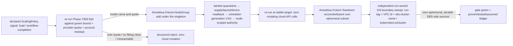

# Phase 37: Dynamic node provisioning by signal + leak-free provider gate

**Status**: Authoritative source
**Supersedes**: N/A
**Referenced by**: DEVELOPMENT_PLAN/README.md, DEVELOPMENT_PLAN/overview.md, DEVELOPMENT_PLAN/phase_08_storage_geometry_folds.md, DEVELOPMENT_PLAN/phase_09_execution_accelerator_folds.md, DEVELOPMENT_PLAN/phase_34_provider_deploy_checkpoint.md, DEVELOPMENT_PLAN/phase_35_provider_child_bringup.md, DEVELOPMENT_PLAN/phase_36_provider_ebs_credential.md, DEVELOPMENT_PLAN/phase_42_test_topology_dsl.md
**Generated sections**: none

> **Purpose**: Make a provider child's worker-node set declarative and reactive — grown and shrunk by a typed
> `ScalingPolicy` signal as *just another reconcile*, quota-bounded before any cloud mutation — and close the
> provider arm with the phase gate that spins an EKS cluster up from a linux-cpu parent, provisions an extra node
> by signal, verifies a zero-mutation no-op, and tears the per-run stack down **leak-free under a broadened,
> run-owned OS-boundary cloud sweep** while the durable per-PV EBS is correctly retained.

---

## Phase Status

📋 Planned. Nothing in this phase is implemented; every sprint below is 📋 Planned and every prescriptive
statement is design intent, never a tested amoebius result. This phase runs on the **linux-cpu → provider**
substrate in **Register 3** (live infrastructure): the parent amoebius cluster is a single-node `kind` cluster on
linux-cpu (the [Phase 17](phase_17_midwife_bootstrap_kind.md) midwife), from inside which the
Deployment-`replicas=1` singleton issues the provider node-group mutations over the cloud API. `→ provider`
names the *deploy target class* — a cloud-managed EKS cluster reached over the cloud API — not a fifth hardware
substrate; the provider child has no host, so the gate stays single-substrate (`linux-cpu`) while exercising a
provider target ([`development_plan_standards.md` §L](development_plan_standards.md#l-one-substrate-discipline)).
This sub-phase **layers on** its three provider siblings — [Phase 34](phase_34_provider_deploy_checkpoint.md)
(the provider-cluster Pulumi deploy + Vault-Transit-enveloped MinIO checkpoint + `observeProviderAccount`),
[Phase 35](phase_35_provider_child_bringup.md) (the stateless hostless in-cluster singleton + capacity-scheduler
roles + parent→child Lease handoff), and [Phase 36](phase_36_provider_ebs_credential.md) (per-PV EBS decoupled
from the node lifecycle + the create-vs-delete credential + static EBS CSI) — and owns dynamic node provisioning
and the composed phase gate. The reconcile-not-state-machine shape and a working EKS deploy are generalized from
the sibling **prodbox** project — read as **sibling evidence, not an amoebius result** (honesty rule,
[`development_plan_standards.md` §K](development_plan_standards.md#k-honesty-proven--tested--assumed)). Status
transitions are recorded reverse-chronologically here once work begins.

## Phase Summary

This sub-phase owns the **reactive-node arm** of the managed-provider axis and the **leak-free provider gate**
that closes the arm. It owns two things and stops there.

First, **dynamic node provisioning by signal**. The provider child's node set is itself declarative: an
`Amoebius.Cluster.NodeProvisioner` reads the declared elastic-node rule — a typed `ScalingPolicy`
([`resource_capacity_doctrine.md §6`](../documents/engineering/resource_capacity_doctrine.md#6-growable--scalingpolicy-the-quota-bounded-dynamic-provisioning-arm))
driven by **load** and **workflow completion** (spot-instance-cost-driven scaling is a declared future signal
class, deferred and not exercised by this phase's gate corpus or seeded mutants) — computes the desired node
set, and drives the live set toward it through the [Phase 19](phase_19_object_reconciler.md)
`discover → diff → enact → re-observe` reconciler, with no bespoke node state machine. Provisioning a node is
one more reconcile pass over the desired node set in the root `InForceSpec`; the elasticity rule lives **only**
on the deployment-rules DSL surface ([`app_vs_deployment_doctrine.md §3`](../documents/engineering/app_vs_deployment_doctrine.md#3-the-deployment-rules-surface--how-the-same-app-runs)),
and an app never asks for nodes. Each provisioning step selects only a named `ProviderNodeClass` whose complete
capacity/capability shape — catalog-pinned SKU, allocatable CPU plus finite overcommit policy, memory, `podSlots`,
CNI/IP `cniSlots`, driver-indexed `attachableVolumes`, a `PerInstanceDiskTemplate` with raw
`InstanceStore.provisionedRawBytes` or an `EphemeralRootEbs` policy and usable
`ProviderUsableDiskCarveTemplate.requiredUsableBytes` system/layout carves, OCI content/snapshot model and
image-pull policy, accelerator-slot templates, zones, price, provider-vCPU cost, and base/maximum counts — can
host the pending `ResourceEnvelope`. The step re-runs the full placement/storage/capability fold against the
grown bound ([Phase 7](phase_07_capacity_core_folds.md) placement, [Phase 8](phase_08_storage_geometry_folds.md)
storage geometry, [Phase 9](phase_09_execution_accelerator_folds.md) execution/accelerator residency) and proves
the policy's worst-case instance count, vCPU, ephemeral node-root EBS bytes/count, durable bytes/count, and
accelerator allocation remain inside **both** the declared node-class maxima and the freshly observed provider
account residual. The cloud quota is the outer ceiling, so a bounded budget grows only through the policy and
never to "unbounded." Enaction — `Amoebius.Pulumi.NodeGroup` add/drain under the singleton against the encrypted
MinIO backend — runs through the [Phase 11](phase_11_provision_seal.md) post-bind observe-then-plan boundary and
seals nothing until receipt-bound provider readback. Join is quarantined behind the `ManagedCapacity` taint,
full supply/layout/device observation, and a [Phase 20](phase_20_capacity_scheduler.md) scheduler-generation CAS;
an `Unreachable` node observation **refuses** rather than stranding an EC2 instance.

Second, the **phase gate** (Sprint 37.2): a single `.dhall` that, from a linux-cpu parent, spins up the EKS
provider cluster ([Phase 34](phase_34_provider_deploy_checkpoint.md)), converges its stateless in-cluster
control plane ([Phase 35](phase_35_provider_child_bringup.md)), dynamically provisions an extra node **by
evaluating a declared signal rule** (Sprint 37.1), binds the Pulumi-created durable EBS through the static
`ebs.csi.aws.com` CSI PV and writes a run-unique marker ([Phase 36](phase_36_provider_ebs_credential.md)),
verifies a **zero-mutation** no-op reconcile against the still-standing stack, then tears the per-run cluster
stack down **leak-free**. Leak-freedom is defined by an independent OS-boundary cloud-API sweep — never the
implementation's own evidence — and this phase **broadens** that sweep from tag-only enumeration to
**run-owned** enumeration keyed additionally on the run's VPC id and the `eks:cluster-name` /
`kubernetes.io/cluster/<name>` ownership tags, so **untagged** provider-spawned orphans (the EKS control-plane
CloudWatch log group, auto-created ENIs, auto IAM roles, CCM/LoadBalancer-controller ELBs) are caught, not only
those bearing the amoebius run tag. The retained durable per-PV EBS is the **sole** permitted survivor by class
(a retained durable volume is not a leak — it is its class behaving correctly); its elevated-harness reclamation
is [Phase 42](phase_42_test_topology_dsl.md) work, deferred and never depended on here.

**Substrate:** linux-cpu → provider — the [§L](development_plan_standards.md#l-one-substrate-discipline)
Parent-drives-provider escape form. The acceptance gate runs on exactly one hardware substrate, the linux-cpu
parent `kind` cluster from inside which the singleton issues the deploy/node-group mutations; `→ provider` (EKS)
is the declared managed-engine deploy target, not a detected substrate
([`substrates.md` §2](substrates.md#2-substrate-inventory)).

**Register:** 3 (live infrastructure) — the gate spins up real provider resources, provisions a real node by a
real signal, and tears them down under a real cloud-API sweep; no register-1/2 in-process check discharges it.
The emitted ledger marks provider bring-up + signal-driven node join and per-run leak-freedom *tested* on the
EKS target from a linux-cpu parent, durable-EBS retention *correct-by-class*, and the elevated-harness durable
reclamation *explicitly deferred to [Phase 42](phase_42_test_topology_dsl.md)*.

**Gate:** an `InForceSpec` (`test/dhall/phase_37_provider_provision.dhall`) that, from a **linux-cpu** parent,
spins up a provider-managed EKS cluster, brings up its stateless hostless in-cluster control plane, **dynamically
provisions an extra node by evaluating a declared `ScalingPolicy` signal** (not by an operator hand-editing the
target) from a named CPU-only `ProviderNodeClass`, and observes it join — already `ManagedCapacity`-tainted,
past full supply/layout/device readback and scheduler-generation CAS — with allocatable capacity at least the
declaration; the complete worst-case elastic envelope must provision inside the node-class maxima and the
owner-distinct provider quota **before the first cloud mutation**, with the committed over-quota and
missing-capability negatives rejected with zero mutating AWS calls; the gate then verifies a **zero-mutation**
no-op reconcile against the still-standing stack and **tears the per-run cluster stack down leak-free** — VPC,
control plane, node group, and the provisioned node all destroyed with **zero** surviving ephemeral-class
resources under the broadened run-owned OS-boundary sweep (run-tag **and** VPC-id **and**
`eks:cluster-name` / `kubernetes.io/cluster/<name>` keyed, catching untagged provider-spawned orphans), with the
durable per-PV EBS the sole permitted survivor by class. The gate turns **red** on ≥1 committed seeded mutant —
minimally `mut-37.1-ignore-signal`, `mut-37.1-apply-over-quota`, `mut-37.2-skip-sweep`, **and the new
`mut-37-untagged-orphan`** (which leaves an *untagged* provider-spawned orphan a tag-only sweep would miss). The
complete apparatus — inherited fixtures, committed mutants, and the independent reference predicates — is named
in [`## Gate integrity`](#gate-integrity); the gate line above delegates to it by anchor per
[`development_plan_standards.md` §M](development_plan_standards.md#gate-integrity-delegation).

## Gate integrity

> **Shared provider corpus (by design).** The `test/dhall/phase_30_provider_provision.dhall` topology and the `mut-30.*` mutant family are the one committed corpus deliberately shared across the four provider sub-phases (Phases 34–37; see [Phase 34](phase_34_provider_deploy_checkpoint.md)) — this sub-phase gates its own slice, not accidental double-ownership.
This section carries this sub-phase's **slice** of the source Phase-30 provider gate apparatus, partitioned
along the dynamic-node + leak-free-teardown seam (per
[`development_plan_standards.md` §M](development_plan_standards.md#m-gate-integrity-a-gate-cannot-be-passed-by-a-stub)).
The deploy/checkpoint/execve apparatus (`test/goldens/checkpoint_envelope.json`, `test/goldens/engine_execve.txt`,
`test/negatives/host_shell_pulumi_up.sh`, and the `mut-34.*-static-key` / `mut-34.*-leak-path` /
`drop-parallel-executor` mutants) stays in [Phase 34](phase_34_provider_deploy_checkpoint.md); the bootstrap
scheduler / add-on cutover / Lease-handoff apparatus (the `public-pull` and hostless-`LinuxHost`-foreclosure
tags) stays in [Phase 35](phase_35_provider_child_bringup.md); the per-PV-EBS credential apparatus
(`test/goldens/ebs_credential_matrix.txt`, `test/fixtures/phase30/ebs_csi_bake_expected.dhall`, and the
`allow-delete` / `enable-dynamic-provisioner` / `credit-old-before-observed-delete` / `drop-copy-executor`
mutants) stays in [Phase 36](phase_36_provider_ebs_credential.md). This phase inherits only the reactive-node
and teardown slice below; the **composed** gate (Sprint 37.2) additionally re-runs the named sibling mutants and
cites them to their owning sub-phase.

**Oracle-pinning (§M.1).** Every fixture, expected error/outcome tag, and reference table this gate checks
against is authored and **committed in Phase 0**, before `Amoebius.Cluster.NodeProvisioner` /
`Amoebius.Pulumi.NodeGroup` / `Amoebius.Pulumi.Teardown` exist — no oracle is regenerated from the
implementation's own output, and it is authored independently of the code under test (§M.3):

- **Representative set (§M.7)** — `test/dhall/phase_37_provider_provision.dhall`: one `Managed Eks` control
  plane, one base managed node group (size 1), one dynamically provisioned **extra node from the same**
  `ProviderNodeClass` driven by a **workflow-completion** `ScalingPolicy`, two named CPU-only provider node
  classes (selected and fallback) whose exact allocatable CPU plus finite overcommit policy, memory, per-instance
  raw root-disk backing, `ProviderUsableDiskCarveTemplate` system reserve and layout-indexed usable filesystem
  carves, image content/snapshot model and pull concurrency, zones, prices, provider-vCPU costs, base/maximum
  counts, pod-slot/`ebs.csi.aws.com` attach-slot policies, and explicit `accelerator = None` offerings are
  committed. The selected class uses `EphemeralRootEbs` with a `Unified` layout (it cannot invent SKU-local
  instance storage). A provider quota bounding maximum instances/vCPU, accelerator allocation, ephemeral
  node-root EBS bytes/count, and durable EBS bytes/count; a checkpoint `StorageBudget`; one declared
  Availability Zone shared by the node group and one per-PV EBS volume (durable class) attached to a
  single-replica StatefulSet claim `<ns>/sts0/pv_0` through a static `ebs.csi.aws.com` PV; a run-unique marker
  written through that claim; and the operational create-only credential are all in the fixture. Both exercised
  signal classes (**workflow-completion**, **load**) are named committed corpus.
- **Committed one-field negatives (§M.8), each paired with a positive differing only in the foreclosed
  dimension**: `test/dhall/phase_37_provider_over_quota.dhall` (elastic maximum count exceeds the pinned provider
  instance/vCPU quota while every node-class field remains valid) and
  `test/dhall/phase_37_provider_missing_capability.dhall` (the elastic class's explicit `accelerator = None`
  paired with a CUDA workload demand and no CUDA offering). Companion one-field fixtures separately exhaust
  node-root EBS count, node-root EBS bytes, durable bytes, pod slots, and live `CSINode` `ebs.csi.aws.com` attach
  slots, and a replacement-overlap fixture that fits steady state but not old+new root volumes.
- **Independent reference predicates (§M.3)** — authored by hand in Phase 0, never a re-derivation of the fold
  under test:
  - `test/goldens/provider_ephemeral_sweep_expected.txt` — the expected result of the independent leak-free
    sweep: **zero** ephemeral-class resources under the **broadened run-owned enumeration** (see below), with the
    retained durable per-PV EBS the sole permitted survivor by class, enumerated by resource class rather than by
    a single tag key.
  - `test/goldens/provider_two_instance_identity_map.txt` — the expected distinct-per-instance identity map for
    two nodes materialized from one `ProviderNodeClass`: each `ProviderInstanceId { account, cluster, class,
    ordinal }` × complete disk/carve/accelerator-slot template path maps to a distinct concrete backing/carve/
    device id, and the capacity fold charges the per-instance bytes/devices twice.
  - The expected outcome tags `RefuseOnUnreachable`, `NoPodSlotCover`, `NoCsiAttachSlotCover`,
    `MissingCapability Cuda`, and the structured quota-overcommit / `SharedSupplyOvercommit` errors.

**The broadened, run-owned OS-boundary sweep (§M.5) — the P30 confirmed C3 fix.** "No orphans / leak-free" means:
after teardown, an **independent read-only cloud-API sweep** — direct AWS `Describe*` queries under a distinct
read-only audit credential, explicitly **NOT** the emptied Pulumi checkpoint and **NOT** the managed-resource
registry's own `discover` (both of which the teardown itself just drove, and neither of which can see
provider-spawned out-of-registry orphans) — returns **zero** ephemeral-class resources. The source Phase-30
sweep scoped enumeration to the run's unique test tag `amoebius:test-run=<run-id>` alone; a **tag-only** sweep
cannot see resources the cloud/EKS control plane or in-cluster controllers spawn **without** that tag. This phase
therefore **keys the enumeration additionally on the run's VPC id and the `eks:cluster-name` /
`kubernetes.io/cluster/<name>` ownership tags**, so the sweep is *run-owned*, not *run-tagged*: it enumerates,
by resource class and by cluster/VPC ownership, the EKS control-plane CloudWatch log group, auto-created ENIs,
auto IAM roles/instance profiles, and CCM/LoadBalancer-controller-created ELBs/target groups **even though they
carry no amoebius run tag**. Any non-empty run-owned enumeration (ephemeral-class) fails the run and its leak
list is recorded in the ledger. "Converges as a no-op" applies only to the second reconcile against the
still-standing stack: the OS-boundary cloud-API mutating-call audit trail (a CloudTrail-equivalent log external
to the reconciler, §M.6) records **zero** mutating create/modify/delete calls — not exit 0, not the reconciler's
self-reported empty diff.

**Committed seeded mutants (§M.2), ≥1 must go red; re-run every gate, never hand-run once.** Owned by this seam:

| Mutant | Operator | Must go red on |
|--------|----------|----------------|
| `mut-37.1-ignore-signal` | dropped effect | `ScalingPolicy` signal fields decoded but never consumed (a node moves only on a hand-edited target); under signal-only drive it never provisions — the closed-loop signal validation. |
| `mut-37.1-apply-over-quota` | guard weakening | attempts any Pulumi/AWS create/modify after the pure quota fold has already rejected the over-quota fixture; the zero-mutating-call audit. |
| `mut-37.1-unreachable-as-gone` | guard negation | treats an `Unreachable` node observation as `Absent` and prunes it; the `RefuseOnUnreachable` teardown-refusal assertion. |
| `mut-37.1-ignore-live-csinode` | dropped guard | admits workload against the declared SKU attach policy while the live `CSINode` `ebs.csi.aws.com` residual is one attachment short; the `NoCsiAttachSlotCover` cover. |
| `mut-37.1-dedup-distinct-pvcs` | quantifier flip | deduplicates old vs replacement PVCs as one attachment; the migration attach-slot cover. |
| `mut-37.1-template-id-as-physical` | effect swap | reuses a class-local template id as both nodes' physical id; the two-instance identity map. |
| `mut-37.2-skip-sweep` | dropped `UNCHANGED` | teardown that leaves one **tagged** provider-spawned ELB behind, invisible to the registry `discover` but visible to the tag-keyed sweep; the independent sweep (necessary but **not sufficient**). |
| **`mut-37-untagged-orphan`** | dropped effect | teardown that leaves an **untagged** provider-spawned orphan — an EKS control-plane CloudWatch log group / auto ENI / auto IAM role / CCM-created ELB bearing **no** `amoebius:test-run` tag. A tag-only sweep passes it; it **MUST go red only on the broadened run-owned sweep** keyed on VPC id + `eks:cluster-name` / `kubernetes.io/cluster/<name>`. This is the C3-fix teeth: `mut-37.2-skip-sweep` alone would let a tag-only sweep look sufficient, and is thereby foreclosed. |

The composed gate additionally re-runs (and requires red from) the sibling-owned `drop-parallel-executor`
([Phase 34](phase_34_provider_deploy_checkpoint.md)), and `credit-old-before-observed-delete` / `allow-delete`
([Phase 36](phase_36_provider_ebs_credential.md)) mutants against the full-stack fixture, cited to their owning
sub-phase and never re-authored here.

**Machine-derived ledger + validator (§M.6, §K).** Each gate cycle emits a proven/tested/assumed ledger
generated from the raw run record (the node-group `RunInstances` stack ids, the signal→scale correlation from the
cloud-API audit trail, the joined-node capability readback, the no-op-reconcile mutating-call count, the
run-owned sweep result and any leak list, the two-instance identity map, and the durable-EBS retention/identity/
AZ), and a committed validator cross-checks every ledger figure against the raw run record and the OS-boundary
observers, failing the gate on any mismatch or hand-edited field. Skipping an applicable teardown-observation
move (including the broadened sweep) marks that layer **UNVERIFIED**, never green.

## Doctrine adopted

- [`cluster_lifecycle_doctrine.md §8`](../documents/engineering/cluster_lifecycle_doctrine.md#8-dynamic-node-provisioning)
  — *dynamic node provisioning* — with
  [`§9`](../documents/engineering/cluster_lifecycle_doctrine.md#9-how-bring-up-and-teardown-are-implemented-the-reconciler-not-a-state-machine)
  (*bring-up and teardown are a reconciler, not a state machine*): this phase makes the node set declarative so
  provisioning a node is one more pass of the [Phase 19](phase_19_object_reconciler.md)
  `discover → diff → enact → re-observe`, `Unreachable → refuse` reconciler, and per-run teardown is one
  `reconcileAbsent` over the owned ephemeral subset with "cannot observe" never collapsed to "absent."
- [`resource_capacity_doctrine.md §6`](../documents/engineering/resource_capacity_doctrine.md#6-growable--scalingpolicy-the-quota-bounded-dynamic-provisioning-arm)
  and [`§3.1`](../documents/engineering/resource_capacity_doctrine.md#31-the-systematic-provision-matrix)
  — *`Growable` / `ScalingPolicy`: the quota-bounded dynamic-provisioning arm* and *the systematic provision
  matrix*: dynamic node provisioning is the runtime enaction of a typed `ScalingPolicy`; every provider node
  class declares its complete capacity/capability shape, the workload is provisioned against the worst-case
  elastic count, and the provider quota is the outer ceiling. A bounded budget grows only through the policy and
  never to "unbounded"; failure of any CPU, memory, pod-ephemeral (including the in-cluster cache-owner
  `emptyDir` as a **[Phase 7](phase_07_capacity_core_folds.md) logical local-ephemeral debit** — see below),
  pod/CSI slot, durable-storage, accelerator, VRAM, or provider-quota obligation rejects before cloud mutation.
- [`pulumi_iac_doctrine.md §4`](../documents/engineering/pulumi_iac_doctrine.md#4-what-pulumi-provisions-the-resource-catalog)
  (*the resource catalog* — the dynamic-node entry) with
  [`§3`](../documents/engineering/pulumi_iac_doctrine.md#3-state-lifetime-matches-resource-lifetime-per-class)
  (*state lifetime matches resource lifetime, per class*) and
  [`§8`](../documents/engineering/pulumi_iac_doctrine.md#8-how-deploys-are-enacted-the-reconciler-referenced-not-restated)
  (*deploys are enacted by the reconciler, not a global state machine*): `Amoebius.Pulumi.NodeGroup` realizes the
  catalog's dynamic-node entry as a Pulumi add/drain under the singleton against the encrypted MinIO backend; the
  ephemeral node (and its optional node-root EBS) is per-run class and dies with its run, while the durable per-PV
  EBS ([Phase 36](phase_36_provider_ebs_credential.md)) is a distinct retained class the per-run teardown never
  touches.
- [`app_vs_deployment_doctrine.md §3`](../documents/engineering/app_vs_deployment_doctrine.md#3-the-deployment-rules-surface--how-the-same-app-runs)
  — *the deployment-rules surface*: node elasticity lives on the deployment-rules DSL surface; an app never asks
  for nodes.
- [`daemon_topology_doctrine.md §3.1`](../documents/engineering/daemon_topology_doctrine.md#31-exactly-one-pod-is-a-k8setcd-property-not-an-amoebius-election)
  — *exactly one pod is a k8s/etcd property, not an amoebius election*: the `NodeProvisioner` enaction runs under
  the Deployment-`replicas=1` singleton whose single-instance is a k8s/etcd concern, so nothing in this phase
  runs a bespoke leadership election; scheduler reservation/Binding at node join is capacity authority
  ([Phase 20](phase_20_capacity_scheduler.md)), not singleton election.
- [`storage_lifecycle_doctrine.md §5.1`](../documents/engineering/storage_lifecycle_doctrine.md#51-storage-is-independent-of-the-node-lifecycle)
  and [`§7.1`](../documents/engineering/storage_lifecycle_doctrine.md#71-the-single-exception-the-elevated-test-harness)
  — *storage is independent of the node lifecycle* / *the single exception — the elevated test harness*: a
  destroyed/replaced EC2 node detaches its EBS and the durable volume survives; the retained durable per-PV EBS
  is the sole permitted survivor of the leak-free sweep by class, and the *reclamation* of that durable
  test-flagged EBS by the elevated harness is [Phase 42](phase_42_test_topology_dsl.md) work, referenced and
  never invoked here.
- [`chaos_failover_doctrine.md §12`](../documents/engineering/chaos_failover_doctrine.md#12-the-moral-core--proven-tested-assumed)
  — *proven, tested, assumed*: each gate cycle emits a proven/tested/assumed ledger; skipping an applicable
  teardown-observation move (including the broadened run-owned sweep) marks that layer UNVERIFIED, never green.

## Sprints

## Sprint 37.1: Dynamic node provisioning by signal 📋

**Status**: Planned
**Implementation**: `amoebius-runtime/src/Amoebius/Cluster/NodeProvisioner.hs` (declarative node-set reconcile),
`amoebius-pulumi/src/Amoebius/Pulumi/NodeGroup.hs` (Pulumi add/drain of EC2/managed nodes) (target paths from
[system_components.md](system_components.md); not yet built)
**Blocked by**: [Phase 34](phase_34_provider_deploy_checkpoint.md) gate (the provider-cluster Pulumi
deploy/engine/encrypted-MinIO backend and `observeProviderAccount`, which this sprint reuses to add/drain a node
group and re-read the account residual); [Phase 26](phase_26_live_dsl_singleton.md) gate (the
Deployment-`replicas=1` singleton the enaction runs under); [Phase 7](phase_07_capacity_core_folds.md) gate (the
`fits`/`carve`/`place` capacity fold re-run against the grown bound); [Phase 8](phase_08_storage_geometry_folds.md)
gate (the logical→physical node-root/durable storage geometry); [Phase 9](phase_09_execution_accelerator_folds.md)
gate (the accelerator residency / net-allocatable-VRAM fold); [Phase 11](phase_11_provision_seal.md) gate (the
post-bind observe-then-plan cloud batch and opaque `ProvisionedSpec` seal); [Phase 19](phase_19_object_reconciler.md)
gate (the `discover → diff → enact → re-observe` reconciler this drives); [Phase 20](phase_20_capacity_scheduler.md)
gate (the `amoebius-capacity` scheduler-generation CAS / reservation / exclusive Binding at node join) — all
earlier-or-sibling-phase prerequisites.
**Independent Validation**: a `.dhall`-declared node rule (load / workflow-completion) drives the live node set
toward its desired shape by choosing only a declared `ProviderNodeClass` whose complete capacity/capability shape
can host the pending `ResourceEnvelope`; raising the declared target provisions an EC2/managed node that joins
the cluster; lowering it drains and releases the node; re-running converges as a no-op. Join is quarantined: the
kubelet registers with the `ManagedCapacity` taint from its first observable Node state, complete supply/layout/
device readback precedes scheduler target/config-root extension, and only fresh node-scoped taint/admission/
Binding authority makes it eligible. An `Unreachable` node observation **refuses** rather than charging ahead. A
worst-case elastic shape with `baseCount > maxCount`, aggregate base supply outside quota, worst-case growth
outside the declared maximum-count/provider-quota envelope, or a demand for which no class offers the required
CPU, memory, logical pod-ephemeral capacity (including the in-cluster cache-owner `emptyDir`'s
[Phase 7](phase_07_capacity_core_folds.md) local-ephemeral debit), layout-routed nodefs/imagefs physical
capacity, pod slots, driver-specific CSI attach slots, accelerator family/device count or net-allocatable-memory
residency capacity, or whose node-root EBS or durable demand exceeds its distinct provider storage quota, is
rejected before any cloud mutation.
**Docs to update**: `documents/engineering/cluster_lifecycle_doctrine.md` (§8),
`documents/engineering/pulumi_iac_doctrine.md` (§4 — the dynamic-node catalog entry),
`documents/engineering/app_vs_deployment_doctrine.md` (node elasticity as a deployment rule, never app logic),
`documents/engineering/resource_capacity_doctrine.md` (§6/§3.1 — the live node-scaling enaction),
`DEVELOPMENT_PLAN/system_components.md`.

### Objective

Adopt [`cluster_lifecycle_doctrine.md §8 — Dynamic node provisioning`](../documents/engineering/cluster_lifecycle_doctrine.md#8-dynamic-node-provisioning)
and the dynamic-node catalog entry in [`pulumi_iac_doctrine.md §4 — What Pulumi provisions`](../documents/engineering/pulumi_iac_doctrine.md#4-what-pulumi-provisions-the-resource-catalog):
make the provider child's node set **declarative and reactive** — grown and shrunk by a typed `ScalingPolicy`
signal, not by hand — so provisioning a node is *just another reconcile* over the desired node set in the root
`InForceSpec`, living on the deployment-rules surface and never inside an app's logic, quota-bounded before any
cloud effect.

### Deliverables

- An `Amoebius.Cluster.NodeProvisioner` that reads the declared elastic-node rule — a typed `ScalingPolicy`
  ([`resource_capacity_doctrine.md §6`](../documents/engineering/resource_capacity_doctrine.md#6-growable--scalingpolicy-the-quota-bounded-dynamic-provisioning-arm))
  driven by **load** and **workflow completion** (spot-instance-cost-driven scaling is a declared future signal
  class, deferred and not exercised by this phase's gate corpus or seeded mutants) — computes the desired node
  set, and drives the live set toward it through the [Phase 19](phase_19_object_reconciler.md) reconciler; no
  bespoke node state machine. Each provisioning step selects from named `ProviderNodeClass` values carrying a
  catalog-pinned provider SKU, allocatable CPU plus finite overcommit policy, memory, `podSlots`, CNI/IP
  `cniSlots`, driver-indexed `attachableVolumes`, a `PerInstanceDiskTemplate` with raw
  `InstanceStore.provisionedRawBytes` or an `EphemeralRootEbs` policy and usable
  `ProviderUsableDiskCarveTemplate.requiredUsableBytes` system/layout carves, OCI content/snapshot model and
  image-pull policy, per-instance accelerator-slot/link templates, zones, price, provider-vCPU cost, and
  base/maximum counts, re-runs the full placement/storage/capability fold against the grown bound, and proves the
  policy's worst-case instance count, vCPU, ephemeral node-root EBS bytes/count, durable bytes/count, and
  accelerator allocation remain inside both the declared carve and the freshly observed account residual (the
  [Phase 34](phase_34_provider_deploy_checkpoint.md) `observeProviderAccount` boundary re-read). SKU raw
  shape/zone/price/quota-cost and provider volume allocation rules are re-cross-checked. Old and new root volumes
  remain simultaneously charged during replacement until a fresh observation proves deletion. The cloud quota is
  the outer ceiling, so a bounded budget grows only through this policy and never to "unbounded."
- An `Amoebius.Pulumi.NodeGroup` enaction that adds an EC2/managed node (Pulumi, under the singleton, encrypted
  backend) and drains+releases one when demand or the workflow recedes; node lifetime is the per-run/ephemeral
  class. Its optional root EBS is an explicitly quota-debited **ephemeral node-root** class destroyed with the
  node; it is distinct from [Phase 36](phase_36_provider_ebs_credential.md)'s retained durable class. Every
  add/drain runs through the [Phase 11](phase_11_provision_seal.md) observe-then-plan boundary and seals nothing
  until receipt-bound provider readback; a fresh-observation change after a fitting `ValidatedCloudProviderAction`
  is minted invalidates it on the immediate token recheck with zero node-group/instance mutation.
- A staged managed-node join/leave protocol. Provider launch data makes the kubelet register with the exact
  `ManagedCapacity` taint before any schedulable observation; a missing/late taint quarantines the target and
  rejects the action. Read-only inventory authenticates provider instance→Node UID, allocatable CPU/memory/
  logical ephemeral, filesystem roots/backings/models, pod/CNI/CSI slots, and accelerator/device materialization
  against the provisioned node target. Whole-root CAS then adds the target and its exact reservation templates to
  the active [Phase 20](phase_20_capacity_scheduler.md) scheduler generation. Only an independent readback of
  that generation plus node taint, identity admission, exclusive Binding writer, and absence of foreign/
  default-scheduled Pods admits custom-scheduled DaemonSets and workloads. Removal first stops new placement,
  drains and retains all observed/ledger/device/attachment artifacts, CAS-removes the target only after release,
  and only then permits cloud deletion.
- Atomic placement spends one pod slot per simultaneously live pod and one driver-scoped attachment per unique
  mounted CSI PVC. Repeated mounts of one PVC deduplicate; distinct old/replacement PVCs do not. DaemonSets,
  Pulumi/copy Jobs, controller children, surge, old/new, and terminating pods all enter the same overlap. For
  each candidate node the usable ceiling is the lesser of declared policy, kubelet `status.allocatable.pods` /
  remaining CNI IPs, and live `CSINode`/SKU attachment limits; unknown observation or a lower live limit removes
  the candidate **before** provisioning rather than waiting for scheduler/attach failure.
- Three-valued, fail-closed node observation: a node that cannot be observed (`Unreachable`) refuses the teardown
  step rather than being silently treated as gone — no stranded EC2.
- The elasticity rule expressed **only** on the deployment-rules DSL surface
  ([`app_vs_deployment_doctrine.md §3`](../documents/engineering/app_vs_deployment_doctrine.md#3-the-deployment-rules-surface--how-the-same-app-runs));
  an app never asks for nodes.

### Validation

1. **Closed-loop, signal-driven** provisioning (forecloses a static hand-edited replica knob): deploy a fixed
   `ScalingPolicy` rule and then drive **only the signal**, with **no edit to the `.dhall` or the node target
   between observations** — for the **workflow-completion** class, start and later finish a workflow; for the
   **load** class, apply and later remove synthetic load — and assert the extra node is provisioned solely by the
   rule's evaluation of the signal, joins, and is later reclaimed when the signal recedes. A run in which the node
   target was operator-mutated is **invalid**. The scale event and its trigger are read from an **OS-boundary
   observer** (the cloud-API mutating-call audit trail correlating the `RunInstances`/node-group modify to the
   signal event, §M.5), not the provisioner's self-report. Both signal classes (workflow-completion, load) are
   named committed corpus (§M.7). The committed seeded mutant `mut-37.1-ignore-signal` (a provisioner whose
   `ScalingPolicy` signal fields are decoded but never consumed — a node moves only on a hand-edited target) MUST
   go **red** on this validation (§M.2): under signal-only drive it never provisions.
2. Re-run the reconcile at a stable target and assert a no-op, defined observably as **zero mutating cloud-API
   calls** in the OS-boundary audit trail on run 2 (§M.5/§M.6) — not exit 0 and not the reconciler's
   self-reported empty diff.
3. Inject an `Unreachable` node observation during release and assert the reconciler **refuses** rather than
   pruning a node it cannot confirm absent, and assert the specific outcome tag `RefuseOnUnreachable` (§M.8),
   paired with the positive `Absent`-observation case that differs only in observability and *does* prune. The
   committed mutant `mut-37.1-unreachable-as-gone` (treating `Unreachable` as `Absent`) MUST go red here.
   Join-race fixtures separately delay the launch taint, schedule a default-scheduler Pod before config
   extension, use a stale scheduler generation, omit the Node UID/provider-instance binding, or expose the node
   before full supply/layout/device readback. Each must quarantine/refuse before workload Binding. A positive
   audit trace proves the first non-bootstrap Pod on the node was custom-scheduled after reservation CAS and the
   node-scoped authority readback.
4. Run the committed one-field negative `test/dhall/phase_37_provider_over_quota.dhall`, whose elastic maximum
   count exceeds the pinned provider instance/vCPU quota while every node-class field remains valid. From
   provider-stack-absent state, `planInfrastructure`/`validateInfrastructurePlan` must return the structured
   quota-overcommit error **before** invoking Pulumi; the external cloud-API mutating-call audit must remain
   empty. A paired positive differing only in maximum count provisions infrastructure, observes its
   consumed-token materialization, and only then seals `ProvisionedSpec`; the committed `mut-37.1-apply-over-quota`
   mutant MUST go red for issuing any create/modify call after that rejection. Paired one-field fixtures
   separately exhaust node-root EBS count and bytes while durable headroom remains, and exhaust durable bytes
   while node-root headroom remains; each rejects before mutation, proving the ledgers cannot substitute for one
   another. A replacement-overlap fixture fits steady state but not old+new root volumes and must also reject.
5. Give two child-cluster demands the same `CloudAccountId` and per-cluster quotas that each fit alone but exceed
   the observed account quota together. `allocateForestSupply` must return `SharedSupplyOvercommit` before either
   Pulumi stack mutates; independently treating both declarations as the full account ceiling is a committed
   mutant that must turn this red. Separately, make the declaration fit while AWS Service Quotas minus current
   `DescribeInstances`/`DescribeVolumes` usage is one unit short; the [Phase 34](phase_34_provider_deploy_checkpoint.md)
   `ObservedProviderAccount` refuses with zero mutating calls (this sprint re-reads that boundary and honors its
   refusal; it does not re-implement it).
6. Fit CPU, memory, storage bytes, and regional EBS count, then make the aggregate simultaneous pod count one
   above every candidate's lesser declared/kubelet/CNI slot residual; provisioning must return `NoPodSlotCover`
   before cloud mutation. In a paired CSI fixture, keep pod slots ample but make one node's live `CSINode`
   `ebs.csi.aws.com` residual one attachment below the unique-PVC set while the SKU declaration is higher; it
   returns `NoCsiAttachSlotCover`. Repeated mounts of one PVC count once, whereas old and replacement PVCs in a
   migration count twice. The committed `mut-37.1-ignore-live-csinode` and `mut-37.1-dedup-distinct-pvcs` mutants
   MUST go red.
7. Run the committed `test/dhall/phase_37_provider_missing_capability.dhall`: replace the elastic class's
   explicit `accelerator = None` with a CUDA workload demand without adding a CUDA offering. The provision fold
   must return `MissingCapability Cuda` with zero cloud effects; it may not provision a larger CPU class or
   silently select a CPU execution path.
8. Reduce only the candidate's layout-selected physical backing below its OCI-content + snapshotter +
   concurrent-import + writable-rootfs peak, then separately make the observed kubelet pull policy differ from the
   declaration. Also inject a forbidden nodefs/imagefs alias, swap the configured roots, omit a content object or
   active snapshot from observation, and select `SplitImage` under containerd. Each returns the pinned
   image/layout/capability error before any node-group create/modify call; the cloud audit remains empty.
9. Materialize two nodes from the same `ProviderNodeClass`. The pure cover gives each combination of
   `ProviderInstanceId { account, cluster, class, ordinal }` and complete disk/carve/slot template path a distinct
   scoped symbolic disk/carve/accelerator-slot identity; after both nodes join, the API/cloud inventory must show
   distinct concrete backing, carve, and device ids attached to those slots, while the capacity fold charges the
   per-instance bytes/devices twice — checked against the committed `test/goldens/provider_two_instance_identity_map.txt`
   (§M.3). The committed `mut-37.1-template-id-as-physical` mutant reuses a class-local template id as both nodes'
   physical id and MUST go red before workload admission.
10. For an `EphemeralRootEbs` class, assert the launch-template request is the private integral-GiB
    `ProvisionedNodeRootVolumeRequest`, each joined node exposes the exact layout/mount/quota identities and
    usable capacities, and cloud inventory classifies those volumes as ephemeral node roots. Readback proves raw
    block bytes equal `provisionedBytes`, mounted usable bytes meet `requiredUsableBytes`, and filesystem
    presentation plus allocation minimum/quantum match the witness. A one-quantum-under request or launch template
    that leaves a default unbounded containerd root must turn the gate red. In the pure `InstanceStore` companion,
    assert `provisionedRawBytes` equals the catalog-pinned SKU device raw capacity, derive `mountedUsableBytes`
    through its filesystem presentation, and reject a system-reserve-plus-unique-carve sum one usable byte over
    that mounted capacity; raw and usable byte fields are never substituted.
11. Mutate only the provider machine type/catalog version so its real raw CPU/memory/local-disk/GPU-link shape
    cannot supply the declared net template, or make it unavailable in the declared zone. Catalog/SKU validation
    fails before create. Then change account usage or offering availability after a fitting
    `ValidatedCloudProviderAction` is minted; its immediate recheck invalidates it with zero node-group/instance
    mutations.

> **Honesty.** Dynamic provisioning driven by load/workflow signals is *design intent*; no amoebius
> node-provisioner has been built or measured. The reconcile-not-state-machine shape is *proven in prodbox* for
> AWS resources — sibling evidence, not an amoebius result. This phase provisions provider-managed worker nodes
> only; self-managed rke2 agents remain an unassigned future live gate. EKS Hybrid Nodes (a full stretched member
> node on a `Managed Eks` control plane) are a provider-native capability, type-foreclosed absent that arm, and
> DEFERRED.

### Remaining Work

The whole sprint (📋 Planned).

## Sprint 37.2: Phase gate — spin a provider cluster, provision a node by signal, tear down leak-free 📋

**Status**: Planned
**Implementation**: `test/dhall/phase_37_provider_provision.dhall` (the gate topology),
`amoebius-pulumi/src/Amoebius/Pulumi/Teardown.hs` (per-run `reconcileAbsent` over the ephemeral cluster + node
subset), and the run-owned OS-boundary sweep harness that enumerates by run-tag + VPC id +
`eks:cluster-name` / `kubernetes.io/cluster/<name>` (target paths; not yet built)
**Blocked by**: Sprint 37.1; [Phase 34](phase_34_provider_deploy_checkpoint.md) gate (provider Pulumi deploy +
checkpoint + `observeProviderAccount`); [Phase 35](phase_35_provider_child_bringup.md) gate (bootstrap scheduler
readiness, add-on cutover, managed authority, parent→child Lease handoff, stateless in-cluster control plane);
[Phase 36](phase_36_provider_ebs_credential.md) gate (per-PV durable EBS, static `ebs.csi.aws.com` CSI PV over a
known `volumeHandle`, create-vs-delete credential, marker rebind).
**Independent Validation**: the gate `InForceSpec` starts from a linux-cpu parent, binds/expands the child, then
derives the provider cluster's initial `ProvisionedInfrastructurePlan` from that exact `BoundDeployment` against
the fixture's complete provider node-class and quota declarations before any cloud mutation — including exact
Pulumi executor/plugin/workspace/cache, checkpoint-object, pod-slot, CSI-attach, root/durable EBS geometry, and
provider byte/count ledgers — then validates the plan against a fresh provider snapshot, CAS-consumes the plan
and per-action tokens, observes the EKS endpoint/nodes/root volumes into a receipt-bound
`ObservedInfrastructureMaterialization`, constructs `ProvisionContext`, and only then seals the child
`ProvisionedSpec`. It first proves bootstrap scheduler readiness, add-on cutover, full managed authority, and
parent-bootstrap→child-singleton Lease handoff ([Phase 35](phase_35_provider_child_bringup.md)); then brings up
its stateless in-cluster control plane, dynamically provisions an extra node **by signal** (Sprint 37.1) and
observes that node join through the tainted quarantine / config-root / node-authority stages with the promised
allocatable/capability shape, binds the Pulumi-created EBS through the static CSI PV and writes a run-unique
marker ([Phase 36](phase_36_provider_ebs_credential.md)), verifies a **zero-mutation** no-op reconcile while the
stack is still standing, then tears the per-run cluster stack down leak-free (VPC + control plane + node group +
provisioned node all destroyed, no orphans under the **broadened run-owned sweep**), with any durable per-PV EBS
correctly retained; a second full cycle from provider-stack-absent state in the retained EBS's declared
Availability Zone recreates a static CSI PV over the same `volumeHandle`, reattaches the volume, and reads the
run-unique marker byte-for-byte before also finishing leak-free, and each cycle emits a proven/tested/assumed
ledger artifact.
**Docs to update**: `documents/engineering/pulumi_iac_doctrine.md` (§3, §8),
`documents/engineering/cluster_lifecycle_doctrine.md` (§9), `documents/engineering/testing_doctrine.md` (the
per-run ledger; the broadened run-owned sweep; durable-EBS reclamation deferred to
[Phase 42](phase_42_test_topology_dsl.md)), `DEVELOPMENT_PLAN/README.md`.

### Objective

Adopt [`pulumi_iac_doctrine.md §3 — State lifetime matches resource lifetime, per class`](../documents/engineering/pulumi_iac_doctrine.md#3-state-lifetime-matches-resource-lifetime-per-class)
and [`§8 — deploys are enacted by the reconciler`](../documents/engineering/pulumi_iac_doctrine.md#8-how-deploys-are-enacted-the-reconciler-referenced-not-restated),
with [`cluster_lifecycle_doctrine.md §9 — bring-up and teardown are a reconciler, not a state machine`](../documents/engineering/cluster_lifecycle_doctrine.md#9-how-bring-up-and-teardown-are-implemented-the-reconciler-not-a-state-machine):
assemble the phase gate — a single `.dhall` that brings a provider cluster up, provisions a node by signal, and
tears the **ephemeral class used by this per-run gate** down leak-free via one `reconcileAbsent` over the owned
subset, with `Unreachable → refuse` and the **broadened run-owned OS-boundary sweep backstop** (run-tag **and**
VPC-id **and** `eks:cluster-name` / `kubernetes.io/cluster/<name>` keyed), while the durable EBS class is
correctly left retained.

### Deliverables

- The gate `test/dhall/phase_37_provider_provision.dhall`: spin up the EKS provider cluster
  ([Phase 34](phase_34_provider_deploy_checkpoint.md)), first derive the complete app/platform demand and
  provision it against the named base/elastic node classes, the bounded cache demand charged within local
  ephemeral supply (the cache-owner `emptyDir` charged **once** inside the [Phase 7](phase_07_capacity_core_folds.md)
  logical local-ephemeral fold — **not** a second supply pool and **not** the [Phase 38](phase_38_determinism_jitcache.md)
  typed `CacheBudget`/jit-build construct, which is out of this phase's scope), parent executor Jobs and
  plugin/workspace volumes, exact checkpoint object demand / storage budget / mutation-gateway envelope, pod/CSI
  slots, durable EBS backing, and distinct provider root/durable bytes+count quotas; then converge its stateless
  in-cluster control plane ([Phase 35](phase_35_provider_child_bringup.md)), provision an extra node by a declared
  rule and observe it join only after node-scoped scheduler authority (Sprint 37.1), bind the Pulumi-created EBS
  through [Phase 36](phase_36_provider_ebs_credential.md)'s static CSI PV and write a run-unique marker through
  the retained-EBS claim, verify a no-op reconcile against the still-standing stack, then always tear down the
  per-run cluster + node; the repeated full cycle constrains the recreated node group to the recorded EBS
  Availability Zone, re-renders a PV over the same `volumeHandle`, and verifies the marker after reattachment.
- An `Amoebius.Pulumi.Teardown` step: one `reconcileAbsent` over the **ephemeral** registry subset (VPC, EKS
  control plane, node group, dynamically provisioned node) — *Present → destroy → re-observe; Absent → skip;
  Unreachable → refuse* — leaving the durable EBS class ([Phase 36](phase_36_provider_ebs_credential.md))
  untouched and retained.
- The **broadened run-owned OS-boundary sweep** harness (the P30 confirmed C3 fix): a distinct read-only audit
  credential issuing direct AWS `Describe*` queries that enumerate ephemeral-class resources by **resource class
  and cluster/VPC ownership** — keyed on the run tag `amoebius:test-run=<run-id>` **and** the run's VPC id **and**
  the `eks:cluster-name` / `kubernetes.io/cluster/<name>` ownership tags — so untagged provider-spawned orphans
  (EKS control-plane CloudWatch log group, auto ENIs, auto IAM roles/instance profiles, CCM/LB-controller ELBs
  and target groups) are enumerated even though they carry no amoebius run tag. It explicitly does **not** read
  the emptied Pulumi checkpoint or the registry's own `discover`. Its expected output is the committed Phase-0
  oracle `test/goldens/provider_ephemeral_sweep_expected.txt`.
- A per-run proven/tested/assumed ledger recording: provider bring-up + signal-driven node join as **tested on
  the EKS provider target from a linux-cpu parent**; per-run teardown leak-freedom **under the broadened
  run-owned sweep** as **tested**; durable EBS retention as **correct-by-class**; and the elevated-harness
  durable-EBS *reclamation* as **explicitly deferred to [Phase 42](phase_42_test_topology_dsl.md), not asserted
  here**.

### Validation

1. Run the gate end-to-end over the committed representative set `test/dhall/phase_37_provider_provision.dhall`
   (named in the Gate above): assert the provider cluster comes up only after the pure fold constructs placement,
   storage, capability, and quota witnesses for the complete `ResourceEnvelope`; the child's scheduler reaches
   bootstrap readiness, every bootstrap add-on old UID is released and its replacement reservation-joined, full
   managed authority is read back, and the parent bootstrap Lease holder releases before the authenticated child
   singleton acquires ([Phase 35](phase_35_provider_child_bringup.md)). Only then does the in-cluster control
   plane converge. The extra node is provisioned **by signal**, registers already `ManagedCapacity`-tainted,
   passes full supply/layout/device observation and scheduler-generation CAS/readback, and only then joins the
   placement domain. Cross-check each joined node's observed allocatable CPU, memory, logical pod ephemeral
   capacity, kubelet/CNI pod slots, driver-indexed `CSINode` attach slots, nodefs/imagefs/containerfs identities
   and capacities, every resident OCI content object and committed/active snapshot, enforced pull policy and
   image-storage model, provider-vCPU/base/max metadata, zone, and accelerator offering against its declared
   class, failing on any shortfall or policy mismatch; the two nodes materialized from one class must also expose
   distinct concrete backing/carve/device ids for their globally scoped provider-instance and complete
   template-path slots (checked against `test/goldens/provider_two_instance_identity_map.txt`). The bounded
   cache-owner `emptyDir` is charged **once** inside that [Phase 7](phase_07_capacity_core_folds.md) local-ephemeral
   demand, not as a second supply pool. Write a fresh run-unique marker through `<ns>/sts0/pv_0` after asserting
   its static PV uses `driver: ebs.csi.aws.com`, `volumeHandle: <that EBS volume ID>`, and matching zone affinity;
   record the EBS volume ID and Availability Zone, then re-run the reconcile against that still-standing stack and
   assert the OS-boundary cloud-API audit trail records **zero mutating** create/modify/delete calls
   (§M.5/§M.6), not exit 0 or a self-reported empty diff. Then tear the per-run stack down. "No orphaned VPC,
   control plane, node group, or node" is discharged **only** by the independent read-only cloud-API **run-owned**
   sweep defined in [Gate integrity](#gate-integrity) (direct AWS `Describe*` under a distinct read-only audit
   credential, keyed on the run tag **and** VPC id **and** `eks:cluster-name` / `kubernetes.io/cluster/<name>` —
   explicitly **not** the Pulumi post-destroy checkpoint and **not** the registry's own `discover`, both of which
   the teardown itself just drove and which cannot see provider-spawned out-of-registry orphans). The sweep MUST
   return zero ephemeral-class resources against `test/goldens/provider_ephemeral_sweep_expected.txt`; retained
   durable EBS is the sole permitted survivor by class; a non-empty sweep fails the run and the leak list is
   written into the ledger. The committed seeded mutant `mut-37.2-skip-sweep` (teardown that leaves one
   **tagged** provider-spawned ELB behind, invisible to the registry `discover`) MUST go **red** on this sweep,
   **and** the committed `mut-37-untagged-orphan` (teardown that leaves an **untagged** provider-spawned orphan —
   an EKS control-plane CloudWatch log group, auto ENI, auto IAM role, or CCM-created ELB with no
   `amoebius:test-run` tag) MUST go **red only on the broadened run-owned enumeration** and would pass a tag-only
   sweep — so a run that asserts leak-freedom from a tag-only sweep, or from the emptied checkpoint alone, is
   thereby foreclosed (§M.2).
2. From the provider-stack-absent state left by Validation 1, with the durable EBS retained, run a second full
   spin-up → run → teardown cycle. Constrain the recreated node group to the recorded EBS Availability Zone,
   re-render the static PV with the same EBS volume ID as its CSI `volumeHandle`, reattach it, and read the
   run-unique marker byte-for-byte before teardown ([Phase 36](phase_36_provider_ebs_credential.md)). Expected
   ephemeral-resource create/delete calls are permitted; the cycle must again finish with an empty
   ephemeral-resource run-owned sweep.
3. Assert the run emits a proven/tested/assumed ledger per
   [`chaos_failover_doctrine.md §12`](../documents/engineering/chaos_failover_doctrine.md#12-the-moral-core--proven-tested-assumed),
   recording the independent run-owned-sweep leak result (and any leak list), the signal-driven scale
   correlation, and the durable-EBS retention as correct-by-class; skipping an applicable teardown-observation
   move (including the broadened run-owned sweep) marks that layer **UNVERIFIED**, never green. The
   elevated-harness durable-EBS reclamation stays explicitly deferred to [Phase 42](phase_42_test_topology_dsl.md)
   and is recorded as deferred, not asserted here.
4. Run the committed over-quota (`test/dhall/phase_37_provider_over_quota.dhall`) and missing-capability
   (`test/dhall/phase_37_provider_missing_capability.dhall`) negatives and assert both fail before the first
   cloud mutating call; the AWS audit trail is empty and no Pulumi checkpoint, EKS control plane, node group,
   node, or EBS volume is created. This is the live zero-effects witness that an impossible provider deployment is
   not represented as a cluster left waiting for capacity. The `mut-37.1-apply-over-quota` mutant MUST go red.
5. Run the one-short executor/plugin/workspace/checkpoint-budget, pod-slot, CSI-attach, root-EBS, durable-EBS, and
   migration-overlap fixtures from Sprints 37.1 and its provider siblings and assert the exact private provisioned
   witness is the sole input to Job manifests, checkpoint gateway writes, launch templates, `CreateVolume`,
   PVC/PV, and static CSI attachment. The `drop-parallel-executor` ([Phase 34](phase_34_provider_deploy_checkpoint.md)),
   `credit-old-before-observed-delete` ([Phase 36](phase_36_provider_ebs_credential.md)), and this phase's
   `mut-37.1-ignore-live-csinode` mutants must go red. Every rejection has an empty
   Kubernetes/Pulumi/checkpoint/AWS mutating audit, while the fitting live readback matches the witness rather
   than a renderer-side re-derivation.

> **Honesty.** This gate proves the **per-run / ephemeral** teardown leak-free under a **broadened run-owned**
> sweep (run-tag + VPC id + `eks:cluster-name` / `kubernetes.io/cluster/<name>`), which catches untagged
> provider-spawned orphans a tag-only sweep would miss; the full leak-free *test cycle* — reclaiming durable,
> test-flagged EBS under the elevated credential — is [Phase 42](phase_42_test_topology_dsl.md) and is **not** a
> dependency of this phase. Live AWS spend (EKS, EC2, EBS, NAT/ELB) is the *expected* outcome of asking the
> harness to provision a provider cluster, exactly as in the prodbox sibling; it is not a separate gate. The EKS
> reality is proven in prodbox; the amoebius provider-child dynamic-node lifecycle and the run-owned leak-free
> sweep are validated here for the first time.

### Remaining Work

The whole sprint (📋 Planned).

## Documentation Requirements

**Engineering docs to update (when the gate runs, flip the honest layer, never before):**
- `documents/engineering/cluster_lifecycle_doctrine.md` — record that §8 (dynamic node provisioning) and §9
  (reconciler teardown) gain an amoebius EKS reference: the node set is declarative and reactive, provisioning a
  node is one reconcile pass, and per-run teardown is one `reconcileAbsent` over the ephemeral subset with
  `Unreachable → refuse`; flip the sibling-evidence honesty note to live-proof status once the gate runs (status
  itself stays in this plan).
- `documents/engineering/pulumi_iac_doctrine.md` — record that §4 (the dynamic-node catalog entry, node-root EBS
  as an ephemeral class), §3 (per-class state lifetime — ephemeral node vs retained durable EBS), and §8 (the
  reconciler enaction) are realized in `Amoebius.Pulumi.NodeGroup` / `Amoebius.Pulumi.Teardown`; flip the honest
  layer once the gate runs.
- `documents/engineering/resource_capacity_doctrine.md` — record that
  [`§6`](../documents/engineering/resource_capacity_doctrine.md#6-growable--scalingpolicy-the-quota-bounded-dynamic-provisioning-arm)
  (`Growable`/`ScalingPolicy`) and
  [`§3.1`](../documents/engineering/resource_capacity_doctrine.md#31-the-systematic-provision-matrix)
  (the systematic provision matrix) gain the live node-scaling enaction: dynamic node provisioning is the runtime
  realization of a typed `ScalingPolicy` against the worst-case elastic count under the provider-quota ceiling;
  note that the in-cluster cache-owner `emptyDir` is a Phase-7 logical local-ephemeral debit here, distinct from
  the Phase-38 typed `CacheBudget`.
- `documents/engineering/app_vs_deployment_doctrine.md` — record that
  [`§3`](../documents/engineering/app_vs_deployment_doctrine.md#3-the-deployment-rules-surface--how-the-same-app-runs)
  (the deployment-rules surface) gains the node-elasticity reference: node scaling lives on the deployment-rules
  DSL surface, never in app logic.
- `documents/engineering/testing_doctrine.md` — record the Phase 37 per-run ledger artifact, the **broadened
  run-owned OS-boundary leak-free sweep** (run-tag + VPC id + `eks:cluster-name` / `kubernetes.io/cluster/<name>`,
  catching untagged provider-spawned orphans), and the explicit deferral of elevated durable-EBS reclamation to
  [Phase 42](phase_42_test_topology_dsl.md).

**Cross-references to add:**
- `DEVELOPMENT_PLAN/system_components.md` — register `Amoebius.Cluster.NodeProvisioner`,
  `Amoebius.Pulumi.NodeGroup`, and `Amoebius.Pulumi.Teardown` as Phase-37 design-first rows, each mapped to its
  owning doctrine; map the reused `amoebius-pulumi` Engine, EncryptedMinio backend, `observeProviderAccount`,
  provider `Eks` program, `Amoebius.Pulumi.Ebs`/`Amoebius.Storage.EbsCsi`, and the provider-child daemon to their
  first delivery in [Phase 34](phase_34_provider_deploy_checkpoint.md) / [Phase 35](phase_35_provider_child_bringup.md)
  / [Phase 36](phase_36_provider_ebs_credential.md).
- `DEVELOPMENT_PLAN/substrates.md` — record the Phase 37 → `linux-cpu` (parent) row with the `provider` (EKS)
  deploy target annotated as a target class, not a fifth hardware substrate.
- `DEVELOPMENT_PLAN/README.md` — flip the Phase 37 row's status once the gate passes; link this document.

## Related Documents

- [README.md](README.md) — the live tracker; the Phase 37 one-line gate and status
- [development_plan_standards.md](development_plan_standards.md) — the rulebook this doc obeys (§D skeleton, §F
  sprint format, §H citation rule, §K honesty, §L one-substrate discipline, §M gate integrity)
- [overview.md](overview.md) — the target architecture and cross-cutting invariants (no bespoke election;
  single-instance delegated to k8s/etcd; ephemeral infrastructure, durable backing retained independently; no
  unbounded storage behind a quota-capped `ScalingPolicy`)
- [substrates.md](substrates.md) — the substrate registry and per-phase map (`linux-cpu` parent → `provider`
  target)
- [phase_34_provider_deploy_checkpoint.md](phase_34_provider_deploy_checkpoint.md) — the provider-cluster Pulumi
  deploy, Vault-Transit-enveloped MinIO checkpoint, and `observeProviderAccount` this phase reuses to add/drain a
  node group
- [phase_35_provider_child_bringup.md](phase_35_provider_child_bringup.md) — the stateless hostless in-cluster
  singleton + capacity-scheduler roles + parent→child Lease handoff the gate composes before node provisioning
- [phase_36_provider_ebs_credential.md](phase_36_provider_ebs_credential.md) — per-PV durable EBS decoupled from
  the node lifecycle, the static `ebs.csi.aws.com` CSI PV, and the create-vs-delete credential the gate's marker
  rebind rides on
- [phase_07_capacity_core_folds.md](phase_07_capacity_core_folds.md) — the `fits`/`carve`/`place` fold re-run
  against the grown bound (and the logical local-ephemeral debit the cache-owner `emptyDir` charges)
- [phase_11_provision_seal.md](phase_11_provision_seal.md) — the post-bind observe-then-plan cloud batch and
  opaque `ProvisionedSpec` seal each node-group enaction runs through
- [phase_19_object_reconciler.md](phase_19_object_reconciler.md) — the `discover → diff → enact → re-observe`
  reconciler that makes provisioning a node just another reconcile
- [phase_20_capacity_scheduler.md](phase_20_capacity_scheduler.md) — the `amoebius-capacity`
  scheduler-generation CAS / reservation / exclusive Binding at node join
- [phase_42_test_topology_dsl.md](phase_42_test_topology_dsl.md) — the elevated-harness durable-EBS reclamation
  that completes the full leak-free test cycle, deferred and never depended on here
- [Cluster Lifecycle Doctrine](../documents/engineering/cluster_lifecycle_doctrine.md) — dynamic node
  provisioning and the reconciler teardown this phase implements
- [Resource Capacity Doctrine](../documents/engineering/resource_capacity_doctrine.md) — `Growable`/`ScalingPolicy`
  and the systematic provision matrix the node scaling enacts
- [Pulumi IaC Doctrine](../documents/engineering/pulumi_iac_doctrine.md) — the dynamic-node catalog entry,
  per-class state lifetime, and reconciler enaction
- [Testing Doctrine](../documents/engineering/testing_doctrine.md) — Register 3 (live), the spin-up → run →
  always-tear-down contract, the run-owned leak-free sweep, and the per-run ledger
- [Engineering Doctrine Index](../documents/engineering/README.md) — the doctrine suite these phases adopt
