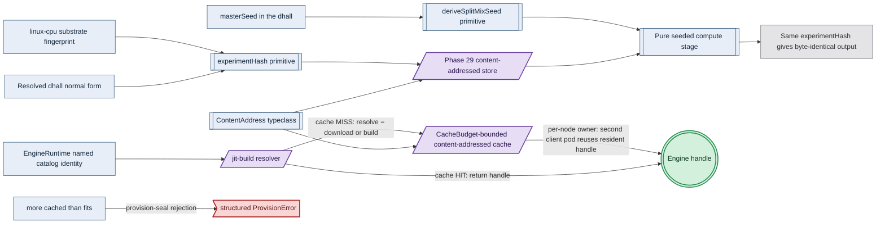

# Phase 38: Determinism kernel + jit-build CacheBudget cache

**Status**: Authoritative source
**Supersedes**: N/A
**Referenced by**: DEVELOPMENT_PLAN/README.md, DEVELOPMENT_PLAN/legacy_tracking_for_deletion.md, DEVELOPMENT_PLAN/overview.md, DEVELOPMENT_PLAN/phase_10_capability_bind.md, DEVELOPMENT_PLAN/phase_11_provision_seal.md, DEVELOPMENT_PLAN/phase_12_inference_accelerator_provision.md, DEVELOPMENT_PLAN/phase_15_deterministic_sim_substrate.md, DEVELOPMENT_PLAN/phase_18_base_image_registry.md, DEVELOPMENT_PLAN/phase_29_content_store_workflow.md, DEVELOPMENT_PLAN/phase_37_provider_dynamic_nodes.md, DEVELOPMENT_PLAN/phase_39_infernix_lift.md, DEVELOPMENT_PLAN/phase_40_jitml_lift_cuda.md, DEVELOPMENT_PLAN/phase_41_apple_metal_host_daemon.md, DEVELOPMENT_PLAN/system_components.md, documents/engineering/deterministic_simulation_doctrine.md
**Generated sections**: none

> **Purpose**: Land the determinism kernel — the `ContentAddress` typeclass, the
> `experimentHash = sha256(resolved-dhall ‖ substrate-fingerprint)` run identity, and the SplitMix seed
> derivation — **and** the shared jit-build engine resolver with its `CacheBudget`-bounded per-node cache owner,
> then prove on live linux-cpu that an independent cache-bypassed recompute is byte-identical while a changed
> input changes the hash, and that the cache owner resolves a named `EngineRuntime` on first miss, serves a
> resident handle to a second client pod, fits budget/volume/pod-request, and rejects every overflow/deletion/conflict.

---

## Phase Status

📋 Planned. Nothing in this phase is implemented; every sprint below is 📋 Planned and every prescriptive
statement is design intent, never a tested amoebius result. This phase merges the determinism kernel and the
jit-build engine cache into one gate because the cache keys its resolved engine payloads by the kernel's own
`ContentAddress` primitive — the cache is `sha256(bytes)` content addressing applied to the ephemeral per-node
owner, so the kernel must land before the cache rides it, and both are proven together on one substrate. The
phase runs on the **linux-cpu** substrate in **Register 3** (live infrastructure): a single-node `kind` cluster
brought up by the Phase 17 midwife, whose base image (Phase 18) already bakes the shared **jit-build resolver
and its build toolchain** but **no** ML engine payload, using the content-addressed store and workflow runtime
landed in Phase 29. The `experimentHash`/SplitMix shapes are already exercised in the sibling `jitML` project
(`jitML/src/JitML/Checkpoint/Format.hs`, `jitML/src/JitML/Engines/Rng.hs`) and jitML's `Engines/Loader.hs` (the
lazy per-kernel JIT: cache HIT → handle, MISS → compile-then-store) is the shape this round generalizes; read
those as **sibling evidence, not an amoebius result** — amoebius has not yet built the kernel or the cache layer.
infernix's `docker/Dockerfile` `curl`-tar-at-image-build and its `model_cache.py` `minioadmin` fallback are the
baked/URL/second-secret-store anti-patterns this phase deliberately **replaces**, not inherits. Status
transitions are recorded reverse-chronologically here once work begins.

## Phase Summary

This phase turns the content-addressed store delivered in Phase 29 into a reusable **determinism kernel** and,
on top of that kernel, delivers the first live amoebius realization of the ML-asset lifecycle's Tier 1 — the
**engine** — as one bounded, content-addressed, resolve-on-first-miss cache. It owns two seams that meet at the
`ContentAddress` primitive and stops there.

**The determinism kernel.** First, it lifts Phase 29's concrete blob/manifest key renderers into a kernel-level
`ContentAddress` typeclass, so the rule that *a content-derived name cannot be forged* is one reusable primitive
rather than a per-store copy. Second, it implements the `experimentHash` run identity — a total function of the
resolved `.dhall` normal form and the live linux-cpu substrate fingerprint — so two runs share a store namespace
only when they are genuinely the same experiment on the same substrate. Third, it implements the SplitMix seed
derivation that gives every stream a seed that is a pure function of `(masterSeed, streamIndex)` alone,
independent of worker count, scheduling, and assignment. These seams are shared, not ML-specific: the SplitMix
seed derivation and the `MonadTime`/`MonadTimer` clock injection that make an ML run bit-reproducible are the
**same** injection seams the **Register-2.5 deterministic simulation**
([`deterministic_simulation_doctrine.md §6`](../documents/engineering/deterministic_simulation_doctrine.md#6-one-determinism-substrate-two-uses))
uses to make a simulation deterministically replayable — one determinism substrate, two uses. The substrate is
folded into identity precisely because cross-substrate bit-equality is not guaranteed; this phase asserts
same-substrate reproducibility and refuses to claim cross-substrate byte-equality.

**The jit-build engine cache.** On top of the kernel, this phase builds the **`CacheBudget`-bounded
content-addressed cache**: a bounded typed pool with one per-node owner, content-addressed by the resolved
asset's SHA (the kernel's `ContentAddress`), carrying an explicit `CacheBudget` nested inside the owner pod's
node-ephemeral provision, with pin-aware pruning. The pure input is a `CachePopulationDemand`, not a
caller-authored cache peak: each selected closed-catalog identity resolves to catalog-owned
`AssetMaterializationDemand` metadata carrying its content address, final resident bytes, and peak temporary
download/build/unpack bytes; binding derives a private `ProvisionedCacheDemand` per node/host, unioning observed
residents and selected new assets by content address, rejecting conflicting resident-size metadata, keeping
observed entries charged until deletion is observed, and adding the exact largest permitted set of simultaneous
temporary materializations. It builds the **jit-build resolver** — `resolve = {download | build}` on first miss
— that takes a named `EngineRuntime` catalog identity, returns a handle on a cache HIT, and on a MISS downloads
a prebuilt engine or builds it from source (using the Phase-18 baked toolchain) into the cache; there is no arm
to author a URL, because the identity is drawn from the closed catalog. And it proves **node-level reuse through
the one cache owner**: a second client pod on the same node that names the same identity receives the
cache-resident handle and pays no re-materialization, without mounting one pod's ephemeral volume into another.
"More cached than fits" is rejected at the post-bind `provision-seal` by the Phase-7 capacity fold, not
discovered as a runtime disk-full.

The scope deliberately stops at the kernel primitives, the engine tier (Tier 1), and one live proof of each. The
gate determinism workload is a small seeded compute stage — a pinned content-addressed input, a pure stage, and
a request-carried derived seed — deliberately **not** an infernix inference run (that lift is Phase 39) and
**not** a jit-resolved ML engine (this phase resolves the engine, but the infernix inference that rides it is
Phase 39; the CUDA/jitML kernel tier is Phase 40). The `ModelArtifact` staging tier (Tier 2) and the JIT kernel
tier (Tier 3) are named as the same cache shape but are not exercised here. The cache is **ephemeral and
node-scoped** — re-materializable on first miss, deliberately *not* the durable state of the stateless
`replicas=1` control-plane singleton (whose only durable state is the Vault-enveloped MinIO bucket); evicting
the cache costs a re-resolve, never data loss. The engine lane exercised here is `linux-cpu` only; the
Apple-Metal and `Cuda` lanes are out of contract for this gate.

Diagram vocabulary: [diagram_conventions.md](../documents/engineering/diagram_conventions.md).

*Design intent. The determinism kernel primitives and the seeded stage are pure Tier-1 folds; the Phase-29 store, the node cache, and the jit-build resolver are the effectful IO seams and the engine handle their opaque success seal; an over-budget demand is refused at the provision-seal, while byte-identical output and live cache residency are runtime-checked on linux-cpu, not proven here.*

**Substrate:** linux-cpu — the whole gate runs on a single-node `kind` cluster on a linux-cpu host in
Register 3 (live infrastructure); no apple, linux-cuda, or windows substrate is touched, and cross-substrate
behaviour is explicitly out of contract. Nothing about deriving `experimentHash`, a SplitMix seed, or the
provision-derived peak `≤ CacheBudget` rejection requires live infrastructure — those stay pure (Registers 1–2)
— but the phase gate is the live linux-cpu proof.

**Register:** 3 — live infrastructure (§K): the reproducibility recomputes, the first-miss materialization, and
the second-pod reuse run against real pods on the live cluster, and the run emits a proven/tested/assumed ledger
naming that register.

**Gate:** on the single-node linux-cpu `kind` cluster (Phase 17 midwife, Phase 18 base image + baked
resolver/toolchain + in-cluster `distribution` registry, Phase 29 content store + workflow runtime), a
**two-part** acceptance condition holds against the **Phase-0-committed oracle set** ([Gate integrity](#gate-integrity)),
with every *how-it-behaved* claim read from an OS-boundary observer (§M.5) and every byte comparison performed
**out-of-band by the harness** on blobs it fetched itself, never inferred from a `412`/`If-None-Match` response
(§M.6): **(a) determinism** — the seeded workload runs twice under one unchanged `experimentHash` as an
**independent fresh recomputation** (each fresh Pod writes a distinct `<experimentHash>/<runId>` staging prefix
whose output key is provably absent; run 2 cannot read run 1's retained prefix until its pure stage writes,
§M.6), the two retained output blobs are byte-identical, a changed `masterSeed`/`streamIndex`/pinned input
yields **different** output bytes, and a changed resolved `.dhall` or substituted substrate fingerprint yields a
**different** `experimentHash` and namespace; the committed mutant `test/mutants/Determinism_const_output.hs`
turns the seed/input-sensitivity legs red. **(b) cache owner** — the one named identity
`EngineRuntime.LlamaCppCpu@<pinned-ver>` resolves on **first miss** into the `CacheBudget`-bounded
content-addressed cache (bytes sha256-matching the `test/oracle/phase_32_oracle.dhall` pin, the named arm
attested to have actually run, the handle live at the pinned `--version`, and zero public-registry pull by live
egress/CNI capture), a **second client pod** on the same node reuses the cache-resident handle with no
re-materialization (unchanged resident inode/mtime, zero new pull), the owner's derived peak fits
`derived peak ≤ CacheBudget ≤ emptyDir.sizeLimit` and its ephemeral request covers that volume bound plus
writable/log headroom, and an over-budget peak, digest-size conflict, deletion credited before observation, or
bounded-parallel-derived overflow is rejected by the Phase-7 fold at the Phase-11 **`provision-seal`** before any
resolve; the committed mutants `resolve _ = <fixed 16-byte marker>` and `prune = pure ()` turn part (b) red. The
run emits a Register-3 proven/tested/assumed ledger; the full committed corpus and its partition into the two
parts are named in [Gate integrity](#gate-integrity).

## Gate integrity

The gate's committed apparatus is the **union** of both seams' Phase-0-committed corpora, authored and committed
in Phase 0 **before any `src/Amoebius/Kernel/*` or `src/Amoebius/Jit/*` module exists**, partitioned along the
two-part gate. No golden output *bytes* are pre-committed for the determinism part (they are substrate-specific),
so its byte-equality legs compare **two fresh runs against each other**, never against a regenerated golden;
every other oracle is a hand-authored table independent of the code under test (§M.1, §M.3).

**Part (a) — the determinism corpus (§M.1, §M.6).** The representative set is the positive
`test/dhall/phase_31_determinism_repro.dhall` (one pinned content-addressed input blob, one pure seeded stage,
one `masterSeed`) and its three committed negative siblings differing in exactly one dimension each —
`..._flipped_metric.dhall` (a resolved-`.dhall` change), `..._alt_seed.dhall` (a changed `masterSeed`), and
`..._alt_input.dhall` (a changed pinned input), each a specific-reason negative (§M.8). Supporting oracles: the
hand-authored fingerprint schema `test/golden/phase_31_substrate_fingerprint.schema.json` pinning the minimum
witness set (substrate lane `linux-cpu` + GHC / RTS / ISA / libc-ABI witnesses, **each with its absolute probe
path**, §M.3); the hand-computed SplitMix golden `test/golden/phase_31_splitmix_seeds.json` (streams `0`, `1`,
`37` worked by hand under gamma `0x9E3779B97F4A7C15`, never regenerated from `Rng.hs`); the committed compile-fail
fixture `test/compile-fail/phase_31_forge_blobsha.hs` (constructing `BlobSha "deadbeef"` from a `Text` literal,
which MUST fail at the "`BlobSha` constructor not in scope / not exported" locus, §M.8); the committed fake probe
`test/fake/phase_31_fake_ghc` (emits a different version, used by the fingerprint sensitivity check); and the
resource witness `test/golden/phase_31_resource_shape.json`. The committed seeded mutants this part must turn red
(§M.2): `test/mutants/Determinism_const_output.hs` (the pure stage rewritten to return a constant byte string
ignoring seed and input; **operator: dropped-effect**) turns the seed-sensitivity and input-sensitivity legs red;
`test/mutants/ContentAddress_field_order_leak.hs` (a canonical-encoder preserving field order rather than sorting;
dropped-effect) turns the canonical-encoding property red; `test/mutants/ExperimentHash_const_fingerprint.hs`
(fingerprint hardcoded to `"linux-cpu"`; dropped-effect) turns the schema and sensitivity checks red;
`test/mutants/Rng_workerid_mixed.hs` (seed folds in a worker id in addition to `streamIndex`; effect-swap) turns
the worker-count-independence property red. The independent reference predicates are the harness's **out-of-band
byte compare** of two fetched blobs (§M.6, never a `412` on a second PUT), the hand-authored logical-equivalence
oracle for `ContentAddress` (permuted map order, reordered fields, equivalent integer encodings — defined
independently of the canonical bytes under test, §M.3, with a `cover` obligation forcing ≥30% distinct byte
pre-images, §M.4), and the hand-computed SplitMix golden.

**Part (b) — the cache corpus (§M.2, §M.7).** The **live** representative set is **exactly one** closed-catalog
identity: `EngineRuntime.LlamaCppCpu@<pinned-ver>` (a linux-cpu `llama.cpp` engine arm), exercised on **both**
resolve arms — `build` (from the pinned source recipe compiled by the baked toolchain, attested by an
`strace`/argv-shim record of the absolute-path `g++` invocation, §M.5) and `download` (the same bytes served by
the in-cluster `distribution` registry, attested by its access log). Its oracle is the hand-authored
`test/oracle/phase_32_oracle.dhall` (independent of the SUT, never regenerated from the resolver's output, §M.3),
carrying per identity the expected `ContentAddress` (`sha256` of the materialized bytes), the catalog-owned
final-resident and peak-temporary byte `Quantity` operands for both arms, and the expected `--version` string
the live binary reports; raw deployment input selects that identity but cannot override those
`AssetMaterializationDemand` operands. The committed negative fixtures (specific-reason, §M.8):
`test/negative/phase_32_cache_over_budget.dhall`, `test/negative/phase_32_cache_digest_size_conflict.dhall`,
`test/negative/phase_32_cache_deletion_credit.dhall`, `test/negative/phase_32_cache_concurrency_overflow.dhall`,
`test/negative/phase_32_ephemeral_under_reserved.dhall`, plus the compile-fail negatives
`test/negative/phase_32_freestring_key.hs` (cache key from a free `String`/`Text`/`Url`) and
`test/negative/phase_32_url_arm.hs` (a free-`Url` resolver arm), each failing *at its constructor locus* with
its named error and paired with a positive that differs only in the foreclosed dimension. The independent
owner+two-client image/resource/slot/transition witness is `test/oracle/phase_32_resource_shape.json`; the pinned
source recipe is committed alongside. The committed seeded mutants under `test/mutants/phase_32/` this part must
turn red (§M.2), drawn from the operator set: **(a)** `resolve _ = <fixed 16-byte marker>` (**effect swap** — the
resolver does no real work; turns the stored-`ContentAddress`/sha256/version/arm-executed assertions red);
**(b)** `prune = pure ()` (**dropped effect** — pruning is dead code; the pin-eviction assertion and postflight
on-disk peak/final measurement fail); **(c)** an identity-resolver whose stored bytes are one byte short of the
pin (**guard weakening**). The reference predicate for the capacity legs is the fixture's hand-authored expected
verdict table plus an independent recomputation of the digest union and largest finite first-miss temporary set
(never the fold's own output). The **pure capacity subcorpus** may select additional members of the
already-closed catalog solely to exercise distinct-digest `BoundedParallel n` arithmetic; those members are not
claimed as live-resolved evidence.

**Shared resource-envelope mutants.** The live recompute/cache workloads are one workload proof, not only the
byte/cache proofs above; the resource-shape witnesses (`test/golden/phase_31_resource_shape.json`,
`test/oracle/phase_32_resource_shape.json`) and the mutants under `test/mutants/phase_31/` and
`test/mutants/phase_32/` are enumerated in [Resource provision](#resource-provision--the-recompute-runs-the-cache-owner-and-its-clients).

## Resource provision — the recompute runs, the cache owner, and its clients

This phase instantiates the canonical resource matrix and sealed whole-deployment provision boundary from
[`resource_capacity_doctrine.md §3.1`](../documents/engineering/resource_capacity_doctrine.md#31-the-systematic-provision-matrix)
and [`§4`](../documents/engineering/resource_capacity_doctrine.md#4-the-total-fold-fits-carve-place-and-the-nesting);
both live workloads must flatten to canonical execution atoms before either effect starts.

**The determinism recompute runs.** The three kernel functions are pure and allocate no deployment unit. The
live proof introduces compute Pods, so the gate's `BoundDeployment` contains an identity-keyed
`DeterminismRunDemand` for every baseline, seed/input variant, and fingerprint-control run. Each run carries a
complete `PodResourceEnvelope`: every container has a selected-platform `ImageArtifact`, lifecycle, CPU/memory/
ephemeral-storage requests and limits, runtime working set, read-only or bounded-writable rootfs, and log
headroom; the Pod carries bounded disk/memory `emptyDir`s, derived ConfigMap/Secret/projected/service-account-
token `KubeletMappedFileDemand`s, any durable claim with its presentation/backing/attachment class, `cache = None`,
exact byte-free `PodRuntimeMetadataSource` network-attachment and container-to-volume mount identities, and
`accelerator = None`. The content-store and Pulsar clients are libraries inside that compute container; their
buffers, CBOR staging, retry state, and output-upload workspace are charged to its memory and pod-local
ephemeral fields, never as client Pods. Each fresh run is a finite Job body (explicit completions, parallelism,
backoff, replacement-on-Failed, terminal retention) and is also an exact Phase-29 `WorkflowRuntimeDemand`
projection — orchestrator, configured active/standby workers (the active run worker is fresh), sole
content-mutation gateway, and collector/verification Job with complete envelopes, whose command/event topics,
subscriptions, cursor/backlog/retention/hot-ledger/offload and output gateway/object extents merge into
Pulsar/BookKeeper/MinIO capacity before publish. No broker or standing gateway Pod makes a new workflow's
messages/storage free. Fixture Job actions are serialized by snapshot-bound preflight: the next run receives no
apply capability until the predecessor Pod UID's absence/release witness is fresh (staged live evidence, not an
invented cross-kind rollout constructor); both `<experimentHash>/<runId>` output object sets remain charged in
the object-store producer demand through the out-of-band comparison.

**The cache owner and its clients.** Binding derives an identity-keyed envelope for the cache-owner Pod and for
both live client Pods. Every container row includes lifecycle, selected-platform `ImageArtifact`, CPU/memory/
ephemeral-storage requests+limits, runtime working set, writable-rootfs allowance (or read-only root), and log
headroom; every Pod row carries Pod overhead, bounded disk/memory volumes, derived mapped
ConfigMap/Secret/projected/token payloads, durable claims and attachment classes (none in the representative
fixture), the owner's one `InClusterCacheDemand` or a client's `cache = None`, and `accelerator = None`. Resolver
download/build/unpack, compiler subprocess CPU/RSS, import workspace, pipe/network buffers, and temporary files
execute inside the owner container and are included in that owner's runtime and cache-temporary operands; the
typed client handle is a library protocol and creates no client-service Pod. The in-cluster `distribution`
registry and standing platform Pods remain charged as live survivors; the download endpoint is never free
supply. The live race epoch is exact: one owner plus two overlapping clients consume three pod/IP slots on the
selected node, while same-digest requests share one in-flight materialization and distinct digests obey the
finite semaphore. Image content/snapshots/import workspace for all three selected images fold once by
digest/chain identity on their layout-routed physical backing. The owner is a kind-correct Deployment with
`DeploymentRolloutPolicy.Recreate`; there is no separate `RecreateAfterObservedGone` constructor. An
`emptyDir`-backed old owner and all clients drain, every old Pod UID remains a live commitment through
termination, and image/snapshot/writable/log/cache extents remain charged until their own observed
deletion/GC. The amoebius scheduler's aggregate CAS refuses a replacement unless that exact
old+new+retained-artifact high-water fits; Pod API absence alone never credits physical bytes.

**Runtime-metadata, etcd, and the host harness (both workloads).** After controller expansion, the binder
serializes exhaustive `desiredObjects` for all rendered and derived Kubernetes objects, not selected kinds, and
joins observed survivors with old/new/apply-before-prune. `EtcdLogicalDemand { desiredObjects, churn, model }`
includes revisions, Leases, and Events; only private `ProvisionedEtcdLogicalDemand.derivedPeak <=
backendQuotaBytes` may continue, and physical capacity separately fits backend-at-quota plus WALs,
retained/saving snapshots, and defrag old+new workspace. One-byte logical/physical shortages and
`drop_api_object_demand.dhall`, `drop_etcd_churn.dhall`, or `drop_etcd_model.dhall` reject before any Pod
creation. `provision` derives one `KubeletRuntimeMetadataShape` per planned Pod slot from that Pod's exact
runtime-metadata source and container/volume graph under the selected node's pinned `kubeletMetadataModel`;
SplitRuntime charges kubelet components to nodefs and CRI components to imagefs/containerfs, Unified and
SplitImage sum forced aliases before one backing check, and no physical runtime-metadata debit is repeated as
logical Pod ephemeral storage. The gate harness and its filesystem/network/argv observer are a bounded
`HostResourceEnvelope` (executable digest, CPU/memory, capture/log/scratch bytes on a named backing, finite
probe concurrency, no cache or accelerator); the absolute-path substrate-fingerprint probes, `strace`, and
egress/CNI capture execute within that envelope, never in sidecar Pods or as resource-free subprocesses.

**The committed resource mutants (must reject before any effect, §M.2).** For the determinism runs,
`test/mutants/phase_31/drop_run_resource_envelope.dhall` (omits one run's Pod row),
`drop_host_harness_envelope.dhall` (omits the probe/harness host row), `early_fresh_run.dhall` (launches the
successor before the predecessor is observed gone), and `drop_workflow_gateway_collector.dhall` (omits one
Phase-29 runtime/mutation unit) must each turn the resource gate red even if the output bytes match. For the
cache workload, `test/mutants/phase_32/drop_client_envelope.dhall`, `drop_owner_envelope.dhall`,
`drop_owner_image.dhall` (erases the owner image demand), `early_owner_replacement.dhall` (starts a replacement
owner before old-cache absence is observed), and `drop_host_observer_envelope.dhall` must turn the gate red
before materialization. The Phase-0 negative bundle additionally lowers CPU, memory, logical ephemeral, each
routed physical backing, image/pull workspace, pod/IP slots, CSI slots (on a matched PVC-bearing fixture), each
resident output object and object-store workspace, and host-harness CPU/memory/capture/log/scratch by one
unit/byte and expects a tagged pre-effect `Left`. Each unique CSI PVC spends one driver attachment slot; both
representative fixtures declare no PVC and therefore spend zero CSI slots, never an implicit unlimited value.

## Doctrine adopted

This phase is the first live amoebius realization of the content-addressing/determinism contract and of the
ML-asset lifecycle's Tier-1 engine cache. Each bullet names the section it implements; individual sprints cite
the same sections where they adopt them.

- [`content_addressing_doctrine.md §2`](../documents/engineering/content_addressing_doctrine.md#2-the-three-tier-store-blobs--manifests--pointers)
  — *the three-tier store (blobs ← manifests ← pointers)*: the `ContentAddress` typeclass lifts Phase 29's
  `blobs/<sha256>` / `manifests/<sha256>` key renderers into a kernel primitive (keeping the `If-None-Match: *` /
  `412 = success` write protocol owned by the store), and the engine cache reuses the same self-naming discipline
  — a MISS-then-store and a HIT are write-once content addressing applied to the ephemeral per-node cache owner
  rather than the durable MinIO bucket.
- [`content_addressing_doctrine.md §3`](../documents/engineering/content_addressing_doctrine.md#3-experimenthash-identity-is-what-was-requested--where-it-ran)
  — *`experimentHash`: identity is what was requested ‖ where it ran*: the run identity folds the resolved
  `.dhall` normal form and the substrate fingerprint into one digest, so a flipped metric direction or a
  different substrate is a different experiment in a different namespace.
- [`content_addressing_doctrine.md §4`](../documents/engineering/content_addressing_doctrine.md#4-determinism-by-construction-pinned-inputs--pure-stages--derived-seed)
  — *determinism by construction: pinned inputs + pure stages + derived seed*, with its pinned-input leg
  ([§4.1](../documents/engineering/content_addressing_doctrine.md#41-leg-one--pinned-content-addressed-inputs)),
  its derived-seed leg (§4.3), and the totality argument
  ([§4.4](../documents/engineering/content_addressing_doctrine.md#44-what-the-types-make-these-total-cashes-out-to)):
  this phase implements the three legs as kernel primitives and wires them through one live workload.
- [`content_addressing_doctrine.md §4.5`](../documents/engineering/content_addressing_doctrine.md#45-the-ml-asset-lifecycle-one-bounded-content-addressed-cache-resolved-on-first-miss)
  — *the ML-asset lifecycle: one bounded content-addressed cache, resolved on first miss*: Tier 1's
  `EngineRuntime` is a **named, jit-resolved** identity (never baked, never URL-fetched), the cache is a bounded
  typed pool with an explicit `CacheBudget` and pin-aware pruning, and the trade is stated plainly (baking gave
  no-network-at-boot; the cache pays a first-miss materialization amortized across every later use).
- [`content_addressing_doctrine.md §6`](../documents/engineering/content_addressing_doctrine.md#6-the-honest-ceiling-types-make-the-bookkeeping-total-not-the-physics-deterministic)
  — *the honest ceiling: types make the bookkeeping total, not the physics deterministic*: the contract stays at
  same-substrate reproducibility; cross-substrate bit-equality is deliberately not asserted and the ledger never
  marks it green.
- [`service_capability_doctrine.md §4.1`](../documents/engineering/service_capability_doctrine.md#41-the-inferenceengine-capability--the-engine-is-target-offering-selected-and-jit-resolved-never-authored)
  — *the `InferenceEngine` capability — the engine is substrate-selected and jit-resolved, never authored*: the
  closed `EngineRuntime` union has **no arbitrary-`Url`/`Download` arm**; the `.dhall` *selects* an arm by the
  detected substrate and can never *author* a fetch, and the shared jit-build resolver materializes the named
  identity on first miss.
- [`resource_capacity_doctrine.md §3`](../documents/engineering/resource_capacity_doctrine.md#3-the-types-quantity-capacity-demand-budget)
  / [`§3.1`](../documents/engineering/resource_capacity_doctrine.md#31-the-systematic-provision-matrix)
  and [`§4`](../documents/engineering/resource_capacity_doctrine.md#4-the-total-fold-fits-carve-place-and-the-nesting)
  — *the `Quantity` types, the canonical provision matrix, and the total `fits`/`carve`/`place` fold*: the live
  recompute runs and the cache owner/clients instantiate the resource matrix and the sealed whole-deployment
  provision boundary; `CacheBudget` is nested inside the cache-owner pod's bounded `emptyDir` and
  ephemeral-storage envelope, and the derived peak bound is the **same** checked capacity fold Phase 7 built and
  Phase 11 invokes at `provision-seal` — "more cached than fits" is rejected by that fold, not discovered as a
  runtime disk-full.
- [`image_build_doctrine.md §7`](../documents/engineering/image_build_doctrine.md#7-what-amoebius-bakes-vs-builds--the-base-container-is-the-supply-chain)
  — *what amoebius bakes vs builds*: the base image bakes the jit-build **resolver + toolchain** (the
  build-from-source path this phase drives on a MISS) but holds the ML **engine payloads** out as named cache
  identities — the Phase-18 split this phase exercises live for the first time.
- [`substrate_doctrine.md §3`](../documents/engineering/substrate_doctrine.md#3-the-no-environment--no-path-lazy-tool-ensure-contract)
  — *the no-env / no-`PATH`, full-path-probe substrate contract*: the linux-cpu substrate fingerprint consumed by
  `experimentHash` and every subprocess the resolver spawns is gathered/invoked by absolute-path only, never from
  `PATH` or environment variables.
- [`illegal_state_catalog.md`](../documents/illegal_state/illegal_state_catalog.md) §4.5 — *the totality
  technique*: there is no constructor for a store or cache key from a free string and no inhabitant of "a seed
  read from ambient entropy"; these are states that cannot be written down, not states fixed at runtime.
- [`illegal_state_catalog.md §3.25`](../documents/illegal_state/illegal_state_ml_asset.md#325-an-ml-asset-named-by-arbitrary-url-or-an-unready--unlanded-model)
  — *an ML asset named by arbitrary URL is unrepresentable*: the engine identity has no URL syntax
  (type-foreclosed, Gate 1); an over-budget cache is constructible input rejected at the post-bind
  `provision-seal`.
- [`testing_doctrine.md §2`](../documents/engineering/testing_doctrine.md#2-three-registers-of-amoebius-testing)
  — *three registers of amoebius testing*: this phase's gate reaches **Register 3** (live infrastructure) and
  emits a proven/tested/assumed ledger naming that register, with the model/kernel tiers (Phases 39/40) marked
  deferred.

## Sprints

## Sprint 38.1: `ContentAddress` typeclass kernel primitive 📋

**Status**: Planned
**Implementation**: `src/Amoebius/Kernel/ContentAddress.hs` (target path; not yet built)
**Blocked by**: Phase 29 gate (the three-tier content-addressed store whose blob/manifest key renderers this
typeclass lifts); Phase 14 gate (the `chain`/`Step` kernel the primitive plugs into)
**Independent Validation**: the "no constructor from a free string" claim is verified by a **committed
compile-fail fixture** (§M.8), not a runtime property: `test/compile-fail/phase_31_forge_blobsha.hs` attempts
`BlobSha "deadbeef"` (constructing a carrier from a `Text` literal) and MUST fail to compile at the named locus
"`BlobSha` constructor not in scope / not exported", paired with the positive `contentAddress someBytes` that
compiles; the sprint additionally commits an export-list audit asserting no module re-exports the carrier
constructors. The canonical-encoding property (pure, in-process, no cluster) is over an **independent oracle**:
"logically equal" is defined as two payloads the test constructs to be equal by an independently hand-authored
equivalence (permuted map key order, reordered record fields, equivalent integer encodings) — **not** derived
from the canonical bytes under test (§M.3) — and the generator carries a `cover` obligation (§M.4) forcing at
least 30% of cases to exhibit a genuinely distinct byte pre-image; those cases must still collapse to the
identical key.
**Docs to update**: `documents/engineering/content_addressing_doctrine.md`, `DEVELOPMENT_PLAN/system_components.md`, this document.

### Objective
Adopt [`content_addressing_doctrine.md §2 — the three-tier store`](../documents/engineering/content_addressing_doctrine.md#2-the-three-tier-store-blobs--manifests--pointers)
and the totality argument in [`§4.4`](../documents/engineering/content_addressing_doctrine.md#44-what-the-types-make-these-total-cashes-out-to):
lift Phase 29's concrete blob/manifest key renderers into a kernel-level `ContentAddress` typeclass so that
"a content-derived name cannot be forged" is a single reusable primitive shared later by the engine cache
(Sprint 38.5) and by both infernix (Phase 39) and jitML (Phase 40), not a per-store copy.

### Deliverables
- A `ContentAddress a` typeclass whose only key-producing operation is `sha256(canonical-bytes a)`, with a
  canonical-encoder requirement so equal logical content yields byte-identical keys.
- Newtyped `BlobSha` / `ManifestSha` carriers with no public constructor from a free `Text`.
- Adapters binding the typeclass to Phase 29's `blobs/<sha256>` and `manifests/<sha256>` writers — the
  `If-None-Match: *`, `412 = success` protocol stays owned by the store.
- The Phase-0-committed compile-fail fixture `test/compile-fail/phase_31_forge_blobsha.hs` (with its expected
  locus), the hand-authored logical-equivalence oracle for the canonical-encoding property, and the mutant
  `test/mutants/ContentAddress_field_order_leak.hs` — authored before `ContentAddress.hs` exists (§M.1–M.3).

### Validation
1. Type-level, verified by the committed compile-fail fixture `test/compile-fail/phase_31_forge_blobsha.hs`
   (§M.8): constructing a `BlobSha`/`ManifestSha` from a free `Text` MUST fail to compile with "constructor not
   in scope / not exported" at the named locus, while the paired positive `contentAddress bytes` compiles. The
   only path to a `BlobSha`/`ManifestSha` is `contentAddress`; an export-list audit confirms no re-export.
2. Property: `contentAddress x == contentAddress y` whenever `x` and `y` are logically equal, where **logical
   equality is defined by a committed hand-authored equivalence independent of the canonical bytes** (§M.3) —
   the generator emits distinct byte pre-images of equal content (permuted map order, reordered fields,
   equivalent integer encodings) and a `cover` obligation (§M.4) requires ≥30% of cases to carry such a distinct
   pre-image; those cases must collapse to the identical key. The committed mutant
   `test/mutants/ContentAddress_field_order_leak.hs` (a canonical-encoder that preserves field order rather than
   sorting; operator: dropped-effect) MUST turn this property red (§M.2).

### Remaining Work
The whole sprint (📋 Planned).

## Sprint 38.2: `experimentHash` identity over the live substrate fingerprint 📋

**Status**: Planned
**Implementation**: `src/Amoebius/Kernel/ExperimentHash.hs` (target path; not yet built)
**Blocked by**: Sprint 38.1; Phase 17 gate (substrate detection — the linux-cpu substrate fingerprint gathered
by full-path probes); Phase 4 gate (the resolved-`.dhall` normal form)
**Independent Validation**: unit tests prove `experimentHash` is a pure function of `(resolved-dhall,
substrate-fingerprint)` and re-derives identically across re-evaluation. The substrate fingerprint conforms to
the **Phase-0-committed schema** `test/golden/phase_31_substrate_fingerprint.schema.json` (§M.3), which pins a
minimum witness set — substrate lane (`linux-cpu`) plus named toolchain witnesses: GHC version, RTS/runtime
version, ISA, and libc/ABI — **each with its absolute probe path**; a fingerprint missing a required witness
FAILS. That the probes ran by absolute path with no `PATH`/env read is asserted from an **OS-boundary observer**
(§M.5): an argv-recording exec shim (or `strace -f -e execve`) whose log shows every probe invoked by absolute
path and shows no `getenv`/`PATH` lookup on the fingerprint path — never a self-emitted compliance trace. A
**sensitivity check** substitutes one named probe's binary with a committed fake (`test/fake/phase_31_fake_ghc`
emitting a different version): the folded digest MUST change; with all real probes unchanged two probes of the
same host MUST fold to the identical digest.
**Docs to update**: `documents/engineering/content_addressing_doctrine.md`, `documents/engineering/substrate_doctrine.md`, `DEVELOPMENT_PLAN/system_components.md`.

### Objective
Adopt [`content_addressing_doctrine.md §3 — experimentHash: identity is what was requested ‖ where it ran`](../documents/engineering/content_addressing_doctrine.md#3-experimenthash-identity-is-what-was-requested--where-it-ran):
implement the run identity that folds the resolved program and the substrate fingerprint into one digest,
consuming the Phase-4 normal form and the Phase-17 full-path substrate probe, per the substrate doctrine's
no-env/no-`PATH` contract.

### Deliverables
- `deriveExperimentHash :: ResolvedDhall -> SubstrateFingerprint -> ExperimentHash` =
  `sha256(resolved-dhall ‖ substrate-fingerprint)`, with the fingerprint gathered by full-path subprocess probes,
  never from environment or `PATH`.
- The store namespace key `<experimentHash>/…` wired so two genuinely different runs — including a flipped metric
  direction (part of the resolved `.dhall`) or a different substrate fingerprint — cannot collide.
- The Phase-0-committed fingerprint schema `test/golden/phase_31_substrate_fingerprint.schema.json` (minimum
  witness set + each witness's absolute probe path) and the committed fake probe `test/fake/phase_31_fake_ghc`
  used by the sensitivity check — both authored before `ExperimentHash.hs` exists (§M.1, §M.3).

### Validation
1. `experimentHash` changes when either the resolved `.dhall` (the committed `..._flipped_metric.dhall` sibling,
   differing only in metric direction) or the substrate fingerprint changes; it is stable across re-evaluation of
   the same inputs. Asserted against the Phase-0-committed fixtures, not values regenerated from the SUT.
2. The fingerprint carries every witness required by `test/golden/phase_31_substrate_fingerprint.schema.json`
   (substrate lane + GHC/RTS/ISA/libc witnesses, each with its absolute probe path); a hardcoded constant such
   as `"linux-cpu"` FAILS the schema check. The linux-cpu fingerprint is gathered only by absolute-path probes —
   verified from the argv-shim/`strace` OS-boundary observer (§M.5), not a self-report — with no `PATH`/env read;
   two probes of the same host fold to the same digest. The **sensitivity check** with one probe replaced by the
   committed fake binary MUST change the folded digest (§M.3). The committed mutant
   `test/mutants/ExperimentHash_const_fingerprint.hs` (fingerprint hardcoded to `"linux-cpu"`; operator:
   dropped-effect) MUST turn the schema and sensitivity checks red (§M.2).

### Remaining Work
The whole sprint (📋 Planned).

## Sprint 38.3: SplitMix seed derivation, worker-count-independent 📋

**Status**: Planned
**Implementation**: `src/Amoebius/Kernel/Rng.hs` (target path; not yet built)
**Blocked by**: Phase 14 gate (the `chain`/`Step` kernel this primitive is called from); Phase 1 gate (the
pinned toolchain that carries the `splitmix` dependency)
**Independent Validation**: unit tests prove `deriveSplitMixSeed` returns the same stream seed for a given
`(masterSeed, streamIndex)` regardless of how many workers or in what order they are simulated, and that no seed
reads wall-clock, a worker id, or ambient entropy (pure, in-process, no cluster).
**Docs to update**: `documents/engineering/content_addressing_doctrine.md`, `DEVELOPMENT_PLAN/system_components.md`.

### Objective
Adopt the derived-seed leg of [`content_addressing_doctrine.md §4 — determinism by construction`](../documents/engineering/content_addressing_doctrine.md#4-determinism-by-construction-pinned-inputs--pure-stages--derived-seed)
(§4.3) and its totality argument in [`§4.4`](../documents/engineering/content_addressing_doctrine.md#44-what-the-types-make-these-total-cashes-out-to):
implement the SplitMix seed derivation that is independent of worker count, scheduling, and assignment, with a
per-stream seed reachable only through one total function.

### Deliverables
- `deriveSplitMixSeed :: SplitMixSeed -> Word64 -> SplitMixSeed` with SplitMix64 mixing and the golden-ratio
  gamma (`0x9E3779B97F4A7C15`), exposing a per-stream seed reachable only through this total function.
- A type discipline in which "a stream with no seed" and "a seed read from ambient entropy" have no inhabitant —
  a seed is reachable only from a typed `(SplitMixSeed, Word64)`.

### Validation
1. A simulated 1-worker vs 100-worker dispatch in arbitrary order seeds stream `37` identically every time. The
   generator carries a `cover` obligation (§M.4) forcing ≥25% of cases into the high-worker-count/shuffled-order
   branch, so the property is not satisfied by a near-constant single-worker generator. Expected seed values for
   streams `0`, `1`, `37` are checked against a **committed hand-computed golden**
   `test/golden/phase_31_splitmix_seeds.json` (§M.1, SplitMix64 with gamma `0x9E3779B97F4A7C15` worked by hand,
   not regenerated from `Rng.hs`).
2. No seed reads wall-clock, a worker id, or `/dev/urandom`; the derivation is a pure function of
   `(masterSeed, streamIndex)` alone. The committed mutant `test/mutants/Rng_workerid_mixed.hs` (seed folds in a
   worker id in addition to `streamIndex`; operator: effect-swap) MUST turn validation 1 red (§M.2).

### Remaining Work
The whole sprint (📋 Planned).

## Sprint 38.4: The live same-substrate reproducibility gate 📋

**Status**: Planned
**Implementation**: `src/Amoebius/Kernel/Determinism.hs`, `test/dhall/phase_31_determinism_repro.dhall`,
`test/live/DeterminismReproSpec.hs`, and `test/live/DeterminismRuntimeStorageSpec.hs` (planned-slot→observed-UID
join, component role/layout backing, scope/domain/ownership/grouping, reservation/observed no-double-debit,
SplitRuntime one-byte-short and alias controls) (target paths; not yet built)
**Blocked by**: Sprint 38.1; Sprint 38.2; Sprint 38.3; Phase 29 gate (the content store + workflow runtime the
gate workload runs on); Phase 17 gate (the live single-node `kind` cluster and the substrate fingerprint)
**Independent Validation**: a `.dhall` workflow runs a minimal seeded compute stage twice on linux-cpu. Run 2 is
an **independent fresh recomputation** (§M.6), not a store hit: each fresh Pod has a distinct
`<experimentHash>/<runId>` staging prefix with an absent output key, run 2 cannot read run 1's retained prefix
until its stage completes and writes, and the harness asserts that boundary from an OS observer (§M.5), an
argv/exec shim or `strace` on the compute Pod. The harness retains and fetches both exact object sets and blobs
itself and does an **out-of-band byte comparison**; a `412`/`If-None-Match` result on the second PUT is never
read as equality. It then asserts (a) byte-identical output under an unchanged `experimentHash`; (b)
seed-sensitivity and input-sensitivity per the committed `..._alt_seed.dhall` and `..._alt_input.dhall` siblings
(different output bytes); (c) a divergent `experimentHash` and distinct store namespace for the
`..._flipped_metric.dhall` sibling and for a substrate-fingerprint substitution; and emits a
proven/tested/assumed ledger artifact. The committed mutant `test/mutants/Determinism_const_output.hs` MUST turn
legs (b) red (§M.2).
**Docs to update**: `documents/engineering/content_addressing_doctrine.md`, `documents/engineering/resource_capacity_doctrine.md`, `DEVELOPMENT_PLAN/README.md`, `DEVELOPMENT_PLAN/substrates.md`.

### Objective
Adopt [`content_addressing_doctrine.md §4 — determinism by construction`](../documents/engineering/content_addressing_doctrine.md#4-determinism-by-construction-pinned-inputs--pure-stages--derived-seed)
end-to-end and hold the honest ceiling in [`§6`](../documents/engineering/content_addressing_doctrine.md#6-the-honest-ceiling-types-make-the-bookkeeping-total-not-the-physics-deterministic):
wire the three legs — a pinned content-addressed input
([`§4.1`](../documents/engineering/content_addressing_doctrine.md#41-leg-one--pinned-content-addressed-inputs)),
a pure stage, and a request-carried derived seed — through one self-contained seeded workload, deliberately
without an infernix inference run (Phase 39) or a jit-resolved engine (that is the cache seam below and the
Phase-39 lift), and prove same-substrate reproducibility as one half of the phase gate without overclaiming
cross-substrate equality.

### Deliverables
- A pure seeded compute stage (`Determinism.hs`) taking a content-addressed input, a request, and a derived
  SplitMix seed, with all I/O at the interpreter boundary.
- The gate `.dhall` (`test/dhall/phase_31_determinism_repro.dhall`) that spins up the Phase-29 workflow, runs the
  stage twice, stores each output as a content-addressed blob under its `experimentHash` namespace, tears down,
  and compares outputs.
- A ledger artifact recording: identity/seed totality as **proven-in-types**, same-substrate reproduction as
  **tested on linux-cpu**, and cross-substrate bit-equality as **explicitly not asserted** (UNVERIFIED), matching
  the doctrine's proven/tested/assumed table.
- The Phase-0-committed representative oracle set (authored before any kernel module exists, §M.1): the positive
  `test/dhall/phase_31_determinism_repro.dhall` and its one-dimension-differing negative siblings
  `..._flipped_metric.dhall`, `..._alt_seed.dhall`, `..._alt_input.dhall` (§M.7, §M.8); the committed mutant
  `test/mutants/Determinism_const_output.hs` (§M.2); and the harness's OS-boundary observer (argv/exec shim or
  `strace`) that witnesses run 2's fresh compute and the fresh-pod output-key absence (§M.5, §M.6).

### Validation
1. Two runs with the same `experimentHash` on linux-cpu produce byte-identical output, where both fresh Pods
   write distinct `<experimentHash>/<runId>` prefixes with initially absent keys and run 2 cannot read run 1's
   retained prefix until its stage writes. The OS-boundary observer (§M.5) confirms that boundary. The comparison
   is an **out-of-band harness byte compare** of both retained/fetched blobs — never a `412` on the second PUT,
   which proves store dedup, not reproduction (§M.6).
2. Output is a genuine function of the machinery: the `..._alt_seed.dhall` run and the `..._alt_input.dhall` run
   each produce **different** output bytes from the base run (asserted on the stored blobs). A stage whose output
   is invariant under a changed seed or a changed pinned input FAILS.
3. Changing the resolved `.dhall` (the `..._flipped_metric.dhall` sibling, differing only in metric direction) or
   substituting the substrate fingerprint produces a different `experimentHash` and a distinct store namespace;
   the run is allowed to differ. Because a single linux-cpu host cannot genuinely re-fingerprint, the fingerprint
   leg is exercised by an **in-process substitution using the committed fake probe** (`test/fake/phase_31_fake_ghc`),
   and the ledger records this leg as **UNVERIFIED for a real distinct substrate** (synthetic mutation only),
   never green.
4. The committed mutant `test/mutants/Determinism_const_output.hs` (constant-output stage) is re-run and MUST turn
   validation 2 red (§M.2).
5. The ledger artifact is emitted and marks no cross-substrate claim green: same-substrate reproduction
   *tested on linux-cpu*, identity/seed totality *proven-in-types*, cross-substrate bit-equality UNVERIFIED.

### Remaining Work
The whole sprint (📋 Planned).

## Sprint 38.5: The `CacheBudget`-bounded content-addressed cache + peak-occupancy provision fold 📋

**Status**: Planned
**Implementation**: `src/Amoebius/Jit/Cache.hs` (the bounded typed pool — content-addressed by resolved-asset
SHA, pin-aware pruning, HIT/MISS lookup) and `src/Amoebius/Jit/CacheBudget.hs` (the `CacheBudget` as a
`Quantity` nested inside the cache-owner pod's bounded node-ephemeral allocation + the peak-occupancy provision
fold reusing `Amoebius.Capacity.Fold`) — target paths, not yet built.
**Blocked by**: Sprint 38.1 (the `ContentAddress` primitive the cache keys against); Phase 7 gate (the
`fits`/`carve` capacity fold this bound reuses); Phase 29 gate (the content-addressed store shape).
**Independent Validation**: a property + boundary suite shows the cache admits no key from a free string, proven
by a **committed compile-fail negative fixture** `test/negative/phase_32_freestring_key.hs` (registered in the
Phase-6 negative corpus, authored in Phase 0) whose expected failure is asserted **by locus** — it must fail to
typecheck at the attempt to construct a cache key from a `String`/`Text`/`Url` with the specific "no instance /
no exported constructor" compile error — paired with a positive that differs only in keying from
`sha256(real bytes)` and compiles. A QuickCheck property shows every resident entry is reachable only by hashing
real bytes and a lookup is a total HIT/MISS, with `cover`/`classify` obligations forcing **≥30% MISS** and
**≥30% HIT** cases (§M.4). The capacity suite starts from `CachePopulationDemand`: deployment input may select
closed-catalog identities and a finite first-miss concurrency, but cannot author resident or temporary sizes;
binding obtains those operands only from each catalog-owned `AssetMaterializationDemand`. For both node and host
placements, the independent oracle unions the observed resident set and selected new set by content address,
rejects conflicting resident sizes, adds the largest allowed set of distinct missing-asset temporary peaks, and
keeps an entry selected for deletion charged until a later observation reports it absent. The resulting private
`ProvisionedCacheDemand` must fit the typed budget/backing; the pod arm separately includes all disk-backed
volume bounds plus owner writable/log headroom. Exact-fit passes, while digest-size conflict,
bounded-parallel-derived overflow, resident-plus-temp one-byte overflow, early deletion credit, and
under-reserved pod shapes return their specific structured `Left` before any resolve. The independent oracle is
the committed fixture's hand-authored expected verdict, not the fold's own output. No cluster required.
**Docs to update**: `documents/engineering/content_addressing_doctrine.md`,
`documents/engineering/resource_capacity_doctrine.md`, `DEVELOPMENT_PLAN/system_components.md`.

### Objective
Adopt [`content_addressing_doctrine.md §4.5`](../documents/engineering/content_addressing_doctrine.md#45-the-ml-asset-lifecycle-one-bounded-content-addressed-cache-resolved-on-first-miss)'s
bounded-typed-pool and [`resource_capacity_doctrine.md §3/§4`](../documents/engineering/resource_capacity_doctrine.md#3-the-types-quantity-capacity-demand-budget):
build the `CacheBudget`-bounded content-addressed cache so that "more cached than fits" is rejected at the
post-bind **`provision-seal`** — the same checked capacity fold that bounds every other budget rejects an
over-budget derived peak before the resolver ever materializes an asset.

### Deliverables
- `Amoebius.Jit.Cache` — a bounded typed pool keyed by `sha256(resolved-bytes)` (the Sprint-38.1 `ContentAddress`),
  with a total HIT/MISS lookup and pin-aware pruning (a pinned resident is never evicted; unpinned residents are
  pruned to keep under budget).
- `AssetMaterializationDemand` metadata owned by the closed catalog — content address, final resident bytes, and
  resolve-arm temporary download/build/unpack peak — plus `CachePopulationDemand`, which selects those
  identities, a node/host cache location, typed backing/`CacheBudget`, and a finite positive first-miss
  concurrency. Raw deployment syntax has no fields with which to override catalog byte operands.
- The private `ProvisionedCacheDemand` derived per exact node/host placement. Its peak is the byte sum of the
  digest union of observed residents and selected new residents plus the largest allowed distinct-miss temporary
  overlap; identical digests debit resident bytes once, conflicting resident sizes reject, one in-flight resolve
  per digest makes same-digest clients share temporary work, and observed residents remain charged until GC
  deletion is observed.
- For the pod arm, `CacheBudget` references the cache-owner pod's declared disk-backed `VolumeId`, and the
  private derived peak satisfies `derived peak ≤ CacheBudget ≤ emptyDir.sizeLimit` plus
  `Σ disk-backed volume sizeLimits + writable-layer allowance + log headroom ≤ ownerPod.ephemeralStorage.request
  ≤ ownerPod.ephemeralStorage.limit`, delegating to `Amoebius.Capacity.Fold`. These proofs describe one physical
  debit from node ephemeral storage and are never summed again as a separate host-cache consumer; an over-budget
  or under-reserved spec returns the tagged `Left`, not a runtime disk-full.
- An in-file honesty note: the cache is **ephemeral and node-scoped**, not the singleton's durable state; the
  cache/volume/request nesting is checked at `provision-seal`, while *actual* on-disk residency under concurrent
  resolves is the runtime residue deferred to the live gate.

### Validation
1. There is no exported path to a cache key from a free string; the only path to a resident entry is content
   addressing — asserted by the committed compile-fail negative `test/negative/phase_32_freestring_key.hs`
   (Phase-6 corpus, Phase-0-authored) failing *at the key-construction locus* with the "no exported constructor"
   error, paired with the sha256-keyed positive that compiles.
2. Prove deployments can select catalog identities but cannot supply or override resident/temporary byte
   operands. For each node/host placement, independently recompute the digest union and the largest finite
   first-miss temporary set; exact fit passes, while an unbounded concurrency policy has no constructor. A
   one-byte resident-plus-temp overflow, a `BoundedParallel n` whose derived temp set overflows, and an owner
   volume/ephemeral under-reservation each return the expected **tagged** `Left` before any resolver process or
   cache write.
3. Give the fold duplicate selections with one content address (one resident debit), conflicting resident sizes
   for one address (specific metadata-conflict rejection), and an observed unpinned entry selected for deletion.
   The entry stays charged and overflow still rejects until a later observed snapshot reports it absent; only that
   snapshot earns capacity credit. Exercise the concurrency boundary with distinct missing digests and the
   single-flight boundary with repeated same-digest clients.
4. **Pin-aware pruning is exercised, not declared:** a cache filled to `CacheBudget` with a mix of pinned and
   unpinned residents, then asked to admit one more resident, **evicts an unpinned resident, never a pinned one**,
   and leaves measured peak/final occupancy within `CacheBudget`; the property asserts a pinned resident is
   present and a named unpinned resident is absent post-prune. The committed seeded mutant `prune = pure ()`
   ([Gate integrity](#gate-integrity) part (b) mutant (b)) must turn this clause red (the over-budget residency
   survives). This is the pure-pool property; its live on-disk counterpart is the Sprint 38.8 postflight residency
   measurement. The fold's expected verdicts are the Phase-0 fixture's hand-authored table, never the fold's own
   output.

### Remaining Work
The whole sprint (📋 Planned).

## Sprint 38.6: The jit-build resolver — `resolve = {download | build}` on first miss, no URL arm 📋

**Status**: Planned
**Implementation**: `src/Amoebius/Jit/Resolver.hs` (the shared resolver: a named `EngineRuntime` catalog identity
→ cache HIT → handle, or MISS → download-a-prebuilt-engine / build-from-source → store → handle) — target path,
not yet built.
**Blocked by**: Sprint 38.5 (the cache the resolver stores into); Phase 18 gate (the base image baking the
resolver + its build toolchain — `g++` / pinned compilers for the linux-cpu build path); Phase 12 gate (the
`InferenceEngine` binder + the closed, substrate-selected `EngineRuntime` union the resolver keys on).
**Independent Validation**: a boundary suite drives the resolver against a Phase-0-committed backend fixture whose
served/compiled bytes **sha256-match the `test/oracle/phase_32_oracle.dhall` pin** — not an arbitrary "fake" blob:
a backend returning unpinned bytes must fail the suite, foreclosing a resolver that stores fixed marker bytes. A
cold cache triggers exactly one `resolve` (download-or-build) then stores, and the stored `ContentAddress`
**equals the committed pin**. A warm cache returns a handle with **no** resolve, proven by an argv-recording shim
/ `strace` observer at the OS boundary (§M.5) capturing **zero** toolchain-or-backend subprocess on the warm path
— never inferred from a resolver-emitted counter. The resolver has no code path that accepts a free URL, proven
by the committed compile-fail negative `test/negative/phase_32_url_arm.hs` (Phase-6 corpus, Phase-0-authored)
failing *at the constructor locus* with "no `Url`/free-string constructor", paired with a
closed-catalog-identity positive that compiles. Every subprocess is absolute-path-resolved, asserted by the shim
capturing the full absolute `argv[0]` (never a bare `PATH`-relative name). The committed seeded mutant
`resolve _ = <fixed 16-byte marker>` ([Gate integrity](#gate-integrity) part (b) mutant (a)) turns the
stored-`ContentAddress` assertion red.
**Docs to update**: `documents/engineering/content_addressing_doctrine.md`,
`documents/engineering/service_capability_doctrine.md`, `documents/engineering/image_build_doctrine.md`,
`DEVELOPMENT_PLAN/system_components.md`.

### Objective
Adopt [`content_addressing_doctrine.md §4.5`](../documents/engineering/content_addressing_doctrine.md#45-the-ml-asset-lifecycle-one-bounded-content-addressed-cache-resolved-on-first-miss)'s
Tier-1 resolve-on-miss, [`service_capability_doctrine.md §4.1`](../documents/engineering/service_capability_doctrine.md#41-the-inferenceengine-capability--the-engine-is-target-offering-selected-and-jit-resolved-never-authored),
and [`image_build_doctrine.md §7`](../documents/engineering/image_build_doctrine.md#7-what-amoebius-bakes-vs-builds--the-base-container-is-the-supply-chain)'s
bake-vs-build split: implement the shared jit-build resolver so a named engine identity is materialized on first
miss into the bounded cache — downloaded prebuilt or built from source with the Phase-18 baked toolchain — with
**no arm to author a URL**, replacing infernix's `curl`-tar-at-image-build with the one shared resolve-on-miss
path.

### Deliverables
- `Amoebius.Jit.Resolver` — `resolve :: EngineRuntime -> IO EngineHandle` that returns a handle on a cache HIT
  and, on a MISS, runs `download | build` (the recipe carried by the closed-catalog identity, never an authored
  URL), stores the result content-addressed into `Amoebius.Jit.Cache`, then returns the handle.
- The build-from-source path invoking the Phase-18 baked toolchain by absolute path (no `PATH`, no env), and the
  download path resolving a named prebuilt identity — neither exposing a free-URL or free-string constructor.
- An in-file honesty note: URL-foreclosure and identity-from-closed-catalog are **proven-in-types** (Gate 1); the
  first-miss materialization *succeeding* on real infrastructure is the live residue proven at the phase gate; the
  model (Tier 2) and kernel (Tier 3) tiers reuse this resolver but land in Phases 39/40.

### Validation
1. A cold cache triggers exactly one `resolve` and stores the result, **and the stored `ContentAddress` equals
   the `test/oracle/phase_32_oracle.dhall` pin**; a warm cache returns a handle with no resolve, proven by the
   argv-shim/`strace` observer recording zero backend subprocess on the warm path; there is no path that accepts
   a URL or free string, asserted by the committed compile-fail negative `test/negative/phase_32_url_arm.hs`
   failing at the constructor locus with its named error, paired with the closed-catalog positive that compiles.
   The committed seeded mutant `resolve _ = <fixed-marker>` ([Gate integrity](#gate-integrity) part (b) mutant (a))
   must turn the stored-address assertion red.
2. Every subprocess the resolver spawns is invoked by absolute path, never resolved against `PATH` — asserted by
   an OS-boundary argv-recording shim capturing the full absolute `argv[0]`, not a resolver self-report.

### Remaining Work
The whole sprint (📋 Planned).

## Sprint 38.7: Per-node cache-owner reuse across client pods 📋

**Status**: Planned
**Implementation**: `src/Amoebius/Jit/CacheOwner.hs` (the typed per-node cache owner, bounded ephemeral volume,
client-handle protocol, and concurrency discipline that makes a second client pod's lookup a HIT against the
owner's resolved copy) — target path, not yet built.
**Blocked by**: Sprint 38.5, Sprint 38.6; Phase 19 gate (the typed SSA object reconciler that renders the cache
owner and client pods); Phase 23 gate (the platform backbone the pods schedule onto).
**Independent Validation**: on the live single-node `kind` cluster, one cache-owner pod and two client pods
scheduled to the same node name the same `EngineRuntime` identity; the **first** client request is a MISS that
the owner materializes into its bounded disk-backed `emptyDir` (stored bytes sha256-matching the
`test/oracle/phase_32_oracle.dhall` pin), the **second** client lookup is a **HIT** that reuses the resident
handle with **no re-materialization** — proven by an **OS-boundary observer**, not a resolver counter: the
resident entry's inode and mtime are unchanged across the second lookup, and the in-cluster `distribution`
registry access log plus an egress capture record **zero** new pull or build subprocess for the second client.
The owner's rendered manifest has exact provision-derived CPU/memory/`ephemeral-storage` requests+limits,
`emptyDir.sizeLimit`, and no writable `hostPath`; the applied ephemeral request is at least the volume bound plus
writable/log headroom. The concurrent-first-miss race is **operationalized** so the two client requests provably
overlap: both block on a shared barrier and materialization is deliberately slowed (a payload-size floor or an
injected delay in the fixture backend) so **both provably observe MISS before either store commits** — then the
suite asserts exactly one final resident entry, that its bytes hash to the catalog pin, and that **no partial/temp
file remains** in the cache directory. The owner consumes the placement's `ProvisionedCacheDemand`: its semaphore
enforces the finite maximum of distinct first-miss materializations and its digest-keyed single-flight table
makes same-digest requests share one catalog-derived temporary footprint. A race that never overlaps (serialized
by accident) does not satisfy this clause.
**Docs to update**: `documents/engineering/content_addressing_doctrine.md`,
`DEVELOPMENT_PLAN/system_components.md`.

### Objective
Adopt [`content_addressing_doctrine.md §4.5`](../documents/engineering/content_addressing_doctrine.md#45-the-ml-asset-lifecycle-one-bounded-content-addressed-cache-resolved-on-first-miss)'s
"every later pod on that host reuses the cache-resident copy": make the bounded cache **single-owner per node**,
so the first-miss materialization cost is paid once per node per identity and amortized across every client pod
that later names it, without a shared writable host mount.

### Deliverables
- `Amoebius.Jit.CacheOwner` — the per-node cache-owner location, bounded volume, client-handle protocol, and
  read/write discipline that lets a second client HIT the owner's resident copy, with two concurrent first-misses
  converging to one stored, content-addressed copy (idempotent write-once, the store's confluence applied to the
  ephemeral cache), a finite distinct-first-miss semaphore, and one single-flight entry per digest. It accepts the
  opaque `ProvisionedCacheDemand`, never a runtime-authored resident/temp allowance.
- The pod wiring (rendered by the Phase-19 reconciler) that gives the owner a bounded disk-backed `emptyDir` with
  exact `ephemeral-storage` requests/limits and gives clients typed handles; clients never mount the owner's
  writable volume and no `hostPath` is used.
- An in-file honesty note: cross-pod reuse and the idempotent concurrent-miss convergence are **tested on
  linux-cpu** at the gate; cross-node reuse is out of contract (the cache is node-scoped by design — a different
  host is a legitimate first miss).

### Validation
1. Client A's first `resolve` is a MISS that the cache owner materializes to bytes hashing to the catalog pin;
   Client B on the same node HITs the resident handle with no re-materialization, proven by the OS-boundary
   observer — unchanged resident inode/mtime and zero new registry pull / build subprocess for Client B — never
   by a resolver-emitted counter. The owner pod's resource/volume projection matches its pure provision.
2. Two concurrent first-misses, **forced to overlap by a shared barrier and slowed materialization so both
   observe MISS before either commits**, converge to exactly one stored copy whose bytes hash to the catalog pin;
   no partial/temp file remains and no torn or duplicate resident entry exists. Repeated same-digest requests use
   one in-flight temporary extent, while an `(n+1)`th distinct missing digest queues and the observed simultaneous
   set never exceeds the provisioned finite concurrency.
3. Mark an observed unpinned resident for pruning and attempt a replacement whose resident-plus-temp peak would
   fit only if deletion were credited early. Admission remains rejected until an OS-boundary rescan observes the
   old inode absent; the unchanged snapshot can never mint capacity credit from intent alone.

### Remaining Work
The whole sprint (📋 Planned).

## Sprint 38.8: The live first-miss / reuse / resource-admission gate + Register-3 ledger 📋

**Status**: Planned
**Implementation**: `test/dhall/phase_32_engine_cache.dhall` (the gate workflow naming a linux-cpu engine
identity) and `test/live/EngineCacheGate.hs` (the Register-3 gate harness) — target paths, not yet built.
**Blocked by**: Sprint 38.4 (the determinism half of the phase gate); Sprint 38.5, Sprint 38.6, Sprint 38.7;
Phase 17 gate (the live `kind` cluster + substrate detect); Phase 18 gate (the baked resolver/toolchain and the
in-cluster `distribution` registry proving no public pull).
**Independent Validation**: the gate `.dhall` names the one representative identity
`EngineRuntime.LlamaCppCpu@<pinned-ver>` ([Gate integrity](#gate-integrity)); the harness asserts the first
client request is a first-miss materialization by the per-node cache owner into its `CacheBudget`-bounded
`emptyDir`, whose stored bytes **sha256-match the `test/oracle/phase_32_oracle.dhall` pin**, the named arm
**actually executed** (the argv-shim/`strace` observer recorded the absolute-path `g++` compile on the `build`
arm, or the `distribution` registry access log recorded the in-cluster serve on the `download` arm), and the
returned handle is **live** (the binary runs and reports the pinned `--version`). "**Zero public-registry pull
authored by URL**" is discharged by **live network observation** (a CNI/egress capture plus the `distribution`
audit log showing no request to any public registry host), **in addition to** the Gate-1 type-level foreclosure —
the type check alone does not satisfy this clause. The owner manifest's CPU/memory/`ephemeral-storage`
requests+limits and `emptyDir.sizeLimit` match its pure provision, the request covers that bound plus writable/log
headroom, and it contains no writable `hostPath`. A second client pod on the same node reuses the cache-resident
handle with the reuse proven by the OS-boundary observer (unchanged resident inode/mtime, zero new pull for the
second client). A **postflight on-disk peak/final measurement** confirms pin-aware eviction and resource
enforcement: with the cache filled to budget, a pinned resident survives and an unpinned resident is evicted, and
measured peak/final bytes stay within `CacheBudget` (measured on disk, not self-reported). The gate independently
reconstructs the observed resident digest map and matches it to the private `ProvisionedCacheDemand`;
selected-for-deletion entries remain charged until absent. A catalog digest-size conflict, a
resident-plus-bounded-temp peak one byte over budget/backing, a bounded-parallel-derived capacity overflow, or an
ephemeral request smaller than the bounded volume plus writable/log headroom is rejected by the Phase-7 fold at
the Phase-11 **`provision-seal`** before any resolve, and each materialized artifact's measured final and
temporary on-disk sizes are asserted `≤` its catalog-owned `AssetMaterializationDemand`. The committed seeded
mutants `resolve _ = <fixed-marker>` and `prune = pure ()` ([Gate integrity](#gate-integrity)) must turn the gate
red. The run emits a Register-3 proven/tested/assumed ledger.
**Docs to update**: `documents/engineering/content_addressing_doctrine.md`, `DEVELOPMENT_PLAN/README.md`
(flip the Phase-38 status when the gate passes), `DEVELOPMENT_PLAN/substrates.md`.

### Objective
Adopt [`content_addressing_doctrine.md §4.5`](../documents/engineering/content_addressing_doctrine.md#45-the-ml-asset-lifecycle-one-bounded-content-addressed-cache-resolved-on-first-miss)
end-to-end under [`testing_doctrine.md §2 — Register 3`](../documents/engineering/testing_doctrine.md#2-three-registers-of-amoebius-testing):
wire the resolver, the bounded per-node cache owner, and client reuse through one live linux-cpu workload and
prove the cache half of the phase gate — exact ephemeral-resource projection, first-miss resolution,
second-client reuse, and the provision-rejected over-budget peak — without overclaiming the model/kernel tiers
(Phases 39/40).

### Deliverables
- The gate `.dhall` naming exactly the one representative identity `EngineRuntime.LlamaCppCpu@<pinned-ver>`
  ([Gate integrity](#gate-integrity) concrete corpus), driving one cache-owner pod, two client pods on the same
  node, and the Phase-0-committed resident-plus-temp over-budget, digest-size-conflict, deletion-credit,
  bounded-parallel-overflow, and ephemeral-under-reserved fixtures.
- The Phase-0-committed oracle `test/oracle/phase_32_oracle.dhall` (expected `ContentAddress`, catalog-owned
  final-resident/temporary byte `Quantity`, `--version`) and the committed seeded mutants under
  `test/mutants/phase_32/` (`resolve _ = <marker>`, `prune = pure ()`, one-byte-short store), authored before
  `src/Amoebius/Jit/*` exists.
- The gate harness asserting: (i) first-miss materialization whose stored bytes sha256-match the committed pin,
  the named arm actually ran (OS-boundary argv-shim/`strace` or registry audit log), the handle is live (reports
  the pinned `--version`), and **zero public-registry pull** by live egress/CNI capture plus the `distribution`
  audit log; (ii) exact provision-derived CPU/memory/`ephemeral-storage` and `emptyDir.sizeLimit` on the owner,
  with the ephemeral request covering that volume bound plus writable/log headroom and no writable `hostPath`;
  (iii) a second-client cache HIT with no re-materialization, proven by unchanged resident inode/mtime and zero
  new pull; (iv) a postflight on-disk peak/final measurement showing the pinned resident survived, the unpinned
  resident was evicted, and measured bytes stayed within `CacheBudget`; (v) the resident-plus-temp over-budget,
  digest-size-conflict, deletion-before-observation, bounded-parallel-overflow, and ephemeral-under-reserved
  specs' **tagged** `ProvisionError`/`Left`s at the provision seal, with each artifact's measured final/temp
  sizes within its catalog-owned `AssetMaterializationDemand`. The gate must turn red under the committed mutants.
- A Register-3 ledger recording: URL-foreclosure and the required bounded-`CacheBudget` field as
  **proven-in-types**, the numeric cache/ephemeral inequalities as **provision-seal checked**, first-miss
  resolution and cross-pod reuse as **tested on linux-cpu**, and the Tier-2 model / Tier-3 kernel reuse as
  **deferred** (Phases 39/40), with cross-node and cross-substrate reuse explicitly not asserted.

### Validation
1. On the live linux-cpu `kind` cluster, the first client resolves `EngineRuntime.LlamaCppCpu@<pinned-ver>`
   through the cache owner on first miss into the cache, the stored bytes sha256-match the committed
   `test/oracle/phase_32_oracle.dhall` pin, the named arm actually ran (attested by the OS-boundary
   argv-shim/`strace` on `build` or the `distribution` audit log on `download`), and the handle is live (reports
   the pinned `--version`); "zero public-registry pull" is proven by live egress/CNI capture and the registry
   audit log, not by the type check alone. The owner has exact provision-derived ephemeral resources/volume
   bounds, its request covers those bounds plus writable/log headroom, and it has no writable `hostPath`. A second
   client on the node reuses the resident handle with no resolve, proven by unchanged resident inode/mtime and
   zero new pull. The committed seeded mutant `resolve _ = <marker>` ([Gate integrity](#gate-integrity) part (b)
   mutant (a)) must turn this clause red.
2. A postflight on-disk peak/final measurement confirms pin-aware eviction (pinned resident survives, unpinned
   evicted, measured bytes remain within `CacheBudget`); the committed mutant `prune = pure ()`
   ([Gate integrity](#gate-integrity) part (b) mutant (b)) must turn this red. A resident-plus-temp one-byte
   overflow, digest-size conflict, early deletion credit, bounded-parallel-derived overflow, and
   ephemeral-under-reserved owner each return their **tagged** `Left` at the Phase-7 fold before any resolve runs,
   and each materialized artifact's measured final/temp on-disk size is within its catalog-owned
   `AssetMaterializationDemand`.
3. The Register-3 ledger is emitted and marks first-miss resolution, cross-pod reuse, and pin-aware eviction as
   *tested on linux-cpu*, URL-foreclosure and the required bounded-`CacheBudget` field as *proven-in-types*, the
   numeric cache/ephemeral inequalities as *provision-seal checked*, and the model/kernel tiers (Phases 39/40) and
   cross-node/cross-substrate reuse as **UNVERIFIED**.

### Remaining Work
The whole sprint (📋 Planned).

## Documentation Requirements

**Engineering docs to update (when the gate runs, flip the honest layer, never before):**
- `documents/engineering/content_addressing_doctrine.md` — the §6 proven/tested/assumed table gains an
  amoebius-tested linux-cpu same-substrate reproducibility datapoint, and §4.5's Tier-1 engine cache gains its
  first amoebius live datapoint (first-miss resolve + per-node owner reuse on linux-cpu), both alongside the
  existing jitML/infernix sibling-evidence rows (status is recorded here in the plan, never as doctrine status);
  annotate that the bounded-cache resolve-on-miss path replaces infernix's `curl`-tar-at-image-build, that the
  Tier-2/Tier-3 realizations remain Phases 39/40 targets, and add the kernel module paths
  (`ContentAddress`/`ExperimentHash`/`Rng`/`Determinism`) and the `Amoebius.Jit.*` module paths to the doctrine's
  cross-reference set.
- `documents/engineering/service_capability_doctrine.md` — annotate §4.1 that the `EngineRuntime`
  substrate-selected, no-URL provider is first resolved live here; the alternate lanes (Apple-Metal, `Cuda`) stay
  design intent.
- `documents/engineering/resource_capacity_doctrine.md` — record that the §3/§4 `Quantity`/`fits` fold is reused
  as the provision-derived peak `≤ CacheBudget` bound, keeping "more cached than fits" a checked `provision-seal`
  rejection, and that the canonical provision matrix and sealed whole-deployment provision boundary are
  instantiated by the live recompute runs and the cache owner/clients (gate-validated by the Phase-0 resource
  witnesses `test/golden/phase_31_resource_shape.json` and `test/oracle/phase_32_resource_shape.json` and the
  resource mutants `test/mutants/phase_31/*`, `test/mutants/phase_32/*`); record that linux-cpu datapoint here in
  the plan, never as doctrine status.
- `documents/engineering/substrate_doctrine.md` — record that the linux-cpu substrate fingerprint consumed by
  `experimentHash`, and every subprocess the resolver spawns, are first exercised here, gathered/invoked by
  full-path probes with no env/`PATH` read.
- `documents/engineering/image_build_doctrine.md` — the §7 bake-vs-build split (resolver/toolchain baked, engine
  payloads not) gains its first live exercise: the resolver's build-from-source path runs against the baked
  toolchain.
- `documents/illegal_state/illegal_state_catalog.md` — annotate §3.25 that the URL-foreclosure holds live and the
  over-budget-cache rejection reached its `provision-seal` locus on linux-cpu, and note (via §4.5, the totality
  technique) that a forged content/cache name and an ambient-entropy seed remain unrepresentable.

**Cross-references to add:**
- `DEVELOPMENT_PLAN/README.md` — flip the Phase-38 status when the gate passes; link this document.
- `DEVELOPMENT_PLAN/substrates.md` — record Phase 38's gate substrate (linux-cpu) in the per-phase substrate map.
- `DEVELOPMENT_PLAN/system_components.md` — register `src/Amoebius/Kernel/ContentAddress.hs`,
  `src/Amoebius/Kernel/ExperimentHash.hs`, `src/Amoebius/Kernel/Rng.hs`, `src/Amoebius/Kernel/Determinism.hs`,
  `src/Amoebius/Jit/Cache.hs`, `src/Amoebius/Jit/CacheBudget.hs`, `src/Amoebius/Jit/Resolver.hs`,
  `src/Amoebius/Jit/CacheOwner.hs`, the `DeterminismReproSpec` and `EngineCacheGate` live suites, and the
  Phase-0-committed oracle/negative/mutant artifacts (`test/dhall/phase_31_determinism_repro.dhall` and siblings,
  `test/oracle/phase_32_oracle.dhall`, `test/negative/phase_32_freestring_key.hs`,
  `test/negative/phase_32_url_arm.hs`, `test/mutants/phase_31/`, `test/mutants/phase_32/`) as Phase-38
  design-first rows.

## Related Documents
- [README.md](README.md) — the live tracker and phase ordering this document sits under
- [development_plan_standards.md](development_plan_standards.md) — the rulebook this document obeys
- [overview.md](overview.md) — the target architecture and cross-cutting invariants (content-addressed names,
  the substrate folded into identity, the honest reproducibility ceiling, and ML engines jit-resolved into a
  bounded cache, never baked or URL-fetched)
- [system_components.md](system_components.md) — the target component inventory for the kernel and `Amoebius.Jit.*`
  module paths above
- [Content Addressing & Determinism Doctrine](../documents/engineering/content_addressing_doctrine.md) — the
  three-tier store, the `experimentHash` identity, the three determinism legs, the honest ceiling, and §4.5 the
  ML-asset lifecycle (Tier-1 engine cache) adopted here
- [Service Capabilities Doctrine](../documents/engineering/service_capability_doctrine.md) — §4.1 the
  `InferenceEngine` capability whose provider is substrate-selected and jit-resolved, never authored
- [Resource Capacity Doctrine](../documents/engineering/resource_capacity_doctrine.md) — §3/§4 the `Quantity`
  types and the `fits`/`carve`/`place` fold reused as the provision-derived peak `≤ CacheBudget` bound
- [Image Build & Registry Doctrine](../documents/engineering/image_build_doctrine.md) — §7 the base image bakes
  the resolver + toolchain but not the engine payloads
- [Substrate Doctrine](../documents/engineering/substrate_doctrine.md) — the no-env/no-`PATH`, full-path-probe
  substrate fingerprint that `experimentHash` consumes and the resolver's subprocess contract
- [Illegal-State Catalog](../documents/illegal_state/illegal_state_catalog.md) — the totality technique that makes
  a forged content/cache name and an ambient-entropy seed unrepresentable, and §3.25 an ML asset named by
  arbitrary URL is type-foreclosed while an over-budget cache peak is constructible input the `provision-seal`
  rejects
- [Testing Doctrine](../documents/engineering/testing_doctrine.md) — §2 the three registers (Register 3 reached here)
- [phase_07](phase_07_capacity_core_folds.md) — the `fits`/`carve` capacity fold the `CacheBudget` bound reuses
- [phase_11](phase_11_provision_seal.md) — the whole-deployment provision seal where the over-budget cache peak is rejected
- [phase_12](phase_12_inference_accelerator_provision.md) — the `InferenceEngine` binder + closed `EngineRuntime` union the resolver keys on
- [phase_14](phase_14_chain_kernel_boundary.md) — the `chain`/`Step` kernel the kernel primitives plug into
- [phase_17](phase_17_midwife_bootstrap_kind.md) — the midwife + single-node `kind` cluster + substrate fingerprint this phase runs on
- [phase_18](phase_18_base_image_registry.md) — the base image that bakes the jit-build resolver + toolchain this phase drives live
- [phase_19](phase_19_object_reconciler.md) — the typed SSA object reconciler that renders the cache owner and client pods
- [phase_23](phase_23_platform_backbone.md) — the platform backbone the cache owner/client pods schedule onto
- [phase_29](phase_29_content_store_workflow.md) — the content store + workflow runtime this phase lifts and runs on
- [phase_39](phase_39_infernix_lift.md) — the infernix CPU-inference lift whose reproducibility reuses this kernel and rides this resolver next
- [phase_40](phase_40_jitml_lift_cuda.md) — the jitML/CUDA lift whose kernel tier reuses this resolver and kernel
- [Engineering Doctrine Index](../documents/engineering/README.md) — the doctrine suite these phases adopt
