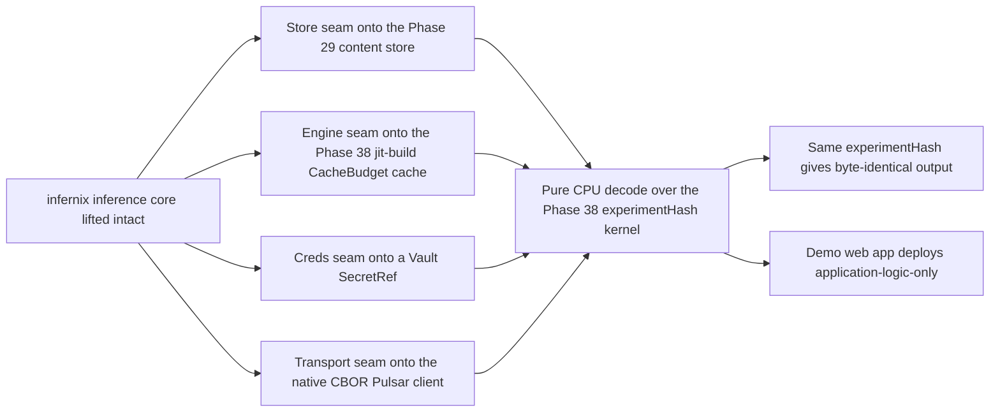

# Phase 39: infernix lift + CPU inference reproducibility

**Status**: Authoritative source
**Supersedes**: N/A
**Referenced by**: DEVELOPMENT_PLAN/README.md, DEVELOPMENT_PLAN/legacy_tracking_for_deletion.md, DEVELOPMENT_PLAN/overview.md, DEVELOPMENT_PLAN/phase_18_base_image_registry.md, DEVELOPMENT_PLAN/phase_38_determinism_jitcache.md, DEVELOPMENT_PLAN/phase_40_jitml_lift_cuda.md
**Generated sections**: none

> **Purpose**: Lift the sibling `infernix` inference library onto the amoebius runtime — its store onto the
> three-tier content-addressed MinIO store, its transport onto the native CBOR Pulsar client, its credentials
> onto Vault secrets-by-name, and its engine onto the jit-build resolver's `CacheBudget`-bounded cache — one
> reversible subsystem at a time, and prove live on linux-cpu that a CPU-inference workflow reproduces
> byte-identical output under one `experimentHash` while its PureScript demo web app deploys as
> application-logic-only.

---

## Phase Status

📋 Planned. Nothing in this phase is implemented; every sprint below is 📋 Planned and every prescriptive
statement is design intent, never a tested amoebius result. The phase runs on the **linux-cpu** substrate in
**Register 3** (live infrastructure) — a single-node `kind` cluster brought up by the Phase 17 midwife with the
standard HA platform services standing (Phases 23–24), Vault + PKI live (Phase 22), the native CBOR Pulsar client
(Phase 28), the three-tier content store + workflow runtime (Phase 29), the determinism kernel (Phase 38), and
the jit-build engine resolver + `CacheBudget` cache (Phase 38) all closed. It opens only after the Phase 38
gate, because infernix re-homes onto every one of those seams rather than reimplementing them. infernix runs
today over a Helm/WebSocket/k8s-Secret/Python-engine-fork envelope in the sibling `~/infernix`; that its
inference orchestration, engine-pool routing, durable-context event-sourcing, and `.ready`-staged artifact
store work is **sibling evidence, not an amoebius result** — amoebius has lifted none of it yet. Status
transitions are recorded reverse-chronologically here once work begins.

## Phase Summary

This phase lifts the second-to-last of amoebius's proven sibling cores onto the amoebius seams and proves the
result live. Per the lift-and-compose rule, the **substance of infernix lifts largely intact** — the inference
orchestration, engine-pool routing, and durable-context event-source are not where amoebius is novel — while
the **infrastructure envelope around it is replaced**, because each envelope shape is one amoebius already
rejects on doctrine grounds. Four seams are cut, each behind a reversible adapter so a regression in one
subsystem never forces a flag-day rollback of the others: infernix's model store re-homes onto the Phase-29
three-tier content-addressed MinIO store keyed under the Phase-38 `experimentHash` namespace; its
WebSocket/protobuf/base64-in-JSON transport re-homes onto the Phase-28 native binary Pulsar client with
exclusively-CBOR payloads; its k8s-Secret / hardcoded credentials re-home onto a Vault `SecretRef` the parent
injects; and its Python engine-fork / baked per-engine venv re-homes onto the Phase-38 jit-build resolver,
which materializes a **named catalog engine identity** on first miss into the `CacheBudget`-bounded
content-addressed cache — no baked engine, no arbitrary URL, no author-a-download syntax.

With the seams cut, the phase makes infernix CPU inference **deterministic by construction** by riding the
Phase-38 kernel rather than a private determinism path: a pinned content-addressed model, a pure decode stage,
and a request-carried SplitMix seed, with the linux-cpu substrate folded into `experimentHash` so that
same-substrate reproducibility is the honest contract and cross-substrate bit-equality is never asserted.

The **infernix demo web app** — the PureScript single-page app shipped with `~/infernix` that renders its
inference output — deploys here as **application-logic-only**: it is authored once as application logic that
*uses* the infernix inference extension, while its Deployment cardinality/rollout, substrate, and inference
binding are an orthogonal deployment-rules surface, and its frontend contract types are regenerated from the amoebius-composed
Haskell ADTs via `purescript-bridge` as a build artifact that is never committed. A demo web app that *uses* an
extension is application logic, not itself an extension, so the closed extension set stays {infernix, jitML}.
The full behind-Keycloak/Envoy SPA composition is Phase 43; this phase deploys the demo app application-logic-only
via the Deployment-`replicas=1` control-plane singleton (Phase 26), whose single-instance stays a k8s/etcd
property with no bespoke election.

**Substrate:** linux-cpu — the whole gate runs on a single-node `kind` cluster on a linux-cpu host in
Register 3 (live infrastructure); no accelerator is in scope (the CUDA training lift is Phase 40), so
cross-substrate behaviour is explicitly out of contract, and the seam re-homings themselves are
decode/bind/plan-or-resolve-infrastructure/provision/`renderAll`/compose work that stays Register-1/2
validatable ahead of the live proof.

**Register:** 3 — live infrastructure (§K).

**Gate:** an infernix CPU-inference workflow is **reproducible on linux-cpu**, measured against a
**Phase-0-pinned external oracle** (§M). The **representative set is named concretely and committed before the
implementation exists** (§M.1, §M.7): the single pinned model `catalog/tinyllama-1.1b-cpu@<sha256>` named in
`infernix/dhall/engine_catalog.dhall`, the single fixed inference request `test/fixtures/phase_33/request.cbor`,
and the fixed request seed `0x0000000000000001` — together the "representative request". The gate has four
independent parts:

- **(a) Equivalence against the sibling oracle** (§M.3): the lifted library's output for the representative
  request byte-matches the committed golden `test/fixtures/phase_33/sibling_golden.cbor`, which was **recorded
  from the sibling `~/infernix` executing the same request and committed in Phase 0** — the reference side is
  authored from the sibling, never regenerated from the amoebius implementation. Additionally the sibling
  infernix inference test corpus `test/fixtures/phase_33/sibling_corpus/` runs green against the lifted library
  with only adapter-seam configuration changed (no infernix inference/orchestration source edited), foreclosing
  a from-scratch toy that satisfies only the seam shapes.
- **(b) Determinism by independent recompute** (§M.6): the workflow is run **twice as two cache-cold
  computations** — each distinct run id gets a run-isolated staging prefix under the unchanged
  `experimentHash`, with its output key provably absent and the other run's prefix unreadable until compute
  completes; each run emits its own compute attestation, and the byte comparison is between the **two
  independently recomputed outputs**, never between a blob and its own store hit. An **OS-boundary observer**
  (§M.5) — the CNI/containerd log plus an argv-recording shim on the store client — confirms run 2's decode
  compute path actually executed and did not short-circuit to a store fetch.
- **(c) Divergence, actually executed**: a deliberately changed input (the pinned model, the request seed, or
  the resolved `.dhall`) yields a different `experimentHash`, occupies a distinct store namespace, **and the
  changed run actually executes the inference, stores an output in the new namespace, and that output is
  asserted to differ byte-for-byte from the baseline output** — divergence is proven by two stored, compared
  outputs, not by computing the divergent hash alone.
- **(d) Functional demo app**: its PureScript demo web app deploys as **application-logic-only** (authored once
  as logic that uses the extension; its Deployment cardinality/rollout, substrate, and inference binding a separate deployment-rules
  dial; its contract regenerated, never committed) **and is functionally reachable** — fetched over a
  cluster-internal host-only NodePort route it issues one inference request through the lifted extension and
  renders the contract-typed result, asserted by a headless browser in the separately provisioned host gate
  harness; this is one functional acceptance short of the full behind-Keycloak/Envoy composition
  (Phase 43).

Each **negative asserts its specific reason** (§M.8), paired with a positive differing only in the foreclosed
dimension: the divergent-input case asserts the distinct `experimentHash` digest and distinct namespace prefix
(not merely "output differs"); the no-URL-engine case asserts a **compile-fail at the absent `Url` engine
constructor**. **At least one committed seeded mutant must turn the gate red** (§M.2), committed and re-run, not
hand-picked once: the mutant `mutants/phase_33/wallclock_seed.hs` (effect swap — the pure decode reads
`getCurrentTime` in place of the derived SplitMix seed) must fail part (b); the mutant
`mutants/phase_33/identity_hash.hs` (dropped effect/UNCHANGED — `deriveExperimentHash` drops the changed-input
term from its fold) must fail
part (c); and the mutant `mutants/phase_33/sweep_skips_pulsar.hs` (invariant-clause delete — the postflight
three-layer inventory sweep drops the Pulsar topic/subscription class, so leaked topics go undetected and it
reports leak-free vacuously) must fail the leak-free teardown assertion, paired with the positive full
three-layer sweep over a genuinely clean teardown reporting green. The whole `InfernixReproSpec` /
`phase_39_infernix_repro.dhall` `InForceSpec` topology spins up, runs, and **tears down leak-free in the
pre-Phase-42 form — a successful `kind` cluster delete PLUS an independent read-only three-layer pre/post
inventory diff over the ephemeral / normal-teardown-reclaimable classes ((i) ApplySet/`kind` k8s objects,
(ii) run-prefixed MinIO S3 objects under `<experimentHash>/<runId>`, and (iii) Pulsar topics/subscriptions)
that must come back empty, verified by an OS-boundary observer (§M.5) rather than the runtime's own evidence,
with the durable retained-by-design content-addressed store bytes named as the sole permitted survivor by class
(a retained content-addressed blob is not a leak — it is its class behaving correctly), not merely a successful
`kind` cluster delete** — emitting a proven/tested/assumed ledger that records same-substrate reproduction as
*tested*, the seam lift as *live-proven*, and cross-substrate bit-equality as *explicitly not asserted
(UNVERIFIED)*.

## Resource provision — CPU inference, the demo SPA, and cold recompute

This phase instantiates the canonical resource matrix and sealed whole-deployment provision boundary from
[`resource_capacity_doctrine.md §3.1`](../documents/engineering/resource_capacity_doctrine.md#31-the-systematic-provision-matrix)
and [`§4`](../documents/engineering/resource_capacity_doctrine.md#4-the-total-fold-fits-carve-place-and-the-nesting);
inference/workflow/SPA/build/harness composites must flatten to canonical execution atoms before effects.

`linux-cpu` is a capability/placement selection, **not** a CPU-size inference rule. The pure deployment-rules
input carries a finite `CpuInferenceWorkBudget` — selected catalog model and engine, engine-thread count,
maximum concurrent requests, input/output-token bounds, and client retry/buffer bounds. Binding joins those
selections to catalog-owned model-resident bytes, KV-cache bytes per token, decode-scratch operands and a
versioned cost model, then merges the CPU-inference execution demand into the exact Phase-29
`WorkflowRuntimeDemand`: its one orchestrator and every configured active/standby worker retain complete
`PodResourceEnvelope`s. There is no default/unbounded CPU or RAM branch and no caller-authored scalar
"inference peak". The representative demand has `accelerator = None`, and a CUDA/Metal demand cannot be
produced by this phase's linux-cpu rules layer.

Every orchestrator and inference-worker container has a selected-platform `ImageArtifact`, lifecycle, explicit
CPU/memory/
ephemeral-storage requests and limits, runtime working set, read-only or bounded-writable root, and log
headroom. Its Pod row includes overhead, bounded disk/memory volumes, all derived
ConfigMap/Secret/projected/service-account-token `KubeletMappedFileDemand`s, any durable claim and attachment
class, its bounded model-staging volume, its typed engine-cache handle, and exact byte-free
`PodRuntimeMetadataSource` network-attachment identities and container-to-volume mount identities. MinIO, Pulsar, Vault, and
engine-store clients remain libraries in that worker: CBOR frames, connection/retry queues, model staging,
output upload, Vault response, and content-address verification work are charged to the worker's CPU/memory/
ephemeral fields. They do not acquire
fictional client Pods. The Phase-38 cache owner is a surviving Pod with its already-complete envelope; this
phase merges its additional catalog asset population and first-miss temporary extents into the same cache
owner instead of debiting a second cache.
The source-equal Phase-28/29 client and topic projection is retained too: every infernix command/event/context
topic and subscription carries finite producer/consumer concurrency, message/rate window, backlog/retention,
cursor/dedup and hot-ledger/offload object extents. Those demands merge into the standing broker/bookie/object-
store ledger before publish; broker Pods alone are not storage capacity. Model/output mutations route through
the Phase-29 sole content-mutation gateway and collector/verification Job, whose complete Pod envelopes,
admission concurrency, upload/failed-write extents and pod/IP/CSI slots remain in the same provisioned peak.

The demo SPA is independently resource-bearing. A finite `SpaServeWorkBudget` (maximum concurrent
connections, request/response bounds, maximum requests per finite rate window, log policy, and versioned SPA
CPU/memory cost model), joined to catalog/build-owned static-asset/image bytes, derives the SPA source unit's
one complete `PodResourceEnvelope`, including its content-digested image, CPU/memory/ephemeral
requests+limits,
writable/log/mapped-file bytes, exact byte-free `PodRuntimeMetadataSource` network/mount identities, placement,
and explicit `cache = None`/`accelerator = None`. Its inference HTTP
client buffers and JSON/CBOR bridge work are charged to the SPA container. The deployment-rules layer lowers
that source to a symbolic Deployment-indexed `BoundExecutionBody` with exactly one `ReplicaCardinality`
(`Once | Replicated { desiredReplicas }`) and one `DeploymentRolloutPolicy`: `Recreate` or
`RollingUpdate { maxSurge, maxUnavailable }`, whose private constructor proves
`maxSurge + maxUnavailable > 0`. Neither replicas nor rollout operands are
duplicated inside `SpaServeWorkBudget`; only `provision` materializes instance identities and complete
steady/old/new/surge/terminating epochs. Contract generation and frontend/
image construction consume a separate acyclic `BuildExecutionEnvelope` with tool images/executables,
stage CPU/RSS, intermediate/scratch and cache-write bytes, and finite stage/architecture concurrency before
the resulting `ImageArtifact` can enter the node-image fold. Publication is separately resource-bearing:
binding derives its exact registry index/manifest/config/layer objects, upload workspaces/retained partials and
finite `RegistryMutationAdmission`, merges them with the standing mutation-proxy Pod envelope and structured
registry backing demand, and permits push only through that proxy. Build scratch, registry storage and node
image storage are three distinct ledgers. The headless-browser acceptance probe runs in the bounded host
gate-harness envelope; this phase does not invent a browser Pod for a pure client.

For every workflow, SPA, mutation-gateway, and collector/verification Pod, `provision` combines the exact
runtime-metadata source with each planned slot and its complete container/volume graph, then derives one
`KubeletRuntimeMetadataShape` under the selected node's pinned `kubeletMetadataModel`; live normalization uses
the authenticated Pod UID plus owner/source witness instead of the planned identity. The private fold derives
each component's bytes and `KubeletNodefs | CriRuntimeRoot` role, resolves it through the selected filesystem
layout, and groups aliases by physical carve once. SplitRuntime charges kubelet components to nodefs and CRI
components to imagefs/containerfs; Unified and SplitImage sum forced aliases before one backing check. These
physical bytes are not repeated as logical Pod ephemeral demand.

Pure provision emits one `ProvisionedNodeRuntimeStorageAccounting` per node for every planned epoch
fingerprint; live preflight emits the observed-inventory-fingerprint form. Its planned-slot/observed-UID domain equals assigned Pods
exactly, qualified Pod metadata and image-model component keys form a disjoint exhaustive partition, and the
combined backing map debits each carve once. The largest simultaneous scope retains all rows; a role/backing,
scope/domain, ownership, or alias witness failure refuses before build or workload mutation.

That host gate harness has its own pure `InfernixGateHarnessDemand`: content digests and installed bytes for
the test binary, browser/Playwright runtime and argv/syscall observer; Linux-cgroup-v2 CPU/RSS reservation and
ceiling; bounded browser-profile/download, screenshot/capture, fetched-output-copy, writable scratch and
rotated-log bytes on named host backings; finite browser/probe concurrency; serial setup/run/teardown
lifecycle; and explicit `cache = None`/`accelerator = None`. The browser, store client and observer subprocesses
are children of this envelope. Live readback includes their executable digests, process tree/cgroup, profile/
capture/log high-water and concurrency; dropping the harness or making any CPU/memory/backing operand one unit
short rejects before the first build or Pod effect.

Coldness and overlap are structural. In the representative gate, "cache-cold" means the run's output key in
its distinct `<experimentHash>/<runId>` staging prefix is absent and other-run output is unreadable during
compute; it does not erase the separately budgeted Tier-1 engine cache.
`ColdRecomputePolicy { maxActiveRuns = 1, maxRetainedCompletedRuns = 3 }` keeps the Phase-29 orchestrator/
worker fleet live and serializes compute, but provisions the active run's model/decode/upload buffers and
temporary object extents together with every retained baseline/divergent output. An output, worker scratch
extent, image snapshot, writable/log/mapped byte, or slot is not credited until its API/node/store observer
reports absence. Thus the second compute can overlap the first output, and all three completed outputs may
coexist before cleanup, without inventing a fresh compute Pod for each request. The SPA, Phase-38 owner,
standing platform survivors, and host harness remain live throughout that peak. If a future implementation
does launch fresh worker Pods, its closed workflow rollout policy must enumerate full old/new/surge/
terminating worker envelopes and slots first; the current gate cannot claim that larger policy. The SPA's
Deployment cardinality and rollout policy independently derive its exact identity-keyed
old/new/surge/terminating instances at provision time.

Placement atomically spends pod and CNI/IP slots for every orchestrator, active/standby/terminating worker and
materialized SPA instance, and one driver-scoped CSI slot per unique mounted PVC. The representative network-store path
declares no worker/SPA
PVC, so its CSI debit is exactly zero rather than unknown. Selected OCI content, snapshots and pull/import
workspace, pod-local storage, exact content-store objects, cache extents, and the host build/harness scratch
are routed to their named physical backings. Pure `provision` seals desired/prior planned epochs and planned
node aggregates; snapshot-bound live preflight then joins the observed survivor/reservation inventory and
observed-UID node aggregates. Both must pass before image build/push, Pod apply, cache/model materialization,
Pulsar publish, Vault read, or MinIO write.

After controller expansion, the binder serializes exhaustive `desiredObjects` for all rendered and derived
Kubernetes objects, not selected kinds; live preflight separately joins observed survivors with
old/new/apply-before-prune.
`EtcdLogicalDemand { desiredObjects, churn, model }` includes revisions, Leases and Events; only private
`ProvisionedEtcdLogicalDemand.derivedPeak <= backendQuotaBytes` may continue. Physical capacity separately fits
backend-at-quota plus WALs, retained/saving snapshots and defrag old+new workspace. Live object/quota/backend
readback must equal the witness. One-byte logical/physical shortages and `drop_api_object_demand.dhall`,
`drop_etcd_churn.dhall` or `drop_etcd_model.dhall` reject before apply.

Only the resulting private projections may contribute the build, inference-worker, and SPA objects to `renderAll`. The gate reads back
exact image IDs, per-container resources, Pod overhead and volumes, mapped payload/accounting, writable/log
high-water, observed-Pod-UID runtime-metadata component/role/backing rows and node scope aggregate, Deployment-derived rollout
epoch, placement, pod/IP and CSI use, exact Pulsar topic/cursor/backlog/hot-ledger/
offload state, registry publication objects/upload
partials/proxy admission, node image objects, cache residents/temp, and object-store residents/transients, and
compares them with the provision witness. Phase 0 therefore adds
one-axis/one-byte-short fixtures for build CPU/RSS/scratch/cache, Pulsar client/topic/backlog/offload,
registry objects/upload/proxy resources,
inference CPU/memory/token-derived KV RAM,
logical and physical ephemeral storage, image workspace, SPA CPU/memory/ephemeral, pod/IP and matched-CSI
slots, runtime-metadata shape/component/role and grouped layout backings, cache and object-store space, and cold
active-work/output overlap. The committed resource mutants
`mutants/phase_33/drop_cpu_inference_envelope.dhall`, `drop_spa_envelope.dhall`,
`drop_client_buffers.dhall`, `drop_cold_overlap.dhall`, `drop_spa_rollout_epoch.dhall`, and
`drop_host_harness_envelope.dhall` respectively remove those rows;
`drop_registry_publication_envelope.dhall` removes the push/storage row and
`drop_pulsar_topic_demand.dhall` removes the messaging row. A dropped largest simultaneous metadata row,
changed/omitted pinned model, dropped/swapped role, wrong layout backing, planned/observed domain mismatch,
qualified Pod/image ownership hole/overlap, alias double debit, or either SplitRuntime backing one byte short
must likewise turn it red. Each must turn the gate red with zero
build/workload/store effects, even when the determinism mutants are not installed.

## Doctrine adopted

This phase is the first live amoebius realization of the lift-and-compose rule for an ML extension. Each bullet
names the section it adopts; individual sprints cite the same sections where they build on them.

- [`lift_and_compose_doctrine.md §2`](../documents/engineering/lift_and_compose_doctrine.md#2-what-lifts-the-reuse-map) — *the reuse map*:
  infernix's inference orchestration, engine-pool routing, and durable-context event-source lift largely intact
  as an extension nested under the `InForceSpec`, and its PureScript demo-SPA shell lifts with its contract
  regenerated — the change is the *seam*, not the substance.
- [`lift_and_compose_doctrine.md §3`](../documents/engineering/lift_and_compose_doctrine.md#3-the-friction-envelope-what-is-re-shaped-during-the-lift) — *the friction
  envelope*: the four re-homings this phase performs — Helm → typed `renderAll`, Pulsar WebSocket/protobuf/base64
  → the native CBOR client, k8s-Secret / hardcoded creds → a Vault `SecretRef`, and Python engine-fork / baked
  venv → the jit-build `CacheBudget`-bounded cache — each a shape amoebius rejects on doctrine grounds, each
  Register-1/2 validatable before the live proof.
- [`lift_and_compose_doctrine.md §5`](../documents/engineering/lift_and_compose_doctrine.md#5-evidence-not-proof) — *evidence, not
  proof*: that infernix serves and reproduces today argues the amoebius design is achievable; it is not an
  amoebius result until this phase's gate passes, and the migration-removal record is the legacy ledger.
- [`app_vs_deployment_doctrine.md §7`](../documents/engineering/app_vs_deployment_doctrine.md#7-infernix-is-a-shared-library-the-inference-substrate-is-a-deployment-rule)
  and [`§8`](../documents/engineering/app_vs_deployment_doctrine.md#8-shared-library-use-is-application-logic)
  — *infernix is a shared library; the inference substrate is a deployment rule* / *shared-library use is
  application logic*: infernix is realized as a shared Haskell library unified under the DSL (its call graph is
  app logic; *where* inference runs is a deployment rule), migrated behind reversible seams, with
  [`§6`](../documents/engineering/app_vs_deployment_doctrine.md#6-the-proof-case-a-demo-web-app-as-application-logic-only)
  — *the proof case: a demo web app as application-logic-only* — the demo app the last sprint deploys.
- [`content_addressing_doctrine.md §4`](../documents/engineering/content_addressing_doctrine.md#4-determinism-by-construction-pinned-inputs--pure-stages--derived-seed)
  — *determinism by construction: pinned inputs + pure stages + derived seed*: infernix's CPU decode is wired
  through the three legs on the Phase-38 kernel rather than a private determinism path, keeping the honest
  ceiling of [`§6`](../documents/engineering/content_addressing_doctrine.md#6-the-honest-ceiling-types-make-the-bookkeeping-total-not-the-physics-deterministic)
  — same-substrate reproducibility only.
- [`content_addressing_doctrine.md §4.5`](../documents/engineering/content_addressing_doctrine.md#45-the-ml-asset-lifecycle-one-bounded-content-addressed-cache-resolved-on-first-miss)
  — *the ML-asset lifecycle: one bounded content-addressed cache, resolved on first miss*: infernix's engine is
  a named catalog identity the Phase-38 jit-build resolver materializes on first miss into a `CacheBudget`-bounded
  cache — never baked, never URL-fetched.
- [`pulsar_client_doctrine.md §1`](../documents/engineering/pulsar_client_doctrine.md#1-one-client-one-wire-no-websockets),
  [`§3.1`](../documents/engineering/pulsar_client_doctrine.md#31-payloads-are-exclusively-cbor),
  [`§5`](../documents/engineering/pulsar_client_doctrine.md#5-the-capability-surface-lookup--produce--consume--subscribe--seek),
  and [`§7`](../documents/engineering/pulsar_client_doctrine.md#7-delivery-at-least-once-with-broker-side-dedup-the-robust-default)
  — *one client, one wire, no WebSockets* / *payloads are exclusively CBOR* / *the capability surface* /
  *at-least-once with broker-side dedup*: infernix's inference events ride the native binary protocol with
  CBOR-only bodies over the Phase-28 client, preserving at-least-once + dedup semantics.
- [`vault_pki_doctrine.md §3`](../documents/engineering/vault_pki_doctrine.md#3-the-secretref-contract-a-name-never-a-value)
  and [`§7`](../documents/engineering/vault_pki_doctrine.md#7-parent-injects-secrets-into-the-childs-vault)
  — *the `SecretRef` contract: a name, never a value* / *parent injects secrets into the child's Vault*:
  infernix's credentials (its JWT-auth material and any engine-registry pull secret) become a `SecretRef` name
  the parent injects into the child's Vault — no k8s-Secret, no hardcoded default in the `.dhall`.
- [`testing_doctrine.md §2`](../documents/engineering/testing_doctrine.md#2-three-registers-of-amoebius-testing) — *Register 3 (live)* and the per-run
  proven/tested/assumed ledger: the register this gate reaches, its spin-up → run → always-tear-down contract,
  and the ledger that marks cross-substrate equality UNVERIFIED, never green.

## Sprints

## Sprint 39.1: infernix as a shared library + reversible content-store adapter seam 📋

**Status**: Planned
**Implementation**: `infernix/src/Infernix/Adapter/Store.hs`, `infernix/infernix.cabal` (library target),
`infernix/dhall/infernix.dhall` (the config record that nests in the `InForceSpec`) — target paths, not yet built.
**Blocked by**: Phase 29 gate (the three-tier content-addressed store the seam writes into); Phase 38 gate (the
`ContentAddress` typeclass + `experimentHash` namespace the store keys under); Phase 26 gate (the live DSL deploy
via the Deployment-`replicas=1` singleton that schedules the lifted library).
**Independent Validation**: with the seam in "amoebius" mode, infernix model staging writes `blobs/<sha256>` +
canonical-CBOR `manifests/<sha256>` under the `experimentHash` namespace and writes the `.ready` sentinel
**last**, so a half-staged model has no serveable reference; flipping the seam to "legacy" mode and back restores
the prior store with **no infernix `.hs` source change**, proving reversibility. "infernix `.hs` source" is
defined concretely as **every module present under `infernix/src/Infernix/` before this lift began, EXCEPT the
newly added seam modules `Infernix.Adapter.*` and `Infernix.Inference.Deterministic`**; the frozen set is
committed as the manifest `test/fixtures/phase_33/frozen_sources.txt` (Phase-0-pinned) and the reversibility
check asserts a **zero diff to every file named in it** across the legacy↔amoebius toggle — the seam modules
alone may change.
**Docs to update**: `documents/engineering/lift_and_compose_doctrine.md`,
`documents/engineering/app_vs_deployment_doctrine.md`,
`documents/engineering/content_addressing_doctrine.md`, `DEVELOPMENT_PLAN/system_components.md`, this document.

### Objective
Adopt [`lift_and_compose_doctrine.md §2`](../documents/engineering/lift_and_compose_doctrine.md#2-what-lifts-the-reuse-map) and
[`app_vs_deployment_doctrine.md §7`](../documents/engineering/app_vs_deployment_doctrine.md#7-infernix-is-a-shared-library-the-inference-substrate-is-a-deployment-rule):
package infernix as a shared Haskell library unified under the DSL (its `.dhall` nests inside the `InForceSpec`)
and cut its model store over to the Phase-29 three-tier content-addressed store of
[`content_addressing_doctrine.md §2`](../documents/engineering/content_addressing_doctrine.md#2-the-three-tier-store-blobs--manifests--pointers),
keyed under the `experimentHash` namespace of [`§3`](../documents/engineering/content_addressing_doctrine.md#3-experimenthash-identity-is-what-was-requested--where-it-ran),
behind a **reversible adapter seam** — the first of the one-subsystem-at-a-time migration moves.

### Deliverables
- An `Infernix.Adapter.Store` seam with two interchangeable backends (legacy infernix store ↔ the amoebius
  three-tier store), selectable without editing infernix call sites.
- infernix model staging routed through the seam: weights → `blobs/<sha256>`, a canonical-CBOR content-addressed
  manifest, and the `.ready` sentinel written last, keyed under the Phase-38 `experimentHash` namespace, so an
  `ArtifactRef` is obtainable only from a completed staging.
- The infernix library exposing its config as a Dhall record that composes into the amoebius spec — shared-library
  use modeled as application logic, not a parallel system.

### Validation
1. End-to-end stage-then-serve in "amoebius" mode: a half-downloaded model has no serveable reference; a completed
   one does, reachable only through the `.ready` sentinel.
2. Reversibility: switching the seam to "legacy" and back changes no infernix `.hs` source — asserted as a zero
   diff to every file in the committed `test/fixtures/phase_33/frozen_sources.txt` manifest (the pre-lift
   `Infernix.*` modules minus the `Adapter.*`/`Inference.Deterministic` seams) — and leaves both stores functional.

### Remaining Work
The whole sprint (📋 Planned).

## Sprint 39.2: infernix transport + topics onto the native CBOR Pulsar client; creds onto a Vault `SecretRef` 📋

**Status**: Planned
**Implementation**: `infernix/src/Infernix/Adapter/Pulsar.hs`, `infernix/src/Infernix/Adapter/Topology.hs`,
`infernix/src/Infernix/Adapter/Secrets.hs` — target paths, not yet built.
**Blocked by**: Sprint 39.1; Phase 28 gate (the native Pulsar client — capability surface, CBOR codec, dedup);
Phase 22 gate (the root Vault + PKI and the built-in Haskell Vault client that reads a `SecretRef`).
**Independent Validation**: an infernix inference request/response round-trips over the native binary Pulsar
protocol (no WebSocket path) through the seam with a CBOR-only body; the topology seam expresses infernix's topics
via the amoebius topology algebra; infernix's JWT-auth material resolves from a Vault `SecretRef` name with no
k8s-Secret and no hardcoded default; each seam reverts independently to its legacy backend with no infernix source
change.
**Docs to update**: `documents/engineering/lift_and_compose_doctrine.md`,
`documents/engineering/pulsar_client_doctrine.md`, `documents/engineering/vault_pki_doctrine.md`,
`DEVELOPMENT_PLAN/system_components.md`.

### Objective
Adopt [`lift_and_compose_doctrine.md §3`](../documents/engineering/lift_and_compose_doctrine.md#3-the-friction-envelope-what-is-re-shaped-during-the-lift),
[`pulsar_client_doctrine.md §1`](../documents/engineering/pulsar_client_doctrine.md#1-one-client-one-wire-no-websockets)/[`§3.1`](../documents/engineering/pulsar_client_doctrine.md#31-payloads-are-exclusively-cbor),
and [`vault_pki_doctrine.md §3`](../documents/engineering/vault_pki_doctrine.md#3-the-secretref-contract-a-name-never-a-value):
cut infernix's transport, topic lifecycles, and credentials over to the amoebius seams — the native CBOR client,
the topology algebra, and Vault secrets-by-name — again **one subsystem at a time behind reversible seams** — so
infernix's call graph rides amoebius's runtime while its placement stays a deployment-rules decision.

### Deliverables
- An `Infernix.Adapter.Pulsar` seam carrying infernix inference events over the Phase-28 native client with
  exclusively-CBOR bodies, preserving at-least-once + broker-side dedup (determinism applies to the durable body
  only; broker ids/timestamps are never hashed).
- An `Infernix.Adapter.Topology` seam expressing infernix's topics in the amoebius topology algebra
  (`<workflow>.<command|event>.<substrate>`), replacing the sibling's WebSocket-bridge topic wiring.
- An `Infernix.Adapter.Secrets` seam carrying infernix's JWT-auth material (and any engine-registry pull secret)
  as a `SecretRef` name the parent injects into the child's Vault — no k8s-Secret, no plaintext default in the
  `.dhall`.
- A documented cutover order (store → pulsar/topology → secrets) where each seam is independently reversible.

### Validation
1. A request/response inference round-trip completes over the native Pulsar protocol with a CBOR-only body and no
   WebSocket path; a non-CBOR body is unrepresentable.
2. infernix's credentials resolve only from a Vault `SecretRef`; the `.dhall` names the secret and never carries a
   value; each seam, toggled to its legacy backend and back, leaves infernix source unchanged and the system
   functional.

### Remaining Work
The whole sprint (📋 Planned).

## Sprint 39.3: infernix engine onto the jit-build resolver's `CacheBudget`-bounded cache 📋

**Status**: Planned
**Implementation**: `infernix/src/Infernix/Adapter/Engine.hs`, `infernix/dhall/engine_catalog.dhall` (the named
engine identities) — target paths, not yet built.
**Blocked by**: Sprint 39.1; Phase 38 gate (the jit-build engine resolver + the `CacheBudget`-bounded
content-addressed engine cache infernix's engine now resolves through).
**Independent Validation**: infernix's inference engine is named by a typed identity from the closed catalog and
resolved on first miss into the Phase-38 `CacheBudget`-bounded cache; a second inference pod on the same node
reuses the cached engine with no re-materialization; there is no baked per-engine venv, no `Python`-fork at image
build, and no arbitrary-`Url` arm — an attempt to author an engine by download URL has no constructor.
**Docs to update**: `documents/engineering/lift_and_compose_doctrine.md`,
`documents/engineering/content_addressing_doctrine.md`, `DEVELOPMENT_PLAN/system_components.md`.

### Objective
Adopt [`lift_and_compose_doctrine.md §3`](../documents/engineering/lift_and_compose_doctrine.md#3-the-friction-envelope-what-is-re-shaped-during-the-lift) and
[`content_addressing_doctrine.md §4.5`](../documents/engineering/content_addressing_doctrine.md#45-the-ml-asset-lifecycle-one-bounded-content-addressed-cache-resolved-on-first-miss):
replace infernix's Python engine-fork / baked-venv envelope with a named catalog engine identity the Phase-38
jit-build resolver materializes on first miss into the `CacheBudget`-bounded content-addressed cache — the
deliberate exception to the "every service binary is baked" rule, and the last of infernix's four seams.

### Deliverables
- An `Infernix.Adapter.Engine` seam whose engine is a **named identity** from the closed `engine_catalog.dhall`,
  resolved by the shared jit-build resolver, never fetched by URL and never baked into the base image.
- First-miss materialization into the Phase-38 cache and warm reuse on a second pod, with
  `ProvisionedCacheDemand.derivedPeak ≤ CacheBudget ≤ emptyDir.sizeLimit` and the volume bound plus writable/log headroom reserved by
  `ownerPod.ephemeralStorage.request ≤ limit` as one node-ephemeral debit (this phase consumes those proofs, it
  does not re-implement them).
- An in-file note that the inference engine is the deliberate non-baked exception; infernix's service-binary
  dependencies (if any) stay baked in the multi-arch base image.

### Validation
1. A named engine identity resolves on first miss into the bounded cache; a second inference pod reuses it with no
   re-materialization.
2. There is no baked engine, no image-build Python fork, and no constructor for an engine authored by download
   URL — the negative asserts its **specific reason**: a fixture attempting to author an engine by `Url` is a
   **compile-fail (or `dhall type` error) at the absent `Url` constructor**, paired with a positive that names a
   valid catalog identity and differs only in that dimension (§M.8).

### Remaining Work
The whole sprint (📋 Planned).

## Sprint 39.4: deterministic-by-construction CPU decode over the Phase-38 kernel 📋

**Status**: Planned
**Implementation**: `infernix/src/Infernix/Inference/Deterministic.hs` — target path, not yet built.
**Blocked by**: Sprint 39.1; Sprint 39.2; Sprint 39.3; Phase 38 gate (the `ContentAddress` /
`deriveExperimentHash` / `deriveSplitMixSeed` kernel this decode rides instead of a private determinism path).
**Independent Validation**: a pure CPU decode stage takes a content-addressed model, a request, and a
kernel-derived SplitMix seed and produces byte-identical output for an unchanged `experimentHash`, with all I/O at
the interpreter boundary and no ambient-entropy or wall-clock read inside the stage.
**Docs to update**: `documents/engineering/content_addressing_doctrine.md`,
`DEVELOPMENT_PLAN/system_components.md`.

### Objective
Adopt [`content_addressing_doctrine.md §4`](../documents/engineering/content_addressing_doctrine.md#4-determinism-by-construction-pinned-inputs--pure-stages--derived-seed)
and the honest ceiling in [`§6`](../documents/engineering/content_addressing_doctrine.md#6-the-honest-ceiling-types-make-the-bookkeeping-total-not-the-physics-deterministic):
wire the three determinism legs through an infernix CPU decode — a pinned content-addressed model (Sprint 39.1),
a pure decode stage, and a request-carried seed derived by the Phase-38 kernel (greedy or seeded sampling, never
ambient entropy) — so same-substrate reproducibility holds by construction without a private determinism path and
without overclaiming cross-substrate equality.

### Deliverables
- A pure infernix CPU decode stage taking a content-addressed model, a request, and a `deriveSplitMixSeed`-derived
  seed, with all I/O pushed to the interpreter boundary.
- The decode's identity folded through `deriveExperimentHash` (resolved `.dhall` ‖ linux-cpu substrate
  fingerprint), so two genuinely different requests occupy different store namespaces and cannot collide.
- An in-file honesty note that identity/seed totality is proven-in-types, same-substrate reproduction is a live
  test (the gate), and cross-substrate bit-equality is deliberately never asserted.

### Validation
1. The decode stage is pure: given the same content-addressed model, request, and derived seed it returns
   byte-identical output across **two independent invocations** (no store hit reused), with no wall-clock,
   worker-id, or `/dev/urandom` read inside the stage — the absence of ambient reads is asserted from an
   OS-boundary observer (an `strace`/syscall filter over the decode process), not a self-reported trace (§M.5).
   The committed seeded mutant `mutants/phase_33/wallclock_seed.hs` (effect swap: the stage reads
   `getCurrentTime` in place of the `deriveSplitMixSeed` seed) **must turn this validation red** (§M.2).
2. Any changed input (model, request seed, resolved `.dhall`) changes `experimentHash` and the store namespace;
   the committed mutant `mutants/phase_33/identity_hash.hs` (`deriveExperimentHash` ignores the changed input)
   **must turn this validation red**. The reference `experimentHash` for the representative request is a
   Phase-0-pinned hand-authored value in `test/fixtures/phase_33/expected_hashes.txt`, computed independently of
   the decode implementation (§M.3).

### Remaining Work
The whole sprint (📋 Planned).

## Sprint 39.5: the demo web app application-logic-only + the live reproducibility gate 📋

**Status**: Planned
**Implementation**: `infernix/web/` (the lifted PureScript demo SPA shell), the `purescript-bridge` contract
regeneration wired to the amoebius-composed Haskell ADTs, `test/dhall/phase_39_infernix_repro.dhall` (the gate
topology), `infernix/src/Infernix/Web/Resources.hs` (the Deployment-indexed SPA demand and structural
runtime-metadata source), `test/live/InfernixReproSpec.hs`, and `test/live/InfernixRuntimeStorageSpec.hs`
(planned-slot→observed-UID join, role/layout backings, node scope/domain/ownership/grouping,
reservation/observed no-double-debit, SplitRuntime
one-byte-short and alias controls) — target paths, not yet built.
**Blocked by**: Sprint 39.4; Phase 26 gate (the live DSL deploy via the Deployment-`replicas=1` singleton that
schedules the demo app and the workflow); Phase 38 gate (the resolved engine cache the inference runs against).
**Independent Validation**: a `.dhall` workflow runs the infernix CPU inference for the representative request
(the pinned `catalog/tinyllama-1.1b-cpu@<sha256>` model, `test/fixtures/phase_33/request.cbor`, seed
`0x0000000000000001`) twice on linux-cpu **as two cache-cold recomputes** — each distinct run id uses a
run-isolated staging prefix with an initially absent output key and cannot read the other run's output during
compute, and an OS-boundary observer (CNI/containerd log + store-client
argv shim) confirms run 2 recomputed rather than served a store hit — and asserts the two independently produced
outputs are byte-identical **and** byte-match the Phase-0 sibling golden `test/fixtures/phase_33/sibling_golden.cbor`
recorded from `~/infernix`. It asserts a divergent `experimentHash` and a distinct store namespace for any
changed input **and that the changed run actually executes, stores an output, and that output differs
byte-for-byte from the baseline**. It deploys the demo SPA application-logic-only (its Deployment
cardinality/rollout, substrate, and inference binding a separate deployment-rules record; its contract regenerated as a build artifact, never
committed) **and asserts the SPA is functionally reachable over the host-only NodePort route, issues one
inference request through the lifted extension, and renders the contract-typed result** (headless browser in
the bounded host gate-harness envelope). It tears down leak-free in the pre-Phase-42 form (a successful `kind`
delete plus an OS-boundary-verified (§M.5) read-only three-layer pre/post inventory diff over the ephemeral
classes — ApplySet/`kind` k8s objects, run-prefixed MinIO objects under `<experimentHash>/<runId>`, Pulsar
topics/subscriptions — coming back empty, with the durable content-addressed store bytes the sole permitted
survivor by class), and emits a proven/tested/assumed
ledger artifact. The committed seeded mutants `mutants/phase_33/wallclock_seed.hs`,
`mutants/phase_33/identity_hash.hs`, and `mutants/phase_33/sweep_skips_pulsar.hs` each turn the gate red when
swapped in (§M.2).
**Docs to update**: `documents/engineering/app_vs_deployment_doctrine.md`,
`documents/engineering/lift_and_compose_doctrine.md`, `documents/engineering/content_addressing_doctrine.md`,
`DEVELOPMENT_PLAN/README.md`, `DEVELOPMENT_PLAN/substrates.md`.

### Objective
Adopt [`app_vs_deployment_doctrine.md §6`](../documents/engineering/app_vs_deployment_doctrine.md#6-the-proof-case-a-demo-web-app-as-application-logic-only)/[`§8`](../documents/engineering/app_vs_deployment_doctrine.md#8-shared-library-use-is-application-logic),
[`content_addressing_doctrine.md §4`](../documents/engineering/content_addressing_doctrine.md#4-determinism-by-construction-pinned-inputs--pure-stages--derived-seed),
and [`lift_and_compose_doctrine.md §5`](../documents/engineering/lift_and_compose_doctrine.md#5-evidence-not-proof):
assemble the phase's single Register-3 gate — the lifted infernix CPU inference reproduces byte-identically under
one `experimentHash`, and its PureScript demo web app deploys as application-logic-only — proving both the
lift-and-compose re-homing and the app-vs-deployment split on live linux-cpu.

### Deliverables
- The gate `test/dhall/phase_39_infernix_repro.dhall` topology and its `InfernixReproSpec`: spin up on the
  linux-cpu kind cluster against the standing Pulsar + MinIO + Vault + engine cache, run the infernix CPU
  inference **twice as two cache-cold recomputes** (each run uses a distinct-run-id staging prefix under the
  same `experimentHash`, begins with its output key absent, and cannot read the other prefix during compute),
  store each output as a
  content-addressed blob under its `experimentHash` namespace, compare the **two independently recomputed
  outputs** (never a blob against its own store hit), and always tear down.
- The pure `CpuInferenceWorkBudget`, replica-free `SpaServeWorkBudget`, symbolic SPA Deployment
  `ReplicaCardinality`/`DeploymentRolloutPolicy`, SPA/frontend `BuildExecutionEnvelope`, exact
  `ColdRecomputePolicy { maxActiveRuns = 1, maxRetainedCompletedRuns = 3 }`, complete Phase-29
  orchestrator/worker and SPA Pod envelopes, and host gate-harness envelope described by the phase resource
  contract. The private provisioned projection covers active-run work plus retained cold outputs, exact
  pod/IP/CSI slots, images, mapped files and physical backings
  before the first build or workload effect; no `linux-cpu` default is permitted to synthesize CPU or RAM.
- The **Phase-0-pinned oracle corpus** (authored and committed before the implementation exists, §M.1):
  `test/fixtures/phase_33/sibling_golden.cbor` (the representative-request output recorded from `~/infernix`),
  `test/fixtures/phase_33/sibling_corpus/` (the sibling inference test corpus that must run green against the
  lifted library with only seam-config changes), `test/fixtures/phase_33/request.cbor`,
  `test/fixtures/phase_33/expected_hashes.txt` (hand-authored reference `experimentHash` values, independent of
  the decode code), `test/fixtures/phase_33/frozen_sources.txt` (the pre-lift `Infernix.*` module manifest),
  `test/fixtures/phase_33/resource_shape.json` (independent build/worker/SPA/cold-overlap witness), and the
  one-short/dropped-envelope fixtures under `mutants/phase_33/`.
- The **committed seeded mutants** `mutants/phase_33/wallclock_seed.hs` (effect swap → fails the determinism
  check), `mutants/phase_33/identity_hash.hs` (dropped effect/UNCHANGED → fails the divergence check), and
  `mutants/phase_33/sweep_skips_pulsar.hs` (invariant-clause delete → the postflight three-layer inventory sweep
  drops the Pulsar topic/subscription class and reports leak-free vacuously while topics leak → fails the
  leak-free teardown check), each committed and
  re-run so the gate demonstrably goes red on them (§M.2).
- The lifted PureScript demo web app deployed **application-logic-only** — authored once as logic that uses the
  infernix extension, with its HA Deployment cardinality/rollout, substrate, and inference binding an orthogonal deployment-rules
  record, and its frontend contract regenerated from the amoebius-composed Haskell ADTs via `purescript-bridge`
  as a build artifact that is never committed — and **functionally exercised**: fetched over the cluster-internal
  host-only NodePort route, it issues one inference request through the lifted extension and renders the
  contract-typed result, asserted by a headless browser in the bounded host gate-harness envelope. Full
  behind-Keycloak/Envoy SPA composition is deferred to Phase 43.
- A ledger artifact recording: identity/seed totality as **proven-in-types**, same-substrate reproduction as
  **tested on linux-cpu**, cross-substrate bit-equality as **explicitly not asserted**, and the four seam
  re-homings (store, transport, secrets, engine) as **lifted and live-proven** — sibling evidence generalized,
  not a fresh amoebius result until this gate is green.

### Validation
1. Two **cache-cold** runs (distinct run-isolated prefixes with absent output keys, each with a distinct run id,
   and an OS-boundary observer confirming run 2 recomputed without reading run 1) with the same
   `experimentHash` on linux-cpu produce byte-identical infernix
   output that also byte-matches the Phase-0 sibling golden `test/fixtures/phase_33/sibling_golden.cbor`; a
   changed model, request seed, or resolved `.dhall` produces a different `experimentHash` and a distinct store
   namespace **and its changed run executes, stores an output, and that output differs byte-for-byte from the
   baseline** (divergence asserted on two compared outputs, not on the hash alone). The committed mutants
   `wallclock_seed.hs` and `identity_hash.hs` each turn this red.
2. The demo SPA deploys application-logic-only — its deployment shape is a separate dial, its contract
   regenerated and uncommitted — **and is functionally reachable: over the host-only NodePort route it issues one
   inference request through the lifted extension and renders the contract-typed result** (headless browser in
   the bounded host gate-harness envelope). The whole topology **tears down leak-free in the pre-Phase-42 form —
   defined as a successful `kind` delete PLUS an independent OS-boundary-verified (§M.5) read-only three-layer
   pre/post inventory diff over the ephemeral / normal-teardown-reclaimable classes (ApplySet/`kind` k8s objects;
   run-prefixed MinIO objects under `<experimentHash>/<runId>`; Pulsar topics/subscriptions) coming back empty,
   with the durable retained-by-design content-addressed store bytes the sole permitted survivor by class, not a
   successful `kind` delete alone — and re-runs idempotently, defined as
   re-applying the standing topology being a no-op in the Phase-19 server-side-apply sense (SSA reports zero
   changed fields), not a second from-scratch spin-up.** The three-layer sweep MUST positively emit each of its
   three class enumerations into the ledger, and any omitted class or any non-empty remainder outside the named
   durable content-addressed survivor is a hard gate failure. Assert the committed mutant
   `mutants/phase_33/sweep_skips_pulsar.hs`, which drops the Pulsar topic/subscription class, turns this
   validation **red** (a class-omitting sweep both fails the three-layer completeness contract and lets a leaked
   Pulsar topic go undetected), paired with the positive full three-layer sweep that enumerates all three classes
   and reports green on a genuinely clean teardown.
3. The ledger artifact is emitted and marks no cross-substrate claim green (cross-substrate bit-equality stays
   UNVERIFIED).

> **Honesty.** Leak-free here is the **pre-Phase-42** contract: a successful `kind` delete plus an independent
> OS-boundary three-layer pre/post inventory diff over the **ephemeral / normal-teardown-reclaimable** classes
> (ApplySet/`kind` k8s objects; run-prefixed MinIO objects under `<experimentHash>/<runId>`; Pulsar
> topics/subscriptions) coming back empty, with the durable retained-by-design content-addressed store bytes the
> sole permitted survivor by class — a retained content-addressed blob is not a leak, it is its class behaving
> correctly. The elevated-harness *reclamation* of those durable, test-flagged content-addressed bytes — the
> flag-and-elevated-sweep mechanism of
> [`testing_doctrine.md §7`](../documents/engineering/testing_doctrine.md#7-the-elevated-harness-is-the-sole-automated-deleter-of-test-owned-durable-storage-leak-free-cycles),
> whose sole automated deleter is [Phase 42](phase_42_test_topology_dsl.md) — is **deferred to Phase 42 and
> never depended on here**, kept out of this gate's definitional and pass path exactly as phases 29 and 37 carve
> it out; nothing this gate must do to go green references Phase 42.

### Remaining Work
The whole sprint (📋 Planned).

## Documentation Requirements

**Engineering docs to update (when the gate runs, flip the honest layer, never before):**
- `documents/engineering/lift_and_compose_doctrine.md` — record that the §2 infernix reuse-map row and the four
  §3 friction re-homings (Helm → typed `renderAll` is inherited from Phase 19; Pulsar WebSocket → native CBOR;
  k8s-Secret → Vault `SecretRef`; Python engine-fork/baked → jit-build cache) are realized in the
  `Infernix.Adapter.*` seams; keep §5 evidence-not-proof honesty until the gate is green.
- `documents/engineering/app_vs_deployment_doctrine.md` — §6/§7/§8 gain a concrete amoebius reference: infernix's
  adapter-seam module paths as the realized "shared library unified under the DSL," and the demo app as the
  live application-logic-only proof case.
- `documents/engineering/content_addressing_doctrine.md` — the §6 proven/tested/assumed table gains an
  amoebius-tested linux-cpu infernix-reproducibility datapoint alongside the Phase-38 kernel row; note the §4.5
  engine cache is consumed by infernix here.
- `documents/engineering/pulsar_client_doctrine.md`, `documents/engineering/vault_pki_doctrine.md` — record that
  infernix's transport rides the §1/§3.1 native CBOR client and its creds ride the §3 `SecretRef` contract, live.

**Cross-references to add:**
- `DEVELOPMENT_PLAN/README.md` — flip the Phase-39 status when the gate passes; link this document.
- `DEVELOPMENT_PLAN/substrates.md` — record Phase 39's gate substrate (linux-cpu) in the per-phase substrate map.
- `DEVELOPMENT_PLAN/system_components.md` — register `infernix/src/Infernix/Adapter/{Store,Pulsar,Topology,Secrets,Engine}.hs`,
  `infernix/src/Infernix/Inference/Deterministic.hs`, the demo web app + contract regen, and the
  `InfernixReproSpec` live suite as Phase-39 design-first rows.
- `DEVELOPMENT_PLAN/legacy_tracking_for_deletion.md` — record which sibling `~/infernix` envelope artifacts
  (Helm charts, WebSocket bridge, k8s-Secret creds, baked engine venvs) this lift retires.

## Related Documents
- [README.md](README.md) — the live tracker; Phase 39 objective, gate, and substrate
- [development_plan_standards.md](development_plan_standards.md) — the rulebook this document obeys (skeleton,
  sprint format, the doctrine-citation rule, the three-register + honesty + one-substrate disciplines)
- [overview.md](overview.md) — the target architecture and cross-cutting invariants (lift-and-compose, the demo
  web apps as application-logic-only, the non-baked jit-resolved engine, the honest reproducibility ceiling)
- [system_components.md](system_components.md) — the target component inventory for the infernix module paths above
- [Lift and Compose Doctrine](../documents/engineering/lift_and_compose_doctrine.md) — the reuse map, the friction
  envelope, and the evidence-not-proof discipline this phase realizes for infernix
- [App vs Deployment Doctrine](../documents/engineering/app_vs_deployment_doctrine.md) — infernix as a shared
  library, the inference substrate as a deployment rule, and the demo web app as application-logic-only
- [Content Addressing & Determinism Doctrine](../documents/engineering/content_addressing_doctrine.md) — the
  determinism legs, the ML-asset cache, and the honest ceiling infernix's CPU decode rides
- [Native Pulsar Client Doctrine](../documents/engineering/pulsar_client_doctrine.md) — the native CBOR client and
  capability surface infernix's transport re-homes onto
- [Vault / PKI Doctrine](../documents/engineering/vault_pki_doctrine.md) — the `SecretRef` contract infernix's
  credentials re-home onto
- [Testing Doctrine](../documents/engineering/testing_doctrine.md) — Register 3 (live), the spin-up → run →
  always-tear-down contract, and the per-run proven/tested/assumed ledger
- [phase_38](phase_38_determinism_jitcache.md) — the `experimentHash` + SplitMix determinism kernel this phase's CPU
  decode rides
- [phase_38](phase_38_determinism_jitcache.md) — the jit-build engine resolver + `CacheBudget` cache infernix's
  engine resolves through
- [phase_40](phase_40_jitml_lift_cuda.md) — the jitML lift onto the same seams, the next ML extension
- [Engineering Doctrine Index](../documents/engineering/README.md) — the doctrine suite these phases adopt
