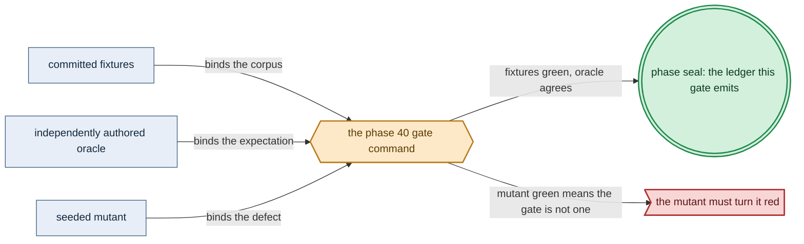

# Phase 40: Native Pulsar client (CBOR)

> **Purpose**: Stand up `amoebius-pulsar` — the one native-protocol Haskell Pulsar client (no WebSockets),
> its capability surface, its declarative topology algebra, its exclusively-CBOR payload codec, and its
> at-least-once + broker-side-dedup delivery contract — gated by a single command→event round-trip on
> `linux-cpu`.
> **Read this if**: phase 40 is next in the queue, or a later phase depends on what its gate establishes.

Phase 40 delivers the native Pulsar client (CBOR); its design is owned by [pulsar_client_doctrine.md](../documents/engineering/pulsar_client_doctrine.md), [substrate_doctrine.md](../documents/engineering/substrate_doctrine.md), and the plan for reaching it is owned here.
Register 3, live, on the `linux-cpu` substrate.
Validated 2026-08-10 with `python3 tools/phase35_gate.py --reuse-fresh-live`;
ledger `external-run-reference`.

> **Historical result (invalidated).** Any pass, seal, validation, ledger, receipt, or implementation observation
> in the orientation text above is diagnostic only. The Phase Status section and [tracker](README.md) own current state; the
> target contract below remains normative.

Link-graph metadata

**Status**: Authoritative source
**Supersedes**: N/A
**Referenced by**: DEVELOPMENT_PLAN/README.md, DEVELOPMENT_PLAN/legacy_tracking_for_deletion.md, DEVELOPMENT_PLAN/overview.md, DEVELOPMENT_PLAN/phase_35_platform_backbone.md, DEVELOPMENT_PLAN/phase_39_app_tenancy.md, DEVELOPMENT_PLAN/phase_41_user_tenant_isolation_live.md, DEVELOPMENT_PLAN/phase_42_content_store_workflow.md, DEVELOPMENT_PLAN/system_components.md
**Generated sections**: none

## Contents
- [Phase Status](#phase-status)
- [Phase Summary](#phase-summary)
- [Gate integrity](#gate-integrity)
- [Resource provision — the native Pulsar client envelope](#resource-provision--the-native-pulsar-client-envelope)
- [Doctrine adopted](#doctrine-adopted)
- [Sprints](#sprints)
- [Sprint 40.1: Fork supernova → amoebius-pulsar native binary protocol ⏸️](#sprint-401-fork-supernova--amoebius-pulsar-native-binary-protocol-)
- [Sprint 40.2: Capability surface + exclusively-CBOR payload codec ⏸️](#sprint-402-capability-surface--exclusively-cbor-payload-codec-)
- [Sprint 40.3: Declarative topology algebra + one-sided-link validation ⏸️](#sprint-403-declarative-topology-algebra--one-sided-link-validation-)
- [Sprint 40.4: At-least-once + broker-side dedup + the command→event round-trip gate ⏸️](#sprint-404-at-least-once--broker-side-dedup--the-commandevent-round-trip-gate-)
- [Sprint 40.5: Register-2.5 exactly-once effect under simulated redelivery ⏸️](#sprint-405-register-25-exactly-once-effect-under-simulated-redelivery-)
- [Documentation Requirements](#documentation-requirements)
- [Related Documents](#related-documents)

---

## Phase Status

⏸️ Blocked pending Phase-39 revalidation — **reopened 2026-08-16 by the natural-architecture amendment.**
[§S](development_plan_gate_integrity.md#s-universal-artifact-hygiene-gate) clause 15 requires a run to record
the natural architecture it proved and to execute no artifact of another. This phase's last gate recorded no
architecture, so its seal is invalidated as a current result and stands only as history; the rerun differs from
it by naming the lane and architecture the run actually used. A sprint marker below records what that sprint achieved before the amendment; under
[§N](development_plan_phase_model.md#n-reopening-and-amending-a-phase) it is a diagnostic, not surviving closure.

**Pre-natural-architecture status record (invalidated where it claims completion):**

Blocked (superseded) — containment amendment recorded 2026-08-15. Any earlier capability seal is historical and
invalidated until this phase reruns in numerical order with all amoebius-owned state confined to the
repository roots defined by Phase 0. Scope amendments below remain normative.

**Pre-containment status record (invalidated where it claims completion):**

Blocked (superseded) by the reopened numeric sequence. Reopened 2026-08-11: the prior seal did not include the universal artifact-hygiene
postcondition. This phase returns to numeric order only after Phase 0 closes, then must rerun its capability
gate against its source snapshot and publish repository-local evidence without changing an authored path.

**Invalidated historical record:**

**Done.** `amoebius-pulsar` now speaks Pulsar's native TCP binary protocol with generated protobuf command
types, mandatory CRC32C payload frames, typed CBOR-only application bodies, derived topics, all four
subscription types, seek, acknowledgement, and explicit producer sequence identities. Two fresh namespaces
round-tripped commands and events against the live HA service; external broker-admin readback established
duplicate collapse, unacked redelivery, replay, and complete teardown. The Register-2.5 battery explored 720
reorder/duplicate schedules and killed its unstable-key twin. The three committed source mutants and both
compile-refusal fixtures turn the unchanged gate red for their pinned reasons.

Every hardware substrate can always run the `linux-cpu` lane. When a validation needs a pristine Linux host,
use Incus on Linux or Linux-CUDA, Lima on Apple, and WSL2 on Windows; specialized lanes are additive.

## Phase Summary

This phase delivers amoebius's **one and only transport to Pulsar**: a single native-protocol Haskell client,
`amoebius-pulsar`, speaking Pulsar's TCP binary protocol directly. There is no WebSocket transport, no
HTTP-upgrade side-door, and no second-language runtime; this client replaces both sibling transports outright.
It owns four things. First, the **native binary protocol** — length-prefixed `proto-lens`-generated
`BaseCommand` frames, the `0x0e02`/`0x0e01` magic + mandatory CRC32C payload tail, and one persistent TCP
session per broker with lookup-based service discovery. Second, the **five-verb capability surface** —
lookup · produce · consume · subscribe · seek — with all four subscription types exposed (Exclusive, Failover,
Shared, Key_Shared) and role-selection deliberately left to the daemon-topology layer, so the client only
exposes and never picks. Third, the **exclusively-CBOR payload codec**: every application payload is CBOR
through a typed codec (`serialise`/`cborg`); a non-CBOR application body (JSON/base64/protobuf/raw) is
unrepresentable, while the protocol framing itself stays protobuf. Fourth, the **declarative topology algebra** — topic names are *derived* from a typed `RouteEntry` descriptor, never hand-written, and a graph
that fails one-sided-link / duplicate / empty-lane validation cannot be reconciled — and the **at-least-once + broker-side dedup** delivery contract, with `(producer_name, sequence_id)` as a first-class protocol field.

What this phase deliberately does **not** do: the three-tier content-addressed MinIO store and the
orchestrator/worker workflow runtime with Pulsar-Failover single-writer takeover (both Phase 42), the topic
storage-lifecycle reconcile (retention / size-triggered S3 offload / backlog quota, consumed later), and any
intra-cluster HA proof — Pulsar's own broker/bookie consensus is **delegated, not re-proven**. This phase
exposes the four subscription types but runs **no bespoke election**: any single-writer property is delegated
to the broker's subscription model.

**Substrate:** linux-cpu — the gate runs on a single-node `kind` cluster on a linux-cpu host. This choice does
not narrow portability: every hardware substrate always provides `linux-cpu`, directly or through its pristine
Linux VM framework (Incus on Linux/Linux-CUDA, Lima on Apple, WSL2 on Windows). The specialized topic lanes
remain additive and are exercised by later phases.

**Lane:** linux-cpu/amd64 ([§L](development_plan_standards.md#l-one-substrate-discipline))

**Register:** 3 (live infrastructure) — the gate runs against a real broker on a real cluster, not an
in-process fake.

**Gate:** `cabal test pulsar-client-live` is green: the `InForceSpec` test topology satisfies every committed
oracle, negative, mutant, and external sweep named in [Gate integrity](#gate-integrity), and emits a Register-3
proven/tested/assumed ledger with every layer outside Register 3 UNVERIFIED.

*Validated Phase-40 gate apparatus; [§M](development_plan_standards.md#m-gate-integrity-a-gate-cannot-be-passed-by-a-stub) owns its clauses.*

## Gate integrity

The run happens on a `linux-cpu` kind cluster with Pulsar up as a standard HA service (Phase 35). There the
`InForceSpec` test topology **round-trips a workflow command → event over the native Pulsar binary protocol
with broker-side deduplication enabled**, a **CBOR command/event payload round-trips byte-for-byte** through
the typed codec, and a **fixture attempting a non-CBOR payload fails to type-check** — the topology spinning
up, running, and tearing down leak-free and idempotently on re-run. The topic descriptor also round-trips its
required `StorageBudgetId` and complete `PulsarOffloadObjectDemand` source operands (segment size, offload
concurrency/rate window, deletion lag, failure/orphan horizon, and admission model); Phase 35 owns the live
MinIO geometry/drill.

The gate passes only when every clause below holds; each is checked against an **oracle-pinned oracle**
authored before `amoebius-pulsar` exists (§M.1), not a value regenerated from the client.

- **Committed oracle corpus (representative set, §M.7, §M.1).** The gate's representative set is named
  explicitly and committed under `amoebius-pulsar/test/golden/` in Phase 0: (a) spec-derived byte goldens for
  the `BaseCommand` frame set `{CONNECT, CONNECTED, LOOKUP_TOPIC, PRODUCER, PRODUCER_SUCCESS, SEND,
  SEND_RECEIPT, SUBSCRIBE, FLOW, MESSAGE, ACK, ACK_RESPONSE, SEEK}` derived by hand from the Pulsar protocol
  spec (never from `proto-lens` output of this fork); (b) a CBOR command vector and event vector with their
  hand-computed canonical-CBOR byte strings; (c) the non-CBOR negative fixtures of Sprint 40.2 V4 with their
  expected compile diagnostics; (d) the gate topology's `RouteEntry` descriptor `round_trip_dedup.dhall` and a
  hand-written expected derived-topic table (the `persistent://<tenant>/<ns>/<workflow>.<phase>.linux-cpu`
  strings), authored independently of `topicFor` (§M.3); (e) a pre-run snapshot of the standing Phase-35
  namespace's policy set.
- **Topology algebra is on the gate path (§M.3).** The gate topology's produced and consumed topic names are
  asserted equal to the committed expected derived-topic table of (d) — the gate uses `topicFor`-derived topics,
  not hand-written strings — and a companion negative gate run seeds the same topology with a one-sided link and
  asserts `validateTopology` refuses it **before any broker socket is opened**.
- **Non-CBOR foreclosure is checked by reason (§M.8).** The gate's non-CBOR clause passes only when the
  compile-fail harness matches each fixture's committed expected diagnostic and the API-surface golden of
  [§M](development_plan_standards.md#m-gate-integrity-a-gate-cannot-be-passed-by-a-stub) below holds; an ill-typed file failing for an unrelated reason does not satisfy it.
- **Committed seeded mutants must go red (§M.2).** The gate re-runs a committed mutant set and asserts each
  turns it red: (i) a `topicFor` mutant that emits a literal topic string instead of the derived name;
  (ii) a `validateTopology` mutant with the one-sided-link clause deleted (invariant-clause delete);
  (iii) a codec mutant exposing a raw-`ByteString` `produceRaw` (union-arm addition). A green gate under any
  mutant is a failed gate.
- **Leak-free is an external enumerate-and-compare sweep (§M.5).** "Leak-free" is defined as: after teardown,
  the harness enumerates all topics, subscriptions/cursors, and namespaces in the test tenant **by querying the standing broker's admin surface** (an observer external to the client under test, not the client's own
  bookkeeping) and asserts the set is empty, and asserts the standing Phase-35 namespace's policy set
  (including the deduplication policy) equals the pre-run snapshot of (e).
- **Idempotency forces an independent recompute (§M.6).** "Idempotent on re-run" means the topology is
  re-applied a second time against a **distinct test namespace** (cache-bypass: no reuse of the first run's
  namespace, cursors, or dedup cursor) and the setup/round-trip path is asserted to have actually executed on
  run 2 — a no-op served by leftover state from run 1 fails the gate.

## Resource provision — the native Pulsar client envelope

This phase instantiates the canonical resource matrix and sealed whole-deployment provision boundary from
[`resource_capacity_types.md §3.1`](../documents/engineering/resource_capacity_types.md#31-the-systematic-provision-matrix)
and [`§4`](../documents/engineering/resource_capacity_doctrine.md#4-the-total-fold-fits-carve-place-and-the-nesting);
embedded client demand must be charged to a canonical execution envelope.

`amoebius-pulsar` is a library, not a hidden standalone daemon: it creates no resource-free client Pod. A pure
`PulsarClientExecutionDemand` names maximum broker connections, producers, consumers, outstanding requests,
in-flight frames, frame/payload bytes, FLOW permits, redelivery/replay window, CBOR encode/decode workspace,
and reconnect burst. Binding compiles those operands into the complete `PodResourceEnvelope` of each consuming
orchestrator/worker. The Phase-40 live gate therefore declares a client-runner Pod with immutable image and OCI
import footprint; CPU, memory, and ephemeral-storage requests and limits; runtime working set; writable-root
and log headroom; projected credentials/config/service-account-token bytes; local volumes; pod slot;
exact byte-free `PodRuntimeMetadataSource` network-attachment identities and container-to-volume mount
identities; `cache = None`; and `accelerator = None`. Later phases must re-bind the same client demand into
their own Pod envelopes rather than borrowing the gate runner's capacity. The finite gate runner is
structurally a Job body with `completions=1`, `parallelism=1`, `restartPolicy=Never`, replacement-on-Failed,
bounded backoff, and finite terminal retention; it does not carry Deployment rollout fields. Its runtime-metadata
accounting is not restated here: the derivation of `KubeletRuntimeMetadataShape` from an expanded
`BoundExecutionUnit`, the private byte/role fold, the `SplitRuntime` split across backings, and the rule that
these physical bytes are never repeated as logical Pod ephemeral demand are all owned by
[`pulumi_iac_doctrine.md §1`](../documents/engineering/pulumi_iac_doctrine.md#1-pulumi-runs-only-from-inside-an-existing-amoebius-cluster).
This phase inherits that accounting unchanged; what it adds is the client demand bound into the gate runner's
own envelope.

Pure provision represents each planned epoch, and live preflight each observed snapshot, by one
`ProvisionedNodeRuntimeStorageAccounting` per node. Its planned-slot/observed-UID domain equals the assigned
Pods exactly, its qualified Pod metadata keys and image-model component keys form a disjoint exhaustive
partition, and its combined backing map debits each carve once. A missing/swapped role, wrong backing, scope or
domain mismatch, ownership hole/overlap, or alias double debit rejects before any broker socket opens.

Topics and subscriptions are not free either. Each descriptor retains its hot-ledger/backlog operands and its
required `StorageBudgetId` plus complete `PulsarOffloadObjectDemand` (exact topic identity, retained and segment
bytes, concurrent/rate-window offloads, deletion lag, failed/orphan horizon, mutation admission). The Phase-35
Pulsar provisioner merges these with BookKeeper/ZooKeeper, broker execution, and the closed six-arm MinIO
producer inventory. The whole-deployment check runs against a live snapshot before opening a broker socket or
changing a namespace policy. Only the private provisioned client/topic projection reaches the gate runner and
reconciler. Pure expansion gives every desired/prior object a `KubernetesApiObjectDemand`; live preflight
joins the observed old/new/apply transition map. `EtcdLogicalDemand { desiredObjects, churn, model }` derives
the private logical peak, which must fit `ControlPlaneStorageDemand.etcd.backendQuotaBytes`, before the
backend-at-quota plus WAL/snapshot/serialized-defrag peak separately fits its physical backing. Normalized live
Pod resources, API/etcd state, and broker topic/subscription/offload policy must equal the witness.

Exact-fit/one-short cases cover every client buffer/concurrency term, Pod CPU/memory/ephemeral/image/log term,
runtime-metadata shape/component/role and each grouped layout backing, hot ledger/backlog, object count/segment size, offload
concurrency/failure, budget, API-object revision/Event, and etcd term. Mutants that omit the
client runner, a reconnect/redelivery buffer, a subscription cursor, the offload producer, one desired API
object, a churn operand, metadata role/domain/ownership/grouping, the kubelet metadata model or largest simultaneous metadata row, or the etcd model must reject before
the first CONNECT or broker-admin mutation; a successful command/event round-trip cannot excuse an omitted
provision.

## Doctrine adopted

- [`pulsar_client_doctrine.md §1`](../documents/engineering/pulsar_client_doctrine.md#1-one-client-one-wire-no-websockets)
  — *one client, one wire, no WebSockets*: this phase builds the single native-protocol client the doctrine
  mandates and deletes both sibling WebSocket/Node transports; lookup, produce, consume, subscribe, and seek
  ride the native protocol or they do not happen.
- [`pulsar_client_doctrine.md §3`](../documents/engineering/pulsar_client_doctrine.md#3-the-native-binary-protocol)
  and [`§4`](../documents/engineering/pulsar_client_doctrine.md#4-forked-from-supernova--what-amoebius-inherits-and-what-it-builds)
  — *the native binary protocol* and *forked from supernova*: `proto-lens`-generated `BaseCommand` framing
  with hand-written size prefixes / magic / CRC32C only, one persistent TCP session per broker, forked from
  `cr-org/supernova` onto the repo-wide GHC 9.12.4 pin — treated as a *starting point with sibling provenance*,
  not a proven foundation.
- [`pulsar_client_doctrine.md §5`](../documents/engineering/pulsar_client_doctrine.md#5-the-capability-surface-lookup--produce--consume--subscribe--seek)
  — *the capability surface: lookup · produce · consume · subscribe · seek*: long-lived producers,
  flow-controlled consumers, all four subscription types exposed (the client exposes, the daemon-topology
  layer picks), and seek-based replay.
- [`pulsar_client_doctrine.md §3.1`](../documents/engineering/pulsar_client_doctrine.md#31-payloads-are-exclusively-cbor)
  — *payloads are exclusively CBOR*: every application payload is CBOR through a typed codec, canonical where
  content-addressed; a non-CBOR body has no inhabitant
  ([`illegal_state_catalog.md §3.23`](../documents/illegal_state/illegal_state_capability_messaging.md#323-a-non-cbor-pulsar-payload)).
- [`pulsar_client_doctrine.md §6`](../documents/engineering/pulsar_client_doctrine.md#6-the-declarative-topology-algebra)
  — *the declarative topology algebra*: topic names are a derived function of a typed `RouteEntry`, and an
  unroutable graph is a validation error returning the full violation list, not a runtime mystery.
- [`pulsar_client_doctrine.md §7`](../documents/engineering/pulsar_client_doctrine.md#7-delivery-at-least-once-with-broker-side-dedup-the-robust-default)
  — *delivery: at-least-once with broker-side dedup*: at-least-once made effectively-once by **broker-side**
  namespace deduplication on `(producer_name, sequence_id)`; intra-cluster consensus is delegated, not
  re-proven.
- [`substrate_doctrine.md`](../documents/engineering/substrate_doctrine.md#3-the-no-environment--no-path-lazy-tool-ensure-contract) [§3](../documents/engineering/substrate_doctrine.md#3-the-no-environment--no-path-lazy-tool-ensure-contract) — *the no-environment / no-`PATH` lazy tool-ensure contract*: the supernova fork's `protoc`/`proto-lens` codegen is discovered lazily by full path through the
  substrate package manager — no host-`PATH` lookup for code generation and no ambient-environment client
  configuration.

## Sprints

> **Current revalidation rule.** Every sprint is blocked by the reopened numeric sequence. Historical dates,
> pass/seal claims, repository-resident evidence paths, and `Remaining Work: None` statements below describe
> the pre-amendment capability record only; they do not override current status. Functional and validation
> outcomes remain target requirements. Any instruction to commit generated output, freeze dependency resolution,
> retain a resolved version, path, or integrity hash, or consume repository-resident evidence, ledgers, or
> enumerations is superseded by the current generated-artifact and dynamic-resolution doctrine. Closure requires
> the current phase gate plus universal artifact hygiene.

## Sprint 40.1: Fork supernova → amoebius-pulsar native binary protocol ⏸️

**Status**: Blocked by the reopened numeric sequence; prior capability footprint retained for migration
the live native socket exchange are validated.
**Implementation**: `amoebius-pulsar/src/Amoebius/Pulsar/Frame.hs`,
`amoebius-pulsar/src/Amoebius/Pulsar/Connection.hs`, and `amoebius-pulsar/proto/PulsarApi.proto` — the
authored source; `Proto/PulsarApi.hs` is `proto-lens`-generated at build from that `.proto`, never hand-written
(delivered and validated).
**Blocked by**: reopened numeric predecessor gates.
**Independent Validation**: golden-frame encode/decode round-trips of representative `BaseCommand` types byte-for-byte
against spec-derived fixtures; a CONNECT → CONNECTED → LOOKUP_TOPIC exchange against a single-node broker
resolves a topic owner through any redirects; a deliberately corrupted CRC32C payload frame yields a
structured decode error, never a silent drop.
**Docs to update**:
`documents/engineering/pulsar_client_doctrine.md` (§3, §4), `documents/engineering/substrate_doctrine.md`
(the no-env/no-`PATH` lazy `protoc` discovery the fork conforms to).

### Objective
Adopt [`pulsar_client_doctrine.md §3`](../documents/engineering/pulsar_client_doctrine.md#3-the-native-binary-protocol)
and [`§4`](../documents/engineering/pulsar_client_doctrine.md#4-forked-from-supernova--what-amoebius-inherits-and-what-it-builds):
fork `cr-org/supernova` into the `amoebius-pulsar` package on the repo-wide GHC 9.12.4 pin, and stand up the
framing layer, the CONNECT/CONNECTED handshake, and LOOKUP-based service discovery over one persistent TCP
session per broker — the supernova provenance as **sibling evidence, not an amoebius result**.

### Deliverables
- The `amoebius-pulsar` cabal package forked from supernova, dependency bounds bumped to GHC 9.12.4.
- A frame codec: simple commands (`totalSize` · `commandSize` · `command`) and payload commands (command +
  optional broker-entry-metadata block behind `0x0e02` + magic `0x0e01` + mandatory CRC32C + `metadata` + raw
  `payload`), rejecting any frame over the 5 MiB maximum; only the framing is hand-written, never the protobuf
  bodies.
- `proto-lens`-generated `PulsarApi` (`BaseCommand` + message metadata) from `PulsarApi.proto`; hand-rolled
  protobuf body parsing is forbidden.
- A `Connection` that performs CONNECT → CONNECTED and resolves topics by looping on `LOOKUP_TOPIC`
  Connect/Redirect responses, multiplexing producers and consumers by `producer_id` / `consumer_id` /
  `request_id`.
- A structural `PulsarClientExecutionDemand` for connection/request/frame/reconnect peaks, bound into the
  complete envelope of the Phase-40 client-runner Pod and, later, each actual consumer Pod; there is no
  separately scheduled or uncharged client service.
- Any codegen tool (`protoc`) discovered lazily by full path through the substrate package manager — no
  environment variable, no `PATH` lookup, anywhere in the build or runtime path.

### Validation
1. Encode/decode golden frames for representative `BaseCommand` types and assert byte-for-byte equality
   against spec-derived fixtures.
2. Drive CONNECT → CONNECTED → LOOKUP_TOPIC against a single-node broker on the `linux-cpu` kind cluster and
   assert the client reaches an owning broker through any redirects.
3. Flip one byte of a payload frame's body and assert a structured CRC32C-mismatch decode error, never a
   silent drop.
4. Make the client-runner CPU, memory, ephemeral, image/import, log, connection, outstanding-frame, or
   reconnect term one unit short in turn; each fixture refuses before CONNECT. The exact-fit runner's live
   requests/limits/image/local storage normalize to the private provisioned projection.

### Remaining Work
None.

## Sprint 40.2: Capability surface + exclusively-CBOR payload codec ⏸️

**Status**: Blocked by the reopened numeric sequence; prior capability footprint retained for migration
golden, and raw-payload compile refusal are validated.
**Implementation**: `amoebius-pulsar/src/Amoebius/Pulsar/Producer.hs`,
`amoebius-pulsar/src/Amoebius/Pulsar/Consumer.hs`, `amoebius-pulsar/src/Amoebius/Pulsar/Subscription.hs`,
`amoebius-pulsar/src/Amoebius/Pulsar/Seek.hs`, `amoebius-pulsar/src/Amoebius/Pulsar/Cbor.hs` (the typed CBOR
payload codec on `serialise`/`cborg`) — delivered and validated.
**Blocked by**: reopened numeric predecessor gates.
**Independent Validation**: run against the **live single-node `kind`-cluster broker (Register 3)** — the same
standing Pulsar service as the gate, not an in-process fake — so every frame-level assertion is wire-real. The
numbered `### Validation` list below carries the producer, consumer, subscription, seek, and codec obligations.
**Docs to update**: `documents/engineering/pulsar_client_doctrine.md` (§5, §3.1),
`documents/illegal_state/illegal_state_catalog.md` (§3.23).

### Objective
Adopt [`pulsar_client_doctrine.md §5`](../documents/engineering/pulsar_client_doctrine.md#5-the-capability-surface-lookup--produce--consume--subscribe--seek)
and [`§3.1`](../documents/engineering/pulsar_client_doctrine.md#31-payloads-are-exclusively-cbor): build the
five-verb client surface — long-lived producers, flow-controlled consumers, all four subscription types, and
seek-based replay — over the persistent session from Sprint 40.1, with **every application payload encoded exclusively as CBOR** through a typed codec.

### Deliverables
- A producer: `PRODUCER` → `PRODUCER_SUCCESS` binds a `producer_id` + `producer_name`; each `SEND` carries
  `producer_id` and a first-class `sequence_id`; replies are `SEND_RECEIPT` (with `message_id`) or
  `SEND_ERROR`. One long-lived producer session — no per-publish connection churn, no base64-in-JSON inflation.
- A consumer: `SUBSCRIBE` binds a `consumer_id` + subscription; consumer-granted `FLOW` permits are the
  backpressure knob; the broker pushes `MESSAGE` frames; the consumer `ACK`s and receives `ACK_RESPONSE`.
- All four subscription types exposed — **Exclusive**, **Failover** (primary + name-ordered standbys),
  **Shared** (round-robin), **Key_Shared** (same key → same consumer); the client exposes all four and does
  **not** pick and runs **no** election — role-selection is owned by the daemon-topology layer.
- `SEEK` repositioning a subscription to an earlier `message_id` or timestamp for replay.
- A typed **CBOR payload codec** (`Amoebius.Pulsar.Cbor`, on `serialise`/`cborg`): `produce`/`consume` accept
  only a `Serialise`-constrained value (equivalently a `CborPayload` whose sole constructor is
  `encodeCbor :: Serialise a => a -> CborPayload`); there is **no** `produceRaw`, no JSON/protobuf/base64 path,
  so a non-CBOR body is unrepresentable (type-foreclosed). Consume is a total `Either DecodeError a`. Canonical
  CBOR (shared with the store's canonical encoder, Phase 42) is used where the payload is content-addressed; a
  large-artifact payload carries a manifest-SHA reference, never the raw blob inline; the broker sees opaque
  `BYTES`.

### Validation
1. Produce N messages over one persistent producer and assert N `SEND_RECEIPT`s with monotonic `message_id`s.
2. For each subscription type, attach the matching consumer set and assert its delivery shape (single reader;
   primary-then-standby ordering; round-robin spread; per-key affinity).
3. Consume a prefix, `SEEK` back, and assert the earlier messages are redelivered.
4. A typed command/event round-trips through the CBOR codec byte-for-byte against the oracle-pinned CBOR
   vector. Non-CBOR foreclosure is proven **by specific reason** (§M.8), not by any compile failure: the
   compile-fail harness carries one negative fixture **per foreclosed route** — raw `ByteString`, JSON,
   base64 — each committed in this phase's oracle-pinning sprint with its expected diagnostic (respectively `No instance for (Serialise
   ByteString)` / `produceRaw not in scope` / `No instance for (Serialise …)` as authored), each paired with a
   positive fixture that differs only in wrapping the body through `encodeCbor` and does type-check; the harness
   asserts the diagnostic *matches the committed tag*, so a fixture that fails for an unrelated reason (typo,
   missing import) does not satisfy the clause. An **API-surface golden** — a committed hand-authored expected
   listing (independent of the codec source, §M.3) of `amoebius-pulsar`'s exported `produce`/`consume`
   signatures — is diffed against the package's actual export list and asserts **no exported function accepts an unconstrained `ByteString` payload** and no `produceRaw`/frame-level raw-send is exported. A committed seeded
   mutant that re-adds a `produceRaw :: ByteString -> …` export (union-arm addition operator) must turn this
   validation red. A corrupted CBOR body yields a structured `Left DecodeError` on consume (decode-foreclosed,
   like CRC32C), never a silent misread.
5. A consumer grants `FLOW` permits, receives `MESSAGE` frames up to those permits, and `ACK`s each one,
   confirmed by the broker's `ACK_RESPONSE`.

### Remaining Work
None.

## Sprint 40.3: Declarative topology algebra + one-sided-link validation ⏸️

**Status**: Blocked by the reopened numeric sequence; prior capability footprint retained for migration
violations are validated, including the deleted-clause mutant.
**Implementation**: `amoebius-pulsar/src/Amoebius/Pulsar/Topology.hs` — delivered and validated.
**Blocked by**: reopened numeric predecessor gates.
**Independent Validation**: property tests that `topicFor` derives
`persistent://<tenant>/<namespace>/<workflow>.<phase>.<substrate>` from a typed `RouteEntry`, checked against
an **oracle-pinned hand-authored expected-topic table** — a distinct spec of the naming scheme, not
`topicFor`'s own output re-fed as its own oracle (§M.3). The numbered `### Validation` list below carries the
violation-list and exemption obligations.
**Docs to update**:
`documents/engineering/pulsar_client_doctrine.md` (§6).

### Objective
Adopt [`pulsar_client_doctrine.md §6`](../documents/engineering/pulsar_client_doctrine.md#6-the-declarative-topology-algebra):
make topic names a derived function of a typed descriptor and make an unroutable graph a validation error, not
a runtime mystery — the illegal-state-unrepresentable principle applied to the message bus.

### Deliverables
- A typed `RouteEntry { workflow, phase, lanes, liveness }` descriptor as the single source of truth, and a
  `topicFor` derivation producing the fully-qualified `<workflow>.<phase>.<substrate>` topic — no hand-written
  topic strings anywhere.
- Both the per-substrate reconciled topic set and a substrate-stripped *logical* topic family derived from the
  same descriptor, so per-substrate routing cannot diverge from the declared logical set.
- `validateTopology` rejecting (1) duplicate derived topics, (2) entries with no lanes, (3) one-sided
  links on a `(workflow, lane)` pair — an input with no report, or a report with no producing input — with an
  explicit `emit-only` exemption, (4) `MonitoringInfeasible workflow reason` — a declared freshness below the
  achievable scrape interval, or a derived recording-rule cost overflowing the `Observability` workload's
  capacity — and (5) `UnroutedMonitor workflow` — a `routes[].workflow` naming no owning `Workflow` record;
  it returns the **full** list of violations so an author fixes the whole graph
  in one pass. Clauses (4) and (5) are the monitoring extension of the fold adopted from
  [`monitoring_doctrine.md §3`](../documents/engineering/monitoring_doctrine.md#3-derivation-and-the-operator-read-model)
  and are the reason the topology SSoT is a per-workflow `Workflow` record rather than a bare
  `List RouteEntry`.

### Validation
1. Property test: for each generated `RouteEntry`, `topicFor descriptor` equals the entry computed by the
   **oracle-pinned independent expected-topic table** (§M.3) — not merely equal to `topicFor` mapped over
   the descriptor, which is a tautology. "No code path accepts a literal topic string" is made concrete as a
   **type-level foreclosure that reaches the wire layer**: `Connection`'s `LOOKUP_TOPIC` and the produce/consume
   entry points accept only a `Topic` newtype whose sole constructor is private and produced only by `topicFor`;
   an **API-surface golden** (committed, hand-authored) asserts no exported function on the reconcile-or-wire
   path takes a bare `Text`/`String` topic, and a committed compile-fail fixture attempting to build a `Topic`
   from a string literal fails with its expected diagnostic.
2. Feed validation graphs with seeded duplicate / empty-lane / one-sided-link defects and assert the complete
   violation list (not just the first) is returned. The property generator carries `cover`/`classify`
   obligations (§M.4) forcing each defect class — duplicate, empty-lane, one-sided-link, and the multi-defect
   graph — to fire in **≥20%** of generated cases each, so the reject path is exercised, not a near-constant
   legal graph. A committed seeded mutant with the one-sided-link clause deleted from `validateTopology`
   (invariant-clause-delete operator) must turn this validation red.
3. Assert an `emit-only` workflow with unsourced reports validates — the `gc` exemplar, accepted despite
   having reports with no producing input — while the same graph without the exemption
   is rejected: a positive/negative pair differing only in the exemption flag (§M.8).
4. Prove the algebra is on the gate path, not dead code (§M.3): the gate topology `round_trip_dedup.dhall`
   carries a committed `RouteEntry` descriptor, and the Sprint 40.4 gate run asserts the actually-produced and
   actually-consumed topic names equal the committed derived-topic table — the reconcile/gate path derives its
   topics through `topicFor`, never from hand-written strings.

### Remaining Work
None.

## Sprint 40.4: At-least-once + broker-side dedup + the command→event round-trip gate ⏸️

**Status**: Blocked by the reopened numeric sequence; prior capability footprint retained for migration
duplicate collapse, redelivery, seek replay, independent state readback, and leak-free cleanup.
**Implementation**: `amoebius-pulsar/src/Amoebius/Pulsar/Dedup.hs`,
`amoebius-pulsar/src/Amoebius/Pulsar/Namespace.hs` (the namespace dedup-policy reconcile),
`amoebius-pulsar/src/Amoebius/Pulsar/Provision.hs`, `amoebius-pulsar/test/PulsarClientLiveSpec.hs`, and
`tools/phase35_pulsar_live.py` — delivered and validated.
**Blocked by**: reopened numeric predecessor gates.
**Independent Validation**: with namespace deduplication enabled the broker rejects a retried
`(producer_name, sequence_id)` at ingest and redelivers the un-acked message after a consumer crash, and
distinct keys never share one dedup cursor. The numbered `### Validation` list below carries the gate run, the
dedup drill, and the leak-free sweep.
**Docs to update**: `documents/engineering/pulsar_client_doctrine.md` (§7), `DEVELOPMENT_PLAN/README.md` (flip the
Phase-40 status when the gate passes).

### Objective
Adopt [`pulsar_client_doctrine.md §7`](../documents/engineering/pulsar_client_doctrine.md#7-delivery-at-least-once-with-broker-side-dedup-the-robust-default):
default to at-least-once delivery made effectively-once by **broker-side** deduplication, so a retried
producer or a redelivered consumer cannot corrupt idempotent state — then assemble the phase gate: a
command→event round-trip over the native protocol with dedup on and CBOR payloads.

### Deliverables
- The **broker half**: a reconcile step that enables Pulsar's namespace deduplication policy so the broker
  tracks `(producer_name, sequence_id)` and rejects duplicates at ingest.
- The **producer half**: every publish carries a stable `producer_name` and a monotonic `sequence_id` within
  that producer scope, with producer-name scoping chosen so unrelated keys never share one dedup cursor.
- The `sequence_id` derivation: when a message has a causal upstream `MessageId`
  (`<ledgerId>:<entryId>:<partition>:<batchIdx>`), pack `ledgerId`/`entryId` into a 64-bit `sequence_id`;
  otherwise fall back to a stable hash of a generated request id paired with a request-scoped producer name.
- At-least-once consumer discipline: `ACK` only after processing; un-acked messages are redelivered after a
  crash or rebalance.
- The gate `round_trip_dedup.dhall` `InForceSpec` topology, carrying a committed `RouteEntry` descriptor so its
  topics are `topicFor`-derived, not hand-written: bring up against the standing Pulsar service, produce a
  workflow `command`, consume it, produce the corresponding `event`, consume it back — all CBOR — and always
  tear down, emitting a per-run proven/tested/assumed ledger.
- A pure provision boundary covering the client runner, exact topic/subscription/cursor set, hot
  BookKeeper/ZooKeeper demand, and complete `PulsarOffloadObjectDemand`/`StorageBudgetId`, followed by
  snapshot-bound preflight of observed/reserved/terminating identities and node runtime/image-storage rows; no
  broker socket or namespace mutation occurs on `Left ProvisionError` or live-preflight refusal.
- The oracle-pinned gate oracles (§M.1), authored before the client exists: the CBOR command/event byte
  vectors, the hand-authored expected derived-topic table, the standing-namespace pre-run policy snapshot, and
  the committed seeded-mutant set (topicFor-literal, one-sided-link-clause-deleted, produceRaw-re-added) each
  asserted to turn the gate red (§M.2).

### Validation
1. Run the gate topology end-to-end on the `linux-cpu` kind cluster and assert: a workflow command round-trips
   to an event over the native protocol with broker-side dedup enabled; the CBOR payloads round-trip
   byte-for-byte against the oracle-pinned CBOR command/event vectors; the produced and consumed topic
   names equal the committed derived-topic table (§M.3, algebra on the gate path); a fixture attempting a
   non-CBOR payload fails to type-check with its committed expected diagnostic (§M.8). A companion negative gate
   run seeds the same topology with a one-sided link and asserts `validateTopology` refuses it **before any broker socket is opened**.
2. Enable namespace dedup, publish the same `(producer_name, sequence_id)` twice, and assert the broker
   collapses the duplicate; kill a consumer between receive and `ACK` and assert redelivery on reconnect.
3. **Idempotency (§M.6) — re-apply, not re-run-from-clean.** Re-apply the topology a second time against a
   **distinct test namespace** (cache-bypass: no reuse of run 1's namespace, cursors, producer name, or dedup
   cursor) and assert the setup/round-trip path **actually executed** on run 2 (a no-op served by leftover run-1
   state fails); re-enabling the namespace dedup policy on an already-enabled namespace is a no-op success
   (idempotent). **Leak-free teardown** is proven by an **external enumerate-and-compare sweep** (§M.5): after
   teardown, an observer external to the client queries the standing broker's admin surface and asserts the test
   tenant contains **zero** topics, subscriptions/cursors, and namespaces, and asserts the standing Phase-35
   namespace's policy set (including the deduplication policy) equals the oracle-pinned pre-run snapshot —
   subscriptions, stray topics, and a left-enabled dedup policy each fail the assertion. Emit the Register-3
   ledger — the deferred content-store, workflow-runtime, and cross-cluster surfaces (Phase 42 and later)
   recorded UNVERIFIED, never green.
4. Run one-short and omission mutants for the client-runner envelope, session buffers, cursor/backlog, offload
   demand, both SplitRuntime metadata backings, role resolution, planned/observed domain, qualified ownership,
   and alias grouping. Assert zero CONNECT frames and zero broker-admin writes for every rejection; for the
   exact-fit twin, externally read Pod and broker policy/state normalize exactly to the provisioned value.

> **Honesty.** infernix's duplicate-collapse was validated against a real broker — but **over WebSockets, in > infernix**. That is *sibling evidence*, not an amoebius result; this sprint re-implements the contract over
> the native protocol and proves it here for the first time. Pulsar's own broker/bookie consensus is
> delegated, not re-proven.

### Remaining Work
None. The content store, workflow runtime, cross-cluster correspondence, and broker consensus internals remain
explicitly UNVERIFIED under their owning later phases.

## Sprint 40.5: Register-2.5 exactly-once effect under simulated redelivery ⏸️

**Status**: Blocked by the reopened numeric sequence; prior capability footprint retained for migration
and the unstable-key twin replays red.
**Implementation**: `amoebius-pulsar/test/PulsarDedupSimSpec.hs`, driving the production
`amoebius-pulsar/src/Amoebius/Pulsar/Dedup.hs` fold — delivered and validated.
**Blocked by**: reopened numeric predecessor gates.
**Independent Validation**: the real dedup fold, keyed by a replication-surviving work-id, upholds the
**exactly-once effect** invariant (R3) on every schedule the simulation explores. Deterministically
replayable, substrate `none`, Register 2.5. The numbered `### Validation` list below carries the injected
fault set and the broken-fold control.
**Docs to update**: `documents/engineering/deterministic_simulation_doctrine.md` (Phase-40 status backlink),
`documents/engineering/pulsar_client_doctrine.md`, `DEVELOPMENT_PLAN/system_components.md`.

### Objective
Adopt [`deterministic_simulation_doctrine.md §3/§4`](../documents/engineering/deterministic_simulation_doctrine.md#3-the-simulated-environment-and-its-fault-model)
and the R3 rule ([`chaos_failover_doctrine.md §13`](../documents/engineering/chaos_failover_doctrine.md#13-the-supporting-rules--the-conditions-the-moves-need)):
validate that the *built* dedup fold makes at-least-once delivery effectively-once under adversarial
redelivery/reorder/crash schedules **in-process and deterministically replayable**, before the Register-3 live
gate — the interleaving a single-threaded test cannot reach.

### Deliverables
- The `PulsarDedupSimSpec` battery: the real dedup fold under `IOSimPOR` against the modeled Pulsar, asserting
  no-loss + no-double-apply on every explored schedule under injected
  reorder/duplicate/crash-mid-acknowledge/partition faults.
- A Register-2.5 proven/tested/assumed ledger — the fold upholds exactly-once under the modeled schedules and
  faults; honest limit: modeled-Pulsar fidelity is **assumed**, discharged by the Sprint 40.4 Register-3 live
  gate. The dedup fold is the amoebius-owned part; Pulsar's own broker/bookie consensus stays delegated and is
  only *modeled* here.

### Validation
1. `cabal test pulsar-dedup-sim` is green — no schedule loses or double-applies an effect; a deliberately broken
   fold (a non-stable key, an ack-before-process) is caught red; the discovered counterexample replays
   identically under its seed.

### Remaining Work
None. Modeled-broker fidelity is discharged only to the extent covered by the Register-3 live run.

## Documentation Requirements

**Engineering docs to update (when the gate runs, flip the honest layer, never before):**
- `documents/engineering/pulsar_client_doctrine.md` — record that §1, §3–§7 (no-WebSockets rule, native
  protocol, supernova fork, capability surface, topology algebra, dedup contract) **and §3.1 (the exclusively-CBOR payload codec)** are realized in `amoebius-pulsar`; flip the relevant sibling-evidence
  honesty notes to delivered once the gate runs (status itself stays in this plan).
- `documents/illegal_state/illegal_state_catalog.md` — annotate §3.23 (non-CBOR payload) with its realized
  layer: produce-side type-foreclosed uninhabitable, consume-side decode-foreclosed total decode, no
  runtime-checked claim.
- `documents/engineering/substrate_doctrine.md` — record that the supernova fork's `protoc`/`proto-lens`
  codegen conforms to the no-env/no-`PATH` lazy-tool-ensure contract.
- `documents/engineering/daemon_topology_doctrine.md` — record that the client exposes all four subscription
  types (including Failover) but runs no election; role-selection and single-writer takeover are that doc's,
  landing in Phase 41.

**Cross-references to add:**
- `DEVELOPMENT_PLAN/system_components.md` — register the `amoebius-pulsar` package and its target module paths
  (`Frame`, `Connection`, `Proto/PulsarApi`, `Producer`, `Consumer`, `Subscription`, `Seek`, `Cbor`,
  `Topology`, `Dedup`, `Namespace`) as Phase-40 design-first rows against the component inventory.
- `DEVELOPMENT_PLAN/substrates.md` — record Phase 40's gate substrate (`linux-cpu`) in the per-phase substrate
  map, and the topology algebra's per-substrate topic lanes.
- `DEVELOPMENT_PLAN/README.md` — flip the Phase-40 row's status from this plan once the gate passes; link this
  document.

## Related Documents
- [README.md](README.md) — the live tracker and phase order this document serves
- [development_plan_standards.md](development_plan_standards.md) — the rulebook this document obeys ([§D](development_plan_standards.md#d-the-per-phase-document-skeleton) skeleton, [§F](development_plan_standards.md#f-the-sprint-block-format) sprint format, [§H](development_plan_standards.md#h-the-doctrine-citation-rule-cite-by-name) citation rule, [§K](development_plan_standards.md#k-honesty-proven--tested--assumed) honesty/registers, [§L](development_plan_standards.md#l-one-substrate-discipline) one-substrate discipline)
- [overview.md](overview.md) — the target architecture and cross-cutting invariants (the CBOR-only payload and no-WebSockets rules)
- [substrates.md](substrates.md) — the substrate registry and per-phase substrate map
- [system_components.md](system_components.md) — the target component inventory for the module paths above
- [Native Pulsar Client Doctrine](../documents/engineering/pulsar_client_doctrine.md) — the adopted transport,
  capability, topology, CBOR-payload, and dedup doctrine
- [Deterministic Simulation Doctrine](../documents/engineering/deterministic_simulation_doctrine.md) — the Register-2.5 io-sim environment the dedup fold's exactly-once is validated against in Sprint 40.5
- [Illegal State Catalog](../documents/illegal_state/illegal_state_catalog.md) — [§3.23](../documents/illegal_state/illegal_state_capability_messaging.md#323-a-non-cbor-pulsar-payload), the non-CBOR payload made
  unrepresentable
- [Substrate Doctrine](../documents/engineering/substrate_doctrine.md) — the no-env/no-`PATH` lazy tool
  discovery the fork conforms to
- [Daemon Topology Doctrine](../documents/engineering/daemon_topology_doctrine.md) — who runs producers/
  consumers and picks subscription roles (Phase 42), delegated here
- [phase_35](phase_35_platform_backbone.md) — the standard-service stack that brings Pulsar up HA
- [phase_39](phase_39_app_tenancy.md) — the app tenancy this phase opens after
- [phase_42](phase_42_content_store_workflow.md) — the content store + workflow runtime that consumes this
  client
