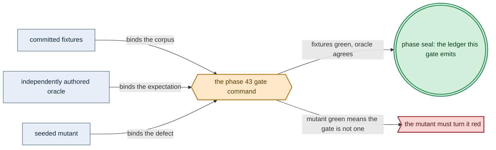

# Phase 43: Keycloak-owned ingress

> **Purpose**: Wire the single Keycloak-owned wild-ingress door — LoadBalancer → Envoy/Gateway API →
> Keycloak — on the standard service stack, prove no workload can publish its own wild ingress, and confirm the
> retained-storage rebind regression still holds behind the new edge.
> **Read this if**: phase 43 is next in the queue, or a later phase depends on what its gate establishes.

Phase 43 delivers the Keycloak-owned ingress; its design is owned by [ui_realtime_coordination_doctrine.md](../documents/engineering/ui_realtime_coordination_doctrine.md), [platform_services_doctrine.md](../documents/engineering/platform_services_doctrine.md), [pulumi_iac_doctrine.md](../documents/engineering/pulumi_iac_doctrine.md), and the plan for reaching it is owned here.
Register 3, live, on the `linux-cpu` substrate.
Validated 2026-08-10 with `python3 tools/keycloak_ingress_gate.py`; ledger
`dynamically-resolved`.

> **Historical result (invalidated).** Any pass, seal, validation, ledger, receipt, or implementation observation
> in the orientation text above is diagnostic only. The Phase Status section and [tracker](README.md) own current state; the
> target contract below remains normative.

Link-graph metadata

**Status**: Authoritative source
**Supersedes**: N/A
**Referenced by**: DEVELOPMENT_PLAN/README.md, DEVELOPMENT_PLAN/development_plan_standards.md, DEVELOPMENT_PLAN/overview.md, DEVELOPMENT_PLAN/phase_41_platform_backbone.md, DEVELOPMENT_PLAN/phase_42_platform_services_2.md, DEVELOPMENT_PLAN/phase_44_live_dsl_deploy.md, DEVELOPMENT_PLAN/phase_45_app_tenancy.md, DEVELOPMENT_PLAN/system_components.md, documents/engineering/vault_pki_doctrine.md
**Generated sections**: none

## Contents
- [Phase Status](#phase-status)
- [Phase Summary](#phase-summary)
- [Gate integrity](#gate-integrity)
- [Resource provision — the edge / Patroni / ACME envelope](#resource-provision--the-edge--patroni--acme-envelope)
- [Doctrine adopted](#doctrine-adopted)
- [Sprints](#sprints)
- [Sprint 43.1: The Keycloak-owned edge — LoadBalancer → Envoy/Gateway API → Keycloak ⏸️](#sprint-431-the-keycloak-owned-edge--loadbalancer--envoygateway-api--keycloak-)
- [Sprint 43.2: No self-published wild ingress + public-edge TLS ⏸️](#sprint-432-no-self-published-wild-ingress--public-edge-tls-)
- [Sprint 43.3: East-west NetworkPolicy posture — derived default-deny ⏸️](#sprint-433-east-west-networkpolicy-posture--derived-default-deny-)
- [Sprint 43.4: The single-door + storage-rebind regression gate ⏸️](#sprint-434-the-single-door--storage-rebind-regression-gate-)
- [Documentation Requirements](#documentation-requirements)
- [Related Documents](#related-documents)

---

## Phase Status

⏸️ Blocked pending Phase-42 revalidation — **reopened 2026-08-16 by the natural-architecture amendment.**
[§S](development_plan_gate_integrity.md#s-universal-artifact-hygiene-gate) clause 15 requires a run to record
the natural architecture it proved and to execute no artifact of another. This phase's last gate recorded no
architecture, so its seal is invalidated as a current result and stands only as history; the rerun differs from
it by naming the lane and architecture the run actually used. A sprint marker below records what that sprint achieved before the amendment; under
[§N](development_plan_phase_model.md#n-reopening-and-amending-a-phase) it is a diagnostic, not surviving closure.

**Pre-natural-architecture status record (invalidated where it claims completion):**

Blocked (superseded) — containment amendment recorded 2026-08-15. Any earlier capability seal is historical and
invalidated until this phase reruns in numerical order with all amoebius-owned state confined to the
repository roots defined by Phase 0. Scope amendments below remain normative.

**Pre-containment status record (invalidated where it claims completion):**

Blocked (superseded) by the reopened numeric sequence. Reopened 2026-08-11: the prior seal did not include the universal artifact-hygiene
postcondition. This phase returns to numeric order only after Phase 0 closes, then must rerun its capability
gate against its source snapshot and publish repository-local evidence without changing an authored path.

**Observed artifact migration — 2026-08-11:** the live gate reads
`test/fixture/keycloak_ingress/expected-base-digest.txt`, a copy of the Phase-36 image observation. The file must be
removed; image provenance is checked against Phase 36's verified attestation and the current registry catalog.

**Invalidated historical record:**

**Done.** All four sprints are implemented and the Phase-43 gate is sealed. The retained linux-cpu stack
now has one externally reachable LoadBalancer, a typed Gateway/HTTPRoute projection, two Ready static Envoy
data-plane replicas, the real Envoy Gateway v1.4.2 controller runners, Keycloak 26.3.2, and a dedicated
three-member strict-synchronous Patroni cluster for the Keycloak consumer. The Percona CR is observed by the
real Phase-42 operator; as in Phase 42, the exact Patroni child is honestly recorded as an amoebius-owned
manual child projection rather than falsely attributed to the operator. The GatewayClass similarly uses the
amoebius manual-projection controller name: Envoy Gateway's provider/Gateway API/xDS runners are live and
observed, while the baked static Envoy Deployment is the data plane rendered from the typed route projection.

The gate positively obtains an OIDC token and serves every pinned route from host, WAN, LAN, and localhost
origins; rejects unauthenticated HTTP and invalid WebSocket tuples; proves the localhost-only NodePort is
unreachable off-host; turns a committed backdoor seed red and returns clean; exercises default-deny policy
through deny→allow→deny graph variation; records Vault-derived TLS/EAB provenance; and finds 93 live SSA
objects owned by field manager `amoebius`, all using the private Phase-36 digest. Six committed mutants turn
red for their pinned reasons. The destructive storage regression is run in a separate
`amoebius-phase32-rebind` kind cluster over the committed Keycloak-relational row and MinIO-object payloads:
both bytes survive a real node/API deletion and new CA, namespace UID, and node-container identity, then the
scratch cluster is removed. This isolated projection reuses the Phase-39 persistence harness and deliberately
does not destroy the retained Phase 35–43 platform cluster.

Every hardware substrate can always run the `linux-cpu` lane. If a validation needs a pristine Linux host,
use Incus on Linux or Linux-CUDA, Lima on Apple, and WSL2 on Windows; accelerator lanes are additive and never
remove this CPU baseline.

## Phase Summary

This phase closes the last opening in the platform cluster: it makes **Keycloak the sole authenticated door**
for every wild request. It composes the LoadBalancer address published by Phase 41 (MetalLB on `linux-cpu`)
with an **Envoy + Gateway API L7 data plane** and **Keycloak OIDC/JWT enforcement**, rendered as typed
manifests by the Phase-37 reconciler and applied to the live cluster, so that WAN, LAN, and even a
localhost-browser connection reach a platform or app surface only after traversing
`LoadBalancer → Envoy/Gateway API → Keycloak`. It then proves the harder, structural half of the invariant:
**no workload publishes its own wild ingress and no chart opens a backdoor NodePort** — the sole carve-out is
the host-origin, localhost-only NodePort that is a *different type* of endpoint, not a wild one. The
default-deny east-west NetworkPolicy posture, with allow-edges **derived from the declared dependency graph**,
is applied and exercised live. Finally the phase re-runs the Phase-39 lossless-rebind proof behind the new
edge, confirming the storage guarantee did not regress when the ingress door was added.
The same authenticated route machinery explicitly admits the UI server's HTTP upgrade: a WebSocket handshake
must traverse Keycloak/Envoy, exact-match Origin and the versioned subprotocol, and bind the secure session plus
single-use nonce before Envoy forwards it. There is no unauthenticated, direct-Service, or alternate SSE route.

The scope stops at *the ingress door and its guarantees*. The DSL deploy through the `replicas=1` control-plane daemon,
app tenancy, and the Pulsar/workflow runtime are Phase 44+ concerns; this phase exercises the edge from the
host binary against the fixed standard service set that Phases 41–42 stood up. The one genuinely new-vs-prodbox
piece — the Envoy + Gateway API data plane replacing a hand-configured proxy — is the least evidence-backed
part of the set.

**Substrate:** linux-cpu ([§L](development_plan_standards.md#l-one-substrate-discipline)) — the edge is wired and gated on a single-node `kind` cluster on a linux-cpu
host, tracked in [substrates.md](substrates.md). This gate did not exercise an accelerator lane, but
`linux-cpu` remains available on every hardware substrate. A pristine Linux host uses Incus on
Linux/Linux-CUDA, Lima on Apple, or WSL2 on Windows.

**Lane:** linux-cpu/amd64 ([§L](development_plan_standards.md#l-one-substrate-discipline))

**Register:** 3 (live infrastructure) — the gate drives a real edge on a real cluster and re-exercises a live
delete + recreate; a Register-1/2 in-process check cannot discharge it (though the *render-time*
impossibility of a self-published ingress was already golden-locked pre-cluster in Phase 20).

**Gate:** `python3 tools/keycloak_ingress_gate.py` is green on the live `linux-cpu` stack: the only wild path to any
surface is `LoadBalancer → Envoy/Gateway API → Keycloak`, and every fixture, origin probe, oracle, observer,
and committed mutant in [Gate integrity](#gate-integrity) holds.

The gate is not discharged by a deny-all edge, a self-authored clean scan, a circular "derived" assertion, or
a skipped teardown. It positively exercises OIDC enforcement, validates its own scanners against committed
seeded violations, oracles "derived" against an independent graph-walk, and witnesses that a genuinely new
cluster came up (see [Gate integrity](#gate-integrity)).

### Representative set (concrete corpus, §M.7)

The gate's "every wild route / every surface" quantifies over an explicitly enumerated route-inventory
candidate, `test/fixture/keycloak_ingress/route-inventory.golden`, after independent review. It lists every browser surface on the
Phase-41/42 standard service stack that the edge fronts: **Grafana, the Keycloak admin console, the Vault UI, the MinIO console, the platform API surface, and a platform-owned authenticated-WebSocket upgrade probe** (the exact set is the golden; if the stack's surface set changes,
the golden is re-authored and re-committed, never regenerated from the running edge). The three origin classes
— WAN, LAN, localhost-browser — are each probed from a **distinct Linux network namespace / sidecar container**
attached to a separate veth with a non-loopback source address for WAN/LAN and the host loopback for
localhost-browser; a single host-side `curl` of the MetalLB address is **not** an acceptable stand-in for all
three. The `phase32-tester` realm/user fixture (`test/fixture/keycloak_ingress/realm.json`) is also a regression
fixture until independently reviewed or replaced.

## Gate integrity

The acceptance condition the gate command discharges is the single door itself. On the live `linux-cpu` cluster
carrying the standard service stack, every wild route — WAN, LAN, and localhost-browser — must reach a platform
or app surface **only** through `LoadBalancer → Envoy/Gateway API → Keycloak`, and an unauthenticated request to
any surface must be rejected at that edge. No workload or chart may publish its own wild ingress or open a
backdoor NodePort; the sole exception is the host-origin, localhost-only NodePort, which is a distinct endpoint
type rather than a wild one. The committed authenticated-WebSocket probe must upgrade and exchange a fresh
challenge only with the valid session/Origin/nonce/subprotocol tuple, while unauthenticated, wrong-Origin,
replayed-nonce, wrong-subprotocol, and direct-Service attempts produce no backend frame. And the Phase-39
storage-rebind regression must still hold behind the new edge: a marker row in the Keycloak Patroni database and
a marker object in MinIO survive a cluster delete + recreate byte-for-byte.

- **Oracle provenance (§M.1):** the route inventory (`route-inventory.golden`), the test realm/user
  (`realm.json`), the expected derived-NetworkPolicy set (`netpol-expected.golden`, see 32.3), and the marker
  payloads (`marker-row.sql`, `marker-object.bin`) are same-commit regression fixtures until independently
  reviewed or replaced. None may be regenerated from the implementation or promoted by the former manifest.
- **Committed seeded mutants (§M.2):** at least three committed mutants must go red — (a) an edge variant that
  removes the Keycloak OIDC/JWT filter (guard delete) so an unauthenticated probe reaches a surface; (b) a
  `derive` variant that drops one allow-edge and adds one undeclared allow-edge (union-arm swap) so the
  independent graph-walk set-equality fails; (c) a regression-harness variant that no-ops `cluster delete`
  (dropped effect) so the recreate-witness check finds an identical cluster identity. Each is committed and
  re-run, not a one-off strawman.
- **WebSocket bypass mutants (§M.11/§M.12):** committed variants drop exact-Origin checking, accept a reused
  handshake nonce, or publish the upgrade backend directly. Authority-minted valid-session success is paired
  with wrong-Origin/replayed-nonce/direct-Service denial, and an independent backend trace must contain no
  forbidden challenge.
- **Independent oracle (§M.3):** the derived-NetworkPolicy check and the route-coverage check compare against
  the committed hand tables / an independent graph-walker (a code path distinct from `renderAll`), never the
  reconciler's own fold.
- **External-observer traces (§M.5):** reachability, off-host-unreachability, ordering-enforcement, and
  EAB-provenance assertions read from OS-boundary observers (per-origin netns probe exit codes, an argv/env
  recording shim on the ACME client, a readiness-withholding harness), never a compliance trace the edge emits
  about itself.
- **Image provenance (§M.5):** every live `imageID` is observed at the CRI boundary and must equal both the
  verified Phase-36 image identity supplied to this run and the current in-cluster registry catalog. A public
  or side-loaded alternative fails. No committed expected-digest file participates.

*Validated Phase-43 gate apparatus; [§M](development_plan_standards.md#m-gate-integrity-a-gate-cannot-be-passed-by-a-stub) owns its clauses.*

## Resource provision — the edge / Patroni / ACME envelope

This phase instantiates the canonical resource matrix and sealed whole-deployment provision boundary from
[`resource_capacity_types.md §3.1`](../documents/engineering/resource_capacity_types.md#31-the-systematic-provision-matrix)
and [`§4`](../documents/engineering/resource_capacity_doctrine.md#4-the-total-fold-fits-carve-place-and-the-nesting);
the names below are phase-specific source composites that must flatten to those canonical execution atoms.

The edge is not a resource-free collection of CRs. Before any certificate request, database mutation, or
apiserver apply, gadt-decode yields the pure source that binding expands into an `EdgeResourceDemand` containing
the Envoy Gateway controller, every operator-derived Envoy data-plane child, Keycloak, the ACME
issuance/renewal Job, and the Keycloak `PatroniSqlDemand`. Every runnable unit carries a complete
`PodResourceEnvelope`: immutable image artifact and
its image-store/import bytes; per-container CPU, memory, and ephemeral-storage requests and limits; runtime
working-set evidence; writable-root and log headroom; disk- or memory-backed `emptyDir`, projected
ConfigMap/Secret/service-account-token bytes, durable claims, bounded cache population or explicit `None`, and
`accelerator = None` on this linux-cpu gate. Controller operands also declare replicas and `Recreate` or rolling
old/new/surge/terminating overlap. `Gateway` and `HTTPRoute` objects consume apiserver/etcd capacity but do not
pretend to be extra Pods; the Envoy Gateway controller's private `ControllerChildEnvelope` is what enumerates
the actual data-plane Pods. After exhaustive controller expansion, every desired/live/old/new/apply object
identity contributes a `KubernetesApiObjectDemand` to the complete map in
`EtcdLogicalDemand { desiredObjects, churn, model }`. Only private
`ProvisionedEtcdLogicalDemand.derivedPeak <= ControlPlaneStorageDemand.etcd.backendQuotaBytes` may continue;
the separate backend-at-quota plus WAL/snapshot/serialized-defrag peak must then fit its physical backing.

`PatroniSqlDemand` is the pure Keycloak database input and `ProvisionedPatroniSql` has a private constructor.
The demand names the operator-derived `ControllerChildEnvelope`, complete Patroni/Postgres child execution,
the exact non-empty `SchemaObjectDemand` set, WAL, checkpoint, failover-replay and recovery-workspace bounds,
a `DeclaredVolumeDemand`, failover and rollout overlap, its `StorageBudgetId`, and
`SqlMutationAdmission`. Binding expands those logical terms through
filesystem/allocation geometry into per-backing debits and a witness; a failed transition keeps
the old database, WAL, and replacement resident until verified recovery, never credits them early. ACME
declares its bounded order/challenge/retry set, temporary key/CSR workspace, certificate/key revision count,
issuer concurrency/rate admission, and resulting Vault Raft/audit delta; the complete issuer Job envelope and
Vault high-water are checked together.

The private SQL result also contains the complete admission-proxy `PodResourceEnvelope` and admission witness.
Keycloak's mutating SQL route goes through that snapshot-bound proxy; direct or over-connection/transaction/
WAL-budget writes are denied before the database mutates. The proxy is included in rollout and live readback,
not treated as free middleware.

The whole-deployment provisioner admits the edge only after these demands, namespace quotas, pod slots, volume
attachments, kubelet image/nodefs headroom, Vault backing, and the live-snapshot residual all fit. Rendering
accepts only the resulting private provisioned projections. Readback normalizes every live Pod, PVC, operator
child, certificate revision, and provider object to that projection; an unexplained child or byte is an
`UnknownCommitment`, not free capacity. Boundary fixtures make each CPU, memory, ephemeral, image, log,
pod-slot, attachment, API-object/revision/Event/etcd, SQL object/WAL/recovery/proxy, and ACME/Vault term one unit short
in turn. Omission mutants that drop the Envoy child, Keycloak Pod, ACME Job, old/new rollout overlap, or
Patroni WAL/recovery term, and API/etcd mutants that drop one desired object, churn operand, or model, must refuse
before the first effect, while their exact-fit twins render and reconcile.

## Doctrine adopted

- [`ui_realtime_coordination_doctrine.md §3 — one browser transport contract`](../documents/engineering/ui_realtime_coordination_doctrine.md#3-one-browser-transport-contract):
  Envoy/Gateway API carries authenticated same-origin WebSocket upgrades through the same Keycloak-owned edge,
  with exact Origin, session nonce, and versioned subprotocol checks and no direct backend route.

- [`platform_services_doctrine.md` §9](../documents/engineering/platform_services_doctrine.md#9-the-loadbalancer-and-the-single-wild-ingress-path)
  — **the LoadBalancer and the single wild-ingress path**: this phase materializes the one sanctioned ingress
  shape (`LoadBalancer → Envoy/Gateway API → Keycloak`), its **east-west connectivity derived from the declared dependency graph** subsection, and the [§11 bring-up ordering edges](../documents/engineering/platform_services_doctrine.md#11-bring-up-and-dependency-ordering)
  that place the LB address before the Gateway listener and Keycloak before the edge admits wild traffic.
- [`illegal_state_catalog.md` §3.7](../documents/illegal_state/illegal_state_security.md#37-accidental-insecure--backdoor-ingress)
  — **accidental insecure / backdoor ingress**: a workload cannot publish its own wild ingress because
  `WildIngress` is a Keycloak-edge-only construct and the host-origin, localhost-only NodePort is a distinct
  `HostLocalPeer` endpoint that does not interconvert; this phase is the live realization of that
  render-foreclosed impossibility (and of [§3.6](../documents/illegal_state/illegal_state_security.md#36-blocking-networkpolicy-services-cant-reach-each-other), the derived-allow-edge NetworkPolicy rule).
- [`pulumi_iac_doctrine.md` §5](../documents/engineering/pulumi_iac_doctrine.md#5-dns-route53-and-tls-zerossl-the-provider-integrations-this-doctrine-owns)
  — **DNS (route53) and TLS (zerossl)**: the public-edge TLS wired through the edge is *referenced*, not
  re-specified here; certificate provisioning is owned by the Pulumi/IaC doctrine, and the ZeroSSL EAB material
  is a Vault `SecretRef`, never a Dhall literal.
- [`storage_lifecycle_doctrine.md` §6](../documents/engineering/storage_lifecycle_doctrine.md#6-the-lossless-teardown-guarantee-deterministic-rebind)
  — **the lossless-teardown guarantee: deterministic rebind**: the gate re-runs the Phase-39 marker-bytes
  round-trip across a delete + recreate to confirm adding the edge introduced no storage regression.

## Sprints

> **Current revalidation rule.** Every sprint is blocked by the reopened numeric sequence. Historical dates,
> pass/seal claims, repository-resident evidence paths, and `Remaining Work: None` statements below describe
> the pre-amendment capability record only; they do not override current status. Functional and validation
> outcomes remain target requirements. Any instruction to commit generated output, freeze dependency resolution,
> retain a resolved version, path, or integrity hash, or consume repository-resident evidence, ledgers, or
> enumerations is superseded by the current generated-artifact and dynamic-resolution doctrine. Closure requires
> the current phase gate plus universal artifact hygiene.

## Sprint 43.1: The Keycloak-owned edge — LoadBalancer → Envoy/Gateway API → Keycloak ⏸️

**Status**: Blocked by the reopened numeric sequence; prior capability footprint retained for migration
runners, two-replica Envoy data plane, dedicated strict-sync Keycloak Patroni cluster, OIDC route matrix, and
WebSocket guard corpus all pass.
**Implementation**: `src/Amoebius/Platform/Edge.hs`, `src/Amoebius/Platform/Keycloak.hs`
(built), `tools/keycloak_ingress_live.py`, and `test/spec/live/KeycloakIngressLiveSpec.hs`.
**Blocked by**: reopened numeric predecessor gates.
**Independent Validation**: positive OIDC enforcement, not a vacuous deny-all — every committed surface is
served only after traversing Keycloak, the wild path is confirmed per origin class, and the readiness edges are
proven by withholding them, never by reading the implementation's own event log. The numbered validation list
below carries each experiment.

**Docs to update**: `documents/engineering/platform_services_doctrine.md`, `documents/engineering/ui_realtime_coordination_doctrine.md`

### Objective
Adopt [`platform_services_doctrine.md` §9 — the LoadBalancer and the single wild-ingress path](../documents/engineering/platform_services_doctrine.md#9-the-loadbalancer-and-the-single-wild-ingress-path):
make Keycloak the single authenticated ingress point, fronted by Envoy + the Gateway API, atop the
MetalLB backend selected for this phase's self-managed `kind` engine, with the [§11 ordering edges](../documents/engineering/platform_services_doctrine.md#11-bring-up-and-dependency-ordering)
observed as readiness conditions, not durations.

### Deliverables
- Envoy + Gateway API rendered as the L7 edge (a `Gateway` listener plus `HTTPRoute`s as typed `K8sObject`s),
  terminating TLS and routing, applied by the Phase-37 reconciler.
- Keycloak deployed against its Phase-42 Patroni DB, owning OIDC/JWT enforcement in front of every platform
  browser surface, so an unauthenticated request never reaches a workload.
- An authenticated WebSocket `HTTPRoute`/upgrade policy using the same host and TLS edge: secure session cookie,
  exact Origin, single-use session nonce, and fixed versioned subprotocol are all required before forwarding;
  direct-Service and alternate unauthenticated upgrade paths are absent.
- The pure `EdgeResourceDemand` bound to complete envelopes for the Gateway controller, all derived Envoy
  children, Keycloak, and the ACME Job, plus a `PatroniSqlDemand` whose private provisioned result retains exact
  SQL objects, WAL, checkpoint/recovery, volume, admission proxy, failover, and rollout operands. No CR or Service stands in
  for its children, and no scalar "database bytes" stands in for the storage structure.
- The readiness edges wired into the derived DAG: MetalLB address before the Gateway listener; Keycloak ready
  before the edge admits wild traffic — never a `threadDelay`.
- The route-inventory and realm fixture candidates, retained only after recorded independent review or
  replacement, plus committed mutant (a) — an OIDC-filter-removed
  edge variant the gate must show going red.

### Validation
1. For each surface enumerated in the committed `route-inventory.golden`, complete a real OIDC login as
   `phase32-tester` and assert the surface's content is served (2xx) only after the request traversed Keycloak;
   assert `LoadBalancer → Envoy/Gateway API → Keycloak` is the only reachable wild path, probed once per origin
   class (WAN, LAN, localhost-browser) from a distinct netns/sidecar with the origin-appropriate source address.
2. Send an unauthenticated request to each surface; assert it is redirected to the Keycloak login (a specific
   302/401 to the Keycloak authorize endpoint), never served the surface — this fails against committed mutant
   (a) (OIDC filter removed), which the gate must show turning red.
3. Assert the bring-up honoured the ordering edges by an **enforced-gating** experiment: withhold the MetalLB LB
   address and assert (via an external readiness harness) the Gateway listener step blocks; withhold Keycloak
   readiness and assert the wild-admit step blocks; then release each and assert progress. A post-hoc scan of
   the render source shows **no `threadDelay`** on these edges. Passing by ordering the implementation's own
   happy-path event log is not sufficient.
4. Run the exact-fit/one-short resource corpus before apply, including one case for each Gateway/Envoy/Keycloak
   CPU, memory, ephemeral, image/log, pod-slot and rollout term and each Patroni data/WAL/recovery/attachment
   and SQL-proxy/admission term. Compare rendered requests, limits, claims, rollout controls, operator children,
   proxy envelope, and admission witness with live readback;
   the omission mutants named in the phase contract must reject before any certificate, SQL, or apiserver
   mutation.
5. Upgrade the platform-owned WebSocket probe with a valid Keycloak session and fresh nonce, exchange a fresh
   challenge, then pair wrong-Origin, replayed-nonce, wrong-subprotocol, unauthenticated, and direct-Service
   attempts. The independent backend/CNI trace observes the challenge only for the valid tuple.

### Remaining Work
Independently review or replace the same-commit route inventory and realm fixtures before revalidation.

## Sprint 43.2: No self-published wild ingress + public-edge TLS ⏸️

**Status**: Blocked by the reopened numeric sequence; prior capability footprint retained for migration
pair, Vault EAB provenance shim, bounded ACME staging stand-in, and Dhall literal scan pass live.
**Implementation**: `src/Amoebius/Platform/Edge.hs`, `src/Amoebius/Platform/Tls.hs`
(built), `test/fixture/keycloak_ingress/backdoor-seed.yaml`, and `tools/keycloak_ingress_live.py`.
**Blocked by**: reopened numeric predecessor gates.
**Independent Validation**: the scanner is itself validated: a committed raw-`kubectl` bypass seed must turn it
red and its removal green, so a scan that greps a label the renderer never emits cannot pass vacuously. Off-host
unreachability and Vault-sourced EAB provenance are observed from the OS boundary; the numbered validation list
below carries each probe.

**Docs to update**: `documents/engineering/platform_services_doctrine.md`, `documents/illegal_state/illegal_state_catalog.md`, `documents/engineering/pulumi_iac_doctrine.md`

### Objective
Adopt [`illegal_state_catalog.md` §3.7 — accidental insecure / backdoor ingress](../documents/illegal_state/illegal_state_security.md#37-accidental-insecure--backdoor-ingress)
live — the running-cluster realization of the single sanctioned wild-ingress path of
[`platform_services_doctrine.md` §9](../documents/engineering/platform_services_doctrine.md#9-the-loadbalancer-and-the-single-wild-ingress-path)
— together with the public-edge TLS integration of
[`pulumi_iac_doctrine.md` §5 — DNS (route53) and TLS (zerossl)](../documents/engineering/pulumi_iac_doctrine.md#5-dns-route53-and-tls-zerossl-the-provider-integrations-this-doctrine-owns):
prove on the running cluster that the render-time impossibility of a self-published ingress holds, and that the
one carve-out really is a *different type* of endpoint, not a wild one.

### Deliverables
- A live audit proving there is no non-Keycloak wild path: no chart opens a backdoor NodePort to the wild, and
  no workload publishes its own `Ingress` — the `WildIngress` constructor is reachable only from the Keycloak
  edge, per the render invariant golden-locked in Phase 20.
- The sole carve-out exercised as a distinct `HostLocalPeer` endpoint (host-origin, localhost-only NodePort, no
  mTLS, no WAN/LAN reach) — owned in full by [`host_cluster_comms_doctrine.md`](../documents/engineering/host_cluster_comms_doctrine.md)
  and referenced here, not re-specified.
- Public-edge TLS (ZeroSSL via DNS, route53) wired through the edge, with the EAB material a Vault `SecretRef`;
  the provisioning itself is owned by the Pulumi/IaC doctrine and referenced.
- An ACME execution demand with a complete issuer-Job `PodResourceEnvelope`, bounded challenge/order/retry and
  key/CSR workspace, certificate/key revision retention, and the resulting Vault Raft/audit high-water; this
  demand is provisioned before the ACME client or Vault mutation can run.
- The committed scanner-validation seed (`test/fixture/keycloak_ingress/backdoor-seed.yaml`, a raw-`kubectl`
  NodePort/`Ingress` bypass authored in this phase's oracle-pinning sprint) and the argv/env-recording ACME shim used to observe EAB
  provenance from the OS boundary.

### Validation
1. First validate the scanner: apply a committed out-of-band NodePort/`Ingress` seed via raw `kubectl` (not the
   DSL) that opens a WAN/LAN-reachable bypass; assert the scan turns **red** and the ledger records the
   violation; remove the seed and assert **green**. Then, with no seed present, scan the live cluster and assert
   no exposed backdoor NodePort reachable from a WAN/LAN netns probe, and no non-Keycloak wild route.
2. Assert the host-origin, localhost-only NodePort is unreachable off the host by an **actual probe from a distinct network namespace with a non-loopback source IP** (which must fail/time out) paired with a
   host-loopback probe that succeeds — differing only in origin; inspecting the bind config alone is not
   sufficient.
3. Assert the ACME client obtained its EAB material from a Vault `SecretRef`, observed via an **argv/env recording shim** on the client process (the shim shows the SecretRef path, never a literal), and grep the
   rendered Dhall to assert no EAB literal appears. **Scope for the linux-cpu kind gate:** a staging/stand-in
   ACME chain is acceptable in place of live public ZeroSSL/route53 issuance (no public DNS zone is required);
   the load-bearing assertion is the **provenance of the EAB material (Vault, not Dhall)**, not that the cert
   was signed by production ZeroSSL.
4. Make the issuer Job CPU, memory, ephemeral workspace, image/import bytes, log headroom, and Vault revision
   high-water one unit short in turn; each case refuses before an ACME order is opened. An omission mutant that
   drops retry-temporary bytes or the prior certificate revision turns red, while live Job/Vault readback for
   the exact-fit twin equals the provisioned projection.

### Remaining Work
None.

## Sprint 43.3: East-west NetworkPolicy posture — derived default-deny ⏸️

**Status**: Blocked by the reopened numeric sequence; prior capability footprint retained for migration
matches it, and a distinct scratch Pod observes deny→allow→deny as its declared graph edge is added/removed.
**Implementation**: `src/Amoebius/Manifest/NetworkPolicy.hs`,
`src/Amoebius/Platform/Edge.hs` (built), `test/fixture/keycloak_ingress/netpol-expected.golden`, and the live harness.
**Blocked by**: reopened numeric predecessor gates.
**Independent Validation**: "derived" is oracled two ways that a hardcoded static allow-list cannot satisfy —
graph variation, which adds and removes a declared edge and watches both the applied policy set and live
reachability follow, and set equality against an independently authored expectation. The numbered validation
list below carries both.

**Docs to update**: `documents/engineering/platform_services_doctrine.md`, `documents/illegal_state/illegal_state_catalog.md`

### Objective
Adopt the **east-west connectivity is derived from the dependency graph** subsection of
[`platform_services_doctrine.md` §9](../documents/engineering/platform_services_doctrine.md#9-the-loadbalancer-and-the-single-wild-ingress-path)
and [`illegal_state_catalog.md` §3.6 — blocking NetworkPolicy, services can't reach each other](../documents/illegal_state/illegal_state_security.md#36-blocking-networkpolicy-services-cant-reach-each-other):
apply the default-deny + derived-allow NetworkPolicy posture live, so exactly the declared edges are allowed
and every other is denied.

### Deliverables
- A default-deny east-west baseline plus allow-edges derived from the declared dependency graph, rendered by
  the Phase-37 reconciler and applied to the live cluster — no hand-authored policy.
- The live posture: a service that does not declare consuming `B` cannot reach `B`, and a declared edge is not
  severed — the two shapes [§3.6](../documents/illegal_state/illegal_state_security.md#36-blocking-networkpolicy-services-cant-reach-each-other)
  makes unrepresentable at authoring time, now confirmed on the running cluster.
- The expected-policy candidate `test/fixture/keycloak_ingress/netpol-expected.golden`, retained only after independent
  review or replacement; an independent graph-walker that recomputes the expected allow-set from the declared
  dependency edges, and committed mutant (b) — a `derive` variant that drops one allow-edge and adds one
  undeclared allow-edge, which the set-equality check must show going red.

### Validation
1. Assert a declared consumer reaches its provider through the applied policy.
2. Assert a probe to an undeclared east-west edge is denied (times out).
3. Prove "derived" by **graph variation**: deploy a scratch consumer, add a declared edge to a provider,
   re-render/re-apply, and assert the applied policy set gains exactly the corresponding allow and live
   reachability flips on; remove the edge and assert the allow is withdrawn and reachability flips off. The
   applied set must therefore be a total function of the declared graph, not of the fixed Phase-41/42 service
   names. This fails against committed mutant (b) (drop one allow, add one undeclared allow), which the gate must
   show going red.
4. After independent review, assert set equality between the applied policies and `netpol-expected.golden` and the
   output of an **independent graph-walker** (distinct from `renderAll`) over the declared dependency edges — not
   by re-running the implementation's own `derive`.

### Remaining Work
Independently review or replace the same-commit expected-policy fixture before revalidation.

## Sprint 43.4: The single-door + storage-rebind regression gate ⏸️

**Status**: Blocked by the reopened numeric sequence; prior capability footprint retained for migration
the latter proves exact committed relational/object marker bytes across fresh cluster identities without
destroying the retained platform stack.
**Implementation**: `src/Amoebius/Platform/Edge.hs`, `tools/keycloak_ingress_rebind_regression.py`,
`tools/keycloak_ingress_gate.py`, and `test/spec/live/KeycloakIngressLiveSpec.hs` (built).
**Blocked by**: reopened numeric predecessor gates.
**Independent Validation**: the harness proves both halves in one run and cannot fake either: the single-door
invariant end-to-end, and the committed marker bytes surviving a **witnessed** cluster delete and recreate. A run
that skips the delete, or reads back from the same never-torn-down cluster, fails the recreate witness. The
numbered validation list below carries the sequence.

**Docs to update**: `documents/engineering/platform_services_doctrine.md`, `documents/engineering/storage_lifecycle_doctrine.md`

### Objective
Adopt [`storage_lifecycle_doctrine.md` §6 — the lossless-teardown guarantee: deterministic rebind](../documents/engineering/storage_lifecycle_doctrine.md#6-the-lossless-teardown-guarantee-deterministic-rebind)
alongside [`platform_services_doctrine.md` §9](../documents/engineering/platform_services_doctrine.md#9-the-loadbalancer-and-the-single-wild-ingress-path):
close the phase by proving the single Keycloak door end-to-end **and** that adding the edge did not regress the
deterministic storage rebind.

### Deliverables
- The phase-gate harness: assert an unauthenticated request to any platform surface is rejected at the edge and
  there is no non-Keycloak wild path (no exposed backdoor NodePort).
- Run-local image provenance that consumes the verified Phase-36 identity and current registry catalog; remove
  `test/fixture/keycloak_ingress/expected-base-digest.txt` and never replace it with another copied digest.
- The storage-rebind regression: write the committed marker row (`marker-row.sql`) into the Keycloak Patroni DB
  and the committed marker object (`marker-object.bin`) into a MinIO bucket. Perform the Phase-39 intermediate
  observation while the old apiserver is still running, quiescing the witnesses and stopping each through its
  owning resource's supported stop path — the operator-owned Patroni witness through its
  `PerconaPGCluster`/operator path, never by mutating the operator's child StatefulSet, and the directly owned
  MinIO witness through its StatefulSet. Wait until no Pod references the PVCs, delete them, and observe the
  PVCs gone, the old PV objects `Released`, and the backing bytes intact. Then `cluster delete`, proving from
  the host boundary that the old cluster, its node container, and its apiserver are absent; `cluster recreate`,
  re-render/re-apply fresh PV objects over the retained backing, record the new cluster identity, and read the
  same bytes back — the Phase-39 guarantee re-run behind the new edge. Plus committed mutant (c), a
  delete-no-op harness variant the recreate-witness check must show going red.

### Validation
1. Assert the single-door invariant holds end-to-end: an unauthenticated request is rejected at the edge, a real
   OIDC login as `phase32-tester` serves each surface in `route-inventory.golden`, and there is no backdoor wild
   path (scanner first validated against the committed `backdoor-seed.yaml`, per 28.2).
2. Run the marker-bytes (committed `marker-row.sql` / `marker-object.bin`) write → quiesce/owner-mediated stop
   → wait for zero Pod references → live PVC-delete/`Released` observation → full cluster delete/absence
   witness → recreate/re-apply → read cycle. Observe `Released` only after the consuming Pods have terminated
   and while the old apiserver remains live; after full deletion, assert from the host boundary that the
   cluster is absent and the retained backing bytes remain. Record the recreate witness (new cluster CA /
   kube-system pod UIDs / `kind` node container ID differ from pre-delete) in the ledger, then assert the
   read-back bytes are unchanged. This fails against committed mutant (c) (delete no-op'd), which the gate
   must show going red because the recreate witness finds an identical cluster identity.
3. Assert the full stack is still up, reachable only through the Keycloak edge, and HA-shaped after the recreate.
4. Re-run provision against the fresh live snapshot before recreate apply and prove the transition peak includes
   the old and replacement edge Pods, Keycloak Patroni data/WAL/checkpoint state, and ACME/Vault revisions.
   Removing any one of those operands must fail the committed omission-mutant corpus rather than relying on the
   successful recreate as evidence of capacity.
5. Compare CRI-observed image identities with the verified Phase-36 run input and current registry catalog;
   a seeded gate variant that reads an expected-digest file and a side-loaded public image each fail.

### Remaining Work
Remove the committed expected-base-digest file and gate dependency, then rerun with Phase-36 identity supplied
as run-local verified input.

## Documentation Requirements

**Engineering docs updated with the tested Phase-43 result:**
- `documents/engineering/platform_services_doctrine.md` — when this phase lands, the §9 single-wild-ingress
  honesty note and the §11 ordering edges flip from "design intent" to a delivered-status pointer (status stays
  in the plan); the east-west-derived-NetworkPolicy subsection gains its first live amoebius realization.
- `documents/illegal_state/illegal_state_catalog.md` — record that §3.7 (backdoor ingress) and §3.6 (blocking
  NetworkPolicy) gain their first *live* confirmation here, complementing the render-time golden lock from
  Phase 20.
- `documents/engineering/ui_realtime_coordination_doctrine.md` — record the live edge proof for authenticated
  WebSocket upgrade routing; cross-pod routing and Redis failure behavior remain later gates.
- `documents/engineering/pulumi_iac_doctrine.md` — note that the §5 public-edge TLS (ZeroSSL/route53)
  integration is first wired through a live edge in this phase, with the EAB material sourced from Vault.
- `documents/engineering/storage_lifecycle_doctrine.md` — record that the §6 lossless-rebind guarantee is
  re-exercised behind the ingress edge as a regression check.

**Cross-references to add:**
- [README.md](README.md) — flip the Phase 43 row status once work begins, and link this document from the
  Phase 43 paragraph.
- [substrates.md](substrates.md) — record `linux-cpu` as the Phase 43 gate substrate in the per-phase map.
- [system_components.md](system_components.md) — register the target paths named in the sprint `Implementation`
  fields (`Amoebius.Platform.Edge`, `Amoebius.Platform.Keycloak`, `Amoebius.Platform.Tls`,
  `Amoebius.Manifest.NetworkPolicy`).

## Related Documents

- [README.md](README.md) — the live tracker; its Phase 43 row is the authoritative one-line gate and status.
- [development_plan_standards.md](development_plan_standards.md) — the rulebook this document obeys (the Register-3 honesty token: a passed gate is a live-substrate result, never a compile claim).
- [overview.md](overview.md) — the target architecture and the cross-cutting "Keycloak owns all wild ingress"
  invariant this phase realizes.
- [Platform Services Doctrine](../documents/engineering/platform_services_doctrine.md) — [§9](../documents/engineering/platform_services_doctrine.md#9-the-loadbalancer-and-the-single-wild-ingress-path) the single
  wild-ingress path and [§11](../documents/engineering/platform_services_doctrine.md#11-bring-up-and-dependency-ordering) the bring-up ordering adopted here.
- [Illegal State Catalog](../documents/illegal_state/illegal_state_catalog.md) — [§3.7](../documents/illegal_state/illegal_state_security.md#37-accidental-insecure--backdoor-ingress) backdoor ingress and [§3.6](../documents/illegal_state/illegal_state_security.md#36-blocking-networkpolicy-services-cant-reach-each-other)
  blocking NetworkPolicy, the impossibilities confirmed live here.
- [Manifest Generation Doctrine](../documents/engineering/manifest_generation_doctrine.md) — the typed renderer
  + server-side-apply reconciler that enacts the edge (delivered in Phase 37).
- [Pulumi IaC Doctrine](../documents/engineering/pulumi_iac_doctrine.md) — [§5](../documents/engineering/pulumi_iac_doctrine.md#5-dns-route53-and-tls-zerossl-the-provider-integrations-this-doctrine-owns) the DNS/TLS provider integration
  referenced for the public edge.
- [Storage Lifecycle Doctrine](../documents/engineering/storage_lifecycle_doctrine.md) — [§6](../documents/engineering/storage_lifecycle_doctrine.md#6-the-lossless-teardown-guarantee-deterministic-rebind) the lossless-rebind
  guarantee re-exercised as the regression clause.
- [Host ↔ Cluster Comms Doctrine](../documents/engineering/host_cluster_comms_doctrine.md) — the sole
  host-origin, localhost-only carve-out from "Keycloak owns all wild ingress".
- [UI Realtime Coordination](../documents/engineering/ui_realtime_coordination_doctrine.md) — the fixed
  authenticated browser-WebSocket handshake and direct-backend prohibition projected into this edge gate
