# Phase 43: Live SPA deploy

**Status**: Authoritative source
**Supersedes**: N/A
**Referenced by**: DEVELOPMENT_PLAN/README.md, DEVELOPMENT_PLAN/overview.md, DEVELOPMENT_PLAN/phase_16_spa_composition_representational.md
**Generated sections**: none

> **Purpose**: Deploy the Phase-16 decode-proven SPA composition live on `linux-cpu` — a multi-service app
> plus an ML-workflow demo app, reachable behind the Keycloak/Envoy edge, with a real inference request
> round-tripping through the composed infernix workflow and a leak-free teardown.

---

## Phase Status

📋 Planned. This is the **live** half of SPA composition, opened only after every live-band build phase it
consumes has closed; nothing here is implemented, every sprint below is 📋 Planned, and every prescriptive
statement is design intent, never a tested amoebius result. The phase runs on the **linux-cpu** substrate in
**Register 3** (live infrastructure) — a single-node `kind` cluster brought up by the Phase-17 midwife with
the standard HA platform stack (Phases 23–24), Keycloak-owned ingress (Phase 25), the live DSL deploy via the
Deployment-`replicas=1` singleton (Phase 26), app tenancy (Phase 27), the content store + workflow runtime
(Phase 29), the jit-build engine cache (Phase 38), and the infernix CPU-inference lift (Phase 39) all already
standing. It re-implements none of them; it composes them. The SPA app-spec type, the ML-workflow composition,
`prop_spaCompositionDecodes`, and the lifted PureScript demo SPA are **already proven in-process at Registers 1–2
in [Phase 16](phase_16_spa_composition_representational.md)** — that is the representational result this phase
now deploys live. Where a shape below is exercised in a sibling system — the `infernix`/`jitML` demo web apps and
their WebSocket inference/training runtimes, the prodbox single-node control plane — read it as **sibling
evidence, not an amoebius result**.

## Phase Summary

This phase is the composition apex of the whole doctrine suite, taken live: one `.dhall` composes a
multi-service single-page app (its dependencies declared as **capability needs**, never products) with an
ML-workflow demo app (a nested infernix/jitML `.dhall`, which is shared-library use and therefore application
logic), composed with a `linux-cpu` deployment-rules layer, and deploys onto the standing HA stack through the
typed SSA reconciler under the Deployment-`replicas=1` control-plane singleton. The SPA's published surface is
rendered as an Envoy/Gateway-API route gated by the Identity-owned (Keycloak) wild-ingress door, with no syntax
for an unauthenticated backdoor; the rendered manifests and the emitted HTTPRoute are generated from the Haskell
source of truth and **never committed**. The load-bearing new result is a **real inference round-trip**: an
inference request reaches the deployed SPA, is served by the composed infernix chatbot workflow on the
Phase-29 runtime with the inference engine **jit-resolved on first miss into the Phase-38 CacheBudget-bounded
content-addressed cache** (never baked, never URL-fetched), and returns to the caller. The jitML RL-gaming demo
composes and type-checks as a second worked composition, but running its workflow on a CUDA/Apple-Metal substrate
is out of contract here — the inference/training substrate is exactly the deployment dial this phase keeps
swappable without touching the SPA. The whole topology spins up, is reached, runs the workflow, and tears down
leak-free, emitting a per-run proven/tested/assumed ledger.

This phase adds **no** new capability, provider, reconciler, or election. The control-plane singleton stays a
`replicas=1` Deployment whose single-instance is a k8s/etcd property and whose only durable state is the
Vault-enveloped MinIO bucket; the workflow workers stay unelected; no geo-replication and no cross-cluster
gateway migration is claimed here (geo-replication is Phase 32; gateway migration is Phase 33). It proves that the established live surfaces compose
end to end for a spec-driven single-page app.

Diagram vocabulary: [diagram_conventions.md](../documents/engineering/diagram_conventions.md).

```mermaid
flowchart LR
  spa["Phase-16 decode-proven SPA .dhall: capability needs plus nested infernix workflow"]:::intent --> compose[["Compose with linux-cpu deployment-rules layer: Deployment cardinality and rollout, provider plus shape, inference substrate"]]:::intent
  compose --> apply[/"Typed SSA reconciler applies under the replicas=1 singleton onto the HA stack"/]:::effect
  apply --> edge[/"Edge publish renders an HTTPRoute gated by Keycloak over Envoy Gateway API"/]:::effect
  edge --> infer[/"Inference request round-trips through the composed infernix workflow: engine jit-resolved into the CacheBudget cache"/]:::effect
  infer --> teardown[/"Idempotent leak-free teardown plus per-run ledger"/]:::effect
  classDef intent   fill:#e8eef7,stroke:#33587a,color:#12283f,stroke-width:1px
  classDef effect   fill:#e7ddf5,stroke:#6b3fa0,color:#2f1a52,stroke-width:2px
```

*Design intent, 📋 Planned on linux-cpu (Register 3): the Phase-16-decode-proven SPA value and its composition with the deployment-rules layer are Tier-1 in-process, while the SSA apply, edge publish, inference round-trip, and leak-free teardown are the effectful seam whose running-cluster residue is runtime-checked, not proven here.*

**Substrate:** linux-cpu — the whole gate composes and deploys the SPA on a single `linux-cpu` `kind` cluster
in Register 3 and exercises a CPU-bound infernix inference round-trip; no apple, linux-cuda, or windows
substrate is touched, and the jitML RL-gaming demo is built and type-checks as a second composition without its
workflow being run.

**Register:** 3 — live infrastructure (§K).

**Gate:** an SPA `.dhall` composes a **multi-service app + an ML-workflow demo app, deployed and reachable behind
Keycloak/Envoy; an inference request round-trips; leak-free teardown** — concretely, a single SPA spec declaring
a multi-service UI surface against capability needs (`ObjectStore` / `Sql` / `MessageBus` / `Identity` / `Edge`)
and composing the infernix chatbot demo app's ML workflow, composed with a `linux-cpu` deployment-rules layer,
deploys via the typed reconciler under the `replicas=1` singleton onto the standard HA stack, its UI is reachable
only through the Keycloak/Envoy edge, an inference request round-trips through the composed infernix workflow with
the engine jit-resolved into the CacheBudget cache, the topology tears down leak-free (Phase-42 test-owned sweep
plus independent substrate inventory diff empty after the test-owned cache entry is reclaimed) and re-runs idempotently, and
each run emits a proven/tested/assumed ledger recording the composition as *tested on
linux-cpu* and recording that no GPU/Apple-Metal ML-workflow claim and no geo-replication claim was made.

The gate runs over the **representative set pinned in [Gate integrity](#gate-integrity)**
and is **red unless every committed seeded mutant named in [Gate integrity](#gate-integrity) goes red**. Three load-bearing observables are
pinned so no stub, canned handler, or alternate exposure passes: (a) the inference round-trip counts **only** when
the returned bytes **byte-match the Phase-0-committed Phase-39 reproducible golden**
(`spa_gate/infernix_cpu_response.cbor`, byte-identical to Phase-39's reproducible CPU output for the fixed
`spa_gate/prompt.json`, never regenerated from the deployed workflow) for the run's unchanged `experimentHash`
`H_spa`, **and** the run's canonical-CBOR manifest + `.ready` sentinel appear in the Phase-29 content store under
that `experimentHash` namespace; (b) the engine is proven jit-resolved by a **cache-empty preflight** plus a
**first-miss materialization event** whose postflight content-addressed entry hashes to the Phase-38 catalog
identity `spa_gate/engine_identity.txt` within `CacheBudget`, with the deployed images carrying no engine layer;
(c) the UI is reachable **only** through the Keycloak edge, proven by a live exposure sweep matching the
hand-authored `spa_gate/expected_exposures.txt` and a refused pod-IP/Service bypass. The exposure sweep, the
pod-IP-bypass refusal, the first-miss materialization, the zero-election audit, and the postflight inventory diff
are all read from **OS-boundary observers** (the live k8s API server and its audit log, a foreign-pod CNI probe,
the on-disk Phase-38 cache, a containerd image inspection), never a self-emitted compliance trace, per [Gate integrity](#gate-integrity).

Before any of those effects, the whole-deployment fold must admit the exact materialized application-service instances,
CPU-inference worker and cold-tenant overlap, foreign-probe Pod, controller delta, selected images, mapped/
local/durable/cache/object bytes, pod/IP/CSI slots and all standing providers. A short axis is a structured
zero-effect rejection, never a `Pending` Pod or a partially applied SPA; live resource readback must match the
private projections described below.

## Gate integrity

This section fixes the one shared interpretation of the gate's "representative set", committed oracles,
OS-boundary observers, and seeded mutants, so two engineers implement the same gate (§M clauses 1–8). All
artifacts named here are authored and committed **in Phase 0**, before `Amoebius.Spa.{Deploy,Edge}` and
`SpaGateSpec` exist; an oracle regenerated from the deployed implementation is not a test.

- **Representative set (explicit, §M-7):** the gate exercises exactly the composing fixture
  `dhall/examples/spa_chatbot.dhall` (the Phase-16 infernix multi-service surface: `ObjectStore` + `Sql` +
  `MessageBus` + `Identity` + `Edge`) composed with **two** committed deployment-rules layers —
  `spa_chatbot_deploy_linux_cpu.dhall` with Deployment `Replicated { desiredReplicas = 1 }` and
  `spa_chatbot_deploy_linux_cpu_r3.dhall` with a distinct positive `desiredReplicas` in the same `ReplicaCardinality`
  arm—plus `dhall/examples/spa_rl_gaming.dhall` (jitML) as the type-check-only second composition and
  the gate topology `phase_43_spa_live.dhall`. No other surface satisfies "representative".
- **Committed oracle pins (Phase 0, §M-1 / §M-3):**
  - `spa_gate/infernix_cpu_response.cbor` — the expected inference response, **byte-identical to Phase-39's
    reproducible CPU output** for the fixed prompt `spa_gate/prompt.json` at pinned `experimentHash` `H_spa`;
    fixed at Phase 0 from an independent offline reference, and required to equal that reproducible output
    rather than sourced from it, so it stays independent of the deployed workflow's emitter.
  - `spa_gate/engine_identity.txt` — the expected named Phase-38 catalog engine identity (content hash) the
    resolver must materialize; fixed at Phase 0 as the required identity, independent of the resolver's runtime output.
  - `spa_gate/expected_exposures.txt` — a hand-authored table naming the single permitted wild exposure (the
    Keycloak-fronted `HTTPRoute` name) and asserting no other `Service`/`NodePort`/`Ingress`/`LoadBalancer` in the
    tenant namespace; the reference side of the exposure check, never derived from the SUT's render output.
  - `spa_gate/spa_edge_negatives.expected` — the expected Gate-1 `dhall type` error locus / Gate-2 `DecodeError`
    tag for the backdoor negative `illegal_spa_open_edge.dhall`, paired with `spa_chatbot.dhall` differing only in
    the gated-vs-open edge dimension; the gate asserts the *tag*, not merely a non-zero exit (§M-8).
  - `spa_gate/resource_shape.json` and `spa_gate/resource_mutants/` — the independently authored complete
    service/survivor/rollout/cold-tenant resource witness and its one-axis-short/dropped-envelope variants;
    neither is regenerated from the binder or renderer.
- **OS-boundary observers (§M-5), never a self-emitted trace:**
  - Before the gate starts, the enforced Phase-17 `ControlPlaneStorageDemand` must retain Events and audit
    records for at least this gate's declared observation window and remain within `EngineSystemReserve`;
    a too-short or over-carve configuration fails before deployment, so a missing audit event is not accepted
    as rotation loss.
  - Exposure sweep and election audit read from the **live k8s API server** (object enumeration) and its
    **audit log** (zero application/workflow `coordination.k8s.io` `Lease` acquisitions; the designated
    reconciler's mandatory control-plane Lease is explicitly excluded); the pod-IP/Service
    bypass is driven from a **foreign pod via a CNI probe** and must be refused by the derived `NetworkPolicy`.
  - The no-baked-engine check reads from a **containerd image inspection** of the deployed app/workflow images
    (no engine layer) and the registry-pull log (no engine blob pulled at deploy).
  - The first-miss materialization and cache reuse read from the **on-disk Phase-38 content-addressed store**
    (a preflight showing no entry for `H_spa`'s engine identity; a postflight entry whose hash equals
    `engine_identity.txt` within `CacheBudget`), not a workflow self-report.
- **Determinism honesty (§M-6):** cache **reuse** and output **determinism** are distinct claims. Reuse is proven
  by a same-namespace second request that produces **no** new materialization event (a store hit). Determinism is
  proven by a **third run in a distinct tenant namespace after observed deletion of the warm engine resident**
  under `ObserveDeleteThenRematerialize`; only after the digest is absent may it independently re-resolve a
  real MISS and recompute the inference, whose response MUST again byte-match
  `spa_gate/infernix_cpu_response.cbor` — proving the compute path, not a memoized store hit, produced the pinned
  bytes.
- **Committed seeded mutants (§M-2), each committed and re-run, from the operator set:**
  - **M-canned** (effect swap): replace the workflow inference call with a canned non-empty handler — the
    byte-match against `infernix_cpu_response.cbor` and the Phase-29 manifest/`.ready` assertion MUST go red.
  - **M-baked** (dropped effect): bake the engine into the app/workflow image and skip the resolver — the
    cache-empty preflight + first-miss materialization assertion and the containerd no-engine-layer check MUST go
    red.
  - **M-openedge** (union-arm addition): emit an ungated `NodePort` alongside the `HTTPRoute` — the exposure
    sweep against `expected_exposures.txt` MUST go red.
  - **M-nopolicy** (dropped effect): omit the derived `NetworkPolicy` — the foreign-pod pod-IP bypass probe MUST
    reach the pod and turn the gate red.
  - **M-election** (guard weakening): introduce a `Lease`-based leader election — the API-server audit-log
    zero-election check MUST go red.

## Resource provision — the live SPA and cold tenant

This phase instantiates the canonical resource matrix and sealed whole-deployment provision boundary from
[`resource_capacity_doctrine.md §3.1`](../documents/engineering/resource_capacity_doctrine.md#31-the-systematic-provision-matrix)
and [`§4`](../documents/engineering/resource_capacity_doctrine.md#4-the-total-fold-fits-carve-place-and-the-nesting);
the composed app remains an exhaustive set of canonical execution and storage demands.

SPA composition does not collapse resources into an app-level scalar. Binding lowers the selected
deployment-rules layer to an identity-keyed map of symbolic `BoundExecutionUnit`s, one per application service;
it does not create replica or node identities. Each SPA service unit retains one complete source
`PodResourceEnvelope` in a Deployment-indexed `BoundExecutionBody` with exactly one `ReplicaCardinality`
(`Once | Replicated { desiredReplicas }`) and one `DeploymentRolloutPolicy`: `Recreate` or
`RollingUpdate { maxSurge, maxUnavailable }`, with
`maxSurge + maxUnavailable > 0`. Every container has lifecycle, selected-platform `ImageArtifact`,
CPU/memory/ephemeral-storage requests+limits, runtime working set, bounded writable root (or read-only root)
and log headroom; every Pod adds overhead, bounded disk/memory volumes, derived
ConfigMap/Secret/projected/service-account-token mapped bytes, durable claims with presentation/attachment
class, exact byte-free `PodRuntimeMetadataSource` network-attachment identities and container-to-volume mount
identities, cache demand and explicit accelerator arm. The chatbot rules layer inherits Phase 39's finite
`CpuInferenceWorkBudget` and says `accelerator = None`; "linux-cpu" never supplies an inferred/default CPU or
RAM value. The frontend/other service clients charge HTTP/CBOR/auth/request buffers and retry work to their
own envelopes rather than creating client Pods.

Only pure `provision`, after joining topology and exact prior-provision references, expands each symbolic unit into
identity-keyed `MaterializedExecutionInstance`s and complete steady/old/new/surge/terminating epochs. For every
planned Pod slot it combines the exact runtime-metadata source with the complete container/volume graph and the
selected node's pinned `kubeletMetadataModel` to derive one `KubeletRuntimeMetadataShape`; live normalization
instead keys the observed form by authenticated Pod UID plus owner/source witness. The private fold derives
each component's bytes and `KubeletNodefs | CriRuntimeRoot` role, resolves it through the selected filesystem
layout, and groups aliases by physical carve once. SplitRuntime charges kubelet components to nodefs and CRI
components to imagefs/containerfs; Unified and SplitImage sum forced aliases before one backing check. No
physical runtime-metadata debit is repeated as logical Pod ephemeral demand.

Pure provision gives each planned epoch, and live preflight each observed inventory snapshot, one
`ProvisionedNodeRuntimeStorageAccounting` per node. Its planned-slot/observed-UID domain equals assigned Pods
exactly, qualified Pod metadata and image-model component keys form a disjoint exhaustive partition, and its
combined backing map debits each carve once. A missing/swapped role, wrong layout backing, scope/domain
mismatch, ownership hole/overlap, or alias double debit cannot reach render.

The Phase-38 cache owner, Phase-39 workflow workers, Keycloak, Envoy/Gateway and the platform capability
providers are surviving workloads in the same live snapshot; their CPU/memory/storage/images/pod/IP/CSI
commitments are subtracted before this SPA is placed. The source-equal Phase-39 workflow projection also
retains its Phase-28/29 client/topic/subscription, cursor/backlog/retention/hot-ledger/offload demands and adds
this gate's finite request/redelivery window before publish. `HTTPRoute`, `NetworkPolicy` and Service objects do not
create Pods, and the Phase-26 singleton's additional render/reconcile/API-client work is merged into its
existing controller container envelope. The foreign CNI bypass probe **is** a real, explicitly requested Pod,
so it has its own content-digested minimal image, CPU/memory/ephemeral requests+limits, writable/log/mapped
bounds, Pod/IP slot, `cache = None`, `accelerator = None`, zero CSI attachments, and a finite
`JobExecutionPolicy`; it carries no Deployment rollout fields. API/audit exposure scans
and the authenticated browser run execute in the separately bounded host gate-harness envelope, not more
probe Pods.

That pure `SpaGateHarnessDemand` pins content digests/installed bytes for the test binary, browser/Playwright
driver and API/audit/containerd/cache observers; Linux-cgroup-v2 CPU/RSS reservation+ceiling; bounded browser
profile/download, screenshot, audit/capture, fetched-output, writable/log/scratch bytes on named host backings;
finite probe/browser concurrency; serial setup/run/teardown lifecycle; and `cache = None`/`accelerator = None`.
Live readback compares its executable/process/cgroup and backing high-waters exactly; no browser or observer
may run outside this host envelope.

The live peak includes transitions, not only the steady epoch derived from
`Replicated { desiredReplicas = 1 }`. The alternative `Replicated { desiredReplicas = 3 }` rules value is
separately provisioned before it may render; when it is only a composition proof it allocates nothing. If the
gate applies it after the one-instance value, its `DeploymentRolloutPolicy` derives exact
old/new/surge/terminating identity sets, and all complete envelopes/slots/storage remain charged until
observed absence. The same-namespace second inference request adds buffers/work but no Pod. The distinct-tenant
cold third run adds its tenant workflow Pod(s), pod/IP slots, images and mapped/local storage while the primary
SPA remains live. Its typed `ObserveDeleteThenRematerialize` cache-bypass policy first closes the warm handle,
requests deletion of the gate-only engine resident, and waits until the on-disk observer reports that digest
absent; only then may the third run resolve a real MISS. The existing owner remains the sole cache Pod, and the
transition peak is exactly `max(oldResidentUntilObservedAbsent, newResident + newTemporary)`—never two
deduplicated copies or an uncharged namespace. Primary and cold output
objects coexist until byte comparison and observed deletion. A terminating primary/cold worker is likewise
charged according to the pinned `ColdRecomputePolicy`; deletion intent never grants early credit.

Placement spends one pod and CNI/IP slot for every live or terminating app/workflow/probe Pod and one
driver-scoped CSI attachment per unique mounted PVC. Network object-store clients use no PVC in the committed
fixture, making their CSI count exactly zero; any capability-bound SQL/object volume still retains its typed
volume geometry and attachment class. Selected OCI content, snapshots and bounded pull/import workspace,
pod-local/mapped/log bytes, cache residents/temp, exact app/content objects and durable volumes are routed to
their real physical backings. This phase performs no image build: it can select only already-provisioned
Phase-18/39 `ImageArtifact`s; a missing platform image is a pre-effect failure.

After controller expansion, the binder serializes exhaustive `desiredObjects` for all rendered and derived
Kubernetes objects, not selected kinds; live preflight separately joins observed survivors with
old/new/apply-before-prune.
`EtcdLogicalDemand { desiredObjects, churn, model }` includes revisions, Leases and Events; only private
`ProvisionedEtcdLogicalDemand.derivedPeak <= backendQuotaBytes` may continue. Physical capacity separately fits
backend-at-quota plus WALs, retained/saving snapshots and defrag old+new workspace. Live object/quota/backend
readback must equal the witness. One-byte logical/physical shortages and `drop_api_object_demand.dhall`,
`drop_etcd_churn.dhall` or `drop_etcd_model.dhall` reject before SSA.

Snapshot-bound live preflight joins that private provisioned demand to the fresh survivor/reservation inventory,
constructs the observed-UID node aggregate, and mints `ValidatedLiveTarget` before SSA apply, cache resolve,
route or policy mutation, probe creation, Pulsar publish, inference compute or object write. Only private service
projections render. Live readback compares image IDs, all container/Pod resources and overhead, volume/mapped/
writable/log bounds, observed-Pod-UID runtime-metadata component/role/backing rows and node scope aggregate,
Deployment-derived rollout and cold-tenant epochs, placement, Pod/IP/CSI use, node image-store
objects, Pulsar topic/cursor/backlog/offload state, cache extents, object-store extents,
HTTPRoute/NetworkPolicy ownership and controller delta to the
witness. Phase 0 adds one-unit/one-byte-short cases for every app/workflow/probe/controller CPU, memory,
logical and physical ephemeral axis, image workspace, mapped/durable/cache/object storage, pod/IP and matched
CSI slot, Pulsar backlog/offload, materialized Deployment rollout epoch, runtime-metadata component/role/
backing and node-domain/ownership/grouping, cold-cache transition
and host-harness CPU/memory/local
bytes. Resource mutants that drop an app service, SPA envelope,
foreign-probe envelope, cold tenant/cache workspace, or terminating rollout row are pinned under
`spa_gate/resource_mutants/`; `drop_host_harness_envelope.dhall` and
`credit_cache_deletion_before_observation.dhall` cover those additional rows;
`drop_pulsar_topic_demand.dhall` covers messaging. Each must turn the gate red with zero deployment/cache/
store effects, alongside
the existing semantic mutants.

## Doctrine adopted

This phase is the first live amoebius realization of the SPA composition. Each bullet names the section it
adopts; individual sprints cite the same sections where they build on them.

- [`app_vs_deployment_doctrine.md §2`](../documents/engineering/app_vs_deployment_doctrine.md#2-the-application-logic-surface--what-an-app-is)
  and [`§3`](../documents/engineering/app_vs_deployment_doctrine.md#3-the-deployment-rules-surface--how-the-same-app-runs)
  — *the application-logic surface* / *the deployment-rules surface*: the SPA spec is a write-once
  application-logic artifact deployed unchanged, while Deployment cardinality/rollout, the capability provider+shape bindings,
  and the inference substrate live entirely in the orthogonal deployment-rules layer keyed by the SPA app name.
- [`app_vs_deployment_doctrine.md §6`](../documents/engineering/app_vs_deployment_doctrine.md#6-the-proof-case-a-demo-web-app-as-application-logic-only)
  — *the proof case: a demo web app as application-logic-only*: the lifted infernix/jitML demo web app is
  application logic that *uses* its extension, deployed here with no extension-specific deployment vocabulary on
  its surface.
- [`app_vs_deployment_doctrine.md §7`](../documents/engineering/app_vs_deployment_doctrine.md#7-infernix-is-a-shared-library-the-inference-substrate-is-a-deployment-rule)
  and [`§8`](../documents/engineering/app_vs_deployment_doctrine.md#8-shared-library-use-is-application-logic)
  — *infernix is a shared library; the inference substrate is a deployment rule* / *shared-library use is
  application logic*: the SPA composes the ML workflow by naming *that* it uses infernix; *where* it runs
  (`linux-cpu` here) is bound only in the deployment-rules layer, so the same SPA bytes would accept a
  CUDA/Apple-Metal binding without an app edit.
- [`service_capability_doctrine.md §2`](../documents/engineering/service_capability_doctrine.md#2-the-capability-set)
  and [`§7`](../documents/engineering/service_capability_doctrine.md#7-expressing-a-capability-in-the-dsl)
  — *the capability set* / *expressing a capability in the DSL*: the SPA's service dependencies are drawn from
  the fixed no-product union, its `Edge` publishes a route while the Identity-owned door still gates it, and its
  east-west reachability is derived from the declared capability dependency graph, not hand-authored.
- [`service_capability_doctrine.md §4`](../documents/engineering/service_capability_doctrine.md#4-capability--provider--shape-the-binding)
  and [`§6`](../documents/engineering/service_capability_doctrine.md#6-fungibility-reconciled-app-surface-invariant-shape-deployment-ruled)
  — *capability → provider → shape: the binding* / *fungibility, reconciled*: the SPA surface is byte-invariant
  across clusters while the provider+shape binding varies in the deployment-rules layer.
- [`service_capability_doctrine.md §4.1`](../documents/engineering/service_capability_doctrine.md#41-the-inferenceengine-capability--the-engine-is-target-offering-selected-and-jit-resolved-never-authored)
  — *the InferenceEngine capability — the engine is substrate-selected and jit-resolved, never authored*: the
  inference engine backing the round-trip is a named catalog identity resolved on first miss, not an authored URL
  or a baked payload, keyed to the `linux-cpu` selection of the deployment-rules layer.
- [`content_addressing_doctrine.md §4.5`](../documents/engineering/content_addressing_doctrine.md#45-the-ml-asset-lifecycle-one-bounded-content-addressed-cache-resolved-on-first-miss)
  — *the ML-asset lifecycle: one bounded content-addressed cache, resolved on first miss*: the engine materializes
  through the Phase-38 per-node cache owner whose `CacheBudget`, disk-backed `emptyDir.sizeLimit`, and pod
  `ephemeral-storage` limit are nested bounds on one node-ephemeral debit; it is never baked or fetched by
  arbitrary URL.
- [`platform_services_doctrine.md §2`](../documents/engineering/platform_services_doctrine.md#2-ha-always--including-replicas1)
  and [`§9`](../documents/engineering/platform_services_doctrine.md#9-the-loadbalancer-and-the-single-wild-ingress-path)
  — *HA always (including `replicas=1`)* / *the LoadBalancer and the single wild-ingress path*: the SPA rides the
  unchanged HA charts (HA even at `replicas=1`) and its published surface is the sole wild-ingress path, behind
  Keycloak over Envoy/Gateway API.
- [`daemon_topology_doctrine.md §3.1`](../documents/engineering/daemon_topology_doctrine.md#31-exactly-one-pod-is-a-k8setcd-property-not-an-amoebius-election)
  — *exactly one pod is a k8s/etcd property, not an amoebius election*: the SPA is deployed by the
  Deployment-`replicas=1` control-plane singleton (Phase 26), whose single-instance is delegated to k8s/etcd, so
  nothing in this phase runs an election of any kind.

## Sprints

## Sprint 43.1: The SPA deployment-rules layer + live apply via the typed reconciler under the `replicas=1` singleton 📋

**Status**: Planned
**Implementation**: `amoebius-spa/src/Amoebius/Spa/Deploy.hs`,
`amoebius-spa/src/Amoebius/Spa/Resources.hs` (Deployment-indexed service demands and structural
runtime-metadata sources), `amoebius-spa/dhall/examples/spa_chatbot_deploy_linux_cpu.dhall`, and
`amoebius-spa/test/live/SpaRuntimeStorageSpec.hs` (planned-slot→observed-UID join, role/layout backings, node
scope/domain/ownership/grouping, reservation/observed no-double-debit, SplitRuntime one-byte-short and alias
controls) (target paths; not yet built); consumes the
Phase-16 `Amoebius.Spa.Spec` + `dhall/amoebius/Spa.dhall`, the Phase-19 SSA reconciler, and the Phase-26
`replicas=1` singleton, re-implementing none of them.
**Blocked by**: Phase 16 (the decode-proven SPA spec `Amoebius.Spa.Spec` + `dhall/amoebius/Spa.dhall` +
`prop_spaCompositionDecodes` this deploys); Phase 10 (the capability → provider → shape binder the SPA's needs
resolve against); Phase 19 (the typed SSA reconciler); Phases 23–24 (the standard HA platform stack); Phase 26 (the
live DSL deploy via the Deployment-`replicas=1` singleton); Phase 27 (the app-tenancy namespace + `<app>/<bucket>`
ObjectStore the SPA deploys into) — all external earlier-phase prerequisites.
**Independent Validation**: a deployment-rules `.dhall` keyed by the SPA app name binds Deployment
`ReplicaCardinality`/`DeploymentRolloutPolicy` values, the
capability provider+shape bindings (canonical providers; single-node shapes on a small cluster), and the
inference substrate (`linux-cpu`); composed with the **byte-identical** Phase-16 SPA spec it deploys via the
typed reconciler onto the HA stack, a re-run is a no-op (owned field manager, ApplySet prune, wait), and a second
deployment-rules layer with a different `Replicated.desiredReplicas` composes with the *same* SPA spec — the SPA app-spec normal
form (its hash) unchanged across both.
**Docs to update**: `documents/engineering/app_vs_deployment_doctrine.md`,
`documents/engineering/service_capability_doctrine.md`, `documents/engineering/daemon_topology_doctrine.md`,
`DEVELOPMENT_PLAN/system_components.md`, this document.

### Objective
Adopt [`app_vs_deployment_doctrine.md §3 — the deployment-rules surface`](../documents/engineering/app_vs_deployment_doctrine.md#3-the-deployment-rules-surface--how-the-same-app-runs)
with the binding model of [`service_capability_doctrine.md §4 — capability → provider → shape`](../documents/engineering/service_capability_doctrine.md#4-capability--provider--shape-the-binding)
and [`daemon_topology_doctrine.md §3.1 — exactly one pod is a k8s/etcd property`](../documents/engineering/daemon_topology_doctrine.md#31-exactly-one-pod-is-a-k8setcd-property-not-an-amoebius-election):
author the `linux-cpu` deployment-rules layer that runs the byte-identical Phase-16 SPA spec, and apply it live
through the typed reconciler under the `replicas=1` singleton — none of it touching the SPA app surface.

### Deliverables
- An `Amoebius.Spa.Deploy` model and a `spa_chatbot_deploy_linux_cpu.dhall` keyed by the SPA app name, declaring
  `Replicated { desiredReplicas = 1 }` plus a `DeploymentRolloutPolicy` for the unchanged HA chart (HA even
  at one replica), the capability provider+shape bindings
  (canonical providers by default; single-node shapes on a small cluster), and the inference-substrate binding
  set to `linux-cpu`.
- The composition of that layer with the byte-identical Phase-16 SPA spec, rendered by the typed reconciler
  (owned field manager, ApplySet prune, wait) into the Phase-27 tenant namespace + `<app>/<bucket>` ObjectStore,
  applied under the Deployment-`replicas=1` singleton — the singleton stateless (no PVC), its durable state the
  Vault-enveloped MinIO bucket, and its single-instance a k8s/etcd property.
- A demonstration that a second deployment-rules layer with a distinct positive
  `Replicated.desiredReplicas` composes with the *same* SPA
  spec, the SPA app-spec hash unchanged across both; the rendered manifests are generated artifacts and are
  **not committed**.
- A symbolic bound service map for both rules alternatives, retaining each service `BoundExecutionUnit`
  unchanged through binding. Provision alone produces the private instance map: every exact materialized
  service instance has the complete image/resource/local/mapped/runtime-metadata/durable/cache/accelerator
  envelope and pod/IP/CSI placement witness from the phase resource contract. The
  `Replicated { desiredReplicas = 3 }` alternative must fit before it may render; applying it after the
  one-instance alternative additionally requires the exact rollout old/new/surge/terminating epoch to fit.

### Validation
1. The deployment-rules `.dhall` composes with the SPA spec and renders to the standard HA stack at the
   replica count derived from the chosen Deployment cardinality in the tenant namespace; a **second reconcile while
   the topology is still deployed** is a no-op,
   defined concretely as an **empty ApplySet prune set** and **zero SSA managed-field mutations** — every owned
   object's `resourceVersion` unchanged across the second apply, as reported by the owned field manager against
   the live k8s API server (not a reconciler self-report). Full teardown→re-spin idempotence is the separate 37.4
   claim.
2. Changing `Replicated.desiredReplicas` or the inference-substrate binding changes no SPA `.dhall` or `.hs` source — the
   SPA app-spec normal-form hash is byte-identical across `spa_chatbot_deploy_linux_cpu.dhall` and
   `spa_chatbot_deploy_linux_cpu_r3.dhall`, asserted against a Phase-0-committed expected hash independent of the
   deploy renderer.
3. No orchestration path runs an election, proven by the OS-boundary check: the **k8s API-server audit log**
   records **zero application/workflow `coordination.k8s.io` `Lease` acquisitions** over the run; the
   control-plane authority is the designated `replicas=1` Deployment/Lease pair, while SPA/workflow resources
   use their provisioned kind-indexed controllers and never elect. The
   committed seeded mutant **M-election** ([Gate integrity](#gate-integrity)) — introducing a `Lease`-based leader election — MUST turn this
   check red.
4. Lower one materialized application instance's CPU, memory, ephemeral/image/runtime-storage backing or Pod/IP
   slot by one unit/byte and
   lower one matched CSI attachment limit by one in the PVC fixture; each alternative fails before render/apply
   with its pinned reason. A dropped-service-envelope, dropped largest metadata row, changed pinned model,
   dropped/swapped role, wrong layout backing, planned/observed domain mismatch, qualified Pod/image ownership
   hole/overlap, alias double debit, or omitted-rollout-epoch mutant must turn red, while the
   fitting manifest and live readback equal the opaque projection exactly.

### Remaining Work
The whole sprint (📋 Planned).

## Sprint 43.2: The SPA behind Keycloak/Envoy — Edge publishes, Identity gates (live) 📋

**Status**: Planned
**Implementation**: `amoebius-spa/src/Amoebius/Spa/Edge.hs`,
`amoebius-spa/test/live/SpaEdgeSpec.hs` (target paths; not yet built); consumes the Phase-25
`Amoebius.Platform.Keycloak` + `Amoebius.Platform.Edge` plumbing and the Phase-10 capability binding,
re-implementing neither. The emitted HTTPRoute is a **generated artifact and is not committed**.
**Blocked by**: Sprint 43.1; Phase 25 (Keycloak owns all wild ingress via Envoy/Gateway API — the wild-ingress
door this route rides).
**Independent Validation**: the SPA's `Edge` publish renders a live Envoy/Gateway-API `HTTPRoute` gated by
Keycloak; a request without a valid session is refused at the edge and an authenticated session **reaches the SPA
UI**, where "reaches the UI" is defined as a **driven browser interaction from the bounded host gate harness
(Playwright-style) through a real
Keycloak session that loads the served PureScript bundle** — the bundle bytes hashing to the Phase-16 Register-1
golden bundle hash — and completes one UI interaction, **not** a bare HTTP 200. A **live exposure sweep** over the
tenant namespace, read from the k8s API server, matches the hand-authored `spa_gate/expected_exposures.txt` ([Gate integrity](#gate-integrity)):
the sole wild exposure is the Keycloak-fronted `HTTPRoute`, and a **direct pod-IP/Service request bypassing Envoy,
driven from a foreign pod via a CNI probe, is refused by the derived `NetworkPolicy`**. The backdoor negative
`illegal_spa_open_edge.dhall` fails at its **Phase-0-pinned tagged reason** recorded in
`spa_gate/spa_edge_negatives.expected` (its `dhall type` error locus / `DecodeError` tag), paired with
`spa_chatbot.dhall` differing only in the gated-vs-open edge dimension. Each capability the SPA consumes appears
in the derived east-west graph and a surface consuming an undeclared capability has no derived connectivity to it.
The committed seeded mutants **M-openedge** (an ungated `NodePort`) and **M-nopolicy** (dropped `NetworkPolicy`)
of [Gate integrity](#gate-integrity) MUST turn the exposure sweep and the bypass probe red respectively.
**Docs to update**: `documents/engineering/service_capability_doctrine.md`,
`documents/engineering/platform_services_doctrine.md`, `DEVELOPMENT_PLAN/system_components.md`.

### Objective
Adopt [`service_capability_doctrine.md §7 — expressing a capability in the DSL`](../documents/engineering/service_capability_doctrine.md#7-expressing-a-capability-in-the-dsl)
and [`platform_services_doctrine.md §9 — the single wild-ingress path`](../documents/engineering/platform_services_doctrine.md#9-the-loadbalancer-and-the-single-wild-ingress-path):
render the SPA's `Edge` publish into a live route fronted by the Identity-owned Keycloak door over Envoy/Gateway
API, deriving east-west reachability from the declared capability dependencies, with no representable
unauthenticated backdoor.

### Deliverables
- An `Amoebius.Spa.Edge` rendering that turns the SPA's `Edge` publish declaration into a live Envoy/Gateway-API
  `HTTPRoute` fronted by Keycloak (consuming the Phase-25 `Platform.Keycloak` / `Platform.Edge` plumbing), with
  the `Identity` auth rule bound to that route — the SPA declares *what to publish*, never *whether* wild traffic
  reaches it.
- The SPA's east-west reachability derived from its declared capability dependencies, so it can reach exactly the
  providers it declared consuming and nothing else; the rendered route/NetworkPolicy objects are generated and
  not committed.
- A structural guarantee that no SPA surface can express an unauthenticated published route: the only edge the
  type admits is one behind the Identity-owned door (this is the [`app_vs_deployment_doctrine.md §6`](../documents/engineering/app_vs_deployment_doctrine.md#6-the-proof-case-a-demo-web-app-as-application-logic-only)
  demo-web-app-as-application-logic-only surface, deployed live).

### Validation
1. The chatbot SPA's published surface renders a live `HTTPRoute` gated by Keycloak; a request without a valid
   session is refused at the edge and an authenticated session reaches the UI **via a driven Playwright
   interaction serving the Phase-16-golden PureScript bundle bytes** (not a bare 200). The API-server exposure
   sweep matches `spa_gate/expected_exposures.txt` — the Keycloak `HTTPRoute` is the sole wild exposure — and a
   foreign-pod pod-IP/Service bypass is refused by the derived `NetworkPolicy`; **M-openedge** and **M-nopolicy**
   ([Gate integrity](#gate-integrity)) MUST turn these red.
2. The backdoor variant `illegal_spa_open_edge.dhall` fails Gate 1 **at its Phase-0-pinned tag in
   `spa_gate/spa_edge_negatives.expected`** (the recorded `dhall type` error locus / `DecodeError` tag, not a mere
   non-zero exit), paired with `spa_chatbot.dhall` differing only in the edge-gating dimension; a surface
   consuming an undeclared capability has no derived connectivity to it.

### Remaining Work
The whole sprint (📋 Planned).

## Sprint 43.3: The composed ML-workflow inference round-trip — live infernix on linux-cpu 📋

**Status**: Planned
**Implementation**: `amoebius-spa/test/live/SpaInferenceSpec.hs` (target path; not yet built); consumes the
Phase-29 content store + workflow runtime, the Phase-39 infernix CPU-inference lift, and the Phase-38 jit-build
engine cache, re-implementing none of them.
**Blocked by**: Sprint 43.1; Phase 29 (the content store + orchestrator/worker workflow runtime the inference
request round-trips over); Phase 39 (the infernix CPU-inference lift + its demo web app); Phase 38 (the
jit-build engine resolver + CacheBudget content-addressed cache the engine materializes into); Phase 40 (the
jitML lift whose RL-gaming demo composes and type-checks as the second worked composition).
**Independent Validation**: an inference request reaches the deployed SPA and round-trips through the composed
infernix chatbot workflow on the Phase-29 runtime, and the response **byte-matches the Phase-0-committed Phase-39
reproducible golden `spa_gate/infernix_cpu_response.cbor`** for the fixed `spa_gate/prompt.json` at unchanged
`experimentHash` `H_spa`, **and** the run's canonical-CBOR manifest + `.ready` sentinel appear in the Phase-29
content store under that `experimentHash` namespace — pinning the bytes to infernix output, not a canned handler.
The engine is proven jit-resolved on first miss, **not** baked or pre-warmed, by three OS-boundary reads ([Gate integrity](#gate-integrity)): a
**preflight** showing the Phase-38 content-addressed store holds **no entry** for `H_spa`'s engine identity; a
**first-miss materialization event** whose postflight entry hashes to `spa_gate/engine_identity.txt` within
`CacheBudget`; and a **containerd image inspection** confirming the deployed app/workflow images carry **no engine
layer**. A same-namespace **second request is served from the cache with no new materialization event** (reuse,
not re-resolution). Output determinism is proven separately (§M-6) by a **third run in a distinct tenant namespace
with the cache cold/bypassed** that independently re-resolves and recomputes, whose response MUST again byte-match
the same golden. The jitML RL-gaming SPA composes and type-checks against the same SPA spec, while a grep of
neither SPA surface names a substrate; running the jitML workflow on a CUDA/Apple-Metal substrate is explicitly
out of contract for this single-substrate gate. The committed seeded mutants **M-canned** and **M-baked** ([Gate integrity](#gate-integrity))
MUST turn the byte-match and the first-miss/no-engine-layer checks red respectively.
**Docs to update**: `documents/engineering/app_vs_deployment_doctrine.md`,
`documents/engineering/service_capability_doctrine.md`, `documents/engineering/content_addressing_doctrine.md`,
`DEVELOPMENT_PLAN/system_components.md`.

### Objective
Adopt [`app_vs_deployment_doctrine.md §7 — infernix is a shared library; the inference substrate is a deployment rule`](../documents/engineering/app_vs_deployment_doctrine.md#7-infernix-is-a-shared-library-the-inference-substrate-is-a-deployment-rule),
[`service_capability_doctrine.md §4.1 — the engine is substrate-selected and jit-resolved`](../documents/engineering/service_capability_doctrine.md#41-the-inferenceengine-capability--the-engine-is-target-offering-selected-and-jit-resolved-never-authored),
and [`content_addressing_doctrine.md §4.5 — one bounded content-addressed cache, resolved on first miss`](../documents/engineering/content_addressing_doctrine.md#45-the-ml-asset-lifecycle-one-bounded-content-addressed-cache-resolved-on-first-miss):
round-trip a real inference request through the composed infernix workflow on `linux-cpu`, the engine jit-resolved
into the bounded cache rather than baked or URL-fetched, while the jitML composition is proven to type-check
without being run.

### Deliverables
- A live inference round-trip: a request reaches the deployed chatbot SPA, is served by the composed infernix
  workflow on the Phase-29 orchestrator/worker runtime (unelected workers; single-writer delegated to the Pulsar
  subscription), and the response returns to the caller.
- The inference engine backing the round-trip resolved as a **named catalog identity on first miss** into the
  Phase-38 per-node cache owner, whose checked
  catalog-derived `ProvisionedCacheDemand.derivedPeak ≤ CacheBudget ≤ emptyDir.sizeLimit` nesting and pod
  ephemeral request covering the volume plus
  writable/log headroom account for one node-ephemeral debit — never baked into the base image,
  never fetched by arbitrary URL — and reused through a typed cache handle by a second request, keyed to the
  `linux-cpu` substrate selection of the deployment-rules layer (Sprint 43.1).
- The jitML RL-gaming demo SPA composed and type-checked against the same SPA spec (the "any combination" claim),
  with an explicit note that *running* its workflow on a GPU/Apple-Metal substrate is out of contract for this
  single-substrate gate — the substrate is a deployment dial, not an app edit.

### Validation
1. An inference request round-trips through the composed infernix workflow and the response **byte-matches
   `spa_gate/infernix_cpu_response.cbor` at `experimentHash` `H_spa`**, with the run's manifest + `.ready` sentinel
   present in the Phase-29 store; a cache-empty **preflight** and a **first-miss materialization** to
   `spa_gate/engine_identity.txt` (within `CacheBudget`) plus a **containerd no-engine-layer** inspection prove
   jit-resolution; a same-namespace second request reuses the cache with **no new materialization event**; and a
   **distinct-namespace cold-cache third run recomputes to the same golden** (§M-6). **M-canned** and **M-baked**
   ([Gate integrity](#gate-integrity)) MUST go red.
2. The jitML RL-gaming SPA composes and type-checks against the same SPA spec; neither SPA surface names an
   inference/training substrate.

### Remaining Work
The whole sprint (📋 Planned).

## Sprint 43.4: The live SPA gate — deployed, reachable, inference round-trips, leak-free teardown 📋

**Status**: Planned
**Implementation**: `amoebius-spa/dhall/test/phase_43_spa_live.dhall` (the gate topology),
`amoebius-spa/test/live/SpaGateSpec.hs` (target paths; not yet built).
**Blocked by**: Sprint 43.2 (the live Keycloak/Envoy edge the gate reaches through); Sprint 43.3 (the composed
inference round-trip the gate exercises); Phase 17 / Phase 21 (the cluster-lifecycle + retained-storage teardown
the InForceSpec drives).
**Independent Validation**: a gate `InForceSpec` over the **[Gate integrity](#gate-integrity) representative set** composes the multi-service SPA
+ the infernix demo app's ML workflow with the `linux-cpu` deployment-rules layer, deploys via the typed
reconciler under the `replicas=1` singleton, reaches the SPA UI through the Keycloak/Envoy edge (a driven
Playwright interaction from the bounded host gate harness serving the Phase-16-golden bundle, with the API-server exposure sweep matching
`spa_gate/expected_exposures.txt` and the pod-IP bypass refused), round-trips an inference request whose response
**byte-matches `spa_gate/infernix_cpu_response.cbor`** with the engine proven first-miss-materialized ([Gate integrity](#gate-integrity)), and
tears the deployment down **leak-free**. "Leak-free (postflight sweep empty)" is defined as the union of (a) the
**Phase-42 test-owned sweep** AND (b) a **full preflight→postflight substrate inventory diff** (tenant namespaces,
PVs/PVCs, CRs, MinIO buckets, allocation-level retained host backing under `${RETAINED_ROOT}`, host-cache
allocations, `kind` containers) read from the k8s API server and host, which MUST be empty. The materialized
`CacheBudget` engine entry is asserted present-and-within-budget before teardown, then reclaimed as test-owned
by the elevated harness; any surviving cache entry, newly allocated retained backing, PV/PVC binding, orphaned
namespace, or leftover `kind` container fails the gate. The gate is **red unless the committed seeded mutants of [Gate integrity](#gate-integrity)
(M-canned, M-baked, M-openedge, M-nopolicy, M-election) each go red**. The run re-runs idempotently and emits a
per-run proven/tested/assumed ledger that marks no GPU/Apple-Metal ML-workflow claim and no geo-replication claim
green.
**Docs to update**: `documents/engineering/app_vs_deployment_doctrine.md`,
`documents/engineering/service_capability_doctrine.md`, `documents/engineering/testing_doctrine.md`,
`DEVELOPMENT_PLAN/README.md`.

### Objective
Adopt [`app_vs_deployment_doctrine.md §2 — the application-logic surface`](../documents/engineering/app_vs_deployment_doctrine.md#2-the-application-logic-surface--what-an-app-is)
and [`service_capability_doctrine.md §7 — expressing a capability in the DSL`](../documents/engineering/service_capability_doctrine.md#7-expressing-a-capability-in-the-dsl),
with the Register-3 spin-up → run → always-tear-down contract of `testing_doctrine.md §2`: prove the whole
composition live on `linux-cpu` — one SPA `.dhall` composing a multi-service app + an ML-workflow demo app,
deployed, reachable behind Keycloak/Envoy, its inference round-tripped, and torn down leak-free.

### Deliverables
- A gate `phase_43_spa_live.dhall` `InForceSpec` and its `SpaGateSpec` that spins up the SPA composing the
  infernix chatbot demo app from one app spec plus the `linux-cpu` deployment-rules layer, deploys it via the
  typed reconciler under the `replicas=1` singleton, reaches the SPA UI through the Keycloak/Envoy edge,
  round-trips an inference request through the composed infernix workflow, and always tears the deployment down.
- The complete identity-keyed service/workflow/foreign-probe Pod map, cold-tenant and rollout epochs, surviving
  provider ledger, exact images/storage/cache/object extents and host-harness envelope from the phase resource
  contract. `provision` must produce all private projections before the first SSA/cache/route/probe effect.
- A check that the jitML RL-gaming demo app SPA also composes and type-checks (the "any combination" claim), with
  an explicit note that *running* its workflow on a GPU/Apple-Metal substrate is out of contract for this
  single-substrate gate.
- The **Phase-0-committed [Gate integrity](#gate-integrity) oracle set and mutant set** the gate checks against: `spa_gate/prompt.json`,
  `spa_gate/infernix_cpu_response.cbor` (the Phase-39 reproducible golden), `spa_gate/engine_identity.txt`,
  `spa_gate/expected_exposures.txt`, `spa_gate/spa_edge_negatives.expected`, the backdoor negative
  `illegal_spa_open_edge.dhall`, and the committed seeded mutants M-canned, M-baked, M-openedge, M-nopolicy, and
  M-election — all authored and committed before `SpaGateSpec` exists.
- A per-run proven/tested/assumed ledger artifact recording: the multi-service + ML-workflow composition as
  **tested on linux-cpu**, the SPA app-surface byte-invariance across the deployment-rules variations as
  **tested**, edge reachability behind Keycloak and the inference round-trip as **tested**, and any GPU/Apple-Metal
  ML-workflow claim and any geo-replication claim as **explicitly not asserted**.

### Validation
1. The SPA deploys on the standard HA stack and its UI is reachable **only** through the Identity-owned edge —
   proven by the API-server exposure sweep matching `spa_gate/expected_exposures.txt` and the refused foreign-pod
   pod-IP bypass — and an inference request is served by the composed infernix workflow whose response
   **byte-matches `spa_gate/infernix_cpu_response.cbor`** with the engine first-miss-materialized to
   `spa_gate/engine_identity.txt` ([Gate integrity](#gate-integrity)).
2. The RL-gaming SPA composes and type-checks; the topology tears down leak-free — the Phase-42 test-owned sweep
   **and** the preflight→postflight substrate inventory diff are empty, including retained-host-backing and
   pod-ephemeral cache inventory after the observed `CacheBudget` engine entry is reclaimed, while the separate
   native-host-cache allocation inventory remains unchanged/empty — and a second
   reconcile-while-deployed is a no-op (empty ApplySet prune, zero SSA field
   mutations). All committed [Gate integrity](#gate-integrity) mutants (M-canned, M-baked, M-openedge, M-nopolicy, M-election) go red.
3. The run emits a proven/tested/assumed ledger; it marks no GPU-substrate or geo-replication claim green, and
   skipping an applicable move marks that layer UNVERIFIED, never green.
4. Run every one-axis/one-byte-short and dropped-resource-envelope fixture from the phase resource contract,
   including the real foreign CNI probe, cold tenant/cache workspace, pod/IP/CSI slots and rollout overlap.
   Each rejected case has zero SSA/cache/store effects; the fitting gate's rendered and live resource inventory
   equals the opaque provision projections exactly before teardown earns any credit.

> **Honesty.** This gate deploys the SPA composition already decode-proven at Registers 1–2 in
> [Phase 16](phase_16_spa_composition_representational.md); the representational battery and the local
> Playwright run are that phase's result, not this one's. The infernix/jitML demo web apps and their inference
> runtimes are proven over WebSockets in the siblings — **sibling evidence, not an amoebius result** — this phase
> deploys them live under the amoebius edge and runtime for the first time. No cross-cluster gateway migration
> and no geo-replication is claimed here; geo-replication is Phase 32 and gateway migration is Phase 33.

### Remaining Work
The whole sprint (📋 Planned).

## Documentation Requirements

**Engineering docs to update (when the gate runs, flip the honest layer, never before):**
- `documents/engineering/app_vs_deployment_doctrine.md` — record the SPA as the live composition apex of §2/§3/§8:
  a write-once application-logic artifact composing an ML workflow as shared-library use, deployed with its
  Deployment cardinality/rollout, provider+shape, and inference substrate bound only in the deployment-rules
  layer (§7), the same SPA
  bytes across the variations.
- `documents/engineering/service_capability_doctrine.md` — backlink §7 to the live SPA `.dhall` as a worked
  multi-service surface whose `Edge` publishes behind the Identity-owned door, and §4.1 to the jit-resolved,
  substrate-selected inference engine backing the round-trip (status recorded here in the plan, never as doctrine
  status).
- `documents/engineering/content_addressing_doctrine.md` — note §4.5 realized: the inference engine materialized
  on first miss into the CacheBudget-bounded content-addressed cache and reused, never baked or URL-fetched.
- `documents/engineering/platform_services_doctrine.md` — note the SPA's published surface as a live consumer of
  the §9 single wild-ingress path (Keycloak over Envoy/Gateway API) on the §2 HA-always charts.
- `documents/engineering/daemon_topology_doctrine.md` — note §3.1 realized live: the SPA is deployed by the
  Deployment-`replicas=1` control-plane singleton whose single-instance is a k8s/etcd property, with zero
  amoebius election over the run (OS-boundary audit-log proven).
- `documents/engineering/testing_doctrine.md` — record the Phase-43 gate `InForceSpec` as a worked Register-3
  spin-up/run-workflow/tear-down composition test emitting a per-run proven/tested/assumed ledger.

**Cross-references to add:**
- `DEVELOPMENT_PLAN/README.md` — flip the Phase-43 status when the gate passes; link this document.
- `DEVELOPMENT_PLAN/substrates.md` — record Phase 43's gate substrate (`linux-cpu`) in the per-phase substrate map.
- `DEVELOPMENT_PLAN/system_components.md` — register `amoebius-spa/src/Amoebius/Spa/{Deploy,Edge}.hs` and the
  Phase-43 live gate topology, mapped to the owning app-vs-deployment and service-capability doctrines, as
  Phase-43 design-first rows.

## Related Documents
- [README.md](README.md) — the live tracker; Phase 43 objective, gate, and substrate
- [development_plan_standards.md](development_plan_standards.md) — the rulebook this document obeys (the skeleton,
  the sprint format, the doctrine-citation rule, and the three-register + honesty + one-substrate disciplines)
- [overview.md](overview.md) — the target architecture and cross-cutting invariants (no bespoke election;
  single-instance delegated to k8s/etcd; the two DSL surfaces; jit-resolved engines)
- [system_components.md](system_components.md) — the target component inventory for the module paths above
- [Application Logic vs Deployment Rules Doctrine](../documents/engineering/app_vs_deployment_doctrine.md) — the
  SPA as application logic; ML-workflow composition as shared-library use; the inference substrate as a deployment rule
- [Service Capability Doctrine](../documents/engineering/service_capability_doctrine.md) — the capabilities the SPA
  composes (never products), the Edge-behind-Identity door, and the jit-resolved InferenceEngine capability
- [Content Addressing & Determinism Doctrine](../documents/engineering/content_addressing_doctrine.md) — §4.5 the
  ML engine jit-resolved into a bounded content-addressed cache, never baked or URL-fetched
- [Platform Services Doctrine](../documents/engineering/platform_services_doctrine.md) — the HA-always charts and
  the single wild-ingress path the SPA edge rides
- [Daemon Topology Doctrine](../documents/engineering/daemon_topology_doctrine.md) — §3.1 exactly one pod is a
  k8s/etcd property, not an amoebius election
- [Testing Doctrine](../documents/engineering/testing_doctrine.md) — Register 3 (live), the spin-up → run →
  always-tear-down contract, and the per-run ledger
- [phase_16](phase_16_spa_composition_representational.md) — the representational SPA composition proven in-process
  (`prop_spaCompositionDecodes` + the local demo SPA) that this phase deploys live
- [Engineering Doctrine Index](../documents/engineering/README.md) — the doctrine suite these phases adopt
