# Phase 44: Live DSL deploy via the replicas=1 control-plane daemon

> **Purpose**: Turn the pre-cluster-proven DSL into a live deploy — hand the mandatory reconciler Lease from
> the observed bootstrap host to the Deployment-`replicas=1` control-plane daemon, then have that control-plane daemon
> decode one `.dhall` and reconcile the platform plus a trivial app onto a real cluster, with single-writer
> exclusion delegated to k8s/etcd and no amoebius election.
> **Read this if**: phase 44 is next in the queue, or a later phase depends on what its gate establishes.

Phase 44 delivers the live DSL deploy via the replicas=1 control-plane daemon; its design is owned by [preflight_validation_doctrine.md](../documents/engineering/preflight_validation_doctrine.md), [daemon_topology_doctrine.md](../documents/engineering/daemon_topology_doctrine.md), [dsl_doctrine.md](../documents/engineering/dsl_doctrine.md), and the plan for reaching it is owned here.
Register 3, live, on the `linux-cpu` substrate.
Validated 2026-08-09 with `python3 tools/live_dsl_deploy_gate.py --reuse-fresh-live`;
ledger `external-run-reference`.

> **Historical result (invalidated).** Any pass, seal, validation, ledger, receipt, or implementation observation
> in the orientation text above is diagnostic only. The Phase Status section and [tracker](README.md) own current state; the
> target contract below remains normative.

Link-graph metadata

**Status**: Authoritative source
**Supersedes**: N/A
**Referenced by**: DEVELOPMENT_PLAN/README.md, DEVELOPMENT_PLAN/legacy_tracking_for_deletion.md, DEVELOPMENT_PLAN/overview.md, DEVELOPMENT_PLAN/phase_12_gadt_decode_ir.md, DEVELOPMENT_PLAN/phase_13_illegal_state_corpus.md, DEVELOPMENT_PLAN/phase_21_chain_kernel_boundary.md, DEVELOPMENT_PLAN/phase_35_bootstrap_coordinator_kind.md, DEVELOPMENT_PLAN/phase_37_object_reconciler.md, DEVELOPMENT_PLAN/phase_38_capacity_scheduler.md, DEVELOPMENT_PLAN/phase_41_platform_backbone.md, DEVELOPMENT_PLAN/phase_42_platform_services_2.md, DEVELOPMENT_PLAN/phase_45_app_tenancy.md, DEVELOPMENT_PLAN/phase_50_release_lifecycle.md, DEVELOPMENT_PLAN/phase_52_network_fabric_wireguard.md, DEVELOPMENT_PLAN/phase_56_provider_child_bringup.md, DEVELOPMENT_PLAN/phase_58_provider_dynamic_nodes.md, DEVELOPMENT_PLAN/system_components.md, documents/engineering/vault_pki_doctrine.md
**Generated sections**: none

## Contents
- [Phase Status](#phase-status)
- [Phase Summary](#phase-summary)
- [Gate integrity](#gate-integrity)
- [Resource provision — the control-plane daemon's sealed whole-deployment envelope](#resource-provision--the-control-plane-daemons-sealed-whole-deployment-envelope)
- [Doctrine adopted](#doctrine-adopted)
- [Sprints](#sprints)
- [Sprint 44.1: The control-plane daemon — a Deployment replicas=1, single-instance from k8s/etcd ⏸️](#sprint-441-the-control-plane-daemon--a-deployment-replicas1-single-instance-from-k8setcd-)
- [Sprint 44.2: Live reconcile of the platform + a trivial app from one `.dhall` ⏸️](#sprint-442-live-reconcile-of-the-platform--a-trivial-app-from-one-dhall-)
- [Sprint 44.3: Phase gate harness — live deploy + the pre-cluster negative corpus as a live regression guard ⏸️](#sprint-443-phase-gate-harness--live-deploy--the-pre-cluster-negative-corpus-as-a-live-regression-guard-)
- [Sprint 44.4: The admin REST surface — `vault init/unseal`, `dhall update`, secret KV-CRUD ⏸️](#sprint-444-the-admin-rest-surface--vault-initunseal-dhall-update-secret-kv-crud-)
- [Documentation Requirements](#documentation-requirements)
- [Related Documents](#related-documents)

---

## Phase Status

⏸️ Blocked pending Phase-43 revalidation — **reopened 2026-08-16 by the natural-architecture amendment.**
[§S](development_plan_gate_integrity.md#s-universal-artifact-hygiene-gate) clause 15 requires a run to record
the natural architecture it proved and to execute no artifact of another. This phase's last gate recorded no
architecture, so its seal is invalidated as a current result and stands only as history; the rerun differs from
it by naming the lane and architecture the run actually used. A sprint marker below records what that sprint achieved before the amendment; under
[§N](development_plan_phase_model.md#n-reopening-and-amending-a-phase) it is a diagnostic, not surviving closure.

**Pre-natural-architecture status record (invalidated where it claims completion):**

Blocked (superseded) — containment amendment recorded 2026-08-15. Any earlier capability seal is historical and
invalidated until this phase reruns in numerical order with all amoebius-owned state confined to the
repository roots defined by Phase 0. Scope amendments below remain normative.

**Pre-containment status record (invalidated where it claims completion):**

Blocked (superseded) by the reopened numeric sequence. Reopened 2026-08-11: the prior seal did not include the universal artifact-hygiene
postcondition. This phase returns to numeric order only after Phase 0 closes, then must rerun its capability
gate against its source snapshot and publish repository-local evidence without changing an authored path.

**Scope amendment — 2026-08-13 (first live enforcement of secret admission).** This is the first phase that
applies an `InForceSpec` against a live cluster, so it is where
[vault_pki_doctrine.md §3.4](../documents/engineering/vault_pki_doctrine.md#34-admission-proves-the-named-secret-exists-before-any-effect)
is first enforced: admission collects the `SecretRef`s the decoded spec names and refuses **before any
effect** if any is absent from Vault, naming every missing reference rather than the first. A spec naming no
secret is admissible with no Vault interaction at all, which is what leaves Phases 36–39 independent of
Phase 39. The paired positive — the same spec admitted after the Phase-40 prompt CLI writes the secret — is
this claim's other half; neither alone is evidence.

**Invalidated historical record:**

**Done.** All four sprints are implemented and the Phase-44 Register-3 gate is sealed. It ran after the
Phase 43 gate (Keycloak-owned ingress) on the **linux-cpu** substrate: the retained single-node
`kind` cluster after Phases 35–43, with the full standing shape assembled by the registry/base-image work
(Phase 36), Vault/PKI (Phase 40), platform services (Phases 41–42), and Keycloak-owned edge (Phase 43), all
applied through the Phase-37 typed renderer + SSA reconciler onto Phase-39 retained storage. The delivered
stateless Haskell control-plane daemon holds the Kubernetes Lease, serves its health and admin endpoints, reconciles the
pinned platform-plus-app fixture with exact first-pass and no-op second-pass evidence, survives replacement,
and fronts the four admin endpoint families. Kubernetes/etcd supplies Lease exclusion; the live audit evidence
proves the bootstrap-host-holder → observed release/absence → control-plane-holder handoff authorizes no
overlapping writers.

Every hardware substrate can always run the `linux-cpu` lane. Accelerator support is additive and never
removes that baseline. When a validation needs a pristine Linux host, use Incus on Linux or Linux-CUDA, Lima
on Apple, and WSL2 on Windows.

## Phase Summary

This phase makes the DSL **run live**. Its design half is already discharged in the pre-cluster band
(Registers 1–2, substrate `none`): the typed spec gates — dhall-typecheck, the Dhall typechecker (Phase 11), and gadt-decode,
the in-process `Dhall.inputFile auto` decoder (Phase 12) — the illegal-state corpus and its per-entry
validation-locus ledger (Phase 13), the capacity/topology folds (Phase 14), the capability→provider→shape
binder (Phase 17) and opaque provision seal (Phase 18), the pure `renderAll` goldens (Phase 20), and the
`chain`/`--dry-run` plan (Phase 21) were all
authored and proven **in-process, with no cluster**. Phase 44 adds the runtime residue: the in-cluster
**control-plane daemon** — the `ControlPlaneDaemon` arm of `InClusterRole` ([daemon_topology_doctrine.md §2](../documents/engineering/daemon_topology_doctrine.md#2-context--role-an-orthogonal-grid)), decoded from the pod's frame config — deployed as a Kubernetes **Deployment with `replicas=1`** — exactly one Lease-held
authority at a time, despite possible replacement-Pod overlap, holding total cluster + secret authority — that decodes the already-proven `InForceSpec` and runs the
idempotent `discover → diff → enact → re-observe` reconcile loop driving a **real** linux-cpu cluster toward
it, applying the standard platform stack plus a trivial app through the Phase-37 reconciler to convergence with
a leak-free teardown.

Single-writer authority for that control-plane daemon is **delegated to k8s/etcd**: the Deployment controller converges
to desired `replicas=1` and reschedules on node loss, but update/replacement may transiently expose distinct old,
terminating, and replacement Pod UIDs. Strict at-most-one-writer is therefore a Kubernetes `Lease` (the
etcd-backed client-go leader-election
object) — **never a bespoke amoebius election, no ranked-failover rule, no warm-standby candidate population, no signed-commit-log protocol**. The control-plane daemon is **stateless at the pod level** — it holds no PVC; its
durable state is exclusively the Vault-enveloped MinIO bucket — so a lost pod loses nothing. As a regression
belt, the pre-cluster negative corpus of Phase 13 is re-run against this live deploy path and each fixture still
fails to type-check or decode — but that type/decode result was **already proven in the pre-cluster band**;
here it is a live guard, not the proof. Full app tenancy (own namespace, `<app>/<bucket>` ObjectStore,
in-namespace Sql) is deliberately deferred to Phase 45; the app here is trivial.

The initial ownership transition is explicit. Phase 37 acquired the deployment-global mandatory reconciler
Lease under the bootstrap-host holder before any host-driven apply and kept renewing it through Phases 39–42.
In this phase the host applies the control-plane daemon Deployment while retaining that Lease; the new Pod may load and
finish prerequisites but cannot mutate or advertise `/readyz`. The host then stops minting actions, drains
in-flight effects, releases the Lease, and freshly observes its holder absent/released. Only the authenticated
control-plane daemon Pod UID may acquire the same object. Its held-Lease readback plus `/readyz` Serving condition retires
the host's direct-apiserver authority. Lost responses, stale resourceVersions, watch gaps, or replacement-Pod
UID changes fail closed and re-observe; they never infer handoff from time.

**Substrate:** linux-cpu — the single-node `kind` cluster from Phases 35–43; no apple, linux-cuda, or windows
substrate is exercised by this phase's gate.

**Lane:** linux-cpu/amd64 ([§L](development_plan_standards.md#l-one-substrate-discipline))

**Register:** 3 — live infrastructure ([§K](development_plan_standards.md#k-honesty-proven--tested--assumed)).

**Gate:** `python3 tools/live_dsl_deploy_gate.py` passes on a single-node linux-cpu `kind` cluster: one `.dhall`,
delivered through the control-plane daemon's admin REST surface, reconciles the standard platform-service stack plus a
trivial app to convergence and tears down leak-free. [Gate integrity](#gate-integrity) carries the rest.

```mermaid
flowchart LR
  %% register: orientation
  s0["Sprint 44.1: The control-plane daemon — a Deployment replicas=1…"]
  s1["Sprint 44.2: Live reconcile of the platform + a trivial app from one .dhall"]
  s2["Sprint 44.3: Phase gate harness — live deploy + the pre-cluster negative…"]
  s3["Sprint 44.4: The admin REST surface — vault init/unseal, dhall update…"]
  gate["the phase 44 gate"]
  s0 -->|"produces what the next consumes"| s1
  s1 -->|"produces what the next consumes"| s2
  s2 -->|"produces what the next consumes"| s3
  s3 -->|"the last seam the gate closes over"| gate
```

*Orientation. The seams Phase 44 delivered in order; [§M](development_plan_standards.md#m-gate-integrity-a-gate-cannot-be-passed-by-a-stub) owns the sealed apparatus.*

**Gate-integrity clauses ([§M](development_plan_standards.md#m-gate-integrity-a-gate-cannot-be-passed-by-a-stub)).** The gate is hardened as follows and passes only when every clause below holds:

- **Attribution via an OS-boundary observer (§M.5, forecloses the decorative-control-plane cheat).** The gate
  harness (`test/spec/integration/LiveDslDeployGate.hs`) runs under a kubeconfig whose RBAC (a committed
  `test/fixture/live_dsl_deploy/harness-rbac.yaml`) grants it exactly: `create`/`get`/`delete` on the control-plane daemon's own
  `Deployment`, `ServiceAccount`, and `RoleBinding`, and cluster-wide read-only (`get`/`list`/`watch`) —
  **and no write verb on any platform/app object kind**. Every platform-service and trivial-app object mutation
  observed in the gate window is read from the **apiserver audit log** (the OS-boundary observer — never a
  trace the control-plane daemon emits about itself) and each such write's `user.username` /
  `user.extra.authentication.kubernetes.io/…` MUST resolve to the control-plane daemon pod's in-cluster ServiceAccount;
  the audit log MUST record **zero** platform/app-object writes attributed to the harness principal. A run in
  which the harness principal issued any platform/app write, or in which the control-plane daemon SA issued none, fails.
- **History capacity is a gate precondition, not assumed retention.** Before the first platform/app mutation,
  the harness reads the Phase-35 `ControlPlaneStorageDemand` enforcement and proves Event/audit retention
  covers the complete declared gate observation window and that its rotated-byte peak remains inside
  `EngineSystemReserve`. A too-short history or over-carve configuration refuses before the positive run;
  absence of an audit record can therefore never be explained away as retention loss.
- **Concrete representative set (§M.7).** The Phase-41/42 service set reconciled by this fixture is exactly:
  stack: **MetalLB, the `distribution` registry re-homed onto MinIO's S3 driver, MinIO (distributed), Pulsar
  (broker + ZooKeeper metadata store + BookKeeper bookies), Prometheus+Grafana, the Percona operator, and the
  named per-consumer Patroni Postgres clusters with pgAdmin**; the "trivial app" is exactly the
  single-service Deployment+Service+HTTPRoute of `dhall/examples/platform_plus_trivial_app.dhall`. No other
  service set satisfies the gate.
- **oracle-pinned oracle (§M.1).** The positive fixture `dhall/examples/platform_plus_trivial_app.dhall`, the
  expected per-pass enact sets (`test/fixture/live_dsl_deploy/expected-enact-pass1.json`,
  `…/expected-enact-pass2.json`), the perturbation target list (`…/perturb-targets.txt`), and the negative
  corpus's expected dhall-typecheck/gadt-decode rejection-tag table (`…/negative-expected-tags.tsv`, hand-authored,
  independent of the control-plane daemon's own decoder output — §M.3) are all **committed in this phase's oracle-pinning sprint before `Daemon.hs`/`Reconcile.hs`/`Deploy.hs` exist**; none is regenerated from implementation output. The
  admin-surface oracles of [Sprint 44.4](#sprint-444-the-admin-rest-surface--vault-initunseal-dhall-update-secret-kv-crud-)
  — `test/golden/admin/reach-matrix.tsv`, `test/golden/admin/admission-tags.tsv`, and the paired
  `test/fixture/admin/secrets-capability/` corpus — are pinned on the same terms, before `AdminApi.hs` exists.
- **Committed seeded mutant (§M.2).** The gate names **≥1 committed seeded mutant** that MUST turn it red:
  the **dropped-effect** mutant `Reconcile.hs::enact` that returns success without issuing the SSA patch (so
  the perturbed platform component is never restored) — committed under
  `test/fixture/live_dsl_deploy/mutants/enact-noop.patch` and re-run each gate, asserted red because pass-1 restores
  nothing. A second **effect-swap** mutant (the harness principal, not the control-plane daemon SA, issues the writes)
  MUST also go red via the attribution clause above. [Sprint 44.4](#sprint-444-the-admin-rest-surface--vault-initunseal-dhall-update-secret-kv-crud-)
  adds three more that MUST each turn the gate red: `persist-password` (dropped effect), `reach-any` (guard
  weakening on the seal-critical reach), and `admit-unproven-secret` (guard weakening on `dhall update`
  admission).

## Gate integrity

**What the acceptance run must show.** The run is a **Register-3** live-infrastructure check, and the
control-plane daemon it exercises is a **Deployment `replicas=1`** whose single-writer authority is delegated to
k8s/etcd, with **no amoebius election**. Before that control-plane daemon's first mutation the gate observes the exact
bootstrap-host holder drain and release, holder absence at a fresh resourceVersion, and then acquisition by
the authenticated control-plane daemon Pod UID; the apiserver audit and watch history must admit no overlapping holder
and no overlapping mutation authority. The pre-cluster (Phase-13) negative corpus is re-run against that same
live deploy path and each fixture still fails at dhall-typecheck or gadt-decode, so the live path is shown to inherit the
type discipline rather than to re-establish it.

**The `.dhall` reaches the cluster through one door.** The operator drives `vault init/unseal`, then
`dhall update`, then `kv put/get/list/delete`, and nothing else. The operator password is never persisted;
every seal-critical verb attempted from a non-node-local reach is refused before any Vault contact; and every
named `SecretRef` whose capability probe fails is rejected before any reconcile, each with its own distinct
reason tag rather than a generic refusal.

**Secret-admission criteria — added 2026-08-13.** This phase is the first to apply an `InForceSpec` against a
live cluster, so it is where the admission contract of
[vault_pki_doctrine.md §3.4](../documents/engineering/vault_pki_doctrine.md#34-admission-proves-the-named-secret-exists-before-any-effect)
is first enforced. It is proven as paired cases, never as a single assertion:

- **The refusal.** A spec naming a `SecretRef` absent from Vault is refused **before any effect** — the
  external observer records zero applied objects and zero provider calls — and the refusal names every
  missing reference, not the first. A spec naming two absent secrets that reports one is a failure.
- **The paired positive.** The identical spec, after the Phase-40 prompt CLI writes those secrets, is
  admitted and reconciles. Neither half alone is evidence: the refusal alone cannot distinguish *checked and
  refused* from *broken*, and the positive alone cannot distinguish *checked* from *never looked*.
- **The vacuous case.** A spec naming no `SecretRef` is admitted with Vault sealed. This proves the check
  ranges over what a spec names rather than gating every apply on Vault — the property that keeps Phases
  25–29 independent of Phase 39.
- **Presence, not value.** The admission path is exercised with a token carrying existence but not read
  capability on the secret, and still admits.
- **Seeded mutant.** A mutant that treats an unresolvable reference as present must turn the refusal case
  red.

## Resource provision — the control-plane daemon's sealed whole-deployment envelope

This phase applies — as consumed background, not a newly adopted doctrine — the canonical resource matrix and sealed whole-deployment provision boundary from
[`resource_capacity_types.md §3.1`](../documents/engineering/resource_capacity_types.md#31-the-systematic-provision-matrix)
and [`§4`](../documents/engineering/resource_capacity_doctrine.md#4-the-total-fold-fits-carve-place-and-the-nesting);
the control-plane daemon receives no bootstrap exception from those folds.

The control-plane daemon is itself part of `BoundDeployment`, never a resource-free bootstrap exception. Its pure demand
contains a complete `PodResourceEnvelope`: the control-plane daemon image and exact OCI/import footprint; CPU, memory,
and ephemeral-storage requests and limits for decode, bind, whole-deployment provision, discovery, diff, SSA
serialization, Lease renewal, watch/list buffering, and health/metrics service; runtime memory working set;
writable-root and bounded structured-log headroom; projected `InForceSpec`/ConfigMap/Secret/downward-API/
service-account-token bytes; any disk- or memory-backed `emptyDir`; exact byte-free
`PodRuntimeMetadataSource` network-attachment identities and container-to-volume mount identities; no PVC, no
cache, and `accelerator = None`. The control-plane daemon's `BoundExecutionBody` is structurally a Deployment with
`ReplicaCardinality = Once`, never a separate replica operand, and its only legal controller policy is
`DeploymentRolloutPolicy.Recreate`. The mandatory Lease supplies writer exclusion; it does not make a
RollingUpdate safe or erase the capacity of a manually deleted/evicted terminator plus replacement.
`provision`, not binding, expands that symbolic unit into identity-keyed planned slots and every reachable
old/zero-live/new transition, while live admission retains every distinct observed Pod UID until its
resource-indexed release. Rendered `replicas=1` is a projection of that witness, not permission to debit one
Pod during actual replacement overlap.

The mandatory `ProvisionedMandatoryReconcilerLease` is a deployment-global render source, not optional
control-plane daemon decoration. Its closed authority transition is `BootstrapHeld → ReleasedForHandoff →
ControlPlaneHeld PodUid`; there is no direct first-to-third continuation and no anonymous holder.
Provisioning includes the Lease object bytes, exact bootstrap and control-plane daemon RBAC subjects, duration/deadline/
retry policy, maximum bootstrap renewals, release update on the still-present object, control-plane daemon acquisition/renewals, lost-
response retries, and replacement-Pod holder churn in `EtcdLogicalDemand`. Live preflight joins holder identity
and Lease resourceVersion into `ObservedInventory`/`ValidatedLiveTarget`. A missing Lease, unknown holder,
stale resourceVersion, concurrent holder, or control-plane daemon UID unequal to the authenticated execution identity has
no mutation continuation.

For every planned control-plane daemon, trivial-app, gateway, or other Pod slot, provision combines the exact
runtime-metadata source with its container/volume graph and the selected node's pinned `kubeletMetadataModel`
to derive one `KubeletRuntimeMetadataShape`; live discovery constructs the corresponding observed demand under
the actual `PodUid` plus its authenticated owner/source witness, never under the planned slot id. The private
provisioner derives every metadata component's bytes and `KubeletNodefs | CriRuntimeRoot` role, resolves that
role through the selected `Unified | SplitRuntime | SplitImage` layout, and groups aliases by physical carve
once. SplitRuntime therefore debits kubelet components to nodefs and CRI components to
imagefs/containerfs; Unified and SplitImage sum their forced aliases before one backing check. No physical
runtime-metadata debit is repeated as logical Pod ephemeral storage.

Pure provision emits one node-level `ProvisionedNodeRuntimeStorageAccounting` row per planned epoch; live
preflight emits the observed-inventory-scope form. Its accounting-id domain exactly equals assigned planned slots
or eligible observed Pod UIDs, its qualified Pod component keys are disjoint from and exhaustive with the node
image-model component keys, and its final backing map combines metadata and image demand once per physical
carve. The largest simultaneous scope retains every sandbox, Pod-directory, runtime-state, CNI-state,
volume-metadata, and mount-metadata component; a role drop/swap, domain mismatch, ownership hole/overlap, or
alias double debit refuses before mutation.

Durable control-plane daemon state is a closed `ControlPlaneState` arm of the six-arm `ObjectStoreProducerDemand` union
(`AppBucket | Content | Registry | PulsarOffload | PulumiCheckpoint | ControlPlaneState`), with the canonical
pure `ControlPlaneStateObjectDemand`. It names one `StorageBudgetId`; exact full store/tenant/bucket/key
identities for `InForceSpecSnapshot`, `ManagedResourceRegistry`, `ReconcileJournal`, `ValidationLedger`, and
content-addressed `JobCompletion`;
maximum canonical bytes per entry; retained-version count; serial update concurrency; finite failed-write and
orphan-GC horizons; model version; and `ObjectStoreMutationAdmission`. The private provisioned peak retains
resident, future-resident, transient, and failed-write extents. State mutations route only through the
resource-bearing object-write admission gateway; the control-plane daemon has no direct S3 PUT credential, and a failed
CAS remains charged until external inventory observes deletion.

The fixture's trivial app also carries its own complete Pod envelope in a Deployment-indexed
`BoundExecutionBody` with `ReplicaCardinality` and `DeploymentRolloutPolicy` even though its tenant fanout is deferred;
deferral of ObjectStore/Sql tenancy is not a resource exemption. Pure whole-deployment provision binds the
control-plane daemon execution, trivial app, admission gateway, every desired producer instance
across the closed six-arm union, service demands, namespace quotas, Pod/attachment slots, storage models, and
the exhaustive desired/prior object identity map. Live preflight then joins observed current/old/terminating
state and constructs the apply-action map before it creates the control-plane daemon Deployment or writes state. Every identity has a
`KubernetesApiObjectDemand`; bounded revision/Lease/Event `churn` and the pinned `model` form
`EtcdLogicalDemand { desiredObjects, churn, model }`. Only private
`ProvisionedEtcdLogicalDemand.derivedPeak <= ControlPlaneStorageDemand.etcd.backendQuotaBytes` may continue;
then the backend-at-quota plus WAL/snapshot/serialized-defrag peak must fit its physical backing. Only the private
provisioned projection reaches `renderAll`.
After enact, live Deployment/Pod requests, limits, images, local storage, projected files, observed-Pod-UID
runtime-metadata component/role/backing rows and scope-indexed node aggregate, rollout epoch, and
the exact MinIO object inventory normalize back to that value; an unmodeled pod, state key, revision, or byte
is `UnknownCommitment`. Exact-fit/one-short fixtures cover every envelope field and each state-object,
retention, concurrent/failure, budget, admission, API-object/revision/Event, and etcd term. Mutants dropping
Lease/API-client work, the terminating old Pod, one of the five state kinds, a failed CAS extent, or the
admission-gateway envelope, plus mutants dropping one desired API object, churn operand, or etcd model, must
refuse before the first apiserver or object-store mutation.

## Doctrine adopted

- [`preflight_validation_doctrine.md`](../documents/engineering/preflight_validation_doctrine.md)
  — *the `Check` validation algebra*: the pure-functional free GADT (short-circuit `Bind`; accumulating
  `AllOf`/`Both`/`independently`) **is** the mechanism of this phase's `dhall update` admission gate, and its
  `SubtreeValidated` proof tree is what makes an unproven `SecretRef` refuse before reconcile. Adopted here;
  the credential/host/quota probe instances (AWS `DryRun` + STS join, SSH reach + hardware match) are adopted
  by [phase_55](phase_55_provider_deploy_checkpoint.md) / [phase_58](phase_58_provider_dynamic_nodes.md).
- [`daemon_topology_doctrine.md §3`](../documents/engineering/daemon_topology_doctrine.md#3-the-control-plane-daemon)
  — *the control-plane daemon*: every cluster has exactly one brain holding total authority over the cluster
  and its secrets. Per [§3.1](../documents/engineering/daemon_topology_doctrine.md#31-exactly-one-pod-is-a-k8setcd-property-not-an-amoebius-election)
  ("exactly one pod" is a k8s/etcd property, not an amoebius election), the control-plane daemon is a **Deployment `replicas=1`**, **stateless** at the pod level (no PVC; durable state exclusively the Vault-enveloped MinIO
  bucket), and single-writer authority is **delegated to k8s/etcd** through the mandatory `Lease`, never a
  bespoke election. This phase also performs the one-way authority handoff from the observed Phase-37
  bootstrap-host holder through fresh release and observed holder absence on that same Lease object to the authenticated control-plane daemon Pod holder; Kubernetes
  supplies exclusion, while amoebius proves it never mints overlapping mutation capabilities. This phase
  delivers that role live; prodbox's root single-node control-plane behaviour is
  **sibling evidence, not an amoebius result**.
- [`daemon_topology_doctrine.md §5`](../documents/engineering/daemon_topology_doctrine.md#5-single-instance-and-coordination--delegated-not-elected)
  — *single-instance and coordination — delegated, not elected*: amoebius builds no ranked-failover rule, no
  signed-commit-log election, and no warm-standby candidate population; re-deriving consensus etcd already
  provides would add a second coordination plane to prove correct and deadlock at cold-start. This phase honors
  that posture — the only intra-cluster single-writer machinery is the Deployment plus its mandatory `Lease`;
  the typed bootstrap release/acquire sequence is a client protocol around that Lease, not another election.
- [`daemon_topology_doctrine.md §6`](../documents/engineering/daemon_topology_doctrine.md#6-the-shared-daemon-spine)
  — *the shared daemon spine*: the control-plane daemon runs the `load → prereq → acquire → ready → serve → drain → exit`
  lifecycle with bounded concurrent connections and scoped threads (no unscoped `forkIO`), serves `/healthz` / `/readyz` / `/metrics`, logs
  structured JSON, and takes no `PATH` or environment-variable precedence; readiness is a witnessed condition,
  never a `threadDelay` or filesystem marker. The spine is **proven in prodbox** — inherited design intent, not
  a tested amoebius result.
- [`dsl_doctrine.md §5`](../documents/engineering/dsl_doctrine.md#5-the-illegal-state-unrepresentable-contract)
  — *the illegal-state-unrepresentable contract*: dhall-typecheck, gadt-decode, bind/expand, the Phase-18 provision seal,
  and Phase-20 `renderAll` were discharged in-process in the pre-cluster band. This phase runs the **runtime residue** — the live path must follow decoded IR → bind/expand → `planInfrastructure` → explicit
  already-materialized observation (or validated/CAS-enacted batch and receipt) → `ProvisionContext` →
  `provision` → opaque `ProvisionedSpec` → `renderAll`; an incompatible target returns `Left` before effects.
  The live gate proves the apiserver
  admits the sealed desired objects without re-establishing the pure contract itself.

## Sprints

> **Current revalidation rule.** Every sprint is blocked by the reopened numeric sequence. Historical dates,
> pass/seal claims, repository-resident evidence paths, and `Remaining Work: None` statements below describe
> the pre-amendment capability record only; they do not override current status. Functional and validation
> outcomes remain target requirements. Any instruction to commit generated output, freeze dependency resolution,
> retain a resolved version, path, or integrity hash, or consume repository-resident evidence, ledgers, or
> enumerations is superseded by the current generated-artifact and dynamic-resolution doctrine. Closure requires
> the current phase gate plus universal artifact hygiene.

## Sprint 44.1: The control-plane daemon — a Deployment replicas=1, single-instance from k8s/etcd ⏸️

**Status**: Blocked by the reopened numeric sequence; prior capability footprint retained for migration
and exact runtime-storage/control-plane-state seals are implemented and live-validated.
**Implementation**: `src/Amoebius/ControlPlane/Daemon.hs` (the in-cluster control-plane daemon
role + the shared daemon spine); `src/Amoebius/ControlPlane/Reconcile.hs` (the `discover → diff → enact →
re-observe` loop wrapping the Phase-37 typed reconciler and its observed-Pod/runtime-storage normalization);
`src/Amoebius/ControlPlane/AuthorityHandoff.hs` (bootstrap-holder drain/release/readback and control-plane daemon
acquire); `src/Amoebius/Capacity/RuntimeStorage.hs` (shared component-role/layout and scope-indexed
node-accounting fold), plus `app/amoebius/Amoebius/Entry/ControlPlane.hs` and `tools/live_dsl_deploy_runtime_helper.py` — delivered.
**Blocked by**: reopened numeric predecessor gates.
**Independent Validation**: on the single-node linux-cpu cluster the control-plane daemon is a Deployment `replicas=1`
with no PVC, serves the daemon spine's health endpoints, survives Pod deletion without losing durable state,
and holds the Lease alone at every resource version. The numbered validation list below states each observed
condition, the handoff sequence, and the readback that proves no data loss.
**Docs to update**:
`documents/engineering/daemon_topology_doctrine.md`,
`documents/engineering/manifest_generation_doctrine.md`, `DEVELOPMENT_PLAN/system_components.md`.

### Objective
Adopt [`daemon_topology_doctrine.md §3`](../documents/engineering/daemon_topology_doctrine.md#3-the-control-plane-daemon),
[`§3.1`](../documents/engineering/daemon_topology_doctrine.md#31-exactly-one-pod-is-a-k8setcd-property-not-an-amoebius-election),
[`§5`](../documents/engineering/daemon_topology_doctrine.md#5-single-instance-and-coordination--delegated-not-elected),
and [`§6`](../documents/engineering/daemon_topology_doctrine.md#6-the-shared-daemon-spine): deliver the
in-cluster control-plane daemon as a Deployment-`replicas=1` role that holds total cluster + secret
authority and runs the reconcile loop, with single-writer authority delegated to k8s/etcd, an observed
bootstrap-host-to-control-plane Lease handoff, and no amoebius election.

### Deliverables
- **The collapse of `app/singleton/` into the one executable.** The control-plane daemon branch reached its pod by being
  a second `executable` stanza — `amoebius.cabal:933`, whose `Main.hs` parses no arguments at all, because the
  file that was executed *was* the role selection. It becomes the `ControlPlaneDaemon` arm of the decoded
  role, dispatched from `app/amoebius/Main.hs`, and `amoebius.cabal` is left declaring one `executable`. The
  phase-ordinal identities that rode along go with it: the `/phase33-artifacts/` and `/phase33-dhall/` paths,
  the six `phase32-`/`phase33-` object names, and the `amoebius-phase33-singleton` field manager minted at
  `ControlPlane/Daemon.hs:138`
  ([legacy_tracking_for_deletion.md](legacy_tracking_for_deletion.md#one-binary-many-roles--2026-08-17)).
  Closing this also retires the transitional half of Phase 32's search-path gate check, which can only fail by
  the tree regaining a second executable.
- A control-plane daemon deployed as a **generated typed `Deployment replicas=1`** by the Phase-37
  reconciler, **stateless** (no PVC; its durable `InForceSpec` state is the Vault-Transit-enveloped MinIO
  object), running the shared daemon spine (`load → prereq → acquire → ready → serve → drain → exit`, bounded
  concurrent HTTP connections with no unscoped `forkIO`, structured JSON logs, no env / `PATH`).
- Its complete symbolic `BoundExecutionUnit`, including
  Deployment-indexed `ReplicaCardinality = Once` and the sole legal
  `DeploymentRolloutPolicy.Recreate`, image/import bytes, CPU/memory/
  ephemeral requests and limits, working set, writable/log headroom, projected files, Lease/API-client work,
  exact runtime-metadata network/mount identities, component roles/layout backings, planned/observed node
  aggregate witnesses, and provision-derived old/new/surge/terminating instances;
  the private provisioned value, not the authored demand, is the only manifest-renderer input.
- A `ControlPlaneStateObjectDemand` for the exact five durable state kinds, carrying its `StorageBudgetId`,
  version/failure/orphan bounds, and mutation admission, merged through the closed six-arm object-producer
  inventory before a state write can occur. The sole gateway has its own complete Pod envelope.
- The `discover → diff → enact → re-observe` reconcile loop that decodes the `InForceSpec` in-process
  (Phase-12 decoder), binds capabilities (Phase-17 binder), and applies the resulting manifests through the
  Phase-37 typed reconciler — idempotently, driven only by observed cluster state.
- Single-writer authority **delegated to k8s/etcd**: the Deployment controller converges desired `replicas=1`
  while old/terminating/replacement UIDs may overlap; a Kubernetes `Lease` (the
  etcd-backed client-go leader-election object) is the sole mechanism where strict at-most-one-writer must
  survive deletion/eviction replacement or partition — **no bespoke election, no signed commit log, no standby population**.
- A closed initial `AuthorityHandoff`: while holding the exact Lease the Phase-37 host applies the control-plane daemon
  Deployment; the waiting Pod can complete prerequisites but receives no mutation capability and keeps
  `/readyz` false. The host stops action issuance, drains in-flight work, executes the typed
  `BootstrapHeld → ReleasedForHandoff` release by expected-resourceVersion CAS, and observes its holder absent
  on the same object UID at the successor version. Only the typed `ReleasedForHandoff → ControlPlaneHeld`
  handoff action may then install the exact authenticated control-plane daemon Pod UID and mint reconcile/Serving
  authority after successor readback. Each action CAS-consumes a fresh snapshot-bound token and reserves its
  exact one-update/one-revision etcd debit; a stale CAS, timeout, or lost response retains the debit and
  re-observes with no authority. Holder identity/object UID/resourceVersion and every observation enter the
  fingerprint; unknown or changed state restarts the read-only prefix.
- Secret authority fused to the role (operates root Vault as the single in-cluster writer) and the admin-REST
  control surface stub through which the operator `pb` client later drives the cluster — promoted to the real
  four-endpoint surface by [Sprint 44.4](#sprint-444-the-admin-rest-surface--vault-initunseal-dhall-update-secret-kv-crud-).

### Validation
1. The control-plane daemon manifest is a `Deployment replicas=1` with no PVC and carries no amoebius election
   controller, no ranked-failover configuration, and no standby Pod; the Pod comes up, runs the daemon spine,
   and serves `/healthz`, `/readyz`, and `/metrics`. During initial handoff, assert the Pod
   remains non-Serving and performs zero mutations while the bootstrap host holds the Lease; then observe host
   quiescence, release, fresh same-Lease holder absence, exact control-plane daemon UID acquisition, and only then
   `/readyz`, with no host mutation after release and no control-plane daemon mutation before acquire.
2. A Pod delete converges a replacement with no data loss. "At most one writer" is observed concretely
   (§M.5): an apiserver watch records every Pod UID, owner chain, protected source annotation, phase, and
   Lease transition across the whole delete-to-reschedule window, and at every resource version at most one
   authenticated UID holds the Lease while every simultaneously present or reserved UID stays in the capacity
   ledger. "No data loss" names the durable state probed: the `InForceSpec` object written to the
   Vault-Transit-enveloped MinIO bucket before the delete is read back once the replacement reports `/readyz`
   ready, and its decrypted bytes are byte-identical to the pre-delete write — which a stateless pod that had
   lost its durable MinIO state could not produce.
3. The reconcile loop runs one idempotent pass to convergence from a decoded spec and a re-run is a no-op,
   where **"no-op" is defined observably (§M.6) as: the second pass's apiserver audit log records zero mutating writes (`create`/`update`/`patch`/`delete`) under the control-plane daemon field manager** — unchanged end-state
   readiness alone does not satisfy this. To prove the compute path actually ran on the second pass (not a
   skipped/memoized short-circuit), the second pass executes with any reconcile result cache bypassed and its
   `discover` step is observed to have re-read live cluster state before concluding the empty diff. The
   codebase contains no election/ranked-failover module and no standby pod is ever scheduled.
4. Make each control-plane daemon CPU, memory, ephemeral, image/import, writable/log, projected-file, runtime-metadata,
   pod-slot, Deployment-cardinality, and Deployment-rollout operand one unit short; change the pinned metadata
   model; drop/swap a component role; mismatch the planned-slot/observed-UID domain; overlap/leak qualified
   Pod/image ownership; double-debit an alias; make either SplitRuntime nodefs or imagefs/containerfs one byte
   short; or drop the largest simultaneous metadata row. Separately make each control-plane-state resident/version/failure/budget term
   short or omit one state kind/admission envelope. Every negative rejects before Deployment creation or MinIO
   mutation. For the exact-fit twin, live Pod/Deployment and exact object-key readback equal the provisioned
   projection, including the replacement-Pod transition epoch.
5. Inject simultaneous acquire, stale-resourceVersion release, lost release/acquire response, watch gap,
   bootstrap crash before and after release, control-plane daemon crash before and after acquire, and replacement-Pod UID
   churn. Every trace either reaches one authenticated control-plane daemon holder or refuses with no overlapping
   mutation; audit history shows zero host writes after observed release and zero control-plane daemon writes before
   observed acquire. Assert every attempted Release/Handoff consumes its fresh token, every present-state
   mutation uses the exact expected resourceVersion, and a lost/ambiguous response remains charged one etcd
   update/revision until successor or no-write readback. Drop one Lease object/RBAC/churn operand or mutate
   only the holder UID and require preflight refusal before any other effect.

> **Honesty.** Kubernetes/etcd, not amoebius, supplies the exclusion property behind "never two simultaneous
> Lease holders" ([daemon_topology_doctrine.md §3.1](../documents/engineering/daemon_topology_doctrine.md#31-exactly-one-pod-is-a-k8setcd-property-not-an-amoebius-election)). amoebius's obligation here is narrower and
> real: it must not authorize either client on an unknown/stale transition and must observe bootstrap release
> before enabling the control-plane daemon. Cross-cluster gateway migration remains owned by the multi-cluster phase.

### Remaining Work
None.

## Sprint 44.2: Live reconcile of the platform + a trivial app from one `.dhall` ⏸️

**Status**: Blocked by the reopened numeric sequence; prior capability footprint retained for migration
second-pass audit/enact set after fresh discovery, routes the trivial app through the Phase-43 edge, and
restores the retained stack during teardown.
**Implementation**: `dhall/examples/platform_plus_trivial_app.dhall` (the positive
deploy fixture); `src/Amoebius/ControlPlane/Deploy.hs` (the control-plane daemon's platform + trivial-app reconcile
entry), with live effects in `tools/live_dsl_deploy_runtime_helper.py` — delivered.
**Blocked by**: reopened numeric predecessor gates.
**Independent Validation**: one `.dhall` decodes through `Dhall.inputFile auto` and the control-plane daemon reconciles
the standard platform stack plus a trivial single-service app to ready on the linux-cpu cluster, then tears
down leaving the shared stack as found. Because Phases 35–43 leave that stack pre-converged, the numbered
validation list below fixes the perturbation, the audit-log enact oracles, and the sweep scope.
**Docs to update**: `documents/engineering/dsl_doctrine.md`,
`documents/engineering/manifest_generation_doctrine.md`, `DEVELOPMENT_PLAN/system_components.md`.

### Objective
Adopt [`dsl_doctrine.md §5`](../documents/engineering/dsl_doctrine.md#5-the-illegal-state-unrepresentable-contract)
at the runtime layer: the typed spec gates guard the **live** deploy, but decoded IR is never reconciled
directly. The control-plane daemon must bind/expand it, derive the conditional infrastructure result, authenticate the
already-materialized target (or receipt-bound enacted result), construct `ProvisionContext`, and successfully
`provision` the exact target into an opaque
`ProvisionedSpec`, and call deployment-level `renderAll`; any capacity or compatibility failure stops before
effects. This gate proves the apiserver admits what the complete pure pipeline sealed. The pure integrity
itself was proven in-process in the pre-cluster band; here it is exercised, not re-established.

### Deliverables
- A positive deploy `.dhall` composing the standard platform-service stack (Phases 41–42) and a **trivial**
  single-service app — deliberately narrower than the Phase-45 tenancy projection (no per-app namespace,
  ObjectStore, or in-namespace Sql fanout), but still carrying a complete app Pod/rollout envelope.
- The control-plane daemon's live reconcile of that spec: decode → capability-bind/expand → `planInfrastructure` →
  materialization observation/receipt → `ProvisionContext` → whole-deployment provision →
  observed-inventory preflight → `renderAll` → SSA-apply → wait-to-ready, each edge a witnessed condition — **the
  witness for each apply/ready edge is externally observable apiserver
  evidence (the object's live `status`/managed-fields and the audit-log write record), never a log line or
  metric the control-plane daemon emits about itself (§M.5)** — with a re-run proven idempotent (no drift, no re-apply)
  under the audit-log no-op definition the validation list below fixes.
- A hard effect boundary: pure whole-deployment provision includes the control-plane daemon, mutation-admission gateway,
  every desired Pod/controller child and producer, durable claims, Pod/CSI slots, and planned transition peaks.
  Snapshot-bound preflight then joins every observed/reserved/terminating/terminal-retained identity and builds
  the observed node runtime/image-storage aggregate before minting `ValidatedLiveTarget`. Any
  `Left ProvisionError` or live-preflight refusal exits before state PUT or SSA apply; no renderer accepts raw
  `InForceSpec`/`BoundDeployment` values.
- A leak-free teardown obligation carried by the deploy fixture — a test-topology `.dhall` whose postflight
  sweep asserts every provisioned object (the run-unique-labelled set defined in the validation list below) was
  reclaimed, while the pre-existing Phase-41/42 service set and Phase-43 edge are restored to Ready rather than
  swept.

### Validation
1. Before the first pass the harness deletes the components named in
   `test/fixture/live_dsl_deploy/perturb-targets.txt` — at minimum one platform `Deployment` and its `Service`, for
   example Prometheus's — so a pre-converged Phase-41/42 stack cannot ride the gate (§M.6). The first pass
   then restores them and brings the platform + trivial app up on the linux-cpu cluster, its created/patched
   set read from the apiserver audit log rather than the control-plane daemon's self-report (§M.5), non-empty, and equal
   to `expected-enact-pass1.json`; the app is reachable through the Phase-43 Keycloak-owned edge; and a re-run
   is a no-op — zero mutating writes under the control-plane daemon field manager in the audit log, matching
   `expected-enact-pass2.json` — which unchanged end-state readiness alone would not establish.
2. Teardown leaves no leaked resources. The postflight sweep is scoped to this run's provisioned objects,
   identified by the run-unique label `amoebius.dev/phase33-run=<run-id>` the control-plane daemon stamps on every object
   it creates — that label set is authored here, and Phase-62 flag-at-creation machinery is not assumed — and
   the sweep is empty over it. Separately, every platform component the harness perturbed is asserted back at
   Ready so the shared Phase-41/42 stack is left as found, and the apiserver audit log records that **every**
   platform/app write was issued by the control-plane daemon's in-cluster ServiceAccount and none by the harness
   principal.
3. A committed provision-bypass mutant that renders the raw bound spec, and omission mutants that drop the
   control-plane daemon, trivial-app, or gateway envelope, a present producer instance, or a union match branch must turn
   the gate red before apply. The positive run compares normalized live requests/limits/images/local storage,
   controller children, claims, and object keys with the opaque provisioned deployment rather than merely
   checking `Ready`.

### Remaining Work
None.

## Sprint 44.3: Phase gate harness — live deploy + the pre-cluster negative corpus as a live regression guard ⏸️

**Status**: Blocked by the reopened numeric sequence; prior capability footprint retained for migration
attribution, durable replacement, leak-free teardown, ledger, and mutation checks are sealed.
**Implementation**: `test/spec/integration/LiveDslDeployGate.hs` (linux-cpu spin-up / reconcile /
teardown + the negative regression assertions); `test/spec/integration/RuntimeStorage.hs`
(planned-slot→observed-Pod-UID readback, SplitRuntime backing boundaries, node scope/domain/ownership
equality, reservation/observed no-double-debit, and alias controls); the reused Phase-13 negative corpus
under `dhall/examples/illegal_*.dhall` (re-run, not re-authored), `test/spec/live/ControlPlaneDaemonLiveSpec.hs`,
`tools/live_dsl_deploy_live.py`, and `tools/live_dsl_deploy_gate.py` — delivered.
**Blocked by**: reopened numeric predecessor gates.
**Independent Validation**: the harness deploys the platform plus trivial app from one `.dhall` on linux-cpu
under the perturbation and attribution regime of Sprint 44.2, tears down leak-free, then re-runs the Phase-13
negative corpus against the same live deploy path and emits a **Register-3** ledger naming the live
substrate. The numbered list below pins the entry point and its rejection oracle.
**Docs to update**:
`DEVELOPMENT_PLAN/substrates.md`, `documents/engineering/testing_doctrine.md`, `DEVELOPMENT_PLAN/README.md`
(flip the Phase-44 status when the gate passes).

### Objective
Adopt [`dsl_doctrine.md §5`](../documents/engineering/dsl_doctrine.md#5-the-illegal-state-unrepresentable-contract):
assemble the phase's single live acceptance gate — one `.dhall` deploys the platform + a trivial app on
linux-cpu and the live apiserver admits the rendered manifests — and, as a regression guard, re-run the
pre-cluster (Phase-13) negative corpus so each deliberately-illegal `.dhall` still fails to type-check or decode
against the live path, and the positive fixtures still decode. That type/decode result was proven in-process in
the pre-cluster band; here the guard confirms the live deploy path never admits an illegal spec.

### Deliverables
- The positive gate: the Sprint-39.2 platform + trivial-app deploy driven to ready by the control-plane daemon and torn
  down leak-free, expressed as a test-topology `.dhall` with a teardown obligation.
- The negative regression guard: the Phase-13 corpus (a bad PVC↔PV pairing, a Keycloak-bypassing open ingress, a
  product named in application logic, and the capacity/topology/bounded-storage set) **re-run** against the
  live deploy path (the same control-plane daemon `Deploy.hs` entry the positive fixture used), each asserted to fail at
  dhall-typecheck or gadt-decode **with its specific foreclosure tag matching the oracle-pinned hand-authored oracle `test/fixture/live_dsl_deploy/negative-expected-tags.tsv`** (each row: fixture → expected `dhall type` error or
  `DecodeError` tag, authored independently of the control-plane daemon's decoder — §M.3/§M.8), and each paired with a
  positive that differs only in the foreclosed dimension — **never re-establishing** the type discipline, only
  guarding that the deploy path inherits it.
- **Committed seeded mutants (§M.2):** at least `test/fixture/live_dsl_deploy/mutants/enact-noop.patch` (the
  dropped-effect `Reconcile.hs::enact`, red because the perturbed component is never restored) and an
  attribution mutant (harness principal issues the writes, red because the audit clause detects a non-control-plane
  writer) — both committed and re-run each gate, each asserted to turn the gate red.
- The **oracle-pinned oracle bundle** committed before any implementation exists:
  `dhall/examples/platform_plus_trivial_app.dhall`, `expected-enact-pass1.json`, `expected-enact-pass2.json`,
  `perturb-targets.txt`, `negative-expected-tags.tsv`, and `harness-rbac.yaml` (under `test/fixture/live_dsl_deploy/`).
- A **Register-3** proven/tested/assumed ledger recording the live-enforcement result (the apiserver admitted
  the rendered manifests) and marking the deferred surfaces — full app tenancy (Phase 45), and the
  cross-cluster gateway-migration correspondence (the multi-cluster phase) — as UNVERIFIED, never green.
- The committed resource-boundary corpus: one exact-fit topology plus one-short and omission cases for the
  control-plane daemon envelope, rollout overlap, runtime component roles/layout backings and scope-indexed node
  domain/ownership/grouping, admission gateway, and all five `ControlPlaneState` entry kinds and
  their `StorageBudgetId`/retention/failure terms. Each negative also asserts zero audit writes and zero MinIO
  mutation.

### Validation
1. After perturbation, the positive `.dhall` restores and brings the platform + trivial app up (first-pass
   audit-log enact set matches `expected-enact-pass1.json`, all writes attributed to the control-plane daemon SA), the app
   is reachable through the Keycloak edge, and teardown leaves no leaked resources over the run-unique label
   set; the committed `enact-noop` mutant turns this red.
2. "The live deploy path" is pinned to the identical entry point the positive fixture used, foreclosing the
   host-side re-run cheat (§M.3): every Phase-13 negative fixture is submitted through the exact same control-plane daemon
   spec-ingestion/`Deploy.hs` entry, never a separate host-side CorpusSpec decoder, and each yields a
   structured dhall-typecheck (`dhall type` error) or gadt-decode (`DecodeError` tag) rejection whose emitted tag equals the
   committed `negative-expected-tags.tsv` oracle for that fixture (§M.8) — a bare "it failed" does not satisfy
   this. That no fixture reaches the apiserver is proven rather than assumed (§M.5): across the whole corpus
   run the audit log shows zero platform/app-object writes and the pre/post full-cluster `resourceVersion`
   snapshot is equal, so cluster state is byte-for-byte unchanged. The positive fixtures decode, and the
   ledger honestly classifies each foreclosure (no runtime-checked or deferred claim — tenancy,
   gateway-migration — is reported as proven).
3. Run the resource-boundary and provision-bypass mutants through that same control-plane daemon entry. Assert each
   returns its specific `ProvisionError` before effects, while the exact-fit twin's live normalized
   Pod/controller/object-store projection is equal to the private provisioned value.

### Remaining Work
None.

## Sprint 44.4: The admin REST surface — `vault init/unseal`, `dhall update`, secret KV-CRUD ⏸️

**Status**: Blocked by the reopened numeric sequence; prior capability footprint retained for migration
Vault init/unseal, Dhall update, and Vault KV CRUD; reach and four capability pairs are live-validated.
**Implementation**: `src/Amoebius/ControlPlane/AdminApi.hs` (the four endpoint families,
their reach classes, and the `dhall update` admission gate), `pb/pb/admin.py` (the **admin-REST client**
mode of the two-mode `pb` CLI, deferred to "the control-plane daemon" by
[phase_35](phase_35_bootstrap_coordinator_kind.md) Sprint 35.3 and owned here), `pb/pb/cli.py`, and
`app/amoebius/Amoebius/Entry/ControlPlane.hs` — delivered. This sprint promotes Sprint 44.1's admin-REST
**control-surface stub** to the real surface; it does not re-implement the Sprint-35.1 Argon2id→AEAD unlock
envelope, the Phase-40 Vault client, or the Sprint-39.2 reconcile loop — it is the operator-facing channel
into all three.
**Blocked by**: reopened numeric predecessor gates.
**Independent Validation**: an operator drives the whole post-handoff sequence — `vault init/unseal`, then
`dhall update`, then `kv put/get/list/delete` — through the amoebius NodePort admin surface alone, and the
cluster reconciles toward the delivered `InForceSpec`. The numbered list below states the non-persistence
observer, the reach matrix, and the paired admission negatives that make that claim falsifiable.
**Docs to update**:
`documents/engineering/bootstrap_sequence_doctrine.md`, `documents/engineering/substrate_doctrine.md`,
`documents/engineering/vault_pki_doctrine.md`, `documents/engineering/tenancy_doctrine.md`,
`DEVELOPMENT_PLAN/system_components.md`.

### Objective
Adopt [`bootstrap_sequence_doctrine.md` §5 — the admin control plane: the CLI ↔ the control-plane daemon REST API](../documents/engineering/bootstrap_sequence_doctrine.md#5-the-admin-control-plane-the-cli--the-control-plane-daemon-rest-api)
in full, read with [`vault_pki_doctrine.md` §5 — the root cluster single-node password-encrypted unseal](../documents/engineering/vault_pki_doctrine.md#5-the-root-cluster-single-node-password-encrypted-unseal)
and [`dsl_doctrine.md` §6 — secrets are names, never values](../documents/engineering/dsl_doctrine.md#6-secrets-are-names-never-values):
deliver the **one surface** through which the operator drives a running cluster, so that "amoebius-level control
is the control-plane daemon's sole authority, reached only through the admin REST" has an inhabitant rather than a stub.
Two properties are load-bearing and are what this sprint's gate actually proves:

- **The reach is regime-split.** Seal-critical operations (`vault init/unseal`, including every reboot's unseal)
  are **node-local only** and **Vault-independent by construction** — they need no fabric, no gateway, and no
  secret from the Vault they are about to unseal. Post-unseal admin (`dhall update`, KV-CRUD) *may additionally*
  ride the authenticated WireGuard fabric once it exists
  ([`host_cluster_comms_doctrine.md` §5.1](../documents/engineering/host_cluster_comms_doctrine.md#51-the-generalization-localhost-or-the-authenticated-wireguard-fabric)).
  Unseal is **never** over the fabric: the fabric's peer keys are themselves Vault-KV
  ([`vault_pki_doctrine.md` §3.1](../documents/engineering/vault_pki_doctrine.md#31-the-parent-custody-kv-secret-family-ssh-keys-wireguard-keys-and-the-rke2nodetoken)),
  so a fabric reach presupposes the unsealed Vault it is trying to produce.
- **`dhall update` admission is runtime-checked, and honestly labelled so ([§K](development_plan_standards.md#k-honesty-proven--tested--assumed)).** A named `SecretRef`'s
  *existence* is a decode-time check; its *capability* is proven **live at upload**, against real hosts and
  cloud APIs. This is the one place in the phase where a gate reaches outside the cluster, and the ledger must
  say so rather than reporting it alongside the decode-time foreclosures.

The surface is **privileged, not wild** — network-restricted to the operator's trusted reach, never the
LB→Envoy→Keycloak door — so "Keycloak owns all *wild* ingress"
([`platform_services_doctrine.md` §9](../documents/engineering/platform_services_doctrine.md#9-the-loadbalancer-and-the-single-wild-ingress-path))
is untouched by its existence.

### Deliverables
- **`vault init/unseal`** — authenticated by the operator password (the Argon2id→AEAD unlock material of Sprint
  30.1, cited not restated), filling the *pluggable pre-Vault unseal seam* that doctrine leaves open. The
  password is transported and never persisted; `unseal` against an already-unsealed Vault is a typed no-op,
  never a re-init.
- **`dhall update`** — deliver a new `InForceSpec` to a running cluster (requires an unsealed Vault and a root
  token). The control-plane daemon decrypts/stores the envelope in-process and reconciles toward it via Sprint 44.2's loop.
  Admission **actively proves each named secret before admitting the upload**: the secret exists in Vault, an
  SSH key connects to each static host the spec names and that host's declared CPU, memory,
  pod-ephemeral/durable/native-cache pools, accelerator device vector and per-device memory match observation,
  and a cloud credential carries the IAM permissions and compute/storage/accelerator quotas to provision what
  the spec declares. Rejection is fail-fast, before any reconcile.
- **`kv put/get/list/delete`** — secret KV-CRUD by name. Operators populate every production `SecretRef` target
  in Vault before uploading the `.dhall`; this command transports the value into envelope storage, while the
  specification continues to contain only its name
  ([`vault_pki_doctrine.md` §3](../documents/engineering/vault_pki_doctrine.md#3-the-secretref-contract-a-name-never-a-value)).
- **The `pb` admin-REST client mode** — the second mode of the two-mode Python CLI, completing the deferral
  Phase 35 Sprint 35.3 records. It is a client of this surface and adds no second control path.
- **The reach-class enforcement** as typed structure rather than deployment convention, so a seal-critical verb
  has no constructor reachable from a non-node-local source.
- **oracle-pinned oracles (§M.1)**, authored before `AdminApi.hs` exists: `test/golden/admin/reach-matrix.tsv`
  (hand-authored (endpoint family × reach class) → admit/refuse plus the exact refusal tag, independent of the
  implementation — §M.3); `test/golden/admin/admission-tags.tsv` (one row per foreclosed admission cause with
  its distinct reason tag); and the paired corpus `test/fixture/admin/secrets-capability/` — four
  negative/positive pairs (absent secret · SSH key that cannot connect · host short of its declared resources ·
  cloud credential lacking permission or quota), each pair differing **only** in the foreclosed dimension (§M.8).
- **Committed seeded mutants (§M.2)**, committed and re-run, each MUST turn Validation red: (i) a
  *dropped-effect* mutant `test/mutant/dhall_typecheck_schema/persist-password.patch` that writes the operator password to the container
  filesystem (must fail the §M.5 non-persistence observer); (ii) a *guard-weakening* mutant
  `test/mutant/dhall_typecheck_schema/reach-any.patch` that accepts a seal-critical verb over any reach (must fail the reach matrix); and
  (iii) a *guard-weakening* mutant `test/mutant/dhall_typecheck_schema/admit-unproven-secret.patch` that admits an upload whose named
  secret fails its capability probe (must fail the paired corpus).
- A **Register-3** proven/tested/assumed ledger recording the admission gate as **runtime-checked, live**, and
  marking explicitly UNVERIFIED: the tenant-admin scope-narrowed `dhall update`
  ([phase_45](phase_45_app_tenancy.md)) and the parent→child `ParentReachChannel` use of this surface
  ([phase_56](phase_56_provider_child_bringup.md)), neither of which this phase exercises.

> **HTTP server resolution.** `app/amoebius/Amoebius/Entry/ControlPlane.hs` uses a small static Haskell HTTP/1.1 server over the
> already-frozen dependency surface established by [Phase 1](phase_01_toolchain_spike.md). It accepts bounded concurrent connections, serializes admin effects with
> one lock, and renews/rechecks Lease authority through a separate lock so long reconciles do not make the
> control-plane daemon lose readiness or act on stale authority.

### Validation
1. **The post-handoff operator sequence, end to end.** After Sprint 44.1's observed handoff, drive `vault
   init/unseal` → `dhall update` → `kv put/get/list/delete` through the NodePort surface only, and assert the
   cluster converges to the delivered `InForceSpec` via the Sprint-39.2 loop. The operator password crosses
   CLI → NodePort → control-plane daemon and is never persisted, and the observer that settles it is an OS-boundary one
   (§M.5): a write/`strace` observer over the control-plane daemon process and its container filesystem plus the
   apiserver audit log, never a log the endpoint emits about itself. Assert from that observer that the
   password appears in no file, environment variable, k8s object, or log line; the committed
   `persist-password` mutant MUST turn this red.
2. **The reach matrix (§M.3).** For every (endpoint family × reach class) cell, assert the observed
   admit/refuse decision and the exact refusal tag equal `reach-matrix.tsv`. A seal-critical verb attempted over
   a fabric or LAN source is refused **before any Vault contact**, with its own reach-violation tag (asserted
   from the Vault audit device: zero contact for the refused attempt, not merely a failed one). The committed
   `reach-any` mutant MUST turn this red.
3. **Specific-reason admission negatives (§M.8).** Each `dhall update` whose named `SecretRef` fails its
   capability probe is rejected before any reconcile: each of the four `secrets-capability` negatives is
   rejected with its **own** tag from `admission-tags.tsv` — a generic "rejected" fails the check — and each
   is paired with a positive differing only in the foreclosed dimension that is admitted. Assert the apiserver
   audit log records **zero** writes for every rejected attempt (rejection precedes reconcile, not merely
   precedes convergence). The committed `admit-unproven-secret` mutant MUST turn this red.
4. **The ledger** is emitted and honestly classifies the admission gate as runtime-checked/live, marking the
   tenant-admin and parent→child uses UNVERIFIED; a ledger reporting either as proven fails the gate.

### Remaining Work
None.

## Documentation Requirements

**Engineering docs to update (when the gate runs, flip the honest layer, never before):**
- `documents/engineering/daemon_topology_doctrine.md` — the §3 / §3.1 control-plane-control-plane and the §5
  delegated-single-instance honesty notes flip from "design intent for the live-DSL-deploy phase" to a
  delivered Deployment-`replicas=1` control-plane daemon with its Register-3 ledger attached; record that single-instance
  landed as a k8s/etcd property with no amoebius election built.
- `documents/engineering/dsl_doctrine.md` — the §5 contract's runtime-enforcement note flips from "design
  intent" to live-enforced only once the gate runs — the two gates now guard the live deploy path.
- `documents/engineering/manifest_generation_doctrine.md` — record that the control-plane daemon is the role
  that runs the typed reconciler's loop, and that its own manifest is a generated `Deployment replicas=1`.
- `documents/engineering/testing_doctrine.md` — record the Register-3 ledger variant this gate emits (tenancy
  and gateway-migration correspondence UNVERIFIED).
- `documents/engineering/bootstrap_sequence_doctrine.md` — the §5 admin-control-plane honesty note flips from
  "Phase 0 design intent" to a delivered four-endpoint surface with its Register-3 ledger attached; the §7
  planning-ownership orientation records that the whole surface — seal-critical verbs included — lands with the
  control-plane daemon in this phase, since no control-plane daemon exists to host an endpoint before it.
- `documents/engineering/substrate_doctrine.md` — the §6 bootstrap coordinator-contract note that `pb`'s second mode is "a
  later phase" resolves to Sprint 44.4.

**Cross-references to add:**
- `DEVELOPMENT_PLAN/README.md` — flip the Phase-44 status when the gate passes; link this document.
- `DEVELOPMENT_PLAN/substrates.md` — confirm the Phase-44 linux-cpu gate row (the replicas=1 control-plane daemon, no
  election).
- `DEVELOPMENT_PLAN/system_components.md` — register `src/Amoebius/ControlPlane/{Daemon,Reconcile,Deploy,AdminApi}.hs`
  as Phase-44 design-first rows, and re-anchor the in-cluster-control-plane row to the current
  `#3-the-control-plane-daemon` (no election).
- `DEVELOPMENT_PLAN/phase_35_bootstrap_coordinator_kind.md` — Sprint 35.3's deferred `pb` admin-REST client mode
  now names Sprint 44.4 as its owner.
- `DEVELOPMENT_PLAN/phase_56_provider_child_bringup.md` — its post-handoff child admin-REST bring-up can now
  name Sprint 44.4 in `Blocked by`.

## Related Documents
- [README.md](README.md) — the live tracker and phase order this document serves
- [development_plan_standards.md](development_plan_standards.md) — the rulebook this document obeys
- [overview.md](overview.md) — the target architecture and cross-cutting invariants (the replicas=1 control-plane daemon)
- [substrates.md](substrates.md) — the substrate registry and per-phase substrate map (the linux-cpu gate row)
- [system_components.md](system_components.md) — the target component inventory for the module paths above
- [Daemon Topology Doctrine](../documents/engineering/daemon_topology_doctrine.md) — the control-plane daemon
  as a Deployment `replicas=1`, single-instance delegated to k8s/etcd, and the shared daemon spine
- [DSL Doctrine](../documents/engineering/dsl_doctrine.md) — the typed spec gates and the illegal-state contract
  guarding the live deploy path
- [Bootstrap Sequence Doctrine](../documents/engineering/bootstrap_sequence_doctrine.md) — the [§5](../documents/engineering/bootstrap_sequence_doctrine.md#5-the-admin-control-plane-the-cli--the-control-plane-daemon-rest-api) admin control
  plane (CLI ↔ control-plane daemon REST) delivered by Sprint 44.4, and the [§4](../documents/engineering/bootstrap_sequence_doctrine.md#4-the-host-daemon--control-plane-daemon-handoff) handoff point at which it is exposed
- [Vault / PKI Doctrine](../documents/engineering/vault_pki_doctrine.md) — the password-encrypted unseal and the
  `SecretRef`-is-a-name contract the admin endpoints front
- [phase_35](phase_35_bootstrap_coordinator_kind.md) — the two-mode `pb` CLI whose admin-REST client mode Sprint
  24.3 defers to the control-plane daemon and Sprint 44.4 owns
- [phase_40](phase_40_vault_pki.md) — the root Vault, unlock-material envelope, and built-in Vault client the
  admin endpoints call
- [phase_56](phase_56_provider_child_bringup.md) — the parent→child bring-up that drives a child through this
  same surface over its `ParentReachChannel`
- [phase_37](phase_37_object_reconciler.md) — the typed renderer + SSA reconciler that renders and applies
  the control-plane daemon and its manifests
- [phase_41](phase_41_platform_backbone.md) — the standard platform-service stack the live `.dhall` deploys
- [phase_43](phase_43_keycloak_ingress.md) — the Keycloak-owned edge the trivial app routes through
- [phase_45](phase_45_app_tenancy.md) — the app-tenancy projection (namespace + ObjectStore + Sql) deferred
  from this phase
