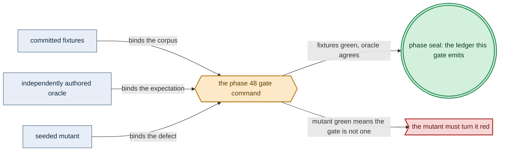

# Phase 48: Gateway-migration drills + model-correspondence

> **Purpose**: Discharge the Register-3 residue of amoebius's one proof obligation — drive the built
> `src/Amoebius/Multicluster/*` gateway-migration runtime through **both** a `Planned` coordinated handover
> (RPO=0) and a `Failover` emergency takeover (bounded rebind) against the live [Phase 47](phase_47_multicluster_spawn_georepl.md) forest, trace-validate it against the Phase-4 emitted spec, and
> show that runtime *is* the Phase-4 design-model's decision core.
> **Read this if**: phase 48 is next in the queue, or a later phase depends on what its gate establishes.

Phase 48 delivers the gateway-migration drills + model-correspondence; its design is owned by [consistency_pacelc_doctrine.md](../documents/engineering/consistency_pacelc_doctrine.md), [gateway_migration_model_doctrine.md](../documents/engineering/gateway_migration_model_doctrine.md), [gateway_migration_doctrine.md](../documents/engineering/gateway_migration_doctrine.md), and the plan for reaching it is owned here.
Register 3, live, on the `linux-cpu` substrate.
Validated 2026-08-11 with `python3 tools/gateway_migration_drills_gate.py --reuse-fresh-live`;
ledger `external-run-reference`.
The CPU-only Linux fallback is always selectable, regardless of detected hardware. Fresh guest isolation maps
the two Linux classes to Incus, Apple to Lima, and Windows to WSL2.

> **Historical result (invalidated).** Any pass, seal, validation, ledger, receipt, or implementation observation
> in the orientation text above is diagnostic only. The Phase Status section and [tracker](README.md) own current state; the
> target contract below remains normative.

Link-graph metadata

**Status**: Authoritative source
**Supersedes**: N/A
**Referenced by**: DEVELOPMENT_PLAN/README.md, DEVELOPMENT_PLAN/overview.md, DEVELOPMENT_PLAN/phase_05_dhall_gate1_schema.md, DEVELOPMENT_PLAN/phase_46_network_fabric_wireguard.md, DEVELOPMENT_PLAN/phase_47_multicluster_spawn_georepl.md, DEVELOPMENT_PLAN/phase_56_test_topology_dsl.md, DEVELOPMENT_PLAN/system_components.md
**Generated sections**: none

## Contents
- [Phase Status](#phase-status)
- [Phase Summary](#phase-summary)
- [Gate integrity](#gate-integrity)
- [Resource provision — the sealed whole-deployment migration envelope](#resource-provision--the-sealed-whole-deployment-migration-envelope)
- [Doctrine adopted](#doctrine-adopted)
- [Sprints](#sprints)
- [Sprint 48.1: The gateway-migration runtime — both branches over the Phase-4 `interpret` core ⏸️](#sprint-481-the-gateway-migration-runtime--both-branches-over-the-phase-4-interpret-core-)
- [Sprint 48.2: Teardown-with-cleanup vs chaos-failover + unsatisfiable-`.dhall` push-back ⏸️](#sprint-482-teardown-with-cleanup-vs-chaos-failover--unsatisfiable-dhall-push-back-)
- [Sprint 48.3: Register-2.5 gateway-migration runtime fidelity — simulation + trace validation ⏸️](#sprint-483-register-25-gateway-migration-runtime-fidelity--simulation--trace-validation-)
- [Sprint 48.4: Register-3 correspondence — Inject drills against the running forest + live gate `.dhall` + ledger ⏸️](#sprint-484-register-3-correspondence--inject-drills-against-the-running-forest--live-gate-dhall--ledger-)
- [Documentation Requirements](#documentation-requirements)
- [Related Documents](#related-documents)

---

## Phase Status

⏸️ Blocked pending Phase-47 revalidation — **reopened 2026-08-16 by the natural-architecture amendment.**
[§S](development_plan_gate_integrity.md#s-universal-artifact-hygiene-gate) clause 15 requires a run to record
the natural architecture it proved and to execute no artifact of another. This phase's last gate recorded no
architecture, so its seal is invalidated as a current result and stands only as history; the rerun differs from
it by naming the lane and architecture the run actually used. A sprint marker below records what that sprint achieved before the amendment; under
[§N](development_plan_phase_model.md#n-reopening-and-amending-a-phase) it is a diagnostic, not surviving closure.

**Pre-natural-architecture status record (invalidated where it claims completion):**

Blocked (superseded) — containment amendment recorded 2026-08-15. Any earlier capability seal is historical and
invalidated until this phase reruns in numerical order with all amoebius-owned state confined to the
repository roots defined by Phase 0. Scope amendments below remain normative.

**Pre-containment status record (invalidated where it claims completion):**

Blocked (superseded) by the reopened numeric sequence. Reopened 2026-08-11: the prior seal did not include the universal artifact-hygiene
postcondition. This phase returns to numeric order only after Phase 0 closes, then must rerun its capability
gate against its source snapshot and publish repository-local evidence without changing an authored path.

**Invalidated historical record:**

Done (invalidated). The runtime delegates every modeled edge to the Phase-4 `interpret` core, validates both pinned traces
and all five named invariants, and explores 256 deterministic lag/fault schedules. The Register-3 drill creates
a parent and two child clusters, records 24 source-acked writes per branch outside the forest, forces eight to
be unreplicated at each cut, proves Planned RPO=0 by set equality, performs a fenced Failover in 0.214 seconds
against the pinned 60-second RTO, moves an actual raw-kernel WireGuard hub role, reconciles the tail, and removes
all test clusters, network namespaces, journal files, and DNS authority state. Both committed mutants turn red.
There is **no** First-Axis / control-plane-election work here: the sole per-system
obligation amoebius owns is the cross-cluster gateway migration, both branches, and this phase discharges its
live residue.

The configured AWS token was invalid, so provider Route53 mutation is UNVERIFIED. The live gate instead makes
an actual DNS repoint through an isolated authoritative UDP server and checks it independently with `dig`.
Physically independent child-local Pulsar brokers and a real WAN partition also remain UNVERIFIED. The ledger
marks the data-loss bound assumed-and-monitored, model safety proven-for-the-model, and runtime/RTO tested.

## Phase Summary

Because [Phase 47](phase_47_multicluster_spawn_georepl.md) turned the single cluster into a geo-replicated
forest and classified the crossing boundary — leaving the gateway authority and any CAS "latest" pointer in the
non-confluent bucket — the one thing that remains is the authority hand-off across that boundary. This phase does
four things and stops there. First, **the gateway-migration runtime** — the built
`src/Amoebius/Multicluster/*` modules enact the wild-ingress gateway move in both branches: a `Planned`
coordinated `quiesce → drain → verify-caught-up → cutover` that loses no committed write (RPO=0), and a
`Failover` survivor-promotion through a fail-closed freshness gate that repoints the authoritative DNS owner and the WireGuard hub
and rebinds within a declared data-loss budget, each keeping a live session bindable throughout. Second, **the teardown-vs-chaos distinction** — a graceful teardown-with-cleanup is lossless by construction (it rides a
synchronization event and hands off the gateway as a `Planned` migration), a chaos-failover is bounded by
budget, the two are observably distinct, and a teardown that would make the root `InForceSpec` unsatisfiable
pushes back. Third, **the Register-2.5 trace-validation** — the real forest code runs under `IOSimPOR` against a
modeled route53/Pulsar and its observed transition log is validated step-by-step against the Phase-4 emitted
spec's `Next` relation, pulling the runtime-fidelity obligation forward from Register-3-only chaos into
deterministic, replayable simulation. Fourth, **the correspondence** — because Phase 4 rendered one reifiable
`Model` into both `interpret` (the runtime decision core) and `emitTLA` (the proven, never-committed `.tla`),
the built runtime's per-edge decision *is* that `interpret`; renderer correspondence is differentially checked,
and
what this phase adds is the Register-3 chaos injection against a running forest that confirms the abstracted
physics (real time, clock skew, actual replication lag, the MinIO/Pulsar/Patroni lossless delegation) actually
hold — never a hand-maintained variable→module table.

This phase consumes earlier phases and does not re-implement them: Phase 47's geo-replicated forest and
invariant-confluence classifier, Phase 4's `GatewayMigration` `Model` + `interpret` + decode-time
structural-fit fold, Phase 37's Keycloak-owned wild ingress, Phase 46's WireGuard fabric (whose hub role the
`Planned` handover repoints), and Phase 16's (Sprints 15.1/15.2) `io-classes` seams and modeled route53/Pulsar. A
**stretched cluster is not geo-replication**: one etcd, one boundary owes no R9 budget and no Second-Axis
obligation and is out of scope here.

**Substrate:** linux-cpu — the gate drives the migration over the parent and both child clusters that Phase 47
spins up as `kind` clusters on a single linux-cpu host; no accelerator and no provider cluster is in
scope (provider-managed clusters are [Phase 49](phase_49_provider_deploy_checkpoint.md)). Partition tolerance is
exercised by killing a sibling on the same host — not a property a single root cluster exercises.
The `linux-cpu` lane remains available on every hardware substrate. Pristine Linux is supplied by Incus on
Linux/Linux-CUDA, Lima on Apple, or WSL2 on Windows.

**Lane:** linux-cpu/amd64 ([§L](development_plan_standards.md#l-one-substrate-discipline))

**Register:** 3 — live infrastructure: a real child forest, an authoritative local DNS repoint, a real
WireGuard hub-role move, and adversarial fault injection against the running forest. Route53 provider mutation
is explicitly outside the achieved boundary.

**Gate:** `cabal test gateway-migration-drills-live` is green: the `Planned` handover and the `Failover`
takeover each satisfy every oracle, committed budget, named invariant, observer, and mutant of
[Gate integrity](#gate-integrity). A bare "loss = 0" report cannot satisfy it.

## Gate integrity

This gate is anchored by the committed artifacts below; substituting evidence produced by the harness under
test or after the run cannot satisfy it:
- **Write-journal oracle (independent of the SUT).** The drill client writes every source-acked write ID to
  `test/fixture/inject/journal/` (a store outside the forest, never the SUT's own replication log). "Committed write"
  means *source-acked*, not *already-replicated*; under a **non-idle** workload the harness asserts **≥ 8** such
  IDs are
  acked-but-not-yet-replicated at the quiesce/kill instant (a positive observed lag), then asserts set-equality
  of journaled-vs-present IDs on the new owner. The ledger embeds the raw journal counts (acked,
  un-replicated-at-cut, recovered), never a bare "loss = 0".
- **The two branches and what each must show.** The `Planned` handover moves authority before any un-replicated
  write is lost, and post-cutover every journaled ID is present on the new owner. Killing the lead cluster
  mid-workflow — again with ≥ 8 acked-but-un-replicated IDs in flight — drives a `Failover` that promotes the
  surviving sibling only through its fail-closed freshness gate, repoints the authoritative local DNS record and
  the WireGuard hub, and rebinds within the committed numeric `DataLossBudget`.
- **Committed numeric budget fixture.** `test/fixture/dhall/phase_44_gateway_migration.dhall` fixes `lagBound = 5 s`,
  `RTO = 60 s`, scaled to the single-host kind forest; authored and committed in this phase's oracle-pinning sprint; its hash is pinned in the gate record and re-checked at gate
  time so a budget edited after measuring the drill fails the hash check. The drill reports declared-vs-measured
  for **both** dimensions, so a post-hoc-tuned or absurd budget is visible red.
- **The five named invariants, and correspondence.** The Register-3 Inject drills assert all five Phase-4 safety
  invariants against the live forest: `UniqueGatewayOwner`, `SessionAlwaysRebindable`, `PlannedIsLossless`,
  `NoWriteAfterStaleFailover` — the safety half of the superseded `FailoverBounded`, whose recovery-time half is
  carried separately as the *tested* RTO datapoint rather than as a bounded-divergence invariant — and
  `NoTakeWithoutProvenFreshness`, which the survivor-promotion drills already exercise through the fail-closed
  freshness gate and which is therefore asserted by name rather than left implicit. That the built
  `src/Amoebius/Multicluster/*` runtime is the Phase-4 `GatewayMigration` model's `interpret` is discharged as
  the step-by-step trace-validation of Sprint 48.3 (Register 2.5); Register 3 adds only the
  modeled-action-coverage assertion that every modeled action fired ≥ 1 time across the drill set.
- **Mutation controls.** At least one committed member of this [§M](development_plan_standards.md#m-gate-integrity-a-gate-cannot-be-passed-by-a-stub) set must fail: (a) `verify-caught-up`-stub — the
  `Planned` `verify-caught-up` edge is weakened to `const True` (dropped-guard); the journal oracle must catch
  the lost un-replicated suffix red. (b) `promote-before-fence` — the `Failover` `PromotionGate` guard is negated
  so it promotes without a proven watermark/fence (guard-negation); `NoWriteAfterStaleFailover` must go red. Both
  mutants are committed under `test/mutant/gateway_migration_drills/` and re-run every gate, not hand-run once.
- **External-observer teardown check.** Phase 48 claims only its pre-Phase-56 teardown scope; the later
  flagged-credential and comprehensive postflight sweep are not implied. After teardown, an **OS-boundary observer** — `kind get clusters`, `ip netns list`, exact temporary-root inventory, and termination of the queried local DNS authority —
  reports zero surviving migration DNS records and zero surviving child clusters, while the retained
  `no-provisioner` PVs that Sprint 48.2 deliberately preserves are explicitly exempt (named in the fixture as the
  retained set).
- **Machine-derived ledger + validator.** The ledger is generated from the run record (measured RPO/RTO,
  observed max lag, the raw journal counts, drill seeds, timestamps, the teardown-observer result), and a
  committed validator cross-checks every ledger figure against the harness's raw journal and the OS-boundary
  observer, failing the gate on any mismatch or hand-edited field. It records recovery time as *tested*
  (drilled), the data-loss bound as *assumed* (monitored, not proven), and the modeled safety/liveness as
  *proven-for-the-model at scope 2* — a Phase-4 design result, never a runtime guarantee. Layers outside
  Register 3 stay marked UNVERIFIED, and because this is a live-band gate the runtime layer is marked *tested*,
  never *proven* ([§K](development_plan_standards.md#k-honesty-proven--tested--assumed)).

*Design intent. Phase 48's gate apparatus; [§M](development_plan_standards.md#m-gate-integrity-a-gate-cannot-be-passed-by-a-stub) owns its clauses.*

## Resource provision — the sealed whole-deployment migration envelope

This phase instantiates the canonical resource matrix and sealed whole-deployment provision boundary from
[`resource_capacity_types.md §3.1`](../documents/engineering/resource_capacity_types.md#31-the-systematic-provision-matrix)
and [`§4`](../documents/engineering/resource_capacity_doctrine.md#4-the-total-fold-fits-carve-place-and-the-nesting).
`GatewayMigrationTransitionDemand` is only a phase-local source composite: binding must exhaustively flatten it
to the canonical identity-keyed execution set and storage/system demands before either migration arm may run.

The runtime executes inside the Phase-38 control-plane daemon, whose complete pod envelope is expanded for migration-plan
evaluation, replication-watermark watches, DNS/fabric mutation serialization, source-proxy control, and
readiness/drain buffers; it is not a free second controller. Every transition epoch also retains both
clusters' Phase-37 edge controllers, operator-derived data-plane children, admission webhooks/gateways, and
rollout operands; the source transparent proxy and target serving path coexist through the full DNS drain
window. The Phase-46 `NetworkFabricSystemDemand` is derived for the source, overlap, and target peer/hub
graphs, including kernel/listener CPU and memory, queues, and rotated nodefs logs. The route53 repoint retains
the Phase-47 in-cluster `PulumiExecutionDemand`, exact executor-Job envelopes, plugin/workspace volumes,
checkpoint producer/admission gateway, and old/new checkpoint revisions. A `Planned` or `Failover` branch that
fits only by deleting the old gateway, proxy, peer graph, Pulumi executor, or checkpoint state before external
observation returns a structured pre-effect rejection.

The non-idle drill workload is provisioned too. Its source-equal Phase-40/42 client/workflow projection carries
every traffic-generator, active/standby worker, content mutation gateway, collector/verifier, topic/subscription,
BookKeeper/ZooKeeper/offload, MinIO object, and Patroni data/WAL/recovery demand. Every pod has a complete
image/CPU/memory/ephemeral/local-volume envelope and consumes pod/CNI and unique CSI-attachment slots; this
linux-cpu phase declares `accelerator = None`. The fault injector, out-of-forest write journal, trace
collector, and OS-boundary verifier form an identity-keyed host harness with an executable digest, finite
CPU/memory reservation and ceiling, bounded capture/log/scratch bytes on named host backings, finite
concurrency and retention, and no cache or accelerator. The journal's maximum acknowledged-write count and
record size derive its peak; “outside the forest” is an independence property, not an unbounded-storage
exception.

The exact post-controller-expansion `desiredObjects` map exhaustively includes every desired and surviving
Kubernetes object, including Namespaces, service accounts/RBAC, Secrets/ConfigMaps, workloads and generated
ReplicaSets/children, Services/EndpointSlices, policies, claims/volumes, Jobs, status/apply objects, and Leases.
Each identity has a `KubernetesApiObjectDemand`. Binding combines that complete map with bounded
revision/Event/Lease `churn` and a pinned storage `model` as
`EtcdLogicalDemand { desiredObjects, churn, model }`; its private
`ProvisionedEtcdLogicalDemand.derivedPeak` must fit `ControlPlaneStorageDemand.etcd.backendQuotaBytes` before
the separate backend-at-quota, WAL, snapshot, and serialized-defrag peak fits the control-plane backing.
Provisioning uses one read-only snapshot across every parent/child node, backing, object store, database,
provider account, and host-harness carve; only private projections mint the single-use mutation capability.
Live readback normalizes the old/overlap/new gateway and fabric epochs, Pulumi/checkpoint state,
workflow/store/database high-water, exhaustive API identities/churn/model, physical etcd state, and harness
process/backing use.

The committed resource corpus makes each execution envelope, pod/CNI/CSI slot, CPU, memory, logical ephemeral
and routed physical byte, image/workspace object, durable/object/database extent, Pulumi plugin/checkpoint
operand, API object/churn/model term, etcd logical/physical byte, network queue/log term, and host-harness
operand one unit short in isolation and expects zero migration/cloud/store effects. Dropped-envelope mutants
remove the source proxy, target edge child, overlap peer graph, Pulumi executor, checkpoint admission gateway,
workflow collector, API object, etcd churn/model, or external journal; each must turn the gate red even if the
RPO/RTO assertions would otherwise pass.

## Doctrine adopted

- [`consistency_pacelc_doctrine.md §3`](../documents/engineering/consistency_pacelc_doctrine.md#3-the-one-configurable-axis--the-deployment-rules-pacelc-surface)
  — **the PACELC failover budget (`rto` / `dnsTtl` / `lagBound`) and its decode folds.** The `Failover` drill
  rebinds within the declared `FailoverBudget`; the phase corpus includes an `rto < dnsTtl` spec that is Gate-2
  decode-rejected ([§3.5](../documents/engineering/consistency_pacelc_doctrine.md#35-the-upload-time-feasibility-push-back)),
  and "clients/resolvers honor the record TTL" is recorded as a named R8 **assumed** premise.
- [`gateway_migration_model_doctrine.md §6`](../documents/engineering/gateway_migration_model_doctrine.md#6-modelling-bounds-and-honesty)
  and [`§7`](../documents/engineering/gateway_migration_model_doctrine.md#7-planning-ownership)
  — *single-source correspondence* and *planning ownership*: because `interpret` and `emitTLA` render one
  `Model`, there is **no** separate variable→module correspondence table to complete; what remains for the live
  phase is the Register-3 chaos injection against a running forest (that the abstracted physics hold), and this
  phase is exactly that gate. It also inherits the [`§1`](../documents/engineering/gateway_migration_model_doctrine.md#1-the-one-obligation)
  one-obligation framing (no First-Axis election model) and the [`§5`](../documents/engineering/gateway_migration_model_doctrine.md#5-one-and-done-plus-a-per-inforcespec-structural-fit)
  scope-2 pairwise cutoff the built forest must stay inside.
- [`gateway_migration_doctrine.md §2`](../documents/engineering/gateway_migration_doctrine.md#2-the-planned-branch--a-coordinated-strong-consistency-handover)
  and [`§3`](../documents/engineering/gateway_migration_doctrine.md#3-the-failover-branch--an-availability-first-emergency-takeover)
  — the two arms of `GatewayMigration = <Planned | Failover>`: the coordinated strong-consistency handover
  (RPO=0, proven-for-the-model at scope 2) and the availability-first emergency takeover (RPO>0, bounded by the data-loss
  budget, reconciling to a single owner) — with the client-rebind protocol of
  [`§4`](../documents/engineering/gateway_migration_doctrine.md#4-client-rebind--a-live-session-must-always-find-the-gateway)
  and the typed, edge-observed state machine of
  [`§5`](../documents/engineering/gateway_migration_doctrine.md#5-the-migration-as-a-typed-edge-observed-state-machine)
  built as the effectful shell around the Phase-4 decision core, honest per
  [`§6`](../documents/engineering/gateway_migration_doctrine.md#6-honesty-and-layer-markers).
- [`chaos_failover_second_axis.md §18`](../documents/engineering/chaos_failover_second_axis.md#18-the-rules-scale-to-the-boundary)
  and [`§19`](../documents/engineering/chaos_failover_second_axis.md#19-the-cross-boundary-ledger-and-conformance-rows)
  — the R7/R8/R9 cross-boundary rules: the fail-closed promotion-freshness gate and active-merge reconciliation
  (R7), the named-bounded-monitored replication lag (R8), and the two-dimensional failover budget — bounded
  permanent data loss and bounded recovery time (R9) — with the
  [Inject move (§11)](../documents/engineering/chaos_failover_doctrine.md#11-move-iii--inject-break-the-running-thing-on-purpose)
  run against the running forest and the [proven/tested/assumed ledger (§12)](../documents/engineering/chaos_failover_doctrine.md#12-the-moral-core--proven-tested-assumed)
  kept honest. The doctrine works this exact shape through in its
  [Appendix B](../documents/engineering/chaos_failover_worked_examples.md#appendix-b--worked-example-fenced-cross-cluster-geo-replication-failover-the-open-cross-cluster-failover-question)
  worked example; this phase realizes it live.
- [`cluster_lifecycle_doctrine.md §5`](../documents/engineering/cluster_lifecycle_doctrine.md#5-teardown-with-cleanup-vs-chaos-failover-the-central-distinction),
  [`§6`](../documents/engineering/cluster_lifecycle_doctrine.md#6-push-back-when-teardown-would-break-the-root-inforcespec),
  and [`§9`](../documents/engineering/cluster_lifecycle_doctrine.md#9-how-bring-up-and-teardown-are-implemented-the-reconciler-not-a-state-machine)
  — the central distinction between a lossless teardown-with-cleanup and a bounded-loss chaos-failover, and the
  declarative push-back on a teardown that would make the root `InForceSpec` unsatisfiable — all enacted as
  `discover → diff → enact → re-observe` reconciles over a managed-resource registry, never a bespoke lifecycle
  state machine.
- [`deterministic_simulation_doctrine.md §4`](../documents/engineering/deterministic_simulation_doctrine.md#4-register-25--where-deterministic-simulation-sits)
  — the Register-2.5 runtime-fidelity stage: the real forest code under `IOSimPOR` against a modeled
  route53/Pulsar, trace-validated against the Phase-4 emitted spec's `Next` relation before the Register-3 live
  drills, so the code↔model bridge is a formal, early, replayable check rather than only sampled live chaos.
- [`testing_doctrine.md §3`](../documents/engineering/testing_doctrine.md#3-the-test-topology-contract-spin-up--run--always-tear-down)
  (the test-as-`InForceSpec` spin-up → run → always-tear-down contract) and
  [`testing_doctrine.md §4`](../documents/engineering/testing_doctrine.md#4-no-skips-fail-fast-and-the-per-run-ledger-artifact)
  (the per-run proven/tested/assumed ledger): the register this gate reaches and the ledger it emits.

## Sprints

> **Current revalidation rule.** Every sprint is blocked by the reopened numeric sequence. Historical dates,
> pass/seal claims, repository-resident evidence paths, and `Remaining Work: None` statements below describe
> the pre-amendment capability record only; they do not override current status. Functional and validation
> outcomes remain target requirements. Any instruction to commit generated output, freeze dependency resolution,
> retain a resolved version, path, or integrity hash, or consume repository-resident evidence, ledgers, or
> enumerations is superseded by the current generated-artifact and dynamic-resolution doctrine. Closure requires
> the current phase gate plus universal artifact hygiene.

## Sprint 48.1: The gateway-migration runtime — both branches over the Phase-4 `interpret` core ⏸️

**Status**: Blocked by the reopened numeric sequence; prior capability footprint retained for migration
**Implementation**: `src/Amoebius/Multicluster/GatewayMigration.hs` (the effectful
orchestrator whose per-edge decision delegates to the Phase-4 `src/Amoebius/Formal/GatewayMigration.hs`
`interpret`), `src/Amoebius/Multicluster/PlannedHandover.hs`, `src/Amoebius/Multicluster/PromotionGate.hs`,
`src/Amoebius/Multicluster/DnsRepoint.hs`, `src/Amoebius/Multicluster/ClientRebind.hs` — delivered and
gate-covered.
**Blocked by**: reopened numeric predecessor gates.
**Independent Validation**: a `Planned` handover drives the ordered edge-observed state machine end to end and
loses no committed write (RPO=0); a `Failover` promotes the survivor only through its freshness gate and
accounts for the un-replicated suffix by the R9 budget alone. The numbered `### Validation` list below carries
the edge order and both branches' acceptance conditions.
**Docs to update**:
`documents/engineering/gateway_migration_doctrine.md`, `documents/engineering/chaos_failover_doctrine.md`.

### Objective
Adopt [`gateway_migration_doctrine.md §2`](../documents/engineering/gateway_migration_doctrine.md#2-the-planned-branch--a-coordinated-strong-consistency-handover)/[`§3`](../documents/engineering/gateway_migration_doctrine.md#3-the-failover-branch--an-availability-first-emergency-takeover),
the client-rebind protocol of [`§4`](../documents/engineering/gateway_migration_doctrine.md#4-client-rebind--a-live-session-must-always-find-the-gateway),
and the R7/R8/R9 cross-boundary rules of
[`chaos_failover_second_axis.md §18`](../documents/engineering/chaos_failover_second_axis.md#18-the-rules-scale-to-the-boundary):
build the effectful gateway-migration shell for **both** branches whose every branch decision is the Phase-4
pure `interpret` value (a *liveness* coercion is licensed; a *durability* claim is forbidden — the tail beyond
the watermark stays a typed `NotYetObserved`), so the runtime realizes the proven model rather than re-deriving
it.

### Deliverables
- A `Planned` coordinated `quiesce → drain → verify-caught-up → cutover` (repoint the gateway DNS record and
  the WireGuard hub role, then unfreeze — **not** the apiserver-VPN-IP, which is a per-cluster stretched-cluster
  construct owned by its own cluster and never repointed by a gateway migration,
  [`gateway_migration_doctrine.md` §2](../documents/engineering/gateway_migration_doctrine.md#2-the-planned-branch--a-coordinated-strong-consistency-handover))
  whose `decommission(source-ingress)` edge is
  reachable only from an observed `drain-monitor` edge, so no transition removes the last working endpoint.
- A `Failover` fail-closed `PromotionGate`: the survivor promotes only on a proven commit watermark or a held
  fence, trading recovery time (R9 RTO) for zero divergence beyond the already-lost suffix; an authoritative
  local DNS repoint (with provider Route53 explicitly UNVERIFIED); and a deterministic, total, timestamp-free merge of the non-confluent CAS "latest" pointer
  on failback.
- The client-rebind mechanisms — old-gateway transparent proxy, a low steady-state DNS TTL, stable per-cluster
  addresses, and the 307 fallback — plus an exported live-lag monitor (R8) and a declared `DataLossBudget` =
  (data-loss window, recovery time).

### Validation
1. A `Planned` handover under a **non-idle** workflow (the drill client journals every source-acked write ID to
   the out-of-forest store of [Gate integrity](#gate-integrity), and the harness asserts **≥ 8 acked-but-un-replicated IDs exist at the quiesce instant** — observed replication lag > 0 — so an idle-workload rubber stamp cannot pass) moves authority with
   **measured loss = 0 proven by set-equality of journaled-vs-present IDs on the new owner** (not by a
   self-defined "committed = already replicated"), and a session that never loses its endpoint; a `Failover`
   after killing the lead (again with ≥ 8 acked-but-un-replicated IDs in flight) resumes through one authority
   with **measured loss ≤ the committed `lagBound` and authority transfer within the committed `RTO`**, where
   those budgets are the oracle-pinned numeric values in `test/fixture/dhall/phase_44_gateway_migration.dhall`
   (`lagBound = 5 s`, `RTO = 60 s`) whose hash is pinned before the drill runs — the drill **reports declared-vs-measured for both dimensions**, so a generous or post-hoc-tuned budget is visible; driving lag
   past the committed bound makes the freshness gate refuse to promote and the lag monitor alarm before a breach;
   and the committed `promote-before-fence` mutant ([Gate integrity](#gate-integrity)) — the `PromotionGate` guard negated — must go red.
2. The `Planned` branch drives the ordered edge sequence `stand-up-replica → quiesce → drain /
   verify-caught-up → promote → source-proxy + repoint DNS → unfreeze → drain-monitor → decommission`, the old
   gateway serving as a transparent proxy for the whole DNS-drain window so a live session always has a working
   endpoint.
3. The `Failover` branch promotes the survivor *only after* its freshness gate proves a known commit watermark,
   or holds a fence, and then repoints the authoritative DNS owner and the WireGuard hub. The un-replicated
   suffix is accounted for **only** by the R9 data-loss budget, never silently resolved to "absent."

### Remaining Work
Route53 provider mutation remains UNVERIFIED; the authoritative local DNS and raw-kernel fabric paths are done.

## Sprint 48.2: Teardown-with-cleanup vs chaos-failover + unsatisfiable-`.dhall` push-back ⏸️

**Status**: Blocked by the reopened numeric sequence; prior capability footprint retained for migration
**Implementation**: `src/Amoebius/Multicluster/Teardown.hs`,
`src/Amoebius/Multicluster/Pushback.hs` — delivered and gate-covered.
**Blocked by**: reopened numeric predecessor gates.
**Independent Validation**: a graceful teardown of a child drains workloads, flushes
Pulsar/MinIO/Postgres replication to a synchronization event, hands off the gateway (a `Planned` migration),
and releases compute while preserving retained `no-provisioner` PVs — losing nothing; a teardown that would
make the root `InForceSpec` unsatisfiable pushes back, names what stops working and the declared failback,
and proceeds only under an explicit override.
**Docs to update**:
`documents/engineering/cluster_lifecycle_doctrine.md`,
`documents/engineering/storage_lifecycle_doctrine.md`.

### Objective
Adopt [`cluster_lifecycle_doctrine.md §5`](../documents/engineering/cluster_lifecycle_doctrine.md#5-teardown-with-cleanup-vs-chaos-failover-the-central-distinction)/[`§6`](../documents/engineering/cluster_lifecycle_doctrine.md#6-push-back-when-teardown-would-break-the-root-inforcespec),
enacted as the reconciler of
[`§9`](../documents/engineering/cluster_lifecycle_doctrine.md#9-how-bring-up-and-teardown-are-implemented-the-reconciler-not-a-state-machine):
implement a graceful teardown as a controlled handoff that is lossless by construction, and the declarative
push-back that refuses — by default — a teardown that would leave the persistent global `.dhall` unsatisfiable,
with an explicit operator override the only escape.

### Deliverables
- A `gracefulTeardown` reconcile: idempotent drain/flush/handoff ordering timed to a synchronization event,
  releasing compute while preserving retained backing so a later spin-up recreates PV bindings over the same
  bytes.
- A `satisfiability` check over the root `InForceSpec` using every execution unit's complete
  `ResourceEnvelope`: CPU requests/limits, memory requests/limits, pod-local ephemeral-storage
  requests/limits, durable-volume backing, bounded cache carve, and any identity-complete accelerator-owner
  source/workload maps, structural residency/shards, policy-class domains, and every derived coexistence
  epoch's device-count/per-device net-VRAM or Metal shared-memory requirement. Teardown may proceed only when the surviving forest can re-run
  `provision` for the unchanged desired spec and construct a fresh opaque `ProvisionedSpec` with placement,
  storage, and capability witnesses; otherwise it pushes back before releasing any resource, naming the
  exhausted axis/capability and the `.dhall` failback, with the same fail-closed `Unreachable → refuse` posture
  as the reconciler.
- A managed-resource registry entry per cluster/child/node/stack/PV so teardown is one `reconcileAbsent` loop
  with "cannot observe" never collapsed to "absent."

### Validation
1. A graceful child teardown loses nothing (rides a sync event, preserves backing while PV API objects may
   disappear) and a later spin-up recreates the identical shape over the same bytes; a teardown of a
   load-bearing cluster whose removal breaks any CPU, memory, ephemeral-storage, durable-storage, cache,
   accelerator owner-map/domain, device-count, residency/shard, coexistence-epoch, per-device net-VRAM, or
   Metal shared-memory witness pushes back **before the first teardown effect** and
   aborts by default, and the
   explicit override falls to the declared failback; a graceful teardown and a chaos-failover are observably
   distinct — lossless-by-construction vs bounded-by-budget — and the code reports which guarantee held.

### Remaining Work
None inside the sealed single-host child-forest boundary.

## Sprint 48.3: Register-2.5 gateway-migration runtime fidelity — simulation + trace validation ⏸️

**Status**: Blocked by the reopened numeric sequence; prior capability footprint retained for migration
**Implementation**: `test/spec/sim/GatewayMigrationSimSpec.hs` (the `IOSimPOR` battery over
the modeled route53 + geo-replicated Pulsar) and `test/spec/sim/GatewayMigrationTrace.hs` (the trace-validator
checking observed transitions against the emitted `Next`), driving the real `src/Amoebius/Multicluster/*`
forest code lifted onto the Phase-16 `io-classes` `Env` interface — delivered as the deterministic pure
runtime/trace battery.
**Blocked by**: reopened numeric predecessor gates.
**Independent Validation**: the real `Multicluster/*` forest code runs under `IOSimPOR` against a modeled
route53 and geo-replicated Pulsar, and its observed transition log is trace-validated step-by-step against the
Phase-4 emitted spec, pulling the runtime-fidelity (Tier-2) obligation **forward** from Register-3-only chaos
into deterministic, replayable simulation. Substrate `none`, Register 2.5.
**Docs to update**:
`documents/engineering/deterministic_simulation_doctrine.md` (Phase-48 status backlink),
`documents/engineering/gateway_migration_model_doctrine.md` (§6 the Register-2.5 trace-validation bridge).

### Objective
Adopt [`deterministic_simulation_doctrine.md §4`](../documents/engineering/deterministic_simulation_doctrine.md#4-register-25--where-deterministic-simulation-sits)
and [`gateway_migration_model_doctrine.md §6`](../documents/engineering/gateway_migration_model_doctrine.md#6-modelling-bounds-and-honesty):
discharge the runtime-fidelity obligation in two stages, not one — first as trace-validated deterministic
simulation against the modeled world here (Register 2.5), then as live Inject drills (Sprint 48.4, Register 3)
— so the code↔model bridge is a formal, early, replayable check rather than only sampled live chaos.

### Deliverables
- The `GatewayMigrationSimSpec` battery: the real forest code under `IOSimPOR` against the modeled route53
  (short-TTL, **no compare-and-swap**, propagation delay) and the modeled geo-replicated Pulsar, asserting all
  five safety invariants — `UniqueGatewayOwner`, `SessionAlwaysRebindable`, `PlannedIsLossless`,
  `NoWriteAfterStaleFailover`, `NoTakeWithoutProvenFreshness` — on every explored schedule under injected
  partition/kill-cluster-mid-geo-sync/lag.
- The `GatewayMigrationTrace` validator: each observed transition of the simulated forest is a legal `Next`-step
  of the Phase-4 emitted spec
  ([`formal_model_doctrine.md §8`](../documents/engineering/formal_model_doctrine.md#8-trace-validation-the-earlier-codemodel-bridge)),
  and a mismatch is a code↔model divergence, red.
- A Register-2.5 proven/tested/assumed ledger — the built forest upholds the safety invariants and refines the
  model's `Next` under the modeled schedules and faults; honest limit: modeled route53/Pulsar fidelity and real
  replication-lag / clock-skew physics remain the Register-3 residue (Sprint 48.4).

### Validation
1. `cabal test gateway-migration-sim` is green — no schedule violates a safety invariant and no observed
   transition falls outside `Next`; a deliberately broken forest (a fence dropped, a decommission-before-drain)
   is caught red; the discovered counterexample replays identically under its seed.

### Remaining Work
None for Register 2.5; real WAN physics remain outside the live single-host result.

## Sprint 48.4: Register-3 correspondence — Inject drills against the running forest + live gate `.dhall` + ledger ⏸️

**Status**: Blocked by the reopened numeric sequence; prior capability footprint retained for migration
**Implementation**: `test/fixture/dhall/phase_44_gateway_migration.dhall` (the live gate
topology) and `test/spec/inject/GatewayMigrationForest.hs` (the Register-3 Inject harness re-using the Phase-4
named invariants against the built runtime), plus `tools/gateway_migration_drills_live.py` — delivered. The Phase-4 `GatewayMigration`
`Model`, its `emitTLA` proof, and its io-sim agreement were authored and discharged in Phase 4; this sprint
consumes them, it does not re-author them.
**Blocked by**: reopened numeric predecessor gates.
**Independent Validation**: the built `src/Amoebius/Multicluster/*` decision core is shown to be the Phase-4
`interpret` — single-source correspondence, no variable→module table — and the live gate topology spins the
forest up, runs both branches, tears down leak-free, and emits a machine-derived ledger. The numbered
`### Validation` list below carries the drill set and its oracles.
**Docs to update**:
`documents/engineering/gateway_migration_model_doctrine.md`,
`documents/engineering/chaos_failover_doctrine.md`, `documents/engineering/testing_doctrine.md`.

### Objective
Adopt [`gateway_migration_model_doctrine.md §6`](../documents/engineering/gateway_migration_model_doctrine.md#6-modelling-bounds-and-honesty)/[`§7`](../documents/engineering/gateway_migration_model_doctrine.md#7-planning-ownership):
because correspondence is differentially checked (one `Model` → `interpret` + `emitTLA`), run the deferred
Register-3 residue — the [Inject move (§11)](../documents/engineering/chaos_failover_doctrine.md#11-move-iii--inject-break-the-running-thing-on-purpose)
against the running forest confirming the abstracted physics actually hold — as the test-`.dhall` of
[`testing_doctrine.md §3`](../documents/engineering/testing_doctrine.md#3-the-test-topology-contract-spin-up--run--always-tear-down),
ledgered per [`chaos_failover_doctrine.md §12`](../documents/engineering/chaos_failover_doctrine.md#12-the-moral-core--proven-tested-assumed)
and [`§19`](../documents/engineering/chaos_failover_second_axis.md#19-the-cross-boundary-ledger-and-conformance-rows).

### Deliverables
- The Register-3 Inject drill set run in the inter-cluster dimension against the running forest — cut
  replication, kill the lead mid-`Planned`-handover, kill the lead with no drain to force `Failover`, drive lag
  past the bound, and fail back with late plus duplicate arrivals — each asserting the Phase-4 named invariants.
  This is the concrete confirmation that the built runtime, which *is* the model's
  `interpret`, upholds under real physics what the model proves in logical time (never a re-authored TLA+ spec,
  never a paper variable→module table, which is what the superseded framing had reversed).
- `test/fixture/dhall/phase_44_gateway_migration.dhall`: spin two children up, geo-replicate, run a `Planned` handover
  asserting RPO=0 via the write-journal oracle, kill the lead to force `Failover` asserting rebind within the
  oracle-pinned numeric budget (`lagBound = 5 s`, `RTO = 60 s`, hash-pinned), reconcile divergent
  histories, and always tear down leak-free (verified by the OS-boundary kind/network-namespace/journal/DNS observer) —
  emitting the machine-derived per-run ledger artifact. The gate topology `.dhall`, `test/fixture/inject/journal/` (the
  out-of-forest write-ID journal schema), and the authored run-ledger schema validator are **committed in this
  phase's oracle-pinning sprint before the runtime exists**; generated ledgers remain under `.build/runs/`. The runtime-dependent `test/mutant/gateway_migration_drills/` seeded mutants (the `verify-caught-up`-stub
  and `promote-before-fence` mutants that must go red) mutate the Sprint-43.1 implementation, so they are
  **committed at the start of Phase 48, before that implementation is trusted** (the §M.1
  start-of-owning-phase form for oracles that depend on later code).
- A machine-derived per-run proven/tested/assumed ledger that marks `Planned` RPO=0 **proven-for-the-model (Phase 4, scope 2) + drilled (tested)**, the `Failover` recovery time + reconciliation **tested (drilled)**, the data-loss /
  replication-lag bound **assumed (monitored, never proven)**, and the modeled safety/liveness
  **proven-for-the-model at scope 2** (Phase-4, a design-layer result) — and never reports an
  assumed-and-monitored result as proven.

### Validation
1. The built decision core resolves to the Phase-4 `interpret` — the correspondence-check mechanic is fixed as:
   the step-by-step trace-validation of Sprint 48.3 (Register 2.5) **plus** a Register-3 **modeled-action-coverage assertion** that every modeled action fired ≥ 1 time across the drill set (no orphaned modeled action); step-by-step
   trace-validation is the Sprint-43.3 obligation and is not re-run in Register 3. The Inject drills run against
   the live forest and pass, each asserting all five named safety invariants (`NoWriteAfterStaleFailover` is the
   safety half; the recovery-time half is the separate *tested* RTO datapoint). `phase_48_gateway_migration.dhall`
   reports **RPO=0 for `Planned` proven by the write-journal set-equality oracle ([Gate integrity](#gate-integrity)) under a workload with ≥ 8 acked-but-un-replicated IDs at the cut** — not a bare "loss = 0" — and **measured loss ≤ the oracle-pinned `lagBound` and transfer ≤ the committed `RTO`** (hash pinned before the drill; declared-vs-measured reported
   for both). Teardown is **leak-free by the OS-boundary observer of [Gate integrity](#gate-integrity)**: kind,
   network-namespace, exact-root, and local-DNS inventories report zero surviving migration records and test clusters, with the
   retained `no-provisioner` PVs of Sprint 48.2 explicitly exempt. The committed seeded mutants ([Gate integrity](#gate-integrity): `verify-caught-up`-stub and `promote-before-fence`) each go red. The ledger is **machine-derived from the run record** and passes its committed validator — every ledger figure (RPO/RTO, observed max lag, raw journal
   counts, seeds, timestamps, teardown-observer result) cross-checks against the raw journal, and any mismatch or
   hand-edited field fails the gate; out-of-Register-3 layers stay marked UNVERIFIED.

### Remaining Work
Route53 provider API mutation, physically independent brokers, and real WAN partitioning remain UNVERIFIED.

## Documentation Requirements

**Engineering docs to update (when the gate runs, flip the honest layer, never before):**
- `documents/engineering/gateway_migration_model_doctrine.md` — flip §6's Register-3 chaos-injection residue to
  *run against a live forest* for both branches, recording the differential-correspondence result and live trace
  validation without inventing a variable→module table; keep the abstracted premises assumed.
- `documents/engineering/gateway_migration_doctrine.md` — backlink §2/§3/§4/§5 to the built
  `src/Amoebius/Multicluster/*` runtime; confirm `Planned` RPO=0 stayed proven-for-the-model (Phase 4, scope 2; now drilled live) and
  `Failover` stayed bounded-by-budget.
- `documents/engineering/chaos_failover_doctrine.md` — the §19 cross-boundary ledger and the §15/§19 conformance
  rows gain an amoebius-tested linux-cpu datapoint (recovery-time drilled, data-loss assumed), so the matrix
  stops resting on prodbox sibling-evidence alone; cross-reference the realized `Multicluster/*` module paths.
- `documents/engineering/cluster_lifecycle_doctrine.md` — §5/§6/§9 gain the realized module paths for the
  teardown-vs-chaos distinction, the push-back, and the reconciler/registry.
- `documents/engineering/deterministic_simulation_doctrine.md` — record the Register-2.5 io-sim + trace-validation
  of the gateway-migration runtime.
- `documents/engineering/pulumi_iac_doctrine.md` — record the local authoritative-DNS failover repoint and
  WireGuard hub-role move, leaving the Route53 provider owner UNVERIFIED.
- `documents/engineering/testing_doctrine.md` — record the Register-3 Inject + live-gate ledger this phase emits.

**Cross-references to add:**
- `DEVELOPMENT_PLAN/README.md` — flip the Phase-48 status when the gate passes; link this document.
- `DEVELOPMENT_PLAN/system_components.md` — register the `src/Amoebius/Multicluster/GatewayMigration.hs`,
  `PlannedHandover.hs`, `PromotionGate.hs`, `DnsRepoint.hs`, `ClientRebind.hs`, `Teardown.hs`, `Pushback.hs`
  modules and the Register-2.5 simulation + Register-3 Inject + gate suites as Phase-48 rows.
- `DEVELOPMENT_PLAN/substrates.md` — the Phase-48 → linux-cpu row in the per-phase substrate map.

## Related Documents
- [README.md](README.md) — the live tracker; Phase 48 objective, gate, and substrate
- [development_plan_standards.md](development_plan_standards.md) — the rulebook this document obeys
- [overview.md](overview.md) — target architecture and the one-formal-obligation constraint
- [system_components.md](system_components.md) — target component inventory (the `Multicluster/*` module paths)
- [substrates.md](substrates.md) — substrate registry and per-phase map
- [Gateway Migration Model Doctrine](../documents/engineering/gateway_migration_model_doctrine.md) — the one obligation, both branches, single-source correspondence, and the Register-3 chaos residue this phase discharges
- [Deterministic Simulation Doctrine](../documents/engineering/deterministic_simulation_doctrine.md) — the Register-2.5 io-sim + trace-validation (Sprint 48.3) that pulls the runtime-fidelity obligation forward from Register-3-only chaos
- [Gateway Migration Doctrine](../documents/engineering/gateway_migration_doctrine.md) — the `GatewayMigration = <Planned | Failover>` taxonomy, client rebind, and the typed edge-observed state machine
- [Chaos & Failover Doctrine](../documents/engineering/chaos_failover_doctrine.md) — the Inject move, the R7/R8/R9 cross-boundary rules, and the proven/tested/assumed cross-boundary ledger
- [Cluster Lifecycle Doctrine](../documents/engineering/cluster_lifecycle_doctrine.md) — teardown-vs-chaos and push-back
- [phase_04](phase_04_gateway_migration_model.md) — the `GatewayMigration` design-model whose Register-3 correspondence against the built forest is discharged here
- [phase_47](phase_47_multicluster_spawn_georepl.md) — the prior phase; the geo-replicated forest and confluence classifier this phase runs over
- [phase_49](phase_49_provider_deploy_checkpoint.md) — the next phase; the forest extended to provider-managed clusters
