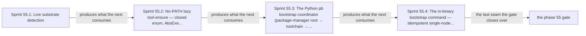

# Phase 55: Python bootstrap coordinator + substrate detect + single kind cluster

> **Purpose**: Specify the first live phase — the Python `pb` bootstrap coordinator that ensures a toolchain and builds the
> binary before any `PATH` discipline can run, live substrate detection, the absolute-path-only host tool-ensure,
> and an idempotent `pb bootstrap --distro=kind` that brings up an empty single-node kind cluster, records its
> complete observed resource inventory, cross-checks the declared topology against that inventory, and is a
> no-op on re-run.
> **Read this if**: phase 55 is next in the queue, or a later phase depends on what its gate establishes.

Phase 55 delivers the Python bootstrap coordinator + substrate detect + single kind cluster; its design is owned by [substrate_doctrine.md](../documents/engineering/substrate_doctrine.md), [bootstrap_sequence_doctrine.md](../documents/engineering/bootstrap_sequence_doctrine.md), [cluster_lifecycle_doctrine.md](../documents/engineering/cluster_lifecycle_doctrine.md), and the plan for reaching it is owned here.
Register 3, live, on the `linux-cpu` execution lane, which every hardware substrate can supply.
The implemented gate surface has now run in a pristine Incus Ubuntu VM on this Linux parent; Apple uses Lima
and Windows uses WSL2 for the same clean boundary. The complete Phase-55 gate passed on the Incus route;
the Lima and WSL2 command plans remain portability equivalents for their corresponding physical parents.

> **Historical result (invalidated).** Any pass, seal, validation, ledger, receipt, or implementation observation
> in the orientation text above is diagnostic only. The Phase Status section and [tracker](README.md) own current state; the
> target contract below remains normative.

Link-graph metadata

**Status**: Authoritative source
**Supersedes**: N/A
**Referenced by**: DEVELOPMENT_PLAN/README.md, DEVELOPMENT_PLAN/legacy_tracking_for_deletion.md, DEVELOPMENT_PLAN/overview.md, DEVELOPMENT_PLAN/phase_56_base_image_registry.md, DEVELOPMENT_PLAN/phase_58_object_reconciler.md, DEVELOPMENT_PLAN/phase_59_capacity_scheduler.md, DEVELOPMENT_PLAN/phase_65_live_dsl_deploy.md, DEVELOPMENT_PLAN/phase_76_provider_deploy_checkpoint.md, DEVELOPMENT_PLAN/phase_79_provider_dynamic_nodes.md, DEVELOPMENT_PLAN/phase_80_determinism_jitcache.md, DEVELOPMENT_PLAN/system_components.md, documents/engineering/resource_capacity_sources.md
**Generated sections**: none

## Contents
- [Phase Status](#phase-status)
- [Phase Summary](#phase-summary)
- [Gate integrity](#gate-integrity)
- [Doctrine adopted](#doctrine-adopted)
- [Sprints](#sprints)
- [Sprint 55.1: Live substrate detection 📋](#sprint-551-live-substrate-detection-)
- [Sprint 55.2: No-`PATH` lazy tool-ensure — closed enum, `AbsExe`, install-and-verify 📋](#sprint-552-no-path-lazy-tool-ensure--closed-enum-absexe-install-and-verify-)
- [Sprint 55.3: The Python `pb` bootstrap coordinator (package-manager root → toolchain → build → `exec`) 📋](#sprint-553-the-python-pb-bootstrap-coordinator-package-manager-root--toolchain--build--exec-)
- [Sprint 55.4: The in-binary `bootstrap` command — idempotent single-node kind bring-up 📋](#sprint-554-the-in-binary-bootstrap-command--idempotent-single-node-kind-bring-up-)
- [Documentation Requirements](#documentation-requirements)
- [Related Documents](#related-documents)

---

## Phase Status

⏸️ Blocked pending Phase-54 revalidation. Reopened 2026-08-19 by the generative re-baseline: the artifact, budget, lift, workflow and evidence calculi change what this phase's gate must cover, so any earlier seal is history and no longer presents completion evidence.

**Pre-natural-architecture status record (invalidated where it claims completion):**

Done (invalidated) — resealed 2026-08-15. `python3 tools/bootstrap_coordinator_gate.py --execute` passed all eleven
sides against a newly materialized pristine Incus Ubuntu guest: toolchain, oracle, static, mutant, live,
results, surface, ledger, attestation, containment, and authored-root write guard. All six committed mutants
are independently red; all sixteen metrics equal their authored values; 28 surfaces join completely to 30
run-time items. Tool acquisition, Cabal state, guest transport, evidence, production state, and test state are
confined to `.build/**`, `.data/**`, and the marker-owned `.test_data/runs/bootstrap-coordinator/**` root;
the host inventory is unchanged and the guest was destroyed. The project-contained attestation is
`sha256:cf31b7eb39b7419bc51375e18cc24e56aac1b697150029f52257be751dce4b66`, bound to source snapshot
`sha256:7503a6e8d86c0f95…` (1,968 files).

**Pre-containment status record (invalidated where it claims completion):**

Done (invalidated) — sealed 2026-08-14. All ten sides of `python3 tools/bootstrap_coordinator_gate.py --execute` pass against a newly
materialized pristine Incus guest, every one of the six committed mutants is red from its own observation, and
all 28 surfaces join to the run's enumeration with none left UNVERIFIED.

**The two obligations that had kept it open are both closed.**

*The tracked integrity pin.* `pb/bootstrap_execution_envelope.json` carried a package integrity digest beside
its source, which rule `r6` reports and [§S clause 5](development_plan_standards.md#s-universal-artifact-hygiene-gate)
says may be deferred *to* the phase that owns it and **never out of** it. The envelope now carries only the
bounded capacity requirements and `load_envelope` rejects it outright if a resolution key reappears, rather
than reading around one. `pb/pb/bootstrap_toolchain.py` resolves ghcup, kubectl, and kind per run from the
authored requirements — newest release satisfying the requirement, verified against the **publisher's own**
checksum fetched in the same run — and asks the installed ghcup which ghc and cabal it can supply. The tool
candidate paths lost their version stamps too, so a tool already present is admitted by checking it against
the authored requirement instead of by a filename that quietly stops matching. The deferral row is gone from
`tools/migration_allowlist.tsv` and the Phase-0 audit is clean without it. The live run resolved cabal to
3.18.1.0 where the deleted pin said 3.16.1.0, and amoebius built and bootstrapped under it unchanged.

*The unreachable mutant.* M6 swaps the nodefs identity into the snapshot role, so it is only decidable where
those roles have different identities. The guest prepared Unified backing, where all three share one
filesystem, so M6 and the `split-runtime-boundary`, `etcd-transition-highwater`, and
`audit-system-log-highwater` surfaces had no observation. The pristine run now prepares two loop-backed ext4
filesystems and brings the cluster up a second time on `--layout=split-runtime`, after the Unified lifecycle is
swept, reading each role's filesystem id from inside the node's own mount namespace. The readback separated
them — the kubelet on one device, containerd's content store and snapshotter together on another — and the two
high-water surfaces are measured against their role's own finite backing instead of declared unknown.

**What the live run did establish — 2026-08-13.** A newly materialized Incus guest started with all seven
managed tools absent; `pb bootstrap --distro=kind` resolved a toolchain, built the binary, and `exec`ed
`amoebius bootstrap --distro=kind` to exactly one `Ready` node. The re-run reported already-converged with the
observable triple byte-identical and zero forbidden invocations; both divergent starts — stopped node and
deleted kubeconfig — repaired without recreating the container or changing the node UID; **zero bare-name PATH
lookups across 88,654 execve calls in four audit traces**; zero helm; nine complete pod commitments; the
`linux-cpu` lane offered no accelerator even though its physical parent is `linux-cuda`; teardown swept clean.
Evidence and the ledger land in `.build/runs/phase_40/<run-id>/`, and 28 surfaces join two-way to 30 items.
That run is the capability record; it is not a seal, because a seal requires the hygiene half too.

**Observed progress — 2026-08-13:** **Policy-conformant.** A newly materialized Incus guest started with all
seven managed tools absent; `pb bootstrap --distro=kind` resolved a toolchain, built the binary, and `exec`ed
`amoebius bootstrap --distro=kind` to exactly one `Ready` node. The re-run reported already-converged with the
observable triple byte-identical and zero forbidden invocations; both divergent starts — stopped node and
deleted kubeconfig — repaired without recreating the container or changing the node UID; **zero bare-name PATH
lookups across 88,654 execve calls in four audit traces**; zero helm; nine complete pod commitments; the
`linux-cpu` lane offered no accelerator even though its physical parent is `linux-cuda`; teardown swept clean.
Evidence and the ledger land in `.build/runs/phase_40/<run-id>/`, and 28 surfaces join two-way to 30 items.

**The gate used to verify leftovers.** It required a `live-*` evidence battery — SplitRuntime boundary and
readback, etcd and audit high-water tables — that **no tool in this repository writes**. Those files sat under
the plan tree from a run whose producer is gone, so the gate certified whoever wrote them last rather than
anything about the run in progress. It also had no committed surface enumeration and no ledger at all, so it
could not have derived a ledger even in principle. Every metric is now measured from evidence this run
produced, and a check fails if the retired battery directory reappears.

**M3 is now observed where the phase's gate runs.** The one-shot kind guard is a seeded mutant that needs a
live cluster, and it was recorded `planned:requires-live-cluster` — an unrun mutant in a six-mutant domain.
It is now built inside the disposable guest behind a `bootstrap-coordinator-one-shot-kind-guard-mutant` flag, run against
the same stopped-node divergence the production path repairs, and required to leave the node exited. The
production planner then repairs that identical start without recreating the container, so the mutant result
and its control come from one run against one cluster.

**A mutant that could not have failed is worse than a missing one.** While wiring the SplitRuntime readback in,
the M6 observer turned out to carry a third check identical to its first, so that clause could never fire: M6
was reported red whenever the readback was merely well-formed, and the mutation was never applied to anything.
Re-running the gate alone would therefore have flipped the battery to 6/6 on the strength of a check incapable
of failing — the "passed by a stub" outcome [§M](development_plan_standards.md#m-gate-integrity-a-gate-cannot-be-passed-by-a-stub)
exists to prevent. The observer now builds the swapped mapping — the nodefs identity moved into the snapshot
role, every value still a real filesystem id — and requires one shared role-mapping predicate to reject it,
with the same predicate deciding the reference readback so a non-distinct layout fails as a bad control rather
than passing as a good mutant.

**Artifact migration — implemented 2026-08-13, live re-run outstanding.** `pb/bootstrap_execution_envelope.json`
mixed authored capacity requirements with fixed tool versions, download URLs, and integrity values. The classes
are now split: the bounded resource envelope stays authored and the envelope is rejected if a resolution key
returns, while `pb/pb/bootstrap_toolchain.py` resolves ghcup, kubectl, and kind per run from the authored
requirements, verifies each download against the publisher's own checksum, and writes what it observed to
`.build/toolchain/`. `ghc` and `cabal` come from whatever the installed ghcup offers that satisfies their authored
ranges. The `r6` deferral row is removed from `tools/migration_allowlist.tsv` and the Phase-0 audit is clean
without it.

**Invalidated historical record:**

**Done.** The detector, closed five-member `HostTool`
enum, opaque `AbsExe` execution boundary, Python `pb` bootstrap coordinator, single-node kind reconciler, and observed
inventory reader now exist in the paths named below. Pure oracles pass under GHC 9.12.4. A machine-clean
Incus VM proved absent→installed pinned tools, a from-source build, Python `exec` handoff, exactly
one Ready node, an empty-diff idempotent re-run with an identical container/cluster/kubeconfig triple, and two
non-recreating divergence repairs, followed by a leak-free teardown. Its `execve` observer saw no mutating
ensure, `kind create`, or Helm invocation on the re-run. amoebius-owned invocations use the absolute tool map;
the trace also honestly records `kind` internally re-executing Docker with a bare `argv[0]`, which is a
third-party descendant rather than an amoebius spawn. Evidence is retained in
`evidence/phase_19/`.

The physical host correctly detects `linux-cuda`, while the fresh Incus guest detects and runs the universally
available `linux-cpu` lane with no GPU passthrough. Four hardware→CPU/provider routes are pinned in the host
test. Live runs boundary-filled finite `Unified` and distinct-nodefs `SplitRuntime` filesystems and rejected
`SplitImage` before create; exercised etcd WAL/snapshot/defrag, mapped-file, audit, and kubelet-log high-water;
read every bootstrap coordinator, host-engine, node, service, static-pod, and add-on cgroup envelope; serialized the complete
CNI/CSI/backing/runtime/add-on inventory; and turned M1–M6 red. The re-runnable gate is
`python3 tools/bootstrap_coordinator_gate.py --execute`; it passed 2026-08-09 on Register-3 `linux-cpu` with ledger
`dynamically-resolved`.

## Phase Summary

This phase delivers the smallest slice of amoebius that **acts on a real host and stands up a real cluster**. It
opens only after the pre-cluster band (Phases 1–34) is green, and it composes four things: the Python `pb`
bootstrap coordinator that gets a built amoebius binary onto a bare host before any Haskell `PATH` discipline can exist; live
substrate detection that learns what the machine *is*; the no-environment / no-`PATH` lazy tool-ensure that
resolves `ghcup`/`cabal`/`kubectl`/`kind` — and pointedly **not** Helm — through the substrate's package manager
and invokes each by absolute path; and an idempotent single-node kind bring-up driven as a reconcile. The
cluster it produces is deliberately **empty**: no platform services, no retained storage, no Vault, no
control-plane daemon — those land in Phase 56 onward. Before `kind create`, bootstrap observes physical-host
residual CPU, memory, and named disk pools and proves the declared kind engine/node-container demand fits,
including every ordinal's node capacity + in-node reserve inside its container and the separate host-only
engine reserve, logical pod-ephemeral budget, and layout-routed image demand. Each container is charged once. A
failure has no create continuation. The reserve is not one unexplained disk number: the control-plane node contains a finite
`ControlPlaneStorageDemand` whose version-pinned etcd model derives backend, bounded WAL, snapshot-save, and
serialized defrag transition peaks (Events derived solely from `etcd.logical.churn` and included once), plus
bounded apiserver audit and
kubelet/container-runtime logs, and the sum fits its named physical carve. The selected canonical kubelet
filesystem layout is realized as either `Unified` or `SplitRuntime`: the generated kind/runtime configuration
places the nodefs and containerd content/snapshot roots on the declared hard-capped backing identities, never
on nominal independent budgets over one hidden filesystem. After creation and before handoff, bootstrap
records a typed observed inventory: node allocatable CPU, memory, logical local ephemeral storage, the observed
filesystem layout and its mount/quota identities, all resident CRI content/snapshots, and the enforced
image-pull concurrency policy; disjoint host
durable-storage and optional native-host-cache backing pools; and the closed accelerator offering, including
each CUDA device/profile, raw VRAM, mandatory driver/runtime reserve, net allocatable VRAM, and current free
VRAM (observed as `None` in the selected linux-cpu lane, regardless of parent hardware). The declared target
topology must be no larger than and capability-compatible with that observation. The three load-bearing claims
this gate proves are that bring-up is an **idempotent reconcile** (re-running changes nothing), not a one-shot
script; that **every** external invocation went through an `AbsExe` absolute path rather than a bare-name
`PATH` lookup; and that an empty cluster is not reported usable when its real resource/capability inventory
cannot satisfy the pure declaration.

The bootstrap coordinator is a **Python `pb` CLI, not a shell script**. amoebius owns no shell script; the earlier
`bootstrap.sh` igniter is retired ([legacy_tracking_for_deletion.md](legacy_tracking_for_deletion.md)). `pb`
is one CLI with two modes — **bootstrap coordinator** (bare host → toolchain → build → `exec` the binary, this phase) and
**admin-REST client** (the operator CLI that drives the daemon once handoff completes, delivered by
[phase_65](phase_65_live_dsl_deploy.md) Sprint 65.4) — so the
per-substrate pre-binary surface is exactly the package-manager-root bootstrap and nothing else.

**Phase scope:** one cohesive claim — *a bare host reaches a running amoebius binary without a `PATH` and without a shell*. Everything after this point may assume the binary; nothing before it may.

**Substrate:** `linux-cpu` — the universal baseline lane, tracked in [substrates.md](substrates.md) per
[§L](development_plan_standards.md#l-one-substrate-discipline). This gate exercises exactly one route to it and
no specialized CUDA or Metal lane.

**Lane:** linux-cpu/amd64 ([§L](development_plan_standards.md#l-one-substrate-discipline))

**Register:** 3 (live infrastructure) — the gate provisions a real kind cluster in a pristine `linux-cpu` guest and
tears down leak-free; a Register-1/2 in-process check cannot discharge it.

**Depends on:** [Phase 52](phase_52_linux_engine_bringup.md) — the Linux engine this coordinator brings a cluster up on. The Windows bringup at the numeric predecessor is a sibling substrate and supplies nothing here.

**Gate:** `python3 tools/bootstrap_coordinator_gate.py --execute` drives a pristine `linux-cpu` guest to exactly one `Ready`
kind node through the Python `pb` bootstrap coordinator, and the identical re-run changes nothing. Its
inventory, absolute-path, divergence-repair, and teardown obligations are delegated to
[Gate integrity](#gate-integrity).

That delegation is the [§M](development_plan_standards.md#m-gate-integrity-a-gate-cannot-be-passed-by-a-stub)
Gate → Gate-integrity form. One anchor hop away, the section below states each acceptance condition in full
alongside the committed fixtures, seeded mutants, and independent observers the gate is checked against.

## Gate integrity

*Orientation. The seams Phase 55 built in order; [Gate integrity](#gate-integrity) owns the now-passed apparatus.*

**What one gate run must establish.** The run starts in a newly materialized `linux-cpu` guest with a
container runtime pre-installed. Its guest image, runtime state, kubeconfig, kind node data, and retained
backing are project-owned and resolve beneath the checkout's `.test_data/runs/<run-id>/**`; the host-global
daemon and `/var/lib/amoebius`, `/tmp`, `/var/tmp`, and user-home state are forbidden. There the Python `pb`
bootstrap coordinator's `pb bootstrap --distro=kind`
ensures the package-manager root, dynamically resolves a Phase-1-compatible toolchain, and builds the binary,
then `exec`s `amoebius bootstrap --distro=kind`. That command brings an empty single-node kind cluster to
exactly one `Ready` node (`kubectl get nodes` shows one node, `Ready`) **only after** a physical-host
observation proves the complete kind engine carve fits. It then records a complete observed inventory:
allocatable CPU/memory/logical local-ephemeral capacity, canonical `Unified | SplitRuntime` nodefs/imagefs
backing and quota identities, resident CRI content/snapshots, disjoint durable/native-host-cache backing
pools, and accelerator devices/profiles/per-device raw/reserved/allocatable plus current-free VRAM. The
decoded target's declared capacity/capability must be no greater than and compatible with that inventory —
the selected linux-cpu lane has no CUDA offering even when its physical parent does.

**"Changes nothing" is a measurement, not a report.** Re-running the identical command reports
already-converged, and the observable triple `(docker/podman container id/name/image/state, `kind get clusters`, kubeconfig file bytes)` — the container element compared as a normalized id/name/image/state projection, not the volatile uptime/status column — is
byte-for-byte identical before and after the re-run, while the `execve` audit log for the re-run contains
**zero mutating package-manager or `kind create` invocations**. From at least one named partially-converged
start state the identical run **converges without recreating the cluster** (divergence-repair, Sprint 55.4).
**Every external tool invocation during the run resolved through an `AbsExe` absolute path** as witnessed by
the `execve` audit log — every `argv[0]` absolute, drawn from the resolved tool map, no bare-name `PATH`
lookup — and Helm is never ensured or invoked (no `helm` `execve`, no `helm` trap fired). The gate ends by
tearing the cluster down (`kind delete cluster`) and asserting a **leak-free postflight sweep**: no residual
kind cluster, node container, kubeconfig context, mount, loop device, volume, daemon object, or path outside
the exact marker-owned test root, followed by safe deletion of that root.

**Gate prerequisite:** a container runtime is what `kind` creates a cluster on, and amoebius **ensures** it
rather than assuming it — inside the Linux frame the substrate supplies, so no host outside that frame needs
one installed beforehand
([`image_build_doctrine.md` §8](../documents/engineering/image_build_doctrine.md#8-build-mechanics-under-the-no-env--no-path-contract)).
It is therefore an enum member like every other tool this phase invokes. What the operator supplies is the
floor and nothing more
([`substrate_doctrine.md` §3.1](../documents/engineering/substrate_doctrine.md#31-the-per-substrate-floor-what-only-the-operator-can-supply));
the gate preflight records the floor it observed, and the enum's membership is asserted structurally in
Sprint 55.2.

**Pristine-host harness rule.** The outer validation harness creates the clean Linux guest before `pb` runs:
Incus on a Linux parent (`linux-cpu` or `linux-cuda`), Lima on Apple, WSL2 on Windows. This harness provider is
not a sixth Phase-55 `HostTool`: it establishes the machine boundary from which the five-member bootstrap coordinator gate
starts. The guest is newly created, must show the five tools absent, receives no accelerator for a
`linux-cpu` run, and is destroyed after the leak sweep.

**External-observer requirement (§M.5).** Every "how it behaved" assertion in this gate — every invocation went
through an absolute path, zero Helm, zero mutating package-manager calls on a re-run — is read from an
**OS-boundary observer**, never a trace the code under test emits about itself. The process-invocation observer
of record is an `execve` audit log (`strace -f -e trace=execve,execveat` or an equivalent eBPF/auditd capture)
wrapping the entire process tree of the run, committed as a gate artifact. Resource enforcement is observed
independently through effective process argv/config, cgroup, mount/device/quota, CRI content/snapshot, and
filesystem high-water reads. As a redundant process trap, the run also executes with
`PATH` pointed at a directory of same-named trap executables (`kind`, `kubectl`, `helm`, `apt`, …) that abort
loudly and log if invoked by bare name; any trap firing fails the gate. A self-emitted `runTool` compliance
trace is **not** an admissible observer for any of these assertions.

**Oracle-pinning (§M.1).** The gate's oracles are authored and **committed in this phase's oracle-pinning sprint**, before any
implementation exists: the `classify` decision table (Sprint 55.1), the per-substrate `[InstallStep]` golden
plans and the `mkAbsExe`-reject expected-error set (Sprint 55.2), and the named divergent-start fixtures with
their expected converged observation (Sprint 55.4). A golden regenerated from the implementation is not
admitted.

**Committed seeded mutants (§M.2).** The gate re-runs against committed mutants that MUST go red: (M1) a
`classify` guard-negation that drops the "present NVIDIA GPU classifies hardware as `linux-cuda`" rule; (M2) an
`Ensure` variant that resolves one tool by bare name (`execve` argv[0] non-absolute) — the observer must catch
it; (M3) a bring-up that replaces the reconciler with the `kind get clusters | grep` one-shot guard — the
divergence-repair fixture must go red against it; and (M4) a bootstrap that invokes `kind create` before the
host→engine fold — the zero-create overdraw fixture must catch it; (M5) an etcd storage fold that substitutes a
steady-state WAL/backend estimate and omits transition workspace — the one-byte transition fixture must catch
it; and (M6) a kind config renderer that swaps/aliases runtime roots or omits their hard quota — the independent
layout readback must catch it. A gate run in which any of M1–M6 stays green is void.
- **Extension conformance (§M.13).** Not applicable: this gate delivers no extension.

## Doctrine adopted

- [`workflow_calculus_doctrine.md`](../documents/engineering/workflow_calculus_doctrine.md) — python bootstrap coordinator + substrate detect + single kind cluster provisions, and a teardown obligation it cannot discharge is a value it cannot construct.
- **Substrate doctrine [§6](../documents/engineering/substrate_doctrine.md#6-the-bootstrap-coordinator-contract-a-python-cli-ensures-a-toolchain-builds-the-binary-hands-off) — the bootstrap coordinator contract (a Python `pb` CLI, not `bootstrap.sh`).** This phase
  implements [`substrate_doctrine.md` §6](../documents/engineering/substrate_doctrine.md#6-the-bootstrap-coordinator-contract-a-python-cli-ensures-a-toolchain-builds-the-binary-hands-off) — the bootstrap coordinator contract: a Python CLI ensures a toolchain, builds the
  binary, and hands off:
  the thin pre-binary driver that ensures the package-manager root, installs the pinned toolchain via `ghcup`,
  `cabal build`s, and `exec`s `amoebius bootstrap --distro=…`. It is Python because it runs on a bare host
  before any Haskell toolchain exists and because it is unified with the operator CLI — one `pb` with two modes,
  the second being the admin-REST client in
  [`bootstrap_sequence_doctrine.md` §5 — the admin control plane](../documents/engineering/bootstrap_sequence_doctrine.md#5-the-admin-control-plane-the-cli--the-control-plane-daemon-rest-api).
- **Substrate doctrine [§2](../documents/engineering/substrate_doctrine.md#2-detection-a-pure-classification-over-three-reads) — detection as a pure classification over three reads.** This phase adopts
  [`substrate_doctrine.md` §2 — detection: a pure classification over three reads](../documents/engineering/substrate_doctrine.md#2-detection-a-pure-classification-over-three-reads):
  a total `classify` over three runtime reads (OS, normalized architecture, NVIDIA-GPU presence), with the two
  hard-failure rules encoded (Apple is always `arm64`; a present NVIDIA GPU classifies the hardware as `linux-cuda`), and
  the only `IO` being the reads — the substrate is detected, never configured.
- **Substrate doctrine [§3](../documents/engineering/substrate_doctrine.md#3-the-no-environment--no-path-lazy-tool-ensure-contract) — the no-environment / no-`PATH` lazy tool-ensure contract.** This phase implements
  [`substrate_doctrine.md` §3 — the no-environment / no-`PATH` lazy tool-ensure contract](../documents/engineering/substrate_doctrine.md#3-the-no-environment--no-path-lazy-tool-ensure-contract):
  probe → install-if-absent → resolve absolute path → invoke by full path; the closed `HostTool` enum, the
  unexported `AbsExe` constructor that makes a bare-name invocation unrepresentable, and — for this phase —
  ensuring `ghcup`/`cabal`/`kubectl`/`kind` but **not** Helm (amoebius renders and applies its own typed
  manifests and never shells out to Helm).
- **Cluster lifecycle doctrine [§1](../documents/engineering/cluster_lifecycle_doctrine.md#1-two-cluster-kinds-one-lifecycle-shape), [§2](../documents/engineering/cluster_lifecycle_doctrine.md#2-bring-up-and-bootstrap), [§9](../documents/engineering/cluster_lifecycle_doctrine.md#9-how-bring-up-and-teardown-are-implemented-the-reconciler-not-a-state-machine) — two cluster kinds and bring-up-as-reconcile.** This phase
  implements the self-managed half of
  [`cluster_lifecycle_doctrine.md` §1 — two cluster kinds, one lifecycle shape](../documents/engineering/cluster_lifecycle_doctrine.md#1-two-cluster-kinds-one-lifecycle-shape)
  (the host-binary-present `kind`/`rke2` cluster, in its root single-node form),
  [`cluster_lifecycle_doctrine.md` §2 — bring-up and bootstrap](../documents/engineering/cluster_lifecycle_doctrine.md#2-bring-up-and-bootstrap)
  (whose load-bearing claim for this gate is "bring-up is itself a reconcile" — re-running when already
  converged is a no-op), and the reconciler shape of
  [`cluster_lifecycle_doctrine.md` §9](../documents/engineering/cluster_lifecycle_doctrine.md#9-how-bring-up-and-teardown-are-implemented-the-reconciler-not-a-state-machine) — how bring-up and teardown are implemented: the reconciler, not a state
  machine
  (`discover → diff → enact → re-observe`). The provider-managed half and post-bring-up init (Vault, the
  `.dhall` handoff) are later phases.
- **DSL doctrine [§3](../documents/engineering/dsl_doctrine.md#3-the-orchestration-surface-parameters-context-witness) — the orchestration surface: parameters, context, witness.** The in-binary `bootstrap`
  command the bootstrap coordinator hands off to carries a typed host context per
  [`dsl_doctrine.md` §3 — the orchestration surface: parameters, context, witness](../documents/engineering/dsl_doctrine.md#3-the-orchestration-surface-parameters-context-witness):
  parameters (substrate, distro, replicas), context (where the binary sits), and witnesses (locally-checkable
  runtime facts), adapted to the no-environment-variable invariant via file/socket-existence witnesses rather
  than `PATH`/env kinds. The pure Step/Chain kernel this rides on is already delivered pre-cluster.
- **Resource-capacity doctrine [§8](../documents/engineering/resource_capacity_doctrine.md#8-where-the-numbers-come-from-declared-in-pure-input-provisioned-before-render-cross-checked-at-runtime) — declared in pure input, provisioned before render, cross-checked at runtime.** This phase establishes the
  first live inventory required by
  [`resource_capacity_doctrine.md` §8](../documents/engineering/resource_capacity_doctrine.md#8-where-the-numbers-come-from-declared-in-pure-input-provisioned-before-render-cross-checked-at-runtime):
  allocatable CPU, memory, and logical local ephemeral storage; canonical kubelet filesystem backing and
  content/snapshot-root identities; disjoint durable/native-host-cache pools; and the closed accelerator/device/
  net-allocatable-VRAM offering. A declared target that exceeds or contradicts the observation is refused before
  any platform workload or storage object is created.

## Sprints

> **Current revalidation rule.** This phase is active after its numeric predecessor resealed. Historical dates,
> pass/seal claims, repository-resident evidence paths, and `Remaining Work: None` statements below describe
> the pre-amendment capability record only; they do not override current status. Functional and validation
> outcomes remain target requirements. Any instruction to commit generated output, freeze dependency resolution,
> retain a resolved version, path, or integrity hash, or consume repository-resident evidence, ledgers, or
> enumerations is superseded by the current generated-artifact and dynamic-resolution doctrine. Closure requires
> the current phase gate plus universal artifact hygiene.

## Sprint 55.1: Live substrate detection 📋
**Status**: Capability re-established by the migrated gate against a pristine guest; the sprint's committed-evidence and repository-resident ledger mechanics are superseded. Sealed 2026-08-14 with the phase
the pristine no-device Incus guest returns and runs `linux-cpu`.
**Implementation**: `src/Amoebius/Host/Substrate.hs` (target: the total `classify` plus
the three-read `detect`)
**Blocked by**: None.
**Independent Validation**: a unit table of `classify` over the enumerated cross-product asserts
each expected substrate and each expected hard failure with zero host I/O, checked against a
**oracle-pinned hand-authored decision table** (§M.1, §M.3) that is written independently of `classify`
— never regenerated from it. The representative set is defined explicitly (§M.7): OS ∈ {`"linux"`,
`"darwin"`, one unknown-OS sentinel e.g. `"freebsd"`}, arch ∈ {`"x86_64"`/`amd64`, `"aarch64"`/`arm64`, one
unknown-arch sentinel e.g. `"ppc64le"`}, GPU ∈ {present, absent} — the full 3×3×2 = 18-cell product, so that
the unknown-OS and unknown-arch `Left` cases are exercised, not merely the four known-good substrates. The
committed table pins the expected `Right Substrate` or `Left <reason>` for all 18 cells, including the two
load-bearing hard failures (Intel-Mac `darwin`+`amd64` → `Left`, and Linux+GPU → `linux-cuda`). No cell in
this linux/darwin representative set produces the `windows` catalog member, so the `windows` output arm is
pinned by the Windows phase's oracle, not this gate's. On the gate host, `detect` returns `linux-cpu`.
**Docs to update**: `documents/engineering/substrate_doctrine.md`, `DEVELOPMENT_PLAN/substrates.md`.

### Objective
Adopt [`substrate_doctrine.md` §2 — detection: a pure classification over three reads](../documents/engineering/substrate_doctrine.md#2-detection-a-pure-classification-over-three-reads):
learn what the host *is* by classifying three runtime reads (OS, normalized architecture, NVIDIA-GPU presence)
into the closed substrate set, with the only `IO` being the reads — the substrate is a fact about the host, not
a knob.

### Deliverables
- A total `classify :: OsName -> RawArch -> Gpu -> Either String Substrate` over the four-member catalog with
  the two load-bearing hard-failure rules encoded: Apple is always `arm64` (Intel-Mac rejected), and a present
  NVIDIA GPU classifies the physical host as `linux-cuda` without removing its `linux-cpu` lane.
- An `Either`-returning `detect :: IO (Either String Substrate)` wrapping `classify` over the three reads
  (non-`amd64`/`arm64` a hard `Left`), classifying the gate host as `linux-cpu` (no GPU).
- An **oracle-pinned independent decision table** (the 18-cell OS × arch × GPU oracle, authored before
  `classify` exists and never regenerated from it) and the committed `classify` mutant M1 (GPU-guard negated)
  that Validation 2 turns red.

### Validation
1. Unit-test `classify` across the enumerated 18-cell cross-product (OS × arch × GPU, including the unknown-OS
   and unknown-arch sentinels) with no host access, asserting each cell against the oracle-pinned
   independent decision table — including the Intel-Mac and Linux+GPU hard-failure cells, and the two sentinel
   `Left` cells. **Specific-reason negatives (§M.8):** each `Left` cell asserts its *expected reason string/tag*
   (e.g. `apple-arm64-only` for `darwin`+`amd64`, `unknown-arch` for the arch sentinel), paired with the
   positive that differs only in the foreclosed dimension (`darwin`+`arm64` → `Right apple`).
2. **Committed mutant M1 (§M.2):** re-run test 1 against the committed `classify` mutant with the GPU-promotion
   guard negated; assert the Linux+GPU cell flips and the test goes **red**. A run where M1 stays green is void.
3. Run `detect` on the physical parent and retain its honest hardware class; then run it inside the pristine
   gate guest and confirm `linux-cpu`. A `linux-cuda`/`apple`/`windows` parent remains eligible.

### Validation Evidence
The retained provider ledger records `linux-cuda` parent → Incus → no-GPU `linux-cpu` guest; all four
hardware/provider routes are independently pinned.

## Sprint 55.2: No-`PATH` lazy tool-ensure — closed enum, `AbsExe`, install-and-verify 📋
**Status**: Capability re-established by the migrated gate against a pristine guest; the sprint's committed-evidence and repository-resident ledger mechanics are superseded. Sealed 2026-08-14 with the phase
snapshot-bound installer/build cgroup readback pass on the `linux-cuda` parent's pristine CPU guest.
**Implementation**: `src/Amoebius/Host/HostTool.hs`, `src/Amoebius/Host/Ensure.hs`
(target: the `HostTool` enum + `AbsExe` newtype + `HostConfig` tool map + the `installAndVerify` driver)
**Blocked by**: None.
**Independent Validation**: pure per-substrate `[InstallStep]` plans checked against oracle-pinned golden
plans (§M.1, §M.3), an `mkAbsExe` reject property under coverage obligations (§M.4), and a host ensure from
machine-verified absence whose re-run is a no-op measured in the `execve` audit log (§M.5, §M.6). The numbered
`### Validation` list below states each check and its mutant.
**Docs to update**:
`documents/engineering/substrate_doctrine.md`.

### Objective
Adopt [`substrate_doctrine.md` §3 — the no-environment / no-`PATH` lazy tool-ensure contract](../documents/engineering/substrate_doctrine.md#3-the-no-environment--no-path-lazy-tool-ensure-contract):
ensure `ghcup`, `cabal`, `kubectl`, and `kind` — and pointedly **not** Helm — through the substrate's package
manager and invoke them only by absolute path, making a bare-name invocation structurally unrepresentable rather
than merely discouraged.

### Deliverables
- A closed `HostTool` enum naming exactly the tools this phase invokes — the package-manager root, `ghcup`,
  `ghc`, `cabal`, `kubectl`, `kind`, the container engine, and the disk observer the admission fold reads;
  Helm is intentionally absent. An unlisted tool cannot be invoked, and a structural check asserts the
  membership rather than an arity, because the arity was written three times and the copies disagreed
  ([`legacy_tracking_for_deletion_archive.md`](legacy_tracking_for_deletion_archive.md#host-ensure-amendment--2026-08-17)).
  The container engine is an enum member and is ensured inside the Linux frame the substrate supplies
  ([`substrate_doctrine.md` §4](../documents/engineering/substrate_doctrine.md#4-virtualized-substrates-synthesizing-a-linux-host-where-the-host-is-not-linux)),
  not a prerequisite the operator installs; `ghc` joins it because the coordinator already installs a compiler
  through `ghcup` while the enum did not name one.
- An `AbsExe` newtype whose constructor is unexported; `mkAbsExe` rejects any non-absolute path. The field
  `Amoebius.Host.Context.contextKind :: AbsExe` — the resolved path of the `kind` tool, read at five sites in
  `Cluster/Kind.hs` — is renamed here, because "context" now names the frame a copy of the binary inhabits and
  one word cannot mean both.
- A **CI structural check that no module outside `src/Amoebius/Host/Ensure.hs` imports any process-spawn API**
  (`System.Process`, `System.Posix.Process` exec family, `typed-process`, etc.), so bring-up cannot bypass the
  `AbsExe` chokepoint with a bare-name spawn (§M.5 forecloses the self-emitted-trace bypass at the source
  level).
- A `HostConfig` carrying the detected substrate (Sprint 55.1) plus a `Map HostTool AbsExe`, and a probe-first,
  idempotent `installAndVerify` driver (probe → verified no-op if satisfied, else run the pure
  substrate-branched `[InstallStep]` plan, re-resolving after each step, then re-verify or fail fast), with
  `runTool`/`runToolWithStdin` exec-ing `absExePath` only.
- Before any post-binary package mutation, the host reader validates the remaining `ToolInstallDemand`s from
  the same `BootstrapExecutionEnvelope` against CPU/memory and named `ToolInstall` disk residual, mints a
  single-use fingerprint token, and rechecks it immediately before the install. An overdraw/unknown backing or
  changed fingerprint performs zero package-manager mutations.
- **oracle-pinned oracles/mutants:** the per-substrate `[InstallStep]` golden plans, the `mkAbsExe`-reject expected-error set, and the committed mutant M2 (`Ensure` resolves one tool by bare name) that Validation 4
  turns red under the `execve` observer.

### Validation
1. Unit-test each reconciler's `[InstallStep]` plan as a pure value per substrate (no package-manager call),
   asserting equality against the **oracle-pinned golden plans** — the reference side is the committed
   hand-authored table, never the reconciler's own output (§M.3).
2. Property-test that `mkAbsExe` rejects non-absolute paths, with a `cover`/`classify` obligation requiring at
   least 20% of generated inputs to hit the non-absolute (reject) branch and at least 20% the absolute branch
   (§M.4); a **specific-reason negative (§M.8)** asserts the reject carries the expected non-absolute-path
   error tag, paired with an absolute-path positive that succeeds. The structural/CI check confirms no module
   outside `Ensure.hs` imports a process-spawn API.
3. In the pristine `linux-cpu` guest, **record a preflight probe in the ledger showing ghc/cabal/ghcup/kind/kubectl all absent**, ensure the four tools from clean, then re-run; assert the re-run is a **verified no-op = zero mutating package-manager (`apt`/`ghcup`/`cabal`) invocations in the `execve` audit log** (§M.5), not merely
   exit-0; and confirm Helm is never ensured or invoked (no `helm` `execve`; `helm` `PATH` trap silent).
4. **Committed mutant M2 (§M.2):** re-run the host ensure under the `execve` observer against the committed
   `Ensure` mutant that resolves one tool by bare name; assert a non-absolute `argv[0]` appears (or the bare-name `PATH` trap fires) and the gate goes **red**. A run where M2 stays green is void.

### Validation Evidence
The pristine preflight has all five managed tools absent; its rerun has zero mutating ensure calls. Every
bootstrap coordinator run reads `cpu.max=350000 100000` and `memory.max=7516192768` from its live systemd cgroup.

## Sprint 55.3: The Python `pb` bootstrap coordinator (package-manager root → toolchain → build → `exec`) 📋
**Status**: Capability re-established by the migrated gate against a pristine guest; the sprint's committed-evidence and repository-resident ledger mechanics are superseded. Sealed 2026-08-14 with the phase
CPU/RSS cgroup and disk boundary, and `exec`-handed off; the identical rerun performed no install/build mutation.
**Implementation**: `pb/pyproject.toml`, `pb/pb/cli.py`, `pb/pb/bootstrap_coordinator.py` (the
**bootstrap coordinator** mode delivered here; the two-mode CLI was completed by the delivered admin-REST client
`pb/pb/admin.py` in [phase_65](phase_65_live_dsl_deploy.md) Sprint 65.4). No shell script: amoebius owns
none.
**Blocked by**: None.
**Independent Validation**: on a pristine `linux-cpu` guest proved clean by a ledger-recorded preflight probe,
`pb bootstrap --distro=kind` walks the four steps to the `exec`, a second run with the toolchain present is a
no-op measured in the `execve` audit log (§M.5, §M.6), and the tree holds no shell script. The
`### Validation` list below states each check and its fixtures.
**Docs to update**: `documents/engineering/substrate_doctrine.md`,
`documents/engineering/bootstrap_sequence_doctrine.md`, `DEVELOPMENT_PLAN/legacy_tracking_for_deletion.md`.

### Objective
Adopt [`substrate_doctrine.md` §6](../documents/engineering/substrate_doctrine.md#6-the-bootstrap-coordinator-contract-a-python-cli-ensures-a-toolchain-builds-the-binary-hands-off) — the bootstrap coordinator contract: a Python CLI ensures a toolchain, builds the binary,
and hands off:
the bootstrap coordinator exists because the no-`PATH` / no-env discipline cannot start until there is a Haskell binary to
enforce it, so a thin Python driver ensures the package-manager root pre-binary, then hands off. It is unified
with the operator CLI as `pb`'s bootstrap coordinator mode, the second mode being the admin-REST client of
[`bootstrap_sequence_doctrine.md` §5](../documents/engineering/bootstrap_sequence_doctrine.md#5-the-admin-control-plane-the-cli--the-control-plane-daemon-rest-api).

### Deliverables
- A Python `pb` CLI (bootstrap coordinator mode) that, on `linux-cpu`, ensures the `apt` package-manager root pre-binary,
  ensures `ghcup`, resolves a Phase-1-compatible toolchain, `cabal build`s the binary, and as
  its final act `exec`s `amoebius bootstrap --distro={kind,rke2} [--replicas=n]` (replicas defaulting to `1` on `kind`) — a thin driver that installs nothing beyond the toolchain root, holds no cluster logic, and never
  runs after the `exec`.
- A committed pure `BootstrapExecutionEnvelope` readable before the Haskell binary exists: bounded installer
  CPU/memory; per-tool installed and peak download/unpack bytes on named `ToolInstall` pools; and a single-
  stage cabal `BuildExecutionEnvelope` with CPU/memory, intermediate scratch, cache-write delta, and explicit
  concurrency. `pb` performs a read-only OS residual/backing/process observation, validates this envelope, and
  mints a single-use `ValidatedBootstrapExecution` bound to the fingerprint. Every apt/ghcup/cabal mutation
  and build process consumes the applicable token after an immediate fingerprint recheck; installer/build
  processes run inside the declared CPU/RSS policy and fixed scratch/cache locations.
  Its ordered install list is a unique exact join to every mutating apt/ghcup/toolchain step. Per backing the
  oracle derives `observed residents + cumulative successful installed bytes + current download/unpack
  workspace` at each step and admits the maximum; no step can execute if omitted from the envelope.
- The authored envelope contains no resolved version, download URL, archive/package SHA, or executable path.
  The bootstrap coordinator resolves those values from Phase 1's compatibility requirements into
  `.build/toolchain/**` and binds the observations to repository-local evidence before mutation.
- The retirement of `bootstrap.sh` recorded in the removal ledger; amoebius owns no shell script.

### Validation
1. In a pristine `linux-cpu` guest **with a ledger-recorded preflight probe confirming ghc/cabal/ghcup absent**,
   `pb bootstrap --distro=kind` completes steps 1–4 — ensure the `apt` package-manager root, ensure `ghcup`,
   resolve a Phase-1-compatible GHC and Cabal (the deleted pin read GHC 9.12.4 / Cabal 3.16.1.0; the pair is
   now resolved per run), `cabal build` the binary — and `exec`s `amoebius bootstrap --distro=kind`.
2. Re-run with the toolchain already present is a **verified no-op up to the `exec`, defined as zero mutating `apt`/`ghcup`/`cabal-install` invocations in the re-run's `execve` audit log** (§M.5), not merely exit-0.
3. Confirm the tree contains no `bootstrap.sh` / no `.sh` igniter.
4. Independently overdraw installer disk, cabal CPU/RSS, build scratch, and cache-write headroom by one unit;
   make a backing unknown; and change one host commitment after validation. Each case records zero mutating
   apt/ghcup/cabal calls, zero compiler processes, and zero scratch/cache writes. A fitting build is observed
   within its enforced CPU/RSS/disk/cache ceilings.
5. Drop the largest install step from the envelope, duplicate one tool id, and make prior installed residents
   plus the next download/unpack workspace exceed a `ToolInstall` backing by one byte. Exact plan/envelope
   coverage or the ordered transition formula rejects each with zero package/build mutation.
6. Reject a seeded envelope containing a tool version, download URL, package/archive SHA, or absolute developer
   path; verify the successful run records all resolved values only under `.build/toolchain/**` and externally.

### Validation Evidence
The complete Incus route passed from machine-verified absence. Lima and WSL2 are the corresponding pristine
Linux frameworks on Apple and Windows and their fresh-guest command plans are unit-tested; Phase 55 exercises
one `linux-cpu` route per the one-substrate rule.

### Remaining Work

The split is done; the live re-run against it is not. `pb/bootstrap_execution_envelope.json` now carries only
the bounded capacity envelope, and `load_envelope` refuses it outright if a version, URL, or digest key
reappears rather than reading around one. `pb/pb/bootstrap_toolchain.py` resolves ghcup, kubectl, and kind per
run from the authored requirements in `tools/toolchain_requirements.json` — newest release satisfying the
requirement, verified against the **publisher's own** checksum fetched in the same run — and asks the installed
ghcup which ghc and cabal it can supply. Nothing resolved is written back: the observations land in
`.build/toolchain/bootstrap.json`. The tool candidate paths lost their version stamps too, so an already-present
tool is admitted by checking it against the authored requirement rather than by a filename that quietly stops
matching. What remains is to rerun the live gate on a pristine guest against this path and reseal.

## Sprint 55.4: The in-binary `bootstrap` command — idempotent single-node kind bring-up 📋
**Status**: Capability re-established by the migrated gate against a pristine guest; the sprint's committed-evidence and repository-resident ledger mechanics are superseded. Sealed 2026-08-14 with the phase
finite layout and transition high-water, all process/add-on envelopes, stopped-node and missing-kubeconfig
repairs, M1–M6 rejection, and leak-free teardown are live and retained.
**Implementation**: `src/Amoebius/Cluster/Bootstrap.hs`, `src/Amoebius/Cluster/Kind.hs`,
`src/Amoebius/Cluster/Inventory.hs`, `src/Amoebius/Host/Context.hs` (target: the `bootstrap` command chain,
the kind bring-up reconciler, the complete observed-inventory reader/cross-check, and the
parameters/context/witness host context)
**Blocked by**: None.
**Independent Validation**: `amoebius bootstrap --distro=kind` must reach one `Ready` node behind a pre-create
host→engine admission, re-run as a measured no-op, repair a named divergent start without recreating the
cluster, resolve every invocation through an `AbsExe` path (§M.5), cross-check the declared target against a
distinct observer's inventory, and tear down leak-free. The `### Validation` list below carries each
obligation and its fixtures.
**Docs to update**: `documents/engineering/cluster_lifecycle_doctrine.md`,
`documents/engineering/substrate_doctrine.md`, `documents/engineering/resource_capacity_doctrine.md`,
`documents/engineering/dsl_doctrine.md`, `DEVELOPMENT_PLAN/substrates.md`.

### Objective
Adopt [`cluster_lifecycle_doctrine.md` §2 — bring-up and bootstrap](../documents/engineering/cluster_lifecycle_doctrine.md#2-bring-up-and-bootstrap)
and [`cluster_lifecycle_doctrine.md` §9 — the reconciler, not a state machine](../documents/engineering/cluster_lifecycle_doctrine.md#9-how-bring-up-and-teardown-are-implemented-the-reconciler-not-a-state-machine)
for the self-managed, host-binary-present, single-node kind cluster of
[`cluster_lifecycle_doctrine.md` §1](../documents/engineering/cluster_lifecycle_doctrine.md#1-two-cluster-kinds-one-lifecycle-shape),
brought up as a `discover → diff → enact → re-observe` reconcile so that **re-running is a no-op** — carrying a
typed host context per [`dsl_doctrine.md` §3](../documents/engineering/dsl_doctrine.md#3-the-orchestration-surface-parameters-context-witness)
and discharging the live-inventory cross-check of
[`resource_capacity_doctrine.md` §8](../documents/engineering/resource_capacity_doctrine.md#8-where-the-numbers-come-from-declared-in-pure-input-provisioned-before-render-cross-checked-at-runtime).

### Deliverables
- A `bootstrap` command chain that detects the substrate (Sprint 55.1), assembles the **`FrameConfig`** —
  the same parameters + context + file/socket-witness triple this deliverable already called a
  `BinaryContext`, under the name
  [daemon_topology_doctrine.md §6](../documents/engineering/daemon_topology_doctrine.md#6-the-shared-daemon-spine)
  gives it, decoded from a local `amoebius.dhall` and carrying the **role** the frame's copy of the binary
  holds ([§2](../documents/engineering/daemon_topology_doctrine.md#2-context--role-an-orthogonal-grid)). A
  frame receives it from its parent and never rewrites its own, so the coordinator mints the child's config
  before `exec`, and a running copy can hold exactly one role because the field is one closed union arm, not a
  flag. Until this deliverable lands, `FrameConfig` exists in doctrine and in no schema or module
  ([legacy_tracking_for_deletion_archive.md](legacy_tracking_for_deletion_archive.md#one-binary-many-roles--2026-08-17)) —
  ensures `kind`/`kubectl` by absolute path (Sprint 55.2), and
  drives single-node kind bring-up as a genuine `discover → diff → enact → re-observe` reconcile over a
  managed-resource registry — not a one-shot script — such that each managed resource's discover/diff result is
  printed on every run.
- A pre-create
  `observePhysicalHost → provision KindEngineDemand → validateSnapshot → Either HostOvercommit
  ValidatedKindCreate` boundary. The single-use success token is bound to the complete host/process/disk/device
  fingerprint and consumed by the ordered filesystem-realization + `kind create` enactment; the fingerprint is
  re-read immediately before the first mutation, and change discards the plan with zero create/backing effects.
  Each ordinal proves
  `NodeCapacity + KindControlPlane|KindWorker reserve ≤ nodeContainer.runtime`; the physical host then charges
  the node container once plus only the separate Docker/containerd/kind-supervisor
  `KindHostEngineReserve`, including its private `ProvisionedKindHostRuntimeStorageDemand`. The in-node reserve
  is not added again. Named node-root carves are routed by the
  canonical kubelet filesystem layout rather than assumed to be disjoint: `Unified` charges nodefs, image
  content, snapshots, writable layers, and pull workspace to one backing once; `SplitRuntime` keeps nodefs
  separate and charges containerd content, snapshots, writable layers, and pull workspace to imagefs. Existing
  host processes/VMs/backing allocations are subtracted.
  The generated kind/kubelet config enforces the declared `Serial | BoundedParallel n` image-pull policy.
- A separate host-container-runtime realization from `KindHostRuntimeStorageDemand`. It pins the host
  Docker/Podman data-root/graphroot carve, storage driver/model, and pull policy; exact-joins the selected
  kind-node `ImageArtifact`; deduplicates host OCI content by digest; charges one model-derived active
  snapshot plus writable/log allowance per node-container ordinal; and adds missing-pull workspace. The
  external runtime/filesystem observer reads every content object, active snapshot, ordinal container
  writable/log usage, root mount/device/quota identity, driver/model, and pull policy. Unknown/swapped roots or
  models reject before pull/create. Two synthetic ordinals debit shared base content once but two active
  snapshots.
- A kind-filesystem realization owned by the same snapshot-bound plan. For `Unified`, the kubelet nodefs root
  and containerd content/snapshotter roots resolve to the same declared mount/device/quota identity and one
  hard byte ceiling. For `SplitRuntime`, kind `extraMounts` and the runtime/kubelet configuration place nodefs
  on one hard-capped identity and both containerd roots on a distinct hard-capped imagefs identity;
  `containerfs=imagefs` is derived, never separately authored. The independent OS/CRI observer reads the
  effective mount source, filesystem/device identity, project-or-filesystem quota id and hard limit, kubelet
  root, containerd content root, snapshotter root, and resident object/chain bytes. `SplitImage` is rejected
  because this v1 containerd engine cannot provide its required runtime/feature witness. A hidden alias,
  swapped root, soft-only quota, or capacity reported under two nominal ids is
  `BackingAlias | FilesystemLayoutMismatch`, never spare capacity.
- A mandatory finite `ControlPlaneStorageDemand { staticEngineBytes, etcd { backendQuotaBytes, maxWalFiles,
  retainedSnapshots, maintenance = SerializedSnapshotAndDefrag, storageModel, logical : EtcdLogicalDemand {
  desiredObjects, churn { maxUpdatesPerWindow, updateWindow, revisionRetention, maxActiveLeases,
  maxLeaseBytes, maxEventsPerWindow, eventWindow, maxEventBytes, eventRetention }, model } }, audit {
  maxBytesPerFile, maxBackups, retention }, kubeletRuntimeLogs { maxBytesPerFile, maxBackups, retention },
  historyRequirement }` nested inside the control-plane node system carve.
  - Its private, version-pinned `etcdPhysicalPeak` derives the backend-at-quota; the `maxWalFiles` resident
    set plus modelled WAL segment maximum/overshoot and preallocated-next segment; retained snapshots plus
    snapshot-save temporary overlap; and defrag's old+new backend-copy peak.
  - Because the only v1 maintenance arm serializes snapshot and defrag, it takes the modelled maximum
    transition rather than inventing concurrent workspace.
  - There is no caller-authored WAL-byte aggregate, exact-segment assumption, or quota-sized-snapshot
    shortcut.
  - Before that physical expansion, the exact serialized desired/live Kubernetes objects plus bounded
    old/new/apply revisions, Leases, and Events pass through the pinned MVCC model and must fit
    `backendQuotaBytes`; a physically large system carve cannot excuse a logical quota overflow.
  - Every kube-system ConfigMap/Secret/projected/token volume also derives `KubeletMappedFileDemand`; its
    AtomicWriter old+new/symlink/metadata bytes route to nodefs or memory and enter the addon pod envelope.
  - The four Event operands `{ maxEventsPerWindow, eventWindow, maxEventBytes, eventRetention }` have
    exactly one authority: `etcd.logical.churn`.
  - They derive the logical Event peak and its controls; only `eventRetention` projects the apiserver Event
    TTL.
  - Events remain inside the backend quota; log rotation uses `(maxBackups + 1) × maxBytesPerFile`; and
    Event/audit retention covers `historyRequirement` (at least the longest live-gate observation window).
  - Generated etcd/apiserver and maintenance-runner configuration projects the exact backend quota,
    `maxWalFiles`, retained-snapshot count, serialized policy, Event TTL, and log rotation/retention.
  - Generated mounts place etcd data/WAL, retained snapshots and maintenance workspace, apiserver audit, and
    kubelet/runtime system logs on the one named system carve.
  - An external process/config/path/mount/quota readback must equal those operands and backing identity.
  - No control-plane byte is hidden in pod ephemeral or node image storage.
- An empty cluster as the end state: one node, `Ready`, with **no** platform services (those are Phase 56+).
- A typed `ObservedInventory` assembled from an independent apiserver/OS-boundary read: net node allocatable
  CPU, memory, logical local ephemeral storage, `status.allocatable.pods`, remaining CNI/IP slots, and the
  lesser of declared/SKU and observed `CSINode` driver attachment limits; current pod and unique-PVC
  attachments spend those residual maps. Its explicit `ObservedNodeRuntimeStorageInventory` records the
  witnessed `Unified | SplitRuntime | SplitImage` layout, role→root physical mount/device/quota identities,
  kubelet/CRI metadata components, containerd content/snapshot roots, resident OCI objects/snapshot chains,
  missing/pulling/failed-partial workspaces, and the exact enforced image-pull policy; separately-owned durable
  and optional native-host-cache
  backing pools with no double-counted bytes; and
  `NodeAcceleratorOffering = None | CudaOffering { devices, links }` with stable profile, link endpoints/kinds,
  and per-device `{ rawVram, driverRuntimeReserve, allocatableVram }`, plus the separately observed current-free
  value used only by live residual admission. The constructor proves
  `driverRuntimeReserve + allocatableVram ≤ rawVram`; neither raw total nor product label is spendable.
  (The physical-host-only `AppleMetalOffering` is outside this linux-cpu node gate and lands
  in Phase 89.) The bootstrap handoff exists only after `declaredCapacity <= observedCapacity` on every
  quantity and exact accelerator-family compatibility; linux-cpu must observe `None`. Unknown CNI/CSI limits,
  a lower observed pod-slot bound, or an unexplained live attachment refuses the handoff.
- An engine-system accounting rule: every kind node has an enforced role-indexed `EngineSystemReserve`.
  The control-plane node has kubelet, apiserver, etcd, controller-manager, scheduler, and node-overhead
  envelopes; workers have kubelet/node overhead. Those are nested inside their node-container runtime. A
  separate `KindHostEngineReserve` contains only host Docker/containerd/kind-supervisor work plus the
  structural host runtime-root image/snapshot/writable/log/pull demand. The test oracle
  recomputes `Σ nodeContainer.runtime + hostReserve`, and a mutant that adds the in-node reserve twice goes
  red. Generated kind static-pod/kubelet/runtime configuration projects each in-node process's CPU/memory
  envelope; host Docker/containerd/supervisor processes run in host cgroups with the exact host-reserve
  settings. An OS/cgroup observer compares every configured/runtime ceiling to its
  `EngineProcessEnvelope`; aggregate container fit is not a substitute. Every kube-system addon Pod/controller
  not inside that reserve is topology-expanded with stable identity and explicit CPU/memory/ephemeral
  requests+limits, private allowances, image/runtime-storage metadata, controller policy, and maximum
  termination/replacement overlap. A missing addon ceiling is `UnknownCommitment`, not silently free.
  These bootstrap add-ons may still use `default-scheduler` in this Phase-55 empty-cluster state; the later
  cutover of these `default-scheduler` bootstrap add-ons onto the managed capacity scheduler — subtracting them
  as foreign/static commitments, minting `BootstrapCapacitySchedulerReady` then `ManagedCapacityReady`, and
  leaving the scheduler bootstrap Pod as the sole `default-scheduler` exception — is Phase 59's scope and is
  specified there.
- **oracle-pinned divergent-start fixtures** (§M.1) with their expected converged observation, and the
  committed mutant M3 (reconciler replaced by a `kind get clusters | grep <name>` one-shot guard) that the
  divergence-repair validation turns red.
- A **teardown + leak-free postflight sweep** (`kind delete cluster`, then assert no residual kind cluster,
  node container, or kubeconfig context) that closes the gate.

### Validation
1. **Gate.** In a fresh `linux-cpu` guest (Incus on Linux, Lima on Apple, WSL2 on Windows; container runtime pre-installed), `amoebius bootstrap --distro=kind`; assert
   `kubectl get nodes` shows exactly one `Ready` node.
2. **Pre-create host→engine admission.** Before the first create, a host reader distinct from the capacity
   fold proves the declared `KindEngineDemand` — ordinal node-container runtime, exact `NodeCapacity`, nested
   in-node reserve, separate host process reserve, structural host OCI/snapshot/data-root demand, and disk
   carves — fits current physical-host residual without double debit. Its system reserve expands the finite,
   version-pinned etcd backend/WAL/snapshot-save/defrag transitions, Event retention from
   `etcd.logical.churn.eventRetention`, audit-log, and kubelet/runtime-log budgets. Run the one-field
   `kind_engine_memory_exceeds_host` and
   `kind_engine_disk_exceeds_host` fixtures, plus `control_plane_storage_exceeds_system_carve_by_one` and
   `etcd_transition_peak_exceeds_system_carve_by_one`, `control_plane_history_too_short`, and a
   `SplitRuntime` fixture that aliases nodefs/imagefs.
   - Also run a host-runtime-root fixture whose nested `NodeCapacity` fits but host OCI content + active
     snapshot + writable/log + pull workspace is one byte over, and unknown/swapped graphroot/storage-model
     fixtures; removing one required static process envelope is `UnknownCommitment`. Those host-runtime bytes
     lie outside the nested node's CRI roots and are charged separately from them.
   - Each must fail before mutation with its specific capacity/layout reason, and the external
     `execve`/runtime observer must record zero `kind create` and zero new node containers/backing
     allocations.
   - The paired fitting engine differs only in the reduced demand and creates successfully.
   - The independent oracle proves for each ordinal `NodeCapacity + inNodeReserve ≤ nodeContainer.runtime`
     and then `Σ nodeContainer.runtime + KindHostEngineReserve ≤ host residual`; the committed
     double-add-in-node-reserve mutant must go red.
   - A fixture changes one observed host commitment after validation but before create; the immediate
     fingerprint recheck invalidates the single-use token and records zero `kind create`/backing effects.
   - A two-ordinal pure fixture proves equal kind-node image content is digest-deduplicated once while two
     active snapshots/writable allowances are charged; dropping the second active snapshot turns it red.
   - Run isolated `Unified` and `SplitRuntime` positive creates.
   - For `Unified`, assert nodefs, the containerd content root, and the snapshotter root have one
     mount/device/quota identity and one hard ceiling.
   - For `SplitRuntime`, assert nodefs is distinct while content and snapshotter roots share the imagefs
     identity and hard ceiling.
   - Fill each physical backing to its admitted boundary and prove the kernel quota refuses the next byte.
   - The OS/CRI readback must equal the generated kind/kubelet/containerd paths and declared aliases;
     committed swapped-root, soft-quota, unrecorded-alias, and one-byte-hard-limit renderer mutants each
     turn the corresponding layout run red. `SplitImage` must fail before create as `UnsupportedEnforcement`
     for this containerd engine.
   - After the positive create, read etcd's effective `--quota-backend-bytes` and `--max-wals`, the
     maintenance runner's retained-snapshot count and `SerializedSnapshotAndDefrag` lock, apiserver Event
     TTL, and every log rotation setting.
   - Require the TTL to equal only `etcd.logical.churn.eventRetention`; require Event rate/window and
     maximum-byte controls to equal the projections of `maxEventsPerWindow`, `eventWindow`, and
     `maxEventBytes`.
   - Prove all corresponding data, WAL, snapshot/temp, audit, and system-log paths resolve to the declared
     system-carve mount/quota identity.
   - Independently fill/rotate each class to its boundary and exercise WAL rollover/overshoot plus
     preallocated-next, snapshot-save temporary overlap, and defrag old+new copy.
   - The observed high-water mark must stay within the version-pinned `etcdPhysicalPeak` plus the
     static/rotated-log formula, with Events not added again, and retained Event/audit history must cover
     `historyRequirement`.
   - One-byte-under-carve and committed transition mutants that replace the model with an arbitrary WAL
     scalar, omit WAL overshoot/preallocation, omit snapshot-save temporary bytes, assume in-place defrag,
     or permit snapshot and defrag concurrently under the serialized arm must each go red.
   - Mutants that add a sibling Event-retention authority, disagree with any of the four Event churn
     operands, double-add Events, or treat `maxBackups` as the total file count also go red.
   - Drive one in-node static process and one host engine process past CPU/RSS ceilings; the process-level
     cgroup/static-pod observer proves throttling or termination within its exact envelope.
   - Mutants that omit a per-process projection while preserving the aggregate container/host total must go
     red.
3. **Declared-vs-observed resource/capability post-create cross-check.** Read the node and host through an
   observer distinct from the capacity fold; assert the recorded inventory contains CPU, memory, local
   ephemeral storage, allocatable pod slots, remaining CNI/IP capacity, per-driver `CSINode` attachment
   limits/current unique-PVC attachments, the canonical filesystem layout and exact mount/device/quota identities, containerd
   content/snapshot roots and all resident objects/chains, exact enforced image-pull policy, disjoint
   durable/native-host-cache backing pools, bounded
   kube-system commitments, and the accelerator offering with per-device raw/reserved/allocatable/current-
   free VRAM plus its device-link graph, then assert the
   pure declared target is within it on every axis. Independently enumerate/serialize live Kubernetes objects
   and addon mapped-file sources; require the modelled MVCC object/revision/Lease/Event peak to fit the observed
   etcd quota and every AtomicWriter mapped-file byte to be present in nodefs/memory accounting. Run
   `declared_ephemeral_exceeds_observed`,
   `declared_pod_slots_exceed_observed`, `declared_csi_attach_exceeds_observed`,
   `declared_etcd_logical_peak_exceeds_quota`, `declared_mapped_file_omitted`,
   `declared_filesystem_layout_mismatch`, `declared_image_pull_policy_mismatch`, and
   `declared_cuda_on_linux_cpu`: each must fail with its pinned
   resource/capability reason, and an apiserver
   audit plus host allocation observer must show **zero workload/storage API writes and zero durable/native-host-cache backing allocations after the failed preflight begins**.
4. **Idempotence (the gate's core claim).** Re-run the identical command; assert it reports already-converged
   and **changes nothing — the observable triple `(docker/podman container id/name/image/state, `kind get clusters`,
   kubeconfig file bytes)` is byte-identical before and after the re-run, and the re-run's `execve` audit log
   contains zero `kind create` and zero mutating package-manager calls** — leaving the single node `Ready`, and
   printing the per-managed-resource empty-diff discover result.
5. **Divergence-repair ([§M](development_plan_standards.md#m-gate-integrity-a-gate-cannot-be-passed-by-a-stub) — forecloses the one-shot-guard stub).** From each oracle-pinned
   partially-converged start state — at minimum (a) the kind cluster exists but its node container is stopped /
   `NotReady`, and (b) the kubeconfig context is missing — run the identical command; assert it converges to
   exactly one `Ready` node **without recreating the cluster** (no `kind create` for an existing cluster in the
   `execve` log; cluster UID/creation-timestamp unchanged), the printed diff was non-empty then re-observes
   empty.
6. **External-observer absolute-path assertion (§M.5).** From the generated `execve` audit log in the run bundle,
   assert every `argv[0]` is an absolute path drawn from the resolved tool map — no bare name, no Helm `execve`, and the bare-name `PATH` trap directory recorded no hits. A self-emitted `runTool` trace is inadmissible. 7. **Committed mutants M3–M6 (§M.2).** Re-run Validation 5 against the committed one-shot-guard mutant; assert at
   least one divergent-start fixture goes **red** (the guard skips repair or recreates the cluster). A run where
   M3 stays green is void. Re-run Validation 2 against the pre-create-fold-drop mutant and require the external
   observer to catch its forbidden `kind create`; M4 staying green is void. Re-run Validation 2 against the
   steady-state-only etcd fold and the swapped/soft-only filesystem renderer; the one-byte transition oracle and
   OS mount/quota/root readback must turn M5 and M6 red.
8. **Teardown + leak sweep.** `kind delete cluster`; assert the postflight sweep finds no residual kind
   cluster, node container, or kubeconfig context.

### Generated validation output

The gate writes the pristine run, hard-boundary/high-water observations, complete inventory, process cgroups,
throttling, mutant results, rerun/repair observations, and postflight sweep under `.build/runs/phase_40/`. The
schema-checked bundle is externally attested; no evidence or ledger file beneath an authored root is consumed.

## Documentation Requirements

**Engineering docs to update (when the gate runs, flip the honest layer, never before):**
- `documents/engineering/substrate_doctrine.md` — when detection, the `AbsExe`/closed-enum tool-ensure, and the
  Python `pb` bootstrap coordinator land, flip the §9 planning-ownership orientation note for this phase from intent to a
  delivered-status pointer (status stays in the plan) and reconcile any seed-vs-target discovery caveats in §3.
- `documents/engineering/bootstrap_sequence_doctrine.md` — record that `pb`'s **bootstrap coordinator** mode is delivered here
  and that its **admin-REST client** mode (§5) is delivered by [phase_65](phase_65_live_dsl_deploy.md)
  Phase 65 Sprint 65.4, not left to an unassigned "later phase".
- `documents/engineering/cluster_lifecycle_doctrine.md` — confirm the §2/§9 "bring-up is itself a reconcile"
  no-op shape is exercised by this phase's gate.
- `documents/engineering/resource_capacity_doctrine.md` — record Phase 55 as the first live producer of the
  complete observed inventory and declared-capacity/capability cross-check, including version-pinned etcd
  transition geometry and `Unified | SplitRuntime` mount/quota/root readback.
- `documents/engineering/dsl_doctrine.md` — record that the orchestration surface
  (parameters/context/witness) is first carried by a live typed host context here (the pure Step/Chain kernel it
  rides on was delivered pre-cluster), flipping that note from intent to a delivered-status pointer.

**Cross-references to add:**
- [README.md](README.md) — flip the Phase 55 tracker-row status once work begins and keep its link current.
- [substrates.md](substrates.md) — record `linux-cpu` as the Phase 55 gate substrate (the first Register-3 row).
- [legacy_tracking_for_deletion.md](legacy_tracking_for_deletion.md) — mark `bootstrap.sh` retired, superseded
  by the Python `pb` bootstrap coordinator.
- [system_components.md](system_components.md) — register the target paths named in the sprint `Implementation`
  fields (`Amoebius.Host.*`, `Amoebius.Cluster.*`, and the `pb/` Python bootstrap coordinator package).

## Related Documents

- [README.md](README.md) — the live tracker; its Phase 55 row is the authoritative one-line gate and status.
- [development_plan_standards.md](development_plan_standards.md) — the rulebook this document obeys (the Register-3 honesty token: a passed gate is a live-substrate result, never a compile claim).
- [overview.md](overview.md) — target architecture, the GHC 9.12.4 / Cabal 3.16.1.0 pin, and the pre-cluster →
  live boundary this phase crosses.
- [Substrate Doctrine](../documents/engineering/substrate_doctrine.md) — detection, the no-`PATH` lazy
  tool-ensure, and the Python `pb` bootstrap coordinator contract.
- [Cluster Lifecycle Doctrine](../documents/engineering/cluster_lifecycle_doctrine.md) — two cluster kinds and
  bring-up-as-reconcile.
- [Bootstrap Sequence Doctrine](../documents/engineering/bootstrap_sequence_doctrine.md) — the unified `pb` CLI's
  two modes (bootstrap coordinator here; admin-REST client in [phase_65](phase_65_live_dsl_deploy.md) Sprint 65.4).
- [DSL Doctrine](../documents/engineering/dsl_doctrine.md) — the parameters/context/witness orchestration surface
  the `bootstrap` command carries.
