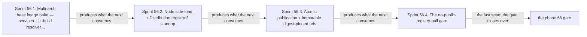

# Phase 56: The base image, the jit-build resolver, and the in-cluster registry

> **Purpose**: Build this substrate's own architecture of the amoebius base image — every third-party service
> binary except the Registry provider, plus the shared jit-build resolver and its toolchain, but no ML engine
> payloads — preload the separately pinned Distribution `registry:2` image, and publish the base image
> atomically into that sole in-cluster registry so the live cluster pulls only from itself.
> **Read this if**: phase 56 is next in the queue, or a later phase depends on what its gate establishes.

This document specifies a target capability only. Any pre-reset implementation result, pass, seal, receipt,
command transcript, or evidence reference retained below is historical inventory only: it is permanently
non-operative, cannot satisfy any current contract, and cannot satisfy a gate through a status edit. Current
status is owned by [the tracker](README.md) and the Phase Status block below.

Link-graph metadata

**Status**: Authoritative source
**Supersedes**: N/A
**Referenced by**: DEVELOPMENT_PLAN/README.md, DEVELOPMENT_PLAN/later_phases.md, DEVELOPMENT_PLAN/overview.md, DEVELOPMENT_PLAN/phase_35_image_recipe_generation.md, DEVELOPMENT_PLAN/phase_57_complementary_arch_child.md, DEVELOPMENT_PLAN/phase_58_object_reconciler.md, DEVELOPMENT_PLAN/phase_59_capacity_scheduler.md, DEVELOPMENT_PLAN/phase_62_platform_backbone.md, DEVELOPMENT_PLAN/phase_78_provider_ebs_credential.md, DEVELOPMENT_PLAN/phase_80_determinism_jitcache.md, DEVELOPMENT_PLAN/system_components.md
**Generated sections**: none

## Contents

- [Phase Status](#phase-status)
- [Phase Summary](#phase-summary)
- [Gate integrity](#gate-integrity)
- [Resource provision — UNRESOLVED](#resource-provision--unresolved)
- [Doctrine adopted](#doctrine-adopted)
- [Sprints](#sprints)
- [Sprint 56.1: Native-architecture base image bake — services + jit-build resolver/toolchain, not engine payloads ⏸️](#sprint-561-native-architecture-base-image-bake--services--jit-build-resolvertoolchain-not-engine-payloads-)
- [Sprint 56.2: Node side-load + Distribution `registry:2` standup ⏸️](#sprint-562-node-side-load--distribution-registry2-standup-)
- [Sprint 56.3: Atomic publication + immutable digest-pinned refs ⏸️](#sprint-563-atomic-publication--immutable-digest-pinned-refs-)
- [Sprint 56.4: The no-public-registry-pull gate ⏸️](#sprint-564-the-no-public-registry-pull-gate-)
- [Documentation Requirements](#documentation-requirements)
- [Related Documents](#related-documents)

---

## Phase Status

⏸️ Blocked — NOT VALIDATED.

Blocked by redesigned Phase 55, its independent validation, and gate pass; every earlier
gate barrier must also be satisfied in numerical order. Every earlier completion claim and implementation result in this document is historical rather than a current gate result, even
where the surrounding prose has not yet been rewritten. Existing implementation is an **Observed footprint /
Known partial** only.

Hardware validation is also prohibited until the hardware-free DSL gate barrier is independently
satisfied and gate-passed.

> **Reset contract interpretation.** The phase-specific gate check below is UNRESOLVED — NOT VALIDATED. Until Phase 0 Sprint 0.7 replaces every unresolved row and the complete qualified gate passes, the summary and work breakdown are a capability inventory, not an executable contract. Any wording that prescribes tracked non-`.hs` behavioural source, a Python/shell verdict, repository-retained generated behavioral transport material, `pb` behavior outside its minimal-platform-discrimination/contained-toolchain-establishment/source-bound-build/opaque-exec grammar, or host/hardware validation before the Phase-49 barrier is historical and non-operative.

## Phase Summary

**Publishing this architecture's image must warm a cache; it must not confer authority.** The target must push a
tag that is the recipe's content address, so a consumer that holds the repository can compute the address it
needs and ask for exactly that. A recipe change would therefore have an address the registry does not hold, and
the consumer must rebuild rather than pull something stale ([`image_build_doctrine.md` §2.1](../documents/engineering/image_build_doctrine.md#21-a-published-tag-is-a-cache-warm-up-and-its-name-is-the-content-address)). The future gate must establish atomicity: a partial upload must never resolve.

This phase must take the empty `kind` cluster targeted by Phase 55 and make it pull only from itself. It must
produce **this substrate's architecture of the base image** — every third-party platform-service binary
(MinIO, Vault, Pulsar, **Redis (`redis-server`/Sentinel mode plus `redis-cli`)**, Keycloak,
Prometheus/Grafana, Patroni/Percona Postgres, Envoy, MetalLB, and
the rest) baked in by the supply-chain preference ladder (apt → official binary/tarball → build-from-source,
including the JVM build for this architecture), **plus the shared jit-build resolver and its build toolchain** (`g++`, the pinned compilers, and any linux cross-tooling — **not** `nvcc`, which is what made the
pre-amendment base a CUDA devel image and belongs to the `linux-cuda` lane at
[Phase 93](phase_93_jitml_rederivation.md) under [§L](development_plan_standards.md#l-one-substrate-discipline);
and **not** the Apple-Metal bridge,
which is a headless on-host Mach-O dylib produced only on the **apple** substrate at
[Phase 89](phase_89_apple_metal_host_daemon.md), never a linux ELF here). The ML **engine payloads**
(`llama.cpp`, `whisper.cpp`, the ONNX runtime, Audiveris, the adapters) are the deliberate exception: each is a
**named catalog identity** the shared jit-build resolver materializes on first miss into the
`CacheBudget`-bounded content-addressed cache — none may be baked or authored by URL. The target image must be
built by **one `docker build` invocation at this host's natural architecture**, emitting the plain OCI image for
that platform and no other under an architecture-qualified tag, and side-loaded onto the node. Distribution
is not a member of that baked-binary list: its `registry:2` image is preloaded separately as the sole admitted
registry implementation, and this phase publishes the architecture-qualified image atomically to that
in-cluster service. The complementary
architecture's independently tagged image is [Phase 57](phase_57_complementary_arch_child.md)'s; no index or
manifest list may join the two, because no host may claim a test for the half it cannot execute
([`substrate_doctrine.md` §1.1](../documents/engineering/substrate_doctrine.md#11-the-natural-architecture-rule)).

The host-side Docker build execution is itself provisioned. A pure `BuildExecutionEnvelope` declares an
acyclic platform/stage graph with per-stage CPU/memory reservation+ceiling, intermediate bytes, and cache-write
delta, named scratch/cache backings, and separate finite architecture/stage concurrency. A read-only, snapshot-bound host
preflight proves the expanded single-architecture build peak fits current residual supply before the first
builder process; the resulting `ImageArtifact` is a separate logical node-storage provision and cannot substitute for
this execution envelope.

The scope deliberately stops at *baking the image and publishing it fail-closed with no public pull*. The typed
SSA reconciler that will eventually own the registry is a Phase 58 concern; `no-provisioner` retained storage
is Phase 60 and MinIO is Phase 62. Phase 56 is an explicit bootstrap cycle-break, not a resource or render
exception. `provisionBootstrapRegistry` binds the complete registry/proxy execution, storage, and node-image
import demand against the Phase-55 topology and returns an opaque `ProvisionedBootstrapRegistry`. A fresh
read-only snapshot may then mint exactly one `BootstrapRegistryAction`: side-load the image and initialize
only the registry/proxy Kubernetes objects from that provision's identity-keyed sources. The action uses the
same package-private Phase-33 source serializer, but neither constructs a minimal `ProvisionedServiceSpec` nor
exposes public per-service render/apply; public manifest generation remains only
`renderAll :: ProvisionedSpec -> [K8sObject]`.

The bootstrap object's source/field digest is retained as
`BootstrapRegistryWholeDeploymentHandoffIdentityDigest`. When Phase 58 first constructs the complete
whole-deployment `ProvisionedSpec`, it may adopt those exact identities only after live readback proves source
and owned-field equality; a typed one-time ownership handoff then moves them into normal whole-deployment
reconciliation without two writers or an implicit delete/recreate. The interim node-local filesystem blob
store is a bounded disk-backed `emptyDir`, and the side-loaded base image is admitted against the physical
backing selected by the node's declared filesystem layout—shared with nodefs under `Unified`, imagefs under
`SplitRuntime`.
The MinIO-backed S3 driver and reconciler-owned apply are later-phase targets, honestly,
not built here. Vault does not yet exist
(Phase 61), so host-only **read** access is credential-free on the node. The target must make mutation
exclusive: the registry backend must listen on a proxy-private socket, and the sole mutating proxy must accept only the
snapshot-bound publisher capability plus the provisioned digest/size/concurrency set. Direct or unexpected
`POST`/`PATCH`/`PUT` requests must be denied before storage mutation; the later Vault credential hardens identity
transport but is not the capacity boundary. The proxy is an ordinary resource-bearing execution unit: its
admission cost model derives a complete image/CPU/memory/ephemeral/log/writable/replica/rollout
`PodResourceEnvelope`, which must place alongside the registry before the private socket is exposed.

Registry storage is not an unexplained blob allowance. This architecture's image has a canonical
`RegistryStoredArtifact` description keyed by registry digest: compressed/stored layer bytes, config bytes,
and image-manifest bytes are all explicit objects. A `RegistryStorageDemand` combines
those desired objects with finite upload concurrency, a versioned model that derives upload workspace, and a
finite failed-upload rate window/GC exposure plus the closed mutation-admission model. Provisioning unions the
desired digests with the independently observed resident digest map,
rejects conflicting byte metadata for one digest, keeps every observed resident charged until deletion is
observed, derives the stored-object plus transient upload/partial extent set, and returns the private
`ProvisionedRegistryStorageDemand` and admission witness used for the interim filesystem volume/proxy.
There is no caller-authored aggregate or registry-budget shortcut.

**Phase scope:** one cohesive claim — *the cluster pulls only from itself*. One architecture, one atomically published image, and no ML engine payload inside it.

**Substrate:** linux-cpu ([§L](development_plan_standards.md#l-one-substrate-discipline)) — the whole gate runs
on a single-node `kind` cluster in the CPU-only Linux lane. A host supplies this lane at its **natural
architecture** only: native Linux (or Incus when a pristine Linux host is required), or WSL2 on Windows, each
at `amd64`. An accelerator-bearing host does not expose its accelerator to this gate, so Phase 56 exercises
no specialized Apple-Metal or CUDA lane; `linux-cpu` does not constrain the physical host to CPU-only native
Linux. This is a **Register 3** (live-infrastructure) gate.

**Lane:** linux-cpu/amd64 — the architecture assigned to the post-Phase-55 live chain and later provider-node
pulls. Its complementary architecture is owned by [Phase 57](phase_57_complementary_arch_child.md).

**Register:** 3 — live infrastructure ([§K](development_plan_standards.md#k-honesty-proven--tested--assumed)).

**Depends on:** [Phase 55](phase_55_bootstrap_coordinator_kind.md)
**Gate:** `pb validate phase 56`; see [Gate integrity](#gate-integrity). NOT VALIDATED.

## Gate integrity

**Contract check**: REJECTED — NOT VALIDATED.

| Key | Contract |
|---|---|
| `Claim` | UNRESOLVED — blocks validation: typed semantic payload and gate evidence missing; prior prose: one cohesive claim — *the cluster pulls only from itself*. One architecture, one atomically published image, and no ML engine payload inside it. Explicit exclusions: every layer named in `Residue` remains UNVERIFIED. |
| `Subject` | UNRESOLVED — blocks validation: no production `.hs` module and entry point have been independently established for this reset contract. |
| `Command` | UNRESOLVED — blocks validation: typed semantic payload and gate evidence missing; prior prose: `pb validate phase 56` is the target command only; `pb` may only make the minimal platform distinction, establish the contained toolchain, build the source-bound binary, and exec it with argv unchanged, while the Haskell verdict entry point remains UNRESOLVED and blocks validation. |
| `Oracle` | UNRESOLVED — blocks validation: no separately authored `.hs` oracle, independence boundary, provenance have been established. |
| `Positive controls` | UNRESOLVED — blocks validation: no closed named Haskell corpus and exact per-member observations have been accepted. |
| `Paired negatives` | UNRESOLVED — blocks validation: minimally different pairs, exact rejection loci, and exact reasons have not yet been demonstrated by a passing gate for every foreclosed dimension. |
| `Mutants` | UNRESOLVED — blocks validation: operators, production loci, applied-change witnesses, expected red observations, and unaffected controls have not yet been demonstrated by a passing gate. |
| `Discovery` | UNRESOLVED — blocks validation: expected and runtime-discovered surfaces, two-way equality, and empty-discovery refusal have not yet been demonstrated by a passing gate. |
| `Challenge` | UNRESOLVED — blocks validation: neither a post-start challenge nor a checked pure-claim independent predicate has been accepted. |
| `Observer` | UNRESOLVED — blocks validation: no outside observer, raw observation, authenticity check, and fail-closed rule have been accepted. |
| `Authority/bypass` | UNRESOLVED — blocks validation: least-privilege/foreign-scope pairs, bypass probes, or checked non-applicability have not yet been demonstrated by a passing gate. |
| `Freshness` | UNRESOLVED — blocks validation: stale state, cached output, prior evidence, and replayed responses have not been made unable to pass. |
| `Qualification` | UNRESOLVED — blocks validation: the fixed sabotage corpus has not qualified a Haskell harness independently of a clean candidate run. |
| `Cleanroom` | UNRESOLVED — blocks validation: no run has derived all products lazily with generated and condemned legacy copies absent. |
| `Legacy closure` | UNRESOLVED — blocks validation: stable owned legacy IDs and their exact zero-finding check have not been reconciled. |
| `Predecessor` | UNRESOLVED — blocks validation: typed semantic payload and complete gate execution missing; prior prose: Exact `ImmediatePredecessorPass` for Phase 55; candidate execution refuses an absent, stale, replayed, or different-source result. |
| `Residue` | UNRESOLVED — blocks validation: typed semantic payload and gate evidence missing; prior prose: UNVERIFIED — the entire phase claim and all semantic, effect, runtime, hardware, and cleanup layers remain unvalidated; no empty residue is asserted. |
| `Pass criterion` | UNRESOLVED — blocks validation: typed semantic payload and complete gate execution missing; prior prose: `qualified-gate-pass` — every required gate row must succeed in one qualified run for the exact current source; that complete pass is sufficient for the status-only transition. |

## Resource provision — UNRESOLVED

> **UNRESOLVED — blocks validation.** No live mutation may begin. Before check this phase must name its exact owner marker, preflight, allowed and forbidden mutations, external observer, scoped cleanup, and zero-owned-residue criterion. The reset inventory below cannot supply that contract.

## Doctrine adopted

- [`jit_artifact_doctrine.md` §2 — The rule, and the closed exception list](../documents/engineering/jit_artifact_doctrine.md#2-the-rule-and-the-closed-exception-list) — every artifact the base image, the jit-build resolver, and the in-cluster registry emits is a recipe over a content address, never an authored file.
- [`image_build_doctrine.md` §7 — what amoebius bakes vs builds: the base container is the supply chain](../documents/engineering/image_build_doctrine.md#7-what-amoebius-bakes-vs-builds--the-base-container-is-the-supply-chain):
  the central adoption — the base image bakes every third-party **service binary** and the **jit-build resolver + toolchain**, while the ML **engine payloads** are jit-resolved on first miss and never baked; the
  amoebius runtime image (GHC 9.12.4) is the one image amoebius *builds* — **this phase bakes and publishes the amoebius binary alone**; infernix and jitML are linked into the runtime image only when their lifts land (the
  image is rebuilt and republished at [Phase 91](phase_91_infernix_rederivation.md) /
  [Phase 93](phase_93_jitml_rederivation.md), never here), so Phase 56 carries no forward dependency on the
  extension lifts. The amoebius binary's own UI-server surface travels with it: the generic client source and
  bundle generated lazily from Haskell by [Phase 46](phase_46_ui_contract_generation.md) are a **baked asset of this
  image**, not a second image — the UI server is a worker responsibility of the same executable, and a UI
  release is release *data* ([Phase 72](phase_72_ui_program_release.md)), never an image build. That is
  inside "the amoebius binary alone": it is product surface, not an ML engine payload.
- [`image_build_doctrine.md` §2 — the single distribution rule: bake the binaries, build the amoebius image, pull only in-cluster](../documents/engineering/image_build_doctrine.md#2-the-single-distribution-rule-bake-the-binaries-build-the-amoebius-image-pull-only-in-cluster):
  the in-cluster Distribution `registry:2` image is the sole pull source, and no workload ever pulls
  from a public registry.
- [`image_build_doctrine.md` §3 — one image per architecture: the tag carries the architecture, not an index](../documents/engineering/image_build_doctrine.md#3-multi-architecture-images--one-natively-built-child-per-architecture):
  one `docker build` on a host of that architecture emits that architecture's image under its own tag;
  [Phase 57](phase_57_complementary_arch_child.md) independently builds and publishes the complementary tag.
  No index joins them.
- [`image_build_doctrine.md` §4 — atomic publication: a partial upload is a failed upload](../documents/engineering/image_build_doctrine.md#4-atomic-publication--a-partial-multi-arch-upload-is-a-failed-upload):
  fail-closed atomic publication — one push lands this architecture's complete image or its tag
  stays un-advertised, and re-run is idempotent.
- [`image_build_doctrine.md` §5 — What the image identity is, given that the tag is an address](../documents/engineering/image_build_doctrine.md#5-what-the-image-identity-is-given-that-the-tag-is-an-address)
  and [`§8` — build mechanics under the no-env / no-`PATH` contract](../documents/engineering/image_build_doctrine.md#8-build-mechanics-under-the-no-env--no-path-contract):
  immutable, digest-pinned refs (never `:latest` as a deployment reference) and the ephemeral
  `docker --config` build mechanics with no environment variable and no `docker login`.
- [`resource_capacity_types.md` §3 — The types: `Quantity`, `Capacity`, `Demand`, `Budget`; “The systematic provision matrix”](../documents/engineering/resource_capacity_types.md#31-the-systematic-provision-matrix):
  host build execution is a first-class `BuildExecutionEnvelope` whose snapshot-bound CPU/memory/scratch/
  cache/concurrency admission is separate from the resulting `ImageArtifact`'s node image-store fit.
- [`image_build_doctrine.md` §9 — bring-up ordering: the registry chicken-and-egg dissolves](../documents/engineering/image_build_doctrine.md#9-bring-up-ordering--the-registry-chicken-and-egg-dissolves):
  the sole registry implementation is the preloaded Distribution `registry:2` image, so it is available before the cluster serves and there is no
  pre-registry public-pull window to bootstrap.
- [`platform_services_doctrine.md` §3 — the registry, the single image source](../documents/engineering/platform_services_doctrine.md#3-the-registry--the-single-image-source):
  Distribution `registry:2` as a standard service, reached at the host-only registry endpoint.
- [`content_addressing_determinism.md` §4.5 — The ML-asset lifecycle: one bounded content-addressed cache, resolved on first miss](../documents/engineering/content_addressing_determinism.md#45-the-ml-asset-lifecycle-one-bounded-content-addressed-cache-resolved-on-first-miss):
  the reversal this phase upholds — engine payloads are named catalog identities resolved into a
  `CacheBudget`-bounded content-addressed cache, with no arbitrary-`Url` arm, never OCI-baked.
- [`testing_doctrine.md` §2 — the registers of amoebius testing](../documents/engineering/testing_doctrine.md#2-the-registers-of-amoebius-testing):
  this phase's future gate targets **Register 3**; any candidate ledger must name that bounded live register
  and cannot make the phase gate pass.

## Sprints

> **Reset validation check.** Every pre-reset `Independent Validation` and `### Validation` below is historical context rather than a current criterion. It is retained only to inventory the capability while the fixed Haskell subject/oracle/mutant/legacy contract is rewritten.

> **Permanent sprint reset.** Every pre-reset sprint result below is historical context. The retained body is non-operative capability inventory only. Current acceptance requires the resolved eighteen-row Haskell gate contract, fresh independently observed evidence, immediate-predecessor gate pass, owned legacy closure, and a complete gate pass.

*Orientation only. These are the seams Phase 56 would build in order; [Gate integrity](#gate-integrity) owns the apparatus. Every sprint is blocked and NOT VALIDATED, and no earlier seal or pause state is operative.*

## Sprint 56.1: Native-architecture base image bake — services + jit-build resolver/toolchain, not engine payloads ⏸️

**Status**: Blocked — NOT VALIDATED
**Implementation**: UNRESOLVED — blocks validation: the authored Haskell implementation path has not been established.
**Blocked by**: [Phase 55](phase_55_bootstrap_coordinator_kind.md) gate pass
**Independent Validation**: UNRESOLVED — blocks validation: no falsifiable positive control, paired specific-reason negative, changed-subject mutant, and residue seam has been established.
**Oracle**: UNRESOLVED — blocks validation: no separate Haskell oracle, independence boundary have been established.
**Legacy IDs**: UNRESOLVED — blocks validation: typed Haskell legacy bindings have not been reconciled for this sprint.
**Docs to update**: UNRESOLVED — blocks validation: governed doctrine owners have not been established for this sprint.

### Objective

Adopt [`image_build_doctrine.md` §7 — what amoebius bakes vs builds](../documents/engineering/image_build_doctrine.md#7-what-amoebius-bakes-vs-builds--the-base-container-is-the-supply-chain)
and [§3 — one natively built child per architecture](../documents/engineering/image_build_doctrine.md#3-multi-architecture-images--one-natively-built-child-per-architecture):
bake every third-party service binary except the separately preloaded Registry provider by the apt → official-binary → build-from-source ladder (including this
architecture's Temurin JRE for the JVM services) **and** the shared jit-build resolver + its build toolchain, while
holding the ML engine payloads out of the image as named catalog identities resolved on first miss into the
`CacheBudget`-bounded cache ([`content_addressing_determinism.md` §4.5](../documents/engineering/content_addressing_determinism.md#45-the-ml-asset-lifecycle-one-bounded-content-addressed-cache-resolved-on-first-miss)) —
the shape jitML's resolver evidences and infernix's `curl`-tar-at-build is *sibling evidence being replaced*.

### Deliverables

- A base `Dockerfile` baking this platform's binaries by the supply-chain preference order, plus the
  jit-build resolver and its toolchain layer; the amoebius runtime image built at GHC 9.12.4 shipping the
  amoebius binary alone (infernix and jitML are linked into the runtime image only when their lifts land, at
  [Phase 91](phase_91_infernix_rederivation.md) / [Phase 93](phase_93_jitml_rederivation.md), never here, so Phase 56
  carries no forward dependency on the extension lifts).
- A mandatory Redis bake entry with a pinned package identity for this architecture. It installs
  `/usr/bin/redis-server` (used for server and Sentinel modes) and `/usr/bin/redis-cli`, records their digests
  in the inventory/SBOM, and admits no startup download or public `redis` image fallback.
- A pure `BuildExecutionEnvelope` plus
  `observeBuildHost → deriveBuildTransition → validate → ValidatedBuildTarget` boundary. It includes
  a non-empty acyclic platform/stage graph with per-stage host/engine-VM CPU/memory reservation+ceiling,
  intermediate-layer and cache-write peaks, a named `BuildScratch` backing, a named bounded cache backing whose
  currently resident bytes plus derived concurrent writes remain charged until observed GC, and a
  `Serial | BoundedParallel n` stage concurrency. The Docker builder cannot start without
  consuming the unchanged-snapshot token.
- A plain `docker build` on this host's natural architecture producing **one** OCI image under an
  architecture-qualified tag; an observed architecture mismatch refuses before the builder starts.
- A content-digested `ImageArtifact` for that image: exact image-manifest bytes and digest/size,
  and config digest/size; each layer's blob digest, compressed bytes, snapshot chain id, and
  unpacked bytes; and peak import workspace. The build measures those values independently and must fit the
  Phase-0-declared upper bounds; a missing platform/object entry, digest-size conflict, or oversized result
  fails before node import/publication.
- The corresponding canonical `RegistryStoredArtifact`, derived exactly from that `ImageArtifact`: each
  compressed layer blob, config, and image manifest is keyed by its registry digest,
  kind-tagged, and carries exact stored bytes. It is a distinct registry-storage projection from the same pure
  provenance, not a second caller-authored aggregate and not an estimate reconstructed from unpacked layers.
- The **typed Haskell `BakeCatalog` declaration** — the behavioral source of truth: every
  stage's `content : NonEmpty BakeStep`
  with its pinned versions for this architecture, decoded by `BakeInventory` into the `BuildExecutionEnvelope`. The union is
  closed with **no `RunShell : Text` arm and no `Url` arm**
  ([`image_build_doctrine.md` §6](../documents/engineering/image_build_doctrine.md#6-host-build-vs-in-pod-build--development_plan-decision-recommended-default-host-builder-for-v1)),
  so an interpolated shell fragment or an operator-supplied download address is unrepresentable rather than
  discouraged — closing [`illegal_state_lifecycle.md` §3.76](../documents/illegal_state/illegal_state_lifecycle.md#376-a-build-stage-whose-content-is-unmodeled).
- A typed companion-payload record for separately published release dependencies. It carries the per-platform
  asset, publisher checksum contract, archive shape, target root, and required file. Pulsar's offloader bundle
  is the first instance, with its jcloud NAR required beneath `/pulsar/offloaders` in this architecture's child.
- `renderDockerfile :: BakeCatalog -> Either CatalogError Dockerfile`, pure and total, emitting the previously
  hand-authored `ARG`/`RUN … install` blocks from that catalog. A separately authored Haskell expectation pins
  renderer behaviour, while the Dockerfile and byte-diff view are generated lazily beneath `.build/**`.
  No Dockerfile or external catalog projection is repository source. The emitted file is stamped generated-by, per
  [`generated_artifacts_doctrine.md` §2](../documents/engineering/generated_artifacts_doctrine.md#2-what-is-generated-and-from-what).
- A bake-inventory lint proving the resolver/toolchain are present and every ML engine payload is **absent**.
- An architecture-native Redis probe on this image platform: absolute-path `redis-server --version` and
  `redis-cli --version` match the independent Haskell catalog expectation. The Haskell changed-subject mutants
  `omitRedis` and `redisVersionSkew` each turn the gate red.
- A separately authored Haskell bake-inventory expectation containing the canonical standard-platform-services
  set and pinned versions for this architecture. The Haskell changed-subject mutants `stubArm64Binary`,
  `wrongArchLayer`, `gxxVersionSkew`, `dropBuildScratchAccounting`, and `dockerfileHandedit` must turn their
  named checks red. Any mutated Dockerfile or other external form is generated lazily beneath `.build/**`.

  **The oracle stays independent after the phase gate passes.** `BakeInventory` consumes the Haskell `BakeCatalog`
  subject declaration, so the §M.3 obligation — reconcile the image
  against the Phase-0 table, **never** against the implementer's own value — now requires that
  the independent Haskell expectation remain separately authored rather than derived from `BakeCatalog`. An
  oracle that imports the subject value it checks is not a test.

### Validation

1. Independently occupy or shrink one of build CPU, memory, intermediate scratch, or cache backing; make
   `observed cache residents + concurrent stage cache writes` exceed the budget/backing by one byte; exceed
   bounded stage concurrency; inject an unknown host commitment; and change the fingerprint after
   validation. Exceeding bounded stage concurrency is one such case; there is no architecture axis to exceed,
   because the gate builds one. Each case returns its exact error with zero Docker builder processes and
   zero scratch/cache writes. The fitting envelope produces one token. An independent Docker-daemon/cgroup/engine-VM configuration
   reader proves the exact CPU/RSS policy and scratch/cache roots match the provision witness; deliberate
   CPU, RSS, scratch, and cache-write overrun stages are throttled, terminated/OOM-killed, or receive bounded-
   filesystem `ENOSPC` within the declared provision, with no spill outside named backings. A Haskell
   changed-subject mutant that
   launches an unbounded builder must turn these OS-boundary assertions red.
2. Independent local-image inspection reports exactly this host's natural platform, and no other; the image
   reference contains the same architecture rather than relying on a manifest-list selection.
   Canonical Docker Hub metadata is preferred; only a canonical 429 may select `mirror.gcr.io`, and the run
   records that endpoint while retaining the canonical repository-plus-digest identity. The private Docker
   daemon and bounded builder config both name the cache; neither consults host-global auth or daemon state.
3. Independently inspect and hash the OCI image manifest, config, every compressed blob, and each unpacked
   snapshot; require exact agreement with `ImageArtifact`. Re-derive `RegistryStoredArtifact` from that value
   and require the digest/kind/stored-byte map to equal the Phase-0 Haskell expectation; a missing object or conflicting
   size for one digest fails before import or publication.
4. The bake-inventory check is green against a separately authored Haskell service expectation (services,
   resolver, and toolchain present; engine payloads absent), reconciled automatically against the rendered
   run-local `.build/**` inventory — not against the SUT's own inventory or a serialized oracle.
5. Every baked binary runs natively on this gate's own architecture, by absolute path,
   with its pinned harmless probe; no emulator is extracted, mounted, or invoked, and the run registers no
   host-global `binfmt` state; native version endpoints match the pinned version, documented non-version
   diagnostics join to the pinned OCI/SBOM identity, and the layer passes the ELF `e_machine` check.
6. Reconcile every companion payload against an independently authored Haskell OCI-file expectation. Require the Pulsar
   jcloud NAR in this platform child, verify its bytes came from the publisher-checksummed offloader
   archive, and make `omit-pulsar-offloaders` fail at the missing-payload locus.
7. The Haskell `stubArm64Binary`, `wrongArchLayer`, `gxxVersionSkew`, and
   `dropBuildScratchAccounting` changed-subject mutants turn the validation red (§M.2).
8. Run both Redis binaries on this architecture by absolute path, verify their pinned versions and SBOM
   digests, and prove that the generated Redis/Sentinel workload image identity is the published
   monocontainer/base-image digest. The Haskell omit/version-skew/public-image changed-subject mutants fail for
   their specific reasons.

### Remaining Work

The whole sprint. The pre-amendment bake ran, but this sprint's bake is single-architecture and natively
probed, and no run has produced it.

## Sprint 56.2: Node side-load + Distribution `registry:2` standup ⏸️

**Status**: Blocked — NOT VALIDATED
**Implementation**: UNRESOLVED — blocks validation: the authored Haskell implementation path has not been established.
**Blocked by**: Sprint 56.1
**Independent Validation**: UNRESOLVED — blocks validation: no falsifiable positive control, paired specific-reason negative, changed-subject mutant, and residue seam has been established.
**Oracle**: UNRESOLVED — blocks validation: no separate Haskell oracle, independence boundary have been established.
**Legacy IDs**: UNRESOLVED — blocks validation: typed Haskell legacy bindings have not been reconciled for this sprint.
**Docs to update**: UNRESOLVED — blocks validation: governed doctrine owners have not been established for this sprint.

### Objective

Adopt [`image_build_doctrine.md` §2 — the single distribution rule](../documents/engineering/image_build_doctrine.md#2-the-single-distribution-rule-bake-the-binaries-build-the-amoebius-image-pull-only-in-cluster),
[§9 — the registry chicken-and-egg dissolves](../documents/engineering/image_build_doctrine.md#9-bring-up-ordering--the-registry-chicken-and-egg-dissolves),
and [`platform_services_doctrine.md` §3 — the registry, the single image source](../documents/engineering/platform_services_doctrine.md#3-the-registry--the-single-image-source):
stand up Distribution `registry:2` as the sole in-cluster pull source. Because the SSA
reconciler (Phase 58), retained storage (Phase 60), and MinIO (Phase 62) do not yet exist, the registry comes up
through the resource-provisioned, snapshot-bound `ProvisionedBootstrapRegistry` → `BootstrapRegistryAction`
cycle-break against bounded interim node-local blob storage. The action initializes only the exact
registry/proxy object domain through Phase 33's package-private serializer; it is not a minimal
whole-deployment spec and creates no public service-render boundary.
[§9](../documents/engineering/platform_services_doctrine.md#9-the-loadbalancer-and-the-single-wild-ingress-path)'s dissolution holds — the sole registry implementation is the preloaded Distribution `registry:2` image, so there is no pre-registry public-pull window.

### Deliverables

- A registry-specific pure/live boundary:
  `provisionBootstrapRegistry → observeBootstrapRegistryInventory → validateBootstrapRegistryTarget →
  BootstrapRegistryAction → enactBootstrapRegistry → BootstrapRegistryEnactmentResult`. The action contains
  the exact `ValidatedBootstrapRegistryTarget`; the provision contains the exact image,
  pre-scheduler registry/proxy execution, registry storage, node import, identity-keyed sources, initialized-field
  ownership partition, and later-handoff digest. `ObservedBootstrapRegistryInventory` is the deliberately
  pre-scheduler snapshot—capacity, runtime roots/content/snapshots, residents, API versions, and sole-host
  bootstrap authority only; it cannot require the Phase-58 scheduler-ready/full managed inventory. The action
  is bound to those versions and carries a fingerprint-indexed fresh token. Import and object initialization
  are inaccessible without CAS-consuming it. Applied and ambiguous outcomes both return a consumed receipt;
  the latter exposes only re-observation. A changed snapshot replans, while any pre-CAS mismatch has zero
  effects.
- `ProvisionedBootstrapRegistryExecution` is a finite cycle-break, not ordinary
  `ProvisionedExecutionEpochs`: its registry and proxy controllers use the default scheduler only before
  managed admission exists, carry fixed-node affinity plus complete static reservations/quota, and are
  mandatory members of Phase 59's default→`amoebius-capacity` cutover. They cannot remain as a second
  default-scheduler writer domain after `ManagedCapacityReady`.
- A node side-load path that proves the selected-platform OCI content/snapshot/import peak plus every observed
  resident object/snapshot fits the layout-selected residual backing under the observed enforced pull policy,
  then imports the base image
  into the `kind` node's containerd (no public pull).
- A `ProvisionedBootstrapRegistry` whose `BootstrapRegistryAction` side-loads the selected image and initializes
  only the provisioned registry/mutation-proxy object domain through the same private serializer used by
  Phase 33. There is no public `render :: ProvisionedServiceSpec -> …` or bootstrap `ProvisionedSpec`; public
  manifests still cross only `renderAll :: ProvisionedSpec -> [K8sObject]`. The registry is reachable at the
  host-only registry endpoint via per-distro registry plumbing generated lazily from Haskell beneath
  `.build/**` and materialized only at the host-node runtime destination owned by
  [`substrate_doctrine.md`](../documents/engineering/substrate_doctrine.md), with explicit CPU/memory/ephemeral/private allowances and
  an interim filesystem-driver `emptyDir` whose `sizeLimit` covers the derived peak recorded in the private
  `ProvisionedRegistryStorageDemand` and whose volume/pod-request nesting is checked. The underlying
  `RegistryStorageDemand` contains canonical digest-keyed `RegistryStoredArtifact` metadata, finite upload
  concurrency, versioned model-derived upload workspace, finite failed-upload rate-window/GC exposure, and
  exclusive mutation admission; the private result retains exact resident objects plus structured transient
  extents for later MinIO geometry. Observed resident objects
  remain charged until an observer reports their deletion. The action retains a canonical identity/source/
  initialized-field digest. Phase 58 may adopt those exact objects into a later whole `ProvisionedSpec` only
  after equal live readback and a one-time typed ownership handoff; mismatch rejects without a second writer,
  apply, delete, or recreate. The backing is replaced by the MinIO S3 driver in Phase 62.
- A registry mutation-proxy demand derived from `RegistryMutationAdmission` concurrency/rate/metadata and its
  cost model. Its complete pod/image/CPU/memory/ephemeral/log/writable/replica transition envelope enters
  `BoundExecutionSet`; the registry backend has no mutating route or credential outside that proxy.

### Validation

1. Before import or object initialization, the registry-specific read-only snapshot preflight re-observes CPU
   request/finite-limit-policy residual, memory and logical-ephemeral request+ceiling residual, pod slots,
   blob-volume capacity and its resident digest/byte map, the nodefs/imagefs/containerfs layout and
   capacities, all resident containerd OCI content plus both final and active containerd snapshot states, the pinned node-image
   model, and the enforced pull policy.
2. `provisionBootstrapRegistry` first constructs the opaque resource-complete `ProvisionedBootstrapRegistry`;
   validation then derives the layout-routed import+registry+mutation-proxy transition and returns a
   snapshot-bound single-use `BootstrapRegistryAction` required by both containerd import and initialization
   of the exact registry/proxy object domain.
3. The registry side binds the canonical `RegistryStorageDemand` to that snapshot: it unions observed
   residents with every desired compressed layer/config/manifest object by digest, debits equal digests once,
   rejects unequal stored-byte metadata for one digest, adds the largest permitted simultaneous upload
   workspaces, and retains the bounded partial-upload residue through the finite GC horizon.
4. Independently occupy CPU, memory, pod slot, pod ephemeral/blob volume, or image store, and mismatch the pull policy;
   each one-field negative must fail the snapshot preflight with zero containerd import and zero apiserver
   writes. The occupied-CPU, occupied-memory, registry/proxy pod-slot or resource shortage,
   registry-volume/ephemeral-overdraw, digest-size-conflict, content/snapshot-byte-over, layout-alias, and
   pull-policy-mismatch Haskell negative cases all behave that way, and a domain/identity/source-digest or
   initialized-field mismatch mints no action at all.
5. Then admit the fitting selected-platform image, assert the `BootstrapRegistryAction` is single-use
   and contains exactly the provisioned registry/proxy identities, assert the registry pod's serialized
   resource/blob-volume envelope and proxy envelope equal their provision witnesses, and assert the registry
   read endpoint plus proxy-private mutation path resolve. A case where the registry fits but the proxy is one
   CPU/memory/ephemeral unit or pod slot short rejects before either Deployment is applied.
6. The admitted registry pod and sole mutation proxy run **from the on-node image** with zero registry
   pull and complete provisioned envelopes: per-container CPU/memory/ephemeral requests+limits and private
   allowances, plus a disk-backed blob volume whose `sizeLimit` covers the derived peak recorded in the opaque
   `ProvisionedRegistryStorageDemand`. The shared volume plus private allowance fit the pod ephemeral
   request/limit and route to the selected physical filesystem, and the host-only endpoint resolves through
   the per-distro wiring.
7. A fake later whole-deployment adoption with the equal handoff digest succeeds once without object
   recreation; a one-field identity/source/owned-field mismatch and a second transfer both reject with zero
   object writes. Phase 62 preserves this private demand's `objectSet`, `derivedPeak`, and upload/orphan
   witness while migrating its backend to MinIO.
8. Independently recompute the registry transition from the Phase-0 artifact table and an observed resident
   map. Cover a resident/new digest overlap (one debit), conflicting byte sizes for one digest, the maximum
   concurrent upload set, partial-upload residue just before its GC horizon, and a volume exactly one byte
   below the derived peak. Every conflict/overflow rejects before import, apply, or registry mutation; an
   object merely selected for deletion remains charged until a later snapshot observes it absent.
9. Assert no public-registry pull occurred during registry standup **from the OS-boundary observer** (§M.5 —
   node `containerd` logs plus a node-level packet capture spanning the standup window; no image-layer fetch
   and zero TCP connections to the resolved endpoints of the [Gate integrity](#gate-integrity) public
   registries), recorded for the Sprint 56.4 gate — never from a self-emitted compliance trace.

### Remaining Work

Repeat the side-load and registry standup in the uninterrupted phase run, then pass the Sprint 56.2 gate and
retain its receipt. Atomic publication remains exclusively Sprint 56.3 work. The MinIO-backed backend is
Phase 62's, and Phase 58 owns adoption of these objects through the one-time typed handoff.

## Sprint 56.3: Atomic publication + immutable digest-pinned refs ⏸️

**Status**: Blocked — NOT VALIDATED
**Implementation**: UNRESOLVED — blocks validation: the authored Haskell implementation path has not been established.
**Blocked by**: Sprint 56.2
**Independent Validation**: UNRESOLVED — blocks validation: no falsifiable positive control, paired specific-reason negative, changed-subject mutant, and residue seam has been established.
**Oracle**: UNRESOLVED — blocks validation: no separate Haskell oracle, independence boundary have been established.
**Legacy IDs**: UNRESOLVED — blocks validation: typed Haskell legacy bindings have not been reconciled for this sprint.
**Docs to update**: UNRESOLVED — blocks validation: governed doctrine owners have not been established for this sprint.

### Objective

Adopt [`image_build_doctrine.md` §4 — atomic publication](../documents/engineering/image_build_doctrine.md#4-atomic-publication--a-partial-multi-arch-upload-is-a-failed-upload),
[§5 — versioning vs `:latest`](../documents/engineering/image_build_doctrine.md#5-what-the-image-identity-is-given-that-the-tag-is-an-address),
and [§8 — build mechanics under the no-env / no-`PATH` contract](../documents/engineering/image_build_doctrine.md#8-build-mechanics-under-the-no-env--no-path-contract):
publish this architecture's base-image child into the registry as one indivisible artifact — fail-closed on a partial
upload, idempotent on re-run — under immutable digest-pinned refs, with the `docker` binary full-path-invoked
against an ephemeral config directory. Vault does not yet exist (Phase 61), so host-only reads are
credential-free here; every mutation already traverses the sole proxy with the snapshot-bound publisher
capability and provisioned digest/size/concurrency policy. The Vault-sourced identity later hardens transport,
not capacity admission.

### Deliverables

- The publish path: a single `docker push` that lands this architecture's complete image or fails, recording
  its architecture-qualified tag as published only when that image is complete, and requiring the snapshot-bound registry
  provision token before its first mutating request.
- The immutable ref scheme: a deterministic source/content-derived tag consumed by digest; `:latest` is never a
  deployment reference.
- The no-env build mechanics: an ephemeral `docker --config <dir>` created per build and scrubbed afterward, the
  `docker` binary resolved to an absolute path via the substrate package manager (never `PATH`), no
  `docker login`; the ephemeral publisher capability is supplied over the private proxy channel, and the
  Vault `SecretRef` identity is flagged as the Phase-61+ transport-hardening target.
- The exclusive registry mutation proxy (the backend has no direct mutating route), with a fault-injecting
  mode that fails one arch's blob/manifest upload mid-push, the Haskell `recordBeforePush` changed-subject
  mutant, and the run-local registry access-log observation used for the zero-writes re-run assertion. Any
  serialized observation is emitted only beneath `.build/**` and remains untracked.

### Validation

1. One admitted publication stages digest-addressed objects and makes the byte-exact raw image-manifest `PUT`
   its sole tag-advertisement commit point; the publisher cannot begin without the unchanged-snapshot token
   carrying the private `ProvisionedRegistryStorageDemand`.
2. A single push lands the complete image; a **proxy-induced** mid-push failure leaves its architecture tag
   un-advertised **at the registry HTTP API** (`tags/list` omits it; image-manifest `GET` 404s), and the next
   observed inventory reports the partial upload residue still charged before its finite GC horizon.
3. Give the preflight conflicting stored-byte metadata for one digest, the maximum failed-upload residue, and
   a backing one byte below the digest-deduplicated resident/new + workspace + failed-upload-GC peak
   independently recorded in `ProvisionedRegistryStorageDemand`. Each
   returns its specific tagged rejection with zero mutating registry requests and no tag publication;
   exact fit publishes.
   A direct backend mutation and a proxy mutation naming an unprovisioned digest/size are denied before
   storage changes; read-only host access remains available.
4. Re-run against a fully-published tag is a no-op, asserted as **zero `PUT`/`POST`/`PATCH` requests** in the
   registry access log during the second run; the ref is immutable and digest-pinned, never `:latest` as a
   deployment reference.
5. The build uses the ephemeral `docker --config <dir>` with no environment variable and no `docker login`.
6. The Haskell `recordBeforePush` mutant — it records the tag as published before the child manifest lands —
   turns Validation 2 red (§M.2).

### Remaining Work

Revalidate atomic publication of the amended handoff. Sprint 56.4 consumes this run's immutable digest reference and the standup/publication OS-boundary
captures, and installs the enforcing deny boundary the paired canaries prove.

## Sprint 56.4: The no-public-registry-pull gate ⏸️

**Status**: Blocked — NOT VALIDATED
**Implementation**: UNRESOLVED — blocks validation: the authored Haskell implementation path has not been established.
**Blocked by**: Sprint 56.3
**Independent Validation**: UNRESOLVED — blocks validation: no falsifiable positive control, paired specific-reason negative, changed-subject mutant, and residue seam has been established.
**Oracle**: UNRESOLVED — blocks validation: no separate Haskell oracle, independence boundary have been established.
**Legacy IDs**: UNRESOLVED — blocks validation: typed Haskell legacy bindings have not been reconciled for this sprint.
**Docs to update**: UNRESOLVED — blocks validation: governed doctrine owners have not been established for this sprint.

### Objective

Adopt [`image_build_doctrine.md` §2](../documents/engineering/image_build_doctrine.md#2-the-single-distribution-rule-bake-the-binaries-build-the-amoebius-image-pull-only-in-cluster)
and [§4](../documents/engineering/image_build_doctrine.md#4-atomic-publication--a-partial-multi-arch-upload-is-a-failed-upload)
under [`testing_doctrine.md` §2 — Register 3](../documents/engineering/testing_doctrine.md#2-the-registers-of-amoebius-testing):
run the whole flow on the live `kind` cluster and prove no public-registry pull and atomic single-architecture
publication, then emit a Register-3 proven/tested/assumed ledger — the model↔runtime correspondence with the
later reconciler-owned rendering (Phase 58) and the MinIO-backed blob store (Phase 62) marked UNVERIFIED here.

### Deliverables

- The gate harness applying the **enforced** node-level egress denial (host firewall / IP-CIDR blackhole or
  enforcing-CNI FQDN policy), the `docker.io/library/busybox` negative-control canary, the OS-boundary observer
  (node `containerd` logs + packet capture), and the registry access-log capture; driving the build →
  side-load → standup → publish flow and asserting the negative-control `ImagePull` failure, zero public pulls
  from the observer, exact resolution of this phase's architecture-qualified tag, and zero-writes idempotent
  re-run. The complementary architecture is not asserted here; its independently tagged image remains
  exclusively Phase 57's claim.
- A separately authored Haskell public-registry endpoint set for the observer and the Haskell
  `noopEgressPolicy` changed-subject mutant. Any endpoint-list rendering is a lazy `.build/**` artifact.
- A Register-3 ledger naming the substrate (linux-cpu) and the register, attaching the OS-boundary observer
  evidence, with the interim-storage and reconciler-rehoming residue flagged UNVERIFIED, never green.

### Validation

1. The egress denial is realized as a **node-level host firewall / IP-CIDR blackhole** of the resolved
   public-registry endpoints, or an enforcing-CNI FQDN policy — never a vanilla `kindnetd` `NetworkPolicy`,
   which `kindnetd` does not enforce and which cannot match FQDNs
   ([§M](development_plan_standards.md#m-gate-integrity-a-gate-cannot-be-passed-by-a-stub) ambiguity
   resolution).
2. That **enforced** denial breaks no registry standup, publication, or in-cluster pull, **while** the
   `docker.io/library/busybox` negative-control canary FAILS `ImagePull` for its independently declared reason
   (proving enforcement), paired with the positive that an in-cluster `registry:2` pull of the same shape
   succeeds; zero public pulls are observed at the OS boundary (node `containerd` logs + a packet capture
   spanning the entire standup-and-publish window) against the Haskell endpoint expectation.
3. This gate's architecture-qualified tag resolves to exactly the image independently inspected on this
   phase's native host. It does not resolve through an OCI index or assert the complementary architecture.
   The whole build → side-load → standup → publish flow re-runs as a no-op, asserted as **zero mutating
   requests** in the registry access log during the second run.
4. The Haskell `noopEgressPolicy` mutant (unenforced vanilla `NetworkPolicy`) turns
   Validation 2's negative-control assertion red (§M.2).

### Remaining Work

Revalidate the no-public-pull boundary and test the amended handoff. The run record and the acceptance ledger are written into `.build/runs/phase_56/<run-id>/`, the bundle is
externally observed against the run's source snapshot, and the gate ran after Phase 55 closed. The later
reconciler-owned rendering correspondence and MinIO-backed registry storage correspondence remain
`UNVERIFIED` and are owned by Phases 58 and 62 respectively.

## Documentation Requirements

**Engineering docs to update (after the complete gate passes):**

- `documents/engineering/image_build_doctrine.md` — the §2/§4 `registry:2` and atomic-publication claims
  gain their first amoebius validation; the §5 (versioning) / §6 (host vs in-pod builder) decisions are recorded
  as taken; the §7 bake-vs-build split (services + resolver/toolchain baked, engine payloads not) is annotated
  as delivered on linux-cpu.
- `documents/engineering/ui_realtime_coordination_doctrine.md` — record that the Redis/Sentinel executables
  required by the later platform topology are present in both published architectures; no runtime HA claim is
  made by this build-only evidence.
- `documents/engineering/content_addressing_doctrine.md` — annotate §4.5 that the base image contributes the
  jit-build resolver + toolchain by OCI digest while the engine payloads remain content-addressed cache assets,
  resolved on first miss (the resolver's own live proof lands in Phase 80).
- `documents/engineering/resource_capacity_doctrine.md` — §3.1's host-build-as-first-class-provision claim
  gains its first validation: the `BuildExecutionEnvelope` snapshot admission runs on linux-cpu, separate from
  the resulting `ImageArtifact`'s node image-store fit.
- `documents/engineering/platform_services_doctrine.md` — the §3 registry-as-single-image-source note flips from
  design intent to a delivered Distribution `registry:2` standup, with the MinIO-backed S3 driver still a Phase-62 target.
- `documents/engineering/testing_doctrine.md` — §2's register model records its first Register-3
  (live-infrastructure) gate reached on linux-cpu, with a proven/tested/assumed ledger naming that register.

**Cross-references to add:**

- `DEVELOPMENT_PLAN/README.md` — flip the Phase-56 row from Planned to its delivered status and link this document.
- `DEVELOPMENT_PLAN/substrates.md` — record Phase 56's gate substrate (linux-cpu) in the per-phase substrate map.
- `DEVELOPMENT_PLAN/system_components.md` — register the Haskell `BakeCatalog`/renderer components and the
  Distribution `registry:2` standup as Phase-56 design-first rows, reconciled against the component inventory;
  the Dockerfile is only a lazy `.build/**` projection and is not a component source path.

## Related Documents

- [README.md](README.md) — the live tracker and phase ordering this document sits under
- [development_plan_standards.md](development_plan_standards.md) — the rulebook this document obeys
- [substrates.md](substrates.md) — the substrate registry and per-phase substrate map
- [system_components.md](system_components.md) — the target component inventory for the module paths above
- [overview.md](overview.md) — the target architecture and cross-cutting invariants
- [Image Build & Publication](../documents/engineering/image_build_doctrine.md) — the base container with baked non-Registry service binaries, plus the separately preloaded Distribution `registry:2` publication flow adopted here ([§2](../documents/engineering/image_build_doctrine.md#2-the-single-distribution-rule-bake-the-binaries-build-the-amoebius-image-pull-only-in-cluster), [§3](../documents/engineering/image_build_doctrine.md#3-multi-architecture-images--one-natively-built-child-per-architecture), [§4](../documents/engineering/image_build_doctrine.md#4-atomic-publication--a-partial-multi-arch-upload-is-a-failed-upload), [§5](../documents/engineering/image_build_doctrine.md#5-what-the-image-identity-is-given-that-the-tag-is-an-address), [§7](../documents/engineering/image_build_doctrine.md#7-what-amoebius-bakes-vs-builds--the-base-container-is-the-supply-chain), [§8](../documents/engineering/image_build_doctrine.md#8-build-mechanics-under-the-no-env--no-path-contract), [§9](../documents/engineering/image_build_doctrine.md#9-bring-up-ordering--the-registry-chicken-and-egg-dissolves))
- [Content Addressing Doctrine](../documents/engineering/content_addressing_doctrine.md) — [§4.5](../documents/engineering/content_addressing_determinism.md#45-the-ml-asset-lifecycle-one-bounded-content-addressed-cache-resolved-on-first-miss) the jit-resolved engine cache the base image does *not* bake
- [Platform Services Doctrine](../documents/engineering/platform_services_doctrine.md) — [§3](../documents/engineering/platform_services_doctrine.md#3-the-registry--the-single-image-source) the registry as the single in-cluster image source
- [UI Realtime Coordination](../documents/engineering/ui_realtime_coordination_doctrine.md) — the Redis/Sentinel
  runtime topology whose mandatory executables this phase bakes into the monocontainer
- [Substrate Doctrine](../documents/engineering/substrate_doctrine.md) — the per-distro registry plumbing and the lazy-tool-ensure contract the build obeys
- [Testing Doctrine](../documents/engineering/testing_doctrine.md) — [§2](../documents/engineering/testing_doctrine.md#2-the-registers-of-amoebius-testing) the registers (Register 3 reached here)
- [phase_55](phase_55_bootstrap_coordinator_kind.md) — the Haskell cluster bootstrap coordinator + empty `kind` cluster this phase publishes into; Python `pb` is only the earlier pre-binary handoff
- [phase_58](phase_58_object_reconciler.md) — the typed reconciler that adopts the equal-digest bootstrap
  objects into the first whole-deployment `ProvisionedSpec` through the one-time ownership handoff
- [phase_62](phase_62_platform_backbone.md) — the standard service stack whose MinIO backs the registry's S3-driver blob store
- [phase_80](phase_80_determinism_jitcache.md) — the live jit-build engine resolver + `CacheBudget` cache the toolchain here feeds
