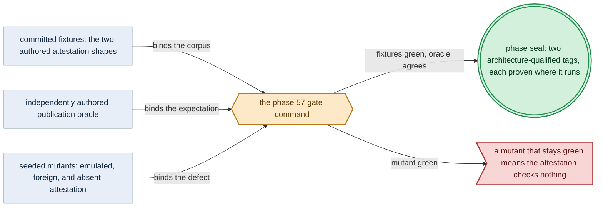

# Phase 57: The complementary-architecture base image

> **Purpose**: Build the base image's second architecture on hardware that natively executes it and publish it
> under its own architecture-qualified tag, advertised only on the attestation produced by the host that ran it.
> **Read this if**: phase 57 is next in the queue, or a later phase pulls the complementary architecture's tag.

Phase 57 delivers the complementary architecture of the base image, published beside
[Phase 56](phase_56_base_image_registry.md)'s under its own tag; its design is owned by
[image_build_doctrine.md](../documents/engineering/image_build_doctrine.md) and
[substrate_doctrine.md](../documents/engineering/substrate_doctrine.md), and the plan for reaching it is owned
here. It does not own the bake catalog, the acquisition ladder, or the registry standup, all of which are
Phase 56's and are consumed unchanged. Register 3, live, on the `apple` substrate's `linux-cpu/arm64` lane.

Link-graph metadata

**Status**: Authoritative source
**Supersedes**: N/A
**Referenced by**: DEVELOPMENT_PLAN/README.md, DEVELOPMENT_PLAN/overview.md, DEVELOPMENT_PLAN/phase_56_base_image_registry.md
**Generated sections**: none

## Contents
- [Phase Status](#phase-status)
- [Phase Summary](#phase-summary)
- [Gate integrity](#gate-integrity)
- [Doctrine adopted](#doctrine-adopted)
- [Sprints](#sprints)
- [Sprint 57.1: The complementary-architecture bake on its own hardware ⏸️](#sprint-571-the-complementary-architecture-bake-on-its-own-hardware-)
- [Sprint 57.2: The architecture-qualified publication and its atomic advertisement ⏸️](#sprint-572-the-architecture-qualified-publication-and-its-atomic-advertisement-)
- [Sprint 57.3: The no-emulation and unattested-child negatives ⏸️](#sprint-573-the-no-emulation-and-unattested-child-negatives-)
- [Documentation Requirements](#documentation-requirements)
- [Related Documents](#related-documents)

---

## Phase Status

⏸️ Blocked pending Phase-56 revalidation. Reopened 2026-08-19 by the generative re-baseline: the artifact, budget, lift, workflow and evidence calculi change what this phase's gate must cover, so any earlier seal is history and no longer presents completion evidence.

## Phase Summary

**The complement's tag is an address too, which is what makes 'advertised only on its own attestation' checkable.** Because the tag is derived from the recipe rather than chosen, there is no second name under which a half-uploaded or foreign-built child could become resolvable ([`image_build_doctrine.md` §2.1](../documents/engineering/image_build_doctrine.md#21-a-published-tag-is-a-cache-warm-up-and-its-name-is-the-content-address)). This phase's claim narrows accordingly: it is about the hardware that produced the content, not about who holds the naming rights.

Phase 56 leaves the cluster pulling only from itself, at one architecture. This phase supplies the other one.

It bakes the **same typed catalog** on a host whose natural architecture is the complement of Phase 56's,
executes every baked binary there **natively**, and publishes that architecture's image under its own
**architecture-qualified tag**. There is no index and no manifest list: the architecture lives in the
reference a consumer names, not in a descriptor a registry resolves
([`image_build_doctrine.md` §3](../documents/engineering/image_build_doctrine.md#3-one-image-per-architecture--the-tag-carries-the-architecture-not-an-index)).
An earlier contract joined the two halves into one attested index; that join was retracted with the manifest
list, and what survives it is the rule the join existed to enforce.

**Publication is where the amendment's rule becomes a check rather than a claim.** A tag is advertised
**only** with the attestation produced by the hardware that executed its content — recording that host's
detected substrate, selected lane, and natural architecture, and the per-binary execution and ELF-machine
observations. An image whose attestation is missing, belongs to the other architecture, or cannot be verified
against the content it describes is treated exactly as one that was never pushed: the tag is not advertised.

What this phase deliberately does not do is re-derive Phase 56's work. The acquisition ladder, the bake
inventory oracle, the registry standup, the mutation-admission proxy, and the egress boundary are consumed as
Phase 56 sealed them. This phase adds one architecture, one publication, and the negatives that keep the tag honest.

**Phase scope:** one cohesive claim — *the base image is published for both architectures, and each was
proven where it runs*. Its seams are the complementary bake, the attested publication, and the negatives; its
acceptance command is one gate; it splits further only if a third architecture is ever added, which would be
its own substrate and therefore its own phase.

**Substrate:** apple ([§L](development_plan_standards.md#l-one-substrate-discipline)) — the gate needs a host
whose natural architecture is `arm64`, and on this project's hardware that is the Apple Silicon machine, which
supplies the CPU-only Linux lane through Lima
([`substrates.md` §3](substrates.md#3-virtualized-substrates-incus--lima--wsl2)). The Apple-Metal lane is
**not** exercised here — that is [Phase 89](phase_89_apple_metal_host_daemon.md)'s — so naming `apple` claims
the host, not the accelerator. Any host natively running `arm64` Linux satisfies the same requirement.

**Lane:** linux-cpu/arm64 — the complement of Phase 56's `linux-cpu/amd64`.

**Register:** 3 — live infrastructure ([§K](development_plan_standards.md#k-honesty-proven--tested--assumed)).

**Depends on:** [Phase 56](phase_56_base_image_registry.md) — the base image, the jit-build resolver, and the in-cluster registry, which this phase consumes rather than rebuilds.

**Gate:** `python3 tools/complementary_arch_gate.py --execute` publishes the complementary architecture's tag
on a natively produced attestation, and satisfies every fixture, oracle, OS-boundary observation, and seeded
mutant named in [Gate integrity](#gate-integrity).

## Gate integrity

**The mutant corpus for this phase does not exist yet.** The six mutations named below are the ones this gate
must seed; none is committed, and `test/mutant/registry.tsv` carries no `complementary_arch_child` capability.
Seeding them, and registering them, is part of the phase rather than a precondition of it.

Per [`development_plan_standards.md` §M](development_plan_standards.md#m-gate-integrity-a-gate-cannot-be-passed-by-a-stub),
the oracles below are authored independently of the implementation and committed before it. This section is
the phase doc's explicit representative set (§M.7).

*Design intent. Phase 57's gate apparatus; [§M](development_plan_standards.md#m-gate-integrity-a-gate-cannot-be-passed-by-a-stub) owns its clauses and [`substrate_doctrine.md` §1.1](../documents/engineering/substrate_doctrine.md#11-the-natural-architecture-rule) the rule they enforce.*

**What the gate command accepts.** On a host whose natural architecture is `arm64`, the typed catalog bakes
that architecture's child, every baked binary executes natively by absolute path against the Phase-56 oracle's
pinned probes, and the child's attestation is written. The gate then joins that child with the Phase-56 child
by digest and advertises one index under one immutable digest-pinned tag. Both architectures resolve under
that tag from the in-cluster registry, and the egress observer sees zero public-registry connections
throughout.

The gate is not passed unless, in addition:

- **No emulator participates (§M.5).** An OS-boundary observer — process accounting plus the kernel's
  registered `binfmt_misc` interpreter table, read before and after — proves no foreign-architecture
  interpreter was registered, mounted, or executed for the whole run. A self-report from the build tooling
  cannot satisfy this; the check reads the kernel, not the builder.
- **Each attestation is bound to the host that produced it (§M.9/§M.10).** The harness issues a fresh nonce
  after the builder starts on each host; the attestation carries it, and the admission check recovers it from
  the independent observation. A pre-recorded or copied attestation fails because it cannot carry this run's nonce.
- **The reference side is independent (§M.3).** The expected publication shape — the tag, its platform, and
  the attestation fields required — is an authored fixture,
  `test/fixture/complementary_arch/expected_tag.dhall`, never a value the publisher emits about itself.
- **The negatives name their reason (§M.8).** Each negative below asserts the exact refusal tag and is paired
  with the positive that differs only in the foreclosed dimension.
- **Both halves are the same catalog (§M.3).** An independent reconciliation proves the two architectures were
  baked from one `dhall/amoebius/BakeCatalog.dhall` content digest and one resolved toolchain graph identity,
  so the pair cannot be two different images that merely differ in architecture.

**Committed seeded mutants, each of which its named sprint must turn red (§M.2):**
- `emulated-build` — the complementary image produced under a mounted
  foreign-architecture interpreter; red at Sprint 57.1's kernel-read `binfmt` negative.
- `stub-arm64-binary` — a zero-byte binary at a baked path in the `arm64` image;
  red at Sprint 57.1's native execution and ELF check. This is the pre-amendment Phase-56 mutant, re-homed to
  the phase whose gate can now execute it.
- `foreign-attestation` — the `arm64` image paired with the `amd64` build's
  attestation; red at Sprint 57.2's architecture binding.
- `unattested-image` — an image pushed with no attestation at all; red at
  Sprint 57.2's admission check.
- `advertise-before-upload` — the tag advertised while the upload is still
  partial; red at Sprint 57.2's registry-API un-advertised assertion.
- `divergent-catalog` — the two architectures baked from different catalog
  digests; red at Sprint 57.3's same-catalog reconciliation.

- **Extension conformance (§M.13).** `L1`–`L5`, `C1`–`C7`; negatives under `test/negative/complementary_arch_child/`.

## Doctrine adopted

- [`extension_conformance_doctrine.md`](../documents/engineering/extension_conformance_doctrine.md) — the complementary-architecture base image is admitted by satisfying the contract, not by appearing on a list.
- [`substrate_doctrine.md` §1.1 — the natural-architecture rule](../documents/engineering/substrate_doctrine.md#11-the-natural-architecture-rule):
  a substrate proves its lane only at its own architecture, which is why this phase exists as a separate gate
  on a separate host rather than as a second platform argument to Phase 56's build.
- [`image_build_doctrine.md` §3 — one image per architecture](../documents/engineering/image_build_doctrine.md#3-multi-architecture-images--one-natively-built-child-per-architecture):
  the architecture is in the tag and nothing joins the two, so this phase publishes beside Phase 56 rather
  than on top of it.
- [`image_build_doctrine.md` §4 — atomic publication](../documents/engineering/image_build_doctrine.md#4-atomic-publication--a-partial-multi-arch-upload-is-a-failed-upload):
  the advertisement is one act; an unattested image is an absent image, so a partial upload is never
  advertised.
- [`development_plan_gate_integrity.md` §S](development_plan_gate_integrity.md#s-universal-artifact-hygiene-gate)
  clause 15: the run records the detected substrate, the selected lane, and the natural architecture, and every
  executed artifact belongs to that architecture.

## Sprints

## Sprint 57.1: The complementary-architecture bake on its own hardware ⏸️

**Status**: Blocked by the Phase-56 gate, which produces the child this sprint complements.
**Implementation**: `tools/complementary_arch_build.py`, `src/Amoebius/Image/Attestation.hs`
**Blocked by**: [Phase 56](phase_56_base_image_registry.md)'s gate.
**Requires**: `host-floor` — on the complementary architecture's own host
**Independent Validation**: `docker image inspect <tag>` reports exactly `linux/arm64`; every
baked binary executes natively by absolute path against Phase 56's committed
`bake_inventory_expected.dhall` probes; the layer passes its ELF `e_machine` check; and a before/after read of
the kernel's `binfmt_misc` table proves no foreign interpreter was registered.
**Docs to update**: `documents/engineering/image_build_doctrine.md`, `documents/engineering/substrate_doctrine.md`

### Objective
Adopt [`substrate_doctrine.md` §1.1 — the natural-architecture rule](../documents/engineering/substrate_doctrine.md#11-the-natural-architecture-rule);
bake the complementary child from the same typed catalog on hardware that natively runs it.

### Deliverables
- The complementary-architecture image, built by one plain `docker build` on a host of that architecture.
- A typed `Attestation` recording the host's detected substrate, selected lane, natural architecture, the
  run nonce, and the per-binary execution and ELF-machine observations for that image.
- The committed mutants `emulated-build` and `stub-arm64-binary`.

### Validation
1. The image's platform is exactly this host's natural platform.
2. Every baked binary runs natively by absolute path and matches its pinned probe.
3. The `binfmt_misc` table is unchanged across the run and no emulator binary is executed.
4. Both committed mutants turn the sprint red for their specific reasons.

### Remaining Work
The whole sprint.

## Sprint 57.2: The architecture-qualified publication and its atomic advertisement ⏸️

**Status**: Blocked by Sprint 57.1.
**Implementation**: `src/Amoebius/Image/AttestedPublication.hs`, `tools/complementary_arch_publish.py`
**Blocked by**: Sprint 57.1.
**Independent Validation**: the published reference equals the authored
`test/fixture/complementary_arch/expected_tag.dhall` shape; the attestation verifies against the content it
describes and against the nonce its host was issued; and the registry API omits the tag until the whole
upload has landed.
**Docs to update**: `documents/engineering/image_build_doctrine.md`

### Objective
Adopt [`image_build_doctrine.md` §3](../documents/engineering/image_build_doctrine.md#3-multi-architecture-images--one-natively-built-child-per-architecture)
and [§4](../documents/engineering/image_build_doctrine.md#4-atomic-publication--a-partial-multi-arch-upload-is-a-failed-upload);
publish one attested, architecture-qualified tag.

### Deliverables
- The pure admission decision: one attested image to one advertised tag, total, with a closed refusal set for
  a missing, foreign, or unverifiable attestation.
- One immutable digest-pinned, architecture-qualified tag resolving from the in-cluster registry.
- The committed mutants `foreign-attestation`, `unattested-image`, and `advertise-before-upload`.

### Validation
1. The published descriptor set equals the authored oracle, layer for layer.
2. The attestation verifies against the image's content digest and its host's issued nonce.
3. A `GET /v2/<repo>/tags/list` omits the tag until the whole attested upload lands.
4. All three committed mutants turn the sprint red for their specific reasons.

### Remaining Work
The whole sprint.

## Sprint 57.3: The no-emulation and unattested-child negatives ⏸️

**Status**: Blocked by Sprint 57.2.
**Implementation**: `tools/complementary_arch_gate.py`
**Blocked by**: Sprint 57.2.
**Independent Validation**: the sealed gate runs every negative and reports each refusal tag, and an
independent reconciliation proves both children came from one catalog digest and one resolved toolchain graph.
**Docs to update**: `documents/engineering/image_build_doctrine.md`, `DEVELOPMENT_PLAN/substrates.md`

### Objective
Adopt [`development_plan_gate_integrity.md` §S](development_plan_gate_integrity.md#s-universal-artifact-hygiene-gate)
clause 15; seal the phase behind negatives that fail for their stated reasons.

### Deliverables
- The phase gate composing both sprints' validations plus the same-catalog reconciliation.
- The committed mutant `divergent-catalog`.
- A repository-local attestation recording both hosts' substrate, lane, and natural architecture.

### Validation
1. Every negative asserts its exact refusal tag, each paired with a positive differing only in the foreclosed
   dimension.
2. The same-catalog reconciliation joins both children to one `BakeCatalog.dhall` content digest.
3. `divergent-catalog` turns the gate red.
4. The universal postconditions of [§S](development_plan_gate_integrity.md#s-universal-artifact-hygiene-gate)
   hold on both hosts, including clause 15 on each.

### Remaining Work
The whole sprint.

## Documentation Requirements

**Engineering docs to update (when the gate runs, flip the honest layer, never before):**
- `documents/engineering/image_build_doctrine.md` — the attested-join half of §3 moves from target shape to
  validated boundary, naming the index this phase published.
- `documents/engineering/substrate_doctrine.md` — the `apple` substrate's `linux-cpu/arm64` lane gains its
  first live result, while the Metal lane stays UNVERIFIED until Phase 89.

**Cross-references to add:**
- `DEVELOPMENT_PLAN/substrates.md` — the per-phase map row for this phase.
- `DEVELOPMENT_PLAN/phase_56_base_image_registry.md` — the predecessor whose child this phase joins.

## Related Documents
- [Phase 56](phase_56_base_image_registry.md) — the catalog, ladder, registry, and first child this phase consumes
- [Phase 58](phase_58_object_reconciler.md) — runs on the native-architecture child alone; the joined index is published after it, so no phase before this one consumes the join
- [Image Build & Registry](../documents/engineering/image_build_doctrine.md) — the join and publication contract
- [Substrates](../documents/engineering/substrate_doctrine.md) — the natural-architecture rule this phase enforces
- [substrates.md](substrates.md) — the per-phase substrate and lane map
- [README.md](README.md) — the live tracker that owns this phase's status
