# Phase 58: Typed renderer + object reconciler

> **Purpose**: Take an opaque whole-deployment `ProvisionedSpec`, re-observe and cross-check the target's
> complete resource/capability inventory before mutation, construct the Phase-33 deployment-global
> `renderAll` object list and separately validate/index it, then enact snapshot-bound typed actions on a live
> single-node `kind` cluster — mandatory bootstrap-holder `Lease` authority, scoped server-side apply,
> kind-indexed controllers, staged serial/host/accelerator execution, Job terminal retention, and
> authenticated deletion — observing each action's live postcondition until the generation converges and
> proving an immediate re-run is a no-op; the `amoebius-capacity` scheduler that later binds guarded Pods by
> CAS reservation is layered on in Phase 58.
> **Read this if**: phase 58 is next in the queue, or a later phase depends on what its gate establishes.

Phase 58 delivers the typed renderer + object reconciler; its design is owned by [manifest_generation_doctrine.md](../documents/engineering/manifest_generation_doctrine.md), [resource_capacity_doctrine.md](../documents/engineering/resource_capacity_doctrine.md), [readiness_ordering_doctrine.md](../documents/engineering/readiness_ordering_doctrine.md), and the plan for reaching it is owned here.
Register 3, live, on the `linux-cpu` substrate.
Sprints 38.1–27.5 and the complete phase gate have passed.

> **Historical result (invalidated).** Any pass, seal, validation, ledger, receipt, or implementation observation
> in the orientation text above is diagnostic only. The Phase Status section and [tracker](README.md) own current state; the
> target contract below remains normative.

Link-graph metadata

**Status**: Authoritative source
**Supersedes**: N/A
**Referenced by**: DEVELOPMENT_PLAN/README.md, DEVELOPMENT_PLAN/overview.md, DEVELOPMENT_PLAN/phase_28_storage_geometry_folds.md, DEVELOPMENT_PLAN/phase_29_execution_accelerator_folds.md, DEVELOPMENT_PLAN/phase_33_render_manifest_oracles.md, DEVELOPMENT_PLAN/phase_34_chain_kernel_boundary.md, DEVELOPMENT_PLAN/phase_56_base_image_registry.md, DEVELOPMENT_PLAN/phase_59_capacity_scheduler.md, DEVELOPMENT_PLAN/phase_60_retained_storage.md, DEVELOPMENT_PLAN/phase_61_vault_pki.md, DEVELOPMENT_PLAN/phase_65_live_dsl_deploy.md, DEVELOPMENT_PLAN/phase_78_provider_ebs_credential.md, DEVELOPMENT_PLAN/phase_79_provider_dynamic_nodes.md, DEVELOPMENT_PLAN/phase_80_determinism_jitcache.md, DEVELOPMENT_PLAN/phase_57_complementary_arch_child.md, DEVELOPMENT_PLAN/system_components.md, documents/engineering/deterministic_simulation_doctrine.md
**Generated sections**: none

## Contents
- [Phase Status](#phase-status)
- [Phase Summary](#phase-summary)
- [Gate integrity](#gate-integrity)
- [Doctrine adopted](#doctrine-adopted)
- [Sprints](#sprints)
- [Sprint 58.1: Deployment-global desired state + authenticated live inventory + typed action plan 📋](#sprint-581-deployment-global-desired-state--authenticated-live-inventory--typed-action-plan-)
- [Sprint 58.2: Bootstrap Lease authority + generic typed-action dispatcher + scoped SSA + storage-scaling dispatch 📋](#sprint-582-bootstrap-lease-authority--generic-typed-action-dispatcher--scoped-ssa--storage-scaling-dispatch-)
- [Sprint 58.3: Staged execution transitions, Job terminal protocol, and authenticated deletion 📋](#sprint-583-staged-execution-transitions-job-terminal-protocol-and-authenticated-deletion-)
- [Sprint 58.4: Wait-for-ready + the idempotent-convergence gate (re-run no-op) 📋](#sprint-584-wait-for-ready--the-idempotent-convergence-gate-re-run-no-op-)
- [Sprint 58.5: Register-2.5 reconciler + staged-execution convergence under simulated faults 📋](#sprint-585-register-25-reconciler--staged-execution-convergence-under-simulated-faults-)
- [Documentation Requirements](#documentation-requirements)
- [Related Documents](#related-documents)

---

## Phase Status

⏸️ Blocked pending Phase-57 revalidation. Reopened 2026-08-19 by the generative re-baseline: the artifact, budget, lift, workflow and evidence calculi change what this phase's gate must cover, so any earlier seal is history and no longer presents completion evidence.

**Pre-natural-architecture status record (invalidated where it claims completion):**

Blocked (superseded) — reopened 2026-08-16 because Phase 56's successor OCI handoff is being amended to include Pulsar's S3 offloader bundle. Revalidate this phase against the amended exact handoff before Phase 59 proceeds.

**Superseded containment seal:** resealed 2026-08-16 under the repository-containment amendment, attestation
`sha256:85cf27abdea88522d4b4e5d3941d22d11fe68c6ed53fd6ec43bab1305643f9f1`.
`python3 tools/object_reconciler_gate.py --execute` passed all **11** recorded sides against source snapshot
`sha256:7b588caeaa7a2507366c389138d7a860b9edabc20a52d502da9a37c62cd97751`.
The run verified Phase 56 attestation `sha256:e6ff9163d299b66b8ce77c216d5114e13af6fe4beb7e299834ee390e9963816a`
and image index `sha256:4d8891f619fc26276288b3bc7f3586750f81dbb59b9b40b93e3149f4c4666dcd`,
created a fresh project-private daemon, kind cluster, registry, and node pull route beneath one marker-owned
`.test_data/**` run, then destroyed the fixture before attestation. All five sprints passed; all 11 mutants
reddened; all 13 metrics matched; and all 31 surfaces joined to 30 run-time items. Generated output and the
five sprint receipts stayed beneath `.build/**`; the immutable record reports every check `pass` with
`cleanup.left_resources=false`, and the outside-host inventory remained empty.

**Pre-containment status record (invalidated where it claims completion):**

Done (invalidated) — sealed 2026-08-14, attestation `sha256:0ba91376b2c536930ba52ade70c9581798a9dfb861d468a28f5bb0d13fc353e0`. Reopened 2026-08-11 because the prior seal
did not include the universal artifact-hygiene postcondition; `python3 tools/object_reconciler_gate.py --execute` now
passes on **all ten sides** against the run's own source snapshot, and left no authored path created, changed,
or removed.

**What the seal added — 2026-08-14: Policy-conformant.** The reconciler ran against the live single-node
`kind` cluster from Phase 55, pulling its corpus Deployment from the `distribution` registry Phase 56 published
to, and converged: the re-run is byte-stable with **zero** planned mutations, readiness is observed rather than
slept through, both `OnDelete` slots replaced in order with distinct UIDs through observed absence, the terminal
Job Pod stayed retained with no completion object, the amoebius CR's child conformed to its provisioned
envelope, and one of two simultaneous reservations was admitted under the one-Pod quota with zero
over-allocation. Postflight left nothing behind. The Register-2.5 battery ran 2,048 deterministic schedules
against the same real action modules. All **11** committed mutants went red, 13 recorded metrics equal their
authored values, and 31 surfaces join to 30 enumerated items — `modeled-apiserver-fidelity`,
`completion-release-ledger`, and `rollback-ledger` stay **UNVERIFIED**, which is what this register can
honestly claim.

*The gate could not run at all, for four separate reasons.* It read five sprint receipts, three mutant
batteries, and two live observations out of `DEVELOPMENT_PLAN/evidence/phase_38` — a plan-tree directory that
no longer exists — compared a committed golden ledger against a derived one, read its surface list out of a
committed enumeration file that was also gone, and invoked a **developer-home `cabal`** in eight places, so it
was bound to one machine and to whichever GHC that installation offered. It is now a six-side `PhaseGate` over
a run bundle: `test/oracle/object_reconciler_surfaces.tsv` authors 31 surfaces for the first time, the ledger is
emitted into the bundle and bound to a source-snapshot digest, and cabal and the compiler resolve per run from
`tools/toolchain_requirements.json`.

*The corpus was reconciling a digest that no longer existed.* `tools/object_reconciler_live.py` and
`tools/object_reconciler_execution_live.py` each pinned the Phase-56 base image by a literal digest from a build that is
gone, and the one assertion tying the running pod to Phase 56's published artifact compared against that same
literal — so on any host but the one that produced it the corpus would have failed `ImagePull`, and the check
that should have caught it was comparing a constant to itself. The reference is supplied by the caller, and the
assertion now reads it from what this run was told to reconcile. The three live-evidence Haskell suites read
the retired evidence path as a string constant; they take this run's bundle path as their argument.

**Invalidated historical record:**

Complete. Sprints 38.1–27.5 and the complete Register-3/2.5 phase gate passed. This phase opened after the **Phase 56 gate** (the
native-architecture base image + jit-build resolver + in-cluster `distribution` registry) and the **Phase 55 gate**
(the single-node `kind` cluster + substrate detect), and runs on the **linux-cpu** substrate in
**Register 3** — the first phase whose gate actually *applies* rendered objects to a live cluster and observes
them to convergence. It builds the **object-reconciler half** of the manifest doctrine: Phase 33 already stood
up the pure private per-source `renderSourcePrivate` plus the deployment-global `renderAll` owner union and
golden-locked them in Register 1; this phase wires that exact value through the
`observe → diff → scoped-SSA → staged-enact → delete → wait-for-ready` reconciler onto the single-node `kind`
cluster from Phase 55. The reconciler is exercised here **from the host binary against a scratch namespace**,
against the pinned Phase-33 corpus — the in-cluster **control-plane daemon** that eventually owns it
(a Deployment `replicas=1` whose single-instance guarantee is delegated to k8s/etcd with **no bespoke election**) arrives in Phase 64. The `amoebius-capacity` scheduler — its CAS `Reserved`→`BindingInFlight`→
`Bound` reservation ledger, two-stage bootstrap cutover, and execution-identity admission — is **Phase 59, layered on this reconciler**; in this phase the corpus Pods are bound by the **default Kubernetes scheduler**,
and the typed-action engine, scoped SSA, staged enactors, authenticated deletion, and unified observed-readiness
path are amoebius's new code proven live here.

- **2026-08-09 — Sprint 58.1 complete.** The separately validated desired index, authenticated observed
  execution union, once-per-identity commitment normalization, physical-backing runtime grouping,
  whole-vector preflight, single-use Lease/storage tokens, and exact 12-action corpus plan passed with the
  unchanged Phase-33 renderer gate. An import lint found no writer boundary in the read-only preflight modules.
  Receipt: `sprint-26.1-receipt.json`, fingerprint
  `dynamically-resolved`.
- **2026-08-09 — Sprint 58.2 complete.** The typed Lease token/renewal rounding, effect dispatcher, and scoped
  SSA boundary passed pure tests and a live scratch-namespace run. The run observed namespace-before-Lease
  cold ordering, exact bootstrap holder/UID/resourceVersion, stale-CAS rejection, `amoebius` field ownership,
  correction of an owned-field drift, preservation of a foreign-manager annotation, a resourceVersion-stable
  no-op, and leak-free teardown. Receipt:
  `sprint-26.2-receipt.json`, fingerprint
  `dynamically-resolved`.
- **2026-08-09 — Sprint 58.3 complete.** The pure serial, ordinary/CUDA/Metal release, Job terminal, and
  authenticated-delete protocols passed. Live OnDelete replacement deleted and re-observed two provisioned
  slots in order; each replacement had a distinct UID and reached Bound+Ready. The successful Job pod remained
  retained with no completion object. A wrong UID/resourceVersion delete precondition conflicted while the exact
  one deleted, and the label-only mutant went red. Receipt:
  `sprint-26.3-receipt.json`, fingerprint
  `dynamically-resolved`.
- **2026-08-09 — Sprint 58.4 complete.** A clean Register-3 run converged 19 externally observed objects,
  proved an immediate server-side-apply rerun byte-stable and mutation-free, observed non-instantaneous
  readiness, serialized both `OnDelete` replacements through absence and distinct Bound+Ready UIDs, retained
  the terminal Job, independently checked the healthy CR child envelope, and admitted only one of two
  simultaneous children under a one-Pod quota. Never-ready, over-bound-child, generation-after-diff, and
  label-only-delete controls were red; both namespaces, the CRD, and the static test PV were absent postflight.
  Receipt: `sprint-26.4-receipt.json`, fingerprint
  `dynamically-resolved`.
- **2026-08-09 — Sprint 58.5 complete.** The real Lease-token, scoped-SSA, serial, host/device-release, Job,
  authenticated-delete, and readiness modules ran through the Phase-16 `IOSim` environment: eight fault
  classes × 256 deterministic schedules, bounded `IOSimPOR` exploration, byte-identical same-seed replay,
  and seven committed red mutants. Modeled-apiserver fidelity remains an explicit assumption and is
  independently bounded by Sprint 58.4's live evidence. Receipt:
  `sprint-26.5-receipt.json`, fingerprint
  `dynamically-resolved`.

## Phase Summary

This phase delivers amoebius's live typed-action **object reconciler**. Pure Phase 33 supplies
`renderAll :: ProvisionedSpec -> [K8sObject]`: one deployment-global rendered list with exact structural source ownership across service controllers, admission, quota, RBAC/config, route, storage, and control-plane projections. `validateAndIndexRenderedObjects` is the separate pure step that checks each emitted object's identity against its source key and constructs the `Map KubernetesObjectId (K8sObject, RenderActivation)` used
by diff; it rejects duplicates, source/object-stage mismatch, or domain mismatch rather than changing
`renderAll`'s canonical signature. Omitted global projections and per-service last-writer-wins concatenation
are impossible. The exact list is the dry-run result, and only its validated index is the desired-object
baseline.

That full list is not permission to apply every object at cold start. The corresponding provisioned render
sources carry a closed activation index
`Immediate | BootstrapSchedulerStage | AfterBootstrapAddonCutover | AfterManagedCapacityReady`;
`validateAndIndexRenderedObjects` preserves that index beside each object, and generic SSA never scans the full
rendered list and applies a later-stage object early. **List membership alone is never generic-SSA authorization.** In this phase the enacted corpus spans the `Immediate` bootstrap actions (the derived
control-plane Namespace and the mandatory reconciler `Lease`) and the general, default-scheduled workload
actions; the *stage-unlock gating* that consumes `BootstrapSchedulerStage`, `AfterBootstrapAddonCutover`, and
`AfterManagedCapacityReady` is produced by the two-stage scheduler bootstrap and therefore belongs to
Phase 58. This phase owns the index-preservation and the fail-closed refusal to grant generic apply authority
over a Pod/controller or mutable ledger/Lease field; Phase 59 owns the witnesses that unlock the guarded
stages.

The live reader then takes one coherent snapshot of objects and all capacity. Desired execution epochs are
keyed by `PlannedExecutionSlotId`, which is a pure capacity slot and never a future Pod UID. Live execution is
an `ObservedExecutionSet` keyed by
`KubernetesPod PodUid | HostProcess HostProcessInstanceId | HostReservation HostReservationId`. The third arm
represents `Reserved | LaunchInFlight | RetainedArtifacts` **host-supervisor** ledger rows for which no process
identity is yet or any longer observable; it cannot masquerade as a running process or be omitted from residual
capacity. (This is amoebius's own host-daemon reservation ledger, observed through the HostProcess supervisor;
the *k8s scheduler* reservation ledger and its `Reserved | BindingInFlight | Bound | Terminating |
TerminalRetained` records are a distinct structure added in Phase 58.) The observed set validates the
admission-protected deployment/generation/source/revision/reservation-template annotations and the kind-indexed
Pod owner chain — Deployment Pod→ReplicaSet→Deployment, or direct StatefulSet/DaemonSet/Job — plus
resourceVersions; host processes carry the analogous supervisor provenance. A terminating predecessor and its
replacement for one planned slot remain two distinct live commitments.

Normalization charges each observed identity once: an API-only Pending Pod, a Running/Terminating Pod joined to
its runtime-storage vector, a retained terminal Pod on its retained axes, a host process once, and a host
reservation/`LaunchInFlight`/retained-artifact row exactly once — process-observed `LaunchInFlight` enters
`HostLaunchRecovery`, while Running/Draining exact-join the host reservation to its observed process. Unclassified
orphan, missing, wrong-state, wrong-node, wrong-generation, wrong-template, unequal-axis, or duplicate joins fail
closed with no `ValidatedLiveTarget` constructor. Runtime storage is rederived per observed eligible Pod
component, grouped by `KubeletNodefs | CriRuntimeRoot`, resolved through `Unified | SplitRuntime | SplitImage`,
combined with the disjoint `ImageContentRoot | CriRuntimeRoot` image model, and checked once per physical
backing. Pending Pods have no observed node-runtime debit; Bound/Terminating and retained Terminal UIDs carry
the observed Pod-UID runtime row.

Whole-deployment preflight combines those surviving commitments with residual CPU requests and finite CPU-limit
budget, memory, pod logical ephemeral, CNI/CSI/pod slots, API/etcd/mapped files, role-routed physical runtime
and image storage, OCI/snapshot/workspace identity unions, durable/object/native-cache presentation and geometry,
host processes/builds, controller children/webhooks, gateways/executors/migrations, and CUDA/Metal device/VRAM/
cache holds. Any missing or unbounded arm returns the specific error or `UnknownCommitment` **before effects**.
Success alone mints one single-use `ValidatedLiveTarget` containing the object/inventory fingerprint, all
relevant resourceVersions, the exact normalized and runtime-storage witnesses, the mandatory-Lease
identity/bootstrap-holder/resourceVersion readback, a complete map of `ValidatedExecutionTransitionAction`s, and
the exact map of `ValidatedStorageScalingAction`s derived from Phase-28 policy-only envelopes and fresh storage
snapshots. (The scheduler-ledger CAS-version arm of `ValidatedLiveTarget` is added in Phase 58.) A final
fingerprint recheck consumes the applicable token; change restarts the read-only prefix.

Enactment follows those actions, not a blind SSA/prune loop. Ordinary desired-object actions may use scoped SSA
under `fieldManager=amoebius`; host control, provider/backing mutation, and authenticated deletion use distinct
capabilities. Pod controllers are kind-indexed. Serial OnDelete is three-stage: delete one witnessed old Pod;
after a fresh absence/release observation resume the controller; after another fresh observation of the expected
replacement UID Bound+Ready, advance to the next slot. Host start is authorized only by
`NoPrior | OrdinaryAfterExit | CudaAfterDeviceRelease | MetalAfterDrain`; CUDA/Metal release evidence is live
and fingerprint-bound. Owner labels discover prune candidates but do not authorize deletion: exact
owner/generation/resourceVersion, retention, and dependency guards must mint the delete action.

Jobs use a typed terminal state machine. This phase builds and model-checks success and backoff-exhausted-failure
completion variants, digest/outcome equality, cleanup deadlines, and `CompletedJobNoOp`; the live Phase-58
cluster has neither MinIO nor the Phase-69 sole content-mutation gateway, so it does **not** claim a durable
completion write/readback or delete a terminal Pod on that basis. Its live Job reaches terminal and remains
explicitly retained and charged; the only inhabitant of the live protocol is
`RetainTerminalAwaitingCompletionGateway`. The first live gateway write → independent matching readback →
deadline/release → terminal cleanup gate is Phase 68. The Job controller still uses `restartPolicy=Never`,
`podReplacementPolicy=Failed`, its exact finite wave/retention provision, and no `ttlSecondsAfterFinished`;
Kubernetes TTL never bypasses the later typed cleanup action.

Every stage re-observes readiness/state instead of sleeping: controller rollout/Ready/Available, CR admission and
child-envelope conformance, serial replacement Bound+Ready, device release, and live Job terminal retention. The
abstract durable-completion/cleanup transitions are exercised in pure and IOSim tests only here. An immediate
live re-run after convergence must mint only `NoOp` plus the same terminal-retention action and make zero writes.
The release ledger/rollback path composes later and does not authorize replaying stale actions.

**Pre-mutation capacity/capability cross-check (§M.5/§M.8).** The live inventory reader is independent of the
pure provision fold and combines apiserver node allocatable values and all scheduled/live commitments with
OS-boundary observations of separately-owned durable/object-store/native-host-cache pools (raw size,
presentation, mounted usable bytes), physical-host VM/process commitments, nodefs/imagefs/containerfs
identity/capacity, all containerd content objects and committed/active snapshots, node-image model/enforced pull
policy, current pod/CNI/CSI slot use, serialized API objects/etcd quota, mapped-file payloads/backing, object-store
residents/incomplete writes, and accelerator device/profile/raw-reserved-allocatable VRAM plus current-free
memory, exact work-item/device holds, actual Pod UIDs/host-process IDs plus ledger-only `HostReservationId`s,
kind-indexed owner chains, and protected provenance. It joins observed instances to planned slots by authenticated
source/revision/template witnesses — it never equates a Pod UID with `PlannedExecutionSlotId` — and preserves
simultaneous predecessor/replacement UIDs. It rederives runtime components for each eligible observed Pod, groups
`KubeletNodefs | CriRuntimeRoot`, resolves roles through the observed layout, combines the disjoint image roles,
and checks aliased physical backings once. Desired rendering, observation, typed diff, transition-peak derivation,
and validation are all read-only. A surviving foreign container without bounded CPU/memory/ephemeral ceilings, an
unobservable root-filesystem writability/allowance, a writable `hostPath`, unknown resident content/snapshot bytes,
an unexpected filesystem alias/root/capacity, a mismatched/unobservable pull policy/model, a supported CR/provider
arm without a finite child-resource/rollout/webhook bound, a direct backend object mutation, or an unrecognized
migration/executor is `UnknownCommitment` and fails closed. Phase-55 engine/static components enter through
`EngineSystemReserve`; every remaining kube-system addon is a bounded topology-expanded per-node unit, so stock
system pods are never silently free or an unavoidable unknown. Each negative fails with the specific offending
resource/capability while independent observers show **zero writes**: no SSA, authenticated delete,
host/provider/backing allocation, or completion record, and no owned object's `resourceVersion` changes. A
preflight that runs after the first mutation is invalid.

**Phase scope:** one cohesive claim — *nothing is mutated until the target's inventory has been re-observed and cross-checked*. The renderer's output is validated and indexed separately from the act of applying it.

**Substrate:** linux-cpu — the whole gate runs on the single-node `kind` cluster on a linux-cpu host from
Phase 55; no apple, linux-cuda, or windows substrate is touched (the CUDA/Metal transition arms are exercised
against deterministic observed-device models here, and their live substrate proof is owned by Phase 93 and
Phase 89 respectively).

**Lane:** linux-cpu/amd64 ([§L](development_plan_standards.md#l-one-substrate-discipline))

**Register:** 3 — live infrastructure ([§K](development_plan_standards.md#k-honesty-proven--tested--assumed)).

**Depends on:** [Phase 33](phase_33_render_manifest_oracles.md) — pure `renderAll`, whose object list this reconciler enacts, and [Phase 56](phase_56_base_image_registry.md), the registry it pulls from.

**Gate:** `python3 tools/object_reconciler_gate.py --execute` passes in Register 3 the pinned reconcile corpus renders, enacts on the live single-node `kind` cluster
through stage-eligible typed actions alone, converges under observed postconditions, and re-runs byte-stable as
a no-op against every fixture, oracle, and mutant in [Gate integrity](#gate-integrity).

## Gate integrity

The apparatus below is this phase's **slice** of the source reconcile corpus, partitioned along the
object-reconciler seam; the `amoebius-capacity` scheduler's bootstrap/cutover/reservation fixtures and its
`bind-before-reservation-CAS` mutant are partitioned to Phase 59 and are **not** duplicated here. The
`amoebius-capacity` scheduler bootstrap, its CAS reservation/Binding ledger, and execution-identity admission are
likewise **not** part of this gate; they are Phase 59's gate, layered on this reconciler.

**What the acceptance run must do.** The Phase-33 pure deployment-global `renderAll` list for the pinned
representative corpus below is rendered in full and separately validated/indexed with its source activation
stages, then enacted in a scratch namespace **only through stage-eligible typed actions** — list membership alone
is never generic-SSA authorization. The cold-start authority can create only the derived control-plane Namespace
and the deployment-global mandatory reconciler `Lease`, acquire it under the bootstrap-host identity through the
typed `Absent → BootstrapHeld` action, and read that holder/object-UID/resourceVersion back; its rounding-aware
renewal count and exact one-update/one-revision-per-attempt etcd debits are already provisioned. Every
present-object renew uses the expected observed resourceVersion CAS and a fresh single-use token; acknowledgement,
conflict, timeout, or lost response consumes the token and requires re-observation before authority continues. The
Phase-56 registry/proxy objects are authenticated read-only as the one declared bootstrap predecessor and cannot
be rewritten before `Lease` acquisition.

A fresh independent whole-deployment inventory then proves the `ProvisionedSpec`'s declared
CPU/memory/logical-ephemeral-storage, finite CPU-limit budget, pod/CNI/CSI slots, etcd logical quota and mapped
files, layout-routed physical node storage, durable/object-store/migration/native-host-cache pools, and
accelerator device/net-and-current-free-VRAM assumptions plus content/snapshot, controller-child/webhook, gateway,
and executor bounds fit the **residual transition capacity** after every surviving live allocation. The resulting
`ValidatedLiveTarget` drives scoped SSA, kind-indexed controller actions, the three staged
serial/host/accelerator actions, Job terminal retention (with durable completion/cleanup capability absent in this
live phase), and authenticated deletion. Each action's postcondition is **observed** (never a `threadDelay`) until
the generation converges. A **mismatch writes nothing** — any missing/unbounded/stale arm fails closed with its
specific offending resource before effects. An **immediate re-run** of the same spec is a **no-op** — only
`NoOp`/unchanged terminal-retention decisions, zero further mutations, and the same converged live state, measured
**byte-stable** by independent apiserver, `Lease`, and host observers. Every committed seeded mutant below goes
red, and the committed never-ready fixture keeps convergence red on the honest engine.

```mermaid
flowchart LR
  %% register: orientation
  s0["Sprint 58.1: Deployment-global desired state + authenticated live…"]
  s1["Sprint 58.2: Bootstrap Lease authority + generic typed-action dispatcher…"]
  s2["Sprint 58.3: Staged execution transitions, Job terminal protocol, and…"]
  s3["Sprint 58.4: Wait-for-ready + the idempotent-convergence gate (re-run no-op)"]
  s4["Sprint 58.5: Register-2.5 reconciler + staged-execution convergence…"]
  gate["the phase 58 gate"]
  s0 -->|"produces what the next consumes"| s1
  s1 -->|"produces what the next consumes"| s2
  s2 -->|"produces what the next consumes"| s3
  s3 -->|"produces what the next consumes"| s4
  s4 -->|"the last seam the gate closes over"| gate
```

*Orientation. The seams phase 58 builds, in order; [Gate integrity](#gate-integrity) owns the apparatus. Not run.*

**The representative reconcile corpus (oracle-pinned, §M.7 concrete corpus).** The gate's applied service set
is the committed fixture `test/fixture/live/reconcile-corpus/` — a subset of the Phase-33 byte-for-byte
golden corpus (`test/golden/render/` service specs, referenced by their golden IDs, never a freshly
hand-picked spec) — and it MUST span, with each kind exercising a *live readiness transition that is not
instantaneous*:
- (i) at least one Deployment whose container image is pulled from the Phase-56 in-cluster `distribution`
  registry and whose readiness probe carries a **non-zero `initialDelaySeconds`** (so rollout-complete
  cannot be true at apply time and the registry dependency is actually exercised by a running pod)
- (ii) one StatefulSet or DaemonSet `OnDelete` transition with at least two ordered slots
- (iii) one Job with provisioned success and backoff-exhausted completion variants whose terminal Pod is
  observed retained and charged (no live completion persistence yet)
- (iv) at least one object that reaches a `Ready`/`Available` status after apply
- and (v) at least one **CustomResource of amoebius's own in-phase capacity/reservation CRD** — an
  amoebius-defined, amoebius-controlled CRD whose small controller is rendered by `renderAll` and reconciled
  in this phase, scheduled by the default Kubernetes scheduler — whose `status` transitions from
  absent/unhealthy to healthy after apply and whose child Deployment/PVC conforms to a provisioned
  child-resource/rollout envelope.

**The fix that pins item (v) to amoebius's own CRD rather than an external workload operator (e.g. the Percona operator built in Phase 63) is deliberate:** it keeps the corpus and its over-bound-child mutant
self-contained within this phase and earlier phases, removing a latent forward dependency on Phase 62. The
corpus, its golden-ID manifest, and the committed hand-authored expected-action table are authored and
committed in **Phase 0 before `Reconcile.hs` exists** (§M.1 oracle-pinning). Corpus Pods are bound by the
**default scheduler** in this phase; the guarded-Pod-behind- `amoebius-capacity` requirement is added to the
corpus by Phase 58.

**Committed seeded mutants the gate MUST turn red (§M.2).** The gate re-runs against a committed mutant set and
requires each to go red: (a) **`waitForReady = pure ()`** (dropped-effect operator) — must fail against the
never-ready red-path fixture below; (b) a **generation-label-stamped-after-diff** mutant whose re-run rewrites a
per-run `amoebius/owner` generation label the diff ignores — must be caught red by the external apiserver
`managedFields`/`resourceVersion`/label comparison, not the engine's self-report; (c) a
**delete-from-owner-label-alone** mutant that deletes an unlabeled/foreign-generation object or retained terminal
Pod without typed authorization — must fail Sprint 58.3; and (e) a **healthy-CR/over-bound-child** mutant whose
amoebius controller reports its **own in-phase capacity/reservation CR** healthy while its actual child exceeds the
provisioned resource/PVC/rollout envelope — must prevent convergence after child enumeration in Sprint 58.4. (The
source's **bind-before-reservation-CAS** mutant (d) audits the scheduler ledger and is partitioned to Phase 58.)
A committed **never-ready red-path fixture** `test/fixture/live/reconcile-corpus-never-ready/` (one Deployment
whose probe never passes) MUST turn the convergence suite red on the *honest* engine too (convergence is never
declared), foreclosing an immediate-return `Wait.hs`.

**The external apiserver reader (§M.5/§M.6 measurement locus).** All "no-op / byte-stable / converged" verdicts
are read by a distinct apiserver client (a `kubectl get -o json` / client-go reader) that is **not the reconciler and shares no diff/fold code with it**. Immediately before and after the re-run it snapshots every owned object
directly from the apiserver and asserts, per object, that `resourceVersion`, `managedFields`, and the full
label/annotation set are **byte-identical**, and that the `amoebius/owner`-labeled object set is unchanged. The
reconciler's self-reported "0 mutations, 0 prunes" is corroborating evidence only, never the passing condition.
Independent readers also assert the same bootstrap-host `Lease` holder/resourceVersion, that no Job-completion
object/version exists in this pre-gateway phase, the retained terminal UID, and no host-process/device mutation.

**Independent reference predicate (§M.3).** The reference side of every equivalence check is the committed
hand-authored `test/fixture/live/reconcile-corpus/expected-actions.json` — the full object-action and
`ValidatedExecutionTransitionAction` domain, authored **before** the planner — and the external apiserver reader
above; neither reuses the reconciler's own diff/fold or `action→effect` function. Each one-field negative
(§M.8) is paired with a positive that differs only in the foreclosed dimension and asserts *why* it fails (its
specific offending resource/capability or `UnknownCommitment`), with independent observers proving zero writes on
every mutation surface.
- **Extension conformance (§M.13).** Not applicable: this gate delivers no extension.

## Doctrine adopted

- [`jit_artifact_doctrine.md`](../documents/engineering/jit_artifact_doctrine.md) — every artifact typed renderer + object reconciler emits is a recipe over a content address, never an authored file.
- [`manifest_generation_doctrine.md §5`](../documents/engineering/manifest_generation_doctrine.md#5-the-applyreconcile-engine-snapshot-bound-typed-actions)
  — **the apply/reconcile engine.** This phase realizes scoped SSA, kind-indexed and staged execution actions,
  authenticated dependency-gated deletion, the pure and simulated Job completion/cleanup state machine, live
  terminal retention, and readiness observed from live state. The amoebius scheduler-role CAS/Binding protocol
  named by [§5](../documents/engineering/manifest_generation_doctrine.md#5-the-applyreconcile-engine-snapshot-bound-typed-actions) is Phase 59; durable Job completion/cleanup first runs live in Phase 69; rollback and the release
  ledger stay deferred.
- [`manifest_generation_doctrine.md §6`](../documents/engineering/manifest_generation_doctrine.md#6-the-reconcile-state-model-desired-is-renderallprovisionedspec-observed-is-live-inventory-actions-are-typed)
  — **desired is the validated identity index of `renderAll(provisionedSpec)`, observed is live inventory, and actions are typed.** `renderAll` retains the canonical `[K8sObject]` result; a separate pure `validateAndIndexRenderedObjects` checks source/object identity and duplicate freedom before diff. Desired state is recomputed; actual Pod UIDs/process IDs, owner chains, host reservations, completions, and physical allocations are observed to authorize transitions, never treated as another desired source. (The state-indexed *k8s scheduler* reservation ledger this model also names is added in Phase 58.)
- [`manifest_generation_doctrine.md §2`](../documents/engineering/manifest_generation_doctrine.md#2-the-typed-manifest-model-renderall-is-the-sole-public-pure-function-to-objects)
  — **the typed manifest model** (the pure renderer half): this phase *consumes* the Phase-33 pure, total private
  per-source `renderSourcePrivate` projections through the exact deployment-global `renderAll` owner union. The
  `[K8sObject]` list is byte-for-byte the value `--dry-run` previews; its separately validated identity index is the desired map. An unchecked `ServiceSpec`, duplicate `KubernetesObjectId`, or emitted/source identity mismatch cannot reach diff. - [`resource_capacity_doctrine.md §8`](../documents/engineering/resource_capacity_doctrine.md#8-where-the-numbers-come-from-declared-in-pure-input-provisioned-before-render-cross-checked-at-runtime)
  — **declared at decode, cross-checked at runtime.** Immediately before mutation, this phase re-observes
  CPU/memory/local-ephemeral capacity, pod/CNI/CSI slots, mapped files/etcd logical quota, disjoint
  durable/object-store/migration/native-host-cache pools, admission/executor pods, planned execution slots,
  authenticated observed execution identities, role-routed runtime storage, and accelerator
  devices/profiles/raw-reserved-allocatable plus current-free VRAM and epoch holds, and refuses a stale or false
  provision witness with zero writes.
- [`readiness_ordering_doctrine.md §6`](../documents/engineering/readiness_ordering_doctrine.md#6-the-runtime-enactor-the-reconciler-observes-never-sleeps)
  — **the runtime enactor: the reconciler observes, never sleeps.** The wait-for-ready this phase builds is the
  runtime enactor of a readiness edge — the live condition is read from the object, never assumed by a fixed
  sleep.
- [`daemon_topology_doctrine.md §3`](../documents/engineering/daemon_topology_doctrine.md#3-the-control-plane-daemon)
  — **the control-plane daemon.** The reconciler is, at steady state, run by the in-cluster control-plane daemon — a
  Deployment `replicas=1`, stateless (no PVC), single-writer authority delegated to k8s/etcd through its mandatory
  `Lease`, **no bespoke election**. This phase drives the reconciler from the host binary as a precursor; standing
  it up *inside* the control-plane daemon is Phase 64.
- [`conformance_harness_doctrine.md §3`](../documents/engineering/conformance_harness_doctrine.md#3-the-load-bearing-invariant-rendering-never-touches-live-infrastructure)
  — **rendering never touches live infrastructure.** The boundary this phase honors from the other side: the
  `renderAll`/plan/`--dry-run` path stayed cluster-free through Phase 34, and **apply is the first live step** —
  so live prerequisites (a reachable cluster, credentials) belong here, never on the render path.
- [`generated_artifacts_doctrine.md §3`](../documents/engineering/generated_artifacts_doctrine.md#3-the-rule)
  — the applied `[K8sObject]` set is emitted from the Haskell source of truth and **never committed**; what reaches the cluster is generated at apply time, not a checked-in manifest. - [`testing_doctrine.md §2`](../documents/engineering/testing_doctrine.md#2-the-registers-of-amoebius-testing)
  — **Register 3** (live infrastructure): the register this phase's gate reaches; and
  [`§4`](../documents/engineering/testing_doctrine.md#4-no-skips-fail-fast-and-the-per-run-ledger-artifact),
  the per-run proven/tested/assumed ledger the live convergence emits (no skips, fail fast; the scratch namespace
  is torn down leak-free).
- [`deterministic_simulation_doctrine.md §4`](../documents/engineering/deterministic_simulation_doctrine.md#4-register-25--where-deterministic-simulation-sits)
  — **Register 2.5, where deterministic simulation sits.** Sprint 58.5 validates the *built* reconciler and staged
  enactors under `IOSimPOR` fault schedules in-process and deterministically replayable — one rung below the
  Register-3 live gate in the register ladder, not chronologically ahead of it.

## Sprints

> **Current seal rule.** Sprints 38.1–27.5 were resealed in order by the 2026-08-16 repository-contained run.
> Historical evidence paths retained in the prose describe the retired record only: current evidence is written
> into its run bundle under `.build/runs/`. Functional and validation outcomes remain target requirements. Any instruction to commit generated output, freeze dependency resolution,
> retain a resolved version, path, or integrity hash, or consume repository-resident evidence, ledgers, or
> enumerations is superseded by the current generated-artifact and dynamic-resolution doctrine. Closure requires
> the current phase gate plus universal artifact hygiene.

## Sprint 58.1: Deployment-global desired state + authenticated live inventory + typed action plan 📋
**Status**: Planned — reopened 2026-08-19 by the generative re-baseline. The prior run established that
resealed 2026-08-16 inside `python3 tools/object_reconciler_gate.py --execute`; the corpus, its
independently authored action table, and the read-only preflight boundary all held, and; that stands as
history and no longer presents completion evidence.
`sprint-26.1-receipt.json` records fingerprint
`sha256:80bebfeb5b649416fa923f4ac811fa3097d5025d10448143d9dfadf2b6916312`.
**Implementation**:
`src/Amoebius/Manifest/{Preflight,Reconcile,Diff,Actions,Authority}.hs`,
`src/Amoebius/Execution/{Observe,Normalize,RuntimeStorage}.hs`, and `src/Amoebius/Storage/ScalingAction.hs`
(fresh storage observation, validation, and state-indexed action token). (The
`src/Amoebius/Scheduler/Ledger.hs` reservation-ledger normalization is partitioned to Phase 58.)
**Blocked by**: the [Phase-56](phase_56_base_image_registry.md) gate.
**Independent Validation**: a fresh snapshot produces exactly the committed
`test/fixture/live/reconcile-corpus/expected-actions.json`, authored before the planner. It includes the
full object-action and `ValidatedExecutionTransitionAction` domains, not merely add/update/prune names. All
one-field negatives fail before any apiserver, host, provider, or object-store write.
**Docs to update**:
`documents/engineering/manifest_generation_doctrine.md`,
`documents/engineering/resource_capacity_doctrine.md`, `DEVELOPMENT_PLAN/system_components.md`.

### Objective

Adopt [`manifest_generation_doctrine.md §6`](../documents/engineering/manifest_generation_doctrine.md#6-the-reconcile-state-model-desired-is-renderallprovisionedspec-observed-is-live-inventory-actions-are-typed)
— the reconcile state model. Make desired state the separately validated identity index of the exact Phase-33
`renderAll provisionedSpec :: [K8sObject]` owner union; make observed state a coherent snapshot of Kubernetes objects, actual Pod/process identities, host reservations, completions, and physical allocations; and mint only the typed actions justified by the whole transition. No planned slot is accepted as a live identity, no object label alone is a mutation capability, and no preflight module imports a writer. The state-indexed `amoebius-capacity` scheduler reservation ledger is layered on this observation in Phase 58.

### Deliverables

- `renderAll → validateAndIndexRenderedObjects → observeInventoryAndObjects → authenticateExecutions →
  normalizeCommitments → deriveTransitionEnvelope → validateProvisionWitness → planActions`. The desired map
  proves exact `KubernetesObjectId` ownership across service and deployment-global projections and preserves each
  source's `Immediate | BootstrapSchedulerStage | AfterBootstrapAddonCutover | AfterManagedCapacityReady`
  activation index (this phase enacts only `Immediate` bootstrap plus default-scheduled general actions and never
  grants generic SSA over the full list; the scheduler-cutover stage-unlock witnesses are Phase 59). The observed
  execution map proves its key equals embedded `PodUid | HostProcessInstanceId | HostReservationId`, checks
  protected provenance and the complete kind-indexed owner/supervisor chain, and preserves every same-slot
  predecessor/replacement UID and ledger-only host row.
- A host-aware observed identity union: `KubernetesPod PodUid | HostProcess HostProcessInstanceId |
  HostReservation HostReservationId`. Host `Reserved`, no-process `LaunchInFlight`, and post-process
  retained-artifact rows remain charged under the host-supervisor ledger-only arm; process-observed
  `LaunchInFlight` enters `HostLaunchRecovery`, and Running/Draining exact-join the process and reservation once.
  Missing, duplicate, or process-fabricated ledger-only identities reject. This is amoebius's own host-daemon
  reservation ledger, distinct from the Phase-59 k8s scheduler reservation ledger.
- Node runtime accounting that rederives planned/observed metadata shapes, maps components to
  `KubeletNodefs | CriRuntimeRoot`, resolves the selected filesystem layout, combines disjoint
  `ImageContentRoot | CriRuntimeRoot` image components, and groups aliases once per backing. Pending has no
  observed runtime row; Bound/Terminating and retained Terminal use the observed Pod UID row.
- A complete `ValidatedLiveTarget` constructed from one `ObservedLiveResourceSnapshot`: mandatory whole
  `ObservedInventory`, exact budget-keyed storage-scaling snapshots, optional cloud observation, shared snapshot
  fingerprint, object/resourceVersions, exact mandatory-`Lease` identity/bootstrap-holder/resourceVersion readback,
  normalized commitment and runtime-storage witnesses, Job completion inventory, render-activation/domain equality,
  and exact action-domain witness. Its storage-scaling map exact-joins every Phase-28
  `ProvisionedStorageScalingEnvelope` to a complete `ObservedStorageScalingSnapshot`, total `planStorageScaling`
  result, backing-specific capability, immediate-snapshot recheck, and fresh `SingleUseStorageScalingActionToken`;
  a concrete transition is reconcile-time state, never a field of `ProvisionedSpec`. The provider observation is
  transition-indexed: host-only `NoChange`, retained-carve, and verified-migration arms carry
  `StorageScalingCloudObservation.NotRequired`, while only `CreateProviderCapacity` can carry the
  `Required ObservedCloudInfrastructureSnapshot` arm. (The scheduler-ledger CAS-version field of
  `ValidatedLiveTarget` is added in Phase 58.)
- Execution actions cover `NoOp`, kind-indexed Pod-controller apply, the three serial OnDelete stages, host
  stop/start authorizations, removed-controller prune, Job completion write/terminal cleanup/completed no-op, plus
  owner-authenticated ordinary object actions. Completion/cleanup constructors additionally require the provisioned
  gateway capability, which is absent from the Phase-58 live environment. Every mutating constructor carries only
  its scoped capability, and none can be minted for a non-holder.
- Preserve the operator child-admission and migration envelopes: admission/quota policy must be Ready before a CR
  action; observed children are independently normalized after health; storage/registry/schema migration actions
  retain old+new+workspace/temp/WAL until verified cutover. Phase 58 owns only the generic storage-scaling
  observation/validation/token boundary: Phase 60 supplies the retained-carve and verified-migration enactors, and
  Phase 76 supplies the cloud provider-capacity enactor. Durable backing is never generic prune.
- A mechanical no-release-store/no-write preflight boundary: AST/import lint over the modules above, plus a runtime
  observer proving no stored-desired-state read/write. Durable Job-completion reads are explicitly represented in
  the planner interface as observed execution state, never a desired manifest store; this phase's live inventory
  requires that gateway-backed arm to be absent and exercises it only through the pure/fake/IOSim boundary until
  Phase 69 supplies the live gateway.

### Validation

1. The deployment-global `[K8sObject]` list equals its Phase-33 golden; the separately validated desired map and action plan equal independently authored fixtures. Seeded duplicate object identity, source/emitted-identity mismatch, source/object activation-stage mismatch, generic-SSA-over-full-list, missing global projection, cached observation, and action-domain omission mutants turn red. A Register-1 planner fixture with modeled observed completion still renders the pure Job baseline but plans `CompletedJobNoOp`, proving enactment is not a blind render-list apply; the live fixture instead plans terminal retention because no gateway/readback exists yet. 2. Execution negatives cover missing or spoofed annotations, wrong Deployment ReplicaSet hop, wrong direct controller kind/resourceVersion, map-key/embedded-identity mismatch, planned-slot-as-Pod-UID, and terminator/replacement UID collapse. Host negatives cover omission of Reserved/`LaunchInFlight`/retained-artifact `HostReservationId`, use of a fake process id for a ledger-only row, and double debit after process join. Positive recovery fixtures cover an absent-process host row in each host-supervisor ledger state and prove each remains charged until its state-specific release evidence. Exact-fit controls debit each identity once. (The k8s scheduler reservation-record negatives — unclassified-orphan record, missing reservation, wrong ledger state/node/template, Bound-Pod-plus-ledger double debit — are Phase 58.)
3. Runtime-storage negatives cover component drop/role swap, model ownership overlap/hole, Unified alias
   double-debit/drop, SplitRuntime one-byte-short kubelet-nodefs and CRI imagefs/containerfs backings, SplitImage
   routing mismatch, Pending with a node row, and Bound with both a planned and an observed row. Exact fits succeed.
4. Retain the full one-short capacity corpus for CPU/memory/logical ephemeral, pod/CNI/CSI, API/etcd/mapped files,
   OCI/snapshot/workspace identities, durable/object/native-cache geometry, controller/webhook/gateway/executor/
   migration peaks, and CUDA/VRAM/Metal holds. Every failure exposes no `ValidatedLiveTarget`, and independent
   observers prove zero writes on every mutation surface.
5. Mutate any tracked object resourceVersion, Pod UID/owner chain, runtime backing identity, storage-scaling
   allocation/quota/fingerprint, content/snapshot set, device-free value, `Lease` holder, or `Lease` resourceVersion
   after validation. The final recheck consumes/discards the token, makes zero writes, and restarts observation; a
   stale-token mutant turns red.

### Remaining Work

None. The receipt and its three-check transcript are written into this run's bundle under `.build/runs/`, never
into the plan tree. Sprint 58.2 consumes the typed action/authority boundary.

## Sprint 58.2: Bootstrap Lease authority + generic typed-action dispatcher + scoped SSA + storage-scaling dispatch 📋
**Status**: Planned — reopened 2026-08-19 by the generative re-baseline. The prior run established that
resealed 2026-08-16 inside `python3 tools/object_reconciler_gate.py --execute`; the Lease CAS, scoped
managed fields, stable no-op, and clean postflight were observed live, and `sprint-26.2-receipt.json` in
that run's bundle records fingerprint; that stands as history and no longer presents completion evidence.
`sha256:1d406509991c0942996918564d6cc03a7756b053513e15fb02c3a6bd0e319459`.
**Implementation**: `src/Amoebius/Manifest/{Apply,Enact,Authority}.hs` and
`src/Amoebius/Storage/ScalingAction.hs`, plus `tools/object_reconciler_authority_live.py`. The `amoebius-capacity` scheduler
(`src/Amoebius/Scheduler/*.hs`) and execution-identity admission
(`src/Amoebius/Admission/ExecutionIdentity.hs`) are layered on this dispatcher in Phase 58.
**Blocked by**: none; Sprint 58.1 is sealed.
**Independent Validation**: the host holds the mandatory reconciler `Lease` (via the typed
`Absent → BootstrapHeld` action) before any non-authority mutation; ordinary object actions retain correct
SSA field ownership; storage-scaling actions dispatch only their transition-indexed capability and never
reuse a token after a lost response. No non-SSA effect flows through the SSA module.
**Docs to update**:
`documents/engineering/manifest_generation_doctrine.md`, `DEVELOPMENT_PLAN/system_components.md`.

### Objective

Adopt [`manifest_generation_doctrine.md §5`](../documents/engineering/manifest_generation_doctrine.md#5-the-applyreconcile-engine-snapshot-bound-typed-actions)
— the apply/reconcile engine. Build the bootstrap `Lease` authority and the generic typed-action dispatcher.
Scoped ordinary-object actions may use SSA; all other effects must consume their dedicated capability. The host
precursor must hold the same provisioned mandatory `Lease` that the Phase-65 control-plane daemon later receives by an
observed handoff. The scheduler's CAS reservation/Binding path and its two-stage bootstrap are Phase 58.

### Deliverables

- Bootstrap authority and ordering from `ProvisionedMandatoryReconcilerLease`: a cold-start token may create only
  the derived control-plane Namespace and the exact `Lease`, execute only typed acquire/renew actions
  (`Absent → BootstrapHeld` and present-state renew) under the bootstrap-host holder identity, and read the exact
  holder/object UID/resourceVersion successor back before any non-authority write. Present-state actions CAS the
  expected resourceVersion; every attempt consumes its fresh observation-bound token and reserves its exact
  `EtcdChurnBudget` projection until a post-attempt observation commits or releases that debit.
- A dispatcher for every non-scheduler `ValidatedExecutionTransitionAction`. `ApplyDesiredPodController` preserves
  the exact controller-kind policy. `SerialOnDeleteStart/Resume/Advance`, host stop/start, Job completion/cleanup,
  and prior-controller delete are sent to their own enactors (built in Sprint 58.3); Job completion/cleanup dispatch
  additionally requires the gateway capability and therefore cannot run in the live Phase-58 gate. `NoOp` and
  `CompletedJobNoOp` cannot reach an effect interface.
- A storage-scaling dispatcher that accepts only a `ValidatedStorageScalingAction`, immediately rechecks its exact
  observed snapshot, atomically consumes the plan-id-indexed `Fresh` token, and dispatches only the
  transition-indexed capability. `NoChange` cannot reach a mutation interface; retained-carve allocation and verified
  migration are abstract effect arms supplied in Phase 60, while provider-capacity creation also consumes the
  transition's exact validated cloud-action batch supplied in Phase 76. Every attempted effect requires post-attempt
  re-observation before success or retry, so a lost response cannot reuse a token. An ordinary host-only live target
  validates with no cloud account snapshot; absence becomes an error only when the planned transition actually
  selects provider capacity.
- Scoped SSA under `fieldManager=amoebius` only for an ordinary desired-object action. It declares the exact owned
  fields, does not GET-modify-PUT, and leaves fields owned solely by another manager untouched. The
  generation/owner/provenance annotations come from the desired object; they are never stamped after diff. The
  bootstrap Namespace/`Lease` objects have dedicated staged actions and can never enter this generic SSA path; the
  scheduler-cutover stage gating that further restricts the general stage behind `BootstrapCapacitySchedulerReady`/
  `ManagedCapacityReady` is added in Phase 58.

### Validation

1. For a scoped SSA action, assert exact `amoebius` field ownership, drift correction of a declared field, and
   preservation of a foreign-owned field. Assert host/delete/Job actions never enter the SSA module, and `NoOp` has
   no writer capability. A generation-label-stamped-after-diff mutant is caught red by the external apiserver
   `managedFields`/`resourceVersion`/label comparison, not the engine's self-report.
2. `Lease` races cover simultaneous bootstrap acquisition, lost acquire/renew response, stale resourceVersion, and
   attempted mutation without the exact bootstrap holder. Assert `ceil(renewalWindow/retryPeriod) <=
   maxRenewalsPerWindow` under the left-closed/right-open boundary rule. At every audit resourceVersion there is at
   most one holder; each attempted write consumes one fresh token and reserves exactly one etcd update/revision debit;
   ambiguous ownership retains that debit, emits no mutation capability, and re-observes.
3. Storage-scaling action tests run at the pure/fake boundary in this phase: stale allocation, backing,
   provider-quota, or fingerprint readback invalidates the action with zero mutation; `NoChange` exposes no writer;
   a retained or provider transition consumes exactly one token and dispatches only its indexed fake capability; and
   a lost response forces a fresh observation. Live retained and cloud mutations remain the Phase-60 and Phase-76
   gates respectively.

### Remaining Work

None. The live receipt records the Lease CAS, scoped managed fields, stable no-op, and clean postflight.

## Sprint 58.3: Staged execution transitions, Job terminal protocol, and authenticated deletion 📋
**Status**: Planned — reopened 2026-08-19 by the generative re-baseline. The prior run established that
resealed 2026-08-16 inside `python3 tools/object_reconciler_gate.py --execute`; both ordered replacements,
the retained terminal Pod, and the authenticated delete were observed live, and; that stands as history and
no longer presents completion evidence.
`sprint-26.3-receipt.json` records fingerprint
`sha256:b17161985d4653dde53726be7b85516db998eea93d4b6fc833cfd879c29faeee`.
**Implementation**:
`src/Amoebius/Execution/{SerialOnDelete,HostTransition,AcceleratorRelease,JobTerminal}.hs` and
`src/Amoebius/Manifest/Delete.hs`, plus `tools/object_reconciler_execution_live.py`.
**Blocked by**: none; Sprint 58.2 is sealed.
**Independent Validation**: no stage can use evidence from the prior snapshot, no second serial Pod is deleted before the
expected replacement is Bound+Ready, no CUDA/Metal/host replacement starts before its resource-indexed
release, the abstract Job protocol cannot clean a terminal Pod before durable completion, and the live
pre-gateway gate retains that Pod rather than pretending persistence; no label alone can authorize object
deletion.
**Docs to update**: `documents/engineering/manifest_generation_doctrine.md`,
`DEVELOPMENT_PLAN/system_components.md`.

### Objective

Adopt [`manifest_generation_doctrine.md §5`](../documents/engineering/manifest_generation_doctrine.md#5-the-applyreconcile-engine-snapshot-bound-typed-actions)
— the apply/reconcile engine. Enact the non-SSA members of `ValidatedExecutionTransitionAction` as explicit
observation/effect stages. Ownership labels are candidate discovery only. Every delete, resume, host start,
completion write, and cleanup must carry a fresh snapshot-bound capability proving its exact predecessor and
dependency state. Job completion write/readback/cleanup is implemented against the abstract effect boundary and
validated in pure, fake, and IOSim executions here; the live Phase-58 environment intentionally supplies no such
capability.

### Deliverables

- Serial OnDelete for provisioned StatefulSet/DaemonSet controllers: `Start` deletes one witnessed old Pod; the
  next observation mints `Resume` only after that UID is absent and ordinary/CUDA release evidence is valid; the
  following observation mints `Advance` only when the expected replacement UID has the exact source/slot and is
  Bound+Ready. The provisioned order controls the next slot. No native automatic or parallel arm exists.
- HostProcess actions: stop or drain the exact observed process; start only with `NoPrior`, `OrdinaryAfterExit`,
  `CudaAfterDeviceRelease`, or `MetalAfterDrain`. CUDA evidence proves old owner absence, device-hold release and
  fresh per-device free VRAM. Metal evidence proves drain, process absence, allocation release and cache backing
  state. Fingerprint change invalidates the authorization.
- Job terminal protocol for both `Succeeded` and `FailedBackoffExhausted`: the closed model writes the exact
  `ProvisionedJobCompletionVariant` through an abstract provisioned object-gateway capability, observes matching
  digest/outcome/revision, and only after the cleanup deadline and exact release partition can construct terminal
  cleanup. Failed completion requires a new execution revision before rerun. A matching completion yields
  `CompletedJobNoOp`; a failed write retains the terminal Pod/ledger axes and retries safely. In the Phase-58 live
  cluster the gateway capability is absent, so the only inhabitant is `RetainTerminalAwaitingCompletionGateway`; the
  Pod, API bytes, logs/metadata, and retained partition remain charged. Phase 69 performs the first live
  write/readback/cleanup trace.
- Authenticated object/controller deletion: build candidates from the live prior-owner set, then require structural
  owner, deployment/generation, object identity, resourceVersion, desired/prior union, retention, and dependency
  equality. `PruneRemovedPodController` uses its prior provisioned controller capability. Durable backing and
  unknown/foreign objects have no generic delete arm.

### Validation

1. The linux-cpu serial live test proves delete-one → observe absence/release → resume → observe expected
   replacement Bound+Ready → advance. Seeded skip-observation, delete-two, wrong replacement UID/slot/source,
   advance-on-Ready-but-unbound, and stale-fingerprint mutants turn red. The CUDA serial release arm runs against
   the deterministic observed-device model, not nonexistent GPU hardware in this phase.
2. Register-2/2.5 transition tests cover ordinary host exit, CUDA device holds/free VRAM, and Metal drain/allocation/
   cache release; one missing release component and one stale observation reject before start. CUDA/Metal live
   substrate proof remains owned by Phase 93 and Phase 94.
3. Register-1/2 Job tests, available at this sprint's completion, cover all-success and backoff-exhausted failure
   waves, completion-write failure, wrong digest/outcome/revision, cleanup before persistence/deadline, retained-axis
   partition, restart after modeled persistence, and no-rerun until new revision; the exhaustive IOSim schedules over
   these same variants are additionally exercised in Sprint 58.5. In the live Phase-58 run, an independent apiserver
   observer proves the terminal UID remains, no Job-completion object is written, and no delete occurs. The first live
   object-store/apiserver persist-before-delete proof is the Phase-69 gate.
4. Remove a service and prove only snapshot-authorized objects/controllers disappear. Unlabeled, spoofed label,
   foreign generation, changed-resourceVersion, retained storage, active serial predecessor, and
   terminal-before-completion fixtures survive. The `delete-from-owner-label-alone` mutant turns red.

### Remaining Work

None. Sprint 58.4 composes these actions into the full convergence/no-op corpus.

## Sprint 58.4: Wait-for-ready + the idempotent-convergence gate (re-run no-op) 📋
**Status**: Planned — reopened 2026-08-19 by the generative re-baseline. The prior run established that
resealed 2026-08-16 inside `python3 tools/object_reconciler_gate.py --execute`; the corpus converged and
re-ran byte-stable with zero mutations, with all four red controls red, and `sprint-26.4-receipt.json`
records fingerprint `sha256:ef271e8922c15f89ea77931620810130df2ad59ba9c63ada158a7f9301202a7d`.; that stands
as history and no longer presents completion evidence.
**Implementation**: `src/Amoebius/Manifest/Wait.hs`,
`test/spec/live/ReconcileConvergeSpec.hs`, `test/spec/live/SerialOnDeleteSpec.hs`,
`test/spec/live/JobTerminalRetentionSpec.hs`, and `tools/object_reconciler_live.py` — built and validated. (The
`test/spec/live/SchedulerReservationSpec.hs` live scheduler suite is Phase 58.)
**Blocked by**: none; Sprint 58.3 is sealed.
**Independent Validation**: the representative corpus reconciles a non-instantaneous
Deployment, a serial replacement Bound+Ready between deletions, CR health plus child conformance on
amoebius's own in-phase capacity/reservation CRD, and terminal Job retention without a gateway. The
immediate rerun has byte-stable objects and no host/object-store/delete effect. A never-ready fixture and
dropped-wait mutant turn red.
**Docs to update**: `documents/engineering/manifest_generation_doctrine.md`,
`documents/engineering/readiness_ordering_doctrine.md` (the §6 runtime-enactor claim gains its first
amoebius validation), `DEVELOPMENT_PLAN/README.md` (flip the Phase-58 status when the gate passes).

### Objective

Adopt [`manifest_generation_doctrine.md §5`](../documents/engineering/manifest_generation_doctrine.md#5-the-applyreconcile-engine-snapshot-bound-typed-actions)
(wait-for-ready) and
[`readiness_ordering_doctrine.md §6`](../documents/engineering/readiness_ordering_doctrine.md#6-the-runtime-enactor-the-reconciler-observes-never-sleeps):
gate every action continuation on its live postcondition (never a fixed sleep), then prove the whole engine
idempotent — a re-run of the same deployment-global `renderAll` result plus the newly observed state plans only
`NoOp` plus the unchanged live terminal-retention decision (or `CompletedJobNoOp` in modeled/future gateway-backed
state) — and emit a Register-3 proven/tested/assumed ledger, tearing the scratch namespace down leak-free
([`testing_doctrine.md §4`](../documents/engineering/testing_doctrine.md#4-no-skips-fail-fast-and-the-per-run-ledger-artifact)).
This is the phase gate.

### Deliverables

- Wait-for-state: controller rollout, Pod Bound+Ready (bound by the default scheduler in this phase), object
  Ready/Available, CR health, and process/device release are read from their authoritative live sources; the
  completion-persistence/cleanup arms are unavailable in this phase and terminal Job retention is read from the
  apiserver. No `threadDelay` substitutes for observation. For amoebius's own in-phase capacity/reservation CR, its
  child-envelope admission/quota policy is Ready before CR apply and the live webhook Deployment's
  image/resources/replicas/rollout normalize exactly to `admissionExecution`; healthy status is followed by
  controller-owner enumeration of the actual child Deployment/PVC and an independent normalization proving requests,
  limits, replica/rollout overlap, and storage conform to the provisioned child envelope. Unknown or over-bound
  children prevent convergence — post-ready enumeration is not allowed to be the first detector.
- The convergence battery over the pinned corpus: enact the exact `renderAll`/action plan → observe workload
  readiness → complete the serial stages in order → observe and retain the terminal Job → re-observe and rerun. The
  rerun asserts **zero effects** on all mutation surfaces and only typed no-op actions. Independent readers compare
  apiserver resourceVersions/managedFields/labels, absence of any Job completion object, the retained terminal UID,
  the mandatory `Lease` holder, and host/device state. The red-path fixtures/mutants — never-ready Deployment;
  `waitForReady = pure ()`; serial advance before replacement Bound+Ready; generation stamped after diff; over-bound
  CR child on amoebius's own capacity/reservation CRD — MUST go red. A Register-3 ledger records the live convergence,
  marking the release-ledger/rollback residue UNVERIFIED (deferred). (The scheduler bootstrap sequencing —
  `BootstrapCapacitySchedulerReady`, controller cutover, `ManagedCapacityReady` — and the wrong-config-digest /
  bind-before-CAS mutants are Phase 59's gate.)

### Validation

1. `cabal test reconcile-converge serial-on-delete job-terminal-retention` is green on the linux-cpu `kind` corpus.
   A non-instantaneous Deployment reaches rollout-complete only after its `initialDelaySeconds`; the serial second
   deletion follows replacement Bound+Ready; the terminal Job remains observed and charged with no completion/delete
   effect; and CR children conform. The immediate rerun is byte-stable and effect-free by independent observers.
   After that evidence is captured, the elevated test harness destroys the run-scoped scratch namespace and sweeps
   its records; this postflight is not represented as successful Job terminal cleanup and proves no persistence
   ordering claim.
2. The forbidden-symbol lint covers
   `src/Amoebius/Manifest/{Preflight,Reconcile,Diff,Actions,Authority,Apply,Enact,Delete,Wait}.hs` and
   `src/Amoebius/Execution/*.hs`; it rejects `threadDelay`, aliases, and clock-polling busy-waits as readiness gates.
   Every red-path fixture/mutant above turns the suite red.
3. Two simultaneous CR child creates cannot race past namespace quota, and both leave zero over-allocation. A
   compile/decode negative proves two owner envelopes cannot share one `ControllerEnvelopeNamespace`.

### Remaining Work

None. The receipt and the live/mutation results are written into this run's bundle under `.build/runs/`. The
content-addressed completion gateway and the rollback/release ledger stay deferred to the content-store phase
and are carried UNVERIFIED, never green.

## Sprint 58.5: Register-2.5 reconciler + staged-execution convergence under simulated faults 📋
**Status**: Planned — reopened 2026-08-19 by the generative re-baseline. The prior run established that
resealed 2026-08-16 inside `python3 tools/object_reconciler_gate.py --execute`; 2,048 deterministic
schedules ran against the real action modules with all seven mutants red, and `sprint-26.5-receipt.json` in
that run's bundle records fingerprint; that stands as history and no longer presents completion evidence.
`sha256:7aca66fa137adc421efd00da590e6731612781c065cc2bf1f3271d28afadc05e`.
**Implementation**: `test/spec/sim/{ReconcileSim,ExecutionTransitionSim,ObjectReconcilerSimCommon}.hs`, driving the
real Manifest/Execution modules above on the Phase-34 `io-classes` `Env` — built and validated. (The
`test/spec/sim/SchedulerSim.hs` schedule battery is Phase 58.)
**Blocked by**: none; Sprint 58.4 is sealed.
**Independent Validation**: `IOSimPOR` interleaves object
resourceVersion conflicts, bootstrap-`Lease` acquire/renew ambiguity, serial stage changes,
host/device-release ordering, completion-write failure, and external mutation inside critical sections.
Every schedule either converges to typed no-op or fails closed without overlapping writers, premature
deletion, a host start before release, or a token reused after an observed-state transition; counterexamples
replay by seed.
**Docs to update**: `documents/engineering/deterministic_simulation_doctrine.md` (Phase-58
status backlink), `documents/engineering/manifest_generation_doctrine.md`,
`DEVELOPMENT_PLAN/system_components.md`.

### Objective

Adopt [`deterministic_simulation_doctrine.md §4`](../documents/engineering/deterministic_simulation_doctrine.md#4-register-25--where-deterministic-simulation-sits):
validate the *built* reconciler and staged-action schedules under injected faults **in-process and deterministically replayable**, at Register 2.5 — one rung below the Register-3 live gate in the register ladder,
not chronologically ahead of it — closing the code-schedule gap the pure-value tests and the live gate each leave
open. The scheduler's CAS-race schedules are Phase 59's `SchedulerSim`.

### Deliverables

- The real action loop under `IOSimPOR`, with ≥200 schedules per fault class (or exhaustive stated preemption
  depth) and `cover`/`classify` proving faults land inside `Lease` acquire/renew, SSA, serial, host/device release,
  completion/cleanup, delete, and wait sections rather than only between iterations.
- Safety invariants on every trace: at most one observed `Lease` holder and no non-authority write without the exact
  holder; no next serial delete before replacement Bound+Ready; no host start before its resource-indexed release;
  no terminal cleanup before durable completion/deadline; no delete from label alone; and unchanged snapshot tokens
  cannot be reused after any observed-state transition.
- Committed mutants for lost `Lease`/resourceVersion retry, mutation without holder, sleep-gated readiness, serial
  stage collapse, completion cleanup-before-persist, label-only delete, and cached observation. Every mutant must
  turn red. (The scheduler-race mutants — bind-before-CAS, same-UID double debit, crash recovery dropping Bound,
  collapsed scheduler readiness stages, premature managed taint/full RBAC — are Phase 59's `SchedulerSim`.)
- A Register-2.5 proven/tested/assumed ledger — the reconciler upholds convergence + fail-closed under the modeled
  schedules and faults; honest limit: modeled-apiserver fidelity is **assumed**, discharged by the Sprint-43.4
  Register-3 live gate.

### Validation

1. `cabal test reconcile-sim execution-transition-sim` is green at the documented exploration bound. Coverage proves
   every fault enters its critical section; every safety invariant holds; every committed mutant is caught; and each
   discovered counterexample replays identically under its seed.

### Remaining Work

None. The Register-2.5 receipt and its seven-mutant ledger are written into this run's bundle under
`.build/runs/`; modeled-apiserver fidelity remains assumed, as the register boundary requires, and the same run's
Register-3 half supplies the live boundary evidence that bounds it.

## Documentation Requirements

**Engineering docs to update (when the gate runs, flip the honest layer, never before):**
- `documents/engineering/manifest_generation_doctrine.md` — §5's typed SSA/staged-action/delete/wait engine flips
  from design intent to delivered with the Register-3 ledger attached (the scheduler CAS/Binding half of §5 stays
  design intent until Phase 59); §6's planned-vs-observed and `renderAll` model gains its first validation. Keep
  §6.1's content-addressed release ledger and §5's rollback explicitly as the deferred content-store-phase residue.
- `documents/engineering/readiness_ordering_doctrine.md` — the §6 runtime-enactor claim (observe, never sleep) gains
  its first amoebius proof.
- `documents/engineering/daemon_topology_doctrine.md` — record that Phase 58 drives the reconciler from the host
  binary; the §3 control-plane daemon that *owns* it (Deployment `replicas=1`, delegated single-instance, no election) is stood
  up in Phase 65.
- `documents/engineering/generated_artifacts_doctrine.md` — note that the applied `[K8sObject]` set is generated at apply time and never committed. - `documents/engineering/resource_capacity_doctrine.md` — record the read-only pre-mutation live inventory cross-check and its zero-write failure path. - `documents/engineering/deterministic_simulation_doctrine.md` — add the Phase-58 Register-2.5 status backlink for the Sprint-43.5 reconciler/execution fault battery.

**Cross-references to add:**
- `DEVELOPMENT_PLAN/README.md` — flip the Phase-58 status when the gate passes; link this document.
- `DEVELOPMENT_PLAN/substrates.md` — record Phase 58's gate substrate (linux-cpu) in the per-phase substrate map.
- `DEVELOPMENT_PLAN/system_components.md` — register the Phase-58
  `Manifest/{Preflight,Reconcile,Diff,Actions,Authority,Apply,Enact,Delete,Wait}`,
  `Execution/{Observe,Normalize,RuntimeStorage,SerialOnDelete,HostTransition,AcceleratorRelease,JobTerminal}`, and
  `Storage/{ScalingAction,ScalingDispatch}` modules plus their live/simulation suites. (The `Scheduler/*` and
  `Admission/ExecutionIdentity` modules are registered by Phase 58.)

## Related Documents

- [README.md](README.md) — the live tracker and phase order this document serves
- [development_plan_standards.md](development_plan_standards.md) — the rulebook this document obeys (the Register-3 acceptance token: *converges and re-run is a no-op*, externally observed live)
- [overview.md](overview.md) — target architecture and the no-Helm / no-release-store reconciler posture
- [Manifest Generation Doctrine](../documents/engineering/manifest_generation_doctrine.md) — [§5](../documents/engineering/manifest_generation_doctrine.md#5-the-applyreconcile-engine-snapshot-bound-typed-actions) the apply/reconcile
  engine adopted here; [§6](../documents/engineering/manifest_generation_doctrine.md#6-the-reconcile-state-model-desired-is-renderallprovisionedspec-observed-is-live-inventory-actions-are-typed) the reconcile state model; [§2](../documents/engineering/manifest_generation_doctrine.md#2-the-typed-manifest-model-renderall-is-the-sole-public-pure-function-to-objects) the pure renderer consumed from Phase 33
- [Readiness Ordering Doctrine](../documents/engineering/readiness_ordering_doctrine.md) — [§6](../documents/engineering/readiness_ordering_doctrine.md#6-the-runtime-enactor-the-reconciler-observes-never-sleeps) the runtime enactor
  (observe, never sleep) the wait-for-ready realizes
- [Resource Capacity Doctrine](../documents/engineering/resource_capacity_doctrine.md) — [§8](../documents/engineering/resource_capacity_doctrine.md#8-where-the-numbers-come-from-declared-in-pure-input-provisioned-before-render-cross-checked-at-runtime) the pre-mutation live
  inventory cross-check
- [Daemon Topology Doctrine](../documents/engineering/daemon_topology_doctrine.md) — [§3](../documents/engineering/daemon_topology_doctrine.md#3-the-control-plane-daemon) the Deployment-`replicas=1`
  control-plane daemon (delegated single-instance, no election) that will own this reconciler in Phase 65
- [Conformance Harness Doctrine](../documents/engineering/conformance_harness_doctrine.md) — [§3](../documents/engineering/conformance_harness_doctrine.md#3-the-load-bearing-invariant-rendering-never-touches-live-infrastructure) the invariant that
  rendering never touches live infrastructure; apply is the first live step
- [Generated Artifacts Doctrine](../documents/engineering/generated_artifacts_doctrine.md) — why the applied object
  set is generated and never committed
- [Deterministic Simulation Doctrine](../documents/engineering/deterministic_simulation_doctrine.md) — [§4](../documents/engineering/deterministic_simulation_doctrine.md#4-register-25--where-deterministic-simulation-sits) the
  Register-2.5 io-sim environment the reconciler is validated against in Sprint 58.5, before the Register-3 live gate
- [Testing Doctrine](../documents/engineering/testing_doctrine.md) — [§2](../documents/engineering/testing_doctrine.md#2-the-registers-of-amoebius-testing) Register 3 (live), [§4](../documents/engineering/testing_doctrine.md#4-no-skips-fail-fast-and-the-per-run-ledger-artifact) the per-run ledger
- [phase_33_render_manifest_oracles.md](phase_33_render_manifest_oracles.md) — the pure per-projection renderers and
  deployment-global `renderAll` owner-union goldens this phase enacts
- [phase_34_chain_kernel_boundary.md](phase_34_chain_kernel_boundary.md) — the Register-2 fake-apply this phase
  replaces with real tools, and the `io-classes` seams Sprint 58.5 drives
- [phase_16_deterministic_sim_substrate.md](phase_16_deterministic_sim_substrate.md) — the `IOSimPOR`
  deterministic-simulation substrate Sprint 58.5 runs on
- [phase_55_bootstrap_coordinator_kind.md](phase_55_bootstrap_coordinator_kind.md) — the live single-node `kind` cluster this
  phase applies to
- [phase_56_base_image_registry.md](phase_56_base_image_registry.md) — the in-cluster registry the applied workloads
  resolve images against
- [phase_59_capacity_scheduler.md](phase_59_capacity_scheduler.md) — the `amoebius-capacity` scheduler, two-stage
  bootstrap cutover, and execution-identity admission layered on this reconciler
- [phase_60_retained_storage.md](phase_60_retained_storage.md) — the retained-carve and verified-migration
  storage-scaling enactors this phase's dispatch boundary calls into
- [phase_65_live_dsl_deploy.md](phase_65_live_dsl_deploy.md) — the Deployment-`replicas=1` control-plane daemon that stands
  the reconciler up in-cluster and receives the `Lease` by observed handoff
- [phase_69_content_store_workflow.md](phase_69_content_store_workflow.md) — the first live gateway write → readback →
  deadline → terminal cleanup trace for the Job terminal protocol modeled here
