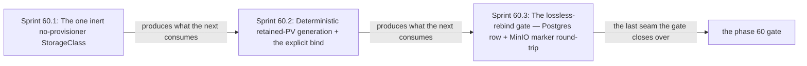

# Phase 60: No-provisioner retained storage + lossless rebind

> **Purpose**: Install the single inert `no-provisioner`/`Retain` StorageClass and the deterministic
> `<namespace>/<statefulset>/pv_<integer>` retained-PV bind on the live linux-cpu kind cluster, enforce
> `Σ(ProvisionedVolumeDemand.provisionedBytes) <= DurableBacking` after presentation/allocation and uniform
> StatefulSet claim-template grouping, enforce a real per-volume host-side hard ceiling, then prove the
> lossless-teardown guarantee — durable bytes rebind across a cluster delete + recreate with a Postgres row
> and a MinIO object marker round-tripping unchanged.
> **Read this if**: phase 60 is next in the queue, or a later phase depends on what its gate establishes.

Phase 60 delivers the no-provisioner retained storage + lossless rebind; its design is owned by [storage_lifecycle_doctrine.md](../documents/engineering/storage_lifecycle_doctrine.md), [resource_capacity_doctrine.md](../documents/engineering/resource_capacity_doctrine.md), [resource_capacity_storage.md](../documents/engineering/resource_capacity_storage.md), and the plan for reaching it is owned here.
Register 3, live, on the `linux-cpu` substrate.
The gate passed 2026-08-10.

> **Historical result (invalidated).** Any pass, seal, validation, ledger, receipt, or implementation observation
> in the orientation text above is diagnostic only. The Phase Status section and [tracker](README.md) own current state; the
> target contract below remains normative.

Link-graph metadata

**Status**: Authoritative source
**Supersedes**: N/A
**Referenced by**: DEVELOPMENT_PLAN/README.md, DEVELOPMENT_PLAN/overview.md, DEVELOPMENT_PLAN/phase_28_storage_geometry_folds.md, DEVELOPMENT_PLAN/phase_29_execution_accelerator_folds.md, DEVELOPMENT_PLAN/phase_58_object_reconciler.md, DEVELOPMENT_PLAN/phase_61_vault_pki.md, DEVELOPMENT_PLAN/phase_78_provider_ebs_credential.md, DEVELOPMENT_PLAN/system_components.md, documents/engineering/storage_lifecycle_doctrine.md
**Generated sections**: none

## Contents
- [Phase Status](#phase-status)
- [Phase Summary](#phase-summary)
- [Gate integrity](#gate-integrity)
- [Doctrine adopted](#doctrine-adopted)
- [Sprints](#sprints)
- [Sprint 60.1: The one inert `no-provisioner` StorageClass 📋](#sprint-601-the-one-inert-no-provisioner-storageclass-)
- [Sprint 60.2: Deterministic retained-PV generation + the explicit bind 📋](#sprint-602-deterministic-retained-pv-generation--the-explicit-bind-)
- [Sprint 60.3: The lossless-rebind gate — Postgres row + MinIO marker round-trip 📋](#sprint-603-the-lossless-rebind-gate--postgres-row--minio-marker-round-trip-)
- [Documentation Requirements](#documentation-requirements)
- [Related Documents](#related-documents)

---

## Phase Status

⏸️ Blocked pending Phase-59 revalidation. Reopened 2026-08-19 by the generative re-baseline: the artifact, budget, lift, workflow and evidence calculi change what this phase's gate must cover, so any earlier seal is history and no longer presents completion evidence.

**Pre-natural-architecture status record (invalidated where it claims completion):**

Blocked (superseded) — reopened 2026-08-16 behind the amended Phase-56 handoff and Phase-59 revalidation. Its prior capability record remains historical until the exact predecessor chain is resealed.

**Superseded containment seal:** revalidated 2026-08-16. `python3 tools/retained_storage_gate.py --execute` passed all eleven
sides against source snapshot `sha256:9959cb38b6acb85c5e752f5b09b836f4021c227d1a281c6835b2143e58437cd2`.
The gate verified the exact Phase-59 seal and Phase-56 OCI handoff, sealed all three sprints, matched all
twelve metrics, reddened all twelve mutants, and joined thirty surfaces to thirty run-time items. Both
inventory-derived witnesses survived a genuine kind delete/recreate on individually bound child filesystems.
The private daemon, kubeconfig, loop mounts, retained bytes, and cluster lived only under one marker-owned
`.test_data/**` run; cleanup removed that run and preserved the unchanged outside-host inventory. The
immutable attestation is `sha256:a43b78ddbadf7abcfcea715532aa82379861af28e1173c881422d79760d73f19`.

**Pre-containment status record (invalidated where it claims completion):**

Blocked (superseded) by the reopened numeric sequence. Reopened 2026-08-11: the prior seal did not include the universal artifact-hygiene
postcondition. This phase returns to numeric order only after Phase 0 closes, then must rerun its capability
gate against its source snapshot and publish repository-local evidence without changing an authored path.

**Invalidated historical record:**

Done (invalidated). All three sprints and the whole-phase gate are implemented and validated. The phase runs on the **linux-cpu** substrate in
**Register 3** (live infrastructure) — a single-node `kind` cluster brought up by the Phase 55 bootstrap coordinator, and
it opens only after the Phase 58 gate (the typed renderer + live SSA reconciler) closes, because the
StorageClass, the retained PVs, and their `claimRef` pins are rendered from pure Haskell and applied through
that reconciler. The single-node host-path retained-storage scheme this phase generalizes is proven in the
sibling prodbox project (`prodbox/documents/engineering/storage_lifecycle_doctrine.md`); read that as
**sibling evidence, not an amoebius result** — amoebius now has its own StorageClass, retained-PV, hard-cap,
explicit-rebind, and real cluster-delete/recreate evidence. The gate ran with
the retired phase-numbered gate on 2026-08-10 and emitted ledger
`dynamically-resolved`. Status
transitions are recorded reverse-chronologically here once work begins.

## Phase Summary

This phase makes durable storage a *different kind of thing* from the cluster that mounts it. It installs the
one inert StorageClass amoebius allows — `provisioner: kubernetes.io/no-provisioner`, `reclaimPolicy: Retain`,
`volumeBindingMode: WaitForFirstConsumer` — and removes every other StorageClass and competing default
annotation, so a claim can never fall through to a dynamic provisioner. It renders retained PVs whose names
and `claimRef`s are pure functions of `(namespace, statefulset, ordinal)`, each pinned to the exact
`(namespace, PVC-name)` it serves and (for host-backed volumes) node-affine to the node holding its bytes,
each carrying an explicit capacity against an explicitly-sized claim. The authorable input is instead a
`DeclaredVolumeDemand`: logical bytes, claim-slot/backing identity, attachment mode, geometry, and
`VolumePresentation = Block | Filesystem { fsType, overheadModel }`. Pure provisioning derives each slot's
`requiredUsableBytes`, adds the versioned filesystem overhead where applicable, applies the backing's non-zero
`minimumBytes`/`quantumBytes`, and alone constructs private
`ProvisionedVolumeDemand.provisionedBytes`; neither raw allocation bytes nor a rounded PV size is authorable.
Before any backing is allocated or PV is applied, the complete post-reconcile retained-volume inventory —
existing images plus proposed new volumes, deduplicated by stable PV identity — is folded against the
observed, separately-owned `DurableBacking`; `Σ(provisionedBytes) > DurableBacking` is a checked rejection and
cannot borrow bytes from the node's ephemeral-storage or native-host-cache pools. A
`volumeClaimTemplate` has one capacity for all of its ordinals, so every ordinal is presented and
allocation-rounded first, then grouped by `(StatefulSet, template)`; the group maximum rounded
`provisionedBytes × ordinalCount` is debited and unused padding stays reserved. On the kind host, every
accepted filesystem PV is backed by its own fixed-raw-size filesystem image under the retained root and
mounted at the PV path: its raw length is the private `provisionedBytes`, its observed fs type matches the
presentation, and its mounted usable capacity supplies `requiredUsableBytes` without being mistaken for the
raw allocation. It closes with the
load-bearing proof:
write a marker row into a Postgres witness and a marker object into a MinIO witness, `cluster delete` (the
apiserver/etcd and PVC/PV API objects disappear while the external retained backing bytes remain), `cluster
recreate` (fresh PV objects whose pre-bound `claimRef` omits `uid`/`resourceVersion` point at that backing),
and read the same bytes back — the deterministic rebind.

This phase is also the live owner of the retained-backing arms of the storage-scaling state machine. Phase
8 supplies the policy-only `ProvisionedStorageScalingEnvelope` and pure observe-then-plan fold, and Phase 58
supplies snapshot validation plus the single-use action/token dispatcher. Here,
`AllocateWithinRetainedCarve` allocates only within a freshly observed residual carve, while
`ShrinkByVerifiedMigration` follows the same old+new+workspace/copy/verify/cutover discipline as retained-PV
resize. `CreateProviderCapacity` has no retained-host mutation capability and remains owned by Phase 75.

The scope deliberately stops at *standing the retained-storage substrate up and proving it rebinds*. The
witness workloads are minimal single-ordinal StatefulSets that exercise the bind; distributed MinIO lands in
Phase 62 and HA Patroni-via-Percona Postgres in Phase 63, the Vault-enveloping of secrets is Phase 61, and the
Keycloak-owned edge is Phase 64 — none of which this phase requires. The control plane
itself is out of the retained-storage picture by construction: it is a stateless Deployment `replicas=1` that
holds **no PVC**, its durable state exclusively the Vault-enveloped MinIO bucket, so MinIO here is a retained
volume holder while the control plane is only a client of that bucket.

**Phase scope:** one cohesive claim — *a retained volume rebinds losslessly to the claim that owned it*. Determinism in the bind name is what makes the rebind checkable rather than hopeful.

**Substrate:** `linux-cpu` — this universal lane is always available on every hardware substrate. When a
pristine Linux host is required, use Incus on native Linux or Linux-CUDA, Lima on Apple, and WSL2 on Windows.
The live gate uses the Phase-55 single-node `kind` cluster; pure StorageClass/PV rendering remains Register 1–2.

**Lane:** linux-cpu/amd64 ([§L](development_plan_standards.md#l-one-substrate-discipline))

**Register:** 3 — live infrastructure ([§K](development_plan_standards.md#k-honesty-proven--tested--assumed)).

**Depends on:** [Phase 59](phase_59_capacity_scheduler.md) — amoebius-capacity scheduler + bootstrap cutover, which this phase consumes rather than rebuilds.

**Gate:** `python3 tools/run_phase_gate.py 60` passes durable **storage rebinds after a cluster delete + recreate with no data loss** — the Postgres row
and MinIO object markers round-trip byte-for-byte across a real teardown, against the corpus, oracles,
ceilings, observers, and seeded mutants of [Gate integrity](#gate-integrity).

The gate is passed only when all of the following hold, checked against the oracle-pinned oracle corpus and
seeded mutants named in [Gate integrity](#gate-integrity):

- **Real teardown, not soft delete.** After `cluster delete`, an OS-boundary observer on the host (not the
  apiserver, which is destroyed) confirms the kind cluster is genuinely absent: `kind get clusters` lists no
  cluster, `docker ps` shows no kind node container, and the apiserver endpoint is unreachable. `recreate` is a
  fresh Phase-55 `pb bootstrap` producing a **new** apiserver/etcd (verified by a changed apiserver
  server-CA / cluster UID against run 1), into which the retained-PV objects are **re-rendered and re-applied**
  before any rebind is asserted. A `cluster delete` that leaves the node container or apiserver alive turns the
  committed mutant **M-soft-delete** red.
- **Bytes survive on the host, not in a surviving apiserver.** "Bytes intact between delete and recreate" is
  observed by inspecting the host retained-storage root directory (`${RETAINED_ROOT}`) **outside** any node
  container, while `kind get clusters` is empty — never by querying a PV status object that a real teardown has
  destroyed. The PV `Released` *status* is observed only in Sprint 60.2's live PVC-delete step against the
  still-running apiserver, not after `cluster delete`.
- **Run-unique marker, no seed path.** The marker content is a fresh random nonce generated by the harness per
  run (clause: Phase-0 pins the nonce-generation and absence-check contract, not the nonce value). The harness
  asserts the nonce is **absent** from both witnesses before the write, present byte-for-byte after recreate,
  and that **no write path executes post-recreate** (verified from the apiserver audit log / a `strace` argv
  observer on the witness process, not a self-emitted trace). The witness pod specs and images are asserted to
  carry **no init/seed/bootstrap step** that could reproduce the marker; a witness manifest that seeds the
  marker turns the committed mutant **M-seed-marker** red.
- **Aggregate and per-volume ceilings are real.** The independent host observer records the durable pool size
  and verifies `Σ(post-reconcile provisionedBytes) <= DurableBacking`, counting existing retained images plus
  proposed additions exactly once by stable identity, before any filesystem image, mount, PV, or PVC is
  created. For each slot the independent checker rederives `requiredUsableBytes`, filesystem overhead, and the
  backing-minimum/quantum-rounded `provisionedBytes`; only then does it group by
  `(StatefulSet, volumeClaimTemplate)`, prove every ordinal's PVC/PV uses the group maximum rounded capacity,
  and debit that maximum times ordinal count. `pv_aggregate_over_backing`,
  `presentation_overhead_over_backing`, `allocation_quantum_over_backing`, and
  `uniform_claim_skew_over_backing` reject with their pinned geometry/allocation or
  `durable-demand-exceeds-backing` reason and zero storage/API writes. For an accepted filesystem volume, the
  host observer proves the raw image length equals `provisionedBytes`, the mounted fs type equals the declared
  `fsType`, and mounted usable bytes are at least `requiredUsableBytes`; a fill plus one-byte write reaches the
  enforced `ENOSPC` boundary without growing the raw image or changing sibling-volume occupancy, cache, or
  node ephemeral storage. The raw-directory mutant **M-raw-host-directory**, skipped-fold mutant
  **M-skip-durable-aggregate**, and pre-allocation-uniformity mutant **M-uniform-before-allocation** must turn
  these checks red.
- **Committed mutants go red.** The gate re-runs the committed seeded mutants of [Gate integrity](#gate-integrity)
  (**M-soft-delete**, **M-seed-marker**, **M-reclaim-delete**, **M-no-rebind**,
  **M-raw-host-directory**, **M-skip-durable-aggregate**, **M-sum-unequal-ordinals**,
  **M-uniform-before-allocation**, **M-collapse-uniform-backing-debits**, **M-cutover-before-verify**,
  **M-credit-before-cleanup**, **M-fake-verify**) and passes only if every one of them
  turns the gate red; a green mutant fails the gate.
- **Honest ledger.** The gate emits its proven/tested/assumed ledger; the aggregate durable-backing fold and
  image-backed host hard cap are live-tested here. The Phase-65 control-plane daemon's no-PVC property
  (which has no realized subject at Phase 60) stays marked **UNVERIFIED**, not asserted as passing.

## Gate integrity

The retained host backing is physical repository state: production paths resolve only beneath
`.data/storage/**`; this live gate creates the two witnesses only beneath its exclusive
`.test_data/runs/<run-id>/storage/**` root. Preflight rejects `.data/**`, any external retained root, and the
host-global container engine. Postflight proves the two markers survived cluster delete/recreate, then
deletes only the exact ownership-marker-proven test root and reports no external mount, loop device, Docker
object, kubeconfig, or path.

This section pins the concrete corpus, the oracle-pinned oracles, and the seeded mutants the Gate and each
sprint Validation above reference. Everything named here is authored and committed in this phase's oracle-pinning sprint, before any
implementation exists.

**What the rebind claim means concretely.** A marker row written into a Postgres witness StatefulSet and a
marker object written into a MinIO witness bucket both round-trip byte-for-byte after the cluster is deleted
(the cluster and its PVC/PV API objects are gone while the retained backing remains) and recreated (the same
StatefulSet identities recompute the same claims, which bind to freshly rendered PV objects whose pre-bound
`claimRef` omits `uid`/`resourceVersion` and points at the same backing bytes), demonstrating the
lossless-teardown guarantee on the linux-cpu substrate.

**What is proven before either witness is created.** The aggregate rounded raw allocation of the
post-reconcile retained inventory (existing plus proposed, without double-counting unchanged identities) is
proven within the observed durable backing with cache and ephemeral pools excluded. Each ordinal's required
usable bytes pass through its presentation and backing allocation policy before the resulting
`ProvisionedVolumeDemand`s are projected to one uniform `volumeClaimTemplate`; the maximum `provisionedBytes`
times ordinal count is what the backing fold spends, and neither a logical-byte sum nor an unequal usable/raw
sum is admissible. A live observer then checks raw image size, mounted usable bytes, fs type, and the enforced
`ENOSPC` boundary without consumption from a sibling volume or the enclosing shared host filesystem.

*Orientation. The seams Phase 60 built and validated in order; [Gate integrity](#gate-integrity) owns the apparatus.*

**Representative set (concrete corpus).** Exactly two witnesses, no more: (1) a single-ordinal Postgres
StatefulSet in namespace `retained-witness` with one PVC `pgdata` on one retained PV, marker = a single row in
table `rebind_witness(nonce text)`; (2) a single-ordinal MinIO StatefulSet in namespace `retained-witness` with
one PVC `miniodata` on one retained PV, marker = one object `rebind/nonce` in bucket `rebind-witness`. Each
witness executes the exact Phase-56 baked binary from the run-audited Phase-56 OCI archive, restored
locally into each fresh node under the Phase-56 digest with `imagePullPolicy: Never`; an OS-boundary observer
confirms zero public-registry pull during the cycle. The harness reads the PostgreSQL executable and major
version from Phase 56's independently authored bake-inventory expectation, then uses that exact baked
executable and its matching baked catalog. It carries no second package resolver and cannot drift to a
different PostgreSQL major than the sealed image.

**oracle-pinned oracles (independent of the implementation).**
- `test/oracle/retained_storage/storage_class.yaml` — the exact single-StorageClass golden (Sprint 60.1),
  hand-authored, not regenerated from the renderer.
- `test/oracle/retained_storage/claimref_table.csv` — the independent reference table mapping
  `(namespace, statefulset, ordinal)` to the expected `metadata.name`, RFC-1123-valued
  `amoebius.io/pv-identity` label, exact `amoebius.io/pv-logical-identity` annotation,
  `claimRef` `(namespace, PVC-name)`, logical demand, `requiredUsableBytes`, presentation/model,
  backing-minimum/quantum operands, and exact private-witness `provisionedBytes` rendered as PVC/PV capacity;
  authored by hand, never by the renderer's naming or sizing helper (Sprints 40.2, 29.3).
- `test/oracle/retained_storage/durable_backing_capacity.golden` — the observed named durable-backing ceilings and the
  accepted post-reconcile per-backing rounded-`provisionedBytes` debit map over existing/proposed stable
  identities, authored independently of the allocation fold; cache and node ephemeral pools are separately
  named and excluded.
- `test/oracle/retained_storage/uniform_claim_boundaries.csv` — hand-authored multi-ordinal usable demands,
  presentation/overhead versions, backing minimum/quantum policies, expected per-slot provision witnesses,
  backing identities, and expected uniform claim plans/per-backing debit maps. It includes an accepted skewed
  group, a group whose unequal per-slot rounded sum fits the backing but whose
  `max(provisionedBytes) × ordinalCount` debit exceeds it, and a differing-backing group whose aggregate fits
  while one named backing is short; no
  renderer/allocation helper generates this table.
- `tools/no_retained_delete_check.sh` — the committed static check that no non-harness `src/` module issues a
  backing-store reclaim/destruction call. Scoped PVC/PV binding-object deletion and whole-cluster deletion are
  explicitly outside this check because the backing lives outside the cluster (Sprint 60.3 Validation 2a).
- Negative fixtures with pinned failure reasons: `two_storageclasses` (reason `count != 1` /
  `default-class annotation present`), `pv_capacity_mismatch` (reason
  `capacity != provisioned witness`), `raw_size_one_byte_under` (reason `raw capacity below witness`),
  `filesystem_type_mismatch` (reason `observed fsType != presentation`),
  `presentation_overhead_over_backing` and `allocation_quantum_over_backing` (reason
  `durable-demand-exceeds-backing after presentation/allocation`), and
  `pv_aggregate_over_backing` plus `uniform_claim_skew_over_backing` (reason
  `durable-demand-exceeds-backing` where applicable), each paired with a positive differing only in the
  foreclosed dimension.
- `test/fixture/retained_storage/migration/` — Phase-0 hand-authored verified-migration transition witnesses for
  `ShrinkByVerifiedMigration`, authored independently of the enactor and never emitted by it. Negatives with
  pinned reasons: `migration_backing_below_highwater` (reason `old+new+workspace-exceeds-backing`),
  `migration_copy_envelope_short` (reason `copy-job-envelope-exceeds-headroom`), and `migration_verify_mismatch`
  (reason `byte-verification-mismatch`), each pinning the expected post-attempt ledger — old binding still live,
  no `ReclaimEligible`, both extents plus partial workspace charged, and zero replacement/Job writes on the two
  headroom cases. One **positive** `migration_shrink_complete` pins the full completion sequence — copy,
  independent byte-verify **pass**, cutover, `ReclaimEligible` emitted after the pass, byte-for-byte nonce
  readback from the new volume, and old-extent retirement **only after** observed deletion — the green target
  the migration mutants must break; every migration negative is paired with this positive on its one foreclosed
  step.

**Committed seeded mutants (must go red).** Each takes a row in `test/mutant/registry.tsv` and is re-run by the gate;
a green mutant fails the gate.
- **M-soft-delete** (dropped-effect operator) — a `cluster delete` that deletes only the witness
  StatefulSets/PVCs and leaves the kind node container + apiserver alive. Must go red on the "cluster genuinely
  absent" OS-boundary assertion (Gate; 60.3 V1).
- **M-seed-marker** (union-arm addition) — a witness manifest carrying an init/seed step that reproduces the
  marker nonce on fresh start. Must go red on the absence-before-write / no-post-recreate-write-path assertion
  (Gate; 60.3 V1).
- **M-reclaim-delete** (guard weakening) — a PV rendered with `reclaimPolicy: Delete` instead of `Retain`. Must
  go red on the `Released`/rebind assertion (60.2 V3/V4).
- **M-no-rebind** (dropped-effect operator) — a reconciler variant that leaves the PV `Released` but never
  clears the stale `claimRef.uid`, so a re-created PVC cannot re-bind. Must go red on the actual re-bind step
  (60.2 V3/V4).
- **M-raw-host-directory** (mechanism substitution) — backs a PV with an ordinary retained-root directory
  while still declaring a Kubernetes capacity. Must go red when the fill-plus-one write succeeds without
  `ENOSPC`, changes shared-parent occupancy, or lacks the raw-size/fs-type/usable witness (60.2 V2).
- **M-skip-durable-aggregate** (dropped validation) — allocates/applies an aggregate retained set larger than
  `DurableBacking`. Must go red on the over-backing negative and zero-write assertion (60.2 V1).
- **M-sum-unequal-ordinals** (wrong aggregation) — debits the unequal per-ordinal provisioned map instead of
  debiting the uniform maximum rounded provisioned value for every ordinal. Must go red on
  `uniform_claim_skew_over_backing` and the accepted group's byte-identical PVC-size assertion (60.2 V1/V2).
- **M-uniform-before-allocation** (stage-reordering operator) — groups authorable logical/usable demand before
  applying the per-slot presentation and backing allocation policies, then fabricates one group size without
  retaining each private `ProvisionedVolumeDemand` witness. Must go red on the overhead/quantum boundary
  fixtures and the per-slot-witness-before-uniformity assertion (60.2 V1/V2).
- **M-collapse-uniform-backing-debits** (wrong aggregation) — collapses the per-backing debit map into a single
  aggregate so spare bytes on one named backing cover another short backing. Must go red on the second committed
  `uniform_claim_skew_over_backing` case, where ordinals span two named backings whose aggregate fits but one
  member backing is one byte short (60.2 V1).
- **M-cutover-before-verify** (guard-weakening / stage-reordering operator) —
  `src/Amoebius/Storage/RetainedScaling.hs`: the `ShrinkByVerifiedMigration` enactor cuts the claim over to the
  new volume and emits `ReclaimEligible` before the independent byte verification of the copied extent passes.
  Must go red on the `migration_shrink_complete` copy→verify→cutover ordering assertion and on
  `migration_verify_mismatch`, where a mismatched copy is cut over anyway (60.2 V1).
- **M-credit-before-cleanup** (dropped-validation operator) — `src/Amoebius/Storage/RetainedScaling.hs`:
  retires/credits the old retained extent before the old backing's deletion is independently observed, freeing
  bytes a still-present extent occupies. Must go red on the `migration_shrink_complete` "retire only after
  observed deletion" step (60.2 V1).
- **M-fake-verify** (mechanism-substitution operator) — `src/Amoebius/Storage/RetainedScaling.hs`: the
  byte-verification step returns match unconditionally without reading the copied bytes. Must go red on
  `migration_verify_mismatch`, where a corrupt copy verifies green, and on the `migration_shrink_complete`
  byte-for-byte nonce readback (60.2 V1).

- **Extension conformance (§M.13).** `L1`–`L5`, `C1`–`C7`, `P1`–`P6`; negatives under `test/negative/retained_storage/`.

## Doctrine adopted

- [`extension_conformance_transactions.md`](../documents/engineering/extension_conformance_transactions.md) — no-provisioner retained storage + lossless rebind reaches a relational store, and P1-P6 close that surface to the transactions the domain has.
- [`jit_budget_doctrine.md`](../documents/engineering/jit_budget_doctrine.md) — the bytes no-provisioner retained storage + lossless rebind causes to exist are charged to a grant that carries its ceiling and concurrency together.
This phase is the first live amoebius realization of the storage-lifecycle contract. Each bullet names the
section it implements; individual sprints cite the same sections where they adopt them.

- [`storage_lifecycle_doctrine.md §2`](../documents/engineering/storage_lifecycle_doctrine.md#2-one-storage-class-and-it-provisions-nothing)
  — *one storage class, and it provisions nothing*: the single inert `no-provisioner` / `Retain` /
  `WaitForFirstConsumer` StorageClass, with every other class removed and every competing default annotation
  stripped, so there is no second way to get a volume.
- [`storage_lifecycle_doctrine.md §4`](../documents/engineering/storage_lifecycle_doctrine.md#4-deterministic-pv-naming-and-the-explicit-bind)
  — *deterministic PV naming and the explicit bind*: PV names on the `<namespace>/<statefulset>/pv_<integer>`
  scheme, an explicit `claimRef` to the exact `(namespace, PVC-name)`, and node affinity to the host-path
  node for host-backed volumes.
- [`storage_lifecycle_doctrine.md §5`](../documents/engineering/storage_lifecycle_doctrine.md#5-sizes-are-explicit-hard-capped-and-one-volume-per-claim)
  — *sizes are explicit, hard-capped, one-volume-per-claim*: every demand declares logical intent,
  presentation, and backing; geometry derives required usable bytes and the private provision witness derives
  the rounded raw PVC/PV capacity. This phase delivers the linux-cpu host mechanism as one fixed-raw-size
  filesystem image per PV, never a raw
  shared-filesystem directory, and drills its presentation and actual `ENOSPC` ceiling. The 1:1 invariant is
  identity/cardinality — one claim slot, one PVC, one PV, one enforced backing extent — not equality between
  logical bytes, usable bytes, filesystem raw bytes, and allocation-rounded bytes.
- [`resource_capacity_doctrine.md §5`](../documents/engineering/resource_capacity_doctrine.md#5-storagebudget-bounded-by-construction-single-owner-ceiling-per-arm)
  — *bounded storage with a single ceiling owner*: the entire post-reconcile retained inventory is checked as
  `Σ(provisionedBytes) <= DurableBacking` before allocation, counting existing/proposed identities once, with
  durable, cache, and pod-ephemeral pools disjoint so the same physical bytes cannot satisfy multiple budgets.
  Its [`§5.1`](../documents/engineering/resource_capacity_storage.md#51-durable-demand-is-logical-first-physical-only-after-geometry)
  presentation/allocation and uniform-claim projection is enacted here: unequal usable ordinal requirements
  are presented and backing-rounded individually, then grouped per `volumeClaimTemplate`; the maximum private
  `provisionedBytes` times ordinal count is the retained debit.
- [`storage_lifecycle_doctrine.md §3`](../documents/engineering/storage_lifecycle_doctrine.md#3-pvcs-are-born-only-from-statefulsets)
  — *PVCs are born only from StatefulSets*: the witness claims exist only as StatefulSet `volumeClaimTemplate`
  claims; there are no bare PVCs or Deployment-owned claims. Only a private provisioned migration Job may
  temporarily mount its exact old/replacement claims; it creates/owns no claim and has no generic PVC field.
- [`storage_lifecycle_doctrine.md §6`](../documents/engineering/storage_lifecycle_doctrine.md#6-the-lossless-teardown-guarantee-deterministic-rebind)
  — *the lossless-teardown guarantee: deterministic rebind*: the phase's gate — a destroyed-then-recreated
  cluster recomputes the same claims which re-bind to the same retained backing, with nothing restored from a
  backup because the backing bytes were never deleted.
- [`storage_lifecycle_doctrine.md §7`](../documents/engineering/storage_lifecycle_doctrine.md#7-deleting-durable-data-is-forbidden-under-normal-operation)
  and [`§7.2`](../documents/engineering/storage_lifecycle_doctrine.md#72-amoebius-own-control-plane-state-is-the-minio-bucket-not-a-pvc)
  — *deleting durable data is forbidden under normal operation* / *the control plane holds no PVC*: the
  cluster delete in the gate discards the cluster-local API objects and never reclaims backing volumes; the
  sole automated actor that may destroy the test-flagged witness bytes is the elevated harness; MinIO sits on
  a retained PV while the stateless control-plane daemon keeps its durable state in the Vault-enveloped
  MinIO bucket, holding no volume of its own.
- [`cluster_lifecycle_doctrine.md §7`](../documents/engineering/cluster_lifecycle_doctrine.md#7-ephemeral-spin-updown-with-deterministic-rebind)
  (cross-reference, not adopted here) — the ephemeral spin-up/down whose teardown removes ephemeral
  infrastructure and never durable backing, which the rebind gate exercises; and
  [`manifest_generation_doctrine.md §5`](../documents/engineering/manifest_generation_doctrine.md#5-the-applyreconcile-engine-snapshot-bound-typed-actions)
  (delivered in Phase 58) — the SSA reconciler that renders and applies the StorageClass and PV objects.

## Sprints

> **Current revalidation rule.** Every sprint is blocked by the reopened numeric sequence. Historical dates,
> pass/seal claims, repository-resident evidence paths, and `Remaining Work: None` statements below describe
> the pre-amendment capability record only; they do not override current status. Functional and validation
> outcomes remain target requirements. Any instruction to commit generated output, freeze dependency resolution,
> retain a resolved version, path, or integrity hash, or consume repository-resident evidence, ledgers, or
> enumerations is superseded by the current generated-artifact and dynamic-resolution doctrine. Closure requires
> the current phase gate plus universal artifact hygiene.

## Sprint 60.1: The one inert `no-provisioner` StorageClass 📋
**Status**: Blocked by the reopened numeric sequence; prior capability footprint retained for migration
`python3 tools/retained_storage_class_gate.py --evidence <run-bundle>`; receipt
`dynamically-resolved`.
**Implementation**: `src/Amoebius/Storage/StorageClass.hs`, `test/spec/live/RetainedStorageClassSpec.hs`,
`test/spec/live/RetainedStorageClassLiveSpec.hs`, and `tools/retained_storage_class_live.py`
**Blocked by**: reopened numeric predecessor gates.
**Independent Validation**: after bring-up `kubectl get storageclass` shows **exactly one** class —
`provisioner: kubernetes.io/no-provisioner`, `reclaimPolicy: Retain`, `volumeBindingMode:
WaitForFirstConsumer` — and no other class and no `storageclass.kubernetes.io/is-default-class` annotation
survives; a PVC created with no PV to bind stays `Pending` (never dynamically provisioned).
**Docs to update**: `documents/engineering/storage_lifecycle_doctrine.md`.

### Objective
Adopt [`storage_lifecycle_doctrine.md §2 — one storage class, and it provisions nothing`](../documents/engineering/storage_lifecycle_doctrine.md#2-one-storage-class-and-it-provisions-nothing):
render the single inert StorageClass and delete the dynamic-provisioning machinery outright, so volumes exist
only because amoebius placed them and nothing in the normal cluster lifecycle can mint or reclaim one.

### Deliverables
- A single rendered StorageClass — `provisioner: kubernetes.io/no-provisioner`, `reclaimPolicy: Retain`,
  `volumeBindingMode: WaitForFirstConsumer` — applied through the Phase-58 reconciler under the `amoebius`
  field manager.
- Removal of every other StorageClass the base `kind` image ships and stripping of any competing default-class
  annotation, so a claim can never silently fall through to a dynamic provisioner.

### Validation
1. Assert post-bring-up the live `kubectl get storageclass -o yaml` is byte-equal to the oracle-pinned golden
   `test/oracle/retained_storage/storage_class.yaml` (an independently hand-authored oracle, not regenerated from
   the renderer): exactly one class, `provisioner: kubernetes.io/no-provisioner`, `reclaimPolicy: Retain`,
   `volumeBindingMode: WaitForFirstConsumer`, and no `storageclass.kubernetes.io/is-default-class` annotation on
   any object.
2. Specific-reason negatives, each paired with the positive differing only in the foreclosed dimension: (a) a
   PVC with no matching PV stays `Pending` **with the specific event reason `WaitForFirstConsumer`** (no
   provisioner attempted) — asserting the reason string, not merely the `Pending` phase; the paired positive is
   an identical PVC that binds once its PV exists. (b) The negative fixture `two_storageclasses` (a second class
   plus a default-class annotation, committed in this phase's oracle-pinning sprint) makes assertion 1 fail with the **specific reason `count != 1` / `default-class annotation present`**, distinguishing it from an unrelated golden mismatch.

### Remaining Work
Generate the sprint receipt under `.build/runs/phase_44/` and retain it only through repository-local attestation.

## Sprint 60.2: Deterministic retained-PV generation + the explicit bind 📋
**Status**: Blocked by the reopened numeric sequence; prior capability footprint retained for migration
`python3 tools/retained_storage_volume_gate.py --evidence <run-bundle> --image <digest-reference>`; receipt
`dynamically-resolved`.
**Implementation**: `src/Amoebius/Storage/RetainedPV.hs`,
`src/Amoebius/Storage/HostVolume.hs`, `src/Amoebius/Storage/RetainedScaling.hs` (retained-carve and
verified-migration storage-scaling arms), `test/spec/live/RetainedStorageVolumeSpec.hs`,
`test/spec/live/RetainedStorageVolumeLiveSpec.hs`, and `tools/retained_storage_volume_live.py`
**Blocked by**: reopened numeric predecessor gates.
**Independent Validation**: the pre-allocation durable-backing fold, the uniform `volumeClaimTemplate`
projection, the deterministic bind against hand-authored `test/oracle/retained_storage/claimref_table.csv`, the
host-side raw/usable/fs-type/`ENOSPC` observation, the delete-and-re-bind cycle, and the single-use
storage-scaling dispatcher are each checked live. The numbered Validation below states every predicate.
**Docs to update**:
`documents/engineering/storage_lifecycle_doctrine.md`,
`documents/engineering/resource_capacity_doctrine.md`,
`documents/engineering/manifest_generation_doctrine.md`.

### Objective
Adopt [`storage_lifecycle_doctrine.md §4 — deterministic PV naming and the explicit bind`](../documents/engineering/storage_lifecycle_doctrine.md#4-deterministic-pv-naming-and-the-explicit-bind),
[`§5 — sizes are explicit, hard-capped, one-volume-per-claim`](../documents/engineering/storage_lifecycle_doctrine.md#5-sizes-are-explicit-hard-capped-and-one-volume-per-claim),
and [`§3 — PVCs are born only from StatefulSets`](../documents/engineering/storage_lifecycle_doctrine.md#3-pvcs-are-born-only-from-statefulsets),
together with [`resource_capacity_doctrine.md §5`](../documents/engineering/resource_capacity_doctrine.md#5-storagebudget-bounded-by-construction-single-owner-ceiling-per-arm)
and its [`§5.1`](../documents/engineering/resource_capacity_storage.md#51-durable-demand-is-logical-first-physical-only-after-geometry)
presentation/allocation and uniform-claim projection, and
[`manifest_generation_doctrine.md §5`](../documents/engineering/manifest_generation_doctrine.md#5-the-applyreconcile-engine-snapshot-bound-typed-actions)
for applying the rendered PVs through the reconciler:
compute both ends of the bind from stable identity so rebinding is never assigned by a race, and confine the
PVC creation path to exactly one shape.

### Deliverables
- Deterministic PV generation from `(namespace, statefulset, ordinal)`: the logical identity
  `<namespace>/<statefulset>/pv_<integer>` realized as the injective RFC-1123-subdomain `metadata.name`
  `<namespace>.<statefulset>.pv-<integer>`, repeated in the RFC-1123-valued `amoebius.io/pv-identity` label,
  with the verbatim logical identity carried in the `amoebius.io/pv-logical-identity` annotation, explicit
  `claimRef` to the exact `(namespace, PVC-name)`, and node affinity to the host-path node for
  host-backed volumes (the trivial single-node case on this substrate). The encoding exists because the
  logical identity is not itself a legal `metadata.name` — `/` and `_` are forbidden — and it is safe because
  the `.` separator is illegal inside either label-shaped component, so the encoding is injective and two
  distinct identities can never collide on one cluster-scoped name
  ([`storage_lifecycle_doctrine.md` §4](../documents/engineering/storage_lifecycle_doctrine.md#4-deterministic-pv-naming-and-the-explicit-bind)).
- An authorable `DeclaredVolumeDemand` per claim slot with logical bytes, geometry, backing, and explicit
  `attachment = NodeLocal | Csi { driver }`, with
  `VolumePresentation = Block | Filesystem { fsType, overheadModel }` and each backing's explicit
  `BackingAllocationPolicy { minimumBytes, quantumBytes }`. A pure total join derives
  `requiredUsableBytes`, applies filesystem metadata/journal/reserved-block overhead, rounds raw bytes to the
  backing policy, and is the only constructor of private
  `ProvisionedVolumeDemand { claim, backing, attachment, requiredUsableBytes, provisionedBytes,
  presentation, allocation, witness }`;
  callers and the renderer cannot author or recompute `provisionedBytes`.
- Explicit per-PVC request and per-PV capacity, both rendered unchanged from the private rounded
  `provisionedBytes`, one enforced backing extent per claim. The host filesystem arm uses one fixed-raw-size
  filesystem image mounted at the PV path; raw retained-root subdirectories are forbidden. The invariant is
  `DeclaredVolumeDemand : PVC : PV : backing extent = 1:1:1:1` by identity/cardinality, not equality among
  logical, required-usable, pre-rounding raw, and provisioned byte quantities.
- A private `UniformClaimPlan` projection for multi-ordinal services: retain the complete map from each
  `(StatefulSet, volumeClaimTemplate, ordinal)` slot to exactly one derived
  `ProvisionedVolumeDemand` **after**
  presentation and allocation, require one compatible presentation/allocation policy per template, render
  the group's maximum `provisionedBytes` as the exact PVC/PV capacity on every ordinal, recheck that it supplies
  the group's maximum `requiredUsableBytes`, and derive a distinct
  `perBackingDebit[backing] = max(provisionedBytes) × membersOnBacking` plus a uniformity witness. An
  ordinal-varying rendered size, pre-allocation grouping shortcut, or aggregate that spends only a logical,
  usable, unequal rounded, or ownership-erased map rejects before render.
- A pre-allocation aggregate fold over the complete post-reconcile retained inventory:
  `∀ backing. Σ UniformClaimPlan.perBackingDebit[backing] <= observed[backing]`, where every named durable backing is disjoint from cache and node ephemeral storage and existing/proposed volumes are keyed by stable identity so an unchanged re-run is counted once. Spare bytes on one backing cannot cover another. A failed fold has no continuation that can create an image, mount, PV, or PVC. - Host-retained resize enactment consumes only a private `ProvisionedStorageMigration`: the binder starts from the still-live old private volume, replacement `DeclaredVolumeDemand`, and structural chunk/concurrency/ workspace policy; provisioning derives the new rounded volume, exact copy/verify Job `PodResourceEnvelope`, and per-backing old+new+workspace high-water. The Phase-58 snapshot-bound reconciler creates the replacement and renders/adopts that Job only when the complete transition still fits CPU, memory, ephemeral storage, pod/CSI slots, and backing bytes. Independent byte verification gates cutover and `ReclaimEligible`; failure keeps the old claim active and both volumes/partial workspace charged. Normal operation never deletes either backing. - The Phase-60 enactors for `AllocateWithinRetainedCarve` and `ShrinkByVerifiedMigration`. They accept only Phase 58's fresh, snapshot-bound `ValidatedStorageScalingAction`, immediately recheck the exact retained allocation map/backing/fingerprint, consume its plan-id-indexed token once, and return a post-attempt observed scaling snapshot. Allocation cannot exceed the witnessed residual carve; shrink delegates to the private migration above and never credits the old extent before verified cutover and observed cleanup. `CreateProviderCapacity` is absent from this host capability surface. - The invariant that a PVC is only ever born from a StatefulSet `volumeClaimTemplate` — no bare PVCs or Deployment-owned claims — exercised with a minimal one-ordinal witness StatefulSet. The only Job mount constructor consumes a private `ProvisionedStorageMigration` and is checked to name exactly its old and replacement claims while creating none.

### Validation
1. Against the oracle-pinned durable-backing inventory and the Phase-55/37-observed durable backing (cache
   and node ephemeral pools excluded), derive the complete post-reconcile PV inventory
   (existing plus proposed, deduplicated by stable identity) and assert that every named backing
   independently satisfies `Σ(perBackingDebit) <= observedBacking`; an unchanged re-run produces the same
   map, not twice the debit.
   - Run `pv_aggregate_over_backing`; assert the specific `durable-demand-exceeds-backing` error and, from
     independent host/apiserver observers, zero image creation, zero mount, and zero PV/PVC writes.
   - Then run three boundary fixtures: (a) `presentation_overhead_over_backing`, whose usable demand fits
     but filesystem metadata/journal/reserved space does not; (b) `allocation_quantum_over_backing`, whose
     raw need is one byte above a backing quantum and therefore spends the next full quantum; and (c)
     `uniform_claim_skew_over_backing`, whose three ordinal usable demands are intentionally unequal and
     whose per-slot rounded sum fits, but `max(provisionedBytes) × 3` exceeds the backing.
   - Its second committed case places ordinals on two named backings whose aggregate bytes fit but one
     member backing is one byte short; it must reject rather than transferring spare capacity.
   - Assert each pinned rejection and the same zero-write boundary; each positive differs only by sufficient
     backing or by one byte on the accepted side of the boundary.
   - The committed **M-skip-durable-aggregate**, **M-sum-unequal-ordinals**, and
     **M-uniform-before-allocation**, and **M-collapse-uniform-backing-debits** mutants must turn these
     checks red.
   - Run the migration boundary from the Phase-0 `test/fixture/retained_storage/migration/` corpus with steady old and
     target states each fitting but (d) `migration_backing_below_highwater` — backing one byte below
     old+new+workspace, (e) `migration_copy_envelope_short` — copy Job CPU/memory/ephemeral or pod/CSI slots
     one unit short, and (f) `migration_verify_mismatch` — an injected post-copy byte mismatch.
   - Assert each against its pinned reason (`old+new+workspace-exceeds-backing`,
     `copy-job-envelope-exceeds-headroom`, `byte-verification-mismatch`): cases (d)/(e) perform zero
     replacement/Job writes; (f) leaves the old binding live, emits no `ReclaimEligible`, and the next
     inventory charges both volumes and partial workspace — the fixture's pinned post-ledger, never a bare
     "nothing happened".
   - **Then drive the positive completion fixture `migration_shrink_complete` and assert the full observed sequence in order:** the copy/verify Job runs, an independent byte verification of the copied extent
     **passes**, the claim cuts over to the new volume, `ReclaimEligible` is emitted **only after** that
     pass, the new volume serves the pre-migration nonce byte-for-byte, and the old extent is retired **only after** its deletion is independently observed — never before.
   - The committed migration mutants **M-cutover-before-verify** (cuts over / emits `ReclaimEligible` before
     verification passes), **M-credit-before-cleanup** (retires the old extent before observed deletion),
     and **M-fake-verify** (verification always reports match) must each turn this positive assertion red,
     and **M-fake-verify** and **M-cutover-before-verify** additionally turn `migration_verify_mismatch` red
     by admitting a corrupt copy; a stubbed enactor that skips copy/verify/cutover fails the positive
     assertion, not just the negatives.
2. Render the accepted multi-ordinal counterpart and assert every PVC/PV projected from the same
   `volumeClaimTemplate` has byte-identical capacity equal to the fixture's maximum rounded private
   `provisionedBytes`, that this supplies the maximum `requiredUsableBytes`, and that the provision witness
   debits the rounded capacity times ordinal count. Then deploy the one-ordinal rebind
   witness StatefulSet; assert its claim binds to the PV whose `metadata.name`,
   `amoebius.io/pv-identity` label, `amoebius.io/pv-logical-identity` annotation, `claimRef`
   `(namespace, PVC-name)`, and capacity **exactly equal** (`==`, not merely `>=`) to the PVC request and the
   private `UniformClaimPlan.provisionedBytes` all
   match the table's provisioned-witness column, and that node affinity pins the host-backed volume to its
   node. That raw rounded number may be larger than the logical or required usable demand. From the host block/image observer assert raw image length `== provisionedBytes`; from inside the
   mounted pod assert the filesystem type equals `VolumePresentation.fsType` and usable capacity
   `>= requiredUsableBytes`. Fill the usable filesystem and issue one more byte; assert `ENOSPC` occurs while
   the raw image length, sibling-volume usage, native-host-cache backing, and node-ephemeral usage do not grow.
   An omitted overhead model or a rounded value not divisible by `quantumBytes` fails the pure provision before
   materialization. Separately, deliberately materialized one-byte-short-raw-image and wrong-fs-type fixtures
   fail the post-create observation before PV/PVC apply or workload start, then are swept by the elevated test
   harness. The committed **M-raw-host-directory** mutant must turn this red because the overflow succeeds or
   spills into shared backing.
3. Write a nonce byte-string through the claim, then delete the PVC; assert the PV drops to `Released`. **Then exercise re-bind for real:** re-create the identical PVC and assert it re-binds to the same
   identity-named/`claimRef`-pinned PV and that the nonce reads back unchanged through the re-bound claim.
   Assert no PVC exists outside a StatefulSet `volumeClaimTemplate`.
4. The committed mutant **M-no-rebind** (a reconciler variant that leaves the PV `Released` but never clears the
   stale `claimRef.uid`, so a re-created PVC cannot bind) must turn assertion 3 red; a validation that checked
   only `.status.phase == Released` would leave it green and is therefore insufficient. The committed mutant
   **M-reclaim-delete** (PV rendered with `reclaimPolicy: Delete`) must turn assertion 3 red (the PV vanishes on
   PVC delete instead of going `Released`). Negative fixture `pv_capacity_mismatch` changes the PV capacity
   away from the private uniform `provisionedBytes` while leaving the logical/usable demand unchanged; it must
   fail assertion 2 with the specific reason `capacity != provisioned witness`, paired with the exact-witness
   positive. This forecloses independently upsizing or downsizing a PV without re-running presentation,
   allocation rounding, uniformity, and backing admission; it does not assert logical-byte equality.
5. Drive the same retained budget through the storage-scaling dispatcher. A fitting residual produces and
   enacts only `AllocateWithinRetainedCarve`; a shrink produces only `ShrinkByVerifiedMigration` and obeys
   assertion 1's old+new+workspace/verification checks. Retained growth and shrink proceed only through a
   fresh `ValidatedStorageScalingAction`: mutating the allocation map, backing extent, or
   fingerprint after validation invalidates the action, and a stale readback or a replayed token produces
   zero host, Job, PV, or PVC writes. Replaying its consumed token
   is impossible; and an injected lost response requires re-observation while retaining every possibly
   allocated extent. A provider-capacity action is rejected because this phase supplies no cloud capability.

### Remaining Work
None; the live observation, external reader, ten red mutants, and receipt are retained under
`.build/runs/phase_44/` for repository-local attestation, never an authored root.

## Sprint 60.3: The lossless-rebind gate — Postgres row + MinIO marker round-trip 📋
**Status**: Blocked by the reopened numeric sequence; prior capability footprint retained for migration
`python3 tools/retained_storage_rebind_gate.py --evidence <run-bundle> --artifact <oci> --image-digest <digest>`; sprint receipt
`external-run-reference` and phase ledger
`dynamically-resolved`.
**Implementation**: `src/Amoebius/Storage/Rebind.hs`, `test/spec/live/RetainedStorageRebindLiveSpec.hs`,
`test/spec/live/RetainedStorageRebindSpec.hs`, and `tools/retained_storage_rebind_live.py`
**Blocked by**: reopened numeric predecessor gates.
**Independent Validation**: a fresh per-run random nonce, written as a Postgres row and as a MinIO object,
reads back byte-for-byte after a real `cluster delete` + `recreate` — asserted absent before the write, and
with no witness write path executed afterwards. Validation 1 below states the observers and the ordering they
are read in.
**Docs to update**: `documents/engineering/storage_lifecycle_doctrine.md`,
`documents/engineering/cluster_lifecycle_doctrine.md`, `DEVELOPMENT_PLAN/README.md`.

### Objective
Adopt [`storage_lifecycle_doctrine.md §6 — the lossless-teardown guarantee: deterministic rebind`](../documents/engineering/storage_lifecycle_doctrine.md#6-the-lossless-teardown-guarantee-deterministic-rebind),
[`§7 — deleting durable data is forbidden under normal operation`](../documents/engineering/storage_lifecycle_doctrine.md#7-deleting-durable-data-is-forbidden-under-normal-operation),
and [`§7.2 — the control plane holds no PVC`](../documents/engineering/storage_lifecycle_doctrine.md#72-amoebius-own-control-plane-state-is-the-minio-bucket-not-a-pvc):
prove that a destroyed-then-recreated cluster finds its durable bytes unchanged because the original backing
bytes were never deleted — nothing is restored from a backup — while the cluster delete never reclaims
durable backing and no normal-operation path can.

### Deliverables
- Minimal single-ordinal Postgres and MinIO witness StatefulSets on retained PVs (from Sprint 60.2), served
  from baked-binary images; these are rebind witnesses, not distributed MinIO (Phase 62) or HA
  Patroni-via-Percona (Phase 63), and carry no Vault-enveloping (Phase 61).
- The `Rebind.hs` gate harness: write a marker row into the Postgres witness and a marker object into the
  MinIO witness bucket, `cluster delete` (cluster/PVC/PV API objects gone, retained backing bytes intact),
  `cluster recreate` (the same fixed-raw-size filesystem images remounted and fresh PV objects rendered over
  them), then read the same bytes back — with the delete
  driven by the ordinary safe teardown that frees compute and never storage.
- A live `RebindSpec` that asserts the round-trip and, honestly, that this phase never deletes durable bytes:
  the eventual reclaim of the test-flagged witness volumes is the elevated harness's sole prerogative, kept
  out of the normal path.
- The oracle-pinned gate-integrity artifacts of [Gate integrity](#gate-integrity): the two-witness
  representative set, the `claimref_table.csv` / `storageclass_expected.yaml` oracles, the
  `no_retained_delete_check.sh` static check, the `test/fixture/retained_storage/migration/` negatives-plus-positive
  verified-migration corpus, and the seeded mutants **M-soft-delete**, **M-seed-marker**,
  **M-reclaim-delete**, **M-no-rebind**, **M-raw-host-directory**, **M-skip-durable-aggregate**,
  **M-sum-unequal-ordinals**, **M-uniform-before-allocation**, **M-collapse-uniform-backing-debits**,
  **M-cutover-before-verify**, **M-credit-before-cleanup**, and **M-fake-verify** the
  gate re-runs and requires red.

### Validation
1. Run the cycle on the concrete representative set of [Gate integrity](#gate-integrity) (exactly two witnesses): generate a per-run nonce, assert its absence, write it as the Postgres row and the MinIO object,
   `cluster delete`, confirm via the host OS-boundary observer that the cluster is genuinely absent
   (`kind get clusters` empty, no kind node container in `docker ps`, apiserver unreachable) while
   `${RETAINED_ROOT}` still holds the bytes, `cluster recreate` as a fresh Phase-55 bootstrap (new apiserver
   UID, PV objects re-rendered and re-applied), then read back; assert the nonce is byte-for-byte unchanged,
   re-bound by identity against `claimref_table.csv`, and that no witness write path executed post-recreate
   (apiserver audit log + `strace` observer). The committed mutants **M-soft-delete** and **M-seed-marker** must
   both turn this assertion red.
2. Assert the full deletion reclaimed no backing volume (fresh PV objects re-appear post-recreate and
   `${RETAINED_ROOT}` bytes persist throughout). The "no normal-operation code path destroys retained backing
   bytes" universal negative is discharged two concrete ways: (a) a committed static/CI check asserts no
   non-harness module in `src/` issues a backing-store reclaim/destruction call (grep-level, committed as
   `tools/no_retained_delete_check.sh`; scoped PVC/PV binding-object deletion and whole-cluster deletion are
   allowed because neither deletes the external backing), and (b) post-cycle the fresh PV objects exist and
   host bytes are present. The control-plane daemon is a Phase-65 subject with **no realized instance at Phase 60**, so its "mounts
   no PVC" property is **not asserted as passing here** — it is recorded **UNVERIFIED** in the honesty ledger,
   not treated as a vacuously-true pass.

### Remaining Work
Migrate the two-service live evidence, audit observation, mutant results, receipt, and phase ledger to
`.build/runs/phase_44/`; externally attest the bundle and rerun after Phase 59 closes.

## Documentation Requirements

**Engineering docs to update (when the gate runs, flip the honest layer, never before):**
- `documents/engineering/storage_lifecycle_doctrine.md` — the §6 lossless-rebind guarantee gains its first
  amoebius proof on linux-cpu; the §5 host-side hard-cap mechanism is recorded as the delivered fixed-raw-size
  image-backed implementation and the §5.2 aggregate durable-backing fold gains its live check; the §10
  planning-ownership pointer resolves to delivered Phase-60 sprints.
- `documents/engineering/cluster_lifecycle_doctrine.md` — the §7 ephemeral-rebind claim gains its first
  amoebius witness (teardown frees compute, never storage) on this substrate.
- `documents/engineering/manifest_generation_doctrine.md` — the §5 reconciler is recorded as the applier of
  the StorageClass and retained-PV objects, not just service workloads.
- `documents/engineering/resource_capacity_doctrine.md` — the durable aggregate is live-checked against its
  disjoint backing, presentation/filesystem overhead and backing minimum/quantum are boundary-tested before
  uniform StatefulSet claim-plan grouping, and the linux-cpu raw-size/usable-size/fs-type/hard-ceiling tuple is
  verified live.

**Cross-references to add:**
- `DEVELOPMENT_PLAN/README.md` — flip the Phase-60 status when the gate passes; link this document.
- `DEVELOPMENT_PLAN/substrates.md` — record Phase 60's gate substrate (linux-cpu) in the per-phase substrate map.
- `DEVELOPMENT_PLAN/system_components.md` — register `src/Amoebius/Storage/StorageClass.hs`,
  `src/Amoebius/Storage/RetainedPV.hs`, `src/Amoebius/Storage/Rebind.hs`, and the `RebindSpec` live suite as
  Phase-60 design-first rows.

## Related Documents
- [README.md](README.md) — the live tracker and phase ordering this document sits under
- [development_plan_standards.md](development_plan_standards.md) — the rulebook this document obeys
- [overview.md](overview.md) — the target architecture and cross-cutting invariants (no-provisioner retained PVs; no unbounded storage; the control plane holds no PVC)
- [system_components.md](system_components.md) — the target component inventory for the module paths above
- [Storage Lifecycle Doctrine](../documents/engineering/storage_lifecycle_doctrine.md) — the no-provisioner
  retained-PV model, the deterministic bind, and the lossless-rebind guarantee adopted here
- [Cluster Lifecycle Doctrine](../documents/engineering/cluster_lifecycle_doctrine.md) — the ephemeral
  spin-up/down whose teardown the rebind gate exercises (cross-reference)
- [Manifest Generation & the Typed Reconciler](../documents/engineering/manifest_generation_doctrine.md) — the
  Phase-58 SSA reconciler that applies the StorageClass and retained-PV objects
- [Testing Doctrine](../documents/engineering/testing_doctrine.md) — Register 3 (live) and the elevated harness
  as the sole sanctioned deleter of test-flagged durable storage
- [phase_58](phase_58_object_reconciler.md) — the typed renderer + live SSA reconciler this phase builds on
- [phase_61](phase_61_vault_pki.md) — the root Vault whose durable KV rebinds on the retained storage proven here
- [phase_62](phase_62_platform_backbone.md) / [phase_63](phase_63_platform_services_2.md) — the HA
  MinIO/Postgres platform stack that supersedes the witnesses
- [Engineering Doctrine Index](../documents/engineering/README.md) — the doctrine suite these phases adopt
