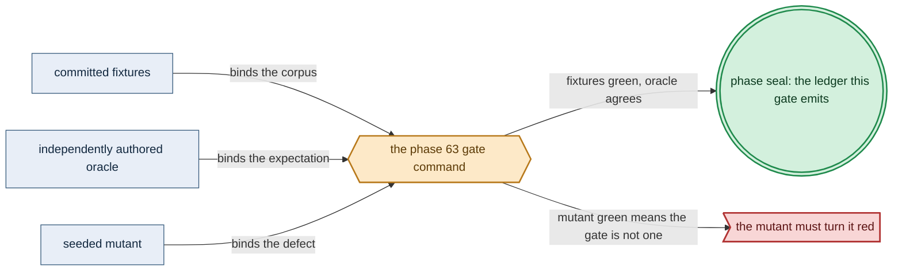

# Phase 63: Platform services-2 (Redis/Sentinel + Percona/Patroni + pgAdmin + observability + readiness-DAG)

> **Purpose**: Stand up Redis/Sentinel, Percona/Patroni with pgAdmin, and Prometheus/Grafana, then bring the
> whole standard stack up in the derived readiness-DAG order asserted from an external-observer trace.
> **Read this if**: phase 63 is next in the queue, or a later phase depends on what its gate establishes.

Phase 63 delivers the platform services-2 (Redis/Sentinel + Percona/Patroni + observability + readiness-DAG); its design is owned by [ui_realtime_coordination_doctrine.md](../documents/engineering/ui_realtime_coordination_doctrine.md), [platform_services_doctrine.md](../documents/engineering/platform_services_doctrine.md), [chaos_failover_doctrine.md](../documents/engineering/chaos_failover_doctrine.md), and the plan for reaching it is owned here.
Register 3, live, on the `linux-cpu` substrate.
Validated 2026-08-10 with `python3 tools/platform_services_2_gate.py`; ledger
`dynamically-resolved`.

> **Historical result (invalidated).** Any pass, seal, validation, ledger, receipt, or implementation observation
> in the orientation text above is diagnostic only. The Phase Status section and [tracker](README.md) own current state; the
> target contract below remains normative.

Link-graph metadata

**Status**: Authoritative source
**Supersedes**: N/A
**Referenced by**: DEVELOPMENT_PLAN/README.md, DEVELOPMENT_PLAN/overview.md, DEVELOPMENT_PLAN/phase_60_retained_storage.md, DEVELOPMENT_PLAN/phase_62_platform_backbone.md, DEVELOPMENT_PLAN/phase_64_keycloak_ingress.md, DEVELOPMENT_PLAN/system_components.md
**Generated sections**: none

## Contents
- [Phase Status](#phase-status)
- [Phase Summary](#phase-summary)
- [Gate integrity](#gate-integrity)
- [Doctrine adopted](#doctrine-adopted)
- [Sprints](#sprints)
- [Sprint 63.1: Percona/Patroni Postgres per consumer + pgAdmin + Prometheus/Grafana ⏸️](#sprint-631-perconapatroni-postgres-per-consumer--pgadmin--prometheusgrafana-)
- [Sprint 63.2: Ephemeral Redis/Sentinel realtime coordination ⏸️](#sprint-632-ephemeral-redissentinel-realtime-coordination-)
- [Sprint 63.3: The full derived readiness-DAG bring-up + the standard-stack gate ⏸️](#sprint-633-the-full-derived-readiness-dag-bring-up--the-standard-stack-gate-)
- [Sprint 63.4: Register-2.5 readiness-DAG bring-up under simulated partial failure ⏸️](#sprint-634-register-25-readiness-dag-bring-up-under-simulated-partial-failure-)
- [Documentation Requirements](#documentation-requirements)
- [Related Documents](#related-documents)

---

## Phase Status

⏸️ Blocked pending Phase-62 revalidation. Reopened 2026-08-19 by the generative re-baseline: the artifact, budget, lift, workflow and evidence calculi change what this phase's gate must cover, so any earlier seal is history and no longer presents completion evidence.

**Pre-natural-architecture status record (invalidated where it claims completion):**

Blocked (superseded) — containment amendment recorded 2026-08-15. Any earlier capability seal is historical and
invalidated until this phase reruns in numerical order with all amoebius-owned state confined to the
repository roots defined by Phase 0. Scope amendments below remain normative.

**Pre-containment status record (invalidated where it claims completion):**

Blocked (superseded) by the reopened numeric sequence. Reopened 2026-08-11: the prior seal did not include the universal artifact-hygiene
postcondition. This phase returns to numeric order only after Phase 0 closes, then must rerun its capability
gate against its source snapshot and publish repository-local evidence without changing an authored path.

**Observed artifact migration — 2026-08-11:** `expected-base-digest.txt` duplicates Phase-56 run output, and
`postgres-share-package.sha256` is a package/archive integrity observation. Both are generated. Phase 63 must
consume Phase 56's verified image identity and Phase 1's dynamic package resolution without committed checksum
files.

**Invalidated historical record:**

**Done.** All four sprints are implemented and the Phase-63 gate is sealed. The gate combines the pure
service model, 256 deterministic `IOSim` fault schedules plus `IOSimPOR`, eight specifically red mutants,
an independent live-receipt reader, and a warm reconciliation of the real Phase-62 cluster. It runs on the
**linux-cpu** substrate across **Register 3** (live infrastructure) — the same
single-node `kind` cluster on a linux-cpu host, on top of the Phase-56 registry + baked base image, the
Phase-58 typed renderer + SSA reconciler, the Phase-60 no-provisioner retained storage, the Phase-61 unsealed
root Vault, and the Phase-62 MetalLB/MinIO/Pulsar backbone. Redis/Sentinel, Patroni Postgres, pgAdmin,
Prometheus, and Grafana are now tested amoebius results. The live Percona 2.6 operator observes the rendered
`PerconaPGCluster`; its exact three-member Patroni child is the typed amoebius projection recorded as
`manualChildProjection: true`, rather than a claim that the operator created that child. The live readiness
evidence is explicitly a warm apiserver-status observation during reconciliation; cold and partial-failure
ordering is discharged by the unmodified `BringUp` orchestration under deterministic simulation.

Every hardware substrate always has the `linux-cpu` execution option. The native hardware class does not
remove that baseline: Linux and Linux-CUDA use Incus for a pristine Linux host, Apple uses Lima, and Windows
uses WSL2. These VM routes are optional isolation mechanisms; direct Linux CPU execution remains valid on
every hardware substrate.

## Phase Summary

This phase completes the standard platform-service set on top of the Phase-62 backbone. It renders and
reconciles the cluster-wide **Percona operator**, one **Patroni Postgres cluster per consuming capability**
(each paired with its own **pgAdmin**), and the **Prometheus/Grafana** observability pair — each as the
byte-identical **HA topology even at `replicas=1`** (Postgres is a Patroni-via-Percona cluster, never a bare
`postgres` Pod), each rendered as typed Kubernetes objects by the Phase-58 `renderAll` path (no Helm, no
third-party charts, manifests generated from Haskell and never committed), each served from binaries **baked into the native-architecture base image** with no public-registry pull, and each on the Phase-60 `no-provisioner`
retained PVs where it holds durable state. Every app, init, and sidecar container and every volume is rendered
only from an opaque `ProvisionedServiceSpec`, with exact CPU/memory/ephemeral-storage requests and limits,
bounded pod-local storage, exact durable capacities, and explicit cache `None` plus accelerator `None` for this
linux-cpu stack. Prometheus's capacity is specifically descriptor-derived: a mandatory finite
`MonitoringWorkBudget` carries workflow/rule/series/sample-rate ceilings, evaluation interval, retention,
structural `QueryWorkBudget` concurrency/series/samples/range/timeout operands, one
claim/backing/`VolumePresentation`, and versioned evaluation/TSDB/query models. Its private provision witness
fixes both the compute envelope and the TSDB PVC/PV plus runtime retention configuration.
It also renders the platform-internal **Redis/Sentinel** topology used by replicated UI-server WebSockets:
one writable primary, at least two replicas, and three Sentinel voters in the distributed projection, with
TLS/Vault ACL credentials, bounded key/client/buffer/fanout/reconnect demand, and no PVC/AOF/RDB/backup. Redis
is not application capability or durable receipt state.
Each database consumer independently constructs a `PatroniSqlDemand`: exact operator-derived
child/controller/webhook envelopes, finite data/WAL/checkpoint/failover-replay operands, declared volume
presentation/backing and `StorageBudgetId`, bounded SQL connection/transaction/WAL mutation admission, and
rollout/failover overlap. The private `ProvisionedPatroniSql` includes the resulting SQL gateway envelope and
is required before its
CR can render; adding another consumer cannot reuse Grafana's database witness.

The Patroni configuration is **mandated**, not left to a per-service option: `synchronous_mode: on`, the
*decided* strict stance `synchronous_mode_strict: on` (when no synchronous standby is available the primary
**refuses new writes** rather than silently degrading to asynchronous replication — the non-strict
degrade-to-async alternative is rejected), and a bytes-bounded `maximum_lag_on_failover` (a replica lagging
past the bound is ineligible for promotion). This is the premise the RPO=0 / lossless-delegation obligation of
[`chaos_failover_doctrine.md §6`](../documents/engineering/chaos_failover_doctrine.md#6-the-concentration-principle--where-the-obligation-lives)
rests on — that doctrine delegates intra-cluster synchronous-HA correctness to Patroni rather than re-proving
it, and the delegation holds **only** with these settings.

The phase then assembles the *whole* standard stack — the Phase-62 backbone plus these services — as one
**derived readiness DAG** and brings it up in the [`platform_services_doctrine.md §11`](../documents/engineering/platform_services_doctrine.md#11-bring-up-and-dependency-ordering)
order by the Phase-58 reconciler's **event-driven wait-for-ready**: a dependent starts on its dependency's
observed-ready edge, never a timer. The bring-up order is asserted a pure function of the *declared* dependency
edges from an external-observer bring-up trace — not a self-report — and a hardcoded sequential list is
foreclosed by a committed mutant.

The scope stops at *standing these services up HA, bringing the whole stack up in derived-DAG order, and
proving the mandated Patroni configuration and DAG derivation*. The **Keycloak-owned ingress edge** — the
browser surface Grafana and pgAdmin reach a user through — is [Phase 64](phase_64_keycloak_ingress.md); this
phase brings the observability surfaces up behind no public edge, and they reach a user only once that edge
exists. The Deployment-`replicas=1` control-plane daemon does not assume ownership until
[Phase 65](phase_65_live_dsl_deploy.md). Until then, a host-side operator drives this phase's fixed service
set.

**Phase scope:** one cohesive claim — *the whole standard stack comes up in the order its readiness DAG derives*. The order is asserted from an external observer's trace, never from the stack's own report.

**Substrate:** linux-cpu ([§L](development_plan_standards.md#l-one-substrate-discipline)) — the whole gate runs on a single-node `kind` cluster on a linux-cpu host. This
is the universal baseline available on every hardware substrate.

**Lane:** linux-cpu/amd64 ([§L](development_plan_standards.md#l-one-substrate-discipline))

**Register:** 3 — live infrastructure ([§K](development_plan_standards.md#k-honesty-proven--tested--assumed)); a real bring-up on a real cluster, emitting the honesty ledger
that names Register 3 and marks the runtime layer *tested*, not proved.

**Depends on:** [Phase 62](phase_62_platform_backbone.md) — platform backbone (MetalLB + MinIO + Pulsar HA), which this phase consumes rather than rebuilds.

**Gate:** `python3 tools/platform_services_2_gate.py` brings the whole standard stack up on the Phase-62 backbone cluster
in the [§11](../documents/engineering/platform_services_doctrine.md#11-bring-up-and-dependency-ordering)
derived readiness-DAG order, every service in its HA-capable topology. The apparatus is
[Gate integrity](#gate-integrity).

*Validated Phase-63 gate apparatus; [§M](development_plan_standards.md#m-gate-integrity-a-gate-cannot-be-passed-by-a-stub) owns its clauses.*

**Gate integrity ([§M](development_plan_standards.md#m-gate-integrity-a-gate-cannot-be-passed-by-a-stub)).**
The gate is closed to a stub by the cross-checks below. Existing same-commit fixtures are regression fixtures
until Phase 0 and the owning sprint record independent review or replacement; none inherits oracle status from
the former Phase-0 manifest claim.

## Gate integrity

The apparatus phase 63's gate closes over, in the slot
[§D](development_plan_standards.md#d-the-per-phase-document-skeleton) reserves for it. Every clause it
discharges is owned by
[§M](development_plan_standards.md#m-gate-integrity-a-gate-cannot-be-passed-by-a-stub).

**What the acceptance run must show.** The remaining standard services are the Percona operator, the
per-consumer Patroni Postgres clusters with pgAdmin, Prometheus/Grafana, and Redis/Sentinel. Each comes up in
its HA-capable topology — the same shape even at `replicas=1`, Postgres a Patroni-via-Percona cluster and
never a bare Pod — from generated manifests and baked binaries, with no public-registry pull. Each Patroni
cluster carries the mandated synchronous configuration asserted against a committed oracle, and every
execution unit and volume carries the exact complete provision its `ProvisionedServiceSpec` derives.
Prometheus is included down to its budget-derived compute, evaluation/retention/WAL configuration, and TSDB
claim, backing, and capacity, with the one-byte-under and compaction/recovery high-water witnesses passing.
The whole stack then comes up in derived readiness-DAG order — the Percona operator before any Postgres
consumer, Vault initialized and unsealed before secret-dependent startup — each edge a condition the
reconciler's wait-for-ready observes rather than a duration it waits out. Redis is externally probed through
TLS/ACL credentials, and its one-primary, two-replica, three-Sentinel topology, no-persistence configuration,
finite memory/client/output-buffer limits, and failover-ready observation match the committed oracle.

- **Derived-DAG order (§M.2 committed mutant, §M.3 independent oracle, §M.4 coverage floor, §M.5 external-observer trace).** The
  bring-up order is asserted a pure function of the *declared* dependency edges by a Register-1 property
  (Sprint 63.3), checked against a committed hand-authored edge→order reference table
  `test/fixture/platform_services_2/dag-edges.golden` independent of the `BringUp` fold; and the *live* order is read from
  an external-observer bring-up trace (the apiserver watch / pod-readiness event stream at the OS boundary, not
  a compliance trace amoebius emits about itself). The gate names a committed seeded mutant —
  **`mutant/dag-drop-edge`**, deleting the `perconaOperator → PerconaPGCluster` edge — that MUST turn the order
  property and the live precondition assertion red. The property carries a §M.4 cover/classify floor
  requiring a stated minimum fraction of generated cases to exercise both the declared-edge mutation branch
  and the injected-cycle branch, so neither is discharged vacuously by a generator that only ever emits
  acyclic declared-edge sets; and a second committed seeded mutant — **`mutant/dag-inject-cycle`**, adding a
  back-edge that makes the declared graph cyclic — independently pins the "introduced cycle is rejected"
  branch. A hardcoded sequential list cannot satisfy the "edge
  change ⇒ order change / injected cycle rejected" property.
- **Mandated Patroni config (§M.3 independent oracle, §M.2 committed mutant, §M.8 specific-reason negative).**
  Each rendered `PerconaPGCluster`'s Patroni configuration is asserted byte-equal to the committed
  hand-authored oracle `test/fixture/platform_services_2/patroni-sync-config.golden` (`synchronous_mode: on`,
  `synchronous_mode_strict: on`, bounded `maximum_lag_on_failover`), authored independently of the renderer.
  The committed seeded mutant **`mutant/patroni-async-default`** — a Patroni config left at the async default
  (`synchronous_mode` off, or non-strict so it silently degrades to async) — MUST fail the synchronous-mode
  invariant with the **specific reason** that `synchronous_mode_strict` is not `on` (paired with the positive
  that differs only in that field), so the negative cannot pass by failing for an unrelated reason.
- **Image-identity provenance (§M.5 OS-boundary observer).** Every running container's `imageID` digest
  (`kubectl get pods -A -o jsonpath={..imageID}`) MUST equal the digest in the verified Phase-56 attestation
  and current in-cluster `distribution` registry
  catalog; any digest not in that catalog, or any `docker.io`/`quay.io`/other public-registry reference (including
  an upstream image pre-side-loaded with `kind load`), fails. The pull-observation window is the
  containerd/CRI image-pull event log on the kind node read from the OS boundary over the whole gate window.
- **Applied-manifest oracle (§M.3 independent provenance).** Recompute `renderAll` during the gate and compare its
  bytes with the normalized SSA objects owned by the `amoebius` field manager. Any hand-authored or embedded
  third-party YAML therefore diverges from the Phase-58 renderer and fails.
- **Phase-63 resource witness readback (§M.3 independent projection).** Normalize every live resource-bearing
  field in this service set and require it to match the opaque `ProvisionedServiceSpec` projection: container
  CPU/memory/ephemeral bounds, disk-backed `emptyDir` limits, cache admission, and PVC/PV presentation and
  capacity. The volume fields must equal the
  private `ProvisionedVolumeDemand`'s presentation and backing-rounded `provisionedBytes`, which witness the
  service-derived required usable demand and retained backing;
  every Percona controller, validating webhook, Patroni member, backup/recovery unit, and pgAdmin pod is
  included with its exact old/new/surge/failover envelope, and the database volume peak includes data, WAL,
  checkpoint, failover replay, and recovery overlap;
  and every service in this linux-cpu corpus carries cache `None` and accelerator `None` with no device
  extended-resource claim. An independent calculation combines app containers, both forms of init container,
  and pod/runtime overhead, then exact-matches the placement witness; a presence-only subset check is insufficient.
- **Prometheus retained-state identity and boundary (§M.3 independent projection, §M.5 OS-boundary observer).** An oracle-pinned monitoring oracle independently folds the bounded scrape-sample rate and
  retention into resident blocks, WAL/head, old+new compaction overlap, and derives query/temp headroom from
  the structural query operands. The applied
  StatefulSet claim/backing and PVC/PV capacity plus effective evaluation interval,
  `--storage.tsdb.retention.time`, `--storage.tsdb.retention.size`, Prometheus
  concurrency/sample/timeout flags, sole-routable query-admission proxy series/range limits, and model-selected
  WAL/config settings must equal the private witness; NetworkPolicy denies direct query API access. The
  one-byte-under case records zero apiserver/backing effects; the positive
  drives a compaction/restart/query high-water and reads filesystem usage from the mounted-volume boundary.
- **Replica-count topology parity.** Render-diff the one-replica and multi-replica Patroni projections; only
  replica-count fields may differ. A separate standalone/single-member configuration therefore cannot masquerade
  as the HA-capable topology.
- **Consumer end-to-end (§M.7 concrete corpus).** A `PerconaPGCluster` consumed by nothing does not satisfy
  the gate: the named consumer set is observed to **use** its cluster — authenticating with the credential
  resolved from its Vault `SecretRef` and reading back a SQL row it wrote — not merely that an unattached
  cluster reconciles.
- **Redis boundary and failover.** An independent client uses Vault-issued TLS/ACL credentials, writes only a
  TTL-bound challenge key, observes it from a replica, and forces a Sentinel primary failover. Kubernetes
  volume inventory and Redis configuration prove no PVC/AOF/RDB persistence; provider/Pulsar observers prove
  the exercise creates no durable command receipt. `mutant/redis-pvc`, `mutant/redis-public-image`,
  `mutant/redis-unbounded-buffer`, and `mutant/redis-receipt-authority` each turn the gate red for its own
  specific reason — a persistence arm, a public image, an unbounded key or buffer value, and Redis standing in
  as a receipt authority.

**Representative service set (§M.7).** The gate's "remaining standard services" are exactly: the Percona
operator, the per-consumer Patroni Postgres clusters with pgAdmin for the named consumer set of Sprint 63.1,
Prometheus + Grafana, and Redis primary/replicas/Sentinel — no more, no fewer. The full derived DAG spans these plus the Phase-62 backbone
(MetalLB, MinIO, Pulsar) and the Phase-61 Vault.

- **Extension conformance (§M.13).** `L1`–`L5`, `C1`–`C7`, `P1`–`P6`; negatives under `test/negative/platform_services_2/`.

## Doctrine adopted

- [`extension_conformance_transactions.md`](../documents/engineering/extension_conformance_transactions.md) — platform services-2 (Redis/Sentinel + Percona/Patroni + pgAdmin + observability + readiness-DAG) reaches a relational store, and P1-P6 close that surface to the transactions the domain has.
- [`ui_realtime_coordination_doctrine.md §5 — Redis is ephemeral platform-internal coordination`](../documents/engineering/ui_realtime_coordination_doctrine.md#5-redis-is-ephemeral-platform-internal-coordination):
  Phase 63 stands up the bounded TLS/ACL Redis/Sentinel topology with no persistence or application authority.

- [`platform_services_doctrine.md §8 — Postgres, Patroni-via-Percona, one cluster per consumer, with pgAdmin`](../documents/engineering/platform_services_doctrine.md#8-postgres--patroni-via-percona-one-cluster-per-consumer-with-pgadmin)
  with [`§2 — HA always, including replicas=1`](../documents/engineering/platform_services_doctrine.md#2-ha-always--including-replicas1):
  Phase 63 stands up the cluster-wide Percona operator reconciling one Patroni Postgres cluster per consuming
  capability, each paired with pgAdmin, each the byte-identical HA topology with only the replica count
  changed, and each carrying the **mandated synchronous configuration** [§8](../documents/engineering/platform_services_doctrine.md#8-postgres--patroni-via-percona-one-cluster-per-consumer-with-pgadmin) fixes — `synchronous_mode: on`,
  `synchronous_mode_strict: on`, bounded `maximum_lag_on_failover`.
- [`chaos_failover_doctrine.md §6 — the concentration principle: where the obligation lives`](../documents/engineering/chaos_failover_doctrine.md#6-the-concentration-principle--where-the-obligation-lives):
  the RPO=0 / lossless-delegation premise holds **only** with the mandated Patroni settings; this phase makes
  the `PlannedIsLossless` premise a rendered, oracle-checked invariant rather than an assumed default, so an
  intra-cluster failover cannot promote a replica missing acknowledged commits.
- [`platform_services_doctrine.md §7 — Prometheus / Grafana, observability is not an add-on`](../documents/engineering/platform_services_doctrine.md#7-prometheus--grafana--observability-is-not-an-add-on)
  with [`monitoring_doctrine.md §3 — derivation and the operator read-model`](../documents/engineering/monitoring_doctrine.md#3-derivation-and-the-operator-read-model):
  Prometheus scrapes platform workloads and the derived recording/alert rules and dashboards are
  generated, never hand-authored — for every bound execution unit's mandatory `UnitMonitor` as well as every
  workflow SLO, so the monitored population is the execution set and a platform service is no more exempt from
  its monitor than from its `ResourceEnvelope`
  ([`monitoring_doctrine.md §2.4`](../documents/engineering/monitoring_doctrine.md#24-per-execution-unit-obligation--boundexecutionunitmonitor)).
  The **alert receiver** that groups, deduplicates, and silences the firing set stands up here beside
  Prometheus and Grafana as part of the same `Observability` capability, with its own complete envelope and a
  finite in-memory bound; it declares no outbound delivery target, and carrying a page beyond the cluster edge
  stays an operator-owned out-of-band integration. Its mandatory finite work budget derives both CPU/memory and the exact
  retained TSDB peak/configuration from the monitored-population/rule/series/sample-rate, interval, retention, structural
  query concurrency/series/samples/range/timeout, claim/backing, and versioned cost models. All queries enter
  through the generated admission proxy; the browser surfaces gated behind the (Phase 64) Keycloak edge
  under a mandatory `AccessScope` with no `Public` arm.
- [`platform_services_doctrine.md §11 — bring-up and dependency ordering`](../documents/engineering/platform_services_doctrine.md#11-bring-up-and-dependency-ordering)
  as the **derived readiness DAG** of [`readiness_ordering_doctrine.md §4 — ordering is a derived readiness DAG`](../documents/engineering/readiness_ordering_doctrine.md#4-ordering-is-a-derived-readiness-dag-not-a-hand-sequenced-script)
  and [`§6 — the reconciler observes, never sleeps`](../documents/engineering/readiness_ordering_doctrine.md#6-the-runtime-enactor-the-reconciler-observes-never-sleeps):
  the whole standard stack's hard ordering edges are derived from the declared dependency graph and enacted as
  observed-ready conditions, never a duration-gated or prose-ordered installer.
- [`manifest_generation_doctrine.md §5 — the apply/reconcile engine: server-side apply, owned field manager, prune, wait`](../documents/engineering/manifest_generation_doctrine.md#5-the-applyreconcile-engine-snapshot-bound-typed-actions)
  and [`§2 — the typed manifest model (`renderAll` is the sole public pure function to objects)`](../documents/engineering/manifest_generation_doctrine.md#2-the-typed-manifest-model-renderall-is-the-sole-public-pure-function-to-objects):
  Phase 63 reuses the Phase-58 pure `renderAll :: ProvisionedSpec -> [K8sObject]` and typed-action reconciler whose **wait-for-ready is observed from the live object, never a `threadDelay`** to apply and sequence the set. - [`image_build_doctrine.md §2 — the single distribution rule`](../documents/engineering/image_build_doctrine.md#2-the-single-distribution-rule-bake-the-binaries-build-the-amoebius-image-pull-only-in-cluster):
  every service binary (Redis, Percona operator, Patroni, pgAdmin, Prometheus, Grafana) is baked into the Phase-56
  native-architecture base image and resolved only in-cluster; nothing in this bring-up pulls from a public registry.
- [`platform_services_doctrine.md §10 — every execution unit declares its complete resource envelope`](../documents/engineering/platform_services_doctrine.md#10-every-execution-unit-declares-its-complete-resource-envelope)
  and [`resource_capacity_types.md §3.1`](../documents/engineering/resource_capacity_types.md#31-the-systematic-provision-matrix):
  every app/init/sidecar container and volume is the exact rendered projection of the checked CPU, memory,
  ephemeral-storage, durable-storage, cache, and accelerator fields; `None`/empty provisions remain explicit
  rather than silently omitted from the pure model.
- [`storage_lifecycle_doctrine.md §2 — one storage class, and it provisions nothing`](../documents/engineering/storage_lifecycle_doctrine.md#2-one-storage-class-and-it-provisions-nothing)
  and [`§4 — deterministic PV naming and the explicit bind`](../documents/engineering/storage_lifecycle_doctrine.md#4-deterministic-pv-naming-and-the-explicit-bind):
  each Patroni cluster and Prometheus lands its durable bytes on the Phase-60 `no-provisioner` retained PVs.
- [`deterministic_simulation_doctrine.md §4`](../documents/engineering/deterministic_simulation_doctrine.md#4-register-25--where-deterministic-simulation-sits)
  as [Register 2.5](../documents/engineering/testing_doctrine.md#2-the-registers-of-amoebius-testing): the
  *real* readiness-DAG orchestration runs unchanged under `IOSimPOR` against the Phase-34.4 modeled substrates
  before the Register-3 live gate.
- [`testing_doctrine.md §2 — the registers of amoebius testing`](../documents/engineering/testing_doctrine.md#2-the-registers-of-amoebius-testing):
  this phase's gate is a Register-3 live bring-up on linux-cpu, emitting a ledger that names Register 3, marks
  the runtime layer *tested* (never *proven*), and marks the not-yet-built Keycloak-edge and control-plane-owned
  reconcile layers UNVERIFIED.

## Sprints

> **Current revalidation rule.** Every sprint is blocked by the reopened numeric sequence. Historical dates,
> pass/seal claims, repository-resident evidence paths, and `Remaining Work: None` statements below describe
> the pre-amendment capability record only; they do not override current status. Functional and validation
> outcomes remain target requirements. Any instruction to commit generated output, freeze dependency resolution,
> retain a resolved version, path, or integrity hash, or consume repository-resident evidence, ledgers, or
> enumerations is superseded by the current generated-artifact and dynamic-resolution doctrine. Closure requires
> the current phase gate plus universal artifact hygiene.

## Sprint 63.1: Percona/Patroni Postgres per consumer + pgAdmin + Prometheus/Grafana ⏸️

**Status**: Blocked by the reopened numeric sequence; prior capability footprint retained for migration
**Implementation**: `src/Amoebius/Platform/Postgres.hs`,
`src/Amoebius/Platform/Observability.hs`, `tools/platform_services_2_live.py`,
`test/spec/live/ServicesLiveSpec.hs`
**Blocked by**: reopened numeric predecessor gates.
**Independent Validation**: the in-scope database-consumer set is exactly `{Grafana}`, on an external
Patroni-via-Percona datastore for its config/dashboard store. The numbered validation list below discharges
the operator-before-consumer order, the end-to-end consumer use, the byte-equal Patroni synchronous oracle
and its mutant, the Prometheus derivation and boundary checks, and the exact `ProvisionedServiceSpec`
projection on every container and volume.
**Docs to update**: `documents/engineering/platform_services_doctrine.md`,
`documents/engineering/resource_capacity_doctrine.md`, `documents/engineering/monitoring_doctrine.md`,
`documents/engineering/chaos_failover_doctrine.md`

### Objective
Adopt [`platform_services_doctrine.md §8 — Postgres, Patroni-via-Percona, one cluster per consumer, with pgAdmin`](../documents/engineering/platform_services_doctrine.md#8-postgres--patroni-via-percona-one-cluster-per-consumer-with-pgadmin),
[`§7 — Prometheus / Grafana`](../documents/engineering/platform_services_doctrine.md#7-prometheus--grafana--observability-is-not-an-add-on)
with [`monitoring_doctrine.md §3`](../documents/engineering/monitoring_doctrine.md#3-derivation-and-the-operator-read-model),
the lossless premise of [`chaos_failover_doctrine.md §6`](../documents/engineering/chaos_failover_doctrine.md#6-the-concentration-principle--where-the-obligation-lives),
and [`resource_capacity_types.md §3.1 — the systematic provision matrix`](../documents/engineering/resource_capacity_types.md#31-the-systematic-provision-matrix)
as the projection every execution unit and volume is checked against:
stand up the Percona operator as a cluster-wide platform component reconciling per-consumer Patroni clusters —
each with pgAdmin and the mandated synchronous configuration — and Prometheus/Grafana with derived rules and
dashboards.

### Deliverables
- The Percona operator rendered as a cluster-wide platform component (from the shared inventory so it installs
  identically on every substrate), reconciling the per-consumer `PerconaPGCluster` for the named
  database-consumer set **`{Grafana}`** — HA Patroni even at `replicas=1` — each paired with its own pgAdmin;
  the `distribution` registry takes **no** database ([§3](../documents/engineering/platform_services_doctrine.md#3-the-registry--the-single-image-source)). The consumer set is pinned here (resolving the `platform_services_doctrine.md §8` "Phase 62 delivery detail"); a `PerconaPGCluster` consumed by nothing does
  not satisfy this deliverable.
- The **mandated Patroni configuration** on every rendered cluster: `synchronous_mode: on`,
  `synchronous_mode_strict: on` (the decided strict stance — no synchronous standby ⇒ the primary refuses new
  writes; the degrade-to-async alternative is rejected), and a bytes-bounded `maximum_lag_on_failover` (a
  replica lagging past the bound is promotion-ineligible). The existing
  `test/fixture/platform_services_2/patroni-sync-config.golden` is a regression fixture until independently reviewed or
  replaced, with the committed seeded mutant
  `mutant/patroni-async-default` named as the mutant this invariant MUST turn red (on the specific reason that
  `synchronous_mode_strict` is not `on`).
- Prometheus + Grafana scraping platform workloads, with the per-workflow recording/alert rules and
  dashboards **derived, never hand-authored**.
  - A mandatory finite `MonitoringWorkBudget` bounds workflow/rule/series cardinality, maximum scrape
    samples/second, evaluation work/interval, finite retention, a structural `QueryWorkBudget {
    maxConcurrentQueries, maxSeriesPerQuery, maxSamplesPerQuery, maxRange, timeout, costModel }`, and one
    StatefulSet claim/backing/presentation.
  - Version-pinned evaluation, TSDB, and query cost folds derive Prometheus CPU/memory requests+limits for
    evaluation overlapping maximum concurrent queries, the query-admission proxy's complete pod envelope,
    plus retained blocks, WAL/head, old+new compaction overlap, and query/temp headroom as required usable
    bytes; the private storage witness then adds filesystem overhead and backing allocation rounding and
    supplies exact PVC/PV capacity, volumeMode, and fsType.
  - Rendered Prometheus global and rule-group intervals, `--storage.tsdb.retention.time`,
    `--storage.tsdb.retention.size`, Prometheus query concurrency/sample/timeout flags, the sole-routable
    query-admission proxy series/range controls, and model-selected WAL/config settings equal those
    operands.
  - NetworkPolicy blocks direct query API access.
  - The live gate reads the effective configuration, argv, proxy controls, and claim back and refuses any
    shorter default/override or smaller volume.
  - A descriptor above a count/rate bound or a mounted usable capacity one byte below the derived peak, or
    raw backing one allocation quantum below `provisionedBytes`, rejects before any SSA or
    backing-allocation effect; fixed requests or an arbitrary tiny PVC have no fallback arm.
  - Optional local Thanos is a distinct bounded demand and cannot borrow the Prometheus claim.
  - The browser surfaces reach a user only through the (Phase 64) Keycloak edge under a mandatory
    `AccessScope` with no `Public` arm — deferred here, marked UNVERIFIED.
- Exact CR→child-envelope projection for every supported operator arm. In particular, each
  `PerconaPGCluster` CR's replicas, container resources, PVC sizes, and rollout fields equal the provisioned
  child pod/PVC/transition bound; after readiness, the operator-created StatefulSets/Pods/PVCs are enumerated
  and must conform to that bound. A CR field omitted to an operator default is not an acceptable projection.
- A `PatroniSqlDemand` per member of the exact consumer set. Its pinned storage model derives data+WAL+
  checkpoint+failover-replay/recovery required usable bytes and its private volume provision; its controller
  model derives every Percona/Patroni/backup child epoch plus the validating webhook's full pod envelope.
  `ProvisionedPatroniSql` retains those placements and per-backing peak. Database data fitting while one
  controller/webhook/SQL-gateway/member resource, pod/CSI slot, or raw/usable volume byte is short rejects before
  the CR.
- Exact complete provisions on every rendered app/init/sidecar container and volume:
  CPU/memory/ephemeral-storage requests+limits, bounded pod-local volumes, durable PVC/PV
  presentation/rounded sizes equal to their private checked demands, and cache `None` plus accelerator
  `None`/no device claim on linux-cpu; durable bytes live
  on retained PVs.
- Run-local resolution of the Postgres shared package through Phase 1's compatibility policy. The selected
  package identity and observed integrity are generated under `.build/toolchain/**`; no checksum fixture is
  committed or read by the Haskell/live gate.

### Validation
1. Assert the Percona operator is Ready before any `PerconaPGCluster`, then that the named consumer set
   `{Grafana}`'s cluster reconciles as an HA Patroni cluster (byte-identical modulo replica count to the
   multi-member topology, never a bare `postgres` Pod) paired with its own pgAdmin. The set is exactly
   `{Grafana}` because Keycloak's own store arrives with the [Phase 64](phase_64_keycloak_ingress.md) edge and
   the `distribution` registry takes no database at all
   ([§3](../documents/engineering/platform_services_doctrine.md#3-the-registry--the-single-image-source)).
   Then assert that the consumer uses its cluster end-to-end — Grafana authenticates with the credential from
   its Vault `SecretRef` and a SQL row written through Grafana's datastore is read back from its own Patroni
   cluster — rather than merely that an unattached `PerconaPGCluster` reconciles.
2. Assert each rendered Patroni config is byte-equal to the committed `patroni-sync-config.golden` oracle
   (`synchronous_mode: on`, `synchronous_mode_strict: on`, bounded `maximum_lag_on_failover`), and that the
   committed `mutant/patroni-async-default` fails the synchronous-mode invariant with the specific reason that
   `synchronous_mode_strict` is not `on` — paired with a positive that differs only in that field.
3. Assert Prometheus scrapes platform targets and the derived rules/dashboards are present and generated, not
   committed by hand. Exceed `maxRules`, `maxSeries`, or `maxScrapeSamplesPerSecond` by one and require a
   pre-effect budget rejection; exceed each query concurrency/series/samples/range/timeout operand and require
   proxy rejection without direct-Prometheus reachability; independently under-size Prometheus or proxy
   CPU/memory for the evaluation + maximum-concurrent-query overlap and require pre-effect rejection; repeat
   with mounted usable capacity exactly one
   byte below the independently
   rederived retained-block + WAL/head + compaction-overlap + query/temp peak and with raw allocation one
   quantum below the presentation-derived `provisionedBytes`; assert the apiserver audit and
   backing observer record zero SSA/PV/allocation writes. A committed fixed-Prometheus-requests/tiny-PVC mutant
   must turn this red. On the positive, read back effective global/rule-group intervals, process argv,
   TSDB/WAL configuration, PVC and PV: interval, `--storage.tsdb.retention.time`,
   `--storage.tsdb.retention.size`, Prometheus query flags, query-proxy limits, direct-query NetworkPolicy,
   model-selected WAL settings, claim slot/backing/presentation, rounded raw capacity, and mounted usable
   capacity must equal the provision witness exactly. Drive ingestion through a
   block compaction boundary and a bounded worst-case
   query at every structural bound, observe resident blocks + WAL/head + simultaneous old/new compaction files
   + query/temp high-water
   from the mounted filesystem, and require the peak to remain within the claim; restart at that boundary and
   require recovery to remain within the same bound. Assert every platform app/init/sidecar container and
   volume is an exact projection of its `ProvisionedServiceSpec` across CPU, memory, ephemeral and image
   storage, durable storage, cache `None`, and accelerator `None`, and each Patroni cluster's credentials
   resolve from Vault.
4. Compare every rendered `PerconaPGCluster` resource/replica/PVC/rollout field with its pure child envelope,
   then independently enumerate the operator-created child StatefulSets/Pods/PVCs after readiness and assert
   their aggregate request/limit/storage/rollout peak stays within it. A committed mutant dropping the CR
   resource projection (thereby using operator defaults) must turn both the manifest and live-child oracle red.
   Independently recompute the `PatroniSqlDemand` data/WAL/checkpoint/failover/recovery peak and make only the
   controller, webhook, SQL admission proxy, one Patroni member CPU/memory/ephemeral/pod/CSI slot, mounted usable byte, or rounded
   backing byte one unit short. Each case rejects before CR/volume creation; mutants omitting the webhook or
   treating the finite data size as the complete physical peak go red.
5. Reject a seeded tracked package-checksum input, resolve the Postgres shared package dynamically, and verify
   its selected identity and integrity only through the run-local toolchain record and repository-local attestation.

### Remaining Work
Remove `postgres-share-package.sha256`, route package acquisition through Phase 1's dynamic resolver, and
retain its integrity observation only in run evidence. Independently review or replace the same-commit Patroni
and monitoring expectations. The Keycloak browser edge remains Phase 64 and control-plane-owned continuous
reconciliation remains Phase 65, both explicitly UNVERIFIED.

## Sprint 63.2: Ephemeral Redis/Sentinel realtime coordination ⏸️

**Status**: Blocked by the reopened numeric sequence; prior capability footprint retained for migration
**Implementation**: `src/Amoebius/Platform/Redis.hs`, `tools/platform_services_2_live.py`,
`test/spec/live/ServicesLiveSpec.hs`
**Blocked by**: reopened numeric predecessor gates.
**Independent Validation**: generated manifests stand up one Redis primary, at least two replicas, and three
Sentinel voters from the Phase-56 image, and an independent TLS/ACL client observes replication and a forced
Sentinel failover. The numbered validation list below states the volume, configuration, bound, and
receipt-authority readbacks and the four committed mutants each must turn red.
**Docs to update**: `documents/engineering/platform_services_doctrine.md`,
`documents/engineering/ui_realtime_coordination_doctrine.md`,
`documents/engineering/resource_capacity_doctrine.md`,
`documents/engineering/readiness_ordering_doctrine.md`

### Objective
Adopt [`ui_realtime_coordination_doctrine.md §5 — Redis is ephemeral platform-internal coordination`](../documents/engineering/ui_realtime_coordination_doctrine.md#5-redis-is-ephemeral-platform-internal-coordination):
stand up the platform's bounded Redis/Sentinel topology from the baked image without introducing application
storage, durability, or a new DSL capability.

### Deliverables
- Typed Redis primary/replica and Sentinel manifests, TLS/ACL `SecretRef`s, default-deny NetworkPolicy,
  readiness, topology spread, disruption controls, and exact resource projections.
- Closed key-class policy with per-class TTL/cleanup, serialized-size/cardinality/rate bounds, Redis
  `maxmemory`, client/output-buffer limits, and a bounded failover/reconnect envelope.
- No PVC, AOF, RDB snapshot, backup, public Redis image, or application-visible endpoint.
- Independent failover/config/volume/receipt oracles and the four committed mutants `mutant/redis-pvc`,
  `mutant/redis-unbounded-buffer`, `mutant/redis-public-image`, and `mutant/redis-receipt-authority`.

### Validation
1. Connect with the least-authority Vault-issued TLS/ACL identity, write one TTL-bound challenge key, observe
   it on a replica, force primary loss, and require Sentinel promotion plus bounded reconnect.
2. Read live args/config, volume inventory, NetworkPolicy, image digest, memory/client buffers, key TTL, and
   topology; assert no PVC, AOF, RDB, or backup is present and that every key, client, output-buffer, memory,
   and rate bound exact-matches the independent oracle and the provision witness. Public
   image/persistence/unbounded mutants fail before readiness.
3. Run an application command while Redis is flushed and prove its durable receipt/outcome remains solely in
   the effect-owning provider/Pulsar projection; the receipt-authority mutant must duplicate/lose the oracle
   outcome and turn red.

### Remaining Work
None. Application-side WebSocket routing remains owned by its later UI-runtime phases; this sprint owns and
has sealed the platform Redis/Sentinel boundary.

## Sprint 63.3: The full derived readiness-DAG bring-up + the standard-stack gate ⏸️

**Status**: Blocked by the reopened numeric sequence; prior capability footprint retained for migration
**Implementation**: `src/Amoebius/Platform/Services.hs`,
`src/Amoebius/Platform/BringUp.hs`, `tools/platform_services_2_gate.py`
**Blocked by**: reopened numeric predecessor gates.
**Independent Validation**: the full standard stack (Phase-62 backbone + the
Sprint-58.1 and Sprint-58.2 services) is assembled as one acyclic derived readiness DAG whose edges are the
[§11](../documents/engineering/platform_services_doctrine.md#11-bring-up-and-dependency-ordering) hard
edges; the reconciler brings the set up strictly in that order, each dependent starting on its dependency's
observed-ready condition (never a `threadDelay`); the live bring-up order is read from an
**external-observer trace** (the apiserver watch / pod-readiness event stream at the OS boundary), the
derived order asserted a pure function of the declared edges against the committed
`test/fixture/platform_services_2/dag-edges.golden` table (independent of the `BringUp` fold), the committed
`mutant/dag-drop-edge` (deleting the `perconaOperator → PerconaPGCluster` edge) turning both the order
property and the live precondition red; no image request leaves the cluster for a public registry; the whole
set is up, HA-shaped, and reachable in-cluster.
**Docs to update**:
`documents/engineering/platform_services_doctrine.md`,
`documents/engineering/readiness_ordering_doctrine.md`

### Objective
Adopt [`platform_services_doctrine.md §11 — bring-up and dependency ordering`](../documents/engineering/platform_services_doctrine.md#11-bring-up-and-dependency-ordering)
as the derived readiness DAG of [`readiness_ordering_doctrine.md §4`](../documents/engineering/readiness_ordering_doctrine.md#4-ordering-is-a-derived-readiness-dag-not-a-hand-sequenced-script)
enacted by [`§6 — the reconciler observes, never sleeps`](../documents/engineering/readiness_ordering_doctrine.md#6-the-runtime-enactor-the-reconciler-observes-never-sleeps):
fold the whole standard stack into one derived DAG, bring it up event-driven in that order, and close the
phase with the full-stack HA gate whose ordering claim is read from an external-observer trace.

### Deliverables
- A `BringUp` assembly that folds the whole standard-service set (Phase-62 backbone + Sprint-58.1 and Sprint-58.2 services)
  into an acyclic derived readiness DAG from the declared dependency graph (LoadBalancer → edge, Percona
  operator → Postgres consumers, Vault initialized-and-unsealed → secret-dependent startup), never a
  hand-sequenced script; the Vault-unsealed edge is the fail-closed condition of
  [`vault_pki_doctrine.md §4`](../documents/engineering/vault_pki_doctrine.md#4-init-follows-readiness-fail-closed-vault-init).
- Live enactment by the Phase-58 reconciler's wait-for-ready — each dependent constructed to start on its
  dependency's observed-ready edge (a `runtime-checked` observation from the live object), never a duration;
  the control-plane daemon that will later own this loop is [Phase 65](phase_65_live_dsl_deploy.md) (Deployment `replicas=1`, no election).
- The phase-gate harness brings the standard stack onto Phase 62's live backbone and observes every required
  service in its HA-capable shape. It also verifies generated-manifest and baked-binary provenance, exact
  execution-unit/volume projection from `ProvisionedServiceSpec`, and a Register-3 ledger that labels only the
  observed runtime layer *tested*.
- The gate-oracle candidates, subject to recorded independent review under §M.1: a Register-1 property
  `prop_bringUpOrderDerivedFromEdges` asserting the derived bring-up order is a pure function of the
  *declared* dependency edges (adding or removing a declared edge changes the order; an introduced cycle is
  rejected) under a §M.4 cover/classify floor forcing a stated minimum fraction of cases through the
  declared-edge mutation and injected-cycle branches so neither passes vacuously, checked against the committed
  hand-authored edge→order reference table
  `test/fixture/platform_services_2/dag-edges.golden` — an oracle **independent of** the `BringUp` fold (§M.3); and the
  committed
  seeded mutants **`mutant/dag-drop-edge`** (deletes the `perconaOperator → PerconaPGCluster` declared edge)
  and **`mutant/dag-inject-cycle`** (adds a back-edge making the declared graph cyclic)
  which the gate MUST turn red (§M.2 committed mutation quota) — committed and re-run, not run once.

### Validation
1. Assert the bring-up honours the [§11](../documents/engineering/platform_services_doctrine.md#11-bring-up-and-dependency-ordering) DAG order — Percona operator
   before its Patroni consumers, Vault-unsealed before secret-dependent startup — with each edge an observed
   condition and no timer standing in for a condition, and the **live order read from an external-observer bring-up trace** (apiserver watch / pod-readiness event stream at the OS boundary), never a compliance trace
   amoebius emits about itself. Beyond the observed order, assert **derivation**: the Register-1 property
   `prop_bringUpOrderDerivedFromEdges` (checked against the committed `test/fixture/platform_services_2/dag-edges.golden`
   reference table, independent of the `BringUp` fold) holds — the order is a pure function of the declared
   edges, adding/removing a declared edge changes it, an introduced cycle is rejected — under a §M.4
   cover/classify floor keeping the edge-mutation and injected-cycle branches above a stated minimum fraction
   of cases, and the committed
   seeded mutants `mutant/dag-drop-edge` and `mutant/dag-inject-cycle` turn this property (and the live
   precondition assertion) red. A
   hardcoded sequential list with wait-for-ready between steps does not satisfy this and MUST fail the property.
2. Round-trip MinIO put/get and Pulsar produce/consume against the assembled stack; assert Postgres is a
   Patroni cluster, never a bare Pod, carrying the mandated synchronous config (the Sprint 63.1 oracle).
3. Assert the complete standard stack is ready and preserves Phase 62's already-gated backbone topology and
   provenance. For the Phase-63 additions, a one-versus-many replica render diff may change only count fields;
   Patroni must remain the multi-member projection rather than switch to a standalone variant. Recompute
   `renderAll` and exact-match its bytes to the normalized SSA objects. Separately, observe the kind node's CRI
   pull log and require every live `imageID` to equal the digest in the verified Phase-56 attestation and the
   current in-cluster catalog; public or side-loaded alternatives
   fail. Finally, exact-match every applied resource field to `ProvisionedServiceSpec`, including app/init/sidecar
   envelopes, bounded `emptyDir`, PVC/PV capacity, the two init-container lifecycle modes, overhead, and the
   cache-`None`/accelerator-`None` arms. Emit the Register-3
   ledger, runtime layer *tested* not *proven* (Keycloak edge + control-plane-owned reconcile marked UNVERIFIED).

### Remaining Work
Remove `expected-base-digest.txt`, consume the verified Phase-56 identity as run input, and rerun the warm
reconciliation under universal artifact hygiene. The deterministic scheduler gate owns the cold/partial-
failure ordering claim.

## Sprint 63.4: Register-2.5 readiness-DAG bring-up under simulated partial failure ⏸️

**Status**: Blocked by the reopened numeric sequence; prior capability footprint retained for migration
**Implementation**: `test/spec/platform/BringUpSim.hs` (the `IOSimPOR` harness
driving the unmodified Sprint-58.3 `src/Amoebius/Platform/BringUp.hs` orchestration through a typed fault
observer)
**Blocked by**: reopened numeric predecessor gates.
**Independent Validation**: the exact Sprint-58.3 bring-up orchestration, unmodified, runs under `IOSimPOR`
against the Phase-34.4 fakes with injected partial failure, restart, and partition. The numbered validation
list below states the four schedule-exhaustive assertions, the concurrency witness, the mutant that must turn
assertion (a) red, and the deterministic replay and Register-2.5 ledger each run emits.
**Docs to update**: `documents/engineering/deterministic_simulation_doctrine.md`

### Objective
Adopt [`deterministic_simulation_doctrine.md`](../documents/engineering/deterministic_simulation_doctrine.md)
as [Register 2.5](../documents/engineering/testing_doctrine.md#2-the-registers-of-amoebius-testing) over this
phase's own bring-up. The subject is the *real* Sprint-58.3 readiness-DAG orchestration: the derived graph
that deploys concurrently where services are independent and sequentially where they depend, carrying the
HA-always readiness ordering this phase owns. That orchestration runs unchanged under `IOSimPOR` against the
Phase-34.4 modeled substrates, so the ordering and fail-closed invariants are validated deterministically
in-process before the Register-3 live gate ever runs.

### Deliverables
- An `IOSimPOR` harness that drives the *unmodified* Sprint-58.3 `BringUp` orchestration (written against `io-classes`, no real IO) against the Phase-34.4 fake Pulsar/MinIO/apiserver/route53/Vault/clock (`src/Amoebius/Sim/Env.hs` + `src/Amoebius/Sim/Fakes/*`), with injected **partial failure, restart, and network partition** on the modeled dependencies.
- Schedule-exhaustive assertions over the partial-order search, four in all.
  (a) **No service starts before its readiness precondition**, on any explored schedule.
  (b) The concurrent bring-up is **deadlock-free** and **fail-closed**: a missing or unhealthy dependency
  halts the dependent and is never silently proceeded past.
  (c) The orchestration **does not report success until every service is Ready**.
  (d) A **concurrency witness**: on at least one explored schedule the bring-up intervals of two
  declared-dependency-independent services overlap — an assertion a hardcoded sequential program cannot
  satisfy. The committed `mutant/dag-drop-edge` seeded mutant MUST turn assertion (a) red here.
- A deterministically replayable seed on any failing schedule and a Register-2.5 ledger recording substrate `none`, the register, and the honest limit that modeled-substrate fidelity is *assumed*.

### Validation
1. Run the bring-up under `IOSimPOR`; assert across explored schedules that every [§11](../documents/engineering/platform_services_doctrine.md#11-bring-up-and-dependency-ordering) hard edge (LoadBalancer → edge, Percona operator → Postgres consumer, Vault-unsealed → secret-dependent startup) holds — no dependent observed to start before its precondition on any schedule.
2. Inject partial failure / restart / partition on a modeled dependency; assert the applicative-concurrent bring-up stays deadlock-free and fails closed on the missing/unhealthy dependency, never reporting success with a service not-Ready. Assert the concurrency witness: on at least one explored schedule the bring-up intervals of MinIO and the Percona operator (declared-dependency-independent) overlap — proving genuine applicative concurrency, not a hand-sequenced total order — and assert the committed `mutant/dag-drop-edge` mutant turns the precondition assertion red.
3. Replay a captured seed and assert a bit-identical schedule and outcome; emit the Register-2.5 ledger — substrate `none`, Register 2.5 — recording the honest limit that modeled-substrate fidelity is *assumed* and is discharged only by this phase's Register-3 live gate (Sprint 63.3).

### Remaining Work
None. The harness seals 256 deterministic healthy/partial-failure/restart/partition schedules and one
`IOSimPOR` exploration with byte-identical replay and an independent-chain overlap witness.

## Documentation Requirements

**Completed with the gate:**
- `platform_services_doctrine.md`, `chaos_failover_doctrine.md`, `readiness_ordering_doctrine.md`,
  `monitoring_doctrine.md`, `resource_capacity_doctrine.md`, `ui_realtime_coordination_doctrine.md`, and
  `deterministic_simulation_doctrine.md` now record the tested Phase-63 boundary and its honest limits.
- `DEVELOPMENT_PLAN/README.md`, `substrates.md`, and `system_components.md` point at the concrete
  implementations and sealed gate.
- Each update states the universal substrate rule explicitly: every hardware substrate can always run
  `linux-cpu`; pristine Linux uses Incus for Linux/Linux-CUDA, Lima for Apple, and WSL2 for Windows.

## Related Documents
- [README.md](README.md) — the live tracker and phase ordering this document sits under
- [development_plan_standards.md](development_plan_standards.md) — the rulebook this document obeys
- [overview.md](overview.md) — the target architecture and cross-cutting invariants
- [substrates.md](substrates.md) — the substrate registry and per-phase substrate map
- [system_components.md](system_components.md) — the target component inventory for the module paths above
- [Platform Services Doctrine](../documents/engineering/platform_services_doctrine.md) — the [§7](../documents/engineering/platform_services_doctrine.md#7-prometheus--grafana--observability-is-not-an-add-on)/[§8](../documents/engineering/platform_services_doctrine.md#8-postgres--patroni-via-percona-one-cluster-per-consumer-with-pgadmin) services + [§11](../documents/engineering/platform_services_doctrine.md#11-bring-up-and-dependency-ordering) bring-up ordering adopted here
- [Chaos & Failover Doctrine](../documents/engineering/chaos_failover_doctrine.md) — the [§6](../documents/engineering/chaos_failover_doctrine.md#6-the-concentration-principle--where-the-obligation-lives) lossless-delegation premise the mandated Patroni config underwrites
- [Readiness Ordering Doctrine](../documents/engineering/readiness_ordering_doctrine.md) — the derived readiness DAG the reconciler enacts
- [Monitoring Doctrine](../documents/engineering/monitoring_doctrine.md) — the derived observability surfaces
- [Manifest Generation & the Typed Reconciler](../documents/engineering/manifest_generation_doctrine.md) — the Phase-58 renderer + SSA wait-for-ready that applies and sequences the set
- [Image Build & Registry](../documents/engineering/image_build_doctrine.md) — the baked-binary base image, pull-only-in-cluster
- [UI Realtime Coordination](../documents/engineering/ui_realtime_coordination_doctrine.md) — the ephemeral
  Redis/Sentinel topology and failure boundary delivered by Sprint 63.2
- [Storage Lifecycle](../documents/engineering/storage_lifecycle_doctrine.md) — the no-provisioner retained PVs the stateful services land on
- [Deterministic Simulation Doctrine](../documents/engineering/deterministic_simulation_doctrine.md) — the Register-2.5 `IOSim`/`IOSimPOR` simulation of the real bring-up over the Phase-34.4 modeled substrates
- [phase_61](phase_61_vault_pki.md) — the root Vault/PKI whose unseal edge gates secret-dependent startup here
- [phase_62](phase_62_platform_backbone.md) — the MetalLB/MinIO/Pulsar backbone this phase's services and DAG build on
- [phase_64](phase_64_keycloak_ingress.md) — the Keycloak-owned ingress edge that fronts Grafana and pgAdmin next
- [Engineering Doctrine Index](../documents/engineering/README.md) — the doctrine suite these phases adopt
