# Phase 71: Release lifecycle

> **Purpose**: Compose delivery — the immutable `Release` ledger keyed by `releaseHash`, the per-`Environment`
> ETag-CAS promotion pointer, the `PromotionGate` that makes promote-unverified→prod unrepresentable, and the
> readiness-gated `RolloutPlan`/`RolloutPhase` apply (DB schema-migration as a phase) — as typed values over
> primitives supplied only by human-approved predecessor phases, gated live on linux-cpu with no external CI/CD control plane.
> **Read this if**: phase 71 is next in the queue, or a later phase depends on what its gate establishes.

This document specifies a target capability only. Any pre-reset implementation result, pass, seal, receipt,
command transcript, or evidence reference retained below is historical inventory only: it is permanently
non-operative, cannot satisfy any current contract, and cannot regain authority through a status edit. Current
status is owned by [the tracker](README.md) and the Phase Status block below.

Link-graph metadata

**Status**: Authoritative source
**Supersedes**: N/A
**Referenced by**: DEVELOPMENT_PLAN/README.md, DEVELOPMENT_PLAN/overview.md, DEVELOPMENT_PLAN/phase_72_ui_program_release.md, DEVELOPMENT_PLAN/system_components.md
**Generated sections**: none

## Contents

- [Phase Status](#phase-status)
- [Phase Summary](#phase-summary)
- [Gate integrity](#gate-integrity)
- [Resource provision — UNRESOLVED](#resource-provision--unresolved)
- [Doctrine adopted](#doctrine-adopted)
- [Sprints](#sprints)
- [Sprint 71.1: The immutable `Release` ledger (`releaseHash`) ⏸️](#sprint-711-the-immutable-release-ledger-releasehash-)
- [Sprint 71.2: The `Environment` ETag-CAS promotion pointer ⏸️](#sprint-712-the-environment-etag-cas-promotion-pointer-)
- [Sprint 71.3: The `PromotionGate` — promote-unverified→prod type-foreclosed ⏸️](#sprint-713-the-promotiongate--promote-unverifiedprod-type-foreclosed-)
- [Sprint 71.4: `RolloutPlan`/`RolloutPhase` readiness-gated apply + DB schema-migration phase (gate) ⏸️](#sprint-714-rolloutplanrolloutphase-readiness-gated-apply--db-schema-migration-phase-gate-)
- [Documentation Requirements](#documentation-requirements)
- [Related Documents](#related-documents)

---

## Phase Status

⏸️ Blocked — NOT VALIDATED.

Blocked by redesigned Phase 70, its independent validation, and human promotion; every earlier
promotion barrier must also be satisfied in numerical order. Every prior pass, seal, receipt, attestation,
completion claim, and implementation result in this document is invalidated as validation evidence, even
where historical prose has not yet been rewritten. Existing implementation is an **Observed footprint /
Known partial** only.

Hardware validation is also prohibited until the hardware-free DSL promotion barrier is independently
satisfied and human-approved.

> **Reset contract interpretation.** The phase-specific gate review below is REJECTED — NOT VALIDATED. Until Phase 0 Sprint 0.7 replaces every unresolved row and a human independently reviews it, the summary and work breakdown are a capability inventory, not executable authority. Any wording that prescribes tracked non-`.hs` behavioural source, a Python/shell verdict, repository-retained generated behavioral transport material, `pb` behavior outside its minimal-platform-discrimination/contained-toolchain-establishment/source-bound-build/opaque-exec grammar, or host/hardware validation before the Phase-49 barrier is invalidated and non-operative.

## Phase Summary

This phase's target is the **release lifecycle** — build's downstream half, *promote* and *roll out* — as typed
composition on primitives supplied only by human-approved predecessor phases, with **no external CI/CD control plane** (no Argo, no Flux, no
Tekton). It composes four values on one substrate. First, the immutable **`Release` ledger**: every built
generation is an append-only, content-addressed entry keyed by
`releaseHash = sha256(resolved-deployment-dhall ‖ image-digests ‖ substrate-fp)`, written into the Phase-69
store before promotion. The manifest reconciler separately appends an immutable `AppliedGeneration` after the
selected release converges; candidate identity and application history are not the same record.
Second, the per-**`Environment`** (`Dev`/`Staging`/`Prod`) **ETag-CAS promotion pointer**: "promote to prod"
is a compare-and-swap of that environment's pointer from the old `releaseHash` to the new one — not a rebuild;
app bytes are byte-identical across environments. Third, the **`PromotionGate`**: a typed precondition whose
`advance` constructor demands an `EvidenceWitness` read from the typed per-run proven/tested/assumed evidence
ledger, so an
under-verified `Release` has **no `advance` value to hand the CAS** — the illegal state, an advance
without an evidence witness, is unrepresentable (no `advance` value), while the missing-witness refusal
surfaces as a reason-tagged `Left` at runtime. Fourth, the readiness-gated
**`RolloutPlan`/`RolloutPhase`** apply on the Phase-65 in-cluster SSA reconciler: an ordered plan whose each
phase is observed done from live object state (never a `threadDelay`), with a **DB schema-migration `RolloutPhase`** obeying `create-new → verified-migrate → retire-old`.

The future gate must test the load-bearing property that **an under-verified `Release` cannot advance to prod and a satisfied gate can** — the evidence edge, not an operator's discretion, is what moves the pointer. A
`Release` whose ledger records the Runtime/chaos layer UNVERIFIED yields no Runtime `EvidenceWitness`, so the
`Prod` `PromotionGate` supplies no `advance` value and the pointer does not move; a `Release` carrying the
required evidence strength advances the ETag-CAS pointer, after which the SSA reconciler resolves the selected
release's `deploymentDhallRef` and recomputes desired objects through the ordered `RolloutPlan`. The scope deliberately consumes upstream primitives as
given: the `releaseHash` formula and the hash/pointer master registry are the Phase-69/Phase-80 store's
(consumed here as an opaque content-address protocol); the proven/tested/assumed evidence ledger the gate
reads is the contract owned by `testing_doctrine` (consumed here as an opaque witness; Phase 48's pure
test-workflow algebra is a required predecessor in the numeric chain, while Phase 90 owns later live topology
automation); the Gateway-API canary weight-shift remains later-phase
work, and the cross-cluster/geo promotion boundary is exercised in Phase 74 — neither is part of this gate.

**Phase scope:** one cohesive claim — *promoting an unverified release to production has no representation*. The ledger, the CAS pointer and the gate are three views of that one foreclosure.

**Substrate:** linux-cpu — the whole gate runs on a single-node `kind` cluster on a linux-cpu host, in
Register 3 (live infrastructure); no apple, linux-cuda, or windows substrate is touched. This phase owns the
future bounded live validation of the otherwise substrate-agnostic ledger/pointer protocols and
`PromotionGate`.

**Lane:** linux-cpu/amd64 ([§L](development_plan_standards.md#l-one-substrate-discipline))

**Register:** 3 — live infrastructure ([§K](development_plan_standards.md#k-honesty-proven--tested--assumed)).

**Depends on:** [Phase 70](phase_70_ui_projection_runtime.md)
**Gate:** `pb validate phase 71`; see [Gate integrity](#gate-integrity). NOT VALIDATED.

## Gate integrity

**Contract review**: REJECTED — NOT VALIDATED.

| Key | Contract |
|---|---|
| `Claim` | UNRESOLVED — blocks validation: typed semantic payload and reviewer custody missing; prior prose: one cohesive claim — *promoting an unverified release to production has no representation*. The ledger, the CAS pointer and the gate are three views of that one foreclosure. Explicit exclusions: every layer named in `Residue` remains UNVERIFIED. |
| `Subject` | UNRESOLVED — blocks validation: no production `.hs` module and entry point have been independently established for this reset contract. |
| `Command` | UNRESOLVED — blocks validation: typed semantic payload and reviewer custody missing; prior prose: `pb validate phase 71` is the target command only; `pb` may only make the minimal platform distinction, establish the contained toolchain, build the source-bound binary, and exec it with argv unchanged, while the Haskell verdict entry point remains UNRESOLVED and blocks validation. |
| `Oracle` | UNRESOLVED — blocks validation: no separately authored `.hs` oracle, independence boundary, provenance, and independent human reviewer have been accepted. |
| `Positive controls` | UNRESOLVED — blocks validation: no closed named Haskell corpus and exact per-member observations have been accepted. |
| `Paired negatives` | UNRESOLVED — blocks validation: minimally different pairs, exact rejection loci, and exact reasons have not been accepted for every foreclosed dimension. |
| `Mutants` | UNRESOLVED — blocks validation: operators, production loci, applied-change witnesses, expected red observations, and unaffected controls have not been accepted. |
| `Discovery` | UNRESOLVED — blocks validation: expected and runtime-discovered surfaces, two-way equality, and empty-discovery refusal have not been accepted. |
| `Challenge` | UNRESOLVED — blocks validation: neither a post-start challenge nor a reviewed pure-claim independent predicate has been accepted. |
| `Observer` | UNRESOLVED — blocks validation: no outside observer, raw observation, authenticity check, and fail-closed rule have been accepted. |
| `Authority/bypass` | UNRESOLVED — blocks validation: least-privilege/foreign-scope pairs, bypass probes, or reviewed non-applicability have not been accepted. |
| `Freshness` | UNRESOLVED — blocks validation: stale state, cached output, prior evidence, and replayed responses have not been made unable to pass. |
| `Qualification` | UNRESOLVED — blocks validation: the fixed sabotage corpus has not qualified a Haskell harness independently of a clean candidate run. |
| `Cleanroom` | UNRESOLVED — blocks validation: no run has derived all products lazily with generated and condemned legacy copies absent. |
| `Legacy closure` | UNRESOLVED — blocks validation: stable owned legacy IDs and their exact zero-finding check have not been reconciled. |
| `Predecessor` | UNRESOLVED — blocks validation: typed semantic payload and reviewer custody missing; prior prose: Exact external `ImmediatePredecessorApproval` for Phase 70; candidate execution separately refuses an absent, stale, replayed, or locally shaped receipt. |
| `Residue` | UNRESOLVED — blocks validation: typed semantic payload and reviewer custody missing; prior prose: UNVERIFIED — the entire phase claim and all semantic, effect, runtime, hardware, and cleanup layers remain unvalidated; no empty residue is asserted. |
| `Human authority` | UNRESOLVED — blocks validation: typed semantic payload and reviewer custody missing; prior prose: `human-only` — no agent, gate, CI job, digest, receipt-shaped file, or generated assertion may promote status. |

## Resource provision — UNRESOLVED

> **UNRESOLVED — blocks validation.** No live mutation is authorized. Before review this phase must name its exact owner marker, preflight, allowed and forbidden mutations, external observer, scoped cleanup, and zero-owned-residue criterion. The detailed material retained below is capability inventory only and cannot supply or substitute for that contract.

This phase instantiates the canonical resource matrix and sealed whole-deployment provision boundary from
[`resource_capacity_types.md §3.1`](../documents/engineering/resource_capacity_types.md#31-the-systematic-provision-matrix)
and [`§4`](../documents/engineering/resource_capacity_doctrine.md#4-the-total-fold-fits-carve-place-and-the-nesting);
release and migration composites must flatten completely before any rollout effect.

`amoebius-release` adds no hidden CI/CD controller. Its hashing, evidence lookup, CAS, and rollout planning run
inside the Phase-65 control-plane daemon, so a pure `ReleaseExecutionDemand` expands the control-plane daemon's complete
`PodResourceEnvelope` for release-Dhall/image/evidence reads, hashing and canonical-CBOR workspace, SSA object
serialization, watch/readiness buffering, writable-root/log headroom, and CPU/memory/ephemeral requests and
limits, with `cache = None` and `accelerator = None` on linux-cpu. Every app/controller object in every
`RolloutPhase` retains its own complete Pod envelope and replica plus old/new/surge/terminating operands. A new
controller, Job, or sidecar cannot enter `phaseObjects` without an identity-keyed demand.

Release ledger entries, resolved-deployment content, evidence-ledger references, three environment pointers,
and retained pointer history are exact full-key objects in a `ContentStoreLogicalDemand`, admitted through the
existing `Content` arm of the closed six-arm `ObjectStoreProducerDemand` union. That demand carries one
`StorageBudgetId`, committed residents, exact future-retained objects, maximum concurrent writes, failed/CAS
loser and multipart extents through a finite GC horizon, and `ObjectStoreMutationAdmission`. Promotion and
release writes use the sole resource-bearing content gateway; neither the control-plane daemon nor a rollout Job receives
direct S3 PUT authority. Same `releaseHash` deduplicates only when the full store/tenant/bucket/key identity and
size agree; pointer history and an old pointer body remain charged through a failed race.

Database migration is a pure `SchemaMigrationDemand`, and only private `ProvisionedSchemaMigration` may reach
the rollout renderer. The input retains exact old/new schema objects and indexes plus row/data high-water and
a temporary-workspace/WAL cost model; the private result derives those extents and a complete executor-Job
`PodResourceEnvelope`. The enclosing plan separately retains the surrounding old/new application rollout, and
the migration Job binds `accelerator = None` on linux-cpu. A single admitted migration identity owns
DDL/copy/verify mutation; direct or competing schema writes are denied. It has no caller-supplied scalar peak.
Capacity is the structural old schema/data + new schema/data + WAL + temporary/verification workspace +
executor + old/new workload
overlap; any failed copy or verification keeps the old schema/data and all new/WAL/workspace commitments until
observed cleanup. `retire-old` may become eligible only after the private verification witness and never earns
capacity credit merely because the plan advanced.

Before a ledger PUT, environment-pointer CAS, apiserver apply, SQL DDL, or migration Job creation, the
live-snapshot-bound whole-deployment provisioner checks release execution, all phase Pods/controllers,
content objects/gateway, `SchemaMigrationDemand`, Patroni backing, namespace quotas, pod/CSI slots, kubelet
stores, transition overlap, and the exhaustive post-controller-expansion desired/live/old/new/apply
Kubernetes-object identity map. Every identity has a `KubernetesApiObjectDemand`;
`EtcdLogicalDemand { desiredObjects, churn, model }` derives the private logical peak, which must fit
`ControlPlaneStorageDemand.etcd.backendQuotaBytes`, before the backend-at-quota plus
WAL/snapshot/serialized-defrag peak separately fits its physical backing. Render accepts only opaque projections. Live
Pods/controllers, ApplySet order, exact MinIO keys/history/multiparts, Postgres schemas/indexes/row
bytes/WAL/workspace, claims, and cleanup state
must normalize to them; any unexplained object or byte is `UnknownCommitment`. Exact-fit/one-short and omission
mutants cover every execution, object, budget/admission/failure, schema/index/row, WAL/temp, Job, old/new
transition, API-object revision/Event, and etcd term. A raw-bound render, scalar migration peak, missing
old-schema retention, omitted release object, dropped desired API object, missing churn operand, or missing
etcd model must refuse before effects.

Diagram vocabulary: [diagram_conventions.md](../documents/engineering/diagram_conventions.md).

```mermaid
flowchart LR
%% register: algebra
  build[Built generation]:::intent --> ledger[/Release ledger write: content-addressed releaseHash/]:::effect
  ledger --> gate{{PromotionGate: EvidenceWitness for target env?}}:::gate
  gate -->|no Runtime witness| refuse>Refused: no advance value, pointer unmoved]:::refuse
  gate -->|witness present| cas[/ETag-CAS advance Environment pointer/]:::effect
  cas --> plan[RolloutPlan: ordered readiness-gated phases]:::intent
  plan --> p1[/Base apply/]:::effect
  p1 --> p2[/DB schema-migration RolloutPhase: create-new to verified-migrate to retire-old/]:::effect
  p2 --> p3[/Finalize/]:::effect
  p3 --> teardown[/Idempotent leak-free teardown plus per-run ledger/]:::effect
  classDef intent   fill:#e8eef7,stroke:#33587a,color:#12283f,stroke-width:1px
  classDef gate     fill:#fde9c8,stroke:#b8791b,color:#5c3a06,stroke-width:2px
  classDef effect   fill:#e7ddf5,stroke:#6b3fa0,color:#2f1a52,stroke-width:2px
  classDef refuse   fill:#f8d6d6,stroke:#b23636,color:#5c1414,stroke-width:2px
```

*Design intent. The PromotionGate rejects at Tier-1 and its refuse is fail-closed; the ledger write, ETag-CAS advance, and readiness-gated phase applies are the effectful seams whose live convergence on linux-cpu is runtime-checked, not proven here.*

## Doctrine adopted

- [`jit_artifact_doctrine.md` §2 — The rule, and the closed exception list](../documents/engineering/jit_artifact_doctrine.md#2-the-rule-and-the-closed-exception-list) — every artifact release lifecycle emits is a recipe over a content address, never an authored file.
This phase's target is to become the first live amoebius realization of the release lifecycle. It must adopt
[`release_lifecycle_doctrine.md` §1 — No external CI/CD control plane — delivery is typed composition on primitives amoebius owns](../documents/engineering/release_lifecycle_doctrine.md#1-no-external-cicd-control-plane--delivery-is-typed-composition-on-primitives-amoebius-owns),
[`release_lifecycle_doctrine.md` §2 — `Release` and the immutable release ledger (`releaseHash`)](../documents/engineering/release_lifecycle_doctrine.md#2-release-and-the-immutable-release-ledger-releasehash),
[`release_lifecycle_doctrine.md` §3 — `Environment` and the ETag-CAS promotion pointer](../documents/engineering/release_lifecycle_doctrine.md#3-environment-and-the-etag-cas-promotion-pointer),
[`release_lifecycle_doctrine.md` §4 — `PromotionGate`: promote-unverified→prod is unrepresentable](../documents/engineering/release_lifecycle_doctrine.md#4-promotiongate-promote-unverifiedprod-is-unrepresentable),
[`release_lifecycle_doctrine.md` §5 — `RolloutPlan` / `RolloutPhase`: the readiness-gated apply](../documents/engineering/release_lifecycle_doctrine.md#5-rolloutplan--rolloutphase-the-readiness-gated-apply),
and [`release_lifecycle_doctrine.md` §6 — What this doctrine deliberately does not own / Planning ownership](../documents/engineering/release_lifecycle_doctrine.md#6-what-this-doctrine-deliberately-does-not-own--planning-ownership) end to end — the
composition doctrine that owns the delivery values and defers every primitive they compose. Each bullet names
the section the target must adopt; individual sprints cite the same sections where they must build on them.

- [`inforcespec_migration_doctrine.md` §3 — The DSL exposes no destructive verb — the closed `StorageMutation` union](../documents/engineering/inforcespec_migration_doctrine.md#3-the-dsl-exposes-no-destructive-verb--the-closed-storagemutation-union)
  — **the no-destruction InForceSpec-migration invariants.** A RolloutPlan that evolves the live spec is checked
  at `dhall update`: the StorageMutation closed union, the decode-time orphan / retention-shrink rejection, and
  the owner-immutability diff fold foreclose a promotion that would strand or silently destroy retained data.
  This phase's target must realize that no-destruction guarantee at the store boundary as the schema-migration
  `create-new → verified-migrate → retire-old` discipline, where no `RolloutPhase` — the retire step included —
  denotes durable-byte destruction (Sprint 71.4).
- [`release_lifecycle_doctrine.md` §1 — No external CI/CD control plane — delivery is typed composition on primitives amoebius owns](../documents/engineering/release_lifecycle_doctrine.md#1-no-external-cicd-control-plane--delivery-is-typed-composition-on-primitives-amoebius-owns)
  — *no external CI/CD control plane — delivery is typed composition*: this phase's target must install no second control
  plane; the whole lifecycle is a handful of typed values composed over the Phase-65 reconciler and the
  Phase-69 store, with desired state recomputed from the immutable release's authenticated Dhall reference,
  never polled from a controller's opinion or replayed from stored YAML.
- [`release_lifecycle_doctrine.md` §2 — `Release` and the immutable release ledger (`releaseHash`)](../documents/engineering/release_lifecycle_doctrine.md#2-release-and-the-immutable-release-ledger-releasehash)
  — *`Release` and the immutable release ledger (`releaseHash`)*: every built generation is an append-only,
  content-addressed `Release` entry keyed by `releaseHash`, written before promotion. After convergence the
  manifest reconciler appends the distinct `AppliedGeneration` application-history record
  ([`manifest_generation_doctrine.md` §6.1 — The release application record: every convergence is recorded](../documents/engineering/manifest_generation_doctrine.md#61-the-release-ledger-the-applied-log-is-canonical-not-optional));
  both records are immutable runtime-checked content-addressed-write residue.
- [`release_lifecycle_doctrine.md` §3 — `Environment` and the ETag-CAS promotion pointer](../documents/engineering/release_lifecycle_doctrine.md#3-environment-and-the-etag-cas-promotion-pointer)
  — *`Environment` and the ETag-CAS promotion pointer*: `Dev`/`Staging`/`Prod` is a closed union each naming a
  mutable pointer into the immutable ledger; promotion is an ETag-CAS of that pointer
  ([`content_addressing_doctrine.md` §2.3 — The hash/pointer master table: four hash classes, three pointer kinds](../documents/engineering/content_addressing_doctrine.md#23-the-hashpointer-master-table-four-hash-classes-three-pointer-kinds), the `environment` pointer kind), then a converge — app bytes byte-identical across environments.
- [`app_vs_deployment_doctrine.md` §3 — The deployment-rules surface — how the same app *runs*](../documents/engineering/app_vs_deployment_doctrine.md#3-the-deployment-rules-surface--how-the-same-app-runs)
  — *the deployment-rules surface — how the same app runs*: environment differences ride the deployment-rules
  surface, so the same immutable `Release`'s app bytes are byte-identical across `Dev`/`Staging`/`Prod` — no
  `if prod then …` in an app spec and no rebuild between environments (realized by Sprint 71.2's app-bytes
  invariance).
- [`release_lifecycle_doctrine.md` §4 — `PromotionGate`: promote-unverified→prod is unrepresentable](../documents/engineering/release_lifecycle_doctrine.md#4-promotiongate-promote-unverifiedprod-is-unrepresentable)
  — *`PromotionGate`: promote-unverified→prod is unrepresentable*: `advance` demands an `EvidenceWitness` read
  from the test-topology evidence ledger
  ([`testing_doctrine.md` §4 — No skips, fail fast, and the per-run ledger artifact](../documents/engineering/testing_doctrine.md#4-no-skips-fail-fast-and-the-per-run-ledger-artifact));
  prod requires the Runtime/chaos layer *tested* (its highest achievable strength — live injection is never
  *proven*), so an under-verified `Release` has no `advance` term —
  catalogued at
  [`illegal_state_lifecycle.md` §3.26 — An unverified environment promotion (promote → prod without the required evidence)](../documents/illegal_state/illegal_state_lifecycle.md#326-an-unverified-environment-promotion-promote--prod-without-the-required-evidence),
  the "a handle exists only once its evidence edge does" technique.
- [`release_lifecycle_doctrine.md` §5 — `RolloutPlan` / `RolloutPhase`: the readiness-gated apply](../documents/engineering/release_lifecycle_doctrine.md#5-rolloutplan--rolloutphase-the-readiness-gated-apply)
  — *`RolloutPlan`/`RolloutPhase`: the readiness-gated apply*: an ordered plan enacted by the Phase-65 SSA
  reconciler
  ([`manifest_generation_doctrine.md` §5 — The apply/reconcile engine: snapshot-bound typed actions](../documents/engineering/manifest_generation_doctrine.md#5-the-applyreconcile-engine-snapshot-bound-typed-actions)),
  each phase's readiness a condition observed from live state
  ([`readiness_ordering_doctrine.md` §3 — Readiness is a condition, never a duration](../documents/engineering/readiness_ordering_doctrine.md#3-readiness-is-a-condition-never-a-duration), never a duration), with DB schema-migration a phase obeying `create-new → verified-migrate → retire-old`
  ([`storage_lifecycle_doctrine.md` §8 — Shrinking storage without representing data destruction](../documents/engineering/storage_lifecycle_doctrine.md#8-shrinking-storage-without-representing-data-destruction)).

## Sprints

> **Reset validation review.** Every pre-reset `Independent Validation` and `### Validation` below is rejected as a current criterion and MUST NOT be executed or cited. It is retained only to inventory the capability while the fixed Haskell subject/oracle/reviewer/mutant/legacy contract is rewritten.

> **Permanent sprint reset.** Every pre-reset sprint status, result, date, pass, seal, receipt, evidence path, and closure statement below is permanently invalid for promotion. The retained body is non-operative capability inventory only. Current acceptance requires the resolved eighteen-row Haskell gate contract, fresh independently observed evidence, immediate-predecessor approval, owned legacy closure, and a human tracker change.
>
> **Source/artifact boundary.** Every retained fixture, oracle, expected value, corpus, schema, config, manifest, transcript, receipt, script, and mutation name below denotes semantics authored in reviewed Haskell `.hs`. Any reproducible serialized or materialized form is generated lazily beneath ignored `.build/**` and remains untracked. No retained artifact path is an implementation instruction; `pb/**` remains the bootstrap-only exception and owns none of this behavior.

## Sprint 71.1: The immutable `Release` ledger (`releaseHash`) ⏸️

**Status**: Blocked — NOT VALIDATED
**Implementation**: UNRESOLVED — blocks validation: the authored Haskell implementation path has not been established.
**Blocked by**: [Phase 70](phase_70_ui_projection_runtime.md) human approval
**Independent Validation**: UNRESOLVED — blocks validation: no falsifiable positive control, paired specific-reason negative, changed-subject mutant, and residue seam has been established.
**Oracle**: UNRESOLVED — blocks validation: no separate Haskell oracle, independence boundary, and human reviewer have been established.
**Legacy IDs**: UNRESOLVED — blocks validation: typed Haskell legacy bindings have not been reconciled for this sprint.
**Docs to update**: UNRESOLVED — blocks validation: governed doctrine owners have not been established for this sprint.

### Objective

Adopt [`release_lifecycle_doctrine.md §2 — the immutable release ledger (`releaseHash`)`](../documents/engineering/release_lifecycle_doctrine.md#2-release-and-the-immutable-release-ledger-releasehash):
write the canonical, content-addressed candidate before promotion, then append the distinct application record
owned by [`manifest_generation_doctrine.md §6.1`](../documents/engineering/manifest_generation_doctrine.md#61-the-release-ledger-the-applied-log-is-canonical-not-optional)
after convergence.

### Deliverables

- A `Release` value — `{ releaseHash, deploymentDhallRef, imageDigests, substrateFp }` — written as an
  append-only entry into the Phase-69 store (pointers → manifests → blobs), keyed by
  `releaseHash = sha256(resolved-deployment-dhall ‖ image-digests ‖ substrate-fp)`; the hash is consumed as
  the registered `releaseHash` class of the Phase-69/Phase-80 hash/pointer master table, not re-owned here.
- An exact `Content`-producer demand for both release fixtures and their resolved-Dhall/image/evidence objects,
  carrying full object identities, `StorageBudgetId`, structural concurrent/failure/orphan extents, and
  mutation admission. The content gateway's complete envelope and the control-plane daemon's added hashing/canonicalizing
  execution are provisioned before the first ledger PUT.
- Immutability by construction: no field of a written `Release` is ever edited; the content-addressed write
  protocol rejects any bytes that do not hash to their key, so a half-written or edited-out-from-under entry is
  unrepresentable at the store boundary.
- Deduplication: writing an already-present logical `Release` returns the existing `releaseHash` and adds no
  new entry — content-addressed, self-naming.
- A separately reviewed Haskell oracle declares one fixed `Release`, its expected `releaseHash`, and a
  one-image-digest perturbation whose hash must differ at the derived key. It lazily materializes the JSON and
  text transports beneath `.build/test-corpora/release_lifecycle/**`; those bytes remain untracked and are not
  oracle authority. The independent Haskell expectation is checked against a separately implemented SHA-256
  calculation. The applied Haskell `hash-omits-substrate` changed-subject operator removes `substrate-fp`
  from the production preimage and must turn the gate red.

### Validation

1. Execute at **Register 3** against the Phase-69 single-node kind cluster's live MinIO store, never an
   in-process fake — the register is stated so the result's evidential weight is unambiguous. Write the fixed
   Haskell-declared release case and assert the emitted `releaseHash` equals the independent Haskell
   expectation (also independently recomputed), and that a second write deduplicates to the same
   entry and hash.
2. Assert the Haskell-declared one-digest perturbation yields a different `releaseHash`, and that the applied
   Haskell `hash-omits-substrate` operator turns
   this validation **red** (two substrate-distinct fixtures collapse to one key).
3. Attempt to edit a field of an existing `releaseHash` entry and assert the content-addressed write protocol
   **rejects** it — the ledger is append-only and immutable.
4. Make the control-plane daemon release-execution CPU, memory, ephemeral/image/log/workspace or any ledger object,
   count/size, failure-horizon, budget, admission, or gateway term one unit short. Every case refuses with zero
   object mutation; exact-fit live full-key inventory and gateway/control-plane daemon envelopes equal the provisioned
   projection.

> **Honesty.** The immutability and self-naming are **runtime-checked residue** of the content-addressed write
> protocol (a blob at a hash either is the bytes that hash to it, or the write is rejected), not a
> compile-time impossibility. This generalizes the sibling `experimentHash` fold from ML *artifacts* to
> deployment *generations* — sibling evidence, not an amoebius result.

### Remaining Work

The pre-reset record said `None`; that statement is permanently invalid for promotion. Current remaining work includes every `UNRESOLVED`/`MISSING` contract row, predecessor approval, owned legacy closure, and phase-specific obligation in the redesigned gate.

## Sprint 71.2: The `Environment` ETag-CAS promotion pointer ⏸️

**Status**: Blocked — NOT VALIDATED
**Implementation**: UNRESOLVED — blocks validation: the authored Haskell implementation path has not been established.
**Blocked by**: Sprint 71.1
**Independent Validation**: UNRESOLVED — blocks validation: no falsifiable positive control, paired specific-reason negative, changed-subject mutant, and residue seam has been established.
**Oracle**: UNRESOLVED — blocks validation: no separate Haskell oracle, independence boundary, and human reviewer have been established.
**Legacy IDs**: UNRESOLVED — blocks validation: typed Haskell legacy bindings have not been reconciled for this sprint.
**Docs to update**: UNRESOLVED — blocks validation: governed doctrine owners have not been established for this sprint.

### Objective

Adopt [`release_lifecycle_doctrine.md §3 — the ETag-CAS promotion pointer`](../documents/engineering/release_lifecycle_doctrine.md#3-environment-and-the-etag-cas-promotion-pointer),
reusing the [`content_addressing_doctrine.md §2.3`](../documents/engineering/content_addressing_doctrine.md#23-the-hashpointer-master-table-four-hash-classes-three-pointer-kinds)
ETag-CAS protocol for the `environment` pointer kind: model promotion as a compare-and-swap of an environment's
pointer over the fixed ledger, not a redeploy.

### Deliverables

- A closed `Environment = Dev | Staging | Prod` union — no fourth, unnamed environment is representable — each
  naming one ETag-CAS pointer into the ledger, its body a `releaseHash`.
- `promote :: Environment -> ReleaseHash -> PointerCas`: an `If-Match` compare-and-swap advancing the named
  environment's pointer from its current `releaseHash` to the target, with the pure CAS decision
  (`PointerWritten` vs `PointerConflict`) and a retry on `412` that re-reads the current HEAD. Promotion
  produces **no** new `Release`.
- App-bytes invariance: the same `Release` (same image digests, same app logic) is what `Staging` then `Prod`
  point at; there is no `if prod then …` in an app spec and no rebuild between environments — everything that
  differs rides the deployment-rules surface.
- The store's retained pointer history as the audit trail — the prior pointer values are a first-class query
  answering "what was in prod, when, and which `Release` preceded it", replacing a git-polling controller's
  changelog.
- Exact Content-demand objects for all three pointer HEADs and their retained histories; concurrent CAS loser,
  failed write, multipart, and prior-body extents remain charged under the release `StorageBudgetId` and sole
  mutation admission until fresh inventory proves reclamation.
- **Oracle-pinned Haskell source:** a reviewed compile-fail fixture `test/negative/reject/fourth_environment.hs` whose
  expected outcome is a **specific type error at the `Environment` constructor site** (no constructor for a
  fourth arm), paired with a positive that names an enumerated arm; and a golden pointer-history transcript
  `.build/test-corpora/promote_history.txt` (the expected ETag sequence for a fixed `Dev → Staging → Prod` promotion
  chain, declared by an independent Haskell oracle and lazily rendered beneath `.build/test-corpora/**`). The
  applied Haskell `blind-put` changed-subject operator weakens the guard in a
  promoter that `PUT`s the pointer without `If-Match`, so a concurrent lost update silently clobbers; the gate
  MUST turn it **red** by a racing-CAS check that observes a lost write.

### Validation

1. Assert the compile-fail fixture `fourth_environment.hs` **fails to type-check at the constructor site** (an
   un-enumerated environment has no constructor), paired with a passing enumerated-arm positive.
2. Promote a fixed `Dev → Staging → Prod` chain and assert the pointer ETag sequence equals the independent
   Haskell expectation whose transcript is generated beneath `.build/test-corpora/**`; assert that `Staging`
   and `Prod` end pointing at the **same** immutable
   `Release` (zero app rebuild), and that no new `Release` entry was written.
3. Race two concurrent `promote` calls; assert one commits, the loser gets `412`, re-reads and re-applies, and
   assert the Haskell-authored `blind-put` changed subject turns this validation **red** (a lost update is
   observed under the racing check).
4. Make pointer-history retention, the concurrent CAS-loser extent, gateway execution, or the Content budget
   one unit short, and omit one environment pointer in turn; each case refuses before PUT. The exact-fit
   pointer HEAD/history inventory must normalize to the provisioned Content projection.

> **Honesty.** Atomicity of promotion is **runtime-checked** — the ETag-CAS protocol forecloses the
> lost-update/split-promotion race, not a type-level impossibility. The **closedness** of `Environment` (no
> fourth environment) is **type-foreclosed**. The ETag-CAS flip is proven for the `trial` and `model` pointers
> in the sibling store; the `environment` pointer reuses that exact protocol for a new pointee — sibling
> evidence for the mechanism, not an amoebius result for environment promotion.

### Remaining Work

The pre-reset record said `None`; that statement is permanently invalid for promotion. Current remaining work includes every `UNRESOLVED`/`MISSING` contract row, predecessor approval, owned legacy closure, and phase-specific obligation in the redesigned gate.

## Sprint 71.3: The `PromotionGate` — promote-unverified→prod type-foreclosed ⏸️

**Status**: Blocked — NOT VALIDATED
**Implementation**: UNRESOLVED — blocks validation: the authored Haskell implementation path has not been established.
**Blocked by**: Sprint 71.2
**Independent Validation**: UNRESOLVED — blocks validation: no falsifiable positive control, paired specific-reason negative, changed-subject mutant, and residue seam has been established.
**Oracle**: UNRESOLVED — blocks validation: no separate Haskell oracle, independence boundary, and human reviewer have been established.
**Legacy IDs**: UNRESOLVED — blocks validation: typed Haskell legacy bindings have not been reconciled for this sprint.
**Docs to update**: UNRESOLVED — blocks validation: governed doctrine owners have not been established for this sprint.

### Objective

Adopt [`release_lifecycle_doctrine.md §4 — promote-unverified→prod is unrepresentable`](../documents/engineering/release_lifecycle_doctrine.md#4-promotiongate-promote-unverifiedprod-is-unrepresentable):
make the environment-pointer advance demand an `EvidenceWitness` read from the
[`testing_doctrine.md §4`](../documents/engineering/testing_doctrine.md#4-no-skips-fail-fast-and-the-per-run-ledger-artifact)
evidence ledger, so an under-verified `Release` has no term that promotes it to prod — the
[`illegal_state_catalog.md §3.26`](../documents/illegal_state/illegal_state_lifecycle.md#326-an-unverified-environment-promotion-promote--prod-without-the-required-evidence)
unrepresentable state.

### Deliverables

- `advance :: Environment -> Release -> EvidenceWitness -> PointerCas` — the advance is inhabited only when the
  witness for the target environment's required layer exists; no witness ⇒ no `advance` value ⇒ nothing to CAS.
  This is the same idiom as infernix's `.ready`-gated `ArtifactRef`: a handle exists only once its evidence
  edge does.
- The environment→required-evidence-strength **mapping** (this doctrine's sole owned policy): `Dev` advances
  on a green Decision layer; `Staging` requires the Protocol layer **tested** (Register-2.5 deterministic
  simulation, no live substrate); `Prod` requires the Runtime/chaos layer **tested** — its highest achievable
  strength, since live injection samples only the faults chosen and is never *proven*
  ([`chaos_failover_doctrine.md §12`](../documents/engineering/chaos_failover_doctrine.md#12-the-moral-core--proven-tested-assumed)),
  not assumed. The mapping is monotone in environment, and is a committed value the gate enforces at
  construction time; it does **not** compute the ledger, only reads it.
- The Tier-1-only fence: a purely in-process evidence ledger (Dhall typecheck + decoder + QuickCheck + TLA+/TLC,
  no live substrate) supplies **no Runtime `EvidenceWitness`**, so a `Prod` `PromotionGate` cannot be advanced
  on it — an in-process validation of the DSL can never mean the cluster enforces it.
- A refusal carries the **specific reason** (`PromotionRefused:RuntimeEvidenceMissing`), not a bare failure,
  and leaves the environment pointer HEAD untouched.
- **Oracle-pinned Haskell source (authored before the gate exists):** an independent
  environment→required-strength mapping whose optional text projection is generated lazily beneath
  `.build/test-corpora/**`, which
  records `Dev` = Decision green, `Staging` = Protocol *tested*, `Prod` = Runtime/chaos *tested* — never
  *proven* on any arm; the
  under-verified `Release` fixture `.build/test-corpora/release_unverified` (its consumed evidence ledger marks the
  Runtime/chaos layer UNVERIFIED) with expected outcome **refused with tag `PromotionRefused:RuntimeEvidenceMissing`**; the `Staging`-refusal fixture
  `.build/test-corpora/release_protocol_unverified` (Protocol layer UNVERIFIED) with expected outcome **refused with tag `PromotionRefused:ProtocolEvidenceMissing`**; and the positive `.build/test-corpora/release_verified` differing
  **only in the Runtime evidence edge** with expected outcome **advance**. Haskell-authored changed-subject seeded mutant (operator:
  guard weakening): `gate-admits-unverified` — a Haskell `PromotionGate` whose precondition is weakened so
  `release_unverified → Prod` is **admitted**; the gate MUST turn it **red** (the promotion that SHOULD be
  refused advances the pointer).

### Validation

1. Attempt `release_unverified → Prod` and assert it is **refused with the specific tag `PromotionRefused:RuntimeEvidenceMissing`** (not a bare failure) and that the `Prod` pointer HEAD is
   **unchanged in the store's ETag history** (external-observer read, not a gate self-report); assert the
   paired positive `release_verified → Prod` (differing only in the Runtime evidence edge) **advances**.
2. Attempt `release_protocol_unverified → Staging` and assert it is **refused with the specific tag `PromotionRefused:ProtocolEvidenceMissing`** with the `Staging` pointer HEAD **unchanged**, exercising the
   middle arm of the three-arm mapping; assert the paired positive advances `Staging` once its Protocol-layer
   (Register-2.5) evidence is present.
3. Assert the required-strength decision is taken against the independently authored Haskell mapping,
   never against a value derived from the gate's own fold, and that a Tier-1-only (in-process,
   Runtime-UNVERIFIED) ledger supplies no Runtime witness for `Prod`.
4. Assert the Haskell-authored `gate-admits-unverified` changed subject turns this validation **red** — an admitted under-verified promotion
   is a gate failure, observed as an unwarranted pointer advance in the store history.

> **Honesty.** Promote-unverified→prod is **type-foreclosed** (uninhabitable — no `advance` term); this sprint
> validates the *live wiring* of that foreclosure through the Phase-69 store and the consumed per-run evidence
> ledger, so the result is **tested at runtime, never proven** by this phase. The strength mapping is a policy
> value enforced at construction time. The `.ready`-gated idiom is proven in the sibling infernix — sibling
> evidence for the shape; the `PromotionGate` itself is unbuilt amoebius design intent that also generalizes
> the already-scoped multicluster `PromotionGate`.

### Remaining Work

The pre-reset record said `None`; that statement is permanently invalid for promotion. Current remaining work includes every `UNRESOLVED`/`MISSING` contract row, predecessor approval, owned legacy closure, and phase-specific obligation in the redesigned gate.

## Sprint 71.4: `RolloutPlan`/`RolloutPhase` readiness-gated apply + DB schema-migration phase (gate) ⏸️

**Status**: Blocked — NOT VALIDATED
**Implementation**: UNRESOLVED — blocks validation: the authored Haskell implementation path has not been established.
**Blocked by**: Sprint 71.3
**Independent Validation**: UNRESOLVED — blocks validation: no falsifiable positive control, paired specific-reason negative, changed-subject mutant, and residue seam has been established.
**Oracle**: UNRESOLVED — blocks validation: no separate Haskell oracle, independence boundary, and human reviewer have been established.
**Legacy IDs**: UNRESOLVED — blocks validation: typed Haskell legacy bindings have not been reconciled for this sprint.
**Docs to update**: UNRESOLVED — blocks validation: governed doctrine owners have not been established for this sprint.

### Objective

Adopt [`release_lifecycle_doctrine.md §5 — the readiness-gated apply`](../documents/engineering/release_lifecycle_doctrine.md#5-rolloutplan--rolloutphase-the-readiness-gated-apply):
enact a satisfied promotion as an ordered, readiness-gated `RolloutPlan` on the Phase-65 SSA reconciler — with
DB schema-migration as a [`storage_lifecycle_doctrine.md §8`](../documents/engineering/storage_lifecycle_doctrine.md#8-shrinking-storage-without-representing-data-destruction)
`create-new → verified-migrate → retire-old` phase — and assemble the phase gate exercising all four delivery
values end-to-end.

### Deliverables

- `RolloutPlan = [RolloutPhase]` where each `RolloutPhase` carries `{ phaseObjects, phaseGate }`: the desired slice this phase applies and the readiness condition observed from live state — rollout complete, `Ready`, or CR `status` healthy, never a `threadDelay` — that gates the next phase. Enacted by the Phase-65 SSA/ApplySet engine ([`manifest_generation_doctrine.md §5`](../documents/engineering/manifest_generation_doctrine.md#5-the-applyreconcile-engine-snapshot-bound-typed-actions));
  it introduces **no new reconciler**.
- A **DB schema-migration `RolloutPhase`** against the standing Phase-66 Postgres obeying
  `create-new → verified-migrate → retire-old`: provision the new schema/columns, migrate and **verify** the
  copy, then retire the old in the later `finalize` phase — the retire step inheriting the durable-data-deletion
  prohibition. This is the delivery home of the promoted schema-migration candidate.
- The corresponding `SchemaMigrationDemand` and private `ProvisionedSchemaMigration`: exact old/new schemas
  and indexes, row/data high-water, copy/verify WAL, temporary workspace model, full executor-Job
  `PodResourceEnvelope`, plus the enclosing plan's old/new application rollout. Failed migration retains both
  schema generations and all WAL/workspace; no caller scalar or early-retire capacity credit is accepted.
- Rollback as ordinary operations over the immutable ledger: **re-apply** the prior generation's object set via
  the same SSA declare-and-prune path, or **CAS the environment pointer back** to the prior `Release` (Sprint
  34.2) and let the reconciler converge — no special "undo" machinery, because a prior generation is a valid
  `Release` and a prior pointer value is a valid CAS target.
- A Haskell-declared release-lifecycle test topology, lazily rendered as Dhall beneath
  `.build/test-corpora/release_lifecycle/**` — the named **representative set: one trivial app with three
  environment pointers (`Dev`/`Staging`/`Prod`), three content-store-committed `Release` entries (`release_verified`,
  `release_unverified`, `release_protocol_unverified`), and one `RolloutPlan` of three ordered phases (base-apply → DB schema-migration →
  finalize, where the `finalize` phase enacts retire-old)** over the standing platform stack plus one Postgres — and its `ReleaseLifecycleSpec`: write the
  ledger, refuse the under-verified promotion, advance the satisfied one, roll out in order, and always tear
  down, emitting a per-run ledger artifact.
- **Pre-runtime evidence pinned in reviewed Haskell:** independently authored ordered-apply and migrated-row
  expectations, matched against the API-server audit observer and database readback rather than subject
  self-report. Optional text projections are generated lazily beneath `.build/test-corpora/release_lifecycle/**`.
  Applied Haskell changed-subject operators the gate must turn
  **red** — the Haskell-authored `gate-admits-unverified` (Sprint 71.3; the phase-level mandated changed subject — the promotion that
  SHOULD be refused but is admitted), `rollout-reorders-retire` (operator: effect swap — a
  `RolloutPlan` that retires-old **before** verified-migrate, violating `create-new → verified-migrate →
  retire-old` and risking byte loss), and `phase-gate-selfreport` (operator: effect swap — a
  `RolloutPhase` that gates the next phase on a self-emitted "done" log rather than observed live object
  status, caught by the external-observer apply-order trace).

### Validation

1. Run the gate topology end-to-end on the linux-cpu kind cluster and assert, **live**: (a) the `Release`
   ledger write emits a `releaseHash` equal to the independent Haskell expectation (Sprint 71.1, independently
   recomputed); (b) `release_unverified → Prod` is **refused with `PromotionRefused:RuntimeEvidenceMissing`**
   and the `Prod` pointer HEAD is unchanged in the store (Sprint 71.3); (c) `release_verified → Prod`
   **advances the ETag-CAS pointer** (Sprint 71.2), observed from the store's pointer history; (d) the
   `RolloutPlan` applies its phases in the independently declared order, **read from the API-server audit
   observer** rather than the reconciler's self-report, each phase gated on observed live status.
2. Assert the **DB schema-migration `RolloutPhase`** provisions the new schema, migrates and **verifies** the
   copy against the independently authored Haskell row-set oracle, and only the later `finalize` phase retires
   the old — asserting no
   phase, including retire, denotes durable-byte destruction and that **no Haskell DSL declaration or
   serialized transport denotes "discard these bytes"**. Assert the Haskell-authored
   `rollout-reorders-retire` changed subject turns
   this validation **red** (retire-before-verified-migrate is a gate failure).
   In the same run, make each schema/index/row, WAL, temporary workspace, executor CPU/memory/ephemeral/image/
   log, claim/attachment, and old/new workload-overlap operand one unit short; assert each refuses before DDL or
   Job creation. Haskell-authored changed-subject operators for a scalar-peak error, dropping the old schema on
   failure, and dropping verification WAL must turn red.
3. Assert the mandated Haskell-authored `gate-admits-unverified` changed subject turns the gate **red** (an admitted under-verified
   promotion advances the pointer that should not move), and the `phase-gate-selfreport` changed subject turns it **red**
   (the external-observer apply-order trace catches a phase gated on a self-report rather than live status).
4. Assert **leak-free teardown** — the postflight sweep inventories every applied k8s object (by the run's
   ApplySet/field manager), every pointer/ledger entry under the run's per-run store namespace prefix, and the
   Postgres schemas the migration phase created, emitting the full inventory plus the named retained set into
   the per-run ledger; any non-empty remainder outside the retained set fails the gate — and **re-runs idempotently under a distinct per-run store namespace** (a cache-bypassing independent recompute of the
   `releaseHash`, never a store-hit), the compute path asserted to have executed.
5. Assert the run emits and externally attests a generated **proven/tested/assumed ledger** naming its register (3) and substrate
   (linux-cpu), marking the **runtime layer tested — never proven** ([§K](development_plan_standards.md#k-honesty-proven--tested--assumed), a live-band Register-3 gate), the
   type-foreclosure of promote-unverified→prod proven-in-types but its live wiring tested, and the
   **cross-cluster/geo promotion and the Gateway-API canary weight-shift layers UNVERIFIED** (deferred to
   Phase 74 and a later phase, respectively); skipping an applicable move marks that layer UNVERIFIED, never
   green.
6. Normalize the live control-plane daemon/phase Pod envelopes, controllers and rollout epoch, exact release/pointer
   Content objects, Postgres schemas/indexes/row bytes/WAL/workspace, and migration Job/claims to the opaque
   provisioned deployment. Any difference or `UnknownCommitment` fails even when every phase reports Ready.

> **Honesty.** This is a **Register 3** result on **linux-cpu**: the gate tests the *live wiring* of the four
> delivery values, so the runtime layer is **tested, never proven**. The `RolloutPhase` pattern is jitML's
> `HelmPhase` idea lifted **off Helm** (amoebius renders every object itself — no charts), and the
> schema-migration-as-a-phase shape is LIVE in the sibling jitML's pre/post-grant split — **sibling evidence, > not an amoebius result**. This gate exercises the **intra-cluster** ordered apply and the schema-migration
> phase only; the **Gateway-API canary weight-shift** and **Pulsar consumer-group cutover** RolloutPhases of
> [§5](../documents/engineering/release_lifecycle_doctrine.md#5-rolloutplan--rolloutphase-the-readiness-gated-apply), and the **cross-cluster/geo promotion** boundary, are adopted in doctrine but **not exercised here** —
> their proof rides a later phase and Phase 74, respectively. Pulumi cloud-IaC (tier a) and the host spot-fleet
> reconciler
> (tier b) are unrelated; only tier (c), the in-cluster SSA reconciler, enacts this plan.

### Remaining Work

The pre-reset record said `None`; that statement is permanently invalid for promotion. Current remaining work includes every `UNRESOLVED`/`MISSING` contract row, predecessor approval, owned legacy closure, and phase-specific obligation in the redesigned gate.

## Documentation Requirements

**Engineering docs to update (when the human promotes the gate, never before):**

- `documents/engineering/release_lifecycle_doctrine.md` — record that §2 (the `releaseHash` release ledger),
  §3 (the `environment` ETag-CAS promotion pointer), §4 (the `PromotionGate`), and §5 (the readiness-gated
  `RolloutPlan`/`RolloutPhase` with the DB schema-migration phase) are realized live in `amoebius-release`,
  with the Gateway-API canary weight-shift, the Pulsar consumer-group cutover, and the cross-cluster/geo
  promotion boundary explicitly still deferred (later phase / Phase 74); flip the Phase-0 reference-only honesty
  note to live-proof status for the exercised values (status itself stays in this plan).
- `documents/engineering/manifest_generation_doctrine.md` — record that §6.1 appends an immutable
  `AppliedGeneration` after convergence, distinct from the pre-promotion `Release` candidate, and that the §5
  SSA reconciler is the tier-(c) engine the `RolloutPlan` enacts on.
- `documents/engineering/testing_doctrine.md` — record that the §4 per-run proven/tested/assumed evidence
  ledger is consumed by the `PromotionGate` as the `EvidenceWitness`, and that a Tier-1-only in-process ledger
  supplies no Runtime witness for `Prod`.
- `documents/engineering/storage_lifecycle_doctrine.md` — record the §8 `create-new → verified-migrate →
  retire-old` DB schema-migration `RolloutPhase` and the durable-data-deletion prohibition it inherits.
- `documents/engineering/inforcespec_migration_doctrine.md` — record that §3's no-destruction
  InForceSpec-migration invariants are inherited by the DB schema-migration `RolloutPhase`, whose retire step
  denotes no durable-byte destruction.
- `documents/illegal_state/illegal_state_lifecycle.md` — record that §3.26 (an unverified environment
  promotion) is realized as the type-foreclosed `PromotionGate` with live-wiring evidence from this gate.

**Cross-references to add:**

- `DEVELOPMENT_PLAN/README.md` — flip the Phase-71 status when the gate passes; link this document.
- `DEVELOPMENT_PLAN/substrates.md` — record Phase 71's gate substrate (linux-cpu) in the per-phase substrate
  map.
- `DEVELOPMENT_PLAN/system_components.md` — register the `amoebius-release` package and its target module paths
  (`Ledger`, `ReleaseHash`, `Environment`, `Promote`, `PromotionGate`, `EvidenceWitness`, `RolloutPlan`,
  `SchemaMigration`), mapped to the owning release-lifecycle doctrine, as Phase-71 design-first rows.

## Related Documents

- [README.md](README.md) — the live tracker; Phase 71 objective, gate, and substrate
- [development_plan_standards.md](development_plan_standards.md) — the rulebook this document obeys (skeleton, sprint format, the doctrine-citation rule, the register + honesty + one-substrate disciplines, and the [§M](development_plan_standards.md#m-gate-integrity-a-gate-cannot-be-passed-by-a-stub) gate-integrity clauses)
- [overview.md](overview.md) — the target architecture and cross-cutting invariants (no external CI/CD control plane; single-instance delegated to k8s/etcd; the content-addressed store)
- [system_components.md](system_components.md) — the target component inventory for the module paths above
- [Release Lifecycle Doctrine](../documents/engineering/release_lifecycle_doctrine.md) — the immutable
  `Release` ledger, the `Environment` ETag-CAS promotion pointer, the `PromotionGate`, and the
  `RolloutPlan`/`RolloutPhase` this phase realizes
- [Manifest Generation Doctrine](../documents/engineering/manifest_generation_doctrine.md) — [§5](../documents/engineering/manifest_generation_doctrine.md#5-the-applyreconcile-engine-snapshot-bound-typed-actions)
  the SSA reconciler the `RolloutPlan` enacts on, [§6.1](../documents/engineering/manifest_generation_doctrine.md#61-the-release-ledger-the-applied-log-is-canonical-not-optional)
  the post-convergence `AppliedGeneration` record
- [Content Addressing & Determinism Doctrine](../documents/engineering/content_addressing_doctrine.md) — [§2.3](../documents/engineering/content_addressing_doctrine.md#23-the-hashpointer-master-table-four-hash-classes-three-pointer-kinds)
  the hash/pointer master table (`releaseHash`, the `environment` pointer kind) reused for promotion
- [Testing Doctrine](../documents/engineering/testing_doctrine.md) — [§4](../documents/engineering/testing_doctrine.md#4-no-skips-fail-fast-and-the-per-run-ledger-artifact)
  the per-run proven/tested/assumed evidence ledger the `PromotionGate` consumes as its `EvidenceWitness`
- [Readiness Ordering Doctrine](../documents/engineering/readiness_ordering_doctrine.md) — [§3](../documents/engineering/readiness_ordering_doctrine.md#3-readiness-is-a-condition-never-a-duration)
  the `ReadinessGate` on a `RolloutPhase` is a condition, never a duration
- [Storage Lifecycle Doctrine](../documents/engineering/storage_lifecycle_doctrine.md) — [§8](../documents/engineering/storage_lifecycle_doctrine.md#8-shrinking-storage-without-representing-data-destruction)
  `create-new → verified-migrate → retire-old` for the schema-migration `RolloutPhase`
- [InForceSpec Migration Doctrine](../documents/engineering/inforcespec_migration_doctrine.md) — [§3](../documents/engineering/inforcespec_migration_doctrine.md#3-the-dsl-exposes-no-destructive-verb--the-closed-storagemutation-union)
  the no-destruction InForceSpec-migration invariants the DB schema-migration `RolloutPhase` inherits
- [App vs Deployment Doctrine](../documents/engineering/app_vs_deployment_doctrine.md) — [§3](../documents/engineering/app_vs_deployment_doctrine.md#3-the-deployment-rules-surface--how-the-same-app-runs)
  env differences are deployment rules; app bytes byte-identical across environments
- [Illegal State Catalog](../documents/illegal_state/illegal_state_catalog.md) — [§3.26](../documents/illegal_state/illegal_state_lifecycle.md#326-an-unverified-environment-promotion-promote--prod-without-the-required-evidence)
  promote-unverified→prod is type-foreclosed unrepresentable
- [phase_65](phase_65_live_dsl_deploy.md) — the live DSL deploy via the `replicas=1` control-plane daemon and the SSA
  reconciler the `RolloutPlan` enacts on
- [phase_69](phase_69_content_store_workflow.md) — the three-tier content-addressed store the `releaseHash`-keyed
  ledger writes into
- [Engineering Doctrine Index](../documents/engineering/README.md) — the doctrine suite these phases adopt
