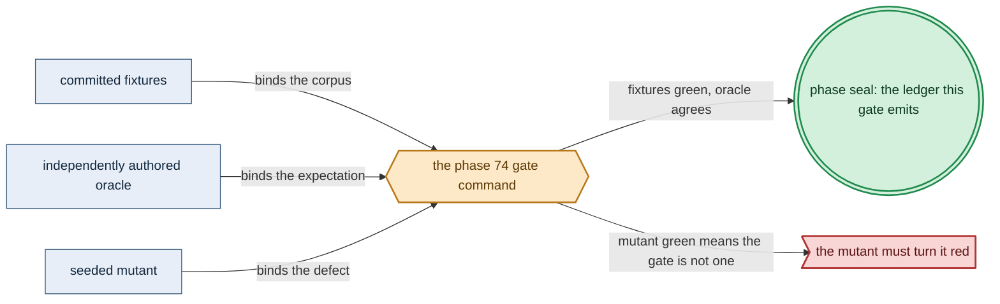

# Phase 74: Multi-cluster spawn + geo-replication

> **Purpose**: Turn the single-cluster control plane into a recursive forest — a parent spawns two children,
> hands each only its own `project(subtree)`, and geo-replicates a `command → event* → result` workflow between
> the siblings — establishing the asynchronous cross-cluster boundary (and its invariant-confluence classifier)
> over which [Phase 75](phase_75_gateway_migration_drills.md) drives the gateway-migration runtime.
> **Read this if**: phase 74 is next in the queue, or a later phase depends on what its gate establishes.

Phase 74 delivers the multi-cluster spawn + geo-replication; its design is owned by [cluster_lifecycle_doctrine.md](../documents/engineering/cluster_lifecycle_doctrine.md), [pulumi_iac_doctrine.md](../documents/engineering/pulumi_iac_doctrine.md), [vault_pki_doctrine.md](../documents/engineering/vault_pki_doctrine.md), and the plan for reaching it is owned here.
Register 3, live, on the `linux-cpu` substrate.
Validated 2026-08-11 with `python3 tools/multicluster_spawn_georepl_gate.py --reuse-fresh-live`;
ledger `external-run-reference`.
Every hardware substrate can always run `linux-cpu`.

> **Historical result (invalidated).** Any pass, seal, validation, ledger, receipt, or implementation observation
> in the orientation text above is diagnostic only. The Phase Status section and [tracker](README.md) own current state; the
> target contract below remains normative.

<details>
<summary>Link-graph metadata</summary>

**Status**: Authoritative source
**Supersedes**: N/A
**Referenced by**: DEVELOPMENT_PLAN/README.md, DEVELOPMENT_PLAN/overview.md, DEVELOPMENT_PLAN/phase_73_network_fabric_wireguard.md, DEVELOPMENT_PLAN/phase_75_gateway_migration_drills.md, DEVELOPMENT_PLAN/phase_76_provider_deploy_checkpoint.md, DEVELOPMENT_PLAN/system_components.md
**Generated sections**: none

</details>

## Contents
- [Phase Status](#phase-status)
- [Phase Summary](#phase-summary)
- [Gate integrity](#gate-integrity)
- [Doctrine adopted](#doctrine-adopted)
- [Sprints](#sprints)
- [Sprint 74.1: Amoebic spawn — `project(subtree)` handoff + per-child unseal / Transit key / secret injection ⏸️](#sprint-741-amoebic-spawn--projectsubtree-handoff--per-child-unseal--transit-key--secret-injection-)
- [Sprint 74.2: Geo-replication of two siblings + invariant-confluence classification ⏸️](#sprint-742-geo-replication-of-two-siblings--invariant-confluence-classification-)
- [Documentation Requirements](#documentation-requirements)
- [Related Documents](#related-documents)

---

## Phase Status

⏸️ Blocked pending Phase-73 revalidation. Reopened 2026-08-19 by the generative re-baseline: the artifact, budget, lift, workflow and evidence calculi change what this phase's gate must cover, so any earlier seal is history and no longer presents completion evidence.

**Pre-natural-architecture status record (invalidated where it claims completion):**

Blocked (superseded) — containment amendment recorded 2026-08-15. Any earlier capability seal is historical and
invalidated until this phase reruns in numerical order with all amoebius-owned state confined to the
repository roots defined by Phase 0. Scope amendments below remain normative.

**Pre-containment status record (invalidated where it claims completion):**

Blocked (superseded) by the reopened numeric sequence. Reopened 2026-08-11: the prior seal did not include the universal artifact-hygiene
postcondition. This phase returns to numeric order only after Phase 0 closes, then must rerun its capability
gate against its source snapshot and publish repository-local evidence without changing an authored path.

**Invalidated historical record:**

Done (invalidated). The Register-3 gate created a parent and two real child `kind` clusters with bounded Pulumi Jobs
running inside the parent. It validated opaque subtree projection, grandchild composition, distinct Transit
keys, named-secret injection, exact forest/checkpoint demand, a zero-mutation second pass, the independent
invariant-confluence table, native Pulsar/MinIO/Patroni workflow readback, and exact stack/cluster cleanup.
All three committed mutants went red at their pinned loci. There is **no**
First-Axis / control-plane-election work here: single-instance of the control-plane daemon is a Deployment
`replicas=1` delegated to k8s/etcd. The cross-cluster gateway-migration obligation amoebius owns is discharged
in [Phase 75](phase_75_gateway_migration_drills.md); this phase stands up the geo-replicated forest that
obligation runs over.

The evidence boundary is explicit: the two child clusters are real, while the native-protocol data plane is
the retained HA Phase-55 platform. A physically independent Pulsar broker set and a Vault server inside each
child remain UNVERIFIED, as do provider-managed and rke2 children. Those statements are not inferred from the
validated projection and classifier.

The design prerequisite is already sealed: [Phase 17](phase_17_gateway_migration_model.md) validated the shared
`GatewayMigration` value with TLC/explorer/IOSimPOR at Register 1. This phase does not reopen that design proof;
Phase 75 still owns correspondence to the live forest and remains UNVERIFIED until its Register-3 gate.

## Phase Summary

This phase crosses the line the chaos/failover doctrine calls the **Second Axis**: the moment a parent spawns a
child and the two geo-replicate, the system stops being one strongly-consistent cluster and becomes a forest
with an **asynchronous** boundary between its clusters. It does two things and stops there. First, **amoebic spawn** — a parent provisions two child `kind` clusters via SSH-key Pulumi run from inside the parent against
a Vault-enveloped MinIO backend and hands each child exactly its own subtree:
the value a child receives is, by construction, `project(subtree)` — a typed `ChildInForceSpec` in which no
sibling or ancestor-only branch can appear — with the child's Vault unsealing in one of two sanctioned modes,
its subtree enveloped under a per-child Transit key, and named secrets injected directly into the child's Vault.
Second, **geo-replication** — the two siblings replicate a `command → event* → result` workflow over
native-protocol Pulsar, write-once content-addressed MinIO blobs, and Patroni Postgres; the bulk of that data
plane is **confluent by construction** and crosses freely, and every crossing mutable multi-record invariant is
sorted by the invariant-confluence classifier — into *confluent* (crosses freely) or *non-confluent* (held by
bounded authority) — before a mechanism is chosen, an unclassified invariant defaulting to non-confluent. The
classifier's output — in particular, that the gateway authority and any CAS "latest" pointer land in the
non-confluent bucket — is precisely the boundary hand-off the [Phase 75](phase_75_gateway_migration_drills.md)
gateway-migration runtime consumes.

The Pulumi path is the `ChildCluster.EnsurePresent` specialization of the canonical conditional
infrastructure pipeline, not a second forest-specific mutation protocol. After child bind/expansion,
`planInfrastructure` derives each child demand from its exact `BoundDeployment` plus disjoint
`ForestMember ClusterBudget`. The required arm is one `ProvisionedInfrastructurePlan`; its single
`ProvisionedProviderActionBatch` owns every child action, the one Pulumi graph, checkpoints, dependencies,
bounded concurrency, and quota partition. Forest-named values below are opaque projections/refinements of
that plan, batch, validated actions, and their canonical tokens—never parallel authorities. The Pulumi path
is provisioned under the canonical
[`resource_capacity_types.md §3.1`](../documents/engineering/resource_capacity_types.md#31-the-systematic-provision-matrix)
matrix and [`§4`](../documents/engineering/resource_capacity_doctrine.md#4-the-total-fold-fits-carve-place-and-the-nesting)
sealed boundary, not treated as free control-plane work. The
two child stacks produce exact `PulumiCheckpointObjectDemand` values whose state-entry/field and revision
identities, storage budgets, failure/orphan exposure, and exclusive mutation admissions enter the parent's
MinIO capacity fold. Their independent deploy graph produces one bounded `PulumiExecutionDemand`; its
executor-Job CPU, memory, pod-ephemeral, image, log, writable-root, mapped-input, plugin-cache, and workspace
peaks must fit the parent — including parallel, retry, rollout, and terminating overlap — before either SSH or
checkpoint effect is possible. The batch is snapshot-validated and CAS-consumed once; only its
receipt-bound child-cluster readbacks construct `ObservedInfrastructureMaterialization`, each child's
`ProvisionContext`, and then its opaque `ProvisionedSpec` for `renderAll`.
The first absent→present spawn takes `InfrastructureRequired`. A converged rerun may take
`NoInfrastructureRequired` only with the explicit already-materialized child state and performs no child,
checkpoint, or executor mutation.

This phase consumes earlier phases and does not re-implement them: Phase 55's `pb` bootstrap of a `kind`
cluster, Phase 61's root Vault/PKI trust anchor, Phases 41–42's platform services (MinIO, Pulsar, Patroni Postgres),
Phase 65's live DSL deploy via the `replicas=1` control-plane daemon, Phase 67's native Pulsar client, and Phase 69's
content-addressed store + workflow runtime. A **stretched cluster is not geo-replication**: one etcd, one
boundary, one `Topology` whose nodes merely span network `Site`s owes no R9 budget and no Second-Axis obligation
and is out of scope here.

The pure `Rke2ServerNode`/`Rke2AgentNode` and reserve/template folds exist in Phases 11–16, but no live
multi-node rke2 acceptance gate is assigned. This phase does not silently supply one: its only child-engine
fixture is `kind`, and the rke2 mutation continuation remains unavailable until a future Phase-N host-
admission/join/enforcement gate is promoted.

**Phase scope:** one cohesive claim — *a parent hands each child only its own subtree, and the boundary between them is asynchronous*. The confluence classifier is what makes that boundary reasoned about rather than assumed.

**Substrate:** linux-cpu — the gate spins up the parent and both child clusters as `kind` clusters on a
single linux-cpu host; no accelerator and no provider cluster is in scope (provider-managed clusters are
[Phase 76](phase_76_provider_deploy_checkpoint.md)). Before either child is created, the parent-owned
`SharedSupplyLedger` carves disjoint cluster-engine/VM and named physical-backing budgets from that one host;
each child then derives its logical pod-ephemeral demand and routes pod/image/content/snapshot/workspace bytes
through its closed kubelet filesystem layout. Independent child `place` proofs cannot reuse the same host
bytes. The parent cluster also places the Pulumi executor Jobs and debits their plugin/workspace volumes and
checkpoint object peaks; proving the child VMs fit does not pay those parent-side resources. Partition
tolerance is exercised at the boundary by the
[Phase 75](phase_75_gateway_migration_drills.md) drills; here the boundary is established and classified.
This CPU-only Linux lane is always available on every hardware substrate.

**Lane:** linux-cpu/amd64 ([§L](development_plan_standards.md#l-one-substrate-discipline))

**Register:** 3 — live infrastructure: a real parent and two real child clusters and a real geo-replicated
workflow crossing an asynchronous boundary.

**Depends on:** [Phase 73](phase_73_network_fabric_wireguard.md) — the WireGuard fabric over which a parent reaches the children it spawns.

**Gate:** `cabal test multicluster-spawn-live` is green: a parent spawns two children, exercises the classified
geo-replicated workflow across the boundary, and tears the forest down leak-free — under the pre-effect
capacity proof, oracles, observers, and mutants of [Gate integrity](#gate-integrity).

Concretely:
- each child's delivered value is `project(subtree)` — discharged as a **committed compile-fail corpus**
  ([Gate integrity](#gate-integrity): `test/negative/compile_fail/ChildInForceSpec/`, ≥ 2 negatives asserting a specific compile-fail locus + a paired positive) plus a runtime subtree-inspection assertion that the
  delivered `ChildInForceSpec` carries no sibling branch
- each child unseals in **both** sanctioned modes and child A's subtree ciphertext fails to decrypt under
  child B's Transit key even with the parent unsealed
- a named `SecretRef` resolves to parent-injected bytes, never a Dhall fragment or env var
- the two siblings round-trip a workflow and a **duplicate or reordered cross-cluster batch produces the identical fold result and identical blob keys** (a committed content-addressed golden,
  [Gate integrity](#gate-integrity))
- the invariant-confluence classifier sorts every crossing mutable invariant against a **committed independent classification table** ([Gate integrity](#gate-integrity)) with an unclassified invariant
  defaulting to non-confluent and active-active wiring on a non-confluent invariant **refused**
- the gate turns red on **at least one committed seeded mutant** ([Gate integrity](#gate-integrity): the `classifier-default-confluent` and `project-identity` mutants)
- teardown is **leak-free by the OS-boundary observer of [Gate integrity](#gate-integrity)** (`pulumi stack ls` and kubeconfig-context enumeration, read outside the forest, report zero surviving child stacks and zero surviving child clusters, retained backing stores exempt)
- and the run emits a **machine-derived honesty ledger** ([Gate integrity](#gate-integrity)) that marks the
  spawn and geo-replication *tested* (drilled) on the linux-cpu runtime — not a proof claim — the projection
  type-safety a successful decode/type result, and every layer outside Register 3 UNVERIFIED.

## Gate integrity

This phase's gate binds to
the following named, committed artifacts so no self-authored harness or post-hoc fixture can pass it:
- **Pre-effect capacity proof.** Before either child exists the parent observes the physical host's residual
  and proves `parent engine carve + child-A carve + child-B carve + non-cluster commitments ≤ host` for CPU,
  memory, VM/node disk, logical pod-ephemeral capacity, and every layout-routed nodefs/imagefs backing. A
  one-byte or one-millicore overdraw in a child, an executor Job, a plugin or workspace volume, or a
  checkpoint budget creates neither child. The private provisioned execution and checkpoint witnesses live
  under the one `ProvisionedInfrastructurePlan.batch` before the first Pulumi, SSH, or object-write effect,
  and the exact rendered Job resources and live MinIO revision objects must read back to that same witness.
- **Compile-fail corpus (independent of the SUT).** `test/negative/compile_fail/ChildInForceSpec/` holds **≥ 2** negative
  fixtures that each attempt to construct a `ChildInForceSpec` carrying a sibling or ancestor-only branch and
  **must fail to typecheck**, each asserting its **specific expected compile-fail locus/message** (the type
  error naming the absent constructor/field), paired with a positive fixture that differs only in projecting the
  child's own subtree and **must** compile — authored and committed in this phase's oracle-pinning sprint before `ChildInForceSpec.hs`
  exists. A grandchild path proves the projection composes to arbitrary depth.
- **Confluence-classification oracle (independent of the SUT).** `test/fixture/inject/confluence/expected_classes.dhall`
  — a committed, hand-authored table classifying every crossing mutable invariant of the gate workflow as
  *confluent* or *non-confluent*, authored in this phase's oracle-pinning sprint. The classifier's output is checked against this table,
  never against its own re-derivation; an invariant absent from the table (unclassified) **must default to non-confluent** and be refused active-active wiring.
- **Idempotent-write golden.** A committed content-addressed golden: replaying a duplicate or reordered
  cross-cluster batch yields the **identical fold result and identical blob keys** (exactly-once for
  replicated-or-recovered effects), authored in this phase's oracle-pinning sprint.
- **Committed seeded mutants (≥ 1 must go red).** From the [§M](development_plan_standards.md#m-gate-integrity-a-gate-cannot-be-passed-by-a-stub) operator set: (a) `classifier-default-confluent` —
  the unclassified default flipped from non-confluent to confluent (union-arm addition / guard weakening); the
  committed unclassified fixture is then wrongly admitted for active-active wiring and the classification oracle
  must go red. (b) `project-identity` — the `project(subtree)` projection weakened toward identity so a child's
  delivered `ChildInForceSpec` carries a sibling branch (dropped-guard); the runtime subtree-inspection
  assertion must go red. (c) `drop-parallel-executor` — the capacity peak drops one of two
  simultaneously runnable Pulumi executor Jobs (or admits parallel demand and serializes it afterward); a
  parent that fits one executor but not both is wrongly admitted, and the pre-effect provision oracle must go
  red. All mutants are committed under `test/mutant/gateway_migration_drills/` and re-run every gate, not hand-run once.
- **External-observer teardown check.** "Tears down leak-free" is scoped for Phase 74 (the flagged-credential +
  postflight tag-sweep machinery of testing_doctrine [§6](../documents/engineering/testing_doctrine.md#6-flagged-test-credentials)–[§7](../documents/engineering/testing_doctrine.md#7-the-elevated-harness-is-the-sole-automated-deleter-of-test-owned-durable-storage-leak-free-cycles) is Phase 48) to: after teardown, an **OS-boundary observer** — `pulumi stack ls` and kubeconfig-context enumeration, read outside the forest — reports zero
  surviving child stacks and zero surviving child clusters, while the retained backing stores the gate
  deliberately preserves are explicitly exempt (named in the fixture as the retained set).
- **Machine-derived ledger + validator.** The ledger is generated from the run record (spawn stack IDs, the
  delivered-subtree inspection result, the emitted confluence classes, the idempotent-write golden result, the
  executor-Job and checkpoint-object readback, the teardown-observer result, drill seeds, timestamps), and a
  committed validator cross-checks every ledger figure
  against the raw run record and the OS-boundary observer, failing the gate on any mismatch or hand-edited
  field.


*Design intent. Phase 74's gate apparatus; [§M](development_plan_standards.md#m-gate-integrity-a-gate-cannot-be-passed-by-a-stub) owns its clauses.*
- **Extension conformance (§M.13).** Not applicable: this gate delivers no extension.

## Doctrine adopted

- [`workflow_calculus_doctrine.md`](../documents/engineering/workflow_calculus_doctrine.md) — multi-cluster spawn + geo-replication provisions, and a teardown obligation it cannot discharge is a value it cannot construct.
- [`cluster_lifecycle_doctrine.md §3`](../documents/engineering/cluster_lifecycle_doctrine.md#3-amoebic-spawning--the-recursive-forest)
  and [`§9`](../documents/engineering/cluster_lifecycle_doctrine.md#9-how-bring-up-and-teardown-are-implemented-the-reconciler-not-a-state-machine)
  — the `project(subtree)` handoff of amoebic spawning, enacted as `discover → diff → enact → re-observe`
  reconciles over a managed-resource registry (never a bespoke lifecycle state machine), so the leak-free child
  teardown of this phase's gate is one `reconcileAbsent` loop with "cannot observe" never collapsed to "absent."
  The teardown-with-cleanup-vs-chaos distinction ([§5](../documents/engineering/cluster_lifecycle_doctrine.md#5-teardown-with-cleanup-vs-chaos-failover-the-central-distinction)) and the unsatisfiable-`.dhall` push-back ([§6](../documents/engineering/cluster_lifecycle_doctrine.md#6-push-back-when-teardown-would-break-the-root-inforcespec)) belong to the
  gateway-migration drills of [Phase 75](phase_75_gateway_migration_drills.md).
- [`pulumi_iac_doctrine.md §1`](../documents/engineering/pulumi_iac_doctrine.md#1-pulumi-runs-only-from-inside-an-existing-amoebius-cluster),
  [`§2`](../documents/engineering/pulumi_iac_doctrine.md#2-the-backend-every-byte-of-state-is-a-vault-enveloped-object-in-minio), and
  [`§7`](../documents/engineering/pulumi_iac_doctrine.md#7-applicative-parallelism-for-independent-deploys)
  — the in-cluster-only engine, exact Vault-enveloped checkpoint objects, and finite applicative fan-out:
  checkpoint state fields/revisions and failed-partial/orphan extents consume an attached `StorageBudgetId`
  through the sole mutation gateway, while the parent places complete executor-Job envelopes and typed
  plugin/workspace peaks before either independent child deploy may mutate.
- [`vault_pki_doctrine.md §6`](../documents/engineering/vault_pki_doctrine.md#6-parentchild-unseal-two-sanctioned-modes)
  and [`§7`](../documents/engineering/vault_pki_doctrine.md#7-parent-injects-secrets-into-the-childs-vault)
  — the recursive parent/child spawn unseal (self-unseal from a k8s secret, or parent-held unlock with the brick
  cascading down a sealed subtree), the per-child Transit key (`transit/amoebius-<child-id>-config`) that makes a
  sibling's subtree cryptographically undecryptable even under an unsealed parent, and the
  parent-injects-named-secrets path (Dhall names only; the parent materializes the bytes).
- [`content_addressing_doctrine.md §5`](../documents/engineering/content_addressing_doctrine.md#5-confluence-content-addressed-data-crosses-cluster-boundaries-safely)
  — the confluent data plane: content-addressed write-once blobs (identical content ⇒ identical key ⇒ idempotent
  cross-cluster write) and the work-id-keyed Pulsar fold land in bucket (i) and cross freely, leaving only the
  gateway authority and any CAS "latest" pointer in bucket (ii) for the [Phase 75](phase_75_gateway_migration_drills.md) migration runtime.
- [`chaos_failover_second_axis.md §16`](../documents/engineering/chaos_failover_second_axis.md#16-the-second-axis--when-one-cluster-becomes-a-forest)
  and [`§17`](../documents/engineering/chaos_failover_second_axis.md#17-the-boundary-and-its-classifier)
  — the Second Axis (one cluster becomes a forest) and the invariant-confluence classifier (R1/[§17](../documents/engineering/chaos_failover_second_axis.md#17-the-boundary-and-its-classifier)) that sorts
  every crossing mutable invariant into confluent (crosses freely) or non-confluent (held by bounded authority),
  the unclassified default = non-confluent — with the
  [proven/tested/assumed ledger (§12)](../documents/engineering/chaos_failover_doctrine.md#12-the-moral-core--proven-tested-assumed) kept
  honest. The R7/R8/R9 boundary rules and the [§19](../documents/engineering/chaos_failover_second_axis.md#19-the-cross-boundary-ledger-and-conformance-rows) cross-boundary ledger are consumed by [Phase 75](phase_75_gateway_migration_drills.md).
- [`testing_doctrine.md §3`](../documents/engineering/testing_doctrine.md#3-the-test-topology-contract-spin-up--run--always-tear-down)
  (the test-as-`InForceSpec` spin-up → run → always-tear-down contract) and
  [`testing_doctrine.md §4`](../documents/engineering/testing_doctrine.md#4-no-skips-fail-fast-and-the-per-run-ledger-artifact)
  (the per-run proven/tested/assumed ledger): the register this gate reaches and the ledger it emits.

## Sprints

> **Current revalidation rule.** Every sprint is blocked by the reopened numeric sequence. Historical dates,
> pass/seal claims, repository-resident evidence paths, and `Remaining Work: None` statements below describe
> the pre-amendment capability record only; they do not override current status. Functional and validation
> outcomes remain target requirements. Any instruction to commit generated output, freeze dependency resolution,
> retain a resolved version, path, or integrity hash, or consume repository-resident evidence, ledgers, or
> enumerations is superseded by the current generated-artifact and dynamic-resolution doctrine. Closure requires
> the current phase gate plus universal artifact hygiene.

## Sprint 74.1: Amoebic spawn — `project(subtree)` handoff + per-child unseal / Transit key / secret injection ⏸️

**Status**: Blocked by the reopened numeric sequence; prior capability footprint retained for migration
**Implementation**: `src/Amoebius/Multicluster/Spawn.hs`,
`src/Amoebius/Dsl/ChildInForceSpec.hs`, `src/Amoebius/Pulumi/Engine.hs`,
`src/Amoebius/Pulumi/Backend/EncryptedMinio.hs`, `pulumi/child-cluster/Pulumi.yaml`,
`src/Amoebius/Multicluster/ChildUnseal.hs`, `src/Amoebius/Vault/TransitChildKey.hs`,
`src/Amoebius/Multicluster/SecretInjection.hs` — delivered and gate-covered.
**Blocked by**: reopened numeric predecessor gates.
**Independent Validation**: the read-only supply, checkpoint, and executor prefix is provisioned before any
child, Pulumi, or object-write effect exists, and every claim is read back from an external runtime observer
rather than from the spawn itself; the numbered Validation list below carries the fixtures, the error tags,
and the mutant.
**Docs to update**:
`documents/engineering/cluster_lifecycle_doctrine.md`, `documents/engineering/vault_pki_doctrine.md`,
`documents/engineering/pulumi_iac_doctrine.md`.

### Objective

Adopt [`cluster_lifecycle_doctrine.md §3`](../documents/engineering/cluster_lifecycle_doctrine.md#3-amoebic-spawning--the-recursive-forest)/[`§9`](../documents/engineering/cluster_lifecycle_doctrine.md#9-how-bring-up-and-teardown-are-implemented-the-reconciler-not-a-state-machine)
and [`vault_pki_doctrine.md §6`](../documents/engineering/vault_pki_doctrine.md#6-parentchild-unseal-two-sanctioned-modes)/[`§7`](../documents/engineering/vault_pki_doctrine.md#7-parent-injects-secrets-into-the-childs-vault):
implement the spawn as a Pulumi deploy run from inside an existing cluster, tracked in a Vault-enveloped MinIO
backend, delivering the structural `project(subtree)` projection so a child receives exactly its own subtree
and nothing about siblings, with per-child unseal, a per-child Transit key, parent→child secret injection, and a
managed-resource registry entry so teardown is a reconcile, not a state machine.

### Deliverables

- A parent-owned `SharedSupplyLedger` keyed by `HostId`/`BackingId` and the pre-spawn
  `observeSharedSupply → allocateForestSupply → planInfrastructure → validateForestSpawn` boundary that
  subtracts non-cluster
  commitments, carves disjoint parent/child engine/VM and named physical-backing budgets, proves each child's
  logical pod-ephemeral allocation, closed nodefs/imagefs/containerfs layout, OCI content/snapshot/import
  workspace, and routed backing peaks, and
  returns one opaque `ValidatedForestSpawn` refinement of the canonical `ValidatedInfrastructurePlan`, bound
  to the complete host/backing/process fingerprint. It does not mint a forest token: the canonical fresh
  infrastructure-plan token and per-action SSH-host tokens are the only authorities. The fingerprint is re-read
  immediately before the first Pulumi/child mutation; change invalidates those tokens and exposes no
  child-create continuation.

  ```text
  BoundChildInfrastructureFromForestBudget = -- opaque ChildCluster request specialization
    { request        : ProvisionedChildClusterRequest
    , forestMember   : request.budget.cluster == request.cluster
    , budgetEquality :
        ChildTopologyBoundIntentAccountBackingDeviceBudgetEqualityWitness request
    }
  -- request contains only cluster/budget/topology/BoundDeployment plus Required post-materialization seal.
  -- It cannot contain ProvisionContext or ProvisionedSpec.

  ChildScopedSshHostMaterialization = -- opaque projection of canonical providerResults; no cloud inventory
    { state           : MaterializedInfrastructureState
    , host            : HostId
    , child           : ClusterId
    , action          : InfrastructureProviderActionId
    , childIndex      : state.childClusters[child] == action
    , resultArm       :
        MaterializedProviderResultIsExactSshHostChildClusterPresentWitness state action host child
    , sourceEquality  :
        SshHostChildActionResultMaterializationIdentityEqualityWitness
    }

  ForestChildInfrastructureMaterialization = -- opaque exact child projection
    { forest         : ObservedInfrastructureMaterialization
    , child          : ClusterId
    , providerState  : ChildScopedSshHostMaterialization
    , exactProjection:
        ForestReceiptSshHostChildActionResultProjectionWitness
    }

  MaterializedChildFromForestBudget =
    { source          : BoundChildInfrastructureFromForestBudget
    , infrastructure  : ForestChildInfrastructureMaterialization
    , context         : ProvisionContext -- exact ForestMember budget + observed infrastructure
    , provisioned     : ProvisionedSpec
    , sourceEquality  :
        ChildBoundIntentBudgetMaterializationContextProvisionSealEqualityWitness
    }

  ForestChildSshHostActionProjection = -- opaque projection; never owns an action or executor graph
    { child          : BoundChildInfrastructureFromForestBudget
    , action         : ProvisionedSshHostProviderAction
    , operationArm   :
        SshHostActionIsCreateOfExactChildRequestAndHostIdentityWitness
    , sourceEquality :
        ForestChildRequestSshHostActionDeployCheckpointDigestBudgetEqualityWitness
    }

  ForestInfrastructurePlan = -- opaque ChildCluster-only refinement; no public constructor
    { canonical       : ProvisionedInfrastructurePlan
    , allocation      : ForestSupplyAllocationDigest
    , ledger          : SharedSupplyLedgerId
    , budgets         : Map ClusterId ClusterBudget
    , children        : NonEmptyMap ClusterId ForestChildSshHostActionProjection
    , actionDomain    :
        ForestChildrenExactlyEqualCanonicalBatchActionDomainWitness
    , operationDomain :
        EveryCanonicalBatchActionIsSshHostChildClusterCreateWitness
    , disjointness    : ClusterBudgetDisjointnessWitness
    , sourceEquality  :
        ForestAllocationBudgetChildCanonicalInfrastructurePlanEqualityWitness
    }
  -- canonical.batch is the sole ProvisionedProviderActionBatch. It alone owns actions, execution,
  -- checkpoints, dependencies, BoundedParallel 2 admission, and quota partition.

  ForestPulumiBoundedConcurrencyProjection = -- read-only projection of canonical batch admission
    { deploy         : PulumiDeployId
    , slot           : Natural
    , ceiling        : PositiveNatural -- exactly 2 for this gate
    , sourceEquality :
        ForestDeploySlotEqualsCanonicalBatchBoundedParallelAdmissionWitness
    }

  ForestChildPulumiDeployProjection = -- private read-only view of canonical.batch
    { child          : ForestChildSshHostActionProjection
    , deploy         : child.action.deploy
    , executorPod    : PodResourceEnvelope
    , dependencies   : Set PulumiDeployId
    , plugins        : NonEmptyMap PulumiPluginId PulumiPluginDemand
    , cache          : ProvisionedCacheDemand InClusterCacheOwner
    , checkpoint     : ProvisionedPulumiCheckpointObjectDemand
    , checkpointEquality :
        ForestDeployActionStackEqualsBatchDeployCheckpointAndDemandStackWitness
    , concurrency    : ForestPulumiBoundedConcurrencyProjection
    , sourceEquality :
        ForestChildActionExactBatchExecutionPluginCacheCheckpointConcurrencyProjectionWitness
    }

  ForestPulumiExecutionProjection = -- compatibility view, explicitly not an owner
    { plan           : ForestInfrastructurePlan
    , childDeploys   : NonEmptyMap ClusterId ForestChildPulumiDeployProjection
    , boundedTwo     :
        plan.canonical.batch.execution.source.concurrency == BoundedParallel 2
    , sourceEquality :
        ForestChildDeployDomainEqualsCanonicalBatchActionDeployDomainWitness
    }

  -- There is deliberately no ForestExecutionToken. The only plan token is
  -- SingleUseInfrastructurePlanToken and the only action tokens are SingleUseSshHostMutationToken values
  -- inside the canonical ValidatedInfrastructurePlan.

  ValidatedForestSpawn = -- opaque refinement/projection, not a parallel mutation authority
    { plan             : ForestInfrastructurePlan
    , canonical        : ValidatedInfrastructurePlan
    , children         : NonEmptyMap ClusterId ValidatedSshHostProviderAction
    , childDomain      :
        ForestValidatedChildrenExactlyEqualCanonicalValidatedBatchActionDomainWitness
    , childArms        : EveryValidatedForestActionIsExactSshHostChildClusterProjectionWitness
    , observedShared   : SharedSupplySnapshotFingerprint
    , sharedSupplyFit  : ForestAllocationFreshObservedSharedSupplyFitWitness
    , canonicalEquality:
        ForestPlanBatchActionsSnapshotEqualsValidatedInfrastructurePlanBatchWitness
    , sourceEquality   :
        ForestBudgetChildCanonicalFreshPlanAndActionTokenSnapshotEqualityWitness
    }
  -- children is an exact small projection of canonical.validatedBatch.actions; each value carries only the
  -- canonical batch id, never the batch's Pulumi execution/checkpoint graph.

  AdmittedForestChildMutation = -- private exact projection of one canonical validated action
    { action            : ValidatedSshHostProviderAction
    , childArm          : action.action.operation == Create
    , deployProjection  : ForestChildPulumiDeployProjection
    , checkpointGateway :
        ProvisionedObjectStoreAdmissionGateway -- projection of canonical batch checkpoint
    , tokenProjection   : action.singleUse == SingleUseSshHostMutationToken Fresh
    , equality          :
        ForestChildValidatedSshActionBatchDeployCheckpointGatewayTokenEqualityWitness
    }

  ManagedResourceRegistryEntryId =
    { parentDeployment : DeploymentId
    , child            : ClusterId
    , generation       : ProvisionGenerationDigest
    , action           : InfrastructureProviderActionId
    }

  ManagedChildResource =
    { child              : MaterializedChildFromForestBudget
    , deploy             : PulumiDeployId
    , stack              : PulumiStackId
    , checkpointDigest   : ContentAddress
    , provisionedDigest  : ProvisionGenerationDigest
    , managedRegistryRef : ManagedResourceRegistryEntryId
    , sourceEquality     : ManagedChildResultSourceEqualityWitness
    }

  ForestSpawnValidationError =
    < CanonicalInfrastructurePlanInvalid : ProvisionError
    | ForestSharedSupplySnapshotMismatch
    | ForestSshHostSnapshotMismatch
    | ForestChildActionDomainMismatch
    | ForestBudgetDisjointnessMismatch
    >

  validateForestSpawn
    :: ObservedSharedSupplySnapshot
    -> ObservedSshHostInfrastructureSnapshot
    -> ForestInfrastructurePlan
    -> Either ForestSpawnValidationError ValidatedForestSpawn
  -- validateForestSpawn wraps the SSH snapshot in the generic non-empty
  -- ObservedInfrastructureProviderSnapshot with cloud = None, then refines validateInfrastructurePlan; it
  -- cannot mint another token family.

  ForestPreEnactmentError =
    < CanonicalInfrastructurePreEnactmentError : InfrastructurePreEnactmentError
    | SharedSupplySnapshotChanged
    >

  ForestSpawnResult =
    < Materialized :
        { infrastructure : InfrastructureEnactmentResult.Materialized
        , children       : NonEmptyMap ClusterId ManagedChildResource
        , sourceEquality :
            ForestReceiptMaterializationContextProvisionedChildrenEqualityWitness
        }
    | OutcomeUnknown : InfrastructureEnactmentResult.OutcomeUnknown
    >

  spawnForest
    :: ValidatedForestSpawn
    -> Either ForestPreEnactmentError ForestSpawnResult
  -- The Materialized arm's enactment receipt contains the Consumed infrastructure-plan token plus every
  -- Consumed SSH-host action token. OutcomeUnknown exposes only re-observation and cannot return children.
  -- No forest-specific consumed token exists.

  ChildSpawnError =
    < ChildSnapshotChangedBeforeTokenCas
    | ChildActionTokenAlreadyConsumed
    | ChildSshHostCapabilityUnavailable
    | ChildCheckpointAdmissionUnavailable
    >

  ChildSpawnWorkerResult =
    < Materialized :
        { actionToken  : SingleUseSshHostMutationToken Consumed
        , deploy       : PulumiDeployId
        , checkpoint   : InfrastructureDeployOutcome.Completed
        , child        : ObservedSshHostChildClusterMaterialization
        , sourceEquality:
            ChildConsumedActionDeployCompletedCheckpointMaterializationEqualityWitness
        }
    | OutcomeUnknown :
        { actionToken : SingleUseSshHostMutationToken Consumed
        , deploy       : PulumiDeployId
        , checkpoint   : InfrastructureDeployOutcome.OutcomeUnknown
        , reobserve    :
            RequireFreshWholeProviderCheckpointAndParentInventoryObservation
        , noReplay     : Required
        , sourceEquality:
            ChildConsumedActionDeployCheckpointUnknownOutcomeEqualityWitness
        }
    >

  spawnChild -- private worker called only by the canonical batch's bounded executor
    :: AdmittedForestChildMutation
    -> Either ChildSpawnError ChildSpawnWorkerResult
  -- ChildSpawnError is pre-action-token CAS and proves zero child/checkpoint effects. Once the canonical
  -- action token is consumed, both worker arms return that Consumed token and the exact completed/unknown
  -- deploy-checkpoint outcome. The canonical batch enactor aggregates them with the consumed plan and
  -- other-action tokens into the outer InfrastructureEnactmentReceipt; any unknown member selects
  -- InfrastructureEnactmentResult.OutcomeUnknown. The worker cannot return Left or a replayable action after
  -- CAS.
  ```

  Checked construction proves every returned budget-map key equals its embedded `ClusterBudget.cluster` and
  every pre-infrastructure child request carries that exact `ForestMember` budget. The forest plan is an
  opaque `ChildCluster.Create`-only refinement of the canonical `ProvisionedInfrastructurePlan`; its child,
  action, deploy, and checkpoint domains equal the sole `ProvisionedProviderActionBatch` domains. Each child
  view is only a projection of that batch's executor pod, dependencies, plugins, cache, checkpoint, and
  `BoundedParallel 2` admission—never a copied full graph or a new action authority. `spawnForest` consumes the
  canonical plan/action tokens through the canonical batch enactor; its private worker receives one exact
  `ValidatedSshHostProviderAction` projection. The checkpoint gateway is projected from the batch checkpoint
  carrier, never duplicated. Only receipt-bound observed action results construct each matching
  `ProvisionContext`, after which `provision` seals the child `ProvisionedSpec`. A replay or sibling
  substitution fails the canonical token, action-domain, and source-equality witnesses; there is no
  forest-specific token to bypass them.
- One `PulumiCheckpointObjectDemand` per child stack: an attached `StorageBudgetId`; exact
  `PulumiResourceStateId` entries and `(PulumiStateFieldPath, maxCanonicalBytes, Plain | Secret)` fields;
  finite retained revisions; serial update; a finite failed-write/orphan-GC budget; pinned checkpoint model;
  and exclusive `ObjectStoreMutationAdmission`. The pure object-store fold derives canonical/envelope bytes,
  current/old/new overlap, revision identities, and failed-partial/orphan extents into a private peak before
  Vault unwrap, MinIO PUT/CAS, SSH, or child creation. Only the admitted mutation gateway can write these
  identities; its concurrency/rate model supplies a complete placed proxy `PodResourceEnvelope`, and direct
  S3 mutation credentials/routes are absent.
- One parent-side `PulumiExecutionDemand` whose deploy graph marks the two child stacks independent and uses
  an explicit `BoundedParallel 2` ceiling. It joins every plugin identity to content digest,
  installed bytes, and peak-install bytes; names disk-backed plugin-cache and workspace volumes; and derives
  complete executor-Job `PodResourceEnvelope`s (image, CPU/memory requests and limits, pod-ephemeral request/
  limit, logs, writable root, mapped inputs, retry, rollout, and termination overlap). Only the private
  `ProvisionedPulumiExecutionDemand { source, executorPods, deployGraph, pluginObjects,
  pluginVolume : ProvisionedPulumiExecutionVolume PluginVolume,
  workspaceVolume : ProvisionedPulumiExecutionVolume WorkspaceVolume, caches, sourceEquality, witness }`
  placed under the sole `ProvisionedInfrastructurePlan.batch` exposes the deploy continuation after canonical
  validation. Its typed volume carriers derive provisioned raw debits from required-usable peaks before
  either fresh raw/usable fit. The
  batch owns that value once and gives each child action only its exact private deploy projection. The
  parent's `BoundDeployment` carries only the unprovisioned `PulumiExecutionDemand`; it cannot carry or expose
  a `Provisioned*` projection, and a parent `ProvisionedSpec` is not a second owner of the initial-infrastructure
  graph.
- A `ChildInForceSpec` type that is, by construction, the projection of a parent spec onto one subtree — no
  field admits a sibling or ancestor-only branch, and a grandchild path proves the projection composes to
  arbitrary depth.
- A `spawnChild` action: SSH-key `kind` Pulumi deploy from inside the parent, registered as a typed
  managed resource carrying its own `discover`/`destroy`, so a re-run is a no-op and a teardown is one
  `reconcileAbsent` loop.
- A `SealMode` (`SelfUnseal` | `ParentHeldUnlock`) decoded from the child `.dhall`, per-child Transit key
  provisioning with a decrypt-on-that-key-alone policy, and an `injectSecret` action materializing named
  secrets into the child's Vault (in-cluster consumers read via Vault k8s auth).

### Validation

1. The committed shared-host-overdraw fixture exceeds the one host's image/disk budget by one byte; it returns
   `SharedSupplyOvercommit`, exposes no child-create continuation, and the external runtime/cloud audit contains
   zero child mutations and zero checkpoint PUTs. Its paired fitting parent+two-child carve returns three
   owner-distinct budgets.
   A changed-snapshot fixture consumes host/disk headroom after validation and before Pulumi; the immediate
   token recheck refuses with zero Pulumi calls, child containers, or backing allocations.
2. Paired one-short fixtures remove only one executor/admission-gateway millicore, one byte of executor/gateway
   memory/pod-ephemeral, plugin-cache, workspace, or checkpoint `StorageBudget`; each returns the
   dimension-specific provision error — `PulumiExecutionOvercommit` on the executor, plugin, and workspace
   dimensions — before a Job, checkpoint write, SSH call, or child create. In the fitting case, Kubernetes API readback of
   both rendered executor Jobs exactly matches the witnessed image, requests/limits, ephemeral/log/writable
   allowances, volumes, and `BoundedParallel 2` live set; MinIO `LIST`/`HEAD` plus gateway admission records
   match the exact stack/revision object identities and extents. Injecting a failed checkpoint CAS retains the
   bounded partial/orphan object until the declared GC horizon and keeps it charged. A direct checkpoint PUT
   outside the gateway is denied.
3. The committed `drop-parallel-executor` mutant charges only one of the two simultaneously runnable
   executor Jobs (or serializes after admitting the parallel declaration) and MUST go red against a parent
   fixture that fits either Job alone but not both. This proves applicative parallelism is represented in the
   resource peak, not merely exercised opportunistically after admission.
4. A parent brings up two empty child `kind` clusters on linux-cpu; re-running the spawn is a no-op (observed at
   the OS boundary via `pulumi stack ls`); the "no total function producing a `ChildInForceSpec` containing a
   sibling's branch" claim is discharged as a **committed compile-fail corpus** (not a
   code-review/parametricity argument): `test/negative/compile_fail/ChildInForceSpec/` ([Gate integrity](#gate-integrity)) holds ≥ 2 negative fixtures
   that each attempt to construct a `ChildInForceSpec` carrying a sibling or ancestor-only branch and **must fail to typecheck**, each asserting its **specific expected compile-fail locus/message** (the type error
   naming the absent constructor/field), paired with a positive fixture that differs only in projecting the
   child's own subtree and **must** compile — authored and committed in this phase's oracle-pinning sprint before `ChildInForceSpec.hs`
   exists; the committed `project-identity` mutant ([Gate integrity](#gate-integrity)) makes a sibling branch appear in a child's delivered
   spec and the runtime subtree-inspection assertion goes red; mode (b) bricks with the parent sealed and
   unseals with it available; cross-child Transit decrypt fails; a graceful child teardown leaves zero surviving
   stacks by the OS-boundary observer, retained backing stores exempt.
5. The read-only prefix completes before any effect. `allocateForestSupply` reads the observed single host
   together with the parent and both child engine/backing demands, returns three disjoint opaque
   `ClusterBudget`s, and provisions the exact checkpoint object peak for each stack and the bounded-parallel
   Pulumi execution peak for both parent-side executor Jobs, their plugins, and their workspaces; only then
   may the parent spawn a child from inside itself. Each admitted child then comes up empty, reconciles
   toward its spec, unseals in each of the two sanctioned modes, resolves a named `SecretRef` to bytes the
   parent injected rather than to a Dhall fragment or an env var, and — registered as a managed resource
   carrying its own `destroy` — tears down leak-free through one `reconcileAbsent` loop.

### Remaining Work

None inside the sealed `kind`-child boundary. Child-local Vault processes remain explicitly UNVERIFIED.

## Sprint 74.2: Geo-replication of two siblings + invariant-confluence classification ⏸️

**Status**: Blocked by the reopened numeric sequence; prior capability footprint retained for migration
**Implementation**: `src/Amoebius/Multicluster/GeoReplication.hs`,
`src/Amoebius/Multicluster/ConfluenceClass.hs` — delivered and gate-covered.
**Blocked by**: reopened numeric predecessor gates.
**Independent Validation**: two sibling children replicate a `command → event* → result` workflow across the
boundary; the duplicate-write result is checked against the committed content-addressed golden and every
crossing invariant against the committed classification table, never against the classifier's own
re-derivation. The numbered Validation list below carries the cases.
**Docs to update**:
`documents/engineering/chaos_failover_doctrine.md`, `documents/engineering/content_addressing_doctrine.md`.

### Objective

Adopt [`chaos_failover_second_axis.md §16`](../documents/engineering/chaos_failover_second_axis.md#16-the-second-axis--when-one-cluster-becomes-a-forest)/[`§17`](../documents/engineering/chaos_failover_second_axis.md#17-the-boundary-and-its-classifier)
over the confluent data plane of
[`content_addressing_doctrine.md §5`](../documents/engineering/content_addressing_doctrine.md#5-confluence-content-addressed-data-crosses-cluster-boundaries-safely):
wire asynchronous geo-replication between two siblings and run the invariant-confluence test (R1) on every
crossing mutable invariant *before* assigning a mechanism — so content-addressed blobs and the work-id-keyed
Pulsar log cross freely, while the gateway authority and any CAS "latest" pointer are correctly held in bucket
(ii) for the [Phase 75](phase_75_gateway_migration_drills.md) migration runtime.

### Deliverables

- Pulsar geo-replication (native binary protocol, no WebSockets) between two siblings, with the consumer
  decision a **pure fold keyed by a replication-surviving work-id** that absorbs duplication, reordering, and
  late-after-heal arrival (R3 cross-boundary).
- Content-addressed write-once MinIO blob replication (idempotent duplicate cross-cluster write) and Patroni
  Postgres replication for relational state.
- A `ConfluenceClass` value per crossing invariant — confluent (deterministic total merge) vs non-confluent
  (control-plane daemon claim/yield, escrow/reservation, or disjoint-namespace allocation) — with the unclassified default
  = non-confluent, rejecting an "active-active on a non-confluent invariant" wiring.

### Validation

1. A workflow round-trips between the two siblings; replaying a duplicate or reordered batch produces the same
   fold result **and identical blob keys against the committed content-addressed golden ([Gate integrity](#gate-integrity))** (exactly-once for replicated-or-recovered effects); the classifier's output is checked against the **committed independent classification table ([Gate integrity](#gate-integrity))**, not its own re-derivation, an unclassified invariant defaults to non-confluent,
   and the classifier refuses active-active on a non-confluent invariant; the committed
   `classifier-default-confluent` mutant ([Gate integrity](#gate-integrity)) — which flips the unclassified default to confluent — wrongly
   admits the unclassified fixture and the classification oracle goes red; the forest tears down leak-free by
   the OS-boundary observer of [Gate integrity](#gate-integrity), retained backing stores exempt.

### Remaining Work

No work remains for the retained HA data-plane boundary sealed here. Physically independent child-local
Pulsar brokers are UNVERIFIED and must not be inferred from this phase.

## Documentation Requirements

**Engineering docs to update (when the gate runs, flip the honest layer, never before):**
- `documents/engineering/cluster_lifecycle_doctrine.md` — §3/§9 gain the realized module paths for the spawn,
  the `project(subtree)` handoff, and the reconciler/registry (the teardown-vs-chaos distinction and push-back
  land with [Phase 75](phase_75_gateway_migration_drills.md)).
- `documents/engineering/vault_pki_doctrine.md` — §6/§7 gain the realized per-child Transit-key and
  secret-injection module paths (prodbox's transit-seal tree remains the evidence, not the proof).
- `documents/engineering/content_addressing_doctrine.md` — §5 gains the realized cross-cluster idempotent-write
  path (identical content ⇒ identical key) as a live datapoint.
- `documents/engineering/chaos_failover_doctrine.md` — §16/§17 gain the realized invariant-confluence classifier
  and the amoebius-tested linux-cpu Second-Axis boundary; cross-reference the realized `Multicluster/*` module
  paths.
- `documents/engineering/pulumi_iac_doctrine.md` — record the child-cluster spawn program and its
  Vault-enveloped MinIO backend as realized spawn owners.
- `documents/engineering/testing_doctrine.md` — record the Register-3 spawn + geo-replication live-gate ledger
  this phase emits.

**Cross-references to add:**
- `DEVELOPMENT_PLAN/README.md` — flip the Phase-74 status when the gate passes; link this document.
- `DEVELOPMENT_PLAN/system_components.md` — register the `src/Amoebius/Multicluster/Spawn.hs`,
  `GeoReplication.hs`, `ConfluenceClass.hs`, `ChildUnseal.hs`, `SecretInjection.hs` modules,
  `src/Amoebius/Vault/TransitChildKey.hs`, `src/Amoebius/Dsl/ChildInForceSpec.hs`, and the spawn + geo-replication
  gate suites as Phase-74 rows.
- `DEVELOPMENT_PLAN/substrates.md` — the Phase-74 → linux-cpu row in the per-phase substrate map.

## Related Documents

- [README.md](README.md) — the live tracker; Phase 74 objective, gate, and substrate
- [development_plan_standards.md](development_plan_standards.md) — the rulebook this document obeys
- [overview.md](overview.md) — target architecture and the one-formal-obligation constraint
- [system_components.md](system_components.md) — target component inventory (the `Multicluster/*` module paths)
- [substrates.md](substrates.md) — substrate registry and per-phase map
- [Chaos & Failover Doctrine](../documents/engineering/chaos_failover_doctrine.md) — the invariant-confluence Second Axis and the proven/tested/assumed cross-boundary ledger
- [Cluster Lifecycle Doctrine](../documents/engineering/cluster_lifecycle_doctrine.md) — amoebic spawning and the reconciler/registry
- [Vault, PKI & Secret Injection Doctrine](../documents/engineering/vault_pki_doctrine.md) — parent/child unseal + per-child Transit keys + secret injection
- [Pulumi IaC Doctrine](../documents/engineering/pulumi_iac_doctrine.md) — exact in-cluster executor and Vault-enveloped checkpoint resource demands
- [Content Addressing Doctrine](../documents/engineering/content_addressing_doctrine.md) — the confluent, content-addressed cross-boundary data plane
- [phase_73](phase_73_network_fabric_wireguard.md) — the prior phase (the WireGuard fabric); its gate opens this one
- [phase_75](phase_75_gateway_migration_drills.md) — the next phase; the gateway-migration runtime and correspondence over this forest
- [phase_76](phase_76_provider_deploy_checkpoint.md) — the forest extended to provider-managed clusters
