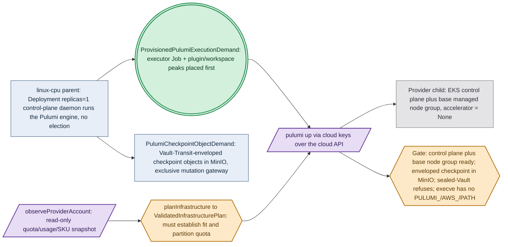

# Phase 76: Haskell-derived provider Pulumi program and enveloped checkpoint

> **Purpose**: Stand up a provider-managed EKS control plane plus a base managed node group by a `pulumi up`
> issued **only** from inside the linux-cpu parent by the Deployment-`replicas=1` control-plane daemon, with the entire
> checkpoint held as a closed set of Vault-Transit-enveloped MinIO objects and the engine subprocess spawned by
> absolute path with no `PULUMI_*`/`AWS_*`/`PATH` side-channel.
> **Read this if**: phase 76 is next in the queue, or a later phase depends on what its gate establishes.

This document specifies a target capability only. Any pre-reset implementation result, pass, seal, receipt,
command transcript, or evidence reference retained below is historical inventory only: it is permanently
non-operative, cannot satisfy any current contract, and cannot regain authority through a status edit. Current
status is owned by [the tracker](README.md) and the Phase Status block below.

Link-graph metadata

**Status**: Authoritative source
**Supersedes**: N/A
**Referenced by**: DEVELOPMENT_PLAN/README.md, DEVELOPMENT_PLAN/overview.md, DEVELOPMENT_PLAN/phase_29_execution_accelerator_folds.md, DEVELOPMENT_PLAN/phase_31_provision_seal.md, DEVELOPMENT_PLAN/phase_65_live_dsl_deploy.md, DEVELOPMENT_PLAN/phase_74_multicluster_spawn_georepl.md, DEVELOPMENT_PLAN/phase_75_gateway_migration_drills.md, DEVELOPMENT_PLAN/phase_77_provider_child_bringup.md, DEVELOPMENT_PLAN/phase_78_provider_ebs_credential.md, DEVELOPMENT_PLAN/phase_79_provider_dynamic_nodes.md, DEVELOPMENT_PLAN/system_components.md, documents/engineering/vault_pki_doctrine.md
**Generated sections**: none

## Contents

- [Phase Status](#phase-status)
- [Phase Summary](#phase-summary)
- [Gate integrity](#gate-integrity)
- [Resource provision — UNRESOLVED](#resource-provision--unresolved)
- [Doctrine adopted](#doctrine-adopted)
- [Sprints](#sprints)
- [Sprint 76.1: Provider-cluster Pulumi deploy from inside a parent ⏸️](#sprint-761-provider-cluster-pulumi-deploy-from-inside-a-parent-)
- [Documentation Requirements](#documentation-requirements)
- [Related Documents](#related-documents)

---

## Phase Status

⏸️ Blocked — NOT VALIDATED.

Blocked by redesigned Phase 75, its independent validation, and human promotion; every earlier
promotion barrier must also be satisfied in numerical order. Every prior pass, seal, receipt, attestation,
completion claim, and implementation result in this document is invalidated as validation evidence, even
where historical prose has not yet been rewritten. Existing implementation is an **Observed footprint /
Known partial** only.

Hardware validation is also prohibited until the hardware-free DSL promotion barrier is independently
satisfied and human-approved.

> **Reset contract interpretation.** The phase-specific gate review below is REJECTED — NOT VALIDATED. Until Phase 0 Sprint 0.7 replaces every unresolved row and a human independently reviews it, the summary and work breakdown are a capability inventory, not executable authority. Any wording that prescribes tracked non-`.hs` behavioural source, a Python/shell verdict, repository-retained generated behavioral transport material, `pb` behavior outside its minimal-platform-discrimination/contained-toolchain-establishment/source-bound-build/opaque-exec grammar, or host/hardware validation before the Phase-49 barrier is invalidated and non-operative.

## Phase Summary

This is the **first arm** of the provider-managed-cluster split (Phases 76–79): the target mechanism by which
"spin up a provider-managed cluster" becomes something the cluster does under its own control-plane daemon rather than
something a laptop shell does behind the cluster's back. It owns four deliverables, all driven from a single
linux-cpu parent, plus its gate; it is the substrate on which [phase_77_provider_child_bringup.md](phase_77_provider_child_bringup.md)
(the stateless hostless in-cluster control plane), [phase_78_provider_ebs_credential.md](phase_78_provider_ebs_credential.md)
(per-PV EBS + the create-vs-delete credential model), and [phase_79_provider_dynamic_nodes.md](phase_79_provider_dynamic_nodes.md)
(dynamic node provisioning + the leak-free teardown gate) all layer.

First, a **provider-cluster Pulumi deploy from inside a parent**: a `pulumi up` that runs **only** from inside
an already-running amoebius cluster, issued by the Deployment-`replicas=1` control-plane daemon (Phase 65) —
whose single-instance is a k8s/etcd property, never a bespoke amoebius election — generalizing Phase 74's
SSH-keyed self-managed spawn to a cloud-keyed provider spawn over the same backend and the same
bring-up → init → reconcile lifecycle vocabulary. There is no laptop `pulumi up`, no plaintext state, and no
`PULUMI_*`/`AWS_*`/`PATH` env side-channel: the `pulumi` binary and cloud plugin are discovered lazily by full
path.

Second, the **Vault-Transit-enveloped MinIO checkpoint backend**: the logical checkpoint is a closed set of
Vault-Transit-enveloped objects in the cluster's MinIO. The provider stack's exact resource-state field/revision
objects, retention, and failed-partial/orphan exposure carry a `StorageBudgetId` and an exclusive
`ObjectStoreMutationAdmission` gateway — the engine has no direct S3 mutation route — and its bounded
`PulumiCheckpointObjectDemand` produces a private exact object peak before any unwrap/write/cloud mutation.

Third, the **`PulumiExecutionDemand` executor**: a bounded execution demand that names the deploy unit,
content-digested plugin bytes, disk-backed plugin-cache/workspace volumes, finite concurrency, and cost model.
Provisioning returns a private `ProvisionedPulumiExecutionDemand` whose executor Jobs carry complete image,
CPU/memory, pod-ephemeral, log, writable-root, mapped-input, and retry/rollout/termination envelopes; no
executor witness means no provider/checkpoint continuation.

Fourth, the **`Amoebius.Pulumi.Provider.Eks` program**: it provisions the EKS control plane plus a base managed
node group from a named CPU-only `ProviderNodeClass` (`accelerator = None`) whose complete capacity/capability
shape is derived from — and cross-checked against — an immutable SKU snapshot, with a read-only
`observeProviderAccount` boundary supplying authoritative quota limits, current account allocations, SKU/zone
availability, and per-referenced-object count/byte usage; `planInfrastructure → observeProviderAccount →
validateInfrastructurePlan` seals a `ValidatedInfrastructurePlan` whose `ProvisionedCloudActionBatch` solely
owns the Pulumi execution graph, checkpoint domain, and quota partition before any cloud mutation, and only the
receipt-bound provider readback must construct `ProvisionContext` and let `provision` seal the initial-create spec.

This sub-phase does **not** own: the hostless in-cluster control-plane daemon, scheduler-cutover, bootstrap-Lease handoff,
or standard-service convergence for a provider child ([phase_77_provider_child_bringup.md](phase_77_provider_child_bringup.md));
per-PV durable EBS, the `protect`/`Retain` state class, the create-vs-delete credential split, or the static
`ebs.csi.aws.com` CSI path ([phase_78_provider_ebs_credential.md](phase_78_provider_ebs_credential.md)); or
dynamic node provisioning by signal, the second reconcile no-op, and the independent leak-free teardown sweep
([phase_79_provider_dynamic_nodes.md](phase_79_provider_dynamic_nodes.md)). The base node group here is a fixed
size-1 group provisioned and observed by this sub-phase alone; the `Managed Eks` arm carries **no** `LinuxHost`
witness. Human-approved Phase 25 schema generation, Phase 26 GADT decoding, and Phase 9 capacity/topology folds
must make that state unrepresentable before this live phase may rely on the foreclosure.

Diagram vocabulary: [diagram_conventions.md](../documents/engineering/diagram_conventions.md).

*Design intent. `observeProviderAccount` and `pulumi up` are the effectful seams, and the future ValidatedInfrastructurePlan gate must establish fit at Tier-1; the target provisioned executor must remain a constructor-private seal, while the running EKS control plane and base node group must be runtime-checked rather than treated as proven.*

**Phase scope:** one cohesive claim — *the provider control plane is raised only from inside the parent, and its checkpoint is never readable outside Vault's envelope*. No host-side `pulumi up` exists.

**Substrate:** linux-cpu — the acceptance gate runs on exactly one hardware substrate: the linux-cpu parent
`kind` cluster from inside which the Pulumi engine issues the deploy. EKS is the deploy target, not a hardware
substrate ([development_plan_standards.md §L](development_plan_standards.md#l-one-substrate-discipline)).

**Lane:** provider — the canonical managed-provider target lane driven from the linux-cpu parent
([§L](development_plan_standards.md#l-one-substrate-discipline)).

**Register:** 3 (live infrastructure) — the gate spins up real provider resources (an EKS control plane and a
managed node group) and writes real Vault-enveloped checkpoint objects into MinIO; no register-1/2 in-process
check discharges it.

**Depends on:** [Phase 75](phase_75_gateway_migration_drills.md) — exact current human approval; the numeric chain includes every earlier phase
**Gate:** `pb validate phase 76`; see [Gate integrity](#gate-integrity). NOT VALIDATED.

## Gate integrity

**Contract review**: REJECTED — NOT VALIDATED.

| Key | Contract |
|---|---|
| `Claim` | one cohesive claim — *the provider control plane is raised only from inside the parent, and its checkpoint is never readable outside Vault's envelope*. No host-side `pulumi up` exists. Explicit exclusions: every layer named in `Residue` remains UNVERIFIED. |
| `Subject` | UNRESOLVED — blocks validation: no production `.hs` module and entry point have been independently established for this reset contract. |
| `Command` | `pb validate phase 76` is the target command only; `pb` may only make the minimal platform distinction, establish the contained toolchain, build the source-bound binary, and exec it with argv unchanged, while the Haskell verdict entry point remains UNRESOLVED and blocks validation. |
| `Oracle` | UNRESOLVED — blocks validation: no separately authored `.hs` oracle, independence boundary, provenance, and independent human reviewer have been accepted. |
| `Positive controls` | UNRESOLVED — blocks validation: no closed named Haskell corpus and exact per-member observations have been accepted. |
| `Paired negatives` | UNRESOLVED — blocks validation: minimally different pairs, exact rejection loci, and exact reasons have not been accepted for every foreclosed dimension. |
| `Mutants` | UNRESOLVED — blocks validation: operators, production loci, applied-change witnesses, expected red observations, and unaffected controls have not been accepted. |
| `Discovery` | UNRESOLVED — blocks validation: expected and runtime-discovered surfaces, two-way equality, and empty-discovery refusal have not been accepted. |
| `Challenge` | UNRESOLVED — blocks validation: neither a post-start challenge nor a reviewed pure-claim independent predicate has been accepted. |
| `Observer` | UNRESOLVED — blocks validation: no outside observer, raw observation, authenticity check, and fail-closed rule have been accepted. |
| `Authority/bypass` | UNRESOLVED — blocks validation: least-privilege/foreign-scope pairs, bypass probes, or reviewed non-applicability have not been accepted. |
| `Freshness` | UNRESOLVED — blocks validation: stale state, cached output, prior evidence, and replayed responses have not been made unable to pass. |
| `Qualification` | UNRESOLVED — blocks validation: the fixed sabotage corpus has not qualified a Haskell harness independently of a clean candidate run. |
| `Cleanroom` | UNRESOLVED — blocks validation: no run has derived all products lazily with generated and condemned legacy copies absent. |
| `Legacy closure` | UNRESOLVED — blocks validation: stable owned legacy IDs and their exact zero-finding check have not been reconciled. |
| `Predecessor` | MISSING — blocks validation: the current Phase 75 human approval receipt does not exist. |
| `Residue` | UNVERIFIED — the entire phase claim and all semantic, effect, runtime, hardware, and cleanup layers remain unvalidated; no empty residue is asserted. |
| `Human authority` | `human-only` — no agent, gate, CI job, digest, receipt-shaped file, or generated assertion may promote status. |

## Resource provision — UNRESOLVED

> **UNRESOLVED — blocks validation.** No live mutation is authorized. Before review this phase must name its exact owner marker, preflight, allowed and forbidden mutations, external observer, scoped cleanup, and zero-owned-residue criterion. The reset inventory below cannot supply that contract.

## Doctrine adopted

- [`workflow_calculus_doctrine.md` §3 — Teardown is a type obligation](../documents/engineering/workflow_calculus_doctrine.md#3-teardown-is-a-type-obligation) — provider Pulumi deploy-from-inside + enveloped checkpoint provisions, and a teardown obligation it cannot discharge is a value it cannot construct.
- [`pulumi_iac_doctrine.md` §1 — Pulumi runs only from inside an existing amoebius cluster](../documents/engineering/pulumi_iac_doctrine.md#1-pulumi-runs-only-from-inside-an-existing-amoebius-cluster)
  — *Pulumi runs only from inside an existing amoebius cluster* — with
  [`pulumi_iac_doctrine.md` §2 — The backend: every byte of state is a Vault-enveloped object in MinIO](../documents/engineering/pulumi_iac_doctrine.md#2-the-backend-every-byte-of-state-is-a-vault-enveloped-object-in-minio)
  (*every byte of state is a Vault-enveloped object in MinIO*),
  [`pulumi_iac_doctrine.md` §3 — State lifetime matches resource lifetime, per class](../documents/engineering/pulumi_iac_doctrine.md#3-state-lifetime-matches-resource-lifetime-per-class)
  (*state lifetime matches resource lifetime, per class* — the checkpoint's revision retention and GC horizon
  arm),
  [`pulumi_iac_doctrine.md` §4 — What Pulumi provisions (the resource catalog)](../documents/engineering/pulumi_iac_doctrine.md#4-what-pulumi-provisions-the-resource-catalog)
  (*the resource catalog* — the provider-cluster entry), and
  [`pulumi_iac_doctrine.md` §8 — How deploys are enacted: the reconciler, referenced not restated](../documents/engineering/pulumi_iac_doctrine.md#8-how-deploys-are-enacted-the-reconciler-referenced-not-restated)
  (*deploys are enacted by the reconciler, not a global state machine*): this phase realizes the catalog's
  provider-cluster entry as a Pulumi deploy that obeys the one rule (engine under the control-plane daemon, no env vars, no
  `PATH`, logical checkpoint as a Vault-enveloped MinIO object set), holds the checkpoint as a lifetime-classed
  budgeted object set behind an exclusive mutation gateway, and enacts the deploy through the reconciler rather
  than a bespoke state machine. (The EBS create-vs-delete credential arm of [`pulumi_ebs_credential_model.md` §6 — The EBS create-vs-delete credential model](../documents/engineering/pulumi_ebs_credential_model.md#6-the-ebs-create-vs-delete-credential-model) is realized in [phase_78_provider_ebs_credential.md](phase_78_provider_ebs_credential.md), not here.)
- [`cluster_lifecycle_doctrine.md` §3 — Amoebic spawning — the recursive forest](../documents/engineering/cluster_lifecycle_doctrine.md#3-amoebic-spawning--the-recursive-forest)
  — *amoebic spawning — the recursive forest*: provider-cluster spawn is the *cloud-keyed* sibling of Phase 74's
  *SSH-keyed* self-managed spawn over the same encrypted-MinIO backend and per-child Vault envelope, sharing the
  same bring-up → init → reconcile lifecycle vocabulary.
- [`daemon_topology_doctrine.md` §3.1 — "Exactly one pod" is a k8s/etcd property, not an amoebius election](../documents/engineering/daemon_topology_doctrine.md#31-exactly-one-pod-is-a-k8setcd-property-not-an-amoebius-election)
  and [`daemon_topology_doctrine.md` §5 — Single-instance and coordination — delegated, not elected](../documents/engineering/daemon_topology_doctrine.md#5-single-instance-and-coordination--delegated-not-elected)
  — *exactly one pod is a k8s/etcd property* / *single-instance and coordination — delegated, not elected*: the
  Pulumi engine runs under the Deployment-`replicas=1` control-plane daemon whose single-instance is a k8s/etcd concern, so
  nothing in this phase runs a bespoke leadership election, and there is no host-shell entrypoint that can
  `pulumi up` a provider cluster.
- [`substrate_doctrine.md` §3 — The no-environment / no-`PATH` lazy tool-ensure contract](../documents/engineering/substrate_doctrine.md#3-the-no-environment--no-path-lazy-tool-ensure-contract)
  — *the no-environment / no-`PATH` lazy tool-ensure contract*: the `pulumi` binary and the cloud-provider
  plugin are discovered lazily by full path through the substrate package manager, with **no** `PULUMI_*`,
  `AWS_*`, `PULUMI_CONFIG_PASSPHRASE`, or `PATH` exported into any child process.
- [`image_build_doctrine.md` §2 — The single distribution rule: bake the binaries, build the amoebius image, pull only in-cluster](../documents/engineering/image_build_doctrine.md#2-the-single-distribution-rule-bake-the-binaries-build-the-amoebius-image-pull-only-in-cluster)
  — *bake the binaries, pull only in-cluster*: the base node's launch template preloads the exact pinned
  amoebius base/scheduler OCI content into its CRI store so bring-up requires neither the not-yet-ready child
  registry nor a public pull.
- [`resource_capacity_types.md` §3 — The types: `Quantity`, `Capacity`, `Demand`, `Budget`; “The systematic provision matrix”](../documents/engineering/resource_capacity_types.md#31-the-systematic-provision-matrix)
  — *the systematic provision matrix*: the executor Jobs, plugin/workspace carriers, checkpoint-object budget,
  and the base node class's derived supply are provisioned before any effect; failure of any CPU, memory,
  pod-ephemeral, plugin-cache, workspace, checkpoint-object-budget, or provider-quota obligation rejects before
  cloud mutation.
- [`chaos_failover_doctrine.md` §12 — The moral core — proven, tested, assumed](../documents/engineering/chaos_failover_doctrine.md#12-the-moral-core--proven-tested-assumed)
  (cross-reference) — *proven, tested, assumed*: each gate run emits a proven/tested/assumed ledger; skipping an
  applicable observation move marks that layer UNVERIFIED, never green.

## Sprints

> **Reset validation review.** Every pre-reset `Independent Validation` and `### Validation` below is rejected as a current criterion and MUST NOT be executed or cited. It is retained only to inventory the capability while the fixed Haskell subject/oracle/reviewer/mutant/legacy contract is rewritten.

> **Permanent sprint reset.** Every pre-reset sprint status, result, date, pass, seal, receipt, evidence path, and closure statement below is permanently invalid for promotion. The retained body is non-operative capability inventory only. Current acceptance requires the resolved eighteen-row Haskell gate contract, fresh independently observed evidence, immediate-predecessor approval, owned legacy closure, and a human tracker change.
>
> **Source/artifact boundary.** Every retained fixture, oracle, expected value, corpus, schema, config, manifest, transcript, receipt, script, and mutation name below denotes semantics authored in reviewed Haskell `.hs`. Any reproducible serialized or materialized form is generated lazily beneath ignored `.build/**` and remains untracked. No retained artifact path is an implementation instruction; `pb/**` remains the bootstrap-only exception and owns none of this behavior.

## Sprint 76.1: Provider-cluster Pulumi deploy from inside a parent ⏸️

**Status**: Blocked — NOT VALIDATED

### Objective

Adopt [`pulumi_iac_doctrine.md §1 — Pulumi runs only from inside an existing amoebius cluster`](../documents/engineering/pulumi_iac_doctrine.md#1-pulumi-runs-only-from-inside-an-existing-amoebius-cluster)
and the provider-cluster catalog entry in [`§4 — What Pulumi provisions`](../documents/engineering/pulumi_iac_doctrine.md#4-what-pulumi-provisions-the-resource-catalog):
make "spin up a provider-managed cluster" something the cluster does under its Deployment-`replicas=1` control-plane daemon
— never something a laptop shell does behind the cluster's back — with state held as a Vault-enveloped MinIO
object set, generalizing Phase 74's SSH-keyed self-managed spawn to a cloud-keyed provider spawn. The `pulumi`
binary and cloud plugin are ensured under
[`substrate_doctrine.md §3 — the no-environment / no-`PATH` lazy tool-ensure contract`](../documents/engineering/substrate_doctrine.md#3-the-no-environment--no-path-lazy-tool-ensure-contract):
discovered lazily by full path, with no `PULUMI_*`/`AWS_*`/`PATH` side-channel exported into any child process.

### Deliverables

- An `Amoebius.Pulumi.Engine` seam that runs the Pulumi engine **only** under the in-cluster control-plane daemon (Phase
  27), whose single-instance is a k8s/etcd property; there is no host-shell entrypoint that can `pulumi up` a
  provider cluster.
- An `Amoebius.Pulumi.Backend.EncryptedMinio` backend: the logical checkpoint is a model-derived closed set of
  opaque revision/update objects in the cluster's MinIO, sealed with Vault-Transit envelopes; plaintext data
  keys never land on disk, and a sealed/unreachable Vault **fails the deploy closed** (no unencrypted or
  un-checkpointed fallback).
- A provider-stack `PulumiCheckpointObjectDemand`: exact resource-state identities and field paths/max canonical
  bytes/secrecy, finite revision retention, serial current/old/new update overlap, finite failed-partial/orphan
  exposure and GC horizon, pinned model, attached `StorageBudgetId`, and exclusive `ObjectStoreMutationAdmission`.
  It produces a private exact object peak before unwrap/write/cloud mutation; its rate/concurrency model derives
  a complete placed mutation-gateway `PodResourceEnvelope`, and the engine has no direct S3 mutation route.
- A provider `PulumiExecutionDemand` that names the deploy unit, content-digested plugin installed/peak-install
  bytes, disk-backed plugin-cache/workspace volumes, finite concurrency, and cost model. Provisioning returns a
  private `ProvisionedPulumiExecutionDemand` whose executor Jobs have complete image, CPU/memory, pod-ephemeral,
  log, writable-root, mapped-input, retry/rollout/termination envelopes and whose plugin/workspace carriers
  derive presentation/allocation-rounded raw debits from required-usable peaks. Fresh validation proves the
  usable peaks against mounted usable capacity and the raw debits against raw residual supply separately. No
  executor witness means no provider/checkpoint continuation.
- An `Amoebius.Pulumi.Provider.Eks` program that provisions the EKS control plane + a base managed node group
  from a named `ProviderNodeClass` carrying a catalog-pinned
  `ProviderSkuRef { provider = AwsEc2, region, machineType, catalogVersion }`, exact allocatable CPU plus finite
  overcommit policy, memory, declared `podSlots`, CNI/IP `cniSlots`, and driver-indexed `attachableVolumes`, a
  non-empty `localDisks` recipe in which each `PerInstanceDiskTemplate` has
  `InstanceStore { skuDevice, provisionedRawBytes, presentation } | EphemeralRootEbs { policy }` backing plus
  `systemReserve` and non-empty `carves` in `ProviderUsableDiskCarveTemplate.requiredUsableBytes`, a closed
  kubelet filesystem layout, logical pod-ephemeral capacity, OCI content/snapshot model, image-pull policy,
  zones, price, provider-vCPU cost, base/maximum counts, and closed accelerator offering, via cloud keys
  resolved from the cluster's Vault (secrets are names in the Haskell declaration; any Dhall projection is
  generated lazily beneath `.build/**`, and bytes are injected by the parent), landing
  the cluster ready for its in-cluster control-plane bootstrap ([phase_77_provider_child_bringup.md](phase_77_provider_child_bringup.md)).
  The canonical class declares `accelerator = None`.
- A read-only `observeProviderAccount` boundary using the AWS Service Quotas APIs for the applicable regional
  EC2 vCPU/accelerator/EBS limits, `DescribeInstances`/EKS node-group inventory and `DescribeVolumes` for current
  allocations split by ephemeral node-root versus durable retained owner, and a version-pinned
  `DescribeInstanceTypes`/`DescribeInstanceTypeOfferings` plus pricing snapshot for SKU shape/zone/price. For
  each referenced provider-object quota it additionally reads a complete object/version inventory and object
  count plus current bytes in the quota's exact selected `Logical` or `Billed` accounting arm; the latter retains
  the pinned provider billing/rounding and logical-to-billed conversion models. It normalizes one
  `ObservedProviderAccount`; missing permission, unknown pagination/result, incomplete object/version inventory,
  mismatched byte arm/model, unavailable SKU/zone, or stale catalog version is refusal, never zero usage.
  Checked construction proves the declared net node template is a carve of the SKU's raw
  CPU/memory/instance-store/GPU/link shape when `InstanceStore` is selected; its `provisionedRawBytes` must
  equal the SKU device's raw capacity. For `EphemeralRootEbs`, it derives a private whole-GiB
  `ProvisionedNodeRootVolumeRequest` from the system reserve plus unique layout carves' summed
  `requiredUsableBytes`, the required `FilesystemPresentation` overhead, and the catalog-cross-checked
  `BackingAllocationPolicy` minimum/quantum. The private request retains `requiredUsableBytes`, presentation,
  allocation witness, integral `sizeGiB`, and raw `provisionedBytes`; every base/growth/replacement volume
  debits the distinct node-root EBS ledger. For either backing, a private `ProvisionedPerInstanceDiskTemplate`
  derives presentation-model-pinned `mountedUsableBytes` from that raw instance-store supply or rounded root
  request, then proves the usable system reserve and unique usable carves fit it exactly once. `quotaVcpu` must
  match provider cost.
- Provider pod/attachment observation for the base node: derive the node's usable pod slots from the pinned
  SKU+CNI policy and driver attach slots from the pinned SKU+CSI policy; after join, admit only the lesser of
  those declarations, kubelet `status.allocatable.pods`/remaining CNI IP capacity, and `CSINode`/SKU per-driver
  limits. Unknown limits or a live smaller value reject; regional EBS count is an additional ledger, never a
  substitute.
- The managed-node launch template and bootstrap/user-data realize the provisioned root request and exact
  layout: filesystem/LVM/project-quota identities, kubelet nodefs/log roots, containerd content/snapshot roots,
  pull concurrency, and a provisioned import of the exact pinned amoebius base/scheduler OCI content into the
  first node's CRI store. Resident bytes and import workspace are charged to the selected backing; scheduler
  bootstrap therefore requires neither the not-yet-ready child registry nor a public pull. `SplitRuntime` routes
  both OCI images and writable layers to imagefs; `Unified` aliases all three kubelet identities; the current
  containerd path rejects `SplitImage` before a cloud call.
- `planInfrastructure` derives the provider-cluster demand from the exact `BoundDeployment` and declared
  account/node-class/backing supply. The initial create takes its `InfrastructureRequired` arm;
  `observeProviderAccount → validateInfrastructurePlan` then returns one `ValidatedInfrastructurePlan` whose
  `ProvisionedCloudActionBatch` solely owns the Pulumi execution graph, checkpoint domain,
  dependency/concurrency admission, and quota partition. Each `ValidatedCloudProviderAction` is an exact
  per-deploy projection, bound to account limits/current usage, SKU catalog/price, desired resources, parent
  executor/cache/backing residuals, and provider object versions. The managed-node action owns its exact
  root-volume request map and debit; no independent root-volume action can charge or create it again. Every
  arm-authorized Pulumi/AWS create/modify/destroy CAS-consumes its action token and the plan token and
  immediately re-reads the fingerprint; change restarts the read-only prefix. (The durable-retained-EBS
  `EnsurePresent`/no-destroy arm and the ephemeral-node-root replacement lifecycle are elaborated in
  [phase_78_provider_ebs_credential.md](phase_78_provider_ebs_credential.md).) Only the receipt-bound provider
  readback constructs `ObservedInfrastructureMaterialization` and `ProvisionContext`; `provision` seals the
  Kubernetes `ProvisionedSpec` afterward. A converged rerun may take `NoInfrastructureRequired` only through its
  explicit already-materialized arm and performs no cloud mutation; promised node, endpoint, or volume
  identities cannot enter the spec.
- Lazy, full-path discovery of the `pulumi` binary and the cloud-provider plugin through the substrate package
  manager; **no** `PULUMI_*`, `AWS_*`, `PULUMI_CONFIG_PASSPHRASE`, or `PATH` is exported into any child process.

### Validation

1. The control-plane daemon issues a provider deploy that reaches a ready EKS control plane + base node group. The
   "no host-shell entrypoint" claim is discharged by a **runnable attempted-invocation-must-fail** check, not a
   code-review attestation: a Haskell-declared negative generates a run-local attempted host-shell invocation
   beneath `.build/test-corpora/**` and asserts it **fails with the specific reason** "no in-cluster control-plane
   daemon context" (the independently authored Haskell tag `NoControlPlaneDaemonContext`, §M.8), paired with the positive
   in-cluster path that differs only in being run under the control-plane daemon (§M.8).
   Before the first cloud call, a Haskell-declared declared-fit/observed-account-short case and an
   impossible/SKU-shape-mismatch case each fail with a specific tag and an empty mutating CloudTrail log. A
   Haskell-declared race case changes current
   usage or SKU availability after validation; immediate token recheck emits zero Pulumi/AWS mutation.
   After join, an OS-boundary Kubernetes/API/CRI inventory cross-checks the node's allocatable CPU, memory,
   logical ephemeral storage; nodefs/imagefs/containerfs mount, device, filesystem, and quota identities; raw
   root-volume and per-filesystem allocatable/usable capacity; containerd content objects and committed/active
   snapshots; storage-model version and enforced pull-concurrency policy; zone labels; and accelerator
   resource/label absence against the declared base node class. A hard-cap probe must fail at each declared
   boundary without spilling into another carve. Alias, swapped-root, missing content/snapshot bytes,
   one-byte-short capacity, or unsupported `SplitImage` fails the deploy; any observed supply below the
   declaration fails the deploy rather than letting later scheduling discover the mismatch.
   Before scheduler creation, independently read back the pinned amoebius image digest as resident in the base
   node CRI store and its import workspace as released/retained according to the model. A missing preload,
   public/child-registry scheduler pull, or uncharged import workspace fails.
2. Cryptographic-dependence assertion (forecloses a locally-keyed envelope with a bolted-on seal precheck):
   (a) every stored checkpoint revision/update object in MinIO is opaque ciphertext that **decrypts only via a direct Vault Transit `decrypt` call with the per-child key** and is **not** decryptable from any key material
   present on the engine pod's filesystem — asserted against an independently authored Phase-0 Haskell
   ciphertext-shape oracle. Its reproducible JSON view is generated lazily at
   `.build/test-corpora/checkpoint_envelope.json` and remains untracked (the expectation is authored before the
   backend exists, §M.1/§M.3);
   (b) an **OS-boundary filesystem observer** (an `inotify`/`fanotify` or `strace` watch on the pod filesystem,
   NOT a self-emitted compliance log, §M.5) records **zero** plaintext-data-key bytes written to disk across a
   full deploy; (c) a deploy with a sealed Vault refuses *before* any cloud-side create, and the Haskell-authored
   changed-subject mutant `mut-44.1-static-key` (an envelope keyed by a pod-local static key with the seal-status
   precheck still present) MUST go **red** on assertion (a) and (b) while passing the behavioral seal-gate —
   proving the gate tests cryptographic dependence, not just seal-status (§M.2).
3. Process-environment assertion read from an **OS-boundary observer** (an `execve` argv/env-recording shim or
   `strace -f -e execve`, §M.5, never a trace the engine emits about itself): the `pulumi` subprocess is spawned
   with an empty/whitelisted environment (no `PULUMI_*`/`AWS_*`/`PULUMI_CONFIG_PASSPHRASE`/`PATH`) and the
   `pulumi`/plugin paths are absolute, checked against an independently authored Phase-0 Haskell
   expected-argv/expected-env table. Its reproducible text view is generated lazily at
   `.build/test-corpora/engine_execve.txt` and remains untracked (§M.1/§M.3). The Haskell-authored changed-subject mutant
   `mut-44.1-leak-path` (an engine that exports `PATH` into the child) MUST go red here.
4. Paired Haskell-declared one-short cases reduce only parent executor or checkpoint-gateway CPU, memory, pod-ephemeral,
   plugin-cache, workspace, or checkpoint `StorageBudget` by one unit. Each returns its specific provision error
   before a Job, checkpoint PUT, or AWS mutation. In the fitting case, Kubernetes API readback of the executor
   Job exactly matches the private witnessed image, requests/limits, ephemeral/log/writable/mapped allowances
   and volumes; MinIO `LIST`/`HEAD` plus gateway admission records exactly match the stack's
   resource-field-derived current, old/new, retained-revision, and partial/orphan identities/extents. A failed
   checkpoint CAS stays charged until its finite GC horizon, and a direct mutating S3 request outside the gateway
   is denied.
5. A Haskell-declared `BoundedParallel 2` case with two independent deploy units fits either executor alone but not both and
   must reject before effects. The Haskell-authored changed-subject `mut-44.1-drop-parallel-executor` mutant, which omits one live Job
   from the peak or admits parallel demand then silently serializes it, MUST go red. Separately, lower only
   kubelet/CNI pod residual or the `CSINode` `ebs.csi.aws.com` attach limit below the declared SKU policy; the
   lesser live value refuses workload admission even while CPU, memory, and regional EBS count remain ample.

> **Honesty.** The encrypted-MinIO Pulumi backend and a working EKS deploy are **proven in prodbox**
> (`Prodbox.Pulumi.EncryptedBackend`; the `aws-eks` stack), with a Vault gate on every apply/destroy — *sibling
> evidence, not an amoebius result*. This sprint re-realizes the shape under the amoebius
> Deployment-`replicas=1` control-plane daemon and the per-child envelope for the first time. The per-run stack is torn
> down for cost hygiene; the *independent, leak-free* teardown proof (the OS-boundary cloud-API tag sweep and
> `mut-47.2-skip-sweep`) is [phase_79_provider_dynamic_nodes.md](phase_79_provider_dynamic_nodes.md)'s gate,
> deferred and never depended on here.

### Remaining Work

- Re-run with valid, quota-bearing AWS authority and perform the actual control-plane-owned `pulumi up`.
- Independently read back the EKS control plane, CPU-only managed node, root volume/layout, resident OCI
  preload, account quota fingerprint, and empty-on-refusal CloudTrail mutation domain.
- Observe the AWS plugin `execve` and engine-pod filesystem boundary, and enforce/read back denial of a direct
  mutating S3 request outside the checkpoint gateway.
- Destroy the provider stack for cost hygiene and seal the full Register-3 gate. Until these items pass, EKS
  and managed-node readiness are UNVERIFIED rather than inferred from the green scoped gate.

## Documentation Requirements

**Engineering docs to update (when the human promotes the gate, never before):**

- `documents/engineering/pulumi_iac_doctrine.md` — record that §1 (the one rule), §2 (the Vault-enveloped MinIO
  backend and exact `PulumiCheckpointObjectDemand`), §3 (the checkpoint's per-class state lifetime/retention/GC
  arm), §4 (the provider-cluster catalog entry), and §8 (the reconciler enaction) are realized in
  `amoebius-pulumi`; flip the relevant sibling-evidence honesty notes to live-proof status once the gate runs
  (status itself stays in this plan).
- `documents/engineering/cluster_lifecycle_doctrine.md` — record that §3 (the cloud-keyed amoebic spawn) gains
  an amoebius EKS reference as the cloud-keyed sibling of the Phase 74 SSH-keyed spawn.
- `documents/engineering/daemon_topology_doctrine.md` — record that the Pulumi engine runs under the
  Deployment-`replicas=1` control-plane daemon (§3.1/§5), single-instance a k8s/etcd property, with no bespoke election
  anywhere in this phase.
- `documents/engineering/substrate_doctrine.md` — record that `pulumi` + the cloud plugin conform to the
  no-env/no-`PATH` lazy-tool-ensure contract (§3) on the linux-cpu parent.
- `documents/engineering/image_build_doctrine.md` — record that the base node's launch template preloads the
  pinned amoebius base/scheduler OCI content into its CRI store (§2), so bring-up introduces no public-registry
  or Helm path.
- `documents/engineering/resource_capacity_doctrine.md` — record that
  [`§3.1`](../documents/engineering/resource_capacity_types.md#31-the-systematic-provision-matrix)
  (the systematic provision matrix) gains the live Pulumi executor/checkpoint/base-node-class supply
  provisioning; flip the relevant honest layer once the gate runs.
- `documents/engineering/testing_doctrine.md` — record the Phase 76 per-run ledger artifact for the
  deploy/checkpoint bring-up, naming Register 3 and the sibling-evidence provenance.

**Cross-references to add:**

- `DEVELOPMENT_PLAN/system_components.md` — map the reused `amoebius-pulumi` Engine and EncryptedMinio backend
  to their first delivery in Phase 74; register `Amoebius.Pulumi.Provider.Eks`, the `observeProviderAccount`
  boundary, and the `PulumiExecutionDemand` / `PulumiCheckpointObjectDemand` types as Phase-76 design-first rows,
  each mapped to its owning doctrine.
- `DEVELOPMENT_PLAN/substrates.md` — record the Phase 76 → `linux-cpu` (parent) row with the `provider` (EKS)
  deploy target annotated as a target class, not a fifth hardware substrate.
- `DEVELOPMENT_PLAN/README.md` — flip the Phase 76 row's status once the gate passes; link this document.

## Related Documents

- [README.md](README.md) — the live tracker; the Phase 76 objective, gate, and substrate
- [development_plan_standards.md](development_plan_standards.md) — the rulebook this doc obeys ([§D](development_plan_standards.md#d-the-per-phase-document-skeleton) skeleton, [§F](development_plan_standards.md#f-the-sprint-block-format) sprint format, [§H](development_plan_standards.md#h-the-doctrine-citation-rule-cite-by-name) citation rule, [§K](development_plan_standards.md#k-honesty-proven--tested--assumed) honesty, [§L](development_plan_standards.md#l-one-substrate-discipline) one-substrate discipline, [§M](development_plan_standards.md#m-gate-integrity-a-gate-cannot-be-passed-by-a-stub) gate integrity)
- [overview.md](overview.md) — the target architecture and cross-cutting invariants (no bespoke election; single-instance delegated to k8s/etcd; Pulumi runs only from inside a cluster)
- [system_components.md](system_components.md) — the target component inventory (the Implementation paths above are its intended layout, not yet built)
- [substrates.md](substrates.md) — the substrate registry and per-phase map (`linux-cpu` parent → `provider` target)
- [Pulumi IaC Doctrine](../documents/engineering/pulumi_iac_doctrine.md) — the one rule, the Vault-enveloped
  MinIO backend and checkpoint object demand, and the provider-cluster catalog entry this phase implements
- [Cluster Lifecycle Doctrine](../documents/engineering/cluster_lifecycle_doctrine.md) — the cloud-keyed amoebic
  spawn this phase realizes
- [Daemon Topology Doctrine](../documents/engineering/daemon_topology_doctrine.md) — the Deployment-`replicas=1`
  control-plane daemon (single-instance a k8s/etcd property, no election) that runs the Pulumi engine
- [Substrate Doctrine](../documents/engineering/substrate_doctrine.md) — the no-env/no-`PATH` lazy tool-ensure
  contract for `pulumi` + the cloud plugin
- [Vault / PKI Doctrine](../documents/engineering/vault_pki_doctrine.md) — the Transit envelope + per-child key
  the Pulumi checkpoint rides on
- [Image Build Doctrine](../documents/engineering/image_build_doctrine.md) — the baked OCI content preloaded into
  the base node, no public pull
- [Resource Capacity Doctrine](../documents/engineering/resource_capacity_doctrine.md) — the systematic provision
  matrix the executor/checkpoint/base-node-class supply is provisioned against
- [Testing Doctrine](../documents/engineering/testing_doctrine.md) — Register 3 (live) and the per-run ledger
- [phase_74](phase_74_multicluster_spawn_georepl.md) — the SSH-keyed amoebic spawn, encrypted MinIO backend, and
  per-child envelope this phase generalizes to a cloud-keyed provider spawn
- [phase_77](phase_77_provider_child_bringup.md) — the stateless hostless in-cluster control-plane daemon + capacity-scheduler
  bring-up that layers on this deploy
- [phase_78](phase_78_provider_ebs_credential.md) — the per-PV EBS + create-vs-delete credential model + static
  CSI path that layers on this deploy
- [phase_79](phase_79_provider_dynamic_nodes.md) — dynamic node provisioning by signal and the independent
  leak-free teardown gate that layers on this deploy
- [Engineering Doctrine Index](../documents/engineering/README.md) — the doctrine suite this phase adopts
