# Phase 77: Hostless provider child + convergence + Lease handoff

> **Purpose**: Bring a provider-managed EKS child — deployed and checkpoint-observed by
> [Phase 76](phase_76_provider_deploy_checkpoint.md) — to the same fungible shape as any self-managed amoebius
> cluster: a stateless **hostless** in-cluster control-plane daemon plus the mandatory `amoebius-capacity` scheduler role
> (no host binary, no host worker daemon, no host substrate advertised), staged through
> `BootstrapCapacitySchedulerReady` → add-on cutover → `ManagedCapacityReady`, then the parent bootstrap Lease
> holder released and observed-absent before the child control-plane daemon acquires the same Lease, converging the complete
> standard HA platform-service set from typed manifests with no Helm and no public-registry pull.
> **Read this if**: phase 77 is next in the queue, or a later phase depends on what its gate establishes.

This document specifies a target capability only. Any pre-reset implementation result, pass, seal, receipt,
command transcript, or evidence reference retained below is historical inventory only: it is permanently
non-operative, cannot satisfy any current contract, and cannot regain authority through a status edit. Current
status is owned by [the tracker](README.md) and the Phase Status block below.

Link-graph metadata

**Status**: Authoritative source
**Supersedes**: N/A
**Referenced by**: DEVELOPMENT_PLAN/README.md, DEVELOPMENT_PLAN/overview.md, DEVELOPMENT_PLAN/phase_65_live_dsl_deploy.md, DEVELOPMENT_PLAN/phase_76_provider_deploy_checkpoint.md, DEVELOPMENT_PLAN/phase_78_provider_ebs_credential.md, DEVELOPMENT_PLAN/phase_79_provider_dynamic_nodes.md, DEVELOPMENT_PLAN/system_components.md
**Generated sections**: none

## Contents

- [Phase Status](#phase-status)
- [Phase Summary](#phase-summary)
- [Gate integrity](#gate-integrity)
- [Resource provision — UNRESOLVED](#resource-provision--unresolved)
- [Doctrine adopted](#doctrine-adopted)
- [Sprints](#sprints)
- [Sprint 77.1: Two-stage capacity bootstrap for a hostless provider child ⏸️](#sprint-771-two-stage-capacity-bootstrap-for-a-hostless-provider-child-)
- [Sprint 77.2: Parent→child Lease handoff + hostless daemon topology ⏸️](#sprint-772-parentchild-lease-handoff--hostless-daemon-topology-)
- [Sprint 77.3: Standard-HA platform-service convergence from typed manifests ⏸️](#sprint-773-standard-ha-platform-service-convergence-from-typed-manifests-)
- [Sprint 77.4: The provider-child bring-up gate ⏸️](#sprint-774-the-provider-child-bring-up-gate-)
- [Documentation Requirements](#documentation-requirements)
- [Related Documents](#related-documents)

---

## Phase Status

⏸️ Blocked — NOT VALIDATED.

Blocked by redesigned Phase 76, its independent validation, and human promotion; every earlier
promotion barrier must also be satisfied in numerical order. Every prior pass, seal, receipt, attestation,
completion claim, and implementation result in this document is invalidated as validation evidence, even
where historical prose has not yet been rewritten. Existing implementation is an **Observed footprint /
Known partial** only.

Hardware validation is also prohibited until the hardware-free DSL promotion barrier is independently
satisfied and human-approved.

> **Reset contract interpretation.** The phase-specific gate review below is REJECTED — NOT VALIDATED. Until Phase 0 Sprint 0.7 replaces every unresolved row and a human independently reviews it, the summary and work breakdown are a capability inventory, not executable authority. Any wording that prescribes tracked non-`.hs` behavioural source, a Python/shell verdict, a checked-in generated fixture/oracle/mutant, `pb` behavior outside its minimal-platform-discrimination/contained-toolchain-establishment/source-bound-build/opaque-exec grammar, or host/hardware validation before the Phase-49 barrier is invalidated and non-operative.

## Phase Summary

This phase's target is the **provider-managed column** of the two-cluster-kinds table: a provider child is the
*same machine* as any other cluster from the reconciler's point of view, minus the host. It owns exactly four
things, all driven from the single linux-cpu parent over the cloud/K8s API against a child that Phase 76 must
first deploy and a human must approve.

First, **the two-stage capacity bootstrap for a hostless child**. Once the EKS API and Phase-76 base node are
reachable, the authenticated parent holds a cold-start capability scoped to the child's derived control-plane
Namespace and the mandatory reconciler `Lease`. As the bootstrap holder it creates the
`amoebius-capacity-scheduler` with exact `pods=1` — whose Deployment references the exact OCI digest **preloaded
and capacity-debited into the base node's CRI store by Phase 76, never the not-yet-ready child registry or a
public registry** — observes the default-scheduled scheduler's exact active generation/config/root as
`BootstrapCapacitySchedulerReady`, patches only the finite provider/kube-system bootstrap controller set,
observes old-UID absence/release plus replacement reservation/Bound/Ready joins, then installs the managed-node
taint, execution-identity admission, and full exclusive Binding RBAC and independently mints
`ManagedCapacityReady`. No default-scheduled or unreserved platform Pod may race that cutover.

Second, **the parent-bootstrap → child-control-plane Lease handoff**. From `ManagedCapacityReady`, the parent
bootstrap holder converges the typed pre-handoff platform prerequisites (the sealed Vault + MinIO/registry
substrate the stateless control-plane daemon needs), then applies the child control-plane daemon **while the parent still holds the Lease** — the child Pod stays non-Serving and cannot mutate. The parent then drains/releases the bootstrap
holder, **freshly observes holder absence on that same still-present Lease object**, and only then may the
authenticated child control-plane daemon Pod UID acquire the same Lease and report `/readyz`. Single-writer authority is a
k8s/etcd property of the Lease, never a bespoke amoebius election; unknown or stale state refuses.

Third, **the hostless daemon topology**. A provider child runs **exactly one** in-cluster control-plane daemon role, **one**
`amoebius-capacity` scheduler role, and **zero** host worker-daemon roles. The host-only NodePort comms path and
host worker daemons are structurally absent — there is no host — and the child advertises **no** host substrate,
confirming at runtime the type-level foreclosure that the `Managed Eks` arm carries no `LinuxHost` witness.
Human-approved Phase 25 schema generation and Phase 26 GADT decoding must make that state unrepresentable before
this phase may observe the corresponding runtime residue.

Fourth, **the standard-HA convergence from typed manifests**. Through the child admin REST after handoff, the
run initializes/unseals Vault, lazily renders the child's projection beneath `.build/dhall/**`, and the control-plane daemon converges the
**complete** standard HA platform-service stack — registry, MinIO, Vault, Pulsar, Redis/Sentinel, Prometheus/Grafana, Postgres,
Envoy/Gateway API, Keycloak, cloud LoadBalancer — through the Phase-58 reconciler, **not** a thinner or different
service set, reachable and HA, with wild ingress only via Keycloak, with no Helm and no public-registry pull.

Diagram vocabulary: [diagram_conventions.md](../documents/engineering/diagram_conventions.md).

```mermaid
flowchart LR
%% register: algebra
  p34["Phase 76: ready Managed Eks control plane + base node, scheduler OCI preloaded"]:::intent --> boot[/"Parent bootstrap Lease holder: create amoebius-capacity-scheduler pods=1"/]:::effect
  boot --> bcsr((("BootstrapCapacitySchedulerReady: observe active generation/config/root"))):::seal
  bcsr --> cut[/"Cut every default-scheduled add-on to joined reservations"/]:::effect
  cut --> mcr((("Install managed taint/admission/Binding RBAC -> ManagedCapacityReady"))):::seal
  mcr --> pre[/"Parent holder converges pre-handoff Vault + MinIO/registry"/]:::effect
  pre --> apply[/"Apply child control-plane daemon while parent still holds Lease: Pod non-Serving"/]:::effect
  apply --> handoff[/"Parent release -> observe fresh absence -> child control-plane daemon acquires Lease, /readyz"/]:::effect
  handoff --> conv[/"Child control-plane daemon converges full standard HA set from typed manifests, no Helm, no public pull"/]:::effect
  conv --> noop((("Re-run bring-up: zero mutating cloud/K8s calls, OS-boundary audit"))):::runtime
  classDef intent   fill:#e8eef7,stroke:#33587a,color:#12283f,stroke-width:1px
  classDef effect   fill:#e7ddf5,stroke:#6b3fa0,color:#2f1a52,stroke-width:2px
  classDef seal     fill:#d3f0dd,stroke:#1f8a4c,color:#0c3a1f,stroke-width:2px
  classDef runtime  fill:#e4e4e7,stroke:#71717a,color:#2f2f35,stroke-width:1px
```

*Design intent for a Register-3 live bring-up: the readiness milestones (BootstrapCapacitySchedulerReady, ManagedCapacityReady) are success seals reached through effectful cloud/K8s seams; the no-op re-run witness is runtime-checked at the OS boundary, not proven here.*

**Phase scope:** one cohesive claim — *a provider child is the same shape as any other amoebius cluster*. Hostless means the control-plane daemon has no privileged host beneath it to fall back on.

**Substrate:** linux-cpu — the acceptance gate runs on exactly one hardware substrate: the linux-cpu parent
`kind` cluster from inside which the control-plane daemon drove the Phase-76 deploy and now drives this
convergence. EKS is the deploy target, not a hardware substrate
([development_plan_standards.md §L](development_plan_standards.md#l-one-substrate-discipline)).

**Lane:** provider — the canonical managed-provider target lane driven from the linux-cpu parent
([§L](development_plan_standards.md#l-one-substrate-discipline)).

**Register:** 3 (live infrastructure) — the gate brings a real provider child through bootstrap, handoff, and
standard-service convergence and re-runs it; no register-1/2 in-process check discharges it.

**Depends on:** [Phase 76](phase_76_provider_deploy_checkpoint.md) — exact current human approval; the numeric chain includes every earlier phase
**Gate:** `pb validate phase 77`; see [Gate integrity](#gate-integrity). NOT VALIDATED.

## Gate integrity

**Contract review**: REJECTED — NOT VALIDATED.

| Key | Contract |
|---|---|
| `Claim` | one cohesive claim — *a provider child is the same shape as any other amoebius cluster*. Hostless means the control-plane daemon has no privileged host beneath it to fall back on. Explicit exclusions: every layer named in `Residue` remains UNVERIFIED. |
| `Subject` | UNRESOLVED — blocks validation: no production `.hs` module and entry point have been independently established for this reset contract. |
| `Command` | `pb validate phase 77` is the target command only; `pb` may only make the minimal platform distinction, establish the contained toolchain, build the source-bound binary, and exec it with argv unchanged, while the Haskell verdict entry point remains UNRESOLVED and blocks validation. |
| `Oracle` | UNRESOLVED — blocks validation: no separately authored `.hs` oracle, independence boundary, provenance, and independent human reviewer have been accepted. |
| `Positive controls` | UNRESOLVED — blocks validation: no closed named Haskell corpus and exact per-member observations have been accepted. |
| `Paired negatives` | UNRESOLVED — blocks validation: minimally different pairs, exact rejection loci, and exact reasons have not been accepted for every foreclosed dimension. |
| `Mutants` | UNRESOLVED — blocks validation: operators, production loci, applied-change witnesses, expected red observations, and unaffected controls have not been accepted. |
| `Discovery` | UNRESOLVED — blocks validation: expected and runtime-discovered surfaces, two-way equality, and empty-discovery refusal have not been accepted. |
| `Challenge` | UNRESOLVED — blocks validation: neither a post-start challenge nor a reviewed pure-claim independent predicate has been accepted. |
| `Observer` | UNRESOLVED — blocks validation: no outside observer, raw observation, authenticity check, and fail-closed rule have been accepted. |
| `Authority/bypass` | UNRESOLVED — blocks validation: least-privilege/foreign-scope pairs, bypass probes, or reviewed non-applicability have not been accepted. |
| `Freshness` | UNRESOLVED — blocks validation: stale state, cached output, prior evidence, and replayed responses have not been made unable to pass. |
| `Qualification` | UNRESOLVED — blocks validation: the fixed sabotage corpus has not qualified a Haskell harness independently of a clean candidate run. |
| `Cleanroom` | UNRESOLVED — blocks validation: no run has derived all products lazily with generated and condemned legacy copies absent. |
| `Legacy closure` | UNRESOLVED — blocks validation: stable owned legacy IDs and their exact zero-finding check have not been reconciled. |
| `Predecessor` | MISSING — blocks validation: the current Phase 76 human approval receipt does not exist. |
| `Residue` | UNVERIFIED — the entire phase claim and all semantic, effect, runtime, hardware, and cleanup layers remain unvalidated; no empty residue is asserted. |
| `Human authority` | `human-only` — no agent, gate, CI job, digest, receipt-shaped file, or generated assertion may promote status. |

## Resource provision — UNRESOLVED

> **UNRESOLVED — blocks validation.** No live mutation is authorized. Before review this phase must name its exact owner marker, preflight, allowed and forbidden mutations, external observer, scoped cleanup, and zero-owned-residue criterion. The reset inventory below cannot supply that contract.

## Doctrine adopted

- [`workflow_calculus_doctrine.md` §3 — Teardown is a type obligation](../documents/engineering/workflow_calculus_doctrine.md#3-teardown-is-a-type-obligation) — hostless provider child + convergence + Lease handoff provisions, and a teardown obligation it cannot discharge is a value it cannot construct.
- [`cluster_lifecycle_doctrine.md` §1 — Two cluster kinds, one lifecycle shape](../documents/engineering/cluster_lifecycle_doctrine.md#1-two-cluster-kinds-one-lifecycle-shape)
  — *two cluster kinds, one lifecycle shape* — with
  [`cluster_lifecycle_doctrine.md` §2 — Bring-up and bootstrap](../documents/engineering/cluster_lifecycle_doctrine.md#2-bring-up-and-bootstrap)
  (*bring-up and bootstrap*, the init-follows-readiness ordering) and
  [`cluster_lifecycle_doctrine.md` §3 — Amoebic spawning — the recursive forest](../documents/engineering/cluster_lifecycle_doctrine.md#3-amoebic-spawning--the-recursive-forest)
  (*amoebic spawning — the recursive forest*): this phase's target must deliver the **provider-managed column** of the
  two-cluster-kinds table — no child host binary, no host worker daemons, one in-cluster control-plane daemon plus the
  mandatory capacity-scheduler role — as the child-side of Phase 76's cloud-keyed amoebic spawn, converging the
  same fungible shape as a self-managed cluster in a readiness-driven order (bootstrap scheduler → add-on cutover
  → managed authority → handoff → platform convergence), never on timers.
- [`daemon_topology_doctrine.md` §3.1 — "Exactly one pod" is a k8s/etcd property, not an amoebius election](../documents/engineering/daemon_topology_doctrine.md#31-exactly-one-pod-is-a-k8setcd-property-not-an-amoebius-election)
  and [`daemon_topology_doctrine.md` §5 — Single-instance and coordination — delegated, not elected](../documents/engineering/daemon_topology_doctrine.md#5-single-instance-and-coordination--delegated-not-elected)
  — *exactly one pod is a k8s/etcd property* / *single-instance and coordination — delegated, not elected*: the
  child control-plane daemon's single-instance is a k8s/etcd concern held through the mandatory reconciler `Lease`, so the
  parent→child handoff is a Lease release/acquire, never a bespoke leadership election. A provider child runs
  exactly one in-cluster control-plane daemon role plus the mandatory `amoebius-capacity` scheduler role from the same
  binary/image and zero host daemons; scheduler reservation/Binding is capacity authority, not control-plane daemon election.
- [`image_build_doctrine.md` §2 — The single distribution rule: bake the binaries, build the amoebius image, pull only in-cluster](../documents/engineering/image_build_doctrine.md#2-the-single-distribution-rule-bake-the-binaries-build-the-amoebius-image-pull-only-in-cluster)
  with [`image_build_doctrine.md` §7 — What amoebius bakes vs builds — the base container is the supply chain](../documents/engineering/image_build_doctrine.md#7-what-amoebius-bakes-vs-builds--the-base-container-is-the-supply-chain)
  — *the single distribution rule: bake the binaries, pull only in-cluster*: the scheduler bootstrap must
  reference the exact OCI digest that the future human-approved Phase 76 gate preloads into the base node's CRI
  store, and every standard platform service is
  a baked binary under typed manifests, except the fixed Distribution `registry:2` image that the parent
  preloads separately. Convergence therefore needs neither the not-yet-ready child registry nor a public pull
  — the exact Haskell changed-subject mutant `mut-45.1-public-pull` is applied to violate this contract.
- [`platform_services_doctrine.md` §1 — The Invariant: every cluster is the same cluster](../documents/engineering/platform_services_doctrine.md#1-the-invariant-every-cluster-is-the-same-cluster)
  and [`platform_services_doctrine.md` §12 — Substrate equivalence as a structural invariant](../documents/engineering/platform_services_doctrine.md#12-substrate-equivalence-as-a-structural-invariant)
  — *every cluster is the same cluster* / *substrate equivalence as a structural invariant*: a provider child
  must converge the **same** complete standard HA service set as any other cluster — not a thinner set — so
  substrate equivalence must be validated live on the provider target, with wild ingress only via
  Keycloak/Envoy.
- [`illegal_state_catalog.md` §3 — The catalog — states a valid spec cannot represent](../documents/illegal_state/illegal_state_catalog.md#3-the-catalog--states-a-valid-spec-cannot-represent)
  — *the catalog — states a valid spec cannot represent* (the topology arm): the hostless-provider-child state —
  the `Managed Eks` arm carrying no `LinuxHost` witness and no host-worker index — must first be made unrepresentable in
  the human-approved pre-cluster band (the generated Dhall schema and the GADT decoder); this phase **observes that
  foreclosure at runtime** via the substrate-shape assertion and a separately authored Haskell foreclosure tag.
- [`chaos_failover_doctrine.md` §12 — The moral core — proven, tested, assumed](../documents/engineering/chaos_failover_doctrine.md#12-the-moral-core--proven-tested-assumed)
  (cross-reference) — *proven, tested, assumed*: the gate run emits a proven/tested/assumed ledger; skipping an
  applicable bring-up/handoff observation move (the independent Lease audit, the OS-boundary image-pull observer,
  the no-op audit) marks that layer UNVERIFIED, never green.

## Sprints

> **Reset validation review.** Every pre-reset `Independent Validation` and `### Validation` below is rejected as a current criterion and MUST NOT be executed or cited. It is retained only to inventory the capability while the fixed Haskell subject/oracle/reviewer/mutant/legacy contract is rewritten.

> **Permanent sprint reset.** Every pre-reset sprint status, result, date, pass, seal, receipt, evidence path, and closure statement below is permanently invalid for promotion. The retained body is non-operative capability inventory only. Current acceptance requires the resolved eighteen-row Haskell gate contract, fresh independently observed evidence, immediate-predecessor approval, owned legacy closure, and a human tracker change.

## Sprint 77.1: Two-stage capacity bootstrap for a hostless provider child ⏸️

**Status**: Blocked — NOT VALIDATED

### Objective

Adopt [`cluster_lifecycle_doctrine.md §2 — Bring-up and bootstrap`](../documents/engineering/cluster_lifecycle_doctrine.md#2-bring-up-and-bootstrap)
and the two-stage capacity bootstrap of the [`daemon_topology_doctrine.md §3.1`](../documents/engineering/daemon_topology_doctrine.md#31-exactly-one-pod-is-a-k8setcd-property-not-an-amoebius-election)
capacity-scheduler role: stage a provider child from a raw default-scheduled EKS through
`BootstrapCapacitySchedulerReady` and a complete add-on cutover to `ManagedCapacityReady`, so no platform workload
is admitted before the child's own capacity scheduler alone binds Pods.

### Deliverables

- Provider-child bring-up that, once the EKS API and base node are reachable, uses the authenticated parent's
  cold-start capability — limited to the child's derived control-plane Namespace and mandatory reconciler `Lease`
  — to create/acquire that `Lease` as the **bootstrap holder**, read back the exact holder/`resourceVersion`, and
  only then provision the complete scheduler system.
- Creation of `amoebius-capacity-scheduler` with exact `pods=1`, whose Deployment references the **exact OCI digest preloaded and capacity-debited into the base node's CRI store by Phase 76** — never the not-yet-ready child
  registry or a public registry.
- The cutover: observe the default-scheduled scheduler's exact active generation/config/root as
  `BootstrapCapacitySchedulerReady`, patch **only** the finite provider/kube-system bootstrap controller set, and
  observe old-UID absence/release plus replacement reservation/Bound/Ready joins.
- The managed-authority mint: install the managed-node taint, execution-identity admission, and full exclusive
  Binding RBAC, and **independently** mint `ManagedCapacityReady`; no default-scheduled or unreserved Pod may race
  the cutover.
- An in-file honesty note: this stages a *provider child* through the same two-stage cutover Phase 59 proved on a
  self-managed cluster; the provider realization is validated here for the first time.

### Validation

1. Against a Phase-76-deployed child, the parent bootstrap holder creates `amoebius-capacity-scheduler`
   (`pods=1`) referencing the preloaded CRI digest, proves the default-scheduled scheduler's exact active
   generation/config/root as `BootstrapCapacitySchedulerReady`, patches only the finite provider/kube-system
   bootstrap controller set, observes every old add-on UID's absence/release plus its replacement's
   reservation/Bound/Ready join, installs the managed-node taint, execution-identity admission, and full
   exclusive Binding RBAC, and independently mints `ManagedCapacityReady` — **in that order**.
2. A guarded test Pod before `ManagedCapacityReady`, an omitted add-on, an old UID still present, a
   replacement without a reservation join, or a second default-scheduler exception must be rejected.
3. Independently read back that the scheduler Deployment resolves to the preloaded CRI digest and never the
   not-yet-ready child registry or a public registry.

### Remaining Work

Run the built protocol against a Phase-76-created EKS control plane and managed node, then read back the real
provider add-on and CRI-preload boundaries. The local and retained-Kubernetes protocol seams are complete.

## Sprint 77.2: Parent→child Lease handoff + hostless daemon topology ⏸️

**Status**: Blocked — NOT VALIDATED

### Objective

Adopt the provider-managed column of [`cluster_lifecycle_doctrine.md §1 — Two cluster kinds, one lifecycle shape`](../documents/engineering/cluster_lifecycle_doctrine.md#1-two-cluster-kinds-one-lifecycle-shape)
and [`daemon_topology_doctrine.md §5 — single-instance and coordination — delegated, not elected`](../documents/engineering/daemon_topology_doctrine.md#5-single-instance-and-coordination--delegated-not-elected):
hand the mandatory reconciler `Lease` from the parent bootstrap holder to the authenticated child control-plane daemon
through release and fresh holder-absence readback, and run the child with exactly one in-cluster control-plane daemon role,
one capacity-scheduler role, and zero host daemons — no host binary, no host worker daemon, no host substrate.

### Deliverables

- Pre-handoff convergence under the parent bootstrap holder of the typed platform prerequisites — including the
  sealed Vault and the MinIO/registry substrate the stateless control-plane daemon depends on — leaving the child ready to
  host its own control-plane daemon.
- The child control-plane daemon applied **while the parent still holds the Lease**: the Pod remains non-Serving and cannot
  mutate until acquire.
- The handoff: drain/release the parent bootstrap holder, **freshly observe holder absence on that same still-present Lease object**, then admit **only** the authenticated control-plane daemon Pod UID to acquire the same Lease
  and report `/readyz`. Unknown/stale state refuses; single-writer authority is the Lease's k8s/etcd property,
  never a bespoke election. Race handling covers simultaneous acquire, lost release/acquire response, stale
  `resourceVersion`, watch gap, and control-plane daemon Pod-UID replacement — each converges to one holder or refuses
  without effects.
- Daemon wiring that runs **exactly one** in-cluster control-plane daemon role, **one** capacity-scheduler role, and **no**
  host worker-daemon role on a provider child; the host-only NodePort comms path and host worker daemons are
  structurally absent (there is no host).
- Substrate-shape honesty at runtime: a provider child advertises **no** host substrate, confirming the
  `Managed Eks` arm carries no `LinuxHost` / host-worker index — a foreclosure already unrepresentable in the
  pre-cluster band (the Dhall dhall-typecheck schema and the GADT decoder) and observed here against the committed
  foreclosure tag `NoHostSubstrateOnManagedEks`.

### Validation

1. From `ManagedCapacityReady`, the parent bootstrap holder converges the pre-handoff Vault and MinIO/registry
   substrate, applies the child control-plane daemon **while still holding the Lease** — the Pod stays non-Serving and
   cannot mutate — then drains/releases the bootstrap holder, freshly observes holder absence on that same
   still-present Lease object, and only then admits the authenticated child control-plane daemon Pod UID to acquire the
   same Lease and report `/readyz`.
2. The authority audit — read from an **independent** Lease/audit observer, never the handoff code's self-report —
   shows parent bootstrap holder → drained/released → fresh absence → authenticated child control-plane daemon holder, with
   **zero parent mutations after release** and **zero child mutations before acquire**; each race fixture
   converges to one holder or refuses without effects.
3. The child runs a single in-cluster control-plane daemon, one capacity-scheduler role, and zero host daemons; there is no
   host NodePort peer and no host substrate advertised — asserted against the committed negative expectation that
   the `Managed Eks` arm carries no `LinuxHost` witness (the committed foreclosure tag
   `NoHostSubstrateOnManagedEks`, §M.8), paired with a positive self-managed arm differing only in carrying a host
   witness.

### Remaining Work

Repeat the exact Lease/topology observers on a real Managed EKS child. Retained kind establishes the Kubernetes
ordering and no-mutation boundary only; actual provider host foreclosure remains UNVERIFIED.

## Sprint 77.3: Standard-HA platform-service convergence from typed manifests ⏸️

**Status**: Blocked — NOT VALIDATED

### Objective

Adopt [`platform_services_doctrine.md §1 — every cluster is the same cluster`](../documents/engineering/platform_services_doctrine.md#1-the-invariant-every-cluster-is-the-same-cluster)
and [`§12 — substrate equivalence as a structural invariant`](../documents/engineering/platform_services_doctrine.md#12-substrate-equivalence-as-a-structural-invariant):
converge a provider child to the **same** complete standard HA platform-service set as any other cluster from
typed manifests via the Phase-58 reconciler, with no Helm and no public-registry pull, so substrate equivalence
is a structural invariant tested on the provider target.

### Deliverables

- Post-handoff child admin REST bring-up: initialize/unseal the child Vault, deliver the child's projected
  `.dhall`, and hand the control-plane daemon its converge loop.
- Convergence of the **complete** standard HA platform-service stack — registry (Distribution `registry:2`), MinIO, Vault,
  Pulsar, Redis/Sentinel, Prometheus/Grafana, Percona/Patroni Postgres (with pgAdmin), Envoy/Gateway API, Keycloak, and the cloud
  LoadBalancer — through the Phase-58 reconciler from typed manifests, using the same HA-capable topology at
  `replicas=1` without claiming replica redundancy, reachable, wild ingress only via Keycloak/Envoy; **not** a
  thinner or different set.
- No Helm and no public-registry pull anywhere on the convergence path: service binaries use the baked base,
  while the sole Distribution `registry:2` provider image and required amoebius images arrive through
  explicitly preloaded CRI content or the healthy in-cluster registry.
- An in-file honesty note: the standard set and its HA-capable shape are planned for self-managed clusters in
  Phases 36/39–43; convergence of that exact set on a hostless provider child is tested here for the first time.

### Validation

1. The child reaches the standard-service fungible shape — the **explicit** committed service set (registry,
   MinIO, Vault, Pulsar, Redis/Sentinel, Prometheus/Grafana, Postgres, Envoy/Gateway API, Keycloak, cloud LoadBalancer, §M.7),
   HA and reachable, wild ingress only via Keycloak — asserted by exact-match of the live inventory against
   `test/golden/standard_service_set.txt`. "No Helm, no public-registry pulls" is read from an **OS-boundary observer** (an argv-recording shim on the convergence path plus a CNI/containerd image-pull log or an egress
   network trace, §M.5), never a compliance trace the daemon emits about itself: the observer records **zero**
   `helm` invocations and **zero** image pulls from any host outside the in-cluster registry, checked against
   `test/golden/convergence_argv.txt`. The committed mutant `mut-45.1-public-pull` (a manifest pinned to a
   public-registry image) MUST go **red** on the image-pull observer.

### Remaining Work

On real EKS, converge and probe the complete services for reachability, HA shape, sole Keycloak wild ingress,
cloud LoadBalancer behavior, zero Helm calls, and zero public-registry network pulls.

## Sprint 77.4: The provider-child bring-up gate ⏸️

**Status**: Blocked — NOT VALIDATED

### Objective

Adopt [`cluster_lifecycle_doctrine.md §1 — Two cluster kinds, one lifecycle shape`](../documents/engineering/cluster_lifecycle_doctrine.md#1-two-cluster-kinds-one-lifecycle-shape)
and [`chaos_failover_doctrine.md §12 — proven, tested, assumed`](../documents/engineering/chaos_failover_doctrine.md#12-the-moral-core--proven-tested-assumed):
assemble the sub-phase's single Register-3 gate — a hostless provider child brought to full standard-HA
convergence through the two-stage capacity bootstrap and the parent→child Lease handoff, with a no-op re-run and
a red `mut-45.1-public-pull` — and emit the per-run proven/tested/assumed ledger that marks the deferred
leak-free-sweep layer UNVERIFIED here.

### Deliverables

- The gate over the committed representative set (§M.7): the provider-child bring-up + standard-service-convergence
  slice of `test/fixture/dhall/provider_ebs_credential/provider_provision.dhall`, driven end-to-end — bootstrap scheduler readiness,
  complete add-on cutover, full managed authority, parent→child Lease handoff, complete standard-HA convergence,
  hostless topology, and the no-op re-run.
- The five independent reference predicates wired to OS-boundary observers: the standard-service-set exact-match,
  the no-Helm/no-public-pull image-pull observer, the independent Lease-handoff authority sequence, the
  hostless-topology / `NoHostSubstrateOnManagedEks` foreclosure, and the run-2 no-op mutating-call audit.
- A per-run proven/tested/assumed ledger recording: provider-child bootstrap + handoff + standard-HA convergence
  as **tested on the EKS provider target from a linux-cpu parent**; the re-run no-op as **tested** via the
  OS-boundary audit; and the elevated-harness leak-free durable-resource *sweep* as **explicitly deferred to Phase 79, not asserted here** — skipping an applicable observation move marks that layer UNVERIFIED, never
  green.

### Validation

1. Run the gate `InForceSpec` end-to-end over `test/fixture/dhall/provider_ebs_credential/provider_provision.dhall`
   (bring-up/convergence slice) from a linux-cpu parent: the
   child's scheduler reaches `BootstrapCapacitySchedulerReady`, every bootstrap add-on old UID is released and its
   replacement reservation-joined, full managed authority is read back, and the parent bootstrap Lease holder
   releases and is observed absent before the authenticated child control-plane daemon acquires. Only then does the
   in-cluster control plane converge the complete standard HA service set, exact-matching
   `test/golden/standard_service_set.txt`, HA and reachable, wild ingress only via Keycloak. The child runs no
   host daemon and advertises no host substrate (`NoHostSubstrateOnManagedEks`).
2. Re-run the bring-up against the converged child and assert a no-op, defined observably as **zero mutating cloud-API/K8s-API calls** on run 2 in the OS-boundary audit trail (§M.5/§M.6) — not exit 0 and not the
   reconciler's self-reported empty diff.
3. Assert `mut-45.1-public-pull` goes **red** on the OS-boundary image-pull observer (a pull from a host outside
   the in-cluster registry), and the bootstrap-ordering negatives (guarded test Pod before `ManagedCapacityReady`,
   omitted add-on, old UID still present, replacement without reservation join, second default-scheduler
   exception) each reject at their specific outcome.
4. Assert the run emits a proven/tested/assumed ledger recording the independent Lease-handoff sequence, the
   no-Helm/no-public-pull observer result, and the no-op audit; the base provider stack teardown runs through
   Phase 76's deploy lifecycle and the leak-free tag-sweep is recorded **deferred to Phase 79**, never asserted
   green here.

### Remaining Work

Re-run without `PARTIAL_EXTERNAL_AUTHORITY` once valid AWS authority permits Phase 76 to materialize the EKS
child. Eleven enumerated provider/cloud surfaces remain explicitly UNVERIFIED; Phase 79 still owns the final
leak-free provider tag sweep.

## Documentation Requirements

**Engineering docs to update (when the human promotes the gate, never before):**

- `documents/engineering/cluster_lifecycle_doctrine.md` — record that §1's provider-managed column (no host,
  in-cluster control-plane daemon + mandatory capacity-scheduler role only), §2 (the readiness-driven bring-up/bootstrap
  ordering), and §3 (the child side of the cloud-keyed amoebic spawn) gain an amoebius EKS reference; flip the
  sibling-evidence honesty note (prodbox runs EKS but does not drive it as a hostless amoebius child) to
  live-proof status once the gate runs.
- `documents/engineering/daemon_topology_doctrine.md` — record that a provider child runs exactly one in-cluster
  control-plane daemon role and one `amoebius-capacity` scheduler role under the Deployment-`replicas=1` control-plane daemon (§3.1),
  single-instance a k8s/etcd property, with the parent→child handoff a Lease release/acquire and no bespoke
  election (§5), and zero host daemons.
- `documents/engineering/image_build_doctrine.md` — record that the child's scheduler bootstrap and standard
  services use baked binaries via the preloaded CRI digest / in-cluster registry, except that the sole
  Distribution `registry:2` provider uses its separately pinned and preloaded image (§2/§7/§9); no alternate
  registry, public workload pull, or Helm path is introduced on the convergence seam.
- `documents/engineering/platform_services_doctrine.md` — record the fungible standard-service convergence on a
  provider substrate (§1 every cluster is the same cluster, §12 substrate equivalence): the same complete HA set,
  reachable, wild ingress only via Keycloak.
- `documents/illegal_state/illegal_state_catalog.md` — record that the hostless-provider-child topology arm (the
  `Managed Eks` arm carrying no `LinuxHost` witness) is observed at runtime here against the committed foreclosure
  tag `NoHostSubstrateOnManagedEks`.
- `documents/engineering/testing_doctrine.md` — record the Phase 77 per-run ledger artifact and the explicit
  deferral of the elevated leak-free durable-resource sweep to Phase 78.

**Cross-references to add:**

- `DEVELOPMENT_PLAN/system_components.md` — register the `amoebius-runtime` provider-child control-plane daemon wiring
  (`Amoebius.Daemon.InClusterControlPlane`) and `Amoebius.Cluster.ProviderBringUp` as Phase-77 design-first rows,
  each mapped to its owning doctrine; map the reused `Amoebius.Scheduler.*` role to its Phase 59 delivery and the
  reconciler to Phase 58.
- `DEVELOPMENT_PLAN/substrates.md` — record the Phase 77 → `linux-cpu` (parent) row with the `provider` (EKS)
  deploy target annotated as a target class, not a fifth hardware substrate.
- `DEVELOPMENT_PLAN/README.md` — flip the Phase 77 row's status once the gate passes; link this document.

## Related Documents

- [README.md](README.md) — the live tracker; Phase 77 objective, gate, and substrate
- [development_plan_standards.md](development_plan_standards.md) — the rulebook this doc obeys ([§D](development_plan_standards.md#d-the-per-phase-document-skeleton) skeleton, [§F](development_plan_standards.md#f-the-sprint-block-format) sprint format, [§H](development_plan_standards.md#h-the-doctrine-citation-rule-cite-by-name) citation rule, [§K](development_plan_standards.md#k-honesty-proven--tested--assumed) honesty, [§L](development_plan_standards.md#l-one-substrate-discipline) one-substrate discipline, [§M](development_plan_standards.md#m-gate-integrity-a-gate-cannot-be-passed-by-a-stub) gate integrity)
- [overview.md](overview.md) — the target architecture and cross-cutting invariants (no bespoke election; single-instance delegated to k8s/etcd; standard platform services on every cluster, HA always)
- [system_components.md](system_components.md) — the target component inventory (the Implementation paths above are its intended layout, not yet built)
- [substrates.md](substrates.md) — the substrate registry and per-phase map (`linux-cpu` parent → `provider` target)
- [Cluster Lifecycle Doctrine](../documents/engineering/cluster_lifecycle_doctrine.md) — the two-cluster-kinds
  shape, the readiness-driven bring-up/bootstrap, and the cloud-keyed amoebic spawn this phase's child side
  realizes
- [Daemon Topology Doctrine](../documents/engineering/daemon_topology_doctrine.md) — the Deployment-`replicas=1`
  control-plane daemon (single-instance a k8s/etcd property, no election) and the capacity scheduler as the only in-cluster
  daemon roles on a hostless child
- [Platform Services Doctrine](../documents/engineering/platform_services_doctrine.md) — every cluster is the same
  cluster / substrate equivalence: the complete standard HA service set converged on a provider child
- [Image Build Doctrine](../documents/engineering/image_build_doctrine.md) — bake the binaries, pull only
  in-cluster: the preloaded scheduler digest and baked platform services `mut-45.1-public-pull` is committed to
  violate
- [Illegal State Catalog](../documents/illegal_state/illegal_state_catalog.md) — the hostless-provider-child
  topology arm (no `LinuxHost` witness) observed at runtime
- [Testing Doctrine](../documents/engineering/testing_doctrine.md) — Register 3 (live), the spin-up → run →
  tear-down contract, and the per-run ledger
- [phase_76](phase_76_provider_deploy_checkpoint.md) — the provider-cluster Pulumi deploy-from-inside +
  Vault-Transit-enveloped MinIO checkpoint + `observeProviderAccount` that lands the ready `Managed Eks` control
  plane and preloaded base node this phase converges
- [phase_65](phase_65_live_dsl_deploy.md) — supplies the control-plane daemon role and Lease authority protocol used by
  the provider child
- [phase_78](phase_78_provider_ebs_credential.md) — the per-PV durable EBS + create-vs-delete credential + static
  EBS CSI arm, layered on Phase 76, not exercised here
- [phase_79](phase_79_provider_dynamic_nodes.md) — dynamic node provisioning by signal and the leak-free provider
  gate (the independent teardown tag-sweep), layered on Phases 55/56/57
- [Engineering Doctrine Index](../documents/engineering/README.md) — the doctrine suite these phases adopt
