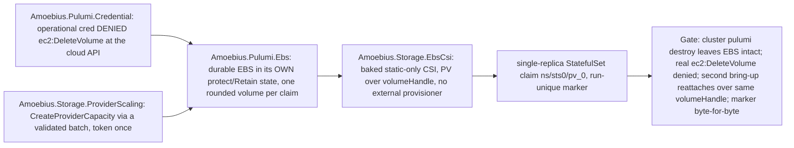

# Phase 78: Per-PV EBS decoupling + create-vs-delete credential

> **Purpose**: Make durable per-PV EBS **structurally** outside the ephemeral cluster's destroy set — carried in
> its own `protect`/`Retain` durable-class Pulumi state and guarded by an operational credential that is
> *denied `ec2:DeleteVolume` at the cloud API* — then complete the Pulumi-created-volume → mounted-claim path
> through a static-only, baked AWS EBS CSI (no external provisioner, static PV over the volume's `volumeHandle`)
> and realize the `CreateProviderCapacity` storage-scaling arm on the `provider` lane driven from a
> `linux-cpu` parent.
> **Read this if**: phase 78 is next in the queue, or a later phase depends on what its gate establishes.

This document specifies a target capability only. Any pre-reset implementation result, pass, seal, receipt,
command transcript, or evidence reference retained below is historical inventory only: it is permanently
non-operative, cannot satisfy any current contract, and cannot satisfy a gate through a status edit. Current
status is owned by [the tracker](README.md) and the Phase Status block below.

Link-graph metadata

**Status**: Authoritative source
**Supersedes**: N/A
**Referenced by**: DEVELOPMENT_PLAN/README.md, DEVELOPMENT_PLAN/overview.md, DEVELOPMENT_PLAN/phase_76_provider_deploy_checkpoint.md, DEVELOPMENT_PLAN/phase_77_provider_child_bringup.md, DEVELOPMENT_PLAN/phase_79_provider_dynamic_nodes.md
**Generated sections**: none

## Contents

- [Phase Status](#phase-status)
- [Phase Summary](#phase-summary)
- [Gate integrity](#gate-integrity)
- [Resource provision — UNRESOLVED](#resource-provision--unresolved)
- [Doctrine adopted](#doctrine-adopted)
- [Sprints](#sprints)
- [Sprint 78.1: Per-PV durable EBS in its own state + node-vs-storage decoupling](#sprint-781-per-pv-durable-ebs-in-its-own-state--node-vs-storage-decoupling-)
- [Sprint 78.2: The create-vs-delete credential model (cloud-API delete-deny)](#sprint-782-the-create-vs-delete-credential-model-cloud-api-delete-deny-)
- [Sprint 78.3: Static-only baked AWS EBS CSI + static PV over volumeHandle](#sprint-783-static-only-baked-aws-ebs-csi--static-pv-over-volumehandle-)
- [Sprint 78.4: Provider-volume migration + the `CreateProviderCapacity` storage-scaling arm](#sprint-784-provider-volume-migration--the-createprovidercapacity-storage-scaling-arm-)
- [Sprint 78.5: Phase gate — durable EBS retained across teardown + cloud-API delete-deny + static-CSI reattach](#sprint-785-phase-gate--durable-ebs-retained-across-teardown--cloud-api-delete-deny--static-csi-reattach-)
- [Documentation Requirements](#documentation-requirements)
- [Related Documents](#related-documents)

---

## Phase Status

⏸️ Blocked — NOT VALIDATED.

Blocked by redesigned Phase 77, its independent validation, and gate pass; every earlier
gate barrier must also be satisfied in numerical order. Every earlier completion claim and implementation result in this document is historical rather than a current gate result, even
where the surrounding prose has not yet been rewritten. Existing implementation is an **Observed footprint /
Known partial** only.

Hardware validation is also prohibited until the hardware-free DSL gate barrier is independently
satisfied and gate-passed.

> **Reset contract interpretation.** The phase-specific gate check below is UNRESOLVED — NOT VALIDATED. Until Phase 0 Sprint 0.7 replaces every unresolved row and the complete qualified gate passes, the summary and work breakdown are a capability inventory, not an executable contract. Any wording that prescribes tracked non-`.hs` behavioural source, a Python/shell verdict, repository-retained generated behavioral transport material, `pb` behavior outside its minimal-platform-discrimination/contained-toolchain-establishment/source-bound-build/opaque-exec grammar, or host/hardware validation before the Phase-49 barrier is historical and non-operative.

## Phase Summary

This phase's target is the **per-PV EBS arm** of the managed-provider axis: each claim has exactly one PV and
exactly one EBS volume, whose lifetime is decoupled from the node and from the ephemeral cluster stack. It owns
four deliverables, all driven from the single `linux-cpu` parent, plus the phase gate — the durable-EBS slice of
the provider corpus.

First, a **per-PV durable EBS in its own state** (`Amoebius.Pulumi.Ebs`): each PV's EBS volume is placed in its
**own durable-class logical checkpoint namespace** ([§3](../documents/engineering/pulumi_iac_doctrine.md#3-state-lifetime-matches-resource-lifetime-per-class)), one rounded volume per claim, flagged `protect`/`Retain`
and **never** in the per-run cluster stack, so a normal `pulumi destroy` of the cluster never includes it. Before
`CreateVolume`, provisioning consumes the private
`ProvisionedVolumeDemand { claim, backing, attachment, requiredUsableBytes, provisionedBytes, presentation,
allocation, witness }`: logical/geometry bytes become `requiredUsableBytes`; the pinned block/filesystem
presentation adds overhead; the EBS volume-type minimum and whole-GiB quantum derive one
`ProviderVolumeRequest { volumeType, zone, requiredUsableBytes, allocation, sizeGiB, provisionedBytes,
presentation, witness }`, whose same rounded `provisionedBytes` is used by PVC, PV, and `CreateVolume`. A
deterministic `ProviderVolumeSlotId { account, cluster, claim, request }` debits that promised slot against the
freshly observed durable residual (separate provider quota ledgers for durable bytes and durable volume count),
records `Promised` in the backing witness, and only the real EBS id returned by create transitions it to
`Materialized`; raw Dhall never fabricates a future `ProviderVolumeId`. A destroyed/replaced EC2 node detaches
its EBS and the volume survives; the next bring-up re-attaches the same volume to the same
`<namespace>/<statefulset>/pv_<integer>` claim, keeping the logical `BackingId` and slot stable.

Second, a **create-vs-delete credential model** (`Amoebius.Pulumi.Credential`): the operational credential is
granted `ec2:CreateVolume` (plus the per-run cluster create/delete it needs) but **denied `ec2:DeleteVolume`** on
durable retained volumes, so accidental durable-data destruction is *unauthorized at the cloud API*, not merely
discouraged. The only automated delete authority is the elevated test credential, limited to test-owned volumes
and exercised in [Phase 90](phase_90_test_topology_live.md) — referenced, never invoked here. Production reclaim
uses a separate human-operated external break-glass credential against an exact `ReclaimEligible` target; it is
not a spec or reconciler capability. The distinct CSI runtime identity is attach-only
(`Describe*`/`AttachVolume`/`DetachVolume`) and is denied both `CreateVolume` and `DeleteVolume`.

Third, a **static-only AWS EBS CSI path** (`Amoebius.Storage.EbsCsi`): the upstream AWS EBS CSI controller/node
binaries and required sidecars are **baked into the amoebius base image** and installed from typed manifests
(no Helm, no public image pull), version-pinned by a separately authored Haskell service-inventory
expectation; any rendered Dhall is generated beneath `.build/**`. No external-provisioner container is installed; each fresh
PV names `spec.csi.driver: ebs.csi.aws.com`, the Pulumi-created EBS ID as `volumeHandle`, and node affinity for
the volume's Availability Zone. Pulumi creates the durable EBS volume; it does **not** delegate provisioning to
Kubernetes, so the cluster's sole StorageClass remains `kubernetes.io/no-provisioner`. Placement consumes one
`ebs.csi.aws.com` attach slot per unique mounted PVC, using the lesser of the declared driver policy and the live
`CSINode`/SKU limit.

Fourth, the **`CreateProviderCapacity` storage-scaling arm** (`Amoebius.Storage.ProviderScaling`): a
policy-driven `Growable` durable-EBS budget grows only through a typed `ScalingPolicy`, realized without adding a
second create path. Provider-volume replacement or shrink is a `StorageMigrationDemand`, not an in-place edit;
old and new raw allocations, provider volume counts, copy/verify workspace, and the complete copy Job envelope
must fit simultaneously, and a failed copy/verification or unobservable cleanup retains and charges both volumes.
This phase is the live owner of the `CreateProviderCapacity` cloud-mutation capability:
[Phase 28](phase_28_storage_geometry_folds.md) owns the policy-only envelope and the observe-then-plan
`Growable`/scaling fold; [Phase 58](phase_58_object_reconciler.md) owns the generic fresh-snapshot validation and
single-use dispatcher; this phase alone supplies the account-scoped cloud mutation — embedding an exact
storage-capacity refinement of the batch-owned Pulumi graph, validating it against current durable byte/count
quota and execution supply, consuming its cloud and scaling tokens once, and accepting only receipt-bound
EBS/checkpoint readback. Retained-carve allocation and host migration remain [Phase 60](phase_60_retained_storage.md)
arms.

What is **not** here: the provider-cluster Pulumi deploy, the Vault-Transit-enveloped MinIO checkpoint backend,
the executor/plugin/workspace `PulumiExecutionDemand`, and `observeProviderAccount`
([Phase 76](phase_76_provider_deploy_checkpoint.md)); the hostless in-cluster control-plane daemon, the capacity-scheduler
roles, full platform-service convergence, and the parent→child Lease handoff
([Phase 77](phase_77_provider_child_bringup.md)); dynamic node provisioning by signal, the ephemeral
node-root EBS class, and the leak-free tag-sweep teardown gate ([Phase 79](phase_79_provider_dynamic_nodes.md));
and the elevated-harness reclamation of durable test-flagged EBS that makes a *full* leak-free test *cycle*
possible ([Phase 90](phase_90_test_topology_live.md)).

*Orientation. Design intent. The module seams this phase adds and the gate that closes over them; the gate's apparatus is owned by [Gate integrity](#gate-integrity). No part of it has run.*

**Phase scope:** one cohesive claim — *durable volumes are structurally outside the ephemeral cluster's destroy set*. The credential that could delete one is denied at the cloud API, not by convention.

**Substrate:** linux-cpu — the acceptance gate runs on exactly one hardware substrate: the `linux-cpu` parent
`kind` cluster from inside which the Pulumi engine issues the deploy. EKS is the managed-engine deploy target,
not a fifth hardware substrate ([`substrates.md` §2](substrates.md#2-substrate-inventory),
[`development_plan_standards.md` §L](development_plan_standards.md#l-one-substrate-discipline)).

**Lane:** provider — the canonical managed-provider target lane driven from the linux-cpu parent
([§L](development_plan_standards.md#l-one-substrate-discipline)).

**Register:** 3 (live infrastructure) — the gate spins up a real provider cluster with a real durable EBS
volume, writes and reads a marker across a real `pulumi destroy` and re-attach, and issues a real
`ec2:DeleteVolume` against the cloud API; no register-1/2 in-process check discharges it. A future candidate
ledger must scope any *tested* statement to the EKS target from a `linux-cpu` parent, classify retention by
lifetime, and leave elevated-harness reclamation to [Phase 90](phase_90_test_topology_live.md). The ledger
cannot make the phase gate pass.

**Depends on:** [Phase 77](phase_77_provider_child_bringup.md)
**Gate:** `pb validate phase 78`; see [Gate integrity](#gate-integrity).

## Gate integrity

**Contract check**: REJECTED — NOT VALIDATED.

| Key | Contract |
|---|---|
| `Claim` | UNRESOLVED — blocks validation: typed semantic payload and gate evidence missing; prior prose: one cohesive claim — *durable volumes are structurally outside the ephemeral cluster's destroy set*. The credential that could delete one is denied at the cloud API, not by convention. Explicit exclusions: every layer named in `Residue` remains UNVERIFIED. |
| `Subject` | UNRESOLVED — blocks validation: no production `.hs` module and entry point have been independently established for this reset contract. |
| `Command` | UNRESOLVED — blocks validation: typed semantic payload and gate evidence missing; prior prose: `pb validate phase 78` is the target command only; `pb` may only make the minimal platform distinction, establish the contained toolchain, build the source-bound binary, and exec it with argv unchanged, while the Haskell verdict entry point remains UNRESOLVED and blocks validation. |
| `Oracle` | UNRESOLVED — blocks validation: no separately authored `.hs` oracle, independence boundary, provenance have been established. |
| `Positive controls` | UNRESOLVED — blocks validation: no closed named Haskell corpus and exact per-member observations have been accepted. |
| `Paired negatives` | UNRESOLVED — blocks validation: minimally different pairs, exact rejection loci, and exact reasons have not yet been demonstrated by a passing gate for every foreclosed dimension. |
| `Mutants` | UNRESOLVED — blocks validation: operators, production loci, applied-change witnesses, expected red observations, and unaffected controls have not yet been demonstrated by a passing gate. |
| `Discovery` | UNRESOLVED — blocks validation: expected and runtime-discovered surfaces, two-way equality, and empty-discovery refusal have not yet been demonstrated by a passing gate. |
| `Challenge` | UNRESOLVED — blocks validation: neither a post-start challenge nor a checked pure-claim independent predicate has been accepted. |
| `Observer` | UNRESOLVED — blocks validation: no outside observer, raw observation, authenticity check, and fail-closed rule have been accepted. |
| `Authority/bypass` | UNRESOLVED — blocks validation: least-privilege/foreign-scope pairs, bypass probes, or checked non-applicability have not yet been demonstrated by a passing gate. |
| `Freshness` | UNRESOLVED — blocks validation: stale state, cached output, prior evidence, and replayed responses have not been made unable to pass. |
| `Qualification` | UNRESOLVED — blocks validation: the fixed sabotage corpus has not qualified a Haskell harness independently of a clean candidate run. |
| `Cleanroom` | UNRESOLVED — blocks validation: no run has derived all products lazily with generated and condemned legacy copies absent. |
| `Legacy closure` | UNRESOLVED — blocks validation: stable owned legacy IDs and their exact zero-finding check have not been reconciled. |
| `Predecessor` | UNRESOLVED — blocks validation: typed semantic payload and complete gate execution missing; prior prose: Exact `ImmediatePredecessorPass` for Phase 77; candidate execution refuses an absent, stale, replayed, or different-source result. |
| `Residue` | UNRESOLVED — blocks validation: typed semantic payload and gate evidence missing; prior prose: UNVERIFIED — the entire phase claim and all semantic, effect, runtime, hardware, and cleanup layers remain unvalidated; no empty residue is asserted. |
| `Pass criterion` | UNRESOLVED — blocks validation: typed semantic payload and complete gate execution missing; prior prose: `qualified-gate-pass` — every required gate row must succeed in one qualified run for the exact current source; that complete pass is sufficient for the status-only transition. |

## Resource provision — UNRESOLVED

> **UNRESOLVED — blocks validation.** No live mutation may begin. Before check this phase must name its exact owner marker, preflight, allowed and forbidden mutations, external observer, scoped cleanup, and zero-owned-residue criterion. The detailed material retained below is capability inventory only and cannot supply or substitute for that contract.

The gate provisions, before any cloud mutation, exactly this envelope for the durable-EBS slice (the surrounding
provider control plane, node group, and executor peaks are provisioned by
[Phase 76](phase_76_provider_deploy_checkpoint.md)):

- one `ProvisionedVolumeDemand` → one `ProviderVolumeRequest` per claim, retaining usable (`requiredUsableBytes`)
  and raw (`provisionedBytes`, integral `sizeGiB`) geometry distinctly, debited to the **durable-bytes** and
  **durable-volume-count** provider quota ledgers (never the ephemeral node-root EBS ledgers);
- one durable-class checkpoint `PulumiCheckpointObjectDemand` with its own `StorageBudgetId` and exclusive
  `ObjectStoreMutationAdmission`, provisioned **independently** of the ephemeral cluster stack so it does not
  disappear merely because the live volume is retained;
- the baked static-only EBS CSI controller/node components and required sidecars (typed-manifest install, no
  external provisioner), consuming one `ebs.csi.aws.com` attach slot per unique mounted PVC (the lesser of the
  declared driver policy and the live `CSINode`/SKU limit);
- for the scaling/migration arms, a `ProvisionedStorageMigration` retaining both exact provisioned volume
  demands, `workspaceBytes`, the copy/verify `copyExecution : PodResourceEnvelope`, two provider volume-count
  slots, and both required `ebs.csi.aws.com` attachments — all charged **simultaneously** before the replacement
  is created.

## Doctrine adopted

- [`jit_budget_doctrine.md` §3 — A ceiling is inseparable from its concurrency](../documents/engineering/jit_budget_doctrine.md#3-a-ceiling-is-inseparable-from-its-concurrency) — the bytes per-PV EBS decoupling + create-vs-delete credential causes to exist are charged to a grant that carries its ceiling and concurrency together.
- [`pulumi_ebs_credential_model.md` §6 — The EBS create-vs-delete credential model](../documents/engineering/pulumi_ebs_credential_model.md#6-the-ebs-create-vs-delete-credential-model)
  — *the EBS create-vs-delete credential model* — with
  [`pulumi_iac_doctrine.md` §3 — State lifetime matches resource lifetime, per class](../documents/engineering/pulumi_iac_doctrine.md#3-state-lifetime-matches-resource-lifetime-per-class)
  (*state lifetime matches resource lifetime, per class*) and the per-PV-EBS entry of
  [`pulumi_iac_doctrine.md` §4 — What Pulumi provisions (the resource catalog)](../documents/engineering/pulumi_iac_doctrine.md#4-what-pulumi-provisions-the-resource-catalog)
  (*the resource catalog*): durable EBS is created by Pulumi in its own durable-class state (never in the per-run
  cluster stack), so a routine `pulumi destroy` cannot include it, and the operational credential that could
  otherwise delete it is denied `ec2:DeleteVolume` at the cloud API. Pulumi creates the volume; it does not
  delegate provisioning to Kubernetes.
- [`storage_lifecycle_doctrine.md` §5.1 — Storage is independent of the node lifecycle](../documents/engineering/storage_lifecycle_doctrine.md#51-storage-is-independent-of-the-node-lifecycle)
  and [`storage_lifecycle_doctrine.md` §7 — Deleting durable data is forbidden under normal operation](../documents/engineering/storage_lifecycle_doctrine.md#7-deleting-durable-data-is-forbidden-under-normal-operation)
  and [`storage_lifecycle_doctrine.md` §7.1 — The single exception: the elevated test harness](../documents/engineering/storage_lifecycle_doctrine.md#71-the-single-exception-the-elevated-test-harness)
  — *storage is independent of the node lifecycle* / *deleting durable data is forbidden under normal operation*
  and *the single exception: the elevated test harness*: per-PV EBS survives node replacement and reattaches
  through a **statically** rendered EBS CSI PV rather than dynamic provisioning; within amoebius automation only
  the [Phase 90](phase_90_test_topology_live.md) elevated harness may destroy a test-owned volume, and production
  reclaim is an external operator break-glass action against an exact `ReclaimEligible` target, never a routine
  teardown. Provider-volume replacement/shrink consumes the generic old+new `StorageMigrationDemand`; old/new raw
  allocation, copy workspace and execution, and provider byte/count overlap stay charged through verification and
  failed cleanup.
- [`image_build_doctrine.md` §2 — The single distribution rule: bake the binaries, build the amoebius image, pull only in-cluster](../documents/engineering/image_build_doctrine.md#2-the-single-distribution-rule-bake-the-binaries-build-the-amoebius-image-pull-only-in-cluster)
  with [`image_build_doctrine.md` §7 — What amoebius bakes vs builds — the base container is the supply chain](../documents/engineering/image_build_doctrine.md#7-what-amoebius-bakes-vs-builds--the-base-container-is-the-supply-chain)
  — *third-party binaries are baked; workloads pull only in-cluster*: the upstream AWS EBS CSI controller/node
  implementation and required sidecars are consumed as baked binaries under typed manifests, never as a public
  image or Helm chart.
- [`resource_capacity_doctrine.md` §6 — `Growable` / `ScalingPolicy`: the quota-bounded dynamic-provisioning arm](../documents/engineering/resource_capacity_doctrine.md#6-growable--scalingpolicy-the-quota-bounded-dynamic-provisioning-arm)
  and [`resource_capacity_types.md` §3 — The types: `Quantity`, `Capacity`, `Demand`, `Budget`; “The systematic provision matrix”](../documents/engineering/resource_capacity_types.md#31-the-systematic-provision-matrix)
  — *`Growable` / `ScalingPolicy`: the quota-bounded dynamic-provisioning arm* and *the systematic provision
  matrix*: the `CreateProviderCapacity` storage-scaling transition is the runtime enaction of a typed
  `ScalingPolicy` against the freshly observed durable byte/count residual; the provider quota is the outer
  ceiling, a bounded budget grows only through the policy and never to "unbounded", and any durable-storage,
  migration-transition, executor, or checkpoint-object obligation failure rejects before cloud mutation.
- [`chaos_failover_doctrine.md` §12 — The moral core — proven, tested, assumed](../documents/engineering/chaos_failover_doctrine.md#12-the-moral-core--proven-tested-assumed)
  (cross-reference) — *proven, tested, assumed*: the gate emits a proven/tested/assumed ledger recording
  durable-EBS retention as *correct-by-class* and the elevated-harness durable-EBS reclamation as *explicitly
  deferred to [Phase 90](phase_90_test_topology_live.md)*; skipping an applicable teardown-observation move marks
  that layer UNVERIFIED, never green.

## Sprints

> **Reset validation check.** Every pre-reset `Independent Validation` and `### Validation` below is historical context rather than a current criterion. It is retained only to inventory the capability while the fixed Haskell subject/oracle/mutant/legacy contract is rewritten.

> **Permanent sprint reset.** Every pre-reset sprint result below is historical context. The retained body is non-operative capability inventory only. Current acceptance requires the resolved eighteen-row Haskell gate contract, fresh independently observed evidence, immediate-predecessor gate pass, owned legacy closure, and a complete gate pass.
>
> **Source/artifact boundary.** Every retained fixture, oracle, expected value, corpus, schema, config, manifest, transcript, receipt, script, and mutation name below denotes semantics authored in checked Haskell `.hs`. Any reproducible serialized or materialized form is generated lazily beneath ignored `.build/**` and remains untracked. No retained artifact path is an implementation instruction; `pb/**` remains the bootstrap-only exception and owns none of this behavior.

## Sprint 78.1: Per-PV durable EBS in its own state + node-vs-storage decoupling ⏸️

**Status**: Blocked — NOT VALIDATED
**Implementation**: UNRESOLVED — blocks validation: the authored Haskell implementation path has not been established.
**Blocked by**: [Phase 77](phase_77_provider_child_bringup.md) gate pass
**Independent Validation**: UNRESOLVED — blocks validation: no falsifiable positive control, paired specific-reason negative, changed-subject mutant, and residue seam has been established.
**Oracle**: UNRESOLVED — blocks validation: no separate Haskell oracle, independence boundary have been established.
**Legacy IDs**: UNRESOLVED — blocks validation: typed Haskell legacy bindings have not been reconciled for this sprint.
**Docs to update**: UNRESOLVED — blocks validation: governed doctrine owners have not been established for this sprint.

### Objective

Adopt [`pulumi_iac_doctrine.md §3 — State lifetime matches resource lifetime, per class`](../documents/engineering/pulumi_iac_doctrine.md#3-state-lifetime-matches-resource-lifetime-per-class)
and [`storage_lifecycle_doctrine.md §5.1 — storage is independent of the node lifecycle`](../documents/engineering/storage_lifecycle_doctrine.md#51-storage-is-independent-of-the-node-lifecycle):
make durable storage **structurally** outside the ephemeral destroy set by placing each per-PV EBS volume in its
own `protect`/`Retain` durable-class Pulumi state, and derive the one rounded `provisionedBytes` used by PVC, PV,
and `CreateVolume` from the claim's application/geometry-derived usable bytes, so "ephemeral cluster, durable
data" cannot collapse on a routine teardown.

### Deliverables

- An `Amoebius.Pulumi.Ebs` program placing each PV's EBS volume in its **own durable-class state** (separate
  logical checkpoint namespace, [§3](../documents/engineering/pulumi_iac_doctrine.md#3-state-lifetime-matches-resource-lifetime-per-class)), with one rounded volume per claim, flagged `protect`/`Retain`, and
  **never** in the per-run cluster stack — so a normal `pulumi destroy` of the cluster never includes it.
- Each durable stack's checkpoint is itself an exact `PulumiCheckpointObjectDemand`, with resource-state field
  identities, finite retained revisions and failed-partial/orphan exposure, an owning `StorageBudgetId`, and the
  exclusive checkpoint mutation admission. The durable backend budget remains provisioned independently of the
  ephemeral cluster stack and cannot disappear merely because the live volume is retained.
- Before `CreateVolume`, provisioning consumes the private `ProvisionedVolumeDemand { claim, backing,
  attachment, requiredUsableBytes, provisionedBytes, presentation, allocation, witness }`: logical/geometry bytes
  become `requiredUsableBytes`; its pinned block/filesystem presentation adds overhead; the EBS volume-type
  minimum and whole-GiB quantum derive `ProviderVolumeRequest { volumeType, zone, requiredUsableBytes,
  allocation, sizeGiB, provisionedBytes, presentation, witness }`. It then derives a deterministic
  `ProviderVolumeSlotId { account, cluster, claim, request }`, debits that promised slot's rounded byte/count
  cost against the freshly observed durable residual (separate provider quota ledgers for durable bytes and
  volume count), and records `Promised` in the private backing witness. The real EBS id returned by create is
  attached and cross-checked into `Materialized`; no serialized projection, including lazily generated or
  operator-supplied Dhall, can fabricate a future `ProviderVolumeId`.
  Retained rebind keeps the logical `BackingId` and slot stable.
- Node-vs-storage decoupling: a destroyed/replaced EC2 node detaches its EBS and the volume survives; the next
  bring-up re-attaches the same volume to the same `<namespace>/<statefulset>/pv_<integer>` claim.
- An in-file honesty note: `Amoebius.Pulumi.Ebs` produces the durable-class state and the `Promised`/`Materialized`
  witness; the operational-credential delete-deny that makes retention *unauthorized* rather than merely *skipped*
  is Sprint 78.2, and the static attach/mount path is Sprint 78.3.

### Validation

1. Create a per-PV EBS in separate durable state and assert the pre-create witness contained the deterministic
   promised slot and no real volume id, the integer-GiB `CreateVolume` request exactly matched it, and the
   returned id was the only transition to `Materialized`. Independently observe EBS raw bytes, CSI
   `volumeMode`/fsType, and mounted usable capacity: raw must equal `provisionedBytes` and usable must be at
   least `requiredUsableBytes`.
2. Assert claim:PVC/PV:EBS identity/cardinality is 1:1:1; PVC and PV capacities equal the provider-rounded
   `provisionedBytes`, EBS reports that same raw size, and the mounted filesystem supplies the witnessed usable
   bytes. A Haskell-declared case whose logical bytes are not an integral GiB proves rounding is performed once, and one whose
   filesystem metadata makes raw-equals-usable insufficient is rejected or rounded upward.
3. Assert the volume's state is a distinct logical checkpoint namespace from the ephemeral cluster stack's
   checkpoint by **distinct MinIO object keys read from the store**, not from the program that wrote them. A slot
   differing by one required-usable byte, allocation minimum/quantum, zone, type, presentation, or account-usage
   change before create invalidates the `ValidatedCloudProviderAction` and records **zero** `CreateVolume` calls.
4. Destroy/replace the node holding the volume and assert the EBS survives and re-attaches through a freshly
   rendered claim binding on the next bring-up, with the logical `BackingId` and `ProviderVolumeSlotId` stable.

### Remaining Work

Materialize an EBS volume and observe its raw/usable geometry, node detach, cluster destroy survival, and same-id
reattach. The pure geometry, class separation, Transit/MinIO, and retained-storage analogue are complete.

## Sprint 78.2: The create-vs-delete credential model (cloud-API delete-deny) ⏸️

**Status**: Blocked — NOT VALIDATED
**Implementation**: UNRESOLVED — blocks validation: the authored Haskell implementation path has not been established.
**Blocked by**: Sprint 78.1
**Independent Validation**: UNRESOLVED — blocks validation: no falsifiable positive control, paired specific-reason negative, changed-subject mutant, and residue seam has been established.
**Oracle**: UNRESOLVED — blocks validation: no separate Haskell oracle, independence boundary have been established.
**Legacy IDs**: UNRESOLVED — blocks validation: typed Haskell legacy bindings have not been reconciled for this sprint.
**Docs to update**: UNRESOLVED — blocks validation: governed doctrine owners have not been established for this sprint.

### Objective

Adopt [`pulumi_ebs_credential_model.md §6 — The EBS create-vs-delete credential model`](../documents/engineering/pulumi_ebs_credential_model.md#6-the-ebs-create-vs-delete-credential-model)
and [`storage_lifecycle_doctrine.md §7 / §7.1`](../documents/engineering/storage_lifecycle_doctrine.md#7-deleting-durable-data-is-forbidden-under-normal-operation):
make the authority to delete durable data **structurally** withheld from normal operation, so accidental
durable-data destruction is *unauthorized at the cloud API*, not merely discouraged, and the only automated
delete authority is the elevated test credential ([Phase 90](phase_90_test_topology_live.md), referenced not invoked here).

### Deliverables

- An `Amoebius.Pulumi.Credential` split: the operational credential is granted `ec2:CreateVolume` (plus the
  per-run cluster create/delete it needs) but **denied `ec2:DeleteVolume`** on durable retained volumes.
- The only automated delete authority is the elevated test credential, limited to test-owned volumes and
  exercised in [Phase 90](phase_90_test_topology_live.md) — referenced, not invoked here. Production reclaim uses a
  separate human-operated external break-glass credential against an exact `ReclaimEligible` target; it is not a
  spec or reconciler capability.
- The distinct CSI runtime identity is attach-only (`Describe*`/`AttachVolume`/`DetachVolume`) and is denied
  both `CreateVolume` and `DeleteVolume`.
- An in-file honesty note: the operational-vs-elevated *credential class* is proven in prodbox, but the
  Pulumi-tracked durable-EBS model the deny statement guards is new amoebius design (see the sprint Honesty note).

### Validation

1. Policy test at the cloud API, not in-process: "denied" means a **real `ec2:DeleteVolume` API call** issued
   under the operational credential against a **live dummy test-flagged EBS volume** returns an
   `AccessDenied`/`UnauthorizedOperation` response from AWS (the volume survives the attempt) — explicitly
   **NOT** the IAM policy simulator, **NOT** an in-process evaluation of the generated policy JSON, which prove
   nothing at the cloud API despite the objective's "unauthorized at the cloud API" framing. Paired positive:
   the same operational credential *can* `ec2:CreateVolume` (a real create succeeds), so the deny is specific to
   the delete dimension (§M.8).
2. The reference policy expectation (which action → allow/deny) is an independently authored Phase-0 Haskell
   table. Its reproducible text view is generated lazily at
   `.build/test-corpora/ebs_credential_matrix.txt` and remains untracked; assert the generated
   `Amoebius.Pulumi.Credential` operational and CSI-runtime policies match it action-for-action (§M.1/§M.3), and
   that the CSI runtime identity is denied both create and delete.
3. The Haskell-authored changed-subject seeded mutant `mut-46.1-allow-delete` (the operational policy with the `ec2:DeleteVolume` `Deny`
   statement removed) MUST go **red** here — under it the real delete would succeed.

### Remaining Work

Issue the paired real `CreateVolume`/`DeleteVolume` calls under the operational identity and the CSI-runtime
cloud audit once valid AWS authority is available.

> **Honesty.** The create-vs-delete credential split is a **design resolution of an explicitly open question**;
> the operational-vs-elevated *credential class* is proven in prodbox, but EBS-in-prodbox is CSI-driver-created,
> **not** Pulumi-tracked — so amoebius's Pulumi-tracked durable-EBS model is *new design, not inherited proof*.

## Sprint 78.3: Static-only baked AWS EBS CSI + static PV over volumeHandle ⏸️

**Status**: Blocked — NOT VALIDATED
**Implementation**: UNRESOLVED — blocks validation: the authored Haskell implementation path has not been established.
**Blocked by**: Sprint 78.2
**Independent Validation**: UNRESOLVED — blocks validation: no falsifiable positive control, paired specific-reason negative, changed-subject mutant, and residue seam has been established.
**Oracle**: UNRESOLVED — blocks validation: no separate Haskell oracle, independence boundary have been established.
**Legacy IDs**: UNRESOLVED — blocks validation: typed Haskell legacy bindings have not been reconciled for this sprint.
**Docs to update**: UNRESOLVED — blocks validation: governed doctrine owners have not been established for this sprint.

### Objective

Adopt [`image_build_doctrine.md §2 — the single distribution rule: bake the binaries`](../documents/engineering/image_build_doctrine.md#2-the-single-distribution-rule-bake-the-binaries-build-the-amoebius-image-pull-only-in-cluster)
(with [`§7`](../documents/engineering/image_build_doctrine.md#7-what-amoebius-bakes-vs-builds--the-base-container-is-the-supply-chain))
and [`storage_lifecycle_doctrine.md §5.1`](../documents/engineering/storage_lifecycle_doctrine.md#51-storage-is-independent-of-the-node-lifecycle):
complete the path from a Pulumi-created volume to a mounted claim explicitly by **consuming** the upstream AWS
EBS CSI implementation from the amoebius base image and rendering **static** PVs over known volume IDs, rather
than building an amoebius attach controller or enabling dynamic provisioning.

### Deliverables

- A static-only `Amoebius.Storage.EbsCsi` path: the upstream AWS EBS CSI controller/node binaries and required
  sidecars are baked into the amoebius base image and installed from typed Haskell manifests (no Helm/public
  image pull), version-pinned by an independently authored Phase-0 Haskell expectation whose reproducible Dhall
  view is generated lazily at `.build/test-corpora/provider_ebs_credential/ebs_csi_bake_expected.dhall`; **no**
  external-provisioner container is installed; each fresh PV names `spec.csi.driver: ebs.csi.aws.com`, the
  Pulumi-created EBS ID as `volumeHandle`, and node affinity for the volume's Availability Zone.
- Placement consumes one `ebs.csi.aws.com` attach slot per unique mounted PVC, using the lesser of the declared
  driver policy and the live `CSINode`/SKU limit; the cluster's sole StorageClass remains
  `kubernetes.io/no-provisioner`.
- A `BakeInventory` extension registering the provider-only CSI controller/node/sidecar binaries in the
  base-image supply chain, executable by absolute path on both architectures.
- An in-file honesty note: Pulumi creates the durable EBS volume; amoebius consumes the upstream CSI only for
  static attach/mount and does **not** delegate provisioning to Kubernetes (see the sprint Honesty note).

### Validation

1. Create a per-PV EBS (Sprint 78.1), render a static PV whose CSI `volumeHandle` is that exact EBS ID and whose
   zone affinity matches the volume, and observe the EBS CSI controller/node components Ready **before** the
   bind; assert the bind succeeds without any external provisioner.
2. Assert the cluster still has exactly one StorageClass, `kubernetes.io/no-provisioner`; the EBS CSI install
   contains no external-provisioner; and an independent cloud audit records no `CreateVolume` call under the CSI
   runtime identity.
3. The provider-driver extension to `BakeInventory` is checked against the independently authored Haskell bake
   expectation (with its untracked lazy projection at
   `.build/test-corpora/provider_ebs_credential/ebs_csi_bake_expected.dhall`), and each pinned controller/node/sidecar binary executes
   by absolute path with its expected version on both base-image architectures.
4. The Haskell-authored changed-subject seeded mutant `mut-46.1-enable-dynamic-provisioner` (adds the external-provisioner plus an
   `ebs.csi.aws.com` provisioning StorageClass) MUST go **red** on the object-set and cloud-audit assertions.

### Remaining Work

Bake and execute the five pinned binaries on both architectures, bring real AWS EBS CSI Ready, and bind/mount a
provider-created handle. The no-dynamic-provisioner model and Kubernetes object readback are complete.

> **Honesty.** amoebius consumes the upstream AWS EBS CSI implementation only for static attach/mount; its
> baked-binary, generated-manifest, no-external-provisioner realization is **new and untested** here. Pulumi
> creates the durable EBS volume; it does not delegate provisioning to Kubernetes.

## Sprint 78.4: Provider-volume migration + the `CreateProviderCapacity` storage-scaling arm ⏸️

**Status**: Blocked — NOT VALIDATED
**Implementation**: UNRESOLVED — blocks validation: the authored Haskell implementation path has not been established.
**Blocked by**: Sprint 78.3
**Independent Validation**: UNRESOLVED — blocks validation: no falsifiable positive control, paired specific-reason negative, changed-subject mutant, and residue seam has been established.
**Oracle**: UNRESOLVED — blocks validation: no separate Haskell oracle, independence boundary have been established.
**Legacy IDs**: UNRESOLVED — blocks validation: typed Haskell legacy bindings have not been reconciled for this sprint.
**Docs to update**: UNRESOLVED — blocks validation: governed doctrine owners have not been established for this sprint.

### Objective

Adopt [`resource_capacity_doctrine.md §6 — Growable / ScalingPolicy`](../documents/engineering/resource_capacity_doctrine.md#6-growable--scalingpolicy-the-quota-bounded-dynamic-provisioning-arm)
(with [`§3.1 — the systematic provision matrix`](../documents/engineering/resource_capacity_types.md#31-the-systematic-provision-matrix))
and [`storage_lifecycle_doctrine.md §7.1`](../documents/engineering/storage_lifecycle_doctrine.md#71-the-single-exception-the-elevated-test-harness):
realize the provider-volume storage-scaling arm without adding a second create path — a policy-driven
`CreateProviderCapacity` transition is an exact refinement of the same batch-owned EBS program, quota debit,
durable checkpoint, and static-attachment machinery — and make replacement/shrink a fully-charged
`StorageMigrationDemand`, never an in-place size edit.

### Deliverables

- Provider replacement/shrink enaction consumes a `StorageMigrationDemand { identity, old, replacement, policy }`
  instead of mutating a size in place. The private `ProvisionedStorageMigration` retains both exact provisioned
  volume demands, derived `workspaceBytes`, a complete copy/verify Job `copyExecution : PodResourceEnvelope`, the
  per-backing peak, and witness. Admission charges old+new raw EBS bytes and two provider volume-count slots,
  workspace backing, executor image/CPU/memory/pod-ephemeral/log/writable/mapped inputs, pod slot, and both
  required `ebs.csi.aws.com` attachments simultaneously. Cutover occurs only after byte-for-byte verification;
  failure keeps both EBS volumes and checkpoints intact and charged, and old capacity remains
  accounting-committed in the live state until
  external privileged deletion is freshly observed.
- The sole `CreateProviderCapacity` enactor for `ValidatedStorageScalingAction`. It immediately rechecks the same
  account/allocation/quota/executor/checkpoint snapshot, requires the transition's exact
  `ProvisionedStorageCapacityCloudBatch` refinement and `ValidatedCloudActionBatch`, atomically consumes the
  scaling token plus every batch action token, and accepts only post-attempt provider readback tied to that
  receipt. `NoChange`, retained-carve allocation, and host-only migration cannot reach this cloud writer;
  ambiguous outcomes retain every possible byte/count/checkpoint commitment and force re-observation.
- An in-file honesty note: this sprint builds the create-only guard's scaling/migration arms;
  `CreateProviderCapacity` is the live cloud writer, while the policy-only envelope and single-use dispatcher it
  refines are owned by [Phase 28](phase_28_storage_geometry_folds.md) and
  [Phase 58](phase_58_object_reconciler.md).

### Validation

1. Exercise a provider-volume replacement/shrink whose steady old and target states each fit. Observe that the
   private migration witness and cloud requests charge old+new raw rounded bytes, two volume-count slots,
   workspace, both CSI attachments, and the full copy/verify Job concurrently before creating the replacement.
   Paired Haskell-declared one-short cases reduce only durable EBS bytes, durable volume count, workspace backing, executor
   CPU/memory/pod-ephemeral, pod slots, or `ebs.csi.aws.com` attach slots; each rejects before `CreateVolume`,
   Job creation, or checkpoint mutation. The attach check uses the lesser of declaration and live `CSINode`/SKU
   limit and deduplicates repeated mounts of one PVC without deduplicating old versus replacement.
2. Inject copy failure, verification mismatch, and unobservable post-cutover cleanup separately. Every case
   leaves both EBS IDs, exact checkpoint evidence, and old+new provider quota debits intact; none emits
   `ReclaimEligible` or spends the old allocation as credit. The Haskell-authored changed-subject
   `mut-46.1-credit-old-before-observed-delete` mutant (admits a transition only by subtracting the old volume)
   and `mut-46.1-drop-copy-executor` (omits the
   copy Job envelope) MUST both go **red**. The success case cuts the static PV over only after byte-for-byte
   verification, while the old backing remains charged until an independent privileged observation proves
   deletion.
3. Drive a `Growable` durable-EBS budget across its threshold without editing its desired demand. The fresh
   observation and [Phase 28](phase_28_storage_geometry_folds.md) planner must select `CreateProviderCapacity`;
   validate that its storage-only action domain, deploy/checkpoint projection, rounded byte/count debit, and
   Pulumi execution demand equal the enclosing cloud batch exactly. Change account usage, allocation inventory,
   checkpoint fingerprint, or parent executor residual after validation and assert zero AWS/checkpoint calls. On
   success, assert each scaling and cloud token is consumed once and only receipt-bound EBS/checkpoint readback
   advances the allocation map; replay and lost-response cases re-observe and retain possible commitments. The
   Haskell-authored changed-subject mutant `mut-46.1-bypass-validated-batch` (calls `CreateVolume` directly from the policy/envelope,
   bypassing the validated batch) MUST go **red**.

### Remaining Work

Exercise old+new copy/verify and `CreateProviderCapacity` against real EBS with receipt-bound cloud/checkpoint
readback. All eight one-short refusals, stale/replay refusal, and overlap accounting are complete.

## Sprint 78.5: Phase gate — durable EBS retained across teardown + cloud-API delete-deny + static-CSI reattach ⏸️

**Status**: Blocked — NOT VALIDATED
**Implementation**: UNRESOLVED — blocks validation: the authored Haskell implementation path has not been established.
**Blocked by**: Sprint 78.4
**Independent Validation**: UNRESOLVED — blocks validation: no falsifiable positive control, paired specific-reason negative, changed-subject mutant, and residue seam has been established.
**Oracle**: UNRESOLVED — blocks validation: no separate Haskell oracle, independence boundary have been established.
**Legacy IDs**: UNRESOLVED — blocks validation: typed Haskell legacy bindings have not been reconciled for this sprint.
**Docs to update**: UNRESOLVED — blocks validation: governed doctrine owners have not been established for this sprint.

### Objective

Adopt [`storage_lifecycle_doctrine.md §5.1 / §7`](../documents/engineering/storage_lifecycle_doctrine.md#51-storage-is-independent-of-the-node-lifecycle)
and [`pulumi_iac_doctrine.md §3 / §6`](../documents/engineering/pulumi_iac_doctrine.md#3-state-lifetime-matches-resource-lifetime-per-class):
assemble the durable-EBS phase gate — a single live cycle that proves a routine cluster teardown leaves the
durable EBS intact, that deleting it is unauthorized at the cloud API, and that the next bring-up reattaches the
same volume through a freshly rendered static CSI PV and reads its data back unchanged.

### Deliverables

- The gate over a checked Haskell durable-EBS declaration, lazily projected to
  `.build/test-corpora/dhall/provider_dynamic_nodes/provider_provision.dhall`: spin up the provider
  cluster ([Phase 76](phase_76_provider_deploy_checkpoint.md)); create the per-PV durable EBS (Sprint 78.1);
  render and observe Ready the baked static-only CSI (Sprint 78.3); bind the Pulumi-created EBS through the static
  CSI PV and write a run-unique marker through the retained-EBS claim; record EBS identity + AZ; `pulumi destroy`
  the ephemeral cluster stack, leaving the durable EBS retained; then run the repeated full cycle constrained to
  the recorded Availability Zone, re-render a PV over the same `volumeHandle`, and verify the marker after
  reattachment.
- The credential proof (Sprint 78.2): a real `ec2:DeleteVolume` under the operational credential is denied at the
  cloud API while `ec2:CreateVolume` succeeds.
- A per-run proven/tested/assumed ledger recording: durable-EBS creation, static-CSI bind, and marker read as
  **tested on the EKS provider target from a `linux-cpu` parent**; the cloud-API delete-deny as **tested**;
  durable EBS retention across the cluster teardown as **correct-by-class**; and the elevated-harness durable-EBS
  *reclamation* as **explicitly deferred to [Phase 90](phase_90_test_topology_live.md), not asserted here**.

### Validation

1. Run the future gate end-to-end over a Haskell-declared durable-EBS case materialized only beneath the
   candidate's `.build/test-corpora/**` root; no repository-retained Dhall material may participate:
   assert the per-PV EBS is created in separate durable state, the static PV uses `driver: ebs.csi.aws.com`,
   `volumeHandle: <that EBS volume ID>`, and matching zone affinity, the EBS CSI components are Ready before the
   bind without an external provisioner, and the sole StorageClass is `kubernetes.io/no-provisioner`. Write a
   fresh run-unique marker through `<ns>/sts0/pv_0` and record the EBS volume ID and Availability Zone.
2. `pulumi destroy` the ephemeral cluster stack. Assert — by an **independent read-only cloud-API `DescribeVolumes` sweep** (a cloud-boundary observer, §M.5, explicitly **not** the emptied Pulumi checkpoint) — that the durable
   EBS **survives intact** (it is in separate, `protect`ed durable state); a retained durable volume is the sole
   permitted survivor by class, not a leak.
3. Issue a **real `ec2:DeleteVolume`** under the operational credential against the live retained/test-flagged
   volume and assert an `AccessDenied`/`UnauthorizedOperation` response with the volume surviving; assert the
   paired positive `ec2:CreateVolume` succeeds under the same credential; check both against the independent
   Haskell policy expectation, whose text view is generated lazily at
   `.build/test-corpora/ebs_credential_matrix.txt`. The Haskell-authored changed-subject mutant
   `mut-46.1-allow-delete` MUST go **red**.
4. From the cluster-absent state left by Validation 2, with the durable EBS retained, run a second full
   bring-up → bind → read → teardown cycle. Constrain the recreated node group to the recorded EBS Availability
   Zone, re-render the static PV with the same EBS volume ID as its CSI `volumeHandle`, reattach it, and read the
   run-unique marker **byte-for-byte** before teardown.
5. Assert the run emits a proven/tested/assumed ledger per
   [`chaos_failover_doctrine.md §12`](../documents/engineering/chaos_failover_doctrine.md#12-the-moral-core--proven-tested-assumed),
   recording the durable-EBS retention as correct-by-class and the elevated-harness durable-EBS reclamation as
   deferred to [Phase 90](phase_90_test_topology_live.md); skipping an applicable teardown-observation move
   (including the independent `DescribeVolumes` sweep) marks that layer **UNVERIFIED**, never green. The gate is
   red under each of `mut-46.1-allow-delete`, `mut-46.1-enable-dynamic-provisioner`,
   `mut-46.1-credit-old-before-observed-delete`, `mut-46.1-drop-copy-executor`, and
   `mut-46.1-bypass-validated-batch`.

### Remaining Work

Re-run the enumerated provider surfaces after Phase 76 can create the EKS child. Fifteen AWS/EBS/CSI/runtime
surfaces remain UNVERIFIED, including Phase-90 elevated durable reclamation.

> **Honesty.** This gate proves the **durable per-PV EBS class** retained across a routine cluster teardown, the
> cloud-API delete-deny, and the static-CSI reattach; the full leak-free ephemeral teardown *sweep* is
> [Phase 79](phase_79_provider_dynamic_nodes.md), and the leak-free durable-EBS *reclamation* under the elevated
> credential — the move that makes a *full* leak-free test *cycle* possible — is
> [Phase 90](phase_90_test_topology_live.md) and is **not** a dependency of this phase. Live AWS spend (EKS,
> EC2, and EBS) is the *expected* outcome of asking the harness to provision a provider cluster, exactly as in the prodbox
> sibling; it is not a separate gate. The EKS reality is proven in prodbox; the amoebius Pulumi-tracked
> durable-EBS lifecycle is validated here for the first time.

## Documentation Requirements

**Engineering docs to update (after the complete gate passes):**

- `documents/engineering/pulumi_iac_doctrine.md` — record that §3 (per-class state lifetime — durable EBS in its
  own `protect`/`Retain` state) and §6 (the EBS create-vs-delete credential model and the old+new migration
  model), plus the per-PV-EBS entry of §4 (the resource catalog), are realized in `amoebius-pulumi`; flip the
  relevant sibling-evidence honesty notes to live-proof status once the gate runs (status itself stays in this
  plan).
- `documents/engineering/storage_lifecycle_doctrine.md` — record the required-usable versus allocation-rounded
  raw per-PV EBS sizing (1:1), static CSI `volumeHandle` bind, provider old+new migration peak, and
  node-vs-storage decoupling realized by `Amoebius.Pulumi.Ebs` + `Amoebius.Storage.EbsCsi`, with durable-EBS
  reclamation deferred to [Phase 90](phase_90_test_topology_live.md) (§7.1, the single elevated-harness exception).
- `documents/engineering/image_build_doctrine.md` — record the upstream AWS EBS CSI controller/node
  implementation and required sidecars in the baked provider-infrastructure inventory; no public image or Helm
  path is introduced.
- `documents/engineering/resource_capacity_doctrine.md` — record that §6 (`Growable`/`ScalingPolicy`) and §3.1
  (the systematic provision matrix) gain the live `CreateProviderCapacity` storage-scaling enaction: durable-EBS
  scaling is the runtime realization of a typed `ScalingPolicy` against the freshly observed durable byte/count
  residual under the provider-quota ceiling; flip the relevant honest layer once the gate runs.
- `documents/engineering/testing_doctrine.md` — record the Phase 78 per-run ledger artifact and the explicit
  deferral of elevated durable-EBS reclamation to [Phase 90](phase_90_test_topology_live.md).

**Cross-references to add:**

- `DEVELOPMENT_PLAN/system_components.md` — register `Amoebius.Pulumi.Ebs`, `Amoebius.Pulumi.Credential`,
  `Amoebius.Storage.EbsCsi`, and `Amoebius.Storage.ProviderScaling` as Phase-78 design-first rows, each mapped to
  its owning doctrine; note the reused `amoebius-pulumi` Engine + EncryptedMinio backend map to their first
  delivery in [Phase 76](phase_76_provider_deploy_checkpoint.md).
- `DEVELOPMENT_PLAN/substrates.md` — record the Phase 78 → `linux-cpu` (parent) row with the `provider` (EKS)
  deploy target annotated as a target class, not a fifth hardware substrate.
- `DEVELOPMENT_PLAN/README.md` — flip the Phase 78 row's status once the gate passes; link this document.

## Related Documents

- [README.md](README.md) — the live tracker; Phase 78 objective, gate, and substrate
- [development_plan_standards.md](development_plan_standards.md) — the rulebook this doc obeys ([§D](development_plan_standards.md#d-the-per-phase-document-skeleton) skeleton, [§F](development_plan_standards.md#f-the-sprint-block-format) sprint format, [§H](development_plan_standards.md#h-the-doctrine-citation-rule-cite-by-name) citation rule, [§K](development_plan_standards.md#k-honesty-proven--tested--assumed) honesty, [§L](development_plan_standards.md#l-one-substrate-discipline) one-substrate discipline, [§M](development_plan_standards.md#m-gate-integrity-a-gate-cannot-be-passed-by-a-stub) gate integrity)
- [overview.md](overview.md) — the target architecture and cross-cutting invariants (cluster infrastructure is ephemeral; durable backing is retained independently; only `no-provisioner` retained PVs; 1:1:1 PVC/PV/EBS)
- [system_components.md](system_components.md) — the target component inventory (the Implementation paths above are its intended layout, not yet built)
- [substrates.md](substrates.md) — the substrate registry and per-phase map (`linux-cpu` parent → `provider` target)
- [Pulumi IaC Doctrine](../documents/engineering/pulumi_iac_doctrine.md) — [§3](../documents/engineering/pulumi_iac_doctrine.md#3-state-lifetime-matches-resource-lifetime-per-class) per-class state lifetime, [§6](../documents/engineering/pulumi_ebs_credential_model.md#6-the-ebs-create-vs-delete-credential-model) the EBS
  create-vs-delete credential model this phase implements
- [Storage Lifecycle Doctrine](../documents/engineering/storage_lifecycle_doctrine.md) — per-PV EBS sizing,
  node-vs-storage decoupling, and the elevated-harness durable-delete exception
- [Image Build Doctrine](../documents/engineering/image_build_doctrine.md) — [§2](../documents/engineering/image_build_doctrine.md#2-the-single-distribution-rule-bake-the-binaries-build-the-amoebius-image-pull-only-in-cluster)/[§7](../documents/engineering/image_build_doctrine.md#7-what-amoebius-bakes-vs-builds--the-base-container-is-the-supply-chain) the baked provider-only EBS CSI
  binaries in the base-image supply chain
- [Resource Capacity Doctrine](../documents/engineering/resource_capacity_doctrine.md) — [§6](../documents/engineering/resource_capacity_doctrine.md#6-growable--scalingpolicy-the-quota-bounded-dynamic-provisioning-arm)/[§3.1](../documents/engineering/resource_capacity_types.md#31-the-systematic-provision-matrix) the
  `Growable`/`ScalingPolicy` `CreateProviderCapacity` storage-scaling arm
- [Testing Doctrine](../documents/engineering/testing_doctrine.md) — Register 3 (live), the spin-up → run →
  teardown contract, and the per-run ledger
- [phase_76](phase_76_provider_deploy_checkpoint.md) — the provider-cluster Pulumi deploy + Vault-Transit MinIO
  checkpoint + `observeProviderAccount` this phase spins a cluster with and reuses for the durable-class state
- [phase_60](phase_60_retained_storage.md) — the `no-provisioner` retained PVs + lossless rebind the EBS backs
- [phase_56](phase_56_base_image_registry.md) — the multi-arch baked-binary supply chain this phase extends with
  provider-only CSI binaries
- [phase_28](phase_28_storage_geometry_folds.md) — the storage-scaling policy-only envelope and observe-then-plan
  `Growable`/scaling fold the `CreateProviderCapacity` enactor refines
- [phase_58](phase_58_object_reconciler.md) — the typed SSA reconciler that installs the static CSI and the
  generic fresh-snapshot validation + single-use dispatcher this scaling arm invokes
- [phase_79](phase_79_provider_dynamic_nodes.md) — the dynamic node provisioning + leak-free ephemeral teardown
  gate that layers on this phase (and Phases 76, 77)
- [phase_90](phase_90_test_topology_live.md) — the elevated-harness durable-EBS reclamation that completes the [§7](../documents/engineering/testing_doctrine.md#7-the-elevated-harness-is-the-sole-automated-deleter-of-test-owned-durable-storage-leak-free-cycles)
  model's full leak-free test cycle, deferred here
- [Engineering Doctrine Index](../documents/engineering/README.md) — the doctrine suite these phases adopt
