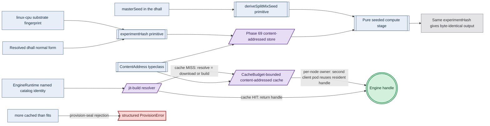

# Phase 80: Determinism kernel + jit-build CacheBudget cache

> **Purpose**: Land the determinism kernel — the `ContentAddress` typeclass, the
> `experimentHash = sha256(resolved-dhall ‖ substrate-fingerprint)` run identity, and the SplitMix seed
> derivation — **and** the shared jit-build engine resolver with its `CacheBudget`-bounded per-node cache owner,
> then prove on live linux-cpu that an independent cache-bypassed recompute is byte-identical while a changed
> input changes the hash, and that the cache owner resolves a named `EngineRuntime` on first miss, serves a
> resident handle to a second client pod, fits budget/volume/pod-request, and rejects every overflow/deletion/conflict.
> **Read this if**: phase 80 is next in the queue, or a later phase depends on what its gate establishes.

This document specifies a target capability only. Any pre-reset implementation result, pass, seal, receipt,
command transcript, or evidence reference retained below is historical inventory only: it is permanently
non-operative, cannot satisfy any current contract, and cannot regain authority through a status edit. Current
status is owned by [the tracker](README.md) and the Phase Status block below.

Link-graph metadata

**Status**: Authoritative source
**Supersedes**: N/A
**Referenced by**: DEVELOPMENT_PLAN/README.md, DEVELOPMENT_PLAN/overview.md, DEVELOPMENT_PLAN/phase_16_deterministic_sim_substrate.md, DEVELOPMENT_PLAN/phase_30_capability_bind.md, DEVELOPMENT_PLAN/phase_31_provision_seal.md, DEVELOPMENT_PLAN/phase_32_inference_accelerator_provision.md, DEVELOPMENT_PLAN/phase_56_base_image_registry.md, DEVELOPMENT_PLAN/phase_69_content_store_workflow.md, DEVELOPMENT_PLAN/phase_79_provider_dynamic_nodes.md, DEVELOPMENT_PLAN/phase_81_ui_single_tenant_live.md, DEVELOPMENT_PLAN/phase_89_apple_metal_host_daemon.md, DEVELOPMENT_PLAN/phase_91_infernix_rederivation.md, DEVELOPMENT_PLAN/phase_93_jitml_rederivation.md, DEVELOPMENT_PLAN/system_components.md, documents/engineering/deterministic_simulation_doctrine.md
**Generated sections**: none

## Contents

- [Phase Status](#phase-status)
- [Phase Summary](#phase-summary)
- [Gate integrity](#gate-integrity)
- [Resource provision — UNRESOLVED](#resource-provision--unresolved)
- [Doctrine adopted](#doctrine-adopted)
- [Sprints](#sprints)
- [Sprint 80.1: `ContentAddress` typeclass kernel primitive ⏸️](#sprint-801-contentaddress-typeclass-kernel-primitive-)
- [Sprint 80.2: `experimentHash` identity over the live substrate fingerprint ⏸️](#sprint-802-experimenthash-identity-over-the-live-substrate-fingerprint-)
- [Sprint 80.3: SplitMix seed derivation, worker-count-independent ⏸️](#sprint-803-splitmix-seed-derivation-worker-count-independent-)
- [Sprint 80.4: The live same-substrate reproducibility gate ⏸️](#sprint-804-the-live-same-substrate-reproducibility-gate-)
- [Sprint 80.5: The `CacheBudget`-bounded content-addressed cache + peak-occupancy provision fold ⏸️](#sprint-805-the-cachebudget-bounded-content-addressed-cache--peak-occupancy-provision-fold-)
- [Sprint 80.6: The jit-build resolver — `resolve = {download | build}` on first miss, no URL arm ⏸️](#sprint-806-the-jit-build-resolver--resolve--download--build-on-first-miss-no-url-arm-)
- [Sprint 80.7: Per-node cache-owner reuse across client pods ⏸️](#sprint-807-per-node-cache-owner-reuse-across-client-pods-)
- [Sprint 80.8: The live first-miss / reuse / resource-admission gate + Register-3 ledger ⏸️](#sprint-808-the-live-first-miss--reuse--resource-admission-gate--register-3-ledger-)
- [Documentation Requirements](#documentation-requirements)
- [Related Documents](#related-documents)

---

## Phase Status

⏸️ Blocked — NOT VALIDATED.

Blocked by redesigned Phase 79, its independent validation, and human promotion; every earlier
promotion barrier must also be satisfied in numerical order. Every prior pass, seal, receipt, attestation,
completion claim, and implementation result in this document is invalidated as validation evidence, even
where historical prose has not yet been rewritten. Existing implementation is an **Observed footprint /
Known partial** only.

Hardware validation is also prohibited until the hardware-free DSL promotion barrier is independently
satisfied and human-approved.

> **Reset contract interpretation.** The phase-specific gate review below is REJECTED — NOT VALIDATED. Until Phase 0 Sprint 0.7 replaces every unresolved row and a human independently reviews it, the summary and work breakdown are a capability inventory, not executable authority. Any wording that prescribes tracked non-`.hs` behavioural source, a Python/shell verdict, a checked-in generated fixture/oracle/mutant, `pb` behavior outside its minimal-platform-discrimination/contained-toolchain-establishment/source-bound-build/opaque-exec grammar, or host/hardware validation before the Phase-49 barrier is invalidated and non-operative.

## Phase Summary

This phase must extend the future human-approved Phase-69 content-addressed store into one cohesive
**reproducible resolved-asset lifecycle**. Its ordered sprint seams first target the shared determinism identity and then use that
identity in the first live ML-engine cache; the integrated claim is that a named engine is reproducibly
identified, bounded, materialized once, and reused by content address. The phase stops before model/kernel
artifact lifts.

**Phase scope:** the reproducible resolved-engine lifecycle on one linux-cpu cluster, ending in one Register-3
gate; split if work adds another asset tier, substrate, final register, or independently useful live capability.

**The determinism kernel.** First, it lifts Phase 69's concrete blob/manifest key renderers into a kernel-level
`ContentAddress` typeclass, so the rule that *a content-derived name cannot be forged* is one reusable primitive
rather than a per-store copy. Second, it must implement the `experimentHash` run identity — a total function of the
resolved `.dhall` normal form and the live linux-cpu substrate fingerprint — so two runs share a store namespace
only when they are genuinely the same experiment on the same substrate. Third, it must implement the SplitMix seed
derivation that gives every stream a seed that is a pure function of `(masterSeed, streamIndex)` alone,
independent of worker count, scheduling, and assignment. These seams are shared, not ML-specific: the SplitMix
seed derivation and the `MonadTime`/`MonadTimer` clock injection that make an ML run bit-reproducible are the
**same** injection seams the **Register-2.5 deterministic simulation**
([`deterministic_simulation_doctrine.md §6`](../documents/engineering/deterministic_simulation_doctrine.md#6-one-determinism-substrate-two-uses))
uses to make a simulation deterministically replayable — one determinism substrate, two uses. The substrate is
folded into identity precisely because cross-substrate bit-equality is not guaranteed; this phase asserts
same-substrate reproducibility and refuses to claim cross-substrate byte-equality.

**The jit-build engine cache.** On top of the kernel, this phase must build the **`CacheBudget`-bounded content-addressed cache**: a bounded typed pool with one per-node owner, content-addressed by the resolved
asset's SHA (the kernel's `ContentAddress`), carrying an explicit `CacheBudget` nested inside the owner pod's
node-ephemeral provision, with pin-aware pruning. The pure input is a `CachePopulationDemand`, not a
caller-authored cache peak: each selected closed-catalog identity resolves to catalog-owned
`AssetMaterializationDemand` metadata carrying its content address, final resident bytes, and peak temporary
download/build/unpack bytes; binding derives a private `ProvisionedCacheDemand` per node/host, unioning observed
residents and selected new assets by content address, rejecting conflicting resident-size metadata, keeping
observed entries charged until deletion is observed, and adding the exact largest permitted set of simultaneous
temporary materializations. It builds the **jit-build resolver** — `resolve = {download | build}` on first miss
— that takes a named `EngineRuntime` catalog identity, returns a handle on a cache HIT, and on a MISS downloads
a prebuilt engine or builds it from source (using the Phase-56 baked toolchain) into the cache; there is no arm
to author a URL, because the identity is drawn from the closed catalog. The gate must test **node-level reuse through the one cache owner**: a second client pod on the same node that names the same identity receives the
cache-resident handle and pays no re-materialization, without mounting one pod's ephemeral volume into another.
"More cached than fits" is rejected at the post-bind `provision-seal` by the Phase-9 capacity fold, not
discovered as a runtime disk-full.

The scope deliberately stops at the kernel primitives, the engine tier (Tier 1), and one live proof of each. The
gate determinism workload is a small seeded compute stage — a pinned content-addressed input, a pure stage, and
a request-carried derived seed — deliberately **not** an infernix inference run (that lift is Phase 91) and
**not** a jit-resolved ML engine (this phase resolves the engine, but the infernix inference that rides it is
Phase 91; the CUDA/jitML kernel tier is Phase 93). The `ModelArtifact` staging tier (Tier 2) and the JIT kernel
tier (Tier 3) are named as the same cache shape but are not exercised here. The cache is **ephemeral and node-scoped** — re-materializable on first miss, deliberately *not* the durable state of the stateless
`replicas=1` control-plane daemon (whose only durable state is the Vault-enveloped MinIO bucket); evicting
the cache costs a re-resolve, never data loss. The engine lane exercised here is `linux-cpu` only; the
Apple-Metal and `Cuda` lanes are out of contract for this gate.

Diagram vocabulary: [diagram_conventions.md](../documents/engineering/diagram_conventions.md).

*Design intent, Tier-1 for the folds. The kernel primitives and the seeded stage are pure; the store, the node cache, and the resolver are the effectful seams, and the engine handle is their opaque seal. An over-budget demand is refused at the provision seal. Byte-identical output and live cache residency are runtime-checked, not established here.*

**Substrate:** linux-cpu — the whole gate runs on a single-node `kind` cluster on a linux-cpu host in
Register 3 (live infrastructure); no apple, linux-cuda, or windows substrate is touched, and cross-substrate
behaviour is explicitly out of contract. Nothing about deriving `experimentHash`, a SplitMix seed, or the
provision-derived peak `≤ CacheBudget` rejection requires live infrastructure — those stay pure (Registers 1–2)
— but the phase gate requires a bounded live `linux-cpu` observation, never a proof.

**Lane:** linux-cpu/amd64 ([§L](development_plan_standards.md#l-one-substrate-discipline))

**Register:** 3 — live infrastructure ([§K](development_plan_standards.md#k-honesty-proven--tested--assumed)):
the future contract must independently observe recomputation, first-miss materialization, and second-pod reuse
against real pods. Its candidate ledger names the bounded register and has no promotion authority.

**Depends on:** [Phase 79](phase_79_provider_dynamic_nodes.md) — exact current human approval; the numeric chain includes every earlier phase
**Gate:** `pb validate phase 80`; see [Gate integrity](#gate-integrity). NOT VALIDATED.

## Gate integrity

**Contract review**: REJECTED — NOT VALIDATED.

| Key | Contract |
|---|---|
| `Claim` | the reproducible resolved-engine lifecycle on one linux-cpu cluster, ending in one Register-3 gate; split if work adds another asset tier, substrate, final register, or independently useful live capability. Explicit exclusions: every layer named in `Residue` remains UNVERIFIED. |
| `Subject` | UNRESOLVED — blocks validation: no production `.hs` module and entry point have been independently established for this reset contract. |
| `Command` | `pb validate phase 80` is the target command only; `pb` may only make the minimal platform distinction, establish the contained toolchain, build the source-bound binary, and exec it with argv unchanged, while the Haskell verdict entry point remains UNRESOLVED and blocks validation. |
| `Oracle` | UNRESOLVED — blocks validation: no separately authored `.hs` oracle, independence boundary, provenance, and independent human reviewer have been accepted. |
| `Positive controls` | UNRESOLVED — blocks validation: no closed named Haskell corpus and exact per-member observations have been accepted. |
| `Paired negatives` | UNRESOLVED — blocks validation: minimally different pairs, exact rejection loci, and exact reasons have not been accepted for every foreclosed dimension. |
| `Mutants` | UNRESOLVED — blocks validation: operators, production loci, applied-change witnesses, expected red observations, and unaffected controls have not been accepted. |
| `Discovery` | UNRESOLVED — blocks validation: expected and runtime-discovered surfaces, two-way equality, and empty-discovery refusal have not been accepted. |
| `Challenge` | UNRESOLVED — blocks validation: neither a post-start challenge nor a reviewed pure-claim independent predicate has been accepted. |
| `Observer` | UNRESOLVED — blocks validation: no outside observer, raw observation, authenticity check, and fail-closed rule have been accepted. |
| `Authority/bypass` | UNRESOLVED — blocks validation: least-privilege/foreign-scope pairs, bypass probes, or reviewed non-applicability have not been accepted. |
| `Freshness` | UNRESOLVED — blocks validation: stale state, cached output, prior evidence, and replayed responses have not been made unable to pass. |
| `Qualification` | UNRESOLVED — blocks validation: the fixed sabotage corpus has not qualified a Haskell harness independently of a clean candidate run. |
| `Cleanroom` | UNRESOLVED — blocks validation: no run has derived all products lazily with generated and condemned legacy copies absent. |
| `Legacy closure` | UNRESOLVED — blocks validation: stable owned legacy IDs and their exact zero-finding check have not been reconciled. |
| `Predecessor` | MISSING — blocks validation: the current Phase 79 human approval receipt does not exist. |
| `Residue` | UNVERIFIED — the entire phase claim and all semantic, effect, runtime, hardware, and cleanup layers remain unvalidated; no empty residue is asserted. |
| `Human authority` | `human-only` — no agent, gate, CI job, digest, receipt-shaped file, or generated assertion may promote status. |

## Resource provision — UNRESOLVED

> **UNRESOLVED — blocks validation.** No live mutation is authorized. Before review this phase must name its exact owner marker, preflight, allowed and forbidden mutations, external observer, scoped cleanup, and zero-owned-residue criterion. The detailed material retained below is capability inventory only and cannot supply or substitute for that contract.

This phase instantiates the canonical resource matrix and sealed whole-deployment provision boundary from
[`resource_capacity_types.md §3.1`](../documents/engineering/resource_capacity_types.md#31-the-systematic-provision-matrix)
and [`§4`](../documents/engineering/resource_capacity_doctrine.md#4-the-total-fold-fits-carve-place-and-the-nesting);
both live workloads must flatten to canonical execution atoms before either effect starts.

**The determinism recompute runs.** The three kernel functions are pure and allocate no deployment unit. The
live proof introduces compute Pods, so the gate's `BoundDeployment` contains an identity-keyed
`DeterminismRunDemand` for every baseline, seed/input variant, and fingerprint-control run. Each run carries a
complete `PodResourceEnvelope`: every container has a selected-platform `ImageArtifact`, lifecycle, CPU/memory/
ephemeral-storage requests and limits, runtime working set, read-only or bounded-writable rootfs, and log
headroom; the Pod carries bounded disk/memory `emptyDir`s, derived ConfigMap/Secret/projected/service-account-
token `KubeletMappedFileDemand`s, any durable claim with its presentation/backing/attachment class, `cache = None`,
exact byte-free `PodRuntimeMetadataSource` network-attachment and container-to-volume mount identities, and
`accelerator = None`. The content-store and Pulsar clients are libraries inside that compute container; their
buffers, CBOR staging, retry state, and output-upload workspace are charged to its memory and pod-local
ephemeral fields, never as client Pods. Each fresh run is a finite Job body (explicit completions, parallelism,
backoff, replacement-on-Failed, terminal retention) and is also an exact Phase-69 `WorkflowRuntimeDemand`
projection — orchestrator, configured active/standby workers (the active run worker is fresh), sole
content-mutation gateway, and collector/verification Job with complete envelopes, whose command/event topics,
subscriptions, cursor/backlog/retention/hot-ledger/offload and output gateway/object extents merge into
Pulsar/BookKeeper/MinIO capacity before publish. No broker or standing gateway Pod makes a new workflow's
messages/storage free. Fixture Job actions are serialized by snapshot-bound preflight: the next run receives no
apply capability until the predecessor Pod UID's absence/release witness is fresh (staged live evidence, not an
invented cross-kind rollout constructor); both `<experimentHash>/<runId>` output object sets remain charged in
the object-store producer demand through the out-of-band comparison.

**The cache owner and its clients.** Binding derives an identity-keyed envelope for the cache-owner Pod and for
both live client Pods. Every container row includes lifecycle, selected-platform `ImageArtifact`, CPU/memory/
ephemeral-storage requests+limits, runtime working set, writable-rootfs allowance (or read-only root), and log
headroom; every Pod row carries Pod overhead, bounded disk/memory volumes, derived mapped
ConfigMap/Secret/projected/token payloads, durable claims and attachment classes (none in the representative
fixture), the owner's one `InClusterCacheDemand` or a client's `cache = None`, and `accelerator = None`. Resolver
download/build/unpack, compiler subprocess CPU/RSS, import workspace, pipe/network buffers, and temporary files
execute inside the owner container and are included in that owner's runtime and cache-temporary operands; the
typed client handle is a library protocol and creates no client-service Pod. The in-cluster Distribution
`registry:2` service and standing platform Pods remain charged as live survivors; the download endpoint is never free
supply. The live race epoch is exact: one owner plus two overlapping clients consume three pod/IP slots on the
selected node, while same-digest requests share one in-flight materialization and distinct digests obey the
finite semaphore. Image content/snapshots/import workspace for all three selected images fold once by
digest/chain identity on their layout-routed physical backing. The owner is a kind-correct Deployment with
`DeploymentRolloutPolicy.Recreate`; there is no separate `RecreateAfterObservedGone` constructor. An
`emptyDir`-backed old owner and all clients drain, every old Pod UID remains a live commitment through
termination, and image/snapshot/writable/log/cache extents remain charged until their own observed
deletion/GC. The amoebius scheduler's aggregate CAS refuses a replacement unless that exact
old+new+retained-artifact high-water fits; Pod API absence alone never credits physical bytes.

**Runtime-metadata, etcd, and the host harness (both workloads).** After controller expansion, the binder
serializes exhaustive `desiredObjects` for all rendered and derived Kubernetes objects, not selected kinds, and
joins observed survivors with old/new/apply-before-prune. `EtcdLogicalDemand { desiredObjects, churn, model }`
includes revisions, Leases, and Events; only private `ProvisionedEtcdLogicalDemand.derivedPeak <=
backendQuotaBytes` may continue, and physical capacity separately fits backend-at-quota plus WALs,
retained/saving snapshots, and defrag old+new workspace. Haskell one-byte logical/physical shortage and
drop-API-object/churn/model operators reject before any Pod creation; any serialized cases are generated
beneath `.build/test-corpora/**`. `provision` derives one `KubeletRuntimeMetadataShape` per planned Pod slot from that Pod's exact
runtime-metadata source and container/volume graph under the selected node's pinned `kubeletMetadataModel`.
The canonical role/layout projection maps those components to named carves and collapses aliases before the
capacity check; its physical debit remains separate from logical Pod ephemeral storage. The gate harness and its filesystem/network/argv observer are a bounded
`HostResourceEnvelope` (executable digest, CPU/memory, capture/log/scratch bytes on a named backing, finite
probe concurrency, no cache or accelerator); the absolute-path substrate-fingerprint probes, `strace`, and
egress/CNI capture execute within that envelope, never in sidecar Pods or as resource-free subprocesses.

**The applied Haskell resource mutants (must reject before any effect, §M.2).** For the determinism runs,
the Haskell operators `drop_run_resource_envelope`, `drop_host_harness_envelope`, `early_fresh_run`, and
`drop_workflow_gateway_collector` lazily generate any required external form beneath `.build/test-corpora/**`;
they omit one run's Pod row, the probe/harness host row, the predecessor-absence wait, or one Phase-69
runtime/mutation unit and must each turn the resource gate red even if the output bytes match. For the cache
workload, Haskell operators drop the client envelope, owner envelope, owner image demand, or host-observer
envelope, or start a replacement owner before old-cache absence is observed; each must turn the gate red
before materialization. The Haskell negative bundle additionally lowers CPU, memory, logical ephemeral, each
routed physical backing, image/pull workspace, pod/IP slots, CSI slots (on a matched PVC-bearing fixture), each
resident output object and object-store workspace, and host-harness CPU/memory/capture/log/scratch by one
unit/byte and expects a tagged pre-effect `Left`. Each unique CSI PVC spends one driver attachment slot; both
representative fixtures declare no PVC and therefore spend zero CSI slots, never an implicit unlimited value.

## Doctrine adopted

- [`jit_artifact_doctrine.md` §2 — The rule, and the closed exception list](../documents/engineering/jit_artifact_doctrine.md#2-the-rule-and-the-closed-exception-list) — every artifact determinism kernel + jit-build CacheBudget cache emits is a recipe over a content address, never an authored file.
This phase's target is to become the first live amoebius realization of the content-addressing/determinism
contract and of the ML-asset lifecycle's Tier-1 engine cache. Each bullet names the section the target must
implement; individual sprints cite the same sections where they must adopt them.

- [`content_addressing_doctrine.md` §2 — The three-tier store: blobs ← manifests ← pointers](../documents/engineering/content_addressing_doctrine.md#2-the-three-tier-store-blobs--manifests--pointers)
  — *the three-tier store (blobs ← manifests ← pointers)*: the `ContentAddress` typeclass lifts Phase 69's
  `blobs/<sha256>` / `manifests/<sha256>` key renderers into a kernel primitive (keeping the `If-None-Match: *` /
  `412 = success` write protocol owned by the store), and the engine cache reuses the same self-naming discipline
  — a MISS-then-store and a HIT are write-once content addressing applied to the ephemeral per-node cache owner
  rather than the durable MinIO bucket.
- [`content_addressing_doctrine.md` §3 — `experimentHash`: identity is *what was requested* ‖ *where it ran*](../documents/engineering/content_addressing_doctrine.md#3-experimenthash-identity-is-what-was-requested--where-it-ran)
  — *`experimentHash`: identity is what was requested ‖ where it ran*: the run identity folds the resolved
  `.dhall` normal form and the substrate fingerprint into one digest, so a flipped metric direction or a
  different substrate is a different experiment in a different namespace.
- [`content_addressing_determinism.md` §4 — Determinism by construction: pinned inputs + pure stages + derived seed](../documents/engineering/content_addressing_determinism.md#4-determinism-by-construction-pinned-inputs--pure-stages--derived-seed)
  — *determinism by construction: pinned inputs + pure stages + derived seed*, with its pinned-input leg
  ([`content_addressing_determinism.md` §4.1 — Leg one — pinned content-addressed inputs](../documents/engineering/content_addressing_determinism.md#41-leg-one--pinned-content-addressed-inputs)),
  its derived-seed leg ([`illegal_state_techniques.md` §4.3 — GADT-indexed state machines — only legal transitions are typed](../documents/illegal_state/illegal_state_techniques.md#43-gadt-indexed-state-machines--only-legal-transitions-are-typed)), and the totality argument
  ([`content_addressing_determinism.md` §4.4 — What "the types make these total" cashes out to](../documents/engineering/content_addressing_determinism.md#44-what-the-types-make-these-total-cashes-out-to)):
  this phase's target must implement the three legs as kernel primitives and wire them through one live workload.
- [`content_addressing_determinism.md` §4.5 — The ML-asset lifecycle: one bounded content-addressed cache, resolved on first miss](../documents/engineering/content_addressing_determinism.md#45-the-ml-asset-lifecycle-one-bounded-content-addressed-cache-resolved-on-first-miss)
  — *the ML-asset lifecycle: one bounded content-addressed cache, resolved on first miss*: Tier 1's
  `EngineRuntime` is a **named, jit-resolved** identity (never baked, never URL-fetched), the cache is a bounded
  typed pool with an explicit `CacheBudget` and pin-aware pruning, and the trade is stated plainly (baking gave
  no-network-at-boot; the cache pays a first-miss materialization amortized across every later use).
- [`content_addressing_doctrine.md` §6 — The honest ceiling: types make the bookkeeping total, not the physics deterministic](../documents/engineering/content_addressing_doctrine.md#6-the-honest-ceiling-types-make-the-bookkeeping-total-not-the-physics-deterministic)
  — *the honest ceiling: types make the bookkeeping total, not the physics deterministic*: the contract stays at
  same-substrate reproducibility; cross-substrate bit-equality is deliberately not asserted and the ledger never
  marks it green.
- [`service_capability_doctrine.md` §4.1 — The InferenceEngine capability — the engine is target-offering-selected and jit-resolved, never authored](../documents/engineering/service_capability_doctrine.md#41-the-inferenceengine-capability--the-engine-is-target-offering-selected-and-jit-resolved-never-authored)
  — *the `InferenceEngine` capability — the engine is substrate-selected and jit-resolved, never authored*: the
  closed `EngineRuntime` union has **no arbitrary-`Url`/`Download` arm**; the `.dhall` *selects* an arm by the
  detected substrate and can never *author* a fetch, and the shared jit-build resolver materializes the named
  identity on first miss.
- [`resource_capacity_doctrine.md` §3 — The types: `Quantity`, `Capacity`, `Demand`, `Budget`](../documents/engineering/resource_capacity_doctrine.md#3-the-types-quantity-capacity-demand-budget)
  / [`resource_capacity_types.md` §3 — The types: `Quantity`, `Capacity`, `Demand`, `Budget`; “The systematic provision matrix”](../documents/engineering/resource_capacity_types.md#31-the-systematic-provision-matrix)
  and [`resource_capacity_doctrine.md` §4 — The total fold: `fits`, `carve`, `place`, and the nesting](../documents/engineering/resource_capacity_doctrine.md#4-the-total-fold-fits-carve-place-and-the-nesting)
  — *the `Quantity` types, the canonical provision matrix, and the total `fits`/`carve`/`place` fold*: the live
  recompute runs and the cache owner/clients instantiate the resource matrix and the sealed whole-deployment
  provision boundary; `CacheBudget` is nested inside the cache-owner pod's bounded `emptyDir` and
  ephemeral-storage envelope, and the derived peak bound is the **same** checked capacity fold Phase 9 must
  establish and Phase 31 must invoke at `provision-seal` — "more cached than fits" is rejected by that fold, not discovered as a
  runtime disk-full.
- [`image_build_doctrine.md` §7 — What amoebius bakes vs builds — the base container is the supply chain](../documents/engineering/image_build_doctrine.md#7-what-amoebius-bakes-vs-builds--the-base-container-is-the-supply-chain)
  — *what amoebius bakes vs builds*: the base image bakes the jit-build **resolver + toolchain** (the
  build-from-source path this phase drives on a MISS) but holds the ML **engine payloads** out as named cache
  identities — the Phase-56 split this phase exercises live for the first time.
- [`substrate_doctrine.md` §3 — The no-environment / no-`PATH` lazy tool-ensure contract](../documents/engineering/substrate_doctrine.md#3-the-no-environment--no-path-lazy-tool-ensure-contract)
  — *the no-env / no-`PATH`, full-path-probe substrate contract*: the linux-cpu substrate fingerprint consumed by
  `experimentHash` and every subprocess the resolver spawns is gathered/invoked by absolute-path only, never from
  `PATH` or environment variables.
- [`illegal_state_catalog.md` §3 — The catalog — states a valid spec cannot represent](../documents/illegal_state/illegal_state_catalog.md#3-the-catalog--states-a-valid-spec-cannot-represent) [`illegal_state_techniques.md` §4.5 — Content-address totality — names are total functions of content](../documents/illegal_state/illegal_state_techniques.md#45-content-address-totality--names-are-total-functions-of-content) — *the totality
  technique*: there is no constructor for a store or cache key from a free string and no inhabitant of "a seed
  read from ambient entropy"; these are states that cannot be written down, not states fixed at runtime.
- [`illegal_state_ml_asset.md` §3.25 — An ML asset named by arbitrary URL (or an unready / unlanded model)](../documents/illegal_state/illegal_state_ml_asset.md#325-an-ml-asset-named-by-arbitrary-url-or-an-unready--unlanded-model)
  — *an ML asset named by arbitrary URL is unrepresentable*: the engine identity has no URL syntax
  (type-foreclosed, dhall-typecheck); an over-budget cache is constructible input rejected at the post-bind
  `provision-seal`.
- [`testing_doctrine.md` §2 — The registers of amoebius testing](../documents/engineering/testing_doctrine.md#2-the-registers-of-amoebius-testing)
  — *the registers of amoebius testing*: this phase's future gate targets **Register 3**; its candidate ledger
  must name the bounded live register, preserve predecessor evidence, and leave every deferred tier unverified.

## Sprints

> **Reset validation review.** Every pre-reset `Independent Validation` and `### Validation` below is rejected as a current criterion and MUST NOT be executed or cited. It is retained only to inventory the capability while the fixed Haskell subject/oracle/reviewer/mutant/legacy contract is rewritten.

> **Permanent sprint reset.** Every pre-reset sprint status, result, date, pass, seal, receipt, evidence path, and closure statement below is permanently invalid for promotion. The retained body is non-operative capability inventory only. Current acceptance requires the resolved eighteen-row Haskell gate contract, fresh independently observed evidence, immediate-predecessor approval, owned legacy closure, and a human tracker change.

## Sprint 80.1: `ContentAddress` typeclass kernel primitive ⏸️

**Status**: Blocked — NOT VALIDATED

### Objective

Adopt [`content_addressing_doctrine.md §2 — the three-tier store`](../documents/engineering/content_addressing_doctrine.md#2-the-three-tier-store-blobs--manifests--pointers)
and the totality argument in [`§4.4`](../documents/engineering/content_addressing_determinism.md#44-what-the-types-make-these-total-cashes-out-to):
lift Phase 69's concrete blob/manifest key renderers into a kernel-level `ContentAddress` typeclass so that
"a content-derived name cannot be forged" is a single reusable primitive shared later by the engine cache
(Sprint 80.5) and by both infernix (Phase 91) and jitML (Phase 93), not a per-store copy.

### Deliverables

- A `ContentAddress a` typeclass whose only key-producing operation is `sha256(canonical-bytes a)`, with a
  canonical-encoder requirement so equal logical content yields byte-identical keys.
- Newtyped `BlobSha` / `ManifestSha` carriers with no public constructor from a free `Text`.
- Adapters binding the typeclass to Phase 69's `blobs/<sha256>` and `manifests/<sha256>` writers — the
  `If-None-Match: *`, `412 = success` protocol stays owned by the store.
- The oracle-pinned compile-fail fixture `test/negative/compile_fail/phase_70_forge_blobsha.hs` (with its expected
  locus), the hand-authored logical-equivalence oracle for the canonical-encoding property, and the mutant
  `test/mutant/determinism_jitcache/content_order_leak.hs` — authored before `ContentAddress.hs` exists (§M.1–M.3).

### Validation

1. Type-level, verified by the committed compile-fail fixture `test/negative/compile_fail/phase_70_forge_blobsha.hs`
   (§M.8): its attempt at `BlobSha "deadbeef"` — constructing a `BlobSha`/`ManifestSha` carrier from a free
   `Text` literal — MUST fail to compile with "`BlobSha` constructor not
   in scope / not exported" at the named locus, while the paired positive `contentAddress bytes` compiles. The
   only path to a `BlobSha`/`ManifestSha` is `contentAddress`; an export-list audit confirms no re-export.
2. Property: `contentAddress x == contentAddress y` whenever `x` and `y` are logically equal, where **logical equality is defined by a committed hand-authored equivalence independent of the canonical bytes** (§M.3) —
   the generator emits distinct byte pre-images of equal content (permuted map order, reordered fields,
   equivalent integer encodings) and a `cover` obligation (§M.4) requires ≥30% of cases to carry such a distinct
   pre-image; those cases must collapse to the identical key. The committed mutant
   `test/mutant/determinism_jitcache/content_order_leak.hs` (a canonical-encoder that preserves field order rather than
   sorting; operator: dropped-effect) MUST turn this property red (§M.2).

### Remaining Work

None in this sprint.

## Sprint 80.2: `experimentHash` identity over the live substrate fingerprint ⏸️

**Status**: Blocked — NOT VALIDATED

### Objective

Adopt [`content_addressing_doctrine.md §3 — experimentHash: identity is what was requested ‖ where it ran`](../documents/engineering/content_addressing_doctrine.md#3-experimenthash-identity-is-what-was-requested--where-it-ran):
implement the run identity that folds the resolved program and the substrate fingerprint into one digest,
consuming the Phase-25 normal form and the Phase-55 full-path substrate probe, per the substrate doctrine's
no-env/no-`PATH` contract.

### Deliverables

- `deriveExperimentHash :: ResolvedDhall -> SubstrateFingerprint -> ExperimentHash` =
  `sha256(resolved-dhall ‖ substrate-fingerprint)`, with the fingerprint gathered by full-path subprocess probes,
  never from environment or `PATH`.
- The store namespace key `<experimentHash>/…` wired so two genuinely different runs — including a flipped metric
  direction (part of the resolved `.dhall`) or a different substrate fingerprint — cannot collide.
- A separately authored Haskell fingerprint oracle (minimum witness set plus each witness's absolute probe
  path) and a Haskell-declared fake probe generated beneath `.build/test-corpora/**` for the sensitivity check — both
  reviewed before `ExperimentHash.hs` exists (§M.1, §M.3).

### Validation

1. `experimentHash` is a pure function of `(resolved-dhall, substrate-fingerprint)`: it changes when either the
   resolved `.dhall` (a Haskell-declared flipped-metric case generated beneath `.build/**`) or the
   substrate fingerprint changes, and re-derives identically across re-evaluation of the same inputs. Asserted
   against the oracle-pinned fixtures, not values regenerated from the SUT.
2. The fingerprint carries every witness required by the independent Haskell fingerprint oracle
   (substrate lane `linux-cpu` + the named GHC-version, RTS/runtime-version, ISA, and libc/ABI witnesses, each
   with its absolute probe path); a fingerprint missing a required witness FAILS, and a hardcoded constant such
   as `"linux-cpu"` FAILS the schema check. The linux-cpu fingerprint is gathered only by absolute-path probes —
   verified from the argv-recording exec shim or `strace -f -e execve` OS-boundary observer (§M.5), whose log
   shows every probe invoked by absolute path and no `getenv`/`PATH` lookup on the fingerprint path, never a
   self-report; two probes of the same host fold to the same digest. The **sensitivity check**, substituting one
   named probe's binary with the committed fake `test/harness/fake/phase_70_fake_ghc` (which emits a different version),
   MUST change the folded digest (§M.3). The committed mutant
   `test/mutant/determinism_jitcache/const_fingerprint.hs` (fingerprint hardcoded to `"linux-cpu"`; operator:
   dropped-effect) MUST turn the schema and sensitivity checks red (§M.2).

### Remaining Work

None in this sprint.

## Sprint 80.3: SplitMix seed derivation, worker-count-independent ⏸️

**Status**: Blocked — NOT VALIDATED

### Objective

Adopt the derived-seed leg of [`content_addressing_determinism.md §4 — determinism by construction`](../documents/engineering/content_addressing_determinism.md#4-determinism-by-construction-pinned-inputs--pure-stages--derived-seed)
([§4.3](../documents/illegal_state/illegal_state_techniques.md#43-gadt-indexed-state-machines--only-legal-transitions-are-typed)) and its totality argument in [`§4.4`](../documents/engineering/content_addressing_determinism.md#44-what-the-types-make-these-total-cashes-out-to):
implement the SplitMix seed derivation that is independent of worker count, scheduling, and assignment, with a
per-stream seed reachable only through one total function.

### Deliverables

- `deriveSplitMixSeed :: SplitMixSeed -> Word64 -> SplitMixSeed` with SplitMix64 mixing and the golden-ratio
  gamma (`0x9E3779B97F4A7C15`), exposing a per-stream seed reachable only through this total function.
- A type discipline in which "a stream with no seed" and "a seed read from ambient entropy" have no inhabitant —
  a seed is reachable only from a typed `(SplitMixSeed, Word64)`.

### Validation

1. A simulated 1-worker vs 100-worker dispatch in arbitrary order seeds stream `37` identically every time. The
   generator carries a `cover` obligation (§M.4) forcing ≥25% of cases into the high-worker-count/shuffled-order
   branch, so the property is not satisfied by a near-constant single-worker generator. Expected seed values for
   streams `0`, `1`, `37` are checked against a **committed hand-computed golden**
   `test/golden/determinism_jitcache/splitmix_seeds.json` (§M.1, SplitMix64 with gamma `0x9E3779B97F4A7C15` worked by hand,
   not regenerated from `Rng.hs`).
2. No seed reads wall-clock, a worker id, or `/dev/urandom`; the derivation is a pure function of
   `(masterSeed, streamIndex)` alone. The committed mutant `test/mutant/determinism_jitcache/rng_workerid.hs` (seed folds in a
   worker id in addition to `streamIndex`; operator: effect-swap) MUST turn validation 1 red (§M.2).

### Remaining Work

None in this sprint.

## Sprint 80.4: The live same-substrate reproducibility gate ⏸️

**Status**: Blocked — NOT VALIDATED

### Objective

Adopt [`content_addressing_determinism.md §4 — determinism by construction`](../documents/engineering/content_addressing_determinism.md#4-determinism-by-construction-pinned-inputs--pure-stages--derived-seed)
end-to-end and hold the honest ceiling in [`§6`](../documents/engineering/content_addressing_doctrine.md#6-the-honest-ceiling-types-make-the-bookkeeping-total-not-the-physics-deterministic):
wire the three legs — a pinned content-addressed input
([`§4.1`](../documents/engineering/content_addressing_determinism.md#41-leg-one--pinned-content-addressed-inputs)),
a pure stage, and a request-carried derived seed — through one self-contained seeded workload, deliberately
without an infernix inference run (Phase 91) or a jit-resolved engine (that is the cache seam below and the
Phase-91 lift), and prove same-substrate reproducibility as one half of the phase gate without overclaiming
cross-substrate equality.

### Deliverables

- A pure seeded compute stage (`Determinism.hs`) taking a content-addressed input, a request, and a derived
  SplitMix seed, with all I/O at the interpreter boundary.
- The gate `.dhall` (`test/fixture/dhall/phase_70_determinism_repro.dhall`) that spins up the Phase-69 workflow, runs the
  stage twice, stores each output as a content-addressed blob under its `experimentHash` namespace, tears down,
  and compares outputs.
- A ledger artifact recording: identity/seed totality as **proven-in-types**, same-substrate reproduction as
  **tested on linux-cpu**, and cross-substrate bit-equality as **explicitly not asserted** (UNVERIFIED), matching
  the doctrine's proven/tested/assumed table.
- The oracle-pinned representative oracle set (authored before any kernel module exists, §M.1): the positive
  `test/fixture/dhall/phase_70_determinism_repro.dhall` and its one-dimension-differing negative siblings
  `..._flipped_metric.dhall`, `..._alt_seed.dhall`, `..._alt_input.dhall` (§M.7, §M.8); the committed mutant
  `test/mutant/determinism_jitcache/const_output.hs` (§M.2); and the harness's OS-boundary observer on the compute Pod
  (an argv/exec shim or `strace`) that witnesses run 2's fresh compute and the fresh-pod output-key absence
  (§M.5, §M.6).

### Validation

1. Two runs with the same `experimentHash` on linux-cpu produce byte-identical output, where both fresh Pods
   write distinct `<experimentHash>/<runId>` prefixes with initially absent keys and run 2 cannot read run 1's
   retained prefix until its stage writes. The OS-boundary observer (§M.5) confirms that boundary. The comparison
   is an **out-of-band harness byte compare** of both retained/fetched blobs — never a `412` on the second PUT,
   which proves store dedup, not reproduction (§M.6).
2. Output is a genuine function of the machinery: the `..._alt_seed.dhall` run and the `..._alt_input.dhall` run
   each produce **different** output bytes from the base run (asserted on the stored blobs). A stage whose output
   is invariant under a changed seed or a changed pinned input FAILS.
3. Changing the resolved `.dhall` (the `..._flipped_metric.dhall` sibling, differing only in metric direction) or
   substituting the substrate fingerprint produces a different `experimentHash` and a distinct store namespace;
   the run is allowed to differ. Because a single linux-cpu host cannot genuinely re-fingerprint, the fingerprint
   leg is exercised by an **in-process substitution using the committed fake probe** (`test/harness/fake/phase_70_fake_ghc`),
   and the ledger records this leg as **UNVERIFIED for a real distinct substrate** (synthetic mutation only),
   never green.
4. The committed mutant `test/mutant/determinism_jitcache/const_output.hs` (constant-output stage) is re-run and MUST turn
   validation 2 red (§M.2).
5. The ledger artifact is emitted and marks no cross-substrate claim green: same-substrate reproduction
   *tested on linux-cpu*, identity/seed totality *proven-in-types*, cross-substrate bit-equality UNVERIFIED.

### Remaining Work

Cross-substrate bit equality remains deliberately UNVERIFIED; no later phase may infer it from this same-host run.

## Sprint 80.5: The `CacheBudget`-bounded content-addressed cache + peak-occupancy provision fold ⏸️

**Status**: Blocked — NOT VALIDATED

### Objective

Adopt [`content_addressing_determinism.md §4.5`](../documents/engineering/content_addressing_determinism.md#45-the-ml-asset-lifecycle-one-bounded-content-addressed-cache-resolved-on-first-miss)'s
bounded-typed-pool and [`resource_capacity_doctrine.md §3/§4`](../documents/engineering/resource_capacity_doctrine.md#3-the-types-quantity-capacity-demand-budget):
build the `CacheBudget`-bounded content-addressed cache so that "more cached than fits" is rejected at the
post-bind **`provision-seal`** — the same checked capacity fold that bounds every other budget rejects an
over-budget derived peak before the resolver ever materializes an asset.

### Deliverables

- `Amoebius.Jit.Cache` — a bounded typed pool keyed by `sha256(resolved-bytes)` (the Sprint-75.1 `ContentAddress`),
  with a total HIT/MISS lookup and pin-aware pruning (a pinned resident is never evicted; unpinned residents are
  pruned to keep under budget).
- `AssetMaterializationDemand` metadata owned by the closed catalog — content address, final resident bytes, and
  resolve-arm temporary download/build/unpack peak — plus `CachePopulationDemand`, which selects those
  identities, a node/host cache location, typed backing/`CacheBudget`, and a finite positive first-miss
  concurrency. Raw deployment syntax has no fields with which to override catalog byte operands.
- The private `ProvisionedCacheDemand` derived per exact node/host placement. Its peak is the byte sum of the
  digest union of observed residents and selected new residents plus the largest allowed distinct-miss temporary
  overlap; identical digests debit resident bytes once, conflicting resident sizes reject, one in-flight resolve
  per digest makes same-digest clients share temporary work, and observed residents remain charged until GC
  deletion is observed.
- For the pod arm, `CacheBudget` references the cache-owner pod's declared disk-backed `VolumeId`, and the
  private derived peak satisfies `derived peak ≤ CacheBudget ≤ emptyDir.sizeLimit` plus
  `Σ disk-backed volume sizeLimits + writable-layer allowance + log headroom ≤ ownerPod.ephemeralStorage.request
  ≤ ownerPod.ephemeralStorage.limit`, delegating to `Amoebius.Capacity.Fold`. These proofs describe one physical
  debit from node ephemeral storage and are never summed again as a separate host-cache consumer; an over-budget
  or under-reserved spec returns the tagged `Left`, not a runtime disk-full.
- An in-file honesty note: the cache is **ephemeral and node-scoped**, not the control-plane daemon's durable state; the
  cache/volume/request nesting is checked at `provision-seal`, while *actual* on-disk residency under concurrent
  resolves is the runtime residue deferred to the live gate.

### Validation

1. There is no exported path to a cache key from a free string; the only path to a resident entry is content
   addressing — asserted by the committed compile-fail negative `test/negative/determinism_jitcache/freestring_key.hs`
   (registered in the Phase-27 negative corpus, authored in this phase's oracle-pinning sprint) failing to
   typecheck *at the attempt to construct a cache key from a `String`/`Text`/`Url`* with the specific
   "no instance / no exported constructor" error, paired with a positive that differs only in keying from
   `sha256(real bytes)` and compiles.
2. Prove deployments can select catalog identities but cannot supply or override resident/temporary byte
   operands. For each node/host placement, independently recompute the digest union and the largest finite
   first-miss temporary set; exact fit passes, while an unbounded concurrency policy has no constructor. A
   one-byte resident-plus-temp overflow, a `BoundedParallel n` whose derived temp set overflows, and an owner
   volume/ephemeral under-reservation each return the expected **tagged** `Left` before any resolver process or
   cache write.
3. Give the fold duplicate selections with one content address (one resident debit), conflicting resident sizes
   for one address (specific metadata-conflict rejection), and an observed unpinned entry selected for deletion.
   The entry stays charged and overflow still rejects until a later observed snapshot reports it absent; only that
   snapshot earns capacity credit. Exercise the concurrency boundary with distinct missing digests and the
   single-flight boundary with repeated same-digest clients.
4. **Pin-aware pruning is exercised, not declared:** a cache filled to `CacheBudget` with a mix of pinned and
   unpinned residents, then asked to admit one more resident, **evicts an unpinned resident, never a pinned one**,
   and leaves measured peak/final occupancy within `CacheBudget`; the property asserts a pinned resident is
   present and a named unpinned resident is absent post-prune. The committed seeded mutant `prune = pure ()`
   ([Gate integrity](#gate-integrity) part (b) mutant (b)) must turn this clause red (the over-budget residency survives). This is the pure-pool property; its live on-disk counterpart is the Sprint 80.8 postflight residency
   measurement. The fold's expected verdicts are the Phase-0 fixture's hand-authored table, never the fold's own
   output.
5. A QuickCheck property shows every resident entry is reachable only by hashing real bytes and that a lookup is
   a total HIT/MISS, with `cover`/`classify` obligations forcing **≥30% MISS** and **≥30% HIT** cases (§M.4), so
   the property cannot be satisfied by a generator that only ever misses.

### Remaining Work

None in this sprint.

## Sprint 80.6: The jit-build resolver — `resolve = {download | build}` on first miss, no URL arm ⏸️

**Status**: Blocked — NOT VALIDATED

### Objective

Adopt [`content_addressing_determinism.md §4.5`](../documents/engineering/content_addressing_determinism.md#45-the-ml-asset-lifecycle-one-bounded-content-addressed-cache-resolved-on-first-miss)'s
Tier-1 resolve-on-miss, [`service_capability_doctrine.md §4.1`](../documents/engineering/service_capability_doctrine.md#41-the-inferenceengine-capability--the-engine-is-target-offering-selected-and-jit-resolved-never-authored),
and [`image_build_doctrine.md §7`](../documents/engineering/image_build_doctrine.md#7-what-amoebius-bakes-vs-builds--the-base-container-is-the-supply-chain)'s
bake-vs-build split: implement the shared jit-build resolver so a named engine identity is materialized on first
miss into the bounded cache — downloaded prebuilt or built from source with the Phase-56 baked toolchain — with
**no arm to author a URL**, replacing infernix's `curl`-tar-at-image-build with the one shared resolve-on-miss
path.

### Deliverables

- `Amoebius.Jit.Resolver` — `resolve :: EngineRuntime -> IO EngineHandle` that returns a handle on a cache HIT
  and, on a MISS, runs `download | build` (the recipe carried by the closed-catalog identity, never an authored
  URL), stores the result content-addressed into `Amoebius.Jit.Cache`, then returns the handle.
- The build-from-source path invoking the Phase-56 baked toolchain by absolute path (no `PATH`, no env), and the
  download path resolving a named prebuilt identity — neither exposing a free-URL or free-string constructor.
- An in-file honesty note: URL-foreclosure and identity-from-closed-catalog are **proven-in-types** (dhall-typecheck); the
  first-miss materialization *succeeding* on real infrastructure is the live residue proven at the phase gate; the
  model (Tier 2) and kernel (Tier 3) tiers reuse this resolver but land in Phases 60/61.

### Validation

1. The suite drives the resolver against an oracle-pinned backend fixture whose served or compiled bytes
   **sha256-match the `test/oracle/determinism_jitcache/oracle.dhall` pin** — not an arbitrary "fake" blob, so a backend
   returning unpinned bytes must fail the suite. A cold cache triggers exactly one `resolve`
   (download-or-build) and stores the result, **and the stored `ContentAddress` equals that committed pin**; a
   warm cache returns a handle with no resolve, proven by the argv-recording shim / `strace` observer at the OS
   boundary (§M.5) capturing zero toolchain-or-backend subprocess on the warm path; there is no path that accepts
   a URL or free string, asserted by the committed compile-fail negative `test/negative/determinism_jitcache/url_arm.hs`
   (Phase-27 corpus, independently authored) failing at the constructor locus with "no `Url`/free-string
   constructor", paired with the closed-catalog positive that compiles.
   The committed seeded mutant `resolve _ = <fixed-marker>` ([Gate integrity](#gate-integrity) part (b) mutant (a))
   must turn the stored-address assertion red.
2. Every subprocess the resolver spawns is invoked by absolute path, never resolved against `PATH` — asserted by
   an OS-boundary argv-recording shim capturing the full absolute `argv[0]`, not a resolver self-report.

### Remaining Work

Production model inference through the resolved engine is Phase 91, not a hidden acceptance claim here.

## Sprint 80.7: Per-node cache-owner reuse across client pods ⏸️

**Status**: Blocked — NOT VALIDATED

### Objective

Adopt [`content_addressing_determinism.md §4.5`](../documents/engineering/content_addressing_determinism.md#45-the-ml-asset-lifecycle-one-bounded-content-addressed-cache-resolved-on-first-miss)'s
"every later pod on that host reuses the cache-resident copy": make the bounded cache **single-owner per node**,
so the first-miss materialization cost is paid once per node per identity and amortized across every client pod
that later names it, without a shared writable host mount.

### Deliverables

- `Amoebius.Jit.CacheOwner` — the per-node cache-owner location, bounded volume, client-handle protocol, and
  read/write discipline that lets a second client HIT the owner's resident copy, with two concurrent first-misses
  converging to one stored, content-addressed copy (idempotent write-once, the store's confluence applied to the
  ephemeral cache), a finite distinct-first-miss semaphore, and one single-flight entry per digest. It accepts the
  opaque `ProvisionedCacheDemand`, never a runtime-authored resident/temp allowance.
- The pod wiring (rendered by the Phase-58 reconciler) that gives the owner a bounded disk-backed `emptyDir` with
  exact `ephemeral-storage` requests/limits and gives clients typed handles; clients never mount the owner's
  writable volume and no `hostPath` is used.
- An in-file honesty note: cross-pod reuse and the idempotent concurrent-miss convergence are **tested on linux-cpu** at the gate; cross-node reuse is out of contract (the cache is node-scoped by design — a different
  host is a legitimate first miss).

### Validation

1. One cache-owner pod and two client pods scheduled to the same node name the same `EngineRuntime` identity.
   Client A's first `resolve` is a MISS that the owner materializes into its bounded disk-backed `emptyDir`, to
   bytes sha256-matching the `test/oracle/determinism_jitcache/oracle.dhall` pin; Client B on the same node HITs the resident
   handle with no re-materialization, proven by the OS-boundary observer — unchanged resident inode/mtime, and
   the in-cluster `registry:2` access log plus an egress capture recording zero new pull or build
   subprocess for Client B — never by a resolver-emitted counter. The owner's rendered manifest carries exact
   provision-derived CPU/memory/`ephemeral-storage` requests+limits, its `emptyDir.sizeLimit`, and no writable
   `hostPath`, with the applied ephemeral request at least the volume bound plus writable/log headroom.
2. Two concurrent first-misses, **forced to overlap by a shared barrier and materialization deliberately slowed
   (a payload-size floor or an injected delay in the fixture backend) so both observe MISS before either
   commits**, converge to exactly one stored copy whose bytes hash to the catalog pin;
   no partial/temp file remains in the cache directory and no torn or duplicate resident entry exists. Repeated same-digest requests use
   one in-flight temporary extent, while an `(n+1)`th distinct missing digest queues and the observed simultaneous
   set never exceeds the provisioned finite concurrency.
3. Mark an observed unpinned resident for pruning and attempt a replacement whose resident-plus-temp peak would
   fit only if deletion were credited early. Admission remains rejected until an OS-boundary rescan observes the
   old inode absent; the unchanged snapshot can never mint capacity credit from intent alone.

### Remaining Work

Cross-node reuse remains out of contract; a different node legitimately starts cold.

## Sprint 80.8: The live first-miss / reuse / resource-admission gate + Register-3 ledger ⏸️

**Status**: Blocked — NOT VALIDATED

### Objective

Adopt [`content_addressing_determinism.md §4.5`](../documents/engineering/content_addressing_determinism.md#45-the-ml-asset-lifecycle-one-bounded-content-addressed-cache-resolved-on-first-miss)
end-to-end under [`testing_doctrine.md §2 — Register 3`](../documents/engineering/testing_doctrine.md#2-the-registers-of-amoebius-testing):
wire the resolver, the bounded per-node cache owner, and client reuse through one live linux-cpu workload and
prove the cache half of the phase gate — exact ephemeral-resource projection, first-miss resolution,
second-client reuse, and the provision-rejected over-budget peak — without overclaiming the model/kernel tiers
(Phases 60/71).

### Deliverables

- The gate `.dhall` naming exactly the one representative identity `EngineRuntime.LlamaCppCpu@<pinned-ver>`
  ([Gate integrity](#gate-integrity) concrete corpus), driving one cache-owner pod, two client pods on the same
  node, and the oracle-pinned resident-plus-temp over-budget, digest-size-conflict, deletion-credit,
  bounded-parallel-overflow, and ephemeral-under-reserved fixtures.
- The oracle-pinned oracle `test/oracle/determinism_jitcache/oracle.dhall` (expected `ContentAddress`, catalog-owned
  final-resident/temporary byte `Quantity`, `--version`) and the committed seeded mutants under
  `test/mutant/determinism_jitcache/cache/` (`resolve _ = <marker>`, `prune = pure ()`, one-byte-short store), authored before
  `src/Amoebius/Jit/*` exists.
- The gate harness asserting: (i) first-miss materialization whose stored bytes sha256-match the committed pin,
  the named arm actually ran (OS-boundary argv-shim/`strace` or registry audit log), the handle is live (reports
  the pinned `--version`), and **zero public-registry pull** by live egress/CNI capture plus the `registry:2`
  audit log; (ii) exact provision-derived CPU/memory/`ephemeral-storage` and `emptyDir.sizeLimit` on the owner,
  with the ephemeral request covering that volume bound plus writable/log headroom and no writable `hostPath`;
  (iii) a second-client cache HIT with no re-materialization, proven by unchanged resident inode/mtime and zero
  new pull; (iv) a postflight on-disk peak/final measurement showing the pinned resident survived, the unpinned
  resident was evicted, and measured bytes stayed within `CacheBudget`; (v) the resident-plus-temp over-budget,
  digest-size-conflict, deletion-before-observation, bounded-parallel-overflow, and ephemeral-under-reserved
  specs' **tagged** `ProvisionError`/`Left`s at the provision seal, with each artifact's measured final/temp
  sizes within its catalog-owned `AssetMaterializationDemand`. The gate must turn red under the committed mutants.
- A Register-3 ledger recording: URL-foreclosure and the required bounded-`CacheBudget` field as
  **proven-in-types**, the numeric cache/ephemeral inequalities as **provision-seal checked**, first-miss
  resolution and cross-pod reuse as **tested on linux-cpu**, and the Tier-2 model / Tier-3 kernel reuse as
  **deferred** (Phases 60/71), with cross-node and cross-substrate reuse explicitly not asserted.

### Validation

1. On the live linux-cpu `kind` cluster, the first client resolves `EngineRuntime.LlamaCppCpu@<pinned-ver>`
   through the cache owner on first miss into its `CacheBudget`-bounded `emptyDir`, the stored bytes sha256-match
   a separately authored Haskell content-identity expectation, the named arm actually ran (attested by the OS-boundary
   argv-shim/`strace` recording the absolute-path `g++` compile on `build`, or the `registry:2` audit
   log recording the in-cluster serve on `download`), and the handle is live (reports the pinned `--version`).
   "Zero public-registry pull authored by URL" is discharged by live network observation — a CNI/egress capture
   plus the `registry:2` audit log showing no request to any public registry host — **in addition to** the
   dhall-typecheck type-level foreclosure; the type check alone does not satisfy this clause. The owner has exact
   provision-derived CPU/memory/`ephemeral-storage` requests+limits and `emptyDir.sizeLimit` matching its pure
   provision, its request covers those bounds plus writable/log headroom, and it has no writable `hostPath`. A second
   client on the node reuses the resident handle with no resolve, proven by unchanged resident inode/mtime and
   zero new pull. The committed seeded mutant `resolve _ = <marker>` ([Gate integrity](#gate-integrity) part (b) mutant (a)) must turn this clause red.
2. With the cache filled to budget, a postflight on-disk peak/final measurement confirms pin-aware eviction and
   resource enforcement: the pinned resident survives, the unpinned resident is evicted, and measured peak/final
   bytes remain within `CacheBudget` — measured on disk, not self-reported. The gate independently reconstructs
   the observed resident digest map and matches it to the private `ProvisionedCacheDemand`, with
   selected-for-deletion entries still charged until observed absent. The committed mutant `prune = pure ()`
   ([Gate integrity](#gate-integrity) part (b) mutant (b)) must turn this red. A resident-plus-bounded-temp
   one-byte overflow, catalog digest-size conflict, early deletion credit, bounded-parallel-derived overflow, and
   ephemeral-under-reserved owner each return their **tagged** `Left` at the Phase-9 fold at the Phase-31
   **`provision-seal`** before any resolve runs, and each materialized artifact's measured final/temp on-disk
   size is within its catalog-owned `AssetMaterializationDemand`.
3. The Register-3 ledger is emitted and marks first-miss resolution, cross-pod reuse, and pin-aware eviction as
   *tested on linux-cpu*, URL-foreclosure and the required bounded-`CacheBudget` field as *proven-in-types*, the
   numeric cache/ephemeral inequalities as *provision-seal checked*, and the model/kernel tiers (Phases 60/71) and
   cross-node/cross-substrate reuse as **UNVERIFIED**.

### Remaining Work

The Tier-2 model and Tier-3 CUDA kernel reuse remain assigned to Phases 91 and 93 respectively.

## Documentation Requirements

**Engineering docs to update (when the human promotes the gate, never before):**

- `documents/engineering/content_addressing_doctrine.md` — the §6 proven/tested/assumed table gains an
  amoebius-tested linux-cpu same-substrate reproducibility datapoint, and §4.5's Tier-1 engine cache gains its
  first amoebius live datapoint (first-miss resolve + per-node owner reuse on linux-cpu), both alongside the
  existing jitML/infernix sibling-evidence rows (status is recorded here in the plan, never as doctrine status);
  annotate that the bounded-cache resolve-on-miss path replaces infernix's `curl`-tar-at-image-build, that the
  Tier-2/Tier-3 realizations remain Phases 60/71 targets, and add the kernel module paths
  (`ContentAddress`/`ExperimentHash`/`Rng`/`Determinism`) and the `Amoebius.Jit.*` module paths to the doctrine's
  cross-reference set.
- `documents/engineering/service_capability_doctrine.md` — annotate §4.1 that the `EngineRuntime`
  substrate-selected, no-URL provider is first resolved live here; the alternate lanes (Apple-Metal, `Cuda`) stay
  design intent.
- `documents/engineering/resource_capacity_doctrine.md` — record that the §3/§4 `Quantity`/`fits` fold is reused
  as the provision-derived peak `≤ CacheBudget` bound, keeping "more cached than fits" a checked `provision-seal`
  rejection, and that the canonical provision matrix and sealed whole-deployment provision boundary are
  instantiated by the future live recompute runs and the cache owner/clients (the future Phase-80 gate must use
  separately authored Haskell resource witnesses and Haskell mutation operators, materializing any serialized
  observations beneath `.build/test-corpora/**`); record that linux-cpu datapoint here in
  the plan, never as doctrine status.
- `documents/engineering/substrate_doctrine.md` — record that the linux-cpu substrate fingerprint consumed by
  `experimentHash`, and every subprocess the resolver spawns, are first exercised here, gathered/invoked by
  full-path probes with no env/`PATH` read.
- `documents/engineering/image_build_doctrine.md` — the §7 bake-vs-build split (resolver/toolchain baked, engine
  payloads not) gains its first live exercise: the resolver's build-from-source path runs against the baked
  toolchain.
- `documents/illegal_state/illegal_state_catalog.md` — annotate §3.25 that the URL-foreclosure holds live and the
  over-budget-cache rejection reached its `provision-seal` locus on linux-cpu, and note (via §4.5, the totality
  technique) that a forged content/cache name and an ambient-entropy seed remain unrepresentable.

**Cross-references to add:**

- `DEVELOPMENT_PLAN/README.md` — flip the Phase-80 status when the gate passes; link this document.
- `DEVELOPMENT_PLAN/substrates.md` — record Phase 80's gate substrate (linux-cpu) in the per-phase substrate map.
- `DEVELOPMENT_PLAN/system_components.md` — register `src/Amoebius/Kernel/ContentAddress.hs`,
  `src/Amoebius/Kernel/ExperimentHash.hs`, `src/Amoebius/Kernel/Rng.hs`, `src/Amoebius/Kernel/Determinism.hs`,
  `src/Amoebius/Jit/Cache.hs`, `src/Amoebius/Jit/CacheBudget.hs`, `src/Amoebius/Jit/Resolver.hs`,
  `src/Amoebius/Jit/CacheOwner.hs`, the `DeterminismReproSpec` and `EngineCacheGate` live suites, and the
  oracle-pinned oracle/negative/mutant artifacts (`test/fixture/dhall/phase_70_determinism_repro.dhall` and siblings,
  `test/oracle/determinism_jitcache/oracle.dhall`, `test/negative/determinism_jitcache/freestring_key.hs`,
  `test/negative/determinism_jitcache/url_arm.hs`, `test/mutant/determinism_jitcache/determinism/`, `test/mutant/determinism_jitcache/cache/`) as Phase-80
  design-first rows.

## Related Documents

- [README.md](README.md) — the live tracker and phase ordering this document sits under
- [development_plan_standards.md](development_plan_standards.md) — the rulebook this document obeys
- [overview.md](overview.md) — the target architecture and cross-cutting invariants (content-addressed names, the substrate folded into identity, the honest reproducibility ceiling, and ML engines jit-resolved into a bounded cache, never baked or URL-fetched)
- [system_components.md](system_components.md) — the target component inventory for the kernel and `Amoebius.Jit.*`
  module paths above
- [Content Addressing & Determinism Doctrine](../documents/engineering/content_addressing_doctrine.md) — the
  three-tier store, the `experimentHash` identity, the three determinism legs, the honest ceiling, and [§4.5](../documents/illegal_state/illegal_state_techniques.md#45-content-address-totality--names-are-total-functions-of-content) the
  ML-asset lifecycle (Tier-1 engine cache) adopted here
- [Service Capabilities Doctrine](../documents/engineering/service_capability_doctrine.md) — [§4.1](../documents/engineering/service_capability_doctrine.md#41-the-inferenceengine-capability--the-engine-is-target-offering-selected-and-jit-resolved-never-authored) the
  `InferenceEngine` capability whose provider is substrate-selected and jit-resolved, never authored
- [Resource Capacity Doctrine](../documents/engineering/resource_capacity_doctrine.md) — [§3](../documents/engineering/resource_capacity_doctrine.md#3-the-types-quantity-capacity-demand-budget)/[§4](../documents/engineering/resource_capacity_doctrine.md#4-the-total-fold-fits-carve-place-and-the-nesting) the `Quantity`
  types and the `fits`/`carve`/`place` fold reused as the provision-derived peak `≤ CacheBudget` bound
- [Image Build & Registry Doctrine](../documents/engineering/image_build_doctrine.md) — [§7](../documents/engineering/image_build_doctrine.md#7-what-amoebius-bakes-vs-builds--the-base-container-is-the-supply-chain) the base image bakes
  the resolver + toolchain but not the engine payloads
- [Substrate Doctrine](../documents/engineering/substrate_doctrine.md) — the no-env/no-`PATH`, full-path-probe
  substrate fingerprint that `experimentHash` consumes and the resolver's subprocess contract
- [Illegal-State Catalog](../documents/illegal_state/illegal_state_catalog.md) — the totality technique that makes
  a forged content/cache name and an ambient-entropy seed unrepresentable, and [§3.25](../documents/illegal_state/illegal_state_ml_asset.md#325-an-ml-asset-named-by-arbitrary-url-or-an-unready--unlanded-model) an ML asset named by
  arbitrary URL is type-foreclosed while an over-budget cache peak is constructible input the `provision-seal`
  rejects
- [Testing Doctrine](../documents/engineering/testing_doctrine.md) — [§2](../documents/engineering/testing_doctrine.md#2-the-registers-of-amoebius-testing) the registers (Register 3 reached here)
- [phase_9](phase_09_resource_index.md) — the `fits`/`carve` capacity fold the `CacheBudget` bound reuses
- [phase_31](phase_31_provision_seal.md) — the whole-deployment provision seal where the over-budget cache peak is rejected
- [phase_32](phase_32_inference_accelerator_provision.md) — the `InferenceEngine` binder + closed `EngineRuntime` union the resolver keys on
- [phase_34](phase_34_chain_kernel_boundary.md) — the `chain`/`Step` kernel the kernel primitives plug into
- [phase_55](phase_55_bootstrap_coordinator_kind.md) — the bootstrap coordinator + single-node `kind` cluster + substrate fingerprint this phase runs on
- [phase_56](phase_56_base_image_registry.md) — the base image that bakes the jit-build resolver + toolchain this phase drives live
- [phase_58](phase_58_object_reconciler.md) — the typed SSA object reconciler that renders the cache owner and client pods
- [phase_62](phase_62_platform_backbone.md) — the platform backbone the cache owner/client pods schedule onto
- [phase_69](phase_69_content_store_workflow.md) — the content store + workflow runtime this phase lifts and runs on
- [phase_91](phase_91_infernix_rederivation.md) — the infernix CPU-inference lift whose reproducibility reuses this kernel and rides this resolver next
- [phase_93](phase_93_jitml_rederivation.md) — the jitML/CUDA lift whose kernel tier reuses this resolver and kernel
- [Engineering Doctrine Index](../documents/engineering/README.md) — the doctrine suite these phases adopt
