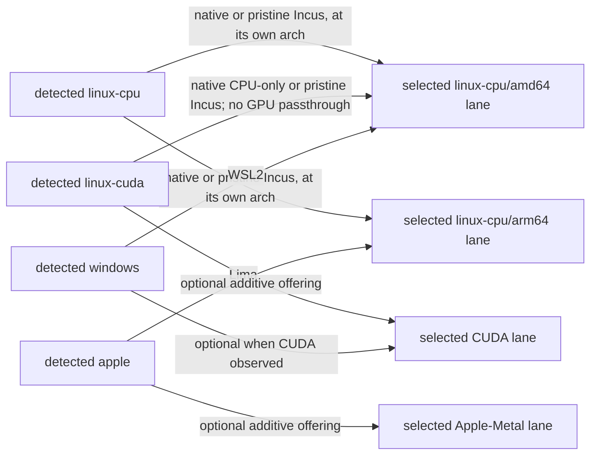

# Substrate Registry and Per-Phase Substrate Map

> **Purpose**: The plan-side hardware-substrate registry and per-phase execution-lane map — which baseline or
> specialized lane each acceptance gate keys to (phases 0–95), backed by the closed detected-hardware catalog
> owned by the substrate doctrine.
> **Read this if**: a phase's substrate has to be established, or a new substrate is being considered.

This document is the reader-facing substrate registry and per-phase map: which execution lane each gate runs
in, which physical hosts can supply it, and why at most one specialized lane may be named per gate. It owns
the normative explanation and review surface; the substrate concept itself is owned
by [`../documents/engineering/substrate_doctrine.md`](../documents/engineering/substrate_doctrine.md), and
phase order by [README.md](README.md).

Link-graph metadata

**Status**: Authoritative source
**Supersedes**: N/A
**Referenced by**: DEVELOPMENT_PLAN/README.md, DEVELOPMENT_PLAN/development_plan_phase_model.md, DEVELOPMENT_PLAN/later_phases.md, DEVELOPMENT_PLAN/overview.md, DEVELOPMENT_PLAN/phase_11_formal_model_kernel.md, DEVELOPMENT_PLAN/phase_12_explicit_state_checker.md, DEVELOPMENT_PLAN/phase_13_symbolic_checker.md, DEVELOPMENT_PLAN/phase_34_chain_kernel_boundary.md, DEVELOPMENT_PLAN/phase_54_windows_engine_bringup.md, DEVELOPMENT_PLAN/phase_55_bootstrap_coordinator_kind.md, DEVELOPMENT_PLAN/phase_56_base_image_registry.md, DEVELOPMENT_PLAN/phase_57_complementary_arch_child.md, DEVELOPMENT_PLAN/phase_61_vault_pki.md, DEVELOPMENT_PLAN/phase_62_platform_backbone.md, DEVELOPMENT_PLAN/phase_63_platform_services_2.md, DEVELOPMENT_PLAN/phase_64_keycloak_ingress.md, DEVELOPMENT_PLAN/phase_65_live_dsl_deploy.md, DEVELOPMENT_PLAN/phase_67_pulsar_client.md, DEVELOPMENT_PLAN/phase_73_network_fabric_wireguard.md, DEVELOPMENT_PLAN/phase_74_multicluster_spawn_georepl.md, DEVELOPMENT_PLAN/phase_75_gateway_migration_drills.md, DEVELOPMENT_PLAN/phase_76_provider_deploy_checkpoint.md, DEVELOPMENT_PLAN/phase_77_provider_child_bringup.md, DEVELOPMENT_PLAN/phase_78_provider_ebs_credential.md, DEVELOPMENT_PLAN/phase_79_provider_dynamic_nodes.md, DEVELOPMENT_PLAN/phase_89_apple_metal_host_daemon.md, README.md
**Generated sections**: none

## Contents
- [1. The one-substrate-per-validation discipline](#1-the-one-substrate-per-validation-discipline)
- [2. Substrate inventory](#2-substrate-inventory)
- [3. Virtualized substrates: Incus / Lima / WSL2](#3-virtualized-substrates-incus--lima--wsl2)
- [4. Per-phase substrate map](#4-per-phase-substrate-map)
- [5. Generated sections](#5-generated-sections)
- [Related Documents](#related-documents)

---

## 1. The one-substrate-per-validation discipline

This document is the **plan-side projection** of the substrate catalog. The normative catalog — what the four
substrate names *mean*, how they are detected, the no-`PATH` lazy tool-ensure contract, the virtualization
strategy, and the host-worker carve-out — is owned in full by
[`substrate_doctrine.md` §1 — the substrate is a fact about the host, not a knob](../documents/engineering/substrate_doctrine.md#1-the-substrate-is-a-fact-about-the-host-not-a-knob).
This file records **which execution lane each phase gate runs on** and keeps
that map honest against the plan.

No gate, generator, or runtime parses these Markdown tables. The executable closed vocabulary and mapping are
the reviewed Haskell `PhaseLane` declaration and its phase relation; a separately authored Haskell oracle
checks that relation from structured plan metadata. Human review owns the correspondence between those values
and this reader-facing explanation. Any tabular machine projection is generated beneath `.build/docs/**`.

The governing rule is the one-substrate discipline from
[`development_plan_standards.md` §L — one-substrate discipline](development_plan_standards.md#l-one-substrate-discipline)
and the [README.md Phase discipline](README.md#phase-discipline): **every live acceptance gate has the
always-available `linux-cpu` baseline and requires at most one specialized lane** (`apple` or `linux-cuda`),
named in that phase's `Phase Summary` and tracked here. A phase that needs no host at all is `none`. The
baseline is named **with its architecture** — the substrate's natural one — because `linux-cpu` alone names
a claim two different machines would satisfy differently
([`substrate_doctrine.md` §1.1](../documents/engineering/substrate_doctrine.md#11-the-natural-architecture-rule)).

Two facts from the doctrine make this discipline enforceable rather than aspirational:

- **Hardware is detected; eligible lanes are derived.** The substrate is read from the host (OS,
  architecture, GPU presence) and classified into one of four members; it is never an operator knob
  ([`substrate_doctrine.md` §1](../documents/engineering/substrate_doctrine.md#1-the-substrate-is-a-fact-about-the-host-not-a-knob)).
  Every member derives `linux-cpu` **at its own natural architecture**; accelerator-bearing members
  additionally derive their specialized lane. A `.dhall` may select only a derived offering and cannot
  invent hardware — and an architecture is hardware, so it cannot be emulated into existence either.
- **The standard service contract is target-independent.** The lower-layer LoadBalancer backend is derived from
  the materialized compute engine/provider, not from the detected substrate alone
  ([`substrate_doctrine.md` §7 — the LoadBalancer backend mapping](../documents/engineering/substrate_doctrine.md#7-the-loadbalancer-is-the-one-substrate-driven-platform-difference), reinforced by [`platform_services_doctrine.md` §12 — substrate equivalence as a structural invariant](../documents/engineering/platform_services_doctrine.md#12-substrate-equivalence-as-a-structural-invariant)).
  Thus a managed-provider gate retains the same core service set as a `linux-cpu` self-managed gate; provider
  LB/DNS integrations do not create a different platform inventory.

Diagram vocabulary: [diagram_conventions.md](../documents/engineering/diagram_conventions.md).

*Orientation. Every detected hardware substrate reaches a CPU-only Linux baseline, but only the one its own architecture can execute — Apple reaches `arm64`, Windows reaches `amd64`, and a Linux host reaches whichever it natively is. Incus, Lima, and WSL2 are the fixed pristine-guest routes; accelerator lanes add capability and never replace the baseline, as owned by [§1](#1-the-one-substrate-per-validation-discipline).*

> **Historical result (invalidated).** Pre-amendment runs exercised substrate-`none` and native
> `linux-cpu` slices. The 2026-08-11 amendment invalidated every seal, so the catalog's `Delivery note` fields and
> the fourth-column outcome prose are diagnostic observations, not current results. Apple/Lima, Windows/WSL2,
> CUDA, Metal, and managed-provider gaps remain relevant to revalidation. Where detection and the virtualization providers lean on the sibling
> `hostbootstrap` library, that is *evidence from a sibling*, not amoebius proof — see the honesty notes in
> [`substrate_doctrine.md`](../documents/engineering/substrate_doctrine.md). Current status and dated progress are owned only by
> [README.md](README.md).

---

## 2. Substrate inventory

The four members of the closed catalog
([`substrate_doctrine.md` §1](../documents/engineering/substrate_doctrine.md#1-the-substrate-is-a-fact-about-the-host-not-a-knob)),
each as a plan-side registry entry. The doctrine owns *why* each is special; this is the projection keyed to
gates.

> **Two axes — detected vs declared.** The four members below are the **detected** host substrate (a fact
> about the machine, never a knob). The **compute engine** — `kind` / `rke2` / `Managed EKS` — is a separate
> **declared** axis owned by
> [`cluster_topology_doctrine.md`](../documents/engineering/cluster_topology_doctrine.md); EKS is therefore a
> *managed provider entry* (below), **not** a fifth detected substrate. Each host entry also **advertises a
> declared inventory** — a complete per-host/node `Capacity` (CPU/memory, pod-ephemeral capacity, the
> nodefs/imagefs/containerfs layout, disjoint disk pools, and the accelerator device vector or Apple
> unified-memory shape) whose model is owned by
> [`resource_capacity_doctrine.md` §3](../documents/engineering/resource_capacity_doctrine.md#3-the-types-quantity-capacity-demand-budget)
> and whose fold checks workload/VM/cache/engine demand against it
> ([§4](../documents/engineering/resource_capacity_doctrine.md#4-the-total-fold-fits-carve-place-and-the-nesting)),
> cross-checked at runtime against observed allocatable, backing, and device inventory
> ([§2](../documents/engineering/substrate_doctrine.md#2-detection-a-pure-classification-over-three-reads)).
> The registry records only **which substrate/engine each gate keys to**; the `Capacity` model, its fold, and
> its layer are the capacity doctrine's.

> **Baseline rule.** `linux-cpu` is an execution lane available on **all** detected hardware substrates, at
> each one's natural architecture. It is native on Linux, provided by Lima on Apple at `arm64`, and provided
> by WSL2 on Windows at `amd64`. On `linux-cuda`, selecting it
> means the NVIDIA device is not advertised to the guest/node. A phase row saying “no CUDA/Apple/Windows
> substrate is touched” means the specialized capability is not exercised; it does **not** require physically
> accelerator-free or Linux-only hardware. Evidence records the detected hardware and selected lane separately.

### apple

| Field | Value |
|-------|-------|
| Host kind | macOS on Apple Silicon — the admin laptop / highest-level root cluster host |
| Natural arch | `arm64` (always; Intel-Mac is rejected outright, [`substrate_doctrine.md` §1](../documents/engineering/substrate_doctrine.md#1-the-substrate-is-a-fact-about-the-host-not-a-knob)) |
| GPU axis | Apple Metal — on-host, **not containerizable** (needs unified memory); the worker is built **headless on the host, no VM** ([`apple_metal_headless_builds.md`](../documents/engineering/apple_metal_headless_builds.md)) |
| Baseline `linux-cpu` route | Lima (Ubuntu-24.04 Linux VM) — see [§3](#3-virtualized-substrates-incus--lima--wsl2) |
| Operator floor | Homebrew and the Xcode Command Line Tools, and nothing else ([`substrate_doctrine.md` §3.1](../documents/engineering/substrate_doctrine.md#31-the-per-substrate-floor-what-only-the-operator-can-supply)) |
| Specialized lane | Apple Metal on-host; additive to, never a replacement for, `linux-cpu` |
| LoadBalancer | MetalLB (bare-metal / kind / rke2 lane) |
| What it validates | Phase 53 supplies the Apple-host engine and native arm64 image; Phase 57 supplies the complementary-architecture base-image child; Phase 89 runs an Apple-Silicon **host compute daemon** as an in-cluster Pulsar/MinIO peer over host-only NodePorts ([`substrate_doctrine.md` §5 — host worker nodes](../documents/engineering/substrate_doctrine.md#5-host-worker-nodes-substrate-specific-hardware-that-cannot-be-containerized)) |
| Gate phase(s) | Phases 53, 57, and 89 — the per-phase assignment is owned by [§4](#4-per-phase-substrate-map) |
| Delivery note | Target specified; owning phase status lives only in [README.md](README.md) |

### linux-cpu

| Field | Value |
|-------|-------|
| Host kind | CPU-only execution lane supplied by any supported hardware substrate, at that host's natural architecture |
| Natural arch | the detected one, `amd64` or `arm64`, and only that one — mixed-arch clusters stay expressible because each node is proven on its own hardware |
| GPU axis | none advertised to this lane; physical accelerators may exist |
| Realization | native Linux when cleanliness is not required; otherwise Incus on Linux, Lima on Apple, or WSL2 on Windows |
| Operator floor | a package-manager root, passwordless sudo, and `/dev/kvm` for the guest ([`substrate_doctrine.md` §3.1](../documents/engineering/substrate_doctrine.md#31-the-per-substrate-floor-what-only-the-operator-can-supply)) |
| LoadBalancer | MetalLB |
| What it validates | The **default validation substrate** — bootstrap, platform services and retained storage, the DSL/control-plane daemon, Pulsar/store/workflow, CPU inference, the generic low-code UI server/projector, authenticated single/multi-tenant isolation, rollout/reconnect, encrypted offline replay/blobs/release evolution, and multi-cluster migration |
| Gate phase(s) | Phases 52, 55–56, 58–75, 80–83, 85–87, 90–92, 95, plus the `linux-cpu` parent side of Phases 76–79, 84, 88 — the live path's default substrate; the per-phase assignment is owned by [§4](#4-per-phase-substrate-map) |
| Delivery note | Target specified; owning phase status lives only in [README.md](README.md) |

### linux-cuda

| Field | Value |
|-------|-------|
| Host kind | Linux host with an NVIDIA GPU present; `linux-cpu` remains available |
| Natural arch | the detected one, `amd64` or `arm64`; `amd64` on this project's CUDA host |
| GPU axis | NVIDIA present ⇒ **in-cluster** CUDA via the NVIDIA container runtime — the *contained-GPU* case ([`substrate_doctrine.md` §5](../documents/engineering/substrate_doctrine.md#5-host-worker-nodes-substrate-specific-hardware-that-cannot-be-containerized) contrast) |
| Baseline `linux-cpu` route | native CPU-only lane, or a pristine Incus guest with no GPU passthrough |
| Operator floor | the `linux-cpu` floor plus the NVIDIA kernel driver — whose absence is not a refusal but a different classification ([`substrate_doctrine.md` §3.1](../documents/engineering/substrate_doctrine.md#31-the-per-substrate-floor-what-only-the-operator-can-supply)) |
| LoadBalancer | MetalLB |
| What it validates | The scoped Phase 93 numerical-core slice and Phase 94 training/checkpoint-contract slice on the NVIDIA accelerator lane; all current claims remain NOT VALIDATED. |
| Gate phase(s) | Phases 93 and 94 — the per-phase assignment is owned by [§4](#4-per-phase-substrate-map) |
| Delivery note | Historical scoped observation from 2026-08-11, invalidated by the artifact-policy amendment; owning phase status lives only in [README.md](README.md) |

### windows

| Field | Value |
|-------|-------|
| Host kind | Windows host |
| Natural arch | `amd64` |
| GPU axis | CUDA present ⇒ **on-host worker node** — CUDA does not run performantly inside WSL2 ([`substrate_doctrine.md` §5](../documents/engineering/substrate_doctrine.md#5-host-worker-nodes-substrate-specific-hardware-that-cannot-be-containerized)) |
| Baseline `linux-cpu` route | WSL2 (Ubuntu-24.04 Linux distro) — see [§3](#3-virtualized-substrates-incus--lima--wsl2) |
| Operator floor | winget, PowerShell, firmware virtualization enabled in BIOS/UEFI, elevation, and the reboot a WSL2 change may need ([`substrate_doctrine.md` §3.1](../documents/engineering/substrate_doctrine.md#31-the-per-substrate-floor-what-only-the-operator-can-supply)) |
| LoadBalancer | MetalLB (when acting as a Linux cluster host) |
| What it validates | [Phase 54](phase_54_windows_engine_bringup.md) keys its single substrate to `windows` at lane `linux-cpu/amd64`, supplied by WSL2; the retired claim that no gate needed to was withdrawn with the host band. Beyond that gate Windows participates either as a Linux host (via WSL2) or as the Windows-CUDA host-worker case, which shares the Phase 89 host-compute doctrine whose gate substrate is `apple`. This round elevates the Windows-CUDA host worker to a **first-class** case alongside Apple-Metal — role parity, not evidence parity ([`substrate_doctrine.md` §5](../documents/engineering/substrate_doctrine.md#5-host-worker-nodes-substrate-specific-hardware-that-cannot-be-containerized), [`daemon_topology_doctrine.md` §4](../documents/engineering/daemon_topology_doctrine.md#4-worker-daemons--n-unelected)). The standalone `windows` gate is a later-phase concern (README later phases) |
| Gate phase(s) | Phase 54 for the WSL2 `linux-cpu/amd64` engine; Phase 89 owns only the later host-worker doctrine shared with Apple Metal |
| Delivery note | Target specified; owning phase status lives only in [README.md](README.md) |

> **Observed implementation.** The original classification seed came from the sibling `hostbootstrap`
> library. The dirty-worktree audit finds an amoebius detector and tests for the four-member catalog and the
> universal `linux-cpu` derivation. Pre-amendment evidence covered a Linux-parent → Incus-guest route; its seal
> is invalidated, while Lima and WSL2 remain target routes rather than current exercised results
> ([`substrate_doctrine.md` §1](../documents/engineering/substrate_doctrine.md#1-the-substrate-is-a-fact-about-the-host-not-a-knob)).

> **Why `windows` is not split into `windows-cuda`.**
> The amoebius four-name catalog keys each member on the **OS / VM-provider + wire strategy**, not on accelerator
> presence: a Windows host's CUDA reaches the cluster as a **host worker** regardless (CUDA does not run
> performantly under WSL2), so the deployment-shape-changing axis is captured by the Phase-89 host-worker
> elevation, not by a new substrate name. The seed's finer `windows-gpu` member therefore collapses to
> `windows`, while the seed-attributed `linux-gpu` keeps its `linux-gpu` ⇔ amoebius `linux-cuda` mapping — the
> seed strings above are quotations and are kept verbatim. `cuda` names the **NVIDIA accelerator family**; a
> future non-NVIDIA accelerator (e.g. ROCm) would be its own substrate, which is why the amoebius name is
> `linux-cuda`, not the too-generic `gpu`
> ([`substrate_doctrine.md` §1](../documents/engineering/substrate_doctrine.md#1-the-substrate-is-a-fact-about-the-host-not-a-knob)).

### eks (managed provider — a *declared engine*, not a detected substrate)

EKS is a first-class citizen on the **compute-engine axis**, not a member of the detected substrate catalog:
it has no host to detect and no `LinuxHost` witness. It is the `Managed Eks` arm of the `ComputeEngine` union
([`cluster_topology_doctrine.md`](../documents/engineering/cluster_topology_doctrine.md) [§2](../documents/engineering/cluster_topology_doctrine.md#2-computeengine-a-closed-union-eks-a-first-class-arm)).

| Field | Value |
|-------|-------|
| Kind | Provider-managed cluster (`Managed Eks`) — no host binary or host worker daemons; the same executable runs the mandatory in-cluster control-plane daemon, capacity-scheduler, and worker roles |
| Detected substrate? | **No** — declared, provisioned over the cloud API from inside a parent ([`pulumi_iac_doctrine.md` §4](../documents/engineering/pulumi_iac_doctrine.md#4-what-pulumi-provisions-the-resource-catalog)) |
| Provider account | Required authored `Managed Eks.account : CloudAccountId`; it exact-joins the account quota ledger, credentials, observation, and every derived `ProviderInstanceId` |
| Node capacity | From exact declared `ProviderNodeClass { name, sku, allocatable, quotaVcpu, zones, price, baseCount, maxCount }` values, not the managed control plane. `allocatable` is the complete `ProviderNodeCapacityTemplate { allocatableCpu, allocatableMemory, podSlots, cniSlots, attachableVolumes, localDisks, cpuOvercommit, localStorage, accelerator }`; each `localDisks` entry is a `PerInstanceDiskTemplate` with raw `InstanceStore.provisionedRawBytes` or an `EphemeralRootEbs` policy and usable `ProviderUsableDiskCarveTemplate.requiredUsableBytes` system/layout carves. Each selected instance becomes a distinct privately provisioned capacity before folding ([`resource_capacity_doctrine.md` §3](../documents/engineering/resource_capacity_doctrine.md#3-the-types-quantity-capacity-demand-budget)) |
| Storage ceiling | Three non-interchangeable cases: SKU-pinned `InstanceStore.provisionedRawBytes` is per-instance raw supply and spends no EBS quota; an `EphemeralRootEbs` root derives and spends a provider-rounded raw request under `ProviderQuota.nodeRootStorage`; retained durable EBS uses the `Ebs` `StorageBacking` arm and spends `ProviderQuota.durable`. For either node-disk arm, private `ProvisionedPerInstanceDiskTemplate` derives presentation-pinned `mountedUsableBytes` before proving the usable system reserve plus unique usable carves fit. The `CloudQuota` arm is only provider-object byte/count quota. The never-sum-raw-and-usable ceiling and the quota-bounded `ScalingPolicy` escape valve are owned by [`resource_capacity_doctrine.md` §5](../documents/engineering/resource_capacity_doctrine.md#5-storagebudget-bounded-by-construction-single-owner-ceiling-per-arm) / [§6](../documents/engineering/resource_capacity_doctrine.md#6-growable--scalingpolicy-the-quota-bounded-dynamic-provisioning-arm) |
| LoadBalancer | Cloud LoadBalancer (derived from the `Managed Eks` provider materialization; [`substrate_doctrine.md` §7](../documents/engineering/substrate_doctrine.md#7-the-loadbalancer-is-the-one-substrate-driven-platform-difference)) |
| Gate phase(s) | Phases 76–79, 84, 88 (the provider phases; the `linux-cpu` parent drives the deploy, and the provider target is not a hardware substrate) — owned by [§4](#4-per-phase-substrate-map) |
| Delivery note | Target specified; owning phase status lives only in [README.md](README.md) |

> **Environment preconditions.** A substrate is a fact about the *host*; the same kind of fact can hold about
> an account, a cluster addon, or a developer machine. Those are declared in a sprint's `**Requires**` field,
> whose closed vocabulary is owned by
> [§F](development_plan_standards.md#f-the-sprint-block-format) — stated there, not re-derived here.

---

## 3. Virtualized substrates: Incus / Lima / WSL2

Every hardware substrate can materialize a `linux-cpu` guest with the same typed service projections, services,
and DSL. Non-Linux hosts always interpose their provider; Linux hosts interpose Incus whenever the gate
requires a pristine machine. This is the canonical mapping, not a preference list:
[`substrate_doctrine.md` §4 — virtualized substrates: synthesizing a Linux host where the host is not Linux](../documents/engineering/substrate_doctrine.md#4-virtualized-substrates-synthesizing-a-linux-host-where-the-host-is-not-linux).
The VM is plumbing; the substrate the cluster sees is Linux. These are **providers**, not catalog members.

### incus

| Field | Value |
|-------|-------|
| Runs on | `linux-cpu` or `linux-cuda` hardware substrate |
| Provider / tool | Incus |
| Synthesizes | A newly created Ubuntu-24.04 VM presenting as `linux-cpu` at the parent's natural architecture; no GPU passthrough for the baseline lane |
| Seed module | `HostBootstrap.Incus` (sibling `hostbootstrap`) |
| Used by | Every Linux-host gate that requires a pristine Linux machine, including the Phase-55 clean-host gate |
| Delivery note | Sibling seed observed; amoebius materialization remains a target and owning phase status lives only in [README.md](README.md) |

### lima

| Field | Value |
|-------|-------|
| Runs on | `apple` host substrate |
| Provider / tool | Lima (`limactl`), ensured via `brew install lima` (verified no-op if present) |
| Synthesizes | A named, project-budget-sized Ubuntu-24.04 Linux VM presenting as `linux-cpu/arm64` |
| Seed module | `HostBootstrap.Ensure.Lima` / `HostBootstrap.Lima` (sibling `hostbootstrap`) |
| Used by | Phases 53 and 57 for natural-arm64 Linux engine/image work, and Phase 89 for baseline cluster-side commands only; Phase 89's Metal bridge and workload remain headless on the Apple host, outside Lima |
| Delivery note | Target specified; owning phase status lives only in [README.md](README.md) |

### wsl2

| Field | Value |
|-------|-------|
| Runs on | `windows` host substrate |
| Provider / tool | WSL2 (`wsl`; install via `winget install --id Microsoft.WSL`) |
| Synthesizes | An Ubuntu-24.04 Linux distro presenting as `linux-cpu/amd64` |
| Seed module | `HostBootstrap.Ensure.Wsl2` / `HostBootstrap.Wsl2` (sibling `hostbootstrap`) |
| Used by | The Windows Linux-host role; firmware-virtualization-off and a required reboot are first-class fail-fast outcomes, never silent hangs |
| Delivery note | Target specified; owning phase status lives only in [README.md](README.md) |

> **Pristine-host rule.** A clean Docker container is useful isolated evidence but is not the VM gate. A gate
> requiring a pristine Linux host creates a fresh Incus/Lima/WSL2 guest from a dynamically resolved compatible image, records the
> absent-tool preflight inside it, and destroys it after the leak sweep.
>
> **VM budget.** Each virtualized substrate carves a **`Capacity`** from its host (`carve`,
> [`resource_capacity_doctrine.md` §4](../documents/engineering/resource_capacity_doctrine.md)); the guest
> Linux cluster folds against that sub-capacity, so "a VM asking for more than its host" is rejected at the
> pure post-bind `provision-seal`
> ([`illegal_state_catalog.md` §3.17](../documents/illegal_state/illegal_state_catalog.md#3-the-catalog--states-a-valid-spec-cannot-represent)). A Lima/WSL2 VM is
> also the **only `LinuxHost` witness** its non-Linux host can produce — which is why an rke2/kind cluster on
> apple/windows must interpose one (I1, [§3.14](../documents/illegal_state/illegal_state_topology.md#314-rke2kind-on-a-host-with-no-linux-node-applewindows-without-an-interposed-linux-vm)).

> **No Tart / no macOS build VM.** The Apple-Metal host worker's Swift/Metal parts are **not** built in a VM.
> They build headless, directly on the macOS host via a fixed `/usr/bin/clang`-built Metal bridge with runtime
> MSL compilation — a shape proven in the sibling jitML project and adopted after sibling `infernix` removed
> its legacy Tart path. There is no Tart provider, and none is planned
> ([`apple_metal_headless_builds.md`](../documents/engineering/apple_metal_headless_builds.md)).

---

## 4. Per-phase substrate map

The substrate each phase's acceptance gate keys to, under the
[§L](development_plan_standards.md#l-one-substrate-discipline) rule: phases 0–51 use no host. Every hardware
substrate can supply the always-available `linux-cpu` baseline, but a hardware-bearing gate names exactly one
accepted row and never inherits an extra run implicitly. It may name **at most one specialized substrate**
from the closed set `apple | linux-cuda | windows`. A row naming a specialized member does not turn its
baseline into evidence for the specialized claim; a row naming `linux-cpu` may run on any physical substrate
through its native/Incus/Lima/WSL2 route **whose natural architecture is the Lane column's**. The canonical
`provider` lane means a managed-provider target driven from one `linux-cpu` parent;
it is not a composite substrate or architecture. `none` means no host at all. **No row may name two specialized substrates** — only
phases 93 and 94 (`linux-cuda`), 53, 57 and 89 (`apple`), and 54 (`windows`) name one.
Each row matches the substrate named in that
phase's `Phase Summary`; the README Phase overview carries the same values
([README.md Phase overview](README.md#phase-overview)).

The sequence divides at one boundary, and it is the same boundary for both axes: **phases 0–51 declare
substrate `none`** and reach Register 1 or 2, and **phases 52–95 declare a real substrate** and reach Register
3 ([§K](development_plan_phase_model.md#k-honesty-proven--tested--assumed)). The specialized members are not a
tail band — 53, 54, 57, 89, 93 and 94 are interleaved through the live band, each placed where its capability
belongs rather than grouped by machine. The offline work is bisected by register like every other capability:
its Register-1/2 halves are Phases **41** and **45**, and its Register-3 halves are Phases **85–88**. Each
row's full objective, gate, and sprint breakdown lives in its phase document
(`phase_00_documentation_suite.md` … `phase_95_webapp_rederivation.md`).

The fourth column records planned lane assignment only. It contains no result, date, checkmark, receipt,
attestation, or validation status. The tracker in [README.md](README.md) is the sole status owner. Phase 0 is
active but not validated; Phases 1–95 are blocked and not validated. Hardware execution for promotion is
prohibited until the hardware-free DSL barrier and every preceding redesigned contract are independently
satisfied and human-approved.

| Phase | Name | Substrate | Lane | Substrate rationale; any outcome is historical and invalidated |
|-------|------|-----------|------|--------------------|
| 0 | Documentation suite (whole DSL) | `none` | `none` | Planned lane only — NOT VALIDATED. Phase 0 is active for documentation, validation, and source-boundary redesign |
| 1 | Haskell toolchain and probe-source closure | `none` | `none` | Planned lane only — NOT VALIDATED. Blocked by independent validation and human promotion of redesigned Phase 0 |
| 2 | Repository layout conformance and de-phased naming | `none` | `none` | Planned lane only — NOT VALIDATED. Blocked by independent validation and human promotion of redesigned Phase 1 |
| 3 | The artifact calculus | `none` | `none` | Planned lane only — NOT VALIDATED. Blocked by independent validation and human promotion of redesigned Phase 2 |
| 4 | The budget calculus | `none` | `none` | Planned lane only — NOT VALIDATED. Blocked by independent validation and human promotion of redesigned Phase 3 |
| 5 | The lift calculus | `none` | `none` | Planned lane only — NOT VALIDATED. Blocked by independent validation and human promotion of redesigned Phase 4 |
| 6 | The workflow calculus | `none` | `none` | Planned lane only — NOT VALIDATED. Blocked by independent validation and human promotion of redesigned Phase 5 |
| 7 | The evidence calculus | `none` | `none` | Planned lane only — NOT VALIDATED. Blocked by independent validation and human promotion of redesigned Phase 6 |
| 8 | Scoped identity kernel | `none` | `none` | Planned lane only — NOT VALIDATED. Blocked by independent validation and human promotion of redesigned Phase 7 |
| 9 | Capacity core fold + topology relation | `none` | `none` | Planned lane only — NOT VALIDATED. Blocked by independent validation and human promotion of redesigned Phase 8 |
| 10 | Composition across the five calculi | `none` | `none` | Planned lane only — NOT VALIDATED. Blocked by independent validation and human promotion of redesigned Phase 9 |
| 11 | Formal-model EDSL (`Model`/`interpret`/`emitTLA`) | `none` | `none` | Planned lane only — NOT VALIDATED. Blocked by independent validation and human promotion of redesigned Phase 10 |
| 12 | The amoebius explicit-state checker | `none` | `none` | Planned lane only — NOT VALIDATED. Blocked by independent validation and human promotion of redesigned Phase 11 |
| 13 | The amoebius symbolic checker | `none` | `none` | Planned lane only — NOT VALIDATED. Blocked by independent validation and human promotion of redesigned Phase 12 |
| 14 | The amoebius refinement checker | `none` | `none` | Planned lane only — NOT VALIDATED. Blocked by independent validation and human promotion of redesigned Phase 13 |
| 15 | The compile-fail fixture harness | `none` | `none` | Planned lane only — NOT VALIDATED. Blocked by independent validation and human promotion of redesigned Phase 14 |
| 16 | Deterministic-simulation substrate | `none` | `none` | Planned lane only — NOT VALIDATED. Blocked by independent validation and human promotion of redesigned Phase 15 |
| 17 | Gateway-migration model (both branches) | `none` | `none` | Planned lane only — NOT VALIDATED. Blocked by independent validation and human promotion of redesigned Phase 16 |
| 18 | DSL formal model | `none` | `none` | Planned lane only — NOT VALIDATED. Blocked by independent validation and human promotion of redesigned Phase 17 |
| 19 | Reconcile decision core under deterministic simulation | `none` | `none` | Planned lane only — NOT VALIDATED. Blocked by independent validation and human promotion of redesigned Phase 18 |
| 20 | The extension declaration | `none` | `none` | Planned lane only — NOT VALIDATED. Blocked by independent validation and human promotion of redesigned Phase 19 |
| 21 | The per-extension laws L1-L5 | `none` | `none` | Planned lane only — NOT VALIDATED. Blocked by independent validation and human promotion of redesigned Phase 20 |
| 22 | The compositional laws C1-C7 | `none` | `none` | Planned lane only — NOT VALIDATED. Blocked by independent validation and human promotion of redesigned Phase 21 |
| 23 | The security laws S1-S6 | `none` | `none` | Planned lane only — NOT VALIDATED. Blocked by independent validation and human promotion of redesigned Phase 22 |
| 24 | The generated conformance gate | `none` | `none` | Planned lane only — NOT VALIDATED. Blocked by independent validation and human promotion of redesigned Phase 23 |
| 25 | Haskell-derived Dhall projection and smart-constructor prelude | `none` | `none` | Planned lane only — NOT VALIDATED. Blocked by independent validation and human promotion of redesigned Phase 24 |
| 26 | Haskell protocol declarations, GADT-indexed IR, and total decoder | `none` | `none` | Planned lane only — NOT VALIDATED. Blocked by independent validation and human promotion of redesigned Phase 25 |
| 27 | Illegal-state corpus + validation-locus ledger | `none` | `none` | Planned lane only — NOT VALIDATED. Blocked by independent validation and human promotion of redesigned Phase 26 |
| 28 | Logical→physical storage geometry folds | `none` | `none` | Planned lane only — NOT VALIDATED. Blocked by independent validation and human promotion of redesigned Phase 27 |
| 29 | Execution-epoch + scheduler + accelerator + provider-root folds | `none` | `none` | Planned lane only — NOT VALIDATED. Blocked by independent validation and human promotion of redesigned Phase 28 |
| 30 | Capability union + representational bind | `none` | `none` | Planned lane only — NOT VALIDATED. Blocked by independent validation and human promotion of redesigned Phase 29 |
| 31 | Whole-deployment provision seal + expansion | `none` | `none` | Planned lane only — NOT VALIDATED. Blocked by independent validation and human promotion of redesigned Phase 30 |
| 32 | InferenceEngine capability + accelerator provision | `none` | `none` | Planned lane only — NOT VALIDATED. Blocked by independent validation and human promotion of redesigned Phase 31 |
| 33 | Pure `renderAll` + rendered-artifact oracles | `none` | `none` | Planned lane only — NOT VALIDATED. Blocked by independent validation and human promotion of redesigned Phase 32 |
| 34 | chain/Step kernel + `--dry-run` + boundary fake-tool harness + extension-astcheck AST checker | `none` | `none` | Planned lane only — NOT VALIDATED. Blocked by independent validation and human promotion of redesigned Phase 33 |
| 35 | The amoebius image recipe | `none` | `none` | Planned lane only — NOT VALIDATED. Blocked by independent validation and human promotion of redesigned Phase 34 |
| 36 | The closed transaction vocabulary | `none` | `none` | Planned lane only — NOT VALIDATED. Blocked by independent validation and human promotion of redesigned Phase 35 |
| 37 | Bounded UI-program schema | `none` | `none` | Planned lane only — NOT VALIDATED. Blocked by independent validation and human promotion of redesigned Phase 36 |
| 38 | UI authorization kernel | `none` | `none` | Planned lane only — NOT VALIDATED. Blocked by independent validation and human promotion of redesigned Phase 37 |
| 39 | UI effect binding | `none` | `none` | Planned lane only — NOT VALIDATED. Blocked by independent validation and human promotion of redesigned Phase 38 |
| 40 | UI plan compiler | `none` | `none` | Planned lane only — NOT VALIDATED. Blocked by independent validation and human promotion of redesigned Phase 39 |
| 41 | Offline language and paired plans | `none` | `none` | Planned lane only — NOT VALIDATED. Blocked by independent validation and human promotion of redesigned Phase 40 |
| 42 | Haskell browser-interpreter semantics and projection | `none` | `none` | Planned lane only — NOT VALIDATED. Blocked by independent validation and human promotion of redesigned Phase 41 |
| 43 | Haskell UI-server boundary | `none` | `none` | Planned lane only — NOT VALIDATED. Blocked by independent validation and human promotion of redesigned Phase 42 |
| 44 | Hardware-free Haskell UI composition | `none` | `none` | Planned lane only — NOT VALIDATED. Blocked by independent validation and human promotion of redesigned Phase 43 |
| 45 | Haskell offline-state semantics and runtime projection | `none` | `none` | Planned lane only — NOT VALIDATED. Blocked by independent validation and human promotion of redesigned Phase 44 |
| 46 | Haskell-generated browser contracts and bundle | `none` | `none` | Planned lane only — NOT VALIDATED. Blocked by independent validation and human promotion of redesigned Phase 45 |
| 47 | Foreign-source generator closure, checking tools, and mutants | `none` | `none` | Planned lane only — NOT VALIDATED. Blocked by independent validation and human promotion of redesigned Phase 46 |
| 48 | The test-workflow algebra | `none` | `none` | Planned lane only — NOT VALIDATED. Blocked by independent validation and human promotion of redesigned Phase 47 |
| 49 | No-hardware DSL promotion barrier and self-referential gate suite | `none` | `none` | Planned lane only — NOT VALIDATED. Blocked by independent validation and human promotion of redesigned Phase 48 |
| 50 | Bounded `pb` bootstrap and Haskell handoff | `none` | `none` | Planned lane only — NOT VALIDATED. Blocked by independent validation and human promotion of redesigned Phase 49 |
| 51 | The host-ensure kernel | `none` | `none` | Planned lane only — NOT VALIDATED. Blocked by independent validation and human promotion of redesigned Phase 50 |
| 52 | Linux: sudoless Docker and the native image | `linux-cpu` | `linux-cpu/amd64` | Planned lane only — NOT VALIDATED. Blocked by redesigned Phase 51, human promotion, and the independently satisfied hardware-free DSL barrier |
| 53 | Apple: Homebrew, Colima, and the native image | `apple` | `linux-cpu/arm64` | Planned lane only — NOT VALIDATED. Blocked by redesigned Phase 52, human promotion, and the independently satisfied hardware-free DSL barrier |
| 54 | Windows: WSL2 and the lifted Linux engine | `windows` | `linux-cpu/amd64` | Planned lane only — NOT VALIDATED. Blocked by redesigned Phase 53, human promotion, and the independently satisfied hardware-free DSL barrier |
| 55 | Haskell substrate coordinator and single kind cluster | `linux-cpu` | `linux-cpu/amd64` | Planned lane only — NOT VALIDATED. Blocked by redesigned Phase 54, human promotion, and the independently satisfied hardware-free DSL barrier |
| 56 | The base image, the jit-build resolver, and the in-cluster registry | `linux-cpu` | `linux-cpu/amd64` | Planned lane only — NOT VALIDATED. Blocked by redesigned Phase 55, human promotion, and the independently satisfied hardware-free DSL barrier |
| 57 | The complementary-architecture base image | `apple` | `linux-cpu/arm64` | Planned lane only — NOT VALIDATED. Blocked by redesigned Phase 56, human promotion, and the independently satisfied hardware-free DSL barrier |
| 58 | Typed renderer + object reconciler | `linux-cpu` | `linux-cpu/amd64` | Planned lane only — NOT VALIDATED. Blocked by redesigned Phase 57, human promotion, and the independently satisfied hardware-free DSL barrier |
| 59 | amoebius-capacity scheduler + bootstrap cutover | `linux-cpu` | `linux-cpu/amd64` | Planned lane only — NOT VALIDATED. Blocked by redesigned Phase 58, human promotion, and the independently satisfied hardware-free DSL barrier |
| 60 | No-provisioner retained storage + lossless rebind | `linux-cpu` | `linux-cpu/amd64` | Planned lane only — NOT VALIDATED. Blocked by redesigned Phase 59, human promotion, and the independently satisfied hardware-free DSL barrier |
| 61 | Root Vault + PKI + built-in Haskell Vault client | `linux-cpu` | `linux-cpu/amd64` | Planned lane only — NOT VALIDATED. Blocked by redesigned Phase 60, human promotion, and the independently satisfied hardware-free DSL barrier |
| 62 | Platform backbone (MetalLB + MinIO + Pulsar HA) | `linux-cpu` | `linux-cpu/amd64` | Planned lane only — NOT VALIDATED. Blocked by redesigned Phase 61, human promotion, and the independently satisfied hardware-free DSL barrier |
| 63 | Platform services-2 (Redis/Sentinel + Percona/Patroni + pgAdmin + observability + readiness-DAG) | `linux-cpu` | `linux-cpu/amd64` | Planned lane only — NOT VALIDATED. Blocked by redesigned Phase 62, human promotion, and the independently satisfied hardware-free DSL barrier |
| 64 | Keycloak-owned ingress | `linux-cpu` | `linux-cpu/amd64` | Planned lane only — NOT VALIDATED. Blocked by redesigned Phase 63, human promotion, and the independently satisfied hardware-free DSL barrier |
| 65 | Live DSL deploy via the replicas=1 control-plane daemon | `linux-cpu` | `linux-cpu/amd64` | Planned lane only — NOT VALIDATED. Blocked by redesigned Phase 64, human promotion, and the independently satisfied hardware-free DSL barrier |
| 66 | Tenant/provider provisioning | `linux-cpu` | `linux-cpu/amd64` | Planned lane only — NOT VALIDATED. Blocked by redesigned Phase 65, human promotion, and the independently satisfied hardware-free DSL barrier |
| 67 | Native Pulsar client (CBOR) | `linux-cpu` | `linux-cpu/amd64` | Planned lane only — NOT VALIDATED. Blocked by redesigned Phase 66, human promotion, and the independently satisfied hardware-free DSL barrier |
| 68 | Live subject/tenant isolation | `linux-cpu` | `linux-cpu/amd64` | Planned lane only — NOT VALIDATED. Blocked by redesigned Phase 67, human promotion, and the independently satisfied hardware-free DSL barrier |
| 69 | Content store + workflow runtime (Pulsar-Failover single-writer) | `linux-cpu` | `linux-cpu/amd64` | Planned lane only — NOT VALIDATED. Blocked by redesigned Phase 68, human promotion, and the independently satisfied hardware-free DSL barrier |
| 70 | Owner-scoped UI projection runtime | `linux-cpu` | `linux-cpu/amd64` | Planned lane only — NOT VALIDATED. Blocked by redesigned Phase 69, human promotion, and the independently satisfied hardware-free DSL barrier |
| 71 | Release lifecycle | `linux-cpu` | `linux-cpu/amd64` | Planned lane only — NOT VALIDATED. Blocked by redesigned Phase 70, human promotion, and the independently satisfied hardware-free DSL barrier |
| 72 | Atomic immutable UI-program release | `linux-cpu` | `linux-cpu/amd64` | Planned lane only — NOT VALIDATED. Blocked by redesigned Phase 71, human promotion, and the independently satisfied hardware-free DSL barrier |
| 73 | WireGuard network fabric | `linux-cpu` | `linux-cpu/amd64` | Planned lane only — NOT VALIDATED. Blocked by redesigned Phase 72, human promotion, and the independently satisfied hardware-free DSL barrier |
| 74 | Multi-cluster spawn + geo-replication | `linux-cpu` | `linux-cpu/amd64` | Planned lane only — NOT VALIDATED. Blocked by redesigned Phase 73, human promotion, and the independently satisfied hardware-free DSL barrier |
| 75 | Gateway-migration drills + model-correspondence | `linux-cpu` | `linux-cpu/amd64` | Planned lane only — NOT VALIDATED. Blocked by redesigned Phase 74, human promotion, and the independently satisfied hardware-free DSL barrier |
| 76 | Haskell-derived provider Pulumi program and enveloped checkpoint | `linux-cpu` | `provider` | Planned lane only — NOT VALIDATED. Blocked by redesigned Phase 75, human promotion, and the independently satisfied hardware-free DSL barrier |
| 77 | Hostless provider child + convergence + Lease handoff | `linux-cpu` | `provider` | Planned lane only — NOT VALIDATED. Blocked by redesigned Phase 76, human promotion, and the independently satisfied hardware-free DSL barrier |
| 78 | Per-PV EBS decoupling + create-vs-delete credential | `linux-cpu` | `provider` | Planned lane only — NOT VALIDATED. Blocked by redesigned Phase 77, human promotion, and the independently satisfied hardware-free DSL barrier |
| 79 | Dynamic node provisioning by signal + leak-free provider gate | `linux-cpu` | `provider` | Planned lane only — NOT VALIDATED. Blocked by redesigned Phase 78, human promotion, and the independently satisfied hardware-free DSL barrier |
| 80 | Determinism kernel + jit-build CacheBudget cache | `linux-cpu` | `linux-cpu/amd64` | Planned lane only — NOT VALIDATED. Blocked by redesigned Phase 79, human promotion, and the independently satisfied hardware-free DSL barrier |
| 81 | Single-tenant low-code UI live path | `linux-cpu` | `linux-cpu/amd64` | Planned lane only — NOT VALIDATED. Blocked by redesigned Phase 80, human promotion, and the independently satisfied hardware-free DSL barrier |
| 82 | Multi-tenant low-code UI isolation | `linux-cpu` | `linux-cpu/amd64` | Planned lane only — NOT VALIDATED. Blocked by redesigned Phase 81, human promotion, and the independently satisfied hardware-free DSL barrier |
| 83 | UI rollout, projection catch-up, and reconnect | `linux-cpu` | `linux-cpu/amd64` | Planned lane only — NOT VALIDATED. Blocked by redesigned Phase 82, human promotion, and the independently satisfied hardware-free DSL barrier |
| 84 | Initial online UI multi-zone high availability | `linux-cpu` | `provider` | Planned lane only — NOT VALIDATED. Blocked by redesigned Phase 83, human promotion, and the independently satisfied hardware-free DSL barrier |
| 85 | Offline replay and durable receipts | `linux-cpu` | `linux-cpu/amd64` | Planned lane only — NOT VALIDATED. Blocked by redesigned Phase 84, human promotion, and the independently satisfied hardware-free DSL barrier |
| 86 | Offline blobs and partition isolation | `linux-cpu` | `linux-cpu/amd64` | Planned lane only — NOT VALIDATED. Blocked by redesigned Phase 85, human promotion, and the independently satisfied hardware-free DSL barrier |
| 87 | Offline release and schema evolution | `linux-cpu` | `linux-cpu/amd64` | Planned lane only — NOT VALIDATED. Blocked by redesigned Phase 86, human promotion, and the independently satisfied hardware-free DSL barrier |
| 88 | Offline multi-zone continuity | `linux-cpu` | `provider` | Planned lane only — NOT VALIDATED. Blocked by redesigned Phase 87, human promotion, and the independently satisfied hardware-free DSL barrier |
| 89 | Apple-Metal host compute daemon | `apple` | `metal` | Planned lane only — NOT VALIDATED. Blocked by redesigned Phase 88, human promotion, and the independently satisfied hardware-free DSL barrier |
| 90 | The live test topology and elevated harness | `linux-cpu` | `linux-cpu/amd64` | Planned lane only — NOT VALIDATED. Blocked by redesigned Phase 89, human promotion, and the independently satisfied hardware-free DSL barrier |
| 91 | The infernix inference core, re-derived | `linux-cpu` | `linux-cpu/amd64` | Planned lane only — NOT VALIDATED. Blocked by redesigned Phase 90, human promotion, and the independently satisfied hardware-free DSL barrier |
| 92 | The infernix workflow and artifact contracts, re-derived | `linux-cpu` | `linux-cpu/amd64` | Planned lane only — NOT VALIDATED. Blocked by redesigned Phase 91, human promotion, and the independently satisfied hardware-free DSL barrier |
| 93 | The jitML numerical core, re-derived | `linux-cuda` | `cuda` | Planned lane only — NOT VALIDATED. Blocked by redesigned Phase 92, human promotion, and the independently satisfied hardware-free DSL barrier |
| 94 | The jitML training and checkpoint contracts, re-derived | `linux-cuda` | `cuda` | Planned lane only — NOT VALIDATED. Blocked by redesigned Phase 93, human promotion, and the independently satisfied hardware-free DSL barrier |
| 95 | The multi-tenant web application re-derived | `linux-cpu` | `linux-cpu/amd64` | Planned lane only — NOT VALIDATED. Blocked by redesigned Phase 94, human promotion, and the independently satisfied hardware-free DSL barrier |

The provider/host-side details under three of these rows are owned elsewhere: the cloud-LB and provider-cluster
provisioning behind Phases 76–79, 84, 88 by the Pulumi IaC doctrine; the host-worker wire behind Phase 89 by the
host↔cluster comms doctrine; the in-cluster vs on-host GPU split behind Phases 93/89 by
[`substrate_doctrine.md` §5](../documents/engineering/substrate_doctrine.md#5-host-worker-nodes-substrate-specific-hardware-that-cannot-be-containerized).
This map owns only the **one substrate per gate** assignment.

---

## 5. Generated sections

**None.** Both tables above are reader-facing normative policy, not executable registries. Governed
documentation never contains generated sections,
as required by
[`development_plan_standards.md` §I](development_plan_standards.md#i-generated-documentation-remains-untracked).
A future stack-surface or compute-engine compatibility projection belongs under `.build/docs/**`; it does not
replace or edit the prose here, and no behavioral consumer may parse either Markdown table.

Delivery sequencing, completion status, and validation gates for everything above are owned by
[README.md](README.md) and the per-phase documents, never by this registry — the same separation the doctrine
keeps in
[`substrate_doctrine.md` §9 — planning ownership](../documents/engineering/substrate_doctrine.md#9-planning-ownership).

---

## Related Documents

- [README.md](README.md) — the live tracker; the Phase index carries the same substrate column
- [development_plan_standards.md](development_plan_standards.md) — [§L](development_plan_standards.md#l-one-substrate-discipline) one-substrate discipline, [§I](development_plan_standards.md#i-generated-documentation-remains-untracked) generated documentation remains untracked
- [Substrate Doctrine](../documents/engineering/substrate_doctrine.md) — the normative substrate catalog, detection, no-`PATH` contract, virtualization, and host-worker carve-out this registry projects
- [Cluster Topology Doctrine](../documents/engineering/cluster_topology_doctrine.md) — the declared compute-engine axis (kind/rke2/EKS) this registry keeps distinct from the detected substrate
- [Resource Capacity Doctrine](../documents/engineering/resource_capacity_doctrine.md) — the fold over the per-host `Capacity` this registry declares
- [Platform Services Doctrine](../documents/engineering/platform_services_doctrine.md) — [§9](../documents/engineering/platform_services_doctrine.md#9-the-loadbalancer-and-the-single-wild-ingress-path) the LoadBalancer + single wild-ingress path, [§12](../documents/engineering/platform_services_doctrine.md#12-substrate-equivalence-as-a-structural-invariant) substrate equivalence as a structural invariant
- [Host ↔ Cluster Comms Doctrine](../documents/engineering/host_cluster_comms_doctrine.md) — the host-worker wire (host-only NodePorts, no mTLS) behind Phase 89
- [Daemon Topology Doctrine](../documents/engineering/daemon_topology_doctrine.md) — the composition lift and worker-role taxonomy
- [Pulumi IaC Doctrine](../documents/engineering/pulumi_iac_doctrine.md) — provider-cluster provisioning behind Phases 76–79, 84, 88
- [Engineering Doctrine Index](../documents/engineering/README.md) — the doctrine the phases adopt
