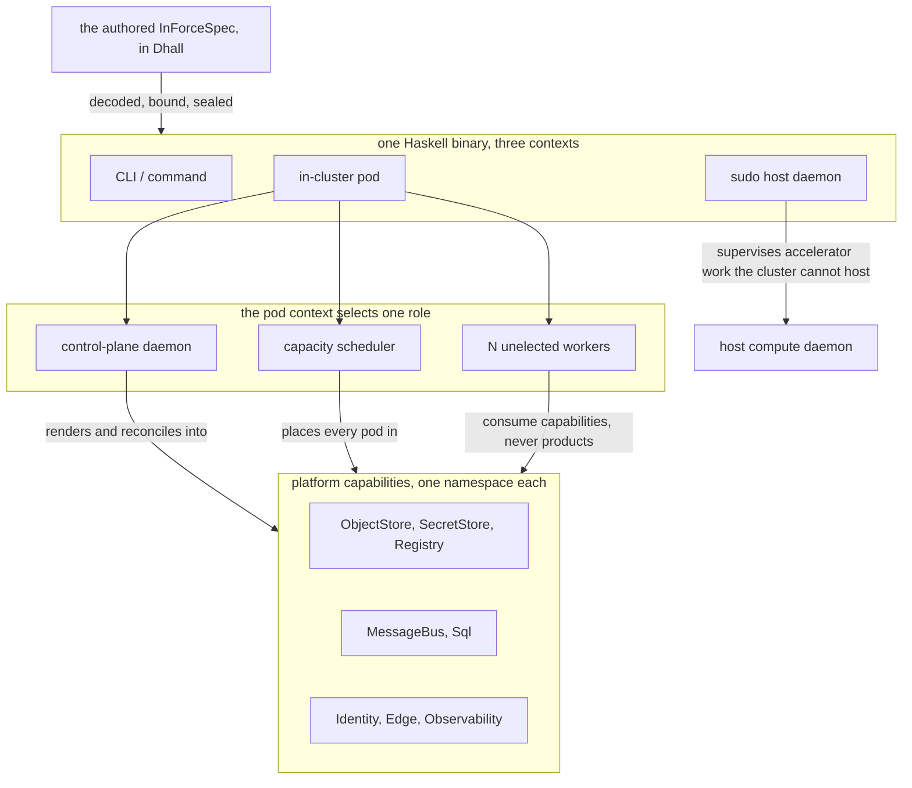

# System Components

> **Purpose**: Inventory the implemented and intended amoebius component surfaces, their owning doctrine,
> repository path, owning phase, and known reconciliation state.
> **Read this if**: a component has to be traced to doctrine, present code, or the phase that must align it.

This document maps both the present source tree and the target component model. It carries no architectural
rule of its own; every row's authority is the doctrine it cites, and current phase status belongs only to the
tracker. Reading it presumes the system shape sketched in
[overview.md §1](overview.md#1-the-everything-orchestrator-shape-one-runtime-binary-three-contexts).

Link-graph metadata

**Status**: Authoritative source
**Supersedes**: N/A
**Referenced by**: DEVELOPMENT_PLAN/README.md, DEVELOPMENT_PLAN/development_plan_gate_integrity.md, DEVELOPMENT_PLAN/development_plan_standards.md, DEVELOPMENT_PLAN/later_phases.md, DEVELOPMENT_PLAN/legacy_tracking_for_deletion.md, DEVELOPMENT_PLAN/legacy_tracking_for_deletion_archive.md, DEVELOPMENT_PLAN/overview.md, DEVELOPMENT_PLAN/phase_00_documentation_suite.md, DEVELOPMENT_PLAN/phase_34_chain_kernel_boundary.md, DEVELOPMENT_PLAN/phase_48_test_workflow_algebra.md, DEVELOPMENT_PLAN/phase_55_bootstrap_coordinator_kind.md, DEVELOPMENT_PLAN/phase_56_base_image_registry.md, DEVELOPMENT_PLAN/phase_60_retained_storage.md, DEVELOPMENT_PLAN/phase_61_vault_pki.md, DEVELOPMENT_PLAN/phase_62_platform_backbone.md, DEVELOPMENT_PLAN/phase_63_platform_services_2.md, DEVELOPMENT_PLAN/phase_64_keycloak_ingress.md, DEVELOPMENT_PLAN/phase_65_live_dsl_deploy.md, DEVELOPMENT_PLAN/phase_67_pulsar_client.md, DEVELOPMENT_PLAN/phase_69_content_store_workflow.md, DEVELOPMENT_PLAN/phase_71_release_lifecycle.md, DEVELOPMENT_PLAN/phase_73_network_fabric_wireguard.md, DEVELOPMENT_PLAN/phase_74_multicluster_spawn_georepl.md, DEVELOPMENT_PLAN/phase_75_gateway_migration_drills.md, DEVELOPMENT_PLAN/phase_76_provider_deploy_checkpoint.md, DEVELOPMENT_PLAN/phase_77_provider_child_bringup.md, DEVELOPMENT_PLAN/phase_78_provider_ebs_credential.md, DEVELOPMENT_PLAN/phase_79_provider_dynamic_nodes.md, DEVELOPMENT_PLAN/phase_80_determinism_jitcache.md, DEVELOPMENT_PLAN/phase_89_apple_metal_host_daemon.md, documents/engineering/generated_artifacts_doctrine.md, documents/engineering/lift_and_compose_doctrine.md
**Generated sections**: none

## Contents
- [How to read this inventory](#how-to-read-this-inventory)
- [Reconciliation state](#reconciliation-state)
- [1. The single binary — three contexts, several typed roles](#1-the-single-binary--three-contexts-several-typed-roles)
- [1.5. The core algebra — five calculi, two indices, one contract](#15-the-core-algebra--five-calculi-two-indices-one-contract)
- [2. The DSL — Dhall decoder + chain/Step kernel](#2-the-dsl--dhall-decoder--chainstep-kernel)
- [3. Manifests — typed renderer + the SSA reconciler](#3-manifests--typed-renderer--the-ssa-reconciler)
- [4. Capabilities — the capability→provider→shape binder](#4-capabilities--the-capabilityprovidershape-binder)
- [5. Platform services — baked binaries + the `distribution` registry](#5-platform-services--baked-binaries--the-distribution-registry)
- [6. The native Pulsar client — `lib:pulsar-client`](#6-the-native-pulsar-client--libpulsar-client)
- [7. The content-addressed store + determinism kernel](#7-the-content-addressed-store--determinism-kernel)
- [8. Vault, secrets & PKI](#8-vault-secrets--pki)
- [9. Substrate tool-ensure + base-image build](#9-substrate-tool-ensure--base-image-build)
- [10. Pulumi backend (IaC)](#10-pulumi-backend-iac)
- [11. Release lifecycle — `lib:release-lifecycle`](#11-release-lifecycle--librelease-lifecycle)
- [12. Network fabric — raw-kernel WireGuard](#12-network-fabric--raw-kernel-wireguard)
- [13. The multi-cluster forest — spawn, geo-replication, gateway migration](#13-the-multi-cluster-forest--spawn-geo-replication-gateway-migration)
- [14. The pre-cluster (Register 1–2) design-first validation surface](#14-the-pre-cluster-register-12-design-first-validation-surface)
- [Related Documents](#related-documents)

---

## How to read this inventory

The source tree contains substantial implementation. Labels such as `BUILT`, `VALIDATED`, and `PLANNED` in
the tables are pre-amendment inventory annotations, not current phase status or proof. All validation seals
were invalidated on 2026-08-11; the tracker shows Phase 0 Active and phases 1–95 Blocked. A future phase may
reuse code that is present, but must re-establish its claim under the redesigned gate.

The columns mean:

- **Component / Surface** — the named subsystem or behaviour.
- **Owning doctrine** — the single doctrine document (and section) that is the SSoT for *what the surface
  must be*. Every row's doctrine is cited by its human section name in the prose above its table, per the
  doctrine-citation rule ([`development_plan_standards.md` §H](development_plan_standards.md#h-the-doctrine-citation-rule-cite-by-name)).
- **Planned module path** — the observed or intended Haskell module(s) / artifact(s). `BUILT` means the path
  was observed during this documentation audit; `PLANNED` means the named target was not established. Paths
  live under `src/Amoebius/…` in the one authored package, as a sub-library stanza of the main
  `amoebius` package whose observed entrypoint is `app/amoebius/Main.hs`.
- **Phase** — the phase document that owns convergence and revalidation. This inventory carries no current
  phase status; status lives only in [README.md](README.md).

Generated paths in a row are migration input only. Their canonical destination is the `.build/` tree defined by
[repository-layout doctrine](../documents/engineering/repository_layout_doctrine.md).

---

## Reconciliation state

The 2026-08-11 path audit found these cross-cutting mismatches. The listed owner resolves each one in numeric
order; presence alone never closes the owner phase.

| Surface | Present observation | Required convergence | Owner |
|---|---|---|---|
| Root executable | `app/amoebius/Main.hs` exists; older prose named an extra `amoebius/` directory | Keep `app/amoebius/Main.hs` as the canonical root entrypoint and update package declarations/tests to agree | Phase 34 |
| Host Bootstrap Coordinator | The source module, imports, test, error type, commands, and generated-label contract are renamed without a compatibility alias | Retain the zero-result terminology scan and rerun the migrated Phase-55 gate after its generated-output path is current | Phase 55 |
| Bootstrap bring-up | `src/Amoebius/Cluster/{Bootstrap,Inventory,Kind}.hs` and `src/Amoebius/Platform/BringUp.hs` exist; the target row also names absent `Cluster/BringUp.hs` | Separate empty-cluster bootstrap from platform-service bring-up and make each call site name its real owner | Phases 55, 62, 63, 65 |
| Readiness | Scheduler readiness exists; the generic `Kernel/Readiness.hs` named by doctrine does not | Do not treat scheduler readiness as a substitute; implement or deliberately re-home the generic readiness algebra | Phases 34, 55, 59 |
| Capacity/provisioning | Several paths marked `PLANNED`, including `Capacity/Provision.hs` and `Capacity/RenderSource.hs`, already exist; other planned siblings remain absent | Re-inventory each Phase 14–18 surface and test it against its current doctrine before changing its label | Phases 14–18 |
| Pulsar protocol | The `.proto` is authored while generated Haskell bindings and checksum lists appeared under legacy evidence | Retain the `.proto`; generate all bindings/checksums only under `.build/proto/**` or the build tree | Phases 1, 67 |
| Pulsar retention | The planned retention module is absent | Implement the authored retention/offload/backlog contract or narrow the owning doctrine and gate explicitly | Phase 67 |
| Test topology | `src/Amoebius/Test/SuggestTest.hs` and supporting harness code exist alongside generated enumeration/ledger files in authored roots | Keep the authored generator/harness; move every enumeration and run record to `.build/**` and externally attest it | Phases 0, 48 |
| Generated output | Ledgers, receipts, transcripts, screenshots, bindings, lock/freeze files, package trees, and build products occur outside canonical generated roots; Python bytecode is the explicit source-adjacent cache class | Relocate or delete non-cache output; allow bytecode only under complete Git/Docker ignore coverage | Phases 0, 1, then every owning phase |

The exhaustive repository tree and every generated-output class live in repository-layout doctrine. The
deletion and relocation sequence lives in `legacy_tracking_for_deletion.md`; this inventory names component
ownership only.

---

## 1. The single binary — three contexts, several typed roles

Every Haskell runtime role uses the *same executable*; it merely *runs* three ways. The Python `pb`
bootstrap coordinator/admin client is the separate operator frontend, not a runtime role. This boundary is owned by
[`daemon_topology_doctrine.md` §1 — one runtime binary, three contexts](../documents/engineering/daemon_topology_doctrine.md#1-one-binary-three-contexts):
a CLI one-shot, a sudo-capable long-running host daemon, and an in-cluster pod. Which in-cluster role that
pod holds is split between
[`daemon_topology_doctrine.md` §3 — The control-plane daemon](../documents/engineering/daemon_topology_doctrine.md#3-the-control-plane-daemon)
(one Deployment-`replicas=1` brain with total cluster + secret authority, protected by a mandatory Kubernetes
Lease),
[`daemon_topology_doctrine.md` §3.3 — The capacity scheduler](../documents/engineering/daemon_topology_doctrine.md#33-the-capacity-scheduler-a-separate-role-in-the-same-binary)
(a separate in-cluster `amoebius-capacity` role with placement/ledger/Binding authority but no control-plane daemon or
secret authority), and
[`daemon_topology_doctrine.md` §4 — Worker daemons — N, unelected](../documents/engineering/daemon_topology_doctrine.md#4-worker-daemons--n-unelected)
(the N unelected workflow workers). The same-binary policy — one dependency closure, one config loader, one
error type, daemons-as-`Command` constructors — is generalized from prodbox's distributed-gateway
architecture as *evidence* the shape holds; amoebius proof is each phase's gate.

| Component / Surface | Owning doctrine | Planned module path | Phase |
|---|---|---|---|
| Executable entrypoint (argv dispatch, exit orchestration) | [daemon_topology §1](../documents/engineering/daemon_topology_doctrine.md#1-one-binary-three-contexts) | `app/amoebius/Main.hs` (BUILT/VALIDATED Phase 34 boundary surface; later command families remain planned) | [phase_34_chain_kernel_boundary.md](phase_34_chain_kernel_boundary.md) |
| Repository layout conformance — the authored tree is the target tree, and every consumer resolves at it | [repository_layout_doctrine §2](../documents/engineering/repository_layout_doctrine.md#2-complete-repository-structure) | `tools/repository_conformance_gate.py`, `tools/layout_relocation_map.tsv` (PLANNED) | [phase_02_repository_layout_conformance.md](phase_02_repository_layout_conformance.md) |
| DSL formal model — TLA+ over the decoder, folds, `renderAll`, the descent, and the concurrent protocols | [formal_model_doctrine](../documents/engineering/formal_model_doctrine.md) | `src/Amoebius/Formal/Dsl/**`, `tools/dsl_formal_model_gate.py` (PLANNED) | [phase_18_dsl_formal_model.md](phase_18_dsl_formal_model.md) |
| Reconcile decision core — `(observed inventory, desired index) -> typed action set`, replayed under `IOSim` | [cluster_lifecycle_doctrine §9](../documents/engineering/cluster_lifecycle_doctrine.md#9-how-bring-up-and-teardown-are-implemented-the-reconciler-not-a-state-machine) | `src/Amoebius/Reconcile/{Core,Sim}.hs`, `tools/reconcile_core_simulation_gate.py` (PLANNED) | [phase_19_reconcile_core_simulation.md](phase_19_reconcile_core_simulation.md) |
| Role dispatch — the closed `Process` union the entrypoint decodes, and the total function from an arm to a behaviour | [daemon_topology §2](../documents/engineering/daemon_topology_doctrine.md#2-context--role-an-orthogonal-grid) | `dhall/amoebius/Role.dhall` and its gadt-decode decoder (PLANNED; the union is written three times today and decoded nowhere, [legacy_tracking_for_deletion_archive.md](legacy_tracking_for_deletion_archive.md#one-binary-many-roles--2026-08-17)) | [phase_26_gadt_decode_ir.md](phase_26_gadt_decode_ir.md), [phase_55_bootstrap_coordinator_kind.md](phase_55_bootstrap_coordinator_kind.md) |
| Haskell command context — pure dry-run plus later bootstrap and host-local commands; post-handoff status/admin remains in Python `pb` over REST | [daemon_topology §1](../documents/engineering/daemon_topology_doctrine.md#1-one-binary-three-contexts) | `src/Amoebius/Cli.hs` (dry-run BUILT/VALIDATED Phase 34; later commands PLANNED) | [phase_34_chain_kernel_boundary.md](phase_34_chain_kernel_boundary.md) |
| Sudo host-daemon context — distro bring-up, host-tool ensure, supervise host subprocesses | [daemon_topology §1](../documents/engineering/daemon_topology_doctrine.md#1-one-binary-three-contexts) | `src/Amoebius/Host/Context.hs` (PLANNED) | [phase_55_bootstrap_coordinator_kind.md](phase_55_bootstrap_coordinator_kind.md) |
| Long-running host compute daemon (the sudo-context daemon's worker form) | [daemon_topology §1](../documents/engineering/daemon_topology_doctrine.md#1-one-binary-three-contexts) | `src/Amoebius/HostWorker/{Lifecycle,Supervise,Capacity,Auth,Peer}.hs`, `test/{host/Phase53AppleHostContractSpec,live/AppleMetalPeerSpec}.hs` (BUILT; scoped contract/Linux-host validation Phase 89, physical Apple observers UNVERIFIED) | [phase_89_apple_metal_host_daemon.md](phase_89_apple_metal_host_daemon.md) |
| In-cluster control-plane daemon — the control-plane brain, Deployment `replicas=1` + mandatory Lease (reconcile loop + secret authority) | [daemon_topology §3](../documents/engineering/daemon_topology_doctrine.md#3-the-control-plane-daemon) | `app/amoebius/Main.hs`'s `ControlPlaneDaemon` arm, `src/Amoebius/ControlPlane/{Daemon,AuthorityHandoff,Reconcile,Deploy}.hs`, `tools/live_dsl_deploy_runtime_helper.py` (BUILT/VALIDATED Phase 65; the second executable is retired — Phase 2 made it the `amoebius control-plane daemon` verb over `app/amoebius/Amoebius/Entry/ControlPlane.hs`, and Phase 65 still owns the decoded `InClusterRole` arm) | [phase_65_live_dsl_deploy.md](phase_65_live_dsl_deploy.md) |
| In-cluster capacity scheduler — separate same-binary role; guarded-Pod provenance, whole-root reservation CAS, Binding, crash recovery, no control-plane daemon/secret authority | [daemon_topology §3.3](../documents/engineering/daemon_topology_doctrine.md#33-the-capacity-scheduler-a-separate-role-in-the-same-binary), [resource_capacity](../documents/engineering/resource_capacity_doctrine.md) | `src/Amoebius/Scheduler/{Ledger,Loop,Placement,Reservation,Recovery,Binding,Readiness}.hs` (BUILT/VALIDATED; Register-3 live Sprint 59.4 and 1,792 Register-2.5 schedules Sprint 59.5) | [phase_59_capacity_scheduler.md](phase_59_capacity_scheduler.md) |
| Bootstrap sequence + host→control-plane daemon handoff | [bootstrap_sequence_doctrine §3](../documents/engineering/bootstrap_sequence_doctrine.md#3-the-ordered-bootstrap-sequence), [§4](../documents/engineering/bootstrap_sequence_doctrine.md#4-the-host-daemon--control-plane-daemon-handoff) | `src/Amoebius/Cluster/BringUp.hs` (PLANNED; ordered sequence Phase 55, Lease-observed handoff Phase 65 Sprint 65.1) | [phase_55_bootstrap_coordinator_kind.md](phase_55_bootstrap_coordinator_kind.md) |
| Admin control-plane REST (`vault init/unseal`, `dhall update`, secret `kv put/get/list/delete`) + the `pb` admin-REST client mode | [bootstrap_sequence_doctrine §5](../documents/engineering/bootstrap_sequence_doctrine.md#5-the-admin-control-plane-the-cli--the-control-plane-daemon-rest-api) | `src/Amoebius/ControlPlane/AdminApi.hs`, the control-plane daemon arm of `app/amoebius/Main.hs`, `pb/pb/{admin,cli}.py` (BUILT/VALIDATED Phase 65 Sprint 65.4, from the executable Phase 65 collapses) | [phase_65_live_dsl_deploy.md](phase_65_live_dsl_deploy.md) |
| In-cluster worker roles — N unelected workflow daemons | [daemon_topology §4](../documents/engineering/daemon_topology_doctrine.md#4-worker-daemons--n-unelected) | `src/Amoebius/Workflow/Worker.hs`, `src/Amoebius/Workflow/Orchestrator.hs` (PLANNED) | [phase_69_content_store_workflow.md](phase_69_content_store_workflow.md) |
| In-cluster UI-server workers — N unelected HTTP/WebSocket replicas, stateless for correctness | [daemon_topology §4](../documents/engineering/daemon_topology_doctrine.md#4-worker-daemons--n-unelected), [ui_realtime_coordination §7](../documents/engineering/ui_realtime_coordination_doctrine.md#7-replicas-drain-rollout-and-gateway-migration) | `app/amoebius/Amoebius/Entry/ServeUi.hs` (local boundary BUILT/VALIDATED Phase 43); `src/Amoebius/Ui/Realtime/RedisCoordination.hs` and live replicas remain PLANNED | [phase_43_ui_server_boundary.md](phase_43_ui_server_boundary.md), [phase_81_ui_single_tenant_live.md](phase_81_ui_single_tenant_live.md) |

---

*Orientation. Design intent. The whole part count in one picture: one authored value, one binary in three contexts, three in-cluster roles, and the capability set they operate. Each component's owning doctrine is named in the tables below, and the context-and-role grid by [daemon_topology_doctrine.md §2](../documents/engineering/daemon_topology_doctrine.md#2-context--role-an-orthogonal-grid). Nothing here is built.*

## 1.5. The core algebra — five calculi, two indices, one contract

The generative re-baseline adds a layer below every component in this inventory: the pure algebra the rest are
instances of. It has no runtime footprint of its own — nothing here is a daemon or a role — and it is where the
guarantees the other sections rely on are actually established.

| Component | What it owns | Owning doctrine |
|---|---|---|
| `Amoebius/Calculus/Artifact` | targets, recipes, the content address that folds in its rendered text, and the materialize/consume/reap region | [`jit_artifact_doctrine.md`](../documents/engineering/jit_artifact_doctrine.md) |
| `Amoebius/Calculus/Budget` | the storage grant, its inseparable ceiling and concurrency, admission, and the reaper a retained artifact must name | [`jit_budget_doctrine.md`](../documents/engineering/jit_budget_doctrine.md) |
| `Amoebius/Calculus/Lift` | the closed layer set, the total transition relation, and the witness each transition consumes | [`lift_and_compose_doctrine.md` §7](../documents/engineering/lift_and_compose_doctrine.md#7-the-lift-calculus) |
| `Amoebius/Calculus/Workflow` | provision, build, deploy, observe and teardown as one algebra, with teardown an obligation the type system tracks | [`workflow_calculus_doctrine.md`](../documents/engineering/workflow_calculus_doctrine.md) |
| `Amoebius/Calculus/Evidence` | the binding from a claim to the fixture that discharges it, and the mutant record as a value | [`testing_doctrine.md`](../documents/engineering/testing_doctrine.md) |
| `Amoebius/Index/Scope` | the rank-2 request eliminator that skolemises a tenant learned at run time | [`extension_conformance_security.md` §3](../documents/engineering/extension_conformance_security.md#3-the-skolem-scope) |
| `Amoebius/Index/Resource` | the capacity vocabulary threaded through all five calculi | [`resource_capacity_doctrine.md`](../documents/engineering/resource_capacity_doctrine.md) |
| `Amoebius/Extension/*` | the declaration, the four law families, the generated gate, and the verdict seal that admits an extension to a link set | [`extension_conformance_doctrine.md`](../documents/engineering/extension_conformance_doctrine.md) |

All five calculus rows exist, built and sealed on 2026-08-20 and each as four modules:
`Amoebius/Calculus/Artifact` as `Target`, `Recipe`, `Address`, `Region`; `Amoebius/Calculus/Budget` as
`Grant`, `Admission`, `Store`, `Retention`; `Amoebius/Calculus/Lift` as `Layer`, `Witness`, `Transition`,
`Compose`; `Amoebius/Calculus/Workflow` as `Arm`, `Obligation`, `Ledger`, `Run`; and
`Amoebius/Calculus/Evidence` as `Register`, `Fixture`, `Claim`, `Mutant`. The two indices and the extension
contract below them are a specification until their phase gates run. They are named here so the inventory
says what the plan intends to build rather than only what a past audit observed.

**None of the five depends on another, and that is deliberate rather than incidental.** A grant authorises
bytes; how those bytes got their name is the artifact calculus's question, so `Amoebius/Calculus/Budget` names
a placement by an address it is handed rather than by a recipe it renders. A lift says where an effect runs
and says nothing about what the effect produces. The calculi meet at their points of use — Phase 4's suite is
where a Phase-3 rendering and its address become the placement a Phase-4 grant authorises — which is what
keeps the layer below every component from becoming a stack with an order of its own. The workflow calculus
names the arms an effect can take and what each owes; which artifacts those arms produce, what they cost, and
where they run stay the other three's questions. The evidence calculus is one step further out: it binds a
claim to the fixture that would falsify it, and every claim the other four make is a claim it can hold.

## 2. The DSL — Dhall decoder + chain/Step kernel

The DSL is a hard split between two languages, owned by
[`dsl_doctrine.md` §2 — Two languages, one system: Dhall carries params, Haskell carries logic](../documents/engineering/dsl_doctrine.md#2-two-languages-one-system-dhall-carries-params-haskell-carries-logic):
Dhall is typed, total, side-effect-free *data*; Haskell is the *logic*, in a chain/Step algebra
amoebius owns and `hostbootstrap` is the reference implementation for. The composability guarantee — fragments nest without limit or leakage — is owned by
[`dsl_doctrine.md` §4 — Total composability](../documents/engineering/dsl_doctrine.md#4-total-composability),
and the second of the typed spec gates (the one that turns Dhall into Haskell values) is
[`dsl_doctrine.md` gadt-decode — the Haskell typed decoder](../documents/engineering/dsl_doctrine.md#gadt-decode--the-haskell-typed-decoder).
The kernel itself — the `Step` algebra and `chain :: cfg -> [Step]` — is seeded from hostbootstrap in Phase 34 and is the spine every later phase composes onto.

| Component / Surface | Owning doctrine | Planned module path | Phase |
|---|---|---|---|
| `Step` algebra (the unit of idempotent work) | [dsl_doctrine §2](../documents/engineering/dsl_doctrine.md#2-two-languages-one-system-dhall-carries-params-haskell-carries-logic) | `src/Amoebius/Kernel/Step.hs` (BUILT/VALIDATED Phase 34; ledger `external-run-reference`) | [phase_34_chain_kernel_boundary.md](phase_34_chain_kernel_boundary.md) |
| `chain` combinator (`cfg -> [Step]`, total composition) | [dsl_doctrine §4](../documents/engineering/dsl_doctrine.md#4-total-composability) | `src/Amoebius/Kernel/{Chain,Descent,Plan}.hs`, `test/spec/kernel/*` (BUILT/VALIDATED Phase 34) | [phase_34_chain_kernel_boundary.md](phase_34_chain_kernel_boundary.md) |
| Typed subprocess seam and fake-tool boundary harness | [conformance_harness_doctrine §4](../documents/engineering/conformance_harness_doctrine.md#4-the-spine-decode--bindexpand--planresolve-infrastructure--provision--renderall--plan--dry-run) | `src/Amoebius/Exec/{Tool,Boundary}.hs`, `test/spec/boundary/*` (BUILT/VALIDATED Phase 34) | [phase_34_chain_kernel_boundary.md](phase_34_chain_kernel_boundary.md) |
| Dhall surface types (cluster / app-spec / deployment-rules plus the closed resource vocabulary) | [dsl_doctrine §2](../documents/engineering/dsl_doctrine.md#2-two-languages-one-system-dhall-carries-params-haskell-carries-logic) | `dhall/amoebius/{Cluster,App,Deployment,Capability,Topology,Capacity,Resources,Storage,Retention,Image,Extension,Consistency,Backup,prelude}.dhall` (BUILT/VALIDATED Phase 25) | [phase_25_dhall_schema_generation.md](phase_25_dhall_schema_generation.md) |
| Haskell typed decoder (gadt-decode) | [dsl_doctrine gadt-decode](../documents/engineering/dsl_doctrine.md#gadt-decode--the-haskell-typed-decoder) | `src/Amoebius/Dsl/{Decode,Error,Ref,SmartConstructors,Types}.hs`, `test/spec/dsl/DecodeSpec.hs`, `tools/gadt_decode_ir_gate.py` (BUILT/VALIDATED Phase 26; ledger `external-run-reference`) | [phase_26_gadt_decode_ir.md](phase_26_gadt_decode_ir.md) |
| Dhall smart-constructor vocabulary and constructor-rejection corpus | [dsl_doctrine §4](../documents/engineering/dsl_doctrine.md#4-total-composability) | `dhall/amoebius/*.dhall`, `test/fixture/dhall_typecheck_schema/ctor_reject/*.dhall` (BUILT/VALIDATED Phase 25); Haskell refinement indices and compile pairs BUILT/VALIDATED Phase 26 | [phase_25_dhall_schema_generation.md](phase_25_dhall_schema_generation.md), [phase_26_gadt_decode_ir.md](phase_26_gadt_decode_ir.md) |
| `Readiness` gate (condition-not-duration `Step` edge, no `AfterDuration` arm; derived bring-up DAG + `mkBringUpOrder` fold) | [readiness_ordering_doctrine §3](../documents/engineering/readiness_ordering_doctrine.md#3-readiness-is-a-condition-never-a-duration) | `src/Amoebius/Kernel/Readiness.hs`, `src/Amoebius/Cluster/BringUp.hs` (PLANNED; bootstrap-tier `discover`/`RuntimeWitness` gates Phase 55) | [phase_34_chain_kernel_boundary.md](phase_34_chain_kernel_boundary.md) |
| Cluster-topology types (`ComputeEngine` / `LinuxHost` witness / `Topology`; managed candidate classes + quota; [§4.7](../documents/illegal_state/illegal_state_techniques.md#47-compatibility--topology-relations-by-construction-over-a-collection) relation) | [cluster_topology_doctrine](../documents/engineering/cluster_topology_doctrine.md) | `dhall/amoebius/Topology.dhall`, `src/Amoebius/Dsl/Topology.hs`, `test/spec/dsl/CapacityTopology{Fixtures,Props,Mutants,Gate,Spec}.hs`, `tools/capacity_topology_gate.py` (BUILT/VALIDATED Phase 9; ledger `external-run-reference`) | [phase_09_resource_index.md](phase_09_resource_index.md) |
| Complete resource/capacity model (all Pod/host/build/engine/fabric/controller/gateway/executor envelopes; Pod/CNI/CSI slots; mapped/API/etcd state; logical ephemeral; layout-routed OCI/cache/runtime storage; presentation-rounded durable/object/database/migration storage; provider per-instance disks with raw `InstanceStore.provisionedRawBytes` or rounded root requests, usable `ProviderUsableDiskCarveTemplate` values, and private `ProvisionedPerInstanceDiskTemplate.mountedUsableBytes` fit; provider quotas; accelerator raw/reserved/allocatable VRAM; `fits`/`carve`/`place` and scaling/shared-supply ledgers) | [resource_capacity_doctrine](../documents/engineering/resource_capacity_doctrine.md) | Base CPU/memory/ephemeral/pod/CSI placement is BUILT/VALIDATED Phase 54 (`dynamically-resolved`). Logical→physical storage and policy-only scaling are BUILT/VALIDATED Phase 11 (`dynamically-resolved`). Execution/scheduler, runtime/image storage, physical partitions, accelerator residency, provider roots, host-only compute, and composed placement are BUILT/VALIDATED Phase 17 in `src/Amoebius/Capacity/{Execution,Scheduler,HostReservation,NodeLocalStorage,RuntimeStorage,Accelerator,ProviderRoot,Etcd,PulumiExecution,Composed}.hs` (`dynamically-resolved`). | [phase_09_resource_index.md](phase_09_resource_index.md), [phase_28](phase_28_storage_geometry_folds.md), [phase_29](phase_29_execution_accelerator_folds.md) |
| Observe-then-plan storage scaling (`ProvisionedStorageScalingEnvelope` → fresh observed snapshot → transition-indexed action; no cloud snapshot for host-only arms; single-use CAS dispatch; retained/migration and provider-capacity enactors separated) | [resource_capacity_doctrine §5](../documents/engineering/resource_capacity_doctrine.md#5-storagebudget-bounded-by-construction-single-owner-ceiling-per-arm) | Pure envelope/snapshot/plan fold `src/Amoebius/Capacity/StorageScaling.hs` BUILT/VALIDATED Phase 11; snapshot-bound action `src/Amoebius/Storage/ScalingAction.hs` BUILT/VALIDATED Phase 42; retained/migration `src/Amoebius/Storage/RetainedScaling.hs` BUILT/VALIDATED Phase 43. Provider enaction remains PLANNED for Phases 49/51. | [phase_28](phase_28_storage_geometry_folds.md), [phase_58](phase_58_object_reconciler.md), [phase_60](phase_60_retained_storage.md), [phase_76](phase_76_provider_deploy_checkpoint.md); Phase 73 follows the provider-capacity arm |
| Pod runtime + node image-storage accounting (structural metadata shape; planned-slot vs observed-Pod-UID identities; component→`KubeletNodefs`/`CriRuntimeRoot` role; total layout-backing resolution; per-epoch/snapshot node aggregate; disjoint/exhaustive qualified Pod/image ownership; reservation/observed no-double-debit; alias-aware carve grouping) | [resource_capacity_doctrine §3](../documents/engineering/resource_capacity_doctrine.md#3-the-types-quantity-capacity-demand-budget) | `src/Amoebius/Capacity/{NodeLocalStorage,RuntimeStorage}.hs`, `test/spec/dsl/ExecutionAccelerator{Fixtures,Props}.hs` (BUILT/VALIDATED Phase 29; ledger `external-run-reference`) | [phase_29_execution_accelerator_folds.md](phase_29_execution_accelerator_folds.md) |
| Execution epochs + aggregate scheduler/host reservation algebra (exact prior reference, five controller bodies, empty-capable transitions, componentwise peak, snapshot/root-version guard, retained unknown Binding debit) | [resource_capacity_doctrine §4](../documents/engineering/resource_capacity_doctrine.md#4-the-total-fold-fits-carve-place-and-the-nesting) | `src/Amoebius/Capacity/{Execution,Scheduler,HostReservation}.hs`, deterministic transition checks and direct negative/twins in `test/spec/dsl/ExecutionAcceleratorFixtures.hs` (BUILT/VALIDATED Phase 29) | [phase_29_execution_accelerator_folds.md](phase_29_execution_accelerator_folds.md) |
| Accelerator/provider-root/host-only capacity derivations (whole-device ownership, coexistence epochs, net VRAM, physical-root presentation/allocation and quota, etcd transitions, build/engine/monitoring/Pulumi envelopes) | [resource_capacity_doctrine](../documents/engineering/resource_capacity_doctrine.md) | `src/Amoebius/Capacity/{Accelerator,ProviderRoot,Etcd,PulumiExecution,Composed}.hs`, `test/spec/dsl/ExecutionAccelerator*.hs`, `tools/execution_accelerator_gate.py` (BUILT/VALIDATED Phase 29: 32 variants/twins, seven properties, 45 mutants, 2/2 owner subcases; ledger `external-run-reference`) | [phase_29_execution_accelerator_folds.md](phase_29_execution_accelerator_folds.md) |
| Conditional initial-infrastructure planner (`ProvisionTargetSupply -> BoundDeployment -> InfrastructurePlanningResult`; explicit `NoInfrastructureRequired` or `ProvisionedInfrastructurePlan`; demand derived from the bound graph; required arm owns one `ProvisionedProviderActionBatch` with cloud-provider or SSH-host actions; fresh-snapshot `ValidatedInfrastructureActionBatch` plus plan/action token CAS; receipt-bound provider/host readback) | [resource_capacity_doctrine](../documents/engineering/resource_capacity_doctrine.md), [pulumi_iac_doctrine §8](../documents/engineering/pulumi_iac_doctrine.md#8-how-deploys-are-enacted-the-reconciler-referenced-not-restated) | `src/Amoebius/Capacity/{Infrastructure,ProviderActionBatch}.hs` (PLANNED; live enaction in Phases 53/55) | [phase_31_provision_seal.md](phase_31_provision_seal.md) |
| Post-materialization provisioning seal (`ProvisionContext -> Topology -> BoundDeployment -> Either ProvisionError ProvisionedSpec`; context accepts the explicit already-materialized arm or receipt-bound `ObservedInfrastructureMaterialization`; prior-generation resolution plus private placement/runtime-storage/storage/accelerator witnesses) | [resource_capacity_doctrine](../documents/engineering/resource_capacity_doctrine.md), [service_capability §4](../documents/engineering/service_capability_doctrine.md#4-capability--provider--shape-the-binding) | `src/Amoebius/Capacity/{Provision,RuntimeStorage}.hs`, `src/Amoebius/Capability/Provisioned.hs` (PLANNED) | [phase_31_provision_seal.md](phase_31_provision_seal.md) |
| Bounded-storage surface (`StorageBacking` union, `RetentionPolicy`, bounded `TrainBudget`/`TrainData`) | [storage_lifecycle §5.2](../documents/engineering/storage_lifecycle_doctrine.md), [pulsar_client §6.1](../documents/engineering/pulsar_client_doctrine.md) | `dhall/amoebius/{Storage,Retention}.dhall` (BUILT/VALIDATED Phase 35; Phase-11 bounded-training dhall-typecheck pairs validated with ledger `external-run-reference`) | [phase_25_dhall_schema_generation.md](phase_25_dhall_schema_generation.md), [phase_28](phase_28_storage_geometry_folds.md) |
| Backup & recovery surface (`BackupPolicy`/`BackupMedium`/`WriteRegime`/`BackupRetention`; put-only `BackupWriteCapability`; verified content-addressed `BackupArtifact`; restore-to-fresh-coordinate; `ColdSeedFromBackup` + the `FreshnessWitness` gateway-take guard) | [backup_recovery_doctrine](../documents/engineering/backup_recovery_doctrine.md) | `dhall/amoebius/Backup.dhall`, `src/Amoebius/Backup/{Policy,Artifact,Restore}.hs` (PLANNED; representation in Phases 10–19, live enaction in the later-phase candidate pool) | [phase_17_gateway_migration_model.md](phase_17_gateway_migration_model.md), [later_phases.md](later_phases.md) |

---

## 3. Manifests — typed renderer + the SSA reconciler

Types render Kubernetes manifests; Helm does not. The renderer is the pure, total function owned by
[`manifest_generation_doctrine.md` §2 — The typed manifest model: `renderAll` is the sole public pure function to objects](../documents/engineering/manifest_generation_doctrine.md#2-the-typed-manifest-model-renderall-is-the-sole-public-pure-function-to-objects):
`renderAll :: ProvisionedSpec -> [K8sObject]`, which privately total-maps the sealed equal-keyed `ProvisionedRenderSourceSet`; each object is a typed Haskell record serialized via Aeson — the record *is* the manifest. No public service-valued renderer exists. Making the cluster match that object set is owned by [`manifest_generation_doctrine.md` §5 — The apply/reconcile engine: snapshot-bound typed actions](../documents/engineering/manifest_generation_doctrine.md#5-the-applyreconcile-engine-snapshot-bound-typed-actions):
server-side apply under a fixed `amoebius` field manager, ApplySet prune, wait-for-ready — run only by the
control-plane daemon ([§1](#1-the-single-binary--three-contexts-several-typed-roles)), never by a CLI poke racing another writer.

| Component / Surface | Owning doctrine | Planned module path | Phase |
|---|---|---|---|
| Typed `K8sObject` model (records for Deployment/StatefulSet/Service/RBAC/NetworkPolicy/HTTPRoute/…) | [manifest_generation §2](../documents/engineering/manifest_generation_doctrine.md#2-the-typed-manifest-model-renderall-is-the-sole-public-pure-function-to-objects) | `src/Amoebius/Manifest/{K8sObject,Types}.hs` (BUILT/VALIDATED Phase 33; ledger `external-run-reference`) | [phase_33_render_manifest_oracles.md](phase_33_render_manifest_oracles.md) |
| Sealed render-source registry (`K8sObjectIdentity`, alias `KubernetesObjectId`; equal map-key/embedded identity; one global owner for shared objects; field-ownership partition; four-arm `RenderActivation`) | [resource_capacity](../documents/engineering/resource_capacity_doctrine.md), [manifest_generation §2](../documents/engineering/manifest_generation_doctrine.md#2-the-typed-manifest-model-renderall-is-the-sole-public-pure-function-to-objects) | `src/Amoebius/Capacity/RenderSource.hs` (BUILT/VALIDATED Phase 31) | [phase_31_provision_seal.md](phase_31_provision_seal.md) |
| `renderAll` — sole public pure manifest boundary, total `ProvisionedSpec -> [K8sObject]`; complete desired set across all activation stages; private source serializer; exact checked projections; root-ledger CAS and Lease holder/renewal fields excluded from generic SSA | [manifest_generation §2](../documents/engineering/manifest_generation_doctrine.md#2-the-typed-manifest-model-renderall-is-the-sole-public-pure-function-to-objects) | `src/Amoebius/Manifest/{Render,RenderAll}.hs`, `test/spec/manifest/*`, `tools/render_manifest_gate.py` (BUILT/VALIDATED Phase 33) | [phase_33_render_manifest_oracles.md](phase_33_render_manifest_oracles.md) |
| Bootstrap registry cycle-break (`ProvisionedBootstrapRegistry` + snapshot-bound `BootstrapRegistryAction`; side-load + exact registry/proxy initialization; equal-digest one-time handoff into whole-deployment ownership) | [resource_capacity](../documents/engineering/resource_capacity_doctrine.md), [image_build §9](../documents/engineering/image_build_doctrine.md#9-bring-up-ordering--the-registry-chicken-and-egg-dissolves) | `src/Amoebius/Image/{NodeLoad,Registry,BootstrapRegistry}.hs` (BUILT/VALIDATED Phase 56.2) | [phase_56_base_image_registry.md](phase_56_base_image_registry.md) |
| Snapshot-bound residual/transition preflight over the whole `ProvisionedSpec` (surviving workloads; Pod/CNI/CSI slots; observed-Pod-UID runtime-metadata and scheduler-ledger normalization; scope-indexed node runtime/image-storage aggregation; mapped/API/etcd state; OCI content/snapshots/workspace; object/durable/database/migration backings; kind-indexed controller/gateway/executor epochs; provider quota and accelerator/free-VRAM; returns single-use `ValidatedLiveTarget`) | [resource_capacity_doctrine §8](../documents/engineering/resource_capacity_doctrine.md#8-where-the-numbers-come-from-declared-in-pure-input-provisioned-before-render-cross-checked-at-runtime) | `src/Amoebius/Manifest/{Preflight,Reconcile,Diff,Actions,Authority}.hs`, `src/Amoebius/Execution/{Observe,Normalize,RuntimeStorage}.hs` (BUILT/VALIDATED Phase 58) | [phase_58_object_reconciler.md](phase_58_object_reconciler.md) |
| SSA reconciler (`amoebius` field manager, ApplySet prune, wait; requires `ValidatedLiveTarget` and consumes `renderAll` over the whole checked deployment) | [manifest_generation §5](../documents/engineering/manifest_generation_doctrine.md#5-the-applyreconcile-engine-snapshot-bound-typed-actions) | `src/Amoebius/Manifest/{Apply,Enact,Delete,Wait}.hs`, `tools/object_reconciler_live.py` (BUILT/VALIDATED Phase 58) | [phase_58_object_reconciler.md](phase_58_object_reconciler.md) |
| Sole inert StorageClass + deterministic retained PV/claimRef renderer, fixed-size host backing, uniform-claim/backing admission | [storage lifecycle §§2–5](../documents/engineering/storage_lifecycle_doctrine.md#2-one-storage-class-and-it-provisions-nothing) | `src/Amoebius/Storage/{StorageClass,RetainedPV,HostVolume}.hs`, `test/spec/live/RetainedStorage{Class,Volume}*Spec.hs` (BUILT/VALIDATED Phase 60; ledger `external-run-reference`) | [phase_60_retained_storage.md](phase_60_retained_storage.md) |
| Lossless retained-storage delete/recreate rebind | [storage lifecycle §6](../documents/engineering/storage_lifecycle_doctrine.md#6-the-lossless-teardown-guarantee-deterministic-rebind) | `src/Amoebius/Storage/Rebind.hs`, `test/spec/live/RetainedStorageRebind{,Live}Spec.hs`, `tools/retained_storage_rebind_live.py` (BUILT/VALIDATED Phase 60) | [phase_60_retained_storage.md](phase_60_retained_storage.md) |

---

## 4. Capabilities — the capability→provider→shape binder

Application logic names *capabilities* (an `ObjectStore`, a `Sql` database, a set of `MessageBus` topics);
deployment rules bind the provider and the per-cluster shape. The three-part binding is owned by
[`service_capability_doctrine.md` §4 — Capability → provider → shape: the binding](../documents/engineering/service_capability_doctrine.md#4-capability--provider--shape-the-binding):
the capability is the app's travelling identity, the provider defaults to the canonical platform service, and
the shape (single-node vs distributed, replica counts, the structural object graph) is a deployment-rules
edit. The binder turns a named capability + a provider + a shape into a symbolic `BoundServiceSpec`;
the conditional `planInfrastructure` stage derives initial infrastructure demand from the complete
`BoundDeployment`. It either proves the explicit already-materialized arm or yields one non-renderable,
batch-owned plan whose validated CAS enaction and provider/host readback construct `ProvisionContext`; only the
post-materialization whole-deployment provision seal may then construct the opaque `ProvisionedSpec`. Its
private service/global projections contribute exactly one identity-keyed source set; [§3](#3-manifests--typed-renderer--the-ssa-reconciler) exposes only
whole-deployment `renderAll`.

| Component / Surface | Owning doctrine | Planned module path | Phase |
|---|---|---|---|
| Capability union + binding records (Dhall surface) | [service_capability §4](../documents/engineering/service_capability_doctrine.md#4-capability--provider--shape-the-binding) | `dhall/amoebius/Capability.dhall` (BUILT/VALIDATED Phase 30; nine need arms, URL-free engine lanes, canonical provider, two shapes) | [phase_30_capability_bind.md](phase_30_capability_bind.md) |
| Capability→provider→shape binder + conditional infrastructure planner + post-materialization whole-deployment provision seal (capability need ⇒ `BoundServiceSpec`; `BoundDeployment` + declared supply/budget ⇒ explicit no-plan materialization or validated/enacted/read-back infrastructure ⇒ `ProvisionContext` ⇒ opaque `ProvisionedSpec`) | [service_capability §4](../documents/engineering/service_capability_doctrine.md#4-capability--provider--shape-the-binding) | Representational bind is BUILT/VALIDATED Phase 30 in `src/Amoebius/Capability/{Types,Binding}.hs`, `test/spec/capability/*`, and `tools/capability_bind_gate.py` (`dynamically-resolved`); `src/Amoebius/Capability/Provisioned.hs` and `src/Amoebius/Capacity/{Infrastructure,Provision}.hs` remain PLANNED for Phase 31. | [phase_30_capability_bind.md](phase_30_capability_bind.md) (bind) / [phase_31_provision_seal.md](phase_31_provision_seal.md) (planner + seal) |
| Checked tenant graph → closed derive-don't-author provider projection | [tenancy §5](../documents/engineering/tenancy_doctrine.md#5-rbac-is-derived-never-authored) | `src/Amoebius/Tenancy/{ProviderProjection,ProviderTransaction}.hs`, `src/Amoebius/Tenancy/Provider/{Keycloak,Vault,Pulsar,Minio,KubernetesApi,Postgres}.hs` (BUILT/VALIDATED Phase 66) | [phase_66_app_tenancy.md](phase_66_app_tenancy.md) |
| Sealed tenant-policy transaction, six least-authority provider enactors, independent readback, and explicit cleanup | [platform-services tenant-policy transaction](../documents/engineering/platform_services_doctrine.md#tenant-policy-persistence-is-one-provider-indexed-transaction) | `src/Amoebius/Tenancy/ProviderTransaction.hs`, `src/Amoebius/Tenancy/Provider/{Keycloak,Vault,Pulsar,Minio,KubernetesApi,Postgres}.hs`, `test/spec/live/TenantProviderProvisioningSpec.hs` (PLANNED) | [phase_66_app_tenancy.md](phase_66_app_tenancy.md) |
| Closed `UiSource` Dhall algebra + normalized checked graph | [low_code_ui_runtime §§4–5](../documents/engineering/low_code_ui_runtime_doctrine.md#4-the-authored-dhall-surface) | `dhall/amoebius/ui/*.dhall`, `src/Amoebius/Ui/{Source,Check}.hs`, `test/spec/ui/UiProgramSchemaSpec.hs` (BUILT/VALIDATED Phase 37) | [phase_37_ui_program_schema.md](phase_37_ui_program_schema.md) |
| Issuer-qualified subject, membership, tenant, owner, scoped-reference, and flow-label kernel | [tenancy §4](../documents/engineering/tenancy_doctrine.md#4-the-typed-shapes-tenantspec--subjectspec--membership--owner--rolebinding) | `src/Amoebius/Ui/Security/{Scope,Flow}.hs`, `test/spec/ui/ScopeSpec.hs` (BUILT/VALIDATED Phase 8) | [phase_08_scope_index.md](phase_08_scope_index.md) |
| UI `CanRead`/`CanInvoke`, grants, and current-authority kernel | [low_code_ui_runtime §9](../documents/engineering/low_code_ui_runtime_doctrine.md#9-routes-identity-authorization-and-the-edge) | `src/Amoebius/Ui/Security/Authorization.hs`, `test/spec/ui/{AuthorizationSpec,AuthorizationReference}.hs`, `tools/ui_authorization_gate.py` (BUILT/VALIDATED Phase 38; ledger `external-run-reference`) | [phase_38_ui_authorization_kernel.md](phase_38_ui_authorization_kernel.md) |
| Exact-one UI port → trusted handler/capability binder plus exact named-link → trusted fixed-HTTPS catalog join | [low_code_ui_runtime §4.4](../documents/engineering/low_code_ui_runtime_doctrine.md#44-external-links-are-names-resolved-by-a-trusted-catalog), [§8](../documents/engineering/low_code_ui_runtime_doctrine.md#8-effects-are-typed-ports-not-network-operations) | `src/Amoebius/Ui/{Bind,ExternalLinkCatalog}.hs`, `test/spec/ui/{UiEffectBindingSpec,EffectBindingReference}.hs`, `tools/ui_effect_binding_gate.py` (BUILT/VALIDATED Phase 39; ledger `external-run-reference`) | [phase_39_ui_effect_binding.md](phase_39_ui_effect_binding.md) |
| Deterministic `BoundUiProgram` → `ClientPlan` + serializable `UiServerPlan` + external-link/content manifest + finite demand compiler | [low_code_ui_runtime §3](../documents/engineering/low_code_ui_runtime_doctrine.md#3-one-checked-value-two-runtime-plans) | `src/Amoebius/Ui/Compile/{ClientPlan,ServerPlan,Manifest,Demand}.hs`, `test/spec/ui/{UiPlanCompilerSpec,PlanCompilerReference}.hs`, `tools/ui_plan_compiler_gate.py` (BUILT/VALIDATED Phase 40; ledger `external-run-reference`) | [phase_40_ui_plan_compiler.md](phase_40_ui_plan_compiler.md) |
| Generic PureScript browser interpreter, trusted component catalog, independent Haskell trace oracle, and built-artifact/browser hardening gate | [low_code_ui_runtime §13](../documents/engineering/low_code_ui_runtime_doctrine.md#13-generic-purescript-client-and-amoebius-ui-server), [§17](../documents/engineering/low_code_ui_runtime_doctrine.md#17-verification-obligations) | `ui/src/Amoebius/Ui/{Interpreter,Components}.purs`, `ui/src/Main.{purs,js}`, `test/spec/ui/{UiBrowserInterpreterSpec,ReferenceClientPlan}.hs`, `test/harness/ui_browser/browser.mjs`, `test/harness/ui_browser/scan_artifact.py`, `tools/ui_browser_interpreter_gate.py` (BUILT/VALIDATED Phase 42; ledger `external-run-reference`; emitted bundles not committed) | [phase_42_ui_browser_interpreter.md](phase_42_ui_browser_interpreter.md) |
| `serve-ui` worker responsibility, pre-readiness referenced-handler/ABI admission, private-plan non-disclosure, sealed dispatch, trusted request context, fixed security headers, and same-origin transport | [low_code_ui_runtime §13](../documents/engineering/low_code_ui_runtime_doctrine.md#13-generic-purescript-client-and-amoebius-ui-server) | `app/amoebius/Amoebius/Entry/ServeUi.hs`, `src/Amoebius/Ui/Server/{Dispatch,RequestContext,SecurityHeaders,WebSocket}.hs`, `src/Amoebius/Ui/Realtime/{Class,Envelope}.hs`, `test/spec/ui/UiServerBoundarySpec.hs`, `tools/ui_server_boundary_gate.py` (BUILT/VALIDATED Phase 43; ledger `external-run-reference`) | [phase_43_ui_server_boundary.md](phase_43_ui_server_boundary.md) |
| Authenticated same-origin WebSocket envelope, connection registry, Redis cross-pod route/fanout, drain, and durable cursor/receipt repair | [ui_realtime_coordination §§3–7](../documents/engineering/ui_realtime_coordination_doctrine.md#3-one-browser-transport-contract) | `src/Amoebius/Ui/Realtime/{Envelope,ConnectionRegistry,RedisCoordination,CursorRepair,Receipt}.hs`, `ui/src/Amoebius/Ui/Realtime.purs` (PLANNED) | [phase_40_ui_plan_compiler.md](phase_40_ui_plan_compiler.md), [phase_43_ui_server_boundary.md](phase_43_ui_server_boundary.md), [phase_63_platform_services_2.md](phase_63_platform_services_2.md), [phase_70_ui_projection_runtime.md](phase_70_ui_projection_runtime.md), [phase_94_jitml_ui_rederivation.md](phase_94_jitml_ui_rederivation.md), [phase_81_ui_single_tenant_live.md](phase_81_ui_single_tenant_live.md) |
| Local client/server/infernix/jitML adapter composition harness | [low_code_ui_runtime §17](../documents/engineering/low_code_ui_runtime_doctrine.md#17-verification-obligations) | `test/spec/ui/LocalCompositionSpec.hs`, `test/harness/local_ui_composition/composition.mjs`, `tools/local_ui_composition_gate.py` (BUILT/VALIDATED Phase 44; ledger `external-run-reference`) | [phase_44_ui_local_composition.md](phase_44_ui_local_composition.md) |
| Live subject/tenant scoped-authority adapter and provider-enforcement harness | [tenancy §7](../documents/engineering/tenancy_doctrine.md#7-two-isolation-layers-and-the-honest-limit) | `src/Amoebius/Ui/Server/ScopedAuthority.hs`, `test/spec/live/UserTenantIsolationSpec.hs`, `tools/user_tenant_isolation_live.py` (BUILT/VALIDATED Phase 68; ledger `external-run-reference`) | [phase_68_user_tenant_isolation_live.md](phase_68_user_tenant_isolation_live.md) |
| Owner-keyed `UiProjectionWorker` + compacted projection/TableView + effect-owner-derived receipt fold keyed by scoped `CommandId` | [pulsar_client §5.1](../documents/engineering/pulsar_client_doctrine.md#51-two-derived-capabilities-read-model-and-two-deliberately-absent-ones), [ui_realtime_coordination §6](../documents/engineering/ui_realtime_coordination_doctrine.md#6-durable-commands-receipts-and-replay) | `src/Amoebius/Ui/Projection/{Worker,OwnerKey,Watermark,StreamCursor,ReceiptFold}.hs`, `test/spec/live/UiProjectionRuntimeSpec.hs`, `tools/phase38_{projection_live,gate}.py` (BUILT/VALIDATED Phase 70; ledger `external-run-reference`) | [phase_70_ui_projection_runtime.md](phase_70_ui_projection_runtime.md) |
| Atomic UI-program plan-pair release and ABI compatibility | [low_code_ui_runtime §15](../documents/engineering/low_code_ui_runtime_doctrine.md#15-versioning-rollout-and-generated-artifacts) | `src/Amoebius/Ui/Release/{Projection,PlanPair,Compatibility,ArtifactManifest}.hs`, `test/spec/live/UiProgramRelease.hs`, `tools/phase40_{ui_release_live,gate}.py` (BUILT/VALIDATED Phase 72; ledger `external-run-reference`) | [phase_72_ui_program_release.md](phase_72_ui_program_release.md) |
| infernix typed UI workflow/artifact adapter preserving one scoped command/work-id into a Phase-70-style terminal receipt; the start port alone is initially offline-queueable | [low_code_ui_runtime §12](../documents/engineering/low_code_ui_workflow_lifting.md#12-workflows-and-artifact-lifting-into-the-ux), [ui_realtime_coordination §6](../documents/engineering/ui_realtime_coordination_doctrine.md#6-durable-commands-receipts-and-replay) | `src/Amoebius/Infernix/UiAdapter.hs`, `lib:infernix-ui`, `dhall/ui/infernix.dhall`, `test/spec/ui/InfernixUiContractSpec.hs`, `test/spec/live/InfernixUiLift.hs`, `tools/infernix_ui_lift_live.py` (BUILT/SCOPED-VALIDATED Phase 92; ledger `external-run-reference`; full production/edge/replica/native-CBOR/Redis chain UNVERIFIED). | [phase_92_infernix_ui_rederivation.md](phase_92_infernix_ui_rederivation.md), [phase_41_offline_language_plan.md](phase_41_offline_language_plan.md) |
| jitML typed UI workflow/artifact adapter preserving one scoped command/work-id into terminal receipts; its start port alone is initially offline-queueable | [low_code_ui_runtime §12](../documents/engineering/low_code_ui_workflow_lifting.md#12-workflows-and-artifact-lifting-into-the-ux), [ui_realtime_coordination §6](../documents/engineering/ui_realtime_coordination_doctrine.md#6-durable-commands-receipts-and-replay) | `src/Amoebius/JitML/UiAdapter.hs`, `lib:jitml-ui`, `dhall/ui/jitml.dhall`, `test/spec/ui/JitMLUiContractSpec.hs`, `test/spec/live/JitMLUiLift.hs`, `tools/jitml_ui_lift_{live,gate}.py` (BUILT/VALIDATED scoped Phase 94; ledger `external-run-reference`; fresh Keycloak/retained providers/Envoy/Kubernetes UI/native-CBOR/full sibling serving UNVERIFIED). | [phase_94_jitml_ui_rederivation.md](phase_94_jitml_ui_rederivation.md), [phase_41_offline_language_plan.md](phase_41_offline_language_plan.md) |
| Live single/multi-tenant, rollout/reconnect, and multi-zone UI runtimes plus acceptance harnesses | [low_code_ui_runtime §14](../documents/engineering/low_code_ui_runtime_doctrine.md#14-runtime-role-deployment-and-high-availability), [§15](../documents/engineering/low_code_ui_runtime_doctrine.md#15-versioning-rollout-and-generated-artifacts), [§17](../documents/engineering/low_code_ui_runtime_doctrine.md#17-verification-obligations) | `src/Amoebius/Ui/Live/SingleTenant.hs`, `src/Amoebius/Ui/Server/TenantSession.hs`, `ui/src/Amoebius/Ui/TenantSwitch.purs`, `src/Amoebius/Ui/ReleaseTransition.hs`, `src/Amoebius/Ui/Ha/MultiZone.hs`, `test/spec/live/{Phase55UiSingleTenantSpec,Phase56UiMultiTenantSpec,Phase57UiRolloutSpec,Phase58UiHaSpec}.hs` (PLANNED) | [phase_81_ui_single_tenant_live.md](phase_81_ui_single_tenant_live.md), [phase_82_ui_multi_tenant_live.md](phase_82_ui_multi_tenant_live.md), [phase_83_ui_rollout_reconnect.md](phase_83_ui_rollout_reconnect.md), [phase_84_ui_ha_multizone.md](phase_84_ui_ha_multizone.md) |
| Offline continuity source, queue contracts, and paired client/replay plans | [browser_offline_runtime §§3–5](../documents/engineering/browser_offline_runtime_doctrine.md#3-the-authored-continuity-surface) | `dhall/amoebius/UiOffline.dhall`, `src/Amoebius/Ui/Offline/{Types,Decode,Plan}.hs` (BUILT/VALIDATED Phase 41) | [phase_41_offline_language_plan.md](phase_41_offline_language_plan.md) |
| Encrypted browser stores, partition/auth state, service worker, and fenced cross-tab owner | [browser_offline_runtime §§6–8](../documents/engineering/browser_offline_runtime_doctrine.md#6-closed-browser-facilities-and-encrypted-storage) | `ui/src/Amoebius/Ui/Offline/{Store,Crypto,Partition,Leader,ServiceWorker}.purs` plus the executable Haskell reference runtime (BUILT/SCOPED-VALIDATED Phase 45; production PureScript build UNVERIFIED) | [phase_45_encrypted_browser_runtime.md](phase_45_encrypted_browser_runtime.md) |
| Current-authority replay, typed outcomes, scope-qualified idempotency, and durable receipts | [browser_offline_runtime §9](../documents/engineering/browser_offline_runtime_doctrine.md#9-authoritative-replay-and-typed-outcomes) | `src/Amoebius/Ui/Offline/{Replay,Receipt,Outcome}.hs`, `ui/src/Amoebius/Ui/Offline/Replay.purs` (BUILT/SCOPED-VALIDATED Phase 85; platform providers UNVERIFIED) | [phase_85_offline_replay_receipts.md](phase_85_offline_replay_receipts.md) |
| Encrypted local-blob store and verified bounded upload | [browser_offline_runtime §10](../documents/engineering/browser_offline_runtime_doctrine.md#10-offline-blobs) | `ui/src/Amoebius/Ui/Offline/BlobStore.purs`, `src/Amoebius/Ui/Offline/BlobUpload.hs` (BUILT/SCOPED-VALIDATED Phase 86; MinIO/Gateway/Kubernetes UNVERIFIED) | [phase_86_offline_blobs_isolation.md](phase_86_offline_blobs_isolation.md) |
| Offline storage/replay compatibility witness and crash-resumable migration | [browser_offline_runtime §11](../documents/engineering/browser_offline_runtime_doctrine.md#11-release-schema-and-compatibility-horizon) | `src/Amoebius/Release/OfflineCompatibility.hs`, `ui/src/Amoebius/Ui/Offline/Migration.purs` (BUILT/SCOPED-VALIDATED Phase 87; platform rollout UNVERIFIED) | [phase_87_offline_release_evolution.md](phase_87_offline_release_evolution.md) |
| Provider multi-zone offline continuity harness | [browser_offline_runtime §12](../documents/engineering/browser_offline_runtime_doctrine.md#12-deployment-policy-resources-and-honesty) | `src/Amoebius/Ui/Offline/Ha/MultiZone.hs`, `test/spec/live/OfflineMultiZoneSpec.hs`, `tools/phase64_{continuity_live,gate}.py` (BUILT/SCOPED-VALIDATED Phase 88; provider multi-zone continuity UNVERIFIED). | [phase_88_offline_multizone_continuity.md](phase_88_offline_multizone_continuity.md) |

---

## 5. Platform services — baked binaries + the `distribution` registry

Every cluster is the same cluster: the standard services come up identically on every substrate, owned by
[`platform_services_doctrine.md` §1 — The Invariant: every cluster is the same cluster](../documents/engineering/platform_services_doctrine.md#1-the-invariant-every-cluster-is-the-same-cluster).
The in-cluster registry that every workload pulls from is the single-binary `distribution`, replacing Harbor,
owned by
[`platform_services_doctrine.md` §3 — The registry — the single image source](../documents/engineering/platform_services_doctrine.md#3-the-registry--the-single-image-source).
None of these services is pulled from a public registry: each third-party binary is **baked** into the
per-architecture base image, owned by
[`image_build_doctrine.md` §2 — The single distribution rule: bake the binaries, build the amoebius image, pull only in-cluster](../documents/engineering/image_build_doctrine.md#2-the-single-distribution-rule-bake-the-binaries-build-the-amoebius-image-pull-only-in-cluster).
Each service below is rendered by the [§3](#3-manifests--typed-renderer--the-ssa-reconciler) typed renderer and applied by the [§3](#3-manifests--typed-renderer--the-ssa-reconciler) reconciler — these module paths
are the per-service spec builders, not the providers' own binaries (those are baked; see [§9](#9-substrate-tool-ensure--base-image-build)). The stack comes
up in two live tiers: the **backbone** (MetalLB + MinIO + Pulsar HA) in Phase 62, then **services-2**
(ephemeral Redis/three-Sentinel coordination, Percona/Patroni Postgres + pgAdmin, Prometheus/Grafana, and the derived readiness-DAG bring-up order) in
Phase 63 — the per-row Phase column names which tier builds each surface.

| Component / Surface | Owning doctrine | Planned module path | Phase |
|---|---|---|---|
| Platform-service orchestration (derived readiness-DAG bring-up order, dependency graph) | [platform_services §1](../documents/engineering/platform_services_doctrine.md#1-the-invariant-every-cluster-is-the-same-cluster) | `src/Amoebius/Platform/Services.hs`, `src/Amoebius/Platform/BringUp.hs` (BUILT/VALIDATED Phase 63; 256 deterministic fault schedules plus live warm readiness trace) | [phase_63_platform_services_2.md](phase_63_platform_services_2.md) |
| `distribution` registry (the sole image source; typed bootstrap provision/action before whole-deployment ownership) | [platform_services §3](../documents/engineering/platform_services_doctrine.md#3-the-registry--the-single-image-source) | `src/Amoebius/Image/{Registry,BootstrapRegistry,Publish,Ref,Gate}.hs`, `tools/base_image_registry_{standup,publish,private_pull}.py` (BOOTSTRAP/PUBLICATION/PRIVATE-PULL BUILT/VALIDATED Phase 56) | [phase_56_base_image_registry.md](phase_56_base_image_registry.md) |
| Immutable atomic OCI publication (`Publish` + `Ref`; staged digest objects, sole byte-exact index/tag advertisement, equality no-op) | [image_build §4](../documents/engineering/image_build_doctrine.md#4-atomic-publication--a-partial-multi-arch-upload-is-a-failed-upload) | `src/Amoebius/Image/{Publish,Ref}.hs`, `tools/base_image_registry_publish.py` (BUILT/VALIDATED Phase 56.3) | [phase_56_base_image_registry.md](phase_56_base_image_registry.md) |
| Enforced no-public-registry pull gate (node firewall, paired public-negative/private-positive canaries, OS-boundary observer) | [image_build §2](../documents/engineering/image_build_doctrine.md#2-the-single-distribution-rule-bake-the-binaries-build-the-amoebius-image-pull-only-in-cluster), [testing §2](../documents/engineering/testing_doctrine.md#2-the-registers-of-amoebius-testing) | `src/Amoebius/Image/Gate.hs`, `tools/base_image_registry_private_pull.py` (BUILT/VALIDATED Phase 56.4) | [phase_56_base_image_registry.md](phase_56_base_image_registry.md) |
| Deployment-global desired index + authenticated live preflight/action plan | [manifest generation §6](../documents/engineering/manifest_generation_doctrine.md#6-the-reconcile-state-model-desired-is-renderallprovisionedspec-observed-is-live-inventory-actions-are-typed), [resource capacity §8](../documents/engineering/resource_capacity_doctrine.md#8-where-the-numbers-come-from-declared-in-pure-input-provisioned-before-render-cross-checked-at-runtime) | `src/Amoebius/Manifest/{Preflight,Reconcile,Diff,Actions,Authority}.hs`, `src/Amoebius/Execution/{Observe,Normalize,RuntimeStorage}.hs`, `src/Amoebius/Storage/ScalingAction.hs` (BUILT/VALIDATED Sprint 58.1) | [phase_58_object_reconciler.md](phase_58_object_reconciler.md) |
| Typed SSA/staged-action/delete/wait reconciler + deterministic action schedules | [manifest generation §5](../documents/engineering/manifest_generation_doctrine.md#5-the-applyreconcile-engine-snapshot-bound-typed-actions), [readiness ordering §6](../documents/engineering/readiness_ordering_doctrine.md#6-the-runtime-enactor-the-reconciler-observes-never-sleeps), [deterministic simulation §4](../documents/engineering/deterministic_simulation_doctrine.md#4-register-25--where-deterministic-simulation-sits) | `src/Amoebius/Manifest/{Apply,Enact,Delete,Wait}.hs`, `src/Amoebius/Execution/{SerialOnDelete,HostTransition,AcceleratorRelease,JobTerminal}.hs`, `test/spec/live/{ReconcileConverge,SerialOnDelete,JobTerminalRetention}Spec.hs`, `test/spec/sim/{ReconcileSim,ExecutionTransitionSim,ObjectReconcilerSimCommon}.hs`, `tools/object_reconciler_live.py` (BUILT/VALIDATED Phase 58) | [phase_58_object_reconciler.md](phase_58_object_reconciler.md) |
| MinIO — object substrate | [platform_services §1](../documents/engineering/platform_services_doctrine.md#1-the-invariant-every-cluster-is-the-same-cluster) | `src/Amoebius/Platform/Minio.hs`, `src/Amoebius/Platform/Registry.hs` (BUILT/VALIDATED Phase 62) | [phase_62_platform_backbone.md](phase_62_platform_backbone.md) |
| Pulsar — event/workflow backbone (server-side render) | [platform_services §1](../documents/engineering/platform_services_doctrine.md#1-the-invariant-every-cluster-is-the-same-cluster) | `src/Amoebius/Platform/Pulsar.hs`, `src/Amoebius/Platform/Backbone.hs` (BUILT/VALIDATED Phase 62) | [phase_62_platform_backbone.md](phase_62_platform_backbone.md) |
| Redis + Sentinel — ephemeral UI connection ownership/fanout; no durable truth or app capability | [platform_services §6.1](../documents/engineering/platform_services_doctrine.md#61-redis-and-sentinel--ephemeral-ui-realtime-coordination), [ui_realtime_coordination §5](../documents/engineering/ui_realtime_coordination_doctrine.md#5-redis-is-ephemeral-platform-internal-coordination) | `src/Amoebius/Platform/Redis.hs` (BUILT/VALIDATED Phase 63: TLS/mTLS, least-authority ACLs, replication, three-voter Sentinel failover, finite buffers, TTL challenge, no persistence); application WebSocket routing remains in later UI phases | [phase_63_platform_services_2.md](phase_63_platform_services_2.md) |
| Postgres — Patroni-via-Percona, per-consumer, pgAdmin | [platform_services §8 — Postgres](../documents/engineering/platform_services_doctrine.md#8-postgres--patroni-via-percona-one-cluster-per-consumer-with-pgadmin) | `src/Amoebius/Platform/Postgres.hs` (BUILT/VALIDATED Phase 63: exact Grafana consumer, three-member strict-sync Patroni, pgAdmin, bounded retained volumes; live operator observation with typed manual child projection recorded explicitly) | [phase_63_platform_services_2.md](phase_63_platform_services_2.md) |
| Prometheus / Grafana — observability | [platform_services §1](../documents/engineering/platform_services_doctrine.md#1-the-invariant-every-cluster-is-the-same-cluster) | `src/Amoebius/Platform/Observability.hs` (BUILT/VALIDATED Phase 63: descriptor-derived budget, retained TSDB, bounded query proxy, direct-query denial, Grafana PostgreSQL consumer) | [phase_63_platform_services_2.md](phase_63_platform_services_2.md) |
| LoadBalancer (MetalLB-or-cloud, derived from the materialized engine/provider) | [platform_services §9 — The LoadBalancer and the single wild-ingress path](../documents/engineering/platform_services_doctrine.md#9-the-loadbalancer-and-the-single-wild-ingress-path) | `src/Amoebius/Platform/LoadBalancer.hs` (BUILT/VALIDATED linux-cpu MetalLB arm Phase 62; cloud arm later) | [phase_62_platform_backbone.md](phase_62_platform_backbone.md) |
| Keycloak owning all wild ingress (via Gateway API / Envoy) | [platform_services §9](../documents/engineering/platform_services_doctrine.md#9-the-loadbalancer-and-the-single-wild-ingress-path) | `src/Amoebius/Platform/Keycloak.hs`, `src/Amoebius/Platform/Edge.hs` (BUILT/VALIDATED Phase 64: sole LB, real Envoy Gateway runners with an honestly recorded static typed data-plane projection, OIDC route matrix, exact WebSocket guards, and dedicated three-member strict-sync Keycloak Patroni) | [phase_64_keycloak_ingress.md](phase_64_keycloak_ingress.md) |
| Public-edge TLS/EAB provenance and derived east-west policy | [platform_services §9](../documents/engineering/platform_services_doctrine.md#9-the-loadbalancer-and-the-single-wild-ingress-path), [pulumi IaC §5](../documents/engineering/pulumi_iac_doctrine.md#5-dns-route53-and-tls-zerossl-the-provider-integrations-this-doctrine-owns) | `src/Amoebius/Platform/Tls.hs`, `src/Amoebius/Manifest/NetworkPolicy.hs` (BUILT/VALIDATED Phase 64: Vault `SecretRef`, bounded ACME staging shim, independent policy oracle, and live deny→allow→deny graph variation) | [phase_64_keycloak_ingress.md](phase_64_keycloak_ingress.md) |

---

## 6. The native Pulsar client — `lib:pulsar-client`

There is exactly one server-side way to talk to Pulsar: a native-protocol Haskell library speaking Pulsar's
TCP binary protocol — no Pulsar WebSocket proxy and no fallback. The browser's distinct UI-server WebSocket
never exposes Pulsar. The native client is owned by
[`pulsar_client_doctrine.md` §1 — One client, one wire, no WebSockets](../documents/engineering/pulsar_client_doctrine.md#1-one-client-one-wire-no-websockets).
It starts as a fork of `cr-org/supernova` — reviewed source under `vendor/supernova/**` rather than a
resolved branch head — inheriting the handshake / LOOKUP / produce / consume foundation
and adding the production concerns, per
[`pulsar_client_doctrine.md` §4 — Forked from supernova — what amoebius re-derives and what it adds](../documents/engineering/pulsar_client_doctrine.md#4-forked-from-supernova--what-amoebius-re-derives-and-what-it-adds).
Its capability surface — lookup, produce, consume, subscribe, seek — is owned by
[`pulsar_client_doctrine.md` §5 — The capability surface: lookup · produce · consume · subscribe · seek](../documents/engineering/pulsar_client_doctrine.md#5-the-capability-surface-lookup--produce--consume--subscribe--seek).
This is `lib:pulsar-client`, distinct from the [§5](#5-platform-services--baked-binaries--the-distribution-registry) `Platform/Pulsar.hs` *spec builder* that renders
the broker into the cluster and from the Phase-66 `Tenancy/Provider/Pulsar.hs` administrative-policy adapter.
Phase 66 may apply/read back tenant/namespace/ACL state; Phase 67 exercises and validates the native client, and
Phase 68 owns the paired real-credential tenant/subject enforcement matrix across Pulsar and the other data
providers.

| Component / Surface | Owning doctrine | Planned module path | Phase |
|---|---|---|---|
| The fork's starting tree: upstream `supernova` as reviewed source | [pulsar_client §4](../documents/engineering/pulsar_client_doctrine.md#4-forked-from-supernova--what-amoebius-re-derives-and-what-it-adds), [repository-layout doctrine §4.1](../documents/engineering/repository_layout_doctrine.md#41-a-compatibility-edit-is-vendored-source-not-a-patch-against-a-moving-head) | authored `vendor/supernova/{lib,proto}/**` with `vendor/supernova/PROVENANCE.md`; the protocol bindings are generated per run and never tracked; no `source-repository-package` fetches it and no patch is replayed into a checkout (BUILT Phase 1) | [phase_1](phase_01_toolchain_spike.md), then [phase_67_pulsar_client.md](phase_67_pulsar_client.md) |
| Wire framing / binary protocol (`proto-lens`-generated `PulsarApi`) | [pulsar_client §3](../documents/engineering/pulsar_client_doctrine.md#3-the-native-binary-protocol) / [§4](../documents/engineering/pulsar_client_doctrine.md#4-forked-from-supernova--what-amoebius-re-derives-and-what-it-adds) | authored `proto/Amoebius/Pulsar/Proto/PulsarApi.proto` and `src/Amoebius/Pulsar/{Frame,Internal/Frame,Internal/Protocol}.hs`; generated bindings belong under `.build/proto/` or the build tree | [phase_67_pulsar_client.md](phase_67_pulsar_client.md) |
| Connection / CONNECT handshake / LOOKUP discovery | [pulsar_client §4](../documents/engineering/pulsar_client_doctrine.md#4-forked-from-supernova--what-amoebius-re-derives-and-what-it-adds) | `src/Amoebius/Pulsar/Connection.hs` (BUILT/VALIDATED Phase 67) | [phase_67_pulsar_client.md](phase_67_pulsar_client.md) |
| Producer / Consumer / Subscription / Seek | [pulsar_client §5](../documents/engineering/pulsar_client_doctrine.md#5-the-capability-surface-lookup--produce--consume--subscribe--seek) | `src/Amoebius/Pulsar/{Producer,Consumer,Subscription,Seek}.hs` (BUILT/VALIDATED Phase 67; tenant enforcement remains Phase 68) | [phase_67_pulsar_client.md](phase_67_pulsar_client.md) |
| CBOR payload codec (exclusively CBOR bodies; `serialise`/`cborg`; canonical where content-addressed) | [pulsar_client §3.1](../documents/engineering/pulsar_client_doctrine.md#31-payloads-are-exclusively-cbor), [illegal_state_catalog §3.23](../documents/illegal_state/illegal_state_catalog.md#3-the-catalog--states-a-valid-spec-cannot-represent) | `src/Amoebius/Pulsar/Cbor.hs` (BUILT/VALIDATED Phase 67; typed API and compile-refusal gate) | [phase_67_pulsar_client.md](phase_67_pulsar_client.md) |
| Broker-side dedup wiring + declarative topology algebra + client provision boundary | [pulsar_client §6 — The declarative topology algebra](../documents/engineering/pulsar_client_doctrine.md#6-the-declarative-topology-algebra) | `src/Amoebius/Pulsar/{Dedup,Topology,Namespace,Provision}.hs` (BUILT/VALIDATED Phase 67) | [phase_67_pulsar_client.md](phase_67_pulsar_client.md) |
| Topic storage lifecycle (retention + size-triggered offload + backlog quota reconcile) | [pulsar_client §6.1](../documents/engineering/pulsar_client_doctrine.md), [resource_capacity §7](../documents/engineering/resource_capacity_doctrine.md) | `src/Amoebius/Pulsar/Retention.hs` (PLANNED) | [phase_67_pulsar_client.md](phase_67_pulsar_client.md) |

---

## 7. The content-addressed store + determinism kernel

The store is three tiers — blobs ← manifests ← pointers — with write-once content-addressed blobs/manifests
and a single ETag-CAS pointer flip, owned by
[`content_addressing_doctrine.md` §2 — The three-tier store: blobs ← manifests ← pointers](../documents/engineering/content_addressing_doctrine.md#2-the-three-tier-store-blobs--manifests--pointers).
Identity is `experimentHash = sha256(resolved-dhall ‖ substrate-fingerprint)` and determinism is built from
pinned inputs + pure stages + a derived seed, owned by
[`content_addressing_doctrine.md` §3 — `experimentHash`: identity is *what was requested* ‖ *where it ran*](../documents/engineering/content_addressing_doctrine.md#3-experimenthash-identity-is-what-was-requested--where-it-ran)
and
[`content_addressing_determinism.md` §4 — Determinism by construction: pinned inputs + pure stages + derived seed](../documents/engineering/content_addressing_determinism.md#4-determinism-by-construction-pinned-inputs--pure-stages--derived-seed).
The store object lands in Phase 69 (`lib:content-store`); the determinism kernel primitives land in
Phase 80 (in the main `amoebius` package's `Kernel/`).

| Component / Surface | Owning doctrine | Planned module path | Phase |
|---|---|---|---|
| Content-addressed blob/manifest writer (write-once, self-naming) | [content_addressing §2](../documents/engineering/content_addressing_doctrine.md#2-the-three-tier-store-blobs--manifests--pointers) | `src/Amoebius/Store/ContentAddress.hs`, `src/Amoebius/Store/Manifest.hs` (BUILT/VALIDATED Phase 69) | [phase_69_content_store_workflow.md](phase_69_content_store_workflow.md) |
| Pointer tier (ETag-CAS `latest`/`best`/`trial` flip) | [content_addressing §2](../documents/engineering/content_addressing_doctrine.md#2-the-three-tier-store-blobs--manifests--pointers) | `src/Amoebius/Store/Pointer.hs` (BUILT/VALIDATED Phase 69) | [phase_69_content_store_workflow.md](phase_69_content_store_workflow.md) |
| Workflow runtime, ranked Pulsar Failover workers, terminal completion state, and provision boundary | [daemon_topology §4](../documents/engineering/daemon_topology_doctrine.md#4-worker-daemons--n-unelected), [pulsar_client §5](../documents/engineering/pulsar_client_doctrine.md#5-the-capability-surface-lookup--produce--consume--subscribe--seek) | `src/Amoebius/{Workflow,Execution}/*`, `test/spec/runtime/FailoverSpec.hs` (BUILT/VALIDATED Phase 69) | [phase_69_content_store_workflow.md](phase_69_content_store_workflow.md) |
| `ContentAddress` typeclass and seeded determinism primitive | [content_addressing §4](../documents/engineering/content_addressing_determinism.md#4-determinism-by-construction-pinned-inputs--pure-stages--derived-seed) | `src/Amoebius/Kernel/{ContentAddress,Determinism}.hs` (BUILT/VALIDATED Phase 80) | [phase_80_determinism_jitcache.md](phase_80_determinism_jitcache.md) |
| `experimentHash` + SplitMix seed derivation | [content_addressing §3](../documents/engineering/content_addressing_doctrine.md#3-experimenthash-identity-is-what-was-requested--where-it-ran) | `src/Amoebius/Kernel/{ExperimentHash,Rng}.hs` (BUILT/VALIDATED Phase 80; cross-substrate equality UNVERIFIED) | [phase_80_determinism_jitcache.md](phase_80_determinism_jitcache.md) |
| Per-node engine-cache owner + client handles (bounded peak residency/materialization, disk-backed `emptyDir.sizeLimit`, explicit CPU/memory/ephemeral-storage) | [content_addressing §4.5](../documents/engineering/content_addressing_determinism.md#45-the-ml-asset-lifecycle-one-bounded-content-addressed-cache-resolved-on-first-miss), [resource_capacity](../documents/engineering/resource_capacity_doctrine.md) | `src/Amoebius/Jit/{Cache,CacheBudget,Resolver,CacheOwner}.hs` (BUILT/VALIDATED Phase 80; cross-node reuse UNVERIFIED) | [phase_80_determinism_jitcache.md](phase_80_determinism_jitcache.md) |
| Determinism/JIT-cache live multi-observer gate | [testing §2](../documents/engineering/testing_doctrine.md#2-the-registers-of-amoebius-testing) | `tools/determinism_jitcache_live.py`, `test/spec/live/DeterminismLiveSpec.hs`, `tools/determinism_jitcache_gate.py` (BUILT/VALIDATED) | [phase_80_determinism_jitcache.md](phase_80_determinism_jitcache.md) |
| Linked infernix compacted-topic module + stable scoped command/work-id + scope-indexed `ReadyArtifactHandle` facade, deterministic micro-decode, native driver, and scoped live gate | [lift_and_compose §5](../documents/engineering/lift_and_compose_doctrine.md#5-the-re-derivation-map), [content_addressing §2](../documents/engineering/content_addressing_doctrine.md#2-the-three-tier-store-blobs--manifests--pointers) | `src/Infernix/Adapter/{Core,Store,Pulsar,Secrets,Engine}.hs`, `src/Infernix/Inference/Deterministic.hs`, `dhall/infernix/infernix.dhall`, `test/spec/infernix/NativeDriver.hs` (a gate driver, not a role; its executable stanza became a test-suite in Phase 2), `tools/infernix_lift_{live,gate}.py`, `test/spec/live/InfernixArtifactLift.hs` (BUILT/VALIDATED scoped Phase 91; ledger `external-run-reference`; production TinyLlama/full sibling engine UNVERIFIED). | [phase_91_infernix_rederivation.md](phase_91_infernix_rederivation.md) |
| Scoped linked jitML CUDA generator + stable scoped command/work-id + conditional-pointer-only `CommittedJitMLArtifact` facade | [lift_and_compose §5](../documents/engineering/lift_and_compose_doctrine.md#5-the-re-derivation-map), [daemon_topology §4.2](../documents/engineering/daemon_topology_doctrine.md#42-the-accelerator-owner-worker-wholesale-per-node-ownership-a-typed-per-node-singleton) | `src/Amoebius/JitML/CudaArtifactLift.hs`, `lib:jitml`, `dhall/jitml/package.dhall`, `test/spec/kernel/JitMLCudaArtifactContractSpec.hs`, `test/spec/live/JitMLCudaArtifactLift.hs`, `tools/jitml_lift_cuda_live.py` (BUILT/VALIDATED scoped Phase 93; ledger `external-run-reference`; Kubernetes owner/native-CBOR/full sibling trainer/checkpoint/mutable ETag-CAS UNVERIFIED). | [phase_93_jitml_rederivation.md](phase_93_jitml_rederivation.md) |

---

## 8. Vault, secrets & PKI

Secrets are names in the DSL, never values: a sensitive field is a typed `SecretRef`, owned by
[`vault_pki_doctrine.md` §3 — The SecretRef contract: a name, never a value](../documents/engineering/vault_pki_doctrine.md#3-the-secretref-contract-a-name-never-a-value).
The root cluster runs a single-node, password-encrypted, human-gated Vault — the prodbox root behaviour,
cited as *evidence* — owned by
[`vault_pki_doctrine.md` §5 — The root cluster: single-node, password-encrypted unseal](../documents/engineering/vault_pki_doctrine.md#5-the-root-cluster-single-node-password-encrypted-unseal).
The forest's one self-signed trust anchor sits at the root and issues down the tree, owned by
[`vault_pki_doctrine.md` §8 — The root cluster owns the PKI trust anchor](../documents/engineering/vault_pki_doctrine.md#8-the-root-cluster-owns-the-pki-trust-anchor).

| Component / Surface | Owning doctrine | Planned module path | Phase |
|---|---|---|---|
| Root Vault init (single-node, password-encrypted, fail-closed) | [vault_pki §5](../documents/engineering/vault_pki_doctrine.md#5-the-root-cluster-single-node-password-encrypted-unseal) | `src/Amoebius/Vault/{Init,Seal}.hs`, `tools/phase29_vault_live.py` (BUILT/VALIDATED Phase 61) | [phase_61_vault_pki.md](phase_61_vault_pki.md) |
| Unseal (root human-gated; parent/child later) | [vault_pki §5](../documents/engineering/vault_pki_doctrine.md#5-the-root-cluster-single-node-password-encrypted-unseal) | `src/Amoebius/Vault/Unseal.hs`, `test/spec/vault/UnsealFailClosedSpec.hs` (BUILT/VALIDATED Phase 61; federation arms UNVERIFIED) | [phase_61_vault_pki.md](phase_61_vault_pki.md) |
| Root PKI trust anchor + built-in direct client | [vault_pki §8](../documents/engineering/vault_pki_doctrine.md#8-the-root-cluster-owns-the-pki-trust-anchor) | `src/Amoebius/Vault/{Pki,Client,SecretRef,Error}.hs`, `test/spec/live/VaultPkiSpec.hs` (BUILT/VALIDATED Phase 61) | [phase_61_vault_pki.md](phase_61_vault_pki.md) |
| `SecretRef` typed surface (names, never values) | [vault_pki §3](../documents/engineering/vault_pki_doctrine.md#3-the-secretref-contract-a-name-never-a-value) | `dhall/amoebius/Capability.dhall` + `src/Amoebius/Dsl/Types.hs` (PLANNED) | [phase_25_dhall_schema_generation.md](phase_25_dhall_schema_generation.md) |

---

## 9. Substrate tool-ensure + base-image build

The Haskell host-invocation layer reads no configuration from the ambient environment and resolves every host
tool by absolute path through the substrate's package manager, owned by
[`substrate_doctrine.md` §3 — The no-environment / no-`PATH` lazy tool-ensure contract](../documents/engineering/substrate_doctrine.md#3-the-no-environment--no-path-lazy-tool-ensure-contract).
The shell-free Python bootstrap coordinator amoebius owns — ensure a toolchain, build the binary, hand off — is owned by
[`substrate_doctrine.md` §6 — The bootstrap coordinator contract](../documents/engineering/substrate_doctrine.md#6-the-bootstrap-coordinator-contract-a-python-cli-ensures-a-toolchain-builds-the-binary-hands-off).
The base image carrying every baked third-party binary (apt → official binary → build-from-source, plus a
Temurin JRE for the JVM services) is owned by
[`image_build_doctrine.md` §7 — What amoebius bakes vs builds — the base container is the supply chain](../documents/engineering/image_build_doctrine.md#7-what-amoebius-bakes-vs-builds--the-base-container-is-the-supply-chain).

| Component / Surface | Owning doctrine | Planned module path | Phase |
|---|---|---|---|
| The `pb` Bootstrap Coordinator CLI (ensure toolchain, build binary, hand off) | [substrate §6](../documents/engineering/substrate_doctrine.md#6-the-bootstrap-coordinator-contract-a-python-cli-ensures-a-toolchain-builds-the-binary-hands-off) | `pb/{pyproject.toml,bootstrap_execution_envelope.json,pb/{cli,bootstrap_coordinator}.py}` (BUILT; pristine Incus install/build/handoff exercised) | [phase_55_bootstrap_coordinator_kind.md](phase_55_bootstrap_coordinator_kind.md) |
| Pristine Linux gate harness | [substrate §4](../documents/engineering/substrate_doctrine.md#4-virtualized-substrates-synthesizing-a-linux-host-where-the-host-is-not-linux) | `tools/pristine_host_gate.py`, `test/spec/host/test_pristine_host_gate.py` (BUILT; Incus end-to-end live, Lima/WSL2 plans unit-tested) | [phase_55_bootstrap_coordinator_kind.md](phase_55_bootstrap_coordinator_kind.md) |
| Substrate detection (pure classify over three reads) | [substrate §3](../documents/engineering/substrate_doctrine.md#3-the-no-environment--no-path-lazy-tool-ensure-contract) | `src/Amoebius/Host/Substrate.hs` (BUILT; physical host observes `linux-cuda`) | [phase_55_bootstrap_coordinator_kind.md](phase_55_bootstrap_coordinator_kind.md) |
| Observed inventory probe (physical-host residual; allocatable CPU/memory/logical ephemeral; nodefs/imagefs/containerfs identities/capacities; authenticated Pod UID/owner/source metadata inputs; all resident OCI content and snapshots; named presented disk/backing pools; accelerator raw/reserved/allocatable/current-free VRAM; bounded system commitments) | [resource_capacity §8](../documents/engineering/resource_capacity_doctrine.md#8-where-the-numbers-come-from-declared-in-pure-input-provisioned-before-render-cross-checked-at-runtime), [substrate §8](../documents/engineering/substrate_doctrine.md#8-the-node-inventory-the-single-owner-of-hosts-capacity-and-taints) | `src/Amoebius/Cluster/Inventory.hs`, `src/Amoebius/Capacity/RuntimeStorage.hs` (BUILT; complete live CNI/CSI/OCI/backing/add-on inventory exercised) | [phase_55_bootstrap_coordinator_kind.md](phase_55_bootstrap_coordinator_kind.md) |
| Kind bootstrap/reconcile and engine admission | [resource_capacity](../documents/engineering/resource_capacity_doctrine.md), [cluster lifecycle §9](../documents/engineering/cluster_lifecycle_doctrine.md#9-how-bring-up-and-teardown-are-implemented-the-reconciler-not-a-state-machine) | `src/Amoebius/Cluster/{Bootstrap,Kind,Inventory}.hs`, `src/Amoebius/Host/Context.hs` (BUILT; live finite backing identities, transition high-water, process envelopes, idempotence, and repair exercised) | [phase_55_bootstrap_coordinator_kind.md](phase_55_bootstrap_coordinator_kind.md) |
| Lazy tool-ensure (probe → install → resolve abs path → invoke) | [substrate §3](../documents/engineering/substrate_doctrine.md#3-the-no-environment--no-path-lazy-tool-ensure-contract) | `src/Amoebius/Host/{HostTool,Ensure}.hs` (PARTIAL; the plan is a pure value and its goldens are tested, but the driver has no caller, no installer exists, and the mechanism is an unparsed string — [legacy register](legacy_tracking_for_deletion_archive.md#host-ensure-amendment--2026-08-17)) | [phase_55_bootstrap_coordinator_kind.md](phase_55_bootstrap_coordinator_kind.md) |
| The per-substrate floor (probe-only; the operator's three classes) | [substrate §3.1](../documents/engineering/substrate_doctrine.md#31-the-per-substrate-floor-what-only-the-operator-can-supply) | authored in `tools/toolchain_requirements.json`; checked pre-binary by `tools/toolchain.py` and post-binary by `src/Amoebius/Host/Ensure.hs` (PLANNED) | [phase_1](phase_01_toolchain_spike.md), [phase_55_bootstrap_coordinator_kind.md](phase_55_bootstrap_coordinator_kind.md) |
| Virtualized-substrate management (Lima / brew on Apple) | [substrate §3](../documents/engineering/substrate_doctrine.md#3-the-no-environment--no-path-lazy-tool-ensure-contract) | `src/Amoebius/Substrate/{Apple,Lima,Brew}.hs` (BUILT; pure plan/fold tested Phase 89, live Lima/brew UNVERIFIED) | [phase_89_apple_metal_host_daemon.md](phase_89_apple_metal_host_daemon.md) |
| Apple-Metal headless build/run (fixed `/usr/bin/clang` Metal bridge + runtime MSL, **no Tart/VM**) | [apple_metal_headless_builds](../documents/engineering/apple_metal_headless_builds.md) | `src/Amoebius/HostWorker/{MetalBridge,AppleMetalBuild,ReferenceKernel}.hs` (BUILT; numerical/build contracts tested Phase 89, physical Metal UNVERIFIED) | [phase_89_apple_metal_host_daemon.md](phase_89_apple_metal_host_daemon.md) |
| Native-architecture base-image build (snapshot-bound buildx admission; bake this host's architecture; prove pinned `redis-server` and `redis-cli` natively; the complementary child and the attested index join are Phase 57's) | [image_build §6](../documents/engineering/image_build_doctrine.md#6-host-build-vs-in-pod-build--development_plan-decision-recommended-default-host-builder-for-v1), [§7](../documents/engineering/image_build_doctrine.md#7-what-amoebius-bakes-vs-builds--the-base-container-is-the-supply-chain) | `src/Amoebius/Image/{Build,BuildAdmission,BuildRuntime,Artifact}.hs` (DELIVERED/VALIDATED Sprint 56.1) | [phase_56_base_image_registry.md](phase_56_base_image_registry.md) |
| Typed bake catalog (closed `BakeStep` content per stage; no `RunShell`/`Url` arm) + generated Dockerfile | [image_build §6](../documents/engineering/image_build_doctrine.md#6-host-build-vs-in-pod-build--development_plan-decision-recommended-default-host-builder-for-v1), [generated_artifacts §2](../documents/engineering/generated_artifacts_doctrine.md#2-what-is-generated-and-from-what) | `dhall/amoebius/BakeCatalog.dhall`, `src/Amoebius/Image/{BakeInventory,RenderDockerfile}.hs` (DELIVERED/VALIDATED Sprint 56.1; `docker/base/Dockerfile` is **generated, not committed**) | [phase_56_base_image_registry.md](phase_56_base_image_registry.md) |
| Closed image identity (`ImageIdentity` = `KindNode` \| `Base` \| `Runtime { linkedAdapters }`; UI programs are release data, no foreign/free-digest arm) | [image_build §5](../documents/engineering/image_build_doctrine.md#5-what-the-image-identity-is-given-that-the-tag-is-an-address) | `dhall/amoebius/Image.dhall`, `src/Amoebius/Dsl/Types.hs` (PLANNED) | [phase_25_dhall_schema_generation.md](phase_25_dhall_schema_generation.md) |
| extension-astcheck extension AST checker + sanctioned-API surface (opaque `CheckedExtensionSource` is the only linkable value) | [dsl_doctrine extension-astcheck](../documents/engineering/dsl_doctrine.md#extension-astcheck--the-extension-ast-checker), [dsl §8](../documents/engineering/dsl_doctrine.md#8-the-haskell-extension-dsl--the-constrained-surface-extension-astcheck-admits) | `src/Amoebius/Dsl/{AstCheck,SanctionedApi}.hs`, `dhall/amoebius/SanctionedApi.dhall`, `test/spec/dsl/AstCheckSpec.hs` (BUILT/VALIDATED Phase 34) | [phase_34_chain_kernel_boundary.md](phase_34_chain_kernel_boundary.md) |

---

## 10. Pulumi backend (IaC)

Pulumi runs only from inside an existing amoebius cluster, owned by
[`pulumi_iac_doctrine.md` §1 — Pulumi runs only from inside an existing amoebius cluster](../documents/engineering/pulumi_iac_doctrine.md#1-pulumi-runs-only-from-inside-an-existing-amoebius-cluster).
Every byte of its checkpoint is a Vault-Transit-enveloped object in MinIO, owned by
[`pulumi_iac_doctrine.md` §2 — The backend: every byte of state is a Vault-enveloped object in MinIO](../documents/engineering/pulumi_iac_doctrine.md#2-the-backend-every-byte-of-state-is-a-vault-enveloped-object-in-minio).
What it provisions — provider clusters, node groups, and one EBS per promised retained claim using the same
private presentation/allocation-rounded `provisionedBytes` rendered on its PVC/PV — is owned by
[`pulumi_iac_doctrine.md` §4 — What Pulumi provisions (the resource catalog)](../documents/engineering/pulumi_iac_doctrine.md#4-what-pulumi-provisions-the-resource-catalog).
The in-cluster engine seam and encrypted backend first land with multi-cluster child spawning in Phase 74
([phase_74_multicluster_spawn_georepl.md](phase_74_multicluster_spawn_georepl.md)); Phase 76 extends their
bounded demand, control-plane-context, process-boundary, checkpoint-object, and provider-plan surfaces. Its scoped
gate is green, but actual AWS/EKS materialization remains UNVERIFIED.

| Component / Surface | Owning doctrine | Planned module path | Phase |
|---|---|---|---|
| In-cluster Pulumi engine seam (under the control-plane daemon) | [pulumi_iac §1](../documents/engineering/pulumi_iac_doctrine.md#1-pulumi-runs-only-from-inside-an-existing-amoebius-cluster) | `src/Amoebius/Pulumi/Engine.hs` (DELIVERED Phase 74; Phase-76 bounded execution seal, control-plane-context refusal, absolute-path/empty-child-env contract BUILT/SCOPED-VALIDATED; actual control-plane daemon provider `up` UNVERIFIED) | [phase_74_multicluster_spawn_georepl.md](phase_74_multicluster_spawn_georepl.md), [phase_76_provider_deploy_checkpoint.md](phase_76_provider_deploy_checkpoint.md) |
| Vault-enveloped MinIO state backend | [pulumi_iac §2](../documents/engineering/pulumi_iac_doctrine.md#2-the-backend-every-byte-of-state-is-a-vault-enveloped-object-in-minio) | `src/Amoebius/Pulumi/Backend/CheckpointEnvelope.hs` (DELIVERED Phase 74; exact Phase-76 object peak, exclusive admission model, Transit-only envelope, live sealed refusal and six-object MinIO round-trip BUILT/SCOPED-VALIDATED; direct-S3 denial and pod filesystem observer UNVERIFIED) | [phase_74_multicluster_spawn_georepl.md](phase_74_multicluster_spawn_georepl.md), [phase_76_provider_deploy_checkpoint.md](phase_76_provider_deploy_checkpoint.md) |
| Provider EKS plan, immutable SKU/account observation shape, quota validation, fingerprint-CAS, and receipt-bound materialization seal | [pulumi_iac §4](../documents/engineering/pulumi_iac_doctrine.md#4-what-pulumi-provisions-the-resource-catalog) | `src/Amoebius/Pulumi/Provider/Eks.hs` (BUILT/SCOPED-VALIDATED Phase 76 pure boundary; AWS observation, EKS/node-group creation, launch-template preload, and provider readback UNVERIFIED) | [phase_76_provider_deploy_checkpoint.md](phase_76_provider_deploy_checkpoint.md) |
| Provider-child bootstrap, add-on cutover, managed-authority, Lease handoff, exact service-set, and no-op protocol | [cluster lifecycle §1](../documents/engineering/cluster_lifecycle_doctrine.md#1-two-cluster-kinds-one-lifecycle-shape), [§2](../documents/engineering/cluster_lifecycle_doctrine.md#2-bring-up-and-bootstrap) | `src/Amoebius/Cluster/ProviderBringUp.hs` (BUILT/SCOPED-VALIDATED Phase 77 pure + retained-Kubernetes boundary; real EKS and full service convergence UNVERIFIED) | [phase_77_provider_child_bringup.md](phase_77_provider_child_bringup.md) |
| Hostless managed-child daemon topology: one control-plane daemon, one capacity scheduler, zero host daemons/NodePort peers/host substrate | [daemon topology §3.1](../documents/engineering/daemon_topology_doctrine.md#31-exactly-one-pod-is-a-k8setcd-property-not-an-amoebius-election), [§5](../documents/engineering/daemon_topology_doctrine.md#5-single-instance-and-coordination--delegated-not-elected) | `src/Amoebius/Daemon/InClusterControlPlane.hs` (BUILT/SCOPED-VALIDATED Phase 77 with kind-emulated object shape; actual Managed EKS readback UNVERIFIED) | [phase_77_provider_child_bringup.md](phase_77_provider_child_bringup.md) |
| Durable per-PV EBS geometry, promised/materialized receipt seal, durable checkpoint class, and migration overlap | [pulumi_iac §3](../documents/engineering/pulumi_iac_doctrine.md#3-state-lifetime-matches-resource-lifetime-per-class), [storage lifecycle §5.1](../documents/engineering/storage_lifecycle_doctrine.md#51-storage-is-independent-of-the-node-lifecycle) | `src/Amoebius/Pulumi/Ebs.hs` (BUILT/SCOPED-VALIDATED Phase 78; AWS volume lifecycle UNVERIFIED) | [phase_78_provider_ebs_credential.md](phase_78_provider_ebs_credential.md) |
| EBS create-vs-delete credential model | [pulumi_iac §6 — The EBS create-vs-delete credential model](../documents/engineering/pulumi_ebs_credential_model.md#6-the-ebs-create-vs-delete-credential-model) | `src/Amoebius/Pulumi/Credential.hs` (BUILT/SCOPED-VALIDATED; real IAM authorization UNVERIFIED) | [phase_78_provider_ebs_credential.md](phase_78_provider_ebs_credential.md) |
| Static-only EBS CSI attachment + PV renderer | [storage_lifecycle §5.1](../documents/engineering/storage_lifecycle_doctrine.md#51-storage-is-independent-of-the-node-lifecycle), [pulumi_iac §6](../documents/engineering/pulumi_ebs_credential_model.md#6-the-ebs-create-vs-delete-credential-model) | `src/Amoebius/Storage/EbsCsi.hs` (BUILT/SCOPED object validation; real binary execution/attach UNVERIFIED) | [phase_78_provider_ebs_credential.md](phase_78_provider_ebs_credential.md) |
| Single-use `CreateProviderCapacity` storage cloud batch | [resource capacity §6](../documents/engineering/resource_capacity_doctrine.md#6-growable--scalingpolicy-the-quota-bounded-dynamic-provisioning-arm) | `src/Amoebius/Storage/ProviderScaling.hs` (BUILT/SCOPED-VALIDATED; provider mutation UNVERIFIED) | [phase_78_provider_ebs_credential.md](phase_78_provider_ebs_credential.md) |
| Signal-driven provider-node target and fail-closed capacity admission | [resource capacity §6](../documents/engineering/resource_capacity_doctrine.md#6-growable--scalingpolicy-the-quota-bounded-dynamic-provisioning-arm), [cluster lifecycle §8](../documents/engineering/cluster_lifecycle_doctrine.md#8-dynamic-node-provisioning) | `src/Amoebius/Cluster/NodeProvisioner.hs` (BUILT/SCOPED-VALIDATED Phase 79; real provider node lifecycle UNVERIFIED) | [phase_79_provider_dynamic_nodes.md](phase_79_provider_dynamic_nodes.md) |
| Provider node-group materialization and fail-closed run-owned teardown | [pulumi_iac §4](../documents/engineering/pulumi_iac_doctrine.md#4-what-pulumi-provisions-the-resource-catalog) | `src/Amoebius/Pulumi/{NodeGroup,Teardown}.hs` (BUILT/SCOPED-VALIDATED Phase 79; EKS/EC2 and AWS sweep UNVERIFIED) | [phase_79_provider_dynamic_nodes.md](phase_79_provider_dynamic_nodes.md) |

---

## 11. Release lifecycle — `lib:release-lifecycle`

Delivery's downstream half — *promote* and *roll out* — is typed composition over primitives amoebius already
owns, with **no external CI/CD control plane**, owned by
[`release_lifecycle_doctrine.md` §1 — No external CI/CD control plane — delivery is typed composition](../documents/engineering/release_lifecycle_doctrine.md#1-no-external-cicd-control-plane--delivery-is-typed-composition-on-primitives-amoebius-owns).
The immutable, content-addressed `Release` ledger keyed by `releaseHash` is
[`release_lifecycle_doctrine.md` §2 — `Release` and the immutable release ledger](../documents/engineering/release_lifecycle_doctrine.md#2-release-and-the-immutable-release-ledger-releasehash);
the per-`Environment` ETag-CAS promotion pointer is
[`release_lifecycle_doctrine.md` §3 — `Environment` and the ETag-CAS promotion pointer](../documents/engineering/release_lifecycle_doctrine.md#3-environment-and-the-etag-cas-promotion-pointer);
the `PromotionGate` that makes promote-unverified→prod unrepresentable is
[`release_lifecycle_doctrine.md` §4 — `PromotionGate`: promote-unverified→prod is unrepresentable](../documents/engineering/release_lifecycle_doctrine.md#4-promotiongate-promote-unverifiedprod-is-unrepresentable);
and the readiness-gated `RolloutPlan`/`RolloutPhase` apply (DB schema-migration as a phase) is
[`release_lifecycle_doctrine.md` §5 — `RolloutPlan`/`RolloutPhase`: the readiness-gated apply](../documents/engineering/release_lifecycle_doctrine.md#5-rolloutplan--rolloutphase-the-readiness-gated-apply).
This is `lib:release-lifecycle`, composed live on linux-cpu over the Phase-65 reconciler and the
Phase-69 store in Phase 70.

| Component / Surface | Owning doctrine | Planned module path | Phase |
|---|---|---|---|
| Immutable `Release` ledger + `releaseHash` (append-only, content-addressed) | [release_lifecycle §2](../documents/engineering/release_lifecycle_doctrine.md#2-release-and-the-immutable-release-ledger-releasehash) | `src/Amoebius/Release/Ledger.hs`, `src/Amoebius/Release/ReleaseHash.hs` (VALIDATED) | [phase_71_release_lifecycle.md](phase_71_release_lifecycle.md) |
| `Environment` ETag-CAS promotion pointer (`Dev`/`Staging`/`Prod`) | [release_lifecycle §3](../documents/engineering/release_lifecycle_doctrine.md#3-environment-and-the-etag-cas-promotion-pointer) | `src/Amoebius/Release/Environment.hs`, `src/Amoebius/Release/Promote.hs` (VALIDATED) | [phase_71_release_lifecycle.md](phase_71_release_lifecycle.md) |
| `PromotionGate` + `EvidenceWitness` (promote-unverified→prod type-foreclosed) | [release_lifecycle §4](../documents/engineering/release_lifecycle_doctrine.md#4-promotiongate-promote-unverifiedprod-is-unrepresentable) | `src/Amoebius/Release/PromotionGate.hs`, `src/Amoebius/Release/EvidenceWitness.hs` (VALIDATED) | [phase_71_release_lifecycle.md](phase_71_release_lifecycle.md) |
| `RolloutPlan`/`RolloutPhase` readiness-gated apply + DB schema-migration phase | [release_lifecycle §5](../documents/engineering/release_lifecycle_doctrine.md#5-rolloutplan--rolloutphase-the-readiness-gated-apply) | `src/Amoebius/Release/RolloutPlan.hs`, `src/Amoebius/Release/SchemaMigration.hs` (VALIDATED: base/schema/finalize; canary and Pulsar cutover UNVERIFIED) | [phase_71_release_lifecycle.md](phase_71_release_lifecycle.md) |

---

## 12. Network fabric — raw-kernel WireGuard

The inter-node / inter-cluster wire is **raw kernel WireGuard configured directly by amoebius — never Netmaker**, owned by
[`network_fabric_doctrine.md` §2 — Raw WireGuard, not Netmaker](../documents/engineering/network_fabric_doctrine.md#2-raw-wireguard-not-netmaker).
Peer keys are a **Vault-KV Curve25519 secret class** named by `SecretRef`, peer config is the pure
`render(nodeInventory) -> [WireGuardPeerConfig]`, and distribution is the control-plane daemon's ordinary
`wg show → diff → wg set` reconcile — all owned by
[`network_fabric_doctrine.md` §3 — Keys, config, and distribution](../documents/engineering/network_fabric_doctrine.md#3-keys-config-and-distribution--wireguard-as-just-another-reconcile).
The hub is bound to the gateway *role* at a stable VPN-IP + `Endpoint`
([`network_fabric_doctrine.md` §4 — Topology: the hub is the gateway role](../documents/engineering/network_fabric_doctrine.md#4-topology-the-hub-is-the-gateway-role-and-the-fabric-moves-with-it)),
and fabric-bound listeners move the security boundary from localhost to the authenticated fabric
([`network_fabric_doctrine.md` §5 — The security boundary generalizes](../documents/engineering/network_fabric_doctrine.md#5-the-security-boundary-generalizes-localhost--authenticated-fabric)).
Built and validated live on linux-cpu in Phase 73; the design half (keyless-peer type-foreclosure,
overlapping-IP / out-of-CIDR decode-foreclosure) remains proven-for-the-model in the pre-cluster band while
the tunnel and external resource controls are tested.

| Component / Surface | Owning doctrine | Planned module path | Phase |
|---|---|---|---|
| Vault-KV Curve25519 peer keys (`SecretRef` by name; minted + custodied in Vault) | [network_fabric §3](../documents/engineering/network_fabric_doctrine.md#3-keys-config-and-distribution--wireguard-as-just-another-reconcile) | `src/Amoebius/Fabric/Keys.hs` (BUILT/VALIDATED Phase 73) | [phase_73_network_fabric_wireguard.md](phase_73_network_fabric_wireguard.md) |
| Pure peer-config render (`render(nodeInventory) -> [WireGuardPeerConfig]`; keyless/overlapping-IP foreclosed) | [network_fabric §3](../documents/engineering/network_fabric_doctrine.md#3-keys-config-and-distribution--wireguard-as-just-another-reconcile) / [§4](../documents/engineering/network_fabric_doctrine.md#4-topology-the-hub-is-the-gateway-role-and-the-fabric-moves-with-it) | `src/Amoebius/Fabric/WgRender.hs` (BUILT/VALIDATED Phase 73) | [phase_73_network_fabric_wireguard.md](phase_73_network_fabric_wireguard.md) |
| WireGuard reconcile (`wg show → diff → wg set`, control-plane-driven, `wg0`-bound listeners) | [network_fabric §3](../documents/engineering/network_fabric_doctrine.md#3-keys-config-and-distribution--wireguard-as-just-another-reconcile) / [§5](../documents/engineering/network_fabric_doctrine.md#5-the-security-boundary-generalizes-localhost--authenticated-fabric) | `src/Amoebius/Fabric/WgReconcile.hs`, `test/spec/integration/NetworkFabricGate.hs`, `tools/phase41_{wireguard_live,gate}.py` (BUILT/VALIDATED Phase 73; ledger `external-run-reference`) | [phase_73_network_fabric_wireguard.md](phase_73_network_fabric_wireguard.md) |

---

## 13. The multi-cluster forest — spawn, geo-replication, gateway migration

A parent turns the single-cluster control plane into a recursive forest — spawning children and handing each
only its own `project(subtree)` — owned by
[`cluster_lifecycle_doctrine.md` §3 — Amoebic spawning — the recursive forest](../documents/engineering/cluster_lifecycle_doctrine.md#3-amoebic-spawning--the-recursive-forest),
with per-child unseal in two sanctioned modes owned by
[`vault_pki_doctrine.md` §6 — Parent/child unseal](../documents/engineering/vault_pki_doctrine.md#6-parentchild-unseal-two-sanctioned-modes).
The two siblings geo-replicate a `command → event* → result` workflow across the asynchronous **Second-Axis**
boundary, every crossing invariant sorted by the confluence classifier, owned by
[`chaos_failover_second_axis.md` §16 — The Second Axis](../documents/engineering/chaos_failover_second_axis.md#16-the-second-axis--when-one-cluster-becomes-a-forest)
and [`content_addressing_doctrine.md` §5 — Confluence](../documents/engineering/content_addressing_doctrine.md#5-confluence-content-addressed-data-crosses-cluster-boundaries-safely).
The one formal obligation — the cross-cluster gateway migration, both the `Planned` and `Failover` branches —
is discharged live here as the built runtime of the Phase-17 model, owned by
[`gateway_migration_doctrine.md` §2 — The `Planned` branch](../documents/engineering/gateway_migration_doctrine.md#2-the-planned-branch--a-coordinated-strong-consistency-handover)
/ [`§3` — The `Failover` branch](../documents/engineering/gateway_migration_doctrine.md#3-the-failover-branch--an-availability-first-emergency-takeover),
the client-rebind protocol of
[`§4`](../documents/engineering/gateway_migration_doctrine.md#4-client-rebind--a-live-session-must-always-find-the-gateway),
as the typed, edge-observed state machine of
[`§5`](../documents/engineering/gateway_migration_doctrine.md#5-the-migration-as-a-typed-edge-observed-state-machine).
Spawn + geo-replication land in Phase 74 (reusing the [§10](#10-pulumi-backend-iac) Pulumi backend, Pulumi-from-inside first built there); the gateway-migration drills + model-correspondence in Phase 74. This is the live runtime counterpart
of the [§14](#14-the-pre-cluster-register-12-design-first-validation-surface)-listed Phase-17 design `Model`.

| Component / Surface | Owning doctrine | Planned module path | Phase |
|---|---|---|---|
| Amoebic spawn + `project(subtree)` `ChildInForceSpec` | [cluster_lifecycle §3](../documents/engineering/cluster_lifecycle_doctrine.md#3-amoebic-spawning--the-recursive-forest) | `src/Amoebius/Multicluster/Spawn.hs`, `src/Amoebius/Dsl/ChildInForceSpec.hs` (DELIVERED/VALIDATED Phase 74) | [phase_74_multicluster_spawn_georepl.md](phase_74_multicluster_spawn_georepl.md) |
| Per-child unseal + per-child Transit key + secret injection | [vault_pki §6](../documents/engineering/vault_pki_doctrine.md#6-parentchild-unseal-two-sanctioned-modes) | `src/Amoebius/Multicluster/ChildUnseal.hs`, `src/Amoebius/Multicluster/SecretInjection.hs`, `src/Amoebius/Vault/TransitChildKey.hs` (DELIVERED/VALIDATED Phase 74; child-local Vault process remains UNVERIFIED) | [phase_74_multicluster_spawn_georepl.md](phase_74_multicluster_spawn_georepl.md) |
| Geo-replication + invariant-confluence classifier (Second-Axis boundary) | [chaos_failover §16](../documents/engineering/chaos_failover_second_axis.md#16-the-second-axis--when-one-cluster-becomes-a-forest) | `src/Amoebius/Multicluster/GeoReplication.hs`, `src/Amoebius/Multicluster/ConfluenceClass.hs` (DELIVERED/VALIDATED Phase 74 over the retained HA data plane; physically independent brokers per child remain UNVERIFIED) | [phase_74_multicluster_spawn_georepl.md](phase_74_multicluster_spawn_georepl.md) |
| Recursive-spawn pure/live gate, external observers, and honesty ledger | [testing §12](../documents/engineering/testing_spoof_resistance.md#12-spoof-resistant-evidence-a-gate-observes-an-unforgeable-fresh-effect) | authored `test/spec/integration/MulticlusterGate.hs`, `tools/multicluster_spawn_georepl_live.py`, and `tools/multicluster_spawn_georepl_gate.py`; generated ledger under `.build/runs/phase_68/**`, externally attested | [phase_74_multicluster_spawn_georepl.md](phase_74_multicluster_spawn_georepl.md) |
| Gateway-migration runtime (both branches) + client rebind/DNS repoint + model-correspondence | [gateway_migration §2](../documents/engineering/gateway_migration_doctrine.md#2-the-planned-branch--a-coordinated-strong-consistency-handover) / [§3](../documents/engineering/gateway_migration_doctrine.md#3-the-failover-branch--an-availability-first-emergency-takeover) / [§4](../documents/engineering/gateway_migration_doctrine.md#4-client-rebind--a-live-session-must-always-find-the-gateway) / [§5](../documents/engineering/gateway_migration_doctrine.md#5-the-migration-as-a-typed-edge-observed-state-machine) | `src/Amoebius/Multicluster/{GatewayMigration,PlannedHandover,ClientRebind,DnsRepoint,PromotionGate}.hs`, `src/Amoebius/Formal/GatewayMigration.hs` (DELIVERED/VALIDATED Phase 75; Route53 provider API remains UNVERIFIED) | [phase_75_gateway_migration_drills.md](phase_75_gateway_migration_drills.md) |
| Migration teardown + push-back (would-break-root-`InForceSpec` guard) | [cluster_lifecycle §6](../documents/engineering/cluster_lifecycle_doctrine.md#6-push-back-when-teardown-would-break-the-root-inforcespec) | `src/Amoebius/Multicluster/Teardown.hs`, `src/Amoebius/Multicluster/Pushback.hs` (DELIVERED/VALIDATED Phase 75) | [phase_75_gateway_migration_drills.md](phase_75_gateway_migration_drills.md) |
| Gateway-migration Register-2.5 trace battery and Register-3 live drill | [testing §12](../documents/engineering/testing_spoof_resistance.md#12-spoof-resistant-evidence-a-gate-observes-an-unforgeable-fresh-effect) | `test/spec/sim/{GatewayMigrationSimSpec,GatewayMigrationTrace}.hs`, `test/spec/integration/GatewayMigrationLiveGate.hs`, `tools/phase43_{gateway_migration_live,gate}.py` (DELIVERED/VALIDATED Phase 75) | [phase_75_gateway_migration_drills.md](phase_75_gateway_migration_drills.md) |

---

## 14. The pre-cluster (Register 1–2) design-first validation surface

The **pre-cluster `none`-substrate band (phases 1–2 and 9–34)** discharges the suite's design-time / in-process
integrity — that the spec composes, renders coherently, and the one protocol obligation is sound in the
abstract — before any real resource exists (Registers 1–2,
[`conformance_harness_doctrine.md`](../documents/engineering/conformance_harness_doctrine.md)). It proves the
DSL's illegal-state-unrepresentable **type discipline** (Dhall dhall-typecheck `dhall type` + the Haskell decoder gadt-decode
+ QuickCheck), the **rendered-output** correctness (pure `renderAll` byte-for-byte golden-locked), the
bounded UI schema/identity/authorization/binding/plan validity plus generic client/server boundary behavior,
and the cross-cluster **gateway-migration** design invariants
for **both** branches — the reifiable Haskell `Model` rendered to a generated `.tla` and model-checked by TLC,
plus an io-sim schedule check. The model-as-data pattern is owned by
[`formal_model_doctrine.md`](../documents/engineering/formal_model_doctrine.md); the one obligation by
[`gateway_migration_model_doctrine.md`](../documents/engineering/gateway_migration_model_doctrine.md); the DSL
gates by [`dsl_doctrine.md` gadt-decode](../documents/engineering/dsl_doctrine.md#gadt-decode--the-haskell-typed-decoder);
the foreclosure layers + validation-locus by
[`illegal_state_catalog.md` §6](../documents/illegal_state/illegal_state_catalog.md).

> **Generated, never committed.** The `.tla`/`.cfg`, rendered manifests, and
> the PureScript contracts are **emitted from a Haskell source of truth and never committed**
> ([`generated_artifacts_doctrine.md`](../documents/engineering/generated_artifacts_doctrine.md)); the
> committed module path is the Haskell source (the `Model`, the decoder, `renderAll`), not the emitted artifact.
> Most rows below **also appear at their live build phase** (Register 3) — registering them here at their
> design-first phase is deliberate register bookkeeping, not a second owner.

> **Honesty — design-time, never runtime.** A green Dhall typecheck, a green decoder, a green QuickCheck, a
> byte-for-byte `renderAll` golden, or a TLC run that reaches every invariant at scope is a **design/spec-layer**
> result — *proven for the model at scope* / type- or decode-foreclosed / tested-and-sampled — and **never** a
> runtime guarantee. Correspondence-to-built-code and runtime enforcement stay **UNVERIFIED** until each
> surface's Register-3 phase, and a Register-1/2 in-process ledger is structurally insufficient to advance a
> production PromotionGate.

| Component / Surface | Owning doctrine | Planned module path (source; emitted artifacts not committed) | Phase |
|---|---|---|---|
| Dynamic compiler/package/browser/codegen resolution | [dsl_doctrine §9](../documents/engineering/dsl_doctrine.md#9-toolchain-note), [repository-layout doctrine §4](../documents/engineering/repository_layout_doctrine.md#4-dependency-and-toolchain-resolution) | authored `cabal.project`, `tools/toolchain_requirements.json`, and `vendor/**`; resolver `tools/toolchain.py`; generated `.build/{toolchain,locks}/**`; no lock/freeze file, package checksum, resolved path, or library SHA is tracked (BUILT) | [phase_1](phase_01_toolchain_spike.md) |
| Lazy tool-ensure: the `managed` source kind and its provider adapters (`ghcup`, the Playwright driver, the floor's package-manager root) | [substrate §3](../documents/engineering/substrate_doctrine.md#3-the-no-environment--no-path-lazy-tool-ensure-contract) | `tools/toolchain.py`'s provider registry; no requirement is expected on the host, and a second pass installs nothing (BUILT) | [phase_1](phase_01_toolchain_spike.md) |
| The one canonical `<os>-<arch>` platform token and the closed architecture/system/substrate vocabularies | [repository-layout doctrine §4](../documents/engineering/repository_layout_doctrine.md#4-dependency-and-toolchain-resolution), [substrate §1.1](../documents/engineering/substrate_doctrine.md#11-the-natural-architecture-rule) | `tools/host_platform.py`, read by `tools/gate_common.py`, `tools/toolchain.py`, and `pb/pb/bootstrap_toolchain.py`; standard library only, so the pre-binary coordinator can load it (BUILT) | [phase_1](phase_01_toolchain_spike.md) |

**The three toolchain surfaces are one contract in three places, and only the authored requirements and the
platform vocabulary are shared.** `tools/toolchain.py` resolves for the pre-cluster gates,
`pb/pb/bootstrap_toolchain.py` resolves pre-binary on a pristine host, and `src/Amoebius/Host/Ensure.hs`
ensures post-binary. All three read `tools/toolchain_requirements.json` and the token vocabulary of
`tools/host_platform.py`; none may restate a version, a platform token, or the tool set, and the
[legacy register](legacy_tracking_for_deletion_archive.md#host-ensure-amendment--2026-08-17) carries the duplications
that remain.
| Repository-contained local state (`.build/**` reproducible/transient/evidence; `.data/**` production; marker-owned `.test_data/**` tests; project-scoped Docker; sole cleartext `test-secrets.dhall`) | [repository-layout doctrine §2.3](../documents/engineering/repository_layout_doctrine.md#23-the-closed-local-state-roots), [testing doctrine §3](../documents/engineering/testing_doctrine.md#3-the-test-topology-contract-spin-up--run--always-tear-down), [vault/PKI doctrine §3.3](../documents/engineering/vault_pki_doctrine.md#33-the-test-secrets-seam-the-operators-prompt-automated) | Doctrine/ignore coverage PARTIAL; implementation still writes legacy repository, system-temp, system-data, user-home, and global-Docker paths listed in the legacy register | [phase_0](phase_00_documentation_suite.md), [phase_1](phase_01_toolchain_spike.md), [phase_55](phase_55_bootstrap_coordinator_kind.md), [phase_56](phase_56_base_image_registry.md), [phase_61](phase_61_vault_pki.md), [phase_48](phase_48_test_workflow_algebra.md) |
| Re-runnable buildability harness: Dhall decode pair, io-sim terminal oracle, resolver deps, PureScript Bridge, Supernova, proto-lens codegen, and mutants | [conformance_harness_doctrine](../documents/engineering/conformance_harness_doctrine.md), [testing_doctrine](../documents/engineering/testing_doctrine.md) | authored `probe/` and `tools/toolchain_spike_gate.py`; generated run output under `.build/runs/phase_1/**`; repository-local attestation required | [phase_1](phase_01_toolchain_spike.md) |
| Formal-model EDSL (`Model` → `interpret` runtime fn + `emitTLA` generated `.tla`; safety `INVARIANT`s + fairness/temporal `PROPERTY`s; differential explorer↔TLC property) | [formal_model_doctrine](../documents/engineering/formal_model_doctrine.md) | `src/Amoebius/Formal/{Model,Interpret,EmitTLA,Explore,ToyModel}.hs`, `src/Amoebius/Cli/Formal.hs`, `test/spec/formal/RoundTripSpec.hs`, `tools/formal_model_kernel_gate.py` (BUILT/VALIDATED Phase 50; generated `.tla`/`.cfg` are not committed) | [phase_11](phase_11_formal_model_kernel.md) |
| Gateway-migration **design model**, both branches (TLC safety `UniqueGatewayOwner` / `SessionAlwaysRebindable` / `PlannedIsLossless` / `NoWriteAfterStaleFailover` / `NoTakeWithoutProvenFreshness` + liveness `MergeConverges` / `SessionEventuallyRebinds` / `PlannedMigrationTerminates` under fairness; proven-for-the-model at scope, argued/tested cutoff) + IOSimPOR + structural-fit fold | [gateway_migration_model_doctrine](../documents/engineering/gateway_migration_model_doctrine.md) | `src/Amoebius/Formal/GatewayMigration.hs`, `src/Amoebius/Multicluster/StructuralFit.hs`, `test/spec/formal/gateway/GatewayMigrationSpec.hs`, `tools/gateway_migration_model_gate.py` (BUILT/VALIDATED Phase 51; generated `.build/tla/*.tla` not committed) | [phase_17](phase_17_gateway_migration_model.md) |
| Deterministic-simulation substrate — the `io-classes` effect interface + real/sim interpreters + modeled fault-injectable environment (serves Register 2.5) + `IOSim`/`IOSimPOR` trace-validator | [deterministic_simulation_doctrine](../documents/engineering/deterministic_simulation_doctrine.md) | `src/Amoebius/Sim/{Env,Reconcile}.hs`, `src/Amoebius/Sim/Interp/{Real,Sim}.hs`, `src/Amoebius/Sim/Fakes/{Pulsar,MinIO,ApiServer,Route53,Vault,Clock}.hs`, `test/spec/sim/*`, `test/fixture/deterministic_simulation/schedules/*`, `test/oracle/deterministic_simulation/expected_outcomes.tsv`, `tools/deterministic_simulation_gate.py` (BUILT/VALIDATED Phase 29; fidelity ASSUMED) | [phase_16](phase_16_deterministic_sim_substrate.md) |
| Test-topology DSL — `Fault` projections plus deterministic `suggest-test` | [chaos_failover_doctrine §11.1](../documents/engineering/chaos_failover_doctrine.md#111-the-typed-fault-schedule-chaosschedule--faulttarget), [testing_doctrine](../documents/engineering/testing_doctrine.md) | `src/Amoebius/Test/{Topology,SuggestTest,Runner,ResourceWitness,Credentials,Harness,Sweep}.hs` (BUILT; scoped Phase-48 host validation, Kubernetes/Pulsar/provider surfaces UNVERIFIED) | [phase_48_test_workflow_algebra.md](phase_48_test_workflow_algebra.md) |
| Typed `Expectation` surface and derived coverage | [chaos_failover_doctrine §11.2](../documents/engineering/chaos_failover_doctrine.md#112-the-typed-expectation-surface-expectation), [testing_doctrine §9](../documents/engineering/testing_doctrine.md#9-derivation-generated-enumeration-authored-expectation) | `Amoebius.Test.Topology.Expectation`, `src/Amoebius/Test/Ledger.hs` (BUILT/SCOPED Phase 48) | [phase_48_test_workflow_algebra.md](phase_48_test_workflow_algebra.md) |
| Coverage obligation — enumerated surfaces vs authored expectation/fault status | [testing_doctrine §9](../documents/engineering/testing_doctrine.md#9-derivation-generated-enumeration-authored-expectation), [generated_artifacts_doctrine §3](../documents/engineering/generated_artifacts_doctrine.md#3-the-rule) | `src/Amoebius/Test/Ledger.hs`; generated `.build/test-surfaces/phase_77.json`; no enumeration under `test/` | [phase_48_test_workflow_algebra.md](phase_48_test_workflow_algebra.md) |
| Per-run ledger `coverage` array | [testing_doctrine §4](../documents/engineering/testing_doctrine.md#4-no-skips-fail-fast-and-the-per-run-ledger-artifact) | `tools/ledger_lint.py` + `src/Amoebius/Test/Ledger.hs`; generated `.build/runs/<phase>/<run-id>/ledger.json`, externally attested | [phase_0](phase_00_documentation_suite.md), [phase_48_test_workflow_algebra.md](phase_48_test_workflow_algebra.md) |
| Dhall schema **type discipline** (dhall-typecheck `dhall type`; illegal-state-unrepresentable surface) | [dsl_doctrine §2](../documents/engineering/dsl_doctrine.md#2-two-languages-one-system-dhall-carries-params-haskell-carries-logic), [illegal_state_catalog §6](../documents/illegal_state/illegal_state_catalog.md) | `dhall/amoebius/*.dhall`, `dhall/examples/legal_*.dhall`, `test/oracle/dhall_typecheck_schema/*`, `tools/dhall_typecheck.py` (authored and BUILT/VALIDATED Phase 35; decoded structural parity validated Phase 52) | [phase_25](phase_25_dhall_schema_generation.md) |
| GADT IR + total decoder + smart constructors (gadt-decode; exhaustive controller/resource seam completed in Phase 53) | [dsl_doctrine gadt-decode](../documents/engineering/dsl_doctrine.md#gadt-decode--the-haskell-typed-decoder) | `amoebius:dsl-core`, `src/Amoebius/Dsl/{Types,Decode,Error,Ref,SmartConstructors}.hs`, `test/spec/dsl/{DecodeSpec.hs,compile/*}`, `test/oracle/gadt_decode_ir/*`, `tools/gadt_decode_ir_gate.py` (BUILT/VALIDATED Phase 52; 5,527 exact structural rows) | [phase_26](phase_26_gadt_decode_ir.md) |
| Illegal-state corpus + property tests + validation-locus ledger | [illegal_state_catalog §6](../documents/illegal_state/illegal_state_catalog.md) | `src/Amoebius/Dsl/{Cbor,Decision,Foreclosure}.hs`, `dhall/examples/{legal_*,illegal_*,locus_registry.tsv}`, `test/spec/dsl/{CorpusSpec,DecisionPropSpec,DecisionPropMain,ValidationLocusLedger}.hs`, `test/spec/dsl/compilefail/*`, `test/oracle/illegal_state_corpus/*`, `tools/{locus_registry_lint,compile_fail,illegal_state_corpus_gate}.py` (BUILT/VALIDATED Phase 53; 88 entries, 104 subcases, 33 discharged, 71 deferred; ledger `external-run-reference`) | [phase_27](phase_27_illegal_state_covering.md) |
| Capacity / topology folds (`fits` / `podFits` / `carve` / `place`; base requests/private allowances, finite limits, pod/CSI slots, fixed/elastic placement, topology compatibility) | [resource_capacity_doctrine](../documents/engineering/resource_capacity_doctrine.md) | Base fold and topology BUILT/VALIDATED Phase 54 (15 variants/twins, four properties, 19 mutants; `dynamically-resolved`). Storage geometry BUILT/VALIDATED Phase 11 (27 variants/twins, six properties, 31 mutants; `dynamically-resolved`). Full-vector execution/runtime/accelerator/provider-root composition BUILT/VALIDATED Phase 17 (32 variants/twins across eighteen families, seven properties, 45 mutants; `dynamically-resolved`). | [phase_9](phase_09_resource_index.md), [phase_28](phase_28_storage_geometry_folds.md), [phase_29](phase_29_execution_accelerator_folds.md) |
| Capability → provider → shape binder + conditional infrastructure planning/materialization + post-materialization provision seal (`ProvisionedSpec` with sealed identity-keyed `ProvisionedRenderSourceSet`) | [service_capability §4](../documents/engineering/service_capability_doctrine.md#4-capability--provider--shape-the-binding), [resource_capacity](../documents/engineering/resource_capacity_doctrine.md) | `src/Amoebius/Capability/{Types,Binding}.hs` and its Phase-25 corpus/gate are BUILT/VALIDATED (`dynamically-resolved`); `Provisioned.hs` and `src/Amoebius/Capacity/{Infrastructure,Provision,RenderSource}.hs` remain Phase-26 work. | [phase_30](phase_30_capability_bind.md) (bind) / [phase_31](phase_31_provision_seal.md) (planner + seal) |
| Pure whole-deployment `renderAll` + rendered-output goldens (exact checked resource projection / hardened context / derived NetworkPolicy / no backdoor ingress) | [manifest_generation §2](../documents/engineering/manifest_generation_doctrine.md#2-the-typed-manifest-model-renderall-is-the-sole-public-pure-function-to-objects) / [§3](../documents/engineering/manifest_generation_doctrine.md#3-best-practice-by-construction-an-unsafe-manifest-is-not-constructible) | `src/Amoebius/Manifest/{Types,Render,RenderAll}.hs` (the rendered manifests are generated, not committed) | [phase_33](phase_33_render_manifest_oracles.md) |
| chain/Step kernel + `--dry-run` plan render | [dsl_doctrine §2](../documents/engineering/dsl_doctrine.md#2-two-languages-one-system-dhall-carries-params-haskell-carries-logic) | `src/Amoebius/Kernel/{Step,Chain}.hs` | [phase_34](phase_34_chain_kernel_boundary.md) |
| Bounded UI design-first sequence — schema, scoped identity, authorization, port binding, plan compiler, generic browser, server boundary, and local composition | [low_code_ui_runtime](../documents/engineering/low_code_ui_runtime_doctrine.md) | `dhall/amoebius/ui/*`, `src/Amoebius/Ui/*`, `ui/src/Amoebius/Ui/*` (generated plans/contracts/bundles are not committed) | [phase_37](phase_37_ui_program_schema.md) through [phase_44](phase_44_ui_local_composition.md) |

---

## Related Documents

- [README.md](README.md) — the live tracker and Phase index this inventory's rows point into
- [development_plan_standards.md](development_plan_standards.md) — the rulebook ([§F](development_plan_standards.md#f-the-sprint-block-format) `Implementation`, [§H](development_plan_standards.md#h-the-doctrine-citation-rule-cite-by-name) doctrine-citation, [§K](development_plan_standards.md#k-honesty-proven--tested--assumed) honesty) this inventory obeys
- [overview.md](overview.md) — the target architecture narrative behind these components
- [substrates.md](substrates.md) — the substrate registry and per-phase substrate map
- [Daemon Topology](../documents/engineering/daemon_topology_doctrine.md) — the one-binary / three-context owner
- [The Amoebius DSL](../documents/engineering/dsl_doctrine.md) — the Dhall-data / Haskell-logic split and chain/Step kernel owner
- [Cluster Topology Doctrine](../documents/engineering/cluster_topology_doctrine.md) — the `ComputeEngine`/`Topology` types owner
- [Resource Capacity Doctrine](../documents/engineering/resource_capacity_doctrine.md) — the capacity fold + `StorageBudget`/`Growable` owner
- [Manifest Generation & the Typed Reconciler](../documents/engineering/manifest_generation_doctrine.md) — the renderer and SSA reconciler owner
- [Service Capabilities](../documents/engineering/service_capability_doctrine.md) — the capability→provider→shape binding owner
- [Platform Services](../documents/engineering/platform_services_doctrine.md) — the standard-services-every-cluster owner
- [Image Build & Registry](../documents/engineering/image_build_doctrine.md) — the baked-binaries and `distribution` registry owner
- [The Native Pulsar Client](../documents/engineering/pulsar_client_doctrine.md) — the `lib:pulsar-client` owner
- [Content Addressing & Determinism](../documents/engineering/content_addressing_doctrine.md) — the three-tier store and determinism kernel owner
- [Vault, PKI & Secret Injection](../documents/engineering/vault_pki_doctrine.md) — the secrets root and PKI trust anchor owner
- [Substrates](../documents/engineering/substrate_doctrine.md) — the tool-ensure and bootstrap coordinator CLI owner
- [Pulumi IaC](../documents/engineering/pulumi_iac_doctrine.md) — the Pulumi backend owner
- [Release Lifecycle](../documents/engineering/release_lifecycle_doctrine.md) — the `Release` ledger, `Environment` promotion pointer, `PromotionGate`, and `RolloutPlan` owner
- [Network Fabric](../documents/engineering/network_fabric_doctrine.md) — the raw-kernel WireGuard fabric owner
- [Cluster Lifecycle](../documents/engineering/cluster_lifecycle_doctrine.md) — the amoebic-spawn and teardown/push-back owner
- [Gateway Migration](../documents/engineering/gateway_migration_doctrine.md) — the live Planned/Failover gateway-migration runtime owner
