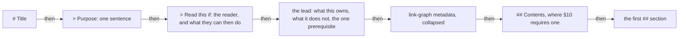

# Amoebius Documentation Standards

> **Purpose**: Single Source of Truth for how documentation is written and maintained across amoebius.
> **Read this if**: a governed document is being written, reviewed, restructured, or split, and it has to
> conform.

This document owns the rules themselves — file naming, the header block, cross-referencing, non-duplication,
honesty, tone, document shape, and the motivation shape a design decision takes. It does not own any
subject-matter doctrine, and it does not own phase order or status, which belong to
[`DEVELOPMENT_PLAN/README.md`](../DEVELOPMENT_PLAN/README.md). The Mermaid vocabulary that
[§7](#7-diagrams) delegates is owned by
[`engineering/diagram_conventions.md`](./engineering/diagram_conventions.md). Reading it presumes no prior
knowledge of amoebius; every term it uses about amoebius itself is routed through
[`glossary.md`](./glossary.md).

<details>
<summary>Link-graph metadata</summary>

**Status**: Authoritative source
**Supersedes**: N/A
**Referenced by**: DEVELOPMENT_PLAN/README.md, DEVELOPMENT_PLAN/development_plan_phase_model.md, DEVELOPMENT_PLAN/development_plan_standards.md, DEVELOPMENT_PLAN/legacy_tracking_for_deletion.md, DEVELOPMENT_PLAN/overview.md, DEVELOPMENT_PLAN/phase_00_documentation_suite.md, README.md, documents/README.md, documents/engineering/README.md, documents/engineering/app_vs_deployment_doctrine.md, documents/engineering/apple_metal_headless_builds.md, documents/engineering/backup_recovery_doctrine.md, documents/engineering/bootstrap_sequence_doctrine.md, documents/engineering/browser_offline_runtime_doctrine.md, documents/engineering/capability_extension_doctrine.md, documents/engineering/chaos_failover_doctrine.md, documents/engineering/cluster_lifecycle_doctrine.md, documents/engineering/cluster_topology_doctrine.md, documents/engineering/conformance_harness_doctrine.md, documents/engineering/consistency_pacelc_doctrine.md, documents/engineering/content_addressing_doctrine.md, documents/engineering/daemon_topology_doctrine.md, documents/engineering/deterministic_simulation_doctrine.md, documents/engineering/diagram_conventions.md, documents/engineering/dsl_doctrine.md, documents/engineering/formal_model_doctrine.md, documents/engineering/gateway_migration_doctrine.md, documents/engineering/gateway_migration_model_doctrine.md, documents/engineering/generated_artifacts_doctrine.md, documents/engineering/host_cluster_comms_doctrine.md, documents/engineering/image_build_doctrine.md, documents/engineering/inforcespec_migration_doctrine.md, documents/engineering/lift_and_compose_doctrine.md, documents/engineering/low_code_ui_runtime_doctrine.md, documents/engineering/manifest_generation_doctrine.md, documents/engineering/migration_doctrine.md, documents/engineering/monitoring_doctrine.md, documents/engineering/namespace_layout_doctrine.md, documents/engineering/network_fabric_doctrine.md, documents/engineering/platform_services_doctrine.md, documents/engineering/preflight_validation_doctrine.md, documents/engineering/pulsar_client_doctrine.md, documents/engineering/pulumi_iac_doctrine.md, documents/engineering/readiness_ordering_doctrine.md, documents/engineering/release_lifecycle_doctrine.md, documents/engineering/repository_layout_doctrine.md, documents/engineering/resource_capacity_doctrine.md, documents/engineering/resource_capacity_sources.md, documents/engineering/service_capability_doctrine.md, documents/engineering/single_logical_data_plane_doctrine.md, documents/engineering/storage_lifecycle_doctrine.md, documents/engineering/substrate_doctrine.md, documents/engineering/tenancy_doctrine.md, documents/engineering/test_derivation_analysis.md, documents/engineering/testing_doctrine.md, documents/engineering/ui_realtime_coordination_doctrine.md, documents/engineering/vault_pki_doctrine.md, documents/glossary.md, documents/illegal_state/illegal_state_catalog.md, documents/illegal_state/illegal_state_techniques.md, documents/reading_order.md
**Generated sections**: none

</details>

## Contents
- [1. Philosophy](#1-philosophy)
- [2. Naming](#2-naming)
- [3. Required header metadata](#3-required-header-metadata)
- [4. Cross-referencing](#4-cross-referencing)
- [5. Duplication rules](#5-duplication-rules)
- [6. Honesty (the proven/tested/assumed discipline)](#6-honesty-the-proventestedassumed-discipline)
- [7. Diagrams](#7-diagrams)
- [8. Tone and voice](#8-tone-and-voice)
- [9. Motivating a design choice](#9-motivating-a-design-choice)
- [10. Document shape](#10-document-shape)
- [11. The orientation block](#11-the-orientation-block)
- [12. Naming what the reader does not know](#12-naming-what-the-reader-does-not-know)
- [13. Sentence and paragraph budget](#13-sentence-and-paragraph-budget)
- [14. Navigation and canonical section names](#14-navigation-and-canonical-section-names)
- [15. Splitting a document into a family](#15-splitting-a-document-into-a-family)
- [Related Documents](#related-documents)

The conventions adapt those proven in the sibling `prodbox` project. The Phase 0 documentation suite, and all
later doctrine, conforms to them.

---

## 1. Philosophy

### SSoT-first
Every concept has **exactly one** canonical document. Other documents reference it; they never duplicate
it. SSoT ownership, bidirectional links, and non-duplication are mandatory for all doctrinal content.

### Development-plan authority
[`DEVELOPMENT_PLAN/README.md`](../DEVELOPMENT_PLAN/README.md) is the single source of truth for phase order,
status, and remaining work. Each phase document owns its human-authored validation contract. Documents under
`documents/` explain architecture, doctrine, and verification boundaries and link back to the plan rather
than maintaining competing status ledgers.

### DRY + link liberally
Never copy-paste between documents. Use relative links with section anchors; prefer deep links
(`./engineering/dsl_doctrine.md#deployment-rules`).

### Separation of concerns
- **Engineering docs** (`documents/engineering/`): architecture, doctrine, patterns, verification
  boundaries.
- **Domain / operator docs**: workflows and configuration options.
- **Reference docs**: API and type indexes.

---

## 2. Naming

All documentation files use `snake_case.md` (`storage_lifecycle_doctrine.md`, `dsl_doctrine.md`). The only
ALL-CAPS exceptions are `README.md`, `CLAUDE.md`, and `AGENTS.md`. The `DEVELOPMENT_PLAN/` suite may define
its own internal structure but still uses the header metadata and relative-link discipline below.

---

## 3. Required header metadata

This section fixes **which** fields exist and what each carries.
[§11](#11-the-orientation-block) fixes **where they sit** relative to the prose, and the two are read
together — the opening below is the composed form:

```markdown
# Document Title

> **Purpose**: One-sentence description.
> **Read this if**: the reader, and what that reader can do afterwards.

The lead: what this document owns, what it does not own with a link to what does,
and the one prerequisite.

<details>
<summary>Link-graph metadata</summary>

**Status**: [Authoritative source | Reference only | Deprecated]
**Supersedes**: [N/A | path/to/old/doc.md]
**Referenced by**: [comma-separated list of docs that link here]
**Generated sections**: none

</details>
```

The four fields stay at column zero and within the document's first forty lines, which is what
[§11](#11-the-orientation-block) explains and what the documentation lint reads.

| Status | Meaning |
|--------|---------|
| `Authoritative source` | The SSoT for this topic |
| `Reference only` | Points to authoritative sources |
| `Deprecated` | Scheduled for removal |

Vague status values (e.g. "doctrine / notes") are forbidden. `Generated sections` is mandatory and always
reads `none`. Generated Markdown and generated sections live only under ignored `.build/docs/` and are never
version-controlled. A governed document is an authored input, not a generated view.

---

## 4. Cross-referencing

- Use **relative links with anchors**.
- **Bidirectional links:** when document A references document B, B's `Referenced by` must include A.
- Doctrine docs link back to `DEVELOPMENT_PLAN/README.md` for status/sequencing rather than restating it.

### Section references are always anchor links

A `§N` reference to a document section — the current document or another — **must** be a Markdown anchor
link, never bare `§N` prose. Bare `§N` does not render as a hotlink and silently rots when sections are
renumbered.

- **Same document:** `[§6](#6-honesty-the-proventestedassumed-discipline)`.
- **Another suite document:** deep-link to the section anchor, keeping the `§N` label terse:
  `[§6](./engineering/chaos_failover_doctrine.md#6-the-concentration-principle--where-the-obligation-lives)`.
  When the reference names the file, keep the filename in the visible text —
  `[documentation_standards.md §6](./documentation_standards.md#6-honesty-the-proventestedassumed-discipline)`.
- **Anchor slugs follow GitHub's rule:** lowercase the heading text, drop every character that is not a
  letter, digit, space, hyphen, or underscore (so `.`, `:`, `/`, `()`, backticks and em/en-dashes are deleted
  — *not* replaced, while `_` is **kept**, e.g. `DEVELOPMENT_PLAN` → `development_plan`), then turn each
  remaining space into a hyphen. A ` — ` between words therefore yields a double
  hyphen (`--`). Numbered headings keep their number: `## 6. Honesty …` → `#6-honesty-…`.
- **Three exceptions stay as prose:** a `§N` that points at a section of an *external* project not in this repo
  (e.g. sibling `config_doctrine.md`, `vault_doctrine.md`); a `§N` that appears *inside a heading* or a
  fenced code / Mermaid block (a link there would corrupt the heading's own slug or fail to render); and a
  **clause reference of the form `§M.N`** that names item *N* of a numbered *list* inside an already-anchored
  section (e.g. the gate-integrity clauses of
  [`development_plan_standards.md §M`](../DEVELOPMENT_PLAN/development_plan_standards.md#m-gate-integrity-a-gate-cannot-be-passed-by-a-stub)).
  A list clause is not itself a section and has no heading anchor; `§M.N` is prose shorthand, and the enclosing
  section (`§M`) is linked once at first mention. This exemption covers only list-clause shorthand, never a bare
  `§N` that names a *section*.

### The illegal-state catalog is cited by its index name, resolved to its themed slice

The illegal-state catalog is one logical SSoT — `illegal_state_catalog.md` is its **index** — whose numbered
entries (`§3.N`, `§4.N`) physically live in themed sub-files (`illegal_state_capacity.md`,
`illegal_state_security.md`, `illegal_state_multicluster.md`, …). A reference to a numbered entry therefore keeps
**`illegal_state_catalog.md §3.N` in the visible text** — the logical catalog is the name readers cite — while the
anchor **deep-links to the themed slice that owns the entry** — e.g. the visible text
`illegal_state_catalog.md §3.17` resolving to `illegal_state_capacity.md#317-…` (the themed slice that owns
`§3.17`). This is the **one sanctioned case where the visible filename differs from the link target**, because the index
holds the enumeration and the slice holds the heading. Bidirectionality (above) is still checked against the
**slice actually linked** — that slice's `Referenced by` lists the citing document, not the index.

### `§N` in a plan-suite task-note is shorthand, not a reader cross-reference

A `§N` inside a **`Docs to update` entry, a `Documentation Requirements` bullet, or a `(§N backlink)` parenthetical** — where the owning document is named in that same entry — is build-task shorthand (like the
`§M.N` list-clause form above), recording *which section a later phase will backlink*; it need not be a separate
anchor link. The anchor-link mandate governs a section reference a **reader follows to navigate** — in body
prose, a heading's cross-reference, or a Related-Documents description — not this task metadata. When such a note
is promoted into reader-facing prose it takes the anchor-link form.

---

## 5. Duplication rules

- Never copy configuration examples, invariant catalogs, or proofs between docs — link to the owner.
- A worked example may *illustrate* a subsystem owned elsewhere, but must name the owning SSoT doc and not
  restate its normative content.

---

## 6. Honesty (the proven/tested/assumed discipline)

amoebius doctrine inherits the chaos/failover doctrine's moral rule: **never report a tested, assumed, or merely argued result as proven.** Verification claims state the layer they actually reach; the rest is
evidence, not proof, and the document must say so. See
[`engineering/chaos_failover_doctrine.md`](./engineering/chaos_failover_doctrine.md) (Phase 0).

Doctrine states the target design; it does not maintain a second implementation-status ledger. A statement
about existing code or a prior run is permitted only when it is labelled **Observed implementation** or
**Historical result (invalidated)** and links to the dated progress audit in
[`DEVELOPMENT_PLAN/README.md`](../DEVELOPMENT_PLAN/README.md). File presence establishes only an observed
footprint. A historical pass remains diagnostic after reopening and cannot be phrased as current validation.
Every discovered mismatch between doctrine, plan, tests, and code is recorded in
[`legacy_tracking_for_deletion.md`](../DEVELOPMENT_PLAN/legacy_tracking_for_deletion.md) under the
reconciliation policy in
[`development_plan_standards.md` §T](../DEVELOPMENT_PLAN/development_plan_standards.md#t-plan-to-implementation-reconciliation).

---

## 7. Diagrams

**The corpus-wide syntactic bans are repealed.** An earlier revision of this section forbade `subgraph` and
dotted edges everywhere, on rendering grounds that no longer hold. Every diagram type, every edge form, and
every layout directive is now available, and the form is chosen to fit the subject. One register keeps a
narrower restriction of its own, stated and argued in the delegate below — that restriction rests on what a
diagram *denotes*, not on how it renders, so it is not the repealed ban under another name. Code fences are
always language-tagged.

Diagrams are drawn in one of **two registers**, and every diagram declares which one on the line immediately
after its type declaration.

The **algebra register** draws one pure expression: every node is a value or a function in a single
composition, and every edge means the target consumes the source's value. Its shape and colour vocabulary is
normative, because in that register shape names a functional-programming role, colour names the honesty band
of [§6](#6-honesty-the-proventestedassumed-discipline), and the *absence* of an edge asserts applicative
independence. The **orientation register** draws a system — components, states, layers, phases, types, or
actors, and the relations between them. It has no amoebius-defined visual semantics: meaning lives in the node
label, the edge label, and the diagram type's own syntax.

Which register a diagram belongs to is settled by a single rule, stated once in
[`engineering/diagram_conventions.md`](./engineering/diagram_conventions.md), which also owns both
vocabularies, each register's remaining syntactic restrictions, the per-register conformance conditions, the
per-document quota, and the anti-patterns.

This section owns three constraints that bind both registers:

1. **Every diagram declares its register**, and an algebra diagram carries the canonical palette while an
   orientation diagram carries none. The one-glance reading is that colour means the shapes are speaking and
   grey means the picture is a map.
2. **Every diagram carries a one-line caption immediately beneath it.** What a caption must state differs by
   register and is specified in
   [`engineering/diagram_conventions.md`](./engineering/diagram_conventions.md). A caption is prose, and
   [§6](#6-honesty-the-proventestedassumed-discipline) and [§8](#8-tone-and-voice) bind it in full.
3. **A diagram is owned by exactly one document** — the Single Source of Truth for what it draws — and another
   document links to it rather than redrawing it ([§5](#5-duplication-rules)). A diagram is never the sole
   statement of a normative rule; prose states the rule and the diagram shows its shape.

A document that draws an algebra diagram adds one back-link to
[`engineering/diagram_conventions.md`](./engineering/diagram_conventions.md) near its first diagram and does
not restate the palette.

---

## 8. Tone and voice

> **Purpose**: fix the register of doctrinal prose so tone is uniform and enforceable. [§6](#6-honesty-the-proventestedassumed-discipline) governs
> whether a claim is *true*; [§8](#8-tone-and-voice) governs how any claim is *phrased*. Both are mandatory and
> independent.

### Register
Doctrine prose is technical, declarative, and impersonal. The grammatical subject is amoebius, a
named subsystem, or a named artifact:

- **amoebius forbids _X_.**
- **The DSL carries only names, never values.**
- **A valid `InForceSpec` cannot represent illegal cluster state.**

Lead with the rule or the problem. Do not build tension, address the reader, or narrate the
reasoning process; the argument is the surrounding sentences, not a rhetorical frame.

### Grammatical person

| Person | Status | Rule |
|--------|--------|------|
| Third-person declarative | **Default** | amoebius / the subsystem / the artifact is the subject. Every normative statement. |
| First-person plural (`we` / `our`) | **Forbidden in amoebius's own prose** | Recast with an impersonal subject (`amoebius rejects Crossplane`; `The recorded operator decision is to drop Helm`). First-person survives **only inside a verbatim quotation** of the operator's recorded vision or decision — cited source material, not amoebius's narration (subject to [§8](#8-tone-and-voice)'s *Quoted vision text* rule below). |
| Second-person (`you` / `your`) | **Forbidden in amoebius's own prose** | Recast impersonally (`a PVC can bind to no PV`, not `you can write a PVC that…`). Genuine operator instructions use the **imperative mood** (`Run amoebius up`), which is not second-person address. Second-person survives under the **same provenance exemption as first-person** — inside a verbatim quotation of external source material (e.g. an upstream project's own words: *"use at your own risk"*) — and under no other circumstance. |

### Banned constructs
Each row is forbidden in doctrine prose. *Instead* is the required replacement.

| Banned | Instead |
|--------|---------|
| Rhetorical questions as prose (`Why does this bug survive the test suite?`) | State the answer as a declarative sentence. If a question organizes a section, put it in the **heading**, not the body. |
| War-story / time-of-day dramatization (`at 3 a.m.`, `a decade of bash`, `the nightmare is…`) | Name the failure mode in technical terms and state **when it is detected** (author time / type-check / runtime). |
| Marketing / stakes framing (`central bet`, `the whole point`, `gift`) | State the mechanism and the property it guarantees. |
| Slang / cutesy labels (`footgun`, `bouncer`, `cattle`, `is a smell`, `cardinal sin`, `wearing a different hat`, `indictment`, `hack`) | Use the precise technical term for the hazard or role. |
| Formulaic openers (`The intuition:`, `Lead with the intuition:`, `The one idea:`, `The payoff is…`) | Delete the label; open with the rule or the problem directly. |
| Emphatic filler (`the whole point` / `the whole reason` / `the whole identity`, `refuses that outright`, `bluntly`, `with a straight face`, decorative `exactly`) | Delete. A correctly stated rule needs no intensifier. |
| First-person sentimentality (`amoebius's gift to its own engineers is focus`) | Delete, or restate as a structural property of the system. |

### The product name

The product name is **lowercase `amoebius`** everywhere, including sentence-initially and in headings —
it is styled like `prodbox`, `infernix`, and `jitML`, which are also never capitalised. The only capitalised
form is a document **title** (`# Amoebius Documentation Standards`), where title case governs. A sentence
therefore reads *"amoebius forbids X"*, never *"Amoebius forbids X"*.

### Metaphor and slogan
A metaphor, analogy, or slogan may appear **only** when both hold:

1. it is **immediately cashed out** — the precise technical statement follows in the same or the
   next sentence; and
2. the precise statement, not the metaphor, is the **normative rule**.

A slogan may never be the sole statement of a rule, the only content of a heading, or a
cross-reference target. Prefer no metaphor. Permitted form: state the rule precisely, then, if
useful, append the shorthand — *"(Shorthand: clusters are cattle; storage is not.)"*

### Relationship to §6 (Honesty)
[§6](#6-honesty-the-proventestedassumed-discipline) and [§8](#8-tone-and-voice) are orthogonal and both mandatory. [§6](#6-honesty-the-proventestedassumed-discipline) governs truth-claims (proven / tested / assumed);
[§8](#8-tone-and-voice) governs register. Where they meet — hedging language — [§6](#6-honesty-the-proventestedassumed-discipline) dictates *which* hedge word is
required; [§8](#8-tone-and-voice) forbids *dramatizing* the hedge. Neither section licenses violating the other.

### Quoted vision text
A verbatim quotation is kept **only** when it is a load-bearing provenance citation — it establishes
what the original vision or notes specified, in contrast to what amoebius decided. Keep it minimal,
mark it as a quote, and clean amoebius's own narration around it. A casual musing quote used
decoratively is **paraphrased** into a precise impersonal statement, with the quote marks dropped.

The exemption covers **only** a citation of external source material (the operator's recorded vision, notes,
or an upstream project's own words). It does **not** cover an **invented strawman position** the document
quotes in order to rebut it — a sentence like *"you cannot know the manifests are right until a cluster
admits them"* or *"we validated the DSL in-process"* is amoebius's own narration wearing quotation marks, not
a provenance citation, and inherits the first/second-person ban in full. Recast such a position impersonally
(*"the manifests cannot be known correct until a cluster admits them"*) rather than quoting it.

---

## 9. Motivating a design choice

> **Purpose**: a design choice is justified by motivating the problem it solves, not by asserting
> the choice. Any "Why this doctrine exists" or decision section states the problem before the rule.

A section that introduces or defends a design decision has four parts, in order:

1. **The problem the choice prevents** — in precise technical terms: the concrete illegal state,
   desync, or class of defect, and the layer at which it would otherwise surface (author time /
   type-check / decode / runtime). No dramatization ([§8](#8-tone-and-voice)).
2. **Why the obvious alternative fails** — name the tempting or industry-default approach and the
   specific property it cannot provide.
3. **The chosen rule** — stated as a declarative invariant ([§8](#8-tone-and-voice)).
4. **What it forecloses** — the capability or freedom the rule gives up, and (per [§6](#6-honesty-the-proventestedassumed-discipline)) any residual
   tension stated honestly.

### The four parts are labelled

Each part opens with its label, bold and verbatim: `**The problem.**`, `**Why the obvious alternative fails.**`, `**The rule.**`, `**What it forecloses.**` The labels replace prose transitions rather than adding
to them.

Labelling is what makes the shape reviewable instead of merely recommended. An unlabelled section that happens
to follow the order is not conforming, because a later editor cannot see which of the four parts is the one
missing — and a missing part is the common defect, not a misordered one.

These four labels are **structural markers and are exempt from [§8](#8-tone-and-voice)'s ban on formulaic openers**. That ban governs rhetorical throat-clearing that announces a thought without adding one
(`The intuition:`); these labels name which of four required parts follows, and removing one removes
information. The exemption covers exactly these four strings in a decision section and extends to no other
label.

**Exemplars** — these sections already follow the shape and are the models to copy:

- [`engineering/manifest_generation_doctrine.md` §1](./engineering/manifest_generation_doctrine.md#1-why-this-doctrine-exists-types-render-manifests-helm-does-not) —
  no-Helm: string-templated YAML is unverified (problem) → typed render (rule) → what a chart could
  still express (foreclosed).
- [`engineering/pulumi_iac_doctrine.md`](./engineering/pulumi_iac_doctrine.md) — keep-Pulumi /
  reject-Crossplane, with the checkpoint tension stated honestly.
- [`engineering/pulsar_client_doctrine.md` §1](./engineering/pulsar_client_doctrine.md#1-one-client-one-wire-no-websockets) —
  no-WebSockets / CBOR-only.
- [`engineering/apple_metal_headless_builds.md` §6](./engineering/apple_metal_headless_builds.md#6-why-tart-is-not-viable-the-no-vm-rationale) —
  no-Tart.

---

## 10. Document shape

> **Purpose**: fix the physical dimensions of a document so that navigating it is possible before
> understanding it. [§5](#5-duplication-rules) governs *whether* content belongs here; this section governs
> *how much* of it may sit in one place.

**The problem.** A section with no internal structure cannot be searched by a reader who does not already know
the answer. Such a reader must scan linearly until the topic appears, which costs the same as reading the
whole document, so a long section silently converts every lookup into a full read. The defect surfaces at
first contact and never afterwards, which is why it survives review by people who already know where things
are.

**Why the obvious alternative fails.** The tempting alternative is to trust each author to break up prose by
judgement. Measured against this corpus before these rules, that had already failed: dozens of sections
exceeded 140 lines of non-fenced prose, one ran past six hundred, one list item spanned over 130 lines, and
not one of the 133 documents carried a table of contents. Judgement produces a distribution with a long tail,
and the tail is where the corpus is read least and needed most.

**The rule.**

1. **Section cap.** A section's **own body** — its heading through the next heading of *any* level — carries
   at most **140 non-fenced, non-blank lines**. A section over the cap is divided into subsections at the next
   depth, and that is precisely why the own body is the measured unit: subdivision has to reduce the number
   the rule reads, or the remedy would not be one. Fenced blocks are excluded from the count, a schema or a
   transcript being reference material rather than prose to be read linearly.
2. **Document cap.** A governed document carries at most **700 non-fenced, non-blank lines**. A document over
   the cap is split into a family ([§15](#15-splitting-a-document-into-a-family)).

   Two kinds of document are outside this cap, because for each the remedy is unavailable rather than merely
   unattractive. A **family hub** is exempt: it holds a stub for every section it moved out, so it cannot
   shrink further without abandoning the anchors those stubs preserve. A **slice is not exempt** — it is an
   ordinary document and meets the cap like any other, which is what stops a family from becoming a way to
   escape the rule by splitting off one sibling. A **plan-suite phase document** is exempt because
   [`../DEVELOPMENT_PLAN/development_plan_standards.md` §B](../DEVELOPMENT_PLAN/development_plan_standards.md#b-canonical-file-layout-snake_case)
   admits exactly one document per phase, so no family is available to it; its size is bounded instead by
   that rulebook's field caps ([§P](../DEVELOPMENT_PLAN/development_plan_standards.md#p-plan-document-shape))
   and its one-capability-claim rule
   ([§O](../DEVELOPMENT_PLAN/development_plan_standards.md#o-sprint-sized-seams-and-bounded-phase-gates)).
3. **List-item cap.** A list item's **own body** — its marker through the next list item of *any* depth —
   spans at most **20 lines**. An item over the cap is either promoted to a section or given sub-items; both
   reduce the measured quantity, and an item already broken into sub-items has applied the remedy.
4. **Heading depth.** Governed prose uses `##`, `###`, and `####`. A `#####` heading marks a document that
   should have been split.
5. **Contents block.** A document with **eight or more `##` sections**, or over **300 non-fenced lines**,
   carries a `## Contents` section immediately after the orientation block. It lists every *other* `##`
   section in document order — never itself — each as a same-document anchor link whose visible text is the
   heading text, and lists no `###`. Where a heading contains a `]`, the escaped form `\]` is the verbatim text, because an unescaped bracket ends the link label. Nothing but the orientation block precedes it.

**What it forecloses.** A single continuous argument longer than roughly one and a half screens, and the "one
long definitive treatment" form that some subjects genuinely invite. The caps above are the values sized to
the current corpus; they tighten once the corpus clears them, and the documentation lint enforces whatever
number this section states.

---

## 11. The orientation block

> **Purpose**: put what a reader needs ahead of what a tool needs.
> [§3](#3-required-header-metadata) fixes *which* metadata fields exist; this section fixes *where they sit
> relative to the prose*.

**The problem.** The `Referenced by` field is a reconciled projection of the link graph
([§4](#4-cross-referencing)), written for the documentation lint rather than for a reader. Placed above the
prose it is the first thing anyone meets: across the corpus it totals well over a hundred thousand characters,
and on the development plan's tracker it is a single line of more than five thousand. A reader opening a
document for the first time was therefore shown its inbound-link set before its subject, and before this rule
not one of the 133 documents stated who it was for.

**Why the obvious alternative fails.** Deleting the field is unavailable. Bidirectional reconciliation is the
only mechanism that catches a rename which silently orphans a document, and it is checked by tooling that
requires the four fields at column zero near the top of the file. The constraint is real; only its position
relative to the prose is a choice.

**The rule.** Every governed document opens in exactly this order:

1. `# Title`.
2. `>
**Purpose**:` — one sentence ([§3](#3-required-header-metadata)).
3. `>
**Read this if**:` — one sentence naming the reader and what that reader can do afterwards. Written
   impersonally, per [§8](#8-tone-and-voice): *"Read this if a phase must place a workload against a declared
   node capacity."*
4. **The lead** — two to four sentences stating what this document owns, what it explicitly does not own with
   a link to what does, and the one thing a reader must already know. The lead carries no normative rule; a
   rule stated there would be a second home for it ([§5](#5-duplication-rules)).
5. The four header-metadata fields, wrapped in a `<details>` block summarised as `Link-graph metadata`, with a
   blank line after the `<summary>` line so the fields still render. The field lines are unchanged and stay at
   column zero within the document's first forty lines.
6. `## Contents`, where [§10](#10-document-shape) requires one.

**What it forecloses.** Seeing the inbound-link set without one click, and the terse opening that a very short
reference document might otherwise justify.

---


*Orientation. The order [§11](#11-the-orientation-block) fixes, and the whole of its mechanism: what a reader needs precedes what the tooling needs. The four metadata fields keep their required position within the document's first forty lines; only their position relative to the prose changes.*

## 12. Naming what the reader does not know

> **Purpose**: make a single document readable by someone who has not read the other hundred and thirty-two.

**The problem.** `InForceSpec` — the central noun of the entire system — appears in 68 of 144 governed
documents and is defined in none of them. The recurring acronyms behave the same way: `CAS`, `CSI`, `SSA`,
`WAL`, `CNI`, `mTLS`, `GADT`, `DAG`, `IR`, `TTL`, `ABI`, `SKU`, and `OIDC` together appear well over a
thousand times, and not one of them is expanded anywhere in the corpus. Each document is written as though its
reader arrived from the neighbouring document, so the corpus is navigable only by someone who has already
read it.

**Why the obvious alternative fails.** The obvious remedy is a central glossary that *defines* the vocabulary.
That violates [§1](#1-philosophy) directly: a definition in a glossary is a second home for a concept some
doctrine document already owns, and the two drift, with the shorter and more accessible one winning by
default. The fix has to route without defining.

**The rule.**

1. **Acronym first use.** The first occurrence of a governed acronym in a document's body expands it once —
   *content-addressed storage (CAS)* — and every later occurrence uses the bare form. Headings, code spans,
   fenced blocks, and the header block are exempt. The governed set is the registry table in
   [`glossary.md`](./glossary.md).
2. **Project coinages.** The first occurrence of a term amoebius coined — a term that is not standard
   Kubernetes, Haskell, or Dhall vocabulary — links once to the section that owns it, in the lead or at first
   body use.
3. **The glossary defines nothing.** [`glossary.md`](./glossary.md) is `Reference only`. Each term row is a
   link to an owning section followed by a gloss of at most twenty words. The gloss is a routing aid, never a
   definition: **where a gloss and its owning section disagree, the owning section is correct and the gloss is the defect.** A term with no owning section is not admitted; its absence is evidence that the concept has
   no Single Source of Truth yet.

   The acronym registry of [§12.1](#12-naming-what-the-reader-does-not-know) is the one exception, and the
   one thing in that file any rule may cite: an acronym is an expansion rather than a concept, so it needs no
   owning section, and the registry is normative precisely because it is the set this rule ranges over.
4. **Glossary rows lead with the link.** The link-first form is the pointer discipline expressed as syntax —
   the owner is reached before the gloss, by a reader and by tooling alike.

**What it forecloses.** Terse first sentences, and the freedom to introduce a coinage without also routing it.

---

## 13. Sentence and paragraph budget

> **Purpose**: bound the unit of reading. [§8](#8-tone-and-voice) governs the *register* of a sentence; this
> section governs its *length*. The two are independent and both mandatory.

**The problem.** Measured over paragraphs, the corpus carries 1,613 sentences longer than forty-five words
across 115 documents, 133 of them longer than ninety and the longest 376. At that length a sentence stops
being parseable in one pass: a reader holds an unresolved subject across several subordinate clauses and
re-reads to find it. Almost every one of them is a semicolon-chained enumeration, so the length is a property
of how the material was arranged rather than of how hard the material is.

**Why the obvious alternative fails.** The alternative is to relax the register instead, reaching for shorter
sentences by way of direct address and rhetorical framing. [§8](#8-tone-and-voice) forbids both, and neither
would shorten a single nominalisation chain. Shorter sentences here come from splitting a compound claim into
two declarative ones and from moving an embedded enumeration into a list or a table, never from a change of
tone.

**The rule.**

1. **Sentence cap.** A prose sentence carries at most **45 words**. A sentence over the cap is divided; where
   its length comes from an embedded enumeration, the enumeration becomes a list or a table.

   **The measured unit is the sentence, not the line.** A sentence is read across the whole paragraph it sits
   in, so hard-wrapping does not divide one. The distinction is not academic: a checker reading single lines
   sees about eighteen words at a time and can never observe a sentence over any cap above that, which is how
   this rule went unenforced while the corpus held 1,613 violations of it.

   **The rule is 45 words; the check reports and does not yet block.** The corpus meets neither value: 1,613
   sentences exceed forty-five and 133 exceed ninety. The documentation lint therefore runs `p3` as an
   **advisory** check — every violation is reported and counted, but none fails the gate. The check blocks
   once the backlog is cleared to a value the corpus meets, and the number then tightens toward forty-five on
   the same ratchet [§10](#10-document-shape) runs on. Enforcing at a number the corpus cannot meet would hold
   the gate permanently red, which is how a rule stops being one; declining to measure at all is how the
   corpus reached 1,613 in the first place. Advisory status is the interval between those two failures, not a
   resting state — the backlog and its measurement command are recorded in
   [`phase_00_documentation_suite.md`](../DEVELOPMENT_PLAN/phase_00_documentation_suite.md) Sprint 0.6.
2. **Table cells** are exempt from the mechanical cap but not from its intent. A cell needing more than 45
   words is a section that was compressed into a table.
3. **Paragraph cap.** A paragraph carries at most **six sentences**.
4. **One claim per item.** A list item states one invariant. An item joining two independent invariants with
   *and*, *while*, or a semicolon is two items.

**What it forecloses.** The single sentence that carries a complete qualified rule with all its exceptions
attached — a form this corpus uses often, and which is precise but readable only twice.

---

## 14. Navigation and canonical section names

1. **One name per structural section.** The link-list section closing a governed document is named
   **`## Related Documents`**, always. `## Cross-references` is retired; a document carrying it is converted,
   and where inbound links target the old anchor it is preserved with an explicit `<a id="cross-references">`
   tag at the new heading.
2. **`## Contents` tracks the headings and never drifts.** It is checked against the document's actual `##`
   set, in order.
3. **A heading may be renamed without breaking inbound links.** Plant the previous slug as an explicit
   `<a id>` tag on the line immediately above the renamed heading; explicit anchor tags are first-class link
   targets. An anchor tag is added when a heading actually changes, never speculatively.

---

## 15. Splitting a document into a family

> **Purpose**: make an over-long document navigable without invalidating the links that already point into it.

**The problem.** A document past [§10](#10-document-shape)'s document cap cannot be navigated, but splitting
one relocates its headings, and a relocated heading breaks every inbound anchored link — of which the largest
document in this corpus has over a hundred and sixty. The cost of the fix therefore appears to exceed the cost
of the defect, which is why such documents keep growing.

**Why the obvious alternative fails.** Leaving the document whole and adding a contents block is sufficient
where the excess is a margin. It is not sufficient where the excess is an order of magnitude: a contents block
over a ten-thousand-line document lists sections that are themselves longer than most documents.

**The rule.**

1. **The family is flat and named after its hub**, following the illegal-state precedent: `<hub>_doctrine.md`
   alongside siblings `<hub>_<aspect>.md` in the same directory. No subdirectory, so relative-path depth stays
   constant and no `Referenced by` path churns.
2. **The hub keeps its filename, its `##` heading set, and every existing anchor.** Under its original
   heading, each moved section leaves the one-paragraph statement of what that section establishes and a link
   to the slice carrying the argument. The hub is authoritative for the subject's structure; each slice is
   authoritative for its own aspect.
3. **Each slice is cited by its own filename.** The index-name citation form of [§4](#4-cross-referencing) is
   specific to the illegal-state catalog and is not generalised: a family slice is named by the file that
   actually holds the heading.
4. **A fenced artifact that dominates a document moves to a slice of its own.** A schema, transcript, or
   corpus listing is reference material, and [§10](#10-document-shape) excludes it from every cap, so its size
   alone never forces a split. It moves when the prose wrapped around it has become a thin shell — when a
   reader opening the document meets reference material rather than the argument — and it takes a subsection
   heading per family with it.

**What it forecloses.** A single canonical treatment of a large subject in one file, and the ability to read
that subject start to finish without following a link.

---

## Related Documents
- [Development Plan](../DEVELOPMENT_PLAN/README.md)
- [Engineering Doctrine Index](./engineering/README.md)
- [Glossary](./glossary.md) — the term and acronym registry [§12](#12-naming-what-the-reader-does-not-know) governs
- [Reading Order](./reading_order.md) — the sequenced path through the corpus these rules shape
- [Diagram Conventions](./engineering/diagram_conventions.md) — the two registers [§7](#7-diagrams) delegates
