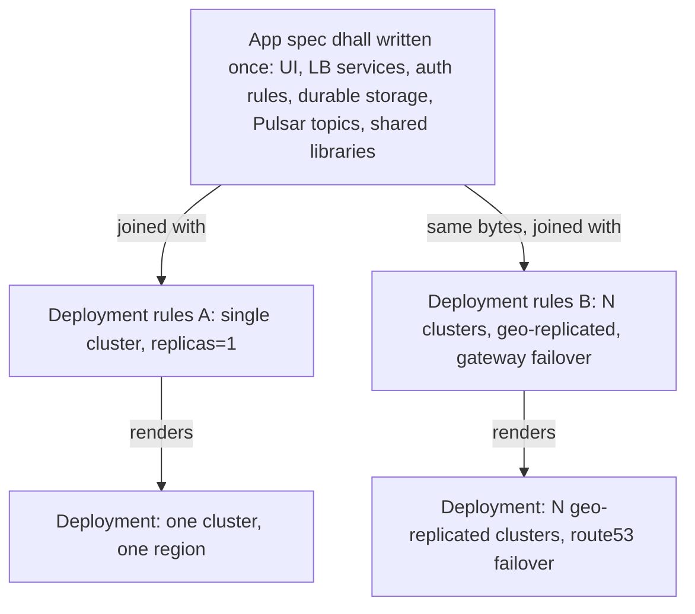

# Application Logic vs Deployment Rules

**Status**: Authoritative source
**Supersedes**: N/A
**Referenced by**: documents/engineering/README.md, documents/engineering/chaos_failover_doctrine.md, documents/engineering/cluster_lifecycle_doctrine.md, documents/engineering/content_addressing_doctrine.md, documents/engineering/daemon_topology_doctrine.md, documents/engineering/dsl_doctrine.md, documents/engineering/manifest_generation_doctrine.md, documents/engineering/monitoring_doctrine.md, documents/engineering/platform_services_doctrine.md, documents/engineering/pulumi_iac_doctrine.md, documents/engineering/release_lifecycle_doctrine.md, documents/engineering/resource_capacity_doctrine.md, documents/engineering/service_capability_doctrine.md, documents/engineering/single_logical_data_plane_doctrine.md, documents/engineering/storage_lifecycle_doctrine.md, documents/engineering/testing_doctrine.md
**Generated sections**: none

> **Purpose**: Define the hard separation between an app's **application logic** (what it *is* to a user)
> and its **deployment rules** (how, where, and how robustly it runs), so one app spec is written once and
> composes unchanged onto a single cluster or N geo-replicated clusters.

---

## 1. Two surfaces, one app written once

In amoebius, **an app does not know how many of it exist.**
A developer describes *what their app is* — its UI, its users, the data it keeps, the libraries it leans on
— and **never** writes down how many replicas run, in how many regions, behind what failover policy, under
what chaos schedule. Those are someone else's decision, made later, in a separate place, and the app is none
the wiser.

Concretely, amoebius splits the Dhall DSL into two **orthogonal surfaces**:

| Surface | Answers | Written by | Example values |
|---------|---------|------------|----------------|
| **Application logic** (the app spec) | *What is this app?* | the app author, once | UI / LB services, Keycloak auth rules, durable-storage needs, Pulsar topics, shared-library use |
| **Deployment rules** | *How, where, how robustly does it run?* | the operator, per deployment | HA replica counts, geo-replication topology, gateway failover, chaos-test injection, inference substrate |

These are not two halves of one file that happen to be near each other — they are **separable inputs**. The
app spec joins with *a* deployment-rules layer to produce *a* deployment; swap the deployment-rules layer
and a different deployment results from byte-identical app logic. The grammar of these two surfaces — the
Dhall record/union types, total composability, and the illegal-state-unrepresentable contract — is owned by
[dsl_doctrine.md](./dsl_doctrine.md). This document owns only the **dividing line**: which concerns live on
which surface, and why the line must never be crossed (DEVELOPMENT_PLAN
cross-cutting invariant "Application logic and deployment rules are separate DSL surfaces").

> **Honesty.** This split is *specified* doctrine for Phase 4 (the DSL type families) — with its in-process
> design validation front-loaded to Phase 1 — and *demonstrated* live by the infernix demo web app in Phase 6
> and the jitML demo web app in Phase 7 (composed as an SPA in Phase 12); none of these phases has been built.
> Read every prescriptive statement here as design intent, never as a tested amoebius result. Status and gates live only in
> [../../DEVELOPMENT_PLAN/README.md](../../DEVELOPMENT_PLAN/README.md) (per
> [documentation_standards.md §6](../documentation_standards.md#6-honesty-the-proventestedassumed-discipline)).

---

## 2. The application-logic surface — what an app *is*

**Everything on this surface survives a move.** An app torn off its cluster and stood up somewhere else — on a
different substrate, at a different scale — carries these things *with* it because they *are* the app. An amoebius app is exactly two artifacts: one or
more container images that build for both `amd64` and `arm64`, and an **app-spec `.dhall`**. The image-build pipeline is owned by [image_build_doctrine.md](./image_build_doctrine.md);
this surface owns the spec.

The app-spec surface declares:

- **UI and user lifecycles** — what surfaces the app exposes and what a user can do with them.
- **LB services** — *which* of the app's services are reachable from the edge. (Whether they are reachable
  is never the app's call: all wild ingress is owned by Keycloak via the LB + Gateway API — see
  [platform_services_doctrine.md §9](./platform_services_doctrine.md#9-the-loadbalancer-and-the-single-wild-ingress-path). The app declares *what to publish*;
  it cannot publish a backdoor.)
- **Keycloak-backed auth rules** — the OIDC identity and authorization rules that gate the app's surfaces.
- **Durable-storage needs** — the MinIO buckets it keeps (named `<app>/<bucket>`), any `no-provisioner`
  block storage it provisions, and any Postgres database it requests in its own namespace. The app declares
  *what data it keeps*; the retained-PV mechanics, sizing, and deterministic rebind that make that data
  durable are owned by [storage_lifecycle_doctrine.md](./storage_lifecycle_doctrine.md), and the
  one-Patroni-cluster-per-consumer rule by [platform_services_doctrine.md §8](./platform_services_doctrine.md#8-postgres--patroni-via-percona-one-cluster-per-consumer-with-pgadmin).
- **Pulsar topic lifecycles** — the event/workflow topics the app owns and how they live and die. The
  native-protocol client and topology algebra are owned by
  [pulsar_client_doctrine.md](./pulsar_client_doctrine.md); the app surface owns *which topics exist for
  this app*.
- **Monitoring obligations** — that each workflow carries an SLO and each topic a liveness bound, that an
  extension stands up its surfaces (jitML → TensorBoard), and the `AccessScope` each surface publishes under
  (admin-global vs a per-user Keycloak-backed filter). The app declares *that it is monitored and to whom its
  surfaces are visible*; there is no arm for "unmonitored" and none for "public." The obligation types, the
  derived dashboards, and the no-`Public`-arm rule are owned by
  [monitoring_doctrine.md](./monitoring_doctrine.md).
- **Use of shared libraries** — that the app builds on infernix, jitML, or (later) a Haskell extension
  module is part of what the app *is* (see [§8](#8-shared-library-use-is-application-logic)).

Two structural facts pin app identity to the cluster: an app's **name is unique per
cluster**, and the app gets **its own namespace with that same name**. Secrets appear here **by name only** —
the app references a secret; it never contains one. The secret-by-name `SecretRef` contract and
parent-injects-into-child model are owned by [vault_pki_doctrine.md](./vault_pki_doctrine.md) and must not
be restated here.

What is *conspicuously absent* from this surface is the whole vocabulary of [§3](#3-the-deployment-rules-surface--how-the-same-app-runs): there is no replica count, no
region, no failover policy, no chaos knob, no substrate selector. The app author cannot write those words
because the type does not have those fields.

---

## 3. The deployment-rules surface — how the same app *runs*

The deployment-rules surface is the mirror image of [§2](#2-the-application-logic-surface--what-an-app-is): **everything on this surface is about robustness, scale, and
placement — and none of it changes what the app is.** Turn every one of these dials and a user sees the
identical app; they just see it survive more, scale wider, or run on different hardware.

The deployment-rules surface declares:

- **HA replica counts.** How many of each component run. The app spec never names a number; the chart is
  **HA even at `replicas=1`** ([platform_services_doctrine.md §2](./platform_services_doctrine.md#2-ha-always--including-replicas1)), so the
  replica value is a pure deployment dial that rides an unchanged chart. Where the replica value physically
  lives in the DSL (a cluster-scoped `cluster.dhall` value seeded at `bootstrap` vs a per-app deployment
  block) is a [dsl_doctrine.md](./dsl_doctrine.md) concern; this doc owns only the rule that it is **never**
  app logic.
- **Geo-replication topology.** Whether the app runs on one cluster or N geographically-replicated clusters,
  and how their durable state is kept in step (via the Pulsar / MinIO / Postgres idioms — see [§9](#9-composition-one-cluster--n-geo-replicated-clusters-zero-app-change)). The
  cross-cluster mechanics are owned by [cluster_lifecycle_doctrine.md](./cluster_lifecycle_doctrine.md).
- **Failover policy.** When and how the lead cluster's gateway fails over and DNS is repointed. The async cross-cluster correctness boundary — the one place a per-system proof
  obligation concentrates — is owned by [chaos_failover_doctrine.md](./chaos_failover_doctrine.md).
- **Chaos-test injection.** The app **does not know it is being chaos-tested.** A chaos schedule is attached
  here, never in the app spec; the Extract→Model→Inject methodology and the proven/tested/assumed ledger are
  owned by [chaos_failover_doctrine.md](./chaos_failover_doctrine.md), and the test-as-an-`InForceSpec`-topology
  model by [testing_doctrine.md](./testing_doctrine.md).
- **Monitoring dials.** The SLO budget *numbers* (freshness, error-budget), the alert severities, and the
  per-user `AuthRule` that scopes a `UserScoped` surface are deployment dials — a robustness/visibility
  setting, never app logic — carrying **no** "off" arm and **no** "public" arm. Owned by
  [monitoring_doctrine.md](./monitoring_doctrine.md).
- **Inference substrate.** Whether an ML workload runs on Apple Metal on the host, CUDA on the cluster, or
  linux-cpu is a deployment decision, not app logic — this is the *serving* substrate (the *producing*
  substrate that made a model's weight bytes is provenance, not a deployment dial — see [§7](#7-infernix-is-a-shared-library-the-inference-substrate-is-a-deployment-rule)).
- **Dynamic node provisioning policy.** Scaling nodes by arbitrary logic — load, spot-instance cost, or
  workflow completion — is a deployment rule, owned operationally by
  [cluster_lifecycle_doctrine.md](./cluster_lifecycle_doctrine.md), and typed as a `ScalingPolicy` owned by
  [resource_capacity_doctrine.md §6](./resource_capacity_doctrine.md#6-growable--scalingpolicy-the-escape-valve-amoebius-owns).
- **Resource budgets, storage backings, and the compute engine.** The per-host/cluster capacities and storage
  budgets a workload must fit, the `StorageBacking` each app's storage draws from, and the compute engine +
  node topology (kind / rke2 / EKS) are all deployment rules — an app declares *what* it needs, never *how
  much the cluster has* or *which engine runs it*. The capacity fold is owned by
  [resource_capacity_doctrine.md](./resource_capacity_doctrine.md); the compute-engine/topology axis by
  [cluster_topology_doctrine.md](./cluster_topology_doctrine.md).
- **Environment (dev/staging/prod).** *Which* environment a deployment targets is a deployment rule, never
  app logic: the **app bytes are byte-identical across environments**, and only the deployment rules differ.
  The environment is not a field in the app spec but a mutable, per-environment **ETag-CAS pointer** — living
  in the content store — that resolves to a `Release`; "promote to prod" is a pointer CAS. The `Environment`
  type, the promotion pointer, and the immutable release ledger are owned by
  [release_lifecycle_doctrine.md §3](./release_lifecycle_doctrine.md#3-environment-and-the-etag-cas-promotion-pointer). This is the type-level reason there is
  no separate "dev version" and "prod version" of an app ([§5](#5-why-the-split-matters--cashing-it-out)).

This surface is **keyed by app**: a deployment-rules layer references an app by name and says *how to run
it*. The same app name can appear in two different deployment-rules layers and run two completely different
ways, with zero edits to its app spec.

---

## 4. The dividing line — a litmus test

When it is unclear which surface a concern belongs to, apply one rule:

> **If changing it changes what the app *is* to a user, it is application logic. If changing it changes only
> how many copies run, where they run, or how robustly they run, it is a deployment rule.**

App logic answers **WHAT**; deployment rules answer **HOW MANY / WHERE / HOW ROBUST**. Worked through some
deliberately tricky cases:

| Concern | Surface | Why |
|---------|---------|-----|
| "The app exposes a chat UI" | application logic | it is *what the app is* |
| "The chat UI is reachable from the edge" | application logic (declares the LB service) | *what to publish*; the edge is still Keycloak's |
| "Run 5 replicas of the chat backend" | deployment rule | a scale dial; same app at 1 or 5 |
| "The app keeps a `messages` bucket and a Postgres DB" | application logic | *what data it keeps* |
| "Those PVs are 50Gi, retained, host-bound" | neither — owned by [storage_lifecycle_doctrine.md](./storage_lifecycle_doctrine.md) | a platform mechanic, not an app or deployment dial |
| "The app uses infernix for inference" | application logic | a shared-library dependency ([§8](#8-shared-library-use-is-application-logic)) |
| "Inference runs on Apple Metal vs CUDA" | deployment rule | a placement choice ([§7](#7-infernix-is-a-shared-library-the-inference-substrate-is-a-deployment-rule)) |
| "Replicate the app across us-east and eu-west and fail over" | deployment rule | topology + robustness; the app is unchanged ([§9](#9-composition-one-cluster--n-geo-replicated-clusters-zero-app-change)) |
| "Inject a broker kill every 10 minutes" | deployment rule | the app does not know it is being tested |
| "Promote a build from staging to prod" | deployment rule | a pointer CAS over byte-identical app bytes; only the deployment rules differ ([§3](#3-the-deployment-rules-surface--how-the-same-app-runs)) |
| "A login requires MFA for the admin role" | application logic | an auth rule that *defines* the app's behaviour |

**Misfiling is a bug, not a style preference.** A replica count that leaks into the app spec re-couples
scale to logic and breaks write-once; a UI route that leaks into deployment rules makes the deployment layer
non-swappable. [dsl_doctrine.md](./dsl_doctrine.md) and
[illegal_state_catalog.md](./illegal_state_catalog.md) are the SSoTs for *which* of these boundaries are
lifted into the type layer so that a misfiled field is **unrepresentable** rather than merely discouraged —
this doc states the policy; those docs own the enforcement.

---

## 5. Why the split matters — cashing it out

Three concrete properties, each a direct consequence of keeping the line clean:

- **Write once.** An app is authored a single time, deployment-agnostic. There is no "dev version" and
  "prod version" of the app spec; there is one app spec and many deployment-rules layers. This kills the
  whole *works-on-my-laptop, breaks-in-prod* class of bug at the source — the laptop deployment and the
  production deployment run the **same app bytes on the same HA charts**
  ([platform_services_doctrine.md §2](./platform_services_doctrine.md#2-ha-always--including-replicas1)); only the deployment dials differ.
- **Orthogonal evolution.** Operators tune replicas, add a failover region, or schedule chaos without ever
  opening the app's source — and app authors ship features without ever reasoning about topology. The two
  teams change different files.
- **Composability.** Because the surfaces are separable inputs, the *same* app composes with *any* valid
  deployment-rules layer (total composability). The proof case is [§6](#6-the-proof-case-a-demo-web-app-as-application-logic-only) and the
  extreme case is [§9](#9-composition-one-cluster--n-geo-replicated-clusters-zero-app-change).

The most fundamental consequence is that the split makes a whole category of mistakes **unrepresentable**: the app surface
literally has no field in which to name a replica count or a region, and the deployment surface has no field
in which to name a UI route or a bucket. A "3 replicas" value cannot be accidentally hard-coded into application
logic because there is nowhere to type it. That structural guarantee is owned by
[dsl_doctrine.md](./dsl_doctrine.md) / [illegal_state_catalog.md](./illegal_state_catalog.md); this doc owns
the *reason* it is worth enforcing.

---

## 6. The proof case: a demo web app as application-logic-only

The canonical demonstration of this doctrine is a **demo web app** — the demo single-page web app each ML
extension ships (one with infernix, one with jitML) to illustrate its ML workflow and render its results.
Per [§8](#8-shared-library-use-is-application-logic), a demo web app is application logic that *uses* the
infernix/jitML inference extension; it is **not** itself an extension. It is the cleanest case because it
exercises every surface at once — a UI, user/render logic, durable data, auth rules, and a dependency on an
ML inference extension — with nothing about scale, placement, or robustness anywhere in sight.

Written the amoebius way, a demo web app is authored **once, as application logic only** — the UI, the user
and render lifecycles, the durable data, the auth rules, and its *use* of the infernix/jitML inference
extension. Everything about *how robustly and where it runs* is a separate, orthogonal deployment-rules
surface: a *single* `InForceSpec` deployment-rules layer configures, **with zero extra effort from the
application itself**:

- the k8s cluster distro (kind / rke2 / provider),
- the HA replica count (a `replicas=n` dial on an unchanged HA chart
  ([platform_services_doctrine.md §2](./platform_services_doctrine.md#2-ha-always--including-replicas1))),
- chaos-test injection, geo-replication topology, and gateway failover — the app never knows it is scaled,
  replicated, failed over, or tested, and
- the model-inference substrate (Apple Metal on the host, CUDA on the cluster, or linux-cpu).

The same app bytes therefore run at one replica on a single kind cluster or geo-replicated across N clusters
with failover, served on whatever inference substrate the deployment picks — and the demo web app's own spec
never names a replica count, a region, a chaos schedule, or a substrate, because the app surface has no field
for them ([§2](#2-the-application-logic-surface--what-an-app-is)). The inference itself is an infernix/jitML
workflow ([§7](#7-infernix-is-a-shared-library-the-inference-substrate-is-a-deployment-rule)), not a bespoke
engine welded into the app.

> **Honesty.** This is Phase-0 design intent, not a proven amoebius result. The application-logic-only
> demonstration lands **live** with the infernix demo web app in **Phase 6** and the jitML demo web app in
> **Phase 7**, and the two are composed as a live SPA in **Phase 12**; the surfaces' in-process design
> validation is front-loaded to **Phase 1** (see [../../DEVELOPMENT_PLAN/README.md](../../DEVELOPMENT_PLAN/README.md)).
> None of these phases has been built.

---

## 7. infernix is a shared library; the inference substrate is a deployment rule

This is the subtlest application of the litmus test, so make the distinction explicit:

- **"The app uses infernix"** is **application logic.** infernix is an ML extension *library*; depending on
  it is part of what the app is ([§8](#8-shared-library-use-is-application-logic)). A workflow that calls infernix is the same call graph regardless of
  where it runs.
- **"Inference runs on Apple Metal vs CUDA vs linux-cpu"** is a **deployment rule.** *Where* the inference
  workload is placed — a host compute daemon using Apple Silicon's unified memory, a CUDA pod on the
  cluster, or a CPU pod — is a substrate/placement choice, configured in the deployment-rules layer with no
  change to the app.
- **Serving substrate vs producing substrate.** The substrate an inference workload is *placed on to serve*
  is this deployment-rule dial — and it **need not equal** the **producing substrate**, the accelerator whose
  reduction order actually made a model's weight bytes. The producing substrate is **provenance, not a
  placement choice**: this round's doctrine folds it into the checkpoint's `experimentHash` namespace so it
  travels *with* the artifact, owned by [content_addressing_doctrine.md](./content_addressing_doctrine.md);
  the engine-family-on-serving-substrate landing check is owned by
  [service_capability_doctrine.md](./service_capability_doctrine.md). This section classifies only the
  **serving/placement** axis: a model produced on one accelerator may be served on another (cross-substrate
  serving), with reproducibility scoped to the serving substrate — never a change to what the app *is*.

infernix is "an amoebius extension: a single Haskell binary that can be deployed as a distributed system
either at node-system level (in an Apple cluster) or cluster level (as a stateless deployment)". That *dual* placement is precisely a deployment decision — the same infernix logic,
two placements. Consequently **the infernix `.dhall` nests inside the `InForceSpec`**: infernix's own configuration is composed into the larger deployment spec rather than living as a
parallel system. The host-vs-cluster placement mechanics (host compute daemons as Pulsar/MinIO peers over
host-only NodePorts, no mTLS) are owned by [platform_services_doctrine.md §9](./platform_services_doctrine.md#9-the-loadbalancer-and-the-single-wild-ingress-path)
and the host↔cluster comms doctrine; the determinism and content-addressing that make an infernix run
reproducible are owned by the content-addressing doctrine. This section owns only the *classification*: the
dependency is app logic, the placement is a deployment rule.

---

## 8. Shared-library use is application logic

Which libraries an app builds on — infernix, jitML, and (a later phase) Haskell extension modules validated
by a custom AST checker — is part of what the app *is*, and therefore lives
on the application-logic surface. The clean way to hold this with [§7](#7-infernix-is-a-shared-library-the-inference-substrate-is-a-deployment-rule):

- The library **call graph** — *that* the app invokes infernix, *which* workflows it composes — is
  application logic; it would travel with the app to any cluster.
- The **placement** of the workload that executes that call graph — host vs cluster, Metal vs CUDA vs CPU,
  at what replica count — is a deployment rule.

The typed shape of that dependency is the **`ExtensionSpec`** contract. Each in-tree extension in the v1
closed set — **{infernix, jitML}** — plugs in by contributing one
`ExtensionSpec { extDhall, extChain, extCapabilities }`: a typed Dhall sub-catalog **nested inside the
`InForceSpec`** ([§7](#7-infernix-is-a-shared-library-the-inference-substrate-is-a-deployment-rule)), a `cfg -> [Step]` chain, and the `List Capability` it declares. These specs are
merged at **compile/link time into the single binary** — there is no per-extension image and no `dlopen`.
That the app *contributes* an `ExtensionSpec` is application logic (it travels with the app); the
*placement* of the linked workload stays a deployment rule ([§7](#7-infernix-is-a-shared-library-the-inference-substrate-is-a-deployment-rule)). The `ExtensionSpec` grammar and its
nested-Dhall composition are owned by [dsl_doctrine.md §4](./dsl_doctrine.md#4-total-composability) — this is specified DSL design
intent, not a built mechanism. An app unwilling to be linked is **not** an extension — it runs as an
ordinary app-spec `.dhall` workload; the one path for a non-vendored third party is the later-phase Haskell
extension DSL + AST checker below.

Treating shared-library use as app logic is what lets jitML and infernix be *unified libraries under the
DSL* rather than separate products (DEVELOPMENT_PLAN: "the constituent projects are not separate products").
The later-phase Haskell extension DSL is tracked in
[../../DEVELOPMENT_PLAN/README.md](../../DEVELOPMENT_PLAN/README.md); this doc does not own its design, only
its classification.

---

## 9. Composition: one cluster → N geo-replicated clusters, zero app change

The extreme case proves the doctrine: take an app running on a single kind cluster and replicate it across N
geographically-distributed clusters with automatic gateway failover — **and change not one byte of the app
spec.** Everything that makes that move happen lives in deployment rules and platform idioms.

Cashing out "zero app change":

- The app already declares its durable state — MinIO buckets, Pulsar topics, a Postgres DB ([§2](#2-the-application-logic-surface--what-an-app-is)). The
  deployment-rules layer says *replicate them across clusters*; the **platform idioms carry the state**:
  Pulsar geo-replication, MinIO replication, and Patroni/Postgres replication. The app's data model is unchanged; only its replication topology is.
- Gateway failover and route53 repointing are deployment-rules + cluster-lifecycle
  concerns — the app never repoints its own DNS.
- The app spec is **byte-identical** across the single-cluster and N-cluster deployments; the diff is
  entirely in the deployment-rules layer.

> **Honesty.** Geo-replication and cross-cluster failover are **Phase 9** and **not started**. Synchronous
> intra-cluster HA is delegated to the systems that do their own consensus (MinIO / Pulsar / Postgres /
> Patroni); the **asynchronous** cross-cluster boundary — what happens if a cluster dies mid-geo-sync and amoebius
> fails over to it — is an open correctness obligation owned by
> [chaos_failover_doctrine.md](./chaos_failover_doctrine.md), not a proven result. This doc claims only that
> the *app surface is unchanged* across the two topologies — it makes no claim that the failover is correct.

---

## 10. What this document does not own

This doc owns the **classification** — which surface a concern lives on — and nothing else. The owners of the
mechanics it points at:

| Topic | Owner |
|-------|-------|
| The DSL grammar, the cluster / app-spec / deployment-rules type families, total composability | [dsl_doctrine.md](./dsl_doctrine.md) |
| Which misfiling boundaries are type-enforced (made unrepresentable) | [illegal_state_catalog.md](./illegal_state_catalog.md) |
| The standard service set, HA-always, Keycloak-owns-all-ingress | [platform_services_doctrine.md](./platform_services_doctrine.md) |
| Durable-storage mechanics: retained `no-provisioner` PVs, sizing, rebind | [storage_lifecycle_doctrine.md](./storage_lifecycle_doctrine.md) |
| Secrets-by-name, `SecretRef`, parent-injects-into-child | [vault_pki_doctrine.md](./vault_pki_doctrine.md) |
| Services as **capabilities** (ObjectStore, Sql, …), one canonical provider, per-cluster shape | [service_capability_doctrine.md](./service_capability_doctrine.md) |
| Rendering a shape into typed manifests + the typed reconciler (no Helm) | [manifest_generation_doctrine.md](./manifest_generation_doctrine.md) |
| Image build (buildx multi-arch, baked binaries + the `distribution` registry, versioning) | [image_build_doctrine.md](./image_build_doctrine.md) |
| Geo-replication / failover mechanics, dynamic node provisioning, teardown | [cluster_lifecycle_doctrine.md](./cluster_lifecycle_doctrine.md) |
| The async cross-cluster proof obligation + chaos methodology | [chaos_failover_doctrine.md](./chaos_failover_doctrine.md) |
| Test-as-an-`InForceSpec`-topology, `suggest-test`, the ledger | [testing_doctrine.md](./testing_doctrine.md) |
| The `Environment` promotion pointer, the immutable `Release` ledger, `RolloutPlan` | [release_lifecycle_doctrine.md](./release_lifecycle_doctrine.md) |

---

## 11. Planning ownership

This document is normative classification doctrine only. Delivery sequencing, completion status, validation
gates, and remaining work are owned by [../../DEVELOPMENT_PLAN/README.md](../../DEVELOPMENT_PLAN/README.md):
the two DSL surfaces land with the type families in **Phase 4** (their in-process design validation
front-loaded to **Phase 1**), the application-logic-only demonstration lands with the infernix demo web app
in **Phase 6** and the jitML demo web app in **Phase 7** (composed as an SPA in **Phase 12**), and the
zero-app-change geo-replication case is **Phase 9**. This doc never maintains a competing status
ledger; it states the target shape and links back for status.

---

## Cross-references

- [Engineering Doctrine Index](./README.md)
- [DSL Doctrine](./dsl_doctrine.md)
- [Platform Services Doctrine](./platform_services_doctrine.md)
- [Chaos / Failover Doctrine](./chaos_failover_doctrine.md)
- [Testing Doctrine](./testing_doctrine.md)
- [Illegal State Catalog](./illegal_state_catalog.md)
- [Storage Lifecycle Doctrine](./storage_lifecycle_doctrine.md)
- [Vault / PKI Doctrine](./vault_pki_doctrine.md)
- [Image Build Doctrine](./image_build_doctrine.md)
- [Cluster Lifecycle Doctrine](./cluster_lifecycle_doctrine.md)
- [Resource Capacity Doctrine](./resource_capacity_doctrine.md) — capacity budgets and scaling policy are deployment rules
- [Cluster Topology Doctrine](./cluster_topology_doctrine.md) — the compute engine and node topology are deployment rules
- [Release Lifecycle Doctrine](./release_lifecycle_doctrine.md) — the environment (dev/staging/prod) promotion pointer is a deployment rule
- [Development Plan](../../DEVELOPMENT_PLAN/README.md)
- [Documentation Standards](../documentation_standards.md)
