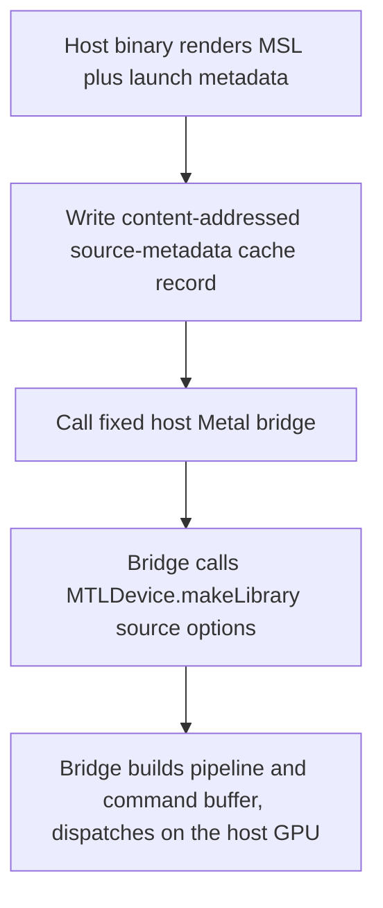

# Apple Metal Headless Builds

**Status**: Authoritative source
**Supersedes**: N/A
**Referenced by**: DEVELOPMENT_PLAN/phase_28_apple_metal_host_daemon.md, DEVELOPMENT_PLAN/substrates.md, DEVELOPMENT_PLAN/system_components.md, documents/documentation_standards.md, documents/engineering/README.md, documents/engineering/cluster_topology_doctrine.md, documents/engineering/image_build_doctrine.md, documents/engineering/service_capability_doctrine.md, documents/engineering/substrate_doctrine.md, documents/illegal_state/illegal_state_topology.md
**Generated sections**: none

> **Purpose**: Single Source of Truth for how the Apple-Metal host worker is **built and run on Apple
> Silicon** — headless, directly on the macOS host, through a **fixed host Metal bridge** with **runtime
> MSL compilation** — and the rationale for the design's **hard no-Tart / no-VM / no-keychain / no-full-Xcode
> / no-per-kernel-Swift-build** commitment. The host substrate that hosts this worker, the no-`PATH`/no-env
> lazy-tool-ensure contract, and the LoadBalancer-by-substrate choice are owned by
> [substrate_doctrine.md](./substrate_doctrine.md); this doc owns only the **Apple build/run shape**.

---

## 1. The commitment: headless, on-host, no VM

The Apple-Metal host worker ([substrate_doctrine.md §5](./substrate_doctrine.md#5-host-worker-nodes-substrate-specific-hardware-that-refuses-to-be-contained))
compiles and executes Metal **in the macOS host process itself** — never inside a VM. Metal needs Apple
Silicon **unified memory**, so it cannot run in a Linux container or a Linux VM; the design's answer is not
a *macOS* VM either, but the host directly. There is exactly one build event and one runtime-compile event,
both on the host:

- **Build-time (once):** a single fixed Objective-C/C **Metal bridge** dylib is source-built on the host
  with the system C compiler at an **absolute path** (`/usr/bin/clang`), then loaded via `dlopen`.
- **Runtime (per kernel):** generated **Metal Shading Language (MSL)** is compiled *in-process* through the
  OS Metal runtime — `MTLDevice.makeLibrary(source:options:)` — and dispatched on the host GPU.

> **Rule:** *A cache miss never starts a VM, invokes SwiftPM, compiles a generated Swift
> package, asks for an Xcode license, or depends on a user login keychain.*



> **Honesty.** This shape is **proven in the sibling jitML project**, whose implemented headless Apple path
> is the authoritative reference (`~/jitML/documents/engineering/apple_silicon_metal_headless_builds.md` —
> closed 2026-06-12 on Apple Silicon with no Tart/SwiftPM/offline-`metal`/Xcode/keychain step on the core
> path). That is **sibling evidence, not an amoebius result**: amoebius has not built its Apple phase
> (Phase 28), so every prescriptive statement below is a **target shape**, not a tested amoebius fact. Status
> and gates live only in [../../DEVELOPMENT_PLAN/README.md](../../DEVELOPMENT_PLAN/README.md), per
> [documentation_standards.md §6](../documentation_standards.md#6-honesty-the-proventestedassumed-discipline).

---

## 2. Requirements the Apple build/run path satisfies

- **No interactive session dependency.** A build or cache miss must work from an SSH session, a daemon
  context, a CI runner, and a `launchd` background service — the host worker runs as a managed subprocess
  ([substrate_doctrine.md §5](./substrate_doctrine.md#5-host-worker-nodes-substrate-specific-hardware-that-refuses-to-be-contained)),
  never an interactive foreground app.
- **No keychain requirement.** No unlocked `login.keychain-db`, Secure Enclave prompt, or
  `security unlock-keychain`. (This is the exact blocker that rules out Tart — [§6](#6-why-tart-is-not-viable-the-no-vm-rationale).)
- **No full-Xcode dependency.** Full Xcode is a GUI app with license/first-run surfaces and large mutable
  host state outside the typed prerequisite boundary; it is not installed by `bootstrap`.
- **No offline `metal` compiler.** The Command Line Tools do not reliably ship `metal`; the core path must
  not require ahead-of-time `.metallib` generation.
- **No per-kernel Swift build.** A cache miss must not materialize a Swift package and invoke
  `swift build` — that turns a *model* cache miss into a *host-toolchain* cache miss.
- **Same-substrate determinism.** The Apple path preserves the determinism contract owned by
  [content_addressing_doctrine.md](./content_addressing_doctrine.md): fast-math **off**, fixed reduction tree,
  single-stream launch ordering — the `experimentHash = sha256(dhall‖substrate)` identity must be honoured
  bit-for-bit on the Apple substrate.

---

## 3. Architecture

### 3.1 Fixed host Metal bridge

There is **one** fixed Objective-C/C Metal bridge per process. It is source-built by the host binary and
loaded before the Apple host worker subscribes to work. The bridge exposes a **stable C ABI** to Haskell
and keeps all Metal API detail out of generated artifacts:

- Built once by the host binary invoking `/usr/bin/clang` **by absolute path** (no `PATH`, no env, per the
  [substrate_doctrine.md §3](./substrate_doctrine.md#3-the-no-environment--no-path-lazy-tool-ensure-contract) lazy-tool-ensure contract), linking the macOS
  `Foundation` and `Metal` frameworks, producing a host-resident dylib; then loaded with `dlopen` and
  verified by resolving an exported probe symbol via `dlsym` before any work is dispatched.
- The bridge owns `MTLCreateSystemDefaultDevice()`, `MTLCompileOptions` with **fast math disabled**,
  `MTLDevice.makeLibrary(source:options:)`, compute-pipeline creation, command queue / buffer / encoder
  construction, input/output/weight buffer allocation, dispatch + `waitUntilCompleted`, and structured
  error capture into a Haskell-facing error buffer.
- The Haskell side owns MSL rendering, content-addressed cache-key derivation, source/metadata cache
  persistence, bridge-prerequisite verification, shape validation, and translation of bridge return codes
  into typed errors.

### 3.2 Host residency

Apple Metal execution is **host-resident** for every Metal-backed workload. The Kubernetes cluster remains
responsible for Pulsar, MinIO, the registry, routing, and orchestration; the host worker reaches in-cluster
MinIO and Pulsar as a **peer over host-only NodePorts** (no mTLS, localhost-only), owned by
[host_cluster_comms_doctrine.md](./host_cluster_comms_doctrine.md). Cluster pods may *orchestrate and
persist* Apple work but **may not execute Apple Metal kernels** — the bridge dylib links macOS
Foundation/Metal and requires a host `MTLDevice`, so mounting the host build tree into a Linux pod does not
make it usable.

### 3.3 Cache format: source metadata, not a dylib

The Apple cache artifact is **content-addressed source metadata** — the rendered MSL plus launch/determinism
metadata — not a compiled dylib. The cache key includes the rendered source, launch metadata, the bridge
ABI version, the Metal runtime policy, and the determinism options. This keeps the Apple compiler input
content-addressed exactly as every other generated compiler input is
([content_addressing_doctrine.md](./content_addressing_doctrine.md)); only the *input kind* changes — MSL
source rather than a Swift package. A first call in a process may pay the runtime compile once and cache the
resulting pipeline **in-process**; the persistent source-metadata cache remains the correctness artifact,
and any `MTLBinaryArchive` is an optional second-level performance cache that must **never** be the source
of truth (fall back to compiling the cached MSL source when it is missing/stale/rejected).

---

## 4. Build and prerequisite model

The headless Apple substrate has these typed prerequisites:

| Prerequisite | Required for | Ensure / verify |
|--------------|--------------|-----------------|
| `apple.metal-runtime` | **Core** execution | Probe `MTLCreateSystemDefaultDevice` and a tiny runtime `makeLibrary(source:)` dispatch. |
| `apple.metal-bridge` | **Core** execution | Build or verify the fixed bridge (`/usr/bin/clang`, absolute path), then `dlopen` + call its probe symbol. |
| `apple.swiftc` | *Optional* non-core Swift lane ([§5](#5-optional-swift-lane-non-core)) | Prefer Homebrew `swift`; verify `swiftc --version` and a Swift + Metal probe compiled with an explicit SDK. |
| `apple.macos-sdk` | *Optional* Swift / ObjC source builds | Verify `xcrun --sdk macosx --show-sdk-path` (or an explicitly configured SDK path). |

The **core** Metal path requires only `apple.metal-runtime` and `apple.metal-bridge`; it does **not** require
`apple.swiftc` on a cache miss. Building the fixed bridge from source at host-bootstrap time is acceptable
(a source-build bootstrap may use an existing SDK); that build-time prerequisite is distinct from a runtime
cache-miss prerequisite, and the running worker must not install tools or wait on toolchain interactions.

---

## 5. Optional Swift lane (non-core)

If host-side Swift parts are ever wanted — future host adapters, diagnostics, or non-kernel Swift
experiments — they are a **separate, non-core capability**, enabled only when `apple.swiftc` **and**
`apple.macos-sdk` pass a real compile-and-load probe. Swift is compiled **headless on-host** via Homebrew
`swiftc` with an **explicit SDK**:

```sh
SDKROOT="$(xcrun --sdk macosx --show-sdk-path)"
/opt/homebrew/opt/swift/bin/swiftc -sdk "$SDKROOT" ...
```

Homebrew Swift is keg-only and cannot import `Darwin`/Apple frameworks without `-sdk`/`SDKROOT` — so
`swiftc` alone is *not* the whole prerequisite; a macOS SDK must also be discoverable. This lane is **never
a VM** and **never** the core cache-miss path: Swift compilation drags host-toolchain discovery, SDK
discovery, Swift-runtime linkage, and build-system behaviour into the critical path, whereas the core Metal
path needs only the OS Metal runtime compiler.

---

## 6. Why Tart is not viable (the no-VM rationale)

Tart (a macOS VM) is superficially attractive because it keeps the full Apple toolchain off the host. In
practice it **violates the headless contract**, which is why the design commits to **no Tart**:

- **The blocker is `Virtualization.framework`, not Unix permissions.** On headless macOS 15+ setups, Tart
  documents that VM startup may require an unlocked `login.keychain`. The observed sibling failure is:

  ```text
  VZErrorDomain Code=-9
  Failed to get current host key
  Failed to create new HostKey
  ```

  This is user-session keychain state. Running under `sudo` **changes** the problem rather than solving it
  (root has a different environment, keychains, and VM store). Unlocking or replacing the login keychain can
  make one machine work, but it is not a reliable daemon prerequisite and is unacceptable for a cache miss.
- **A VM makes every first compile depend on VM lifecycle health** — guest boot, guest-agent readiness,
  shared-mount behaviour, resource sizing, host security state — far too many moving parts for a JIT miss.
- **A VM build lane is an extra unowned surface.** amoebius's no-`PATH`/no-env, lazy-tool-ensure host
  contract ([substrate_doctrine.md §3](./substrate_doctrine.md#3-the-no-environment--no-path-lazy-tool-ensure-contract)) already discovers `/usr/bin/clang` and the
  OS Metal runtime by absolute path; a Tart VM would add a whole second host-security/VM-lifecycle surface
  the contract would have to own, for zero benefit over building on the host directly.

> **Honesty.** The `VZErrorDomain Code=-9 / HostKey` evidence is a **jitML sibling result**
> (`~/jitML/documents/engineering/apple_silicon_metal_headless_builds.md`, "Why Tart Is Not Viable"), not an
> amoebius measurement. amoebius adopts the conclusion by design; the sibling `infernix` library likewise
> **removed** its own legacy Tart path in favour of this headless materialization approach. There is no
> amoebius Tart code, and none is planned.

**Full Xcode and offline `.metallib` are ruled out for the same reason** — full Xcode is GUI/license/first-run
state and tempts the architecture back toward ahead-of-time `.metallib`, and the offline `metal` compiler is
not reliably present (`xcrun -find metal` fails on a clean host). Runtime source compilation through
`MTLDevice.makeLibrary(source:options:)` is the headless primitive that exists on the target OS and target
GPU, and it compiles for the *actual* device that will execute the kernel.

---

## 7. Planning ownership

This document is normative Apple-build/run doctrine only. Delivery sequencing, completion status, and
validation gates are owned by [../../DEVELOPMENT_PLAN/README.md](../../DEVELOPMENT_PLAN/README.md): the
headless fixed-Metal-bridge build + the native Apple-Metal host worker land in **Phase 28** (`apple`), whose
gate ([phase_28_apple_metal_host_daemon.md](../../DEVELOPMENT_PLAN/phase_28_apple_metal_host_daemon.md)) brings up
the Apple cluster on Lima, builds the worker **headless on-host via the fixed bridge**, and dispatches a
Metal inference job over Pulsar. This doc never maintains a competing status ledger; it states the target
shape and links back for status, per [documentation_standards.md §6](../documentation_standards.md#6-honesty-the-proventestedassumed-discipline).

---

## Cross-references

- [Engineering Doctrine Index](./README.md)
- [Substrate Doctrine](./substrate_doctrine.md)
- [Cluster Topology Doctrine](./cluster_topology_doctrine.md) — the distinct "no VM for Metal *builds*" vs "an rke2/kind *cluster* on apple needs a Lima Linux VM" split
- [Image Build Doctrine](./image_build_doctrine.md)
- [Host ↔ Cluster Comms Doctrine](./host_cluster_comms_doctrine.md)
- [Content Addressing Doctrine](./content_addressing_doctrine.md)
- [Phase 28 — Apple-Metal host daemon](../../DEVELOPMENT_PLAN/phase_28_apple_metal_host_daemon.md)
- [Development Plan](../../DEVELOPMENT_PLAN/README.md)
- [Documentation Standards](../documentation_standards.md)
- External sibling provenance: `~/jitML/documents/engineering/apple_silicon_metal_headless_builds.md` (the
  implemented, proven headless Apple Metal JIT path this doctrine mirrors)
