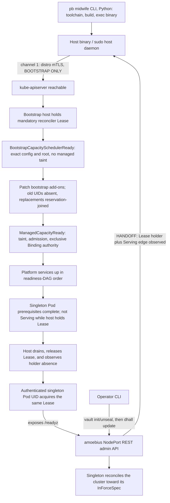

# The Bootstrap Sequence & the Admin Control Plane

**Status**: Authoritative source
**Supersedes**: N/A
**Referenced by**: DEVELOPMENT_PLAN/phase_14_midwife_bootstrap_kind.md, DEVELOPMENT_PLAN/system_components.md, documents/engineering/README.md, documents/engineering/cluster_lifecycle_doctrine.md, documents/engineering/daemon_topology_doctrine.md, documents/engineering/host_cluster_comms_doctrine.md, documents/engineering/monitoring_doctrine.md, documents/engineering/network_fabric_doctrine.md, documents/engineering/readiness_ordering_doctrine.md, documents/engineering/substrate_doctrine.md, documents/engineering/tenancy_doctrine.md, documents/engineering/testing_doctrine.md, documents/engineering/vault_pki_doctrine.md, documents/illegal_state/illegal_state_security.md, documents/illegal_state/illegal_state_techniques.md
**Generated sections**: none

> **Purpose**: Single Source of Truth for the ordered path from a bare host to a reconciling cluster — the
> host-daemon→singleton handoff — and for the **admin control plane** that takes over at handoff: after
> bootstrap the operator CLI drives the cluster **exclusively through the amoebius NodePort REST service on
> the in-cluster singleton** (`vault init/unseal`, `dhall update`), never by touching kube-apiserver again.

---

## 1. Why this doctrine exists

Two questions in the vision are left unowned by the docs that touch them:

> *"when the host daemon is bootstrapping a cluster, what is the exact sequence, and handoff of control to
> the cluster daemon?"* — and — *"how does a new `.dhall` get implemented or unlock keys provided in the root
> node? does the project binary provide a thin cli tool to interact with the amoebius daemon api?"*

The bring-up *pieces* exist — the midwife CLI ([`substrate_doctrine.md` §6](./substrate_doctrine.md#6-the-midwife-contract-a-python-cli-ensures-a-toolchain-builds-the-binary-hands-off)),
"init follows readiness" ([`cluster_lifecycle_doctrine.md` §2](./cluster_lifecycle_doctrine.md#2-bring-up-and-bootstrap)),
the "midwife, not the brain" host daemon ([`daemon_topology_doctrine.md` §2](./daemon_topology_doctrine.md#2-context--role-an-orthogonal-grid)),
Vault init/unseal ([`vault_pki_doctrine.md` §4](./vault_pki_doctrine.md#4-init-follows-readiness-fail-closed-vault-init)),
and the handoff *trigger* ([`readiness_ordering_doctrine.md` §5](./readiness_ordering_doctrine.md#5-the-bootstrap-tier-local-observed-witnesses-never-timers))
— but the **ordered sequence** was derivable-across-five-docs, never written, and the **admin control plane**
the handoff hands *to* did not exist in doctrine at all. This doc owns both: the sequence ([§3](#3-the-ordered-bootstrap-sequence)),
the handoff mechanics ([§4](#4-the-host-daemon--singleton-handoff)), and the admin REST surface ([§5](#5-the-admin-control-plane-the-cli--the-singleton-rest-api)).
It resolves `notes.txt` lines 27/31/33.

---

## 2. Two régimes: host-driven bootstrap, then singleton-driven steady state

A cluster's life has **two régimes with a single, one-way handoff between
them**, and *who may touch the cluster's control surface* differs across them:

- **Bootstrap régime — the host binary drives.** Before an in-cluster brain exists, the sudo host daemon is
  the only actor that can stand the cluster up. It talks to `kube-apiserver` directly over the distro's
  default mTLS — **channel 1** of [`host_cluster_comms_doctrine.md` §4](./host_cluster_comms_doctrine.md#4-channel-1--the-host-binary--kube-apiserver-via-distro-mtls)
  — to install the distro, acquire the mandatory reconciler Lease under its bootstrap-holder identity, apply
  the capacity-scheduler cutover and platform manifests, and bring up the in-cluster singleton. It is the
  *midwife*, acting on behalf of the future singleton ([`daemon_topology_doctrine.md` §2](./daemon_topology_doctrine.md#2-context--role-an-orthogonal-grid)).
- **Steady-state régime — the singleton drives.** Once the platform services **and** the
  control-plane singleton are up, the bootstrap holder has been observed released, and the singleton is the
  observed holder of that same mandatory Lease, the host binary **defers**. From that instant — *even before
  Vault is initialised* — every operator interaction flows through the **admin control plane**
  ([§5](#5-the-admin-control-plane-the-cli--the-singleton-rest-api)): the operator CLI → the amoebius NodePort
  REST service → the singleton. **Channel 1 is bootstrap-only**; the host binary does not resume direct
  kube-apiserver control after handoff.

This is the shape the vision specified: *"the host binary only directly interacts with the cluster and
k8s control plane during initial bootstrap … once all services are up (even before vault init) all further
interactions occur through the [amoebius] NodePort."* The one-way handoff is [§4](#4-the-host-daemon--singleton-handoff).

---

## 3. The ordered bootstrap sequence

The sequence is a [`readiness_ordering_doctrine.md`](./readiness_ordering_doctrine.md) DAG — **every edge is
an observed condition, never an elapsed wait** — enacted by the reconciler
([`cluster_lifecycle_doctrine.md` §9](./cluster_lifecycle_doctrine.md#9-how-bring-up-and-teardown-are-implemented-the-reconciler-not-a-state-machine)).
The ordered steps, each gated on the prior step's readiness:

1. **The midwife CLI** (`pb bootstrap`) ensures the toolchain, builds the binary, and `exec`s `amoebius
   bootstrap --distro={kind,rke2}` ([`substrate_doctrine.md` §6](./substrate_doctrine.md#6-the-midwife-contract-a-python-cli-ensures-a-toolchain-builds-the-binary-hands-off)).
2. **The host daemon brings up the distro** — the zero-secret single-node root (`kind`, or
   `Rke2Servers.Single`) — and waits on `discover = Present` for `kube-apiserver` (a successful mTLS call,
   not a timer; [`readiness_ordering_doctrine.md` §5](./readiness_ordering_doctrine.md#5-the-bootstrap-tier-local-observed-witnesses-never-timers)).
3. **The host becomes the bootstrap reconciler holder.** The cold-start capability can create only the
   derived control-plane Namespace and deployment-global mandatory Kubernetes `Lease`, then acquire that
   Lease under the exact bootstrap-host identity. No scheduler, platform, or workload mutation capability
   exists until the held identity/resourceVersion is read back. Namespace/Lease creation,
   bounded renewals, release, and the later singleton acquisition are all included in the provisioned
   API/etcd/churn demand; failure or ambiguous ownership refuses mutation.
4. **The capacity scheduler reaches bootstrap readiness.** A scheduler-system-only capability creates the
   derived `amoebius-capacity-scheduler` namespace, its exact `ResourceQuota pods=1`, scheduler
   Deployment/config/root/CRD, and restricted add-on-cutover RBAC. The sole default-scheduled scheduler Pod has
   unique-node affinity, a static reservation, and the preloaded amoebius image, so it does not wait on the
   registry unit it must cut over. A fresh readback of its exact active generation, config
   digest, root resourceVersion, and Pod readiness mints `BootstrapCapacitySchedulerReady`. The managed taint
   and general workload authority do not exist yet.
5. **Every pre-existing bootstrap add-on is cut over.** The bootstrap-readiness token can patch only the
   finite observed add-on/controller set (including distro add-ons and any pre-SSA bootstrap registry units)
   to `schedulerName=amoebius-capacity`. Bootstrap waits until each old default-scheduled UID is absent with
   its release partition observed and each replacement UID is reservation-joined and Ready. No general
   workload action is available during this interval.
6. **Full managed-capacity authority becomes Ready.** Only after the cutover equality witness exists does
   bootstrap install the managed-node taint, identity admission, and full exclusive Binding RBAC, revoke the
   restricted cutover capability, and independently read back the exact writer domain.
   `ManagedCapacityReady` is the sole continuation for platform/workload controllers; the scheduler Pod is now
   the only default-scheduler exception.
7. **Platform services come up** in the derived bring-up DAG order — MinIO → registry, LB → edge, everything
   Vault-sealed for now ([`platform_services_doctrine.md` §11](./platform_services_doctrine.md#11-bring-up-and-dependency-ordering)),
   applied by the tier-(c) SSA reconciler only from `ManagedCapacityReady`
   ([`manifest_generation_doctrine.md` §5](./manifest_generation_doctrine.md#5-the-applyreconcile-engine-snapshot-bound-typed-actions)).
8. **The control-plane singleton Pod completes prerequisites while the host still holds the Lease**
   ([`daemon_topology_doctrine.md` §3](./daemon_topology_doctrine.md#3-the-control-plane-singleton)). It may not
   mutate cluster state or report `/readyz` Serving yet. The host then quiesces its effect loop, proves no
   in-flight action capability remains, releases the Lease, and freshly observes its holder absent/released.
   Only then may the authenticated singleton Pod UID acquire that same Lease. Its held-Lease readback plus
   `/readyz` Serving edge is the **handoff point** ([§4](#4-the-host-daemon--singleton-handoff)) and exposes the
   admin REST service ([§5](#5-the-admin-control-plane-the-cli--the-singleton-rest-api)).
9. **The operator initialises/unseals Vault through the admin REST** — `vault init/unseal`, authenticated by
   the operator password; init-once / unseal-on-rebuild ([`vault_pki_doctrine.md` §4](./vault_pki_doctrine.md#4-init-follows-readiness-fail-closed-vault-init),
   [§5](./vault_pki_doctrine.md#5-the-root-cluster-single-node-password-encrypted-unseal)). No secret consumer ran before this — Vault fails closed until unsealed.
10. **The operator delivers the `InForceSpec`** — `dhall update` (requires an **unsealed Vault + root token**,
    [§5](#5-the-admin-control-plane-the-cli--the-singleton-rest-api)) — the spec delivery of
    [`vault_pki_doctrine.md` §4](./vault_pki_doctrine.md#4-init-follows-readiness-fail-closed-vault-init). The singleton decrypts it in-process and reconciles the cluster toward it.

This is the **root** bootstrap; a *child* cluster is spawned by a parent (the Pulumi handoff,
[`cluster_lifecycle_doctrine.md` §3](./cluster_lifecycle_doctrine.md#3-amoebic-spawning--the-recursive-forest)),
which injects the child's scoped `InForceSpec` + secrets rather than prompting a human. This ordered sequence **retires
the open question** [`cluster_lifecycle_doctrine.md` §2](./cluster_lifecycle_doctrine.md#2-bring-up-and-bootstrap)
recorded (bootstrap config / first-manifest delivery): the first operator-supplied manifest is delivered by step 10's `dhall
update`, and the transient bootstrap config is the binary-sibling `amoebius.dhall` the midwife establishes.

---

## 4. The host-daemon → singleton handoff

The handoff is **one-way, observed-gated, and transfers control-surface authority only**:

- **The trigger is a Lease-holder transition plus a Serving edge, never a delay.** The host initially owns the
  deployment-global mandatory reconciler `Lease` as the authenticated bootstrap holder. It may create the
  singleton Deployment while holding it, but the Pod cannot mutate or report ready. Handoff requires this
  exact sequence: stop minting new host action capabilities; drain every in-flight action; release the Lease;
  freshly observe the bootstrap holder absent/released at a new resourceVersion; observe the authenticated
  singleton Pod UID acquire that same Lease; then observe singleton **`/readyz` (`Serving`)**. These are the
  gates owned by [`readiness_ordering_doctrine.md` §5](./readiness_ordering_doctrine.md#5-the-bootstrap-tier-local-observed-witnesses-never-timers).
  Never "sleep, then assume the pod is up." Kubernetes/etcd supplies Lease exclusion; there is no amoebius
  election commit or second coordination protocol.
- **No overlap, no ownership gap disguised as success.** Audit/watch history must show at most one holder at
  every observed resourceVersion, zero cluster mutations by the waiting singleton, and zero host mutations
  after release. A timeout, watch gap, unknown holder, stale Pod UID, reacquisition by the bootstrap identity,
  or concurrent renewal leaves handoff incomplete and `/readyz` false. Lease object bytes, creation,
  renewals, release, singleton acquisition, retries, and replacement-Pod churn are part of the provisioned
  API/etcd capacity rather than an uncharged control-plane side effect.
- **What transfers: the cluster control surface.** After handoff, amoebius-level control (Vault
  init/unseal, spec delivery, reconcile triggers) is the **singleton's** sole authority
  ([`daemon_topology_doctrine.md` §3](./daemon_topology_doctrine.md#3-the-control-plane-singleton)),
  reached only through the admin REST ([§5](#5-the-admin-control-plane-the-cli--the-singleton-rest-api)).
  Channel 1 (host binary ↔ kube-apiserver) is **retired** — a bootstrap-only privilege.
- **What does *not* transfer: host-worker supervision.** The sudo host daemon keeps supervising host-level
  worker subprocesses (Apple-Metal / Windows-CUDA inference), which remain Pulsar/MinIO peers on **channel
  2** ([`host_cluster_comms_doctrine.md` §3](./host_cluster_comms_doctrine.md#3-there-is-no-bespoke-control-channel--coordination-is-pulsar--minio)).
  "Midwife then defers" is about the *control* surface, not the host daemon's whole existence.
- **Re-running is a no-op.** Because bring-up is a reconcile
  ([`cluster_lifecycle_doctrine.md` §9](./cluster_lifecycle_doctrine.md#9-how-bring-up-and-teardown-are-implemented-the-reconciler-not-a-state-machine)),
  a crash before release re-enters as the bootstrap holder and re-observes its exact state; a crash after
  singleton acquisition sees the in-cluster holder and cannot reacquire. A handoff already done is observed
  and skipped. Race tests must cover simultaneous acquire, stale resourceVersion, lost release response,
  bootstrap crash before/after release, singleton crash before/after acquire, and replacement-Pod UID churn.

---

## 5. The admin control plane: the CLI ↔ the singleton REST API

After handoff, the operator drives the cluster through **one surface**: the operator CLI (`pb`) → the
**amoebius NodePort service** → a **REST API on the in-cluster singleton**. This is the vision's *"thin cli
tool [that] interact[s] with the amoebius daemon api"* — and the answer is a typed REST control plane, not a
second binary.

- **The endpoints.** The load-bearing ones:
  - **`vault init/unseal`** — authenticated by the **operator password** (Argon2id→AEAD unlock material,
    [`vault_pki_doctrine.md` §5](./vault_pki_doctrine.md#5-the-root-cluster-single-node-password-encrypted-unseal));
    this is the concrete channel that fills the *pluggable pre-Vault unseal seam* that doctrine explicitly
    left open. The operator password crosses CLI → NodePort → singleton and is never persisted.
  - **`dhall update`** — deliver a new `InForceSpec` to a running cluster. It **requires an unsealed Vault
    and a root token**; the singleton decrypts/stores the envelope in-process
    ([`vault_pki_doctrine.md` §4](./vault_pki_doctrine.md#4-init-follows-readiness-fail-closed-vault-init))
    and reconciles toward it. This is how a new desired-state Dhall value reaches an already-running root — the operator flow
    the reconcile mechanics ([`daemon_topology_doctrine.md` §6](./daemon_topology_doctrine.md#6-the-shared-daemon-spine) hot-reload) only hinted at.
  - **`kv put/get/list/delete` — secret KV-CRUD.** The operator CRUDs Vault KV secrets **by name** over the same
    admin REST (requires an unsealed Vault and the root token). This is how a production `InForceSpec`'s named
    `SecretRef`s come to *exist in Vault before the `.dhall` is uploaded*: secret material crosses
    CLI → NodePort → singleton **by value here** and is stored enveloped, while the `.dhall` itself never carries
    a value, only the name ([`dsl_doctrine.md` §6](./dsl_doctrine.md#6-secrets-are-names-never-values),
    [`vault_pki_doctrine.md` §3](./vault_pki_doctrine.md#3-the-secretref-contract-a-name-never-a-value)). `dhall
    update` then **actively proves each named secret before admitting the upload, and rejects fail-fast
    otherwise**: the secret must exist in Vault, and its *capability* must hold against what the spec demands —
    an SSH key must connect to each static host the spec names and that host's declared CPU, memory,
    pod-ephemeral/durable/native-cache pools, accelerator device vector, and per-device memory must match
    observation; an AWS credential must carry the IAM permissions and the compute/storage/accelerator quotas
    to provision what the spec declares. An absent secret, an SSH key that cannot connect, a host short of its declared resources,
    or a cloud credential lacking permission or quota is **rejected at upload, before any reconcile**. This is a
    **runtime-checked** admission gate — it reaches real hosts and cloud APIs — honest about its layer: a name's
    *existence* is a decode-time check, but a name's *capability* is proven live at `dhall update`. In tests
    this operator interaction is *simulated* from
    a single flagged `test-secrets.dhall`, the only place secret values live at rest
    ([`testing_doctrine.md` §6](./testing_doctrine.md#6-flagged-test-credentials)).
- **This is the admin plane, distinct from the workload plane.** [`host_cluster_comms_doctrine.md` §3](./host_cluster_comms_doctrine.md#3-there-is-no-bespoke-control-channel--coordination-is-pulsar--minio)'s
  "no bespoke control channel — coordination *is* Pulsar + MinIO" governs the **worker/workload** plane (host
  compute daemons + the host binary *coordinating* with workers). It is **not** an admin-plane rule: operator
  administration of the cluster's own configuration is a *control* concern, not worker coordination, and rides
  this REST channel. That doc's scope is clarified accordingly; this doc owns the admin channel.
- **Privileged, not wild — so not a Keycloak bypass.** The admin REST is authenticated (operator password →
  then root token + unsealed Vault) and **network-restricted to the operator's trusted reach**, never the
  wild LB→Envoy→Keycloak door ([`platform_services_doctrine.md` §9](./platform_services_doctrine.md#9-the-loadbalancer-and-the-single-wild-ingress-path)).
  Like channel 1, it is a privileged operator path, not wild ingress — so "Keycloak owns all *wild* ingress"
  is untouched.
- **The admin-plane reach class — this doc owns it.** The admin NodePort's reach is **regime-split**, and the
  split is load-bearing because the endpoint fronts `vault init/unseal`. This is *not* the channel-2 loopback
  NodePort ([`host_cluster_comms_doctrine.md` §6](./host_cluster_comms_doctrine.md#6-the-host-only-restriction-in-practice-and-its-sibling-precedent), the host-daemon↔Pulsar/MinIO wire); it is the distinct admin channel this doc owns.
  - **Seal-critical operations** — `vault init/unseal`, including every reboot's unseal ([`vault_pki_doctrine.md` §5](./vault_pki_doctrine.md#5-the-root-cluster-single-node-password-encrypted-unseal)) — are reached
    **node-local only**: the root operator drives them from the host that *is* the single node, and a parent
    reaches a child over the floor channel below. This reach is **Vault-independent by construction** — it
    needs no fabric, no gateway, and no secret from the very Vault it is about to unseal.
  - **Post-unseal admin** — `dhall update`, KV-CRUD — *may additionally* be reached over the **authenticated
    WireGuard fabric** once it exists (the same network-restriction pattern channel 2 reuses,
    [`host_cluster_comms_doctrine.md` §5.1](./host_cluster_comms_doctrine.md#51-the-generalization-localhost-or-the-authenticated-wireguard-fabric); the fabric itself owned by [`network_fabric_doctrine.md`](./network_fabric_doctrine.md)).
  - **Unseal is never over the fabric.** The fabric's peer keys are Vault-KV
    ([`vault_pki_doctrine.md` §3.1](./vault_pki_doctrine.md#31-the-parent-custody-kv-secret-family-ssh-keys-wireguard-keys-and-the-rke2nodetoken)), so a fabric reach presupposes an *unsealed* Vault; routing unseal over it
    would be circular. The seal-critical reach therefore stays node-local, whose transport trust before the
    root PKI anchor exists rides the chicken-and-egg floor
    ([`vault_pki_doctrine.md` §10](./vault_pki_doctrine.md#10-the-chicken-and-egg-floor-what-stays-outside-vault)).
- **A parent reaches a child's admin REST over the floor channel — the `ParentReachChannel`.** After a child is
  spawned, its parent delivers each subsequent `ChildInForceSpec`, and drives the child's own
  `vault init/unseal`, through the child's admin REST — reached by a typed **`ParentReachChannel` projected from
  the child's `ComputeEngine`**, never free-authored:
  `ParentReachChannel = < SelfManagedSsh SshKeyRef | ManagedApi CloudCredRef | Fabric ApiserverVpnIp >`. For a
  self-managed child the parent gets onto a child node over the SSH key it provisioned it with; for a managed
  (EKS) child it uses the cloud-cred managed-apiserver access it *created* the cluster with; either way it then
  hits the child's **node-local** admin NodePort — never the child's public gateway, and **independent of the
  child's gateway/vpn/mesh state** (those are configured *by* the spec it delivers). The `Fabric` arm (the
  role-bound apiserver VPN-IP, [`network_fabric_doctrine.md` §4](./network_fabric_doctrine.md#4-topology-the-hub-is-the-gateway-role-and-the-fabric-moves-with-it)) is an **optional optimization once the mesh exists,
  never the floor**. Because every forest node's `ParentReachChannel` is projected from its provisioning
  method, **"a child its parent cannot reach" has no inhabitant** (type-foreclosed). A mode-(b) child's
  unseal-authority reach to its parent rides this same floor channel
  ([`vault_pki_doctrine.md` §6](./vault_pki_doctrine.md#6-parentchild-unseal-two-sanctioned-modes)), never the data-plane fabric — the fabric it would need is itself gated on the very
  unseal it is trying to perform.

---

## 6. What this forecloses, and the honest limits

The admin plane is a place to make illegal control actions **unrepresentable**, on the catalog's
[three layers](../illegal_state/illegal_state_techniques.md#6-three-layers-of-foreclosure-and-the-honesty-they-force):

- **A `dhall update` without an unsealed Vault + root token has no constructor** — the mutation is
  `type-foreclosed`: its handle is built only *from* a `RootToken` capability and an `Unsealed` witness
  ([`illegal_state_catalog.md` §3.42](../illegal_state/illegal_state_security.md#342-an-admin-mutation-without-a-root-token-capability--an-unsealed-vault-witness),
  the same capability + `.ready`-style edge discipline as the `PromotionGate` and the `Readiness` edge).
- **An admin action bypassing the singleton is unrepresentable** by construction: post-handoff there is no
  exported channel-1 verb; the only control-surface constructor is an admin-REST call.
- **The honest limit** ([`illegal_state_catalog.md` §2](../illegal_state/illegal_state_catalog.md#2-the-load-bearing-limit-a-type-check-proves-the-spec-composes-not-that-the-cluster-enforces-it)):
  the type forecloses the *shape* of the control surface; that the singleton *actually* holds sole authority
  at runtime (single-writer, no split-brain admin) is `runtime-checked`, owned by the election safety of
  [`daemon_topology_doctrine.md` §5](./daemon_topology_doctrine.md#5-single-instance-and-coordination--delegated-not-elected)
  and [`chaos_failover_doctrine.md`](./chaos_failover_doctrine.md).

**Still open (deliberately, scoped narrower by this doc):** whether the **root may ever be multi-node**
(unchanged from [`cluster_lifecycle_doctrine.md` §2](./cluster_lifecycle_doctrine.md#2-bring-up-and-bootstrap)) —
this doc specifies the single-node-root answer the plan adopts and does not settle the multi-node question.

---

## 7. Planning ownership

This document is normative bootstrap-sequence + admin-control-plane doctrine only. Delivery sequencing,
status, and gates are owned by [`../../DEVELOPMENT_PLAN/README.md`](../../DEVELOPMENT_PLAN/README.md), never
restated here. For orientation only (the plan is authoritative): the **ordered sequence + host→singleton
handoff** ride **Phases 10 and 13** (kernel + bootstrap + kind); the **`vault init/unseal` admin endpoint** rides
**Phase 18** (root Vault/PKI); the **`dhall update` endpoint + the singleton REST surface** ride
**Phase 22** (the control-plane singleton). This doc states the target shape and links back for status.

> **Honesty.** Everything here is Phase 0 design intent, specified before implementation. The "midwife then
> defers" host-daemon model and the reconcile-driven bring-up are *proven in the prodbox / hostbootstrap
> siblings* and inherited as evidence, not a tested amoebius result
> ([documentation_standards.md §6](../documentation_standards.md#6-honesty-the-proventestedassumed-discipline)).

---

## Cross-references

- [Engineering Doctrine Index](./README.md)
- [Cluster Lifecycle Doctrine](./cluster_lifecycle_doctrine.md) — [§2](./cluster_lifecycle_doctrine.md#2-bring-up-and-bootstrap) the bring-up this sequences (its open question retired here), [§9](./cluster_lifecycle_doctrine.md#9-how-bring-up-and-teardown-are-implemented-the-reconciler-not-a-state-machine) the reconciler that enacts each edge
- [Daemon Topology Doctrine](./daemon_topology_doctrine.md) — [§2](./daemon_topology_doctrine.md#2-context--role-an-orthogonal-grid) midwife-then-defers, [§3](./daemon_topology_doctrine.md#3-the-control-plane-singleton) the singleton that exposes the admin REST
- [Vault / PKI Doctrine](./vault_pki_doctrine.md) — [§4](./vault_pki_doctrine.md#4-init-follows-readiness-fail-closed-vault-init) init-follows-readiness, [§5](./vault_pki_doctrine.md#5-the-root-cluster-single-node-password-encrypted-unseal) the operator-password unseal the admin endpoint carries, [§10](./vault_pki_doctrine.md#10-the-chicken-and-egg-floor-what-stays-outside-vault) the pre-Vault trust floor
- [Host ↔ Cluster Comms Doctrine](./host_cluster_comms_doctrine.md) — [§3](./host_cluster_comms_doctrine.md#3-there-is-no-bespoke-control-channel--coordination-is-pulsar--minio) the workload-plane rule this admin plane is distinct from; [§4](./host_cluster_comms_doctrine.md#4-channel-1--the-host-binary--kube-apiserver-via-distro-mtls) channel 1 (bootstrap-only)
- [Readiness Ordering Doctrine](./readiness_ordering_doctrine.md) — [§5](./readiness_ordering_doctrine.md#5-the-bootstrap-tier-local-observed-witnesses-never-timers) the handoff trigger (`/readyz` Serving + the `Committed` readiness edge; single-instance is delegated to k8s/etcd, so there is no election commit to await)
- [Substrate Doctrine](./substrate_doctrine.md) — [§6](./substrate_doctrine.md#6-the-midwife-contract-a-python-cli-ensures-a-toolchain-builds-the-binary-hands-off) the midwife CLI igniter
- [Platform Services Doctrine](./platform_services_doctrine.md) — [§11](./platform_services_doctrine.md#11-bring-up-and-dependency-ordering) the derived platform bring-up DAG
- [Illegal State Catalog](../illegal_state/illegal_state_catalog.md) — [§3.42](../illegal_state/illegal_state_security.md#342-an-admin-mutation-without-a-root-token-capability--an-unsealed-vault-witness) an unauthenticated admin mutation foreclosed
- [Development Plan](../../DEVELOPMENT_PLAN/README.md)
- [Documentation Standards](../documentation_standards.md)
