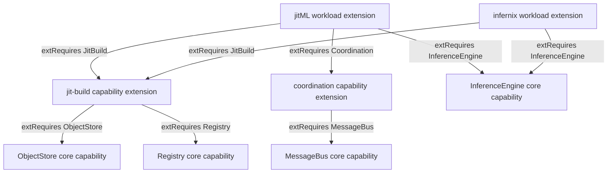

# The Capability-Extension Graph

**Status**: Authoritative source
**Supersedes**: N/A
**Referenced by**: documents/engineering/README.md
**Generated sections**: none

> **Purpose**: Single source of truth for the amoebius capability-extension graph — how a linked
> `ExtensionSpec` declares what it PROVIDES (`extCapabilities`) and REQUIRES (`extRequires`), how the two
> capability-extension kinds the vendored ML libraries consume (`jit-build`, `coordination`) plug in, and how
> the closed extension set merges into one binary by a total, acyclic, anti-shadow merge.

---

## 1. Why this doctrine exists

A vendored ML library rarely stands alone: `jitML` needs the shared build/cache resolver and the
single-writer primitives its Feed-sourced trainer runs on, and `infernix` needs the same resolver. Composing
those shared concerns admits three classes of defect that surface only at link time or at runtime. First, a
**duplicated horizontal concern** — one copy of the resolver and one `CacheBudget`-bounded cache *per* library —
so the same engine materializes twice and the capacity fold double-counts a single host's cache
([content_addressing_doctrine.md §4.5](./content_addressing_doctrine.md#45-the-ml-asset-lifecycle-one-bounded-content-addressed-cache-resolved-on-first-miss)).
Second, **silent shadowing** — two libraries define the same id or constructor and one wins with no diagnostic.
Third, a **broken dependency** — a required capability with no provider, or a requirement cycle, that deadlocks
the merge exactly when the binary is assembled.

The tempting industry-default is **extensions-of-extensions**: nest the resolver inside the library that uses
it. That approach duplicates the `InForceSpec`'s own composition machinery ([dsl_doctrine.md §4](./dsl_doctrine.md#4-total-composability))
and breaks DRY — a `jit-build` nested inside `jitML` is unreachable by `infernix`, forcing a second copy — and a
containment hierarchy cannot express one shared, single-owned resolver at all. A runtime plugin surface
(`dlopen`, per-extension image) is the other default; it cannot be checked before it runs, so a missing
requirement or a collision is a production failure, not a compile error.

Amoebius wires extensions as **flat peers in one linked binary along a typed acyclic PROVIDE/REQUIRE capability
graph.** Each `ExtensionSpec` declares `extCapabilities` (what it PROVIDES into the capability surface) and
`extRequires` (what it CONSUMES from a peer extension or the core), and the closed extension set merges into one
binary by a merge that is **total** (every required capability is provided), **acyclic** (no requirement cycle),
and **anti-shadow** (no two extensions share an id or constructor). A cycle, a missing requirement, or a
shadowed id has **no inhabitant** — the merge decode-rejects rather than producing a binary.

This forecloses several freedoms deliberately: extensions cannot form a hierarchy (no containment, no
extension-of-an-extension); an extension cannot privately own a capability a peer needs; there is no runtime
plugin path; and the vendored workload set cannot silently grow — it stays **closed at `{infernix, jitML}`**
([dsl_doctrine.md §4](./dsl_doctrine.md#4-total-composability)). The residual limit is stated honestly ([§6](#6-the-merge-total-acyclic-anti-shadow)):
the graph checks are author/link-time properties; that a provided capability's *running provider* actually comes
up is runtime residue, not a decode-time claim.

---

## 2. Two extension kinds: workload and capability

Every extension is **linked, not loaded** — Path 1 of the extension taxonomy, merged into the one binary at
compile/link time, owned by [dsl_doctrine.md §4](./dsl_doctrine.md#4-total-composability). Within that one linked
set, amoebius distinguishes two kinds, and both are flat peers:

| Kind | Members (v1) | What it is |
|---|---|---|
| **Workload extension** | `infernix`, `jitML` | A vendored ML library that presents a workload (LLM inference; training + JIT codegen). This is the closed v1 set. |
| **Capability extension** | `jit-build`, `coordination` | A single-owner horizontal concern, factored out so its install/build/cache and coordinator logic is authored **once** and consumed by many workloads. |

The **vendored workload set is closed at `{infernix, jitML}`** and this doctrine does not expand it — that
closure is owned by [dsl_doctrine.md §4](./dsl_doctrine.md#4-total-composability). What this doctrine *adds* is the
**capability-extension tier** and the graph edges that wire the two kinds together. The full linked set is
therefore the two workload extensions plus the two capability-extensions, all peers, all merged by [§6](#6-the-merge-total-acyclic-anti-shadow).

A capability-extension is a **packaging choice, not a mandate**: `jit-build` and `coordination` could equally be
core capabilities. The doctrine models them as capability-extensions because that makes **single-ownership** and
the **PROVIDE/REQUIRE** relationship explicit — one owner for the resolver, one owner for the coordinator seam,
wired by the same graph every other extension is wired by.

---

## 3. The PROVIDE and REQUIRE contract

[dsl_doctrine.md §4](./dsl_doctrine.md#4-total-composability) owns the `ExtensionSpec` seam itself — `extDhall`,
`extChain :: cfg -> [Step]`, `extCapabilities`, and the mandatory `extMonitoring` — and the fact that specs are
merged at compile/link time into one binary. This doctrine owns one addition to that contract: extending the
capability declaration from **export-only** to **PROVIDE + REQUIRE**.

    ExtensionSpec :
      { extDhall        : <a typed Dhall sub-catalog nested inside the InForceSpec>   -- dsl §4
      , extChain        : cfg -> [Step]                                                -- dsl §4
      , extCapabilities : List Capability     -- PROVIDES: exported into the capability surface
      , extRequires     : List Capability     -- REQUIRES: consumed from a peer extension or the core (new)
      , extMonitoring   : NonEmpty MonitoringSurface                                   -- dsl §4
      }

- **`extCapabilities` is PROVIDES.** An extension exports each listed capability into the capability surface
  owned by [service_capability_doctrine.md](./service_capability_doctrine.md). For a workload extension this is
  the capability it stands up (e.g. `infernix` provides `InferenceEngine`,
  [service_capability_doctrine.md §4.1](./service_capability_doctrine.md#41-the-inferenceengine-capability--the-engine-is-substrate-selected-and-jit-resolved-never-authored));
  for a capability-extension it is the horizontal concern it owns.
- **`extRequires` is REQUIRES.** An extension names the capabilities it consumes from another linked extension or
  from the core. This is the edge set of the graph: `extRequires` is *what makes an extension depend on a peer*,
  and it is exactly what [§6](#6-the-merge-total-acyclic-anti-shadow)'s merge checks for totality and acyclicity.

A PROVIDE lands in the capability surface as an **extension-provided capability**, a provenance distinct from the
fixed core set. The core capability set application logic may name — `ObjectStore`, `MessageBus`, `Sql`,
`Identity`, and the rest — is closed with no "some other service" arm
([service_capability_doctrine.md §2](./service_capability_doctrine.md#2-the-capability-set)); an
extension-provided capability (`JitBuild`, `Coordination`) does **not** reopen that arm, because it is consumed
**only through a peer's `extRequires` at link time**, never authored by an app spec as a free service. The
closure application logic sees is preserved; the graph edge is an extension-to-extension fact.

---

## 4. The two capability-extensions: `jit-build` and `coordination`

Both capability-extensions are single-owner factorings of a concern the workload extensions would otherwise each
reimplement. Each is owned *in detail* by the doctrine that owns its mechanism; this doctrine owns only the
**graph seam** — what it PROVIDES and what it REQUIRES.

### 4.1 `jit-build` — PROVIDES `JitBuild`, REQUIRES `ObjectStore` + `Registry`

`jit-build` is the shared resolver plus the `CacheBudget`-bounded, content-addressed, ephemeral cache that
materializes the three ML-asset kinds — engines, models, kernels — on first miss, never baked and never
URL-fetched. That mechanism is owned in full by
[content_addressing_doctrine.md §4.5](./content_addressing_doctrine.md#45-the-ml-asset-lifecycle-one-bounded-content-addressed-cache-resolved-on-first-miss);
this doctrine records only its edges:

- **PROVIDES `JitBuild`** — the `resolve = {download | build}`-on-first-miss capability, authored once and
  reused by every workload that consumes it, so there is exactly one resolver and one bounded pool per host
  rather than one per library (the DRY win [§1](#1-why-this-doctrine-exists) protects).
- **REQUIRES `ObjectStore` + `Registry`** — the cache and its staged bytes live in the content-addressed store
  over `ObjectStore` ([content_addressing_doctrine.md §2](./content_addressing_doctrine.md#2-the-three-tier-store-blobs--manifests--pointers)),
  and the resolver's prebuilt-image and build inputs come from `Registry`
  ([image_build_doctrine.md](./image_build_doctrine.md)). Both are core capabilities
  ([service_capability_doctrine.md §3](./service_capability_doctrine.md#3-one-canonical-provider-the-type-admits-alternates)).
  Staging credentials resolve from Vault **by name** (a `SecretRef`), never as a second secret store
  ([vault_pki_doctrine.md](./vault_pki_doctrine.md)); `jit-build` introduces no key store of its own.

### 4.2 `coordination` — PROVIDES `Coordination`, REQUIRES `MessageBus`

`coordination` is the single-writer / failover seam a Feed-sourced continuous trainer runs on. It is **not an
election** and **not** the control-plane singleton: single-writer here is *delegated*, owned by
[daemon_topology_doctrine.md §4.3](./daemon_topology_doctrine.md#43-the-feed-sourced-continuous-trainer-single-writer-delegated).
This doctrine records only its edges:

- **PROVIDES `Coordination`** — the daemon-workflow primitive by which at most one active writer holds a feed:
  a Pulsar **Exclusive/Failover subscription** for liveness, plus the content-store **ETag-CAS single atomic
  commit point** and the typed `AdvancePredicate` for safety
  ([content_addressing_doctrine.md §2](./content_addressing_doctrine.md#2-the-three-tier-store-blobs--manifests--pointers)).
  Authored once, consumed by the workload extensions that run trainers.
- **REQUIRES `MessageBus`** — the Exclusive/Failover subscription is a Pulsar primitive, so `coordination`
  consumes the core `MessageBus` capability ([service_capability_doctrine.md §2](./service_capability_doctrine.md#2-the-capability-set)).

The distinction is load-bearing and never blurred: the control-plane singleton's single-instance is a k8s/etcd
property with no bespoke election ([daemon_topology_doctrine.md §3.1](./daemon_topology_doctrine.md#31-exactly-one-pod-is-a-k8setcd-property-not-an-amoebius-election)),
and `coordination` delegates *per-feed* single-writer to Pulsar and MinIO in the same spirit — neither is an
amoebius-built consensus plane.

---

## 5. The requirement edges

The graph is the union of every extension's `extRequires`. The v1 edge set:

| Extension | Kind | REQUIRES (`extRequires`) | PROVIDES (`extCapabilities`) |
|---|---|---|---|
| `jitML` | workload | `JitBuild`, `Coordination`, `InferenceEngine` | its training/serving workload |
| `infernix` | workload | `JitBuild`, `InferenceEngine` | `InferenceEngine` workload |
| `jit-build` | capability | `ObjectStore`, `Registry` | `JitBuild` |
| `coordination` | capability | `MessageBus` | `Coordination` |

`InferenceEngine`, `ObjectStore`, `Registry`, and `MessageBus` are **core** capabilities
([service_capability_doctrine.md §2](./service_capability_doctrine.md#2-the-capability-set),
[§4.1](./service_capability_doctrine.md#41-the-inferenceengine-capability--the-engine-is-substrate-selected-and-jit-resolved-never-authored));
`JitBuild` and `Coordination` are **extension-provided** ([§3](#3-the-provide-and-require-contract)). Every edge points
from a consumer toward a provider, and the whole set is a directed acyclic graph: workload extensions depend on
capability-extensions, capability-extensions depend on the core, and nothing points back. There is no
containment edge — a `jit-build` used *by* `jitML` is a peer `jitML` requires, never a member `jitML` owns, so
`infernix` reaches the same single-owned `jit-build` by the same edge.

---

## 6. The merge: total, acyclic, anti-shadow

The extension set is assembled by a single compile/link-time merge. The **anti-shadow** half of that merge is
already owned by [dsl_doctrine.md §4](./dsl_doctrine.md#4-total-composability): amoebius adopts hostbootstrap's
additive `ProjectSpec` stream algebra and its anti-shadow `validateProjectSpec` — the duplicate-id,
constructor-collision, and empty-suite rejections — so two extensions cannot silently shadow each other's ids or
constructors. This doctrine extends that merge with the **provide/require graph** checks:

- **Total.** Every capability named in some extension's `extRequires` is provided by some extension's
  `extCapabilities` or by the core. A required-but-unprovided capability has **no inhabitant** — the merge
  decode-rejects rather than emitting a binary with an unsatisfiable dependency. This is the
  topology-relation-over-a-collection technique
  ([illegal_state_catalog.md §4.7](../illegal_state/illegal_state_techniques.md#47-compatibility--topology-relations-by-construction-over-a-collection)),
  applied to the PROVIDE/REQUIRE relation.
- **Acyclic.** The provide/require graph carries no requirement cycle. Cycle rejection reuses the derived
  acyclic bring-up DAG pattern (`mkBringUpOrder`) owned by
  [readiness_ordering_doctrine.md](./readiness_ordering_doctrine.md): a decode-foreclosed rejection of a cyclic
  or self-referential requirement, not a runtime detection.
- **Anti-shadow.** No two extensions share an id or a constructor ([dsl_doctrine.md §4](./dsl_doctrine.md#4-total-composability)).

The three checks together make "extensions building on each other" a **typed acyclic graph, not a hierarchy.**
Extensions do not have extensions; a `jit-build` nested inside `jitML` — unreachable by `infernix`, and a DRY
break — has no representation, because the only relation between extensions is a graph edge, never containment.

**Layer honesty.** Totality, acyclicity, and anti-shadow are **author/link-time, decode-foreclosed**
properties — a spec that violates any of them cannot be merged into a binary. That a provided capability's
*running provider* actually comes up on a cluster is **runtime residue**, owned by the typed reconciler
([manifest_generation_doctrine.md](./manifest_generation_doctrine.md)) and the chaos/testing surface, never
asserted by the merge. A green merge proves the graph composes, not that every provider is live.

The `ProjectSpec` algebra and the `validateProjectSpec` anti-shadow validator are **sibling evidence, not an
amoebius result**: hostbootstrap proves the additive stream algebra and the duplicate-id/constructor-collision
rejections; amoebius reuses that algebra, discards hostbootstrap's packaging (no per-extension binary, no
image, no `dlopen`, [dsl_doctrine.md §4](./dsl_doctrine.md#4-total-composability)), and adds the total/acyclic
graph checks specified here. The graph checks themselves are net-new amoebius design intent.

---

## 7. Planning ownership

This document is normative capability-extension-graph doctrine only. Delivery sequencing, completion status,
validation gates, and remaining work are owned by
[../../DEVELOPMENT_PLAN/README.md](../../DEVELOPMENT_PLAN/README.md) and never restated here. For orientation
only (the plan is authoritative): the `extRequires` field and the total/acyclic/anti-shadow merge land with the
DSL type families and the extension seam of [dsl_doctrine.md §4](./dsl_doctrine.md#4-total-composability); the
capabilities the two capability-extensions provide are exercised by their owning doctrines
([content_addressing_doctrine.md §4.5](./content_addressing_doctrine.md#45-the-ml-asset-lifecycle-one-bounded-content-addressed-cache-resolved-on-first-miss)
for `jit-build`, [daemon_topology_doctrine.md §4.3](./daemon_topology_doctrine.md#43-the-feed-sourced-continuous-trainer-single-writer-delegated)
for `coordination`). This doc states the target shape and links back for status.

> **Honesty.** Everything in this doctrine is design intent, specified before implementation. The
> `ProjectSpec` stream algebra and the anti-shadow `validateProjectSpec` are proven in the hostbootstrap
> sibling; that is **sibling evidence, not a tested amoebius result**, and the total/acyclic PROVIDE/REQUIRE
> graph checks are net-new amoebius design with no sibling that stands up a capability graph today. Per
> [documentation_standards.md §6](../documentation_standards.md#6-honesty-the-proventestedassumed-discipline),
> read every prescriptive statement here as the contract amoebius intends to satisfy, never as a proven
> amoebius result.

---

## Cross-references

- [Engineering Doctrine Index](./README.md)
- [DSL Doctrine](./dsl_doctrine.md) — [§4](./dsl_doctrine.md#4-total-composability) the `ExtensionSpec` seam (linked-not-loaded), the anti-shadow `ProjectSpec` merge, and the closed vendored workload set `{infernix, jitML}` this graph extends
- [Service Capability Doctrine](./service_capability_doctrine.md) — the capability surface a PROVIDE lands in ([§2](./service_capability_doctrine.md#2-the-capability-set)) and the `InferenceEngine` capability ([§4.1](./service_capability_doctrine.md#41-the-inferenceengine-capability--the-engine-is-substrate-selected-and-jit-resolved-never-authored)) both workloads require
- [Content Addressing Doctrine](./content_addressing_doctrine.md) — [§4.5](./content_addressing_doctrine.md#45-the-ml-asset-lifecycle-one-bounded-content-addressed-cache-resolved-on-first-miss) the shared resolver + `CacheBudget`-bounded cache the `jit-build` capability-extension provides
- [Daemon Topology Doctrine](./daemon_topology_doctrine.md) — [§4.3](./daemon_topology_doctrine.md#43-the-feed-sourced-continuous-trainer-single-writer-delegated) the delegated single-writer / failover primitives the `coordination` capability-extension provides; [§3.1](./daemon_topology_doctrine.md#31-exactly-one-pod-is-a-k8setcd-property-not-an-amoebius-election) the singleton is k8s/etcd, not an election
- [Readiness Ordering Doctrine](./readiness_ordering_doctrine.md) — the derived acyclic bring-up DAG (`mkBringUpOrder`) whose decode-foreclosed cycle rejection the acyclic merge reuses
- [Illegal State Catalog](../illegal_state/illegal_state_catalog.md) — [§4.7](../illegal_state/illegal_state_techniques.md#47-compatibility--topology-relations-by-construction-over-a-collection) the topology-relation-over-a-collection technique the total merge instantiates
- [Image Build Doctrine](./image_build_doctrine.md) — the `Registry` inputs `jit-build` requires and the base container that carries the resolver
- [Vault / PKI Doctrine](./vault_pki_doctrine.md) — staging credentials resolve by name (`SecretRef`); an extension carries no secret store of its own
- [Development Plan](../../DEVELOPMENT_PLAN/README.md)
- [Documentation Standards](../documentation_standards.md)
