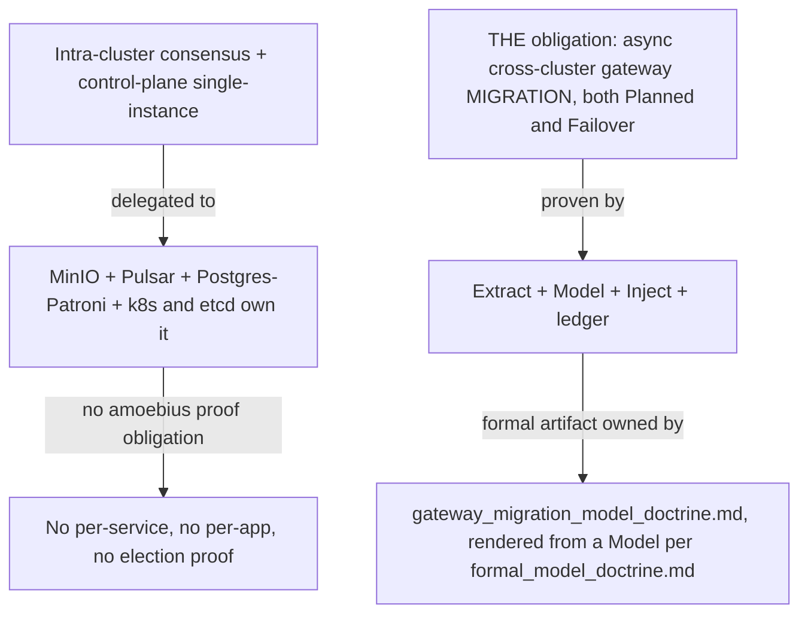
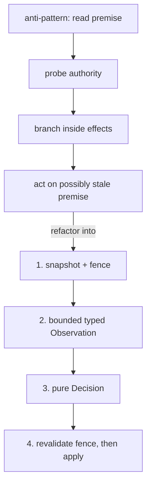
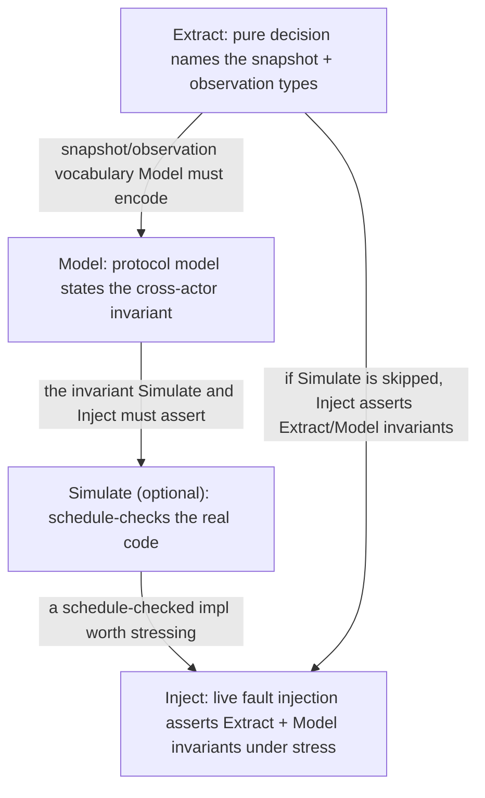
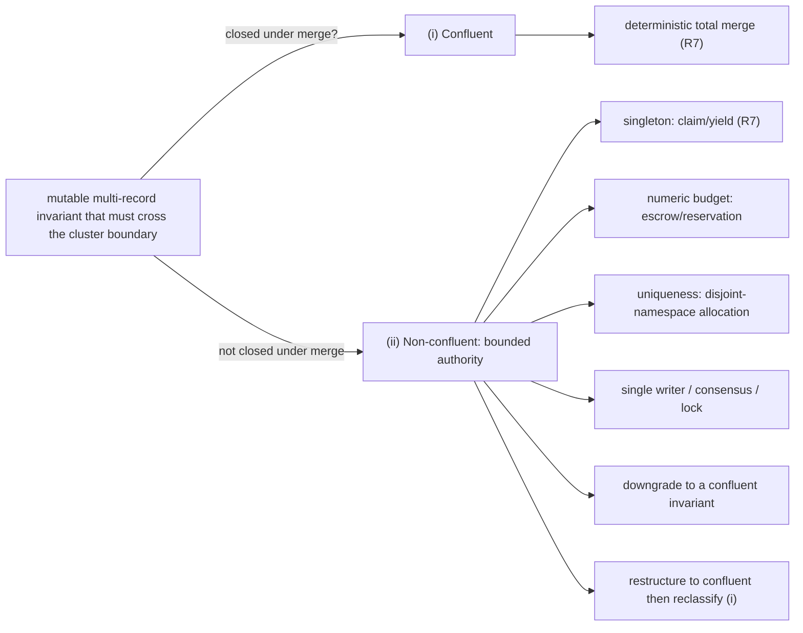
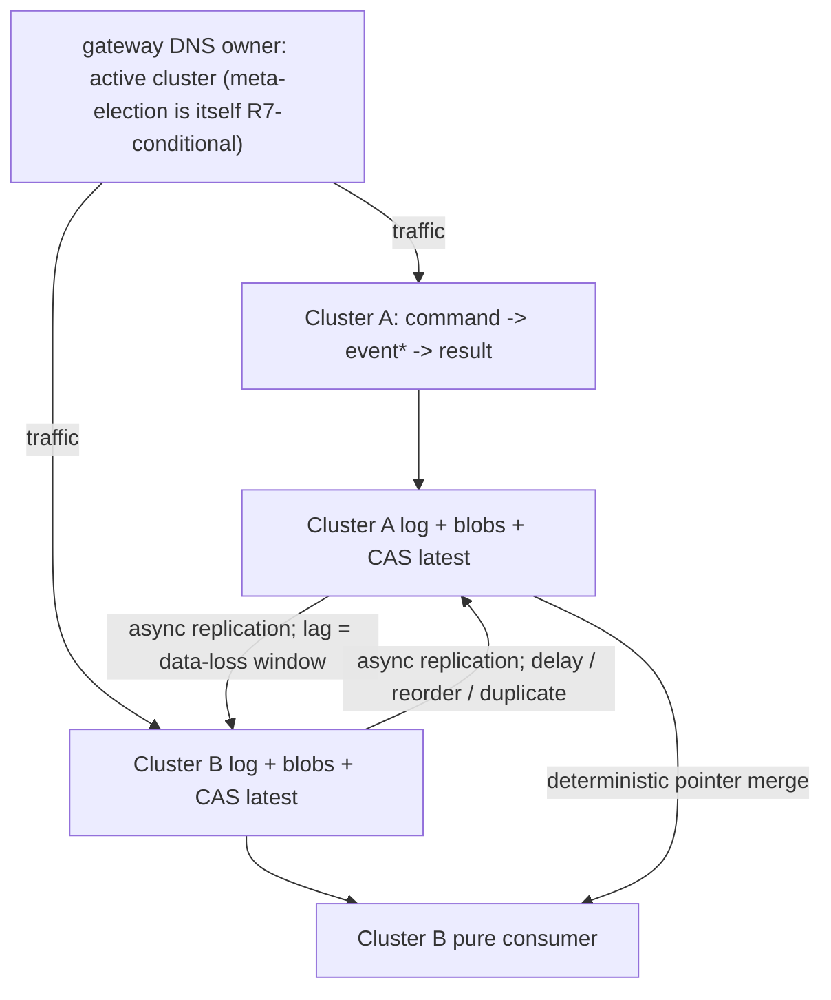
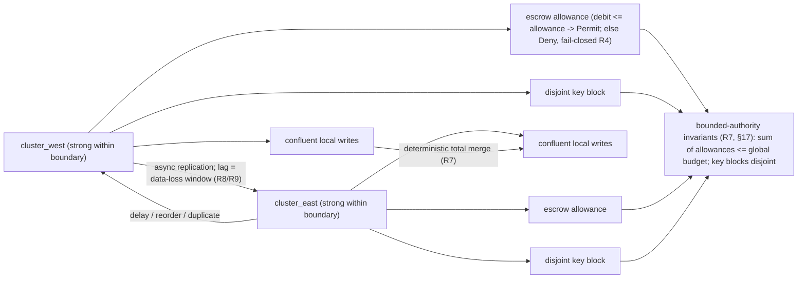

# Chaos Hardening & Cross-Cluster Failover

**Status**: Authoritative source
**Supersedes**: N/A
**Referenced by**: DEVELOPMENT_PLAN/development_plan_standards.md, DEVELOPMENT_PLAN/phase_00_documentation_suite.md, DEVELOPMENT_PLAN/phase_03_gateway_migration_model.md, DEVELOPMENT_PLAN/phase_23_content_store_workflow.md, DEVELOPMENT_PLAN/phase_27_jitml_lift_cuda.md, DEVELOPMENT_PLAN/phase_29_multicluster_gateway_migration.md, DEVELOPMENT_PLAN/phase_30_provider_clusters.md, DEVELOPMENT_PLAN/phase_31_test_topology_dsl.md, documents/documentation_standards.md, documents/engineering/README.md, documents/engineering/app_vs_deployment_doctrine.md, documents/engineering/bootstrap_sequence_doctrine.md, documents/engineering/cluster_lifecycle_doctrine.md, documents/engineering/cluster_topology_doctrine.md, documents/engineering/conformance_harness_doctrine.md, documents/engineering/content_addressing_doctrine.md, documents/engineering/daemon_topology_doctrine.md, documents/engineering/formal_model_doctrine.md, documents/engineering/gateway_migration_doctrine.md, documents/engineering/gateway_migration_model_doctrine.md, documents/engineering/image_build_doctrine.md, documents/engineering/monitoring_doctrine.md, documents/engineering/network_fabric_doctrine.md, documents/engineering/platform_services_doctrine.md, documents/engineering/pulsar_client_doctrine.md, documents/engineering/pulumi_iac_doctrine.md, documents/engineering/readiness_ordering_doctrine.md, documents/engineering/release_lifecycle_doctrine.md, documents/engineering/resource_capacity_doctrine.md, documents/engineering/single_logical_data_plane_doctrine.md, documents/engineering/testing_doctrine.md, documents/engineering/tla_modelling_assumptions.md, documents/engineering/vault_pki_doctrine.md, documents/illegal_state/illegal_state_capacity.md, documents/illegal_state/illegal_state_catalog.md, documents/illegal_state/illegal_state_lifecycle.md, documents/illegal_state/illegal_state_security.md, documents/illegal_state/illegal_state_techniques.md, documents/illegal_state/illegal_state_topology.md
**Generated sections**: none

> **Purpose**: The amoebius concurrency-and-failover doctrine — *Extract* the decision into a value, *Model* the protocol into a proof, *Inject* faults into the deployment — plus the proven/tested/assumed ledger and the invariant-confluence **cross-cluster boundary** that governs asynchronous geo-replication and gateway migration (both `Planned` and `Failover`), the **one** boundary where a per-system proof obligation concentrates on amoebius itself.

**Audience**: amoebius engineers hardening the **one** place in the forest that decides under concurrency and
is amoebius's own to prove — the asynchronous cross-cluster gateway-migration boundary (intra-cluster
single-instance is delegated to k8s/etcd) — and anyone who wants the method, whether or not they have met
TLA+, chaos engineering, or Haskell before.

**Scope**: this is **amoebius's** concurrency-hardening doctrine, worked in **Haskell** (GHC **9.12.4**,
the [DEVELOPMENT_PLAN](../../DEVELOPMENT_PLAN/README.md) toolchain pin) and stated in the terms this
codebase uses: pure functions and ADTs, the type system, QuickCheck, the **Plan / Apply** boundary,
`io-sim` / `io-classes`, TLA+, and the test-as-`InForceSpec` fault harness. It is a **migration and
generalization** of the prodbox sibling's chaos-hardening doctrine
(`/home/matthewnowak/prodbox/documents/engineering/chaos_hardening_doctrine.md`), lifted from
"the prodbox gateway single-writer" to "the amoebius control-plane singleton," and from prodbox's
*forward-looking* async-replication appendices to amoebius's **first-class Phase-29 cross-cluster failover
obligation**.

**One SSoT line, held throughout.** This doctrine owns the **method**, the **ledger discipline**, and the
**proof obligation**. It does **not** own the concrete formal artifacts, which split across two tiers: the actual TLA+
**design-model and its invariant catalog** are authored and TLC-checked design-first in **Phase 3**
(Tier 1 — proven for the model at scope, needing no runtime); its **model↔code correspondence holds by
construction** (`interpret` and `emitTLA` render one `Model`, so there is no separate correspondence table or
divergence record to complete later), and the residual **runtime-fidelity** obligation — that the built
forest's real physics (replication lag, clock-skew, the MinIO/Pulsar/Patroni lossless-delegation premise)
actually hold — is the Tier-2 obligation confirmed by **Register-3 chaos injection** in the multi-cluster
phase — all owned by
[gateway_migration_model_doctrine.md](./gateway_migration_model_doctrine.md); the control-plane singleton
(a Deployment `replicas=1`, single-instance delegated to k8s/etcd, no election) is owned by
[daemon_topology_doctrine.md](./daemon_topology_doctrine.md); the teardown-versus-chaos
distinction by [cluster_lifecycle_doctrine.md](./cluster_lifecycle_doctrine.md); the confluent data
substrate by [content_addressing_doctrine.md](./content_addressing_doctrine.md). This doctrine grounds its
narrative in those subsystems but never restates their normative content. Status, phase order, and
adoption sequencing live only in [DEVELOPMENT_PLAN/README.md](../../DEVELOPMENT_PLAN/README.md).

> **Honesty up front.** amoebius has not built Phases 2–11. Every prescriptive statement below is **design
> intent**, and every result attributed to prodbox is **evidence from a sibling system**, not a tested or
> proven amoebius result. The proven/tested/assumed rule ([documentation_standards.md §6](../documentation_standards.md#6-honesty-the-proventestedassumed-discipline))
> is this document's own moral core ([§12](#12-the-moral-core--proven-tested-assumed)); it is enforced on the document itself.

---

## 1. Prologue — the bug that only happens to other people

Two control-plane candidate pods in the same cluster wake a microsecond apart and each asks whether it is
the singleton. Each reads the commit log; each sees no fresher claim than its own; each concludes it
may reconcile the cluster and mint its secrets. In the space of that microsecond, two daemons both believe
they are the singleton.

Now lift the same bug to the forest. A child cluster's gateway falls silent. A sibling reads its last
geo-replicated offset, sees nothing past it, and concludes the dead cluster held no further committed work
— so it promotes itself, repoints DNS, and resumes. But the silent cluster had *acknowledged* a burst of
writes that never crossed the replication boundary. Two clusters now disagree about what happened, and the
disagreement is durable.

Both decisions were correct — for the world each actor read. Both were wrong for the world they acted in.
This is the bug that survives ten thousand green test runs and surfaces only at runtime, in the deployed
forest: not a typo, not an off-by-one, but **a decision made on a premise that was true when it was read and
false by the time it was acted on.** It has exactly one shape, and that shape recurs everywhere —
in any branch taken against externally-mutable state, and above all across the asynchronous gap between two clusters.

Everything that follows is a discipline against trusting a premise that cannot be proven still current. The
discipline has three moves — **Extract**, **Model**, **Inject** — and the rest of this document argues why it
takes all three, because each is blind to the failures the other two were built to catch. The
amoebius-specific twist ([§6](#6-the-concentration-principle--where-the-obligation-lives)) is *where* the discipline applies: because the standard platform services
run their own consensus, the obligation does not spread across every app — it **concentrates** at two
boundaries.

---

## 2. When this applies — the gate

This discipline earns its cost only when **all three** of these hold:

1. **Decisions under concurrency** — the system takes branches (claim or yield, promote or wait, fail over
   or stall, debit or reject) whose correctness depends on state another actor can change *while the
   decision is being made*.
2. **Coordination only through shared, durable substrates** — actors share no in-memory state; they agree
   only through a log, a broker, an object store, or a database. In amoebius that substrate is the
   **coordination plane: Pulsar + MinIO + the signed, hash-chained commit log**
   ([daemon_topology_doctrine.md §5.1](./daemon_topology_doctrine.md#52-the-coordination-plane-is-for-worker-events-and-audit-not-leadership)).
3. **A safety invariant no single actor can enforce alone** — *exactly one control-plane singleton*,
   *exactly-once effect under redelivery*, *no split-brain gateway across clusters* — belongs to a
   protocol spanning several actors plus the substrate, not to any one process.

If a subsystem meets all three, the [§3](#3-the-defect-class--one-shape-two-disguises) defect is **present whether or not it has ever been observed**.
If it fails the gate — a single process, or no cross-actor invariant — most of what follows is
over-engineering, and the honest thing is to stop.

**A handful of plain terms** carry the argument; meet them once.

- **Decision** — a branch taken in effectful code on the basis of observed state.
- **Premise** — the state a decision assumes true at the instant it branches.
- **Snapshot** — a single, atomically-captured read of state (everything captured *together*, as of one
  instant).
- **Observation** — the *typed* result of probing state that **may not resolve**: success, failure, or an
  explicit *not-yet-known*. An Observation is the opposite of quietly turning "I couldn't tell" into a
  definite answer.
- **The three layers** — *Decision* (inside one process), *Protocol* (across processes), *Runtime* (the
  live, deployed forest). They are the spine of [§5](#5-three-layers-and-the-blindness-that-binds-them), and each has its own move.

A harder vocabulary — *consistency boundary*, *invariant-confluence*, *escrow* — is needed only by data
replicated across more than one strongly-consistent domain. It is deferred to [§16](#16-the-second-axis--when-one-cluster-becomes-a-forest), behind a gate. In
amoebius that boundary is the **cluster boundary**: synchronous within a cluster (delegated, [§6](#6-the-concentration-principle--where-the-obligation-lives)),
asynchronous across.

---

## 3. The defect class — one shape, two disguises

Every defect this doctrine targets has the same shape: **a
decision taken across a sequence of non-atomic effects, on a premise that was true at snapshot time but is
trusted after it could have changed.** In its barest form:

```text
  premise  := atomically read shared state          -- true at instant t0
  evidence := probe an external authority            -- resolves at instant t1 > t0, non-atomically
  branch   := act on (premise, evidence)             -- but the world at t1 != the world at t0
```

Between `t0` and `t1`, another actor can quietly invalidate the premise: a peer emits a fresher claim, a
geo-replicated write lands, the elected owner yields. The branch is then taken on a **self-contradictory
input** — a premise from one instant fused with evidence from another. The two singleton candidates in the
Prologue are exactly this; so are the two clusters, with **replication lag** now playing the role of the
gap between `t0` and `t1`.

The shape wears two recurring disguises:

- **Timeout-coerces-unknown.** A probe that times out or errors is read as a *definite negative* — "no
  fresher claim exists," "the peer cluster is dead," "there are no committed effects past offset `X`" —
  when the truthful value is *unknown*. A timeout is not a negative acknowledgement; it is the absence of a response.
- **State-conflation.** Two genuinely distinct conditions — *not-yet-replicated* vs *does-not-exist*,
  *partitioned-from-peer* vs *peer-is-dead*, *outbound-reachable* vs *inbound-fresh* — are collapsed into
  one branch, so the decision cannot even represent the cases that demand different actions.

This defect survives a test suite because surfacing it requires a *specific interleaving of two
actors*, and a single-threaded test never runs two actors. It is the canonical "once in N thousand runs"
defect: real, rare, and never reproducible on demand. **Testing alone cannot establish confidence here;
confidence requires reasoning and experiment in three different registers** — which [§5](#5-three-layers-and-the-blindness-that-binds-them) makes precise.

---

## 4. Two traditions, and the quiet third

The industry built two established traditions for trusting distributed systems, one far more widely practiced
than the other.

**Prove the design.** Before a protocol is trusted, write it down precisely enough that a machine can
explore every interleaving and check the bad thing never happens. This is *formal methods* — Lamport's
**TLA+** and **TLC** (descended from *Time, Clocks, and the Ordering of Events*, CACM 1978, and *The
Temporal Logic of Actions*, TOPLAS 1994), Jackson's Alloy. Its industrial case was made by Amazon: in *How
Amazon Web Services Uses Formal Methods* (Newcombe et al., CACM 2015), model checking a DynamoDB
replication algorithm found a defect whose **shortest error trace was 35 high-level steps** — one that had
survived design review, code review, and testing. The lesson: **the
improbability of a 35-step compound event is not its impossibility.** A test never gets that lucky; a model
checker explores every interleaving in scope, so it gets "lucky" by construction. It guards the
**Protocol** layer.

**Break the deployment.** Confidence about how a large system *fails* cannot be reached by reasoning alone, so
induce failures on purpose under observation. This is *chaos engineering* — Jesse Robbins's GameDays
at Amazon (~2003), Google's DiRT, and Netflix's **Simian Army** (Chaos Monkey 2010–11, escalating to Chaos
Gorilla and Chaos Kong). Its 2015 *Principles of Chaos Engineering* put it plainly: software has *no
transfer function*, so to learn how it fails "we must use an empirical approach." It guards the **Runtime**
layer.

**A necessary honesty on lineage.** The *Byzantine Generals Problem* (Lamport, Shostak & Pease, TOPLAS
1982) — agreement when nodes lie — is intellectual ancestry here, **not** a claim about amoebius. Tolerating
arbitrary lying nodes needs `3f + 1` replicas and heavy machinery. amoebius assumes the gentler models:
*crash-recovery* and *omission/partition*, the world of Paxos/Raft (`2f + 1`). amoebius invokes Byzantium for the
discipline it founded — formalize agreement under faults — not because anything here defends against
traitors.

And there is a quieter third discipline most teams already practice without naming: **make the decision
explicit.** Pull the branch out of the tangle of effects into a pure, typed function of its inputs, so it
becomes a *value* that can be examined, exhausted, and reasoned about — the world of types, pure functions, and
property-based testing (QuickCheck; Claessen & Hughes, ICFP 2000). It guards the **Decision** layer, it is
the cheapest of the three, and **it is the move to apply first**, because it produces the vocabulary
the other two need to say anything at all.

Three traditions, three layers, three moves:

> **Extract** the decision · **Model** the protocol · **Inject** the faults.

**And in amoebius, all three are Haskell.** The quiet third move is the native idiom of a typed functional
language. The constituent **prodbox** behaviour already lives there — pure decision functions over a
commit log (`canWriteDns`, `nodeDisposition` in `/home/matthewnowak/prodbox/src/Prodbox/Gateway/Types.hs`),
the Plan / Apply split, the type system as a zero-cost design check. The spine of [§10](#10-simulate--the-pure-program-lifted-io-sim) is
one ladder: make the **decision** pure (Extract), then the **command** pure (Plan / Apply), then — with
`io-classes` and `io-sim` — the **whole concurrent program** pure, run as a deterministic model under test
and as the production daemon from a single source. *Build it pure; lift it whole.*

---

## 5. Three layers, and the blindness that binds them

A concurrency defect can live in any of three layers, and **each layer is structurally invisible to the
tools that guard the others** — not because the tools are weak, but because they are *looking somewhere
else*.

| Layer | The move that guards it | What that move still cannot see | Strongest claim it yields |
|---|---|---|---|
| **Decision** (one process) | **Extract** ([§8](#8-move-i--extract-make-the-decision-a-value)), with the type system as a free head start | whether the *protocol* those decisions compose into is sound | **proven** (purity/totality in code; the property when finite) |
| **Protocol** (across processes) | **Model** ([§9](#9-move-ii--model-prove-the-protocol-not-the-program)) | whether the *code* refines the model; real-time / clock-skew premises | **proven for the model only** |
| **Runtime** (the live forest) | **Inject** ([§11](#11-move-iii--inject-break-the-running-thing-on-purpose)) | the interleavings not injected; soundness | **tested**, never proven |

Stated as three flat facts: a perfect Decision-layer proof says **nothing** about whether the protocol is
sound; a green Protocol model says **nothing** about whether the code refines it or the live timeouts hold;
a passing Runtime fault test says **nothing** about the interleavings it did not schedule, and can never
show an invariant is *sound* — only that it survived the faults chosen.

There is a **fourth blindness**, orthogonal to these three: **every move is blind to a storage consistency
boundary unless that boundary is explicitly modeled in.** In amoebius that boundary is the cluster
boundary. A forest whose data is geo-replicated across clusters has a whole second axis of failure that no
amount of Extract, Model, or Inject on a single cluster will reveal. That axis is real, it is hard, and it
is deferred on purpose to [§16](#16-the-second-axis--when-one-cluster-becomes-a-forest).

---

## 6. The concentration principle — where the obligation lives

This section distinguishes amoebius's doctrine from a generic one: it is why the proof obligation is
tractable.

A naive reading of [§2](#2-when-this-applies--the-gate) suggests an unbounded obligation: amoebius runs Pulsar, MinIO, Vault, Postgres,
nine standard services, N worker daemons, and an arbitrary app on every cluster in a recursive forest — so
it appears as if *every* component carries its own split-brain proof obligation. It does not. The obligation
**concentrates**, because of two structural facts amoebius commits to.

**Fact one: intra-cluster consensus and single-instance are delegated, not re-proved.** The standard platform
services each run their own, already-proven distributed consensus and synchronous replication: MinIO
erasure-codes and quorum-replicates within a cluster; Pulsar's brokers/bookies own subscription and
acknowledgment semantics; Percona/Patroni Postgres runs synchronous replication with its own leader election
([platform_services_doctrine.md §6, §8](./platform_services_doctrine.md#6-pulsar--the-event-and-workflow-backbone-new-vs-prodbox)). amoebius **delegates** the
synchronous-HA correctness obligation to these systems rather than re-deriving it. A Pulsar
topic-lifecycle coordinator that needs single-consumer semantics gets it from Pulsar's subscription model
and the at-least-once + dedup discipline, not from a bespoke amoebius election
([pulsar_client_doctrine.md](./pulsar_client_doctrine.md)). **Crucially, the control-plane singleton's
single-instance is likewise delegated — to Kubernetes/etcd.** The singleton is a Deployment `replicas=1` (a
k8s `Lease`, itself etcd-backed, if a hard lock is ever needed), never a bespoke amoebius election
([daemon_topology_doctrine.md §3](./daemon_topology_doctrine.md#3-the-control-plane-singleton)); amoebius does
not duplicate the consensus etcd already provides. The governing rule is stated directly: *amoebius wants TLA+
only for distributed problems that aren't already handled by systems that do their own consensus and
georeplication (minio, pulsar, postgres, k8s/etcd).*

**Fact two: chaos, HA, geo-replication, and failover are deployment-rules, never application logic.** An
app — a **demo web app** (shipped by infernix / jitML) — is written **once**; its HA replica count,
chaos-testing, geo-replication, and failover behaviour are an *orthogonal deployment-rules surface*
([app_vs_deployment_doctrine.md](./app_vs_deployment_doctrine.md)). So a per-app failover proof never
arises: there is no app-specific failover logic to prove. The distribution behaviour is configured at the
platform layer and proven *there, once.*

Put the two facts together and the obligation collapses onto exactly **one** boundary:



- **The one obligation — the async cross-cluster gateway migration.** Across clusters, geo-replication is
  asynchronous and the wild-ingress gateway can move from one cluster to another — a **`Planned`** coordinated
  RPO=0 handover *and* a **`Failover`** survivor-takeover ([gateway_migration_doctrine.md](./gateway_migration_doctrine.md)).
  *This* is where the genuinely new, hard amoebius obligation lives — the boundary no single system proves
  end-to-end. Its authority is exercised as **external side effects** — a route53 DNS write and Vault — that
  validate no broker epoch, so no off-the-shelf fence discharges it; the *intra-cluster* single-instance of the
  writer is delegated to k8s/etcd (Fact one), but **which cluster owns the record, and how ownership moves
  across clusters, is amoebius's own**. The doctrine flags it as genuinely "tricky": *asynchronous
  geo-replication is hard. what exactly happens if a cluster goes down mid geo-sync and we try to failover the
  gateway to that cluster? we need to prove we always have well-defined behaviour.* The whole of
  [§16](#16-the-second-axis--when-one-cluster-becomes-a-forest)–[§19](#19-the-cross-boundary-ledger-and-conformance-rows)
  and Appendix B exist to answer it; the model that discharges it is owned by
  [gateway_migration_model_doctrine.md](./gateway_migration_model_doctrine.md).

(Historically this doctrine named *two* axes — a "First Axis" in-cluster control-plane election and this
"Second Axis" cross-cluster boundary. The First Axis is **retired**: single-instance is delegated to k8s/etcd
per Fact one, so amoebius runs no election and there is no in-cluster proof obligation. Only the cross-cluster
gateway migration remains.)

Everything intra-cluster and synchronous — **including the control-plane singleton's single-instance** — is a
solved problem owned by another system; amoebius spends its formal-verification budget on the **one** invariant
that is uniquely its own, and on nothing else. (Shorthand: delegate the easy proofs, concentrate the hard one.)
A proof obligation that appears anywhere *other* than this one boundary **indicates a modelling error** —
usually a sign that a deployment-rules concern leaked into app logic, or that someone is re-proving what
Pulsar/MinIO/Postgres/etcd already prove.

---

## 7. The honest limits the moves inherit

Each tradition hands its move both its power and its limits; record the limits now, because [§12](#12-the-moral-core--proven-tested-assumed) turns them
into ledger rows.

**Model cannot:** check the *code* (only a model — model and code drift); explore beyond a **bounded,
finite scope** (the check covers 2–3 actors, not 3,000); reason in **real time** (it runs in logical time, so
clock skew and lease timing are abstracted away, not verified — R8); or check invariants that were never
stated. These are not weaknesses to apologize for — they are exactly where Model hands off to Inject and to
the [§13](#13-the-supporting-rules--the-conditions-the-moves-need) rules.

**Inject cannot:** be exhaustive (it **samples** the faults injected); prove *soundness* (a green chaos
run is evidence, not proof); or mean anything without observability, a steady-state signal, and disciplined
blast-radius control. Done as Netflix did it — scheduled, watched, escalating, bounded — Inject is
fire-drill engineering; done carelessly it is just a self-inflicted outage.

**Extract cannot:** establish the *cross-process* invariant. A pure decision is only ever as sound as the
observation and fence handed to it; whether the protocol those decisions compose into upholds the
cluster-wide invariant is a question Extract structurally cannot answer. That is Model.

---

## 8. Move I — Extract: make the decision a value

> **Extract** the decision · Model the protocol · Inject the faults.

**The move.** Take the branch out of the effects. A decision must be a **pure function of typed inputs
captured with an explicit freshness contract** — effectful code may *capture* the inputs and *apply* the
result, but it **must not compute the branch in the middle of a race.** Every decision follows a four-stage
pipeline:



Three sub-rules make it sound:

- **The typed-unknown rule.** A probe that times out, errors, or has not resolved must yield an explicit
  *not-yet-observed* value — never a coerced definite. This is the direct remedy for both disguises of [§3](#3-the-defect-class--one-shape-two-disguises).
  A decision may deliberately coerce an unknown to a definite **only when** the coercion can affect
  **liveness** but **not** the safety invariant — i.e. a separate mechanism (a convergent-log gate, a
  fail-closed apply step) enforces safety regardless. State which case applies; an unexamined coercion is
  the [§3](#3-the-defect-class--one-shape-two-disguises) defect by default.
- **Bound everything.** Every probe, retry, queue, and wait carries an explicit finite bound. An unbounded
  effect reintroduces an instant the decision cannot reason about.
- **Fence or revalidate safety-critical freshness.** If safety depends on "the premise is still true," the
  snapshot carries a version, lease, epoch, CAS token, or **log offset** that the apply step revalidates in
  the *same atomic operation* as the effect.

**Why it works.** When the branch is pure over typed inputs it cannot silently collapse unknown into false,
and it cannot hide an effectful branch in the middle of a race. The branch becomes a *value* — and a value
can be exhaustively property-tested without a cluster, a clock, or a network. (This is the level the type
system already operates at, for free: a GADT-indexed state machine makes illegal transitions *compile
errors* — see [illegal_state_catalog.md](../illegal_state/illegal_state_catalog.md). Extract extends that reach to the
runtime values the type system can't see.)

**The amoebius shape.** The **cross-cluster gateway-ownership decision** — which cluster holds the
wild-ingress gateway — **is** this, generalized from the prodbox gateway single-writer. (Intra-cluster
single-instance is delegated to k8s/etcd — there is no in-cluster election to extract — so the decision that
remains amoebius's own is this cross-cluster one, [§6](#6-the-concentration-principle--where-the-obligation-lives).)
The ownership decision is a *deterministic total function* over the ranked cluster-candidate set folded from the
convergent commit log; the owner-only action (write the gateway DNS record, drive the migration) is gated by a
second pure predicate over the **log**: *may-act = (I am the computed
owner) ∧ (my latest claim is unsuperseded by a later yield)*. Because the gate folds over the convergent
log rather than local belief, it is pure *because its input converges*. The election *shape* is owned by
[daemon_topology_doctrine.md §5](./daemon_topology_doctrine.md#5-single-instance-and-coordination--delegated-not-elected); this doctrine owns the rule that the
decision must be Extracted before it can be modeled.

**The deeper structural form, and its boundary limit.** The strongest Extract makes the observation a
*fold over a replicated append-only log* (the commit log over Pulsar + MinIO), so the decision is pure
*because its input is convergent*, not merely because it was wrapped. But that convergent-fold form
converges **only within one consistency boundary** ([§16](#16-the-second-axis--when-one-cluster-becomes-a-forest)): where the log is geo-replicated asynchronously
across the cluster boundary and both sides append, each side's fold stays perfectly pure and the two
results can still disagree. **Purity does not imply agreement once the substrate has a boundary** — a
thread [§16](#16-the-second-axis--when-one-cluster-becomes-a-forest) picks up.

---

## 9. Move II — Model: prove the protocol, not the program

> Extract the decision · **Model** the protocol · Inject the faults.

**The move.** State the cross-actor safety invariant and machine-check it against a **model of the
protocol** that includes the adversarial actions — concurrent claim, message reordering and duplication,
and **actor crash** — explored to exhaustion within a bounded scope. (TLA+/TLC and Alloy are the usual
tools; the technique, not the tool, is the rule.)

**Why it works.** The *catastrophic* failure — two daemons both believing they are the singleton, or two
clusters both believing they hold the gateway — lives in the Protocol layer, which Extract cannot reach. A
flaw there is wrong *regardless of how perfectly the code is written*, so no test of the implementation can
reveal it; only checking the algorithm can. The DynamoDB 35-step trace ([§4](#4-two-traditions-and-the-quiet-third)) is the canonical proof that
"astronomically lucky" is not a plan.

**How to know the move is complete.** There is a model of the protocol; it encodes crash and reordering, not
just the happy path; it states the safety invariant (e.g. *at most one active singleton*) and at least one
liveness property (*a cluster with a live candidate eventually has exactly one*); and a checker explores it
to exhaustion at a scope that **matches the real actor count**. The model's vocabulary — the snapshot and
observation *types* — should be the very ones Extract named.

The canonical failover hazard the model must rule out is a **deposed actor that still believes it owns the
resource and keeps acting.** The remedy is not a local flag but to gate every owner-only action on
**convergent proof of current ownership** — the [§8](#8-move-i--extract-make-the-decision-a-value) log-fold, where the action is permitted only when the
actor observes its own current, unsuperseded claim in the replicated log — so a stale owner cannot act on a
belief the rest of the cluster has already overwritten.

Where the invariant is **impossibility-bounded** (R7), state it *conditionally* — e.g. *at most one
singleton once views converge* — model it with that condition explicit, and verify two things: that the
invariant holds inside the condition, and that any violation outside it (under partition) is **bounded and
self-healing** rather than permanent.

**SSoT — who owns the spec.** This doctrine owns the *requirement* to model the two concentrated invariants
([§6](#6-the-concentration-principle--where-the-obligation-lives)) and the honesty rule on what a green model means. The **concrete TLA+ spec and its invariant catalog**
are owned by
[gateway_migration_model_doctrine.md](./gateway_migration_model_doctrine.md), and split across the two tiers: the
**design-model and invariant catalog** are authored and TLC-checked design-first in **Phase 3** (Tier 1 —
proven for the model at scope, needing no runtime); model↔code correspondence **holds by construction** there
(`interpret` and `emitTLA` render one `Model`, so no correspondence table or divergence record is deferred),
while the residual **runtime-fidelity** check — that the built forest's real physics hold — is the **Tier-2**
obligation confirmed by **Register-3 chaos injection** in **Phase 29**. The sibling prodbox spec
(`/home/matthewnowak/prodbox/documents/engineering/tla/gateway_orders_rule.tla`, six invariants explored to
~4.4M states at scope 3, `prodbox dev tla-check`) is **evidence from a sibling system, not an amoebius
proof** — its invariants `UniqueOwner` / `NoTugOfWar` / `SingletonTakeover` are exactly the shape amoebius
must re-establish for its own model.

**What this move cannot see — the honest limit.** Model checks the **design, not the code.** A green model
does not prove the implementation refines it; model and code drift, and a bounded scope hides any bug that
needs more actors than the scope allows. A model in **logical time** says nothing about the
**real-time / clock-skew** premises the implementation depends on (R8). Record these limits explicitly
([§12](#12-the-moral-core--proven-tested-assumed)) so a green model is never mistaken for a proof of the running system.

(Once the substrate has a **consistency boundary** ([§16](#16-the-second-axis--when-one-cluster-becomes-a-forest)), the deposed-actor remedy *weakens*: the proof of
supersession must now propagate across an asynchronous gate, so its latency is the replication lag, and a
deposed side can keep acting for up to that lag. The remedy then no longer *prevents* the deposed-actor
window — it only **bounds it to the lag** — leaving a residual, self-healing violation [§18](#18-the-rules-scale-to-the-boundary) must reconcile.)

---

## 10. Simulate — the pure program, lifted: io-sim

> Extract the decision · *(Simulate the schedule)* · Model the protocol · Inject the faults.

Extract made the *decision* a pure value; Plan / Apply makes the *command* a pure value applied by one
effectful boundary; the last rung makes the **whole concurrent program** a pure value too — and runs it as
a deterministic model under test and as the production daemon from a single source. *Build it pure; lift it
whole.*

**The move (conditional).** Where the in-process concurrency is intricate enough that Extract's purity
boundary still leaves real schedule-dependent behaviour — interacting retry loops, cancellation, async
exceptions, several loops racing over shared state — run the **real in-process code** against an
**adversarial deterministic scheduler with simulated time**, so a rare interleaving becomes
*deterministically replayable* instead of a once-a-month flake.

**The Haskell way: io-sim and io-classes.** [`io-classes`](https://hackage.haskell.org/package/io-classes)
is a set of typeclasses (`MonadSTM`, `MonadAsync`, `MonadTimer`, `MonadFork`, `MonadThrow`/`MonadCatch`)
mirroring `base`, `stm`, and `async`. A component is written polymorphic over a monad `m` carrying those
constraints, then an interpreter is chosen:

- in production, `m = IO` — the real daemon;
- under test, `m = IOSim s` — a **pure, discrete-event simulator** with deterministic scheduling, simulated
  time, and a granular trace down to the order STM transactions commit.

The same source is the model **and** the implementation. `IOSimPOR` adds **partial-order reduction** to
discover races and systematically explore schedules, and the library drives QuickCheck, so a discovered
interleaving returns as a *minimal, replayable counterexample*. io-sim was hardened for Cardano's
`ouroboros-network` (IOG / Well-Typed; maintained under IntersectMBO) — the Haskell peer of FoundationDB's
deterministic "Flow" and its descendants Antithesis and TigerBeetle.

**Why it would close amoebius's real gap.** Model's honest limit ([§9](#9-move-ii--model-prove-the-protocol-not-the-program)) is that a green TLA+ model does not
prove the *code* refines it. Lifting the singleton daemon onto io-classes would let the **real loops** run
under `IOSimPOR`, exercising interleavings neither the TLA+ model nor a pure decision test can reach, and
turning the model↔code correspondence from prose into something a test executes. amoebius starts from a
good place: the shared daemon spine already forbids `forkIO` and mandates structured `withAsync` /
`bracket` ([daemon_topology_doctrine.md §6](./daemon_topology_doctrine.md#6-the-shared-daemon-spine)), so the shapes lift cleanly.

**The cost, named (why it is optional and kept subordinate).** Lifting onto io-classes makes every
concurrency-touching signature polymorphic in `m` — a **standing tax on all future change**, not a one-time
edit. And it has a fidelity ceiling: its marquee scenario — several simulated actors racing — only
faithfully reproduces production when they genuinely share *in-process* state. amoebius daemons do **not**;
they coordinate through Pulsar + MinIO + the commit log, so an `IOSim` run of one daemon rests on a
hand-built stub of its peers, and the catastrophic *cross-actor* invariant is still better served by the
TLA+ model. So Simulate stays parenthetical: never a fourth move, scoped to one subsystem, gated on
evidence the tax is worth paying — and it splits across the two tiers. The **in-process design-schedule
check** — the pure decision run against hand-built peer stubs under `IOSimPOR`, exercising the schedule
the pure decision leaves open — **is adopted early, in Phase 3**, as a Tier-1 design check, and its honest
ledger entry ([§12](#12-the-moral-core--proven-tested-assumed)) reads **tested (sampled schedules)** for the design. But **io-sim *against the
built runtime*** — the real daemon lifted onto io-classes and refined against the model — **stays
Tier-2/deferred**, exactly per the fidelity ceiling above: the concurrent *schedule of the live daemon*
is **unexercised** until then.

---

## 11. Move III — Inject: break the running thing on purpose

> Extract the decision · Model the protocol · **Inject** the faults.

**The move.** Subject the live forest to **fault injection that asserts the exact invariants Extract and
Model established** — and make the injection *adversarial*, not merely benign: not asserting survival of a
reboot, but asserting that the singleton invariant holds when the owner is killed mid-claim under load, and
that the forest stays well-defined when a cluster is killed *mid geo-sync* and the gateway is failed over to
it.

**In amoebius, the fault harness is itself an `InForceSpec` topology.** A test is a Dhall-authored spec that spins
up resources, runs a workflow, and — by definition — always tears down, simulating HA failovers and
substrate quorum re-elections (etcd/Patroni); `suggest-test` detects the substrate and emits a representative one. That entire
machinery — the test-as-`InForceSpec` contract, `suggest-test`, the flagged test credentials, and the per-run
ledger artifact — is owned by [testing_doctrine.md](./testing_doctrine.md). This doctrine owns only the
rule that each concentrated invariant ([§6](#6-the-concentration-principle--where-the-obligation-lives)) must have an adversarial scenario asserting its *declared form*.

**Extend, don't build.** Most HA systems already inject *some* faults. The work is rarely to build a
harness from nothing; it is to **extend** the existing one with the scenarios that target what Extract and
Model newly assert. A parallel harness is waste.

**The benign-vs-adversarial axis — the maturity measure:**

- *Benign* (where most suites stop): one fault at a time, the system quiesced between faults — node
  restart, isolated failover, single dependency bounce. This proves *recovery from outages*.
- *Adversarial* (what this move demands): a fault injected **during** a critical operation, **under load**,
  with **concurrent** actors — kill the singleton mid-claim while writes are in flight; two candidates
  racing; partition, latency, packet loss; message reordering against the at-least-once guarantee; **kill a
  cluster mid geo-sync and fail the gateway over to it**; cascading faults with no recovery between. This
  proves the *correctness core holds under stress.* (Netflix's Monkey → Gorilla → Kong ladder is exactly
  this escalation; for amoebius, Kong is the cross-cluster gateway failover.)

**Crucially, distinguish chaos-failover from graceful teardown.** A *graceful* teardown drains, flushes to
a synchronization event, hands off the gateway, and releases compute while preserving storage — so it is
**lossless by construction**. A *chaos-failover* is the lead simply vanishing — no drain, no flush — so its
loss is bounded by the declared **data-loss budget**, not zero. That distinction is normative and owned by
[cluster_lifecycle_doctrine.md §5](./cluster_lifecycle_doctrine.md#5-teardown-with-cleanup-vs-chaos-failover-the-central-distinction); Inject must drill the *chaos* case,
because a graceful teardown that silently skips its cleanup steps is downgrading itself to a chaos event
and forfeiting the lossless guarantee.

**What this move cannot see.** It cannot prove soundness, and it cannot see the interleavings not
injected. A green Inject run is the strongest *empirical* confidence available and the weakest *logical*
guarantee — which is why the moves are plural.

---

## 12. The moral core — proven, tested, assumed

The proven/tested/assumed principle:

> A system is "provably chaos-hardened" only to the degree it can say, for each technique, **what is
> proven, what is merely tested, and what is assumed.**

Conflating those three is the entire difference between provable hardening and an unsubstantiated claim of
safety. The prohibition this doctrine exists to enforce is that a tested or assumed result must never be
reported as proven. Keep this ledger explicitly:

| Technique | Establishes | Strength | Does **not** establish |
|---|---|---|---|
| GADT-indexed state machine | Illegal in-process transitions are compile errors | **Proven** (machine-checked, exhaustive) | Anything across processes |
| **Extract** — pure decision + property test | The branch is a total function of typed inputs; unknowns and distinguished states are explicit; safety-critical freshness is fenced | **Proven** for purity / totality / fence wiring; **tested** (sampled) for the property unless the input space is finite and exhausted | That the protocol composing these decisions is sound; that an unfenced observation is current |
| **Model** — design model-checking | The *algorithm* upholds the (possibly *conditional*, R7) invariant under modeled crash/reorder, within scope | **Proven for the model** at TLC-green (the Tier-1 design-model, front-loaded to Phase 3); model↔code correspondence holds **by construction** (one `Model` → `interpret` + `emitTLA`); **assumed** for runtime fidelity — that the built forest refines the model live (deferred Tier-2, Phase 29, via Register-3 chaos) — and actor counts beyond scope | That the built runtime's real physics refine the model; behaviour above scope; real-time / clock-skew premises (R8) |
| **Simulate** (optional) | The pure decision upholds the invariant under the in-process schedules explored against peer stubs (the Tier-1 design-schedule check, Phase 3); the *built daemon's* real schedule stays deferred | **Tested (for design)** — sampled schedules | Schedules not explored; the live daemon's real schedule (Tier-2, deferred); anything outside the simulated subsystem |
| **Inject** — live fault injection | The deployed forest survived the injected faults | **Tested** (the faults chosen), never proven | Faults/interleavings not injected; that the invariant is *sound* |
| Synchrony / real-time assumption (R8) | The timing premise (clock skew, lease, heartbeat) is named, bounded, monitored | **Assumed** — monitored at runtime, never proven by any move | Behaviour when the bound is exceeded; that it holds in the field |

(Three further rows — the cross-boundary consistency premise, the failover budget, and the
invariant-confluence classification — belong to the Second Axis and are recorded in [§19](#19-the-cross-boundary-ledger-and-conformance-rows).)

**Applied to amoebius today, the ledger is blunt — and that is by design.** Nothing in Phases 2–11 is
built. So **every** layer above is, for amoebius, **UNVERIFIED** pending implementation; the only
*proven* facts available are sibling prodbox results, which are **evidence, not amoebius proof.** The
[DEVELOPMENT_PLAN](../../DEVELOPMENT_PLAN/README.md) phase-discipline rule makes this binding: *every
validation emits a proven/tested/assumed ledger artifact, and skipping an applicable test move marks that
correctness layer UNVERIFIED, never green.* When the gateway-migration design-model is TLC-checked
(the pre-cluster formal phase, Register 1), the multi-cluster runtime is built, and its model↔code correspondence is
closed (Phase 29, the deferred Tier-2), its ledger will read like prodbox's; until then, claiming the
singleton is "hardened" because prodbox proved a sibling invariant is exactly what this section forbids.

The rule, stated once and meant absolutely: **never report a tested, assumed, or merely argued result as
proven.** Type-checking, decision purity, and finite-and-exhausted decision properties can be *proven* at
the code layer; everything else is *evidence*. The ledger is the deliverable: not an assertion of safety
but a precise record of what is known and by what means. An honestly
*conditional* invariant a system enforces is worth more than an *absolute* one it silently violates under
partition.

---

## 13. The supporting rules — the conditions the moves need

The three moves rest on standing conditions. Each is also a portable best practice. (R1–R8 have a
first-axis core stated here; several gain a cross-boundary extension in [§18](#18-the-rules-scale-to-the-boundary), and R9 is purely
cross-boundary.)

- **R1 — No shared in-memory state between replicas; name the substrate's consistency boundary.** amoebius
  daemons coordinate only through Pulsar + MinIO + the commit log. Any in-memory cross-replica assumption
  is split-brain in waiting, invisible to Model. A substrate's atomicity and convergence hold only *within*
  one boundary; across one (the cluster boundary) it is asynchronous — the [§16](#16-the-second-axis--when-one-cluster-becomes-a-forest) axis.
- **R2 — Determinism in tests: inject time and scheduling; never assert on wall-clock.** Tests drive timing
  and ordering through injected seams, not real delays. Wall-clock tests cannot deterministically reproduce
  the interleaving that exposes a [§3](#3-the-defect-class--one-shape-two-disguises) defect. This is what makes Extract and Simulate fast and repeatable.
- **R3 — At-least-once delivery with idempotent handlers is a named invariant.** Treat "no effect lost,
  none double-applied under redelivery and crash-mid-acknowledge" as a first-class protocol invariant — the
  Pulsar at-least-once + dedup discipline ([pulsar_client_doctrine.md](./pulsar_client_doctrine.md)). The
  idempotency key must be a **stable identity** (content- or call-identity, not a local sequence number),
  because [§18](#18-the-rules-scale-to-the-boundary) will ask it to survive geo-replication.
- **R4 — Crash-only / fail-closed recovery.** On an unrecoverable fault, fail loudly and let the supervisor
  restart from clean state, rather than attempting intricate in-process recovery. This is the daemon
  spine's fail-fast posture and the reconciler's *Unreachable → refuse* rule
  ([cluster_lifecycle_doctrine.md §9](./cluster_lifecycle_doctrine.md#9-how-bring-up-and-teardown-are-implemented-the-reconciler-not-a-state-machine)). Crash-only paths have far smaller
  state spaces for Model and Inject. (Candea & Fox, *Crash-Only Software*, HotOS 2003.)
- **R5 — Bound everything.** Every timeout, retry budget, queue depth, and wait is explicitly finite. An
  unbounded effect is an instant no decision can reason about and no model can scope.
- **R6 — Structured concurrency only.** Coordination paths use scoped concurrency (`withAsync`, race,
  cancel-on-exit) — never `forkIO` or ad-hoc sleeps, which the daemon spine already forbids
  ([daemon_topology_doctrine.md §6](./daemon_topology_doctrine.md#6-the-shared-daemon-spine)). Structured scopes make cancellation and
  async-exception safety analyzable. (Popularized by Smith's 2018 essay; descends from structured
  programming.)
- **R7 — Impossibility-bounded invariants are stated conditionally, with the failure mode chosen
  explicitly.** Some safety invariants *cannot* hold unconditionally in an asynchronous system that admits
  partitions. **FLP** (Fischer, Lynch & Paterson, JACM 1985): no deterministic protocol guarantees
  consensus in an asynchronous system if even one process may fail. **CAP** (Gilbert & Lynch, 2002) makes
  "absolute safety *and* always-available autonomous progress under partition" unachievable. **PACELC**
  (Abadi, 2010/2012) adds *else, latency*: even fully healthy cross-cluster coordination costs latency on
  every operation, while asynchronous coordination buys that back at the price of lag and divergence. So
  when the invariant in question is one of these: (a) **state the condition** under which it holds (e.g. *under
  view convergence*); (b) **choose the failure mode explicitly** — *safety-first* (fail closed) or
  *availability-first* (act, accept a **bounded** violation that deterministically heals on reconvergence)
  — and document which; (c) **record** the chosen mode in the ledger. amoebius inherits prodbox's explicit
  **availability-first** stance for the one boundary it owns — the gateway migration, where a promoted cluster
  acts on failover and accepts a **bounded** violation that deterministically heals on reconvergence
  ([gateway_migration_model_doctrine.md](./gateway_migration_model_doctrine.md)).
- **R8 — Name and bound every synchrony assumption; no move verifies it.** Where correctness rests on a
  real-time premise — bounded cross-node clock skew, a lease/TTL, heartbeat timing — that premise is proven
  by **none** of the moves: Extract abstracts it, Model uses logical time, Inject only samples. Therefore
  (a) **name** it with an explicit numeric **bound**; (b) **enforce and monitor** it at runtime (reject
  inputs outside the bound; export the observed maximum); (c) record it **assumed**. A safety property built
  on an unstated or unmonitored synchrony assumption is unsound the instant that assumption silently fails.

---

## 14. Sequencing — a fixed dependency, a free order

The moves have a **genuine dependency order** (doctrine) and a **sequencing-by-ROI** (per-project
judgment). Keep them apart.

### 14.1 The dependency DAG (portable)

Each move emits the vocabulary the next consumes. This ordering is structural, not preferential:



A protocol cannot be **Modeled** until the decision's snapshot and observation have been **Extracted**; an
invariant cannot be **asserted** in Inject or Simulate until it has been **stated** by Model (or at minimum
made pure and checkable by Extract); Simulate sits between, checking the real code against schedules before
the expense of live injection.

Under amoebius's two-tier schedule this dependency runs *ahead of the built code*: the Phase-3 Model is
authored against the **fixed Appendix A/B snapshot/observation vocabulary** before the built Extract
exists, so it needs no runtime to be TLC-checked design-first. Under the model-as-data pattern — where
`interpret` (the built decision core) and `emitTLA` render one `Model` — the model↔code correspondence holds
**by construction**, so no naming-reconciliation table is deferred
([formal_model_doctrine.md](./formal_model_doctrine.md),
[gateway_migration_model_doctrine.md §6](./gateway_migration_model_doctrine.md#6-modelling-bounds-and-honesty)).
What is thereby deferred is not the design proof, and not a correspondence table, but the **runtime fidelity** —
that the built forest's real physics (replication lag, clock-skew, the lossless-delegation premise) hold live —
a tracked, **deferred (UNVERIFIED)** Tier-2 obligation discharged by Register-3 chaos injection when the code
lands, not a gap in the Phase-3 design-model.

### 14.2 Sequencing by ROI (per-project — not doctrine)

*Which* move to invest in first is a cost/benefit call, not a rule. A typical — not mandatory — judgment is
**Extract first** (cheapest, removes a real defect now, sharpens Model by forcing the vocabulary), **then
Model** (a small focused model against a catastrophic blast radius), **then extend Inject**, with
**Simulate** only if Extract leaves a real schedule question. State the project's actual reasoning;
sequencing across amoebius phases is owned by [DEVELOPMENT_PLAN/README.md](../../DEVELOPMENT_PLAN/README.md).
A useful anchor: the **type system is already a zero-cost design check** for the state machines it covers
(illegal transitions are compile errors), and it also marks exactly where types *stop* reaching — the
distributed, multi-actor, runtime invariants Model and Inject exist to cover.

---

## 15. The conformance matrix — what does this project demonstrate?

Turn the doctrine into a self-audit. For each **correctness layer** crossed with each **concurrency
concern**, name the demonstration. The cell is not "is there a test" but "what does the project
*demonstrate* here?"

| Concern | Extract (pure decision) | Sequential state-machine test | **Concurrent / interleaved test** | Model (cross-process) | Inject (live adversarial fault) |
|---|:--:|:--:|:--:|:--:|:--:|
| Each branch reading externally-mutable state | required (+ fence if safety-critical, [§8](#8-move-i--extract-make-the-decision-a-value)) | — | required where the branch races | — | — |
| Each take-then-act / claim primitive | — | required | **required** (contention + async-exception) | — | — |
| Cross-cluster gateway ownership migration ([§6](#6-the-concentration-principle--where-the-obligation-lives), the one obligation) | the decision is pure | — | — | **required** | **required** (kill mid-migration) |
| At-least-once + idempotency (R3) | — | required | required | **required** | **required** (reorder/redeliver, incl. post-failover cross-cluster replay) |
| Crash / recovery & failover (R4) | — | the recovery decision is pure | — | recommended | **required** (failover under load, incl. cross-cluster) |
| Impossibility-bounded invariant (R7) | — | — | — | **required** (state condition; choose mode; model the *conditional* invariant) | **required** (partition; assert violation bounded & self-healing) |
| Synchrony / real-time assumption (R8) | name + bound | — | — | recorded *assumed* | **required** (inject skew/lease beyond the bound) |

(Systems that cross the cluster boundary add three further rows — [§19](#19-the-cross-boundary-ledger-and-conformance-rows).) Reading the matrix: a **blank** cell
where the column applies is a conformance *gap*, not a neutral absence; the **"Concurrent / interleaved"**
column is where single-threaded suites are empty and cannot, even in principle, surface a [§3](#3-the-defect-class--one-shape-two-disguises) defect; the
**"Model"** and **"Inject"** columns are where benign-only suites stop, leaving the catastrophic invariant
and its survival under stress simply unverified. Conformance is layered — a project fully conformant at the
Decision layer can be entirely non-conformant at Protocol and Runtime, and by the blindness property ([§5](#5-three-layers-and-the-blindness-that-binds-them))
the first says nothing about the other two. Audit all three.

---

## 16. The Second Axis — when one cluster becomes a forest

> **Gate.** Everything above assumed a single, strongly-consistent domain: one cluster, where a committed
> write is immediately visible to every reader and the standard services run their own consensus ([§6](#6-the-concentration-principle--where-the-obligation-lives)). If
> that describes the subsystem, **the analysis can stop here** — Appendix A is the worked example. Read on only if
> the subsystem's data is geo-replicated across more than one cluster with *asynchronous* replication between them.

For amoebius this gate is not a rare edge case — it is **Phase 29**. The moment a parent spawns a child and
the two geo-replicate, the forest crosses this line, and the [§3](#3-the-defect-class--one-shape-two-disguises) defect returns in a new and more dangerous
form. Recall the fourth blindness ([§5](#5-three-layers-and-the-blindness-that-binds-them)): **every move is blind to the cluster boundary unless the boundary
is modeled in.** Extract's convergent fold is pure *because its input converges* — and is blind to the fact
that convergence *stops at the boundary*. Model, written against a single cluster in logical time, sees no
boundary unless it encodes **two** clusters with asynchronous replication between them. Inject exercises
only the lag and partitions it happens to inject. So the boundary — exactly like the R8 synchrony premise —
must be **named ([§17](#17-the-boundary-and-its-classifier)), its lag bounded and monitored (R8), and its failover budgeted (R9)**, because no
move proves it.

And the defect itself recurs, with **replication lag** now playing the role of the gap between `t0` and
`t1`. A read from a cluster that lags the authoritative history is a premise true at that cluster's
last-applied instant but trusted after the history has moved on — the stale-premise decision of [§3](#3-the-defect-class--one-shape-two-disguises) lifted to
the storage layer. This is the precise shape of the open cross-cluster failover question: *what happens if a cluster
goes down mid geo-sync and the gateway is failed over to that cluster?* A surviving sibling that reads
its lagging replica at offset `X` and treats `X` as the complete history is committing
*timeout-coerces-unknown* at topology scale; one that reads "partitioned-from-peer" as "peer-cluster-dead"
is committing *state-conflation*. The typed-unknown remedy ([§8](#8-move-i--extract-make-the-decision-a-value)) applies unchanged — an un-fresh read is
*not-yet-known*, not *current* — and the safety remedy is bounded authority (R7), never a coerced "I read
it, therefore it holds." The next three sections give that world its vocabulary ([§17](#17-the-boundary-and-its-classifier)), scale the rules to
it ([§18](#18-the-rules-scale-to-the-boundary)), and extend the honest ledger ([§19](#19-the-cross-boundary-ledger-and-conformance-rows)).

**What does *not* cross this line (a boundary-scope cross-ref).** A *stretched* cluster — **one** etcd,
**one** consistency boundary ([§17](#17-the-boundary-and-its-classifier)), whose nodes merely span two network `Site`s reached across
the WAN — is **not** a forest. When such a cluster grows cloud agents because a metal `Site` fell
`Unreachable`, that is a **within-one-boundary elastic shift**, not geo-replication: there is no second
store and no asynchronous link, so it owes **no** R9 data-loss budget ([§18](#18-the-rules-scale-to-the-boundary)) and **no** Second-Axis
obligation — this axis engages only once data is geo-replicated across *N* separate clusters. That
single-boundary elastic story, and the boundary classification that exempts it from this doctrine's
machinery, is owned by [single_logical_data_plane_doctrine.md §1](./single_logical_data_plane_doctrine.md#1-why-this-doctrine-exists-two-ways-to-say-run-this-elsewhere),
[§2](./single_logical_data_plane_doctrine.md#2-the-two-topologies), and
[§4](./single_logical_data_plane_doctrine.md#4-the-elastic-worker-pool-the-attach-topology); this doctrine
only records the exemption.

---

## 17. The boundary and its classifier

A **consistency boundary** is the perimeter within which a shared substrate provides synchronous,
strongly-consistent coordination — atomic snapshots, contracted ordering, quorum-durable convergence (in
amoebius, *one cluster*, delegated to MinIO/Pulsar/Postgres-Patroni). *Across* that boundary — *between
clusters* — the same substrate replicates **asynchronously**: bounded lag, no global ordering across the
boundary, possible duplication, and — if both sides accept writes — possible **divergence into
independently-advanced histories.** Every coordination guarantee this doctrine otherwise relies on holds
**only within one boundary** unless stated otherwise.

The boundary raises the same question of *every mutable, multi-record invariant* that must cross it —
**whether it survives being merged**. The governing result is **invariant-confluence**.

- **Invariant-confluence (I-confluence)** — a multi-record invariant is *confluent* iff the set of
  invariant-valid states is **closed under merge** of concurrent, independently-applied updates. The theorem
  (Bailis, Fekete, Franklin, Ghodsi, Hellerstein & Stoica, *Coordination Avoidance in Database Systems*,
  PVLDB 2014) is that an invariant has a **coordination-free**, available, convergent implementation across
  an asynchronous boundary **if and only if** it is I-confluent; the corollary the doctrine leans on is that
  a **non-confluent** invariant **requires coordination**. (A convergent result, **CALM** — *consistency as
  logical monotonicity* — reaches the same place via program monotonicity: conjectured by Hellerstein, PODS
  2010; proved by Ameloot, Neven & Van den Bussche, 2013; restated in "Keeping CALM," CACM 2020. CALM and
  I-confluence are two convergent results, not one theorem.) The consequence to internalize: **a per-record
  merge cannot manufacture a non-I-confluent cross-record invariant** — a global floor, global uniqueness,
  "the parts sum to the whole" — that the substrate did not synchronously enforce.

That test sorts every crossing invariant into one of two buckets:

- **(i) Confluent** — convergent / idempotent / content-addressed data, *and* every mutable multi-record
  invariant *proven* confluent — may cross and be applied active-active on both clusters, bounded only by
  replication lag, healing by a deterministic total merge (R7).
- **(ii) Non-confluent — held by bounded authority** — may cross only under R7's conditional forms, never as
  an absolute and never by a fabricated per-record merge: *singleton ownership* via R7's claim/yield
  pattern; an *aggregate-numeric budget* via **escrow/reservation**; a *uniqueness namespace* via
  **disjoint-namespace allocation**; a coordinating *single writer / consensus / lock*; *downgrade* to a
  weaker confluent invariant; or *restructure* into a confluent representation (after which it re-classifies
  into (i)).



**What this buys amoebius, concretely.** The standard data substrates were chosen so that the *bulk* of
cross-cluster data is bucket (i) by construction:

- The **content-addressed MinIO store** (pointers → manifests → blobs, key = hash of payload) is confluent:
  identical content yields an identical key, so a duplicate cross-cluster write is idempotent and the union
  of immutable, self-naming blobs is conflict-free. This is owned by
  [content_addressing_doctrine.md](./content_addressing_doctrine.md); this doctrine only records that it
  lands in bucket (i).
- The **Pulsar commit/event log** is confluent under R3: a fold keyed by a replication-surviving work-id
  absorbs duplication, reordering around the boundary, and late arrival after heal.
- **Secrets do not geo-replicate as a confluent data plane at all** — Dhall carries only *names*, and a
  parent injects the bytes directly into the child's Vault ([vault_pki_doctrine.md](./vault_pki_doctrine.md)).
  Secret material is therefore out of the confluence question entirely.

What is left in bucket (ii) is small and specific: the **gateway / region authority** (a singleton), any
**CAS "latest" pointer**, and **mutable relational state** geo-replicated active-active (Appendix C). Two
sub-forms have enough structure to name precisely:

- **Escrow / reservation** — for a non-confluent **aggregate-numeric** budget: partition the global budget
  into disjoint per-cluster **allowances**, so each cluster acts coordination-free *up to its allowance* —
  turning a *global* non-confluent invariant into a *per-cluster* confluent one. Allowances are **leased**
  (a bounded-time premise, R8), **re-partitioned** only under a single coordinating authority on a bounded
  timer (a rebalance *moves* budget, never *creates* it), and when coordination is unavailable a cluster
  runs to exhaustion and **fails closed** (R4). (O'Neil's *escrow transactional method*, ACM TODS 1986;
  numeric budgets only.)
- **Disjoint-namespace allocation** — the sibling route for **uniqueness**: each cluster is leased a
  disjoint block of identifiers and mints only from its own block, so two clusters can never collide. The
  same bounded-authority idea applied to a namespace, not a number.

Run the I-confluence test (R1) *before* assigning a bucket: that two records each merge cleanly says
nothing about whether a constraint *between* them is confluent. An **unclassified mutable multi-record
invariant defaults to non-confluent**, and to R7's bounded-authority treatment, until proven confluent.

---

## 18. The rules scale to the boundary

Each first-axis rule ([§13](#13-the-supporting-rules--the-conditions-the-moves-need)) gains a cross-boundary extension, and one new rule — R9 — exists only here.

- **R1, cross-boundary.** Naming the cluster boundary is mandatory, and so is classifying every crossing
  mutable multi-record invariant by confluence ([§17](#17-the-boundary-and-its-classifier)) before choosing a mechanism. Coordination that
  silently assumes a single global view across clusters is a cross-cluster split-brain in waiting — the [§3](#3-the-defect-class--one-shape-two-disguises)
  defect one level up, invisible to a single-cluster model.
- **R3, cross-boundary.** Asynchronous geo-replication can re-present, after a failover, work a now-lost
  cluster already applied — so the idempotency key must be a stable identity that *survives replication*
  (content- or call-identity, not a local sequence number). The invariant widens to "none double-applied
  under **post-failover cross-cluster replay**." amoebius gets this for free wherever effects are
  content-addressed MinIO blobs or Pulsar-log folds keyed by work-id ([§17](#17-the-boundary-and-its-classifier)).
- **R4, cross-boundary.** When a whole cluster is lost, the surviving cluster recovers from its own durable,
  geo-replicated — and therefore *stale-by-the-lag* — state, rather than reaching across the boundary to
  reconcile with the failed cluster. This keeps the failover state space small and turns the accepted
  staleness into an explicit budgeted loss (R9) instead of a hidden recovery attempt. (The retained
  `no-provisioner` PV makes the *surviving* cluster's own state durable and deterministically rebindable —
  [storage_lifecycle_doctrine.md](./storage_lifecycle_doctrine.md) — which is why a graceful teardown is
  lossless but a chaos-failover is only bounded-loss.)
- **R7, cross-boundary — "heals" has two forms.** Within one cluster, healing is *passive*: a single
  ordering makes the losing action observe its supersession and stop. Where divergence spans the cluster
  boundary and **both clusters advanced independently**, there is no single ordering to defer to; healing
  must be *active* — a deterministic, **total** reconciliation/merge over the divergent histories, with any
  unmergeable conflict surfaced explicitly rather than silently dropped. A merge may be claimed total **only
  for a confluent invariant** ([§17](#17-the-boundary-and-its-classifier)). "Active-active" on a **non-confluent** invariant is reached only by
  *bounding concurrent authority*. **Safety-first additionally means a fail-closed promotion gate:** the
  surviving cluster withholds gateway authority until it proves freshness — caught up to a known commit
  watermark, or holding a fence — trading recovery time (R9's RTO) for zero divergence beyond the suffix
  already lost at the instant of failover. This is the only form in which the R8 lag bound is *enforceable*:
  not by un-losing the suffix, but by refusing to promote a too-stale cluster into service. This is the
  direct, well-defined answer to the open cross-cluster failover question — see Appendix B.
- **R8, cross-boundary.** The **replication lag** the asynchronous substrate runs at is itself a synchrony
  premise: name it, bound it, monitor it (export the observed maximum lag / replica-offset gap). Its
  enforcement differs from clock skew in *what* the bound gates: the un-replicated suffix that exists *at
  the instant of failover* is already lost — that irrecoverable window becomes a **data-loss budget** (R9),
  though the bound is still enforceable as the fail-closed gate on the *promotion decision* above.
- **R9 — Budget every cross-cluster failover (bounded data loss and bounded recovery time).** A failover
  across the boundary incurs a cost R7's transient-violation-that-heals does **not** capture: the
  un-replicated suffix is *permanently* lost. Declare the budget in two dimensions — a bounded **data-loss
  window** (how much acknowledged-but-un-replicated work may be lost; *this is the R8 replication-lag bound
  at the instant of failover*, not a separately-derived quantity) and a bounded **recovery time** (how long
  until a surviving cluster resumes authority). Monitor the live lag against the first; validate the second
  by **drill, not assertion.** The recovery-time bound is **tested** (drilled); the data-loss bound is
  **assumed** under real disaster. Every other rule's violation is transient and heals; R9's data-loss
  dimension is permanent, accepted, and never heals — which is why no other rule can host it. The
  declarative **push-back on an unsatisfiable root `InForceSpec`**, and the data-loss-budget thresholds, are
  configured as deployment-rules ([cluster_lifecycle_doctrine.md §5, §6](./cluster_lifecycle_doctrine.md#5-teardown-with-cleanup-vs-chaos-failover-the-central-distinction));
  this doctrine owns the *proof obligation* that the declared budget actually holds.

---

## 19. The cross-boundary ledger and conformance rows

The honesty discipline ([§12](#12-the-moral-core--proven-tested-assumed)) scales with the hardness. A forest that crosses the cluster boundary adds
these rows to its ledger —

| Technique | Establishes | Strength | Does **not** establish |
|---|---|---|---|
| Cross-cluster consistency premise (R1/[§17](#17-the-boundary-and-its-classifier), R8) | The boundary is named; replication lag is bounded and its observed maximum monitored; the data-loss window equals the lag at the instant of failover; a fail-closed promotion gate can refuse a too-stale cluster | **Assumed** — monitored at runtime, never proven | That field lag stays within bound during a real disaster; the data already lost beyond the bound; that a single-cluster / logical-time model saw the boundary at all |
| Cross-cluster failover budget (R9) + reconciliation (R7) | The two-dimensional budget — bounded permanent data loss and bounded recovery time — is declared and exercised by drill; where divergence is admitted, a deterministic merge reconciles divergent histories | Recovery time + reconciliation **tested** (drilled), never proven; data-loss bound **assumed** under real disaster | That an un-drilled disaster stays within budget; that every conflict is mergeable; behaviour beyond modeled scope |
| Invariant-confluence classification + bounded-authority protocol ([§17](#17-the-boundary-and-its-classifier), R7) | Each crossing mutable invariant is classified confluent or held by single-writer / escrow / namespace-partition / downgrade / restructure; the chosen protocol never overspends the global budget or collides a namespace, and fails closed on exhaustion | Classification **proven only when** the invariant and merge are formalized and closure under merge is shown; otherwise an explicit design assumption. Protocol safety **proven for the model**; exhaustion-under-partition survival **tested** (Inject) | Per-cluster lease/rebalance bound (R8, **assumed**); replication-lag bound (R8, **assumed**); runtime fidelity; behaviour above scope; the suffix lost at failover (R9) |

— and these rows to the conformance matrix ([§15](#15-the-conformance-matrix--what-does-this-project-demonstrate)):

| Concern | Extract (pure decision) | Model (cross-process) | Inject (live adversarial fault) |
|---|:--:|:--:|:--:|
| Cross-cluster consistency / replication lag (R1/[§17](#17-the-boundary-and-its-classifier), R8) | name the boundary + lag bound | recorded *assumed* unless replication is modeled as two clusters | **required** (partition the boundary; drive lag beyond bound; assert the promotion-freshness gate fires before a too-stale cluster resumes service; measure induced loss against the budget) |
| Cross-cluster failover budget & reconciliation (R9, R7) | the merge/reconciliation decision is pure | **required** (model divergence + merge; assert merge converges and preserves the invariant) | **required** (drill gateway failover across the boundary; assert measured loss ≤ declared window, recovery ≤ bound, histories reconcile, no double-applied effect) |
| Non-confluent invariant across a boundary ([§17](#17-the-boundary-and-its-classifier), R7) | classify; the per-cluster allowance-or-namespace spend is a pure decision | **required** (model the budget/namespace partition: each per-cluster allowance confluent; no path overspends or collides; exhaustion fails closed) | **required** (exhaust an allowance under partition; assert fail-closed, *not* overspend; assert the global budget is honored after reconvergence) |

The rule is unchanged across the axis: **never report an assumed-and-monitored result as proven.** A
confluence claim is proof only when its closure argument is shown; the data-loss bound is forever an
assumption that is monitored and that a disaster may exceed.

---

## 20. Epilogue — the honest system

The two singleton candidates each decided, correctly, that they held sole authority; the two clusters each
decided, correctly, that the other was gone. Both decisions were wrong for the world they acted in. This
document answers that microsecond and that replication gap with a discipline that is plural because the
failure surface is layered, and three moves that are each partial *by design*.

**Extract** the decision into a value, so the branch cannot act on a premise it did not hold. **Model** the
protocol into a proof, so the algorithm cannot be wrong in a way no test could ever catch. **Inject** the
faults into the deployment, so the running forest cannot hide a failure that only stress reveals. None of
the three is sufficient; each is blind exactly where the next one looks. The concentration principle
narrows the scope: because the standard services run their own consensus and because chaos/HA/failover are
deployment-rules and not app logic, the obligation does not spread across the forest — it concentrates at
the cross-cluster gateway-migration boundary (intra-cluster single-instance being delegated to k8s/etcd), and
nowhere else.

The deliverable is the **ledger**, not the moves. For amoebius today the ledger is
almost entirely UNVERIFIED, with prodbox standing in only as *sibling evidence*. That is a fact to record,
not a failure to conceal. A system is "provably chaos-hardened" only to the degree it can state
what it *proved*, what it merely *tested*, and what it only *assumed*, and the governing discipline is that
the first word never stands in for the other two.

> Extract the decision · Model the protocol · Inject the faults — and keep the ledger honest.

An honestly conditional invariant a system *enforces* is worth more than an absolute one it
silently violates under partition. Build the first kind, and record which kind was built.

---

## Appendix A — retired (control-plane single-instance is delegated to k8s/etcd)

> The former **First-Axis** worked example — a control-plane singleton *elected over a replicated log* — is
> **retired**. Single-instance of the control-plane singleton is delegated to Kubernetes/etcd (a Deployment
> `replicas=1`; a k8s `Lease`, itself etcd-backed, if a hard lock is ever needed), so amoebius runs **no
> election** and this axis carries **no proof obligation**
> ([daemon_topology_doctrine.md §3](./daemon_topology_doctrine.md#3-the-control-plane-singleton),
> [§6](#6-the-concentration-principle--where-the-obligation-lives)). The one worked example that remains
> amoebius's own is the cross-cluster **gateway migration** — **Appendix B** — modelled as data in
> [gateway_migration_model_doctrine.md](./gateway_migration_model_doctrine.md) and
> [formal_model_doctrine.md](./formal_model_doctrine.md).

---

## Appendix B — Worked example (fenced): cross-cluster geo-replication failover (the open cross-cluster failover question)

> The Second-Axis example, and the one the whole async-replication concern exists for: **what happens if a
> cluster goes down mid geo-sync and the gateway is failed over to it?** It crosses the cluster boundary
> (R1/[§17](#17-the-boundary-and-its-classifier), R9), rests on a bounded-staleness / data-loss premise and an explicit failover budget (R8, R9),
> and reconciles divergent histories under an availability-first choice (R7). It is **forward-looking**:
> amoebius runs no cross-cluster geo-replication today, but Phase 29 is exactly this shape, so the doctrine
> works it through before the need is live.

**The system.** Two sibling child clusters with the same parent geo-replicate a realtime workflow
(`command → event* → result`) over **Pulsar geo-replication** (native binary protocol, no WebSockets) with
durable outputs written as **content-addressed, write-once MinIO blobs** plus a single mutable **CAS "latest"
pointer**. *Within* one cluster the log and object store are strongly consistent (delegated, [§6](#6-the-concentration-principle--where-the-obligation-lives)). *Across*
clusters they replicate **asynchronously**. The cluster **gateway DNS owner** (route53) = the active cluster
— a meta-election that is *itself* only R7-conditional (both may briefly self-elect under partition; this is
the cross-cluster meta-election the gateway migration models, Appendix B). The invariant: *for effects that have replicated or are
later reconciled, no effect is double-applied; at most one cluster holds gateway authority once views
converge; acknowledged-but-un-replicated work is bounded by the R9 data-loss budget.* Per [§17](#17-the-boundary-and-its-classifier)'s classifier,
the content-addressed blobs and the Pulsar log are confluent and cross safely; the CAS pointer and the
gateway authority are non-confluent singletons that cross only in R7's conditional form with reconciliation.

**The defect ([§3](#3-the-defect-class--one-shape-two-disguises) made concrete), and the literal open cross-cluster failover question.** On chaos-failover (the lead
cluster *vanishes* mid geo-sync — no drain, no flush; contrast the **graceful, lossless-by-construction**
teardown owned by [cluster_lifecycle_doctrine.md §5](./cluster_lifecycle_doctrine.md#5-teardown-with-cleanup-vs-chaos-failover-the-central-distinction)):

- *Topology-scale timeout-coerces-unknown.* The surviving cluster reads its lagging replica at offset `X`
  and treats `X` as the *complete* history — coercing *not-yet-replicated* into *does-not-exist*. The
  truthful value of "are there committed effects past `X`?" is **unknown**; coerced to absence, the cluster
  silently drops the un-replicated tail or regenerates it and risks double-applying on failback.
- *State-conflation.* The surviving cluster collapses *partitioned-from-peer* with *peer-cluster-dead* —
  read as "dead," it asserts gateway authority while the peer still holds it (split-brain at cluster scale);
  read as "alive, wait," it stalls when the peer is truly gone. Separate observations, separate actions.

**The well-defined answer (Extract + R7 + R9).** The consumer decision is a pure fold over the replicated
Pulsar log plus the content-addressed artifacts; because blobs are content-addressed and write-once and the
log dedup is a pure fold keyed by a **replication-surviving work-id**, **duplication, reordering, and late
arrival after heal are absorbed structurally for any effect that eventually appears in the merged history**
(R3). The **typed-unknown scoping** is the crux of "well-defined": "no entries past `X` have been observed,
therefore serve" decides *which cluster serves* — a **liveness** coercion that authorizes no effect, hence
licensed; "those effects do not exist / were never durable" is a durability **safety** claim and is the [§3](#3-the-defect-class--one-shape-two-disguises)
defect — the tail beyond `X` stays a typed *not-yet-observed* value, reconciled when the boundary heals, and
if the failed cluster is permanently lost, accounted for **only** by the R9 data-loss budget, never silently
resolved to "absent." So the answer to "what happens if a cluster goes down mid geo-sync?" is precise:
**the un-replicated suffix is lost within the declared R9 budget and nothing else; the surviving cluster
promotes only through the R7 fail-closed freshness gate; the CAS pointer is reconciled by a deterministic
total merge; every replicated-or-recovered effect is deduplicated exactly once.**



**Reconciliation, the staleness premise, and PACELC (R7, R8, R9).** Over an async boundary admitting
inter-cluster partition, **no strongly-consistent cross-cluster singleton exists** (FLP/CAP at cluster
scale). amoebius chooses **availability-first**: both clusters serve and **reconcile on failback**, so
divergence is the *normal* case. Two sources of lost/divergent state stay separate: (1) the **irrecoverable
data-loss window** — the un-replicated tail gone at the instant of failover (R8/R9); and (2) the
**deposed-cluster window** — a cluster that loses gateway authority keeps acting for up to the replication
lag until the superseding claim propagates ([§9](#9-move-ii--model-prove-the-protocol-not-the-program)'s remedy *weakened across the boundary*) — a bounded,
self-healing R7 violation. The merge: **content-addressed blobs merge trivially** (the union of immutable,
self-naming objects is conflict-free); the **CAS pointer is the only divergent point** and needs an explicit
deterministic, **total**, **timestamp-free** merge (ordered by `(causal-predecessor-set, cluster-rank)`), so
every node computes the same post-heal pointer without a clock dependence. *If* the pointer is instead ordered by a commit
timestamp, that is a **bounded clock-skew premise** and must be named/bounded/monitored (R8). Replication lag
is the synchrony premise (R8): named, bounded, monitored. The failover budget (R9) is **(data-loss window,
recovery time)** — the window assumed/monitored, the recovery time **tested by drill**. PACELC: even absent a
partition, every cross-cluster write trades latency for consistency; amoebius chooses **latency**
(asynchronous replication), and the data-loss window *is* the explicitly-recorded price — synchronous
cross-cluster replication would pay cross-cluster RTT per publish, which a realtime hop cannot afford.

**Keycloak state on gateway failover — a worked classification ([§17](#17-the-boundary-and-its-classifier)).** The
wild-ingress gateway is Keycloak, so a `Failover` gateway takeover
([gateway_migration_doctrine.md](./gateway_migration_doctrine.md)) must reconcile Keycloak's own state, and it
splits cleanly along the classifier. **Configuration** state — realms, clients, roles, users — is not
stored-as-truth to be merged: it is a **deterministic projection of the authoritative `InForceSpec`** (RBAC is
derived, not stored; the spec lives in the immutable `Release` ledger and geo-replicated Transit-enveloped
MinIO), so on promotion the survivor **re-derives** it from that single authority — confluent by restructuring,
bucket (i), no divergence-merge. **Runtime session** state is the non-confluent singleton: held
**survivor-wins** under R7, the survivor's timeline is authoritative, and sessions on the lost fork past the
divergence point re-authenticate (acceptable for an emergency failover) and are audited. The recovered old
active **rewinds to the fork point**, re-syncs as a replica of the new primary, and quarantines its
un-replicated writes to an **audited RPO-gap log** rather than merging them (Postgres is relational, not a
CRDT) — accounted for only by the R9 data-loss budget. Convergence is therefore survivor-wins + rewind +
config-re-derive + audited RPO gap, with no fabricated per-record merge.

**Model applied.** Model the **two-cluster protocol** with the cross-boundary adversary **first-class**: a
replication channel that delays, reorders, duplicates, and can be **cut**; the gateway meta-election (lifted
from Appendix A); actions *produce / replicate / consume / advance-pointer / fail-over / fail-back /
partition / heal*, explored to exhaustion at scope **2 clusters**. Safety: *exactly-once for
replicated-or-recovered effects* (R3); *bounded, mergeable divergence* (the deterministic pointer merge
converges on heal — R7); *≤ 1 gateway authority once views converge* (Appendix A lifted). Liveness: *a
workflow with a live cluster eventually completes through one authority.* Honest limit: the model is in
**logical time** — it encodes "an effect either had or had not crossed the boundary before the cut" but says
**nothing** about the real size of that window; whether field lag stays within bound is the **R8/R9 assumed
premise**, in the ledger, not the model. **The concrete spec is owned by
[gateway_migration_model_doctrine.md](./gateway_migration_model_doctrine.md) (Phase 29), which the
[DEVELOPMENT_PLAN](../../DEVELOPMENT_PLAN/README.md) names as the phase that carries this proof.**

**Inject applied.** Extend the test-`.dhall` harness into the inter-cluster dimension: **cut the
replication channel** and assert divergence stays bounded and mergeable and ≤ 1 gateway authority once
converged; **kill a cluster mid-workflow** and assert the peer resumes with bounded loss (≤ the measured
data-loss window), no double-application for replicated-or-recovered effects, and authority transfer within
the recovery-time budget (R9); **inject replication lag** toward and past the bound and assert the
**promotion-freshness gate** fires and the lag monitor alarms before a breach (R8); **fail back with late +
duplicate arrivals** and assert idempotency absorbs them (content-addressed + log-fold dedup — R3) and the
CAS-pointer merge converges deterministically (R7).

**The ledger this example keeps ([§12](#12-the-moral-core--proven-tested-assumed), [§19](#19-the-cross-boundary-ledger-and-conformance-rows)).** *Proven* (once built) — the consumer decision's purity and the
dedup + pointer-merge fold (decision layer); the modeled two-cluster safety/liveness properties at scope 2.
*Tested* — the partition, kill-cluster-mid-workflow (recovery within budget, loss ≤ measured window),
replication-lag/promotion-gate, and failback-idempotency drills. *Assumed* — the data-loss-window /
replication-lag bound (R8/R9), monitored never proven; the PACELC latency-for-consistency posture (R7);
runtime fidelity and behaviour beyond 2 clusters. **Under the two-tier schedule, the two-cluster
design-model's safety/liveness properties are *proven for the model at scope 2* in Phase 3 (design-first), and
model↔code correspondence holds by construction; the runtime fidelity (real physics) and live
cross-cluster-failover-in-a-running-forest remain UNVERIFIED — the Tier-2 Phase-29 obligation, and the single
place the per-system proof concentrates.**

**Appendix B rests on doctrine (zero orphans).**

| Claim / mechanism | Doctrine home it instantiates |
|---|---|
| Strong within a cluster, async across; blobs/log confluent, CAS pointer + gateway authority singletons | [§17](#17-the-boundary-and-its-classifier) classifier; R1; [content_addressing_doctrine.md](./content_addressing_doctrine.md) |
| Chaos-failover (vanish) vs lossless graceful teardown | [cluster_lifecycle_doctrine.md §5](./cluster_lifecycle_doctrine.md#5-teardown-with-cleanup-vs-chaos-failover-the-central-distinction); [§11](#11-move-iii--inject-break-the-running-thing-on-purpose) |
| Topology-scale timeout-coerces-unknown; partitioned ≠ dead | [§16](#16-the-second-axis--when-one-cluster-becomes-a-forest) |
| Pure dedup + pointer-merge fold over convergent log + content-addressed artifacts | [§8](#8-move-i--extract-make-the-decision-a-value); R3 (replication-surviving key) |
| Coercion licensed for liveness, forbidden for a durability safety claim | [§8](#8-move-i--extract-make-the-decision-a-value) typed-unknown scoping |
| No strong cross-cluster singleton; availability-first | R7 |
| Blobs merge trivially; CAS pointer via timestamp-free deterministic total merge | [§17](#17-the-boundary-and-its-classifier) bucket (i) for state; R7 |
| Keycloak config re-derived from `InForceSpec` (confluent); session survivor-wins; old-active rewind + audited RPO-gap | [§17](#17-the-boundary-and-its-classifier) buckets (i)/(ii); R7; R9; [gateway_migration_doctrine.md](./gateway_migration_doctrine.md) |
| Deposed cluster keeps acting up to the lag = bounded self-healing violation | [§9](#9-move-ii--model-prove-the-protocol-not-the-program) note + R7 |
| Replication lag named/bounded/monitored; data-loss window; promotion gate | R8; R7 (fail-closed promotion gate) |
| Failover budget = (data-loss window assumed, recovery time drilled) | R9 |
| PACELC: async posture chosen | R7 (PACELC) |
| Two-cluster model; ≤ 1 authority once converged | [§9](#9-move-ii--model-prove-the-protocol-not-the-program) Model; R7; [gateway_migration_model_doctrine.md](./gateway_migration_model_doctrine.md) |
| Extend the harness with partition / kill-cluster / lag / failback | [§11](#11-move-iii--inject-break-the-running-thing-on-purpose) Inject; [testing_doctrine.md](./testing_doctrine.md) |
| Ledger proven/tested/assumed; conformance rows | [§12](#12-the-moral-core--proven-tested-assumed) + [§19](#19-the-cross-boundary-ledger-and-conformance-rows) |

---

## Appendix C — Worked example (fenced): active-active mutable state across the cluster boundary

> A third worked example, included because it exercises what A and B do not: a **mutable, multi-record**
> source of truth replicated **active-active** across clusters, where the governing classifier is
> **invariant-confluence / CALM** ([§17](#17-the-boundary-and-its-classifier)). Appendices A/B kept their substrates confluent *by construction*;
> this one cannot, and shows what changes when a schema carries invariants that **do not merge**. It is
> **forward-looking** — amoebius runs no active-active OLTP today; per-service Patroni Postgres
> ([platform_services_doctrine.md §8](./platform_services_doctrine.md#8-postgres--patroni-via-percona-one-cluster-per-consumer-with-pgadmin)) is synchronous *within* a cluster,
> and any cross-cluster active-active variant is future work — but the method should exist before the
> schema does.

**The system and the [§2](#2-when-this-applies--the-gate) gate.** A workflow's source of truth is a per-service relational store
(Percona/Patroni), geo-replicated **active-active** across `cluster_west` and `cluster_east`. Both accept
local writes and serve local reads; the link between them is the **cluster boundary** ([§17](#17-the-boundary-and-its-classifier)): strong inside a
cluster, asynchronous across. It meets the [§2](#2-when-this-applies--the-gate) gate: decisions under concurrency (debit/reject, mint-key/
reject, promote/wait); coordination only through durable substrates; safety invariants no single cluster can
enforce alone (a global balance floor; a global uniqueness constraint).

**Classify every invariant by the boundary (R1, [§17](#17-the-boundary-and-its-classifier)), before bucketing:**

- **(i) Confluent** — maintained active-active with no coordination, bounded only by lag: an **insert-only
  event/audit table**; a **grow-only counter** (monotone in the safe direction); **content-addressed
  columns**; a **set-union tag column**; **NOT NULL / per-record CHECK** constraints local to one record;
  **referential-integrity inserts** when the parent is insert-only or causally present. A pure
  merge/fold reconciles these (Extract; R7).
- **(ii) Non-confluent — held by bounded authority** — each carries a *distinct* sub-form: a **numeric
  floor** (`balance ≥ 0`, decremented) → **escrow/reservation** (a per-cluster allowance partition of the
  global budget); a **uniqueness constraint** (at most one row per natural key, forest-wide) →
  **disjoint-namespace allocation** (each cluster leased a disjoint key/ID block — *not* escrow); **"sum of
  line amounts = parent total"** and the **unmodeled deletion of a referenced row** → **restructure** to a
  confluent shape (lines insert-only, total a *derived fold*) **or** co-locate under a **single-writer**
  scope; **which cluster is the promotion authority** at failover → the R7-conditional **singleton
  claim/yield** pattern (reused from Appendices A/B). Naming the sub-form **is** the design decision.

**The defect ([§3](#3-the-defect-class--one-shape-two-disguises) made concrete).** Both clusters hold `balance = 1`; each debits the last unit; **each
commit is locally valid and locally floor-respecting**; replication carries both debits across. A merge that
replays both yields `balance = -1`; a last-writer-wins merge hides one committed debit and violates
conservation/audit instead. Either way a *cross-cluster* invariant was breached by two *locally correct*
decisions. **A per-record merge cannot manufacture a non-I-confluent cross-record invariant** ([§17](#17-the-boundary-and-its-classifier)): two
pure folds over two divergently-advanced histories can each be pure yet jointly violate a global bound.

**Extract applied — three paths, by sub-form.** *Confluent path:* a pure, deterministic, **total** merge
over convergent input (set-union, max/sum, content-address identity, append-union, causal FK-insert union) —
commutative/associative/idempotent, so replay order and duplication cannot change the result. *Numeric
escrow path:* each cluster holds a **local allowance**; `decide : (local_allowance, requested_amount) →
Permitted | Denied` is a **pure function of purely local state** — correct under *any* replication lag
because it never reads the remote balance; exhaustion → **Denied**, fail-closed (R4). *Uniqueness namespace
path:* each cluster leased a **disjoint key/ID block**; `mint : (local_block, next) → Identifier |
BlockExhausted` mints only from its own block, so two clusters can never collide; exhaustion fails closed /
triggers a coordinated re-lease (R8/R4). *Typed-unknown scoping:* the replication-unknown — *has a
conflicting remote write happened?* — **may** be coerced for **liveness** (serve a stale read) but is
**never** coerced for the **safety** invariant; the floor is enforced by the *local allowance* and uniqueness
by the *local block*, not by any read of the remote side.



**Model applied.** Model two clusters, each with a local store, allowance, and key-block; an async channel
that may delay/reorder/duplicate; partition; cluster crash. Actions: *local-write / local-debit / local-mint
/ replicate / merge / partition / heal / crash / refill-rebalance / promote*, to exhaustion at scope 2.
Assert: (1) **confluent convergence** — all interleavings reach one identical merged state; (2)
**bounded-authority safety under partition** — `Σ allowances ≤ global_budget` **and** `blocks
pairwise-disjoint`, preserved by every action including rebalances (a rebalance only *moves* budget, never
*creates* it); (3) **exhaustion is fail-closed**; (4) **no fabricated cross-record invariant (CALM made
executable)** — the model shows the naive merge *breaks* "sum = total," and that the only sound options are
**single-writer** co-location or **restructure** to a derived fold. The concrete spec is owned by
[gateway_migration_model_doctrine.md](./gateway_migration_model_doctrine.md). Honest limit: logical time at bounded scope —
nothing about real lag, real lease timing, or cluster counts beyond scope (R8/R9 ledger rows).

**Inject applied.** Extend the test-`.dhall` harness: partition during bounded-authority writes (assert each
serves *up to its allowance/block*, global floor/uniqueness never break); drive a cluster to **exhaust its
escrow / key-block under partition** (assert fail-closed reject, never overspend or collide); **failback with
late + duplicate writes** (assert confluent merge converges, idempotency absorbs duplicates, no non-confluent
invariant ever violated); **cluster loss + RTO drill** (assert the data-loss window is bounded by the
measured lag, and the lost cluster's outstanding allowances/key-blocks are reclaimed within RTO under R7's
fail-closed gate before the survivor re-issues them).

**Honest limits this example must state.** Active-active OLTP is **not universal**: an invariant that is
neither confluent, escrow-able (aggregate-numeric), namespace-partitionable (uniqueness), nor restructurable
to a derived fold **must stay single-writer (coordinated) or be downgraded**. "Multi-master" applies only to
the budgeted/blocked/restructured subset; name the invariants it does *not* cover. And restructure *shifts*,
does not remove, the burden: making "sum = total" a derived fold moves correctness onto the fold's idempotent
replay, so R3's replication-surviving key must be verified to survive cross-cluster post-failover replay.
**Under the two-tier schedule, the invariant-confluence classification and any design-model authored for
it are design-layer artifacts, proven only for the model at scope; active-active-OLTP-correctness-in-a-
running-cluster and its runtime fidelity stay UNVERIFIED** — there is no active-active OLTP
deployment. This appendix is **illustrative** — the active-active OLTP protocol is *not* amoebius's one proof
obligation (that is the gateway migration, [gateway_migration_model_doctrine.md](./gateway_migration_model_doctrine.md))
and has no owning phase; it exists so the invariant-confluence machinery is in place before any future schema
needs it.

**Appendix C rests on doctrine (zero orphans).**

| Claim / mechanism | Doctrine home it instantiates |
|---|---|
| Active-active mutable relational state across the cluster boundary | [§17](#17-the-boundary-and-its-classifier) classifier; [platform_services_doctrine.md §8](./platform_services_doctrine.md#8-postgres--patroni-via-percona-one-cluster-per-consumer-with-pgadmin) (per-service Patroni) |
| Merge the confluent invariants (events, counter, blobs, tags, causal FK inserts) | [§17](#17-the-boundary-and-its-classifier) bucket (i); R7 |
| Numeric floor → per-cluster escrow allowance | [§17](#17-the-boundary-and-its-classifier) escrow; R7 |
| Uniqueness → per-cluster disjoint key-block (not escrow) | [§17](#17-the-boundary-and-its-classifier) namespace-partition; R7 |
| "sum = total" → restructure (derived fold) or single-writer | [§17](#17-the-boundary-and-its-classifier) restructure / single-writer; R7 |
| Pure `decide(allowance,amount)` / `mint(block,n)` | [§8](#8-move-i--extract-make-the-decision-a-value) (pure decision; typed-unknown scoping) |
| Stale lagging-replica read driving a debit | [§16](#16-the-second-axis--when-one-cluster-becomes-a-forest); [§8](#8-move-i--extract-make-the-decision-a-value) typed-unknown |
| Escrow/namespace lease + rebalance on a bounded timer; exhaustion → fail-closed | [§17](#17-the-boundary-and-its-classifier) escrow term (R8/R4); R4, R8 |
| Data lost / allowance & block stranded at failover; RTO reclaim | R9 (data-loss assumed, recovery-time tested) |
| Idempotent absorption of duplicate replayed writes | R3 (replication-surviving identity key) |
| No global cross-record invariant fabricated by merge | [§17](#17-the-boundary-and-its-classifier) (I-confluence corollary); [§8](#8-move-i--extract-make-the-decision-a-value) boundary-scoped note |
| Concrete TLA+ spec + invariant catalog | *Illustrative only — no owning model or phase; the invariant-confluence **method** is [§17](#17-the-boundary-and-its-classifier). amoebius's one authored `Model` is the gateway migration ([gateway_migration_model_doctrine.md](./gateway_migration_model_doctrine.md)), not this active-active OLTP sketch.* |

---

## Cross-references

- [Development Plan](../../DEVELOPMENT_PLAN/README.md) — phase order, adoption ownership, and validation closure (Phase 29 carries the cross-cluster failover proof). This doctrine maintains no competing status ledger.
- [Documentation Standards](../documentation_standards.md) — the proven/tested/assumed honesty rule this doctrine owns.
- [Engineering Doctrine Index](./README.md)
- [Gateway Migration Model Doctrine](./gateway_migration_model_doctrine.md) — SSoT for the concrete formal spec and invariant catalog (the Tier-1 design-model, authored design-first in Phase 3, covering **both** the `Planned` and `Failover` branches); model↔code correspondence holds by construction, and the runtime-fidelity confirmation is the deferred Tier-2 obligation (Phase 29, via Register-3 chaos) this doctrine's Model move requires.
- [Daemon Topology Doctrine](./daemon_topology_doctrine.md) — the control-plane singleton (a Deployment `replicas=1`, single-instance delegated to k8s/etcd, no election).
- [Cluster Lifecycle Doctrine](./cluster_lifecycle_doctrine.md) — graceful teardown (lossless) versus chaos-failover (bounded loss), and push-back on an unsatisfiable root `InForceSpec`.
- [Gateway Migration Doctrine](./gateway_migration_doctrine.md) — the `GatewayMigration = <Planned | Failover>` taxonomy; the `Failover` branch is this doctrine's Second-Axis obligation, and its reconciliation-on-return is worked in Appendix B.
- [Platform Services Doctrine](./platform_services_doctrine.md) — the standard services whose intra-cluster consensus is delegated, concentrating the proof obligation.
- [Content Addressing Doctrine](./content_addressing_doctrine.md) — the content-addressed MinIO store that lands cross-cluster artifacts in confluence bucket (i).
- [Pulsar Client Doctrine](./pulsar_client_doctrine.md) — native-protocol (no-WebSockets) at-least-once + dedup, the R3 substrate.
- [Testing Doctrine](./testing_doctrine.md) — the test-as-`InForceSpec` fault harness that the Inject move extends, and the per-run ledger artifact.
