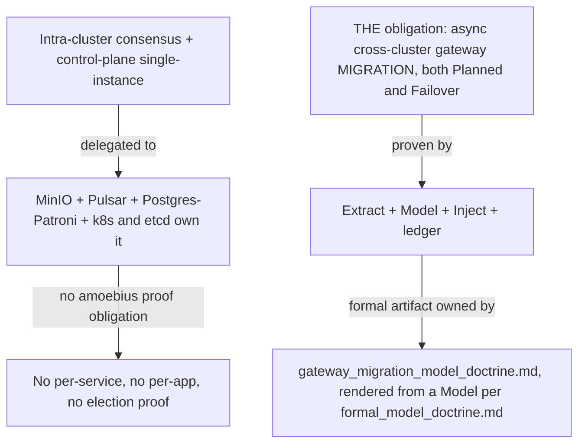
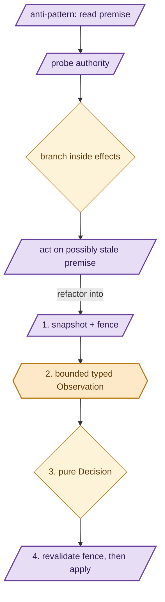
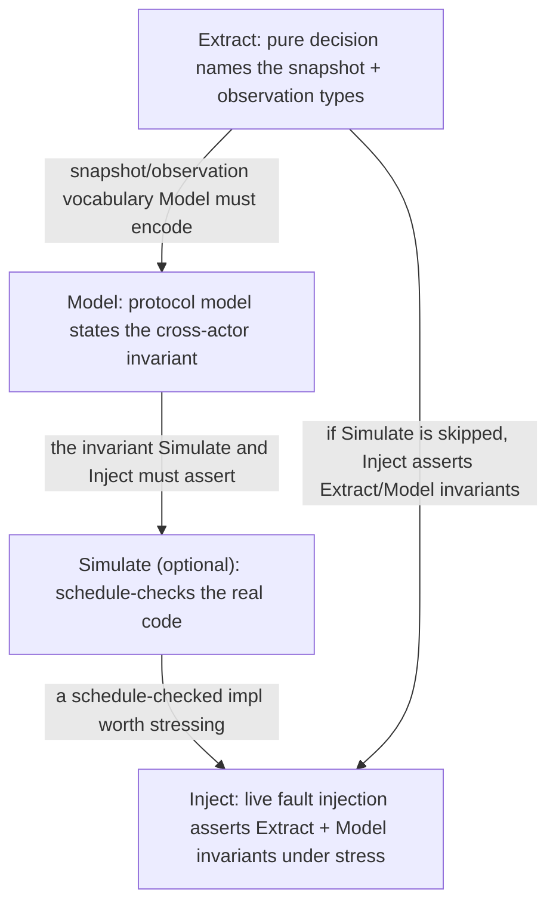

# Chaos and Failover

> **Purpose**: Single Source of Truth for how amoebius establishes failure behaviour — the three moves, what each
> one may claim, and the single obligation the whole method concentrates on.
> **Read this if**: a failure claim has to be made, or an existing one has to be read for what it actually
> establishes.

This document is the hub of the chaos-and-failover family. It owns the defect class, the concentration
principle, the three moves, and the honesty rule that binds every claim they support. The forest boundary is
carried by [chaos_failover_second_axis.md](./chaos_failover_second_axis.md) and the worked instances by
[chaos_failover_worked_examples.md](./chaos_failover_worked_examples.md). The migration this method exists to
discharge is owned by [gateway_migration_doctrine.md](./gateway_migration_doctrine.md).

<details>
<summary>Link-graph metadata</summary>

**Status**: Authoritative source
**Supersedes**: N/A
**Referenced by**: DEVELOPMENT_PLAN/overview.md, DEVELOPMENT_PLAN/phase_16_deterministic_sim_substrate.md, DEVELOPMENT_PLAN/phase_17_gateway_migration_model.md, DEVELOPMENT_PLAN/phase_48_test_workflow_algebra.md, DEVELOPMENT_PLAN/phase_63_platform_services_2.md, DEVELOPMENT_PLAN/phase_67_pulsar_client.md, DEVELOPMENT_PLAN/phase_69_content_store_workflow.md, DEVELOPMENT_PLAN/phase_71_release_lifecycle.md, DEVELOPMENT_PLAN/phase_74_multicluster_spawn_georepl.md, DEVELOPMENT_PLAN/phase_75_gateway_migration_drills.md, DEVELOPMENT_PLAN/phase_76_provider_deploy_checkpoint.md, DEVELOPMENT_PLAN/phase_77_provider_child_bringup.md, DEVELOPMENT_PLAN/phase_78_provider_ebs_credential.md, DEVELOPMENT_PLAN/phase_79_provider_dynamic_nodes.md, documents/documentation_standards.md, documents/engineering/README.md, documents/engineering/app_vs_deployment_doctrine.md, documents/engineering/bootstrap_sequence_doctrine.md, documents/engineering/chaos_failover_second_axis.md, documents/engineering/chaos_failover_worked_examples.md, documents/engineering/cluster_lifecycle_doctrine.md, documents/engineering/cluster_topology_doctrine.md, documents/engineering/consistency_pacelc_doctrine.md, documents/engineering/content_addressing_doctrine.md, documents/engineering/daemon_topology_doctrine.md, documents/engineering/deterministic_simulation_doctrine.md, documents/engineering/formal_model_doctrine.md, documents/engineering/gateway_migration_doctrine.md, documents/engineering/gateway_migration_model_doctrine.md, documents/engineering/monitoring_doctrine.md, documents/engineering/network_fabric_doctrine.md, documents/engineering/platform_services_doctrine.md, documents/engineering/pulsar_client_doctrine.md, documents/engineering/pulumi_iac_doctrine.md, documents/engineering/readiness_ordering_doctrine.md, documents/engineering/release_lifecycle_doctrine.md, documents/engineering/resource_capacity_doctrine.md, documents/engineering/resource_capacity_sources.md, documents/engineering/resource_capacity_storage.md, documents/engineering/single_logical_data_plane_doctrine.md, documents/engineering/test_derivation_analysis.md, documents/engineering/testing_doctrine.md, documents/engineering/tla_modelling_assumptions.md, documents/engineering/vault_pki_doctrine.md, documents/illegal_state/illegal_state_capacity.md, documents/illegal_state/illegal_state_catalog.md, documents/illegal_state/illegal_state_lifecycle.md, documents/illegal_state/illegal_state_multicluster.md, documents/illegal_state/illegal_state_security.md, documents/illegal_state/illegal_state_techniques.md, documents/illegal_state/illegal_state_topology.md, documents/reading_order.md
**Generated sections**: none

</details>

> **Historical result (invalidated).** Every phase-run or implementation-result statement in this document is permanently invalidated diagnostic history. It cannot establish or reactivate current status, even if a phase later advances. Target doctrine remains normative; current status is solely in the [tracker](../../DEVELOPMENT_PLAN/README.md).

## Contents
- [1. The defect this doctrine targets](#1-the-defect-this-doctrine-targets)
- [2. When this applies — the gate](#2-when-this-applies--the-gate)
- [3. The defect class — one shape, two disguises](#3-the-defect-class--one-shape-two-disguises)
- [4. Two traditions, and the quiet third](#4-two-traditions-and-the-quiet-third)
- [5. Three layers, and the blindness that binds them](#5-three-layers-and-the-blindness-that-binds-them)
- [6. The concentration principle — where the obligation lives](#6-the-concentration-principle--where-the-obligation-lives)
- [7. The honest limits the moves inherit](#7-the-honest-limits-the-moves-inherit)
- [8. Move I — Extract: make the decision a value](#8-move-i--extract-make-the-decision-a-value)
- [9. Move II — Model: prove the protocol, not the program](#9-move-ii--model-prove-the-protocol-not-the-program)
- [10. Simulate — the pure program, lifted: io-sim](#10-simulate--the-pure-program-lifted-io-sim)
- [11. Move III — Inject: break the running thing on purpose](#11-move-iii--inject-break-the-running-thing-on-purpose)
- [12. The moral core — proven, tested, assumed](#12-the-moral-core--proven-tested-assumed)
- [13. The supporting rules — the conditions the moves need](#13-the-supporting-rules--the-conditions-the-moves-need)
- [14. Sequencing — a fixed dependency, a free order](#14-sequencing--a-fixed-dependency-a-free-order)
- [15. The conformance matrix — what does this project demonstrate?](#15-the-conformance-matrix--what-does-this-project-demonstrate)
- [16. The Second Axis — when one cluster becomes a forest](#16-the-second-axis--when-one-cluster-becomes-a-forest)
- [17. The boundary and its classifier](#17-the-boundary-and-its-classifier)
- [18. The rules scale to the boundary](#18-the-rules-scale-to-the-boundary)
- [19. The cross-boundary ledger and conformance rows](#19-the-cross-boundary-ledger-and-conformance-rows)
- [Appendix A — retired (control-plane single-instance is delegated to k8s/etcd)](#appendix-a--retired-control-plane-single-instance-is-delegated-to-k8setcd)
- [Appendix B — Worked example (fenced): cross-cluster geo-replication failover (the open cross-cluster failover question)](#appendix-b--worked-example-fenced-cross-cluster-geo-replication-failover-the-open-cross-cluster-failover-question)
- [Appendix C — Worked example (fenced): active-active mutable state across the cluster boundary](#appendix-c--worked-example-fenced-active-active-mutable-state-across-the-cluster-boundary)
- [20. Epilogue — the honest system](#20-epilogue--the-honest-system)
- [Related Documents](#related-documents)

---

> **Honesty up front.** Prescriptive statements below are target design. Current implementation and
> revalidation progress live in the [tracker](../../DEVELOPMENT_PLAN/README.md#current-implementation-audit),
> and every result attributed to sibling prodbox is evidence from another system, never an amoebius result.
> The proven/tested/assumed rule
> ([documentation_standards.md §6](../documentation_standards.md#6-honesty-the-proventestedassumed-discipline))
> is this document's own moral core ([§12](#12-the-moral-core--proven-tested-assumed)).

## 1. The defect this doctrine targets

A control-plane decision is unsound when it acts on a premise that was true when read and false when acted on.
Two illustrations fix the shape.

**Intra-cluster.** Two control-plane candidate pods each read the commit log, each observe no claim fresher than
their own, and each conclude they may reconcile the cluster and mint its secrets. If both act on that
observation, two daemons hold control-plane daemon authority at once — a split-brain the individual reads never revealed.
(amoebius forecloses this specific case by delegating single-instance to k8s/etcd,
[§6](#6-the-concentration-principle--where-the-obligation-lives); the shape is retained here because it recurs.)

**Cross-cluster.** A child cluster's gateway goes silent. A sibling reads its last geo-replicated offset,
observes nothing past it, and promotes itself, repoints DNS, and resumes — but the silent cluster had
*acknowledged* writes that never crossed the replication boundary. The two clusters then hold durably-divergent
histories.

Both decisions are correct for the state each actor read and wrong for the state it acted in. The defect is
neither a typo nor an off-by-one: it is **a decision made on a premise that was true when read and false by the time it was acted on**, and it is detected only at **runtime**, in the deployed forest — a single-threaded test
never schedules the two actors whose interleaving exposes it
([§3](#3-the-defect-class--one-shape-two-disguises)). The shape recurs in any branch taken against
externally-mutable state, and most sharply across the asynchronous gap between clusters.

The discipline against it has three moves — **Extract**, **Model**, **Inject** — each blind to the failures the
other two catch ([§5](#5-three-layers-and-the-blindness-that-binds-them)). The amoebius-specific narrowing
([§6](#6-the-concentration-principle--where-the-obligation-lives)): because the standard platform services run
their own consensus, the obligation does not spread across every app — it **concentrates** onto the one boundary
[§6](#6-the-concentration-principle--where-the-obligation-lives) identifies.

---

## 2. When this applies — the gate

This discipline earns its cost only when **all three** of these hold:

1. **Decisions under concurrency** — the system takes branches (claim or yield, promote or wait, fail over
   or stall, debit or reject) whose correctness depends on state another actor can change *while the
   decision is being made*.
2. **Coordination only through shared, durable substrates** — actors share no in-memory state; they agree
   only through a log, a broker, an object store, or a database. In amoebius that substrate is the
   **coordination plane: Pulsar + MinIO + the signed, hash-chained commit log**
   ([daemon_topology_doctrine.md §5.2](./daemon_topology_doctrine.md#52-the-coordination-plane-is-for-worker-events-and-audit-not-leadership)).
3. **A safety invariant no single actor can enforce alone** — *exactly one control-plane daemon*,
   *exactly-once effect under redelivery*, *no split-brain gateway across clusters* — belongs to a
   protocol spanning several actors plus the substrate, not to any one process.

If a subsystem meets all three, the [§3](#3-the-defect-class--one-shape-two-disguises) defect is **present whether or not it has ever been observed**.
If it fails the gate — a single process, or no cross-actor invariant — most of what follows is
over-engineering, and the honest thing is to stop.

**A handful of plain terms** carry the argument; meet them once.

- **Decision** — a branch taken in effectful code on the basis of observed state.
- **Premise** — the state a decision assumes true at the instant it branches.
- **Snapshot** — a single, atomically-captured read of state (everything captured *together*, as of one
  instant).
- **Observation** — the *typed* result of probing state that **may not resolve**: success, failure, or an
  explicit *not-yet-known*. An Observation is the opposite of quietly turning "I couldn't tell" into a
  definite answer.
- **The three layers** — *Decision* (inside one process), *Protocol* (across processes), *Runtime* (the
  live, deployed forest). They are the spine of [§5](#5-three-layers-and-the-blindness-that-binds-them), and each has its own move.

A harder vocabulary — *consistency boundary*, *invariant-confluence*, *escrow* — is needed only by data
replicated across more than one strongly-consistent domain. It is deferred to [§16](#16-the-second-axis--when-one-cluster-becomes-a-forest), behind a gate. In
amoebius that boundary is the **cluster boundary**: synchronous within a cluster (delegated, [§6](#6-the-concentration-principle--where-the-obligation-lives)),
asynchronous across.

---

## 3. The defect class — one shape, two disguises

Every defect this doctrine targets has the same shape: **a decision taken across a sequence of non-atomic effects, on a premise that was true at snapshot time but is trusted after it could have changed.** In its
barest form:

```text
  premise  := atomically read shared state          -- true at instant t0
  evidence := probe an external authority            -- resolves at instant t1 > t0, non-atomically
  branch   := act on (premise, evidence)             -- but the world at t1 != the world at t0
```

Between `t0` and `t1`, another actor can quietly invalidate the premise: a peer emits a fresher claim, a
geo-replicated write lands, the elected owner yields. The branch is then taken on a **self-contradictory input** — a premise from one instant fused with evidence from another. The two control-plane daemon candidates of
[§1](#1-the-defect-this-doctrine-targets) are exactly this; so are the two clusters, with **replication lag** now playing the role of the
gap between `t0` and `t1`.

The shape wears two recurring disguises:

- **Timeout-coerces-unknown.** A probe that times out or errors is read as a *definite negative* — "no
  fresher claim exists," "the peer cluster is dead," "there are no committed effects past offset `X`" —
  when the truthful value is *unknown*. A timeout is not a negative acknowledgement; it is the absence of a response.
- **State-conflation.** Two genuinely distinct conditions — *not-yet-replicated* vs *does-not-exist*,
  *partitioned-from-peer* vs *peer-is-dead*, *outbound-reachable* vs *inbound-fresh* — are collapsed into
  one branch, so the decision cannot even represent the cases that demand different actions.

This defect survives a test suite because surfacing it requires a *specific interleaving of two
actors*, and a single-threaded test never runs two actors. It is the canonical "once in N thousand runs"
defect: real, rare, and never reproducible on demand. **Testing alone cannot establish confidence here; confidence requires reasoning and experiment in three different registers** — which [§5](#5-three-layers-and-the-blindness-that-binds-them) makes precise.

---

## 4. Two traditions, and the quiet third

The industry built two established traditions for trusting distributed systems, one far more widely practiced
than the other.

**Prove the design.** Before a protocol is trusted, write it down precisely enough that a machine can
explore every interleaving and check the bad thing never happens. This is *formal methods* — Lamport's
**TLA+** and **TLC** (descended from *Time, Clocks, and the Ordering of Events*, CACM 1978, and *The
Temporal Logic of Actions*, TOPLAS 1994), Jackson's Alloy. Its industrial case was made by Amazon: in *How
Amazon Web Services Uses Formal Methods* (Newcombe et al., CACM 2015), model checking a DynamoDB
replication algorithm found a defect whose **shortest error trace was 35 high-level steps** — one that had
survived design review, code review, and testing. The lesson: **the improbability of a 35-step compound event is not its impossibility.** A test never gets that lucky; a model
checker explores every interleaving in scope, so it gets "lucky" by construction. It guards the
**Protocol** layer.

**Break the deployment.** Confidence about how a large system *fails* cannot be reached by reasoning alone, so
induce failures on purpose under observation. This is *chaos engineering* — Jesse Robbins's GameDays
at Amazon (~2003), Google's DiRT, and Netflix's **Simian Army** (Chaos Monkey 2010–11, escalating to Chaos
Gorilla and Chaos Kong). Its 2015 *Principles of Chaos Engineering* put it plainly: software has *no
transfer function*, so to learn how it fails "we must use an empirical approach." It guards the **Runtime**
layer.

**A necessary honesty on lineage.** The *Byzantine Generals Problem* (Lamport, Shostak & Pease, TOPLAS
1982) — agreement when nodes lie — is intellectual ancestry here, **not** a claim about amoebius. Tolerating
arbitrary lying nodes needs `3f + 1` replicas and heavy machinery. amoebius assumes the gentler models:
*crash-recovery* and *omission/partition*, the world of Paxos/Raft (`2f + 1`). amoebius invokes Byzantium for the
discipline it founded — formalize agreement under faults — not because anything here defends against
traitors.

And there is a quieter third discipline most teams already practice without naming: **make the decision explicit.** Pull the branch out of the tangle of effects into a pure, typed function of its inputs, so it
becomes a *value* that can be examined, exhausted, and reasoned about — the world of types, pure functions, and
property-based testing (QuickCheck; Claessen & Hughes, ICFP 2000). It guards the **Decision** layer, it is
the cheapest of the three, and **it is the move to apply first**, because it produces the vocabulary
the other two need to say anything at all.

Three traditions, three layers, three moves:

> **Extract** the decision · **Model** the protocol · **Inject** the faults.

**And in amoebius, all three are Haskell.** The quiet third move is the native idiom of a typed functional
language. The constituent **prodbox** behaviour already lives there — pure decision functions over a
commit log (`canWriteDns`, `nodeDisposition` in `prodbox/src/Prodbox/Gateway/Types.hs`),
the Plan / Apply split, the type system as a zero-cost design check. The spine of [§10](#10-simulate--the-pure-program-lifted-io-sim) is
one ladder: make the **decision** pure (Extract), then the **command** pure (Plan / Apply), then — with
`io-classes` and `io-sim` — the **whole concurrent program** pure, run as a deterministic model under test
and as the production daemon from a single source. *Build it pure; lift it whole.*

---

## 5. Three layers, and the blindness that binds them

A concurrency defect can live in any of three layers, and **each layer is structurally invisible to the tools that guard the others** — not because the tools are weak, but because they are *looking somewhere
else*.

| Layer | The move that guards it | What that move still cannot see | Strongest claim it yields |
|---|---|---|---|
| **Decision** (one process) | **Extract** ([§8](#8-move-i--extract-make-the-decision-a-value)), with the type system as a free head start | whether the *protocol* those decisions compose into is sound | **proven** (purity/totality in code; the property when finite) |
| **Protocol** (across processes) | **Model** ([§9](#9-move-ii--model-prove-the-protocol-not-the-program)) | whether the *code* refines the model; real-time / clock-skew premises | **proven for the model only** |
| **Runtime** (the live forest) | **Inject** ([§11](#11-move-iii--inject-break-the-running-thing-on-purpose)) | the interleavings not injected; soundness | **tested**, never proven |

Stated as three flat facts: a perfect Decision-layer proof says **nothing** about whether the protocol is
sound; a green Protocol model says **nothing** about whether the code refines it or the live timeouts hold;
a passing Runtime fault test says **nothing** about the interleavings it did not schedule, and can never
show an invariant is *sound* — only that it survived the faults chosen.

There is a **fourth blindness**, orthogonal to these three: **every move is blind to a storage consistency boundary unless that boundary is explicitly modeled in.** In amoebius that boundary is the cluster
boundary. A forest whose data is geo-replicated across clusters has a whole second axis of failure that no
amount of Extract, Model, or Inject on a single cluster will reveal. That axis is real, it is hard, and it
is deferred on purpose to [§16](#16-the-second-axis--when-one-cluster-becomes-a-forest).

---

## 6. The concentration principle — where the obligation lives

This section distinguishes amoebius's doctrine from a generic one: it is why the proof obligation is
tractable.

A naive reading of [§2](#2-when-this-applies--the-gate) suggests an unbounded obligation: amoebius runs Pulsar, MinIO, Vault, Postgres,
ten standard services, N worker daemons, and an arbitrary app on every cluster in a recursive forest — so
it appears as if *every* component carries its own split-brain proof obligation. It does not. The obligation
**concentrates**, because of two structural facts amoebius commits to.

**Fact one: intra-cluster consensus and single-instance are delegated, not re-proved.** The durable,
consensus-bearing standard services delegate their own replication/failover mechanics: MinIO erasure-codes
and quorum-replicates within a cluster; Pulsar's brokers/bookies own subscription and
acknowledgment semantics ([platform_services_doctrine.md §6](./platform_services_doctrine.md#6-pulsar--the-event-and-workflow-backbone-new-vs-prodbox));
Percona/Patroni Postgres runs streaming replication with its own leader election. The Patroni delegation is
*effectively lossless* only under an explicitly-mandated configuration, not by Patroni's default: Patroni
defaults to **asynchronous** streaming replication, and a non-strict `synchronous_mode` degrades to async
when no synchronous standby is available — so an intra-cluster Patroni failover can lose acknowledged commits
(**RPO>0**), which would contradict the Consistency classification and the `PlannedIsLossless` premise. The
lossless-delegation premise therefore holds only where `synchronous_mode: on`, a decided strict-versus-non-strict
stance (with the named behavior when no synchronous standby exists), and `maximum_lag_on_failover` are set as a
**required typed platform-service invariant** — owned by
[platform_services_doctrine.md §8](./platform_services_doctrine.md#8-postgres--patroni-via-percona-one-cluster-per-consumer-with-pgadmin) —
not left to Patroni's default. Phase 63 owns the live acceptance criterion for that premise: an independent
oracle must match `synchronous_mode: on`, `synchronous_mode_strict: on`, and
`maximum_lag_on_failover: 1048576` on a Ready three-member Patroni cluster, while the async-default mutant
must fail for its specific reason. Even that observation would establish only that the delegation precondition
was rendered and operated, not prove Patroni consensus or a multi-zone failover theorem. amoebius **delegates** the
synchronous-HA correctness obligation to these systems rather than re-deriving it. Pulsar supplies any
topic-lifecycle coordinator's sole-consumer behavior through its subscription and deduplicated-delivery
contracts; amoebius introduces no coordinator election
([pulsar_client_doctrine.md](./pulsar_client_doctrine.md)). Redis is deliberately outside this durability
claim: its primary/replica/Sentinel topology improves
availability of ephemeral WebSocket routing, while lost fanout repairs from durable cursors/receipts
([ui_realtime_coordination_doctrine.md](./ui_realtime_coordination_doctrine.md)). **Crucially, the control-plane daemon's single-writer authority is likewise delegated — to Kubernetes/etcd.** The control-plane daemon is a Deployment
`replicas=1` protected by the mandatory reconciler `Lease`, never a bespoke amoebius election
([daemon_topology_doctrine.md §3](./daemon_topology_doctrine.md#3-the-control-plane-daemon)); amoebius does
not duplicate the consensus etcd already provides. The governing rule is stated directly: *amoebius wants TLA+
only for distributed problems that aren't already handled by systems that do their own consensus and
georeplication (minio, pulsar, postgres, k8s/etcd).*

**Fact two: chaos, HA, geo-replication, and failover are deployment-rules, never application logic.** A
bounded low-code UI program that presents an infernix or jitML workflow is written **once**; its replica count,
chaos-testing, geo-replication, and failover behaviour are an *orthogonal deployment-rules surface*
([app_vs_deployment_doctrine.md](./app_vs_deployment_doctrine.md)). So a per-app failover proof never
arises: there is no app-specific failover logic to prove. The distribution behaviour is configured at the
platform layer and proven *there, once.*

Put the two facts together and the obligation collapses onto exactly **one** boundary:


```mermaid
flowchart TD
%% register: orientation
  delegated[Intra-cluster consensus + control-plane single-instance] -->|delegated to| systems[MinIO + Pulsar + Postgres-Patroni + k8s and etcd own it]
  systems -->|no amoebius proof obligation| none[No per-service, no per-app, no election proof]
  axis[THE obligation: async cross-cluster gateway MIGRATION, both Planned and Failover] -->|proven by| method[Extract + Model + Inject + ledger]
  method -->|formal artifact owned by| model[gateway_migration_model_doctrine.md, rendered from a Model per formal_model_doctrine.md]
```
*Orientation. Design intent. What is delegated to systems that already solve it, and the single obligation that is not; the concentration argument is owned by [§6](#6-the-concentration-principle--where-the-obligation-lives).*

- **The one obligation — the async cross-cluster gateway migration.** Across clusters, geo-replication is
  asynchronous and the wild-ingress gateway can move from one cluster to another — a **`Planned`** coordinated
  RPO=0 handover *and* a **`Failover`** survivor-takeover ([gateway_migration_doctrine.md](./gateway_migration_doctrine.md)).
  *This* is where the genuinely new, hard amoebius obligation lives — the boundary no single system proves
  end-to-end. Its authority is exercised as **external side effects** — a route53 DNS write and Vault — that
  validate no broker epoch, so no off-the-shelf fence discharges it; the *intra-cluster* single-instance of the
  writer is delegated to k8s/etcd (Fact one), but **which cluster owns the record, and how ownership moves across clusters, is amoebius's own**. The doctrine flags it as genuinely "tricky": *asynchronous
  geo-replication is hard. what exactly happens if a cluster goes down mid geo-sync and we try to failover the
  gateway to that cluster? we need to prove we always have well-defined behaviour.* The whole of
  [§16](#16-the-second-axis--when-one-cluster-becomes-a-forest)–[§19](#19-the-cross-boundary-ledger-and-conformance-rows)
  and Appendix B exist to answer it; the model that discharges it is owned by
  [gateway_migration_model_doctrine.md](./gateway_migration_model_doctrine.md).

(Historically this doctrine named *two* axes — a "First Axis" in-cluster control-plane election and this
"Second Axis" cross-cluster boundary. The First Axis is **retired**: single-instance is delegated to k8s/etcd
per Fact one, so amoebius runs no election and there is no in-cluster proof obligation. Only the cross-cluster
gateway migration remains.)

Everything intra-cluster and synchronous — **including the control-plane daemon's single-instance** — is a
solved problem owned by another system; amoebius spends its formal-verification budget on the **one** invariant
that is uniquely its own, and on nothing else. (Shorthand: delegate the easy proofs, concentrate the hard one.)
A proof obligation that appears anywhere *other* than this one boundary **indicates a modelling error** —
usually a sign that a deployment-rules concern leaked into app logic, or that someone is re-proving what
Pulsar/MinIO/Postgres/etcd already prove.

---

## 7. The honest limits the moves inherit

Each tradition hands its move both its power and its limits; record the limits now, because [§12](#12-the-moral-core--proven-tested-assumed) turns them
into ledger rows.

**Model cannot:** check the *code* (only a model — model and code drift); explore beyond a **bounded, finite scope** (the check covers 2–3 actors, not 3,000); reason in **real time** (it runs in logical time, so
clock skew and lease timing are abstracted away, not verified — R8); or check invariants that were never
stated. These are not weaknesses to apologize for — they are exactly where Model hands off to Inject and to
the [§13](#13-the-supporting-rules--the-conditions-the-moves-need) rules.

**Inject cannot:** be exhaustive (it **samples** the faults injected); prove *soundness* (a green chaos
run is evidence, not proof); or mean anything without observability, a steady-state signal, and disciplined
blast-radius control. Done as Netflix did it — scheduled, watched, escalating, bounded — Inject is
fire-drill engineering; done carelessly it is just a self-inflicted outage.

**Extract cannot:** establish the *cross-process* invariant. A pure decision is only ever as sound as the
observation and fence handed to it; whether the protocol those decisions compose into upholds the
cluster-wide invariant is a question Extract structurally cannot answer. That is Model.

---

## 8. Move I — Extract: make the decision a value

> **Extract** the decision · Model the protocol · Inject the faults.

**The move.** Take the branch out of the effects. A decision must be a **pure function of typed inputs captured with an explicit freshness contract** — effectful code may *capture* the inputs and *apply* the
result, but it **must not compute the branch in the middle of a race.** Every decision follows a four-stage
pipeline:

Diagram vocabulary: [diagram_conventions.md](./diagram_conventions.md).


```mermaid
flowchart TD
%% register: algebra
  T1[/"anti-pattern: read premise"/]:::effect --> T2[/"probe authority"/]:::effect
  T2 --> T3{"branch inside effects"}:::decision
  T3 --> T4[/"act on possibly stale premise"/]:::effect
  L1[/"1. snapshot + fence"/]:::effect --> L2{{"2. bounded typed Observation"}}:::gate
  L2 --> L3{"3. pure Decision"}:::decision
  L3 --> L4[/"4. revalidate fence, then apply"/]:::effect
  T4 -->|"refactor into"| L1
  classDef gate     fill:#fde9c8,stroke:#b8791b,color:#5c3a06,stroke-width:2px
  classDef decision fill:#fdf3d8,stroke:#b8791b,color:#5c3a06,stroke-width:1px
  classDef effect   fill:#e7ddf5,stroke:#6b3fa0,color:#2f1a52,stroke-width:2px
```

*Design intent. Two effectful seams — the snapshot/fence capture and the revalidate-then-apply — bracket a pure three-valued Observation gate and a pure Decision; the anti-pattern instead folds read, probe, branch, and act into one race. The fence's live freshness is runtime-checked at apply, not proven here.*

Three sub-rules make it sound:

- **The typed-unknown rule.** A probe that times out, errors, or has not resolved must yield an explicit
  *not-yet-observed* value — never a coerced definite. This is the direct remedy for both disguises of [§3](#3-the-defect-class--one-shape-two-disguises).
  A decision may deliberately coerce an unknown to a definite **only when** the coercion can affect
  **liveness** but **not** the safety invariant — i.e. a separate mechanism (a convergent-log gate, a
  fail-closed apply step) enforces safety regardless. State which case applies; an unexamined coercion is
  the [§3](#3-the-defect-class--one-shape-two-disguises) defect by default.
- **Bound everything.** Every probe, retry, queue, and wait carries an explicit finite bound. An unbounded
  effect reintroduces an instant the decision cannot reason about.
- **Fence or revalidate safety-critical freshness.** If safety depends on "the premise is still true," the
  snapshot carries a version, lease, epoch, CAS token, or **log offset** that the apply step revalidates in
  the *same atomic operation* as the effect.

**Why it works.** When the branch is pure over typed inputs it cannot silently collapse unknown into false,
and it cannot hide an effectful branch in the middle of a race. The branch becomes a *value* — and a value
can be exhaustively property-tested without a cluster, a clock, or a network. (This is the level the type
system already operates at, for free: a GADT-indexed state machine makes illegal transitions *compile
errors* — see [illegal_state_catalog.md](../illegal_state/illegal_state_catalog.md). Extract extends that reach to the
runtime values the type system can't see.)

**The amoebius shape.** The **cross-cluster gateway-ownership decision** — which cluster holds the
wild-ingress gateway — **is** this, re-derived from the gateway single-writer shape the `prodbox` seed exhibits. (Intra-cluster
single-instance is delegated to k8s/etcd — there is no in-cluster election to extract — so the decision that
remains amoebius's own is this cross-cluster one, [§6](#6-the-concentration-principle--where-the-obligation-lives).)
The ownership decision is a *deterministic total function* over the ranked cluster-candidate set folded from the
convergent commit log; the owner-only action (write the gateway DNS record, drive the migration) is gated by a
second pure predicate over the **log**: *may-act = (I am the computed
owner) ∧ (my latest claim is unsuperseded by a later yield)*. Because the gate folds over the convergent
log rather than local belief, it is pure *because its input converges*. The election *shape* is owned by
[daemon_topology_doctrine.md §5](./daemon_topology_doctrine.md#5-single-instance-and-coordination--delegated-not-elected); this doctrine owns the rule that the
decision must be Extracted before it can be modeled.

**The deeper structural form, and its boundary limit.** The strongest Extract makes the observation a
*fold over a replicated append-only log* (the commit log over Pulsar + MinIO), so the decision is pure
*because its input is convergent*, not merely because it was wrapped. But that convergent-fold form
converges **only within one consistency boundary** ([§16](#16-the-second-axis--when-one-cluster-becomes-a-forest)): where the log is geo-replicated asynchronously
across the cluster boundary and both sides append, each side's fold stays perfectly pure and the two
results can still disagree. **Purity does not imply agreement once the substrate has a boundary** — a
thread [§16](#16-the-second-axis--when-one-cluster-becomes-a-forest) picks up.

---

## 9. Move II — Model: prove the protocol, not the program

> Extract the decision · **Model** the protocol · Inject the faults.

**The move.** State the cross-actor safety invariant and machine-check it against a **model of the protocol** that includes the adversarial actions — concurrent claim, message reordering and duplication,
and **actor crash** — explored to exhaustion within a bounded scope. (TLA+/TLC and Alloy are the usual
tools; the technique, not the tool, is the rule.)

**Why it works.** The *catastrophic* failure — two daemons both believing they are the control-plane daemon, or two
clusters both believing they hold the gateway — lives in the Protocol layer, which Extract cannot reach. A
flaw there is wrong *regardless of how perfectly the code is written*, so no test of the implementation can
reveal it; only checking the algorithm can. The DynamoDB 35-step trace ([§4](#4-two-traditions-and-the-quiet-third)) is the canonical proof that
"astronomically lucky" is not a plan.

**How to know the move is complete.** There is a model of the protocol; it encodes crash and reordering, not
just the happy path; it states the safety invariant (e.g. *at most one active control-plane daemon*) and at least one
liveness property (*a cluster with a live candidate eventually has exactly one*); and a checker explores it
to exhaustion at a scope that **matches the real actor count**. The model's vocabulary — the snapshot and
observation *types* — should be the very ones Extract named. In amoebius the liveness property is a
`modelProperties` temporal goal under a **named fairness assumption**, checked by TLC (never the in-process
explorer, which is safety-only) — the mechanics owned by
[formal_model_doctrine.md §3](./formal_model_doctrine.md#3-two-total-renderings)/[§6](./formal_model_doctrine.md#6-what-a-green-model-check-proves-and-what-it-does-not); the fairness is itself a
named *assumed* premise, sibling to the R8 synchrony premise.

The canonical failover hazard the model must rule out is a **deposed actor that still believes it owns the resource and keeps acting.** The remedy is not a local flag but to gate every owner-only action on
**convergent proof of current ownership** — the [§8](#8-move-i--extract-make-the-decision-a-value) log-fold, where the action is permitted only when the
actor observes its own current, unsuperseded claim in the replicated log — so a stale owner cannot act on a
belief the rest of the cluster has already overwritten.

Where the invariant is **impossibility-bounded** (R7), state it *conditionally* — e.g. *at most one
control-plane daemon once views converge* — model it with that condition explicit, and verify two things: that the
invariant holds inside the condition, and that any violation outside it (under partition) is **bounded and self-healing** rather than permanent.

**SSoT — who owns the spec.** This doctrine owns the *requirement* to model the two concentrated invariants
([§6](#6-the-concentration-principle--where-the-obligation-lives)) and the honesty rule on what a green model means. The **concrete TLA+ spec and its invariant catalog**
are owned by
[gateway_migration_model_doctrine.md](./gateway_migration_model_doctrine.md), and split across the two tiers: the
**design-model and invariant catalog** are authored and TLC-checked design-first in **Phase 17** (Tier 1 —
proven for the model at scope, needing no runtime); model↔decision-core correspondence is **differentially checked** there (`interpret` and `emitTLA` render one `Model`, eliminating a per-model correspondence table but
still requiring renderer-faithfulness tests),
while the residual **runtime-fidelity** check — that the built forest's real physics hold — is the **Tier-2**
obligation confirmed by **Register-3 chaos injection** in **Phase 75**. The sibling prodbox spec
(`prodbox/documents/engineering/tla/gateway_orders_rule.tla`, six invariants explored to
~4.4M states at scope 3, `prodbox dev tla-check`) is **evidence from a sibling system, not an amoebius proof** — its invariants `UniqueOwner` / `NoTugOfWar` / `ControlPlaneTakeover` are exactly the shape amoebius
must re-establish for its own model.

**What this move cannot see — the honest limit.** Model checks the **design, not the code.** A green model
does not prove the implementation refines it; model and code drift, and a bounded scope hides any bug that
needs more actors than the scope allows. A model in **logical time** says nothing about the
**real-time / clock-skew** premises the implementation depends on (R8). Record these limits explicitly
([§12](#12-the-moral-core--proven-tested-assumed)) so a green model is never mistaken for a proof of the running system.

(Once the substrate has a **consistency boundary** ([§16](#16-the-second-axis--when-one-cluster-becomes-a-forest)), the deposed-actor remedy *weakens*: the proof of supersession must now propagate across an asynchronous gate, so its latency is the replication lag, and a deposed side can keep acting for up to that lag. The remedy then no longer *prevents* the deposed-actor window — it only **bounds it to the lag** — leaving a residual, self-healing violation [§18](#18-the-rules-scale-to-the-boundary) must reconcile.)

---

## 10. Simulate — the pure program, lifted: io-sim

> Extract the decision · *(Simulate the schedule)* · Model the protocol · Inject the faults.

Extract made the *decision* a pure value; Plan / Apply makes the *command* a pure value applied by one
effectful boundary; the last rung makes the **whole concurrent program** a pure value too — and runs it as
a deterministic model under test and as the production daemon from a single source. *Build it pure; lift it
whole.*

**The move (conditional).** Where the in-process concurrency is intricate enough that Extract's purity
boundary still leaves real schedule-dependent behaviour — interacting retry loops, cancellation, async
exceptions, several loops racing over shared state — run the **real in-process code** against an
**adversarial deterministic scheduler with simulated time**, so a rare interleaving becomes
*deterministically replayable* instead of a once-a-month flake.

**The Haskell way: io-sim and io-classes.** [`io-classes`](https://hackage.haskell.org/package/io-classes)
is a set of typeclasses (`MonadSTM`, `MonadAsync`, `MonadTimer`, `MonadFork`, `MonadThrow`/`MonadCatch`)
mirroring `base`, `stm`, and `async`. A component is written polymorphic over a monad `m` carrying those
constraints, then an interpreter is chosen:

- in production, `m = IO` — the real daemon;
- under test, `m = IOSim s` — a **pure, discrete-event simulator** with deterministic scheduling, simulated
  time, and a granular trace down to the order STM transactions commit.

The same source is the model **and** the implementation. `IOSimPOR` adds **partial-order reduction** to
discover races and systematically explore schedules, and the library drives QuickCheck, so a discovered
interleaving returns as a *minimal, replayable counterexample*. io-sim was hardened for Cardano's
`ouroboros-network` (IOG / Well-Typed; maintained under IntersectMBO) — the Haskell peer of FoundationDB's
deterministic "Flow" and its descendants Antithesis and TigerBeetle.

**Why it would close amoebius's real gap.** Model's honest limit ([§9](#9-move-ii--model-prove-the-protocol-not-the-program)) is that a green TLA+ model does not
prove the *code* refines it. Lifting the control-plane daemon daemon onto io-classes would let the **real loops** run
under `IOSimPOR`, exercising interleavings neither the TLA+ model nor a pure decision test can reach, and
turning the model↔code correspondence from prose into something a test executes. amoebius starts from a
good place: the shared daemon spine already forbids `forkIO` and mandates structured `withAsync` /
`bracket` ([daemon_topology_doctrine.md §6](./daemon_topology_doctrine.md#6-the-shared-daemon-spine)), so the shapes lift cleanly.

**The cost, named (why it is optional and kept subordinate).** Lifting onto io-classes makes every
concurrency-touching signature polymorphic in `m` — a **standing tax on all future change**, not a one-time
edit. And it has a fidelity ceiling: its marquee scenario — several simulated actors racing — only
faithfully reproduces production when they genuinely share *in-process* state. amoebius daemons do **not**;
they coordinate through Pulsar + MinIO + the commit log, so an `IOSim` run of one daemon rests on a
hand-built stub of its peers, and the catastrophic *cross-actor* invariant is still better served by the
TLA+ model. The **in-process design-schedule check** — the pure decision run against hand-built peer stubs
under `IOSimPOR`, exercising the schedule the pure decision leaves open — **is adopted early, in Phase 17**, as
a Tier-1 design check, and its honest ledger entry ([§12](#12-the-moral-core--proven-tested-assumed)) reads
**tested (sampled schedules)** for the design.

**io-sim against the built runtime is adopted, not deferred — as Register 2.5 (deterministic simulation).** The
fidelity ceiling above is real but it is an argument for *modeling the coordinating substrates in*, not for
giving up: the FoundationDB/TigerBeetle/Antithesis move is to make Pulsar/MinIO/apiserver/route53/Vault/clock
**first-class simulated components with a typed fault model** and run the *real* daemon/reconciler code — lifted
onto `io-classes`, so one source is production and model — against them under `IOSimPOR`. The catastrophic
*cross-actor* invariant is still owned by the TLA+ model ([§9](#9-move-ii--model-prove-the-protocol-not-the-program)),
and DST does not re-prove the delegated consensus ([§6](#6-the-concentration-principle--where-the-obligation-lives));
what DST is specified to earn is that the daemon's real schedule, and its behaviour under injected
partition/reorder/redelivery/crash, are **validated in-process and deterministically replayable before any
live deployment**. The mechanics, the register's place in the spine, and the honest tradeoff it buys — replacing a
broad *unvalidated-until-live* surface with a narrow *modeled-environment-fidelity* premise, discharged by a
small Register-3 conformance suite — are owned by
[deterministic_simulation_doctrine.md](./deterministic_simulation_doctrine.md). The standing tax (polymorphism in `m`) is paid deliberately in exchange for it.

The first concrete rung is assigned to
[Phase 16](../../DEVELOPMENT_PLAN/phase_16_deterministic_sim_substrate.md): `Env m`, injected real clients, an
`IOSim` interpreter, six modeled substrates, and deterministic/POR replay of a reference reconciler. The
target keeps real-substrate fidelity assumed and live behavior unverified.

---

## 11. Move III — Inject: break the running thing on purpose

> Extract the decision · Model the protocol · **Inject** the faults.

**The move.** Subject the live forest to **fault injection that asserts the exact invariants Extract and Model established** — and make the injection *adversarial*, not merely benign: not asserting survival of a
reboot, but asserting that the control-plane daemon invariant holds when the owner is killed mid-claim under load, and
that the forest stays well-defined when a cluster is killed *mid geo-sync* and the gateway is failed over to
it.

**In amoebius, the fault harness is itself a Haskell-declared `InForceSpec` topology.** A test lazily renders any
serialized input beneath `.build/**`, spins up resources, runs a workflow, and — by definition — always tears
down, simulating HA failovers and
substrate quorum re-elections (etcd/Patroni); `suggest-test` detects the substrate and emits a representative one. That entire
machinery — the test-as-`InForceSpec` contract, `suggest-test`, the flagged test credentials, and the per-run
ledger artifact — is owned by [testing_doctrine.md](./testing_doctrine.md). This doctrine owns only the
rule that each concentrated invariant ([§6](#6-the-concentration-principle--where-the-obligation-lives)) must have an adversarial scenario asserting its *declared form*.

**Extend, don't build.** Most HA systems already inject *some* faults. The work is rarely to build a
harness from nothing; it is to **extend** the existing one with the scenarios that target what Extract and
Model newly assert. A parallel harness is waste.

**The benign-vs-adversarial axis — the maturity measure:**

- *Benign* (where most suites stop): one fault at a time, the system quiesced between faults — node
  restart, isolated failover, single dependency bounce. This proves *recovery from outages*.
- *Adversarial* (what this move demands): a fault injected **during** a critical operation, **under load**,
  with **concurrent** actors — kill the control-plane daemon mid-claim while writes are in flight; two candidates
  racing; partition, latency, packet loss; message reordering against the at-least-once guarantee; **kill a cluster mid geo-sync and fail the gateway over to it**; cascading faults with no recovery between. This
  proves the *correctness core holds under stress.* (Netflix's Monkey → Gorilla → Kong ladder is exactly
  this escalation; for amoebius, Kong is the cross-cluster gateway failover.)

**Crucially, distinguish chaos-failover from graceful teardown.** A *graceful* teardown drains, flushes to
a synchronization event, hands off the gateway, and releases compute while preserving storage — so it is
**lossless by construction**. A *chaos-failover* is the lead simply vanishing — no drain, no flush — so its
loss is bounded by the declared **data-loss budget**, not zero. That distinction is normative and owned by
[cluster_lifecycle_doctrine.md §5](./cluster_lifecycle_doctrine.md#5-teardown-with-cleanup-vs-chaos-failover-the-central-distinction); Inject must drill the *chaos* case,
because a graceful teardown that silently skips its cleanup steps is downgrading itself to a chaos event
and forfeiting the lossless guarantee.

**What this move cannot see.** It cannot prove soundness, and it cannot see the interleavings not
injected. A green Inject run is the strongest *empirical* confidence available and the weakest *logical*
guarantee — which is why the moves are plural.

### 11.1 The typed fault schedule: `ChaosSchedule` / `FaultTarget`

A chaos scenario is a typed value on the deployment-rules surface, not free-authored prose, so a fault can only
target a component the spec actually declares. The shape:

```haskell
ChaosSchedule  = NonEmpty FaultInjection
FaultInjection = { target :: FaultTarget, kind :: FaultKind, schedule :: FaultSchedule }
FaultKind      = < Partition | KillMidClaim | Latency | ReorderRedeliver | KillClusterMidGeoSync >
```

`FaultTarget` is a **projection over the enclosing `InForceSpec`'s declared components** — a fault handle
resolves only against a component the spec declares, the same derive-don't-author discipline that makes
tolerations, `NetworkPolicy`, and the readiness DAG projections of the spec rather than hand-authored fields
([readiness_ordering_doctrine.md](./readiness_ordering_doctrine.md)). A fault on a component the spec never
declared — a VPN partition in a spec with no VPN, a broker kill in a spec with no Pulsar — therefore has no
inhabitant, foreclosed at decode ([illegal_state_lifecycle.md §3.46](../illegal_state/illegal_state_lifecycle.md#346-a-chaos-fault-targeting-a-component-the-spec-never-declared)).

Each `FaultKind` names the invariant its drill stresses, so an Inject scenario asserts the *declared form* of a
concentrated invariant ([§6](#6-the-concentration-principle--where-the-obligation-lives)) rather than mere
survival of a reboot:

| `FaultKind` | The invariant the drill must not break |
|---|---|
| `Partition` / `KillClusterMidGeoSync` | `UniqueGatewayOwner` and `NoWriteAfterStaleFailover`, and — once views reconverge — the liveness `MergeConverges` ([gateway_migration_model_doctrine.md §3](./gateway_migration_model_doctrine.md#3-the-model)) |
| `KillMidClaim` | `PlannedIsLossless` and `SessionAlwaysRebindable` — no cutover strands a live session |
| `ReorderRedeliver` | R3 exactly-once — no effect lost or double-applied under redelivery ([§13](#13-the-supporting-rules--the-conditions-the-moves-need)) |
| `Latency` | the R8 synchrony bound — the fail-closed promotion gate fires before a too-stale cluster resumes service |

The harness that *runs* the schedule — the test-as-`InForceSpec` topology, `suggest-test`, and the
always-teardown contract — is owned by [testing_doctrine.md](./testing_doctrine.md); this doctrine owns the
typed shape and the `FaultKind`→invariant map.

### 11.2 The typed expectation surface: `Expectation`

A schedule that injects a fault and tears down cleanly asserts nothing. Without an expectation surface, a
drill's only pass/fail signals are the leak-inventory diff and the provision fold — neither of which is a
claim about the behaviour the fault was injected to stress, so a topology reports success having established
that the cluster was built and destroyed.

Admitting a free-form predicate on the test surface reintroduces what the DSL forecloses elsewhere: a value
that type-checks while naming a component, an invariant, or a state the enclosing spec does not declare. It
also makes the ledger's applicable-move set unverifiable, because an emitter free to declare its own
obligations may declare none.

The `FaultKind`→invariant map above is already a total function from an injected fault to the invariant its
drill must not break, so it is the generator. **`Expectation` is a projection over that map**, exactly as
`FaultTarget` is a projection over declared components:

```haskell
Expectation = { stresses :: FaultInjection, invariant :: Invariant, witness :: ExpectationWitness }
```

`ExpectationWitness` is named in full to distinguish it from the corpus-wide `…Witness` convention for
machine-checkable proof terms (`EvidenceWitness`, `…EqualityWitness`): an `ExpectationWitness` is an
operator-authored assertion, not a proof certificate.

For each `FaultInjection` in a schedule, the required expectation set is **derived** from the
`FaultKind`→invariant map; the operator authors an `ExpectationWitness` per derived invariant. Two distinct
UNVERIFIED triggers follow, and must not be confused:

- **A derived invariant with no authored witness** — the schedule injects a fault the map says stresses an
  invariant, but the operator supplied no witness for it. Recorded **UNVERIFIED** in the ledger's `coverage`
  array ([testing_doctrine.md §4](./testing_doctrine.md#4-no-skips-fail-fast-and-the-per-run-ledger-artifact)),
  the surface being the unwitnessed invariant — never silently green.
- **A declared invariant with no targeting fault** — the topology declares an invariant that no fault in its
  schedule stresses. This is legal and constructible: it is the honest case UNVERIFIED exists for, and the
  ledger records that invariant's Runtime layer UNVERIFIED rather than pretending a drill covered it.

What has **no inhabitant** is narrower: an `Expectation` naming an invariant **outside the `FaultKind`→invariant map's range** — an invariant no fault kind can stress at all. That is a category error
foreclosed at decode, not the declared-but-unfaulted case above.

`FaultSchedule`, the third field of the [§11.1](#111-the-typed-fault-schedule-chaosschedule--faulttarget)
record, carries *when* a fault fires. Every schedule is finite and
declared, per the bound-everything rule ([§13](#13-the-supporting-rules--the-conditions-the-moves-need)), and
is expressed in **logical or simulated time** under Register 2.5 and as **bounded offsets relative to a workflow edge** under Register 3. A wall-clock-relative schedule is unrepresentable: rule R2 forbids
asserting on wall-clock, and a schedule that cannot be replayed cannot yield a deterministically replayable
counterexample.

The derivation boundary this rests on — generated enumeration, authored expectation — is owned by
[testing_doctrine.md §9](./testing_doctrine.md#9-derivation-generated-enumeration-authored-expectation); this
doctrine owns the typed shape and the map it derives against.

---

## 12. The moral core — proven, tested, assumed

The proven/tested/assumed principle:

> A system is "provably chaos-hardened" only to the degree it can say, for each technique, **what is > proven, what is merely tested, and what is assumed.**

Conflating those three is the entire difference between provable hardening and an unsubstantiated claim of
safety. The prohibition this doctrine exists to enforce is that a tested or assumed result must never be
reported as proven. Keep this ledger explicitly:

| Technique | Establishes | Strength | Does **not** establish |
|---|---|---|---|
| GADT-indexed state machine | Illegal in-process transitions are compile errors | **Proven** (machine-checked, exhaustive) | Anything across processes |
| **Extract** — pure decision + property test | The branch is a total function of typed inputs; unknowns and distinguished states are explicit; safety-critical freshness is fenced | **Proven** for purity / totality / fence wiring; **tested** (sampled) for the property unless the input space is finite and exhausted | That the protocol composing these decisions is sound; that an unfenced observation is current |
| **Model** — design model-checking | The *algorithm* upholds the (possibly *conditional*, R7) **safety** invariant and, under a named fairness, the **liveness** property, under modeled crash/reorder, within scope | **Target strength: proven for the model** after TLC covers safety on every reachable state and liveness (TLC-only) **under the assumed fairness `F`**, with fairness sensitivity checked; one shared `Model` removes the manual mapping, while differential checks test the spec↔decision-core `interpret` correspondence, **not** the effectful daemon; the three instruments over one `Model` = **one** protocol proof (TLC) + renderer cross-checks, not three; runtime fidelity remains **assumed** until trace validation (Register 2.5 sim, Register 3 live) and the Phase-75 Register-3 challenge — as do actor counts beyond scope | That the built runtime's real physics refine the model; behaviour above scope; real-time / clock-skew / fairness premises (R8, F) |
| **Simulate** — design schedules (Register 1) then deterministic daemon simulation (Register 2.5) | The pure decision must uphold the invariant under bounded-exhaustive IOSimPOR schedules (Tier-1, Phase 17); **and later** the daemon/reconciler code, run under `IOSim`/`IOSimPOR` against a **modeled faulty environment** (fake Pulsar/MinIO/apiserver/route53/Vault/clock), must uphold the invariants under injected partition/reorder/redelivery/crash — deterministically replayable, no cluster | **Target strength: tested** — Phase 17 owns the bounded decision-model schedules; modeled-environment daemon schedules remain UNVERIFIED until their owning phase, and fidelity to the real substrate remains **assumed** until Register 3 | Schedules/faults beyond the recorded bounds; that the real Pulsar/k8s behave as the sim models them (Register 3); real-time physics |
| **Inject** — live fault injection | The deployed forest survived the injected faults | **Tested** (the faults chosen), never proven | Faults/interleavings not injected; that the invariant is *sound* |
| Synchrony / real-time assumption (R8) | The timing premise (clock skew, lease, heartbeat) is named, bounded, monitored | **Assumed** — monitored at runtime, never proven by any move | Behaviour when the bound is exceeded; that it holds in the field |
| Intra-cluster external-effect fencing window (a `Lease` is mutual exclusion, not output fencing) | The at-most-one-writer of *external* side effects (route53 / Vault) during a pause/partition is bounded by the lease TTL and absorbed by idempotent / last-writer-safe writes + reconciler re-convergence; single-instance itself is delegated to k8s/etcd (no election) | **Assumed** — monitored, never proven (R8-adjacent, [daemon_topology_doctrine.md §3.1](./daemon_topology_doctrine.md#31-exactly-one-pod-is-a-k8setcd-property-not-an-amoebius-election)) | That a stale external write never lands during the window; safety of a *non*-idempotent external effect |

(Three further rows — the cross-boundary consistency premise, the failover budget, and the
invariant-confluence classification — belong to the Second Axis and are recorded in [§19](#19-the-cross-boundary-ledger-and-conformance-rows).)

**The target amoebius ledger is layered — and that is by design.** Phases 11 and 17 own the formal-kernel
and bounded-`GatewayMigration` Register-1 obligations; their target strength is proven-for-the-model/tested.
The effectful daemon, modeled environment, and live forest remain **UNVERIFIED**; sibling prodbox results are
still evidence, not amoebius proof. The
[DEVELOPMENT_PLAN](../../DEVELOPMENT_PLAN/README.md) phase-discipline rule makes this binding: *every
validation emits a proven/tested/assumed ledger artifact, and skipping an applicable test move marks that
correctness layer UNVERIFIED, never green.* The gateway-migration design model must be TLC-checked at Register 1;
Phase 75 owns the deferred Tier-2 multi-cluster runtime and live model↔code correspondence. Until that phase's
complete qualified gate passes, claiming the
control-plane daemon is "hardened" because prodbox proved a sibling invariant is exactly what this section forbids.

The rule, stated once and meant absolutely: **never report a tested, assumed, or merely argued result as proven.** Type-checking, decision purity, and finite-and-exhausted decision properties can be *proven* at
the code layer; everything else is *evidence*. The ledger is the deliverable: not an assertion of safety
but a precise record of what is known and by what means. An honestly
*conditional* invariant a system enforces is worth more than an *absolute* one it silently violates under
partition.

### Phase-69 target layered challenge — NOT VALIDATED

Phase 69 must record a Register-2.5 cross-check (256 deterministic schedules plus bounded `IOSimPOR`) and a
Register-3 live injection on `linux-cpu`. The live fault must kill `worker-a` after immutable store commit and
before acknowledgement; broker-ranked `worker-b` must take over, an external broker counter must prove
redispatch, the external subscription must observe one command, and Kubernetes/MinIO/Pulsar remainders must be
empty. Double-apply and orphan-consumer mutants must fail in simulation, while all ten phase mutants must fail
in the assembled gate. These target only intra-cluster observations. Cross-cluster failover and Pulsar
consensus internals remain UNVERIFIED.

---

## 13. The supporting rules — the conditions the moves need

The three moves rest on standing conditions. Each is also a portable best practice. (R1–R8 have a
first-axis core stated here; several gain a cross-boundary extension in [§18](#18-the-rules-scale-to-the-boundary), and R9 is purely
cross-boundary.)

- **R1 — No shared in-memory state between replicas; name the substrate's consistency boundary.** amoebius
  daemons coordinate only through Pulsar + MinIO + the commit log. Any in-memory cross-replica assumption
  is split-brain in waiting, invisible to Model. A substrate's atomicity and convergence hold only *within*
  one boundary; across one (the cluster boundary) it is asynchronous — the [§16](#16-the-second-axis--when-one-cluster-becomes-a-forest) axis.
- **R2 — Determinism in tests: inject time and scheduling; never assert on wall-clock.** Tests drive timing
  and ordering through injected seams, not real delays. Wall-clock tests cannot deterministically reproduce
  the interleaving that exposes a [§3](#3-the-defect-class--one-shape-two-disguises) defect. This is what makes Extract and Simulate fast and repeatable.
- **R3 — At-least-once delivery with idempotent handlers is a named invariant.** Treat "no effect lost,
  none double-applied under redelivery and crash-mid-acknowledge" as a first-class protocol invariant — the
  Pulsar at-least-once + dedup discipline ([pulsar_client_doctrine.md](./pulsar_client_doctrine.md)). The
  idempotency key must be a **stable identity** (content- or call-identity, not a local sequence number),
  because [§18](#18-the-rules-scale-to-the-boundary) will ask it to survive geo-replication.
- **R4 — Crash-only / fail-closed recovery.** On an unrecoverable fault, fail loudly and let the supervisor
  restart from clean state, rather than attempting intricate in-process recovery. This is the daemon
  spine's fail-fast posture and the reconciler's *Unreachable → refuse* rule
  ([cluster_lifecycle_doctrine.md §9](./cluster_lifecycle_doctrine.md#9-how-bring-up-and-teardown-are-implemented-the-reconciler-not-a-state-machine)). Crash-only paths have far smaller
  state spaces for Model and Inject. (Candea & Fox, *Crash-Only Software*, HotOS 2003.)
- **R5 — Bound everything.** Every timeout, retry budget, queue depth, and wait is explicitly finite. An
  unbounded effect is an instant no decision can reason about and no model can scope.
- **R6 — Structured concurrency only.** Coordination paths use scoped concurrency (`withAsync`, race,
  cancel-on-exit) — never `forkIO` or ad-hoc sleeps, which the daemon spine already forbids
  ([daemon_topology_doctrine.md §6](./daemon_topology_doctrine.md#6-the-shared-daemon-spine)). Structured scopes make cancellation and
  async-exception safety analyzable. (Popularized by Smith's 2018 essay; descends from structured
  programming.)
- **R7 — Impossibility-bounded invariants are stated conditionally, with the failure mode chosen explicitly.** Some safety invariants *cannot* hold unconditionally in an asynchronous system that admits
  partitions. **FLP** (Fischer, Lynch & Paterson, JACM 1985): no deterministic protocol guarantees
  consensus in an asynchronous system if even one process may fail. **CAP** (Gilbert & Lynch, 2002) makes
  "absolute safety *and* always-available autonomous progress under partition" unachievable. **PACELC**
  (Abadi, 2010/2012) adds *else, latency*: even fully healthy cross-cluster coordination costs latency on
  every operation, while asynchronous coordination buys that back at the price of lag and divergence. So
  when the invariant in question is one of these: (a) **state the condition** under which it holds (e.g. *under
  view convergence*); (b) **choose the failure mode explicitly** — *safety-first* (fail closed) or
  *availability-first* (act, accept a **bounded** violation that deterministically heals on reconvergence)
  — and document which; (c) **record** the chosen mode in the ledger. amoebius re-derives the seed's explicit
  **availability-first** stance for the one boundary it owns — the gateway migration, where a promoted cluster
  acts on failover and accepts a **bounded** violation that deterministically heals on reconvergence
  ([gateway_migration_model_doctrine.md](./gateway_migration_model_doctrine.md)).
- **R8 — Name and bound every synchrony assumption; no move verifies it.** Where correctness rests on a
  real-time premise — bounded cross-node clock skew, a lease/TTL, heartbeat timing — that premise is proven
  by **none** of the moves: Extract abstracts it, Model uses logical time, Inject only samples. Therefore
  (a) **name** it with an explicit numeric **bound**; (b) **enforce and monitor** it at runtime (reject
  inputs outside the bound; export the observed maximum); (c) record it **assumed**. A safety property built
  on an unstated or unmonitored synchrony assumption is unsound the instant that assumption silently fails.

---

## 14. Sequencing — a fixed dependency, a free order

The moves have a **genuine dependency order** (doctrine) and a **sequencing-by-ROI** (per-project
judgment). Keep them apart.

### 14.1 The dependency DAG (portable)

Each move emits the vocabulary the next consumes. This ordering is structural, not preferential:


```mermaid
flowchart TD
%% register: orientation
  A["Extract: pure decision names the snapshot + observation types"]
  B["Model: protocol model states the cross-actor invariant"]
  S["Simulate (optional): schedule-checks the real code"]
  C["Inject: live fault injection asserts Extract + Model invariants under stress"]
  A -->|"snapshot/observation vocabulary Model must encode"| B
  B -->|"the invariant Simulate and Inject must assert"| S
  S -->|"a schedule-checked impl worth stressing"| C
  A -->|"if Simulate is skipped, Inject asserts Extract/Model invariants"| C
```
*Orientation. Design intent. The three moves and the optional fourth, each handing the next its vocabulary; every move is owned by its own section from [§8](#8-move-i--extract-make-the-decision-a-value) onward. Simulate is an activity, never a gate.*

A protocol cannot be **Modeled** until the decision's snapshot and observation have been **Extracted**; an
invariant cannot be **asserted** in Inject or Simulate until it has been **stated** by Model (or at minimum
made pure and checkable by Extract); Simulate sits between, checking the real code against schedules before
the expense of live injection.

Under amoebius's two-tier schedule this dependency runs *ahead of effectful implementation*: the Phase-17
contract authors the Model against the **fixed Appendix A/B snapshot/observation vocabulary** before Extract
is available, so it needs no runtime to be TLC-checked design-first. Under the model-as-data pattern — where
`interpret` (the target decision core) and `emitTLA` render one `Model` — the model↔code correspondence holds
**by construction**, so no naming-reconciliation table is deferred
([formal_model_doctrine.md](./formal_model_doctrine.md), [gateway_migration_model_doctrine.md §6](./gateway_migration_model_doctrine.md#6-modelling-bounds-and-honesty)).
What is thereby deferred is not the design proof, and not a correspondence table, but the **runtime fidelity** —
that the built forest's real physics (replication lag, clock-skew, the lossless-delegation premise) hold live —
a tracked, **deferred (UNVERIFIED)** Tier-2 obligation discharged by Register-3 chaos injection when the code
lands, not a gap in the Phase-17 design-model.

### 14.2 Sequencing by ROI (per-project — not doctrine)

*Which* move to invest in first is a cost/benefit call, not a rule. A typical — not mandatory — judgment is
**Extract first** (cheapest, removes a real defect now, sharpens Model by forcing the vocabulary), **then Model** (a small focused model against a catastrophic blast radius), **then extend Inject**, with
**Simulate** only if Extract leaves a real schedule question. State the project's actual reasoning;
sequencing across amoebius phases is owned by [DEVELOPMENT_PLAN/README.md](../../DEVELOPMENT_PLAN/README.md).
A useful anchor: the **type system is already a zero-cost design check** for the state machines it covers
(illegal transitions are compile errors), and it also marks exactly where types *stop* reaching — the
distributed, multi-actor, runtime invariants Model and Inject exist to cover.

---

## 15. The conformance matrix — what does this project demonstrate?

Turn the doctrine into a self-audit. For each **correctness layer** crossed with each **concurrency concern**, name the demonstration. The cell is not "is there a test" but "what does the project
*demonstrate* here?"

| Concern | Extract (pure decision) | Sequential state-machine test | **Concurrent / interleaved test** | Model (cross-process) | Inject (live adversarial fault) |
|---|:--:|:--:|:--:|:--:|:--:|
| Each branch reading externally-mutable state | required (+ fence if safety-critical, [§8](#8-move-i--extract-make-the-decision-a-value)) | — | required where the branch races | — | — |
| Each take-then-act / claim primitive | — | required | **required** (contention + async-exception) | — | — |
| Cross-cluster gateway ownership migration ([§6](#6-the-concentration-principle--where-the-obligation-lives), the one obligation) | the decision is pure | — | — | **required** | **required** (kill mid-migration) |
| At-least-once + idempotency (R3) | — | required | required | **required** | **required** (reorder/redeliver, incl. post-failover cross-cluster replay) |
| Crash / recovery & failover (R4) | — | the recovery decision is pure | — | recommended | **required** (failover under load, incl. cross-cluster) |
| Impossibility-bounded invariant (R7) | — | — | — | **required** (state condition; choose mode; model the *conditional* invariant) | **required** (partition; assert violation bounded & self-healing) |
| Synchrony / real-time assumption (R8) | name + bound | — | — | recorded *assumed* | **required** (inject skew/lease beyond the bound) |

(Systems that cross the cluster boundary add three further rows — [§19](#19-the-cross-boundary-ledger-and-conformance-rows).) Reading the matrix: a **blank** cell
where the column applies is a conformance *gap*, not a neutral absence; the **"Concurrent / interleaved"**
column is where single-threaded suites are empty and cannot, even in principle, surface a [§3](#3-the-defect-class--one-shape-two-disguises) defect; the
**"Model"** and **"Inject"** columns are where benign-only suites stop, leaving the catastrophic invariant
and its survival under stress simply unverified. Conformance is layered — a project fully conformant at the
Decision layer can be entirely non-conformant at Protocol and Runtime, and by the blindness property ([§5](#5-three-layers-and-the-blindness-that-binds-them))
the first says nothing about the other two. Audit all three.

**How the "Model"-marked cells map to amoebius's actual plan (matrix ≡ plan, no silent gap).** amoebius authors
exactly **one** TLA+ `Model` — the gateway migration ([§6](#6-the-concentration-principle--where-the-obligation-lives)) — so every *other* **Model**-marked cell is
honoured by a **named, weaker-but-honest** instrument, never left as an unremarked blank: **at-least-once + idempotency (R3)** is discharged not by a separate model-check but by a finite decision property of the dedup
fold plus a **Register-2.5 deterministic-simulation** run (the real fold under `IOSimPOR` against a modeled
broker with injected reorder/duplicate/crash-mid-ack — [deterministic_simulation_doctrine.md](./deterministic_simulation_doctrine.md),
Phase 67; Pulsar's own consensus is delegated, not modelled); the **impossibility-bounded (R7)** and
cross-boundary rows ([§19](#19-the-cross-boundary-ledger-and-conformance-rows)) apply only to active-active
schemas amoebius does **not** run, so their Models are **illustrative and deferred with no owning phase**
(Appendix C says this of itself) and the cell reads "required *if that shape is built*." A **Model** cell is
thus honoured by the one authored Model, by a named Register-2.5 simulation + finite decision property, or by an
explicit "deferred, no owning phase" — never by a silent gap.

---

## 16. The Second Axis — when one cluster becomes a forest

A forest introduces a boundary the intra-cluster machinery cannot see across, and the method has to be
restated for it rather than assumed to carry over. The boundary, its classifier, how the rules scale to it,
and the ledger rows it owes are carried by
[chaos_failover_second_axis.md](./chaos_failover_second_axis.md#16-the-second-axis--when-one-cluster-becomes-a-forest).

---

## 17. The boundary and its classifier

Whether an invariant may cross the boundary at all is a decision made before any protocol is chosen. The
classifier and its arms are carried by
[chaos_failover_second_axis.md](./chaos_failover_second_axis.md#17-the-boundary-and-its-classifier).

---

## 18. The rules scale to the boundary

The supporting rules hold across the boundary, but not for free, and each one gains a condition. The
restated rules are carried by
[chaos_failover_second_axis.md](./chaos_failover_second_axis.md#18-the-rules-scale-to-the-boundary).

---

## 19. The cross-boundary ledger and conformance rows

A crossing owes evidence, and the rows it owes are enumerated rather than left to judgement. The ledger
rows are carried by
[chaos_failover_second_axis.md](./chaos_failover_second_axis.md#19-the-cross-boundary-ledger-and-conformance-rows).

**Phase-74 target boundary — NOT VALIDATED.** `Amoebius.Multicluster.ConfluenceClass` must classify the pinned
crossing set and default every unknown invariant to non-confluent; `Amoebius.Multicluster.GeoReplication` must
supply the duplicate/reorder-stable work fold. The Register-3 gate must use two real projected child clusters
and external Vault, MinIO, native Pulsar, and Patroni observers. Three
classifier/projection/resource-accounting mutants must turn red. This would test the classifier and child
boundary, not the Phase-75 planned/failover migration correspondence or physically independent brokers per
child. The required lane and guest on each substrate are owned by
[substrate_doctrine.md §1.1](./substrate_doctrine.md#11-the-natural-architecture-rule) rather than restated here.

**Phase-75 target migration challenge — NOT VALIDATED.** `Amoebius.Multicluster.GatewayMigration` must
delegate its decisions to the Phase-17 `interpret` model. Planned and Failover traces must cover all sixteen
migration actions; an outside-forest journal must observe eight unreplicated acknowledgements at each cut,
zero Planned loss, fenced promotion, and post-heal convergence. Recovery time is to be tested, while the
data-loss bound remains assumed-and-monitored. Authoritative local DNS and a raw-kernel hub move are also
future gate subjects; Route53 and real WAN behavior remain outside that claim. No sentence in this target
description is a validation result.

---

## Appendix A — retired (control-plane single-instance is delegated to k8s/etcd)

Retained for provenance only; the claim it once made is now delegated. It is carried by
[chaos_failover_worked_examples.md](./chaos_failover_worked_examples.md#appendix-a--retired-control-plane-single-instance-is-delegated-to-k8setcd).

---

## Appendix B — Worked example (fenced): cross-cluster geo-replication failover (the open cross-cluster failover question)

A worked instance of the method applied to a geo-replication failover, including the question it leaves
open. It is carried by
[chaos_failover_worked_examples.md](./chaos_failover_worked_examples.md#appendix-b--worked-example-fenced-cross-cluster-geo-replication-failover-the-open-cross-cluster-failover-question).

---

## Appendix C — Worked example (fenced): active-active mutable state across the cluster boundary

A worked instance of active-active mutable state crossing the boundary, exercising the bounded-authority
arms. It is carried by
[chaos_failover_worked_examples.md](./chaos_failover_worked_examples.md#appendix-c--worked-example-fenced-active-active-mutable-state-across-the-cluster-boundary).

---

## 20. Epilogue — the honest system

The two control-plane daemon candidates each decided, correctly, that they held sole authority; the two clusters each
decided, correctly, that the other was gone. Both decisions were wrong for the world they acted in. This
document answers that microsecond and that replication gap with a discipline that is plural because the
failure surface is layered, and three moves that are each partial *by design*.

**Extract** the decision into a value, so the branch cannot act on a premise it did not hold. **Model** the
protocol into a proof, so the algorithm cannot be wrong in a way no test could ever catch. **Inject** the
faults into the deployment, so the running forest cannot hide a failure that only stress reveals. None of
the three is sufficient; each is blind exactly where the next one looks. The concentration principle
narrows the scope: because the standard services run their own consensus and because chaos/HA/failover are
deployment-rules and not app logic, the obligation does not spread across the forest — it concentrates at
the cross-cluster gateway-migration boundary (intra-cluster single-instance being delegated to k8s/etcd), and
nowhere else.

The deliverable is the **ledger**, not the moves. For amoebius today the design protocol has a green
model-scoped ledger, while runtime fidelity and live chaos remain UNVERIFIED; prodbox remains only *sibling
evidence*. That is a fact to record, not a failure to conceal. A system is "provably chaos-hardened" only to the degree it can state
what it *proved*, what it merely *tested*, and what it only *assumed*, and the governing discipline is that
the first word never stands in for the other two.

> Extract the decision · Model the protocol · Inject the faults — and keep the ledger honest.

An honestly conditional invariant a system *enforces* is worth more than an absolute one it
silently violates under partition. Build the first kind, and record which kind was built.

---

## Related Documents
- [Development Plan](../../DEVELOPMENT_PLAN/README.md) — phase order, adoption ownership, and validation closure (Phase 75 carries the cross-cluster failover proof). This doctrine maintains no competing status ledger.
- [Documentation Standards](../documentation_standards.md) — the proven/tested/assumed honesty rule this doctrine owns.
- [Engineering Doctrine Index](./README.md)
- [Gateway Migration Model Doctrine](./gateway_migration_model_doctrine.md) — the concrete formal spec and
  invariant catalog, authored design-first in Phase 17 and covering both branches. Correspondence between
  model and code is differentially checked; runtime fidelity is the deferred Tier-2 obligation (Phase 75, via Register-3 chaos) this doctrine's Model move requires.
- [Daemon Topology Doctrine](./daemon_topology_doctrine.md) — the control-plane daemon (a Deployment `replicas=1`, single-instance delegated to k8s/etcd, no election).
- [Cluster Lifecycle Doctrine](./cluster_lifecycle_doctrine.md) — graceful teardown (lossless) versus chaos-failover (bounded loss), and push-back on an unsatisfiable root `InForceSpec`.
- [Gateway Migration Doctrine](./gateway_migration_doctrine.md) — the `GatewayMigration = <Planned | Failover>` taxonomy; the `Failover` branch is this doctrine's Second-Axis obligation, and its reconciliation-on-return is worked in Appendix B.
- [Platform Services Doctrine](./platform_services_doctrine.md) — the standard services whose intra-cluster consensus is delegated, concentrating the proof obligation.
- [Content Addressing Doctrine](./content_addressing_doctrine.md) — the content-addressed MinIO store that lands cross-cluster artifacts in confluence bucket (i).
- [Pulsar Client Doctrine](./pulsar_client_doctrine.md) — native-protocol (no-WebSockets) at-least-once + dedup, the R3 substrate.
- [Testing Doctrine](./testing_doctrine.md) — the test-as-`InForceSpec` fault harness that the Inject move extends, and the per-run ledger artifact.
