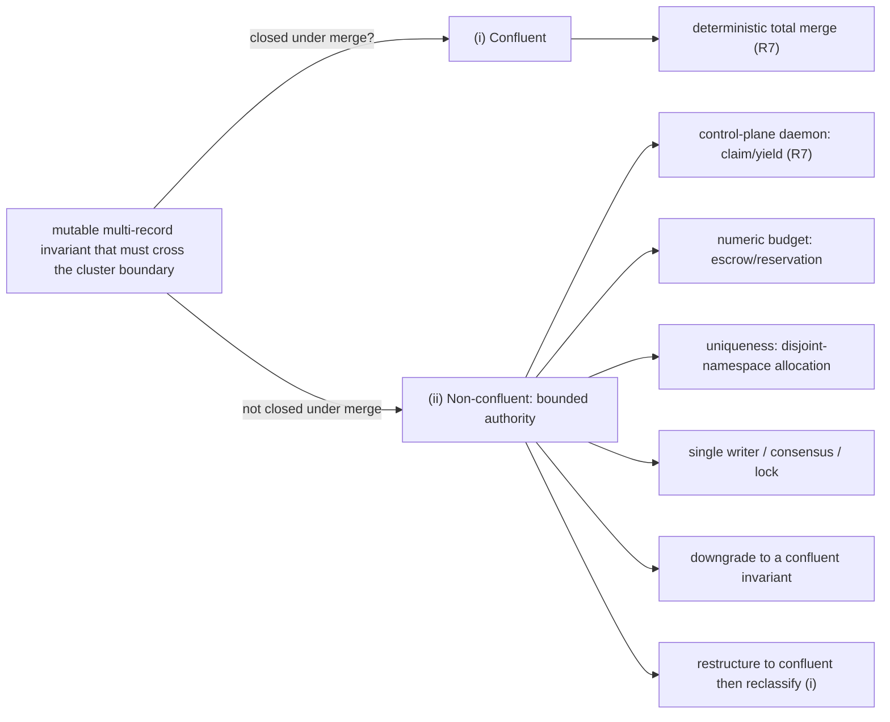

# Chaos and Failover: the Second Axis

> **Purpose**: The cross-cluster forest boundary — where a classifier decides what may cross it, how the three moves scale to it, and the ledger rows the crossing owes.
> **Read this if**: an invariant has to cross a cluster boundary, or a forest-scale failure has to be classified.

This slice of the chaos-and-failover family carries the second axis: what changes when one cluster
becomes a forest. It does not carry the three moves themselves, owned by
[chaos_failover_doctrine.md](./chaos_failover_doctrine.md), nor the migration those moves discharge, owned by
[gateway_migration_doctrine.md](./gateway_migration_doctrine.md). Reading it presumes the concentration
argument in [chaos_failover_doctrine.md §6](./chaos_failover_doctrine.md#6-the-concentration-principle--where-the-obligation-lives).

Link-graph metadata

**Status**: Authoritative source
**Supersedes**: N/A
**Referenced by**: DEVELOPMENT_PLAN/later_phases.md, DEVELOPMENT_PLAN/phase_48_test_workflow_algebra.md, DEVELOPMENT_PLAN/phase_69_content_store_workflow.md, DEVELOPMENT_PLAN/phase_74_multicluster_spawn_georepl.md, DEVELOPMENT_PLAN/phase_75_gateway_migration_drills.md, documents/engineering/README.md, documents/engineering/chaos_failover_doctrine.md, documents/engineering/chaos_failover_worked_examples.md, documents/engineering/consistency_pacelc_doctrine.md, documents/engineering/formal_model_doctrine.md, documents/engineering/gateway_migration_doctrine.md
**Generated sections**: none

> **Historical result (invalidated).** Every phase-run or implementation-result statement in this document is permanently invalidated diagnostic history. It cannot establish or reactivate current status, even if a phase later advances. Target doctrine remains normative; current status is solely in the [tracker](../../DEVELOPMENT_PLAN/README.md).

## Contents
- [16. The Second Axis — when one cluster becomes a forest](#16-the-second-axis--when-one-cluster-becomes-a-forest)
- [17. The boundary and its classifier](#17-the-boundary-and-its-classifier)
- [18. The rules scale to the boundary](#18-the-rules-scale-to-the-boundary)
- [19. The cross-boundary ledger and conformance rows](#19-the-cross-boundary-ledger-and-conformance-rows)
- [Related Documents](#related-documents)

---

## 16. The Second Axis — when one cluster becomes a forest

> **Gate.** Everything above assumed a single, strongly-consistent domain: one cluster, where a committed
> write is immediately visible to every reader and the standard services run their own consensus ([§6](./chaos_failover_doctrine.md#6-the-concentration-principle--where-the-obligation-lives)). If
> that describes the subsystem, **the analysis can stop here** — Appendix A is the worked example. Read on only if
> the subsystem's data is geo-replicated across more than one cluster with *asynchronous* replication between them.

For amoebius this gate is not a rare edge case — it is **Phase 74**. The moment a parent spawns a child and
the two geo-replicate, the forest crosses this line, and the [§3](./chaos_failover_doctrine.md#3-the-defect-class--one-shape-two-disguises) defect returns in a new and more dangerous
form. Recall the fourth blindness ([§5](./chaos_failover_doctrine.md#5-three-layers-and-the-blindness-that-binds-them)): **every move is blind to the cluster boundary unless the boundary is modeled in.** Extract's convergent fold is pure *because its input converges* — and is blind to the fact
that convergence *stops at the boundary*. Model, written against a single cluster in logical time, sees no
boundary unless it encodes **two** clusters with asynchronous replication between them. Inject exercises
only the lag and partitions it happens to inject. So the boundary — exactly like the R8 synchrony premise —
must be **named ([§17](#17-the-boundary-and-its-classifier)), its lag bounded and monitored (R8), and its failover budgeted (R9)**, because no
move proves it.

And the defect itself recurs, with **replication lag** now playing the role of the gap between `t0` and
`t1`. A read from a cluster that lags the authoritative history is a premise true at that cluster's
last-applied instant but trusted after the history has moved on — the stale-premise decision of [§3](./chaos_failover_doctrine.md#3-the-defect-class--one-shape-two-disguises) lifted to
the storage layer. This is the precise shape of the open cross-cluster failover question: *what happens if a cluster
goes down mid geo-sync and the gateway is failed over to that cluster?* A surviving sibling that reads
its lagging replica at offset `X` and treats `X` as the complete history is committing
*timeout-coerces-unknown* at topology scale; one that reads "partitioned-from-peer" as "peer-cluster-dead"
is committing *state-conflation*. The typed-unknown remedy ([§8](./chaos_failover_doctrine.md#8-move-i--extract-make-the-decision-a-value)) applies unchanged — an un-fresh read is
*not-yet-known*, not *current* — and the safety remedy is bounded authority (R7), never a coerced "I read
it, therefore it holds." The next three sections give that world its vocabulary ([§17](#17-the-boundary-and-its-classifier)), scale the rules to
it ([§18](#18-the-rules-scale-to-the-boundary)), and extend the honest ledger ([§19](#19-the-cross-boundary-ledger-and-conformance-rows)).

**What does *not* cross this line (a boundary-scope cross-ref).** A *stretched* cluster — **one** etcd,
**one** consistency boundary ([§17](#17-the-boundary-and-its-classifier)), whose nodes merely span two network `Site`s reached across
the WAN — is **not** a forest. When such a cluster grows cloud agents because a metal `Site` fell
`Unreachable`, that is a **within-one-boundary elastic shift**, not geo-replication: there is no second
store and no asynchronous link, so it owes **no** R9 data-loss budget ([§18](#18-the-rules-scale-to-the-boundary)) and **no** Second-Axis
obligation — this axis engages only once data is geo-replicated across *N* separate clusters. That
single-boundary elastic story, and the boundary classification that exempts it from this doctrine's
machinery, is owned by [single_logical_data_plane_doctrine.md §1](./single_logical_data_plane_doctrine.md#1-why-this-doctrine-exists-two-ways-to-say-run-this-elsewhere),
[§2](./single_logical_data_plane_doctrine.md#2-the-two-topologies), and
[§4](./single_logical_data_plane_doctrine.md#4-the-elastic-worker-pool-the-attach-topology); this doctrine
only records the exemption.

---

## 17. The boundary and its classifier

A **consistency boundary** is the perimeter within which a shared substrate provides synchronous,
strongly-consistent coordination — atomic snapshots, contracted ordering, quorum-durable convergence (in
amoebius, *one cluster*, delegated to MinIO/Pulsar/Postgres-Patroni). *Across* that boundary — *between
clusters* — the same substrate replicates **asynchronously**: bounded lag, no global ordering across the
boundary, possible duplication, and — if both sides accept writes — possible **divergence into independently-advanced histories.** Every coordination guarantee this doctrine otherwise relies on holds
**only within one boundary** unless stated otherwise.

The boundary raises the same question of *every mutable, multi-record invariant* that must cross it —
**whether it survives being merged**. The governing result is **invariant-confluence**.

- **Invariant-confluence (I-confluence)** — a multi-record invariant is *confluent* iff the set of
  invariant-valid states is **closed under merge** of concurrent, independently-applied updates. The theorem
  (Bailis, Fekete, Franklin, Ghodsi, Hellerstein & Stoica, *Coordination Avoidance in Database Systems*,
  PVLDB 2014) is that an invariant has a **coordination-free**, available, convergent implementation across
  an asynchronous boundary **if and only if** it is I-confluent; the corollary the doctrine leans on is that
  a **non-confluent** invariant **requires coordination**. (A convergent result, **CALM** — *consistency as
  logical monotonicity* — reaches the same place via program monotonicity: conjectured by Hellerstein, PODS
  2010; proved by Ameloot, Neven & Van den Bussche, 2013; restated in "Keeping CALM," CACM 2020. CALM and
  I-confluence are two convergent results, not one theorem.) The consequence to internalize: **a per-record merge cannot manufacture a non-I-confluent cross-record invariant** — a global floor, global uniqueness,
  "the parts sum to the whole" — that the substrate did not synchronously enforce.

That test sorts every crossing invariant into one of two buckets:

- **(i) Confluent** — convergent / idempotent / content-addressed data, *and* every mutable multi-record
  invariant *proven* confluent — may cross and be applied active-active on both clusters, bounded only by
  replication lag, healing by a deterministic total merge (R7).
- **(ii) Non-confluent — held by bounded authority** — may cross only under R7's conditional forms, never as
  an absolute and never by a fabricated per-record merge: *control-plane daemon ownership* via R7's claim/yield
  pattern; an *aggregate-numeric budget* via **escrow/reservation**; a *uniqueness namespace* via
  **disjoint-namespace allocation**; a coordinating *single writer / consensus / lock*; *downgrade* to a
  weaker confluent invariant; or *restructure* into a confluent representation (after which it re-classifies
  into (i)).

*Orientation. Design intent; the classification and its arms are owned by [§6](./chaos_failover_doctrine.md#6-the-concentration-principle--where-the-obligation-lives). A mutable multi-record invariant passes through this before it may cross a cluster boundary, and the bounded-authority arms are what remain when merge cannot close.*

**What this buys amoebius, concretely.** The standard data substrates were chosen so that the *bulk* of
cross-cluster data is bucket (i) by construction:

- The **content-addressed MinIO store** (pointers → manifests → blobs, key = hash of payload) is confluent:
  identical content yields an identical key, so a duplicate cross-cluster write is idempotent and the union
  of immutable, self-naming blobs is conflict-free. This is owned by
  [content_addressing_doctrine.md](./content_addressing_doctrine.md); this doctrine only records that it
  lands in bucket (i).
- The **Pulsar commit/event log** is confluent under R3: a fold keyed by a replication-surviving work-id
  absorbs duplication, reordering around the boundary, and late arrival after heal.
- **Secrets do not geo-replicate as a confluent data plane at all** — Dhall carries only *names*, and a
  parent injects the bytes directly into the child's Vault ([vault_pki_doctrine.md](./vault_pki_doctrine.md)).
  Secret material is therefore out of the confluence question entirely.

What is left in bucket (ii) is small and specific: the **gateway / region authority** (a control-plane daemon), any
**CAS "latest" pointer**, and **mutable relational state** geo-replicated active-active (Appendix C). Two
sub-forms have enough structure to name precisely:

- **Escrow / reservation** — for a non-confluent **aggregate-numeric** budget: partition the global budget
  into disjoint per-cluster **allowances**, so each cluster acts coordination-free *up to its allowance* —
  turning a *global* non-confluent invariant into a *per-cluster* confluent one. Allowances are **leased**
  (a bounded-time premise, R8), **re-partitioned** only under a single coordinating authority on a bounded
  timer (a rebalance *moves* budget, never *creates* it), and when coordination is unavailable a cluster
  runs to exhaustion and **fails closed** (R4). (O'Neil's *escrow transactional method*, ACM TODS 1986;
  numeric budgets only.)
- **Disjoint-namespace allocation** — the sibling route for **uniqueness**: each cluster is leased a
  disjoint block of identifiers and mints only from its own block, so two clusters can never collide. The
  same bounded-authority idea applied to a namespace, not a number.

Run the I-confluence test (R1) *before* assigning a bucket: that two records each merge cleanly says
nothing about whether a constraint *between* them is confluent. An **unclassified mutable multi-record invariant defaults to non-confluent**, and to R7's bounded-authority treatment, until proven confluent.

---

## 18. The rules scale to the boundary

Each first-axis rule ([§13](./chaos_failover_doctrine.md#13-the-supporting-rules--the-conditions-the-moves-need)) gains a cross-boundary extension, and one new rule — R9 — exists only here.

- **R1, cross-boundary.** Naming the cluster boundary is mandatory, and so is classifying every crossing
  mutable multi-record invariant by confluence ([§17](#17-the-boundary-and-its-classifier)) before choosing a mechanism. Coordination that
  silently assumes a single global view across clusters is a cross-cluster split-brain in waiting — the [§3](./chaos_failover_doctrine.md#3-the-defect-class--one-shape-two-disguises)
  defect one level up, invisible to a single-cluster model.
- **R3, cross-boundary.** Asynchronous geo-replication can re-present, after a failover, work a now-lost
  cluster already applied — so the idempotency key must be a stable identity that *survives replication*
  (content- or call-identity, not a local sequence number). The invariant widens to "none double-applied
  under **post-failover cross-cluster replay**." amoebius gets this for free wherever effects are
  content-addressed MinIO blobs or Pulsar-log folds keyed by work-id ([§17](#17-the-boundary-and-its-classifier)).
- **R4, cross-boundary.** When a whole cluster is lost, the surviving cluster recovers from its own durable,
  geo-replicated — and therefore *stale-by-the-lag* — state, rather than reaching across the boundary to
  reconcile with the failed cluster. This keeps the failover state space small and turns the accepted
  staleness into an explicit budgeted loss (R9) instead of a hidden recovery attempt. (The retained
  `no-provisioner` PV makes the *surviving* cluster's own state durable and deterministically rebindable —
  [storage_lifecycle_doctrine.md](./storage_lifecycle_doctrine.md) — which is why a graceful teardown is
  lossless but a chaos-failover is only bounded-loss.)
- **R7, cross-boundary — "heals" has two forms.** Within one cluster, healing is *passive*: a single
  ordering makes the losing action observe its supersession and stop. Where divergence spans the cluster
  boundary and **both clusters advanced independently**, there is no single ordering to defer to; healing
  must be *active* — a deterministic, **total** reconciliation/merge over the divergent histories, with any
  unmergeable conflict surfaced explicitly rather than silently dropped. A merge may be claimed total **only for a confluent invariant** ([§17](#17-the-boundary-and-its-classifier)). "Active-active" on a **non-confluent** invariant is reached only by
  *bounding concurrent authority*. **Safety-first additionally means a fail-closed promotion gate:** the
  surviving cluster withholds gateway authority until it proves freshness — caught up to a known commit
  watermark, or holding a fence — trading recovery time (R9's RTO) for zero divergence beyond the suffix
  already lost at the instant of failover. This is the only form in which the R8 lag bound is *enforceable*:
  not by un-losing the suffix, but by refusing to promote a too-stale cluster into service. This is the
  direct, well-defined answer to the open cross-cluster failover question — see Appendix B.
- **R8, cross-boundary.** The **replication lag** the asynchronous substrate runs at is itself a synchrony
  premise: name it, bound it, monitor it (export the observed maximum lag / replica-offset gap). Its
  enforcement differs from clock skew in *what* the bound gates: the un-replicated suffix that exists *at
  the instant of failover* is already lost — that irrecoverable window becomes a **data-loss budget** (R9),
  though the bound is still enforceable as the fail-closed gate on the *promotion decision* above.
- **R9 — Budget every cross-cluster failover (bounded data loss and bounded recovery time).** A failover
  across the boundary incurs a cost R7's transient-violation-that-heals does **not** capture: the
  un-replicated suffix is *permanently* lost. Declare the budget in two dimensions — a bounded **data-loss window** (how much acknowledged-but-un-replicated work may be lost; *this is the R8 replication-lag bound
  at the instant of failover*, not a separately-derived quantity) and a bounded **recovery time** (how long
  until a surviving cluster resumes authority). Monitor the live lag against the first; validate the second
  by **drill, not assertion.** The recovery-time bound is **tested** (drilled); the data-loss bound is
  **assumed** under real disaster. Every other rule's violation is transient and heals; R9's data-loss
  dimension is permanent, accepted, and never heals — which is why no other rule can host it. The
  declarative **push-back on an unsatisfiable root `InForceSpec`**, and the data-loss-budget thresholds, are
  configured as deployment-rules ([cluster_lifecycle_doctrine.md §5](./cluster_lifecycle_doctrine.md#5-teardown-with-cleanup-vs-chaos-failover-the-central-distinction) and
  [§6](./cluster_lifecycle_doctrine.md#6-push-back-when-teardown-would-break-the-root-inforcespec));
  this doctrine owns the *proof obligation* that the declared budget actually holds.

---

## 19. The cross-boundary ledger and conformance rows

The honesty discipline ([§12](./chaos_failover_doctrine.md#12-the-moral-core--proven-tested-assumed)) scales with the hardness. A forest that crosses the cluster boundary adds
these rows to its ledger —

| Technique | Establishes | Strength | Does **not** establish |
|---|---|---|---|
| Cross-cluster consistency premise (R1/[§17](#17-the-boundary-and-its-classifier), R8) | The boundary is named; replication lag is bounded and its observed maximum monitored; the data-loss window equals the lag at the instant of failover; a fail-closed promotion gate can refuse a too-stale cluster | **Assumed** — monitored at runtime, never proven | That field lag stays within bound during a real disaster; the data already lost beyond the bound; that a single-cluster / logical-time model saw the boundary at all |
| Cross-cluster failover budget (R9) + reconciliation (R7) | The two-dimensional budget — bounded permanent data loss and bounded recovery time — is declared and exercised by drill; where divergence is admitted, a deterministic merge reconciles divergent histories | Recovery time + reconciliation **tested** (drilled), never proven; data-loss bound **assumed** under real disaster | That an un-drilled disaster stays within budget; that every conflict is mergeable; behaviour beyond modeled scope |
| Invariant-confluence classification + bounded-authority protocol ([§17](#17-the-boundary-and-its-classifier), R7) | Each crossing mutable invariant is classified confluent or held by single-writer / escrow / namespace-partition / downgrade / restructure; the chosen protocol never overspends the global budget or collides a namespace, and fails closed on exhaustion | Classification **proven only when** the invariant and merge are formalized and closure under merge is shown; otherwise an explicit design assumption. Protocol safety **proven for the model**; exhaustion-under-partition survival **tested** (Inject) | Per-cluster lease/rebalance bound (R8, **assumed**); replication-lag bound (R8, **assumed**); runtime fidelity; behaviour above scope; the suffix lost at failover (R9) |

— and these rows to the conformance matrix ([§15](./chaos_failover_doctrine.md#15-the-conformance-matrix--what-does-this-project-demonstrate)):

| Concern | Extract (pure decision) | Model (cross-process) | Inject (live adversarial fault) |
|---|:--:|:--:|:--:|
| Cross-cluster consistency / replication lag (R1/[§17](#17-the-boundary-and-its-classifier), R8) | name the boundary + lag bound | recorded *assumed* unless replication is modeled as two clusters | **required** (partition the boundary; drive lag beyond bound; assert the promotion-freshness gate fires before a too-stale cluster resumes service; measure induced loss against the budget) |
| Cross-cluster failover budget & reconciliation (R9, R7) | the merge/reconciliation decision is pure | **required** (model divergence + merge; assert merge converges and preserves the invariant) | **required** (drill gateway failover across the boundary; assert measured loss ≤ declared window, recovery ≤ bound, histories reconcile, no double-applied effect) |
| Non-confluent invariant across a boundary ([§17](#17-the-boundary-and-its-classifier), R7) | classify; the per-cluster allowance-or-namespace spend is a pure decision | **required** (model the budget/namespace partition: each per-cluster allowance confluent; no path overspends or collides; exhaustion fails closed) | **required** (exhaust an allowance under partition; assert fail-closed, *not* overspend; assert the global budget is honored after reconvergence) |

The rule is unchanged across the axis: **never report an assumed-and-monitored result as proven.** A
confluence claim is proof only when its closure argument is shown; the data-loss bound is forever an
assumption that is monitored and that a disaster may exceed. Showing the closure argument means proving the
merge's **algebraic laws** (commutativity / associativity / idempotence) — the fold-closure obligation the
confluent-bucket ([§17](#17-the-boundary-and-its-classifier)) merges and the R3 dedup fold rest on. Those laws
are today property-tested; the sanctioned way to *upgrade* a specific confluence row from **assumed** to
**proven** is a machine-checked proof of the laws (Lean or Liquid Haskell), scoped surgically to that fold — the
deferred proof-assistant track ([later_phases.md](../../DEVELOPMENT_PLAN/later_phases.md),
[formal_model_doctrine.md §4](./formal_model_doctrine.md#4-single-source-correspondence)), never a broad
proof layer.

---

## Related Documents
- [Chaos and Failover Doctrine](./chaos_failover_doctrine.md) — the hub of this family; the three moves and the honesty rule this slice depends on
- [Gateway Migration Doctrine](./gateway_migration_doctrine.md) — the one obligation the whole method concentrates on
- [Engineering Doctrine Index](./README.md)
- [Development Plan](../../DEVELOPMENT_PLAN/README.md) — phase order and status for this work
