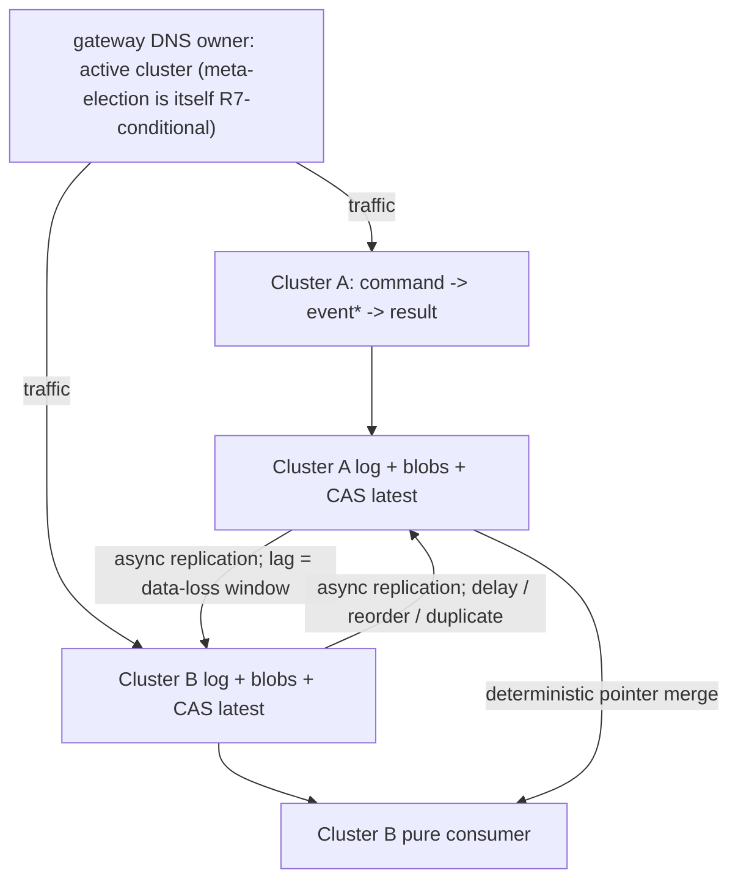
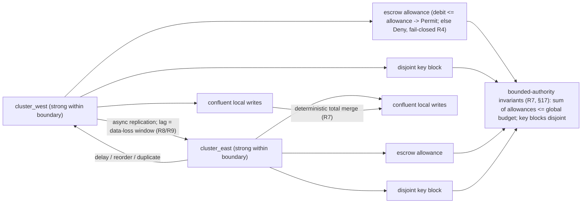

# Chaos and Failover: Worked Examples

> **Purpose**: Two worked examples of the method applied end to end — a cross-cluster geo-replication failover and active-active mutable state across the boundary — plus one retired appendix kept for provenance.
> **Read this if**: the method has been read in the abstract and a concrete instance would help.

This slice of the chaos-and-failover family carries illustrative material only. Every rule it exercises is
normative in [chaos_failover_doctrine.md](./chaos_failover_doctrine.md) or
[chaos_failover_second_axis.md](./chaos_failover_second_axis.md), and where a worked example and its owning
rule disagree, the rule is correct and the example is the defect. Nothing here has been run.

Link-graph metadata

**Status**: Reference only
**Supersedes**: N/A
**Referenced by**: DEVELOPMENT_PLAN/phase_44_gateway_migration_drills.md, documents/engineering/chaos_failover_doctrine.md, documents/engineering/consistency_pacelc_doctrine.md, documents/engineering/gateway_migration_doctrine.md
**Generated sections**: none

## Contents
- [Appendix A — retired (control-plane single-instance is delegated to k8s/etcd)](#appendix-a--retired-control-plane-single-instance-is-delegated-to-k8setcd)
- [Appendix B — Worked example (fenced): cross-cluster geo-replication failover (the open cross-cluster failover question)](#appendix-b--worked-example-fenced-cross-cluster-geo-replication-failover-the-open-cross-cluster-failover-question)
- [Appendix C — Worked example (fenced): active-active mutable state across the cluster boundary](#appendix-c--worked-example-fenced-active-active-mutable-state-across-the-cluster-boundary)
- [Related Documents](#related-documents)

---

## Appendix A — retired (control-plane single-instance is delegated to k8s/etcd)

> The former **First-Axis** worked example — a control-plane singleton *elected over a replicated log* — is
> **retired**. Single-writer authority of the control-plane singleton is delegated to Kubernetes/etcd (a
> Deployment `replicas=1` plus the mandatory reconciler `Lease`), so amoebius runs **no > election** and this axis carries **no election proof obligation**
> ([daemon_topology_doctrine.md §3](./daemon_topology_doctrine.md#3-the-control-plane-singleton),
> [§6](./chaos_failover_doctrine.md#6-the-concentration-principle--where-the-obligation-lives)). One honest residue remains, and it is a
> **named assumed premise**, not an election: a `Lease` gives mutual exclusion, **not output fencing**, so a
> paused-then-resumed old pod can briefly issue a stale *external* side effect (a route53 or Vault write) that
> no broker epoch fences — the fencing-token window
> ([daemon_topology_doctrine.md §3.1](./daemon_topology_doctrine.md#31-exactly-one-pod-is-a-k8setcd-property-not-an-amoebius-election)).
> It is R8-adjacent (safety rests on idempotent / last-writer-safe writes + reconciler re-convergence within the
> TTL), recorded **assumed** in the ledger below, monitored, never proven. The one worked example that remains
> amoebius's own is the cross-cluster **gateway migration** — **Appendix B** — modelled as data in
> [gateway_migration_model_doctrine.md](./gateway_migration_model_doctrine.md) and
> [formal_model_doctrine.md](./formal_model_doctrine.md).

---

## Appendix B — Worked example (fenced): cross-cluster geo-replication failover (the open cross-cluster failover question)

> The Second-Axis example, and the one the whole async-replication concern exists for: **what happens if a > cluster goes down mid geo-sync and the gateway is failed over to it?** It crosses the cluster boundary
> (R1/[§17](./chaos_failover_second_axis.md#17-the-boundary-and-its-classifier), R9), rests on a bounded-staleness / data-loss premise and an explicit failover budget (R8, R9),
> and reconciles divergent histories under an availability-first choice (R7). It is **forward-looking**:
> amoebius runs no cross-cluster geo-replication today, but Phase 43 is exactly this shape, so the doctrine
> works it through before the need is live.

**The system.** Two sibling child clusters with the same parent geo-replicate a realtime workflow
(`command → event* → result`) over **Pulsar geo-replication** (native binary protocol, no WebSockets) with
durable outputs written as **content-addressed, write-once MinIO blobs** plus a single mutable **CAS "latest" pointer**. *Within* one cluster the log and object store are strongly consistent (delegated, [§6](./chaos_failover_doctrine.md#6-the-concentration-principle--where-the-obligation-lives)). *Across*
clusters they replicate **asynchronously**. The cluster **gateway DNS owner** (route53) = the active cluster
— a meta-election that is *itself* only R7-conditional (both may briefly self-elect under partition; this is
the cross-cluster meta-election the gateway migration models, Appendix B). The invariant: *for effects that have replicated or are
later reconciled, no effect is double-applied; at most one cluster holds gateway authority once views
converge; acknowledged-but-un-replicated work is bounded by the R9 data-loss budget.* Per [§17](./chaos_failover_second_axis.md#17-the-boundary-and-its-classifier)'s classifier,
the content-addressed blobs and the Pulsar log are confluent and cross safely; the CAS pointer and the
gateway authority are non-confluent singletons that cross only in R7's conditional form with reconciliation.

**The defect ([§3](./chaos_failover_doctrine.md#3-the-defect-class--one-shape-two-disguises) made concrete), and the literal open cross-cluster failover question.** On chaos-failover (the lead
cluster *vanishes* mid geo-sync — no drain, no flush; contrast the **graceful, lossless-by-construction**
teardown owned by [cluster_lifecycle_doctrine.md §5](./cluster_lifecycle_doctrine.md#5-teardown-with-cleanup-vs-chaos-failover-the-central-distinction)):

- *Topology-scale timeout-coerces-unknown.* The surviving cluster reads its lagging replica at offset `X`
  and treats `X` as the *complete* history — coercing *not-yet-replicated* into *does-not-exist*. The
  truthful value of "are there committed effects past `X`?" is **unknown**; coerced to absence, the cluster
  silently drops the un-replicated tail or regenerates it and risks double-applying on failback.
- *State-conflation.* The surviving cluster collapses *partitioned-from-peer* with *peer-cluster-dead* —
  read as "dead," it asserts gateway authority while the peer still holds it (split-brain at cluster scale);
  read as "alive, wait," it stalls when the peer is truly gone. Separate observations, separate actions.

**The well-defined answer (Extract + R7 + R9).** The consumer decision is a pure fold over the replicated
Pulsar log plus the content-addressed artifacts; because blobs are content-addressed and write-once and the
log dedup is a pure fold keyed by a **replication-surviving work-id**, **duplication, reordering, and late arrival after heal are absorbed structurally for any effect that eventually appears in the merged history**
(R3).
The **typed-unknown scoping** is the crux of "well-defined":
- "no entries past `X` have been observed, therefore serve" decides *which cluster serves* — a **liveness**
  coercion that authorizes no effect, hence licensed
- "those effects do not exist / were never durable" is a durability **safety** claim and is the
  [§3](./chaos_failover_doctrine.md#3-the-defect-class--one-shape-two-disguises) defect — the tail beyond
  `X` stays a typed *not-yet-observed* value, reconciled when the boundary heals, and if the failed cluster
  is permanently lost, accounted for **only** by the R9 data-loss budget, never silently resolved to
  "absent." So the answer to "what happens if a cluster goes down mid geo-sync?" is precise: **the
  un-replicated suffix is lost within the declared R9 budget and nothing else
- the surviving cluster promotes only through the R7 fail-closed freshness gate
- the CAS pointer is reconciled by a deterministic total merge
- every replicated-or-recovered effect is deduplicated exactly once.**

*Orientation. Design intent. Two clusters under async replication, where the lag is the data-loss window and the gateway DNS owner is itself conditional. This is a topology, not a proof; the obligation it creates is discharged in [gateway_migration_model_doctrine.md](./gateway_migration_model_doctrine.md).*

**Reconciliation, the staleness premise, and PACELC (R7, R8, R9).** Over an async boundary admitting
inter-cluster partition, **no strongly-consistent cross-cluster singleton exists** (FLP/CAP at cluster
scale). amoebius chooses **availability-first**: both clusters serve and **reconcile on failback**, so
divergence is the *normal* case. Two sources of lost/divergent state stay separate: (1) the **irrecoverable data-loss window** — the un-replicated tail gone at the instant of failover (R8/R9); and (2) the
**deposed-cluster window** — a cluster that loses gateway authority keeps acting for up to the replication
lag until the superseding claim propagates ([§9](./chaos_failover_doctrine.md#9-move-ii--model-prove-the-protocol-not-the-program)'s remedy *weakened across the boundary*) — a bounded,
self-healing R7 violation. The merge: **content-addressed blobs merge trivially** (the union of immutable,
self-naming objects is conflict-free); the **CAS pointer is the only divergent point** and needs an explicit
deterministic, **total**, **timestamp-free** merge (ordered by `(causal-predecessor-set, cluster-rank)`), so
every node computes the same post-heal pointer without a clock dependence. *If* the pointer is instead ordered by a commit
timestamp, that is a **bounded clock-skew premise** and must be named/bounded/monitored (R8). Replication lag
is the synchrony premise (R8): named, bounded, monitored. The failover budget (R9) is **(data-loss window, recovery time)** — the window assumed/monitored, the recovery time **tested by drill**. PACELC: even absent a
partition, every cross-cluster write trades latency for consistency; amoebius chooses **latency**
(asynchronous replication), and the data-loss window *is* the explicitly-recorded price — synchronous
cross-cluster replication would pay cross-cluster RTT per publish, which a realtime hop cannot afford.

**Keycloak state on gateway failover — a worked classification ([§17](./chaos_failover_second_axis.md#17-the-boundary-and-its-classifier)).** The
wild-ingress gateway is Keycloak, so a `Failover` gateway takeover
([gateway_migration_doctrine.md](./gateway_migration_doctrine.md)) must reconcile Keycloak's own state, and it
splits cleanly along the classifier. **Configuration** state — realms, clients, roles, users — is not
stored-as-truth to be merged: it is a **deterministic projection of the authoritative `InForceSpec`** (RBAC is
derived, not stored; the spec lives in the immutable `Release` ledger and geo-replicated Transit-enveloped
MinIO), so on promotion the survivor **re-derives** it from that single authority — confluent by restructuring,
bucket (i), no divergence-merge. **Runtime session** state is the non-confluent singleton: held
**survivor-wins** under R7, the survivor's timeline is authoritative, and sessions on the lost fork past the
divergence point re-authenticate (acceptable for an emergency failover) and are audited. Recovery rolls the
former active back to the divergence point, attaches it to the promoted primary as a replica, and places its
un-replicated writes in an **audited RPO-gap log** rather than merging them (Postgres is relational, not a
CRDT) — accounted for only by the R9 data-loss budget. Convergence is therefore survivor-wins + rewind +
config-re-derive + audited RPO gap, with no fabricated per-record merge.

**Model applied.** Model the **two-cluster protocol** with the cross-boundary adversary **first-class**: a
replication channel that delays, reorders, duplicates, and can be **cut**; the gateway meta-election (lifted
from Appendix A); actions *produce / replicate / consume / advance-pointer / fail-over / fail-back /
partition / heal*, explored to exhaustion at scope **2 clusters**. Safety: *exactly-once for
replicated-or-recovered effects* (R3); *bounded, mergeable divergence* (the deterministic pointer merge
converges on heal — R7); *≤ 1 gateway authority once views converge* (Appendix A lifted). Liveness: *a
workflow with a live cluster eventually completes through one authority.* Honest limit: the model is in
**logical time** — it encodes "an effect either had or had not crossed the boundary before the cut" but says
**nothing** about the real size of that window; whether field lag stays within bound is the **R8/R9 assumed premise**, in the ledger, not the model. **The concrete spec is owned by
[gateway_migration_model_doctrine.md](./gateway_migration_model_doctrine.md) (Phase 3), which the
[DEVELOPMENT_PLAN](../../DEVELOPMENT_PLAN/README.md) names as the phase that carries this proof.**

**Inject applied.** Extend the test-`.dhall` harness into the inter-cluster dimension: **cut the replication channel** and assert divergence stays bounded and mergeable and ≤ 1 gateway authority once
converged; **kill a cluster mid-workflow** and assert the peer resumes with bounded loss (≤ the measured
data-loss window), no double-application for replicated-or-recovered effects, and authority transfer within
the recovery-time budget (R9); **inject replication lag** toward and past the bound and assert the
**promotion-freshness gate** fires and the lag monitor alarms before a breach (R8); **fail back with late + duplicate arrivals** and assert idempotency absorbs them (content-addressed + log-fold dedup — R3) and the
CAS-pointer merge converges deterministically (R7).

**The ledger this example keeps ([§12](./chaos_failover_doctrine.md#12-the-moral-core--proven-tested-assumed), [§19](./chaos_failover_second_axis.md#19-the-cross-boundary-ledger-and-conformance-rows)).** *Proven* (once built) — the consumer decision's purity and the
dedup + pointer-merge fold (decision layer); the modeled two-cluster safety/liveness properties at scope 2.
*Tested* — the partition, kill-cluster-mid-workflow (recovery within budget, loss ≤ measured window),
replication-lag/promotion-gate, and failback-idempotency drills. *Assumed* — the data-loss-window /
replication-lag bound (R8/R9), monitored never proven; the PACELC latency-for-consistency posture (R7);
runtime fidelity and behaviour beyond 2 clusters. **Under the two-tier schedule, the two-cluster
design-model's safety/liveness properties are *proven for the model at scope 2* in Phase 3 (design-first), and
model↔code correspondence is differentially checked; the runtime fidelity (real physics) and live
cross-cluster-failover-in-a-running-forest remain UNVERIFIED — the Tier-2 Phase-44 obligation, and the single
place the per-system proof concentrates.**

**Appendix B rests on doctrine (zero orphans).**

| Claim / mechanism | Doctrine home it instantiates |
|---|---|
| Strong within a cluster, async across; blobs/log confluent, CAS pointer + gateway authority singletons | [§17](./chaos_failover_second_axis.md#17-the-boundary-and-its-classifier) classifier; R1; [content_addressing_doctrine.md](./content_addressing_doctrine.md) |
| Chaos-failover (vanish) vs lossless graceful teardown | [cluster_lifecycle_doctrine.md §5](./cluster_lifecycle_doctrine.md#5-teardown-with-cleanup-vs-chaos-failover-the-central-distinction); [§11](./chaos_failover_doctrine.md#11-move-iii--inject-break-the-running-thing-on-purpose) |
| Topology-scale timeout-coerces-unknown; partitioned ≠ dead | [§16](./chaos_failover_second_axis.md#16-the-second-axis--when-one-cluster-becomes-a-forest) |
| Pure dedup + pointer-merge fold over convergent log + content-addressed artifacts | [§8](./chaos_failover_doctrine.md#8-move-i--extract-make-the-decision-a-value); R3 (replication-surviving key) |
| Coercion licensed for liveness, forbidden for a durability safety claim | [§8](./chaos_failover_doctrine.md#8-move-i--extract-make-the-decision-a-value) typed-unknown scoping |
| No strong cross-cluster singleton; availability-first | R7 |
| Blobs merge trivially; CAS pointer via timestamp-free deterministic total merge | [§17](./chaos_failover_second_axis.md#17-the-boundary-and-its-classifier) bucket (i) for state; R7 |
| Keycloak config re-derived from `InForceSpec` (confluent); session survivor-wins; old-active rewind + audited RPO-gap | [§17](./chaos_failover_second_axis.md#17-the-boundary-and-its-classifier) buckets (i)/(ii); R7; R9; [gateway_migration_doctrine.md](./gateway_migration_doctrine.md) |
| Deposed cluster keeps acting up to the lag = bounded self-healing violation | [§9](./chaos_failover_doctrine.md#9-move-ii--model-prove-the-protocol-not-the-program) note + R7 |
| Replication lag named/bounded/monitored; data-loss window; promotion gate | R8; R7 (fail-closed promotion gate) |
| Failover budget = (data-loss window assumed, recovery time drilled) | R9 |
| PACELC: async posture chosen | R7 (PACELC) |
| Two-cluster model; ≤ 1 authority once converged | [§9](./chaos_failover_doctrine.md#9-move-ii--model-prove-the-protocol-not-the-program) Model; R7; [gateway_migration_model_doctrine.md](./gateway_migration_model_doctrine.md) |
| Extend the harness with partition / kill-cluster / lag / failback | [§11](./chaos_failover_doctrine.md#11-move-iii--inject-break-the-running-thing-on-purpose) Inject; [testing_doctrine.md](./testing_doctrine.md) |
| Ledger proven/tested/assumed; conformance rows | [§12](./chaos_failover_doctrine.md#12-the-moral-core--proven-tested-assumed) + [§19](./chaos_failover_second_axis.md#19-the-cross-boundary-ledger-and-conformance-rows) |

---

## Appendix C — Worked example (fenced): active-active mutable state across the cluster boundary

> A third worked example, included because it exercises what A and B do not: a **mutable, multi-record**
> source of truth replicated **active-active** across clusters, where the governing classifier is
> **invariant-confluence / CALM** ([§17](./chaos_failover_second_axis.md#17-the-boundary-and-its-classifier)). Appendices A/B kept their substrates confluent *by construction*;
> this one cannot, and shows what changes when a schema carries invariants that **do not merge**. It is
> **forward-looking** — amoebius runs no active-active OLTP today; per-service Patroni Postgres
> ([platform_services_doctrine.md §8](./platform_services_doctrine.md#8-postgres--patroni-via-percona-one-cluster-per-consumer-with-pgadmin)) is synchronous *within* a cluster,
> and any cross-cluster active-active variant is future work — but the method should exist before the
> schema does.

**The system and the [§2](./chaos_failover_doctrine.md#2-when-this-applies--the-gate) gate.** A workflow's source of truth is a per-service relational store
(Percona/Patroni), geo-replicated **active-active** across `cluster_west` and `cluster_east`. Both accept
local writes and serve local reads; the link between them is the **cluster boundary** ([§17](./chaos_failover_second_axis.md#17-the-boundary-and-its-classifier)): strong inside a
cluster, asynchronous across. It meets the [§2](./chaos_failover_doctrine.md#2-when-this-applies--the-gate) gate: decisions under concurrency (debit/reject, mint-key/
reject, promote/wait); coordination only through durable substrates; safety invariants no single cluster can
enforce alone (a global balance floor; a global uniqueness constraint).

**Classify every invariant by the boundary (R1, [§17](./chaos_failover_second_axis.md#17-the-boundary-and-its-classifier)), before bucketing:**

- **(i) Confluent** — maintained active-active with no coordination, bounded only by lag: an **insert-only event/audit table**; a **grow-only counter** (monotone in the safe direction); **content-addressed columns**; a **set-union tag column**; **NOT NULL / per-record CHECK** constraints local to one record;
  **referential-integrity inserts** when the parent is insert-only or causally present. A pure
  merge/fold reconciles these (Extract; R7).
- **(ii) Non-confluent — held by bounded authority** — each carries a *distinct* sub-form: a **numeric floor** (`balance ≥ 0`, decremented) → **escrow/reservation** (a per-cluster allowance partition of the
  global budget); a **uniqueness constraint** (at most one row per natural key, forest-wide) →
  **disjoint-namespace allocation** (each cluster leased a disjoint key/ID block — *not* escrow); **"sum of line amounts = parent total"** and the **unmodeled deletion of a referenced row** → **restructure** to a
  confluent shape (lines insert-only, total a *derived fold*) **or** co-locate under a **single-writer**
  scope; **which cluster is the promotion authority** at failover → the R7-conditional **singleton claim/yield** pattern (reused from Appendices A/B). Naming the sub-form **is** the design decision.

**The defect ([§3](./chaos_failover_doctrine.md#3-the-defect-class--one-shape-two-disguises) made concrete).** Both clusters hold `balance = 1`; each debits the last unit; **each commit is locally valid and locally floor-respecting**; replication carries both debits across. A merge that
replays both yields `balance = -1`; a last-writer-wins merge hides one committed debit and violates
conservation/audit instead. Either way a *cross-cluster* invariant was breached by two *locally correct*
decisions. **A per-record merge cannot manufacture a non-I-confluent cross-record invariant** ([§17](./chaos_failover_second_axis.md#17-the-boundary-and-its-classifier)): two
pure folds over two divergently-advanced histories can each be pure yet jointly violate a global bound.

**Extract applied — three paths, by sub-form.** *Confluent path:* a pure, deterministic, **total** merge
over convergent input (set-union, max/sum, content-address identity, append-union, causal FK-insert union) —
commutative/associative/idempotent, so replay order and duplication cannot change the result. *Numeric
escrow path:* each cluster holds a **local allowance**; `decide : (local_allowance, requested_amount) →
Permitted | Denied` is a **pure function of purely local state** — correct under *any* replication lag
because it never reads the remote balance; exhaustion → **Denied**, fail-closed (R4). *Uniqueness namespace
path:* each cluster leased a **disjoint key/ID block**; `mint : (local_block, next) → Identifier |
BlockExhausted` mints only from its own block, so two clusters can never collide; exhaustion fails closed /
triggers a coordinated re-lease (R8/R4). *Typed-unknown scoping:* the replication-unknown — *has a
conflicting remote write happened?* — **may** be coerced for **liveness** (serve a stale read) but is
**never** coerced for the **safety** invariant; the floor is enforced by the *local allowance* and uniqueness
by the *local block*, not by any read of the remote side.

*Orientation. Design intent; a worked instance of the arms owned by [§6](./chaos_failover_doctrine.md#6-the-concentration-principle--where-the-obligation-lives). Confluent local writes merge, an escrow allowance fails closed, and a disjoint key block needs no coordination at all.*

**Model applied.** Model two clusters, each with a local store, allowance, and key-block; an async channel
that may delay/reorder/duplicate; partition; cluster crash. Actions: *local-write / local-debit / local-mint
/ replicate / merge / partition / heal / crash / refill-rebalance / promote*, to exhaustion at scope 2.
Assert: (1) **confluent convergence** — all interleavings reach one identical merged state; (2)
**bounded-authority safety under partition** — `Σ allowances ≤ global_budget` **and** `blocks
pairwise-disjoint`, preserved by every action including rebalances (a rebalance only *moves* budget, never
*creates* it); (3) **exhaustion is fail-closed**; (4) **no fabricated cross-record invariant (CALM made executable)** — the model shows the naive merge *breaks* "sum = total," and that the only sound options are
**single-writer** co-location or **restructure** to a derived fold. This worked example is **illustrative only — no owning model or phase**; amoebius's one authored `Model` is the gateway migration
([gateway_migration_model_doctrine.md](./gateway_migration_model_doctrine.md)), not this active-active OLTP
sketch, and the method it illustrates is owned by [§17](./chaos_failover_second_axis.md#17-the-boundary-and-its-classifier). Honest limit:
logical time at bounded scope — nothing about real lag, real lease timing, or cluster counts beyond scope
(R8/R9 ledger rows).

**Inject applied.** Extend the test-`.dhall` harness: partition during bounded-authority writes (assert each
serves *up to its allowance/block*, global floor/uniqueness never break); drive a cluster to **exhaust its escrow / key-block under partition** (assert fail-closed reject, never overspend or collide); **failback with late + duplicate writes** (assert confluent merge converges, idempotency absorbs duplicates, no non-confluent
invariant ever violated); **cluster loss + RTO drill** (assert the data-loss window is bounded by the
measured lag, and the lost cluster's outstanding allowances/key-blocks are reclaimed within RTO under R7's
fail-closed gate before the survivor re-issues them).

**Honest limits this example must state.** Active-active OLTP is **not universal**: an invariant that is
neither confluent, escrow-able (aggregate-numeric), namespace-partitionable (uniqueness), nor restructurable
to a derived fold **must stay single-writer (coordinated) or be downgraded**. "Multi-master" applies only to
the budgeted/blocked/restructured subset; name the invariants it does *not* cover. And restructure *shifts*,
does not remove, the burden: making "sum = total" a derived fold moves correctness onto the fold's idempotent
replay, so R3's replication-surviving key must be verified to survive cross-cluster post-failover replay.
**Under the two-tier schedule, the invariant-confluence classification and any design-model authored for
it are design-layer artifacts, proven only for the model at scope; active-active-OLTP-correctness-in-a-
running-cluster and its runtime fidelity stay UNVERIFIED** — there is no active-active OLTP deployment. This appendix is **illustrative** — the active-active OLTP protocol is *not* amoebius's one proof
obligation (that is the gateway migration, [gateway_migration_model_doctrine.md](./gateway_migration_model_doctrine.md))
and has no owning phase; it exists so the invariant-confluence machinery is in place before any future schema
needs it.

**Appendix C rests on doctrine (zero orphans).**

| Claim / mechanism | Doctrine home it instantiates |
|---|---|
| Active-active mutable relational state across the cluster boundary | [§17](./chaos_failover_second_axis.md#17-the-boundary-and-its-classifier) classifier; [platform_services_doctrine.md §8](./platform_services_doctrine.md#8-postgres--patroni-via-percona-one-cluster-per-consumer-with-pgadmin) (per-service Patroni) |
| Merge the confluent invariants (events, counter, blobs, tags, causal FK inserts) | [§17](./chaos_failover_second_axis.md#17-the-boundary-and-its-classifier) bucket (i); R7 |
| Numeric floor → per-cluster escrow allowance | [§17](./chaos_failover_second_axis.md#17-the-boundary-and-its-classifier) escrow; R7 |
| Uniqueness → per-cluster disjoint key-block (not escrow) | [§17](./chaos_failover_second_axis.md#17-the-boundary-and-its-classifier) namespace-partition; R7 |
| "sum = total" → restructure (derived fold) or single-writer | [§17](./chaos_failover_second_axis.md#17-the-boundary-and-its-classifier) restructure / single-writer; R7 |
| Pure `decide(allowance,amount)` / `mint(block,n)` | [§8](./chaos_failover_doctrine.md#8-move-i--extract-make-the-decision-a-value) (pure decision; typed-unknown scoping) |
| Stale lagging-replica read driving a debit | [§16](./chaos_failover_second_axis.md#16-the-second-axis--when-one-cluster-becomes-a-forest); [§8](./chaos_failover_doctrine.md#8-move-i--extract-make-the-decision-a-value) typed-unknown |
| Escrow/namespace lease + rebalance on a bounded timer; exhaustion → fail-closed | [§17](./chaos_failover_second_axis.md#17-the-boundary-and-its-classifier) escrow term (R8/R4); R4, R8 |
| Data lost / allowance & block stranded at failover; RTO reclaim | R9 (data-loss assumed, recovery-time tested) |
| Idempotent absorption of duplicate replayed writes | R3 (replication-surviving identity key) |
| No global cross-record invariant fabricated by merge | [§17](./chaos_failover_second_axis.md#17-the-boundary-and-its-classifier) (I-confluence corollary); [§8](./chaos_failover_doctrine.md#8-move-i--extract-make-the-decision-a-value) boundary-scoped note |
| Concrete TLA+ spec + invariant catalog | *Illustrative only — no owning model or phase; the invariant-confluence **method** is [§17](./chaos_failover_second_axis.md#17-the-boundary-and-its-classifier). amoebius's one authored `Model` is the gateway migration ([gateway_migration_model_doctrine.md](./gateway_migration_model_doctrine.md)), not this active-active OLTP sketch.* |

---

## Related Documents
- [Chaos and Failover Doctrine](./chaos_failover_doctrine.md) — the hub of this family; the three moves and the honesty rule this slice depends on
- [Gateway Migration Doctrine](./gateway_migration_doctrine.md) — the one obligation the whole method concentrates on
- [Engineering Doctrine Index](./README.md)
- [Development Plan](../../DEVELOPMENT_PLAN/README.md) — phase order and status for this work
