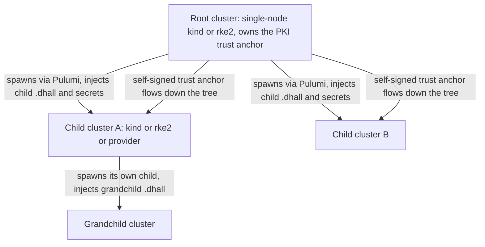
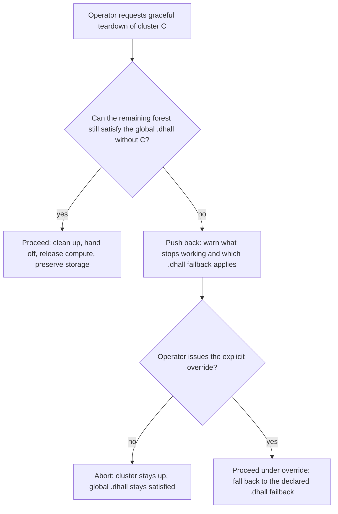

# Cluster Lifecycle

**Status**: Authoritative source
**Supersedes**: N/A
**Referenced by**: documents/engineering/README.md, documents/engineering/app_vs_deployment_doctrine.md, documents/engineering/chaos_failover_doctrine.md, documents/engineering/cluster_topology_doctrine.md, documents/engineering/daemon_topology_doctrine.md, documents/engineering/dsl_doctrine.md, documents/engineering/host_cluster_comms_doctrine.md, documents/engineering/illegal_state_catalog.md, documents/engineering/image_build_doctrine.md, documents/engineering/manifest_generation_doctrine.md, documents/engineering/network_fabric_doctrine.md, documents/engineering/platform_services_doctrine.md, documents/engineering/pulumi_iac_doctrine.md, documents/engineering/resource_capacity_doctrine.md, documents/engineering/storage_lifecycle_doctrine.md, documents/engineering/substrate_doctrine.md, documents/engineering/testing_doctrine.md, documents/engineering/tla_modelling_assumptions.md, documents/engineering/vault_pki_doctrine.md
**Generated sections**: none

> **Purpose**: Single Source of Truth for amoebius cluster bring-up and teardown across kind / rke2 / provider clusters — bootstrap, recursive **amoebic spawning**, graceful teardown-with-cleanup versus chaos-failover, push-back on an unsatisfiable global `.dhall`, dynamic node provisioning, and ephemeral spin-up/down with deterministic rebind.

---

## 1. Two cluster kinds, one lifecycle shape

There are exactly **two** kinds of cluster amoebius drives, and the whole point of this doctrine is that
they share **one** lifecycle vocabulary — *bring-up → init → reconcile → teardown* — even though the
bring-up mechanics differ underneath.

| | **Self-managed** (`kind` / `rke2`) | **Provider-managed** (EKS — prodbox's reality) |
|---|---|---|
| Host binary present? | **Yes** — the binary lives on the host and owns bring-up | **No** — there is no direct host access |
| How it comes up | `bootstrap.sh` on the host → `bootstrap --distro={kind,rke2}` ([§2](#2-bring-up-and-bootstrap)) | Provisioned **via cloud keys over the API, from inside an existing amoebius cluster** (Pulumi) |
| Host-level worker daemons | Supported (e.g. Apple-Metal inference) | **Not** supported — no host, no Apple substrate; only the in-cluster singleton daemon |
| Typical role | Any tier, including the **root** (an admin's laptop kind, or a single-node rke2) | A **child** spawned by a parent; never the root |

The shared shape is what lets the rest of this document treat "a cluster" uniformly: a child you spawn on
EKS and a kind cluster on a laptop converge to the **same fungible shape** — the same nine standard
services, wired the same way — owned by
[platform_services_doctrine.md §1](./platform_services_doctrine.md#1-the-invariant-every-cluster-is-the-same-cluster). The *substrate-specific* mechanics —
substrate detection, `bootstrap.sh`, the LoadBalancer choice, host worker nodes, and the
no-environment-variables / no-`PATH` lazy-tool-ensure contract — are owned by
[substrate_doctrine.md](./substrate_doctrine.md). The Pulumi spawn mechanism and the cloud-credential
model are owned by [pulumi_iac_doctrine.md](./pulumi_iac_doctrine.md). The **declared compute-engine axis** —
the `Kind` / `Rke2` / `Managed Eks` types and their node topology (one host for kind, one Linux host per rke2
node, hostless for EKS) — is owned by [cluster_topology_doctrine.md](./cluster_topology_doctrine.md). This doc
owns the **lifecycle verbs** that ride on top.

---

## 2. Bring-up and bootstrap

**Bring-up is the journey from nothing to a fungible cluster.** The very first cluster is *bootstrapped* on
a host; every later cluster is *spawned* by a parent ([§3](#3-amoebic-spawning--the-recursive-forest)). Both end in the same place — a cluster running
the standard service set, initialized, and reconciling toward its `.dhall`.

- **`bootstrap.sh` is a thin igniter, not the orchestrator.** Its only job is to ensure the package
  manager, ensure `ghcup`, install the pinned toolchain (GHC **9.12.4**, Cabal 3.16.1.0 — the
  [DEVELOPMENT_PLAN](../../DEVELOPMENT_PLAN/README.md) toolchain pin, not the originally-specified, now-deferred 9.14.1),
  build the binary, and call `bootstrap`. From that call onward the **binary** owns everything. The script
  itself and substrate detection are owned by [substrate_doctrine.md](./substrate_doctrine.md);
  this doc owns the lifecycle ordering the binary then drives. Bootstrap also establishes the
  binary-sibling `.dhall` configuration the rest of bring-up consumes — selecting the cluster distro and
  **naming** (never embedding) every credential the cluster needs to provision nodes: SSH keys for
  self-managed kind/rke2 nodes, cloud API keys for provider clusters.
- **`bootstrap --distro={kind,rke2}`**, with `kind` accepting `--replicas=n` (default `1`). The replica
  count is a deployment-rules knob; the HA charts are identical across values of `n`
  ([platform_services_doctrine.md §2](./platform_services_doctrine.md#2-ha-always--including-replicas1)).
- **The root cluster is single-node, on purpose.** A multi-node bring-up would need secrets — SSH keys or
  cloud credentials for the additional nodes — and that would violate the secrets-never-in-Dhall rule. Constraining the root to a single node lets it be bootstrapped with **zero
  secrets**, after which a small set of *root init commands* take over. (Whether the root may ever be multi-node is an open design question; this doctrine specifies
  the single-node answer the plan adopts.) The root's single-node init-to-password-encrypted-Vault-and-failover behaviour is the
  **prodbox** constituent behaviour ([DEVELOPMENT_PLAN](../../DEVELOPMENT_PLAN/README.md): *prodbox = the
  root single-node control-plane behaviour*).
- **Init follows readiness, never precedes it.** Once the standard services are up and reachable, the
  cluster is *initialized*: init Vault, then hand it its `.dhall`. The
  fail-closed Vault init, the root password-encrypted unseal that requires a human on first bring-up, and
  the PKI trust anchor are all owned by [vault_pki_doctrine.md](./vault_pki_doctrine.md). The
  platform-service bring-up ordering edges (LB before edge, the registry before later pulls, Vault before
  secret-dependent startup) are owned by
  [platform_services_doctrine.md §11](./platform_services_doctrine.md#11-bring-up-and-dependency-ordering).
- **Bring-up is itself a reconcile.** "Come up" is not a one-shot script; it is the [§9](#9-how-bring-up-and-teardown-are-implemented-the-reconciler-not-a-state-machine) reconciler driving
  the world toward the `.dhall`. Re-running it is a no-op when already converged — that is the Phase 1
  acceptance shape.

> **Open question.** The shape of the bootstrap config and first-manifest delivery: one candidate is a
> transient `bootstrap.dhall` the binary consumes and then deletes once bring-up completes; and whether the
> initial amoebius manifest is embedded directly in that bootstrap config or supplied separately after the
> kernel is up remains undecided. This is now scoped to the **root** bootstrap config only: every deeper
> **child-frame** config is delivered by in-place `stdin` streaming rather than a persistent file, per
> [dsl_doctrine.md §3](./dsl_doctrine.md#3-the-orchestration-surface-parameters-context-witness).

---

## 3. Amoebic spawning — the recursive forest

This is the feature that **names the project**. A cluster can spawn one or more child clusters; those
children can in turn spawn children of their own; and so on, recursively. The
result is a *forest*: a root at the top, an arbitrary tree of descendants below.

**Spawning is a Pulumi deploy from inside an existing cluster.** A parent provisions a child — `kind` or
`rke2` via one or more SSH keys, or a provider cluster via cloud keys — tracking the deploy in Pulumi with
a **MinIO backend, locally encrypted via the Vault transport engine**. The
spawn mechanism, the backend encryption, and the create-vs-delete credential model are owned by
[pulumi_iac_doctrine.md](./pulumi_iac_doctrine.md); this doc owns only the *lifecycle* meaning of a spawn.
This cross-cluster spawn is a distinct **transport** from the intra-host **frame descent** that streams a
child-frame `.dhall` on the lift's `stdin` ([dsl_doctrine.md §3](./dsl_doctrine.md#3-the-orchestration-surface-parameters-context-witness)): both hand a child only
its own projection and both mint strictly from the parent, but the spawn crosses a cluster boundary under a
per-child Vault Transit envelope where the frame descent crosses a process boundary on `stdin`.

Two encapsulation rules make the forest safe to reason about:

- **A child gets only its own `.dhall` — a structural subtree projection.** Each child is handed exactly
  its own subtree's spec — its own configuration *including its children's* — and **nothing else**. This is
  not a convention the parent is trusted to honour: the value a child receives is, by construction,
  `project(subtree)` — a typed `ChildSpec` ([dsl_doctrine.md](./dsl_doctrine.md)) with no field in which a
  sibling or ancestor-only branch can appear, so handing a child anything beyond its own subtree is
  *unrepresentable* ([illegal_state_catalog.md](./illegal_state_catalog.md)), exactly as a cross-tenant
  secret already is. The projection is enforced *cryptographically* as well: the spawn envelopes each
  child's subtree under its **own per-child Vault Transit key**, so a child cannot decrypt a sibling's
  subtree even under an unsealed parent
  ([vault_pki_doctrine.md §6](./vault_pki_doctrine.md#6-parentchild-unseal-two-sanctioned-modes)). It knows
  nothing about its siblings or any wider part of the forest: a child you have
  never inspected is the same machine as any other cluster, and it cannot reach into state it was never
  given.
- **Trust flows down from the root, never sideways.** The root cluster — typically a kind cluster on the
  admin's laptop — owns the **self-signed PKI trust anchor** for everything below it. Children derive trust from above; they do not mint independent anchors. The trust tree, the
  parent/child Vault unseal modes (a child either self-unseals via a k8s secret, **or** the parent owns
  the unseal secret and the child requests an unlock), and the **parent-injects-secrets-into-the-child's-Vault**
  contract are all owned by [vault_pki_doctrine.md](./vault_pki_doctrine.md). Dhall carries only *names*
  for secrets; the bytes are injected out-of-band into the child's Vault.

> **Honesty.** Amoebic spawning, per-child unseal, and geo-replicated children are *specified* here and
> scheduled for Phase 9; nothing in this section is a tested amoebius result. Status and gates live only in
> [../../DEVELOPMENT_PLAN/README.md](../../DEVELOPMENT_PLAN/README.md) (per
> [documentation_standards.md §6](../documentation_standards.md#6-honesty-the-proventestedassumed-discipline) and
> [chaos_failover_doctrine.md](./chaos_failover_doctrine.md)).

---

## 4. The global `.dhall` is the persistent contract

There is **one** desired-state spec — the global `.dhall` — and it **outlives any individual cluster**.
This is the load-bearing invariant for everything below: tearing a cluster down does **not** edit the
global `.dhall`; the spec still applies, and the remaining forest reconciles toward it.

- **Always rolled out from the root.** A new global `.dhall` is rolled out from the root cluster (the
  laptop kind), never from a leaf. The root is the single point from which the
  forest's desired state changes.
- **Teardown is a capacity event, not a spec change.** When a cluster goes away ([§5](#5-teardown-with-cleanup-vs-chaos-failover-the-central-distinction)), the global `.dhall`
  is untouched. The forest's *desired* shape is the same; only its *available* capacity dropped. The
  reconciler ([§9](#9-how-bring-up-and-teardown-are-implemented-the-reconciler-not-a-state-machine)) then drives the surviving clusters toward the unchanged spec as far as their capacity
  allows.
- **This is precisely what makes ephemeral teardown safe and push-back well-defined.** Because the
  contract persists, "can the forest still satisfy the spec after this teardown?" is a *decidable*
  question ([§6](#6-push-back-when-teardown-would-break-the-global-dhall)), and "spin the cluster back up later" reconciles to the *same* target ([§7](#7-ephemeral-spin-updown-with-deterministic-rebind)).

Application logic and deployment rules are separate DSL surfaces: the spawn topology, teardown policy,
push-back thresholds, and dynamic-provisioning logic in this doctrine all live on the **deployment-rules**
surface, never inside an app's logic ([app_vs_deployment_doctrine.md](./app_vs_deployment_doctrine.md)).

---

## 5. Teardown-with-cleanup vs chaos-failover (the central distinction)

There are two completely different ways a cluster can stop being the lead — one **polite**, one **violent**
— and conflating them is the exact bug this section exists to prevent. The
one-line rule:

> **Graceful teardown cleans up first; chaos-failover does not.**

| | **Graceful teardown-with-cleanup** (this doc) | **Chaos-failover** ([chaos_failover_doctrine.md](./chaos_failover_doctrine.md)) |
|---|---|---|
| Trigger | A **deliberate** operator/declarative action to turn a cluster off | An **unplanned** loss — the lead's gateway dies |
| Cleanup before exit | **Yes** — the cluster gets to clean up before going away | **None** — the cluster just disappears |
| Synchronization | Can be scheduled to **coincide with a sync event** (Pulsar / MinIO), so nothing in flight is lost | No coordination; recovery is after-the-fact |
| Data-loss guarantee | **Lossless by construction** (rides a synchronization event) | Bounded by the declared **data-loss budget**, not zero |
| Who proves correctness | The reconciler's idempotent cleanup ordering ([§9](#9-how-bring-up-and-teardown-are-implemented-the-reconciler-not-a-state-machine)) | A **separate proof obligation** — the async cross-cluster "Second Axis" |

**Graceful teardown, concretely.** A graceful teardown is a controlled handoff. Before any compute is
released, the cluster (driven by its control-plane singleton, [§9](#9-how-bring-up-and-teardown-are-implemented-the-reconciler-not-a-state-machine)):

1. **Drains workloads** and quiesces in-flight work.
2. **Flushes / checkpoints synchronization** — lets Pulsar topics drain and acknowledge and MinIO / Postgres
   replication catch up — so the teardown can be timed to a synchronization event and lose nothing. The Pulsar side rides the **native binary protocol — no WebSockets**
   ([pulsar_client_doctrine.md](./pulsar_client_doctrine.md)).
3. **Deregisters from geo-replication and hands off the gateway** cleanly, so siblings take over the wild
   ingress (which Keycloak owns, [platform_services_doctrine.md §9](./platform_services_doctrine.md#9-the-loadbalancer-and-the-single-wild-ingress-path)) and
   DNS repoints in an orderly way rather than as an emergency.
4. **Releases compute — and only compute.** Durable storage is **preserved, never deleted** ([§7](#7-ephemeral-spin-updown-with-deterministic-rebind);
   [storage_lifecycle_doctrine.md](./storage_lifecycle_doctrine.md)).

**Chaos-failover, concretely.** A chaos-failover is what happens when the lead simply *vanishes* — no
drain, no flush, no handoff. Surviving siblings with the same parent **detect the dead gateway and fail
over on their own, repointing DNS (e.g. route53 migrations)**. Because there was
no synchronization event, the outcome is **not** lossless-by-construction: it is bounded by the declared
data-loss budget, and proving that the behaviour is always well-defined — especially *"what happens if a
cluster goes down mid geo-sync and we try to fail the gateway over to it?"* — is the one place a
per-system proof obligation concentrates. That entire **async cross-cluster boundary** (the invariant-
confluence "Second Axis", with its proven/tested/assumed ledger) is owned by
[chaos_failover_doctrine.md](./chaos_failover_doctrine.md). Intra-cluster synchronous HA is *delegated* to
MinIO / Pulsar / Postgres-Patroni, which do their own consensus
([platform_services_doctrine.md §6, §8](./platform_services_doctrine.md#6-pulsar--the-event-and-workflow-backbone-new-vs-prodbox)).

The distinction matters because it tells the operator and the code which guarantee is in force: a graceful
teardown that *skips* the cleanup steps is silently downgrading itself to a chaos event and forfeiting the
lossless guarantee — exactly the kind of "tested/assumed reported as proven" confusion the honesty rule
([documentation_standards.md §6](../documentation_standards.md#6-honesty-the-proventestedassumed-discipline)) forbids.

---

## 6. Push-back when teardown would break the global `.dhall`

Teardown is meant to be a safe way to turn a cluster off **any time** — but some clusters are
load-bearing. A cluster might hold the *only* nodes of a particular hardware substrate (say, the only
Apple-Metal inference nodes), which cannot be independently failed over. Tearing that cluster down would
make the global `.dhall` **unsatisfiable**. amoebius refuses to do that silently.

- **Push-back, not a hard wall.** When a teardown would stop the global `.dhall` from being satisfied, the
  command **pushes back with a warning**: it names what is going to stop working and the `.dhall`
  *failback* it will fall to. It does not just succeed-and-break.
- **An explicit override exists.** There is an override command to proceed anyway, accepting the named
  degradation. The override is deliberate and explicit — never the default.
- **The thresholds are declarative.** Factors like **compute and storage capacity** are `.dhall`-
  configurable and govern *whether* push-back fires. Because every container
  declares explicit CPU and RAM ([platform_services_doctrine.md §10](./platform_services_doctrine.md#10-every-container-declares-cpu-and-ram)),
  the capacity arithmetic — "does the surviving forest have room for what C was running?" — is sound rather
  than guesswork; that arithmetic is the same [§4.6](./illegal_state_catalog.md#46-capacity-accounting--placement-witness-compute-and-σ-demand--capacity-storage-checked) capacity-accounting fold owned by
  [resource_capacity_doctrine.md](./resource_capacity_doctrine.md).
- **Same fail-closed posture as the reconciler.** Refusing-by-default on an unsatisfiable spec is the
  lifecycle analogue of the [§9](#9-how-bring-up-and-teardown-are-implemented-the-reconciler-not-a-state-machine) `Unreachable → refuse` rule: a state the system cannot safely reach is
  refused, and only an explicit operator override overrides it.

---

## 7. Ephemeral spin-up/down with deterministic rebind

The slogan is **clusters are cattle; their storage is not.** A cluster can be torn down and spun back up
*ephemerally with zero data loss*, because the only durable state lives on retained PVs that rebind
identically.

- **Deterministic rebind is owned elsewhere — referenced, not restated.** The mechanism that guarantees a
  rebuilt cluster reattaches the *same* data is the `no-provisioner` retained-PV policy
  (`<namespace>/<statefulset>/pv_<integer>`, sized, host/EBS-bound), owned in full by
  [storage_lifecycle_doctrine.md](./storage_lifecycle_doctrine.md). This doc owns only the *lifecycle
  consequence*: spin-down then spin-up converges to the identical shape **and** the identical bytes.
- **Teardown frees compute, never storage.** This is the critical caveat: the
  durable storage **must remain** or a later spin-up fails. So a graceful teardown ([§5](#5-teardown-with-cleanup-vs-chaos-failover-the-central-distinction)) releases compute
  and **leaves the PVs intact**. The default posture is *"durable storage exists forever"*; deleting it is
  forbidden under normal credentials and performed only by the elevated test harness for leak-free test
  cycles — that storage-deletion safety model is owned by
  [storage_lifecycle_doctrine.md](./storage_lifecycle_doctrine.md) and
  [testing_doctrine.md](./testing_doctrine.md).
- **This is what makes [§3](#3-amoebic-spawning--the-recursive-forest) and [§5](#5-teardown-with-cleanup-vs-chaos-failover-the-central-distinction) compose.** A child you destroyed last night rebinds to the same shape and
  the same data this morning; a cluster torn down to free compute returns lossless. Fungibility
  ([platform_services_doctrine.md §1](./platform_services_doctrine.md#1-the-invariant-every-cluster-is-the-same-cluster)) plus durable rebind is the
  precondition for ephemeral teardown being *safe*, not just *possible*.

---

## 8. Dynamic node provisioning

A cluster's **node set is itself declarative and reactive** — it grows and shrinks by *logic*, not by hand. The global `.dhall` can express dynamic node provisioning driven by arbitrary
conditions:

- **Load** — provision nodes when demand rises, release them when it falls.
- **Spot-instance compute cost** — provision when capacity is cheap, drain when it is not.
- **Workflow completion** — provision a node for a specific workflow and reclaim it when the workflow
  finishes.

This lives on the **deployment-rules** surface, orthogonal to application logic
([app_vs_deployment_doctrine.md](./app_vs_deployment_doctrine.md)): an app never asks for nodes; the
deployment rules decide the cluster's elastic shape. That elastic shape is a typed **`ScalingPolicy`**
(capacity thresholds + instance price-shopping, bounded by a quota) — the escape valve that lets a bounded
budget grow, owned by [resource_capacity_doctrine.md §6](./resource_capacity_doctrine.md#6-growable--scalingpolicy-the-escape-valve-amoebius-owns); "unbounded" node or
storage growth is representable **only** through such a policy. The provider-side mechanics — provisioning EC2/managed
nodes via Pulsar-driven Pulumi, and per-PV EBS sized to exactly match its PVC and **decoupled from the
EC2/node lifecycle** so storage outlives the node — are owned by
[pulumi_iac_doctrine.md](./pulumi_iac_doctrine.md) and
[storage_lifecycle_doctrine.md](./storage_lifecycle_doctrine.md). Mechanically, **node provisioning is just
another reconcile** ([§9](#9-how-bring-up-and-teardown-are-implemented-the-reconciler-not-a-state-machine)): the desired node set is part of the `.dhall`, and the engine drives the live node
set toward it.

---

## 9. How bring-up and teardown are implemented: the reconciler, not a state machine

Every lifecycle action in this document — bring-up ([§2](#2-bring-up-and-bootstrap)), spawn ([§3](#3-amoebic-spawning--the-recursive-forest)), dynamic provisioning ([§8](#8-dynamic-node-provisioning)), and
teardown ([§5](#5-teardown-with-cleanup-vs-chaos-failover-the-central-distinction)) — is the **same shape**: *observe the world, compare it to the `.dhall`, enact the diff,
re-observe.* There is no giant lifecycle state machine. This pattern is **generalized from the prodbox
sibling's** reconciler-with-predicates doctrine
(`/home/matthewnowak/prodbox/documents/engineering/lifecycle_reconciliation_doctrine.md`), lifted from
"AWS-resource-leak prevention" to "any cluster / child / node / stack / PV the forest can create."

- **`discover → diff → enact → re-observe`, idempotent by construction.** The loop runs until stable or it
  times out. Re-running a half-finished bring-up or teardown **converges** instead of erroring — crash
  recovery is just "run the reconciler again." This is the same idempotent-reconcile shape `bootstrap`
  re-runs as a no-op ([§2](#2-bring-up-and-bootstrap)).
- **Three-valued observation, fail-closed.** Each resource's `discover` returns **Present**, **Absent**, or
  **Unreachable**, and **`Unreachable → refuse`**: *"I could not observe this"* is never silently collapsed
  to *"it is gone."* A teardown that cannot confirm a resource is absent refuses rather than charging ahead
  and stranding live state — the same soundness rule as the [§6](#6-push-back-when-teardown-would-break-the-global-dhall) push-back and as the prodbox sibling's
  Sprint-4.19 gate.
- **A managed-resource registry, not ad-hoc cleanup.** The set of things the system can create — clusters,
  children, dynamic nodes, Pulumi stacks, retained PVs — is a **single pure list of typed managed
  resources**, each carrying its own `discover` and `destroy`. *Totality:* no code path may create a
  resource that is not in the registry with both, so "a creatable-but-unobservable resource" is
  unrepresentable. Teardown is then **one reconciler over the owned subset** (`reconcileAbsent`): for each
  resource, *Present → destroy → re-observe; Absent → skip; Unreachable → refuse.*
- **Why not a global state machine.** The authoritative state lives in **external systems** — the kube API,
  the cloud API, MinIO — that this program cannot refresh transactionally. Any in-memory cross-product
  model goes stale the moment an eventually-consistent API answers, and crash recovery forces a re-discover
  anyway. "Data in, data out" — each `discover` queries the right authority *at the moment of use* — adds
  safety without the coupling a state machine would impose.
- **Driven by the elected control-plane singleton.** The reconcile loop is run by the in-cluster
  control-plane singleton (elected; total cluster + secret authority), whose election and worker-role model
  are owned by [daemon_topology_doctrine.md](./daemon_topology_doctrine.md).

> **Honesty.** This reconciler model is *proven in prodbox* for AWS teardown; that is **evidence from a
> sibling system, not proof in amoebius**, which has not built Phases 1–2/9–10. Read every prescriptive
> statement here as design intent, never as a tested amoebius result
> ([documentation_standards.md §6](../documentation_standards.md#6-honesty-the-proventestedassumed-discipline)).

---

## 10. Planning ownership

This document is normative cluster-lifecycle doctrine only. Delivery sequencing, completion status,
validation gates, and remaining work are owned by
[../../DEVELOPMENT_PLAN/README.md](../../DEVELOPMENT_PLAN/README.md), never restated here. For orientation
only (the plan is authoritative): bootstrap + a single kind cluster land in **Phase 1**; platform services
+ retained storage + root Vault/PKI in **Phase 2**; the control-plane singleton in **Phase 3**; **amoebic
spawning, geo-replication, gateway failover + route53 repoint, the teardown-with-cleanup-vs-chaos-failover
distinction, and push-back-on-unsatisfiable-`.dhall`** in **Phase 9**; provider-managed clusters + dynamic
node provisioning in **Phase 10**; and the storage-lifecycle safety that makes teardown leak-free in
**Phase 11**. This doc states the target shape and links back for status.

---

## 11. RKE2 rollout as a reconcile

A multi-node `rke2` cluster does not come up by a bespoke bring-up script — it comes up the same way
everything else in this doctrine does: as a **reconcile** ([§9](#9-how-bring-up-and-teardown-are-implemented-the-reconciler-not-a-state-machine)) that drives the live node set toward a
**declared, typed server/agent topology**. That topology — the closed `Rke2Servers` union
`< Single | Ha3 | Ha5 >` (the only legal odd etcd quorums {1,3,5}) plus `agents : List LinuxHost` — is owned
by [cluster_topology_doctrine.md §2/§4](./cluster_topology_doctrine.md#2-computeengine-a-closed-union-eks-a-first-class-arm); this doc owns only the lifecycle
verbs that stand it up. There is no rke2 state machine, exactly as there is no lifecycle state machine ([§9](#9-how-bring-up-and-teardown-are-implemented-the-reconciler-not-a-state-machine)).

- **Root = the zero-secret degenerate.** The root cluster is
  `{ servers = Rke2Servers.Single host, agents = [] }` — the single-node rke2 of [§2](#2-bring-up-and-bootstrap). One server, an empty
  agent list, no join token minted, no SSH key required: the same **zero-secret** bring-up [§2](#2-bring-up-and-bootstrap) already depends
  on. Every larger cluster is this base plus a reconcile that adds nodes; the base is not a special case but
  the `Single`/`[]` corner of the general shape.
- **First server: `etcd cluster-init`, then mint the token.** On an empty control plane the reconcile's
  first enacted step is `etcd cluster-init` on the first server, which brings up the single-member etcd
  quorum and the kube-apiserver. **Only then** does the parent MINT the `Rke2NodeToken` — the shared join
  secret — and inject it (below).
- **Every later node joins via `server:` URL + token.** The further servers (the `Ha3`/`Ha5` arms) and all
  `agents` join by pointing their config at the first server's `server:` URL and presenting the minted token.
  Server-join grows the etcd quorum; agent-join adds a worker. **Rejoin is idempotent**: a node already
  joined is a no-op; a node that dropped re-presents the same token and re-attaches — the [§9](#9-how-bring-up-and-teardown-are-implemented-the-reconciler-not-a-state-machine)
  `discover → diff → enact → re-observe` loop, keyed by node identity/tag, applied to rke2 membership.
- **`config.yaml` is RENDERED read-only, not managed.** Each node's `/etc/rancher/rke2/config.yaml` is
  `render(nodeInventory)` — computed wholesale by the parent from the typed topology and written **read-only,
  never edited in place** — the same *render-not-manage* discipline as the WireGuard peer config. It is
  delivered on the lift's **`stdin`** for the intra-host frame descent ([dsl_doctrine.md §3](./dsl_doctrine.md#3-the-orchestration-surface-parameters-context-witness)),
  or as a **ConfigMap** for the in-cluster pod frame. The token appears in that rendered config as a
  name-resolved value **at render time**, never as a literal in any `.dhall`.
- **The join secret is `Rke2NodeToken`.** A parent-minted, parent-injected **Vault-KV `SecretRef`**,
  referenced strictly **by name** (never a value in `.dhall`) and rotatable — the same custody family as the
  SSH keys and Curve25519 WireGuard keys, owned by [vault_pki_doctrine.md](./vault_pki_doctrine.md). Dhall
  carries only the name; the bytes are injected out-of-band into the child's Vault, exactly as [§3](#3-amoebic-spawning--the-recursive-forest) already
  requires for every secret.
- **Two enactors, one reconciler tier — tier (b).** The rke2 host rollout is the **checkpoint-free
  tag-discovery HOST reconciler** — tier **(b)** of the reconciler taxonomy (create→tag→join-fabric→drain-by-tag),
  whose home is the spot-fleet reconciler in [pulumi_iac_doctrine.md §0](./pulumi_iac_doctrine.md#0-decision-record-why-pulumi-stays--and-why-that-is-not-the-helm-decision). It has
  **two enactors**: the **sudo host daemon** installs the *root* server on the host; the **elected in-cluster
  singleton** rolls out *child* servers and agents **over SSH** (the singleton's total cluster + secret
  authority is owned by [daemon_topology_doctrine.md](./daemon_topology_doctrine.md)). It is **not** the
  tier-(a) Pulumi-checkpointed cloud reconciler and **not** the tier-(c) SSA reconciler.
- **The SSA reconciler only fills the cluster *after* kube-apiserver is up.** The tier-(c) in-cluster
  **SSA/ApplySet** manifest reconciler ([manifest_generation_doctrine.md §5](./manifest_generation_doctrine.md#5-the-applyreconcile-engine-server-side-apply-owned-field-manager-prune-wait))
  does **not** install rke2 — it applies workloads once the apiserver answers. The two tiers **compose in
  sequence**: tier (b) stands up the machines + the etcd/apiserver control plane; tier (c) then fills the
  running cluster. Neither is a state machine; each is `discover → diff → enact`.
- **A quorum change is a deliberate re-provision, never autoscale.** Changing the server arm
  (`Single`→`Ha3`, `Ha3`→`Ha5`) is a **declared topology change** reconciled toward — a deliberate
  re-provision, **never** triggered by a `ScalingPolicy`. The `ScalingPolicy` escape valve ([§8](#8-dynamic-node-provisioning);
  [resource_capacity_doctrine.md §6](./resource_capacity_doctrine.md#6-growable--scalingpolicy-the-escape-valve-amoebius-owns)) grows the **`agents` list only**; it
  can never mint or drop an etcd voter. A 0- or 2-server (no-quorum / split-brain) control plane has no
  constructor at all — **grade-(1) unrepresentable** via the closed `Rke2Servers` union
  ([cluster_topology_doctrine.md §2/§4](./cluster_topology_doctrine.md#2-computeengine-a-closed-union-eks-a-first-class-arm);
  [illegal_state_catalog.md §3.24](./illegal_state_catalog.md#324-an-evenzero-server-rke2-control-plane-no-etcd-quorum--split-brain)). Host distinctness across `servers ∪ agents`
  is the **grade-(2)** `mkRke2` decode fold, likewise owned by cluster_topology.
- **The server/agent axis is orthogonal.** Whether a host is a server or an agent is **DECLARED**, and it is
  independent of the **DETECTED** substrate and the **ELECTED** daemon role — orthogonal typed axes
  ([daemon_topology_doctrine.md](./daemon_topology_doctrine.md)), never fused: an rke2 server can run on any
  substrate, and the singleton is elected independently of a node's server/agent role.

> **Honesty (sibling evidence, not an amoebius result).** prodbox proves the **single-node base only**:
> `~/prodbox/src/Prodbox/CLI/Rke2.hs` installs `rke2-server.service`, writes
> `/etc/rancher/rke2/config.yaml` + `registries.yaml`, and tracks install markers, an inotify drop-in, and
> `uninstall.sh`; the golden plan `~/prodbox/test/golden/plans/rke2-reconcile.txt` is exactly the STEP-list
> `ensure_rke2_server_installed → enable/restart_rke2_service → sync_user_kubeconfig →
> wait_for_cluster_nodes_ready`. That is single-node `rke2-server` **only**. Multi-node server/agent +
> etcd-HA + the `Rke2NodeToken` join is **net-new across the whole sibling family** — hostbootstrap has
> **zero** rke2 code (its `HostTool` enum is Kubectl/Helm/Kind). Read this section as **design intent**, not
> a tested amoebius result; the plan owns sequencing ([§10](#10-planning-ownership),
> [../../DEVELOPMENT_PLAN/README.md](../../DEVELOPMENT_PLAN/README.md)).

---

## Cross-references

- [Engineering Doctrine Index](./README.md)
- [Platform Services Doctrine](./platform_services_doctrine.md)
- [Storage Lifecycle Doctrine](./storage_lifecycle_doctrine.md)
- [Substrate Doctrine](./substrate_doctrine.md)
- [Cluster Topology Doctrine](./cluster_topology_doctrine.md) — the `Kind` / `Rke2` / `Managed Eks` engine types and their topology; [§2](./cluster_topology_doctrine.md#2-computeengine-a-closed-union-eks-a-first-class-arm)/[§4](./cluster_topology_doctrine.md#4-topology-a-cluster-is-a-fold-over-its-nodes-and-cardinality-is-by-construction) own the closed `Rke2Servers` server/agent union ([§11](#11-rke2-rollout-as-a-reconcile))
- [Resource Capacity Doctrine](./resource_capacity_doctrine.md) — the push-back capacity fold and the `ScalingPolicy` escape valve (grows the `agents` list only, [§11](#11-rke2-rollout-as-a-reconcile))
- [Vault / PKI Doctrine](./vault_pki_doctrine.md) — the `Rke2NodeToken` join secret's custody ([§11](./vault_pki_doctrine.md#11-error-model-and-no-leak-logging))
- [Chaos / Failover Doctrine](./chaos_failover_doctrine.md)
- [Pulumi IaC Doctrine](./pulumi_iac_doctrine.md) — [§0](./pulumi_iac_doctrine.md#0-decision-record-why-pulumi-stays--and-why-that-is-not-the-helm-decision) is the home of the checkpoint-free tag-discovery host reconciler, tier (b) ([§11](#11-rke2-rollout-as-a-reconcile))
- [Manifest Generation Doctrine](./manifest_generation_doctrine.md) — [§5](./manifest_generation_doctrine.md#5-the-applyreconcile-engine-server-side-apply-owned-field-manager-prune-wait), the in-cluster SSA/ApplySet reconciler, tier (c), that fills the cluster after the apiserver is up ([§11](#11-rke2-rollout-as-a-reconcile))
- [Illegal State Catalog](./illegal_state_catalog.md) — [§3.24](./illegal_state_catalog.md#324-an-evenzero-server-rke2-control-plane-no-etcd-quorum--split-brain), an even/zero-server rke2 control plane as grade-(1) unrepresentable ([§11](#11-rke2-rollout-as-a-reconcile))
- [App vs Deployment Doctrine](./app_vs_deployment_doctrine.md)
- [Daemon Topology Doctrine](./daemon_topology_doctrine.md) — the sudo host daemon and elected in-cluster singleton enactors of the rke2 rollout ([§11](#11-rke2-rollout-as-a-reconcile))
- [Pulsar Client Doctrine](./pulsar_client_doctrine.md)
- [Testing Doctrine](./testing_doctrine.md)
- [Development Plan](../../DEVELOPMENT_PLAN/README.md)
- [Documentation Standards](../documentation_standards.md)
