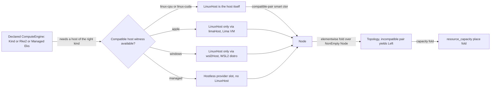

# Cluster Topology

**Status**: Authoritative source
**Supersedes**: N/A
**Referenced by**: documents/engineering/README.md, documents/engineering/app_vs_deployment_doctrine.md, documents/engineering/apple_metal_headless_builds.md, documents/engineering/cluster_lifecycle_doctrine.md, documents/engineering/dsl_doctrine.md, documents/illegal_state/illegal_state_catalog.md, documents/engineering/manifest_generation_doctrine.md, documents/engineering/pulumi_iac_doctrine.md, documents/engineering/resource_capacity_doctrine.md, documents/engineering/single_logical_data_plane_doctrine.md, documents/engineering/substrate_doctrine.md
**Generated sections**: none

> **Purpose**: Single Source of Truth for the amoebius **declared** compute-engine axis — the `ComputeEngine`
> union (`Kind` / `Rke2` / `Managed` EKS / …), the substrate-indexed `LinuxHost` witness that makes
> "rke2 on a host with no Linux node" uninhabitable, the `Topology` fold over a `NonEmpty Node` that pins
> kind to one host and rke2 to one Linux host per node, and the engine↔substrate compatibility relation that
> keeps heterogeneous multi-substrate clusters legal while rejecting an incompatible pairing.

---

## 1. Two axes: the substrate is detected, the engine is declared

amoebius keeps two orthogonal axes strictly apart, and conflating them is the exact bug this doctrine exists
to prevent:

- **The substrate is a *detected fact* about the host** — apple / linux-cpu / linux-cuda / windows, read from
  OS × arch × GPU and never an operator knob. That closed catalog and its detection are owned in full by
  [substrate_doctrine.md §1](./substrate_doctrine.md#1-the-substrate-is-a-fact-about-the-host-not-a-knob).
- **The compute engine is a *declared choice*** — kind, rke2, or a managed provider (EKS) — the operator
  authors in the `.dhall`. A declared choice cannot live in the substrate doctrine without contradicting its
  "a fact, not a knob" frame, so this document owns it, and links to substrate for the detected axis it
  ranges over.

The two meet in a **compatibility relation**: an engine runs only on the substrates it is compatible with,
and where an engine needs a Linux kernel on a non-Linux host, it consumes the *virtualization provider* the
substrate doctrine already owns (Lima on apple, WSL2 on windows). This document owns that relation and the
topology it induces; it owns **no** substrate names, no detection, no VM-provider mechanics, and no capacity
numbers (those are [substrate_doctrine.md](./substrate_doctrine.md) and
[resource_capacity_doctrine.md](./resource_capacity_doctrine.md)).

Everything below is **design intent for Phase 4** (the type discipline) with runtime realization in Phases 28/29/30. Status and gates live only in [../../DEVELOPMENT_PLAN/README.md](../../DEVELOPMENT_PLAN/README.md).

---

## 2. `ComputeEngine`: a closed union, EKS a first-class arm

The compute engine is a closed union — a product name amoebius does not support has no arm, exactly as the
service-capability union admits no product ([service_capability_doctrine.md](./service_capability_doctrine.md)):

```
ComputeEngine
  = Kind { host : LinuxHost, replicas : Replicas }
  | Rke2 : { servers : Rke2Servers, agents : List LinuxHost }
  | Managed Eks           -- provider-managed, hostless

Rke2Servers            -- CLOSED odd-quorum union: an arm only for a legal etcd quorum {1,3,5}
  = < Single : LinuxHost
    | Ha3    : { s0 : LinuxHost, s1 : LinuxHost, s2 : LinuxHost }
    | Ha5    : { s0 : LinuxHost, s1 : LinuxHost, s2 : LinuxHost, s3 : LinuxHost, s4 : LinuxHost }
    >
```

- **`Kind`** carries **exactly one** `LinuxHost` field. A multi-node kind cluster is `replicas > 1` on that
  *one* host — kind runs every node as a container on a single Docker host, so "a multi-node kind cluster
  spread across hosts" (I3) has no field to express it ([§4](#4-topology-a-cluster-is-a-fold-over-its-nodes-and-cardinality-is-by-construction), [illegal_state_catalog.md §3.15](../illegal_state/illegal_state_topology.md#315-a-multi-node-kind-cluster-not-on-a-single-linux-host)).
- **`Rke2`** carries `{ servers : Rke2Servers, agents : List LinuxHost }` — a **control plane** and a **data
  plane**, not a flat node bag. `Rke2Servers` is a **closed odd-quorum union** (`Single` / `Ha3` / `Ha5`), so
  an **even- or zero-server** control plane (no etcd majority / split-brain) has no constructor and is
  **type-foreclosed unrepresentable** ([illegal_state_catalog.md §3.24](../illegal_state/illegal_state_topology.md#324-an-evenzero-server-rke2-control-plane-no-etcd-quorum--split-brain)); it caps HA at
  five by design (a `Ha7` arm is a deliberate future add). Agents are an ordinary `List LinuxHost`. "More
  nodes than hosts" stays uninhabitable and "the same host reused for two nodes" — now over `servers ∪ agents`
  — is a decode-rejected distinctness violation (I4,
  [illegal_state_catalog.md §3.16](../illegal_state/illegal_state_topology.md#316-a-multi-node-rke2-cluster-with-fewer-linux-hosts-than-nodes-or-a-host-reused)); the cardinality detail is [§4.1](#41-rke2-serveragent-cardinality-odd-quorum-by-union-distinctness-by-fold-taint-by-derivation).
  This same `{ servers, agents }` split, given a **`Site`-indexed quorum**, expresses a **self-managed
  stretched cluster** — data-plane agents at a network `Site` distinct from the co-located control plane —
  **without a new `ComputeEngine` arm**; that stretched refinement is [§4.1](#41-rke2-serveragent-cardinality-odd-quorum-by-union-distinctness-by-fold-taint-by-derivation).
- **`Managed Eks`** is the **first-class** provider arm (I13): a provider-managed cluster with **no host** and
  no `LinuxHost` field at all. Its nodes' capacity comes from the declared instance types, not physical hosts
  ([resource_capacity_doctrine.md §3](./resource_capacity_doctrine.md#3-the-types-quantity-capacity-demand-budget)), and it is provisioned over the cloud
  API, owned by [pulumi_iac_doctrine.md §4](./pulumi_iac_doctrine.md#4-what-pulumi-provisions-the-resource-catalog).
  Because the `Managed` arm carries no `LinuxHost` / host-worker index, "a host workload (Apple Metal /
  Windows CUDA) on a hostless provider child" is uninhabitable — the hostless-provider honesty already named
  by [cluster_lifecycle_doctrine.md §1](./cluster_lifecycle_doctrine.md#1-two-cluster-kinds-one-lifecycle-shape),
  lifted to the type. Symmetrically, a **full stretched *member* node** on this hostless `Managed` arm has
  **no constructor absent a provider-native arm** (EKS Hybrid Nodes) — there is no `LinuxHost` field to hang
  it off and no channel-1 mTLS — so it is **type-foreclosed uninhabitable** until such an arm is *surfaced* over the
  cloud API ([pulumi_iac_doctrine.md §4](./pulumi_iac_doctrine.md#4-what-pulumi-provisions-the-resource-catalog)),
  never an amoebius-built second control-plane fabric (the surface-provider-vs-build discipline,
  [cluster_lifecycle_doctrine.md §1](./cluster_lifecycle_doctrine.md#1-two-cluster-kinds-one-lifecycle-shape),
  [pulumi_iac_doctrine.md §0](./pulumi_iac_doctrine.md#0-decision-record-why-pulumi-stays--and-why-that-is-not-the-helm-decision));
  the stretched treatment is [§4.1](#41-rke2-serveragent-cardinality-odd-quorum-by-union-distinctness-by-fold-taint-by-derivation).

The untyped CLI surface — `amoebius bootstrap --distro={kind,rke2} [--replicas=n]`
([substrate_doctrine.md §6](./substrate_doctrine.md#6-the-midwife-contract-a-python-cli-ensures-a-toolchain-builds-the-binary-hands-off))
— is a *projection* of this typed `ComputeEngine`, not a second source of truth.

---

## 3. The `LinuxHost` witness: rke2/kind on a host with no Linux node is uninhabitable

kind and rke2 need a **Linux kernel**. On a Linux substrate that is the host itself; on apple or
windows there is no Linux kernel until one is *synthesized* in a VM. So a `LinuxHost` is not a free value — it
is a **witness** that a Linux kernel exists, and on a non-Linux substrate the **only** constructor for it is
the virtualization provider.

- **`LinuxHost` is substrate-indexed and its constructor is gated.** On `linux-cpu`/`linux-cuda` a host *is* a
  `LinuxHost`. On `apple` the only constructor is `limaHost` (a Lima Ubuntu VM); on `windows` the only
  constructor is `wsl2Host` (a WSL2 Ubuntu distro). There is **no** `bareAppleHost : LinuxHost` and no
  `bareWindowsHost : LinuxHost` ([§4.3](../illegal_state/illegal_state_techniques.md#43-gadt-indexed-state-machines--only-legal-transitions-are-typed) constructor-gating,
  [illegal_state_catalog.md §3.14](../illegal_state/illegal_state_topology.md#314-rke2kind-on-a-host-with-no-linux-node-applewindows-without-an-interposed-linux-vm)).
- **So "rke2 on a bare Apple host" (I1) has no inhabitant.** `Rke2`/`Kind` demand a `LinuxHost`; on apple the
  only way to produce one is `limaHost`, so the VM interposition the substrate doctrine describes as reconcile
  behaviour ([substrate_doctrine.md §4](./substrate_doctrine.md#4-virtualized-substrates-synthesizing-a-linux-host-where-the-host-is-not-linux))
  becomes a *type demand* — the bare-host spec cannot even be written.
- **This is distinct from the Apple-Metal build carve-out.** "No VM for Apple-Metal *builds*"
  ([apple_metal_headless_builds.md](./apple_metal_headless_builds.md)) is about the on-host Metal *bridge
  build*; an rke2/kind *cluster* on an apple host still needs a Lima Linux VM. The two are different
  concerns and this doc states the cluster one; the build one is unchanged.
- **Honesty.** The witness demand is type-foreclosed (no constructor). That the Lima/WSL2 VM *actually boots* and
  presents a working kernel is runtime-checked, owned by
  [substrate_doctrine.md §4](./substrate_doctrine.md#4-virtualized-substrates-synthesizing-a-linux-host-where-the-host-is-not-linux)
  and exercised in Phase 28.

---

## 4. `Topology`: a cluster is a fold over its nodes, and cardinality is by construction

A cluster is not a loose bag of settings — it is a **`NonEmpty Node`**, and the engine dictates how
node count relates to host count. Making the count a *structural* property forecloses the topology illegal
states without arithmetic where possible.

```
Topology = { engine : ComputeEngine, nodes : NonEmpty Node }
Node     = { host : Host, substrate : Substrate }   -- Host is a LinuxHost witness or a hostless Provider slot
```

- **Kind: exactly one host (I3, type-foreclosed).** The `Kind` arm's single `host` field *is* the cardinality bound —
  a second host has no field to bind, a Gate-1 type error. Multi-node is `replicas`, which never adds a host.
- **rke2: one Linux host per node, quorum by construction (I4).** `Rke2` no longer carries a flat
  `NonEmpty LinuxHost`; it splits into `{ servers : Rke2Servers, agents : List LinuxHost }` ([§2](#2-computeengine-a-closed-union-eks-a-first-class-arm)). Every server
  and every agent still *is* a `LinuxHost` value, so "more nodes than hosts" stays type-foreclosed uninhabitable — but
  the server count is now pinned to a legal odd etcd quorum by the closed `Rke2Servers` union rather than left
  to a runtime check. **Distinctness** ("no host reused for two nodes") now ranges over `servers ∪ agents` and
  is still the one part Dhall cannot express as a type (no Set-distinctness), so it degrades to a **decode-foreclosed
  total decode fold** (`mkRke2` rejects a duplicate `HostId`), and the catalog classifies [§3.16](../illegal_state/illegal_state_topology.md#316-a-multi-node-rke2-cluster-with-fewer-linux-hosts-than-nodes-or-a-host-reused) at that weaker
  floor honestly. Full cardinality treatment is [§4.1](#41-rke2-serveragent-cardinality-odd-quorum-by-union-distinctness-by-fold-taint-by-derivation).
- **Multi-substrate clusters stay legal (I2 carve-out).** A `Topology` may mix nodes of *different*
  substrates — a heterogeneous cluster is explicitly allowed. Compatibility ([§5](#5-the-compatibility-relation-technique-47-only-compatible-pairs-have-a-constructor)) is checked **elementwise**
  per node, never as a single whole-cluster substrate, so a legal multi-substrate cluster decodes while an
  incompatible pairing does not.

### 4.1 rke2 server/agent cardinality: odd quorum by union, distinctness by fold, taint by derivation

The flat `Rke2.nodes : NonEmpty LinuxHost` treated every rke2 node alike. The typed model ([§2](#2-computeengine-a-closed-union-eks-a-first-class-arm)) splits the
cluster into a **control plane** (`servers : Rke2Servers`) and a **data plane** (`agents : List LinuxHost`) and
pins three properties at three honest layers.

- **Quorum by closed union (type-foreclosed).** `Rke2Servers = < Single | Ha3 | Ha5 >` has an arm *only* for the legal
  odd etcd quorums {1, 3, 5}. A **0-server** (no control plane) or **2-server** (no majority / split-brain)
  cluster has **no constructor** — type-foreclosed unrepresentable, the same "no illegal arm" idiom as `StorageBudget`'s
  missing unbounded case ([resource_capacity_doctrine.md §5](./resource_capacity_doctrine.md#5-storagebudget-bounded-by-construction-single-owner-ceiling-per-arm)). The union
  deliberately caps HA at five: a five-member etcd quorum already tolerates two simultaneous member losses —
  beyond any realistic single-cluster control-plane fault budget — while each additional member raises the
  synchronous write-quorum cost, so a seventh member buys tolerance for a third concurrent failure this topology
  never needs at a steady-state write-latency price. A `Ha7` arm is therefore a deliberate deferral, not an
  oversight — a future add. This is catalog entry
  [illegal_state_catalog.md §3.24](../illegal_state/illegal_state_topology.md#324-an-evenzero-server-rke2-control-plane-no-etcd-quorum--split-brain) (Owner: this doc; Technique: [§4.2](../illegal_state/illegal_state_techniques.md#42-capability-and-phantom-tenant-tags--cross-tenant-refs-are-uninhabitable) closed union).
- **Distinctness by fold over `servers ∪ agents` (decode-foreclosed).** Dhall has no Set-distinctness, so "no host reused
  for two nodes" cannot be a type. It degrades to the **decode-foreclosed total decode fold** `mkRke2`, which now ranges
  over the **union of the server set and the agent list** and rejects a duplicate `HostId`. This *generalizes*
  the old single-node-list fold: distinctness must hold across both planes at once, so a host cannot be both a
  server and an agent, nor appear twice in either. The catalog classifies
  [illegal_state_catalog.md §3.16](../illegal_state/illegal_state_topology.md#316-a-multi-node-rke2-cluster-with-fewer-linux-hosts-than-nodes-or-a-host-reused) to this weaker floor honestly and now scopes it
  to `servers ∪ agents`.
- **Control-plane taint by derivation (type-foreclosed structural, runtime-checked residue).** The control-plane node taint and
  its matching workload tolerations are **derived from the server set**, never hand-authored — the same
  derive-don't-author discipline the catalog names for tolerations
  ([illegal_state_catalog.md §3.22](../illegal_state/illegal_state_capacity.md#322-a-hand-authored-un-derived-toleration)). Because `servers` is the single source of the
  taint, there is no seam to author an un-derived one; the derivation is type-foreclosed at the spec layer, with the
  actual kube-level taint/toleration application a runtime-checked residue on the reconciler.

**Root cluster.** The zero-secret root is exactly `{ servers = Rke2Servers.Single host, agents = [] }` — one
server, no agents — the single-node base named by the root-single-node rule in
[cluster_lifecycle_doctrine.md §2](./cluster_lifecycle_doctrine.md#2-bring-up-and-bootstrap). Growing it is two
different moves, never fused:

- **Agents grow by `ScalingPolicy`.** Adding data-plane capacity extends the `agents` list, enacted as Pulumi
  node provisioning ([resource_capacity_doctrine.md §6](./resource_capacity_doctrine.md#6-growable--scalingpolicy-the-escape-valve-amoebius-owns),
  [pulumi_iac_doctrine.md §4](./pulumi_iac_doctrine.md#4-what-pulumi-provisions-the-resource-catalog)).
- **Quorum is fixed by declaration.** The server count is *not* an autoscaled quantity: moving `Single → Ha3`
  (or `Ha3 → Ha5`) is a **deliberate re-provision of the control plane**, authored in the `.dhall`, never a
  `ScalingPolicy` outcome. Quorum is pinned by the declared `Rke2Servers` arm; the capacity arithmetic over the
  resulting node set is owned by [resource_capacity_doctrine.md §6](./resource_capacity_doctrine.md#6-growable--scalingpolicy-the-escape-valve-amoebius-owns).

**Rollout is a lifecycle verb, not a type.** The server/agent bring-up — the first server running etcd
`cluster-init` and minting the join token, further servers and all agents joining by a `server:` URL plus that
token, rejoin idempotent — is a checkpoint-free tag-discovery **host reconcile (reconciler tier (b))** and a
lifecycle *verb*, owned by
[cluster_lifecycle_doctrine.md §2](./cluster_lifecycle_doctrine.md#2-bring-up-and-bootstrap) (the reconciler,
not a state machine — [cluster_lifecycle_doctrine.md §9](./cluster_lifecycle_doctrine.md#9-how-bring-up-and-teardown-are-implemented-the-reconciler-not-a-state-machine)).
This doc supplies only the shape those verbs act on (per [§6](#6-where-topology-meets-capacity-and-lifecycle)-[§7](#7-planning-ownership)).

**Sibling evidence, not an amoebius result.** prodbox's `Prodbox/CLI/Rke2.hs` proves the **single-node** base
(`rke2-server.service`, `/etc/rancher/rke2/config.yaml`, `registries.yaml`, install markers, uninstall) and its
golden `rke2-reconcile.txt` shows the step-list (`ensure_rke2_server_installed → enable/restart → sync
kubeconfig → wait_for_cluster_nodes_ready`). That is `rke2-server` **only** — the multi-node server/agent
split, the etcd-HA `Ha3`/`Ha5` quorums, and the join-token custody are **net-new** across the sibling family
(hostbootstrap carries zero rke2 code). Sibling evidence, not amoebius proof
([documentation_standards.md §6](../documentation_standards.md#6-honesty-the-proventestedassumed-discipline)).

**Stretched clusters: two node kinds, reachability derived by a total fold (this round introduces).** A
**stretched node** is one whose declared network-locality `Site` (a per-host inventory axis owned by
[substrate_doctrine.md §8](./substrate_doctrine.md#8-the-node-inventory-the-single-owner-of-hosts-capacity-and-taints))
differs from the control plane's, reached across the WAN. Correcting a single-witness model, a stretched entity
is exactly **one of two kinds**, sorted by a `StretchedNode` classifier, and the two demand **different**
reachability — both over a **mandatory declared networking capability** `Networking c = Gateway | Vpn` owned by
[network_fabric_doctrine.md §5](./network_fabric_doctrine.md#5-the-security-boundary-generalizes-localhost--authenticated-fabric).
This doc owns the classifier and the K2 (full-node) control-plane witness; the K1 data-plane witness and the
`Networking` sum are **consumed, not restated**.

- **K1 — a non-member host worker** (an Apple-Metal / Windows-CUDA native subprocess,
  [substrate_doctrine.md §5](./substrate_doctrine.md#5-host-worker-nodes-substrate-specific-hardware-that-refuses-to-be-contained))
  needs only data-plane + Vault reach and **no** apiserver reachability. The classifier's K1 arm yields only a
  `DataPlaneOnly (FabricMember c)` — the **one** data-plane witness owned by
  [single_logical_data_plane_doctrine.md §3](./single_logical_data_plane_doctrine.md#3-the-binding-reachability-is-a-type-not-a-runtime-probe),
  consumed here and never re-minted — so a host worker has **no path** into control-plane membership (**type-foreclosed**:
  the total `witness` fold has no constructor carrying a K1 host worker into a member `Reach`). It is the
  attach-pool shape ([single_logical_data_plane_doctrine.md §4](./single_logical_data_plane_doctrine.md#4-the-elastic-worker-pool-the-attach-topology)),
  representable on **any** `ComputeEngine`, including a hostless `Managed Eks`.
- **K2 — a full k8s node** (a kubelet member inside the `Rke2` arm) carries the control-plane witness
  **`ReachesControlPlane c`**, minted **from** the declared `Networking`'s `VpnFabric`
  ([network_fabric_doctrine.md §3](./network_fabric_doctrine.md#3-keys-config-and-distribution--wireguard-as-just-another-reconcile)/[§5](./network_fabric_doctrine.md#5-the-security-boundary-generalizes-localhost--authenticated-fabric))
  by covering the apiserver VPN-IP — there is **no off-fabric constructor**, so witness *presence* is **type-foreclosed**
  (the phantom cluster index `c` must unify). A declared-remote agent is routed to
  **`mkStretchedAgent :: ReachesControlPlane c -> HostAt s' -> Agent c s'`** by the same total `Site` decode
  fold that classifies stretchedness — a **decode-foreclosed** checked rejection of a constructible value
  ([§5](#5-the-compatibility-relation-technique-47-only-compatible-pairs-have-a-constructor) elementwise fold);
  `mkStretchedAgent` threads a **single** networking value (the witness already carries its `VpnFabric`, so
  there is no double-count).

**Quorum stays co-located: `Rke2Servers (s :: Site)`.** The stretch is a **data-plane** move only: the servers
union gains a phantom `Site` index so every server of one quorum unifies on **one** `Site`, and only
`mkStretchedAgent` places agents at `Site' ≠ s`. A **split-`Site` etcd quorum** therefore has **no inhabitant** —
**type-foreclosed by phantom-`Site` unification**, a *different* mechanism from the odd-count closure that forecloses a
2/0-server quorum ([illegal_state_catalog.md §3.24](../illegal_state/illegal_state_topology.md#324-an-evenzero-server-rke2-control-plane-no-etcd-quorum--split-brain)
is the count union; this is the locality index). Runtime residue is **runtime-checked**: the co-located servers keep a
low-latency majority when the WAN link degrades.

**Full member on the hostless `Managed` arm is type-foreclosed until a provider-native arm.** Per
[§2](#2-computeengine-a-closed-union-eks-a-first-class-arm), a full stretched member on `Managed Eks` has **no
constructor absent a provider-native capability** (EKS Hybrid Nodes) the `Managed` arm would *surface* — amoebius
never builds a second control-plane fabric to fake it (the surface-provider-vs-build discipline,
[cluster_lifecycle_doctrine.md §1](./cluster_lifecycle_doctrine.md#1-two-cluster-kinds-one-lifecycle-shape),
[pulumi_iac_doctrine.md §0](./pulumi_iac_doctrine.md#0-decision-record-why-pulumi-stays--and-why-that-is-not-the-helm-decision)).
This is the same closed-union "no arm = not supported" idiom as the missing `Ha7` quorum.

**Honesty.** All of the above is Phase-0 design intent; **this round introduces** the two-kind classifier and
the K2 witness rule (no code exists). Witness/field presence is type-foreclosed; the `Site` routing fold and the reach
relation are decode-foreclosed decode checks; the WAN link actually coming up and the declared `Site` matching reality
(`discover = Unreachable → refuse`,
[cluster_lifecycle_doctrine.md §9](./cluster_lifecycle_doctrine.md#9-how-bring-up-and-teardown-are-implemented-the-reconciler-not-a-state-machine))
are runtime-checked residue. The `Networking` wire, its endpoint indices, and the apiserver-VPN-IP render
obligation are owned by
[network_fabric_doctrine.md §5](./network_fabric_doctrine.md#5-the-security-boundary-generalizes-localhost--authenticated-fabric);
`Site` by [substrate_doctrine.md §8](./substrate_doctrine.md#8-the-node-inventory-the-single-owner-of-hosts-capacity-and-taints);
`FabricMember c` by [single_logical_data_plane_doctrine.md §3](./single_logical_data_plane_doctrine.md#3-the-binding-reachability-is-a-type-not-a-runtime-probe) —
this doc mints only the K2 `ReachesControlPlane c` and owns the classifier that dispatches between the kinds.

---

## 5. The compatibility relation (technique §4.7): only compatible pairs have a constructor

"a compute engine not compatible with the available substrates" (I2) should have no way to be
written — so a `Node` is built by a **compatible-pair smart constructor** that only accepts an
`(engine, substrate-indexed host)` pair the relation permits.

This is the catalog's **[§4.7](../illegal_state/illegal_state_techniques.md#47-compatibility--topology-relations-by-construction-over-a-collection) technique — compatibility/topology relations by construction over a collection**
([illegal_state_catalog.md §4.7](../illegal_state/illegal_state_techniques.md#47-compatibility--topology-relations-by-construction-over-a-collection)): it composes the phantom-index ([§4.2](../illegal_state/illegal_state_techniques.md#42-capability-and-phantom-tenant-tags--cross-tenant-refs-are-uninhabitable)),
constructor-gating ([§4.3](../illegal_state/illegal_state_techniques.md#43-gadt-indexed-state-machines--only-legal-transitions-are-typed)), and ownership-fold ([§4.4](../illegal_state/illegal_state_techniques.md#44-ownership-indices--single-owner-ssot-structurally)) techniques and applies them to a **binary relation over a
collection**.

- **Element-level (type-foreclosed where structural).** `Managed Eks` pairs only with a hostless provider slot;
  `Rke2`/`Kind` pair only with a `LinuxHost` witness ([§3](#3-the-linuxhost-witness-rke2kind-on-a-host-with-no-linux-node-is-uninhabitable)). A pairing outside the relation — e.g. a native
  Apple-Metal engine on a Linux node, or a managed arm carrying a `LinuxHost` — has no constructor.
- **Collection-level (decode-foreclosed fold).** The cluster-wide compatibility check is a **total elementwise fold**
  over `NonEmpty Node`: every node's `(engine, substrate)` pair must satisfy the relation, and the fold
  returns the full list of incompatible nodes (not just the first), like `validateTopology`
  ([pulsar_client_doctrine.md §6](./pulsar_client_doctrine.md#6-the-declarative-topology-algebra)). Because it
  is elementwise, heterogeneous multi-substrate is legal by construction; only the incompatible *pair* is
  rejected.
- **The node inventory is the single owner of "what substrates exist."** The relation reads the closed
  substrate catalog and the per-host node inventory owned by [substrate_doctrine.md](./substrate_doctrine.md)
  ([§4.4](../illegal_state/illegal_state_techniques.md#44-ownership-indices--single-owner-ssot-structurally) ownership index), so the compatibility check is against one authoritative list, never a guess.



---

## 6. Where topology meets capacity and lifecycle

This doctrine owns the *shape* of a legal cluster; two siblings own what rides on it:

- **Capacity.** `resource_capacity`'s `place` fold ranges over *this* `Topology`, and it is a **placement**, not
  a sum ([resource_capacity_doctrine.md §4.1](./resource_capacity_doctrine.md#41-place-branches-static-proves-a-placement-dynamic-proves-a-growth-envelope)):
  the `ComputeEngine` shape selects the check. A **fixed** node set (`Kind` with `replicas`, `Rke2` `servers` +
  statically-declared `agents`) yields a concrete pod→node **witness** bin-pack; an **elastic** node set
  (`Autoscaled` agents, a `Managed Eks` node group up to a `CloudQuota`) yields a two-**envelope** check
  (per-pod-fits-largest-candidate-instance + Σ-at-max-scale ≤ quota) the autoscaler can always satisfy; a hybrid
  witness-packs its fixed floor and envelope-checks the headroom. Topology owns the node set (and thus the
  fixed-vs-elastic distinction); capacity owns the placement arithmetic over it.
- **Lifecycle.** The bring-up, spawn, teardown, and dynamic-provisioning *verbs* over these engines are owned
  by [cluster_lifecycle_doctrine.md](./cluster_lifecycle_doctrine.md) (the root-single-node rule in [§2](./cluster_lifecycle_doctrine.md#2-bring-up-and-bootstrap), the
  provider-managed vs self-managed split in [§1](./cluster_lifecycle_doctrine.md#1-two-cluster-kinds-one-lifecycle-shape)). This doc supplies the *types* those verbs act on; it does not
  restate the verbs. Dynamic growth of the node set is a `ScalingPolicy`
  ([resource_capacity_doctrine.md §6](./resource_capacity_doctrine.md#6-growable--scalingpolicy-the-escape-valve-amoebius-owns)) enacted as Pulumi node provisioning
  ([pulumi_iac_doctrine.md §4](./pulumi_iac_doctrine.md#4-what-pulumi-provisions-the-resource-catalog)).
- **Host-worker capacity and stretched reachability (cross-refs only; [§1](#1-two-axes-the-substrate-is-detected-the-engine-is-declared) disclaims capacity ownership).**
  A host-level accelerator worker's `Demand` folds against its **own physical-host `Capacity`** via
  `resource_capacity`'s **host→host-worker** nesting arm
  ([resource_capacity_doctrine.md §4](./resource_capacity_doctrine.md#4-the-total-fold-fits-carve-place-and-the-nesting)),
  never this cluster's node bin-pack; this doc re-declares no such tier. A **stretched** node's reachability —
  the K2 `ReachesControlPlane c` this doc mints in
  [§4.1](#41-rke2-serveragent-cardinality-odd-quorum-by-union-distinctness-by-fold-taint-by-derivation) and the
  K1 data-plane `FabricMember c` it consumes from
  [single_logical_data_plane_doctrine.md §3](./single_logical_data_plane_doctrine.md#3-the-binding-reachability-is-a-type-not-a-runtime-probe) —
  is fold-derived, never authored, and rides the
  [network_fabric_doctrine.md §5](./network_fabric_doctrine.md#5-the-security-boundary-generalizes-localhost--authenticated-fabric)
  `Networking` wire; being stretched is a *networking* fact that never moves the per-host capacity fold.

> **Honesty.** Everything here is Phase-0 design intent. The type demands ([§3](#3-the-linuxhost-witness-rke2kind-on-a-host-with-no-linux-node-is-uninhabitable)-[§5](#5-the-compatibility-relation-technique-47-only-compatible-pairs-have-a-constructor)) are type-foreclosed/decode-foreclosed
> spec-layer properties *when implemented as specified* (Phase 4); the runtime residue — the VM actually
> booting, N rke2 nodes actually joining on N hosts, an EKS cluster actually coming up — is runtime-checked, owned by
> the Phase 28/29/30 gates and [chaos_failover_doctrine.md](./chaos_failover_doctrine.md). Where a mechanism
> generalizes hostbootstrap's virtualization providers or prodbox's EKS reality, that is sibling evidence,
> not amoebius proof ([documentation_standards.md §6](../documentation_standards.md#6-honesty-the-proventestedassumed-discipline)).

---

## 7. Planning ownership

This document is normative topology doctrine only. Delivery sequencing, completion status, and validation
gates are owned by [../../DEVELOPMENT_PLAN/README.md](../../DEVELOPMENT_PLAN/README.md): the `ComputeEngine` /
`LinuxHost` / `Topology` types and the compatibility relation land in **Phase 4** (with the negative `.dhall`
gate); the Lima `LinuxHost` witness is exercised on **Phase 28** (`apple`); live multi-node rke2/kind topology
on **Phase 29**; the `Managed Eks` arm on **Phase 30**. This doc never maintains a competing status ledger; it
states the target shape and links back for status, per [documentation_standards.md §6](../documentation_standards.md#6-honesty-the-proventestedassumed-discipline).

---

## Cross-references

- [Engineering Doctrine Index](./README.md)
- [Substrate Doctrine](./substrate_doctrine.md) — the detected substrate catalog, virtualization providers, and node inventory this axis ranges over
- [Illegal State Catalog](../illegal_state/illegal_state_catalog.md) — the catalog ([§3.13](../illegal_state/illegal_state_topology.md#313-a-compute-engine-incompatible-with-its-substrates-managed-providers-first-class)-[§3.16](../illegal_state/illegal_state_topology.md#316-a-multi-node-rke2-cluster-with-fewer-linux-hosts-than-nodes-or-a-host-reused), [§3.24](../illegal_state/illegal_state_topology.md#324-an-evenzero-server-rke2-control-plane-no-etcd-quorum--split-brain)) and technique ([§4.7](../illegal_state/illegal_state_techniques.md#47-compatibility--topology-relations-by-construction-over-a-collection)) this doctrine realizes
- [Resource Capacity Doctrine](./resource_capacity_doctrine.md) — the `place` fold over this `Topology`, and the `ScalingPolicy` ([§6](./resource_capacity_doctrine.md#6-growable--scalingpolicy-the-escape-valve-amoebius-owns)) that grows the `agents` list while server quorum stays declared
- [Cluster Lifecycle Doctrine](./cluster_lifecycle_doctrine.md) — the bring-up / spawn / teardown verbs over these engines, including the rke2 server/agent rollout (reconciler tier (b))
- [Pulumi IaC Doctrine](./pulumi_iac_doctrine.md) — provisioning the `Managed Eks` arm and dynamic nodes
- [DSL Doctrine](./dsl_doctrine.md) — the surface that carries the `ComputeEngine` field
- [Apple Metal Headless Builds](./apple_metal_headless_builds.md) — the distinct "no VM for Metal builds" carve-out
- [Development Plan](../../DEVELOPMENT_PLAN/README.md)
- [Documentation Standards](../documentation_standards.md)
