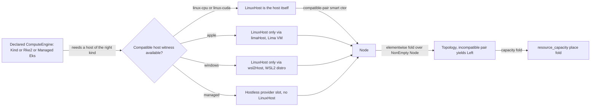

# Cluster Topology

**Status**: Authoritative source
**Supersedes**: N/A
**Referenced by**: documents/engineering/README.md, documents/engineering/app_vs_deployment_doctrine.md, documents/engineering/apple_metal_headless_builds.md, documents/engineering/cluster_lifecycle_doctrine.md, documents/engineering/dsl_doctrine.md, documents/engineering/illegal_state_catalog.md, documents/engineering/manifest_generation_doctrine.md, documents/engineering/pulumi_iac_doctrine.md, documents/engineering/resource_capacity_doctrine.md, documents/engineering/single_logical_data_plane_doctrine.md, documents/engineering/substrate_doctrine.md
**Generated sections**: none

> **Purpose**: Single Source of Truth for the amoebius **declared** compute-engine axis — the `ComputeEngine`
> union (`Kind` / `Rke2` / `Managed` EKS / …), the substrate-indexed `LinuxHost` witness that makes
> "rke2 on a host with no Linux node" uninhabitable, the `Topology` fold over a `NonEmpty Node` that pins
> kind to one host and rke2 to one Linux host per node, and the engine↔substrate compatibility relation that
> keeps heterogeneous multi-substrate clusters legal while rejecting an incompatible pairing.

---

## 1. Two axes: the substrate is detected, the engine is declared

amoebius keeps two orthogonal axes strictly apart, and conflating them is the exact bug this doctrine exists
to prevent:

- **The substrate is a *detected fact* about the host** — apple / linux-cpu / linux-cuda / windows, read from
  OS × arch × GPU and never an operator knob. That closed catalog and its detection are owned in full by
  [substrate_doctrine.md §1](./substrate_doctrine.md#1-the-substrate-is-a-fact-about-the-host-not-a-knob).
- **The compute engine is a *declared choice*** — kind, rke2, or a managed provider (EKS) — the operator
  authors in the `.dhall`. A declared choice cannot live in the substrate doctrine without contradicting its
  "a fact, not a knob" frame, so this document owns it, and links to substrate for the detected axis it
  ranges over.

The two meet in a **compatibility relation**: an engine runs only on the substrates it is compatible with,
and where an engine needs a Linux kernel on a non-Linux host, it consumes the *virtualization provider* the
substrate doctrine already owns (Lima on apple, WSL2 on windows). This document owns that relation and the
topology it induces; it owns **no** substrate names, no detection, no VM-provider mechanics, and no capacity
numbers (those are [substrate_doctrine.md](./substrate_doctrine.md) and
[resource_capacity_doctrine.md](./resource_capacity_doctrine.md)).

Everything below is **design intent for Phase 3** (the type discipline) with runtime realization in Phases
7/9/10. Status and gates live only in [../../DEVELOPMENT_PLAN/README.md](../../DEVELOPMENT_PLAN/README.md).

---

## 2. `ComputeEngine`: a closed union, EKS a first-class arm

The compute engine is a closed union — a product name amoebius does not support has no arm, exactly as the
service-capability union admits no product ([service_capability_doctrine.md](./service_capability_doctrine.md)):

```
ComputeEngine
  = Kind { host : LinuxHost, replicas : Replicas }
  | Rke2 { nodes : NonEmpty LinuxHost }
  | Managed Eks           -- provider-managed, hostless
```

- **`Kind`** carries **exactly one** `LinuxHost` field. A multi-node kind cluster is `replicas > 1` on that
  *one* host — kind runs every node as a container on a single Docker host, so "a multi-node kind cluster
  spread across hosts" (I3) has no field to express it (§4, [illegal_state_catalog.md §3.15](./illegal_state_catalog.md)).
- **`Rke2`** carries a `NonEmpty LinuxHost` — one Linux host per node (§4). "More nodes than hosts" is
  uninhabitable and "the same host reused for two nodes" is a decode-rejected distinctness violation (I4,
  [illegal_state_catalog.md §3.16](./illegal_state_catalog.md)).
- **`Managed Eks`** is the **first-class** provider arm (I13): a provider-managed cluster with **no host** and
  no `LinuxHost` field at all. Its nodes' capacity comes from the declared instance types, not physical hosts
  ([resource_capacity_doctrine.md §3](./resource_capacity_doctrine.md)), and it is provisioned over the cloud
  API, owned by [pulumi_iac_doctrine.md §4](./pulumi_iac_doctrine.md#4-what-pulumi-provisions-the-resource-catalog).
  Because the `Managed` arm carries no `LinuxHost` / host-worker index, "a host workload (Apple Metal /
  Windows CUDA) on a hostless provider child" is uninhabitable — the hostless-provider honesty already named
  by [cluster_lifecycle_doctrine.md §1](./cluster_lifecycle_doctrine.md#1-two-cluster-kinds-one-lifecycle-shape),
  lifted to the type.

The untyped CLI surface — `amoebius bootstrap --distro={kind,rke2} [--replicas=n]`
([substrate_doctrine.md §6](./substrate_doctrine.md#6-the-bootstrapsh-contract-ensure-a-toolchain-build-the-binary-hand-off))
— is a *projection* of this typed `ComputeEngine`, not a second source of truth.

---

## 3. The `LinuxHost` witness: rke2/kind on a host with no Linux node is uninhabitable

Intuition: kind and rke2 need a **Linux kernel**. On a Linux substrate that is the host itself; on apple or
windows there is no Linux kernel until one is *synthesized* in a VM. So a `LinuxHost` is not a free value — it
is a **witness** that a Linux kernel exists, and on a non-Linux substrate the **only** constructor for it is
the virtualization provider.

- **`LinuxHost` is substrate-indexed and its constructor is gated.** On `linux-cpu`/`linux-cuda` a host *is* a
  `LinuxHost`. On `apple` the only constructor is `limaHost` (a Lima Ubuntu VM); on `windows` the only
  constructor is `wsl2Host` (a WSL2 Ubuntu distro). There is **no** `bareAppleHost : LinuxHost` and no
  `bareWindowsHost : LinuxHost` (§4.3 constructor-gating,
  [illegal_state_catalog.md §3.14](./illegal_state_catalog.md)).
- **So "rke2 on a bare Apple host" (I1) has no inhabitant.** `Rke2`/`Kind` demand a `LinuxHost`; on apple the
  only way to produce one is `limaHost`, so the VM interposition the substrate doctrine describes as reconcile
  behaviour ([substrate_doctrine.md §4](./substrate_doctrine.md#4-virtualized-substrates-synthesizing-a-linux-host-where-the-host-is-not-linux))
  becomes a *type demand* — you cannot even write the bare-host spec.
- **This is distinct from the Apple-Metal build carve-out.** "No VM for Apple-Metal *builds*"
  ([apple_metal_headless_builds.md](./apple_metal_headless_builds.md)) is about the on-host Metal *bridge
  build*; an rke2/kind *cluster* on an apple host still needs a Lima Linux VM. The two are different
  concerns and this doc states the cluster one; the build one is unchanged.
- **Honesty.** The witness demand is grade-1 (no constructor). That the Lima/WSL2 VM *actually boots* and
  presents a working kernel is grade-3 runtime, owned by
  [substrate_doctrine.md §4](./substrate_doctrine.md#4-virtualized-substrates-synthesizing-a-linux-host-where-the-host-is-not-linux)
  and exercised in Phase 7.

---

## 4. `Topology`: a cluster is a fold over its nodes, and cardinality is by construction

Intuition: a cluster is not a loose bag of settings — it is a **`NonEmpty Node`**, and the engine dictates how
node count relates to host count. Making the count a *structural* property forecloses the topology illegal
states without arithmetic where possible.

```
Topology = { engine : ComputeEngine, nodes : NonEmpty Node }
Node     = { host : Host, substrate : Substrate }   -- Host is a LinuxHost witness or a hostless Provider slot
```

- **Kind: exactly one host (I3, grade-1).** The `Kind` arm's single `host` field *is* the cardinality bound —
  a second host has no field to bind, a Gate-1 type error. Multi-node is `replicas`, which never adds a host.
- **rke2: one Linux host per node (I4).** `Rke2.nodes : NonEmpty LinuxHost` means the node list *is* the host
  list — you cannot build N nodes without N host values, so "more nodes than hosts" is grade-1 uninhabitable.
  **Distinctness** ("no host reused for two nodes") is the one part Dhall cannot express as a type (it has no
  Set-distinctness), so it degrades to a **grade-2 total decode fold** (`mkRke2` rejects a duplicate `HostId`),
  and the catalog grades §3.16 to that weaker floor honestly.
- **Multi-substrate clusters stay legal (I2 carve-out).** A `Topology` may mix nodes of *different*
  substrates — a heterogeneous cluster is explicitly allowed. Compatibility (§5) is checked **elementwise**
  per node, never as a single whole-cluster substrate, so a legal multi-substrate cluster decodes while an
  incompatible pairing does not.

---

## 5. The compatibility relation (technique §4.7): only compatible pairs have a constructor

Intuition: "a compute engine not compatible with the available substrates" (I2) should have no way to be
written — so a `Node` is built by a **compatible-pair smart constructor** that only accepts an
`(engine, substrate-indexed host)` pair the relation permits.

This is the catalog's **§4.7 technique — compatibility/topology relations by construction over a collection**
([illegal_state_catalog.md §4.7](./illegal_state_catalog.md)): it composes the phantom-index (§4.2),
constructor-gating (§4.3), and ownership-fold (§4.4) techniques and applies them to a **binary relation over a
collection**.

- **Element-level (grade-1 where structural).** `Managed Eks` pairs only with a hostless provider slot;
  `Rke2`/`Kind` pair only with a `LinuxHost` witness (§3). A pairing outside the relation — e.g. a native
  Apple-Metal engine on a Linux node, or a managed arm carrying a `LinuxHost` — has no constructor.
- **Collection-level (grade-2 fold).** The cluster-wide compatibility check is a **total elementwise fold**
  over `NonEmpty Node`: every node's `(engine, substrate)` pair must satisfy the relation, and the fold
  returns the full list of incompatible nodes (not just the first), like `validateTopology`
  ([pulsar_client_doctrine.md §6](./pulsar_client_doctrine.md#6-the-declarative-topology-algebra)). Because it
  is elementwise, heterogeneous multi-substrate is legal by construction; only the incompatible *pair* is
  rejected.
- **The node inventory is the single owner of "what substrates exist."** The relation reads the closed
  substrate catalog and the per-host node inventory owned by [substrate_doctrine.md](./substrate_doctrine.md)
  (§4.4 ownership index), so the compatibility check is against one authoritative list, never a guess.



---

## 6. Where topology meets capacity and lifecycle

This doctrine owns the *shape* of a legal cluster; two siblings own what rides on it:

- **Capacity.** `resource_capacity`'s `place` fold ranges over *this* `Topology` — the summed workload demand
  against the summed node capacity ([resource_capacity_doctrine.md §4](./resource_capacity_doctrine.md)).
  Topology owns the node set; capacity owns the arithmetic over it.
- **Lifecycle.** The bring-up, spawn, teardown, and dynamic-provisioning *verbs* over these engines are owned
  by [cluster_lifecycle_doctrine.md](./cluster_lifecycle_doctrine.md) (the root-single-node rule in §2, the
  provider-managed vs self-managed split in §1). This doc supplies the *types* those verbs act on; it does not
  restate the verbs. Dynamic growth of the node set is a `ScalingPolicy`
  ([resource_capacity_doctrine.md §6](./resource_capacity_doctrine.md)) enacted as Pulumi node provisioning
  ([pulumi_iac_doctrine.md §4](./pulumi_iac_doctrine.md#4-what-pulumi-provisions-the-resource-catalog)).

> **Honesty.** Everything here is Phase-0 design intent. The type demands (§3-§5) are grade-1/grade-2
> spec-layer properties *when implemented as specified* (Phase 3); the runtime residue — the VM actually
> booting, N rke2 nodes actually joining on N hosts, an EKS cluster actually coming up — is grade-3, owned by
> the Phase 7/9/10 gates and [chaos_failover_doctrine.md](./chaos_failover_doctrine.md). Where a mechanism
> generalizes hostbootstrap's virtualization providers or prodbox's EKS reality, that is sibling evidence,
> not amoebius proof ([documentation_standards.md §6](../documentation_standards.md)).

---

## 7. Planning ownership

This document is normative topology doctrine only. Delivery sequencing, completion status, and validation
gates are owned by [../../DEVELOPMENT_PLAN/README.md](../../DEVELOPMENT_PLAN/README.md): the `ComputeEngine` /
`LinuxHost` / `Topology` types and the compatibility relation land in **Phase 3** (with the negative `.dhall`
gate); the Lima `LinuxHost` witness is exercised on **Phase 7** (`apple`); live multi-node rke2/kind topology
on **Phase 9**; the `Managed Eks` arm on **Phase 10**. This doc never maintains a competing status ledger; it
states the target shape and links back for status, per [documentation_standards.md §6](../documentation_standards.md).

---

## Cross-references

- [Engineering Doctrine Index](./README.md)
- [Substrate Doctrine](./substrate_doctrine.md) — the detected substrate catalog, virtualization providers, and node inventory this axis ranges over
- [Illegal State Catalog](./illegal_state_catalog.md) — the catalog (§3.13-§3.16) and technique (§4.7) this doctrine realizes
- [Resource Capacity Doctrine](./resource_capacity_doctrine.md) — the `place` fold over this `Topology`
- [Cluster Lifecycle Doctrine](./cluster_lifecycle_doctrine.md) — the bring-up / spawn / teardown verbs over these engines
- [Pulumi IaC Doctrine](./pulumi_iac_doctrine.md) — provisioning the `Managed Eks` arm and dynamic nodes
- [DSL Doctrine](./dsl_doctrine.md) — the surface that carries the `ComputeEngine` field
- [Apple Metal Headless Builds](./apple_metal_headless_builds.md) — the distinct "no VM for Metal builds" carve-out
- [Development Plan](../../DEVELOPMENT_PLAN/README.md)
- [Documentation Standards](../documentation_standards.md)
