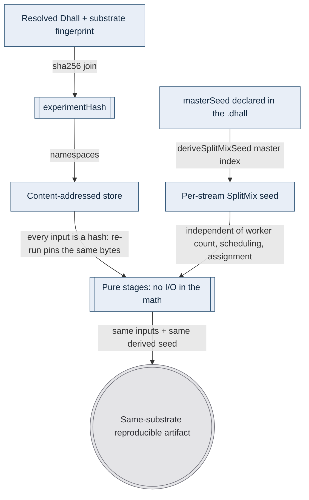

# Content-addressing determinism

> **Purpose**: Define determinism by construction — pinned inputs, pure stages, and a derived seed — and the honest limit of each.
> **Read this if**: a pipeline must reproduce a byte-identical result, or you need to know why one did not.

This document owns the determinism construction and its per-stage obligations. It does not own the surrounding subject — owned by
[content_addressing_doctrine.md](./content_addressing_doctrine.md), of which this is a slice.

<details>
<summary>Link-graph metadata</summary>

**Status**: Authoritative source
**Supersedes**: N/A
**Referenced by**: DEVELOPMENT_PLAN/legacy_tracking_for_deletion.md, DEVELOPMENT_PLAN/overview.md, DEVELOPMENT_PLAN/phase_00_documentation_suite.md, DEVELOPMENT_PLAN/phase_01_toolchain_spike.md, DEVELOPMENT_PLAN/phase_30_capability_bind.md, DEVELOPMENT_PLAN/phase_32_inference_accelerator_provision.md, DEVELOPMENT_PLAN/phase_56_base_image_registry.md, DEVELOPMENT_PLAN/phase_80_determinism_jitcache.md, DEVELOPMENT_PLAN/phase_91_infernix_rederivation.md, DEVELOPMENT_PLAN/phase_81_ui_single_tenant_live.md, DEVELOPMENT_PLAN/phase_93_jitml_rederivation.md, DEVELOPMENT_PLAN/system_components.md, documents/engineering/README.md, documents/engineering/backup_recovery_doctrine.md, documents/engineering/capability_extension_doctrine.md, documents/engineering/content_addressing_doctrine.md, documents/engineering/dsl_doctrine.md, documents/engineering/extension_conformance_laws.md, documents/engineering/image_build_doctrine.md, documents/engineering/inforcespec_migration_doctrine.md, documents/engineering/jit_artifact_doctrine.md, documents/engineering/readiness_ordering_doctrine.md, documents/engineering/release_lifecycle_doctrine.md, documents/engineering/resource_capacity_doctrine.md, documents/engineering/service_capability_doctrine.md, documents/engineering/vault_pki_doctrine.md, documents/illegal_state/illegal_state_ml_asset.md, documents/illegal_state/illegal_state_multicluster.md, documents/illegal_state/illegal_state_techniques.md
**Generated sections**: none

</details>

> **Historical result (invalidated).** Phase-run and implementation-result statements predate the 2026-08-11 reopen unless the owning phase is Done; target doctrine remains normative, and current state is in the [tracker](../../DEVELOPMENT_PLAN/README.md).

---

## 4. Determinism by construction: pinned inputs + pure stages + derived seed

Reproducibility is not a debugging aid added afterward; it is a property established at the input
boundary when every input is pinned, every stage is declared a pure function of its declared inputs, and the
only randomness is derived from a declared seed. amoebius builds this from three legs the type system makes
**total** — content-addressed input pinning, the `experimentHash` identity, and SplitMix seed derivation.
That closes the *inputs*; it does **not**, by itself, make the producing *computation* deterministic — a GPU
kernel, an async replay buffer, or a cross-substrate float reduction can still diverge. That residue is a
separate, **tested/assumed** contract, scoped honestly in the determinism-ceiling section below; do not read
"by construction" as covering the compute.



*Design intent: identity, input pinning, and seed derivation are total pure folds proven-in-types; the same-substrate reproducibility of the produced artifact is runtime-checked (tested in the sibling), not proven here.*

### 4.1 Leg one — pinned content-addressed inputs

Every input a stage reads is named by its hash ([§2](./content_addressing_doctrine.md#2-the-three-tier-store-blobs--manifests--pointers)): the dataset blob, the parent checkpoint manifest, the
prior weights. Re-running an experiment re-pins the *same* bytes, because a content address cannot refer to
anything else. There is no "latest version of the dataset" that could drift underfoot — there is only a SHA,
and a SHA is forever.

### 4.2 Leg two — pure stages

The math (parameter init, minibatch ordering, the optimizer update, the forward/backward pass, MCTS expansion)
is expressed as pure functions over those pinned inputs. I/O lives at the interpreter boundary, not inside the
numerics — the purity boundary itself is owned by [`dsl_doctrine.md`](./dsl_doctrine.md) and the project FP
guides. A pure stage with pinned inputs and a fixed seed has exactly one result.

### 4.3 Leg three — the derived seed, independent of worker count

This is the leg that survives distribution. A master seed is declared in the experiment `.dhall`; every stream
(per-experiment, per-game in RL self-play, per-HPO-trial, the MCTS root-noise stream) gets its own seed
*derived deterministically* from `(masterSeed, streamIndex)` — never from wall-clock, never from a worker id,
never from `/dev/urandom`:

```haskell
-- jitML/src/JitML/Engines/Rng.hs
deriveSplitMixSeed :: SplitMixSeed -> Word64 -> SplitMixSeed
deriveSplitMixSeed (SplitMixSeed masterSeed) streamIndex =
  SplitMixSeed . fst . splitMixNext $ SplitMixSeed (masterSeed + streamIndex * splitMixGamma)
```

with the SplitMix64 mixing function and golden-ratio gamma (`0x9E3779B97F4A7C15`). The decisive property:
**a stream's seed is a pure function of `(masterSeed, streamIndex)` alone.** It does not depend on how many
workers are running, on the order the scheduler dispatched them, or on which worker happened to draw which
stream. The same experiment on 1 worker or 100, in any dispatch order, seeds game 37 identically
every time. The same derivation seeds HPO trial selection and the AlphaZero MCTS root noise. The per-substrate
RNG split details (which substrate holds the stream — host daemon vs clustered pod) are owned by
`jitML/documents/engineering/determinism_contract.md`.

### 4.4 What "the types make these total" cashes out to

Concretely, there is **no inhabitant** of the type "a stream with no seed" or "a seed read
from ambient entropy." A stream's seed is reachable only through `deriveSplitMixSeed`, whose arguments are a
typed `SplitMixSeed` and a `Word64` index — both pinned. An artifact's name is reachable only by hashing real
bytes (`deriveExperimentHash`, `blobKey`, `manifestContentSha`); there is no constructor that takes a free
string. So "use whatever entropy the worker had" and "point at a checkpoint that was never written" are not
states that can be *fixed at runtime* — they are states that cannot be *written down*. This is the totality technique [§4.5](../illegal_state/illegal_state_techniques.md#45-content-address-totality--names-are-total-functions-of-content)
in [`illegal_state_catalog.md`](../illegal_state/illegal_state_catalog.md), applied to seeds and store keys; this doc owns the
content-addressing/determinism *use* of it, the catalog owns the typing discipline.

### 4.5 The ML-asset lifecycle: one bounded content-addressed cache, resolved on first miss

[Phase 30](../../DEVELOPMENT_PLAN/phase_30_capability_bind.md) validates the representational first step:
`InferenceEngine` carries one of the closed named `AppleMetal | Cuda | LinuxCpu` lanes, with no URL or download
constructor, and the URL negative fails dhall-typecheck. The family/lane availability relation, bounded-cache
materialization, and live first-miss resolution remain owned by their later phases.

**The budget has since generalised past ML assets.** `CacheBudget` was introduced here because model weights,
engines, and compiled kernels are the largest things amoebius materializes, and it reads throughout this
subsection as a machine-learning concept. It is not one. *Every* retained just-in-time output — a rendered
schema, a container recipe, an emitted manifest set, a generated tool, a compiled client bundle — is bytes that
exist because something asked for them, and the argument that bounded them here bounds all of them. The general
form is the **grant**, which carries its ceiling and its concurrency inseparably and demands a reaper for
anything retained ([`jit_budget_doctrine.md`](./jit_budget_doctrine.md)). What follows is the ML-asset
*instance* of that grant: the pool shape, the demand type, and the nesting relations below are specific to this
asset axis and remain owned here.

The three legs above pin the *training/inference math*; this subsection pins the **asset axis** that feeds it —
the three kinds of heavy thing a model-serving pod needs (a runtime engine, model weights, a compiled kernel).
An earlier design gave each a *different* lifecycle (engine baked into the image, model eagerly staged, kernel
lazily JIT'd). This round **collapses all three onto one shape**: a **bounded, content-addressed, ephemeral cache**, populated on first miss by `resolve = {download | build}`, shared across `infernix` and `jitML` through
the **`jit-build` capability-extension** ([`service_capability_doctrine.md`](./service_capability_doctrine.md)).
The DRY win is one resolver and one bounded pool for all three asset kinds instead of three bespoke paths.
The resolver's enumerated Haskell dependency surface and the native Pulsar fork/codegen dependency were
build-tested together by the [Phase 1 toolchain gate](../../DEVELOPMENT_PLAN/phase_01_toolchain_spike.md); no
resolver or runtime behavior is claimed by that Register-1 result.

The single design rule survives, restated for the collapse: **no asset is ever fetched by authoring a URL.**
Each asset is **named** by a typed content-addressed identity drawn from a **closed catalog** — there is no
arbitrary-URL arm and no author-a-download syntax — and the `jit-build` resolver materializes the named identity
into the bounded cache on first miss. The foreclosure therefore **shifts** from the old "no `Download` arm
(baked)" to **"no arbitrary-URL arm (a closed named catalog) + a `CacheBudget`-bounded cache"**
([`illegal_state_catalog.md` §3.25](../illegal_state/illegal_state_ml_asset.md#325-an-ml-asset-named-by-arbitrary-url-or-an-unready--unlanded-model)).

The cache is a **bounded typed pool with one node/host owner.** Each closed-catalog entry owns an
`AssetMaterializationDemand { identity, digest, residentBytes, peakTemporaryBytes }`; deployment binding
collects the exact selected entries per node/host and carries a finite
`firstMissConcurrency = Serial | BoundedParallel n`. No deployment author may supply a scalar `cachePeak`.
Construction rejects two entries that assign different sizes to one content digest, deduplicates selected
residents by digest, and derives the worst permitted overlap by adding the largest concurrently permitted
temporary materializations. Only the private `ProvisionedCacheDemand` carries that derived peak.
The pool also carries an explicit `CacheBudget` and uses aggressive pin-aware pruning. On an in-cluster node
the budget nests inside the owner pod's node-ephemeral provision; only a native Apple/Windows host worker
debits a separately named host cache pool. The owner pod's separate ephemeral reservation covers its bounded cache volume plus
writable-layer and log headroom; "the final files fit but the build scratch or logs fill the node" is not
admitted.
The same capacity fold that bounds every other budget rejects an over-budget peak at the post-bind
`provision-seal` before any effect
([resource_capacity_doctrine.md §3](./resource_capacity_doctrine.md#3-the-types-quantity-capacity-demand-budget)–[§4](./resource_capacity_doctrine.md#4-the-total-fold-fits-carve-place-and-the-nesting)).

For an in-cluster node, a typed per-node cache-owner pod owns the pool. Its pure resource envelope renders
CPU/memory/`ephemeral-storage` requests+limits and a disk-backed `emptyDir.sizeLimit` derived from the
`CacheBudget`; client pods receive typed cache handles and do not mount a shared writable `hostPath`
(Kubernetes does not account `hostPath` bytes as pod ephemeral storage). This preserves same-node cross-pod
reuse while keeping the cache explicitly pod-ephemeral: deleting/replacing the cache owner loses only
re-materializable bytes. The relation is
`ProvisionedCacheDemand.derivedPeak ≤ CacheBudget ≤ emptyDir.sizeLimit`, while
`Σ disk-backed volume sizeLimits + writable-layer allowance + log headroom ≤
ownerPod.ephemeralStorage.request ≤ ownerPod.ephemeralStorage.limit`. These are nested proofs on the same
node-ephemeral bytes and are charged once, not a second “cache storage” sum beside pod ephemeral storage. For
Apple/Windows host-worker lanes the same one-owner budget is instead enforced once against a named host cache
pool rather than a Kubernetes pod. Live first-miss admission begins with every observed resident/active
temporary object, unions the requested catalog objects by digest, adds the complete temporary overlap
permitted by the concurrency policy, and credits pruning only after a fresh observation proves deletion. A
deleted catalog operand, conflicting size, or unobservable resident is a closed error, never zero.
The trade this accepts, relative to baking, is stated plainly: baking gave no-network-at-boot and instant
availability; the cache pays a **first-miss materialization** (download-or-build) the first time a named asset
is needed on a host, amortized across every later use.

Two types carry the axis:

- **`EngineRuntime`** — a **closed** union of substrate-tagged engine identities (the Apple-Metal bridge, the
  CUDA runtime, the linux-cpu runtime, plus per-family adapters — llama.cpp / whisper.cpp / ONNX / vLLM /
  pytorch / diffusers / transformers / Audiveris — enumerated as a closed catalog). It has **no `Url`/`Download`/`Fetch` arm**: the `.dhall` *names* an engine identity selected by substrate, it can never
  *author* a download; the `jit-build` resolver downloads-or-builds that named identity into the cache on first
  miss. An engine **named by arbitrary URL** is therefore **type-foreclosed unrepresentable**; the first-miss
  resolve is a bounded-cache act, not a startup URL fetch
  ([`illegal_state_catalog.md` §3.25](../illegal_state/illegal_state_ml_asset.md#325-an-ml-asset-named-by-arbitrary-url-or-an-unready--unlanded-model)).
- **`ModelArtifact`** — a by-name / content-address reference into the store of [§2](./content_addressing_doctrine.md#2-the-three-tier-store-blobs--manifests--pointers). An `ArtifactRef` is
  obtainable **only** once the `.ready` sentinel exists: a half-staged model has no serveable reference
  (**type-foreclosed**, the existing `.ready`-gate discipline generalized — no constructor without the sentinel).

Every application-visible artifact reference also carries immutable scope:

```text
ArtifactRef cluster app tenant owner artifactKind
```

`owner` is the mandatory tenant/subject/role owner from
[tenancy_doctrine.md §4](./tenancy_doctrine.md#4-the-typed-shapes-tenantspec--subjectspec--membership--owner--rolebinding).
Content equality does not erase ownership: identical manifest bytes in two scopes do not authorize either
scope to read the other's pointer, metadata, run, projection, or provider coordinate. Cross-app or
cross-tenant use requires the existing explicit revocable grant and preserves the source owner; there is no
scope re-tagging constructor.

The browser never receives an `ArtifactRef` as provider authority. After current-session authorization,
readiness, provenance, owner/grant, decoder, size, and engine compatibility checks, the UI server may issue an
opaque, audience- and epoch-bound `ReadyArtifactHandle`. A displayed manifest digest is presentation data and
cannot be converted back into that handle. The train→interact UI contract is owned by
[low_code_ui_workflow_lifting.md §12](./low_code_ui_workflow_lifting.md#12-workflows-and-artifact-lifting-into-the-ux).

**The serve gate is provenance, not just staging completeness (this round).** The `.ready` sentinel proves
**staging completeness (bytes written)** — it does **not** prove *training provenance*. This round makes a
serveable `ModelArtifact`'s constructor additionally require a **provenance witness**, one of exactly two arms
(this is the single-owner constructor; [`service_capability_doctrine.md` §4.1](./service_capability_doctrine.md#41-the-inferenceengine-capability--the-engine-is-target-offering-selected-and-jit-resolved-never-authored) and [`dsl_doctrine.md`](./dsl_doctrine.md) **reference** it, never restate the precondition):

- **(a) a committed producing checkpoint** — a committed `latest` / `best` pointer (the single atomic pointer CAS,
  [§2](./content_addressing_doctrine.md#2-the-three-tier-store-blobs--manifests--pointers)) that **always names a complete checkpoint** — never "a finished *run*," so it composes with [§4.6](#46-the-training-run-topology-fine-tune-chains-and-continuous-feeds-without-an-unbounded-arm)'s
  serving of a still-running Continuous job. Because jitML checkpoints live under `jitml-checkpoints/` and infernix
  models under `infernix-models/` ([§2](./content_addressing_doctrine.md#2-the-three-tier-store-blobs--manifests--pointers)) with no producer→consumer edge today, arm (a) adopts the jitML
  checkpoint's **manifest SHA directly** (`sha256(canonical-cbor)`, **namespace-independent**, [§2.1](./content_addressing_doctrine.md#21-three-object-classes-two-write-protocols)) — so it
  resolves **cross-bucket and cross-substrate-namespace**, not a within-namespace pointer.
- **(b) a pinned, content-addressed external import** carrying provenance — see the rewritten Tier 2 below. Naming
  a model in `infernix.dhall` **is** this arm; there is no bare stage-by-name-without-provenance constructor.

The witness is recorded as a **content-addressed manifest field** ([§2.1](./content_addressing_doctrine.md#21-three-object-classes-two-write-protocols)) so it replicates with the bytes under
[§5](./content_addressing_doctrine.md#5-confluence-content-addressed-data-crosses-cluster-boundaries-safely) confluence. "Producing run" is a **misnomer for arm (b)** (external / third-party); name the gate a
**provenance witness (committed checkpoint OR pinned import)** and reserve "producing run" for arm (a).

**Layer.** Foreclosing the **unwitnessed direct-stage path** and the **checkpoint arm (a)** is honestly
**type-foreclosed** — a committed pointer is a genuine no-inhabitant-without-a-complete-checkpoint constructor.
**Provenance-witness *presence* on arm (b)** is type-foreclosed; its **byte truthfulness** is not — arm (b) admits
arbitrary bytes (including noise) by design. Fork A tightens this: the import constructor **requires a pinned expected content-address (or detached signature)**, and staging **verifies pulled bytes against the pin and fails closed before `.ready`** — so pin *presence* = type-foreclosed, pin *match* = decode-foreclosed (stage-time checked,
fail-closed), and "the pin names the *intended* model" = runtime-checked / assumed (ledgered in [§6.1](./content_addressing_doctrine.md#61-proven--tested--assumed-spelled-out)).

**The engine↔model relation.** A `ModelArtifact` must be servable by an `EngineRuntime` that is available on the
deployment's substrate — an unmatched model has no landing engine. This is a **decode-foreclosed** total relation
(technique [`illegal_state_catalog.md` §4.7](../illegal_state/illegal_state_techniques.md#47-compatibility--topology-relations-by-construction-over-a-collection)); the substrate `InferenceEngine`
capability a model must match is owned by [`service_capability_doctrine.md` §4](./service_capability_doctrine.md#4-capability--provider--shape-the-binding). **Cross-substrate serving is representable** ([§3.1](./content_addressing_doctrine.md#31-producing-substrate-vs-serving-substrate-a-distinct-serving-run-fingerprint)): the `ModelArtifact` / manifest carries an **engine-`family` tag** ([§2.1](./content_addressing_doctrine.md#21-three-object-classes-two-write-protocols)), and the landing
predicate keys on that family being available on the **serving** substrate lane — so a CUDA-produced model may
serve on Apple-Metal when the family is baked there, subject to the [§3.1](./content_addressing_doctrine.md#31-producing-substrate-vs-serving-substrate-a-distinct-serving-run-fingerprint) runtime-checked weight-layout load residue.

The three asset kinds, **one cache shape** (`resolve = {download | build}` on first miss → the
`CacheBudget`-bounded content-addressed cache):

- **Tier 1 — `EngineRuntime` = named + jit-resolved.** The `.dhall` **names** an engine identity selected by
  substrate; on first miss the `jit-build` resolver downloads a prebuilt engine or builds it from source into
  the bounded cache, and every later pod on that host reuses the cache-resident copy. Because `infernix` and
  `jitML` LINK as libraries rather than run as fetched sidecars, the *library* is present the moment the pod is;
  the *engine payload* the library drives is the cache-resident named identity. The `.dhall` can never author a
  download — the identity is drawn from a closed catalog. The base image and the resolver's build inputs are
  owned by [`image_build_doctrine.md`](./image_build_doctrine.md); this **replaces** `infernix`'s per-engine
  Poetry-venv + curl-tar-at-image-build with the one shared resolve-on-miss path.
  Phase 56.1, sealed 2026-08-14, has live-tested only the base image's resolver/toolchain presence and byte
  identity on both Linux architectures; first-miss materialization into `CacheBudget` remains a Phase 80 gate.
- **Tier 2 — `ModelArtifact` = eager STAGE-THEN-SERVE, and *staging by name IS a provenance-carrying import*.**
  The parent-minted nested `infernix.dhall` names the model *set*; the in-cluster control-plane daemon stages each
  model into the shared bounded cache, and the `.ready` sentinel is written **last** so the `model` pointer ([§2.3](./content_addressing_doctrine.md#23-the-hashpointer-master-table-four-hash-classes-three-pointer-kinds)) commits only a complete
  artifact. This round **closes the unwitnessed hole** the bare stage-by-name path left open: **naming a model in `infernix.dhall` is an explicit content-addressed import (arm b above)** that carries a **pinned expected content-address (or detached signature)**; staging **verifies the pulled bytes against the pin and fails closed before `.ready`** (Fork A) — there is no constructor that stages bytes without a pin. Staging **re-keys** the
  model off `infernix`'s name-addressed `infernix-models/<modelId>/…` layout onto the content-addressed
  **blob ← manifest ← pointer** store of [§2](./content_addressing_doctrine.md#2-the-three-tier-store-blobs--manifests--pointers) — the same three-tier shape training already uses.
  **Staging credentials — object-store and upstream — resolve from Vault BY NAME** (a `SecretRef`, never a value
  in `.dhall`, scoped **per app** per [§2](./content_addressing_doctrine.md#2-the-three-tier-store-blobs--manifests--pointers)); this **removes** `infernix`'s second k8s-Secret store and its
  hardcoded `minioadmin/minioadmin123` fallback. Vault custody is the one amoebius secret contract, not a
  per-project store.
- **Tier 3 — Kernel = LAZY content-addressed JIT.** A compiled kernel is materialized on the *first cache miss*
  (the sibling `jitML` `ensureKernelArtifact`: cache HIT returns a handle, MISS compiles then stores), keyed by
  `kernelKey` ([§2.3](./content_addressing_doctrine.md#23-the-hashpointer-master-table-four-hash-classes-three-pointer-kinds)). It is **not** a startup build — a cold pod serves as soon as its cache-resident engine and staged
  model are ready, and pays JIT cost only on first use of a given kernel. Tier 3 was **already** this cache
  shape; the collapse extends it to Tiers 1 and 2.

**Inference determinism still holds.** With the engine cache-resident (resolved once, then content-addressed),
the model pinned by content-address, and decoding pure, `infernix` inference is deterministic by the same recipe as [§4.1](#41-leg-one--pinned-content-addressed-inputs)–[§4.4](#44-what-the-types-make-these-total-cashes-out-to): greedy decoding, or seeded sampling
with the seed carried *in the request* rather than drawn from ambient entropy. The honest ceiling in [§6](./content_addressing_doctrine.md#6-the-honest-ceiling-types-make-the-bookkeeping-total-not-the-physics-deterministic) applies
unchanged — same-substrate reproducibility is the contract, cross-substrate bit-equality is not asserted. The
cross-project artifact + `.ready` readiness contract is owned by `infernix`'s
`infernix/documents/architecture/pulsar_ml_workflow.md`; this doc owns the content-addressing, re-keying, and
seed-derivation contract those tiers instantiate.

**Sibling evidence, not an amoebius result.** `infernix`'s `Runtime/Worker.hs` already *selects* the engine by
`adapterType` (never fetches it by URL); its `docker/Dockerfile` curl-tars native payloads and installs venvs
at **image build** — the baked anti-pattern this round **replaces** with the one shared resolve-on-miss path —
while `model_cache.py`'s `minioadmin` fallback is exactly the Vault violation this design removes. **`jitML`'s
`Engines/Loader.hs` — the lazy per-kernel JIT (cache HIT → handle, MISS → compile-then-store) — is the shape
this round generalizes to all three asset kinds.** These are working sibling behaviours this doctrine
*generalizes*; amoebius has built none of the asset lifecycle itself. The illegal states it closes are
catalogued at [`illegal_state_catalog.md` §3.25](../illegal_state/illegal_state_ml_asset.md#325-an-ml-asset-named-by-arbitrary-url-or-an-unready--unlanded-model).

### 4.6 The training-run topology: fine-tune chains and continuous feeds without an unbounded arm

The training surface today models only a fixed dataset split + a finite budget with implicit from-scratch init
([§3](./content_addressing_doctrine.md#3-experimenthash-identity-is-what-was-requested--where-it-ran)). This round **introduces** two new capabilities — fine-tune-from-an-arbitrary-model and
train-forever-from-a-feed — unified by a single principle: **online training is an unbounded fine-tune chain over successive topic prefixes.** They are carried by three **closed** unions, **owned here** (matching the `EngineRuntime` /
`ModelArtifact` precedent, [`dsl_doctrine.md`](./dsl_doctrine.md) **carries the field only**, deferring
unrepresentability to this doc + [`illegal_state_catalog.md`](../illegal_state/illegal_state_catalog.md)):

- **`TrainInit = FromScratch Seed | Continue ModelArtifactRef`** — `Continue` takes any **provenance-witnessed**
  `ModelArtifact` ([§4.5](#45-the-ml-asset-lifecycle-one-bounded-content-addressed-cache-resolved-on-first-miss)): a prior committed checkpoint **or** a pinned import. Fine-tuning / warm-starting
  compose recursively with the [§4.5](#45-the-ml-asset-lifecycle-one-bounded-content-addressed-cache-resolved-on-first-miss) witness. Per the per-app isolation of [§2](./content_addressing_doctrine.md#2-the-three-tier-store-blobs--manifests--pointers), a `Continue` chain's `parent`
  edge stays **within one app's namespace** — no cross-app DAG edge.
- **`TrainData = Dataset ContentAddressedRef | Feed { topic : PulsarTopicRef, from : Cursor }`** — `Feed` consumes
  a topic from a cursor. The consumed prefix `[from, to)` is **materialized at consume time into an immutable dataset blob** keyed by the SHA(s) of the message **bodies** (bodies are already CBOR content-addressed, [§2.1](./content_addressing_doctrine.md#21-three-object-classes-two-write-protocols)), and **that blob content-address is the pinned input**. The cursor is an un-hashed convenience locator only — a Pulsar cursor (`<ledgerId>:<entryId>:…`) is broker-assigned metadata, **never an input to any content hash** ([§5](./content_addressing_doctrine.md#5-confluence-content-addressed-data-crosses-cluster-boundaries-safely)). Materializing the prefix makes the input genuinely immutable ("a SHA is forever," [§4.1](#41-leg-one--pinned-content-addressed-inputs)) and decouples reproducibility from topic retention. A multi-partition feed has no total consume order, so `Feed` carries a **typed single-partition-or-explicit-merge-function witness** — a non-deterministically-ordered feed has **no constructor**. - **`TrainBudget = Bounded { steps | epochs } | Continuous { checkpointCadence }`** — `Continuous` commits a **checkpoint** every cadence; each is a committed pointer ([§4.5](#45-the-ml-asset-lifecycle-one-bounded-content-addressed-cache-resolved-on-first-miss) arm a) and thus **serveable** — serve-from-any- committed-checkpoint of a still-running job (composes with [§4.5](#45-the-ml-asset-lifecycle-one-bounded-content-addressed-cache-resolved-on-first-miss) "committed checkpoint," **not** "finished run").

**No bare-unbounded arm (mirrors `Growable`).** `Continuous` **requires** a `checkpointCadence`; `Feed` **requires**
a bounded-retention `StorageBudget`. "Train forever with no checkpoints and no retention" has **no constructor** —
**type-foreclosed union shape**, exactly the `Growable` / `ScalingPolicy` idiom. Paired with the honest **runtime-checked residue**: that the trainer *actually* checkpoints at cadence and retention *actually* holds is runtime, not typed.

**Determinism = a content-addressed training DAG (qualified).** Each checkpoint records its `parent` (base)
content-address and its consumed-prefix content-address; **`experimentHash` keeps its 2-input formula** — the base
and prefix addresses are folded **into `resolved-dhall`** ([§3](./content_addressing_doctrine.md#3-experimenthash-identity-is-what-was-requested--where-it-ran)), **not** into a wider hash tuple (which would break the "existing (sibling)" framing of [§2.3](./content_addressing_doctrine.md#23-the-hashpointer-master-table-four-hash-classes-three-pointer-kinds)). Classify the headline honestly: DAG **identity / bookkeeping**
(parent + prefix pinned) is **type-foreclosed**; **actual byte-replay** is **decode-foreclosed / tested** per [§6](./content_addressing_doctrine.md#6-the-honest-ceiling-types-make-the-bookkeeping-total-not-the-physics-deterministic) (SL / on-policy / AlphaZero-per-game tested-in-sibling; off-policy RL only the prefix); **cross-substrate is not asserted** (a cross-substrate `Continue` is a **new** run in a **new** `experimentHash` namespace with no reproducibility relation back to the base's substrate — the base is a pinned immutable input, not an anchor).

**The continuous trainer reuses existing machinery (Fork C — no new election).** It is **not** a new elected
worker kind and does **not** fold through the control-plane daemon; it is the existing
jitML / infernix training-coordinator worker ([`daemon_topology_doctrine.md` §4](./daemon_topology_doctrine.md#4-worker-daemons--n-unelected)) parameterized with a `Feed` data
source. Single-writer is **delegated, not re-proved**: liveness (at most one active trainer per feed) is a Pulsar
**Failover subscription** on the feed topic; safety (race-free `latest`) is the content-store
**ETag-CAS single atomic commit point** + the typed **`AdvancePredicate`** ([§2](./content_addressing_doctrine.md#2-the-three-tier-store-blobs--manifests--pointers), [§5](./content_addressing_doctrine.md#5-confluence-content-addressed-data-crosses-cluster-boundaries-safely)) — a monotone / idempotent join, so
even a bounded failover-overlap of two trainers cannot regress HEAD. Each committed checkpoint advances `latest`
by CAS. Cross-cluster there is **no** second trainer on the same feed: a Continuous Feed trainer is
**single-cluster** (the intra-cluster First-Axis single-writer coordinator); cross-cluster is **serve-by- replication** ([§5](./content_addressing_doctrine.md#5-confluence-content-addressed-data-crosses-cluster-boundaries-safely)), never a second authoritative trainer.

**Type coherence to confirm (not asserted).** The DAG `parent` field stores a **namespace-independent manifest SHA** (`sha256(canonical-cbor)`, [§2.1](./content_addressing_doctrine.md#21-three-object-classes-two-write-protocols)), and `ModelArtifactRef` and a checkpoint-manifest-SHA must **unify as one content-address type** before a cross-import / cross-substrate `Continue` resolves — carried as a confirm-item,
tied to [§4.5](#45-the-ml-asset-lifecycle-one-bounded-content-addressed-cache-resolved-on-first-miss)'s cross-bucket adoption.

The illegal states this subsection closes — "a Continuous run with no cadence / a Feed with no bounded retention"
(type-foreclosed shape + runtime-checked tail), "a multi-partition Feed with no defined merge" (type- or decode-foreclosed typed witness), "serving
an uncommitted / in-flight checkpoint of a running job," and "two authoritative Continuous trainers on one logical
model across clusters" — are catalogued in [`illegal_state_catalog.md`](../illegal_state/illegal_state_catalog.md); the retention
and replay ceilings are ledgered in [§6](./content_addressing_doctrine.md#6-the-honest-ceiling-types-make-the-bookkeeping-total-not-the-physics-deterministic)/[§6.1](./content_addressing_doctrine.md#61-proven--tested--assumed-spelled-out).

---

## Related Documents
- [Content-addressing determinism hub](./content_addressing_doctrine.md) — the document this slice belongs to.
- [Engineering Doctrine Index](./README.md)
