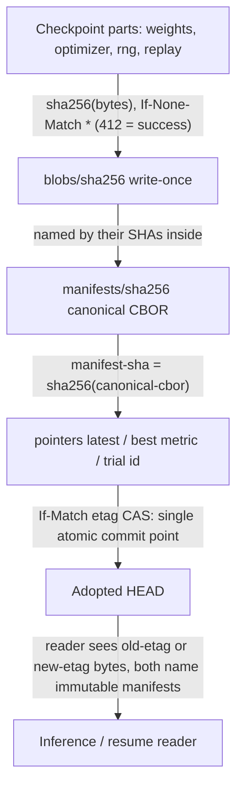
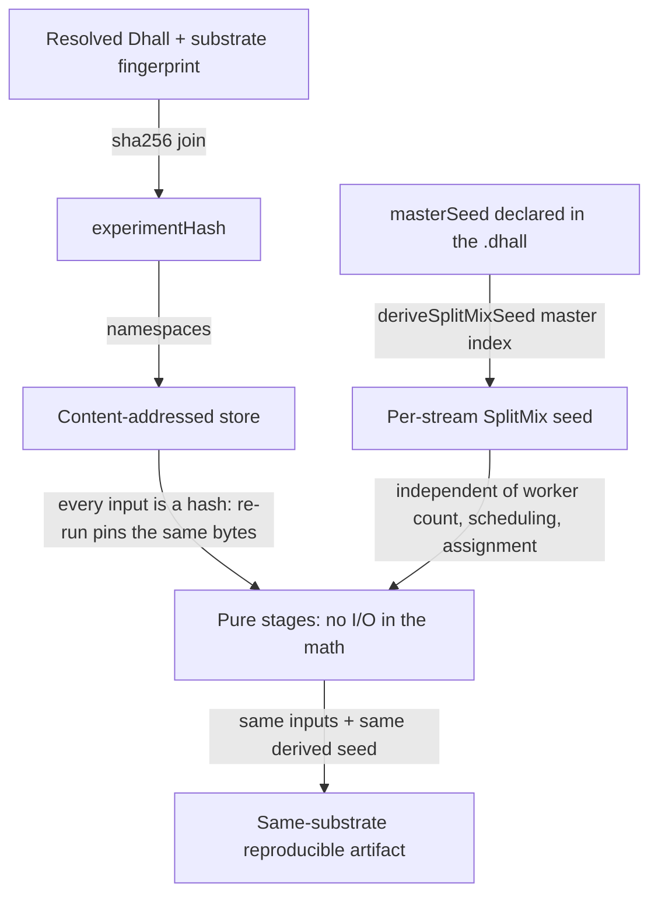

# Content Addressing & Determinism

**Status**: Authoritative source
**Supersedes**: N/A
**Referenced by**: documents/engineering/README.md, documents/engineering/apple_metal_headless_builds.md, documents/engineering/chaos_failover_doctrine.md, documents/engineering/illegal_state_catalog.md, documents/engineering/image_build_doctrine.md, documents/engineering/manifest_generation_doctrine.md, documents/engineering/platform_services_doctrine.md, documents/engineering/pulsar_client_doctrine.md, documents/engineering/readiness_ordering_doctrine.md, documents/engineering/release_lifecycle_doctrine.md, documents/engineering/resource_capacity_doctrine.md, documents/engineering/storage_lifecycle_doctrine.md, documents/engineering/vault_pki_doctrine.md
**Generated sections**: none

> **Purpose**: Define amoebius's cross-project content-addressed store (blobs ← manifests ← pointers), the
> `experimentHash = sha256(resolved-dhall ‖ substrate-fingerprint)` identity, and the seed-derivation
> determinism that makes an ML run reproducible *by construction* — the one mechanism shared by both the
> `infernix` and `jitML` extension libraries — together with the honest ceiling on what types can and cannot
> make deterministic.

---

## 1. The one idea: a name you cannot lie about

The intuition: most data corruption starts with a *name that does not match its bytes* — a pointer to a blob
that was overwritten, an image tag that moved, a "checkpoint v3" that two machines disagree about. amoebius
closes that whole class by refusing to let anyone *assign* a name. The name of an artifact **is** the SHA-256
of its bytes. There is exactly one way to obtain a reference — hash a real artifact — so a reference that
points at the wrong thing, or at nothing, has no inhabitant.

That single move buys three properties that this doctrine is the SSoT for, applied uniformly to **both**
`infernix` (LLM inference) and `jitML` (training + JIT codegen):

1. **A three-tier store** ([§2](#2-the-three-tier-store-blobs--manifests--pointers)) where the only mutable objects are tiny pointers, and everything heavy is
   write-once and self-naming.
2. **A run identity** ([§3](#3-experimenthash-identity-is-what-you-asked-for--where-it-ran)) — `experimentHash` — that folds *what you asked for* and *where it ran* into one
   digest, so two runs share a namespace only when they are genuinely the same experiment on the same
   substrate.
3. **Reproducibility by construction** ([§4](#4-determinism-by-construction-pinned-inputs--pure-stages--derived-seed)) — pinned content-addressed inputs + pure stages + a derived RNG
   seed — where the type system makes the bookkeeping *total*.

It also buys a fourth property that pays off elsewhere: content-addressed data is **confluent**, so it crosses
cluster boundaries without a divergence proof ([§5](#5-confluence-content-addressed-data-crosses-cluster-boundaries-safely)).

**The extension-library set is closed.** `infernix` and `jitML` are the two ML members of the v1
extension-library set, which is **closed** at {`infernix`, `jitML`, `mattandjames`} — three libraries that LINK
into the one amoebius binary at compile/link time, not an open plugin surface. Only the two ML libraries
(`infernix`, `jitML`) instantiate this content-addressing contract; `mattandjames` is a non-ML member. Any
future ML family is **Phase-N design intent**, entering later through the same linked-extension seam (owned by
[`dsl_doctrine.md`](./dsl_doctrine.md)); it is not a v1 member, and nothing in this doctrine is written for one.

**What this doc does not own.** This doctrine owns the shared *mechanism*. It does **not** re-derive the
*totality typing* that makes names un-forgeable — that is technique [§4.5](#45-the-three-tier-ml-asset-lifecycle-engine-baked-model-staged-kernel-jitd) in
[`illegal_state_catalog.md`](./illegal_state_catalog.md). It does **not** own the per-substrate floating-point
contract or the JIT cache key — those are owned by the sibling `jitML` project's
`jitML/documents/engineering/determinism_contract.md`, which this doc references rather than restates. And it
does **not** own where the bytes physically live (retained-PV MinIO) — that is
[`storage_lifecycle_doctrine.md`](./storage_lifecycle_doctrine.md). [§7](#7-what-this-doctrine-deliberately-does-not-own) draws every boundary explicitly.

**Honesty up front.** Everything below is amoebius **design intent**, generalized from two working sibling
libraries (`jitML/src/JitML/Checkpoint/Format.hs`, `jitML/src/JitML/Engines/Rng.hs`, and the `infernix`
artifact store). Evidence inherited from a sibling project is evidence, not an amoebius proof — amoebius has
not yet built this layer. Per [documentation_standards.md §6](../documentation_standards.md#6-honesty-the-proventestedassumed-discipline), no statement
here is a proven amoebius result, and [§6](#6-the-honest-ceiling-types-make-the-bookkeeping-total-not-the-physics-deterministic) is explicit about which claims are *proven-in-types*, which are
*tested* in a sibling, and which are deliberately *not asserted*. Delivery sequencing and gates live only in
[`../../DEVELOPMENT_PLAN/README.md`](../../DEVELOPMENT_PLAN/README.md).

---

## 2. The three-tier store: blobs ← manifests ← pointers

The intuition: split every persisted run into (a) the heavy opaque bytes, (b) a small typed description that
*names* those bytes, and (c) a single movable label that says "this description is current." Make (a) and (b)
immutable and self-naming so they can never be overwritten or torn; let only (c) move, and let it move only by
compare-and-swap. Then the only race in the whole system is a one-object atomic pointer flip.

Concretely, the store lives under one MinIO bucket per project (`jitml-checkpoints`, `infernix-models`) with a
fixed prefix schema. The `jitML` key renderers in `jitML/src/JitML/Checkpoint/Format.hs` (`blobKey`,
`manifestKey`, `latestPointerKey`, `bestPointerKey`, `trialPointerKey`) are the reference implementation:

```
<store>/
  <experiment-hash>/                       -- §3: sha256(resolved-dhall ‖ substrate-fingerprint)
    blobs/<sha256>                         -- write-once, content-addressed, opaque bytes
    manifests/<sha256>                     -- write-once, content-addressed, canonical-CBOR manifest
    pointers/
      latest                               -- mutable, ETag-CAS; body = the 32-byte manifest sha
      best/<metric>                        -- mutable, ETag-CAS; body = the 32-byte manifest sha
      trial/<trial-id>/latest              -- per-trial latest pointer (HPO sweeps)
      trial/<trial-id>/best/<metric>       -- per-trial best pointer
```

**Pointers are namespaced per app (per-app isolation).** The store is one MinIO bucket *per project*, but within
a project the serveable-model pointer namespace **this round introduces** is keyed **per app** — an app resolves
and serves **only** the models it produced or imported, never another app's. The immutable blob/manifest layer
stays content-addressed and dedup-able within the bucket; only the *mutable pointer* — the object that says "this
app may serve this" — is app-scoped. Two consequences fall out and are owned elsewhere: there is **no** cross-app
training-DAG `parent` edge (a `Continue` chain, [§4.6](#46-the-training-run-topology-fine-tune-chains-and-continuous-feeds-without-an-unbounded-arm), stays within one app's namespace), and "app B serving or
continuing app A's model without an explicit grant" is a **decode-foreclosed** illegal state
([`illegal_state_catalog.md`](./illegal_state_catalog.md)). The upstream-pull credential a stage-by-name import
resolves is likewise scoped per app ([`vault_pki_doctrine.md`](./vault_pki_doctrine.md)).

### 2.1 Three object classes, two write protocols

- **`blobs/<sha256>` — write-once content-addressed payloads.** The key *is* `sha256(bytes)`. One logical
  checkpoint produces one blob per part: weights, optimizer state, RNG state, and (for RL) replay buffer and
  exploration cache. PUTs use `If-None-Match: *` and treat `412 Precondition Failed` as **success** — the
  bytes already exist by definition, so the write was a no-op. Part-level addressing makes unchanged state
  deduplicate automatically across consecutive checkpoints.
- **`manifests/<sha256>` — write-once content-addressed CBOR.** A manifest names the blob SHAs that constitute
  one logical checkpoint plus the metadata needed to interpret them (architecture, preprocessing, output
  decoders, weight layout, step, metrics, parent manifest). Its key is `sha256(canonical-cbor(manifest))`. The
  encoder is **canonical** — `encodeManifestCbor` sorts tensors by name, optimizer blobs by kind, RNG blobs by
  stream id, metrics by name, and so on — so two writers with equal *logical* content emit byte-identical CBOR
  and therefore the same key. Same `If-None-Match: *` protocol. The manifest SHA is the canonical *checkpoint
  id* used in Pulsar events and `--resume <checkpoint-id>`. Those Pulsar events are themselves **CBOR
  payloads** — the message-body encoding is owned by [pulsar_client_doctrine.md §3.1](./pulsar_client_doctrine.md#31-payloads-are-exclusively-cbor);
  a payload carries this manifest SHA (a content-address reference), never the raw blob inline. So *this doc*
  owns the blob/manifest bytes (blobs raw, manifests canonical CBOR); the *Pulsar payload envelope* that
  references them is CBOR owned there — one format, two owners of two layers.
- **`pointers/*` — the only mutable objects.** Each pointer body is a 32-byte manifest SHA. Updates use S3
  conditional PUT with `If-Match: <etag>` — textbook compare-and-swap. The `pointers/latest` update is the
  **single atomic commit point** of a checkpoint: blob writes may happen in any order and may even orphan bytes
  on failure, but a manifest becomes HEAD only when its pointer CAS succeeds. The pure CAS decision is
  `applyPointerWrite` (`PointerWritten` vs `PointerConflict`); the `jitML` checkpoint format owns the retry
  harness and the typed `AdvancePredicate` that resolves a lost CAS.

**Two manifest metadata fields this round adds — both content-addressed, so both replicate.** Because the
manifest is content-addressed, any datum recorded *in* it travels with the bytes under [§5](#5-confluence-content-addressed-data-crosses-cluster-boundaries-safely) confluence. This round
introduces two such fields, so the serve gate and the serve-landing relation are satisfiable in a cluster that
merely *received* the artifact: (i) the **provenance witness** — the committed-checkpoint pointer or the
pinned import that makes a `ModelArtifact` serveable ([§4.5](#45-the-three-tier-ml-asset-lifecycle-engine-baked-model-staged-kernel-jitd)); making it a manifest field (not a side table) is what lets
the serve gate cross a cluster boundary alongside the weight bytes ([§5](#5-confluence-content-addressed-data-crosses-cluster-boundaries-safely)/[§4.6](#46-the-training-run-topology-fine-tune-chains-and-continuous-feeds-without-an-unbounded-arm)) — the doctrine adds this as the
J∘H composition fix. (ii) the **engine-family tag** — the `EngineRuntime` family the weights target
([§3.1](#31-producing-substrate-vs-serving-substrate-a-distinct-serving-run-fingerprint)/[§4.5](#45-the-three-tier-ml-asset-lifecycle-engine-baked-model-staged-kernel-jitd)), which the cross-substrate serve-landing predicate keys on. Confirm alongside these that the
manifest's existing `parent` field is a **namespace-independent manifest SHA** (`sha256(canonical-cbor)`, above)
— it names a checkpoint by content, not by an `experimentHash`-scoped path, so a `parent` / adopted checkpoint
resolves **cross-bucket and cross-substrate-namespace** ([§4.5](#45-the-three-tier-ml-asset-lifecycle-engine-baked-model-staged-kernel-jitd), [§4.6](#46-the-training-run-topology-fine-tune-chains-and-continuous-feeds-without-an-unbounded-arm)).



### 2.2 Why this shape removes the races

Because blob and manifest keys are derived from `sha256(payload)`, a **write/write** hazard on them is
impossible by construction: two writers with the same logical payload write the *same key* with the *same
bytes*, and `412` is success. A **write/read** hazard is impossible because an S3 object PUT is atomic at the
object level. The only remaining hazard is **write/write on a pointer**, resolved by `If-Match` CAS — the loser
gets `412`, re-reads, and reapplies the typed advance predicate. A pointer **reader** always sees either the
old ETag's bytes or the new ETag's bytes, both of which name valid immutable manifests; there is no torn state
because the only mutation is a single atomic PUT of a 32-byte body.

This protocol's per-project specifics — the `.jmw1` dense-weight wire format, the full `CheckpointManifest`
CBOR shape, the retention/GC reconciler, and the inference-only read path — are owned by the sibling
`jitML/documents/engineering/checkpoint_format.md`. The bytes themselves live on a `no-provisioner` retained PV
backing MinIO, owned by [`storage_lifecycle_doctrine.md`](./storage_lifecycle_doctrine.md); MinIO as an
HA-always standard service is owned by [`platform_services_doctrine.md`](./platform_services_doctrine.md). This
doc owns only the three-tier shape and the two write protocols.

### 2.3 The hash/pointer master table: four hash classes, three pointer kinds

The store above uses two members of a wider family of identities. This subsection is the **authoritative
registry** — the SSoT — for every content-address hash class and every mutable pointer kind amoebius uses;
other doctrines reference this table rather than restating it. Two rules unify the whole family: **a hash class
is a namespace that is never shared** (two different kinds of thing never collide because their formulas
differ), and **a pointer is the only mutable object, advanced only by ETag-CAS, namespaced by kind.**

**Hash classes** — immutable, self-naming, distinct namespaces, never shared:

| class | formula / source | identifies | status |
|-------|------------------|-----------|--------|
| `experimentHash` | `sha256(resolved-dhall ‖ substrate-fingerprint)` | an ML run / artifact ([§3](#3-experimenthash-identity-is-what-you-asked-for--where-it-ran)) | existing (sibling `jitML`/`infernix`) |
| `kernelKey` | `sha256(kernel-source ‖ substrate-fingerprint)` | a Tier-3 JIT kernel ([§4.5](#45-the-three-tier-ml-asset-lifecycle-engine-baked-model-staged-kernel-jitd)) | Phase-N design intent (Q8) |
| `releaseHash` | `sha256(resolved-deployment-dhall ‖ image-digests ‖ substrate-fingerprint)` | a deployment generation | Phase-N design intent (Q13) |
| OCI image digest | registry-owned (not amoebius-computed) | a container image | existing ([`image_build_doctrine.md` §5](./image_build_doctrine.md#5-versioning-vs-latest--development_plan-decision-recommended-default-immutable-never-latest)) |

**Pointer kinds** — mutable, ETag-CAS only, namespaced by kind:

| kind | points at | owner |
|------|-----------|-------|
| `trial` (`latest` / `best/<metric>`) | a manifest SHA | this doc, [§2](#2-the-three-tier-store-blobs--manifests--pointers) |
| `model` | a provenance-witnessed `ModelArtifact` manifest; `.ready` **and** a committed provenance witness are the commit | [§4.5](#45-the-three-tier-ml-asset-lifecycle-engine-baked-model-staged-kernel-jitd) (Q8) |
| `environment` (`dev` / `staging` / `prod`) | a `Release` (keyed by `releaseHash`) | [`release_lifecycle_doctrine.md` §3](./release_lifecycle_doctrine.md#3-environment-and-the-etag-cas-promotion-pointer) |

Ownership and honesty for the registry:

- `experimentHash` ([§3](#3-experimenthash-identity-is-what-you-asked-for--where-it-ran)) and the `trial` pointer ([§2](#2-the-three-tier-store-blobs--manifests--pointers)) are the **existing** pair — the only members with a working
  sibling implementation. Everything else here is amoebius **design intent**, not a built result.
- `kernelKey` folds *kernel source* and the substrate fingerprint the same way `experimentHash` folds the
  resolved `.dhall`; the finer JIT cache-key composition is owned by the sibling
  `jitML/documents/engineering/determinism_contract.md`. `kernelKey` is consumed by Tier 3 in [§4.5](#45-the-three-tier-ml-asset-lifecycle-engine-baked-model-staged-kernel-jitd).
- `releaseHash` and the `environment` pointer are **defined here** (this table is their canonical registry), but
  their *lifecycle* — the immutable release ledger, the promotion CAS, the `PromotionGate` — is owned by
  [`release_lifecycle_doctrine.md` §2/§3](./release_lifecycle_doctrine.md#2-release-and-the-immutable-release-ledger-releasehash). "Promote to prod" is an
  `environment`-pointer CAS onto a `Release`, exactly the ETag-CAS discipline of a `trial` pointer flip ([§2.2](#22-why-this-shape-removes-the-races)).
- The **OCI image digest** is registry-owned, not computed by amoebius; it appears here only so `releaseHash`
  can pin it. Its format and build path are owned by [`image_build_doctrine.md`](./image_build_doctrine.md).

---

## 3. `experimentHash`: identity is *what you asked for* ‖ *where it ran*

The intuition: a run's identity must change whenever anything that could change its output bytes changes —
otherwise two genuinely different runs would collide in the same namespace and one would silently shadow the
other. amoebius derives that identity from two pinned inputs and nothing else:

```haskell
-- jitML/src/JitML/Checkpoint/Format.hs
deriveExperimentHash :: Text -> Text -> Text
deriveExperimentHash resolvedDhall substrateFingerprint =
  hexBytes . SHA256.hash $ encodeUtf8 (resolvedDhall <> "||" <> substrateFingerprint)
```

so that

```
experimentHash = sha256(resolved-dhall ‖ substrate-fingerprint)
```

- **`resolved-dhall`** is the fully-evaluated experiment program — the normal form of the `.dhall` value after
  all imports and functions are applied. It carries the model architecture, the master seed, the metric set
  *and each metric's direction*, the optimizer, and — as of this round's training-run topology
  ([§4.6](#46-the-training-run-topology-fine-tune-chains-and-continuous-feeds-without-an-unbounded-arm)) — the **`TrainInit`**, **`TrainData`**, and **`TrainBudget`** unions, replacing the earlier flat
  "dataset split, and the budget" pair. Concretely `TrainData` contributes a fixed dataset content-address **or**
  a materialized feed-prefix content-address; `TrainBudget` a bounded **or** continuous budget; and, for a
  fine-tune / warm-start chain, `TrainInit`'s `Continue` contributes the **base model's content-address**. Folding
  the base-model and consumed-prefix content-addresses **into `resolved-dhall`** is what keeps `experimentHash` a
  **2-input** digest (`sha256(resolved-dhall ‖ substrate-fingerprint)`) rather than a wider tuple ([§4.6](#46-the-training-run-topology-fine-tune-chains-and-continuous-feeds-without-an-unbounded-arm)). Two
  consequences fall out of this being part of the identity: flipping a metric's `direction` (maximise ↔ minimise)
  defines a **different experiment**, and any application-logic change to the model defines a different experiment.
  The DSL surface that produces this normal form is owned by [`dsl_doctrine.md`](./dsl_doctrine.md); this doc only
  consumes it.
- **`substrate-fingerprint`** is the identity of *where the math runs* — `apple-silicon` / `linux-cpu` /
  `linux-cuda` plus the toolchain witnesses that fix float semantics (the GHC 9.12.4 baseline, the
  kernel-compiler/runtime versions, ISA, ABI). It is gathered by full-path subprocess probes, never from
  environment variables or `PATH`, per the no-env/no-PATH contract owned by
  [`substrate_doctrine.md`](./substrate_doctrine.md). The *composition* of this fingerprint (and the related,
  finer-grained JIT cache key) is owned by `jitML/documents/engineering/determinism_contract.md`; this doc
  treats it as an opaque pinned string.

**Why fold the substrate into identity at all?** Because cross-substrate bit-equality is *not* guaranteed ([§6](#6-the-honest-ceiling-types-make-the-bookkeeping-total-not-the-physics-deterministic)).
The same program on a different accelerator produces different bytes, so it must occupy a different namespace —
otherwise an `apple-silicon` checkpoint and a `linux-cuda` checkpoint would fight over the same `latest`
pointer and the `best/<metric>` comparison would be comparing apples to ULP-shifted apples. Making the
substrate part of the *name* turns "ran on a different accelerator" into "different experiment," which is
exactly true.

This is where the two DSL surfaces meet without colliding: the **application-logic** surface determines
`resolved-dhall`'s model and config, the **deployment-rules** surface chooses the substrate, and the
substrate-fingerprint folds the latter into the identity — the split itself is owned by
[`app_vs_deployment_doctrine.md`](./app_vs_deployment_doctrine.md). `experimentHash` gives **identity**, not a
guarantee that two runs sharing it produce equal bits; that stronger claim is [§4](#4-determinism-by-construction-pinned-inputs--pure-stages--derived-seed) (when it holds) and [§6](#6-the-honest-ceiling-types-make-the-bookkeeping-total-not-the-physics-deterministic) (where
it stops).

### 3.1 Producing substrate vs serving substrate: a distinct serving-run fingerprint

`experimentHash` above folds the substrate **monolithically** — "where it ran," one fingerprint. That is exactly
right for a *training* run, but it conflates two roles an ML artifact actually has, and **this round introduces**
the split (it is not a distinction the existing digest already draws):

- **Producing substrate** — the accelerator whose reduction order made the weight bytes. It is folded into the
  checkpoint's `experimentHash` namespace ([§3](#3-experimenthash-identity-is-what-you-asked-for--where-it-ran)) exactly as above. It is **provenance, not a serving constraint**.
- **Serving substrate** — the accelerator an *inference* run uses. Because `experimentHash` names *where it
  ran*, this round introduces a **distinct serving-run fingerprint** for the serving pod; the Tier-3
  `kernelKey` ([§2.3](#23-the-hashpointer-master-table-four-hash-classes-three-pointer-kinds), design intent) folds that serving substrate per serving pod. This is **design intent**, not an
  existing `experimentHash` field.

**The serving substrate need not equal the producing substrate.** A `ModelArtifact`'s weight bytes are
**substrate-portable (movable, content-addressed), not substrate-identical** — [§6](#6-the-honest-ceiling-types-make-the-bookkeeping-total-not-the-physics-deterministic) is explicit that "the same
program on a different accelerator produces different bytes," so the bytes move but are not guaranteed bit-equal
or even loadable on a different lane. Cross-substrate serving is made representable by **new work this round
adds**, never by a check that already existed:

1. An **engine-`family` tag** on `ModelArtifact` / manifest ([§4.5](#45-the-three-tier-ml-asset-lifecycle-engine-baked-model-staged-kernel-jitd) / [§2.1](#21-three-object-classes-two-write-protocols)) — the model side carries no family
   field today.
2. A **redefined landing predicate** owned by
   [`service_capability_doctrine.md` §4.1](./service_capability_doctrine.md#41-the-inferenceengine-capability--the-engine-is-baked-and-substrate-selected-never-fetched):
   "the model's engine **family** is available on the **serving** substrate lane," decoupled from the producing
   lane. Family×lane availability is a **partial** relation (e.g. vLLM is not baked on Apple-Metal), so an
   unavailable-family-on-lane is an honest **decode-foreclosed** rejection.

**Layer.** Producing-substrate provenance + the [§4.5](#45-the-three-tier-ml-asset-lifecycle-engine-baked-model-staged-kernel-jitd) witnessed constructor is **type-foreclosed**; the engine-family ↔
serving-substrate serve relation is **decode-foreclosed** (a checked rejection of a constructible value, [`illegal_state_catalog.md` §4.7](./illegal_state_catalog.md#47-compatibility--topology-relations-by-construction-over-a-collection)).
Two **runtime-checked residues** are named, not foreclosed, and ledgered in [§6.1](#61-proven--tested--assumed-spelled-out): (i) **no cross-substrate bit-equality** back to the training
substrate ([§6](#6-the-honest-ceiling-types-make-the-bookkeeping-total-not-the-physics-deterministic) ceiling, unchanged); (ii) a **weight-layout load residue** — a family-matched but
substrate-specific-**weight-layout** model (the manifest carries "weight layout," [§2.1](#21-three-object-classes-two-write-protocols)) passes the decode-foreclosed
relation and may still fail to **load** at runtime. Tier-3 kernel recompilation does **not** close this:
`kernelKey` folds the compute *kernel*, not the weight bytes.

---

## 4. Determinism by construction: pinned inputs + pure stages + derived seed

The intuition: reproducibility is not a debugging aid you bolt on; it is what you get *for free at the input
boundary* when every input is pinned, every stage is declared a pure function of its declared inputs, and the
only randomness is derived from a declared seed. amoebius builds this from three legs the type system makes
**total** — content-addressed input pinning, the `experimentHash` identity, and SplitMix seed derivation.
That closes the *inputs*; it does **not**, by itself, make the producing *computation* deterministic — a GPU
kernel, an async replay buffer, or a cross-substrate float reduction can still diverge. That residue is a
separate, **tested/assumed** contract, scoped honestly in the determinism-ceiling section below; do not read
"by construction" as covering the compute.



### 4.1 Leg one — pinned content-addressed inputs

Every input a stage reads is named by its hash ([§2](#2-the-three-tier-store-blobs--manifests--pointers)): the dataset blob, the parent checkpoint manifest, the
prior weights. Re-running an experiment re-pins the *same* bytes, because a content address cannot refer to
anything else. There is no "latest version of the dataset" that could drift underfoot — there is only a SHA,
and a SHA is forever.

### 4.2 Leg two — pure stages

The math (parameter init, minibatch ordering, the optimizer update, the forward/backward pass, MCTS expansion)
is expressed as pure functions over those pinned inputs. I/O lives at the interpreter boundary, not inside the
numerics — the purity boundary itself is owned by [`dsl_doctrine.md`](./dsl_doctrine.md) and the project FP
guides. A pure stage with pinned inputs and a fixed seed has exactly one result.

### 4.3 Leg three — the derived seed, independent of worker count

This is the leg that survives distribution. A master seed is declared in the experiment `.dhall`; every stream
(per-experiment, per-game in RL self-play, per-HPO-trial, the MCTS root-noise stream) gets its own seed
*derived deterministically* from `(masterSeed, streamIndex)` — never from wall-clock, never from a worker id,
never from `/dev/urandom`:

```haskell
-- jitML/src/JitML/Engines/Rng.hs
deriveSplitMixSeed :: SplitMixSeed -> Word64 -> SplitMixSeed
deriveSplitMixSeed (SplitMixSeed masterSeed) streamIndex =
  SplitMixSeed . fst . splitMixNext $ SplitMixSeed (masterSeed + streamIndex * splitMixGamma)
```

with the SplitMix64 mixing function and golden-ratio gamma (`0x9E3779B97F4A7C15`). The decisive property:
**a stream's seed is a pure function of `(masterSeed, streamIndex)` alone.** It does not depend on how many
workers are running, on the order the scheduler dispatched them, or on which worker happened to draw which
stream. Run the same experiment on 1 worker or 100, in any dispatch order, and game 37 is seeded identically
every time. The same derivation seeds HPO trial selection and the AlphaZero MCTS root noise. The per-substrate
RNG split details (which substrate holds the stream — host daemon vs clustered pod) are owned by
`jitML/documents/engineering/determinism_contract.md`.

### 4.4 What "the types make these total" cashes out to

The rallying phrase is concrete: there is **no inhabitant** of the type "a stream with no seed" or "a seed read
from ambient entropy." A stream's seed is reachable only through `deriveSplitMixSeed`, whose arguments are a
typed `SplitMixSeed` and a `Word64` index — both pinned. An artifact's name is reachable only by hashing real
bytes (`deriveExperimentHash`, `blobKey`, `manifestContentSha`); there is no constructor that takes a free
string. So "use whatever entropy the worker had" and "point at a checkpoint that was never written" are not
states you can *fix at runtime* — they are states you cannot *write down*. This is the totality technique [§4.5](#45-the-three-tier-ml-asset-lifecycle-engine-baked-model-staged-kernel-jitd)
in [`illegal_state_catalog.md`](./illegal_state_catalog.md), applied to seeds and store keys; this doc owns the
content-addressing/determinism *use* of it, the catalog owns the typing discipline.

### 4.5 The three-tier ML-asset lifecycle: engine baked, model staged, kernel JIT'd

The three legs above pin the *training/inference math*; this subsection pins the **asset axis** that feeds it —
the three kinds of heavy thing a model-serving pod needs (a runtime engine, model weights, a compiled kernel),
each with a *different* lifecycle and a *different* place in the store. The single design rule: **no asset is
ever fetched or built at pod startup by authoring a URL** — each tier is either baked, eagerly staged before it
is serveable, or lazily JIT'd behind a content-address, and each is reachable only through a total constructor.

Two types carry the axis:

- **`EngineRuntime`** — a **closed** union of substrate-tagged, **baked** engine identities (the Apple-Metal
  bridge, the CUDA runtime, the linux-cpu runtime, plus per-family adapters — llama.cpp / whisper.cpp / ONNX /
  vLLM / pytorch / diffusers / transformers / Audiveris — enumerated as a closed provider union). It has **no
  `Url`/`Download`/`Fetch` arm**: the `.dhall` *selects* an engine by substrate, it can never *author* a
  download. An engine fetched or built at pod startup is therefore **type-foreclosed unrepresentable**
  ([`illegal_state_catalog.md` §3.25](./illegal_state_catalog.md#325-an-ml-asset-fetched-or-built-at-pod-startup-or-an-unready--unlanded-model)).
- **`ModelArtifact`** — a by-name / content-address reference into the store of [§2](#2-the-three-tier-store-blobs--manifests--pointers). An `ArtifactRef` is
  obtainable **only** once the `.ready` sentinel exists: a half-staged model has no serveable reference
  (**type-foreclosed**, the existing `.ready`-gate discipline generalized — no constructor without the sentinel).

**The serve gate is provenance, not just staging completeness (this round).** The `.ready` sentinel proves
**staging completeness (bytes written)** — it does **not** prove *training provenance*. This round makes a
serveable `ModelArtifact`'s constructor additionally require a **provenance witness**, one of exactly two arms
(this is the single-owner constructor; [`service_capability_doctrine.md` §4.1](./service_capability_doctrine.md#41-the-inferenceengine-capability--the-engine-is-baked-and-substrate-selected-never-fetched) and [`dsl_doctrine.md`](./dsl_doctrine.md) **reference** it, never restate the precondition):

- **(a) a committed producing checkpoint** — a committed `latest` / `best` pointer (the single atomic pointer CAS,
  [§2](#2-the-three-tier-store-blobs--manifests--pointers)) that **always names a complete checkpoint** — never "a finished *run*," so it composes with [§4.6](#46-the-training-run-topology-fine-tune-chains-and-continuous-feeds-without-an-unbounded-arm)'s
  serving of a still-running Continuous job. Because jitML checkpoints live under `jitml-checkpoints/` and infernix
  models under `infernix-models/` ([§2](#2-the-three-tier-store-blobs--manifests--pointers)) with no producer→consumer edge today, arm (a) adopts the jitML
  checkpoint's **manifest SHA directly** (`sha256(canonical-cbor)`, **namespace-independent**, [§2.1](#21-three-object-classes-two-write-protocols)) — so it
  resolves **cross-bucket and cross-substrate-namespace**, not a within-namespace pointer.
- **(b) a pinned, content-addressed external import** carrying provenance — see the rewritten Tier 2 below. Naming
  a model in `infernix.dhall` **is** this arm; there is no bare stage-by-name-without-provenance constructor.

The witness is recorded as a **content-addressed manifest field** ([§2.1](#21-three-object-classes-two-write-protocols)) so it replicates with the bytes under
[§5](#5-confluence-content-addressed-data-crosses-cluster-boundaries-safely) confluence. "Producing run" is a **misnomer for arm (b)** (external / third-party); name the gate a
**provenance witness (committed checkpoint OR pinned import)** and reserve "producing run" for arm (a).

**Layer.** Foreclosing the **unwitnessed direct-stage path** and the **checkpoint arm (a)** is honestly
**type-foreclosed** — a committed pointer is a genuine no-inhabitant-without-a-complete-checkpoint constructor.
**Provenance-witness *presence* on arm (b)** is type-foreclosed; its **byte truthfulness** is not — arm (b) admits
arbitrary bytes (including noise) by design. Fork A tightens this: the import constructor **requires a pinned
expected content-address (or detached signature)**, and staging **verifies pulled bytes against the pin and fails
closed before `.ready`** — so pin *presence* = type-foreclosed, pin *match* = decode-foreclosed (stage-time checked,
fail-closed), and "the pin names the *intended* model" = runtime-checked / assumed (ledgered in [§6.1](#61-proven--tested--assumed-spelled-out)).

**The engine↔model relation.** A `ModelArtifact` must be servable by an `EngineRuntime` that is available on the
deployment's substrate — an unmatched model has no landing engine. This is a **decode-foreclosed** total relation
(technique [`illegal_state_catalog.md` §4.7](./illegal_state_catalog.md#47-compatibility--topology-relations-by-construction-over-a-collection)); the substrate `InferenceEngine`
capability a model must match is owned by [`service_capability_doctrine.md` §4](./service_capability_doctrine.md#4-capability--provider--shape-the-binding). **Cross-substrate serving is
representable** ([§3.1](#31-producing-substrate-vs-serving-substrate-a-distinct-serving-run-fingerprint)): the `ModelArtifact` / manifest carries an **engine-`family` tag** ([§2.1](#21-three-object-classes-two-write-protocols)), and the landing
predicate keys on that family being available on the **serving** substrate lane — so a CUDA-produced model may
serve on Apple-Metal when the family is baked there, subject to the [§3.1](#31-producing-substrate-vs-serving-substrate-a-distinct-serving-run-fingerprint) runtime-checked weight-layout load residue.

The three tiers, three lifecycles:

- **Tier 1 — `EngineRuntime` = BAKED.** The engine ships *inside* the base image via the MinIO/Vault/
  distribution asset-map, so — because `infernix` and `jitML` LINK as libraries rather than run as fetched
  sidecars — the engine exists the moment the pod does. The `.dhall` only selects by substrate; it can never
  author a download. Baked engines are owned by [`image_build_doctrine.md`](./image_build_doctrine.md); this
  replaces `infernix`'s per-engine Poetry-venv + curl-tar-at-image-build.
- **Tier 2 — `ModelArtifact` = eager STAGE-THEN-SERVE, and *staging by name IS a provenance-carrying import*.**
  The parent-minted nested `infernix.dhall` names the model *set*; the elected in-cluster singleton stages each
  model, and the `.ready` sentinel is written **last** so the `model` pointer ([§2.3](#23-the-hashpointer-master-table-four-hash-classes-three-pointer-kinds)) commits only a complete
  artifact. This round **closes the unwitnessed hole** the bare stage-by-name path left open: **naming a model in
  `infernix.dhall` is an explicit content-addressed import (arm b above)** that carries a **pinned expected
  content-address (or detached signature)**; staging **verifies the pulled bytes against the pin and fails closed
  before `.ready`** (Fork A) — there is no constructor that stages bytes without a pin. Staging **re-keys** the
  model off `infernix`'s name-addressed `infernix-models/<modelId>/…` layout onto the content-addressed
  **blob ← manifest ← pointer** store of [§2](#2-the-three-tier-store-blobs--manifests--pointers) — the same three-tier shape training already uses.
  **Staging credentials — object-store and upstream — resolve from Vault BY NAME** (a `SecretRef`, never a value
  in `.dhall`, scoped **per app** per [§2](#2-the-three-tier-store-blobs--manifests--pointers)); this **kills** `infernix`'s second k8s-Secret store and its
  hardcoded `minioadmin/minioadmin123` fallback. Vault custody is the one amoebius secret contract, not a
  per-project store.
- **Tier 3 — Kernel = LAZY content-addressed JIT.** A compiled kernel is materialized on the *first cache miss*
  (the sibling `jitML` `ensureKernelArtifact`: cache HIT returns a handle, MISS compiles then stores), keyed by
  `kernelKey` ([§2.3](#23-the-hashpointer-master-table-four-hash-classes-three-pointer-kinds)). It is **not** a startup build — a cold pod serves as soon as its baked engine and staged
  model are ready, and pays JIT cost only on first use of a given kernel.

**Inference determinism still holds.** With the engine baked, the model pinned by content-address, and decoding
pure, `infernix` inference is deterministic by the same recipe as [§4.1](#41-leg-one--pinned-content-addressed-inputs)–[§4.4](#44-what-the-types-make-these-total-cashes-out-to): greedy decoding, or seeded sampling
with the seed carried *in the request* rather than drawn from ambient entropy. The honest ceiling in [§6](#6-the-honest-ceiling-types-make-the-bookkeeping-total-not-the-physics-deterministic) applies
unchanged — same-substrate reproducibility is the contract, cross-substrate bit-equality is not asserted. The
cross-project artifact + `.ready` readiness contract is owned by `infernix`'s
`infernix/documents/architecture/pulsar_ml_workflow.md`; this doc owns the content-addressing, re-keying, and
seed-derivation contract those tiers instantiate.

**Sibling evidence, not an amoebius result.** `infernix`'s `Runtime/Worker.hs` already *selects* the engine by
`adapterType` (never fetches it), its `docker/Dockerfile` curl-tars native payloads and installs venvs at
**image build**, `Runtime/Daemon.hs` runs `sweepEagerModelCache`, and `model_bootstrap.py` writes `.ready`
last — while `model_cache.py`'s `minioadmin` fallback is exactly the Vault violation this tier removes.
`jitML`'s `Engines/Loader.hs` is the lazy per-kernel JIT (HIT→handle, MISS→compile). These are working sibling
behaviors this doctrine *generalizes*; amoebius has built none of the three-tier asset lifecycle itself. The
illegal states it closes are catalogued at [`illegal_state_catalog.md` §3.25](./illegal_state_catalog.md#325-an-ml-asset-fetched-or-built-at-pod-startup-or-an-unready--unlanded-model).

### 4.6 The training-run topology: fine-tune chains and continuous feeds without an unbounded arm

The training surface today models only a fixed dataset split + a finite budget with implicit from-scratch init
([§3](#3-experimenthash-identity-is-what-you-asked-for--where-it-ran)). This round **introduces** two new capabilities — fine-tune-from-an-arbitrary-model and
train-forever-from-a-feed — unified by one idea: **online training is an unbounded fine-tune chain over successive
topic prefixes.** They are carried by three **closed** unions, **owned here** (matching the `EngineRuntime` /
`ModelArtifact` precedent, [`dsl_doctrine.md`](./dsl_doctrine.md) **carries the field only**, deferring
unrepresentability to this doc + [`illegal_state_catalog.md`](./illegal_state_catalog.md)):

- **`TrainInit = FromScratch Seed | Continue ModelArtifactRef`** — `Continue` takes any **provenance-witnessed**
  `ModelArtifact` ([§4.5](#45-the-three-tier-ml-asset-lifecycle-engine-baked-model-staged-kernel-jitd)): a prior committed checkpoint **or** a pinned import. Fine-tuning / warm-starting
  compose recursively with the [§4.5](#45-the-three-tier-ml-asset-lifecycle-engine-baked-model-staged-kernel-jitd) witness. Per the per-app isolation of [§2](#2-the-three-tier-store-blobs--manifests--pointers), a `Continue` chain's `parent`
  edge stays **within one app's namespace** — no cross-app DAG edge.
- **`TrainData = Dataset ContentAddressedRef | Feed { topic : PulsarTopicRef, from : Cursor }`** — `Feed` consumes
  a topic from a cursor. The consumed prefix `[from, to)` is **materialized at consume time into an immutable
  dataset blob** keyed by the SHA(s) of the message **bodies** (bodies are already CBOR content-addressed, [§2.1](#21-three-object-classes-two-write-protocols)),
  and **that blob content-address is the pinned input**. The cursor is an un-hashed convenience locator only — a
  Pulsar cursor (`<ledgerId>:<entryId>:…`) is broker-assigned metadata, **never an input to any content hash**
  ([§5](#5-confluence-content-addressed-data-crosses-cluster-boundaries-safely)). Materializing the prefix makes the input genuinely immutable ("a SHA is forever," [§4.1](#41-leg-one--pinned-content-addressed-inputs)) and decouples
  reproducibility from topic retention. A multi-partition feed has no total consume order, so `Feed` carries a
  **typed single-partition-or-explicit-merge-function witness** — a non-deterministically-ordered feed has **no
  constructor**.
- **`TrainBudget = Bounded { steps | epochs } | Continuous { checkpointCadence }`** — `Continuous` commits a
  **checkpoint** every cadence; each is a committed pointer ([§4.5](#45-the-three-tier-ml-asset-lifecycle-engine-baked-model-staged-kernel-jitd) arm a) and thus **serveable** — serve-from-any-
  committed-checkpoint of a still-running job (composes with [§4.5](#45-the-three-tier-ml-asset-lifecycle-engine-baked-model-staged-kernel-jitd) "committed checkpoint," **not** "finished run").

**No bare-unbounded arm (mirrors `Growable`).** `Continuous` **requires** a `checkpointCadence`; `Feed` **requires**
a bounded-retention `StorageBudget`. "Train forever with no checkpoints and no retention" has **no constructor** —
**type-foreclosed union shape**, exactly the `Growable` / `ScalingPolicy` idiom. Paired with the honest **runtime-checked
residue**: that the trainer *actually* checkpoints at cadence and retention *actually* holds is runtime, not typed.

**Determinism = a content-addressed training DAG (qualified).** Each checkpoint records its `parent` (base)
content-address and its consumed-prefix content-address; **`experimentHash` keeps its 2-input formula** — the base
and prefix addresses are folded **into `resolved-dhall`** ([§3](#3-experimenthash-identity-is-what-you-asked-for--where-it-ran)), **not** into a wider hash tuple (which would break
the "existing (sibling)" framing of [§2.3](#23-the-hashpointer-master-table-four-hash-classes-three-pointer-kinds)). Classify the headline honestly: DAG **identity / bookkeeping**
(parent + prefix pinned) is **type-foreclosed**; **actual byte-replay** is **decode-foreclosed / tested** per [§6](#6-the-honest-ceiling-types-make-the-bookkeeping-total-not-the-physics-deterministic) (SL / on-policy /
AlphaZero-per-game tested-in-sibling; off-policy RL only the prefix); **cross-substrate is not asserted** (a
cross-substrate `Continue` is a **new** run in a **new** `experimentHash` namespace with no reproducibility
relation back to the base's substrate — the base is a pinned immutable input, not an anchor).

**The continuous trainer reuses existing machinery (Fork C — no new election).** It is **not** a new elected
worker kind and does **not** fold through the control-plane singleton; it is the existing
jitML / infernix training-coordinator worker ([`daemon_topology_doctrine.md` §4](./daemon_topology_doctrine.md#4-worker-daemons--n-unelected)) parameterized with a `Feed` data
source. Single-writer is **delegated, not re-proved**: liveness (at most one active trainer per feed) is a Pulsar
**Exclusive/Failover subscription** on the feed topic; safety (race-free `latest`) is the content-store
**ETag-CAS single atomic commit point** + the typed **`AdvancePredicate`** ([§2](#2-the-three-tier-store-blobs--manifests--pointers), [§5](#5-confluence-content-addressed-data-crosses-cluster-boundaries-safely)) — a monotone / idempotent join, so
even a bounded failover-overlap of two trainers cannot regress HEAD. Each committed checkpoint advances `latest`
by CAS. Cross-cluster there is **no** second trainer on the same feed: a Continuous Feed trainer is
**single-cluster** (the intra-cluster First-Axis single-writer coordinator); cross-cluster is **serve-by-
replication** ([§5](#5-confluence-content-addressed-data-crosses-cluster-boundaries-safely)), never a second authoritative trainer.

**Type coherence to confirm (not asserted).** The DAG `parent` field stores a **namespace-independent manifest
SHA** (`sha256(canonical-cbor)`, [§2.1](#21-three-object-classes-two-write-protocols)), and `ModelArtifactRef` and a checkpoint-manifest-SHA must **unify as one
content-address type** before a cross-import / cross-substrate `Continue` resolves — carried as a confirm-item,
tied to [§4.5](#45-the-three-tier-ml-asset-lifecycle-engine-baked-model-staged-kernel-jitd)'s cross-bucket adoption.

The illegal states this subsection closes — "a Continuous run with no cadence / a Feed with no bounded retention"
(type-foreclosed shape + runtime-checked tail), "a multi-partition Feed with no defined merge" (type- or decode-foreclosed typed witness), "serving
an uncommitted / in-flight checkpoint of a running job," and "two authoritative Continuous trainers on one logical
model across clusters" — are catalogued in [`illegal_state_catalog.md`](./illegal_state_catalog.md); the retention
and replay ceilings are ledgered in [§6](#6-the-honest-ceiling-types-make-the-bookkeeping-total-not-the-physics-deterministic)/[§6.1](#61-proven--tested--assumed-spelled-out).

---

## 5. Confluence: content-addressed data crosses cluster boundaries safely

The intuition: when you replicate data between two clusters asynchronously, the nightmare is *divergence* — two
sides that accept conflicting writes and can never be cleanly merged. Content addressing makes that nightmare
unrepresentable for the heavy data, because the store is a **join-semilattice**: merging two replicas is set
union, and union over content-addressed objects is commutative, associative, and idempotent.

- **Blobs and manifests merge by union.** Two clusters that compute the same logical payload write the *same
  key* with the *same bytes*; two clusters that compute different payloads write *different keys*. There is no
  key whose value depends on *who wrote it* or *what order it arrived*, so a merge can never conflict — it just
  takes the union of immutable objects. Re-delivering the same object is a no-op (idempotent), which is exactly
  what the Pulsar at-least-once contract needs.
- **Pointers converge by a lattice join.** The only mutable objects are the pointers, and the typed
  `AdvancePredicate` that resolves them is itself a join: `latest` advances to the manifest with the greater
  step, `best/<metric>` to the greater (or lesser) metric value. `max` over steps and `max`/`min` over a metric
  are commutative, associative, and idempotent — so two replicas that apply each other's pointer updates in any
  order land on the same HEAD. Convergence is built into the predicate, not bolted on by a merge script.

The consequence for failover doctrine is precise: the content-addressed store carries **no per-system
confluence proof obligation** — it is the *trivial* case of invariant-confluence, true by construction. The
hard proof obligations concentrate on the systems that are *not* content-addressed (the ones with genuine
multi-writer mutable state), and that "Second Axis" of async cross-cluster geo-replication is owned by
[`chaos_failover_doctrine.md`](./chaos_failover_doctrine.md). This doc owns only the claim that the store is the
easy case and *why*.

**Cross-cluster model reuse: need not retrain — reuse is safe by confluence (a design policy).** Because a
checkpoint is an **immutable content-addressed artifact** and the store is the confluent join-semilattice above, a
model trained in **one** cluster (jitML's intra-cluster First-Axis single-writer coordinator, [§4.6](#46-the-training-run-topology-fine-tune-chains-and-continuous-feeds-without-an-unbounded-arm)) **need not**
be retrained elsewhere — it is reused by confluent replication of the immutable artifact. This is the explicit
answer to "must each cluster train its own models?" — **no**. The honest characterization: "**never** retrained" is **not** a
typed invariant. Nothing prevents cluster B independently training the same `experimentHash`; confluence makes
that **safe** (same substrate → same hash → union no-op; different substrate → different namespace → no
collision), **not impossible** — so a redundant retrain is at most **runtime-checked** (harmless, not foreclosed). This is
therefore a **design policy**, and it inherits the [§6.1](#61-proven--tested--assumed-spelled-out) ledger: the confluence-safety is proven-in-types for the
store **algebra** only, **not** a built amoebius replication run. The **async geo-replication transport / trigger**
and the First-Axis coordinator fact are owned by [`chaos_failover_doctrine.md`](./chaos_failover_doctrine.md)
(this doc states them as cross-refs, not assertions). One composition obligation makes the policy sound: §H's
**provenance witness must be a content-addressed manifest field** ([§2.1](#21-three-object-classes-two-write-protocols)) so it crosses under this confluence
**alongside** the bytes — otherwise cluster B receives the weights but not the witness and the [§4.5](#45-the-three-tier-ml-asset-lifecycle-engine-baked-model-staged-kernel-jitd) serve gate
rejects them.

**Transport.** Cross-cluster movement of bodies and events rides the native-protocol Pulsar client — the TCP
binary protocol, **never** WebSockets — owned by [`pulsar_client_doctrine.md`](./pulsar_client_doctrine.md). A
host compute daemon participates as a **Pulsar + MinIO peer over host-only NodePorts with no mTLS** (owned by
[`host_cluster_comms_doctrine.md`](./host_cluster_comms_doctrine.md)); it reads and writes the *same*
content-addressed store the in-cluster workers do, and confluence is what makes that safe without a distributed
lock. One caveat carried from the determinism contract: **determinism applies to the durable message body
only** — Pulsar message metadata (broker-assigned ids, timestamps) varies across runs and is never an input to
any content hash.

**Honesty.** Confluence here is a property of the *store*, proven-in-types by the immutability + lattice
argument above. Whether two clusters *produce the same bytes to merge* in the first place is a separate
question, and its ceiling is [§6](#6-the-honest-ceiling-types-make-the-bookkeeping-total-not-the-physics-deterministic).

---

## 6. The honest ceiling: types make the bookkeeping total, not the physics deterministic

This section is load-bearing. Everything above earns the phrase "reproducible by construction" for the parts a
type system can reach — **identity** (`experimentHash` is a total function of pinned inputs), **input pinning**
(content addresses cannot dangle), and **seed derivation** (a stream's seed is a total function of
`(masterSeed, index)`). Those are *proven-in-types*: the bad states have no inhabitant.

What types **cannot** do is make the *producing compute* bit-identical. Floating-point reduction order,
accelerator scheduling, and async I/O are runtime physics, outside the reach of any Dhall or Haskell type. The
sibling `jitML` project's `jitML/documents/engineering/determinism_contract.md` is the SSoT for exactly where
that ceiling sits, and amoebius adopts its contract verbatim rather than inventing a softer one:

- **Same-substrate bit-equality is the contract; cross-substrate bit-equality is *not guaranteed* and *not
  asserted*.** There is no numeric-parity check and no tolerance band across substrates — RNG draws and float
  reduction order differ. The substrate is folded into `experimentHash` ([§3](#3-experimenthash-identity-is-what-you-asked-for--where-it-ran)) precisely so this is honest by
  construction rather than papered over.
- **Off-policy RL is downgraded to a *tested* first-N-step prefix.** For DQN, DDPG, TD3, SAC, CrossQ, and TQC,
  the replay-buffer write discipline is async, so two same-substrate same-seed runs may differ in which step
  pulls a particular sample. The bit-equality anchor is therefore the **first-N-steps prefix** (default
  `rl_steps / 10`), and — critically — it is asserted by comparing **two fresh runs against each other**, never
  against a stored trajectory fixture. That is *tested evidence in the sibling*, not a proof, and this doctrine
  reports it as such. On-policy algorithms (PPO, A2C, TRPO, MaskablePPO, RecurrentPPO) and SL training hold
  full-run bit-equality; AlphaZero self-play holds per-game bit-equality. **For a `Continuous` run
  ([§4.6](#46-the-training-run-topology-fine-tune-chains-and-continuous-feeds-without-an-unbounded-arm)) this prefix anchor is undefined** — a Continuous run has no terminal step to take a fraction of. Scope
  it **per committed checkpoint-segment** (between two committed pointers), or state plainly "no reproducibility
  anchor beyond resume-from-checkpoint"; do **not** import the bounded-run `rl_steps / 10` prefix unchanged.
- **Infernix inference inherits the same ceiling.** Same-substrate, seeded/greedy decoding is the reproducible
  contract; cross-substrate inference bits are not asserted equal.
- **Feed reproducibility is bounded by durable retention — but the checkpoint's input is not.** Because the
  consumed prefix is materialized to an **immutable dataset blob** ([§4.6](#46-the-training-run-topology-fine-tune-chains-and-continuous-feeds-without-an-unbounded-arm)), the checkpoint's *input* is forever;
  the retention `StorageBudget` (the two-ceiling durable total,
  [`resource_capacity_doctrine.md` §7](./resource_capacity_doctrine.md#7-pulsar-has-two-ceilings-the-hot-tier-and-the-durable-total) /
  [`pulsar_client_doctrine.md` §6.1](./pulsar_client_doctrine.md#61-topic-storage-lifecycle-bounded-tiered-retained--and-the-hot-tier-never-overflows))
  bounds only **re-deriving that blob from the live topic**. Cross-cluster you therefore get
  **resume-from-checkpoint** (the immutable checkpoint replicates by [§5](#5-confluence-content-addressed-data-crosses-cluster-boundaries-safely)), **not** re-derive-from-feed, unless the
  consuming cluster independently retains the prefix.
- **The training-DAG headline is qualified, not a blanket "replay reproduces."** DAG **identity / bookkeeping**
  (a checkpoint's `parent` + consumed-prefix content-addresses pinned, [§4.6](#46-the-training-run-topology-fine-tune-chains-and-continuous-feeds-without-an-unbounded-arm)) is **type-foreclosed**; **actual
  byte-replay of a DAG node** is **decode-foreclosed / tested** at the same ceiling as any run above (SL / on-policy /
  AlphaZero-per-game tested-in-sibling; off-policy RL only the segment prefix), and **cross-substrate replay is
  not asserted**.

### 6.1 Proven / tested / assumed, spelled out

Per the moral rule in [documentation_standards.md §6](../documentation_standards.md#6-honesty-the-proventestedassumed-discipline) and the ledger discipline
in [`chaos_failover_doctrine.md`](./chaos_failover_doctrine.md), each claim states the layer it actually
reaches:

| Claim | Status | Reaches |
|-------|--------|---------|
| `experimentHash` / store keys are total functions of pinned content (no dangling reference inhabits the type) | **Proven-in-types** | The type/`.dhall` layer — a typecheck, not a runtime observation |
| A stream's seed is independent of worker count, scheduling, and assignment | **Proven-in-types** | `deriveSplitMixSeed` is pure over `(masterSeed, index)` |
| Blob/manifest merge is conflict-free; pointer convergence is a lattice join | **Proven-in-types** (argued from immutability + commutative/associative/idempotent join) | The store algebra; *not* a built amoebius replication run |
| Same-substrate same-toolchain checkpoint reproduction is byte-identical | **Tested in the sibling `jitML`**, not proven in amoebius | A runtime comparison on matching hardware |
| Off-policy RL same-seed full-run bit-equality | **Not asserted**; only the first-N-step prefix (bounded run) / per-checkpoint-segment (Continuous) is tested | A runtime prefix comparison of two fresh runs |
| Cross-substrate bit-equality (training or inference) | **Explicitly not asserted** | Nothing — out of contract by design |
| An imported model's pin names the *intended* model (§4.5 arm b) | **Assumed** — pin *presence* is type-foreclosed, stage-time pin *match* is decode-foreclosed (fail-closed), but "the pin denotes the model you meant" is out of type reach | Nothing typed — trust in the pin author (Fork A) |
| A family-matched, substrate-specific-weight-layout model actually **loads** on the serving substrate (§3.1) | **Not asserted** | Runtime — the decode-foreclosed family relation passes; the weight-layout load is residue, like "the staged bytes actually load" |

amoebius itself has built none of this; the proven-in-types rows are the design's *intended* totality, and the
tested rows are evidence from sibling libraries that the design is realizable. Treat this document as a
specification to validate, never as a proven amoebius result. Status and gates: see
[`../../DEVELOPMENT_PLAN/README.md`](../../DEVELOPMENT_PLAN/README.md).

---

## 7. What this doctrine deliberately does not own

| Concern | Owned by |
|---------|----------|
| The totality *typing* — names as total functions of content, no inhabitant for a dangling reference | [`illegal_state_catalog.md` §4.5](./illegal_state_catalog.md#45-content-address-totality--names-are-total-functions-of-content) |
| Where the bytes physically live: `no-provisioner` retained-PV MinIO, deterministic rebind | [`storage_lifecycle_doctrine.md`](./storage_lifecycle_doctrine.md) |
| MinIO/Pulsar as HA-always standard services | [`platform_services_doctrine.md`](./platform_services_doctrine.md) |
| The resolved-`.dhall` identity input and the purity boundary | [`dsl_doctrine.md`](./dsl_doctrine.md) |
| The substrate-fingerprint composition, no-env/no-PATH probing, the four-substrate catalog | [`substrate_doctrine.md`](./substrate_doctrine.md) |
| The application-logic ÷ deployment-rules split that feeds [§3](#3-experimenthash-identity-is-what-you-asked-for--where-it-ran)'s two inputs | [`app_vs_deployment_doctrine.md`](./app_vs_deployment_doctrine.md) |
| The async cross-cluster confluence "Second Axis" proof obligation | [`chaos_failover_doctrine.md`](./chaos_failover_doctrine.md) |
| The native-protocol Pulsar transport (no WebSockets), at-least-once + dedup | [`pulsar_client_doctrine.md`](./pulsar_client_doctrine.md) |
| Host↔cluster comms: the daemon as MinIO/Pulsar peer over host-only NodePorts (no mTLS) | [`host_cluster_comms_doctrine.md`](./host_cluster_comms_doctrine.md) |
| The elevated harness as the sole actor allowed to delete test-flagged store objects; leak-free cycles | [`testing_doctrine.md`](./testing_doctrine.md) |
| Per-substrate float semantics, the JIT cache six-tuple, the engine envelope | `jitML/documents/engineering/determinism_contract.md` (sibling) |
| The `.jmw1` wire format, full `CheckpointManifest` CBOR shape, CAS retry harness, retention/GC | `jitML/documents/engineering/checkpoint_format.md` (sibling) |
| The infernix model-staging `.ready` artifact + readiness contract | `infernix/documents/architecture/pulsar_ml_workflow.md` (sibling) |

---

## 8. Planning ownership

This document is normative content-addressing and determinism doctrine only. Delivery sequencing, completion
status, validation gates, and remaining work are owned by
[`../../DEVELOPMENT_PLAN/README.md`](../../DEVELOPMENT_PLAN/README.md). This doc never maintains a competing
status ledger; it states the target shape and links back for status. Per
[documentation_standards.md §6](../documentation_standards.md#6-honesty-the-proventestedassumed-discipline), no statement here is a proven amoebius result:
the model generalizes mechanisms built and tested in the sibling `jitML` and `infernix` libraries into amoebius
design intent.

---

## Cross-references

- [Engineering Doctrine Index](./README.md)
- [Illegal State Catalog](./illegal_state_catalog.md) — content-address totality ([§4.5](./illegal_state_catalog.md#45-content-address-totality--names-are-total-functions-of-content))
- [Storage Lifecycle Doctrine](./storage_lifecycle_doctrine.md)
- [Resource Capacity Doctrine](./resource_capacity_doctrine.md) — the MinIO content store is a `StorageBacking` ceiling for host-bounded clusters ([§3.19](./illegal_state_catalog.md#319-an-application-consuming-more-storage-than-its-backing-minio-and-pulsar))
- [Platform Services Doctrine](./platform_services_doctrine.md)
- [Release Lifecycle Doctrine](./release_lifecycle_doctrine.md) — `releaseHash` + the `environment` promotion pointer ([§2](./release_lifecycle_doctrine.md#2-release-and-the-immutable-release-ledger-releasehash)/[§3](./release_lifecycle_doctrine.md#3-environment-and-the-etag-cas-promotion-pointer)), registered in the [§2.3](#23-the-hashpointer-master-table-four-hash-classes-three-pointer-kinds) master table
- [Service Capability Doctrine](./service_capability_doctrine.md) — the substrate `InferenceEngine` capability a `ModelArtifact` must match ([§4](./service_capability_doctrine.md#4-capability--provider--shape-the-binding)), the engine↔model decode-foreclosed relation
- [Image Build Doctrine](./image_build_doctrine.md) — baked `EngineRuntime`s ([§4.5](#45-the-three-tier-ml-asset-lifecycle-engine-baked-model-staged-kernel-jitd) Tier 1) + the OCI image digest ([§5](./image_build_doctrine.md#5-versioning-vs-latest--development_plan-decision-recommended-default-immutable-never-latest))
- [DSL Doctrine](./dsl_doctrine.md)
- [Substrate Doctrine](./substrate_doctrine.md)
- [App vs Deployment Doctrine](./app_vs_deployment_doctrine.md)
- [Chaos / Failover Doctrine](./chaos_failover_doctrine.md)
- [Pulsar Client Doctrine](./pulsar_client_doctrine.md)
- [Host ↔ Cluster Comms Doctrine](./host_cluster_comms_doctrine.md)
- [Testing Doctrine](./testing_doctrine.md)
- [Development Plan](../../DEVELOPMENT_PLAN/README.md)
- [Documentation Standards](../documentation_standards.md)
- Sibling SSoTs: `jitML/documents/engineering/determinism_contract.md`,
  `jitML/documents/engineering/checkpoint_format.md`,
  `jitML/src/JitML/Checkpoint/Format.hs`, `jitML/src/JitML/Engines/Rng.hs`,
  `infernix/documents/architecture/pulsar_ml_workflow.md`
