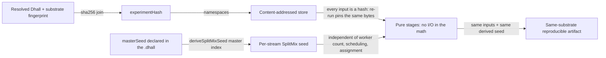

# Content Addressing & Determinism

**Status**: Authoritative source
**Supersedes**: N/A
**Referenced by**: documents/engineering/README.md, documents/engineering/chaos_failover_doctrine.md, documents/engineering/illegal_state_catalog.md, documents/engineering/image_build_doctrine.md, documents/engineering/manifest_generation_doctrine.md, documents/engineering/platform_services_doctrine.md, documents/engineering/pulsar_client_doctrine.md, documents/engineering/vault_pki_doctrine.md
**Generated sections**: none

> **Purpose**: Define amoebius's cross-project content-addressed store (blobs ← manifests ← pointers), the
> `experimentHash = sha256(resolved-dhall ‖ substrate-fingerprint)` identity, and the seed-derivation
> determinism that makes an ML run reproducible *by construction* — the one mechanism shared by both the
> `infernix` and `jitML` extension libraries — together with the honest ceiling on what types can and cannot
> make deterministic.

---

## 1. The one idea: a name you cannot lie about

The intuition: most data corruption starts with a *name that does not match its bytes* — a pointer to a blob
that was overwritten, an image tag that moved, a "checkpoint v3" that two machines disagree about. amoebius
closes that whole class by refusing to let anyone *assign* a name. The name of an artifact **is** the SHA-256
of its bytes. There is exactly one way to obtain a reference — hash a real artifact — so a reference that
points at the wrong thing, or at nothing, has no inhabitant.

That single move buys three properties that this doctrine is the SSoT for, applied uniformly to **both**
`infernix` (LLM inference) and `jitML` (training + JIT codegen):

1. **A three-tier store** (§2) where the only mutable objects are tiny pointers, and everything heavy is
   write-once and self-naming.
2. **A run identity** (§3) — `experimentHash` — that folds *what you asked for* and *where it ran* into one
   digest, so two runs share a namespace only when they are genuinely the same experiment on the same
   substrate.
3. **Reproducibility by construction** (§4) — pinned content-addressed inputs + pure stages + a derived RNG
   seed — where the type system makes the bookkeeping *total*.

It also buys a fourth property that pays off elsewhere: content-addressed data is **confluent**, so it crosses
cluster boundaries without a divergence proof (§5).

**What this doc does not own.** This doctrine owns the shared *mechanism*. It does **not** re-derive the
*totality typing* that makes names un-forgeable — that is technique §4.5 in
[`illegal_state_catalog.md`](./illegal_state_catalog.md). It does **not** own the per-substrate floating-point
contract or the JIT cache key — those are owned by the sibling `jitML` project's
`jitML/documents/engineering/determinism_contract.md`, which this doc references rather than restates. And it
does **not** own where the bytes physically live (retained-PV MinIO) — that is
[`storage_lifecycle_doctrine.md`](./storage_lifecycle_doctrine.md). §7 draws every boundary explicitly.

**Honesty up front.** Everything below is amoebius **design intent**, generalized from two working sibling
libraries (`jitML/src/JitML/Checkpoint/Format.hs`, `jitML/src/JitML/Engines/Rng.hs`, and the `infernix`
artifact store). Evidence inherited from a sibling project is evidence, not an amoebius proof — amoebius has
not yet built this layer. Per [documentation_standards.md §6](../documentation_standards.md), no statement
here is a proven amoebius result, and §6 is explicit about which claims are *proven-in-types*, which are
*tested* in a sibling, and which are deliberately *not asserted*. Delivery sequencing and gates live only in
[`../../DEVELOPMENT_PLAN/README.md`](../../DEVELOPMENT_PLAN/README.md).

---

## 2. The three-tier store: blobs ← manifests ← pointers

The intuition: split every persisted run into (a) the heavy opaque bytes, (b) a small typed description that
*names* those bytes, and (c) a single movable label that says "this description is current." Make (a) and (b)
immutable and self-naming so they can never be overwritten or torn; let only (c) move, and let it move only by
compare-and-swap. Then the only race in the whole system is a one-object atomic pointer flip.

Concretely, the store lives under one MinIO bucket per project (`jitml-checkpoints`, `infernix-models`) with a
fixed prefix schema. The `jitML` key renderers in `jitML/src/JitML/Checkpoint/Format.hs` (`blobKey`,
`manifestKey`, `latestPointerKey`, `bestPointerKey`, `trialPointerKey`) are the reference implementation:

```
<store>/
  <experiment-hash>/                       -- §3: sha256(resolved-dhall ‖ substrate-fingerprint)
    blobs/<sha256>                         -- write-once, content-addressed, opaque bytes
    manifests/<sha256>                     -- write-once, content-addressed, canonical-CBOR manifest
    pointers/
      latest                               -- mutable, ETag-CAS; body = the 32-byte manifest sha
      best/<metric>                        -- mutable, ETag-CAS; body = the 32-byte manifest sha
      trial/<trial-id>/latest              -- per-trial latest pointer (HPO sweeps)
      trial/<trial-id>/best/<metric>       -- per-trial best pointer
```

### 2.1 Three object classes, two write protocols

- **`blobs/<sha256>` — write-once content-addressed payloads.** The key *is* `sha256(bytes)`. One logical
  checkpoint produces one blob per part: weights, optimizer state, RNG state, and (for RL) replay buffer and
  exploration cache. PUTs use `If-None-Match: *` and treat `412 Precondition Failed` as **success** — the
  bytes already exist by definition, so the write was a no-op. Part-level addressing makes unchanged state
  deduplicate automatically across consecutive checkpoints.
- **`manifests/<sha256>` — write-once content-addressed CBOR.** A manifest names the blob SHAs that constitute
  one logical checkpoint plus the metadata needed to interpret them (architecture, preprocessing, output
  decoders, weight layout, step, metrics, parent manifest). Its key is `sha256(canonical-cbor(manifest))`. The
  encoder is **canonical** — `encodeManifestCbor` sorts tensors by name, optimizer blobs by kind, RNG blobs by
  stream id, metrics by name, and so on — so two writers with equal *logical* content emit byte-identical CBOR
  and therefore the same key. Same `If-None-Match: *` protocol. The manifest SHA is the canonical *checkpoint
  id* used in Pulsar events and `--resume <checkpoint-id>`.
- **`pointers/*` — the only mutable objects.** Each pointer body is a 32-byte manifest SHA. Updates use S3
  conditional PUT with `If-Match: <etag>` — textbook compare-and-swap. The `pointers/latest` update is the
  **single atomic commit point** of a checkpoint: blob writes may happen in any order and may even orphan bytes
  on failure, but a manifest becomes HEAD only when its pointer CAS succeeds. The pure CAS decision is
  `applyPointerWrite` (`PointerWritten` vs `PointerConflict`); the `jitML` checkpoint format owns the retry
  harness and the typed `AdvancePredicate` that resolves a lost CAS.

```mermaid
flowchart LR
  parts[Checkpoint parts: weights, optimizer, rng, replay] -->|"sha256(bytes), If-None-Match * (412 = success)"| blobs[blobs/sha256 write-once]
  blobs -->|named by their SHAs inside| manifest[manifests/sha256 canonical CBOR]
  manifest -->|"manifest-sha = sha256(canonical-cbor)"| ptr[pointers latest / best metric / trial id]
  ptr -->|"If-Match etag CAS: single atomic commit point"| head[Adopted HEAD]
  head -->|"reader sees old-etag or new-etag bytes, both name immutable manifests"| reader[Inference / resume reader]
```



### 2.2 Why this shape removes the races

Because blob and manifest keys are derived from `sha256(payload)`, a **write/write** hazard on them is
impossible by construction: two writers with the same logical payload write the *same key* with the *same
bytes*, and `412` is success. A **write/read** hazard is impossible because an S3 object PUT is atomic at the
object level. The only remaining hazard is **write/write on a pointer**, resolved by `If-Match` CAS — the loser
gets `412`, re-reads, and reapplies the typed advance predicate. A pointer **reader** always sees either the
old ETag's bytes or the new ETag's bytes, both of which name valid immutable manifests; there is no torn state
because the only mutation is a single atomic PUT of a 32-byte body.

This protocol's per-project specifics — the `.jmw1` dense-weight wire format, the full `CheckpointManifest`
CBOR shape, the retention/GC reconciler, and the inference-only read path — are owned by the sibling
`jitML/documents/engineering/checkpoint_format.md`. The bytes themselves live on a `no-provisioner` retained PV
backing MinIO, owned by [`storage_lifecycle_doctrine.md`](./storage_lifecycle_doctrine.md); MinIO as an
HA-always standard service is owned by [`platform_services_doctrine.md`](./platform_services_doctrine.md). This
doc owns only the three-tier shape and the two write protocols.

---

## 3. `experimentHash`: identity is *what you asked for* ‖ *where it ran*

The intuition: a run's identity must change whenever anything that could change its output bytes changes —
otherwise two genuinely different runs would collide in the same namespace and one would silently shadow the
other. amoebius derives that identity from two pinned inputs and nothing else:

```haskell
-- jitML/src/JitML/Checkpoint/Format.hs
deriveExperimentHash :: Text -> Text -> Text
deriveExperimentHash resolvedDhall substrateFingerprint =
  hexBytes . SHA256.hash $ encodeUtf8 (resolvedDhall <> "||" <> substrateFingerprint)
```

so that

```
experimentHash = sha256(resolved-dhall ‖ substrate-fingerprint)
```

- **`resolved-dhall`** is the fully-evaluated experiment program — the normal form of the `.dhall` value after
  all imports and functions are applied. It carries the model architecture, the master seed, the metric set
  *and each metric's direction*, the optimizer, the dataset split, and the budget. Two consequences fall out of
  this being part of the identity: flipping a metric's `direction` (maximise ↔ minimise) defines a **different
  experiment**, and any application-logic change to the model defines a different experiment. The DSL surface
  that produces this normal form is owned by [`dsl_doctrine.md`](./dsl_doctrine.md); this doc only consumes it.
- **`substrate-fingerprint`** is the identity of *where the math runs* — `apple-silicon` / `linux-cpu` /
  `linux-cuda` plus the toolchain witnesses that fix float semantics (the GHC 9.12.4 baseline, the
  kernel-compiler/runtime versions, ISA, ABI). It is gathered by full-path subprocess probes, never from
  environment variables or `PATH`, per the no-env/no-PATH contract owned by
  [`substrate_doctrine.md`](./substrate_doctrine.md). The *composition* of this fingerprint (and the related,
  finer-grained JIT cache key) is owned by `jitML/documents/engineering/determinism_contract.md`; this doc
  treats it as an opaque pinned string.

**Why fold the substrate into identity at all?** Because cross-substrate bit-equality is *not* guaranteed (§6).
The same program on a different accelerator produces different bytes, so it must occupy a different namespace —
otherwise an `apple-silicon` checkpoint and a `linux-cuda` checkpoint would fight over the same `latest`
pointer and the `best/<metric>` comparison would be comparing apples to ULP-shifted apples. Making the
substrate part of the *name* turns "ran on a different accelerator" into "different experiment," which is
exactly true.

This is where the two DSL surfaces meet without colliding: the **application-logic** surface determines
`resolved-dhall`'s model and config, the **deployment-rules** surface chooses the substrate, and the
substrate-fingerprint folds the latter into the identity — the split itself is owned by
[`app_vs_deployment_doctrine.md`](./app_vs_deployment_doctrine.md). `experimentHash` gives **identity**, not a
guarantee that two runs sharing it produce equal bits; that stronger claim is §4 (when it holds) and §6 (where
it stops).

---

## 4. Determinism by construction: pinned inputs + pure stages + derived seed

The intuition: reproducibility is not a debugging aid you bolt on; it is what you get *for free at the input
boundary* when every input is pinned, every stage is declared a pure function of its declared inputs, and the
only randomness is derived from a declared seed. amoebius builds this from three legs the type system makes
**total** — content-addressed input pinning, the `experimentHash` identity, and SplitMix seed derivation.
That closes the *inputs*; it does **not**, by itself, make the producing *computation* deterministic — a GPU
kernel, an async replay buffer, or a cross-substrate float reduction can still diverge. That residue is a
separate, **tested/assumed** contract, scoped honestly in the determinism-ceiling section below; do not read
"by construction" as covering the compute.



### 4.1 Leg one — pinned content-addressed inputs

Every input a stage reads is named by its hash (§2): the dataset blob, the parent checkpoint manifest, the
prior weights. Re-running an experiment re-pins the *same* bytes, because a content address cannot refer to
anything else. There is no "latest version of the dataset" that could drift underfoot — there is only a SHA,
and a SHA is forever.

### 4.2 Leg two — pure stages

The math (parameter init, minibatch ordering, the optimizer update, the forward/backward pass, MCTS expansion)
is expressed as pure functions over those pinned inputs. I/O lives at the interpreter boundary, not inside the
numerics — the purity boundary itself is owned by [`dsl_doctrine.md`](./dsl_doctrine.md) and the project FP
guides. A pure stage with pinned inputs and a fixed seed has exactly one result.

### 4.3 Leg three — the derived seed, independent of worker count

This is the leg that survives distribution. A master seed is declared in the experiment `.dhall`; every stream
(per-experiment, per-game in RL self-play, per-HPO-trial, the MCTS root-noise stream) gets its own seed
*derived deterministically* from `(masterSeed, streamIndex)` — never from wall-clock, never from a worker id,
never from `/dev/urandom`:

```haskell
-- jitML/src/JitML/Engines/Rng.hs
deriveSplitMixSeed :: SplitMixSeed -> Word64 -> SplitMixSeed
deriveSplitMixSeed (SplitMixSeed masterSeed) streamIndex =
  SplitMixSeed . fst . splitMixNext $ SplitMixSeed (masterSeed + streamIndex * splitMixGamma)
```

with the SplitMix64 mixing function and golden-ratio gamma (`0x9E3779B97F4A7C15`). The decisive property:
**a stream's seed is a pure function of `(masterSeed, streamIndex)` alone.** It does not depend on how many
workers are running, on the order the scheduler dispatched them, or on which worker happened to draw which
stream. Run the same experiment on 1 worker or 100, in any dispatch order, and game 37 is seeded identically
every time. The same derivation seeds HPO trial selection and the AlphaZero MCTS root noise. The per-substrate
RNG split details (which substrate holds the stream — host daemon vs clustered pod) are owned by
`jitML/documents/engineering/determinism_contract.md`.

### 4.4 What "the types make these total" cashes out to

The rallying phrase is concrete: there is **no inhabitant** of the type "a stream with no seed" or "a seed read
from ambient entropy." A stream's seed is reachable only through `deriveSplitMixSeed`, whose arguments are a
typed `SplitMixSeed` and a `Word64` index — both pinned. An artifact's name is reachable only by hashing real
bytes (`deriveExperimentHash`, `blobKey`, `manifestContentSha`); there is no constructor that takes a free
string. So "use whatever entropy the worker had" and "point at a checkpoint that was never written" are not
states you can *fix at runtime* — they are states you cannot *write down*. This is the totality technique §4.5
in [`illegal_state_catalog.md`](./illegal_state_catalog.md), applied to seeds and store keys; this doc owns the
content-addressing/determinism *use* of it, the catalog owns the typing discipline.

### 4.5 Infernix inference is made deterministic too

The same three legs apply to `infernix` LLM inference, not just `jitML` training. The model store is
content-addressed — weights stage to `infernix-models/<modelId>/…` and a `.ready` sentinel is written **last**,
so an `ArtifactRef` is obtainable *only* from a completed staging (a half-downloaded model has no serveable
reference). Decoding is made deterministic by the same recipe: a pinned content-addressed model, a pure decode
stage, and a seed derived from the request — greedy decoding, or seeded sampling with the seed carried in the
request rather than drawn from ambient entropy. The cross-project artifact + `.ready` mechanism is owned by
`infernix`'s `infernix/documents/architecture/pulsar_ml_workflow.md`; this doc owns the content-addressing and
seed-derivation contract it instantiates. The honest ceiling in §6 applies to inference exactly as it does to
training: same-substrate reproducibility is the contract, cross-substrate bit-equality is not asserted.

---

## 5. Confluence: content-addressed data crosses cluster boundaries safely

The intuition: when you replicate data between two clusters asynchronously, the nightmare is *divergence* — two
sides that accept conflicting writes and can never be cleanly merged. Content addressing makes that nightmare
unrepresentable for the heavy data, because the store is a **join-semilattice**: merging two replicas is set
union, and union over content-addressed objects is commutative, associative, and idempotent.

- **Blobs and manifests merge by union.** Two clusters that compute the same logical payload write the *same
  key* with the *same bytes*; two clusters that compute different payloads write *different keys*. There is no
  key whose value depends on *who wrote it* or *what order it arrived*, so a merge can never conflict — it just
  takes the union of immutable objects. Re-delivering the same object is a no-op (idempotent), which is exactly
  what the Pulsar at-least-once contract needs.
- **Pointers converge by a lattice join.** The only mutable objects are the pointers, and the typed
  `AdvancePredicate` that resolves them is itself a join: `latest` advances to the manifest with the greater
  step, `best/<metric>` to the greater (or lesser) metric value. `max` over steps and `max`/`min` over a metric
  are commutative, associative, and idempotent — so two replicas that apply each other's pointer updates in any
  order land on the same HEAD. Convergence is built into the predicate, not bolted on by a merge script.

The consequence for failover doctrine is precise: the content-addressed store carries **no per-system
confluence proof obligation** — it is the *trivial* case of invariant-confluence, true by construction. The
hard proof obligations concentrate on the systems that are *not* content-addressed (the ones with genuine
multi-writer mutable state), and that "Second Axis" of async cross-cluster geo-replication is owned by
[`chaos_failover_doctrine.md`](./chaos_failover_doctrine.md). This doc owns only the claim that the store is the
easy case and *why*.

**Transport.** Cross-cluster movement of bodies and events rides the native-protocol Pulsar client — the TCP
binary protocol, **never** WebSockets — owned by [`pulsar_client_doctrine.md`](./pulsar_client_doctrine.md). A
host compute daemon participates as a **Pulsar + MinIO peer over host-only NodePorts with no mTLS** (owned by
[`host_cluster_comms_doctrine.md`](./host_cluster_comms_doctrine.md)); it reads and writes the *same*
content-addressed store the in-cluster workers do, and confluence is what makes that safe without a distributed
lock. One caveat carried from the determinism contract: **determinism applies to the durable message body
only** — Pulsar message metadata (broker-assigned ids, timestamps) varies across runs and is never an input to
any content hash.

**Honesty.** Confluence here is a property of the *store*, proven-in-types by the immutability + lattice
argument above. Whether two clusters *produce the same bytes to merge* in the first place is a separate
question, and its ceiling is §6.

---

## 6. The honest ceiling: types make the bookkeeping total, not the physics deterministic

This section is load-bearing. Everything above earns the phrase "reproducible by construction" for the parts a
type system can reach — **identity** (`experimentHash` is a total function of pinned inputs), **input pinning**
(content addresses cannot dangle), and **seed derivation** (a stream's seed is a total function of
`(masterSeed, index)`). Those are *proven-in-types*: the bad states have no inhabitant.

What types **cannot** do is make the *producing compute* bit-identical. Floating-point reduction order,
accelerator scheduling, and async I/O are runtime physics, outside the reach of any Dhall or Haskell type. The
sibling `jitML` project's `jitML/documents/engineering/determinism_contract.md` is the SSoT for exactly where
that ceiling sits, and amoebius adopts its contract verbatim rather than inventing a softer one:

- **Same-substrate bit-equality is the contract; cross-substrate bit-equality is *not guaranteed* and *not
  asserted*.** There is no numeric-parity check and no tolerance band across substrates — RNG draws and float
  reduction order differ. The substrate is folded into `experimentHash` (§3) precisely so this is honest by
  construction rather than papered over.
- **Off-policy RL is downgraded to a *tested* first-N-step prefix.** For DQN, DDPG, TD3, SAC, CrossQ, and TQC,
  the replay-buffer write discipline is async, so two same-substrate same-seed runs may differ in which step
  pulls a particular sample. The bit-equality anchor is therefore the **first-N-steps prefix** (default
  `rl_steps / 10`), and — critically — it is asserted by comparing **two fresh runs against each other**, never
  against a stored trajectory fixture. That is *tested evidence in the sibling*, not a proof, and this doctrine
  reports it as such. On-policy algorithms (PPO, A2C, TRPO, MaskablePPO, RecurrentPPO) and SL training hold
  full-run bit-equality; AlphaZero self-play holds per-game bit-equality.
- **Infernix inference inherits the same ceiling.** Same-substrate, seeded/greedy decoding is the reproducible
  contract; cross-substrate inference bits are not asserted equal.

### 6.1 Proven / tested / assumed, spelled out

Per the moral rule in [documentation_standards.md §6](../documentation_standards.md) and the ledger discipline
in [`chaos_failover_doctrine.md`](./chaos_failover_doctrine.md), each claim states the layer it actually
reaches:

| Claim | Status | Reaches |
|-------|--------|---------|
| `experimentHash` / store keys are total functions of pinned content (no dangling reference inhabits the type) | **Proven-in-types** | The type/`.dhall` layer — a typecheck, not a runtime observation |
| A stream's seed is independent of worker count, scheduling, and assignment | **Proven-in-types** | `deriveSplitMixSeed` is pure over `(masterSeed, index)` |
| Blob/manifest merge is conflict-free; pointer convergence is a lattice join | **Proven-in-types** (argued from immutability + commutative/associative/idempotent join) | The store algebra; *not* a built amoebius replication run |
| Same-substrate same-toolchain checkpoint reproduction is byte-identical | **Tested in the sibling `jitML`**, not proven in amoebius | A runtime comparison on matching hardware |
| Off-policy RL same-seed full-run bit-equality | **Not asserted**; only the first-N-step prefix is tested | A runtime prefix comparison of two fresh runs |
| Cross-substrate bit-equality (training or inference) | **Explicitly not asserted** | Nothing — out of contract by design |

amoebius itself has built none of this; the proven-in-types rows are the design's *intended* totality, and the
tested rows are evidence from sibling libraries that the design is realizable. Treat this document as a
specification to validate, never as a proven amoebius result. Status and gates: see
[`../../DEVELOPMENT_PLAN/README.md`](../../DEVELOPMENT_PLAN/README.md).

---

## 7. What this doctrine deliberately does not own

| Concern | Owned by |
|---------|----------|
| The totality *typing* — names as total functions of content, no inhabitant for a dangling reference | [`illegal_state_catalog.md` §4.5](./illegal_state_catalog.md) |
| Where the bytes physically live: `no-provisioner` retained-PV MinIO, deterministic rebind | [`storage_lifecycle_doctrine.md`](./storage_lifecycle_doctrine.md) |
| MinIO/Pulsar as HA-always standard services | [`platform_services_doctrine.md`](./platform_services_doctrine.md) |
| The resolved-`.dhall` identity input and the purity boundary | [`dsl_doctrine.md`](./dsl_doctrine.md) |
| The substrate-fingerprint composition, no-env/no-PATH probing, the four-substrate catalog | [`substrate_doctrine.md`](./substrate_doctrine.md) |
| The application-logic ÷ deployment-rules split that feeds §3's two inputs | [`app_vs_deployment_doctrine.md`](./app_vs_deployment_doctrine.md) |
| The async cross-cluster confluence "Second Axis" proof obligation | [`chaos_failover_doctrine.md`](./chaos_failover_doctrine.md) |
| The native-protocol Pulsar transport (no WebSockets), at-least-once + dedup | [`pulsar_client_doctrine.md`](./pulsar_client_doctrine.md) |
| Host↔cluster comms: the daemon as MinIO/Pulsar peer over host-only NodePorts (no mTLS) | [`host_cluster_comms_doctrine.md`](./host_cluster_comms_doctrine.md) |
| The elevated harness as the sole actor allowed to delete test-flagged store objects; leak-free cycles | [`testing_doctrine.md`](./testing_doctrine.md) |
| Per-substrate float semantics, the JIT cache six-tuple, the engine envelope | `jitML/documents/engineering/determinism_contract.md` (sibling) |
| The `.jmw1` wire format, full `CheckpointManifest` CBOR shape, CAS retry harness, retention/GC | `jitML/documents/engineering/checkpoint_format.md` (sibling) |
| The infernix model-staging `.ready` artifact + readiness contract | `infernix/documents/architecture/pulsar_ml_workflow.md` (sibling) |

---

## 8. Planning ownership

This document is normative content-addressing and determinism doctrine only. Delivery sequencing, completion
status, validation gates, and remaining work are owned by
[`../../DEVELOPMENT_PLAN/README.md`](../../DEVELOPMENT_PLAN/README.md). This doc never maintains a competing
status ledger; it states the target shape and links back for status. Per
[documentation_standards.md §6](../documentation_standards.md), no statement here is a proven amoebius result:
the model generalizes mechanisms built and tested in the sibling `jitML` and `infernix` libraries into amoebius
design intent.

---

## Cross-references

- [Engineering Doctrine Index](./README.md)
- [Illegal State Catalog](./illegal_state_catalog.md) — content-address totality (§4.5)
- [Storage Lifecycle Doctrine](./storage_lifecycle_doctrine.md)
- [Platform Services Doctrine](./platform_services_doctrine.md)
- [DSL Doctrine](./dsl_doctrine.md)
- [Substrate Doctrine](./substrate_doctrine.md)
- [App vs Deployment Doctrine](./app_vs_deployment_doctrine.md)
- [Chaos / Failover Doctrine](./chaos_failover_doctrine.md)
- [Pulsar Client Doctrine](./pulsar_client_doctrine.md)
- [Host ↔ Cluster Comms Doctrine](./host_cluster_comms_doctrine.md)
- [Testing Doctrine](./testing_doctrine.md)
- [Development Plan](../../DEVELOPMENT_PLAN/README.md)
- [Documentation Standards](../documentation_standards.md)
- Sibling SSoTs: `jitML/documents/engineering/determinism_contract.md`,
  `jitML/documents/engineering/checkpoint_format.md`,
  `jitML/src/JitML/Checkpoint/Format.hs`, `jitML/src/JitML/Engines/Rng.hs`,
  `infernix/documents/architecture/pulsar_ml_workflow.md`
