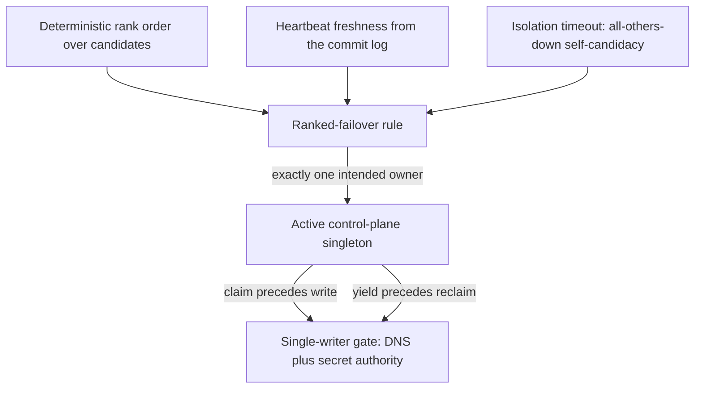
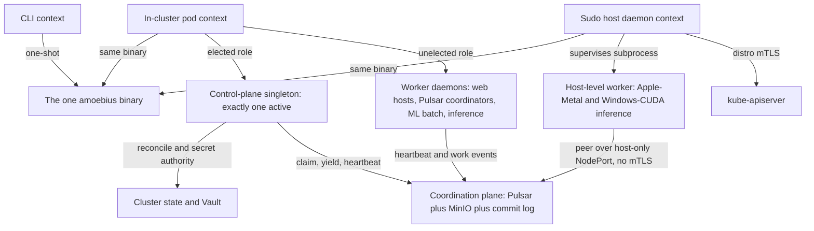

# Daemon Topology

**Status**: Authoritative source
**Supersedes**: N/A
**Referenced by**: documents/engineering/README.md, documents/engineering/chaos_failover_doctrine.md, documents/engineering/cluster_lifecycle_doctrine.md, documents/engineering/host_cluster_comms_doctrine.md, documents/engineering/manifest_generation_doctrine.md, documents/engineering/network_fabric_doctrine.md, documents/engineering/pulsar_client_doctrine.md, documents/engineering/pulumi_iac_doctrine.md, documents/engineering/readiness_ordering_doctrine.md, documents/engineering/substrate_doctrine.md, documents/engineering/testing_doctrine.md
**Generated sections**: none

> **Purpose**: Single Source of Truth for the one amoebius binary's three runtime contexts (CLI / sudo host-daemon / in-cluster pod) and its daemon role taxonomy — exactly one elected control-plane singleton with total authority over the cluster and its secrets, plus N unelected worker daemons — and the shape (not the proof) of the leadership election that picks the singleton.

---

## 1. One binary, three contexts

**Everything amoebius does is the same executable.** There is no "CLI package" and a separate "daemon
package"; there is one Haskell binary that *runs* in three different ways:

| Context | How it runs | What it is for |
|---------|-------------|----------------|
| **CLI tool** | A one-shot invocation on a host, exits when done | Operator commands, `bootstrap`, reconcile triggers, status queries |
| **Sudo host daemon** | A long-running host process with `sudo` powers | Bring up the distro (kind / rke2) — including installing the **root rke2 server** ([§2.1](#21-a-third-orthogonal-axis-rke2-serveragent-declared)) — install host tooling, talk to `kube-apiserver` over distro mTLS, **supervise host-level worker subprocesses** |
| **In-cluster pod** | Deployed as a generated typed manifest (the typed reconciler, no Helm) inside the cluster | Hosts the **control-plane singleton role** ([§3](#3-the-control-plane-singleton--exactly-one-elected)) *or* a **worker role** ([§4](#4-worker-daemons--n-unelected)) |

The **same-binary policy** is generalized directly from the prodbox sibling
(`/home/matthewnowak/prodbox/documents/engineering/distributed_gateway_architecture.md` → "Same-binary
policy"). The payoff is not stylistic — it is structural:

- **One distribution artifact, one dependency closure**, built once from the substrate `bootstrap.sh`
  against the pinned toolchain (GHC **9.12.4**, Cabal 3.16.1.0 — the
  [DEVELOPMENT_PLAN](../../DEVELOPMENT_PLAN/README.md) pin).
- **One config loader, one logger, one error type, one set of types.** A daemon and a CLI command share
  the `Command` ADT, the structured-error type, and the Dhall decoder — there is nothing to keep in sync
  between two codebases.
- **The CLI introspects its own daemons.** Daemon-launching commands are ordinary `Command` constructors
  that appear in `--help` and the generated docs like any other; a daemon does not own a second argv
  parser. This is the prodbox **daemon-as-Command** pattern.

The *constituent behaviours* of the binary map onto the role taxonomy below: **prodbox** is the root
single-node control-plane behaviour ([§3](#3-the-control-plane-singleton--exactly-one-elected)), **infernix** + **jitML** are the ML worker roles ([§4](#4-worker-daemons--n-unelected)),
**hostbootstrap** is the bootstrap + DSL-`chain` core that the host daemon drives, and **mattandjames** is
the application logic a web-service worker hosts ([README](../../README.md);
[DEVELOPMENT_PLAN](../../DEVELOPMENT_PLAN/README.md)). They are libraries inside one binary, not separate
products.

This document owns *which contexts exist and what each is for*. **How** the host daemon communicates — the
distro-mTLS path to `kube-apiserver`, and the host-only NodePort peering with no mTLS — is owned by
[host_cluster_comms_doctrine.md](./host_cluster_comms_doctrine.md). The **substrate** mechanics behind the
sudo host daemon — substrate detection, `bootstrap.sh`, host (non-containerized) worker *nodes*, and the
no-environment-variables / no-`PATH` lazy-tool-ensure contract — are owned by
[substrate_doctrine.md](./substrate_doctrine.md).

---

## 2. Context × role: an orthogonal grid

The single most useful mental model in this doctrine: **"where the binary runs" (context) and "what job it
is doing" (role) are independent axes.** Confusing them is the bug this section prevents — "the in-cluster
pod" is not a role, and "the control-plane singleton" is not a context.

|                         | **Control-plane singleton role** | **Worker role** |
|-------------------------|----------------------------------|-----------------|
| **CLI context**         | — (a CLI run is not a daemon)     | — |
| **Sudo host daemon**    | Pre-cluster bootstrap *acts on behalf of* the future singleton, then hands off | Supervises host-level workers (e.g. Apple-Metal and Windows-CUDA inference, [§4](#4-worker-daemons--n-unelected)) |
| **In-cluster pod**      | **Exactly one active**, elected ([§3](#3-the-control-plane-singleton--exactly-one-elected)) | **N**, unelected ([§4](#4-worker-daemons--n-unelected)) |

Two facts fall out of the grid:

- **The control-plane singleton is always an in-cluster role.** A cluster's brain lives *in* the cluster it
  governs. Before that cluster exists, the **sudo host daemon** does the bootstrap work that brings the
  first singleton into being (this is the prodbox root single-node story), then defers to it — the host
  daemon is the *midwife*, not the brain.
- **Worker daemons run in both daemon contexts.** Most workers are in-cluster pods; a few must be
  host-level subprocesses because their hardware cannot be containerized (Apple-Metal GPU work, and
  native Windows-CUDA inference — CUDA does not run performantly under WSL2). A host-level worker is the **same binary in the worker role under the
  host-daemon context**, supervised as a subprocess.

Which roles run, how many replicas each gets, and which workers are host-level versus in-cluster are all
**deployment-rules** decisions, never application logic — that orthogonal DSL split is owned by
[app_vs_deployment_doctrine.md](./app_vs_deployment_doctrine.md).

### 2.1 A third orthogonal axis: rke2 server/agent (declared)

The grid above crosses two axes — **context** (where the binary runs) and **role** (what job it is doing).
The rke2 distro adds a **third, fully independent typed axis** that this doctrine must keep from fusing with
the other two:

- **(i) Substrate — DETECTED.** kind / rke2 / EKS, discovered at bring-up
  ([cluster_topology_doctrine.md §1](./cluster_topology_doctrine.md#1-two-axes-the-substrate-is-detected-the-engine-is-declared),
  [substrate_doctrine.md](./substrate_doctrine.md)).
- **(ii) amoebius daemon-role — ELECTED.** the control-plane singleton ([§3](#3-the-control-plane-singleton--exactly-one-elected)) versus an unelected worker ([§4](#4-worker-daemons--n-unelected)).
- **(iii) rke2 server/agent — DECLARED.** which *nodes* carry the Kubernetes control plane
  (kube-apiserver + the etcd quorum) versus which are pure workload nodes. This is the `Rke2Servers` closed
  union — `Single` / `Ha3` / `Ha5`, the only legal odd etcd quorums {1,3,5} — plus an `agents` list, owned by
  [cluster_topology_doctrine.md §2, §4](./cluster_topology_doctrine.md#2-computeengine-a-closed-union-eks-a-first-class-arm). An even- or zero-server (no-quorum /
  split-brain) control plane has no constructor: **type-foreclosed unrepresentable**.

(Two further declared axes exist system-wide — environment dev/staging/prod, and the engine/model/kernel asset
tier — but they are owned by the release-lifecycle and content-addressing doctrines, not here; this document
is normative only about axis (iii)'s orthogonality to (i) and (ii).)

**The three axes never fuse.** An rke2 *server* node is **not** the amoebius control-plane singleton, and an
rke2 *agent* is **not** an amoebius worker. Axis (iii) is a property of *Kubernetes nodes* (which host runs
etcd / kube-apiserver); axis (ii) is a property of *amoebius daemon pods* (which pod holds cluster + secret
authority, [§3](#3-the-control-plane-singleton--exactly-one-elected)). They are independent: a worker pod may be scheduled onto an rke2 server node, and the elected
singleton pod may run on an rke2 agent — the scheduler places pods without regard to the etcd quorum, and the
election ([§5](#5-leadership-election--the-mechanism-the-proof-lives-elsewhere)) picks a pod without regard to its node's rke2 kind. Axis (iii) is equally independent of axis
(i): rke2 server/agent is meaningful *only* on the rke2 substrate — it does not exist on kind or on EKS (which
owns its own managed control plane) — so a detected substrate never *implies* a server/agent split.

**Enactment splits across exactly the two daemon contexts ([§1](#1-one-binary-three-contexts)).** This is the one place the rke2 axis touches
daemon topology:

- **The sudo host daemon installs the ROOT rke2 server** — the zero-secret single node
  `{ servers = Rke2Servers.Single host, agents = [] }`. This makes the [§2](#2-context--role-an-orthogonal-grid) *midwife* concrete: before any
  cluster exists there is no singleton to elect, so the host daemon (acting on behalf of the future singleton)
  brings up the first `rke2-server`, then defers. This is the prodbox single-node `rke2-server` base —
  **sibling evidence, not an amoebius result** (prodbox's `Rke2.hs` proves the single-node install only).
- **The elected in-cluster singleton enacts child server/agent rollout over SSH.** Once kube-apiserver is up
  and the singleton is elected, growing the cluster (further `Ha3` / `Ha5` servers, and all agents) is part of
  the singleton's cluster authority — the *dynamic node provisioning* of [§3.2](#32-what-total-authority-over-the-cluster-and-its-secrets-cashes-out-to), owned by
  [cluster_lifecycle_doctrine.md](./cluster_lifecycle_doctrine.md). It runs the **checkpoint-free
  tag-discovery host reconciler** — `create → tag → join-fabric → drain-by-tag`, home
  [pulumi_iac_doctrine.md §0](./pulumi_iac_doctrine.md#0-decision-record-why-pulumi-stays--and-why-that-is-not-the-helm-decision) — reaching each new host over SSH. The first server
  mints the `Rke2NodeToken` (a Vault-KV `SecretRef`, parent-minted, referenced by name); further servers and
  agents join via a `server:` URL + that token; rejoin is idempotent. This is a **reconcile, not a state
  machine**.

A **quorum change** (e.g. `Single → Ha3`) is a deliberate re-provision of the declared server set, **never** an
autoscale; a `ScalingPolicy` grows the `agents` list only. Because axis (iii) is *declared* — not elected, not
detected — the singleton never promotes a node from agent to server at runtime; it re-provisions against the
new declaration.

> **Honesty.** Multi-node rke2 server/agent, etcd-HA, and the join-token flow are **Phase-N design intent** —
> net-new across the whole sibling family (hostbootstrap has zero rke2 code). Only the single-node
> `rke2-server` base is proven in the prodbox sibling; that is **sibling evidence, not a tested amoebius
> result**.

---

## 3. The control-plane singleton — exactly one, elected

**Every cluster has exactly one brain.** Exactly one daemon at a time holds **total authority over the
cluster and its secrets**: it runs the reconcile loop that drives the live cluster toward the global
`.dhall`, and it is the cluster's secret authority. This role **is the prodbox elected-gateway / root
single-node control-plane behaviour, generalized** from "owns the public DNS record" to "owns the whole
cluster" ([README](../../README.md): *prodbox = the root single-node control-plane behaviour*).

### 3.1 "Exactly one pod" reconciled with HA-always

The in-cluster daemon is a singleton service daemon (**exactly one pod**), yet
the platform invariant is **HA always — including `replicas=1`**
([platform_services_doctrine.md §2](./platform_services_doctrine.md#2-ha-always--including-replicas1)). These are not in tension once you
read "exactly one pod" as **exactly one *active* (elected) singleton**, not "the chart only ever schedules
one replica":

- The control-plane daemon is deployed by an **HA chart at a configurable replica count** — N candidate
  pods, each a ranked election candidate. This mirrors the prodbox gateway chart, which renders **one
  Deployment per ranked node** and elects one owner among them.
- **Election guarantees exactly one *active* singleton** at a time; the other candidates are warm standbys
  that take over on failure ([§5](#5-leadership-election--the-mechanism-the-proof-lives-elsewhere)).
- At the **root single-node case** (`replicas=1`, the laptop kind / single-node rke2), the population is
  one: the sole candidate self-elects. This is the **degenerate single-rank** instance of the same protocol
  — exactly the prodbox home single-host shared-fate case — not a second, hand-special-cased "dev"
  topology.

### 3.2 What "total authority over the cluster and its secrets" cashes out to

- **Cluster authority.** The active singleton runs the idempotent `discover → diff → enact → re-observe`
  reconciler that owns bring-up, spawn, dynamic node provisioning, and teardown — owned by
  [cluster_lifecycle_doctrine.md §9](./cluster_lifecycle_doctrine.md#9-how-bring-up-and-teardown-are-implemented-the-reconciler-not-a-state-machine), which names this doc as the owner of
  *who runs* that loop. It is also the single writer of the cluster's one canonical mutable external
  surface — the public DNS record for the cluster gateway (route53), *ordered* by the claim/yield discipline
  of [§5](#5-leadership-election--the-mechanism-the-proof-lives-elsewhere) (an ordering + signed-audit gate,
  **not** a resource-side fence — [§5.3](#53-ownership-transitions-and-the-single-writer-gate)).
- **Secret authority.** The singleton is the in-cluster principal that **operates Vault** — it is the only
  role that holds cluster-wide secret authority. The Vault *model* it operates — fail-closed unseal, the
  root password-encrypted unseal, the parent-injects-secrets-into-the-child's-Vault contract, the root PKI
  trust anchor, and the secrets-are-names-only `SecretRef` contract — is owned in full by
  [vault_pki_doctrine.md](./vault_pki_doctrine.md). This doc owns only the fact that **secret authority is
  fused to the elected singleton**: there is no second writer of cluster secrets, and a standby candidate
  has no secret authority until it wins the election.

Fusing cluster control and secret authority into a *single elected role* is what makes "one brain per
cluster" enforceable: there is never a moment when two daemons both believe they may reconcile the cluster
or mint its secrets. *That* this fusion is safe — that the election never produces two simultaneous active
singletons — is a correctness obligation, not something this section asserts; see [§5](#5-leadership-election--the-mechanism-the-proof-lives-elsewhere) and the honesty note
there.

**The external single-writer invariant is amoebius's own — not delegated.** Both authorities above are
exercised as **external side effects** — route53 DNS writes and Vault operations — that live *outside* the
coordination plane. The "intra-system consensus is delegated, not re-proved" posture ([§4](#4-worker-daemons--n-unelected))
covers the *internal* plane (Pulsar / MinIO / Postgres do their own consensus); it does **not** reach these
external effects. No Pulsar primitive — not even exclusive-producer fencing
([§5.5](#55-pulsar-primitives-evaluated-for-the-election--and-why-the-custom-election-stays)) — can fence a
route53 or Vault write, because those resources do not validate a broker epoch. So *exactly one route53
writer / exactly one Vault operator* is an **irreducibly amoebius** obligation, discharged by the election
plus the availability-first bounded self-healing posture of [§5.3](#53-ownership-transitions-and-the-single-writer-gate) / [§5.4](#54-the-safety-boundary-stated-honestly),
and modeled as a **First-Axis** proof obligation ([chaos_failover_doctrine.md](./chaos_failover_doctrine.md) Appendix A) —
never a Second-Axis obligation and never a delegated one.

---

## 4. Worker daemons — N, unelected

**If the singleton is the brain, the workers are the muscle.** A worker daemon does bounded, horizontally
scalable work; it is **not** elected, holds **no** cluster-wide authority, and there can be **many** of
each kind. The canonical worker kinds:

| Worker kind | What it does | Constituent library |
|-------------|--------------|---------------------|
| **Web-service host** | Hosts an amoebius app's services behind the cluster edge | **mattandjames** (application logic) |
| **Pulsar topic-lifecycle coordinator** | Drives an app's declared topic lifecycles (create / retention / teardown) | the DSL + [pulsar_client_doctrine.md](./pulsar_client_doctrine.md) |
| **ML batch coordinator** | Schedules and tracks batch ML workflows | **infernix** / **jitML** |
| **Inference engine** | Serves model inference — **in-cluster on linux-CUDA; host-level on Apple-Metal and Windows-CUDA** | **infernix** / **jitML** |

Properties shared by all workers:

- **Unelected and horizontally scaled.** Workers do not run a leadership election among themselves. They
  coordinate through the shared **coordination plane** — Pulsar + MinIO + the commit log ([§5](#5-leadership-election--the-mechanism-the-proof-lives-elsewhere)) — whose
  intra-system consensus is *delegated* to those systems, not re-proved by amoebius
  ([platform_services_doctrine.md §6, §8](./platform_services_doctrine.md#6-pulsar--the-event-and-workflow-backbone-new-vs-prodbox)). A Pulsar topic-lifecycle
  coordinator that needs single-consumer semantics gets it from Pulsar's subscription model and the
  at-least-once + dedup discipline ([pulsar_client_doctrine.md](./pulsar_client_doctrine.md)), not from a
  bespoke amoebius election. (This delegation covers the *internal* coordination plane only; the control-plane
  singleton's *external* single-writer authority — route53 / Vault — is **not** delegated and no Pulsar
  primitive discharges it, [§3.2](#32-what-total-authority-over-the-cluster-and-its-secrets-cashes-out-to).)
- **HA like everything else.** A worker Deployment runs the HA chart at a configurable replica count, even
  at `replicas=1` ([platform_services_doctrine.md §2](./platform_services_doctrine.md#2-ha-always--including-replicas1)). Every worker
  container declares explicit CPU and RAM ([platform_services_doctrine.md §10](./platform_services_doctrine.md#10-every-container-declares-cpu-and-ram)).
- **Host-level workers are subprocesses, not pods.** When hardware forbids containerization — **Apple-Metal
  unified-memory inference and native Windows-CUDA inference** (CUDA does not run performantly under WSL2,
  [substrate_doctrine.md](./substrate_doctrine.md)) — the worker runs as a
  **host subprocess supervised by the sudo host daemon** ([§1](#1-one-binary-three-contexts)). It reaches in-cluster MinIO and Pulsar as a
  **peer over a host-only NodePort with no mTLS** — localhost only, no WAN or LAN — owned by
  [host_cluster_comms_doctrine.md](./host_cluster_comms_doctrine.md). It discovers its host tooling lazily
  through the substrate's package manager and invokes it by full path, never through `PATH`
  ([substrate_doctrine.md](./substrate_doctrine.md)). Apple-Metal and Windows-CUDA are the **same host-worker
  shape** — a native subprocess reaching the cluster only over the host-only NodePort — differing only in
  engine offering and bootstrap ([§4.1](#41-the-engine-offering-vs-the-node-hardware-in-cluster-pod-or-host-subprocess)); their parity is **role parity, not evidence parity**. The on-host
  Windows-CUDA build/run path is **forward design intent with no sibling evidence and no build-shape doc**
  (unlike Apple-Metal's `apple_metal_headless_builds.md`), inheriting the honesty framing below.

> **Honesty.** The Pulsar / ML / inference worker roles are **new relative to prodbox** — prodbox had no
> Pulsar and no ML workers. Everything in this section is forward design intent for the relevant phase, not
> an inherited-proven behaviour; status and gates live only in
> [../../DEVELOPMENT_PLAN/README.md](../../DEVELOPMENT_PLAN/README.md)
> ([documentation_standards.md §6](../documentation_standards.md#6-honesty-the-proventestedassumed-discipline)).

### 4.1 The engine offering vs the node hardware: in-cluster pod or host subprocess

A worker's **engine offering** — the cluster-facing `EngineRuntime` it presents (`AppleMetal | Cuda |
LinuxCpu`) — is a **quotient of the detected substrate**, not a free choice: which offering a node makes is
**projected from** its substrate, and that quotient and its bootstrap/wire mapping are owned in full by
[service_capability_doctrine.md §4.1](./service_capability_doctrine.md#41-the-inferenceengine-capability--the-engine-is-baked-and-substrate-selected-never-fetched).
This doctrine does **not** restate that mapping; it records the one **daemon-context consequence** the
quotient forces on the worker taxonomy.

The consequence: one engine offering is realized in **different daemon contexts** ([§1](#1-one-binary-three-contexts)) according to the
**node hardware / bootstrap** — *how* the offering is stood up and wired:

- A **`Cuda`** offering is an **in-cluster pod** when the node hardware is `linux-cuda` (NVIDIA container
  runtime, reached over in-cluster mTLS), and a **host subprocess** when the node hardware is `windows`
  (native — CUDA does not run under WSL2 — reached only over the host-only NodePort). One offering, two
  bootstraps.
- An **`AppleMetal`** offering is always a **host subprocess** (`apple` node hardware; unified-memory GPU
  work cannot be containerized).
- A **`LinuxCpu`** offering is always an **in-cluster pod**.

So the same engine offering can span both daemon contexts, decided by node hardware, and is **never authored
free of the substrate**. These two facts — **engine offering** and **node hardware** — are a finer split of
*which worker realization the substrate projects*; they are **not** the context / role / rke2 axes of
[§2.1](#21-a-third-orthogonal-axis-rke2-serveragent-declared) ("the three axes never fuse") and must not be
conflated with `role` or `substrate`.

### 4.2 The accelerator-owner worker: wholesale per-node ownership, a typed per-node singleton

The inference and training worker kinds above run on nodes carrying accelerators (CUDA GPUs / Apple-Metal).
This round introduces the rule for how those accelerators are **owned**: a node's accelerators are owned
**wholesale** by a single **accelerator-owner worker** on that node — substrate-independent, whether the
owner is an in-cluster pod (`linux-cuda`) or a host subprocess (`windows` / `apple`, [§4.1](#41-the-engine-offering-vs-the-node-hardware-in-cluster-pod-or-host-subprocess)). Other pods may
use the node's leftover CPU and RAM but **never** its accelerators. This revises the earlier narrative in
which a GPU was a per-pod, indivisible bin-packable `Count`: accelerators are reached **only** through the
wholesale owner (the per-pod GPU request axis is removed — [resource_capacity_doctrine.md §3](./resource_capacity_doctrine.md#3-the-types-quantity-capacity-demand-budget)).

To make wholesale ownership a **typed** fact rather than a convention, this round introduces a **typed
per-node-singleton accelerator-owner worker kind** — a **DaemonSet-like node-affinity** worker, exactly one
per accelerator node — distinct from the N-replica *unelected* Deployment shape the other worker kinds use
([§4](#4-worker-daemons--n-unelected)). It is still **many across the cluster** (one per accelerator node), so "many of each kind"
holds; the type merely forbids **two on one node**. Because it admits **at most one owner per node**, "two
accelerator owners contending for one node's devices" and "a fractional / straddled accelerator claim" have
**no constructor: type-foreclosed unrepresentable**. The one owner **multiplexes training, serving, and Tier-3 JIT
compilation** on its node — which is what lets a node continuously train a model while serving it (the
continuous-training mode owned by content_addressing / dsl, [§4.3](#43-the-feed-sourced-continuous-trainer-an-existing-coordinator-single-writer-delegated)).

Wholesale per-node accelerator ownership and the per-node-singleton invariant are the **SSoT of this
doctrine**; [resource_capacity_doctrine.md §4.1](./resource_capacity_doctrine.md#41-place-branches-static-proves-a-placement-dynamic-proves-a-growth-envelope) / [§3](./resource_capacity_doctrine.md#3-the-types-quantity-capacity-demand-budget) and the illegal-state catalog **consume** it.

> **Layer / honesty.** The at-most-one-owner-per-node foreclosure is **type-foreclosed** — a per-node-singleton type
> has no two-owner inhabitant; that the daemon **actually holds the node's devices at runtime** is
> **runtime-checked** runtime residue. The typed accelerator-owner worker kind is **forward design intent** — no
> sibling system stands up a DaemonSet-like accelerator owner today; status and gates live only in
> [../../DEVELOPMENT_PLAN/README.md](../../DEVELOPMENT_PLAN/README.md)
> ([documentation_standards.md §6](../documentation_standards.md#6-honesty-the-proventestedassumed-discipline)).

### 4.3 The Feed-sourced continuous trainer: an existing coordinator, single-writer delegated

Continuous / online training — training forever from a live Pulsar feed (the training-run topology owned by
content_addressing / dsl) — needs a **single authoritative writer** per feed so the model's committed pointer
never regresses. This round places that role with **no new machinery**: the continuous trainer is the
**existing ML batch coordinator worker** ([§4](#4-worker-daemons--n-unelected) — infernix / jitML), parameterized with a `Feed` data
source. It is **not** a new elected worker kind and is **not** folded into the control-plane singleton
([§3](#3-the-control-plane-singleton--exactly-one-elected)) — routing every feed through the one cluster authority would bottleneck it, and single-writer
here is a per-feed concern, not cluster authority.

Single-writer is **delegated, not re-proved** — the same discipline the other workers use for single-consumer
semantics (["from Pulsar's subscription model … not a bespoke amoebius election"](#4-worker-daemons--n-unelected)):

- **Liveness — at most one active trainer per feed** is a **Pulsar Exclusive / Failover subscription** on the
  feed topic ([pulsar_client_doctrine.md](./pulsar_client_doctrine.md)): automatic ranked failover on death,
  resume-from-`latest`.
- **Safety — a race-free `latest` pointer** is the content store's **ETag-CAS single atomic commit point**
  plus the typed **`AdvancePredicate`** ([content_addressing_doctrine.md §2](./content_addressing_doctrine.md#2-the-three-tier-store-blobs--manifests--pointers), [§5](./content_addressing_doctrine.md#5-confluence-content-addressed-data-crosses-cluster-boundaries-safely)) — a
  monotone, idempotent join, so even a bounded failover overlap of two trainers cannot corrupt or regress
  HEAD (the loser's CAS is resolved by `AdvancePredicate`). This is the [§5.3](#53-ownership-transitions-and-the-single-writer-gate) single-writer gate
  (claim-precedes-write) applied to the pointer.

So the Feed-sourced trainer is a **reuse**, not a new election: an existing coordinator role + a per-feed
Pulsar Exclusive / Failover subscription + the CAS / `AdvancePredicate` commit point. The cross-cluster case
is **not** a second trainer on the same feed — a Continuous run is single-cluster (the intra-cluster
First-Axis coordinator); other clusters **serve by replication** of the immutable checkpoints, never train a
second authority on the feed.

**Why this reuse stops at the singleton.** The trainer's commit point is **CAS-fenceable at MinIO and
confluent** — a monotone `AdvancePredicate` absorbs a bounded two-writer overlap without corrupting HEAD
([content_addressing_doctrine.md §2](./content_addressing_doctrine.md#2-the-three-tier-store-blobs--manifests--pointers), [§5](./content_addressing_doctrine.md#5-confluence-content-addressed-data-crosses-cluster-boundaries-safely)).
The control-plane singleton's authority — route53 and Vault ([§3.2](#32-what-total-authority-over-the-cluster-and-its-secrets-cashes-out-to)) — is **non-confluent and
not CAS-fenceable**: there is no monotone join that makes two DNS writers safe. So §4.3's "delegate liveness
to a subscription, safety to CAS" pattern reuse **stops at the external boundary** and does *not* license
folding the singleton election into the same delegation
([§5.5](#55-pulsar-primitives-evaluated-for-the-election--and-why-the-custom-election-stays)).

---

## 5. Leadership election — the mechanism (the proof lives elsewhere)

**This section says *how the one brain is chosen*. It does not — and may not — claim that the choice is
*safe*.** The correctness of the election (that there is never more than one active singleton, that an
isolated survivor eventually takes over, that the single writer to DNS and secrets is unique) is a formal
proof obligation owned by [chaos_failover_doctrine.md](./chaos_failover_doctrine.md). This doctrine owns the
*shape*; that doctrine owns the *proof*.

### 5.1 The coordination plane: Pulsar + MinIO + the commit log

All coordination among amoebius daemons — heartbeats, ownership transitions, and work — flows through one
plane: **Pulsar + MinIO + an append-only, hash-chained, signed commit log.** The commit-log discipline is
lifted directly from the prodbox gateway daemon
(`/home/matthewnowak/prodbox/src/Prodbox/Gateway/{Types,Daemon}.hs`): events are **hash-chained and signed
by their emitter**, merged **idempotently by event hash** (`appendIfNew`), and ownership is derived from the
unique event set. The event classes carry over: `heartbeat`, `claim`, `yield`, and domain events.

The deliberate changes from prodbox are **transport** and **read-model.** Prodbox kept its commit log as an
in-memory anti-entropy gossip log pushed over signed HTTP between gateway peers. amoebius lifts the *same
event and ownership discipline* onto the standard platform backbone — **Pulsar** for the live event stream
(native TCP binary protocol, **no WebSockets** — [pulsar_client_doctrine.md](./pulsar_client_doctrine.md))
and Pulsar's own **bounded/tiered/retained topic lifecycle**
([pulsar_client_doctrine.md §6.1](./pulsar_client_doctrine.md#61-topic-storage-lifecycle-bounded-tiered-retained--and-the-hot-tier-never-overflows))
for durable retention (offloading to **MinIO/S3** as the cold tier) — retiring prodbox's bespoke,
hand-managed durable-segment carry. This keeps the idempotent-by-hash, signed, hash-chained contract while
reusing systems that already do their own consensus.

**The current-state read-model is a compacted topic + TableView (adopted — [§5.5](#55-pulsar-primitives-evaluated-for-the-election--and-why-the-custom-election-stays)).**
The *projection* the election reads — the latest `heartbeat`/`claim`/`yield` per candidate, and the resolved
singleton identity that workers consume — is materialized natively as a **log-compacted topic read through a
Pulsar TableView**, replacing the hand-written fold that derived the current-state map from the signed event
log (the `appendIfNew`-merged log above is retained as the audit trail — third guard). This is a plumbing
simplification, not a change of authority, held safe by three guards:

- **Ownership stays custom.** A TableView yields only `key → latest value`; *who leads* remains the
  deterministic ownership fold + log gate ([§5.2](#52-the-ranked-failover-rule), [§5.3](#53-ownership-transitions-and-the-single-writer-gate)),
  which a TableView neither computes nor is trusted to.
- **The failsafe needs no read-model.** The availability-first isolation-timeout self-candidacy
  ([§5.2](#52-the-ranked-failover-rule), [§5.4](#54-the-safety-boundary-stated-honestly)) fires on the *absence* of fresh peer heartbeats and reads
  nothing — so cold-start and Pulsar-DR election never depend on a live compacted topic/TableView. This is
  the same bootstrap/DR-independence that keeps the election custom at all
  ([§5.5](#55-pulsar-primitives-evaluated-for-the-election--and-why-the-custom-election-stays)); the compacted read-model is a **steady-state layer only.**
- **Tamper-evidence is retained.** Compaction discards superseded per-key entries, so the compacted topic is
  not an audit trail. A separate **bounded-retention, uncompacted, signed** ownership-event topic is kept
  beside it, so the hash-chained signed history survives regardless of whether per-event signing is
  load-bearing under the threat model — crash/omission today; a future Byzantine assumption would simply make
  that audit trail, not the compacted view, the authority.

> **Honesty.** Carrying the commit log over Pulsar + MinIO is **forward design, new vs prodbox** — prodbox
> deliberately did *not* use a durable queue for its gateway log. The signed/hash-chained/idempotent
> discipline is proven *in prodbox over its HTTP gossip transport*; that is evidence from a sibling system,
> not a tested amoebius result.

### 5.2 The ranked-failover rule

Election uses a **safe-by-construction ranked-failover rule** — the only rule family prodbox admits, chosen
because it has a machine-checkable invariant. Its inputs and output:

- **Inputs:** a deterministic total order over the candidate daemons (from the cluster membership /
  topology), **heartbeat freshness** read from the commit log, and the rule's timeouts.
- **Output:** **exactly one** intended active singleton for a given observed state snapshot.
- **Tie-break is fixed:** `(rank, node_id)` lexicographic — never ambiguous.
- **Isolation failsafe:** if a candidate sees no fresh heartbeat from any peer for the isolation timeout, it
  becomes a self-candidate. This is the "all others down → the survivor takes over" guarantee, and it is
  exactly the prodbox `SingletonTakeover` requirement.

### 5.3 Ownership transitions and the single-writer gate

Ownership moves are recorded as signed events, and the **write gate** mirrors prodbox's `canWriteDns`
predicate generalized to the singleton's whole authority:

- On the non-owner → owner transition the winner emits a signed **`claim`**; on owner → non-owner it emits a
  signed **`yield`**. A `yield` from the old owner is ordered before a `claim` from the new owner in the
  same recomputation cycle.
- A daemon may exercise singleton authority (write DNS, act as secret authority) **only** when the election
  picks it **and** its most recent claim/yield in the commit log is a `claim` — so a stale, yielded
  candidate cannot reclaim authority without first observing a fresh `claim` from itself superseding its own
  `yield`. This is **claim-precedes-write** and **yield-precedes-reclaim**.
- **Topology promotion is restart-based.** Cluster membership / rank is boot configuration, not a live knob;
  adopting a newer topology is a drain-and-restart, never an in-process version bump — the prodbox
  refuse-to-reclaim-while-behind gate.

**The gate is ordering + signed audit, not a resource-side fence.** `claim`-precedes-write establishes a
*total order* over authority transitions in the signed log and an auditable record of who held authority
when; it does **not** hand route53 or Vault a token they check on each write. Between the gate passing (t0)
and the external call landing (t1) a GC pause or partition can depose the caller — the `t0→t1` defect
([chaos_failover_doctrine.md §3](./chaos_failover_doctrine.md#3-the-defect-class--one-shape-two-disguises)). A true fence would require the
*resource itself* to reject a stale writer, and only one of the two external surfaces can offer that:

- **route53 is unfenceable at the resource** — `ChangeResourceRecordSets` has no conditional / compare-and-swap
  on record content — so it stays a **single A-record with a short record TTL**, self-healing on
  reconvergence; the residual window is *bounded*, not closed.
- **Vault could be fenced** end-to-end (a short-TTL, continuously-renewed single-active authority lease +
  KV-v2 check-and-set, so Vault itself rejects a stale operator). This was **evaluated and deliberately
  rejected** for v1: it would couple secret authority to Vault availability and add a named clock-skew /
  lease-TTL premise, in tension with the design's explicit **availability-first** choice ([§5.4](#54-the-safety-boundary-stated-honestly)).
  Vault therefore keeps the same availability-first bounded self-healing posture as route53.

So the external single-writer invariant is **availability-first and bounded, not fenced** — the honest,
impossibility-bounded (R7) conditional invariant Appendix A of
[chaos_failover_doctrine.md](./chaos_failover_doctrine.md) models. The rejected Vault-lease alternative is recorded so the choice is
auditable ([§5.5](#55-pulsar-primitives-evaluated-for-the-election--and-why-the-custom-election-stays)).

### 5.4 The safety boundary, stated honestly

In a fully asynchronous system with partitions and no consensus primitive, you **cannot** have both
absolute no-two-leaders safety *and* always-available autonomous failover — a fundamental distributed-systems
limit. amoebius inherits prodbox's explicit choice: under severe partition uncertainty the design is
**availability-first** — an isolated candidate self-elects and keeps serving, accepting a *bounded,
self-healing* split rather than failing closed. The rule schema can forbid ambiguous rule forms, but it
cannot bypass the impossibility result.

> **Honesty.** The single-writer / no-two-active-singletons safety property is the same Byzantine-class
> obligation prodbox model-checks in TLA+ (`UniqueOwner`, `NoTugOfWar`, `SingletonTakeover`). That is a
> **proof in prodbox over the prodbox model**, and **evidence**, not proof, for amoebius. The amoebius
> formal model, its correspondence, and its proven/tested/assumed ledger — for **both** the intra-cluster
> control-plane election and the asynchronous cross-cluster gateway-failover "Second Axis" — are owned by
> [chaos_failover_doctrine.md](./chaos_failover_doctrine.md). This section must never report that election
> correctness as proven in amoebius.

### 5.5 Pulsar primitives evaluated for the election — and why the custom election stays

**The question this subsection answers** ([notes.txt](../../notes.txt) line 35): *is the singleton election
custom logic that Pulsar could handle more robustly?* The rest of [§5](#5-leadership-election--the-mechanism-the-proof-lives-elsewhere) describes a hand-rolled
ranked-failover rule over a signed commit log — the **one** place amoebius does not delegate coordination to
a platform service (contrast the workers of [§4](#4-worker-daemons--n-unelected), who take single-consumer semantics straight from
Pulsar's subscription model). That exception is deliberate; this subsection records the Pulsar primitives
weighed for the job so the choice is an **auditable trade, not a silent omission.**

| Pulsar primitive | Role considered | Verdict |
|---|---|---|
| **Exclusive producer access mode** (`Exclusive` / `WaitForExclusive` / `ExclusiveWithFencing`) — Pulsar's purpose-built single-writer-with-fencing primitive (a broker-enforced topic epoch) | *the* election / single-writer mechanism | **Rejected as the election** — three independent reasons below |
| **`Failover` / `Exclusive` subscription** | worker single-consumer semantics | **Adopted for workers, not the singleton** ([§4](#4-worker-daemons--n-unelected), [§4.3](#43-the-feed-sourced-continuous-trainer-an-existing-coordinator-single-writer-delegated)) — a liveness/dispatch property, never a fence for external effects |
| **TableView + topic compaction** | the current-state read-model + resolved-singleton dissemination | **Adopted as a steady-state layer** ([§5.1](#51-the-coordination-plane-pulsar--minio--the-commit-log)) — projection only; it decides no ownership |
| **Transactions** | exactly-once effect | **Rejected — redundant** with broker-side dedup on `(producer_name, sequence_id)`, which is cheaper ([pulsar_client_doctrine.md §7](./pulsar_client_doctrine.md#7-delivery-at-least-once-with-broker-side-dedup-the-robust-default)) |

**Why the exclusive producer is not the election.** It is the closest fit — Pulsar's own
single-writer-with-fencing primitive, and more in the "delegate consensus, don't re-prove it" spirit than a
hand-rolled rule — yet three independent reasons each disqualify it as *the* election substrate:

1. **Bootstrap / disaster-recovery circularity (decisive).** The singleton is the role that **brings up and
   disaster-recovers Pulsar itself** — it is elected at `kube-apiserver`-up and then owns platform-service
   bring-up ([§2.1](#21-a-third-orthogonal-axis-rke2-serveragent-declared), [§3.2](#32-what-total-authority-over-the-cluster-and-its-secrets-cashes-out-to)). An election *hosted on Pulsar* would deadlock exactly at cold-start and at
   Pulsar-DR — the moments leadership is most needed — and would delete the availability-first self-election
   failsafe ([§5.2](#52-the-ranked-failover-rule), [§5.4](#54-the-safety-boundary-stated-honestly)). The election must be able to run when its own broker is down; a
   Pulsar-native election cannot.
2. **It fences the wrong thing (decisive).** Exclusive-producer fencing binds an evicted producer's writes
   **to the Pulsar topic**; the singleton's authority is **external side effects** — the route53 DNS record
   and Vault ([§3.2](#32-what-total-authority-over-the-cluster-and-its-secrets-cashes-out-to)). route53 and Vault do not validate a Pulsar epoch, so no broker fence stops a
   deposed daemon's *external* write (a fencing token only fences a resource that checks it). This irreducible
   core is owned by [chaos_failover_doctrine.md](./chaos_failover_doctrine.md) Appendix A; see [§5.3](#53-ownership-transitions-and-the-single-writer-gate).
3. **Mechanism incompatibility.** `Exclusive` forbids all-but-one producer — incompatible with the
   **multi-writer** heartbeat/`claim`/`yield` commit log every candidate appends to ([§5.1](#51-the-coordination-plane-pulsar--minio--the-commit-log)).
   `ExclusiveWithFencing` is last-writer-wins, which would **thrash** against the deterministic ranked,
   refuse-to-reclaim-while-behind failover ([§5.2](#52-the-ranked-failover-rule), [§5.3](#53-ownership-transitions-and-the-single-writer-gate)); and `WaitForExclusive` parks a
   contender in a queue but will **not evict a hung incumbent** — precisely the failure the isolation failsafe
   exists to handle.

**What is delegated, and what is not.** Two Pulsar mechanisms *are* adopted — but as layers on top of the
custom election, never as the election itself: the worker single-consumer semantics ([§4](#4-worker-daemons--n-unelected)) and the
TableView + compaction read-model ([§5.1](#51-the-coordination-plane-pulsar--minio--the-commit-log)). Both decide nothing about who leads; the deterministic
ownership fold ([§5.2](#52-the-ranked-failover-rule)) and the log gate ([§5.3](#53-ownership-transitions-and-the-single-writer-gate)) stay amoebius's. The net answer to line 35:
**Pulsar carries every *delegable* coordination concern already; the one custom exception is the singleton
election, and it is a considered trade the primitives above cannot improve on.**

> **Honesty.** This is a design decision recorded before Phase 3/9 implementation, not a benchmarked amoebius
> result. The exclusive-producer / TableView / compaction semantics cited are Pulsar 3.x/4.x features; that
> they behave as described in an amoebius deployment is **assumed**, not tested
> ([documentation_standards.md §6](../documentation_standards.md#6-honesty-the-proventestedassumed-discipline)).

---

## 6. The shared daemon spine

Every long-running role above — singleton or worker — runs the **same daemon lifecycle**, so there is one
spine to learn, observe, and test. The deep, prose-level discipline is owned by the prodbox sibling
(`/home/matthewnowak/prodbox/documents/engineering/distributed_gateway_architecture.md` → "Daemon
Lifecycle"); this doc records only the contract amoebius daemons share:

- **Lifecycle:** `load → prereq → acquire → ready → serve → drain → exit`, expressed as nested `bracket` /
  `withAsync`. Fail-fast on bad config; bounded, signal-driven drain on SIGTERM/SIGINT; clean release on
  every exit path. `forkIO` is forbidden in daemon code.
- **Readiness and observability:** every daemon exposes `/healthz`, `/readyz`, and `/metrics`. Filesystem
  readiness markers, `sd_notify`, and `threadDelay` "wait long enough" probes are forbidden. Logging is
  structured JSON to stderr.
- **Boot vs live config:** configuration is a single Dhall file; live fields hot-reload via atomic STM swap
  on a file-watch, boot fields trigger a drain-and-restart so the supervisor relaunches against the new
  file. No `PATH`, no `PRODBOX_*`-style environment-variable precedence on supported paths
  ([substrate_doctrine.md](./substrate_doctrine.md) for the no-env/no-`PATH` contract). **That single file
  arrives differently per context ([§1](#1-one-binary-three-contexts)):** a **CLI / host** binary reads the sibling `.dhall` written by
  `init`; a binary **descending a bootstrap-lift frame** (VM/container) has it **streamed on `stdin` and
  written once before `exec`** — the parent's `context-init` mint
  ([dsl_doctrine.md §3](./dsl_doctrine.md#3-the-orchestration-surface-parameters-context-witness)); an **in-cluster pod** receives it as a rendered `ConfigMap`
  mount ([manifest_generation_doctrine.md](./manifest_generation_doctrine.md)). In every case a frame
  receives its config from its parent and never rewrites its own.

> **Honesty.** This spine is **proven in prodbox**; for amoebius it is design intent inherited from a
> sibling, not a tested amoebius result.

---

## 7. Wiring: who talks to whom

The topology, in one picture. Note the carve-out: the singleton and the host daemon do **not** enter
through the wild-ingress edge — that path (LoadBalancer → Envoy/Gateway-API → Keycloak, which owns all wild
ingress) is owned by [platform_services_doctrine.md §9](./platform_services_doctrine.md#9-the-loadbalancer-and-the-single-wild-ingress-path). Daemon-to-daemon
control traffic rides the coordination plane and the host-only carve-out instead.

---

## 8. Planning ownership

This document is normative daemon-topology doctrine only. Delivery sequencing, completion status,
validation gates, and remaining work are owned by
[../../DEVELOPMENT_PLAN/README.md](../../DEVELOPMENT_PLAN/README.md) and never restated here. For orientation
only (the plan is authoritative): the contexts and the same-binary spine ride **Phase 1**; the in-cluster
**control-plane singleton** lands in **Phase 3** (per
[cluster_lifecycle_doctrine.md §10](./cluster_lifecycle_doctrine.md#10-planning-ownership)); and the **election correctness** plus
cross-cluster gateway failover are owned, modeled, and gated by
[chaos_failover_doctrine.md](./chaos_failover_doctrine.md) in the failover phase. This doc states the target
shape and links back for status.

---

## Cross-references

- [Engineering Doctrine Index](./README.md)
- [Host ↔ Cluster Comms Doctrine](./host_cluster_comms_doctrine.md)
- [Chaos / Failover Doctrine](./chaos_failover_doctrine.md)
- [Substrate Doctrine](./substrate_doctrine.md)
- [Vault / PKI Doctrine](./vault_pki_doctrine.md)
- [Platform Services Doctrine](./platform_services_doctrine.md)
- [Cluster Lifecycle Doctrine](./cluster_lifecycle_doctrine.md) — owns the node-lifecycle enactment the singleton drives for child rke2 server/agent rollout ([§2.1](#21-a-third-orthogonal-axis-rke2-serveragent-declared))
- [Readiness Ordering Doctrine](./readiness_ordering_doctrine.md) — the [§6](#6-the-shared-daemon-spine) daemon-spine `/readyz` + no-`threadDelay`/`sd_notify`/marker rule is the daemon-tier instance of readiness-as-an-edge
- [Cluster Topology Doctrine](./cluster_topology_doctrine.md) — [§2](./cluster_topology_doctrine.md#2-computeengine-a-closed-union-eks-a-first-class-arm)/[§4](./cluster_topology_doctrine.md#4-topology-a-cluster-is-a-fold-over-its-nodes-and-cardinality-is-by-construction) the `Rke2Servers` closed union and the topology fold (the declared server/agent axis of [§2.1](#21-a-third-orthogonal-axis-rke2-serveragent-declared))
- [Pulumi IaC Doctrine](./pulumi_iac_doctrine.md) — [§0](./pulumi_iac_doctrine.md#0-decision-record-why-pulumi-stays--and-why-that-is-not-the-helm-decision) the checkpoint-free tag-discovery host reconciler (tier (b)) that enacts child rke2 rollout over SSH
- [App vs Deployment Doctrine](./app_vs_deployment_doctrine.md)
- [Pulsar Client Doctrine](./pulsar_client_doctrine.md)
- [Resource Capacity Doctrine](./resource_capacity_doctrine.md) — the control-plane singleton runs the capacity fold at decode; **consumes** the wholesale per-node accelerator ownership of [§4.2](#42-the-accelerator-owner-worker-wholesale-per-node-ownership-a-typed-per-node-singleton)
- [Service Capability Doctrine](./service_capability_doctrine.md) — [§4.1](./service_capability_doctrine.md#41-the-inferenceengine-capability--the-engine-is-baked-and-substrate-selected-never-fetched) owns the substrate→`EngineRuntime` quotient whose pod-vs-host-subprocess consequence [§4.1](#41-the-engine-offering-vs-the-node-hardware-in-cluster-pod-or-host-subprocess) records
- [Content Addressing Doctrine](./content_addressing_doctrine.md) — the ETag-CAS commit point + `AdvancePredicate` ([§2](./content_addressing_doctrine.md#2-the-three-tier-store-blobs--manifests--pointers)/[§5](./content_addressing_doctrine.md#5-confluence-content-addressed-data-crosses-cluster-boundaries-safely)) the Feed-sourced trainer of [§4.3](#43-the-feed-sourced-continuous-trainer-an-existing-coordinator-single-writer-delegated) delegates single-writer to
- [DSL Doctrine](./dsl_doctrine.md) — [§3](./dsl_doctrine.md#3-the-orchestration-surface-parameters-context-witness) how each context's `.dhall` is delivered (sibling / stdin / ConfigMap)
- [Manifest Generation Doctrine](./manifest_generation_doctrine.md) — the rendered `ConfigMap` that delivers an in-cluster pod's config
- [Development Plan](../../DEVELOPMENT_PLAN/README.md)
- [Documentation Standards](../documentation_standards.md)
